项目批准号 62076099申请代码 F0604归口管理部门收件日期

20240162076099

# 国家自然科学基金

# 资助项目结题/成果报告

资助类别:面上项目

亚类说明:

附注说明:

项目名称:面向高通量植物表型测量的多模态图像结构化协同分析

负责人:余晋刚

BRID: 06151.00.66782

电子邮件:jingangyu@scut.edu.cn

电话: 020-87111804

依托单位: 华南理工大学

联系人: 黄永灿

电话: 020-87110629

直接费用:59.0000（万元）

执行年限: 2021.01-2024.12

填表日期:2025年02月13日

国家自然科学基金委员会制（2023年）

## 项目摘要

## 中文摘要:

植物图像分析是制约高通量植物表型测量发展的技术瓶颈。现有方法普遍缺乏对复杂植物结构进行建模分析的有效手段、且只能处理单一模态的植物图像，无法满足实际应用对表型参数精确性和多样性的需求。本项目拟面向高通量植物表型测量的实际应用，针对最典型的两类模式植，即阔叶植物和线状植物，围绕着单模态图像结构化分析和多模态图像协同分析两个方面的基础性科学问题开展研究。首先，建立多模态植物图像结构化协同分析的总体框架；其次，针对阔叶植物叶片实例分割、线状植物骨架结构重建、多模态植物结构对应、多模态植物图像视觉协同显著性分析等四个具体问题进行研究，提出有效的算法解决方案；最后，通过实际数据对算法进行性能评估，进一步优化完善所提出的算法。本项目将发展植物图像结构化协同分析的理论和方法，具有一定的学术研究价值；同时，将为高通量植物表型测量提供基础技术支撑，具有重要的应用价值和广阔的应用前景。

## Abstract:

Plant image analysis is widely considered to be the bottleneck towards high-throughput plant phenotyping. Existing techniques commonly lack of effective measures to model and analyze the very complex structures of plants, and moreover, they mostly can only deal with one single modality of plant images, which thereby fail to satisfy the demands on the precision and diversity of plant phenotyping in realistic applications. Towards this end, this project aims to focus on two most typical model plants, i.e., broad-leaved plants and curvilinear plants, and study two aspects of fundamental problems in plant image analysis, i.e., structural analysis and multi-modal co-analysis. Firstly, an overall framework for co-analysis of multi-modal plant images will be established. Secondly, four particular problems will be studied in detail and new algorithms will be proposed accordingly, including leaf instance segmentation of broad-leaved plants, skeleton structure reconstruction of curvilinear plants, structure correspondence across multiple modalities and co-saliency analysis of multi-modal plant images. Finally, experiments on real dataset will be carried out to evaluate and further refine the proposed algorithms. This project will academically contribute by developing the theory and methodology of structural co-analysis of multi-modal plant images. Furthermore, it will also contribute practically by providing effective algorithms to enable the very wide applications of high-throughput plant phenotyping.

关键词（用分号分开）:图像理解；图像分割；植物图像分析；特征匹配；

植物表型测量

Keywords (separated by;): image understanding; image segmentation; plant image anlaysis; feature matching; plant phenotyping

中文摘要（对项目的背景、主要研究内容、重要结果、关键数据及其科学意义等做简单概述）:

## 结题摘要

本项目面向高通量植物表型测量的实际需求，围绕着阔叶植物叶片实例分割、线状植物骨架结构重建、多模态植物结构对应、多模态植物图像视觉协同显著性分析等问题开展了系统深入的研究:（1）在阔叶植物叶片实例分割方面，针对标注成本高的问题，提出了一种基于完整实例挖掘的弱监督叶片实例定位算法，仅利用叶片图像的整体类别标签（无需实例级手工标注）即可进行模型训练；针对叶片类内差异较大导致模型泛化能力差的问题，提出了一种基于相对特征偏移学习的小样本叶片实例分类算法；（2）在线状植物骨架结构重建方面，针对骨架线条检测易受噪声干扰的问题，提出了一种基于形状先验假设的参数化结构检测方法；针对骨架拓扑结构重建中线状植物骨架线条之间存在交叉的问题，提出了一种基于主导集优化的线状植物骨架结构重建方法；（3）在多模态植物结构对应方面，提出了一种全局一致多图匹配方法，将全局一致多特征集对应的表示方法与基于核化的二图匹配相结合，建立全局一致多图匹配模型并进行求解；（4）提出了一种多模态植物图像协同显著性计算方法，利用单模态结构化分析结果定义模态内显著性，同时在多模态结构对应的基础上定义跨模态显著性，进而在结构层次上对二者进行融合，定义多模态协同显著性。此外，我们在本项目研究成果基础上，开展了两项应用研究:（1）与企业合作开展了田间农作物生长状态动态监测应用，为精准育种和田间精准管理提供了有力的决策支持；（2）将本项目所提出的弱监督实例分割算法扩展应用至病理图像分析任务，并对相关算法专利进行了转化应用。本项目探索和发展了多模态植物图像结构化协同分析的理论和方法，相关研究成果为高通量植物表型测量的应用提供了先进技术支撑。

## Abstract (Brief description of research background, main methods, contributions, and research data):

This project focuses on the realistic demands in high-throughput plant phenotyping and studies several fundamental problems in plant image analysis, including instance segmentation of broad-leaved plants, skeleton structure reconstruction of curvilinear plants, structure correspondence across multiple modalities and co-saliency analysis of multi-modal plant images: (1) For instance segmentation of broad-leaved plants, we presented a weakly-supervised approach based on complete instance mining, in order to alleviate the very high cost of human annotation. We also presented a relative feature displacement learning method for few-shot leaf instance classification. (2) For skeleton structure reconstruction of curvilinear plants, we proposed a shape prior based parametric method to reduce the sensentiveness to noise, and proposed a method for curvilinear skeleton structure reconstruction by using dominant-set optimization. (3): For structure correspondence across multiple modalities, we investigated a globally consistent multiple graph matching approach, which integrates the representation of globally consistence correspondence of multiple feature sets and kernelized two-graph matching to establish the optimization model. (4) We presented the co-saliency analysis of multi-modal plant images, which defines inter-modality co-saliency on basis of feature correspondence. Additionally, we conducted two application-oriented studies: (1) We applied the algorithms developped for this project to in-field crop growth screeening, which strongly supports precise breeding and precise field management; (2) We extended our proposed weakly-supervised instance segmentation algorithm to facilitate pathological image analysis. Related patents have been transferred to industry. This project has explored and advanced the theory and methodology of structural co-analysis of multi-modal plant images, and the proposed effective algorithms have strongly supported the very wide applications of high-throughput plant phenotyping.

关键词（用分号分开）:图像理解；图像分割；植物图像分析；特征匹配；植物表型测量

Keywords (separated by;): Image Understanding; Image Segmentation; Plant Image Analysis; Feature Matching; Plant Phenotyping

## 正文

《结题/成果报告》正文分为两个部分:结题部分和成果部分。请按照《结题/成果报告》填报说明及撰写要求填写。

## （一）结题部分

## 1. 研究计划执行情况概述。

## (1) 按计划执行情况。

本项目按照研究计划开展了研究工作，主要包括:

## ● 基于小样本深度学习的阔叶植物叶片实例分割

为了提高深度学习模型的泛化能力，我们将阔叶植物图像叶片实例分割任务分解成两个子任务分别进行研究，即叶片实例定位和叶片实例分类:

1）叶片实例定位子任务主要是进行与类别无关的实例空间边界定位，其主要挑战在于实例空间分布密集，精确实例级标注很难获取。本项目研究并提出了一种基于完整实例挖掘的弱监督叶片实例定位算法，仅利用叶片图像的整体类别标签（无需实例级手工标注）即可进行模型训练。相关结果发表于CCFA类顶级会议International Joint Conference on Artificial Intelligence (IJCAI) 2023，申请国家发明专利3项，其中已授权2项。

2）叶片实例分类子任务主要是对给定空间边界的叶片实例进行分类，其主要挑战在于叶片类内差异较大导致模型泛化能力差。本项目研究并提出了一种基于相对特征偏移学习的小样本叶片实例分类算法，将小样本深度学习范式与开放集识别网络相结合，构建小样本叶片实例分类模型，并采用有效的训练策略，保证模型能够利用已有的其它类别带标注图像数据集辅助完成阔叶植物叶片分类任务，从而增强模型泛化能力。相关结果发表于权威期刊IEEE Transactions on Multimedia(TMM)。

## ● 基于主导集优化的线状植物骨架结构重建

线状植物骨架结构重建任务包含两个主要子任务，即骨架线条检测和骨架拓扑结构重建，我们分别开展了相关研究:

1）对于骨架线条检测子任务，主要挑战在于算法容易受噪声于扰。为此，本项目研究了一种基于形状先验假设的参数化结构检测方法，根据形状先验假设建立整体参数化目标函数，并通过优化算法求解最优参数，从而得到鲁棒的线条检测结果。相关结果已授权国家发明专利1项。

2）对于骨架拓扑结构重建子任务，二维图像中的线状植物骨架线条之间通常存在交叉，很难通过普通的线条追踪操作实现结构重建。此外，在有些情况下部分模态（如近红外和荧光）成像对比度差，骨架线条元素的提取本身比较困难。考虑到这些因素，本项目提出一种基于主导集优化的线状植物骨架结构重建方法，将骨架线段表示为一个图，从而将树形拓扑结构重建看作是在图上搜索主导集的问题，并通过全局优化方法进行求解。相关结果发表于权威期刊Pattern Recognition (PR)。

## ● 基于全局一致多图匹配的多模态植物结构对应

研究了多模态植物结构对应问题，提出了一种全局一致多图匹配方法，将全局一致多特征集对应的表示方法与基于核化的二图匹配相结合，建立全局一致多图匹配模型并进行求解。相关结果发表于顶级会议International Conference on Learning Representations（ICLR） 2024，申请并授权发明专利1项。

## ● 多模态植物图像视觉协同显著性分析

研究并提出了一种多模态植物图像视觉协同显著性计算方法，利用单模态结构化分析结果定义模态内显著性，同时在多模态结构对应的基础上定义跨模态显著性，进而在结构层次上对二者进行融合，定义多模态协同显著性，并基于此对单模态结构化分析结果进行改进和提高。相关结果发表于顶级会议International Conference on Machine Learning(ICML） 2024，申请并授权发明专利2 项。

## (2) 研究目标完成情况。

●完成了本项目的全部研究目标，包括:1）针对高通量植物表型测量中最典型的两类模式植物（即阔叶植物和线状植物），研究了结构化分析和多模态协同分析这两个方面的关键基础性问题，建立了模态植物图像结构化分析的总体框架。2）具体针对阔叶植物叶片实例分割、线状植物骨架结构重建、多模态植物结构对应、多模态视觉协同显著性分析四个问题，提出了有效的算法解决方案，为高通量植物表型测量的实际应用提供了算法支撑。

●完成了本项目的全部预期成果目标，包括:1）在本项目的资助下发表SCI论文6篇、EI会议论文4篇（其中以项目负责人为第一或通讯作者共7篇），包括IEEE Transactions on Multimedia (TMM)、Pattern Recognition (PR)、IEEE Transactions on Medical Imaging (TMI)、Medical Image Analysis (MIA)、International Joint Conference onArtificial Intelligence(IJCAI)等本领域重要期刊和会议；2）申请国家发明专利7项，其中已授权5项，一项专利以151万元金额进行转化应用；3）项目负责人应邀在PRCV2024、中国计算成像与视觉大会、MICS2023等国内重要学术会议作报告6次，项目组成员在ACM MM 2021、IJCAI 2023等CCFA类重要国际会议作墙报展示4次；4）培养硕士研究生8名、协助培养博士研究生3名；5）以项目相关成果为基础，获批广东省自然科学基金面上项目2项、企业横向合作项目1项。

## 2. 研究工作主要进展、结果和影响。

## (1) 主要研究内容。

## ● 基于小样本深度学习的阔叶植物叶片实例分割

为了提高深度学习模型的泛化能力，我们将阔叶植物图像叶片实例分割任务分解成两个子任务分别进行研究，即叶片实例定位和叶片实例分类。

叶片实例定位:该子任务主要是进行与类别无关的实例空间边界定位，其主要挑战在于实例空间分布密集，获取精确实例级标注的成本极高。为了应对这个挑战，本项目研究并提出了一种基于完整实例挖掘的弱监督叶片实例定位算法，仅利用叶片图像的整体类别标签（无需实例级手工标注），即可进行模型训练。

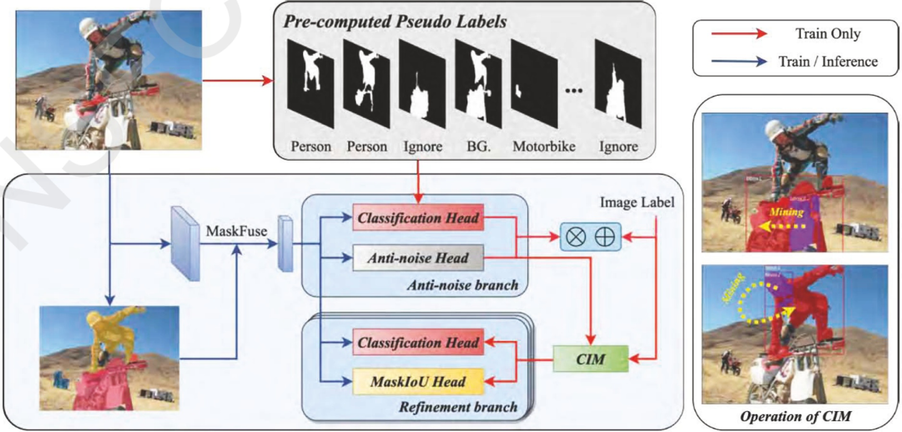

图1:基于完整实例挖掘的弱监督实例定位方法示意图

算法主要思想如下:由于植物图像叶片实例的空间分布密集，相互之间可能存在遮挡，弱监督实例分割算法在proposal提取时，可能产生大量冗余、低质量proposal，导致算法难以获得令人满意的性能。为此，我们提出了一种基于完整实例挖掘（Complete Instance Mining）的弱监督叶片实例定位算法，在弱监督实例分割网络中引入一种完整实例挖掘机制，即引入一个可学习模块对每个proposal完整性进行打分（CIM模块），然后根据得分挑选出部分高质量的proposal，赋予实例伪标签。在模型训练阶段，CIM模块与网络其它部分一起进行联合迭代优化。

叶片实例分类:该子任务主要是对给定空间边界的叶片实例进行分类，其主要挑战在于叶片类内差异较大导致模型泛化能力差。本项目研究并提出了一种基于相对特征偏移学习的小样本叶片实例分类算法，将小样本深度学习范式与开放集识别网络相结合，构建小样本叶片实例分类模型，并采用有效的训练策略，保证模型能够利用已有的其它带标注图像数据集辅助完成植物叶片分类任务，从而增强模型泛化能力。

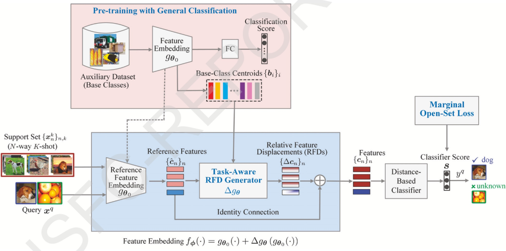

图2: 基于相对特征偏移学习的小样本实例分类方法示意图

算法主要思想如下:1）引入一种相对特征偏移量（Relative Feature Displacement，RFD）学习机制，即通过元学习（meta-learning）范式学习一个相对于预训练参考特征嵌入的特征偏移量（而不是直接学习特征嵌入），用于减少元学习中随机漂移带来的不利影响，增强模型的跨类别泛化能力；2）采用一种任务相关（task-aware）的方式进行RFD学习，同时采用一种间隔式开放集损失函数（Marginal Open-Set Loss）进行模型训练。

## ● 基于主导集优化的线状植物骨架结构重建

线状植物骨架结构重建任务包含两个主要子任务，即骨架线条检测和骨架拓扑结构重建，我们分别开展了相关研究。

骨架线条检测:该子任务主要挑战在于算法容易受噪声干扰。为此，本项目研究了一种基于形状先验假设的参数化结构检测方法，根据形状先验假设建立整体参数化目标函数，并通过优化算法求解最优参数，从而得到鲁棒的线条检测结果。

基本思想:对待检测对象的常见形状进行参数化先验假设，然后利用图像元素进行优化和拟合。具体地，假设χ={xi}ν=1为给定图像元素（如像素），θ = (xc, yc, φ, a, b)T为形状的参数化先验假设（这里以椭圆为例），i(θ) = (xi(θ), i(θ))T是根据参数模型对x的拟合，σ2 = |xi− i(θ)l²表示拟合误差，则形状线条提取问题可以表示为:

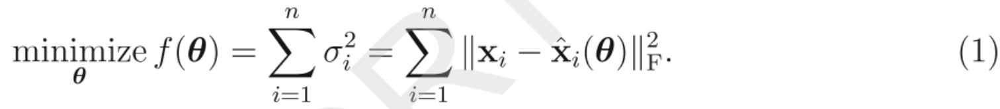

为了求取最优解，令z = (x1, y1, …., xn, yn) ∈ R2n×1，然后利用Gauss-Newton方法对上述的非线性优化问题进行迭代求解:

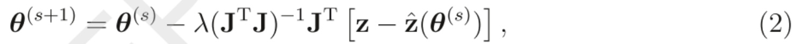

这里λ为步长参数，J∈ R2n×5为Jacobian矩阵，定义如下:

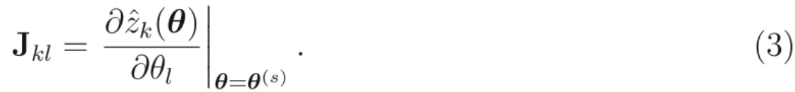

对于其他类型的常见形状，可基于相应的参数假设，采用相同方法进行迭代优化求解。在实际应用中，如果没有关于形状的先验信息，可以同时考虑多个常见的形状。

骨架拓扑结构重建:线状植物的每个分蘖可以表达为一个树形拓扑结构（tree-like topology) 。骨架拓扑结构重建子任务是提取植物的茎叶骨架线条，对属于同一个分蘖的线条进行组合，并表示为一个树形结构。在理想情况下，这个任务可以通过简单的图像线条追踪操作来完成。然而，我们的问题面临两个主要难点:1）本项目主要针对二维图像分析，植物成像是从三维物体到二维图像的投影，图像中会存在许多线条结构之间的交叉，在交叉点处的线条追踪会存在歧义性，很难通过局部决信息来解决，这是线状植物结构化分析的主要难点。特别地，随着植物生长，结构变得更加复杂，交叉现象会更严重；2）对于有些模态（如近红外），由于成像对比度差，线条元素提取会存在虚检或漏检，这也给结构分析造成困难。本项目研究并提出基于主导集优化的线状植物骨架结构重建方法，如图3。

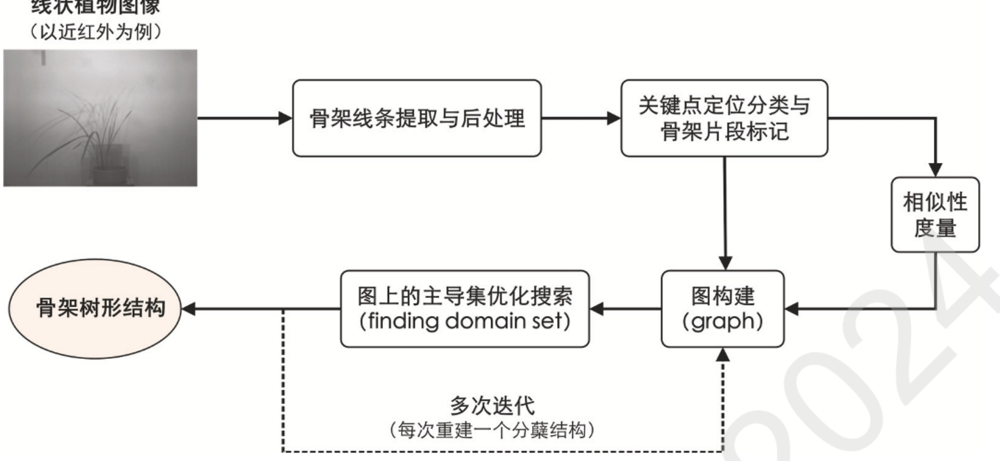

图3:基于主导集优化的骨架拓扑结构重建示意图

算法基本思想:利用植物骨架线条片段构建一个带权重的图（graph），将树型结构重建看作一个在图上寻找主导集（dominant set）的问题，并进行全局优化求解。大致流程如下:1）利用上述的图像骨架结构检测算法提取植物的骨架线条（并进行相应的后处理），我们采用DeepSkeleton方法实现；2）确定骨架线条上的关键点并进行分类。根据关键点的八邻域内邻近像素个数d，可以将关键点分成四种类型，即端点（d=1）、L型连接点（d=2）、T型连接点（d= 3）和X型连接点（d=4），将两个交叉点之间的骨架线条标记为连通骨架片段。注意交叉点及其类型是我们进行结构分析的关键信息；3）构建一个图G = (ν,ε,W)，其中节点ν= {1,..., n}为骨架线条片段，连接邻近的骨架线条片段（和一个共同的交叉点相连通）构成边ε = {(i, j) | i, j ∈ V}，为每条边赋一个权重，得到权重矩阵W = (wij)n×n, wij表示线条元素i和j之间的相似性（见后面具体描述）；3）在图G上搜索主导集，即可得到个树型结构，主导集搜索可转化为一个全局优化问题来求解；4）将当前主导集对应的节点从图G中移除，得到一个新图，重复步骤3），得到下一个树型结构。如此迭代，直至满足一定的停止条件。

对于上述图G=(ν,ε,W)，主导集S是节点集ν的一个子集，即S⊂ν，满足:S内的总相似度大于S与V\S（属于V但不属于S的节点集合）之间的总相似度。一个骨架树型结构看作是图上的一个主导集，通过不断地搜索主导集实现结构重建。具体地，引入变量x = [x1, ..., xn]，其中0 ≤ xi ≤ 1表示节点i ∈ ν属于主导集的概率大小。主导集搜索问题等价于如下的全局优化问题

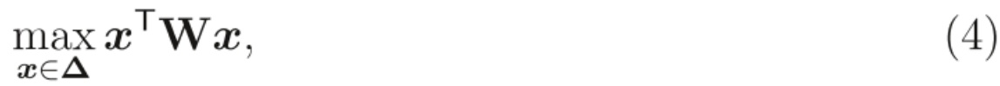

其中∆ = {x ∈ Rn×1|xi ≥ 0, ∑i=1 xi = 1}。利用Replictor Dynamics算法对式（4） 进行有效求解。在求解出最优解x\*之后，主导集可通过S={i|x>0}得到。

## ● 基于全局一致多图匹配的多模态植物结构对应

研究了多模态植物结构对应问题，提出了一种全局一致多图匹配方法，将全局一致多特征集对应的表示方法与基于核化的二图匹配相结合，建立全局一致多图匹配模型并进行求解。

对于同一个植物体，我们通过单模态结构化分析可以在每个模态上获取一个结构的集合（对于阔叶植物为实例分割得到的叶片实例集，而对于线状植物则为骨架结构重建得到的茎叶结构集）。多模态植物结构对应以多模态植物结构集{x}1（1≤k≤K表示第k个模态，Nk表示其结构的个数）为输入，基本任务是在这多个结构集之间建立对应关系，将属于同一物理实体的结构关联对应起来，输出为一组表示对应关系的置换矩阵{σ1,.…,σk}。

两个结构集之间的一一对应关系可以用一个置换矩阵（permutation matrix）σ表示（这里假设两个结构集大小相同，否则可以通过增加虚拟结构补齐的方式处理，下同）。如图4所示，对于K（K≥3)个结构集，我们假设存在另一个（虚拟）参考结构集，从它到结构集i的匹配为σi，那么对任意两个结构集从i到j的匹配可表示为σij = σ¯−1σj = σλ σj。因此，我们可以用置换矩阵{σ1, .., σK}表示这K个结构集之间的对应。很容易验证，这种表示方法具有全局一致性:σijσjk =(σ−¹σj)(σj1σk) = σi1(σjσj1)σk = σi1σk = σik.

为了进行两图匹配（假设图的节点为n），我们需要建立一个大小为n²×n²的二次代价矩阵K，其中Kaα',bb′表示第一个图的边(a,b)与第二个图的边(α′,b′)的匹配代价（也就是同时将a与a'、b与b′匹配的代价）。一般地，两图匹配可以表示为如下的二次分配问题:

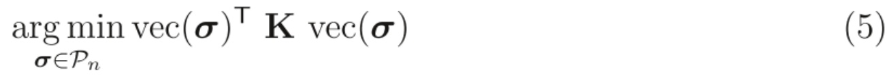

其中Pn表示n × n阶置换矩阵。

算法基本思想:上述两图匹配问题具有O(n4)复杂度，很难在实际问题中应用。我们采用一种核化图匹配方法（kernelized graph matching，NeurIPS 2019），将图的节点和边映射到一个再生核希尔伯特空间，则两个图之间的“节点-节点”和“边-边”匹配代价都可以用该空间的内积表示，从而可以将式（5）的O(n4)复杂度降低为O(n²)。具体地，假设ψ1，ψ²∈Hrn分别是两个图的边在空间Hκ中的映射，则式（5）的两图匹配问题可以等价地表示为

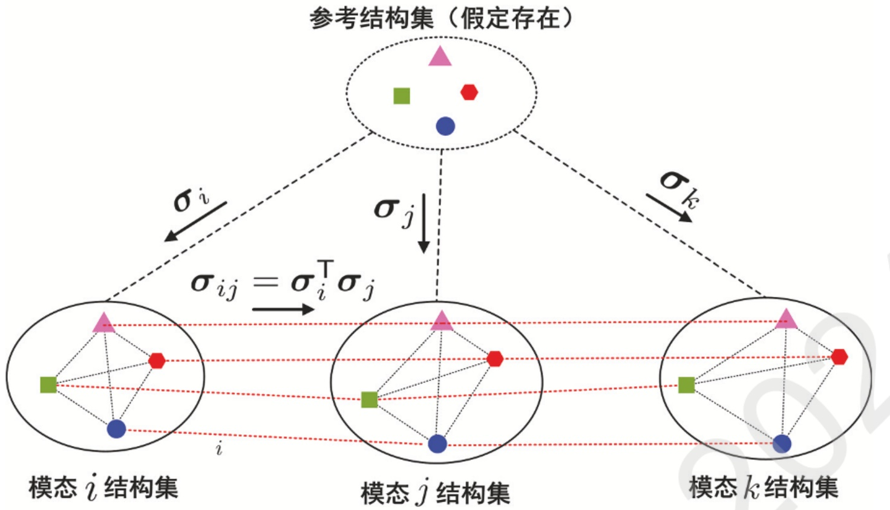

图 4: 全局一致多图匹配示意图

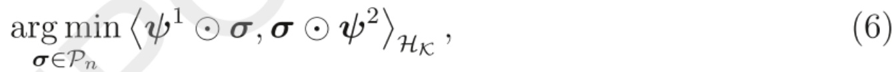

这里(·，·)κ表示空间Hκ上的内积运算（与匹配代价对应），表示空间Hκ上的如下运算符:ψx ∈ Hκxn， σ ∈ Rn×n, [ψX O σ]ij = ∑k=1 ψk σkj ∈ Hκ, [σ O ψY]ij = ∑k=1σikψγj∈Hk。式（6）的优化问题可以很方便地用凸松弛或PATH算法解决，计算过程具有O(n²)复杂度。

本项目将两图核化匹配方法与全局一致多结构集对应的表示方法相结合，提出一种基于核化的全局一致多图匹配方法。具体地，对于K(K≥3)个不同模态的结构集，我们分别在每个结构集i上构建图，并将边映射到希尔伯特空间Hκ，得到矩阵ψi∈Hxn，则求解这K个图之间的全局一致匹配{σ1,.., σκ}可表示为:

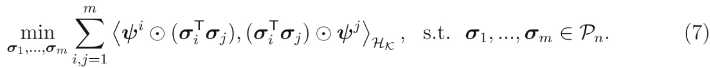

采用Gauss-Seidel迭代方法对对式（7）进行求解。

## ● 多模态植物图像视觉协同显著性分析

多模态植物图像视觉协同显著性分析问题可定义如下:给定单模态结构化分析所获取的候选结构集{(xk,Tνk}1，其中1 ≤ k ≤ K表示第k个模态，Nk表示其结构数量，x是第k个模态中的第i个结构，T是与之对应的模态内显著性，同时给定这K