## 项目摘要

## 中文摘要:

植物基因组含有大量的组织特异性调控序列，其变异将直接影响相关基因的转录水平。虽然传统的GWAS分析能够确定表型与基因型的相关性，但是对于新出现的突变的影响无能为力。因此，本项目拟开发生物信息学算法对作物（水稻）基因组调控序列突变的影响进行预测，并在作物育种种进行应用。首先，通过文献搜索的方法检索已发表的有关水稻的ATAC-Seq测序等技术得到的染色质开发区域数据，建立起高可信度的数据集，通过序列分析，探索调控序列区域的序列特征；然后采用深度学习算法整合特征建立模型，通过交叉验证和独立测试等方法测试算法的性能，并采用文献中调控序列突变的案例对算法进一步检验；最后采用模拟突变的方法对感兴趣的性状基因的调控序列进行模拟突变，筛选有利突变类型，通过基因编辑技术编辑目标序列。项目的实施能够快速、准确、 有效地对调控序列突变的影响进行预测，为作物育种工作提供新的思路。

## Abstract:

Plant genomes contain a large number of tissue-specific regulatory sequences whose variation will directly affect the transcription level of related genes. Although GWAS analysis was able to determine phenotypic and genotypic associations, it was unable to determine the impact of emerging mutations. Thus, in this project we will develop a bioinformatics method to predict the effect of regulatory variation in crops (rice) and apply the developed method in crop breeding. At first, we will build a high confidence dataset by searching literatures about ATAC-Seq in rice and explore the sequence characteristics of these sequences. Then, we will build a model to predict the effect of regulatory variant by using the deep learning algorithm with the sequence features. The performance of our method will be assessed through cross-validation, independent test and the experimental verified cases of regulatory variants. At last, we will screen the regulatory sequence of interested gene with positive effect by using in silico mutagenesis strategy and edit the target region into the simulated sequence. The implementation of the project can quickly, accurately and effectively predict the impact of regulatory variants effect, and provide a new idea for crop breeding.

关键词（用分号分开）:深度学习；表型预测；非编码；调控序列；突变影响预测

Keywords (separated by;): deep learning; phenotypic prediction; noncoding; regulatory sequences; mutation effect prediction

## 结题摘要

中文摘要（对项目的背景、主要研究内容、重要结果、关键数据及其科学意义等做简单概述）:

高等真核生物基因组非编码区域含有大量的组织特异性的调控序列，反式作用因子通过与调控原件的结合来控制特定细胞类型的基因转录，而调控原件序列变异将直接影响相关基因的转录水平。虽然各类因素包括转录因子，组蛋白修饰、DNA甲基化以及核小体重塑等因素都能够调控基因的转录，但是这些因素的作用都是通过控制染色质开放状态来实现的。本项目中，我们按照项目计划完成了水稻（日本晴）多个时期染色质可及性的取样和测序、成功开发了对水稻染色质可及性进行预测的算法模块和分子设计算法模块。为了验证算法的有效性，采用大片段基因编辑技术在水稻中按照设计的序列进行编辑。由于需要实现大片段的替换编辑，我们比较了3种Prime editing (PE) 基因编辑技术在实现大片段替换的效果并优化了PE编辑技术，从而实现在水稻中进行大片段的同源替换。选取5个具有代表性的基因使用所开发的算法对基因的启动子序列进行设计，计划每个基因设计多个突变型，采用TJ-PE基因编辑技术获取到突变体（T1代）。初步的表型鉴定和表达量定量表明，设计的序列能够提高基因的表达水平。其中，抗除草剂、耐盐和抗旱基因中均具有显著表型。项目的顺利进行，为传统育种提供了新的思路，加速了育种进程，为实现智能分子设计育种奠定了基础。

# Abstract (Brief description of research background, main methods, contributions, and research data):

In higher eukaryotes, the non-coding regions of the genome contain a vast number of tissue-specific regulatory sequences. Trans-acting factors control cell-type-specific gene transcription by binding to these cis-regulatory elements, and sequence variations within these elements can directly influence the transcription levels of associated genes. Although multiple factors—including transcription factors, histone modifications, DNA methylation, and nucleosome remodeling—contribute to the regulation of gene transcription, their effects are ultimately mediated through the modulation of chromatin open states. In this project we successfully completed the sampling and sequencing of chromatin accessibility across multiple developmental stages of rice (Oryza sativa ssp. japonica cv. Nipponbare) according to the project plan. We developed a predictive algorithm for rice chromatin accessibility and a molecular design module. To validate the algorithm's effectiveness, we applied large-fragment gene editing techniques to introduce designed sequences into the rice genome. Since large-fragment replacement was required, we compared the efficiency of three Prime Editing (PE) systems for making large-fragment substitutions and subsequently optimized PE technology to achieve homologous replacement of large DNA segments in rice. We selected five representative genes and used our algorithm to design multiple mutant versions of each gene's promoter region. Using an optimized TJ-PE editing system, we obtained the corresponding mutant lines (T1 generation). Preliminary phenotyping and expression quantification indicated that the designed sequences enhanced gene expression levels. Notably, mutants of herbicide-tolerance, salt-tolerance, and drought-tolerance genes all exhibited significant phenotypic improvements. The successful implementation of this project offers a new strategy for traditional breeding, accelerates the breeding process, and establishes a foundation for intelligent molecular design breeding.

关键词（用分号分开）:深度学习；突变影响预测；分子设计育种；非编码；分子设计

Keywords (separated by;): deep learning; mutation effect prediction; molecular design breeding; nocoding; molecular design

## 正文

《结题/成果报告》正文分为两个部分:结题部分和成果部分。请按照《结题/成果报告》填报说明及撰写要求填写。

## (一）结题部分

## 1. 研究计划执行情况概述。

（1）按计划执行情况。

按照项目计划完成了水稻（日本晴）多个时期染色质可及性的取样和测序、完成了水稻染色质可及性预测算法模块以及分子设计算法模块的开发、优化了Prime editing (PE)基因编辑技术，实现在水稻中进行大片段的同源替换、选取5个具有代表性的基因使用所开发的算法对基因的启动子序列进行优化设计，每个基因设计10个突变型，采用TJ-PE基因编辑技术获取到突变体（T₁代）并进行表型鉴定，检测设计算法的可靠性以及研究方案的可行性。研究内容与计划内容基本一致。

## （2）研究目标完成情况。

针对目前对植物基因组非编码区域研究相对滞后的情况，采用深度学习整合染色质开放性数据开发了能够对水稻基因组非编码区域突变功能预测的算法；在此基础上开发了针对水稻非编启动子区域进行功能增强的序列设计优化算法iSequenceDesign；选取 5 个控制水稻优良性状的主效基因使用 iSequenceDesign对其启动子区域进行优化设计改造；通过基因编辑实验获取到T1代突变体并进行表型鉴定，初步结果表明，iSequenceDesign设计的序列能够实现基因的功能增强， 并能够影响水稻的表型；发表SCI论文5篇，授权发明专利1项；培养研究生5名，其中毕业博士生1名，毕业硕士生2名，在读博士生1名和在读硕士生1名，基本完成项目约定目标。

## 2. 研究工作主要进展、结果和影响。

（1）主要研究内容。

## 1）染色质开放性预测算法开发和分子设计算法模块的开发

本研究通过整合已公开的水稻ATAC-seq数据以及本课题组通过实验获得的ATAC-seq数据，构建水稻染色质可及性预测模型。在数据准备阶段，以已知的染色质开放区域作为正样本，在基因组中随机选取等量区域作为负样本，在此基础上开发针对水稻染色质可及性的预测算法，并系统评估模型的性能。进一步地，将基于模型的评分机制，开发能够对DNA序列进行理性设计的算法模块，从而明确水稻染色质可及性区域的序列特征，并依据该特征对启动子等调控序列进行设计，最终实现作物表型的精准控制与功能增强。

## 2）常规 PE、GRAND editing 及 TJ-PE 介导大片段替换的效率与精准度评估

本研究通过计算得到的突变信息，首先在这些突变位点中选取 3-6 个位点构建了常规 PE、GRAND editing 及 TJ-PE 三种策略的编辑载体；随后 通过农杆菌介导法转化水稻愈伤组织，获得了转基因植株。通过对转基因植株幼苗进行sanger测序与分子鉴定，系统比较三种方法在同源替换方面的编辑效率（尤其是对>50bp片段的替换能力）和编辑精准度上的差异，并从三种方法中选取一种精准高效的方法开展后续实验，系统的评价了三种编辑策略在水稻中进行大片段替换的效果，明确了 TJ-PE 在水稻中操控同源替换的效率优于常规 PE 和 GRAND editing。

## 3）TJ-PE可以在水稻中实现数百碱基对的等长同源替换

采用 TJ-PE 技术，我们针对计算筛选出的水稻 CBF1、AGO2 及 SKC1 启动子区共16个位点（突变序列范围5-50bp）进行目标编辑。由于这些目标编辑区域（5-50 bp）附近的±20 bp 范围内缺乏合适 Cas9靶位点，我们采用了较远端PE nCas9 靶位点的 TJ-PE 策略，设计了 75-275 bp 等长片段同源替换的编辑系统。

## 4）T1代编辑确认与表型分析

为探究TJ-PE系统介导的精准编辑能否稳定遗传至后代，我们对成功编辑的To代植株进行了自交繁殖，从每个独立编辑实验中选取了2-8株经测序验证的精确编辑T₀代植株（涵盖纯合、杂合及嵌合基因型），收获其自交种子，获得T₁代群体。通过对T1代植株进行靶向区域的PCR扩增与 Sanger测序分析，我们系统评估了不同位点编辑事件的遗传分离情况与传递稳定性，进而分析了TJ-PE所创制变异的可遗传性。对于T₁代纯合植株，我们进一步进行了初步表型分析，并比较其与野生型是否存在差异，以验证相关计算预测算法的可行性。

（2）取得的主要研究进展、重要结果、关键数据等及其科学意义或应用前景。

## 1）iSequenceDesign分子序列设计算法的开发

收集水稻生长不同时期的组织包括根、叶片、分蘖部位、孕穗(小)、拔节期茎、花期籽粒、灌浆中期和灌浆末期籽粒的组织样品，采用液氮速冻，送公司进行 ATAC-seq 测序；同时收集公共数据库（GEO）中粳稻的 ATAC-seq 测序数据。利用 nf-core 中处理 ATAC-seq 的流程对原始测序数据进行处理，参考基因组采用IRGSP-1.0（https://rapdb.dna.affrc.go.jp/download/irgsp1.html?version=2022-09-01）；提取染色质的可及性区域，把染色质可及性区域序列切割为长度为300bp的片段构建正样本数据集，在基因组中随机选择相应长度的基因组片段构建负样本数据集，共得到134,870条正本本，正负样本的比例为1:

采用BERT模型框架作为预测模型的主框架，训练染色质可及性预测模型分为两步:第一步，采用日本晴基因组数据对模型进行预训练，训练方式采用随机遮蔽序列中15%的碱基进行自监督训练。第 步，加载预训练的权重，把BERT模型的 dense layer 换成采用 3 层卷积神经元网络的架构，采用上述得到的正负样本进行训练得到分类模型。该模型能够对输入序列的染色质可及性进行预测，预测模型的 AUROC 值能够达到 0.91，Accuracy=83%，结果如图1 所示:

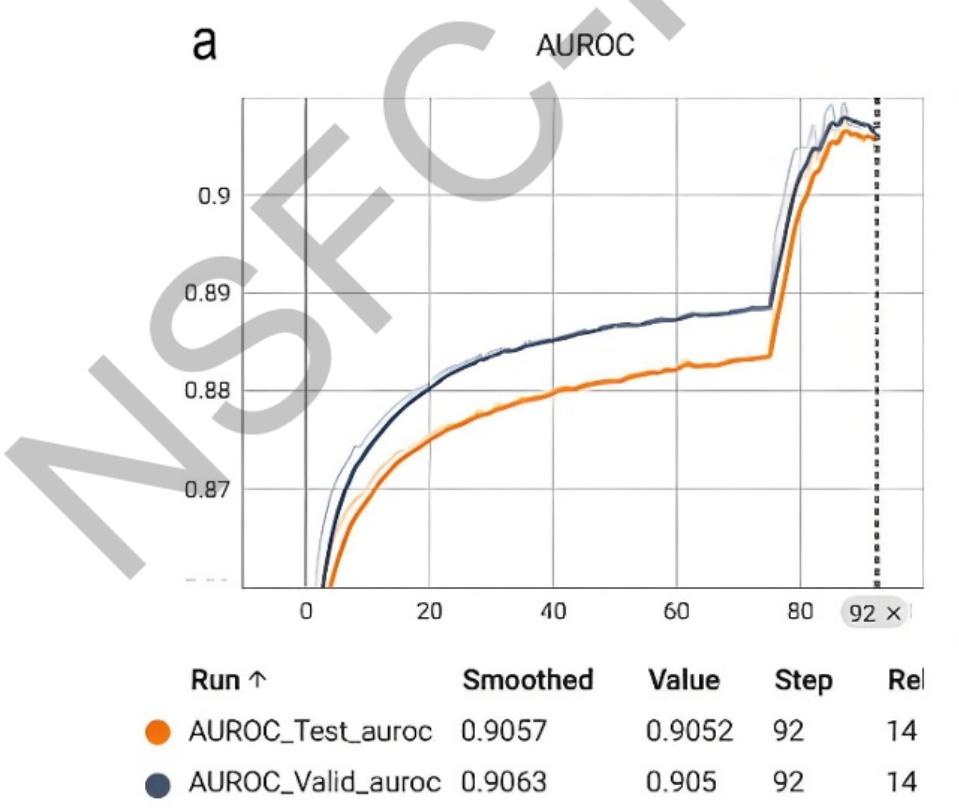

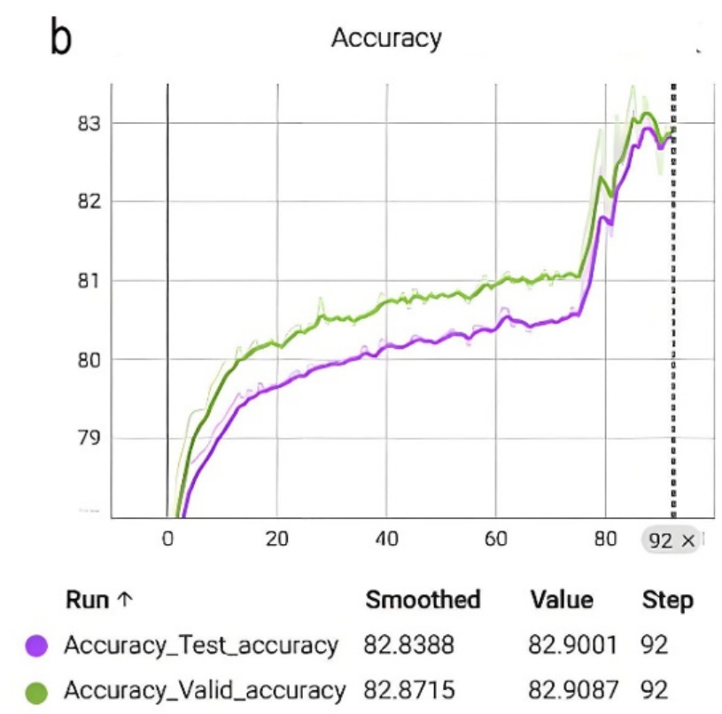

图 1 染色质可及性分类模型性能表现:（a）x 轴为训练的 step，y 轴为 AUROC 值，（b）x 轴为训练的 step，y 轴为 Accuracy 值。

根据所开发的分类模型对引入突变进行打分，用来衡量引入突变对可及性的影响。单个突变的效果可能不明显，因此考虑引入多个突变，对引入的突变所产生的效果使用分类模型进行打分评估，开发出可以对序列进行设计的算法模块，并命名为iSequenceDesign。iSequenceDesign接受核酸序列作为输入，并给出推荐的突变序列，评价突变序列的效果，如图2所示:

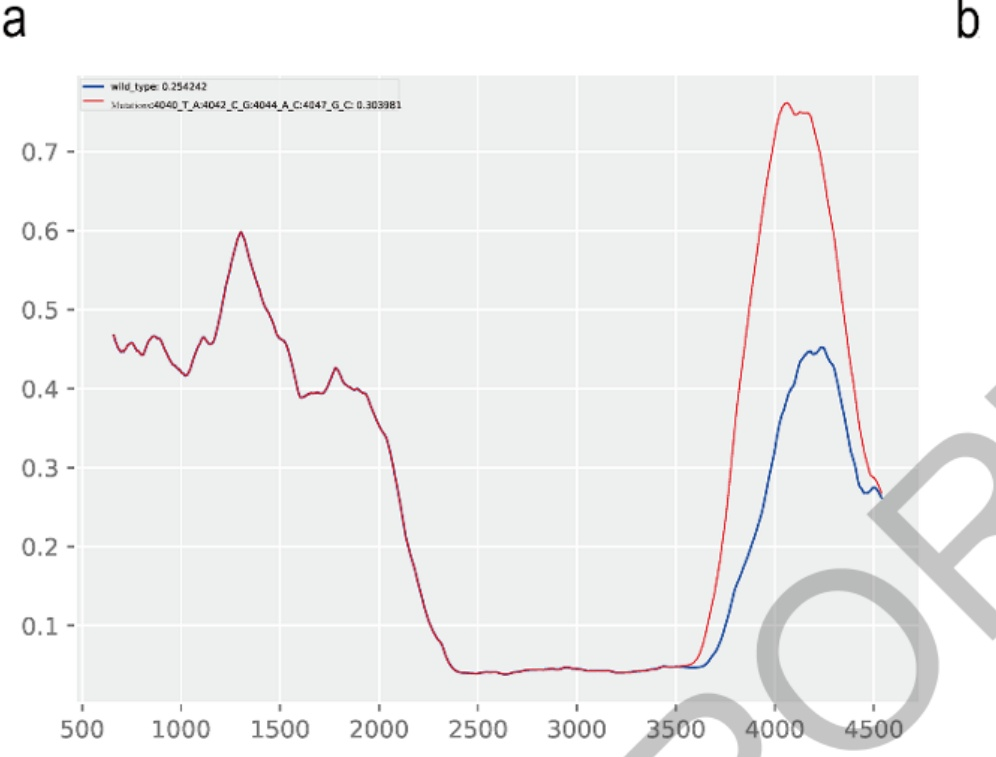

b

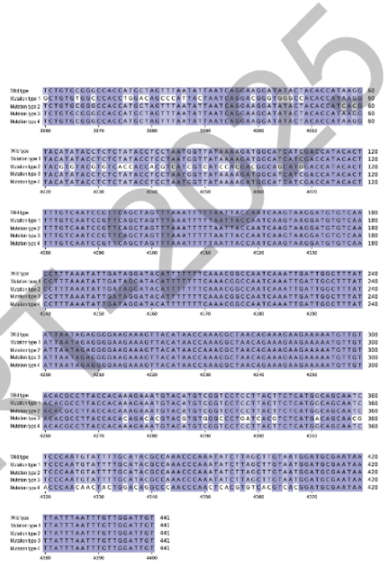

图2 iSequenceDesign设计得到的突变序列:（a）野生型（蓝色）和突变型（红色）序列的染色质可及性状态；（b）iSequenceDesign设计得到的突变序列。

选取5个基因作为候选基因，提取其起始密码子上游2000-bp的序列。对于每个序列，使用 iSequenceDesign 设计突变序列，采用 PE 基因编辑技术进行编辑，获得突变体。5个基因表型包含增产、抗逆等性状，基因名称分别为:LG3、CYP72A31、SKC1、AGO2 及 CBF1。

## 2） TJ-PE 在水稻中操控同源替换的效率优于常规 PE 和 GRAND editing

为增强水稻中LG3、CYP72A31、SKC1、AGO2及CBF1基因的表达，我们采用iSequenceDesign设计了这些基因启动子区域，每个基因都设计10个突变类型。由于部分突变的编辑没有成功，最终总共获得22个片段（5-58bp）的序列变异（图3）。我们尝试利用PrimeEditing（PE）将计算得到的突变精准引入基因组。然而，由于待编辑片段较大，且因为这22个基因组位点附近缺乏合适的PE nCas9靶点（指具有≥40% GC含量的特异性SpCas9靶点），突变信息的引入面临着严峻挑战。为引入这些突变，我们测试了三种PE策略:常规PE、GRAND editing 及 TJ-PE。本研究所有 PE 实验中均采用了优化型 ePPEplus 及带有 95-nt支架结构的 epegRNA(3’端带有 tevepreQ1 的 pegRNA)。实验中优化型 ePPEplus及 epegRNA的表达分别由玉米泛素（ZmUBI）启动子和 eCmYLCV启动子（35S增强子-CmYLCV启动子）驱动。鉴于近期报道显示 Csy4PS 辅助的pegRNA表达可在水稻中实现TJ-PE介导的数百碱基对靶向插入，本研究所有PE实验均采用 Csy4PS 辅助 epegRNA 的表达。

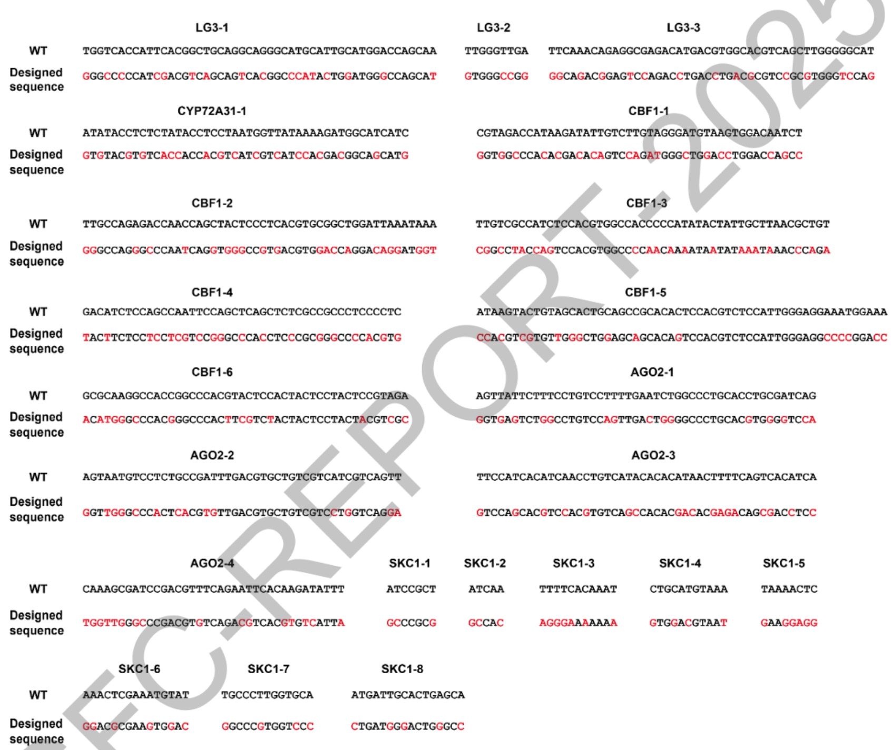

图3 突变序列信息

我们对六个基因组位点进行了常规PrimeEditing（PE）检测，分别将所需编辑安装于 LG3启动子的 LG3-1、LG3-2和 LG3-3 位点，CBF1 启动子的 CBF1-5和 CBF1-6 位点，以及 CYP72A31启动子的 CYP72A31-1位点（图3，载体构建详见图4a）。各Cas9切口位点（PEnCas9靶点）至编辑位点的距离分别为:LG3-1（18 bp）、LG3-2（30 bp）、LG3-3（27 bp）、CBF1-5（7 bp）、CBF1-6（13 bp）和CYP72A31-1（8 bp）（详见图4b）。在常规PE实验中，我们针对上述Cas9 靶点分别设计了相应长度的 epegRNA，分别携带 88 nt、51 nt、93 nt、91 nt、

76 nt和74 nt的编辑模板，旨在实现LG3-1（50 bp）、LG3-2（9 bp）、LG3-3（46 bp）、CBF1-5（58 bp）、CBF1-6（46 bp）和CYP72A31-1（46 bp）的编辑（详见图4b）。

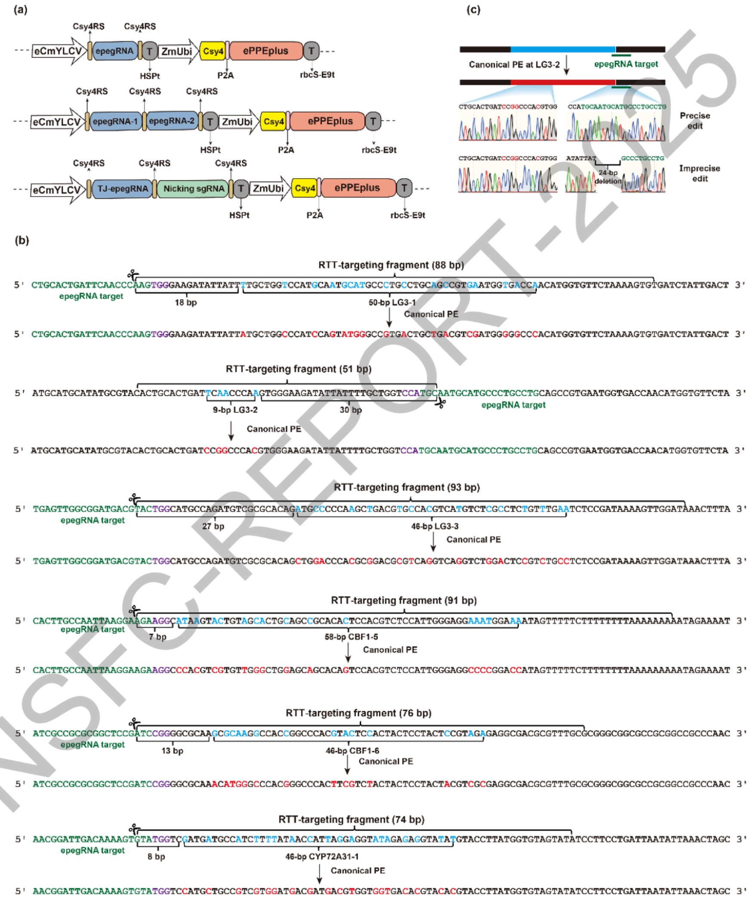

图 4 编辑系统构建:(a) 常规 PE, GRAND editing 和 TJ-PE 三种策略载体连接图；(b) 常规PE 在 LG3-1, LG3-2, LG3-3, CBF1-5, CBF1-6 和 CYP72A31-1 的 epegRNA 靶向基因组序列模式图；(c) T₀代转基因植株中，LG3-1 位点经常规 PE 编辑后的测序峰图。

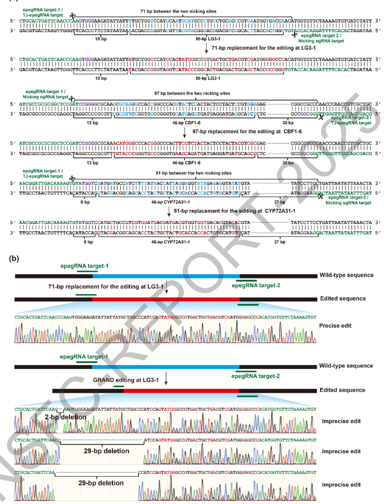

图 5 靶位点信息:(a) GRAND editing / TJ-PE 在 LG3-1, CBF1-6 和 CYP72A31-1 的 epegRNA /TJ-epegRNA 靶向基因组序列模式图；(b) T₀ 代转基因植株中，LG3-1 位点经 GRAND editing编辑后的测序峰图。

为在LG3-1、CBF1-6 及 CYP72A31-1位点（图3）实现目标编辑，采用了TJ-PE 策略。TJ-PE 所使用的 nCas9 靶位点与上述 GRAND editing 中的 nCas9 靶位点相同（图5a，载体构建见图4a）。结果显示，TJ-PE策略在T₀代转基因植株中表现出高效的编辑能力。在LG3-1、CBF1-6和CYP72A31-1，TJ-PE的精准替换效率分别达到72.9%、68.3%和92.3%（表1，图6a,c）。尤为重要的是，在成功编辑的T₀代幼苗中，纯合精准编辑植株达到51.9%-60.4%（图6b）。在YP72A31-1位点TJ-PE靶向区域检测中未检测到编辑副产物（表1）。而在LG3-1 和 CBF1-6 位点的 TJ-PE 靶向区域中，我们检测到部分编辑副产物。 这些副产物源于 TJ-epegRNA 靶点处的非精准连接，或 Nicking sgRNA 靶点处的小片段插入/缺失（图6d，e）。为了量化编辑精准度，我们将其定义为精确编辑事件次数与PE靶向区域检测到的总编辑事件数的比值。LG3-1、 CBF1-6 和 CYP72A31-1的 TJ-PE编辑精准度分别为 87.7%、88.4%和 100.0%（见表 表明 TJ-PE 介导的同源替换具有高精准度。上述结果表明，TJ-PE能够介导数十个碱基对的精准高效等长同源替换。

表2 TJ-PE 介导的16 个位点等长同源替换的效率和精确度

```
          Size of the  Total number  Number of  Frequency of  Number of    Frequency of    Editing
Target   to-be-replaced of To transgenic edited    edited    To plants with To plants with precision
           fragment       plants     To plants    To plants   precise edit  precise edit
CBF1-1      199 bp         38           6      15.8% (6/38)       5        13.2% (5/38)   62.5% (5/8)
CBF1-2      113 bp         51           23     45.1% (23/51)     20        39.2% (20/51) 77.8% (28/36)
CBF1-3      89 bp          35          16      45.7% (16/35)     12        34.3% (12/35) 64.3% (18/28)
CBF1-4      158 bp         53          29      54.7% (29/53)     24        45.3% (24/53) 69.8% (30/43)
AGO2-1      108 bp         73          35      47.9% (35/73)     31        42.5% (31/73) 71.7% (38/53)
AGO2-2      109 bp        32           22      68.8% (22/32)     20        62.5% (20/32) 85.4% (35/41)
AGO2-3      148 bp         56          23      41.1% (23/56)     21        37.5% (21/56) 87.1% (27/31)
AGO2-4      165 bp         40          27      67.5% (27/40)     24        60.0% (24/40) 67.5% (27/40)
SKC1-1      75bp           60          36      60.0% (36/60)     33        55.0% (33/60) 72.7% (40/55)
SKC1-2      78 bp          40           22     55.0% (22/40)     21        52.5% (21/40) 92.9% (26/28)
SKC1-3      221 bp         80           8      10.0% (8/80)       8        10.0% (8/80)   100.0% (8/8)
SKC1-4      221 bp         40          24      60.0% (24/40)     22        55.0% (22/40) 78.7% (37/47)
SKC1-5      221 bp         60           51     85.0% (51/60)     43        71.7% (43/60) 74.7% (65/87)
SKC1-6      221 bp         48          36      75.0% (36/48)     36        75.0% (36/48) 100.0% (60/60)
SKC1-7      275 bp         43           5       11.6% (5/43)      5        11.6% (5/43)   100.0% (5/5)
SKC1-8      275 bp         74          37      50.0% (37/74)     37        50.0% (37/74) 100.0% (37/37)
```

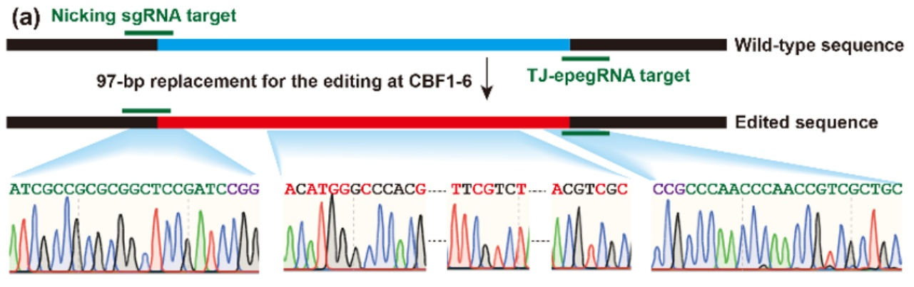

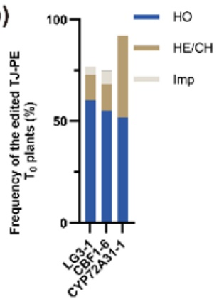

(c)

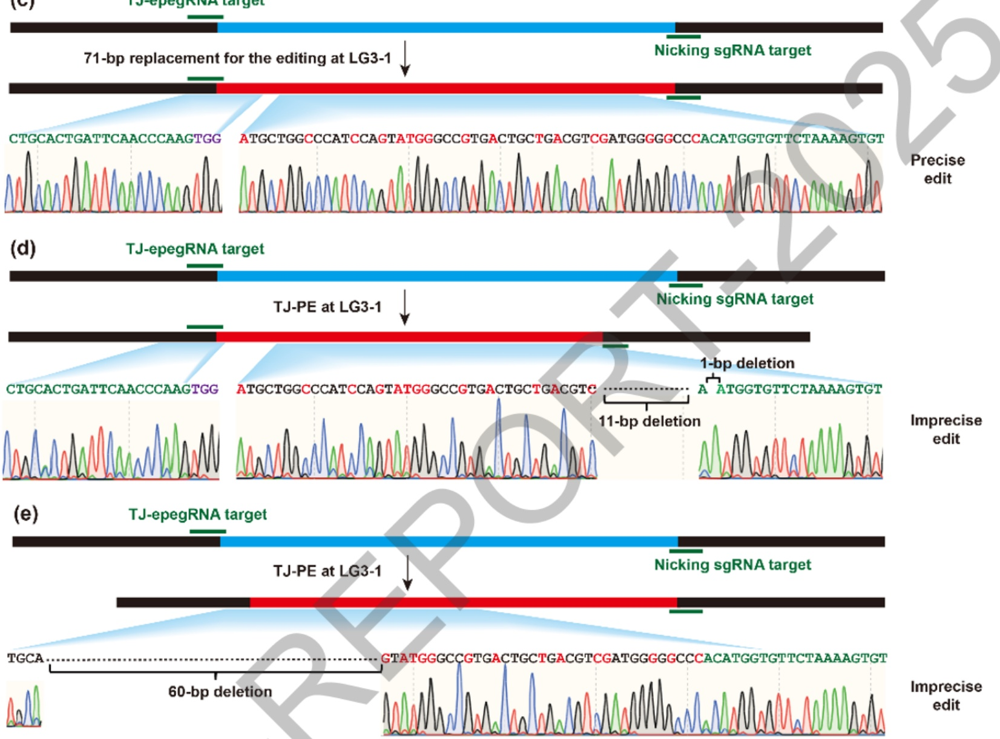

图 6 TJ-PE 在LG3-1、CBF1-6 和 CYP72A31-1 位点介导等长同源替换:(a) T₀ 代转基因植株中，TJ-PE 在 CBF1-6 位点的精准编辑植株测序峰图；(b) T₀ 代转基因植株中，在 LG3-1, CBF1-6和CYP72A31-1位点TJ-PE靶向区域的不同编辑类型植株的占比，HO，纯合；HE/CH,杂合或嵌 Imp，非精准编辑。(c) LG3-1 位点经 TJ-PE 靶向 71-bp 精准编辑的测序峰图；(d) (e)LG3-1 位点经 TJ-PE 靶向区域的非精准编辑测序峰图。

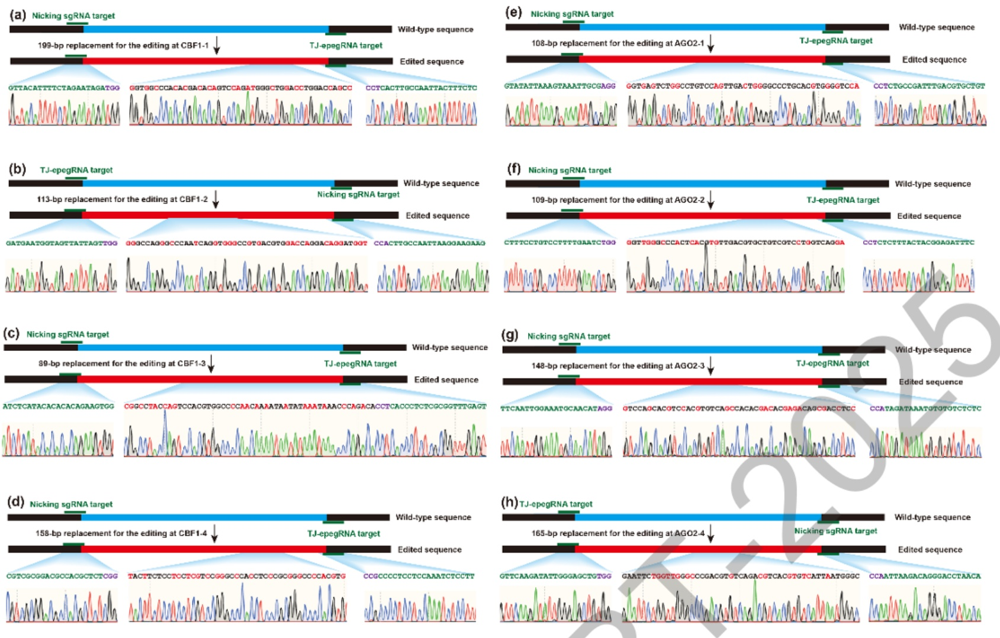

图 8 TJ-PE 介导的 8 个基因组片段（88-199 bp）等长同源替换精准编辑测序峰图。(a-h) T0代转基因植株中，在 CBF1-1 (a)、CBF1-2(b)、 CBF1-3(c)、CBF1-4(d)、AGO-1(e)、AGO-2(f)、AGO-3(g)和AGO-4(h) TJ-PE靶向区域检测到的精准编辑的测序峰图。

为了在 CBF1和AGO2启动子处八个基因组位点(CBF1-1\~CBF1-4和 AGO2-1\~AGO2-4,37-50 bp）安装所需的编辑，采用 TJ-PE 策略以实现两个 TJ-PE 切口位点之间 89-199 bp 片段的等长同源替换。在 8 个基因组位点的 TJ-PE 介导的 To转基因植株中检测到精准编辑效率达到13.2%-62.5%（见表2，图8a-h）。此外，这8个基因组位点中的 7 个位点 T₀ TJ-PE 转基因植株(CBF1-2\~CBF1-4 和 AGO2-1\~AGO2-4）中检测到纯合精准编辑效率为7.5%-46.9%（见图7a）

在 SKC1 启动子的八个基因组位点(SKC1-1至 SKC1-8,编辑范围5-16bp)，我们利用 TJ-PE技术，成功实现了 75-275 bp片段的等长同源替换（TJ-PE两个切口点之间）。在SKC1启动子的八个位点中，T₀代TJ-PE转基因植株的精准编辑效率为10.0%-75.0%（表2，图7b，c，图9a-f）。此外，在SKC1启动子的五个位点中（包括 SKC1-1、SKC1-2、SKC1-4、SKC1-5和 SKC1-6）的T₀代TJ-PE转基因植株中，纯合精准编辑植株的比例为11.7%至50.0%。（见图7a）。

为评估启动子优化对水稻耐盐性的影响，我们对LG3-1、SKC1-1\~SKC1-8、CBF1-2\~CBF1-4、CBF1-6及 AGO1-1\~AGO1-2位点的纯合编辑株系进行了盐胁迫分析。经150 mM NaC1处理 3天并恢复培养20天后，发现 SKC1-1、SKC1-5、SKC1-8、AGO2-1及CBF1-2位点的优化株系存活率高于野生型；而其余位点的优化株系，其存活率略低于或与野生型无明显差异（图11）。

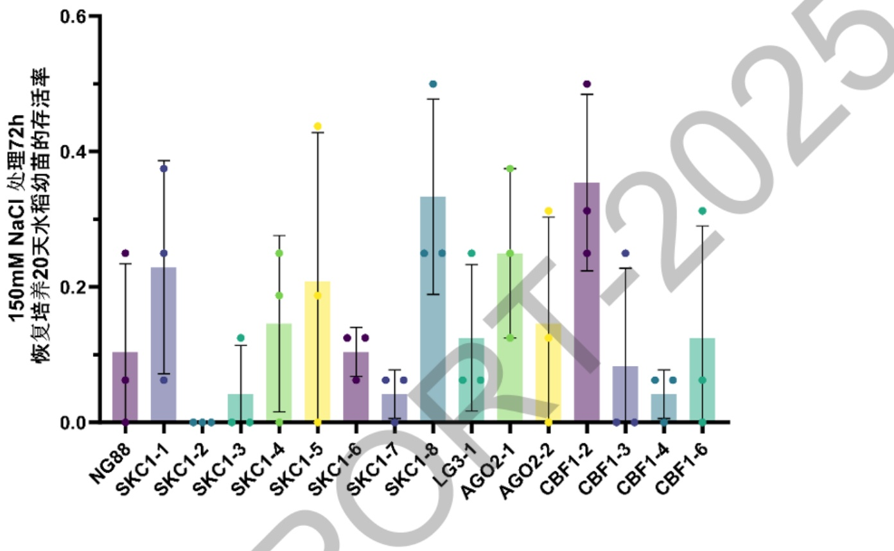

图 11. 150mM NaC1 处理 72h 恢复培养 20 天水稻幼苗的存活率

通过对LG3、CYP72A31、SKC1、CBF1及 AGO1 启动子区的16 个位点优化的T1代纯合植株进行初步表型分析，结果表明:基于计算设计的启动子优化策略在不同基因中展现出差异化的调控效应。CYP72A31-1位点的优化成功驱动了该基因的表达上调（约2.4倍），并增强了植株对双草醚的除草剂抗性；在耐盐性方面，SKC1-1、SKC1-5、SKC1-8、AGO2-1 及 CBF1-2 等位点的优化使植株在150mMNaC1胁迫下表现出更高的存活率。综合来看，本研究初步验证了计算预测的可行性，并为通过启动子工程定向改良水稻抗逆与农艺性状提供了关键证据与材料基础。

## 3. 研究人员的合作与分工。

陈震主持本项目，负责项目分子设计算法模块的开发及总体指导工作，孙红正负责算法的性能评价工作，任浩然负责公共数据的收集和处理工作，秦兆辉负责染色质开放性预测算法的开发工作，刘慧霞负责PE工具的优化工作、刘慧霞和张振飞负责候选基因的、编辑、转化、测序和表型的鉴定工作，齐德