项目批准号 42175194申请代码 D0514归口管理部门收件日期

20250142175194

# 国家自然科学基金

# 资助项目结题/成果报告

资助类别:面上项目

亚类说明:

附注说明:

项目名称:基于大数据的农业气象灾害监测及预警关键技术研究

负责人:张新厂

BRID: 08651.00.39018

电子邮件: xinzc@nuist.edu.cn

电话: 025-58699807

依托单位: 南京信息工程大学

联系人: 刘竹青

电话: 025-58731154

直接费用:58.0000（万元）

执行年限: 2022.01-2025.12

填表日期:2026年01月16日

国家自然科学基金委员会制（2025年）

## 项目摘要

## 中文摘要:

粮食安全是国家安全最重要的组成部分，但农业生产受气象灾害影响显著。对农业气象多源异构数据做融合、关联和预测分析，因地制宜选择农作物，减少灾害损失，对提升农作物生产质量，有着极为重要的意义。本项目主要研究“智慧农业”中的气象农业大数据关键技术问题，首先解决农业气象多源大数据采集与存储管理问题，提出面向主题的数据收集与异构时空数据融合方法，将多源农业气象数据组装为数据立方体；其次，解决基于时空的极端天气与农灾关联分析问题，提出混合式极端天气聚类方法，明确协同出现的天气类型；提出层次型灰色关联模型，分析农灾与天气间的相关性；基于关联关系，解决气象农灾预测问题，即通过选择影响天气情况的关键因子，从时空角度预测农灾发生的可能性。最后，解决基于给定气象农灾资料的灾后作物产值预估问题，通过构建随收成季推移的产值评估模型，并向模型融入多灾种协同作用机制，有效提升作物产值预估精度

## Abstract:

Food security is the most important part of national security, but agricultural production is affected by meteorological disasters. It is of great significance to integrate, correlate and forecast the multi-source heterogeneous data of agricultural meteorology, so that the selecting crops according to local conditions can be beneficial to reducing disaster. This project mainly aims at studying the meteorological agriculture big data in the field of "smart agriculture". First, it solves the problem of collecting and storing agricultural meteorological multi-source big data, and proposes a subject-oriented data collection and heterogeneous spatial-temporal data fusion method, organizing the multi-source agricultural meteorological data as data cube. Second, based on time and space, correlation analysis of extreme weather and agricultural disaster is conducted by proposing a hybrid extreme weather clustering model to clarify the types of weather with co-occurrence. In addition, a hierarchical grey correlation model is also proposed to analyze the correlation between agricultural disasters and weather. Third, based on the above correlation relationship, the possibility of agricultural disaster occurrence is predicted from the perspective of time and space by selecting the key factors affecting the weather, in terms of meteorological-agricultural disaster forecasting. Finally, in order to solve the problem of crop output value estimation based on the given meteorological and agricultural disaster data, an evaluation model, which can observe the process of the harvest season vanishing, is proposed. Moreover, the multi-disaster cooperative mechanism is also incorporated into the evaluation model to enhance the prediction accuracy of crop output value.

关键词（用分号分开）:气象大数据；智慧农业；气象灾害；深度学习；

Keywords (separated by;): Meteorological bigdata; Smart Agriculture; Meteorology disaster; deep learning;

## 结题摘要

## 中文摘要（对项目的背景、主要研究内容、重要结果、关键数据及其科学意义等做简单概述）:

本研究面向智慧农业背景下农业与气象数据融合不足的瓶颈，聚焦延伸期气象预报困难与农业灾害预测不准的挑战，旨在开展基于大数据的农业气象灾害预测及影响关键技术研究。项目通过构建多源异构农业气象大数据采集与融合架构，系统获取并整合气象、遥感、社交媒体等多源数据；进而利用混合聚类与层次型灰色关联分析，揭示极端天气与农业灾害的时空关联关系；在此基础上，提出基于关键影响因子与深度学习的全局时空气象农灾预测模型，实现灾害发生概率的量化预测；最后，构建融合动态与静态变量的收成季推移产值预估网络，并引入强化学习量化多灾种协同作用，提升灾后作物产量预测精度。研究预期在农业气象多源数据融合、关联分析、精准预测及产量评估等环节取得方法创新，为农业防灾减灾与生产管理提供关键技术支撑。

## Abstract (Brief description of research background, main methods, contributions, and research data):

This study addresses the bottleneck of insufficient integration of agricultural and meteorological data in the context of smart agriculture, focusing on the challenges of sub-seasonal meteorological forecasting and inaccurate agricultural disaster prediction. It aims to conduct key technological research on agricultural meteorological disaster prediction and impact assessment based on big data. The project systematically acquires and integrates multi-source data, including meteorological, remote sensing, and social media data, by constructing a multi-source heterogeneous agricultural meteorological big data collection and fusion framework. Subsequently, hybrid clustering and hierarchical grey relational analysis are employed to reveal the spatiotemporal correlations between extreme weather events and agricultural disasters. On this basis, a global spatiotemporal meteorological-agricultural disaster prediction model based on key influencing factors and deep learning is proposed to achieve quantitative prediction of disaster occurrence probabilities. Finally, a yield estimation network incorporating dynamic and static variables over the progress of the growing season is constructed, and reinforcement learning is introduced to quantify the synergistic effects of multiple disasters, thereby improving the accuracy of post-disaster crop yield prediction. The research is expected to achieve methodological innovations in multi-source agricultural meteorological data fusion, correlation analysis, precise prediction, and yield assessment, providing key technical support for agricultural disaster prevention mitigation, and production management.

关键词（用分号分开）:智慧农业；气象大数据挖掘；农作物产值预估；气象预报；

Keywords (separated by;): Smart Agriculture; Meteorological big data mining; Crop output value estimation; weather forecast;

## 正文

《结题/成果报告》正文分为两个部分:结题部分和成果部分。请按照《结题成果报告》填报说明及撰写要求填写。

## （一）结题部分

## 1. 研究计划执行情况概述。

（1）按计划执行情况。

基于大数据的农业气象灾害预测及影响关键技术研究，旨在利用农业气象领域数据对极端天气与农灾关联性、气象农灾精准预测、灾后作物产值预估三大问题进行探索。具体体现在如下三个方面:

第一，实现基于时空的极端天气与农灾关联性分析方法。能有效挖掘极端天气之间、极端天气与农业灾害之间的关联关系，为数据分析任务提供关联性支撑。

第二，实现基于关键影响因子的全局时空气象农灾预测方法。有效获取气象、农业特征的联合表示，借助全局时空特性与可修正时间尺度实现农作精准预测。

第三，实现基于给定气象农灾资料的灾后作物产值预估方法。有效融合气象农业环境数据，利用强化学习定量分析多灾种相互影响，提高产值预测精准度。

（2）研究目标完成情况。

## 1）研究内容一:农业气象多源大数据采集与存储管理

对于农业气象多源大数据采集与存储管理，本项目构建弱监督主题挖掘算法与针对主题的数据爬虫算法，从现有开源数据库、互联网网页采集与农业气象相关的海量异构数据。然后，将数据进行整合存储至云平台，为后续相关分析任务服务。具体研究内容如下:

①行业大数据采集。从开源数据库、互联网网页采集与农业气象主题相关的行业大数据，所采集数据可包含数值、文本、图像和音频等异构数据。针对互联网中的数据资源，构建带有主题的数据爬虫方法，确保所收集数据均与农业气象相关。主题爬虫首先用弱监督方式从海量网页中获取农业气象相关的主题词，然后根据找到的主题词筛选网页找出信息量高的优质网页并获取数据。

②异构数据存储与融合。对收集后的数据进行云存储与融合，使数据均以“时空数据立方体”形式存放于云平台以便于存储管理，进而服务后续数据分析任务。其中，时空数据立方体是由空间与时间分类器构建联合学习模型将零散的异构数据分别按时间与空间两类观察角度填充形成的数据立方。以便进行快捷的钻

取、上卷、切块、旋转和切片等操作。

## 2）研究内容二:基于时空的极端天气与农灾关联性分析

基于研究内容一中所整合的行业大数据，本项目通过极端天气聚类、层次型灰色关联度分析分别挖掘出极端天气之间、极端天气与农业灾害之间的关联关系。具体研究内容如下:

①混合式极端天气聚类。对极端天气的聚类旨在明确协同出现的极端天气，将相关数据按类簇绑定。采用“聚类+分类”的混合方式，在进行数据绑定的同时，亦知晓同一类簇中天气数据所属类别。在聚类方面，基于特征相似性进行实施；在分类方面，引入强化机制由灾害类别计算相关性权重，修正线性规划分类结果。

②层次型灰色关联度分析。在极端天气与农业灾害数据间挖掘关联关系，旨在明确当出现特定天气时可能发生的农灾类型。本项目从极端天气数据立方体与农业灾害数据立方体之间进一步挖掘关联关系。通过无纲量序列转换和层次型序列映射，构建层次型灰色关联度分析模型，从而挖掘出极端天气与农业灾害之间关联关系。

## 3）研究内容三:基于关键影响因子的全局时空气象农灾预测

本项目利用机器学习方法从云存储平台中挑选影响农业气象的关键因子并联合特征表示。然后，基于特征表示结果构建面向全局时空且时间尺度可修正的气象农业灾害预测模型 量化在给定天气情况下或出现农业灾害的可能性。具体研究内容如下:

①关键因子特征表示。基于天气数据与农业灾害间的关联性（定性），进一步量化在给定天气情况下，或出现特定类别农业灾害的概率（定量）。按时间与空间提取若干气象与农业关联数据分组，根据影响农业灾害发生的关键影响因子，获取若干特征的联合表示。

②气象农业灾害预测。基于特征表示，构建带有全局时空特性与可修正时间尺度的预测网络，量化农灾发生概率。采用含有多层卷积与池化操作深度神经网络，逐个解析各关联数据分组，加大对全局时空二维特征平面解析力度，最终形成涵盖各分组的高层特征序列，逐步计算农灾发生概率。

## 4）研究内容四:基于给定气象农灾资料的灾后作物产值预估

基于前三项研究内容，本项目实现灾后作物产值预估。基于给定气象农灾资料对环境信息进行编码，构建随收成季推移的农作物产值异构预测网络。在此基础上，引入多类型农灾数据（多灾种），采用强化学习通过“权重”与“叠加”构建收益，由收益最大化使预测网络能够量化多灾种的综合作用，从而进一步对农作物产值预估预测网络进行功能增强。具体研究内容如下:

①收成季推移的产值预估。定量预测出农业灾害发生后农作物产值。首先，从生物气候、遥感卫星、地形和土壤条件等方面收集更为丰富的环境信息，通过特征分析获得环境特征。其次，依照时间序列从具有关联关系的气象与农业时空数据立方体中抽取动态与静态变量。然后，采用深度学习模型融合三类数据推测特定区域农业产值。

②多灾种综合作用量化。作物产值预测模型的目标是减小产值预估误差，以提升预测精度；向该预测模型进一步添加多灾种协同影响量化机制，即向模型输入多个农灾类型的关联数据，通过强化学习尝试确定灾害之间的相互作用，并以权重方式量化多个灾害类型的正负关系。强化学习尝试用不同方式组织各类灾害，并以产值预测精度提升率作为收益进行训练。

## 2. 研究工作主要进展、结果和影响。

（1）主要研究内容。

基于对国内外相关领域最新研究成果的分析总结，本项目基于大数据的农业气象灾害预测及影响关键技术研究围绕农业气象多源大数据采集与存储管理、基于时空的极端天气与农灾关联性分析、基于关键影响因子的全局时空气象农灾预测、基于给定气象农灾资料的灾后作物产值预估四个部分完成:

## 研究内容一:农业气象多源大数据采集与存储管理

其目标是系统获取并整合气象、遥感、社交媒体等多源异构数据，构建统一、高质量的数据基础。具体通过弱监督主题挖掘和主题数据采集算法，从互联网及开源数据库中定向获取农业气象相关数据；再借助大数据云平台技术进行清洗、集成与存储，并将异构数据融合成便于时空分析的数据立方体，为后续所有分析任务提供标准化数据支撑。

## 研究内容二:基于时空的极端天气与农灾关联性分析

该部分利用已整合的数据，通过混合式极端天气聚类（结合特征相似性聚类与线性规划增强分类）方法，识别协同出现的极端天气模式；并采用层次型灰色关联度分析，在极端天气数据与农业灾害数据间挖掘深层的时空关联关系，从而明确特定天气条件下可能引发的农灾类型，为灾害预测提供关联性依据。

## 研究内容三:基于关键影响因子的全局时空气象农灾预测

在前述关联分析基础上，首先运用机器学习方法筛选影响农业灾害发生的关键气象与环境因子，并通过深度学习模型获得这些因子的联合特征表示；随后，构建一个融合多层卷积网络与注意力机制的全局时空预测模型，该模型能够同时解析时空特征，并引入时间跳跃机制以灵活修正预测时间尺度，最终量化给定天气情景下农业灾害的发生概率。

## 研究内容四:基于给定气象农灾资料的灾后作物产值预估

该部分构建了一个随收成季推移的异构预测网络，该网络能融合动态（如气象监测数据）与静态（如土壤属性）变量，并结合前期灾害预测结果，对农作物产值进行时序预测。此外，创新性地引入强化学习框架，通过对多灾种数据进行加权与叠加操作，以预测精度提升率为收益，训练模型量化多种灾害之间的协同作用对产值的综合影响，从而提升灾后产量评估的准确性。

(2）取得的主要研究进展、重要结果、关键数据等及其科学意义或应用前景。

## 研究内容一:农业气象多源大数据采集与存储管理

1）基于聚类与生成模型的农业气象多源数据采集与融合框架:本项目在农业气象多源数据采集与存储管理环节，借鉴并发展聚类与生成式模型的技术思想，构建一套系统化实施路径。

图1. 基于聚类与生成模型的农业气象多源数据采集与融合框架

第一步，特征提取与表征:利用深度卷积神经网络（如ResNet、Transformer等适应遥感与时空数据的变体）对来自气象站点、遥感卫星、物联网传感器及互联网文本等多源异构数据进行自动化特征提取，生成高维特征嵌入向量，统一表征数据的农业与气象属性。

第二步，特征聚类与数据组织:采用K-means等聚类算法，依据特征向量的相似性，将海量农业气象数据自动划分至多个簇中，使得同一簇内的数据在气象模式、农业状况或地理环境上高度相似，初步实现数据的分类管理与归档。

第三步，多视图数据生成与匿名化处理:针对每一数据簇，运用多种数据变换与保护技术(如对敏感地理位置添加拉普拉斯噪声、对高清影像进行块模糊化、对文本记录进行关键词泛化等)，生成多组保留关键农业气象特征但隐去敏感源信息的数据副本。

第四步，多输入融合与高质量数据重构:设计并训练一个多输入的条件变分自编码器（CVAE）类生成模型。该模型以同一簇内的一幅原始代表性数据样本及其对应的多组匿名化副本作为联合输入，通过编码器映射至隐空间，在隐空间中进行特征融合与去噪，再经解码器重构出单一、高质量、标准化且隐私可控的数据样本。 5

第五步，标准化存储与索引构建:将重构后的数据样本，连同其聚类标签、特征向量及处理元数据，一并存入分布式云存储系统，并组织为“时空数据立方体”结构，建立高效的时空索引，以支持后续关联分析、灾害预测等任务的快速数据检索与访问。

2）引入语义保持与代理数据生成的多源数据质量维护机制:为在数据融合过程中更精准地保持农业气象语义信息，本项目进一步设计了一条融合代理数据与语义约束的实施路径。

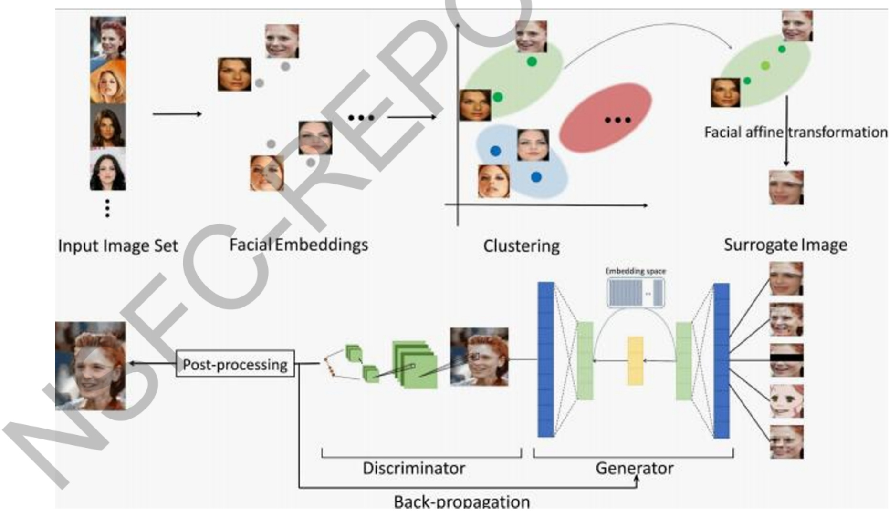

图2. 引入语义保持与代理数据生成的多源数据质量维护机制

第一步，精细化特征提取与聚类:沿用路径一的特征提取与聚类方法，但聚焦于提取对下游任务（如干旱识别、作物类型分类）更具判别性的语义特征，并据此进行更细粒度的聚类。

第二步，簇内代理数据合成:在每个数据簇内，基于簇质心（平均特征向量）

与簇内样本，利用仿射变换、特征插值等数据增强技术，生成一批与原始数据语义相似（如反映同类气象灾害模式、相同作物生长期）但身份信息不同的“代理数据样本”，以丰富数据多样性并增强匿名性。

第三步，构建多输入语义感知融合模型:借鉴FPSP模型架构，构建一个编码器-量化嵌入空间-解码器结构的生成网络。模型的输入包括:1)原始数据样本；2)其对应的合成代理数据；3)该样本经多种基础保护方法（如盲化、马赛克、卡通化、噪声添加）处理后的多个变体。

第四步，设计语义保持的联合损失函数:在模型训练中，设计一个由三部分构成的损失函数:1)语义保持损失:强制要求模型重构数据的下游任务预测结果（如通过一个预训练的灾害分类器）与原始数据的标签保持一致，以此作为关键约束；2）原始数据重构损失:衡量重构数据与原始数据在特征层面的相似性；3)代理数据对齐损失:鼓励重构数据在特征空间上与代理数据接近，以促进身份信息的模糊化。通过超参数平衡这三项损失，指导模型学习。

第五步，迭代优化与高质量数据入库:使用包含语义标签的数据集对模型进行训练与迭代优化，最终利用该模型批量处理原始多源数据，生成既隐匿了数据具体来源、又最大程度保留了灾害类型、作物状态、气象要素等关键语义信息的“可用不可见”新数据集，并将其系统化地整合入项目建立的农业气象大数据云平台，形成高质量、高可用、隐私安全的数据资源池。

研究内容二:基于时空的极端天气与农灾关联性分析

1）基于“聚类+分类”混合模型的极端天气协同模式挖掘方法:本研究针对极端天气事件多变量、高维时空特征，提出一种融合无监督聚类与有监督分类的混合建模路径，旨在识别协同发生的极端天气模式，并为每类模式赋予可解释的气象类别标签。

第一步，极端天气特征提取与时空立方体构建:基于多源气象观测数据（如气温、降水、风速等)，构建“时间-空间-气象变量”三维数据立方体。采用时序特征提取方法（如滑动窗口统计、小波变换等），生成表征极端事件强度、持续性与时空分布的特征向量集合。

第二步，基于特征相似性的极端天气聚类:应用密度聚类算法（如DBSCAN)或层次聚类算法，依据特征向量间的相似性（如动态时间规整距离、欧氏距离）对极端天气事件进行聚类，形成具有相似气象行为的事件簇，初步实现极端天气数据绑定。

第三步，灾害类别驱动的分类校正机制:为提升聚类结果的可解释性，引入灾害记录作为外部监督信息。基于聚类簇内事件对应的农业灾害类型分布，计算簇与灾害类别之间的相关性权重，构建线性规划模型，优化聚类边界，实现“聚类簇-灾害类别”的软映射，增强聚类结果的语义一致性。

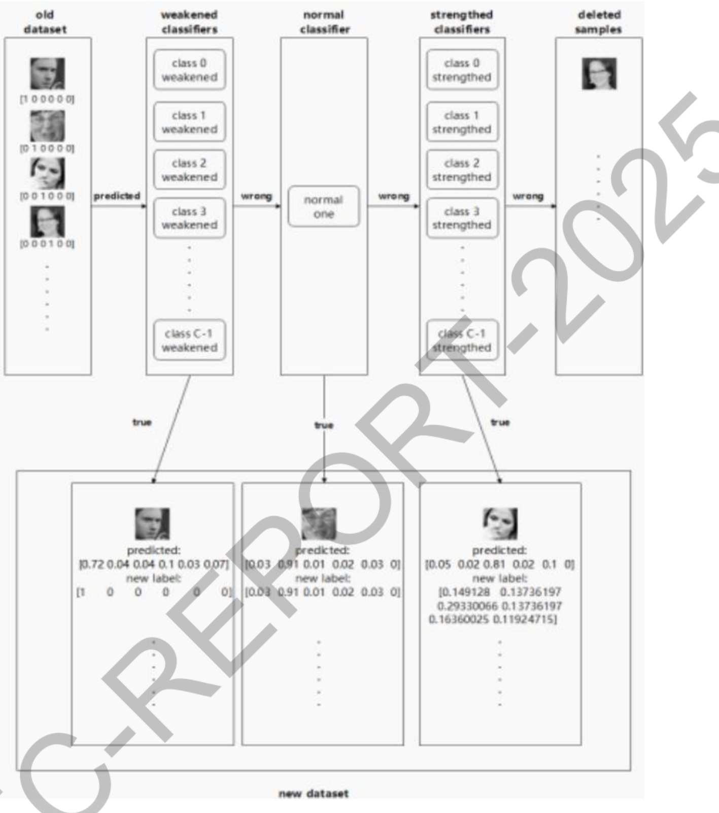

图3. 基于“聚类+分类”混合模型的极端天气协同模式挖掘方法

第四步，协同模式提取与可视化:根据优化后的聚类结果，提取典型协同极端天气模式（如“高温-干旱-强风”复合事件），并结合地理信息系统进行时空可视化展示，为后续关联分析提供结构化的气象事件输入。

2)基于灰色系统理论与层次化建模的极端天气-农灾关联关系挖掘方法:针对极端天气与农业灾害之间关系复杂、数据不确定性强的问题，构建一种多层次灰色关联分析框架，系统量化不同时空尺度下两者间的关联强度与次序。

第一步，数据序列无纲量化与层次构建:分别对极端天气数据立方体与农业灾害数据立方体进行初值化或均值化处理，消除量纲差异，构建“年-季-月”及“省-市-县”双层时空层次序列。

第二步，灰色关联度计算模型设计:针对每一层次，选取极端天气指标序列作为比较序列，农业灾害指标序列作为参考序列，采用灰色关联度计算公式，逐对计算关联度系数，形成关联度矩阵。

图4. 基于灰色系统理论与层次化建模的极端天气-农灾关联关系挖掘方法

第三步，层次化关联度融合与权重分配:引入层次分析法或熵权法，确定不同时空层次在整体关联模型中的权重，将各层次关联度进行加权融合，得到综合关联度指标，提升模型的整体解释力与稳定性。

第四步，关联规则提取与可解释性增强:依据关联度排序，提取强关联规则（如“持续高温序列与病虫害发生率的关联度达0.82”)，并结合农业专家知识进行语义标注与因果假设生成，形成可服务于灾害预警的关联知识库。

研究内容三:基于关键影响因子的全局时空气象农灾预测

1）基于注意力机制与时空图网络的关键气象-农业因子联合特征表示框架:本研究针对极端天气与农业灾害间复杂的非线性、多尺度关联，设计一种融合注意力机制与时空图神经网络的因子表征学习路径，旨在量化给定天气情景下特定农灾的发生概率，并生成高层联合特征表示。

第一步，多源数据时空对齐与分组:基于研究内容二的关联分析结果，按“年-季-月”及“省-市-县”双层时空层次，将气象数据与对应区域的农灾记录进行对齐，划分为若干时空关联数据分组，每组包含气象因子序列、灾害标签及环境辅助变量。

第二步，关键影响因子动态筛选:针对每个数据分组，引入基于注意力机制的因子重要性评估模块。通过多头自注意力网络计算各气象因子与灾害标签之间的关联权重，动态筛选出关键影响因子集合，并依据权重进行因子排序与冗余剔除。

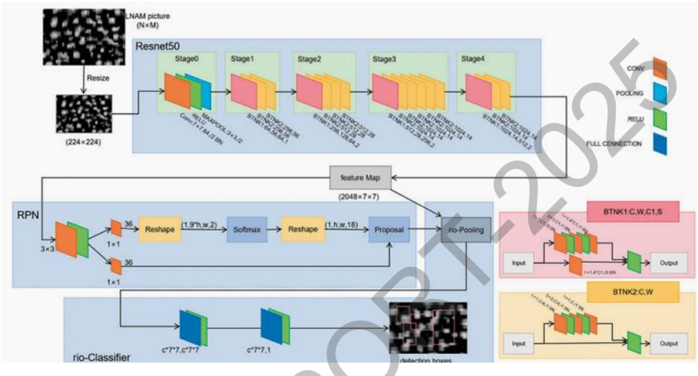

图 5. 基于注意力机制与时空图网络的关键气象-农业因子联合特征表示框架

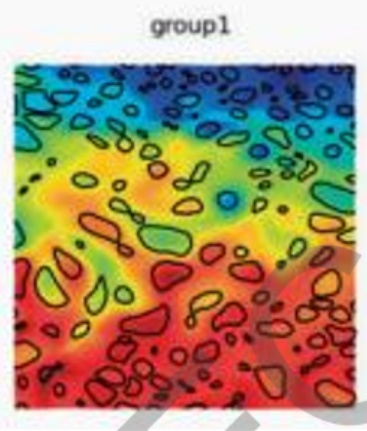

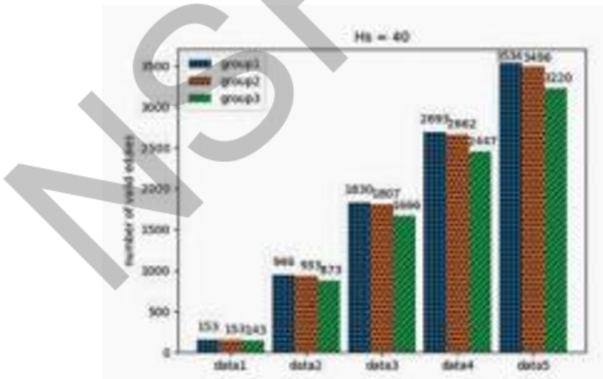

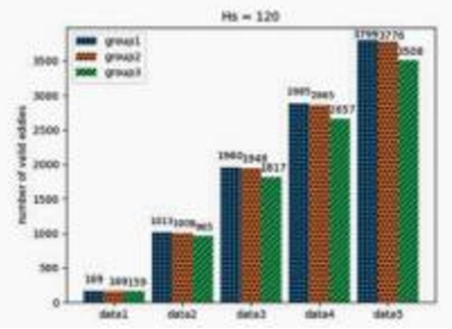

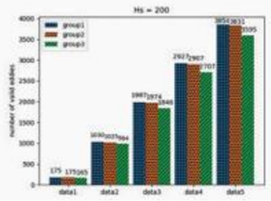

图6. 时空农灾预测注意力热力分布及其预测精度（1）

第三步，时空图神经网络特征融合:将筛选后的关键因子构建为时空图结构，节点表示不同空间位置，边表示时空相关性。采用时空图卷积网络同时捕捉空间邻近性与时间依赖性，通过多层图卷积与门控时序卷积提取跨因子、跨时空的联合特征表示。

第四步，特征降维与可解释性增强:对提取的高维联合特征进行主成分分析或自编码器降维，保留主要变异信息，并结合注意力权重生成特征重要性热力图，提供因子贡献度的可视化解释，为后续预测网络提供高质量、可解释的输入特征。

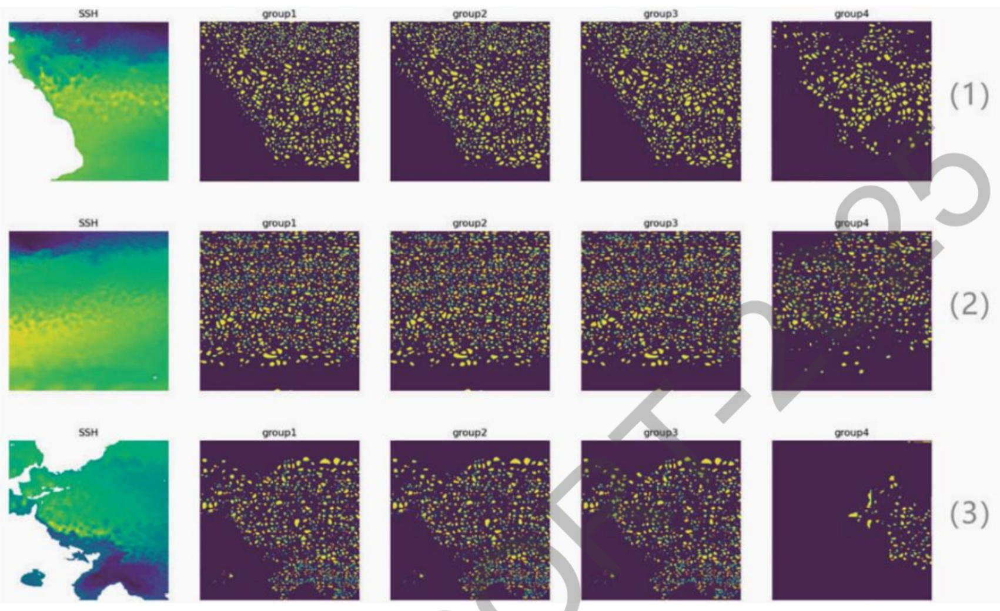

图7. 时空农灾预测注意力热力分布及其预测精度（2）

2）融合全局时空感知与自适应时间尺度机制的气象农灾深度预测网络:针对农业灾害预测中的时空异质性与时间尺度依赖问题，构建一种具有可调时间粒度的多尺度卷积神经网络，实现农灾发生概率的动态量化与趋势预警。

第一步，全局时空特征平面构建与编码:将方法一生成的联合特征表示组织为“空间×时间×特征”三维张量，输入至多分支卷积模块。采用扩张卷积捕捉大范围空间模式，并利用空间金字塔池化聚合多尺度空间上下文信息，形成全局时空特征平面。

第二步，时间尺度自适应调整模块:在网络中嵌入可学习的时间尺度参数，通过时序卷积与注意力机制自适应选择关键时间步长。支持用户根据预测需求（如短期预警、季节趋势）动态调整网络的时间感知粒度，实现“月-季-年”多尺度预测的灵活切换。

第三步，灾害概率量化与输出层设计:在高层特征序列上引入门控循环单元捕捉时序演化模式，最终通过全连接层与Softmax激活函数输出各灾害类别的发生概率。采用分位数回归技术，在输出概率的同时提供预测不确定性估计，增强决策可靠性。

第四步，端到端训练与多任务优化:联合优化特征表示与预测任务，采用加权交叉熵损失函数处理灾害类别不平衡问题，并引入正则化项防止过拟合。在训练过程中通过梯度反转域自适应技术提升模型在不同地理区域的泛化能力。

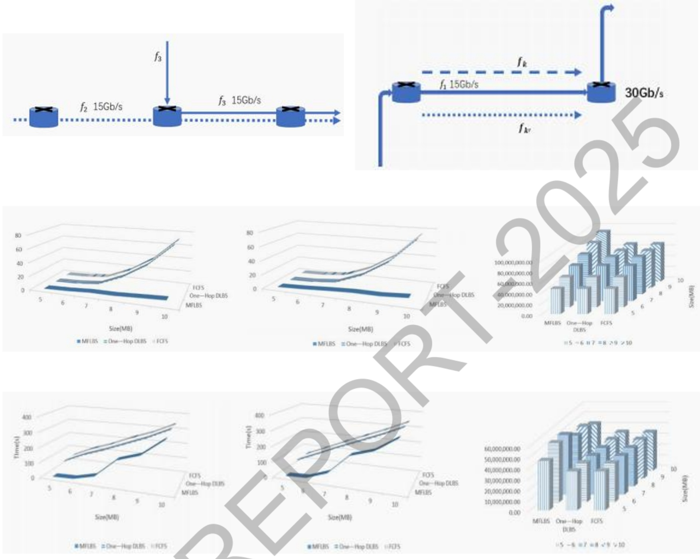

图8. 融合全局时空感知与自适应时间尺度机制的气象农灾深度预测网络及其预测精度

## 研究内容四:基于给定气象农灾资料的灾后作物产值预估

下述两个方法均基于SbMBR树在时空数据索引、相似性聚类与误差可控压缩方面的核心思想，分别从环境特征结构化表示和灾种交互量化两个角度构建了研究内容四的实施路径，并借助强化学习机制，实现了“数据表征-模型预测-机制优化”的闭环增强。

1）基于SbMBR树的多源环境数据表示与产值预估融合网络:本研究针对多源气象、遥感、土壤与地形数据在时序上的异构性与高维性，提出一种基于SbMBR树的特征表示与时序预测融合方法，实现对灾后作物产值的动态预估。方法结合SbMBR树在时空数据压缩与索引上的优势，构建层次化特征表示，并引入强化学习机制优化特征融合与预测过程。

第一步，多源环境数据时空编码与SbMBR树构建:基于气象站点数据、卫星遥感影像、土壤属性与地形高程等多源时空数据，构建“时间-空间-特征”三维数据立方体。利用SbMBR树对每个特征维度（如温度、降水、植被指数等）进行分层聚类，生成具有相似性的最小边界矩形（MBR）。每个MBR内数据用均值表示，并通过误差控制机制保留数据分布特征，实现对高维异构数据的结构化表示与压缩。

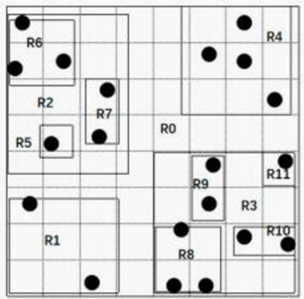

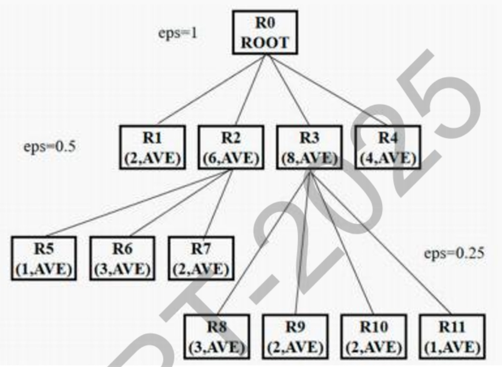

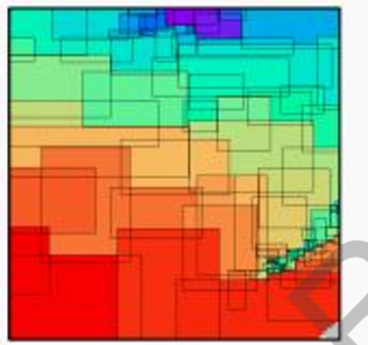

(a) brute R-tree

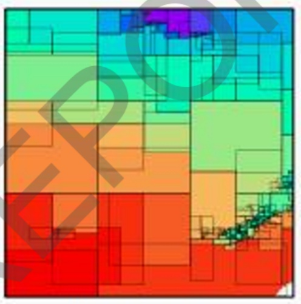

(b) SbMBR tree

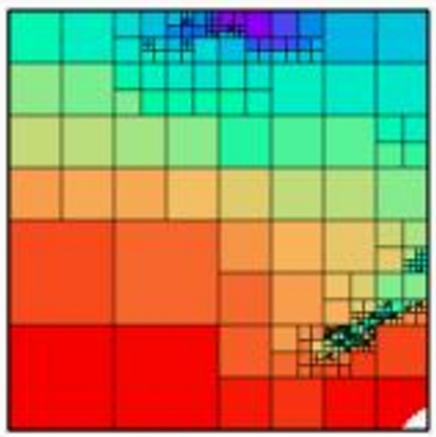

(c) quadtree

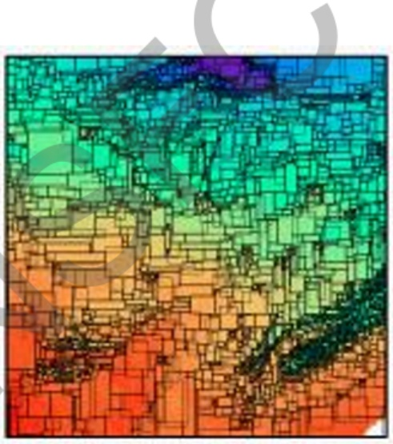

(a) brute R-tree

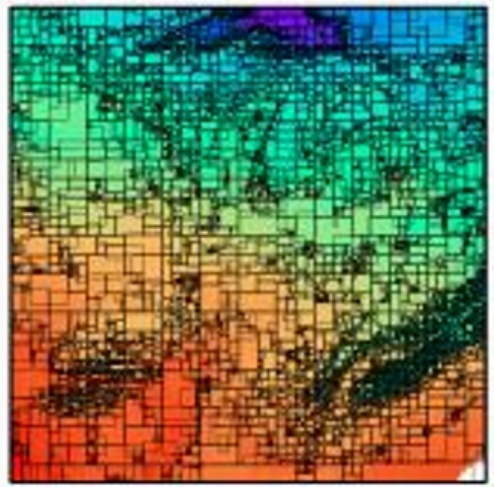

(b) SbMBR tree

(c) quadtree

图9. 基于 SbMBR 树的多源环境数据表示与产值预估融合网络及其树形快速索引结构

第二步，时序特征提取与动态变量融合:基于SbMBR树构建的层次化MBR结构，提取每个时间片上的静态环境特征（如土壤类型）与动态变量（如逐日气象数据）。利用LSTM或Transformer编码器对时序动态变量进行建模，同时将静态特征与动态特征在SbMBR树的节点层面进行拼接，形成融合特征向量，作为农作物产值预估网络的输入。

第三步，基于强化学习的特征选择与网络优化:引入强化学习智能体，以SbMBR树节点特征的重要性为状态空间，以特征保留与否为动作空间，以预测误差下降幅度为奖励，动态优化输入特征组合。通过Q-learning或策略梯度方法训练智能体，实现对多源特征的自适应筛选与融合，提升产值预估模型的鲁棒性与解释性。 1

2）基于强化学习的多灾种作用量化与SbMBR树协同优化方法:本研究针对多灾种（如干旱、洪涝、低温）对作物产值的复合影响难以量化的问题，提出一种融合SbMBR树灾害表示与强化学习交互作用建模的方法，实现对多灾种协同效应的动态量化与产值预估增强。

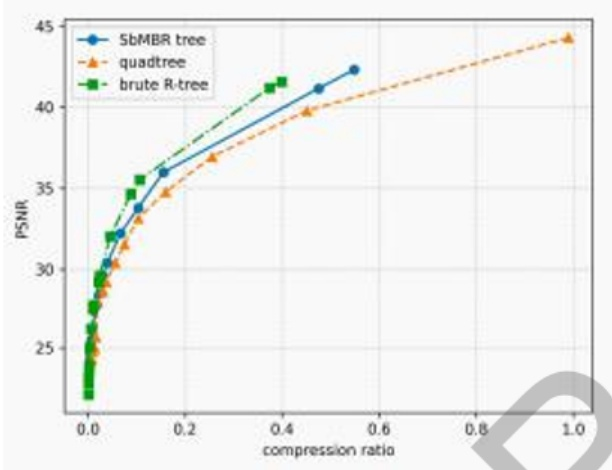

(a) Test 1

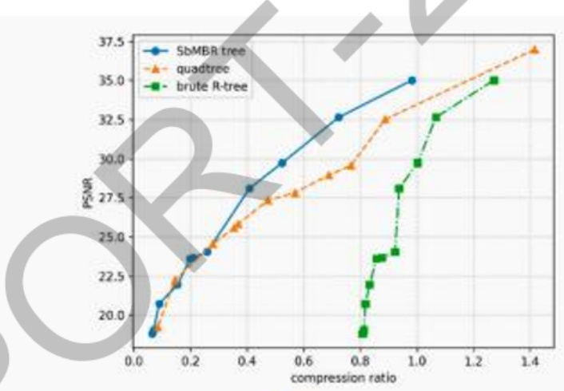

(b) Test 3

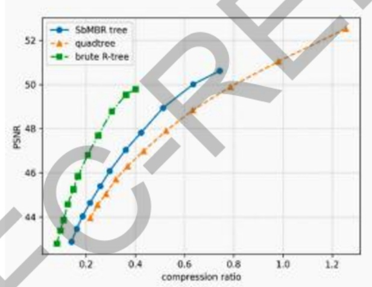

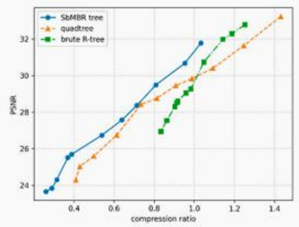

图 10. 基于 SbMBR 树的多灾种强化学习预测精度

第一步，灾种数据时空建模与SbMBR树索引构建:针对不同灾种（如干旱指数、降水异常、温度距平等）的时空数据，分别构建SbMBR树索引结构。每个灾种对应一棵SbMBR树，树节点表征该灾种在某一时空范围内的强度与分布。通过希尔伯特曲线对多灾种数据进行空间对齐与时序对齐，形成“灾种-时空-MBR”多层索引体系。

第二步，多灾种协同作用建模与权重学习:基于多棵灾种SbMBR树的结构，设计一个交互作用图网络，节点为各灾种MBR特征，边表示灾种间潜在影响关系。引入强化学习智能体，以灾种权重分配为动作，以产值预测精度提升为奖励，通过策略梯度方法动态学习不同灾种对作物产值的正负向贡献及其相互作用强度。

第三步，SbMBR树结构调整与预测网络联合训练:将学习到的灾种权重反馈至各灾种SbMBR树的节点误差控制参数中，实现对重要灾种数据的细粒度表示与非重要灾种的粗粒度压缩。在此基础上，构建一个融合多灾种权重信息的时序预测网络（如ConvLSTM)，通过端到端训练实现“灾种表示-权重学习-产值预测”一体化优化，提升模型在复杂灾害场景下的预估能力。 5

## 3. 研究人员的合作与分工。

| 姓名 | 性别 | 职称 | 学位 | 从事专业 | 工作时间 | 所在单 | 项目分工 |
| --- | --- | --- | --- | --- | --- | --- | --- |
| 于信 | 男 |  | 硕士 | 计算机科学与技 |  | 南京信息工程大学 | 论文阅读方案构建成果建设 |
| 杨彬 | 男 |  | 硕士D | 计算机科学与技术 | 80% | 南京信息工程大学 | 论文阅读方案构建成果建设 |
| 孙圣杰 | 男 |  | 十 | 计算机科学与技术 | 80% | 南京信息工程大学 | 论文阅读方案构建成果建设 |
| 周浩2 |  |  | 硕士 | 计算机科学与技术 | 80% | 南京信息工程大学 | 论文阅读方案构建成果建设 |
| V | 男 |  | 硕士 | 计算机科学与技术 | 80% | 南京信息工程大学 | 论文阅读方案构建成果建设 |
| 金子龙 | 男 | 副教授 | 博士 | 计算机科学与技术 | 80% | 南京信息工程大学 | 论文阅读方案构建成果建设 |
| 宋彪 | 男 | 讲师 | 博士 | 计算机科学与技术 | 80% | 南京信息工程大学 | 论文阅读方案构建成果建设 |

4. 国内外学术合作交流等情况。

参加 International Conference on Big Data and Security 会议

5. 存在的问题、建议及其他需要说明的情况。

截止2025年年底，项目各考核指标已完成，但仍有SCI论文在审，发明专利在审。 1

## （二）成果部分

1. 项目取得成果的总体情况。

本项目基于大数据的农业气象灾害预测及影响关键技术研究，旨在利用农业气象领域数据对极端天气与农灾关联性、气象农灾精准预测、 灾后作物产值预估三大问题进行探索。

第一，针对极端天气与农灾关联性，从农业气象多源大数据采集与存储管理切入其目标是系统获取并整合气象、遥感、社交媒体等多源异构数据，构建统一、高质量的数据基础，为后续分析任务提供标准化数据支撑。具体结论如下:

1）提出了基于聚类与生成模型的农业气象多源数据融合与重构方法。该方法通过深度卷积神经网络进行多源异构数据的特征提取与统一表征，利用K-means等算法实现特征聚类与数据组织，并设计多输入条件变分自编码器（CVAE）进行匿名化副本融合与高质量数据重构，最终构建“时空数据立方体”实现标准化存储与高效索引。实验结果表明，该方法能够有效统一多源数据表征，在保护数据隐私的同时重构出高质量、标准化的数据样本，支持后续任务的快速检索与分析。

2)提出了语义保持与代理数据增强的多源数据质量维护机制。该方法在细粒度聚类的基础上，通过代理数据合成增强数据多样性与匿名性，构建多输入语义感知融合模型，并设计包含语义保持损失、原始数据重构损失与代理数据对齐损失的联合损失函数，指导模型生成“可用不可见”的农业气象数据集。实验表明，该机制能在隐匿数据具体来源的同时，显著保持灾害类型、作物状态等关键语义信息，形成高质量、高可用、隐私安全的数据资源池。

3)提出了基于“聚类+分类”混合模型的极端天气协同模式挖掘方法。该方法首先构建多变量时空数据立方体并提取高维特征，进而运用密度聚类算法依据特征相似性识别极端天气事件簇，随后引入灾害类别标签通过线性规划模型对聚类结果进行有监督校正与语义映射，最终提取并可视化具有明确气象语义的协同极端天气模式。实验结果表明，该方法能有效从高维多源数据中识别出如“高温-干旱-强风”等典型的复合极端事件模式，其聚类结果经灾害类别驱动优化后，模式的可解释性和与真实灾害的对应性显著提升，为后续关联分析提供了结构化的高质量输入。

4）提出了基于灰色系统理论与层次化建模的极端天气农灾关联挖掘方法。该方法首先通过数据无纲量化与时空层次构建，形成“年-季-月”与“省-市-县”双层序列结构，进而基于灰色关联分析逐层计算极端天气与农业灾害间的关联度，并融合层次分析法进行权重集成与综合关联评估，最终提取强关联规则并结合领域知识构建可解释的关联知识库。实验表明，该方法能够系统量化不同时空尺度下气象因子与灾害类型的关联强度，有效识别如“持续高温-病虫害”等高关联组合，所构建的层次化关联模型具备良好的稳定性与可解释性 为灾害预警与成因分析提供了定量化依据。

第二，气象农灾精准预测，从关键影响因子的全局时空建模切入。其目标是在关联分析基础上，量化特定天气情境下农业灾害的发生概率，构建可动态修正时间尺度的预测模型。具体通过多源数据提取与联合表示影响灾害发生的关键气象及农业因子，进而构建融合深度卷积网络的全局时空预测模型，逐步解析时空特征并输出灾害概率，为灾害的动态预警与防控决策提供精准的概率化支撑。

1）提出了基于注意力机制与时空图网络的关键气象-农业因子联合特征表示方法。该方法首先通过时空层次对齐构建多源关联数据分组，进而利用多头自注意力网络动态筛选关键影响因子，并设计时空图卷积网络融合因子间的时空依赖关系以生成联合特征表示，最终通过特征降维与注意力可视化增强结果的可解释性。实验表明，该方法能够有效提取气象因子与农业灾害间的深层耦合特征，所生成的联合特征在保留关键判别信息的同时，显著提升了后续预测模型的精度与可解释性，为精准概率化预测提供了高质量的特征输入。

2)提出了融合全局时空感知与自适应时间尺度机制的气象农灾深度预测网络。该方法首先通过扩张卷积与空间金字塔池化构建并编码全局时空特征平面，进而嵌入可学习参数模块实现时间尺度的自适应调整与灵活切换，最终结合门控循环单元与分位数回归技术输出灾害概率及不确定性估计，并通过多任务优化与域自适应策略增强模型泛化能力。实验表明，该网络能有效捕捉农业灾害的时空异质性特征，其自适应时间尺度机制支持从月到年的多粒度精准预测，在跨区域测试中表现出优越的稳定性和泛化性能，为动态灾害预警提供了可靠的概率化决策支持。

第三，针对灾后作物产值预估，从多灾种综合作用量化与动态预测网络切入。其目标是在精准预测灾害的基础上，评估其对农业生产的实际影响，实现灾后作物产值的定量预估。具体通过融合生物气候、遥感、土壤等多源环境信息构建异构预测网络，捕捉收成季内的产值动态变化；并引入强化学习机制，以预测精度提升率为收益，自适应量化多灾种之间的协同影响权重，从而增强模型对复合灾害下产值损失的评估能力。该方法为灾后损失评估、保险定损及恢复决策提供了可靠的量化依据。

1）提出了基于SbMBR树的多源环境数据表示与产值预估融合网络。该方法首先利用SbMBR树对气象、遥感、土壤等多源异构时空数据进行层次化聚类与压缩表示，进而提取时序动态特征并与静态环境特征融合，最终引入强化学习机制自适应筛选关键特征并优化网络输入，实现作物产值的动态精准预估。实验表明，该方法通过SbMBR树有效实现了高维数据的结构化表示与快速索引，结合强化学习的特征选择机制显著提升了产值预估的精度与模型鲁棒性，为灾后损失评估提供了高效可靠的数据融合与预测框架。

2)提出了基于强化学习的多灾种作用量化与SbMBR树协同优化方法。该方法通过为不同灾种构建独立的SbMBR树索引体系，进而利用强化学习智能体学习灾种间的交互权重与贡献度，最终将权重信息反馈至SbMBR树结构调整中，并与时序预测网络进行端到端联合优化。实验表明，该方法能有效量化干旱、洪涝等多灾种对作物产值的复合影响，其学习的灾种权重具有明确的农学解释意义，在复杂灾害场景下的产值预估精度显著优于传统方法，为多灾种协同损失评估提供了可解释、自适应的一体化建模方案。

## 2. 项目成果转化及应用情况。

## (1）项目已发表论文及在审论文总结

[1] Zhang X（张新厂，项目 负责人）, Pan X, Zhu R, et al. Faster AMEDA—A Hybrid Mesoscale Eddy Detection Algorithm[J]. CMES-Computer Modeling in Engineering & Sciences, 2024, 141(2).

[2] Zhang X （张新厂，项目负责人），Xia C, Ma T, et al. Optimizing Energy-Latency Tradeoff for Computation Offloading in SDIN-Enabled MEC-based IIoT[J]. KSII Transactions on Internet & Information Systems, 2022, 16(12).

[3] Yang Y, Niu Z, Qiu Y, Biao Song\*, Zhang X(张新厂，项目 负责人), et al. A cluster-based facial image anonymization method using variational autoencoder[C]//International Conference on Big Data and Security. Singapore: Springer Nature Singapore, 2022: 621-633.

[4] Yang Y, Niu Z, Qiu Y, Biao Song\*, Zhang X（张新厂，项目负责人）, et al. A Multi-Input Fusion Model for Privacy and Semantic Preservation in Facial Image Datasets[J]. Applied Sciences, 2023, 13(11): 6799.

[5] Wang J, Song B, Zhang X(张新厂,项目 负责人), et al. An Innovative AdaBoost Process Using Flexible Soft Labels on Imbalanced Big Data[C]//International Conference on Big Data and Security. Singapore: Springer Nature Singapore, 2022: 172-184.

[6] Wang Z, Guan R, Pan X, Biao Song\*, Zhang X（张新厂，项目负责人) , et al. Efficient Spatiotemporal Big Data Indexing Algorithm with Loss Control [C]//International Conference on Big Data and Security. Singapore: Springer Nature Singapore, 2022: 524-533.

[7] Song B, Chang Y, Zhang X（张新厂，项目负责人）， et al. Mixed-flow load-balanced scheduling for software-defined networks in intelligent video surveillance cloud data center[J]. Applied Sciences, 2022, 12(13): 6475.

[8] Guan R, Wang Z, Pan X, Rongjie Zhu, Biao Song\*, Zhang X(张新厂，项目 负责人) . SbMBR Tree—A Spatiotemporal Data Indexing and Compression Algorithm for Data Analysis and Mining[J]. Applied Sciences, 2023, 13(19): 10562.

## (2) 项目已授权发明专利总结

[1]一种类脑脉冲强化演化的无人驾驶避障方法及相关装置，专利号:ZL20241 1901258.9，授权时间:2025年11月25日，主要完成人:朱彤;荣欢;马廷淮;张新广;耿亚泽；

[2]一种面向大模型检索的输入图优化隐私保护方法及系统，专利号:ZL20241 1959961.5，授权时间:2025年04月04日，主要完成人:耿亚泽;荣欢；马廷淮;张新广;朱彤；

[3]一种农业干旱等级预测方法、装置、电子设备及存储介质，专利号:ZL2022 11587993.8，公开时间:2023年03月31日，主要完成人:马廷淮；於佳欣；荣欢；张新厂；

[4]一种针对多源观测数据的时间序列干旱因果分析方法，专利号:ZL20231 0969129.2，公开时间:2023年09月01日，主要完成人:於佳欣；马廷淮；荣欢；张新厂；

## （3）项目已授权软件著作权总结

[1]在线考试考情分析系统，2024SR1011179，2024年07月16日；

[2]城市汽车限行平台，2023SR0480130，2023年04月18日；

[3]商场智能导引系统，2023SR0465554，2023年04月12日；

[4]遥感图像场景分类软件，2023SR0458693，2023年04月10日；

[5]基于JSP的网上购物系统，2021SR0859491，2021年06月09日；

[6]小型超市管理系统，2021SR0859786，2021年06月09日；

[7]边缘计算任务卸载系统，2021SR0859080，2021年06月09日；

## 3. 人才培养情况。

培养博士生2名，其他硕士生若干。

## 4. 其他需要说明的成果。

暂无。

5. 项目成果科普性介绍或展示网站。暂无。

## 研究成果目录

项目负责人通过系统，从文献库中检索研究成果或者按要求格式自行填入。请按照期刊论文、会议论文、学术专著、专利、会议报告、标准、软件著作权、科研奖励、人才培养、成果转化的顺序列出，其它重要研究成果如标本库、科研仪器设备、共享数据库、获得领导人批示的重要报告或建议等，应重点说明研究成果的主要内容、学术贡献及应用前景等。

项目负责人不得将非本人或非参与者所取得的研究成果、与受资助项目无关的研究成果、未标注国家自然科学基金资助和项目批准号的论文以及取得时间早于项目资助期开始时间的研究成果列入报告中。发表的研究成果（包括专利），项目负责人和参与者均应如实注明得到国家自然科学基金项目资助和项目批准号，科学基金作为主要资助渠道或者发挥主要资助作用的，应当将自然科学基金作为第一顺序进行标注。

## 期刊论文

(1) Zhang, Xinchang; Xia, Changsen; Ma, Tinghuai; Zhang, Lejun; Jin, Zilong; Optimizing Energy-Latency Tradeoff for Computation 0ffloading in SDIN-Enabled MEC-based IIoT, KSII TRANSACTIONS ON INTERNET AND INFORMATION SYSTEMS, 2022， 16(12):4081-4098. 第一标注

(2) Zhang, Xinchang; Pan, Xiaokang; Zhu, Rongjie; Guan, Runda; Qiu, Zhongfeng; Song, Biao; Faster AMEDA-A Hybrid Mesoscale Eddy Detection Algorithm, CMES-COMPUTER MODELING IN ENGINEERING & SCIENCES, 2024, 141(2):1827-1846. 第一标注

(3) 宋彪; 张新厂; A Multi-Input Fusion Model for Privacy and Semantic Preservation in Facial Image Datasets, Applied Sciences, 2023, 13(11). SCIE. 第五标注

(4) 宋彪; 张新厂; Mixed-flow load-balanced scheduling for software-defined networks in intelligent video surveillance cloud data center, Applied Sciences, 2022, 12(12). SCIE. 第三标注

(5) 宋彪; 张新厂; SbMBR Tree—A Spatiotemporal Data Indexing and Compression Algorithm for Data Analysis and Mining, Applied Sciences, 2023, 13(19). SCIE. 第六标注

## 会议论文

(1) 宋彪; 张新厂; A cluster-based facial image anonymization method using variational autoencoder, Interna tional Conference on Big Data and Security, Singapore, 2022-04-22至2022-04-22. EI. 第五标注

(2) 宋彪; 张新厂; An Innovative AdaBoost Process Using Flexible Soft Labels on Imbalanced Big Data, Intern ational Conference on Big Data and Security, Singapore, 2022-06-15至2022-06-17. EI. 第三标注

(3) 宋彪; 张新厂; Efficient Spatiotemporal Big Data Indexing Algorithm with Loss Control, International Conference on Big Data and Security. Singapore, Singapore, 2022-06-20至2022-06-22. EI. 第五标注

## 专利

(1) 朱彤；荣欢；马廷淮；张新厂；一种类脑脉冲强化演化的无人驾驶避障方法及相关装置，2025-11-25至2027-11-25，中国，ZL 2024 1 1901258.9.

(2) 耿亚泽；荣欢；马廷淮；张新厂；朱彤；一种面向大模型检索的输入图优化隐私保护方法及系统，2025-04-04至2027-04-04，中国，ZL 2024 1 1959961.5.

(3) 马廷淮；於佳欣；荣欢；张新厂；一种农业干旱等级预测方法、装置、电子设备及存储介质，2023-03-31，中国，ZL 2022 1 1587993.8.

(4) 於佳欣；马廷淮；荣欢；张新厂； 种针对多源观测数据的时间序列干旱因果分析方法，2023-09-01，中国，ZL 202310969129.2.

## 软件著作权

(1) 张新厂；小型超市管理系统，2021SR0859786，原始取得，全部权利，2021-06-09.

(2) 张新厂；边缘计算任务卸载系统，2021SR0859080，原始取得，全部权利，2021-06-09.

(3) 张新厂；遥感图像场景分类软件，2023SR0458693，原始取得，全部权利，2023-04-10.

(4) 张新厂；基于JSP的网上购物系统，2021SR0859491，原始取得，全部权利，2021-03-29.

(5) 张新厂；在线考试考勤分析系统，2024SR1011179，原始取得，全部权利，2024-07-16.

(6) 张新厂；城市汽车限行平台，2023SR0480130，原始取得，全部权利，2023-04-18.

(7) 张新厂；商场智能导引系统，2023SR0465554，原始取得，全部权利，2023-04-12.

## 项目成果应用前景

本项目成果拟应用领域:1、农业气象 2、农作物产值预估 3、气象预报

预计在5年以内推广使用

附表:研究成果统计数据表（本表针对各种类型资助项目收集数据以便进行整体资助效果分析使用，并非要求每类项目都具有以下各类成果。

<table><tr><td rowspan=4>获奖（项）</td><td colspan=16>国家级</td><td colspan=11>部级1</td><td rowspan=3 colspan=2>其他</td></tr><tr><td colspan=4>自然科学奖</td><td colspan=5>科技进步奖</td><td></td><td colspan=6>发明奖</td><td colspan=7>自然科学奖</td><td colspan=4>科技进步奖</td></tr><tr><td colspan=2>一等</td><td colspan=2>二等</td><td colspan=2>一等</td><td colspan=3>二等</td><td></td><td colspan=3>一等</td><td colspan=3>二等</td><td colspan=3>等</td><td colspan=4>等</td><td colspan=2>一等</td><td colspan=2>二等</td></tr><tr><td colspan=2>0</td><td colspan=2>0</td><td colspan=2>0</td><td colspan=3>0</td><td></td><td colspan=3>0</td><td colspan=3>0</td><td colspan=3>0</td><td colspan=4>0</td><td colspan=2>0</td><td colspan=2>0</td><td colspan=2>0</td></tr><tr><td rowspan=4>学术报告/论文/专著/其他（篇）</td><td colspan=3>特邀学术报告</td><td colspan=15>学术论文</td><td rowspan=2 colspan=4>学术专著</td><td rowspan=2 colspan=7>其他</td></tr><tr><td rowspan=2>国际学术会议</td><td rowspan=2 colspan=2>国内学术会议</td><td colspan=4>发表论文数</td><td colspan=11>论文检索收录情况</td></tr><tr><td colspan=2>期论义</td><td colspan=2>会议</td><td colspan=2>SCIE/SSCI</td><td colspan=3>EI</td><td colspan=3>北大中文核心期刊</td><td colspan=3>CSSCI</td><td colspan=2>中文</td><td colspan=2>外文</td><td colspan=2>标本库</td><td colspan=2>数据库</td><td colspan=2>科研仪器设备</td><td>重要报告</td></tr><tr><td>0</td><td colspan=2>0</td><td colspan=2>5</td><td colspan=2>3</td><td colspan=2>3</td><td colspan=3>3</td><td colspan=3>0</td><td colspan=3>0</td><td colspan=2>0</td><td colspan=2>0</td><td colspan=2>0</td><td colspan=2>0</td><td colspan=2>0</td><td>0</td></tr><tr><td rowspan=4>专利/标准/软著/成果转化</td><td></td><td colspan=6>专利（项）</td><td colspan=2></td><td colspan=11>标准</td><td rowspan=3 colspan=2>软件著作权</td><td rowspan=2 colspan=7>成果转化</td></tr><tr><td colspan=3>国内</td><td colspan=4>国外</td><td rowspan=2 colspan=2>国际</td><td colspan=11>国内</td></tr><tr><td>申请</td><td colspan=2>授权</td><td colspan=2>申请</td><td colspan=2>授权</td><td colspan=3>国家</td><td colspan=3>行业</td><td colspan=3>地方</td><td colspan=2>企业</td><td colspan=2>技术转让技</td><td colspan=2>术许可作</td><td colspan=2>价投资</td><td>经济效益(万元)</td></tr><tr><td>2</td><td colspan=2>2</td><td colspan=2>0</td><td colspan=2>0</td><td colspan=2>C</td><td colspan=3>0</td><td colspan=3>0</td><td colspan=3>0</td><td colspan=2>0</td><td colspan=2>7</td><td colspan=2>0</td><td colspan=2>0</td><td colspan=2>0</td><td>0</td></tr><tr><td rowspan=4>人才培养及学术交流</td><td colspan=17>人才培养（人）</td><td colspan=12>举办和参加学术会议</td></tr><tr><td colspan=8>中青年学术带头人</td><td rowspan=2 colspan=3>出站博士后</td><td rowspan=2 colspan=3>毕业博士</td><td rowspan=2 colspan=3>毕业硕士</td><td colspan=4>举办国际学术会议</td><td colspan=5>举办国内学术会议</td><td colspan=3>参加国际学术会议</td></tr><tr><td>优青</td><td colspan=2>杰青</td><td colspan=2>创新群体</td><td colspan=2>其他</td><td></td><td colspan=2>次数</td><td colspan=2>人数</td><td colspan=3>次数</td><td colspan=2>人数</td><td colspan=2>次数</td><td>人数</td></tr><tr><td>0</td><td colspan=2>0</td><td colspan=2>0</td><td colspan=2>0</td><td></td><td colspan=3>0</td><td colspan=3>0</td><td colspan=3>0</td><td colspan=2>0</td><td colspan=2>0</td><td colspan=3>0</td><td colspan=2>0</td><td colspan=2>0</td><td>0</td></tr></table>

国家自然科学基金项目资金决算表

项目批准号:42175194

项目负责人:张新厂

金额单位:万元

<table><tr><td rowspan="3">行次</td><td rowspan="3">科目名称</td><td colspan="3">预算数</td><td rowspan="2">累计支出数</td><td rowspan="2">结余数</td><td rowspan="2">结余资金比例</td></tr><tr><td>批准预算</td><td>预算调整</td><td>调整后预算</td></tr><tr><td>(1)</td><td>(2)</td><td>(3)=(1)+(2)</td><td>(4)</td><td>(5) =(3)-(4)</td><td>(6)</td></tr><tr><td>(1)</td><td>项目总经费</td><td>73.1500</td><td>0.0000</td><td>73.1500</td><td></td><td></td><td>25.24%</td></tr><tr><td>(2)</td><td>项目直接费用</td><td>58.0000</td><td>0.0000</td><td>58.0000</td><td>39.5400</td><td>18.4600</td><td></td></tr><tr><td>(3)</td><td>1、设备费</td><td>7.5000</td><td>0.0000</td><td>7.5000</td><td>3.4800</td><td>4.0200</td><td></td></tr><tr><td>(4)</td><td>其中:设备购置费</td><td>7.5000</td><td>0.0000</td><td>7.5000</td><td>3.4800</td><td>4.0200</td><td></td></tr><tr><td>(5)</td><td>2、业务费</td><td>30.7000</td><td>0.0000</td><td>30.7000</td><td>28.9100</td><td>1.7900</td><td></td></tr><tr><td>(6)</td><td>3、劳务费</td><td>19.8000</td><td>0.0000</td><td>19.8000</td><td>7.1500</td><td>12.6500</td><td></td></tr><tr><td>(7)</td><td>项目间接费用</td><td>15.1500</td><td>0.0000</td><td>15.1500</td><td></td><td></td><td></td></tr></table>

注:1.本表中（1）、（3）、（5）、（6）栏为系统自动生成，无需填写；本表中（2）栏填列预算调整数；本表中（4）栏填列项目的实际支出数。

2.第（1）行=第（2）+（7）行

第（2）行=第（3）+（5）+（6）行；

第（3）栏=第（1）+（2）栏；

第（5）栏=第（3）-（4）栏；

第（1）行第（6）栏=第（2）行第（5）栏/第（1）行第（3）栏100%；

第（1）行第（1）栏=第（1）行第（3）栏；

第（1）行第（2）栏=0；

第（4）栏≤第（3）栏；

第（2）行第（5）栏≥0。

## 决算说明书

（请按照《国家自然科学基金预算制项目决算表编制说明》等有关要求，说明各科目支出、预算调整、结余情况，合作研究转拨资金情况，单价≥50万元的设备情况，资金使用和管理过程中遇到的问题及建议，以及其他需要说明的事项等。）

## 1. 项目直接经费:58万元

（1）设备费:批准预算7.5万，无预算调整，累计支出3.48万（均为设备购置），结余4.02万；

（2）业务费:批准预算30.7万，无预算调整，累计支出28.91万，结余1.79万；

（3）劳务费:批准预算19.8万，无预算调整，累计支出7.15万（均为设备购置），结余12.65万；

直接费用合计花费:39.54万，剩余18.46万，结余资金比率25.24%；

2. 项目间接费用:15.15万，合计花费15.15万，结余0万；

3. 结余经费将用于项目在研工作将发表的论文、专利版面费与信息传播费，和其他学术交流所涉及业务费用、专家咨询费用等；

结余资金情况说明

| 结余经费将用于项目在研工作将发表的论文、专利版面费与信息传播费，和其他学术交流所涉及 业务费用、专家咨询费用等; |
| --- |
| 2025 |
|  |
|  |
|  |

注:结余资金比例超过30%的项目该部分必填。

<table><tr><td colspan="7">项目负责人承诺:我所承担的项目（编号:42175194 名称:基于大数据的农业气象灾害监测及预警关键技术研究）结题报告内容真实，数据准确，未出现《国家科学技术保密规定》中列举的属于国家科学技术秘密范围的内容，不涉及敏感科技信息。在今后的研究工作中，如有与本项目相关的成果，将如实注明得到国家自然科学基金项目资助和项目批准号，并报送国家自然科学基金委员会。项目负责人（签日期:</td></tr><tr><td colspan="4">依托单位科研管理部门:负责人（签章）:日期:</td><td colspan="2">依托单位财务管理部门:负责人（签章）:日期:</td><td>依托单位审查意见:依托单位公章:</td></tr><tr><td colspan="7">科学处审核意见:                              EP</td></tr><tr><td rowspan="2">完成情况综合评分(划√)</td><td>优</td><td>良</td><td colspan="2">中</td><td>差</td><td rowspan="2">负责人（签章）:日期:</td></tr><tr><td></td><td></td><td colspan="2"></td><td></td></tr><tr><td colspan="7">科学部核准意见  对重点项目等）:NSF负责人（签章）:日期:</td></tr><tr><td colspan="7">分管委领导意见（对重大项目等）:委领导（签章）:日期:</td></tr></table>

## 电子附件目录

| 序号 | 附件类型 | 附件名称 | 备注 |
| --- | --- | --- | --- |
| 1 | 论著 | 论文1 |  |
| 2 | 论著 | 论文2 |  |
| 3 | 论著 | 论文3 |  |
| 4 | 论著 | 论文4 |  |
| 5 | 论著 | 论文5 |  |
| 6 | 论著 | 论文6 |  |
| 7 | 论著 | 论文7 |  |
| 8 | 论著 | 论文8 |  |
| 9 | 专利 | 专利1 |  |
| 10 | 专利 | 专利2 |  |
| 11 | 专利 | 专利3 |  |
| 12 | 专利 | 专利4 |  |
| 13 | 其他 | 软件著作权1 |  |
| 14 | 其他 | 软件著作权2 |  |
| 15 | 其他 | 软件著作权3 |  |
| 16 | 其他 | 软件著作权4 |  |
| 17 | 其他 | 软件著作权5 |  |
| 18 | 其他 | 软件著作权6 |  |
| 19 | 其他 | 软件著作权7 |  |
| 20 | 其他 | 软件著作权8 |  |