项目批准号 82030058申请代码 H2502归口管理部门收件日期


20250282030058

# 国家自然科学基金

# 资助项目结题/成果报告

资助类别:重点项目

亚类说明:

附注说明:宏观领域

项目名称:多组学+人工智能系统解析疑难生物物证法医精准鉴识探索研究

负责人:严江伟

BRID: 09607.00.61320

电子邮件: yanjw@sxmu.edu.cn

电话: 0351-3985097

依托单位: 山西医科大学

联系人: 邵红芳

电话: 0351-3985328

直接费用:297.0000（万元）

执行年限: 2021.01-2025.12

填表日期:2026年01月16日

国家自然科学基金委员会制（2025年）

## 项目摘要

## 中文摘要:

实现对微量、降解和混合等疑难生物物证进行精准个体识别，一直是法医学亟需解决的关键科学问题。对这一科学难题开展系统研究，对于充分挖掘现场物证、迅速明确侦查方向、大力夯实嫌疑人证据等司法实践具有重要的学术价值和现实意义。本课题首次提出整合多组学和人工智能分析方法，挖掘和验证适用于法医学同一认定和混合样本组织精准溯源的多组学分子标记，构建并优化法医学案件样本多组学标记共检测方法，探索多组学标记人工智能分析进行法医个体精准识别证据解析机理，建立适用于疑难生物物证多组学人工智能分析方法和法庭证据解析体系，为解决疑难生物物证法医精准个体识别难题提供理论和应用基础。本课题预期可获得原始创新成果和自主知识产权，为全面提升我国公共安全保障能力提供有力的科技支撑。

## Abstract:

It is a key scientific problem that forensic science urgently needs to solve accurate individual identification of difficult biological evidence, such as trace, degradation and mixing samples. Carrying out systematic research on this scientific problem will will produce great academic value and pract ical significance on excavating the information from evidence, quickly defining the direction of investigation, and confirmation of criminal evidence of suspects.For the first time, this project proposes the integration of multi-component and artificial intelligence analysis methods, mining and verifying multi-omics molecular markers suitable for identification and accurate traceability of mixed samples in forensic science; constructing and optimizing the co-detection method of multi-omics markers with forensic samples; exploring the mechanism of multi-omics artificial intelligence analysis for forensic accurate identification; Establishment of multi-omics artificial intelligence analysis method and evidence interpretation system for difficult biological evidence. This project will provide the theoretical and applied basis for solving the problem of forensic accurate individual identification of difficult biological evidence and scientific support for improving China's public security capacity.

关键词（用分号分开）:疑难生物物证；法医鉴识；多组学；人工智能；证据解释

Keywords (separated by;): difficult biological evidence; forensic identification; muti-omics; artificial intelligence; evidence interpretation

## 结题摘要

## 中文摘要（对项目的背景、主要研究内容、重要结果、关键数据及其科学意义等做简单概述）:

现场生物物证蕴含丰富的与案件相关的信息，是判断案件性质、分析犯罪过程、确定侦查方向和范围以及证实犯罪的重要依据。由于犯罪嫌疑人的反侦查意识、案件性质和案发现场环境的复杂性等因素使得法医检验所面临的检材往往是微量、降解和混合等疑难生物物证。对疑难生物物证进行精准个体识别，一直是法医学亟需解决的关键科学问题。对这一科学难题开展系统研究，对于充分挖掘现场物证、迅速明确侦查方向、大力夯实嫌疑人证据等司法实践具有重要的学术价值和现实意义。本课题创新性地整合多组学标记与人工智能分析对疑难生物物证进行法医个体精准识别证据解析，主要成果有:（1）挖掘表观组、转录组、代谢组等多组学生物标记，联合人工智能算法分析构建了一系列法医年龄和遗留时间推断模型，其中开发的基于甲基化的年龄推断模型，实现了不同检材年龄推断平均绝对误差低至1.16岁；（2）整合表观组和转录组技术，结合人工智能分析构建了系列体液溯源和混合斑解析体系，攻克复杂检材鉴识难题，其中建立的基于转录组的体液溯源与混合斑解析体系，突破了混合检材鉴识瓶颈，可检出低至1%的目标体液成分，并进行个体识别； （3）以微生物组为核心，结合高通量测序、绝对定量等技术及人工智能算法，拓展了法医鉴识新维度，其中首次以绝对定量技术描绘了尸体分解微生物的真实动态，并将死亡时间推断误差由4.05天降至2.21天；（4）聚焦现场检测需求，建立了一系列便捷、高效的多组学标记检测技术体系，基于筛选出的多组学技术标记开发的现场快速检测技术，攻克了核酸气溶胶污染难题，实现了陈旧、降解检材的快速定性定量分析，使法医多组学技术摆脱了实验室检测的限制。综上所述，本项目创新性地融合法医多组学与人工智能技术，实现了法医个体精准识别技术解析，并开发配套的现场快检技术。项目获得的一系列原始创新成果和自主知识产权显著提升了我国公共安全领域关键技术水平，为全面提升我国公共安全保障能力提供了有力的科技支撑。

# Abstract (Brief description of research background, main methods, contributions, and research data):

Biological evidence at crime scenes contains abundant information relevant to criminal investigations. It serves as a crucial basis for determining the nature of a case, reconstructing criminal activities, guiding investigative direction and scope, and providing evidentiary support for prosecution. However, due to offenders counter-forensic awareness, the nature of crimes, and the complexity of crime scene environments, forensic examinations frequently encounter challenging biological samples characterized by low quantity, degradation, and mixed origins. Achieving precise individual identification from such complex biological evidence remains a key scientific challenge in forensic science. Systematic research addressing this challenge holds significant academic value and practical importance for judicial practices, including thorough analysis of on-site evidence, rapid clarification of investigative directions, and strengthening the evidentiary basis against criminal suspects. The project innovatively integrates multi-omics markers with artificial intelligence (AI) analysis to enable evidence interpretation for the accurate forensic identification of challenging biological samples. The main achievements are as follows: (1) By exploring multi-omics biomarkers—including epigenomics, transcriptomics, and metabolomics—and combining these with AI algorithm analysis, a series of forensic models for estimating age and postmortem interval were developed. Notably, the methylation-based age estimation model achieved an average absolute error as low as 1.16 years across various types of forensic samples. (2) By integrating epigenomic and transcriptomic technologies with AI analysis, a series of systems for tracing the origin of body fluids and analyzing mixed stains were developed, overcoming challenges in identifying complex forensic samples. Specifically, the transcriptome-based system for body fluid origin tracing and mixed stain analysis overcame the bottleneck in identifying mixed samples, enabling the detection of target body fluid components at concentrations as low as 1%,

followed by individual identification. (3) Centered on the microbiome and integrated with high-throughput sequencing, absolute quantification, and other technologies, as well as AI algorithms, new dimensions of forensic identification have been expanded. For the first time, absolute quantification technology was employed to delineate the true dynamic changes in cadaver decomposition microbiota, reducing the error in post-mortem interval (PMI) estimation from 4.05 to 2.21 days. (4) Focusing on the requirements of on-site detection, a series of convenient and efficient technical systems for multi-omics marker detection were developed. The on-site rapid detection technology, based on the screened multi-omics biomarkers, overcame the issue of nucleic acid aerosol contamination, enabled rapid qualitative and quantitative analysis of old and degraded samples, and liberated forensic multi-omics technologies from the constraints of laboratory-based detection. In summary, this project innovatively integrates forensic multi-omics with AI technologies to enable precise forensic individual identification through advanced technical interpretation. It also develops supporting on-site rapid detection technologies. The project has yielded a series of original innovations and secured independent intellectual property rights, significantly advancing key technologies in China' s public security sector. These achievements provide robust scientific and technological support for comprehensively enhancing China' s public security capabilities.

关键词（用分号分开）:法医鉴识；多组学；人工智能；生物物证；现场快速检测

Keywords (separated by;): forensic identification; muti-omics; artificial intelligence; biological evidence; rapid on-site detection

## 正文

《结题/成果报告》正文分为两个部分:结题部分和成果部分。请按照《结题/成果报告》填报说明及撰写要求填写。

## （一）结题部分

1. 研究计划执行情况概述。

（1）按计划执行情况。

本项目严格按照立项计划书的任务安排推进，整体执行进度符合预期，各项研究步骤有序衔接，资源投入精准匹配研究需求，期间为了确保所研成果更适合法医现场应用，增加了现场快速检测技术的研发，执行期间项目整体研究方向不偏离核心目标。具体执行情况如下:

## 一、任务进度执行

基础研究阶段（第1 个月):按计划完成了法医个体识别多源性分子标记的筛选和验证。包括基因组、表观组和转录组等组学分子标记的甄选和应用于法医个体识别有效性评估和验证；完成了混合体液斑迹组织溯源分析方法的研究。包括体液差异表达的甲基化、RNA及微生物分子标记甄选和应用于法医混合斑解析效能系统评估；完成了多组学测序检测体系的建立和优化。包括建立了不同测序平台上的分析方法并优化和法医学案件样本的多组学共分析方法。进度较原计划提前12个月。

模型构建与验证阶段（第25～48个月）:完成多组学标记人工智能分析体系。包括人工智能解析模型的建立和法医学效能系统评估与验证。完成了对所建立的分析体系进行法庭科学有效性验证及对疑难生物物证进行精准个体识别的技术指标和应用效果的评估，并在实际案件中进行了应用，进度较原计划提前12个月。

技术转化阶段（第49\~60个月):除了计划任务外，进一步开展了现场快速检测技术的研发与优化，完成核酸气溶胶污染防控方案的测试，实现技术从实验室向现场应用的转化，超指标完成任务。

## 二、资源投入执行

项目立项时计划投入的经费和研究所需研究人员均足额到位；实验耗材、样本资源等按预算执行，经费使用合理合规，未出现超支或挪用情况。

## 三、计划调整

为了确保所研成果更适合法医现场应用，增加了现场快速检测技术的研发，计划调整更贴合法医实战目标，本项目超预期完成研究计划。

（2）研究目标完成情况。

## 一、原计划完成工作

本研究计划挖掘并验证适用于法医学个体识别的多组学分子标记物:涵盖基因组、表观组、转录组和微生物组等层面；建立混合样本组织精准溯源新方法，实现个体识别的鉴定与组织来源认定的有机结合；构建适配疑难生物物证的多组学人工智能分析方法和法庭证据解析体系，为法医实践提供技术支撑。

## 二、按计划执行情况

项目圆满达成全部既定工作目标，成功建立了基因组标记(SNP和STR等)、表观组标记 （甲基化）和转录组（mRNA、miRNA和piRNA等）及微生物组学分子标记， 已分别应用于法医同一认定、复杂亲缘、混合斑解析、死亡和遗留时间推断、 年龄预测和地理溯源等法医学实践场景。本项目挖掘年龄推测CpG位点 18个 年龄推断miRNA5个；体液遗留时间推断的节律mRNA4个、代谢物3种；毛干个体识别SNP404个；体液溯源微生物抗生素耐药基因（ARGs）10个、CpG位点48个、mRNA13个。建立了混合样本中精液、血液溯源和个体识别新方法5套；体液无损溯源电子鼻检测新方法1套；体液斑现场溯源快检新方法3套；法医现场快检污染防控新方法1套。开发了基于甲基化的年龄推断人工智能分析方法2套；基于微生物组的死亡时间、地理溯源、体液斑遗留时间溯源的人工智能分析方法4套；基于转录组的年龄推断和体液遗留时间人工智能析方法2套。

研究结果发表 SCI论文63篇（第一标注43篇），其中14篇影响因子≥5;发表中文核心期刊11篇（第一标注9篇）；授权国家发明专利10项；申请国家发明专利24项；授权软件著作权6项；主编专著2部、副主编和参编专著各1部；牵头撰写国家标准1项（已报批），发布国（军）标准5项（参与）；牵头撰写行业标准1项（已报批），参与团体标准2项、全国仿真创新应用大赛全国一等奖、二等奖各一项；混合斑解析研究成果获山西省自然科学二等奖

## 2. 研究工作主要进展、结果和影响。

（1）主要研究内容。

一、基于表观组和转录组+人工智能分析的法医年龄和遗留时间推断

1. 基于表观组+人工智能分析的法医年龄推断

2. 基于转录组+人工智能分析的法医年龄推断

3. 基于表观组和转录组+人工智能分析的法医年龄推断

4. 基于转录组+人工智能分析的血痕遗留时间推断

5. 基于代谢组+人工智能分析的血痕遗留时间推断

## 二、基于多组学+人工智能分析的体液溯源和混合斑解析

1. RNA 逆转录效率评估

2. 基于转录组学+人工智能分析的毛干精准溯源

3. 基于转录组+人工智能分析的体液溯源和混合斑解析

三、基于微生物组+人工智能分析的法医精准鉴识研究

1. 基于微生物组+人工智能分析的法医死亡时间推断

2. 基于微生物组+人工智能分析的法医体液斑鉴定和遗留时间推断

3. 基于微生物组+人工智能分析的法医地理溯源

4. 基于转录组+人工智能分析的法医个体特征刻画四、基于多组学标记的法医生物物证现场快速检测1. 基于基因组及磷酸盐介导比色的血痕种属及性别鉴定2. 基于基因组及侧向流层析的血痕种属及性别鉴定3. 基于转录组+微生物组及侧向流层析的体液组织来源鉴定4. 基于转录组及实时荧光定量的体液组织来源鉴定及供体年龄推断5. 基于DNA损伤修复的通用型核酸气溶胶防污染体系构建6. 基于纳米孔测序的现场个体溯源平台构建

(2）取得的主要研究进展、重要结果、关键数据等及其科学意义或应用前景。

## 一、基于甲基化和转录组+人工智能分析的法医年龄和遗留时间推断

1. 基于甲基化+人工智能分析的法医年龄推断

年龄推断是法医学研究的重点领域之一，通过对犯罪现场残留的生物检材推断未知个体年龄，可以缩小侦查范围，对于刑事调查至关重要。我们利用毛发DNA甲基化状态基于 SNaPshot 微测序技术建立推断个体年龄模型（图1）。筛选出中国北方汉族人群的头发的 10个CpG（cg01820374，cg06493994, Chr6:11044628, 14361627, Chr1:207823681, cg07547549, cg24724428, cg25148589,Chr7:130734357,cg17861230）位点的甲基化状态进行了研究，并构建4种年龄预测模型。结果显示基于10个CpG位点构建的多元线性年龄推断模型预测性能最好。R²=91.70%，训练组平均绝对偏差（MAD）为3.68岁，检验组MAD为5.06岁。该模型预测准确率随着年龄的增加而下降，且10个CpG位点的甲基化状态和年龄预测不受性别、头发颜色或毛发类型的影响。该模型可用于犯罪案件中的年龄推断，缩小侦查范围，具有实际应用价值（Electrophoresis，2021)。

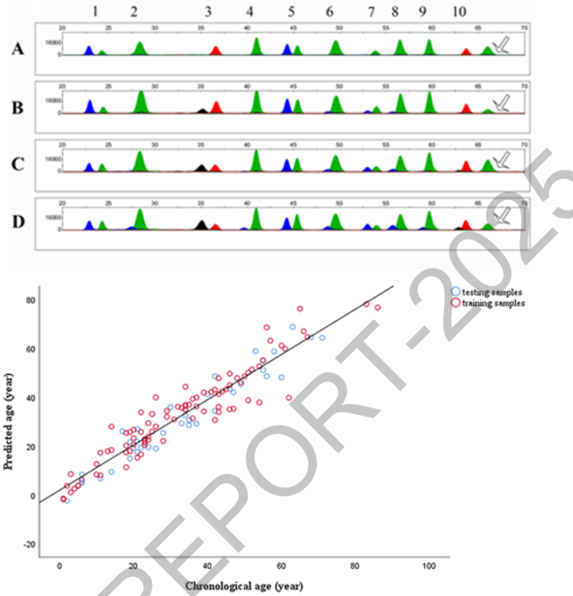

图1. 不同年龄头发样本甲基化分型图及头发样本预测年龄与实际年龄散点图。

然而，由于法医现场多为微量降解检材，可提取到的DNA质量差含量低。针对难度较高的法医血痕检材，我们构建了一种基于焦磷酸测序和随机重分离的灵敏快速的血痕年龄预测检测体系（图2）。使用128名10\~79岁男性和113名女性的血痕样本，利用焦磷酸测序平台检测了ELOVL2、C1orf132、TRIM59、KLF14、FHL2和NPTX2共6个基因中的46个 CpG位点的甲基化水平，并采用正向选择法确定最佳的位点组合。且针对男女性别差异，基于随机森林回归模型分别构建男性和女性的年龄预测模型，该模型包含了7个CpG位点（男性(TRIM59.pos7, KLF14.pos2, ELOVL2.pos7)， 女性(TRIM59.pos8, KLF14.pos3, Clorf132.pos2和FHL2.pos6）的最终年龄预测模型。每个模型的MAD值小于3年。该检测体系只需要0.1ng的基因组DNA，整个过程可以在10小时内完成，使其适用于需要短周期的法医调查（Electrophoresis,2023）。

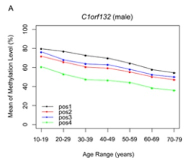

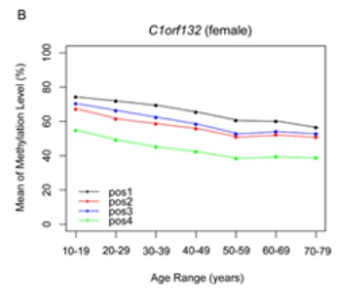

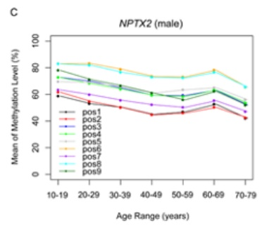

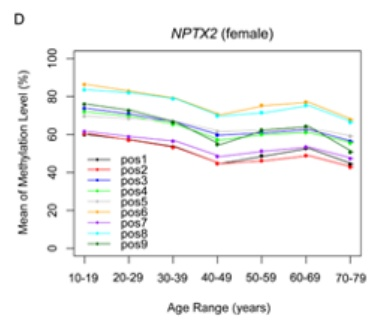

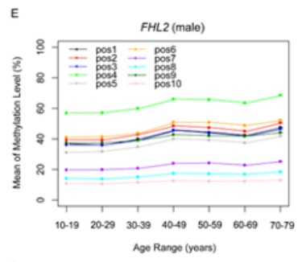

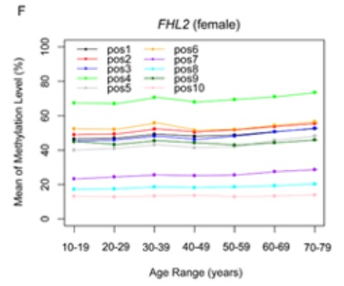

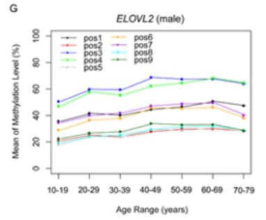

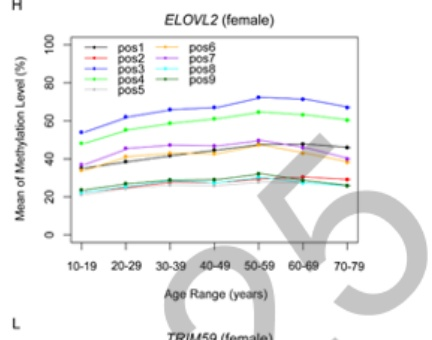

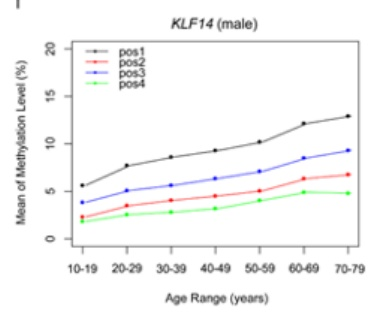

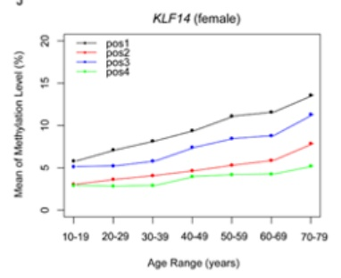

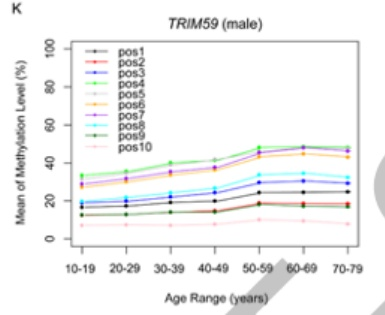

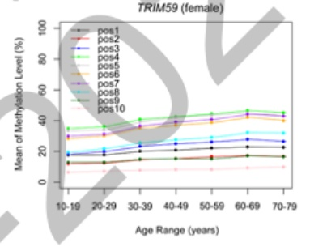

B

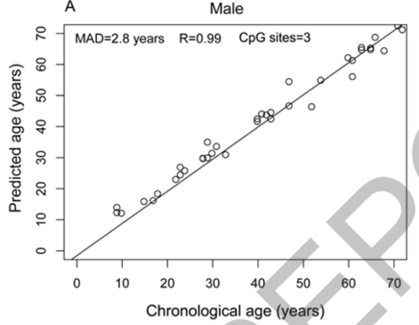

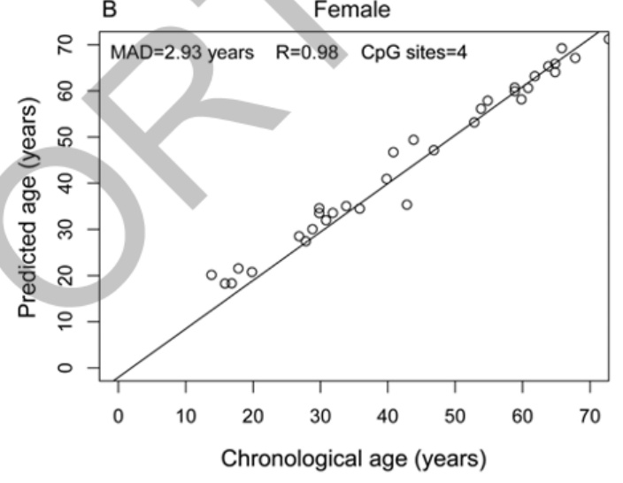

图 2. 不同年龄血液样本6个基因上的46 个 CpG 位点的甲基化水平随年龄变化图以及最终构建的男女年龄预测模型。

目前，大多数研究都是基于常染色体上的甲基化位点进行的，适用于对单一样本来源的DNA进行检测。在法医工作中经常在案件现场遇到混合样本，尤其是男女混合样本，利用Y染色体上的甲基化位点（Y-CpG）构建男性特异的年龄推断模型可以对男女混合检材中男性个体的年龄进行推断。我们通过公共数据库（GEO）中的甲基化数据集筛选出5个与年龄相关的 Y-CpG位点，通过焦磷酸测序技术结合支持向量机算法，构建了一个男性特异的年龄推断模型，模型的训练集的MAD值为5.50岁，测试集的MAD为6.74岁（图3）。随机选择一名男性血液样本，其实际年龄与推断年龄的误差为1.18岁，随后将该男性的基因组DNA与一名女性的基因组DNA以1:1、1:5、1:10、1:50的比例混合，对混合物中的男性个体的推断年龄与实际年龄的误差为1.16至1.74岁。此外，同一男性样本的血液甲基化值与血痕甲基化值之间无显著统计学差异，表明本研究所构建的年龄推断模型同样适用于血痕样本的检测和分析。我们构建的Y-CpG年龄推断模型，可以对男女混合物中男性个体的年龄进行推断（Forensic Sci Int Genet, 2024)。

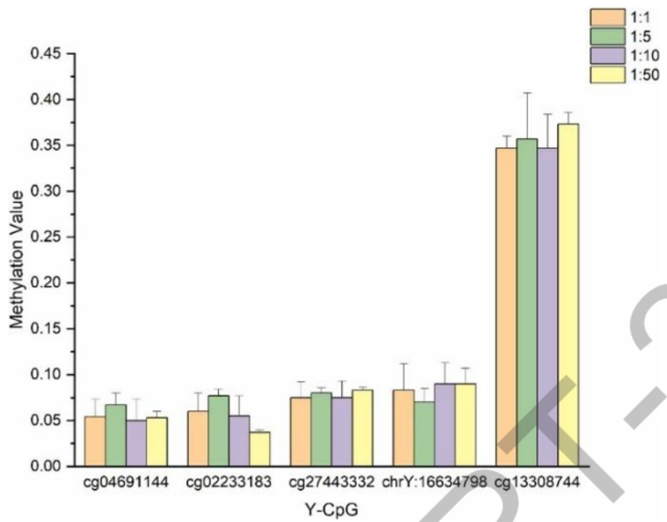

图 3. 男性血液样本中，5个 Y-CpG 位点的甲基化值与实际年龄之间的相关性。

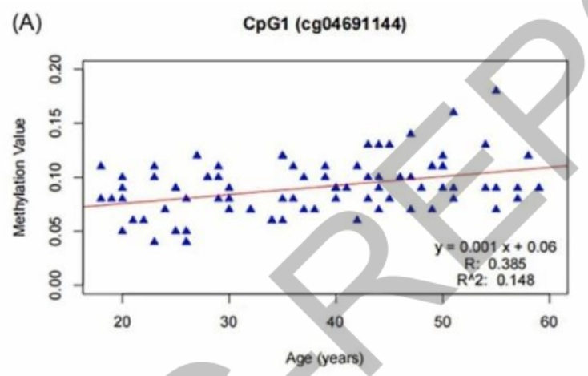

(B)

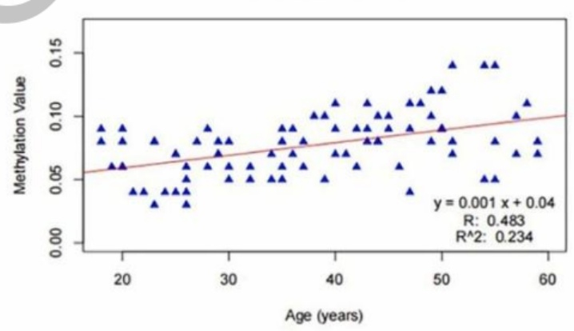

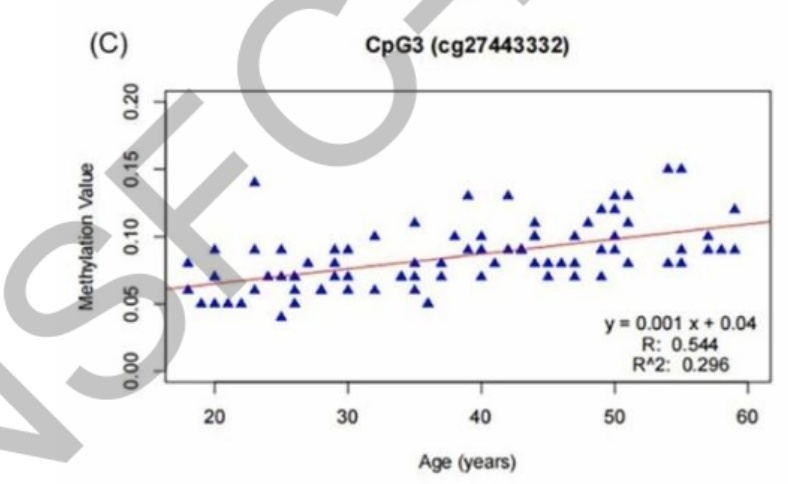

(D)

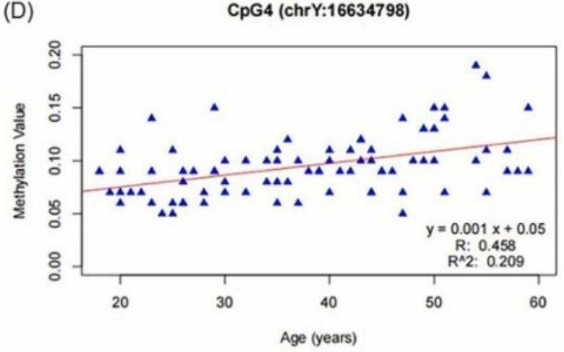

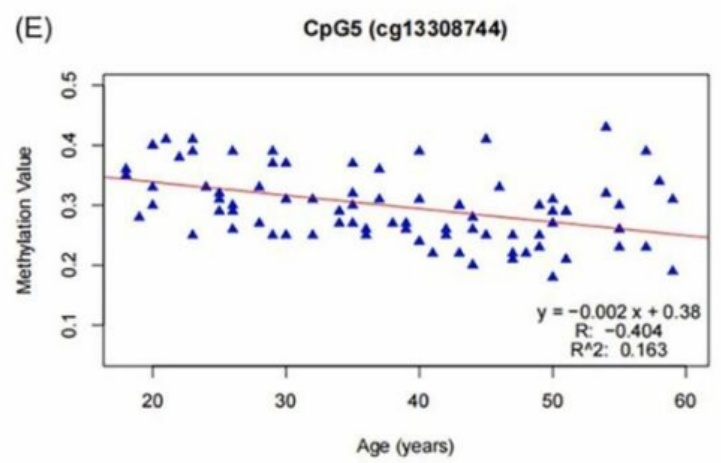

图4. 不同比例的男女混合样本中 5个 Y-CpGs 位点的甲基化值。

通过筛选Y染色体上CpG位点并结合机器学习算法构建男性个体年龄推断模型（图4）。从GEO数据库筛选男性血液甲基化数据集，按照年龄变化趋势对Y染色体上的位点进行差异性分析。对Y染色体上的差异性CpG位点进行线性回归拟合并计算Spearman相关性，基于核心 CpG位点构建支持向量机、梯度提升机、随机森林、多元线性回归、K最邻近等5种机器学习模型用于年龄推断模拟和验证。差异性分析得到26个 CpG 位点，线性拟合得到8个核心 CpG 位点五种机器学习训练模型推断年龄的 MAD 值范围从 5.19岁到 7.68 在验证阶段的数据集中，支持向量机年龄推断模型表现最佳，MAD为 .43 15)。

Table 1 26 CpG loci were screened from the differential analysis

表1 差异化分析中筛选出26个CpG位点

```
          基因变化倍     平均     1统    P值   重要性
           数取对数     表达量    计量
cg15345074  -0.49    0.22  -4.49 0.00  下调
cg27443332  -0.33    0.15  -4.22 0.00  下调
cg09595415  -0.21    0.20  -4.08 0.00  下调
cg03672679  -0.21    0.16  -3.42 0.00  下调
cg04691144   -0.16   0.20  -3.41 0.00  下调
cg04169747  -0.13    0.18  -3.24 0.00  下调
cg06628792   -0.11   0.21  -3.19 0.00  下调
cg02233183  -0.24    0.17  -3.14 0.00  下调
cg11816202  -0.36    0.18  -3.02 0.00  下调
cg00212031  -0.41   0.20   -278  0.01  下调
cg15197499  -0.16    0.25  -2.74 0.01  下调
cg10811597  -0.16   0.22   -2.66 0.01  下调
cg27265812   -0.12  0.18   -2.50 0.01  下调
cg01707559  -0.14   0.18   -2.49 0.01  下调
cg27214488   -0.22  0.20   -2.44 0.02  下调
cg11684211   -0.40  0.23   -2.39 0.02  下调
cg13845521  -0.22    0.15  -2.34 0.02  下调
cg04303809  -0.16    0.22  -2.26 0.03  下调
cg04792227  -0.20    0.21  -2.24 0.03  下调
cg15295597  -0.20    0.20  -2.22 0.03  下调
cg02432075  -0.14    0.18  -2.19 0.03  下调
cg18188392   -0.23   0.20  -2.13 0.03  下调
cg03706273  -0.20    0.22  -2.04 0.04  下调
cg17816615   0.10    0.17  5.27  0.00  上调
cg13308744   0.14    0.15  3.50  0.00  上调
cg25443613   0.20    0.14  2.27  0.02  上调
```

表2 各年龄推断模型训练和验证结果Table 2 Results of training andvalidation of age inference model

```
                  发现阶段                  验证阶段
 方法
          练集MAD         测试集 MAD        验证集MAD
  RF     68(7.58~7.84) 7.54(6.68~8.56) 7.93(7.81~8.14)
       6.84(6.66~6.96) 8.33(7.44~9.17) 7.76(7.52~8.00)
 SVM   6.51(6.39~6.58) 6.87(6.22~7.94) 5.43(5.36~5.53)
 MLR   7.24(7.14~7.32) 7.89(7.00~8.75) 6.36(6.24~6.52)
 GBM   5.19(5.16~5.24) 7.06(6.29~8.04) 7.98(7.87~8.11)
注   括号内为四分位间距。
Note: Interquartile spacing is indicated in parentheses.
```

图 5. GEO 数据库筛选出男性血液样本中 26 个年龄相关的 Y-CpGs 位点并结合机器学习算法构建男性个体年龄推断模型。

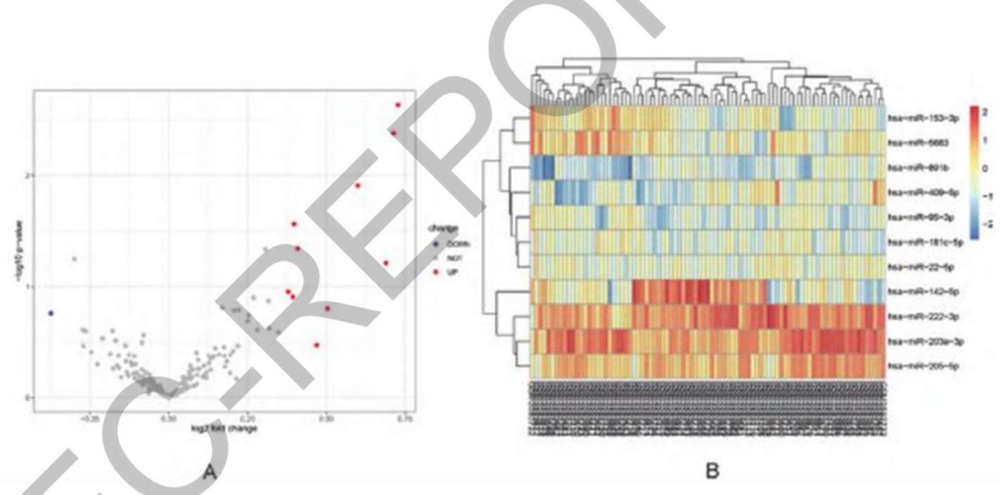

## 2. 基于转录组+人工智能分析的法医年龄推断

我们通过机器学习算法构建精液相关MicroRNAs（miRNAs）的年龄推断模型（图6）。我们从 GEO数据库筛选精液 miRNAs数据集，按照年龄变化趋势对样本进行差异分析。对差异基因进行线性回归拟合并计算 Pearson相关性，基于显著相关miRNAs构建深度学习、梯度提升机、分布式随机森林、广义线性模型等4 种机器学习模型用于年龄推断模拟和验证。差异分析得到 11 个差异miRNAs，通过线性拟合得到 5 个显著相关 miRNAs（hsa-miR-95-3p， hsa-miR-181c- 5p, hsa-miR-203a-3p, hsa-miR-205-5p, hsa-miR-409-5p)。四种机器学习训练模型推断年龄的平均绝对误差（MAE）范围从2.41～4.23岁 在随机抽取的测试集中，深度学习模型表现最佳，MAE为 2.27岁 本研究基于机器学习算法初步验证了精液相关miRNAs在年龄推断领域的可行性，为法医实践提供有效依据（中国法医学杂志，2022）。

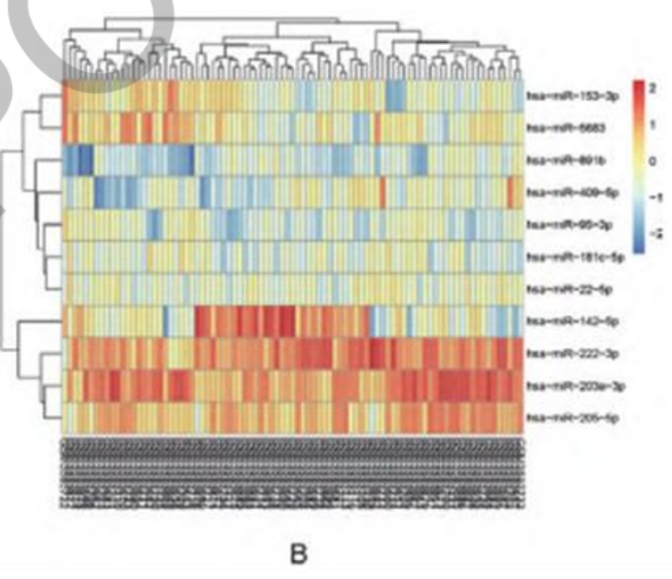

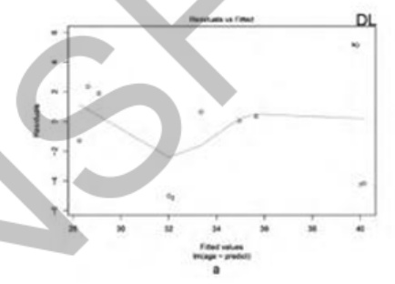

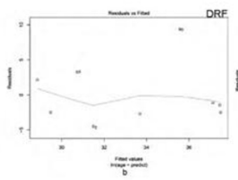

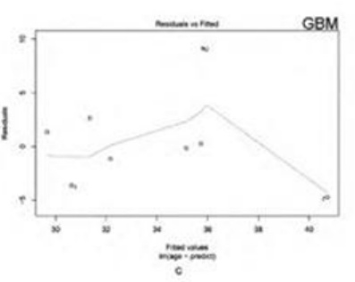

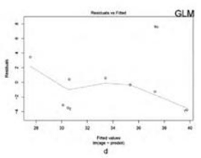

图 6. GEO数据库筛选出精液中与年龄变化相关的 miRNAs 以及不同机器学习算法构建的年龄预测模型。

近年来小分子非编码RNAs为评估陈年样本的相关年龄问题提供了新的解决方法。近期研究发现有一类新型 small RNA piRNA, piRNA与 PIWI 相互作用，长度约为24～32个核苷酸，在PIWI-piRNA途径中起着重要作用，它们在衰老过程中发挥重要作用。我们探索了联合应用piRNAs和miRNAs用于推断年龄的可能性（图7)。通过高通量测序技术，我们在储存了八年的冻血中确定了五个与年龄相关的piRNAs。进一步应用实时聚合酶链式反应(PCR）发现两种 piRNAs: piR-000753和piR-020548的表达与年龄存在相关性。接下来联合应用两个与年龄相关的 miRNAs miR-324-3p和 miR-330-5p建立年龄推断模型。在所有算法中，梯度提升算法（Gradient Boosting）显示出最低的 MAE和均方根误差（RMSE）值（分别为3.17年和4.40年）。结果表明，piRNA和miRNA标记物的联合使用可能会提高年龄估算的准确性（Int J Legal Med, 2023)。

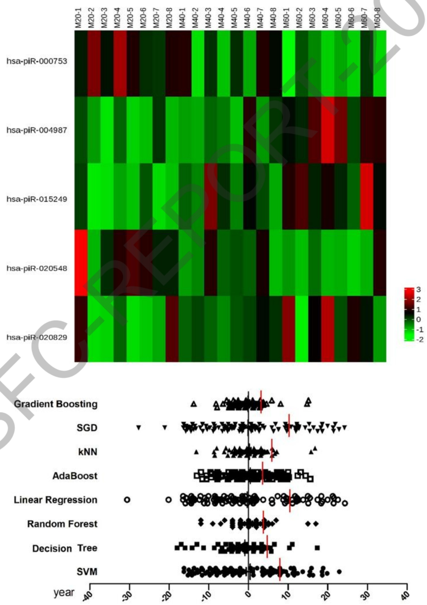

图7. 通过大规模并行测序确定的血液样本中与年龄相关的piRNA 以及通过不同统计模型构建的血液年龄预测模型。

B

## 3. 基于甲基化和转录组+人工智能分析的法医年龄推断

广泛年龄推断研究主要集中在基于DNA甲基化（DNAm）和miRNA标记的年龄测定上。但有报道称，结合不同类型的分子组学数据有助于建立更准确的年龄预测模型。我们基于多重液滴数字PCR（ddPCR）系统（图8），开发了一种可以同时检测与年龄相关的 DNAm 和 miRNA 标记，包括 KLF14、miR-106b-5p和两个参考基因（C-LESS-C1和RNU6B）。我们检测并计算了132份血液样本中KLF14的甲基化水平和miR-106b-5p的相对表达水平，用于构建年龄预测模型，然后使用血痕样本对最佳模型进行评估。研究结果表明随机森林（RF） 模型在组合年龄预测模型中的验证集的MAD值为 3.51年，最大 R²为0.84。血痕样本的MAD为5.66年，绝对误差为3.16至10.54年。我们的研究表明，结合DNAm和miRNA数据可以提高年龄预测的准确性， 这在法医学中具有潜在的应用(Electrophoresis, 2025)。

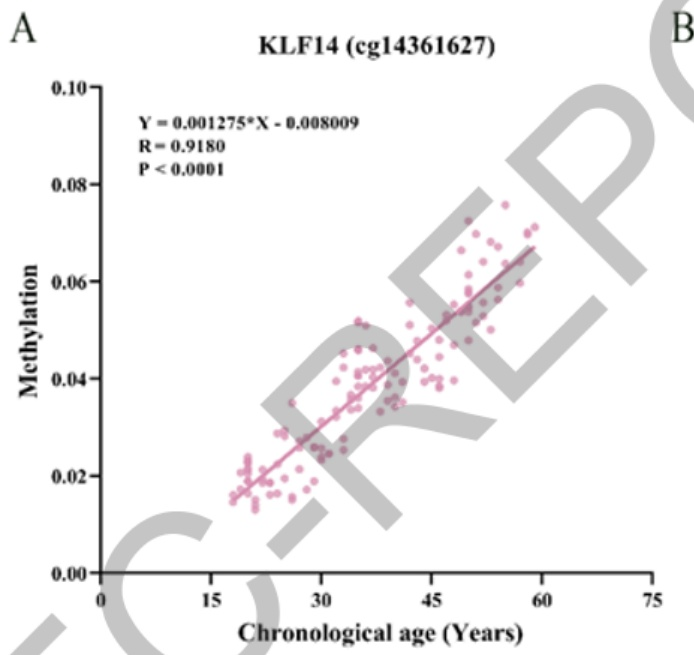

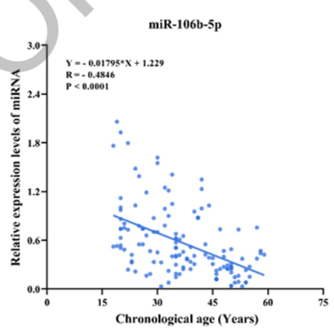

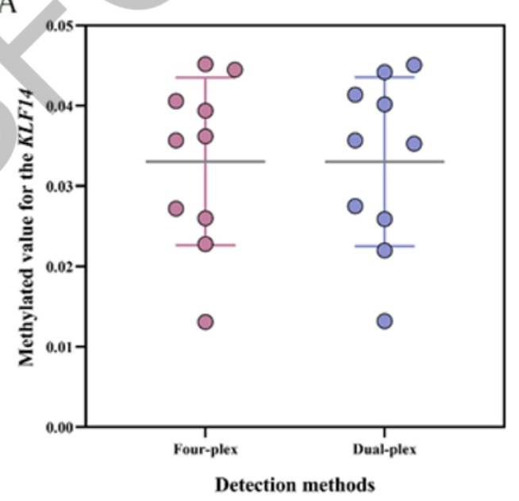

B

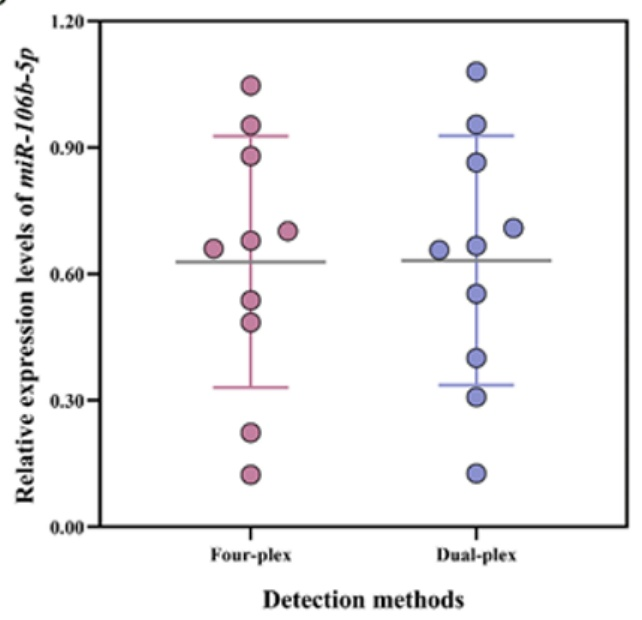

图8. 基于表观组和转录组构建的年龄预测模型以及通过 ddPCR 构建四重和双重检测体系检测血液样本中 KLF14 CpG 的甲基化值和 miR-106b-5p的相对表达水平。

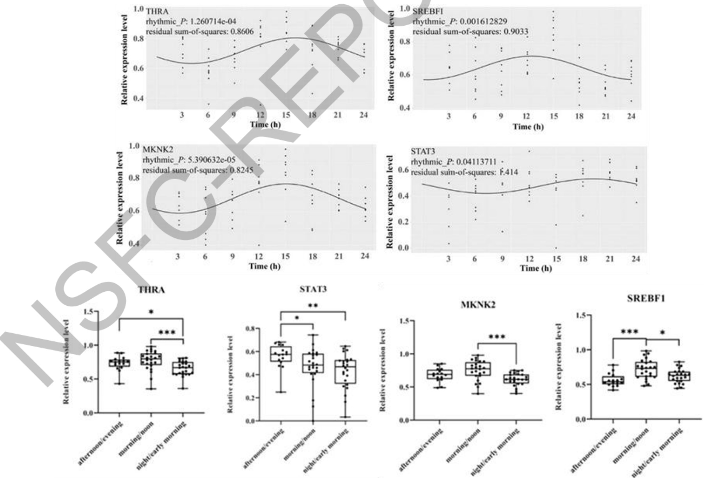

## 4. 基于转录组+人工智能分析的血痕遗留时间推断

血痕遗留时间推断可以为案件的侦破提供重要信息，而目前的研究大部分是针对血痕的遗留时间段进行推测，无法确定血痕在一天中遗留的具体时间。我们通过机器学习算法构建血痕相关节律性mRNA的遗留时间推断模型（图9)。我们从之前研究中筛选血液的昼夜节律相关的mRNA标记，基于实时定量荧光PCR技术对其进行血痕样本的检测。对血痕中可检测的基因进行昼夜节律性分析，基于节律性mRNA构建自适应提升算法、多元线性回归、回归树 k-最近邻、装袋回归、支持向量机等6种机器学习模型用于血痕遗留昼夜节律时间推断模拟和验证。最终获得4个节律性mRNA标记(MKNK2,THRA,STAT3,SREBF1)。六种机器学习训练模型推断遗留时间的平均MAE范围从3.55\~5.14小时。在随机抽取的测试集中，k-最近邻模型表现最佳，MAE为3.92小时。本研究基于机器学习算法初步验证了昼夜节律性mRNA在血痕昼夜节律遗留时间推断领域的可行性，为法医实践提供新的方向（Forensic Sci Int Genet, 2023)。

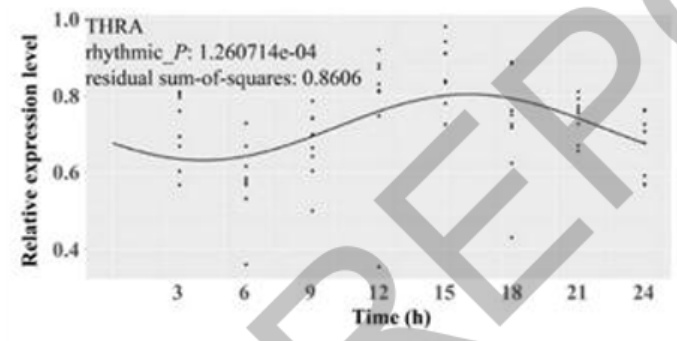

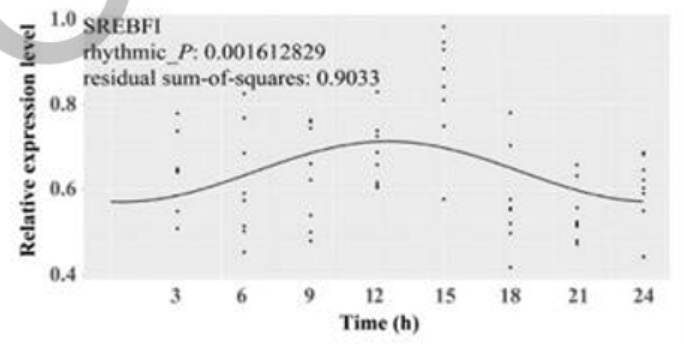

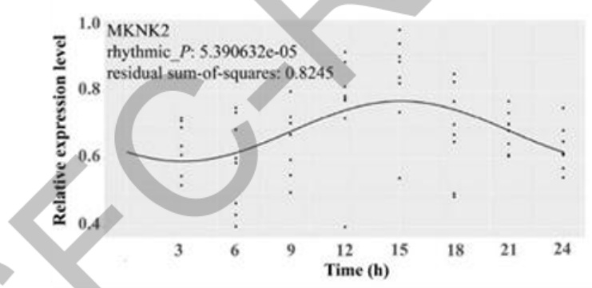

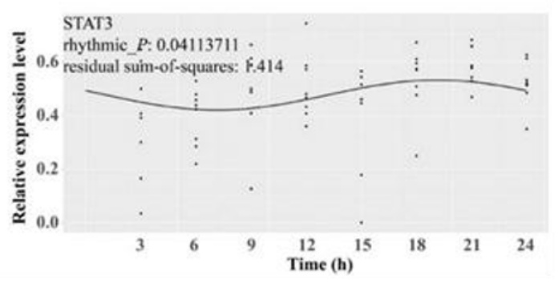

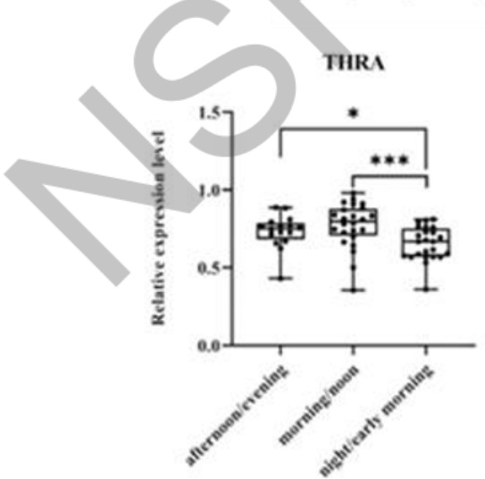

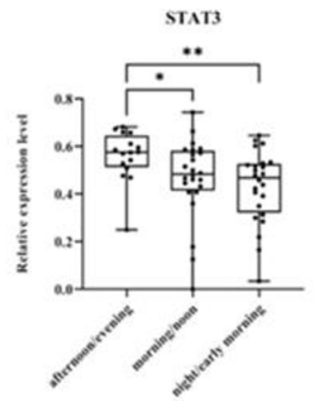

图9. 4个节律mRNA在8个时间点的相对表达水平。

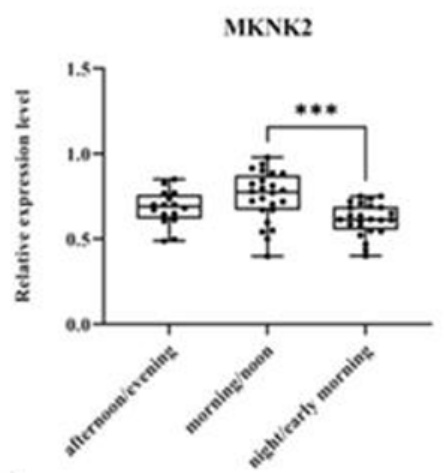

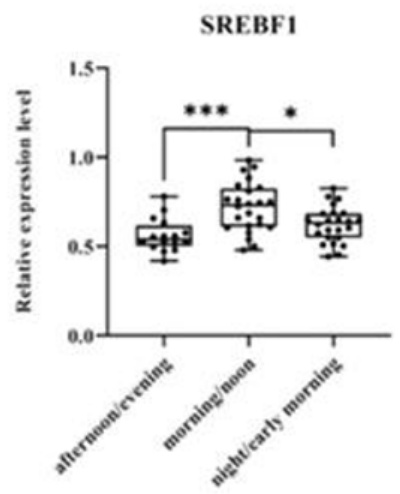

## 5. 基于代谢组+人工智能分析的血痕遗留时间推断

代谢物作为细胞代谢的产物，可以提供丰富的生物信息，并且由于其分子量

低，比其他生物标志物更不易降解。由于这些特性，代谢物可以用作法医调查的有价值的生物标志物。了解血迹沉积的时间有助于重建犯罪现场，得出犯罪时间的结论，缩小可能的嫌疑人范围。先前的研究表明，血液中某些代谢物的浓度会受到昼夜节律变化的影响。然而，血痕的昼夜代谢产物尚不清楚。在真实条件下，共制备了64个血痕样本，分为三个时间类别（上午/中午（09:00\~17:00）、下午/晚上（18:00\~23:00）和晚上/清晨（24:00\~08:00））。在三个时间类别中鉴定出50种具有显著差异的血迹代谢物（图10）。其中28种代谢物表现出明显的昼夜节律变化。最后，选择三种独立贡献的昼夜代谢产物来构建逻辑回归模型，其曲线下面积分别为0.91、0.84和0.87，用于预测血痕在上午/中午、下午/晚上和晚上/清晨的沉积时间。研究表明，昼夜代谢产物可用于评估血迹沉积的时间。这将为法医调查中分析生物痕迹的沉积时间提供有价值的视角（Forensic Sci Int 2024)。

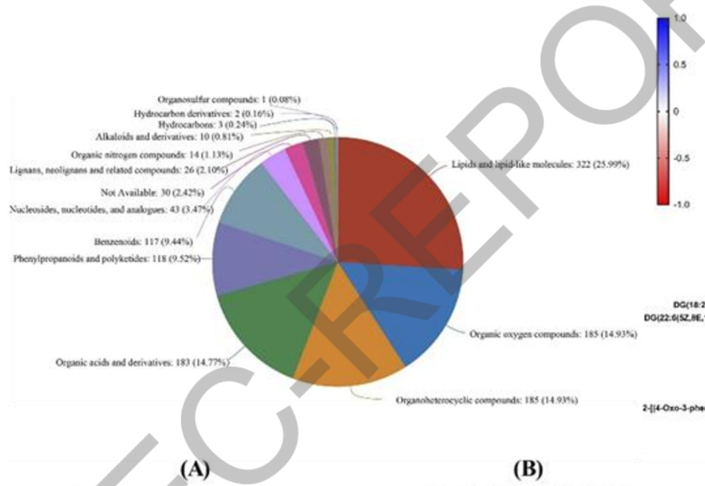

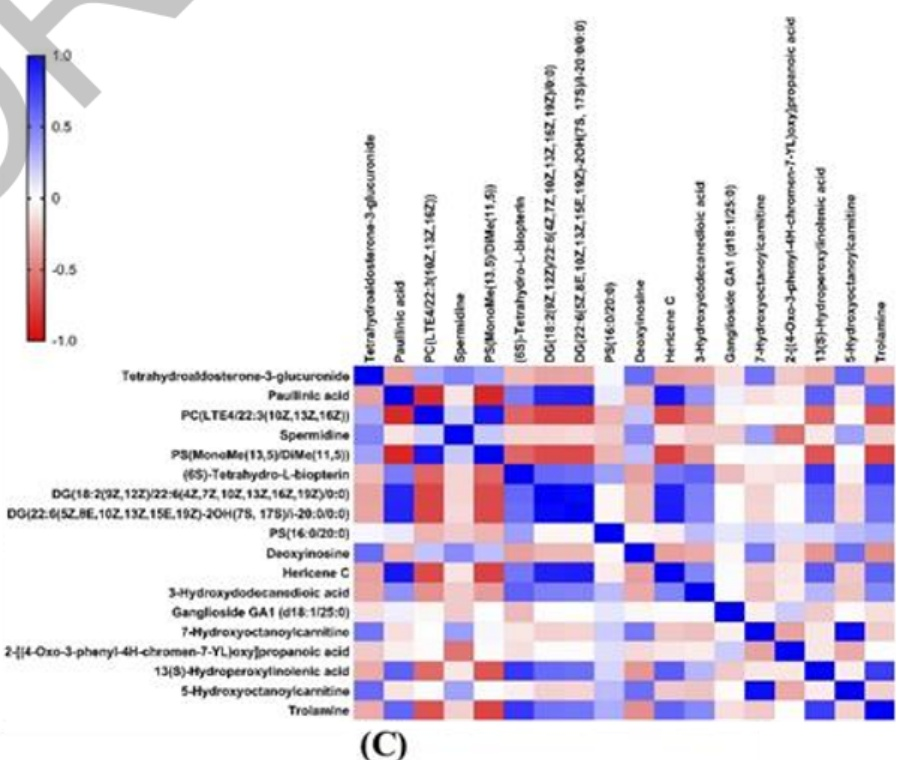

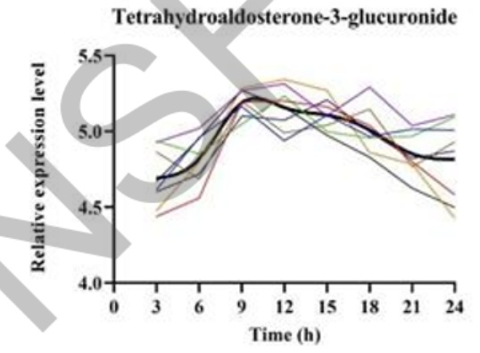

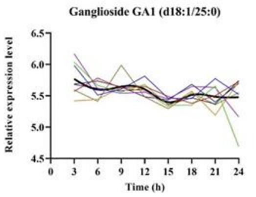

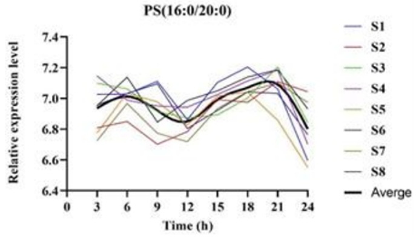

图10. 基于HMBD数据库筛选血迹中18种昼夜节性代谢物以及3种具有独立贡献昼夜节律性代谢物的表达模式。

## 二、基于多组学+人工智能分析的体液溯源和混合斑解析

## 1. RNA 逆转录效率评估

RNA分析在法医领域具有重要价值，可应用于体液/组织鉴定、死亡时间推断等，但大部分后续实验都需经逆转录（RT）步骤将RNA转化为cDNA，而该步骤稳定性差，对法医微量样本的数据分析影响显著。本研究探究了不同RNA模板输入量与 cDNA 产量的变化模式，以 EasyQuick RT MasterMix试剂盒和ACTB 管家基因为核心，对 RNA 标准品（1μg/μL\~0.24 ng/μL的2 倍梯度稀释）及血液、唾液、血斑、唾液渍斑等法医样本进行逆转录，通过ddPCR技术定量分析 RT 产量。结果显示，在 10 μL RT 反应体系中，125 ng RNA 模板的 RT 产量最高（图 11），法医斑迹样本因 RNA量均低于125 ng，增加模板输入量可提升产量；研究还验证了ddPCR检测灵敏度达 0.0012 ng/μL，最终建议在使用任何逆转录试剂盒前，需通过系统实验确定最佳RNA输入量 保障法医RNA分析的可靠性(Biochem Biophys Res Commun, 2024)。

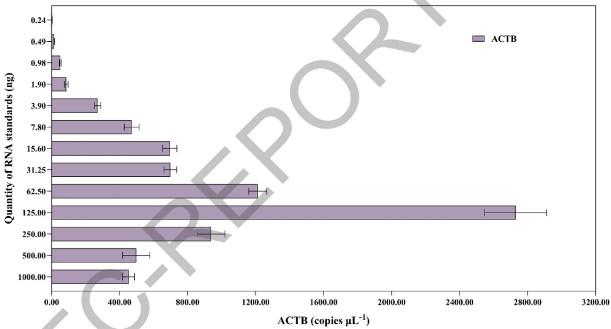

图 11. RNA 标准品在1 μg \~ 0.24 ng 投入范围，ACTB 基因的逆转录产量分布图。

## 2. 基于转录组学+人工智能分析的毛干精准溯源

毛干是犯罪现场常见的生物检材，但核DNA含量极低且高度降解，传统短串联重复序列（STR）分析困难。我们开发了一种基于毛于mRNA多态性的大规模平行测序（massively parallel sequencing,MPS）方法，用于法医毛干个体识别。研究通过转录组测序筛选出在毛干中高表达的mRNA，构建了一个包含78个基因、404个单核苷酸多态性（SNP）位点（最终保留71个基因、284个SNP）的MPS检测体系（如图12）。在40名中国汉族个体中验证了该体系的性能。结果显示，该体系具有极高的个体识别能力，随机匹配概率（randommatchprobability，

RMP）中位数达4.36×10-50。即使在仅使用单根5cm毛干的情况下，仍能检测出约70%的扩增子，其中约半数与使用15根毛于的基因型一致。体系具有良好的种属特异性，虽在猫、狗、兔、鼠毛发中可检出少量扩增子，但其分型与数据库记录不符。此外，还证实了毛干mRNA与基因组DNA（gDNA）分型结果高度一致，且不同身体部位（头皮、腋毛、阴毛、腿毛）及不同颜色（黑发与白发）毛发的分型结果无显著差异。对于室温保存长达2年的陈旧毛干，体系仍能保持较好的检测效能。研究还发现，越靠近毛根部的片段，检测成功率越高， 建议在实际应用中对距离毛根20cm内的片段进行检测。本研究为法医学中缺乏核DNA的毛干检材提供了一种新的个体识别策略（Forensic Sci Int Genet, 2026)。

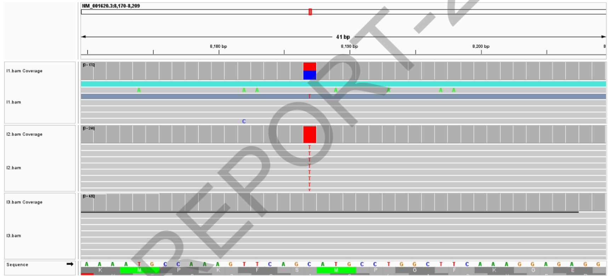

图 12. IGV 可视化 rs486903 位点分型。

## 3. 基于转录组+人工智能分析的体液溯源和混合斑解析

血液是法医现场最常见的检材。我们建立了一种基于外周血特异性mRNA多态性的法医学检测方法，用于在混合体液斑迹中准确识别血液贡献者。团队筛选出 5 个外周血特异性 mRNA 标志物（SPTB, CD3G, AMICA1, ANK1 和 GYPA)，涵盖16个编码 SNP（coding SNP, cSNP）位点，并引入5种其他体液（月经血、精液、皮肤、唾液、阴道分泌物）的特异性基因作为指示基因。通过建立多重PCR与单碱基延伸（Single base extension,SBE）结合毛细管电泳的分析体系，实现了对外周血特异性mRNA中cSNP的分型。该体系具有高度的组织特异性与灵敏度，可在仅含1 ng 外周血 RNA 的混合样本中成功检测血液特异性 cSNP，对血液与唾液、精液、阴道分泌物的混合检测灵敏度达1:100，与皮肤的混合检测灵敏度为1:10。在模拟复杂混合斑（血液:精液:唾液:皮肤=1:70:20:10）中，体系仍能有效识别占比1%的微量血液贡献者，表明其在不平衡混合样本中具有良好的解析能力。我们同时还验证了所选mRNA标记在中国汉族人群中的多态性（图13），计算得出联合识别力（combined discrimination power,CDP）为0.99929，具备较高的个体识别能力。尽管部分标记（如AMICA1,CD3G）在阴道分泌物中偶有交叉反应，但通过信号强度与辅助标记的组合分析，仍可准确判断体液来源(Electrophoresis，2020)。

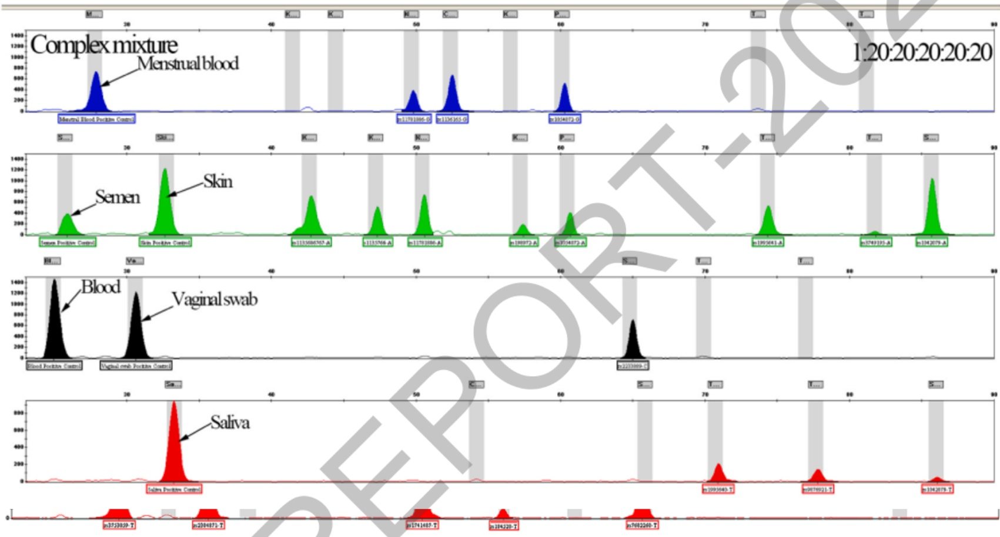

图 13. 血液 mRNA 多态性检测体系。

精斑是法医检案中另一种常见的斑迹检材，我们开发了一种基于精液特异性mRNA中cSNP的检测方法，用于在混合体液样本中准确识别精液贡献者。团队筛选出 8 个精液特异性 mRNA 标志物（KLK3, NKX3-1, CKB, KLK2, PRAC1, SEMG1, TGM4 和 SORD)，涵盖 12 个 cSNP 位点，并建立了一套包含逆转录聚合酶链反应、多重PCR和SNaPshot分型技术的检测体系。该体系表现出高度的组织特异性与灵敏度，可在含有1 ng 精液 cDNA 的复杂体液中成功检测精液特异性cSNP，混合斑检测灵敏度范围达1:10至1:100，同时，研究证实mRNA中的 cSNP 多态性与 gDNA 保持一致，排除了 RNA 编辑对分型结果的干扰（图14）。本方法突破了传统精液检测技术（如显微镜检、PSA检测）在无精子症或低精子量样本中的应用局限，为强奸案等涉及混合体液的法医学鉴定提供了新策略(Forensic Sci Int Genet, 2021)。

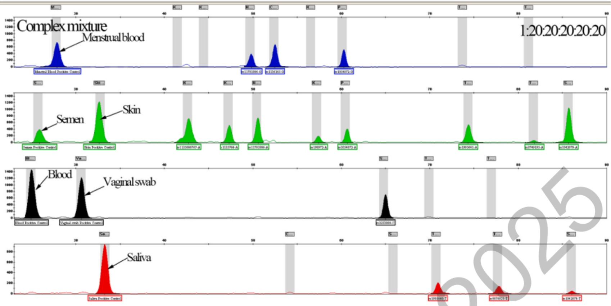

图 14. 在精斑占比1 %的复杂混合斑中，可以得到精液供者的完整 cSNP位点分型。

## 4. 基于表观组学+人工智能分析的体液溯源和混合斑解析

针对性犯罪案件中混合斑物理分离法存在的细胞破裂及分离不全风险，本研究构建了“甲基化敏感限制酶（MSRE）+ SNP”联合检测策略（图1）。通过筛选高度特异性的 CpG位点，并利用 MSRE技术特异性保留甲基化片段，成功建立了包含12 个精液特异性 CpG-SNP位点的检测体系（图15)。该方法无需亚硫酸氢盐转化，有效避免了DNA损耗，实现了在单一反应中同步完成体液鉴定与个体分型。研究证实， 该体系在混合样本分析中特异性良好，可精准解析精液含量在25%以上的混合斑，并准确获取供者SNP分型。该成果突破了传统技术瓶颈，填补了利用单 平台同时实现混合斑“定性”与“溯源”的技术空白（IntJ Legal Med, 2021)。

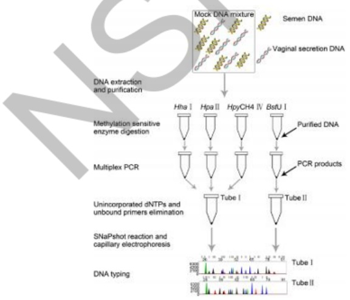

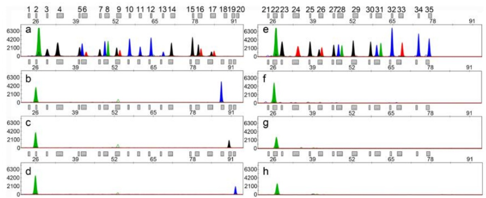

图15. 基于MSRE的精液特异性检测策略与特异性验证。左图:实验设计流程示意图。采用四种甲基化敏感限制酶（Hha I, Hpa II, HpyCH4 IV, BstU I）处理 DNA，结合多重 PCR与 SNaPshot技术进行检测；右图:12个精液特异性CpG-SNP复合标记在不同组织中的分型结果。图中a-d为第一组反应管（TubeI）结果，e-h为第二组反应管（TubeII）结

果。其中，a/e为精液样本，可见特异性扩增峰；b/f为阴道分泌物，c/g为血液，d/h为唾液，均无特异性扩增峰或仅有极低背景噪音，表明该体系具有良好的精液特异性。

为攻克陈旧、降解检材检测灵敏度低的难题，本研究引入插入缺失（InDel）及 STR标记，构建了“CpG-InDel/STR”多维复合检测体系。利用扩增阻滞突变系统（ARMS）技术，对扩容后的17个精液特异性位点进行高信噪比扩增（图16)，显著降低背景噪音，旨在实现对复杂混合斑中微量成分的深度挖掘与精准锁定。研究成功建立了17个位点的复合检测面板。测试结果显示，该体系灵敏度实现质的飞跃，可成功检出混合斑中含量低至3.03%的微量精液成分。同时，对精液供者的累计个体识别能力（CDP）达到0.9999998，极大地提升了证据效力，特别适用于陈旧疑难案件的鉴定（Int J Legal Med，2022）。

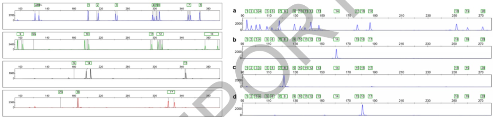

图16.17 个精液特异性 CpG-InDel/STR 复合标记的分型图谱及组织特异性验证。左图:单一精液样本中17个复合标记及性别标记（AMEL）的完整分型图谱；右图:体系的组织特异性验证结果。a为精液样本，可见所有位点均成功扩增；b为阴道分泌物样本，c为唾液样本，d为血液样本。结果显示，在非精液样本（b，c,d）中，精液特异性标记均未检出，仅指示性标记（如14号阴道分泌物标记、8号唾液标记、16号血液标记）有特异性扩增，证实了该体系优异的精液特异性。

针对暴力犯罪现场复杂血液混合斑的溯源挑战，本研究筛选出一组高特异性血液 CpG 标志物，并与连锁 SNP 结合，构建了专用于血液鉴识的 CpG-SNP 复合检测体系。该研究重点攻克了微量DNA模板下的扩增效率问题（图17)，通过优化多重PCR体系，构建了一个包含19个血液特异性标记的“全能型”检测工具箱，实现了对血液来源的精准还原。实验数据表明，该体系具有极高的检测灵敏度，仅需15ng起始DNA即可获得完整分型。在混合斑解析方面，该方法展现出卓越的微量成分捕获能力，能有效检出比例低至1%的微量血液成分，累计个体识别能力达0.999983，为微量血痕的来源鉴定提供了强有力的技术支撑（Int

## J Legal Med, 2024)。

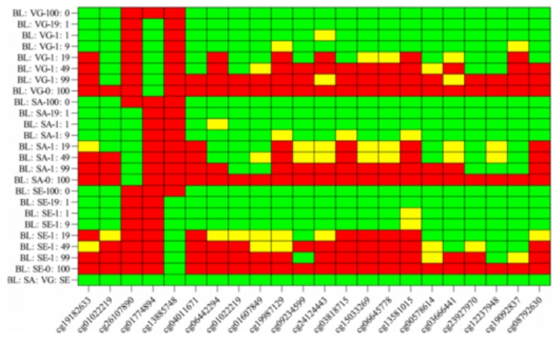

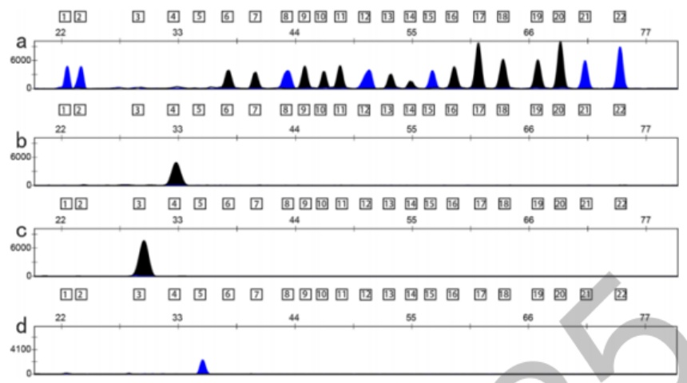

图17.19个血液特异性 CpG-SNP 标记的混合样本检测热图及特异性验证。左图:混合样本检测效率热图。纵坐标表示血液与其他体液（阴道分泌物VG、唾液SA、精液SE）按不同比例（100:0至1:99）混合的样本；绿色代表强阳性检出，黄色代表弱阳性，红色代表未检出。结果显示在低至1%的血液含量下仍有标记可被检出；右图:体系的组织特异性验证。a为血液样本，可见19个血液特异性标记均有明显峰值；b为阴道分泌物，c为唾液，d为精液。非血液样本中无特异性扩增，证明了该体系对血液鉴定的高度特异性。)

## 三、基于微生物组+人工智能分析的法医精准鉴识研究

## 1. 基于微生物组+人工智能分析的法医死亡时间推断

微生物组标记用于法医学死亡时间推断。为了探讨微生物时钟变化规律能否作为精准推断埋葬尸体死亡时间(PMI)的有效手段。我们使用基于细菌16SrRNA基因扩增子的高通量测序技术，对SD大鼠死亡后0 h、12 h、1d、2d、3d、7d、14 d、30 d、 45d、60d的埋葬尸体的尸坑土、表皮和直肠的微生物群落进行了表征（图18） 结果表明，腐败后期尸体的微生物群落alpha多样性显著低于腐败前期 在腐败前期，不同部位的细菌物种组成差异较大，而在腐败后期均由nicutes（厚壁菌门）、Proteobacteria（变形菌门）和Bacteroidetes（拟杆菌门）占据主导地位。我们对微生物群落的相似度与时间间隔进行了线性拟合，结果表明腐败尸体微生物具有规律性的时钟变化规律，这表明利用微生物群落预测埋葬尸体死亡时间具有可行性。随后，我们采用随机森林学习算法对微生物群落与埋葬尸体死亡时间进行了回归分析，筛选出一系列微生物标记物，利用这些标记物进行了预测模型的拟合和验证，结果显示，尸坑土、表皮和直肠的模型拟合度分别达到86.83 %、84.55 %和81.67 %，预测模型的平均绝对误差为1.82 ± 0.33 d、2.06±0.38 d、2.12±0.40d（图18）。与国外有关暴露尸体的研究相比，预测误差明显更低，表明宏基因组技术在精准预测埋葬尸体死亡时间方面具有显著优势和广阔的应用前景。相关研究成果已发表（Forensic Sci Int Genet, 2021）。

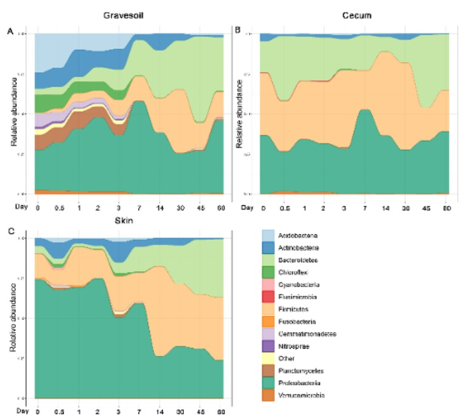

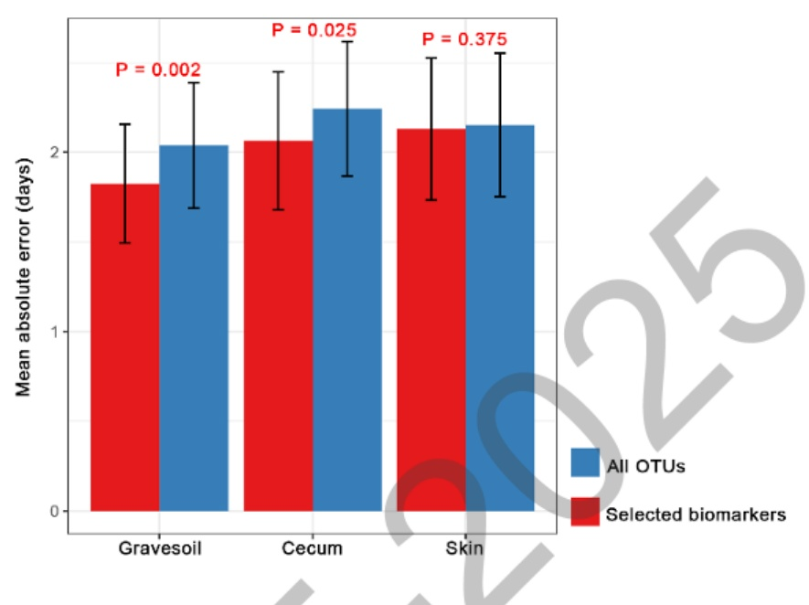

图18. 基于埋葬尸体微生物群落时钟变化规律进行死亡时间推断。

上述的研究是基于相对定量技术开展，然而尸体腐败过程微生物载量同样会发生剧烈的变化，我们首次采用微生物绝对定量技术（QMP）对大鼠尸体细菌和真菌群落进行研究，同时研究了尸体腐败过程中代谢组的变化（图19）。结果显示几个主要菌门:Pseudomonadota（假单胞菌门）、Actinobacteriota（放线菌门）、Bacteroidota（拟杆菌门）、Ascomycota（子囊菌门）和Basidiomycota（担子菌门）的绝对丰度表现出与相对丰度截然不同甚至相反的变化趋势，表明相对定量技术在表征群落演替时存在偏差，容易忽略某些微生物类群在腐败进程中发挥的作用。细菌群落对代谢物的解释度高于真菌群落，表明细菌群落在尸体腐败过程中的主导地位 共现网络分析表明，细菌和真菌在尸体腐败代谢过程中既有其独特的生态位，又存在广泛的跨界合作。最后，研究比较了不同组学在预测死亡时间方面的性能，结果表明代谢组预测最为精准，绝对定量技术显著提升了细菌群落预测死亡时间的准确性（MAE值从4.05天提升至2.21天）。该成果为深入理解尸体的微生物分解机制提供了新的更全面的视角（NPJ Biofilms Microbi, 2025）。

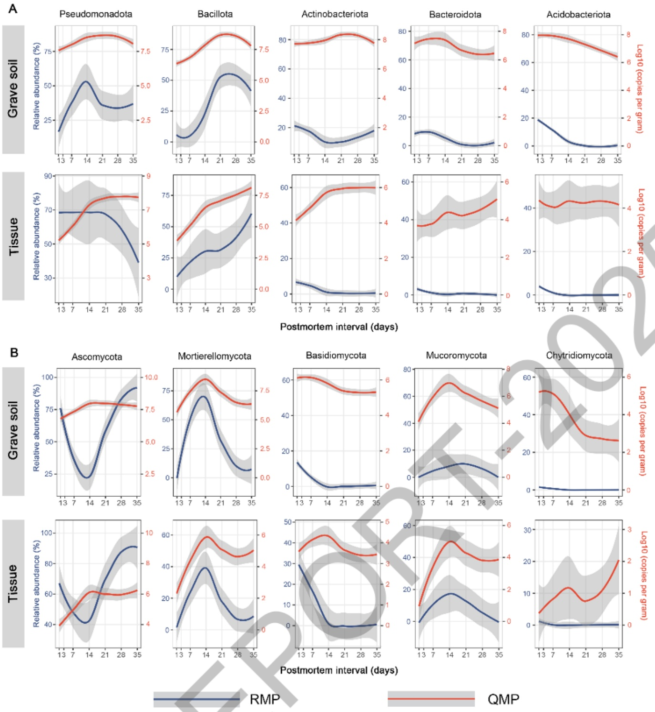

图19. 绝对定量分析和相对定量分析在表征尸体腐败进程中微生物群落变化方面差异。

目前，关于尸体死亡时间的研究多是基于细菌/真菌群落，病毒作为地球上数量最多的生物实体，可通过裂解-溶原转换调控细菌群落，进而在生物地球化学循环中起到关键作用。尸体分解中的病毒演替模式尚未达到充分表征，其作为PMI生物标志物的潜力尚未经过研究，研究对埋葬大鼠尸体35天腐败过程中的病毒演替进行宏基因组分析，揭示了阶段特异性的动态（图20）。早期以Peduoviridae（佩杜病毒科）占主导（0\~3d），中期以Herelleviridae（赫雷勒病毒科）增殖为特征，晚期Peduoviridae重新占据主导地位。Alpha多样性呈波动性下降，β多样性分析证实了PMI解释27%的群落变异。九个病毒家族与PMI显著相关（P<0.05）。结合病毒丰度数据，我们的极度随机树模型实现了优异的PMI预测准确性（MAE=2.54d）。优势细菌门与病毒科之间的斯皮尔曼相关性分析，结合普氏分析和曼特尔检验，证实病毒和细菌群落存在强一致性。这表明病毒可能通过针对细菌进行裂解作用来释放营养物质（如有机氮/磷），从而推动细菌演替并调控分解过程。我们的研究建立了基于病毒的PMI预测新工具，并讨论了尸体腐败过程的生态驱动因素（Appl Environ Microbiol,2025）。

A

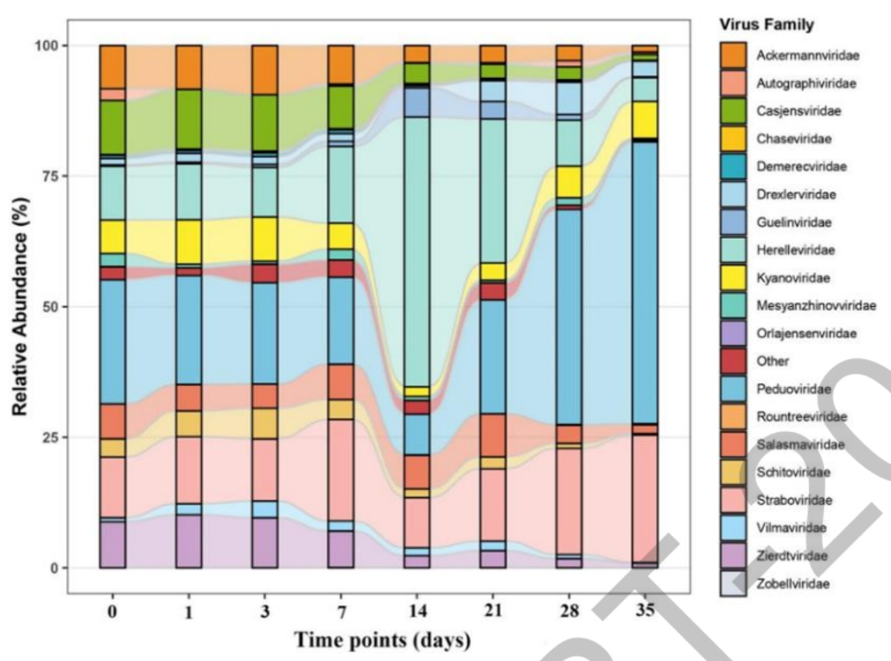

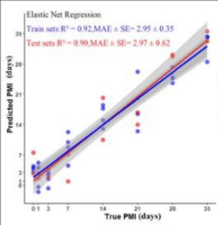

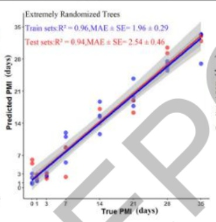

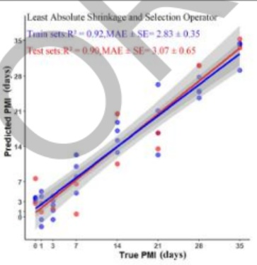

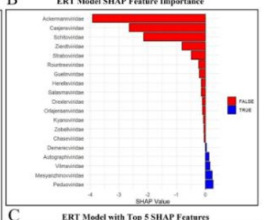

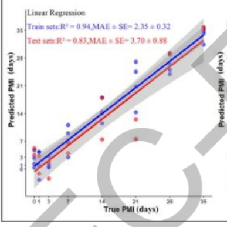

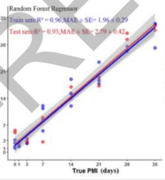

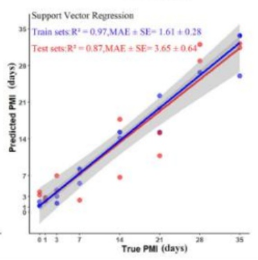

图20. 尸体腐败进程中病毒群落变化由于 PM 预测。

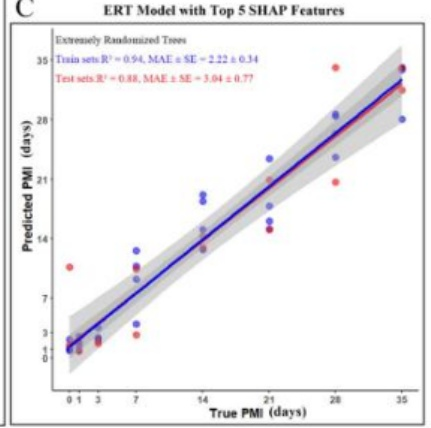

## 2. 基于微生物组+人工智能分析的法医体液斑鉴定和遗留时间推断

确定现场斑迹遗留时间（TsD）可能有助于刑事犯罪的调查。然而，到目前为止，没有可靠的标记和模型可用于短期TsD的推断。我们通过研究人类唾液微生物群落的演替模式在解决法医案件中作为有效TsD预测工具的潜力。收集暴露于室内条件20天内的唾液斑迹，并使用高通量测序技术通过16SrRNA分析。在不同时间点之间观察到微生物组成的显著差异，唾液斑迹的室内暴露时间与测量时间段内的α多样性估计值呈负相关。测序结果用于确定TsD依赖性细菌指标，以回归广义随机森林模型，得出1.41d的MAD。此外，还通过定量PCR（qPCR），利用Enhydobacter、Paenisporosaric ina和Janthino细菌建立了一个简化的TsD预测模型，MAD为3.53d（图21）。进一步使用模拟样本进行了法医实践评估。我们的研究表明，微生物生物标记物可以作为一个“时钟”，用于估计人类干唾液污渍中的TsD，相关成果已发表（Forensic Sci Int Genet, 2022）。

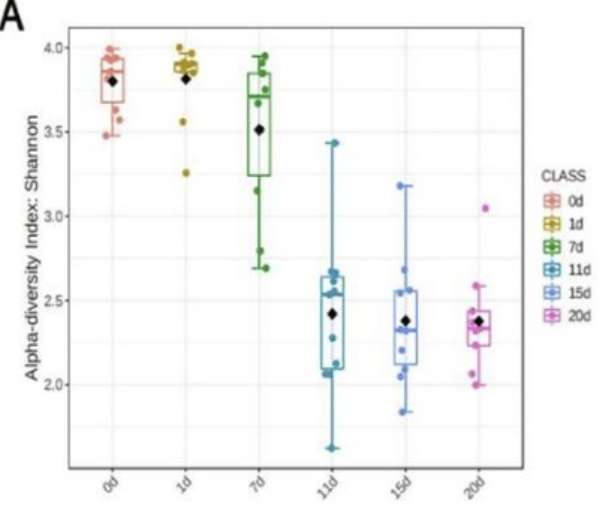

B

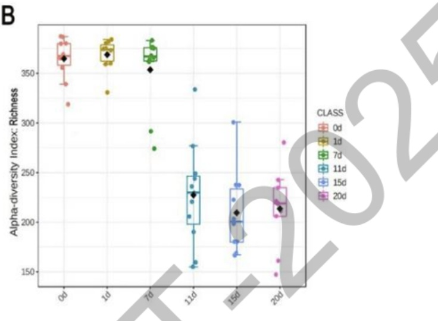

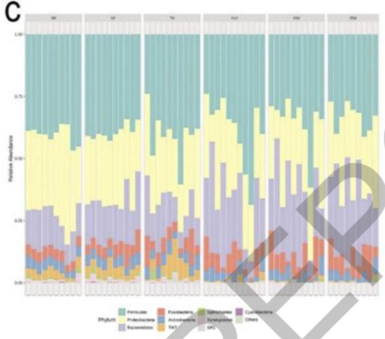

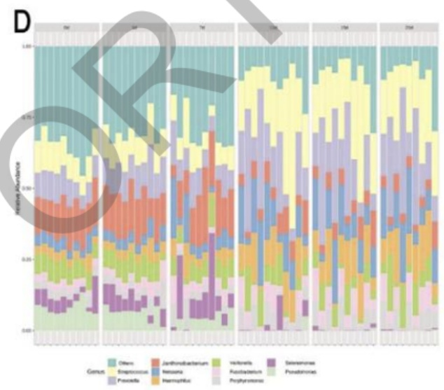

图21. 不同遗留时间唾液微生物群落多样性和组成。

上面的研究表明了基于微生物推断体液遗留时间的可能性，然而遗留在现场往往是未知体液，这对体液遗留时间推断是一项挑战，为了探讨这个问题。本研究选取唾液、精液、阴道分泌物及月经血样本，将其置于室内环境中，并在8个时间节点（新鲜样本放置30天）进行采集。研究基于16SrRNA基因高通量测序技术， 对各时间节点样本的微生物群落结构特征展开分析（图22）。结果显示:随着沉积时间的延长，不同体液斑迹间的微生物群落差异逐渐缩小，体液种类的辨识度随之降低；但即便不预先明确沉积时间，体液种类鉴定的准确率仍能维持在较高水平。与之相对，若在推断沉积时间前未区分体液类型，会导致沉积时间推断的MAE显著升高。不同体液的沉积时间推断精度存在差异:月经血样本的沉积时间预测平均绝对误差最低，仅为1.54±0.39d；而唾液（6.57±1.17d）、精液（6.48±1.33 d）及阴道分泌物（5.35±1.11d）的沉积时间预测误差相对较高，仍有进一步优化的空间。此外，个体差异对体液微生物群落的影响较大，这也是限制沉积时间推断精度的重要因素。综上，微生物特征可用于体液种类鉴定与沉积时间推断的联合检测；在基于微生物组学的法医体液斑迹分析中，应优先完成体液种类鉴定，再开展沉积时间推断工作（Microbiol spectr,2023）。

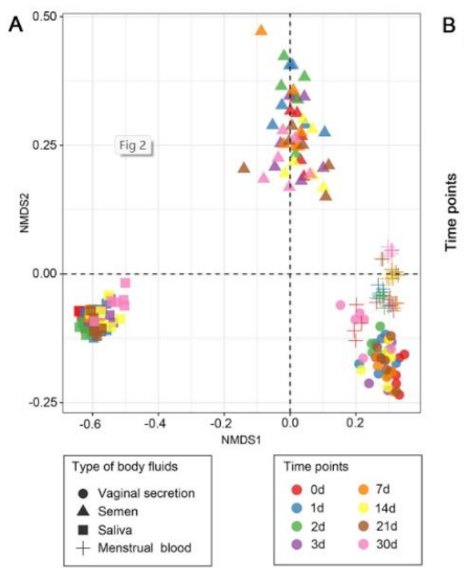

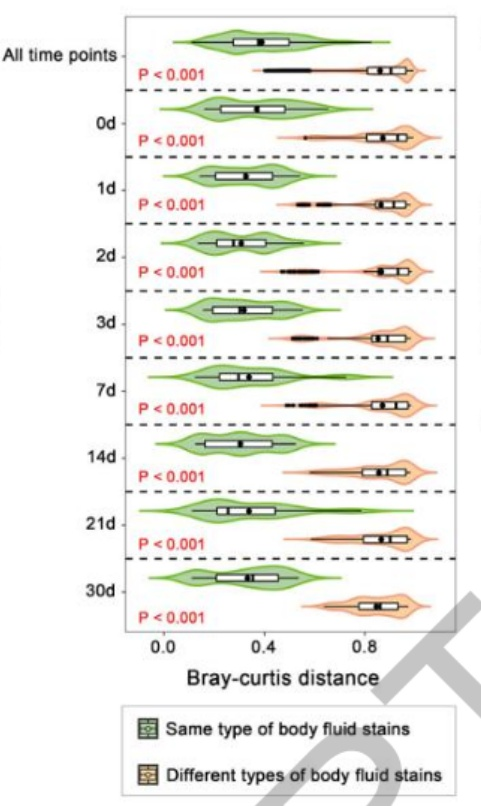

图22. 不同类型体液斑和遗留时间对微生物群落的影响。

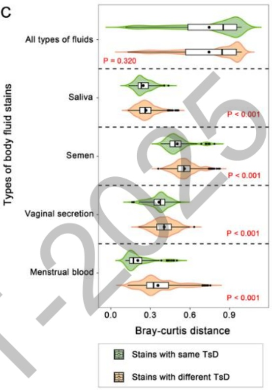

为了研究体液遗留载体对基于微生物组推断体液类型的影响，本研究选取五种法医常见体液（外周血、月经血、鼻腔分泌物、唾液及精液）作为研究对象，将其分别滴注于无菌棉签、床单及地面三种载体表面，置于室内环境下连续暴露7 天。研究采用靶向16SrRNA基因V4区的扩增子测序技术，对各样本的微生物群落结构进行解析（图23 结果表明附着于无菌棉签上的样本可以基于微生物群落依据体液种类实现清晰聚类；而附着于床单和地面的体液样本，其微生物组成与无菌棉签组存在显著差异。主坐标分析（PCoA）结果显示，所有样本的聚类依据以载体类型为主，而非体液种类。置换多元方差分析（PERMANOVA）进一步证实，载体类型对微生物群落变异的解释度（R²=0.211，P<0.001）高于体液种类（R²=0.152，P<0.001）。我们采用MicroDecon工具对模拟体液样本中的载体来源微生物污染进行去除，并基于去污染后的测序数据重新开展主坐标分析与置换多元方差分析。结果显示，样本聚类不再以载体类型为依据，且体液种类对微生物群落变异的解释度（R²=0.240，P<0.001)显著高于载体类型（R²=0.108，P<0.001）。载体环境微生物会对微生物组学体液鉴定技术产生干扰，而通过去污染处理，可在一定程度上降低载体微生物的干扰作用，提升体液种类的区分效能。本项探索性研究为推动微生物组学体液斑迹分析技术在法医实践中的应用提供了重要参考（Forensic Sci Int Genet, 2025）。

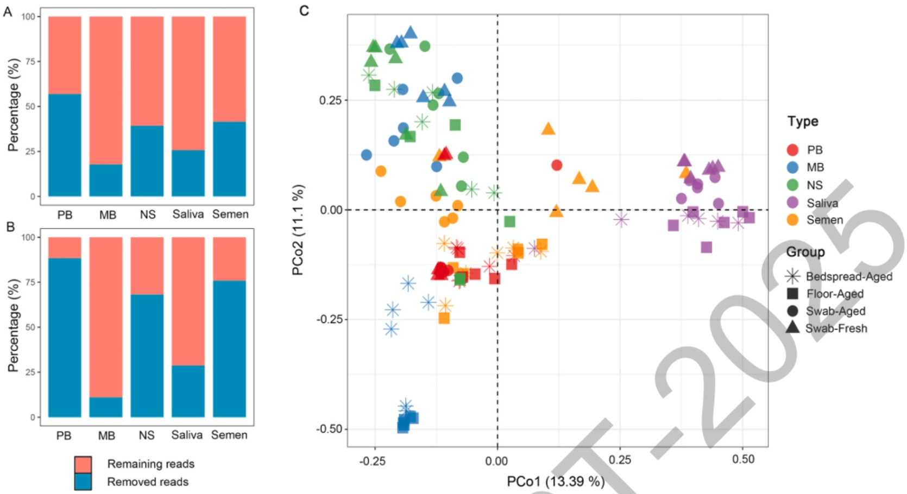

图 23. 基于 MicroDecon 对载体背景微生物进行去噪后提升了体液聚类效果。

上述基于微生物群落进行体液推断的方法均采用测序的策略，无法满足法医现场快检的需求。本研究建立了一种PCR联合侧向流免疫层析试纸条（LFD）的新方法，可同步检测Streptococcus salivarius(唾液链球菌)与Lactobacillus crispatus（卷曲乳杆菌），实现法医检材中唾液与阴道液的精准鉴定（图24）。该方法的LFD 检测结果可在3分钟内通过肉眼直接判读，检测灵敏度可达 0.001 ng/μL DNA。PCR-LFD检测体系成功实现了唾液中唾液链球菌、阴道液中卷曲乳杆菌的特异性检出，且在血液、精液、鼻腔分泌物及皮肤组织样本中均呈阴性。此外，即便在样本DNA混合比例高达1:999的极端条件下，该方法仍可有效检出唾液与阴道液成分。在多种模拟法医检材中，唾液与阴道液均被成功鉴定。上述结果证实，通过靶向检测唾液链球菌与卷曲乳杆菌，能够实现对唾液和阴道液的高效鉴定。进一步研究表明，经该方法鉴定体液所用的DNA样本，可直接作为法医STR分型的模板，并获得完整的 STR 分型图谱。本研究建立的 PCR-LFD检测体系操作简便、检测快速、结果可靠，是一种极具应用前景的法医体液鉴定技术（Int J Legal Med, 2023)。

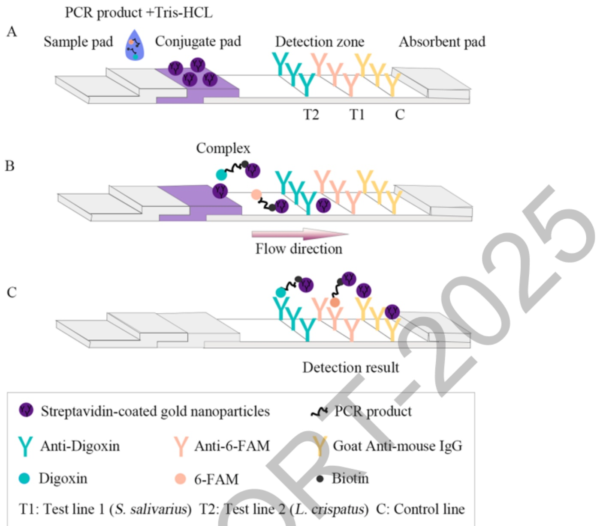

图 24. PCR 联合 LFD 检测唾液和阴道分泌液。

体液斑迹的识别对于法医调查至关重要。虽然当前的分子检测方法具有很高的准确性，但其破坏性取样的特性会损害样本完整性并影响后续的STR分型，从而对微量样本造成显著限制。本研究使用电子鼻技术分析了200份体液样本（包括血液、唾液、精液、阴道分泌物和月经血）中的VOCs（图25）。样本通过无菌拭子（n=100）和卫生纸（n=75）采集。雷达图表明，传感器S7（W1W）在两种载体上均表现出峰值响应。对175个样本的线性判别分析揭示了明显的聚类模式（ANOSIM R= 0.088, p < 0.001）。基于随机森林的预测模型表明，通用模不区分载体类型，n=175）对阴道分泌液的准确率达到100.00%，血液为90.91 %，精液为81.82%，月经血为72.73%，唾液为63.64%；总体准确率为81.82%。值得注意的是，当专门使用卫生纸作为载体时，准确率提高至92.00%，其中唾液、月经血和阴道分泌液达到100.00%的完美准确率，而血液和精液的准确率分别为80.00%。采用一个包含n=25的外部验证集来评估使用无菌拭子载体的准确率；结果显示总体准确率为84.00%。具体而言:血液和唾液均达到100.00%的准确率，精液和MB的准确率为80.00%，阴道分泌液的准确率最低，为60.00%。