项目批准号 82171254申请代码 H0904归口管理部门收件日期

20250182171254

# 国家自然科学基金

# 资助项目结题/成果报告

资助类别:面上项目

亚类说明:

附注说明:源于临床实践的科学问题探索研究

基于全基因组测序和人工智能的SCA3/MJD修饰基因鉴定及疾病预警平项目名称:台建立

负责人:江泓 1

BRID: 09172.00.05623

电子邮件:jianghong73868@126.com

电话: 0731-84327216

依托单位:中南大学

联系人:安浩

电话: 0731-88879581

直接费用:80.0000（万元）

执行年限: 2022.01-2025.12

填表日期:2025年12月19日

国家自然科学基金委员会制（2025年）

## 项目摘要

## 中文摘要:

遗传性脊髓小脑型共济失调3型/马查多-约瑟夫病（SCA3/MJD）是一种具有高度临床和遗传异质性的神经退行性疾病，致死率和致残率高，发病机制未完全阐明，尚无有效治疗方法。研究表明，修饰基因参与了SCA3/MJD的发病机制，可为疾病治疗提供新靶点和思路。迄今，尚无在全基因组水平，常见、低频和罕见变异角度，开展SCA3/MJD修饰基因的研究，具有较大的局限性。我们前期研究发现，polyQ相关基因及其泛素化通路等可影响患者发病年龄，并首次应用人工智能（AI）方法建立了发病年龄预测模型。本项目拟进一步应用生物信息学、AI等方法，基于全基因组测序的全基因组关联分析（WGS-GWAS）研究策略，在全球最大样本量的SCA3/MJD队列中，鉴定新的修饰位点、基因，阐明其分子发病机制，探索新的干预靶点，构建临床预测模型，建立风险预警平台。本研究将从修饰基因角度为SCA3/MJD的发病机制和治疗提供新思路。

## Abstract:

Spinocerebellar ataxia type 3/Machado-Joseph disease (SCA3/MJD) is a highly heterogeneous kind of inherited neurodegenerative disorders with high mortality and disability. Its pathogenesis has not been fully elucidated, and thus there is no effective therapy available. It has been confirmed&amp;nbsp;that genetic modifiers are involved in the pathogenesis and progression of SCA3/MJD, which could provide new targets for disease treatment. To date, no systematic studies have been conducted to investigate the potential genetic modifiers of SCA3/MJD at the genome-wide level from the perspectives of common, low frequency and rare variants, which had limited ability to include all possible causative genes. In previous studies, based on the largest SCA3/MJD population from mainland China, we found that the polyQ-related genes and their common ubiquitin pathway could affect the age at onset (AA0) of patients. Further, we firstly established a AA0 prediction model using artificial intelligence (AI) method. In this study, based on genome-wide association studies with whole genome sequencing (WGS-GWAS), we will further conduct genetic modifiers studies using bioinformatics combined with AI in a SCA3/MJD cohort of the world's largest sample size. We aim to identify the new genetic modifiers, clarify their potential pathogenesis, explore new intervention targets, build clinical prediction models, and establish a risk monitoring and early-warning platform. This study will shed light on the pathogenesis of SCA3/MJD and provide new clues to its potential treatment from the perspective of genetic modifiers.

关键词（用分号分开）:遗传性脊髓小脑型共济失调3型/马查多-约瑟夫病:

发病机制；修饰基因；全基因组关联分析；人工智能

Keywords (separated by;): SCA3/MJD; pathogenesis; genetic modifiers; GWAS; AI

## 结题摘要

中文摘要（对项目的背景、主要研究内容、重要结果、关键数据及其科学意义等做简单概述）:

遗传性脊髓小脑型共济失调3型（SCA3）是一种具有高度异质性、致死率和致残率高的神经退行性疾病，是中国人群中最常见的SCA亚型，由ATXN3基因CAG异常扩增导致，目前尚无有效疗法。修饰基因影响其临床表型（如发病年龄），是疾病干预的潜在靶点。然而，既往研究多基于候选基因策略，局限性明显，缺乏从全基因组层面系统探索常见与罕见变异对中国SCA3人群发病年龄修饰作用的研究。本项目旨在填补这一空白，系统鉴定影响中国SCA3患者发病年龄的遗传修饰因素，为阐明疾病机制和开发精准诊疗策略提供依据。

本项目基于大规模中国SCA3患者队列的深度全基因组测序数据，从三个层面展开研究:第一部分，从常见变异角度开展全基因组关联研究。在包含1248例患者的发现队列中，鉴定出两个达到全基因组显著水平的修饰位点（rs28801081，rs142932360）以及FBX033、NDUFB1、SULF2三个关键修饰基因。独立验证队列分析确认了主信号的稳健性。通过性别分层、极端表型分析及空间转录组学映射，从多层面解析了遗传修饰机制，并提示小脑等组织为易感脑区。第二部分，从罕见变异角度开展全基因组关联研究，在基因水平发现PTER、LM07、PMFBP1、SLC35F3、RALYL与CFAP57基因显示出潜在潜在修饰作用；在基因组区域水平，发现chr10:13251279-13256454（PHYH基因周围）、chr10:131873324-1 31876490（PPP2R2D基因附近）以及chr22:50709609-50711993（SHANK3基因内含子区）与A0具有潜在关联。第三部分，从候选基因角度探讨了GLS基因的GCA重复序列的修饰作用，发现中等长度重复（9-13次）可能具有延迟发病的保护效应。

综上所述，本项目首次从全基因组常见与罕见变异视角，系统揭示了中国SCA3患者发病年龄的复杂遗传修饰图谱，鉴定出多个高置信度修饰位点、基因和区域，并评估了GLS的GCA重复序列的潜在作用。这些发现深化了对SCA3表型异质性遗传基础的理解，为后续功能验证、机制解析以及开发以修饰基因为靶点的干预策略和风险预测模型提供了关键遗传学线索和重要数据支撑，有力推动了SCA3的精准医学研究进程。

## Abstract (Brief description of research background, main methods,

## contributions, and research data):

Spinocerebellar ataxia type 3 (SCA3), the most common autosomal dominant SCA subtype in China, is a highly heterogeneous kind of inherited neurodegenerative disorders with high mortality and disability. It caused by CAG repeat expansion in the ATXN3 gene, and no effective therapy was available. Modifier genes critically influence its clinical heterogeneity age at onset, A0) and may provide promising therapeutic targets. However, previous research has largely confined to candidate gene strategies with great limitations, and no systematic studies explored the modifying effects of common and rare variants on the AO of SCA3 in the Chinese population from a genome-wide perspective. This study aimed to bridge this gap by comprehensively identifying genetic modifiers of AO to elucidate disease mechanisms and inform precision medicine strategies. Based on deep whole-genome sequencing data from a large-scale Chinese SCA3 patient cohort, we conducted research from three levels: 1) common variant analysis: A genome-wide association study (GWAS) in a discovery cohort (n=1,248) identified two genome-wide significant loci (rs28801081, rs142932360) and three key modifier genes (FBX033, NDUFB1, SULF2). Robustness was confirmed in an validation cohort. Sex-stratified and extreme-phenotype analyses, integrated with spatial transcriptomic mapping, provided multi-layered mechanistic insights, implicating the cerebellum as a susceptible tissue. 2) rare variant analysis: A genome-wide rare variant association study revealed a polygenic, multi-regional architecture. At the gene level, PTER, LMO7, PMFBP1, SLC35F3, RALYL, and CFAP57 showed potential modifying effects. At the regional level, three non-coding regions, including chr10:13251279-13256454 (around the PHYH gene), chr10:131873324-131876490 (near the PPP2R2D gene), and chr22:50709609-50711993 (intronic region of the SHANK3 gene), were implicated. 3) candidate gene analysis:

| Interrogation of the GCA repeat in the GLS gene suggested a potential protective effect associated with intermediate repeat lengths (9-13 copies) for delayed disease onset. |
| --- |
| 关键词（用分号分开）:遗传性脊髓小脑型共济失调3型；遗传修饰因素； |
| 全基因组关联研究；常见变异；罕见变异 Keywords (separated by;): SCA3; genetic modifiers; GWAS; common |

## 正文

《结题/成果报告》正文分为两个部分:结题部分和成果部分。请按照《结题成果报告》填报说明及撰写要求填写。

## (一）结题部分

## 1. 研究计划执行情况概述。

（1）按计划执行情况。

本项目基本按计划执行，部分研究方案根据研究进展及结果进行了调整。

第一部分（常见变异遗传修饰研究）:

本研究基于深度全基因组测序（dWGS）数据，从常见变异角度系统开展全基因组关联研究（GWAS），以鉴定影响中国人群遗传性脊髓小脑型共济失调3型（SCA3）患者发病年龄（AO）的遗传修饰因素。在有亲缘关系的“发现队列”中，采用GEMMA软件构建线性混合模型（LMM）进行关联分析，在初步获得关联信号后，进一步开展两类扩展分析:1)效应异质性分析，通过性别分层GWAS评估遗传效应的性别差异；2）多层post-GWAS功能解析分析。为验证主关联结果的稳健性并评估亲缘关系的潜在影响，基于无亲缘关系的“验证队列”重复开展独立GWAS 分析。同时，构建发病年龄残差 $\left(  AO _{ RE } \right)$ 的二分类极端表型，开展独立GWAS分析，以识别与表型呈非线性关系的遗传变异位点。此外，利用gsMap将 GWAS信号映射至高分辨率空间转录组学数据，解析疾病相关的易感组织。

第二部分（罕见变异遗传修饰研究）:

在dWGS数据基础上，从低频与罕见变异角度开展全基因组罕见变异关联研究，以鉴定中国人群SCA3患者AO的潜在遗传修饰因素。研究在全基因组范围内采用 STAAR-O方法，分别从基因层面（包括编码区、非编码RNA基因及非编码调控区）以及基因组区域层面进行罕见变异关联检验。同时，结合候选基因策略，对既往多聚谷氨酰胺（polyQ）疾病GWAS研究中报道的修饰基因在本研究队列中的作用进行了系统评估。为提高关联结果的可靠性与生物学合理性，本研究进一步利用三个内部验证队列进行敏感性分析，并整合GTEx基因组织表达信息对候选信号进一步筛选。

第三部分（候选基因GLS-GCA重复序列修饰效应研究）:

基于候选基因策略，利用 SCA3 人群的 dWGS 数据，系统评估 GLS基因 GCA重复序列（GLS-GCA）对AO的潜在修饰作用。采用协方差分析模型，在校正ATXN3 基因扩增等位基因 CAG 重复拷贝数 $(ATXN3-CAG_{exp})$ 的基础上，分别以连续变量和分类变量形式评估GLS-GCA 对AO的影响。

## （2）研究目标完成情况。

## 第一部分:

经严格样本与变异质量控制后，最终纳入1,248例临床期患者和893例无亲缘关系样本，分别构建“发现队列”和“内部验证队列”开展GWAS分析。从全基因组常见变异角度，鉴定出一系列与SCA3患者AO显著相关的高置信度遗传修饰位点与基因，包括两个达到全基因组显著性水平的修饰位点（rs28801081和 rs142932360），以及三个关键修饰基因 FBXO33、NDUFB1 和 SULF2。

## 第二部分:

从罕见变异角度鉴定了影响SCA3患者AO的遗传修饰因素，表现为多基因、多基因组区域共同调控，涉及编码区、调控区以及基因间区等多个层面。其中:1）在基因水平，PTER、LMO7、PMFBP1、SLC35F3、RALYL与CFAP57基因显示出潜在修饰作用；2）在基因组区域水平，chr10:13251279-13256454（PHYH基因周围）、chr10:131873324-131876490（PPP2R2D基因附近）以及chr22:50709609-50711993（SHANK3基因内含子区）区域与 AO具有潜在关联。第二卸八

## 第三部分:

经严格质量控制后，共有1,146例SCA3样本纳入协方差分析。基于dWGS数据，采用 ExpansionHunter 对 GLS-GCA重复次数进行估计。结果显示，将GLS-GCA作为连续变量时，与AORE未观察到显著相关性；而在分类分析中，中间长度重复（I型:9<拷贝数≤13）与AO延迟显著相关，提示其具有潜在保护效应。

## 2. 研究工作主要进展、结果和影响。

## （1）主要研究内容。

## 第一部分（常见变异关联分析）:

在1,248例有亲缘关系的“发现队列”中，以 $\mathrm { A O _ { R E } }$ 为连续表型，采用GEMMA软件构建LMM，在校正性别、群体结构和亲缘关系矩阵等混杂因素后，系统鉴定影响 AO的遗传修饰信号，并开展post-GWAS 分析。基于无亲缘关系的“验证队列”样本（n=893）开展敏感性分析、二分类极端表型的GWAS分析及PRS分析。从而将遗传统计信号延伸至功能调控与基因层面，系统解析潜在的遗传修饰机制。

## 第二部分（罕见变异关联分析）:

在1,248例有亲缘关系的“发现队列”中，采用STAAR-O方法开展全基因组罕见变异关联研究，在校正 $ATXN3-CAG_{exp}$ 、性别、群体结构及亲缘关系后，从编码区、ncRAN基因、非编码调控区域及基因组区域水平（联合固定长度滑动窗口和自适应动态窗口）在全基因组范围内鉴定潜在遗传修饰信号。同时，对既往全基因组或全外显子研究中报道的24个polyQ疾病相关修饰基因进行验证性分析。结合多个验证队列及GTEx多组织表达谱数据，进一步评估潜在关联基因及其所在基因组区域邻近基因在脑组织中的表达特征，以筛选具有潜在功能意义的遗传修饰因素。

## 第三部分（GLS-GCA修饰效应分析）:

在 1,146 例中国 SCA3 患者中系统评估 GLS-GCA 对 AO 的影响，所有个体的GLS-GCA均位于正常范围内。连续变量分析未观察到与 $\mathrm { A O _ { R E } }$ 的显著相关性；而在分类分析显示，中间长度重复（I型:9<拷贝数≤13）具有显著延迟发病效应。等位基因水平分析显示，相比短型（S型: $\mathrm { S } { \leq } 9$ 次），中等长度重复在$GLS-GCA_{short}$ 与 $GLS-GCA_{longer}$ 分别延迟2.41年和0.75年发病；基因型分析中，S/I、I/I与I/L型患者的发病分别延迟0.29年、5.7年和2.0年，进一步支持中等长度重复的潜在保护作用。为SCA3遗传修饰机制提供了新的证据。

## （2）取得的主要研究进展、重要结果、关键数据等及其科学意义或应用前景。第一部分:从常见变异角度鉴定 SCA3 患者AO 遗传修饰因素

## 1）队列构成情况

本研究初始样本共包含1,529 例完成了dWGS 的 SCA3 患者，进一步排除了236例处于症状前期或发病年龄不详的患者，并排除了23例除ATXN3基因外携带其它 polyQ基因突变的患者。经初步排除后，剩余1,270例临床期 SCA3 患者满足入组条件被纳入后续质控与关联分析。

发现队列:经样本与变异质控后，最终纳入1,248例临床期患者，构建“发现队列”，针对AO这一连续性状开展关联分析。

内部验证队列:为排除亲缘关系的干扰，本研究从“发现队列”中筛选出893例无亲缘关系个体，构建“内部验证队列”，进行连续性状关联分析。

## 发病年龄残差计算结果

在发现队列中，以 AO 作为因变量，以 ATXN3 基因的 $\mathrm { C A G _ { n o r m } }$ 和 $\mathrm { C A G } _ { \mathrm { e x p } }$ 分别作为自变量构建一般线性回归模型。结果显示， $\mathrm { C A G _ { n o r m } }$ 对 SCA3 患者 AO 无显著影响影响 $(p=0.75)$ ，而 $\mathrm { C A G } _ { \mathrm { e x p } }$ 可影响AO，具有统计学意义 $(p < 0.001)$（表1-1，图1-1）。进一步基于 $\mathrm { C A G } _ { \mathrm { e x p } }$ 拟合线性型以预测患者AO，并根据实际 AO 与预测AO的差值计算 AO残差。

表 1-1 ATXN3 基因 CAG 重复序列拷贝数与 AO 之间线性拟合结果

<table><tr><td rowspan="2">模型</td><td colspan="3">截距</td><td colspan="3">系数</td><td> $\mathbb { R } ^ { 2 }$ </td><td>AIC</td><td>BIC</td><td>logLik</td></tr><tr><td>均值</td><td>标准误</td><td>值  $p$ </td><td>均值</td><td>标准误</td><td>值  $p$ </td><td></td><td></td><td></td><td></td></tr><tr><td> $\mathrm{AO} \sim \mathrm{CAG}_{\mathrm{exp}}$ </td><td>207.53</td><td>4.12</td><td>&lt;0.001</td><td>-2.40</td><td>0.06</td><td>&lt;0.001</td><td>0.58</td><td>8305.94</td><td>8321.33</td><td>-4149.97</td></tr><tr><td> $\mathrm{AO} \sim \mathrm{CAG}_{\mathrm{norm}}$ </td><td>35.98</td><td>0.98</td><td>&lt;0.001</td><td>-0.02</td><td>0.05</td><td>0.75</td><td>&lt;0.001</td><td>9397.72</td><td>9413.11</td><td>-4695.86</td></tr></table>

附注: $\mathrm{AO}\sim\mathrm{CAG}_{\mathrm{exp}}=\mathrm{AO}$ 与 ATXN3 基因 $\mathrm { C A G } _ { \mathrm { e x p } }$ 重复次数之间的拟合模型；$\mathrm{AO}\sim\mathrm{CAG}_{\mathrm{norm}}=\mathrm{AO}$ 与 ATXN3 基因 $\mathrm { C A G _ { n o m } }$ 重复次数之间的拟合模型。R²=决定系数；AIC=赤池信息准则；BIC=贝叶斯信息准则；1ogLik=对数似然值。其中，AIC与BIC 值越 R²与logLik值越大，模型拟合越好。

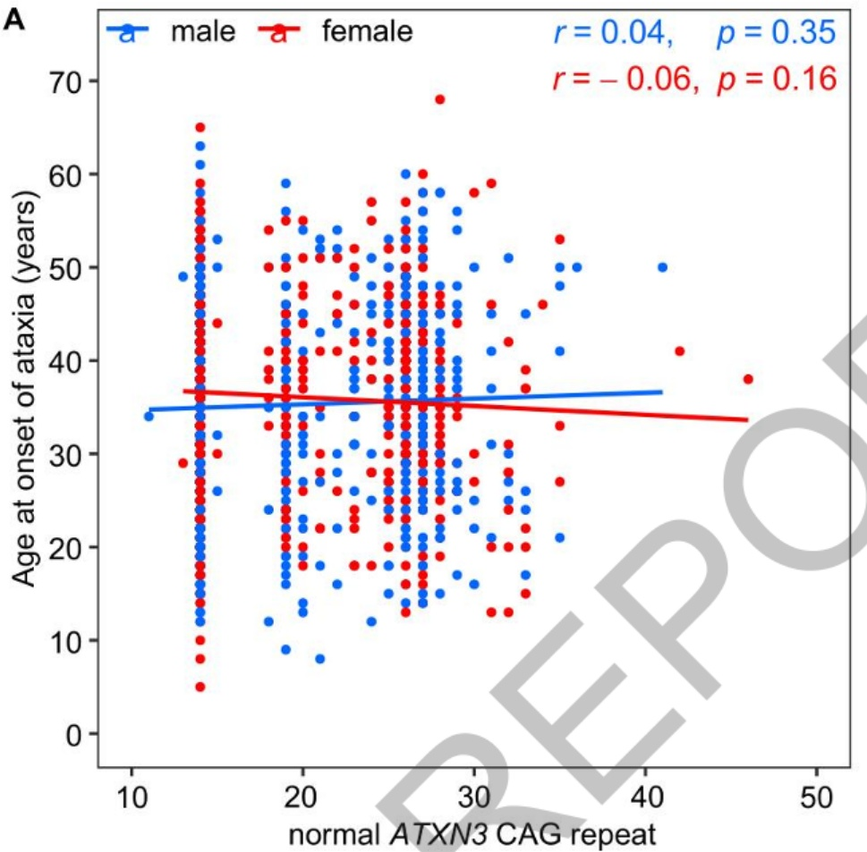

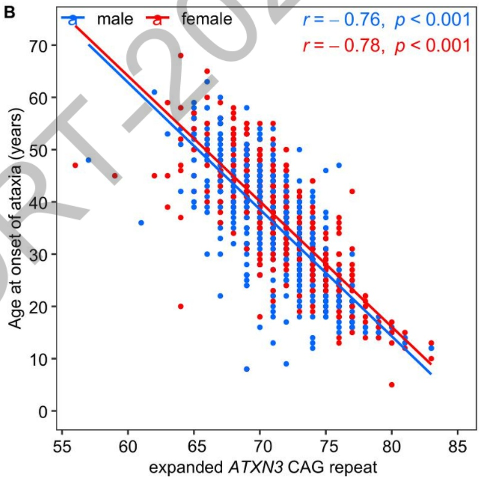

图 1-1 发现队列 ATXN3 基因 AO 与 CAG 重复序列拷贝数的拟合关系图

附注:图 A 和图 B分别表示 ATXN3 基因正常等位基因 $\mathrm { C A G _ { n o m } }$ 以及异常扩增等位基因$\mathrm { C A G } _ { \mathrm { e x p } ^ { \circ } }$ 与患者发病年龄之间的线性拟合散点图和pearson相关性结果。其中，相关系数大小采用r表示，相关系数显著性检验结果则采用p表示。

## 3）描述性统计分析结果

在发现队列中，男性657例，女性591例。ATXN3基因异常扩增等位基因CAG拷贝数（ $ATXN3-CAG_{exp}$ 和 ATXN3基因正常等位基因 CAG拷贝数$(ATXN3-CAG_{norm})$ 的平均重复次数分别为 $7 1 . 5 0 \pm 3 . 3 1$ 和 $1 9 . 8 7 \pm 6 . 2 5$ 次(表1-1)。其中，最常见的 $\mathbf { C A G } _ { \mathrm { e x p } }$ 和 $\mathrm { C A G _ { n o m } }$ 分别为71次（162，12.98%）和14次（581，46.55%)。AO均值为 $3 5 . 6 8   \pm 1 0 . 4 3$ 岁。基于 $\mathrm { C A G } _ { \mathrm { e x p } }$ 预测的患者 $\mathrm { A O _ { p } }$ 均值为 35.68 ±7.96岁， $\mathrm { A O _ { R E } }$ 均值为 $0 . 0 0 \pm 6 . 7 3$ 岁（表3-5，图3-3）。分析显示， $\mathrm { C A G } _ { \mathrm { e x p } }$ 对AO具有显著影响 $(p < 0.001)$ （表1-1、图1-2A），而 $\mathrm { C A G _ { n o m } }$ 对 AO 无显著影响 $(p = 0.747)$ （表1-1、图1-2B）。

在验证队列中，男性484例，女性409例。在1,248例SCA3患者中，在893例 SCA3 患者中， $ATXN3-CAG_{exp}$ 和 $ATXN3-CAG_{norm}$ 的平均重复次数分别为71.52 $\pm 3 . 3 5$ 和 $1 9 . 8 3   \pm 6 . 2 5$ 次，最常见 $\mathrm { C A G } _ { \mathrm { e x p } }$ 和 $\mathrm { C A G _ { n o r m } }$ 分别为71次（111，12.43%）和14次（419，46.92%）。AO均值为 $3 3 . 3 4   \pm   1 0 . 9 1$ 岁， $\mathrm { A O _ { p } }$ 均值为 $3 5 . 6 1   \pm 8 . 0 5$岁， $\mathrm { A O _ { R E } }$ 均值为 $-0.27 \pm 7.48$ 岁（表3-5）。 $\mathrm { C A G } _ { \mathrm { e x p } }$ 对 AO 有显著影响 $(p < 0.001)$而 $\mathrm { C A G _ { n o m } }$ 对 AO无显著影响 $(p=0.751)$

表 1-2 受试者基线数据

| (有亲缘关系样本，n=1,248) | 发现队列 内部验证队列 (无亲缘关系样本， | p n=893) |
| --- | --- | --- |
| 性别（男性/女性），例数 | 484/409 657/591 | 0.61 |
| 年龄（岁），均数±标准差 | 41.45±11.78 41.80±11.59 | 0.19 |
| （岁），均数±标准差 $\mathrm { A O _ { 0 } }$ | 35.68±10.43 33.34±10.91 | 0.50 |
| （岁），均数±标准差 $\mathrm { A O _ { p } }$ | 35.68±7.96 35.33±7.94 | 0.21 |
| （岁），均数±标准差 $\mathrm { A O _ { R E } }$ | 0.00±6.73 0.00±7.48 | 0.77 |
| ，均数±标准差 $\mathrm{ATXN3-CAG_{exp}}$ | 71.50±3.31 71.52±3.35 | 0.69 |
| 均数±标准差 $\mathrm{ATXN3-CAG_{norm}}$ | 19.87±6.25 19.83±6.25 | 0.79 |
| 均数±标准差 $\operatorname { S A R A } ,$ | 10.89±6.18 11.17±6.02 | 0.36 |
| ICARS，均数±标准差 | 29.92±14.31 30.26±14.13 | 0.40 |
| 基因组覆盖度，均数±标准差 | 0.94±0.00 0.94±0.00 | 0.86 |
| 基因组有效测序深度，均数±标准差 | 39.07±6.10 39.45±6.07 | 0.80 |

附注:连续变量以均数±标准差表示； $\mathrm{AO_{0}=observed   AO}$ ，实际观察到的AO，即本研究定义的开始出现共济失调症状的发病年龄； $\mathrm{AO_{p}=predictedAAO}$ ，预测的 $AO; AO_{RE}= residual$ AO，发病年龄残差； $T X N 3 - C A G _ { \mathrm { e x p } } = A T X N 3$ 基因异常扩增等位基因CAG拷贝数；$ATXN3-CAG_{norm}=ATXN3$ 基因正常等位基因 CAG 拷贝数； SARA=Scale for the Assessment and Rating of Ataxia, 评估共济失调严重程度的量表；ICARS=International Cooperative Ataxia Rating Scale，评估共济失调的国际协作评分量表。

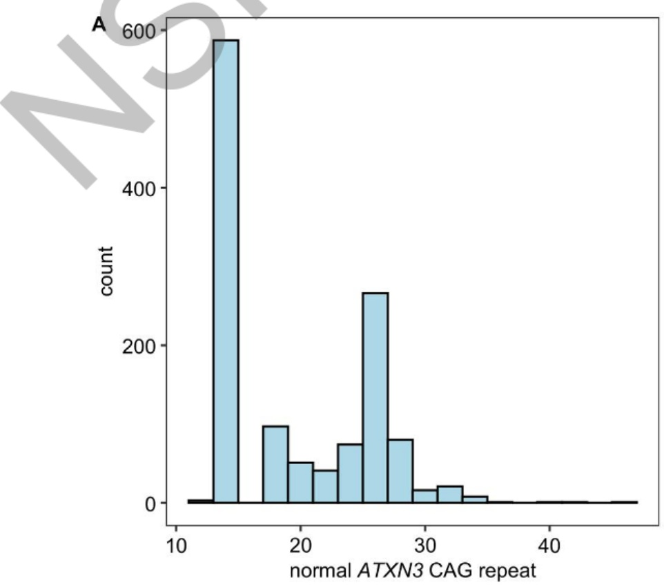

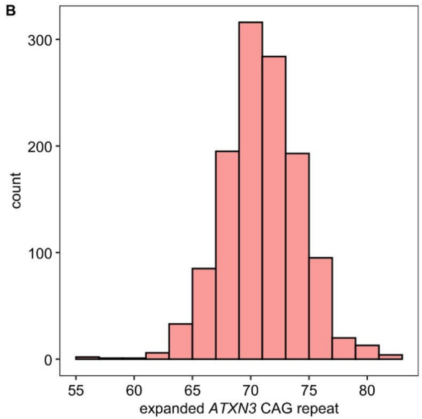

图 1-2 发现队列中 ATXN3 异常扩增等位基因 CAG 拷贝数长度分布图

附注:图中 x 轴代表 SCA3 患者的 ATXN3 基因 CAG 拷贝数（ATXN3-CAG），y 轴代表频数（Count）。浅蓝色柱状代表 $ATXN3-CAG_{norm}$ 的频数，浅红色柱状代表 $ATXN3-CAG_{exp}$的频数。

## 4）测序质量结果

所有样本的基因组测序覆盖度（Genome Coverge）和基因组有效测序深度（GenomeEffective Depth）均显示出较高的测序质量。在发现队列和验证队列SCA3 患者中，平均有效测序深度分别为39.07±6.10和39.45±6.07，平均基因组覆盖度均为0.94±0.00（表1-2）。此外，基因组覆盖度与有效测序深度呈显著正相关（图1-3）。由于结果大致一致，验证队列SCA3患者的测序质量图未单独展示。

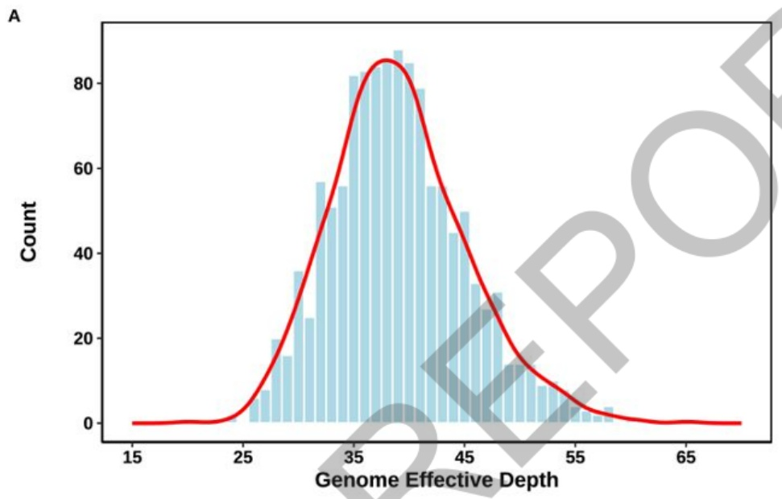

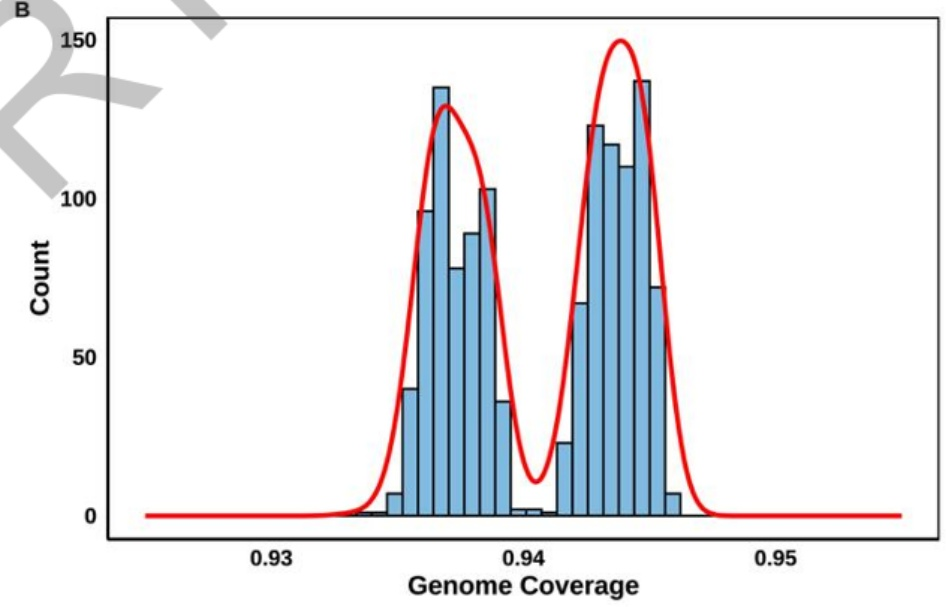

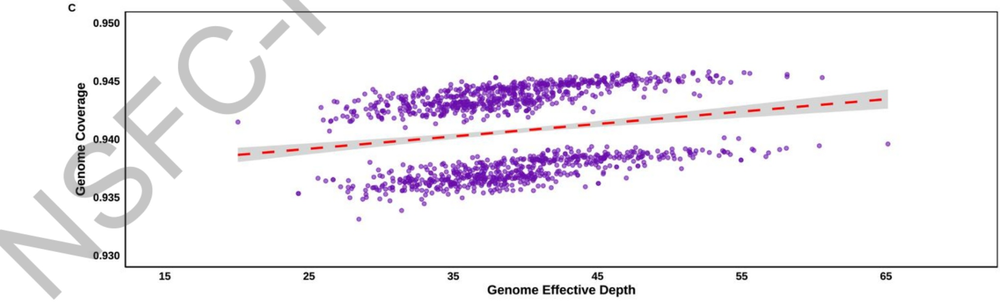

图 1-3 发现队列 SCA3 患者的基因组测序质量结果

附注:图 A 代表基因组测序有效深度（Genome Effective Depth）的分布图；图 B 代表基因组测序基因组测序覆盖度（GenomeCoverge）分布图；图C代表基因组测序有效深度与测序覆盖度之间的关系图，红色虚线代表回归线，浅灰色阴影代表回归拟合的95%置信区间。从图可见，所有样本的基因组测序覆盖度和基因组有效测序深度均提示较好的测序质量。

## 5）常见变异筛选结果

在完成样本和变异质控后，进一步结合MAF阈值进行常见变异筛选（MAF>0.01）。最终，共有6,767,000个变异符合条件并被纳入常见变异关联分析。基于这些变异绘制的变异密度图显示，大部分染色体区域都有变异分布，但仍存在部分区域变异密度较低，甚至少数区域几乎没有被任何变异覆盖(图1-4)

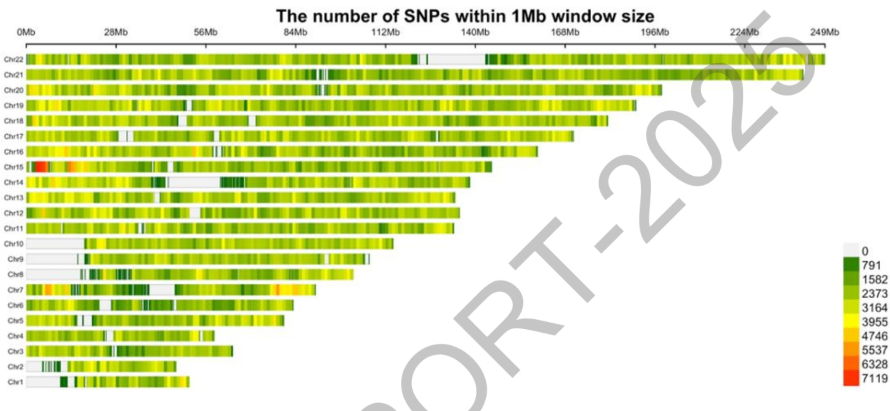

图1-4 最终纳入关联分析的常见变异概率密度图

附注:图中左侧坐标轴显示22条染色体，顶侧坐标轴显示染色体上具体基因组位置。右下角图例表示变异的密度大小，图例越往下颜色越红表示所在染色体区域变异密度越大。

## 6）群体分层结果

在本研究基于可解释方差策略来进行PCA计算，主成分方差解释比例以百分比形式输出，并绘制前30个主成分的碎石图（ScreePlot，如图1-5A），用于评估各主成分对总体方差的贡献。根据碎石图的拐点和累积解释比例，纳入前4个PCA值作为后续关联分析的协变量，以校正群体分层对结果的影响。进一步，选取排序靠前的3个PCA绘制散点图发现，研究人群的群体结构较为一致，未见明显的人群分层现象（图1-5B）。

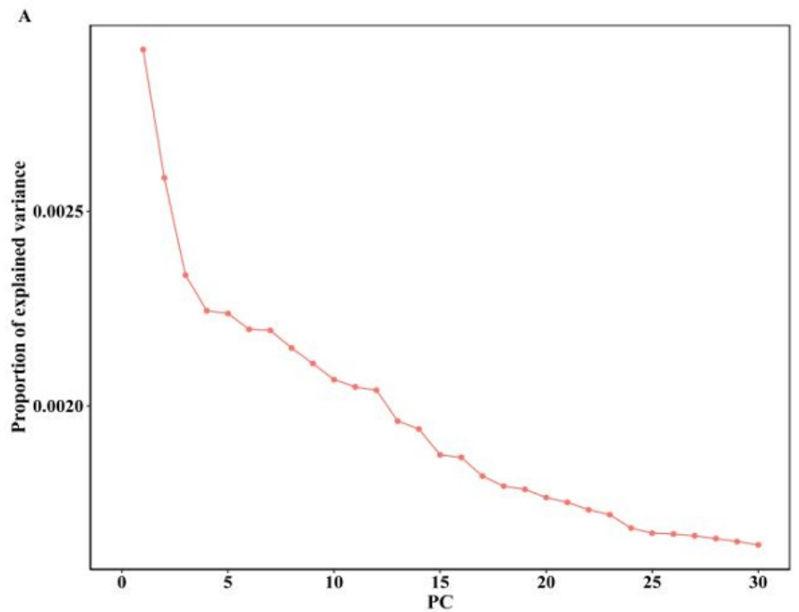

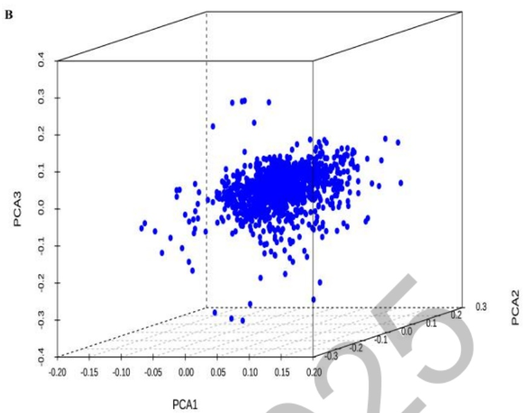

图 1-5 发现队列的主成分分析（PCA）碎石图（Scree Plot）和前3个 PCA三维散点图

附注:图 A为碎石图（Scree plot），展示了主成分（PCs）对数据方差的贡献比例。x轴表示主成分（PC）的编号，y轴表示每个主成分解释的方差比例（Proportion of explained variance）。图中可见，前几个主成分（PC1-4）解释了大部分数据的变异，而从PC5开始，方差贡献急剧下降，表明此后主成分对数据的解释力较弱。根据拐点，选择前4个主成分用于后续的分析，以校正群体分层对结果的影响。图B表示对样本进行主成分分析（PCA）后，前三个主成分（PCA1、PCA2和PCA3 之间的三维散点图。未观察到明显的人群结构分层，提示群体结构的混杂偏倚风险较低。

## 7）发现阶段 GWAS 关联分析结果

## 7.1 GWAS 关联分析结果

本研究采用LMM模型进行常见变异进行关联分析，并绘制了Manhatan图（图1-6）和QQ图（图1-7）。结果显示，有2个位点达到全基因组显著性水平$(p < 5 \times 10^{-8}$ 表1-3），分别为13号染色体的rs142932360（ $(p = 6.62 \times 10^{-9})$ 和14号染色体的 rs28801081 $(p=4.36 \times 10^{-8})$ ；另有149个位点达到全基因提示性水平$(5 \times 10^{-8} < p \leq 1 \times 10^{-5})$ ，基因组膨胀系数（）值为1.012。

结合注释信息分析，rs142932360位于基因间区，其相邻最近的基因为MRPL57基因和 ZDHHC20基因（图1-8A，表1-3）；rs28801081同样位于基因间区，其相邻最近的基因为FBXO33基因和LINC02315基因（图1-8B，表1-3）。此外，149个全基因组提示性关联位点中，大部分位于基因间区(117/149，78.52%)或内含子区（15/149，10.07%），另有1个位点位于外显子区，且超过一半位点（71/149，61.74%）与 rs28801081高度LD而富集于FBXO33附近。

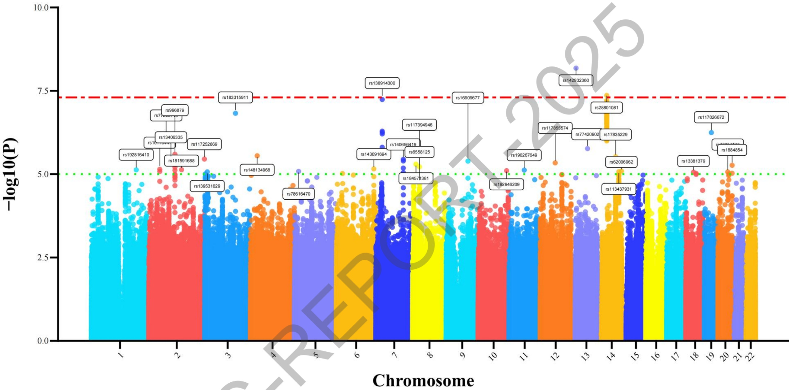

图 1-6 常见变异关联分析 Manhattan 图

附注:图表示LMM模型单位点水平常见变异关联分析的曼哈顿图；红色虚线表示全基因组层面的显著性关联阈值水平，绿色虚线表示全基因组层面具有提示性关联的统计学水平。图中标出了31个经过条件分析后的独立位点，并显示了各自的rsID编号（具体信息请见后文）。曼哈顿图将关联分析之后所有位点的p值在整个基因组上从左至右描绘，通常将 $p$ 值转换为 $- \log _ { 1 0 } ( p )$ 值，x轴表示基因组位置，y轴表示 $- \log _ { 1 0 } ( p )$值，y 轴代表与表型的关联程度，y 轴高度越高关联度越强（即 p 值越小）。Manhattan 图 = 曼哈顿图。

表1-3 常见变异关联分析达到全基因组显著性关联的位点

| rsID | CHR | PS# | Allele0 | Allele1 | AF | Beta | Se | 值 $\underline { { \mathcal { P } } }$ | 基因组域 | 临近基因 |
| --- | --- | --- | --- | --- | --- | --- | --- | --- | --- | --- |
| rs142932360 | 13 | 21260607 | A | G | 0.010 | -7.770 | 1.333 | 6.615E-09 | intergenic | MRPL57;ZDHHC20 |
| rs28801081 | 14 | 39890124 | A | T | 0.156 | -2.015 | 0.367 | E-08 4.36 | intergenic | FBX033;LINC02315 |

附注:符号#表示位置基于GRCH38/hg38；AF表示次要等位基因频率；显著性关联位点需满足 $\cdot \: p$ 值 5×10-8；位于基因间区（intergenic）的 SNP，位点周围基因根据基因物理位置的距离来评估最近的基因，并予以加粗显示。

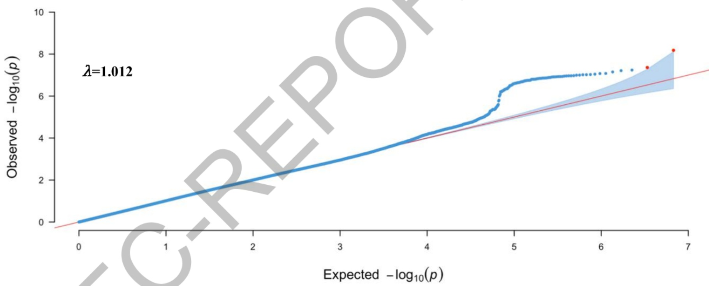

图 1-7 常见变异关联分析 QQ 图

附注:该图展示基于LMM模型进行常见变异关联分析的QQ图。QQ图的x轴则是期望的均匀分布的概率值 $, \mathrm { y }$ 轴是位点实际关联分析结果的-log10(p)值。如果变异对性状或表型的影响存在显著相关的自然选择，可看到两者相互分离情况， $p$ 值越低分离程度就越高，QQ图尾部会翘起来。如果表型性状并非自然选择，则 $p$ 值的实际值和均匀分布结果将集中于一条直线上（即图中红色直线）。QQ图=分位图。

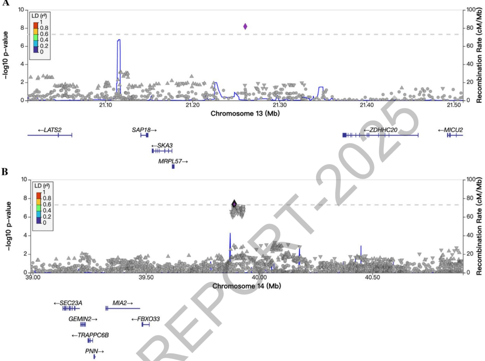

图 1-8 常见变异全基因组关联分析显著关联位点的 locuszoom 图

附注:图表示1,248 例样本 GWAS 分析中显著关联位点 $(p < 5 \times 10^{-8})$ 的 locuszoom图。图 A 表示 rs142932360 的 locuszoom 图，图 B 表示 rs28801081 的 locuszoom 图。图中横轴均表示染色体上具体位置，左侧纵轴均表示变异关联分析 $- \log _ { 1 0 } ( p )$ 值结果，图例和变异的颜色表示与该区域中最显著关联变异（即lead snp）的连锁不平衡（LD）大小，右侧纵轴代表重组率，图下方还标有该区域中基因的注释信息。该图主要可用于精确定位因果变异，是对曼哈顿图中显著位点所在基因组所在区域的进一步放大展示。

## 7.2 遗传度和遗传截距

为评估表型的遗传贡献，本研究采用LD Score回归（LDSC）方法对全基因组关联结果进行了遗传度和遗传截距分析。分析基于5,276,980个SNP，使用了1000 Genomes Phase 3的东亚人群（EAS）LD参考数据集。LDSC 结果显示，全基因组水平的 SNP遗传力（h²）为0.1511（SE=0.3606），提示该表型的15.1%的变异可归因于遗传因素，但较大的标准误差表明估计值具有一定的不确定性，可能与样本量和数据变异性相关。 5

LDSC截距（intercept）为1.0081（标准误0.007），接近1，表明样本中不存在显著的系统性偏倚，基因型-表型关联未受到外部因素或模型过度拟合影响。$\lambda _ { \mathrm { G C } }$ 为1.0135，Mean Chi²为1.0128，均进一步支持分析适配良好，表明观测到的基因型-表型关联与期望一致。综上结果，可以认为该表型的遗传贡献具有统计显著性，分析中未发现明显偏倚。

## 7.3 先导位点和独立位点的识别

在全基因关联分析完成后，为识别潜在关联信号，本研究使用PLINK软件对关联结果进行了LD clumping，筛选出 34个先导位点（Lead SNPs），即各自LD 区域内最显著的代表性变异位点（表1-4）。这34个先导 SNP涵盖了全部的2个显著性关联位点及32个提示性关联位点。

随后，通过GCTA-COJO条件联合分析，获得31个独立位点（Independent SNPs）（表1-4，图1-9）。其中 30个独立 SNP包括了全部的2个显著性关联位点和28个提示性关联位点；另有1个独立 SNP（rs6558125，chr8:29596741，allele1=T，allele0=C， MAF=0.011，beta=5.205，SE=1.210, $p = 1.71 \times 10^{-5}$ 在初始分析中未达提示性阈值，但经条件分析 $(pJ=9.85 \times 10^{-6})$ 显示其具有独立的遗传效应。独立SNP映射的编码蛋白基因包括MSH2、TACR1、ANKRD36C、IL36RN、LRP1B、CAPN10、ATP2B2、PRKN（PARK2）、HIBADH、ANKRD7、SGCZ、DUSP4、PTPDC1、HMX3、RELA、RASSF3、MRPL57、FBXO33、NRXN3、NDUFB1、MARK3、KLHL14、URI1、PTPRT、CDH4；非编码蛋白基因包括LINC01724、LINC02223、NPHP3-AS1、LOC105379352、MIR4275、LINC00348（表3-9）。

利用 FUMA 的 $``GENE2FUNC''$ 模块，对25个编码蛋白候选基因进行组织表达及不同组织与发育时期差异表达富集分析。差异表达分析基于BrainSpan的11个大脑发育阶段及 GTEx v8 的 54种组织，整体表达基于 GTEx v8。除 MRPL57未被数据库识别外，其余24个基因均被成功识别。

表1-4常见变异关联分析的主导和独立关联位点

| rsID | CHR | PS# | 参考碱基 | 效应碱基 | MAF | 系数 | 标准误 | p值 | 基因组区域§ | 临近基因§ |
| --- | --- | --- | --- | --- | --- | --- | --- | --- | --- | --- |
| rs192816410$,&amp; | 1 | 194607961 | G | A | 0.011 | -5.884445 | 1.310533 | 7.44088E-06 | intergenic | LINC01031;LINC01724 |
| rs10178447$,&amp; | 2 | 47574496 | G | C | 0.143 | 1.709522 | 0.378793 | 7.18187E-06 | downstream | MSH2 |
| rs77226716$,&amp; | 2 | 75015598 | G | A | 0.016 | -5.334016 | 1.079598 | 8.12359E-07 | intergenic | POLE4:TACR1 |
| rs13406335$,&amp; | 2 | 95848679 | C | T | 0.031 | -3.588982 | 0.771539 | 3.38206E-06 | downstream | ANKRD36C |
| rs996879$,&amp; | 2 | 113064664 | G | A | 0.057 | -2.730625 | 0.5796621 | 2.53993E-06 | UTR3 | IL36RN |
| rs181591688$,&amp; | 2 | 141734985 | T | C | 0.047 | -2.88749 | 0.6436338 | 7.38714E-06 | intronic | LRP1B |
| rs117252869$,&amp; | 2 | 240601711 | C | T | 0.016 | -4.804547 | 1.034944 | 3.53436E-06 | intergenic | CAPN10;GPR35 |
| rs193052811$ | 3 | 1915505 | C | T | 0.02 | -4.318764 | 0.976466 | 9.8955E-06 | intergenic | CNTN6;CNTN4 |
| rs139531029$,&amp; | 3 | 10695878 | C | G | 0.012 | -5.88425 | 1.320941 | 8.54405E-06 | upstream | ATP2B2 |
| rs183315911$,&amp; | 3 | 132915462 | A | G | 0.018 | -5.36838 | 1.018251 | 1.49683E-07 | intergenic | NPHP3-AS1;TMEM108 |
| rs148134968$,&amp; | 4 | 28706598 | G | A | 0.013 | -5.523889 | 1.178013 | 2.81907E-06 | intergenic | LINC02261;MIR4275 |
| rs78616470$,&amp; | 5 | 17886177 | A | G | 0.037 | 3.290301 | 0.736639 | 8.25538E-06 | ncRNA_intronic | LINC02223 |
| rs151130627$ | 6 | 26362013 | G | A | 0.011 | 5.683199 | 1.279549 | 9.56908E-06 | intergenic | H4C8;BTN3A2 |
| rs143091694$,&amp; | 6 | 161995397 | TA |  | 0.096 | 2.116867 | 0.4706241 | 6.98079E-06 | intronic | PRKN |
| rs138914300$,&amp; | 7 | 27594957 | T | C | 0.017 | -5.638599 | 1.034502 | 5.77356E-08 | intronic | HIBADH |
| rs140656419$,&amp; | 7 | 118801942 |  |  | 0.021 | -4.42343 | 0.9534565 | 3.59893E-06 | intergenic | ANKRD7;LINC02476 |
| rs184571381$,&amp; | 8 | 14232095 |  | A | 0.014 | -5.134538 | 1.124114 | 5.03654E-06 | intronic | SGCZ |
| rs117394946$,&amp; | 8 | 29317929 | G | A | 0.031 | -3.585328 | 0.7916541 | 6.03574E-06 | intergenic | KIF13B;DUSP4 |

续表1-4常见变异关联分析的主导和独立关联位点

| rsID | CHR | PS# | 参考碱基 | 效应碱基 | MAF | 系数 | 标准误 | p值 | 基因组区域§ | 临近基因§ |
| --- | --- | --- | --- | --- | --- | --- | --- | --- | --- | --- |
| rs16909677$,&amp; | 9 | 94098440 | T | A | 0.04 | -3.192619 | 0.6908693 | 4.07875E-06 | exonic | PTPDC1 |
| rs192946209$,&amp; | 10 | 123103877 | G | A | 0.012 | -5.320058 | 1.187704 | 7.88839E-06 | intergenic | ACADSB;HMX3 |
| rs190267649$,&amp; | 11 | 65652869 | A | G | 0.01 | 6.056252 | 1.350144 | 7.57297E-06 | downstream | RELA |
| rs117855574$,&amp; | 12 | 64548107 | A | G | 0.019 | 4.555903 | 0.9932901 | 4.60252E-06 | upstream | RASSF3 |
| rs77420902$,&amp; | 13 | 71082031 | C | T | 0.14 | -1.81146 | 0.3776001 | 1.71464E-06 | ncRNA_intronic | LINC00348 |
| rs17835229$,&amp; | 14 | 78561161 | C | T | 0.151 | -1.763639 | 0.3771131 | 3.0034E-06 | intronic | NRXN3 |
| rs113437931$,&amp; | 14 | 92116513 | T | G | 0.134 | -1.809527 | 0.4059197 | 8.45171E-06 | intronic | NDUFB1 |
| rs62006962$,&amp; | 14 | 103367796 | G | A | 0.217 | -1.521 196 | 0.3409001 | 8.14571E-06 | intergenic | EIF5;MARK3 |
| rs13381379$,&amp; | 18 | 32844327 | A | G | 0.045 | -2.792227 | 0.6275987 | 8.76256E-06 | intergenic | KLHL14;CCDC178 |
| rs149934241$ | 18 | 44336124 | A | G | 0.015 | -4.986883 | 1.125319 | 9.49719E-06 | ncRNA_intronic | LINC01478 |
| rs117026672$,&amp; | 19 | 30009456 | A | G | 0.012 | -6.163911 | 1.229744 | 5.67838E-07 | intronic | URI1 |
| rs77874137$,&amp; | 20 | 42284749 | G | A | 0.155 | -1.696171 | 0.3808038 | 8.58741E-06 | intronic | PTPRT |
| rs2235734$ | 20 | 47663405 | T | G | 0.227 | 1.428271 | 0.3229786 | 9.93607E-06 | intronic | SULF2 |
| rs1884854$,&amp; | 20 | 61201518 | C | T | 0.511 | -1.231173 | 0.2699245 | 5.43249E-06 | intergenic | LINC01718;CDH4 |
| rs117394946$,&amp; | 8 | 29317929 | G | A | 0.031 | -3.585328 | 0.7916541 | 6.03574E-06 | intergenic | KIF13B;DUSP4 |

附注:符号#表示位置基于GRCH38/hg38；MAF表示次要等位基因频率；位于基因间区（intergenic）的 SNP，位点周围基因根据基因物理位置的距离来评估最近的基因，并予以加粗显示；符号\$表示提示性关联位点里的主导 SNPs（Lead SNPs），符号&表示提示性关联位点里的独立 SNPs（Independent SNPs），独立位点SNP均以加粗字体显示。

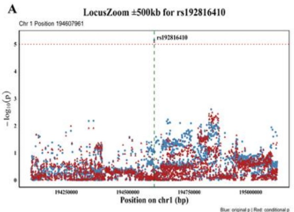

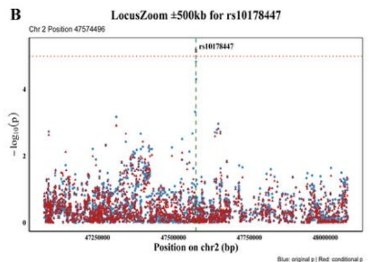

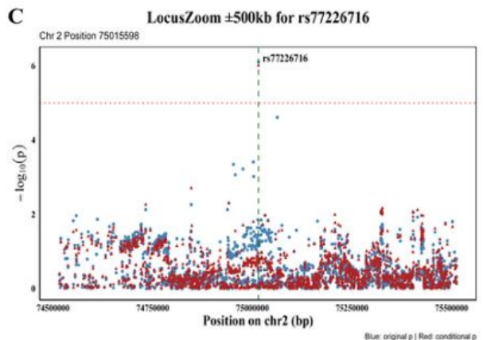

D

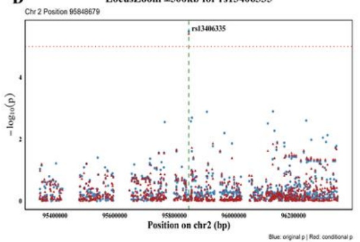

E

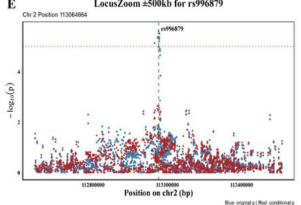

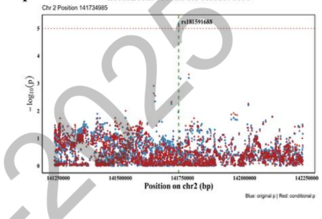

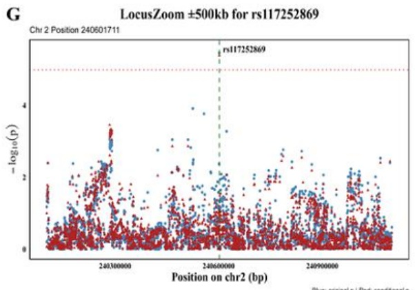

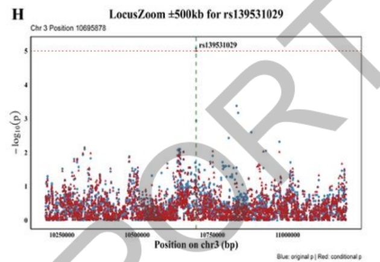

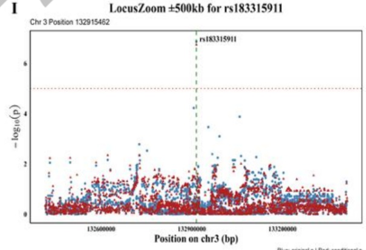

图 1-9条件分析后的独立位点上下游 500bp 的 manhattan 图

附注:图 A-I分别展示了独立位点（rs192816419、rs10178447、rs77226716、rs13406335、rs996879、rs181591688、rs117252869、rs139531029和rs183315911）在其上下游±500bp的manhattan图；横轴均表示染色体上的物理位置（bp），纵轴均表示变异关联分析-log1o(p)值结果。图中蓝色圆点代表原始全基因组关联分析的p值，红色三角形表示进行条件分析(GCTA-COJO) 后的 $p$ 值。红色水平虚线表示关联分析提示性阈值 $(p = 1 \times 10^{-5})$ ；绿色垂直虚线表示对应独立SNPs在染色体上的具体位置。

BrainSpan发育时空富集分析显示（图1-10A），候选基因在婴儿晚期(late-infancy）阶段显著上调，该阶段的差异表达基因集在Bonferroni多重检验后显著富集 $p_{\_BON} < 0.05$ ，图中红色标注）。GTEx v8的组织富集分析（图1-10B)未见显著差异表达。进一步基于GTEx v8的54种组织表达谱（图1-10C）显示，大多数候选基因在脑组织中高表达，部分基因有明显的脑特异性表达。综合结果提示，本研究鉴定的独立位点相关基因可能在特定脑区及发育阶段发挥重要生物学功能，与神经系统密切相关。

A

B

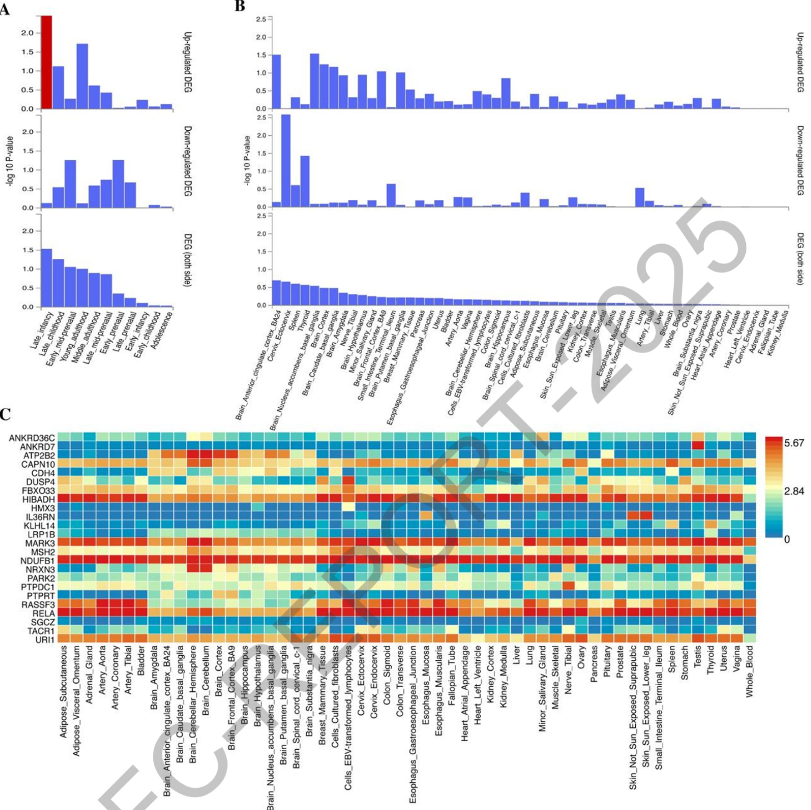

1-10基于独立位点映射基因的不同组织与发育时期差异表达富集分析及组织表达谱热图

附注:图 A 表示基于 BrainSpan 数据集中11 个大脑发育阶段对候选基因进行差异表达基 基因（DEG）富集分析。横坐标为发育阶段，纵坐标为 $- \log _ { 1 0 } ( p )$ 。红色柱表示在 Bonferroni校正后显著富集的DEG集合 $(p-BON<0.05)$ 。图 B 表示基于 GTEx v8 数据集中 54 种组织类型对候选基因进行差异表达富集分析，展示上调基因、下调基因及全部DEG集合的显著性分布。图C表示24个独立SNP定位的候选基因在 GTEx数据集中54种组织的表达谱热图。颜色从蓝色到红色分别表示表达水平从低到高（单位为1og2转换的TPM或相应归一化值）。

## 7.4 FINEMAP 精细定位分析结果

为进一步挖掘潜在因果变异位点，我们使用FINEMAP（v1.4）对 34个lead SNPs上下游500kb区域的位点区域进行精细定位分析。FINEMAP共分析获得92,417个变异位点结果。结果显示，在构建的 95% credible set（CS）基础上，我们按 PIP阈值与 $\log _ { 1 0 } ( \mathbf { b f } )$ 筛选高置信度 SNPs。剔除各候选区域 95% CS 中 $\mathrm { P I P } { \leq } 0 . 2$ 且 $\log _ { 1 0 } ( \mathrm { b f } ) < 2$ 的低可信度位点后，共剩余148个可信度因果变异位点 $( \mathrm { P I P } \geq 0 . 2 , \log _ { 1 0 } ( \mathrm { b f } ) \geq 2 )$ ，相关性分析显示，PIP与 $\log _ { 1 0 } ( \mathrm { b f } )$呈显著正相关（Spearman相关系数R=0.98，p<2.2e-16）。进一步筛选得到44个PIP≥0.90且 $\log _ { 1 0 } ( b f ) > 6 . 1$ 的高置信度因果变异位点（表1-5）。

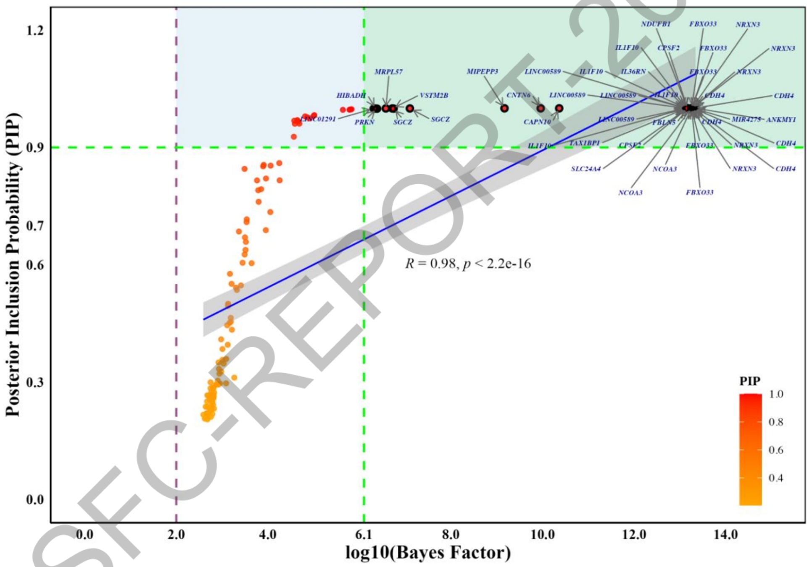

图 1-11 FINMAP 分析的 95% CS 的组成图和可信度因果变异位点 PIP 与 $\log _ { 1 0 } ( \mathrm { b f } )$ 的相关性图

附注:散点图展示了使用 FINEMAP分析获得的可信度因果变异位点（PIP≥0.2，log10(bf)≥2）的后验纳入概率（PIP）与 $\log _ { 1 0 } ( \mathbf { b f } )$ 之间的关系。图中每个点代表一个变异位点，颜色深浅表示其对应的PIP值。蓝色实线为线性回归拟合曲线，阴影区域表示95%置信区间，并标注了Spearman相关系数及其显著性水平。绿色虚线标示了筛选高置信度变异的阈值 $( \mathrm { P I P } = 0 . 9 0 , \log _ { 1 0 } ( \mathrm { b f } ) = 6 . 1 )$ ，右上角浅绿色区域表示同时满足这两个条件的高置信度因果变异位点，浅蓝色区域表示提示性因果变异 $( \mathrm { P I P } { \geq } 0 . 9$ $2 < \log_{10}(bf < 6.1)$ ,高置信度变异对应的临近基因予以标注。

表 1-5 FINEMAP 分析的高置信度因果变异位点

<table><tr><td>Index SNP</td><td>Prioritized SNPs</td><td>CHR</td><td>BP</td><td>参考 碱基</td><td>效应 碱基</td><td> $\mathrm { M A F ^ { \& } }$ </td><td>系数&amp;</td><td> $\mathrm { S E ^ { \& } }$ </td><td> $p ^ { \& }$ </td><td> $\mathrm { P I P } ^ { \P }$ </td><td>log10(bf)1</td><td>基因组区域§</td><td>临近基因§</td></tr><tr><td rowspan="2">rs142932360</td><td>rs1810989</td><td>13</td><td>21313400</td><td>G</td><td>A</td><td>0.018</td><td>2.353</td><td>1.039</td><td>2.34E-02</td><td>0.99999</td><td>9.16862</td><td>ncRNA_intronic</td><td>MIPEPP3</td></tr><tr><td>rs142932360</td><td>13</td><td>21260607</td><td>A</td><td>G</td><td>0.01</td><td>-7.770</td><td>1.333</td><td>6.62E-09</td><td>0.99967</td><td>6.57723</td><td>intergenic</td><td>MRPL57;ZDHHC20</td></tr><tr><td rowspan="4">rs28801081</td><td>rs7143929</td><td>14</td><td>39888909</td><td>A</td><td>G</td><td>0.313</td><td>-0.450</td><td>0.298</td><td>1.30E-01</td><td></td><td>13.2548</td><td>intergenic</td><td>FBX033;LINC02315</td></tr><tr><td>rs73288567</td><td>14</td><td>39861496</td><td>C</td><td>T</td><td>0.188</td><td>0.562</td><td>0.357</td><td>1.14E-01</td><td></td><td>13.2548</td><td>intergenic</td><td>FBX033;LINC02315</td></tr><tr><td>rs8007289</td><td>14</td><td>39922069</td><td>T</td><td>A</td><td>0.479</td><td>0.695</td><td>0.275</td><td>1.13E-02</td><td>1</td><td>13.2548</td><td>intergenic</td><td>FBX033;LINC02315</td></tr><tr><td>rs10083526</td><td>14</td><td>39933123</td><td>T</td><td>C</td><td>0.3</td><td>-0.512</td><td>0.298</td><td>8.57E-02</td><td>1</td><td>13.2548</td><td>intergenic</td><td>FBX033;LINC02315</td></tr><tr><td rowspan="6">rs17835229</td><td>rs17180573</td><td>14</td><td>39904242</td><td>T</td><td>A</td><td>0.156</td><td>-1.997</td><td>0.368</td><td>6.15E-08</td><td>1</td><td>13.2548</td><td>intergenic</td><td>FBX033;LINC02315</td></tr><tr><td>rs11159372</td><td>14</td><td>78560092</td><td>G</td><td>C</td><td>0.447</td><td>-0.541</td><td>0.276</td><td>4.89E-02</td><td>1</td><td>13.2606</td><td>intronic</td><td>NRXN3</td></tr><tr><td>rs11159363</td><td>14</td><td>78503030</td><td>A</td><td>G</td><td>0.487</td><td>0.733</td><td>0.278</td><td>8.68E-03</td><td>1</td><td>13.2606</td><td>intronic</td><td>NRXN3</td></tr><tr><td>rs6574452</td><td>14</td><td>78552779</td><td>C</td><td>T</td><td>0.185</td><td>-1.481</td><td>0.352</td><td>2.68E-05</td><td>1</td><td>13.2606</td><td>intronic</td><td>NRXN3</td></tr><tr><td>rs59904713</td><td>14</td><td>78560107</td><td>G</td><td>A</td><td>0.138</td><td>0.819</td><td>0.402</td><td>4.20E-02</td><td>1</td><td>13.2606</td><td>intronic</td><td>NRXN3</td></tr><tr><td>rs11851333</td><td>14</td><td>78493846</td><td>A</td><td>G</td><td>0.445</td><td>-0.727</td><td>0.283</td><td>1.08E-02</td><td>1</td><td>13.2606</td><td>intronic</td><td>NRXN3</td></tr><tr><td rowspan="5">rs113437931</td><td>rs80272101</td><td>14</td><td>91941309</td><td>C</td><td>T</td><td>0.01</td><td>-1.270</td><td>1.320</td><td>3.32E-01</td><td>1</td><td>13.1655</td><td>intronic</td><td>FBLN5</td></tr><tr><td>rs7143401</td><td>14</td><td>92121244</td><td>G</td><td></td><td>0.145</td><td>1.677</td><td>0.390</td><td>1.77E-05</td><td>1</td><td>13.1655</td><td>intronic</td><td>NDUFB1</td></tr><tr><td>rs117707684</td><td>14</td><td>92258930</td><td>G</td><td>A</td><td>0.069</td><td>1.121</td><td>0.546</td><td>4.03E-02</td><td>1</td><td>13.1655</td><td>intergenic</td><td>CPSF2;SLC24A4</td></tr><tr><td>rs78327495</td><td>14</td><td>92172294</td><td>G</td><td>9</td><td>0.145</td><td>-1.731</td><td>0.392</td><td>1.02E-05</td><td>1</td><td>13.1655</td><td>downstream</td><td>CPSF2</td></tr><tr><td>rs10140608</td><td>14</td><td>92132621</td><td>G</td><td>A</td><td>0.01</td><td>0.457</td><td>1.357</td><td>7.31E-01</td><td>1</td><td>13.1655</td><td>intronic</td><td>CPSF2</td></tr><tr><td>rs117026672</td><td>rs4805425</td><td>19</td><td>29558491</td><td>A</td><td>C</td><td>0.492</td><td>-0.572</td><td>0.273</td><td>3.60E-02</td><td>0.99970</td><td>6.71853</td><td>intronic</td><td>VSTM2B</td></tr><tr><td>rs2235734</td><td>rs6012190</td><td>20</td><td>47457107</td><td>C</td><td>T</td><td>0.109</td><td>-1.605</td><td>0.439</td><td>2.54E-04</td><td>1</td><td>13.2514</td><td>intergenic</td><td>LINC01754;NCOA3</td></tr><tr><td rowspan="5"></td><td>rs4809636</td><td>20</td><td>47457734</td><td>T</td><td>C</td><td>0.142</td><td>1.226</td><td>0.396</td><td>1.92E-03</td><td>1</td><td>13.2514</td><td>intergenic</td><td>LINC01754;NCOA3</td></tr><tr><td>rs6071538</td><td>20</td><td>61197476</td><td>C</td><td>T</td><td>0.438</td><td>-1.112</td><td>0.272</td><td>4.47E-05</td><td>1</td><td>13.294</td><td>intergenic</td><td>LINC01718;CDH4</td></tr><tr><td>rs60911864</td><td>20</td><td>61196796</td><td>T</td><td>G</td><td>0.127</td><td>0.851</td><td>0.413</td><td>3.86E-02</td><td>1</td><td>13.294</td><td>intergenic</td><td>LINC01718;CDH4</td></tr><tr><td>rs6028071</td><td>20</td><td>61207090</td><td>T</td><td>G</td><td>0.401</td><td>-0.548</td><td>0.276</td><td>4.68E-02</td><td>1</td><td>13.294</td><td>intergenic</td><td>LINC01718;CDH4</td></tr><tr><td>rs2426969</td><td>20</td><td>61194899</td><td>A</td><td>G</td><td>0.463</td><td>-0.610</td><td>0.276</td><td>2.68E-02</td><td>1</td><td>13.294</td><td>intergenic</td><td>LINC01718;CDH4</td></tr><tr><td></td><td>rs2426967</td><td>20</td><td>61194554</td><td>G</td><td>A</td><td>0.404</td><td>-1.084</td><td>0.280</td><td>1.07E-04</td><td></td><td>13.294</td><td>intergenic</td><td>LINC01718;CDH4</td></tr></table>

续表1-5FINEMAP分析的高置信度因果变异位点

<table><tr><td>Index SNP</td><td>Prioritized SNPs</td><td>CHR</td><td>BP</td><td>参考 碱基</td><td>效应 碱基</td><td> $\mathrm { M A F ^ { \& } }$ </td><td>系数&amp;</td><td> $\mathrm { S E ^ { \& } }$ </td><td> $p ^ { \& }$ </td><td> $\mathrm { P I P } ^ { \P }$ </td><td> $\mathrm{f\overline{o}g_{10}(\overline{b}\overline{f})_{\phi}^{\eta}}$ </td><td>基因组区域§</td><td>临近基因§</td></tr><tr><td rowspan="5">rs996879</td><td>rs72946735</td><td>2</td><td>113065968</td><td>C</td><td>T</td><td>0.057</td><td>-2.650</td><td>0.580</td><td>4.99E-06</td><td></td><td>1376 13.</td><td>intergenic</td><td>IL36RN;IL1F10</td></tr><tr><td>rs10165797</td><td>2</td><td>113070873</td><td>A</td><td>C</td><td>0.328</td><td>0.925 0.289</td><td>1.35E-03</td><td></td><td></td><td>3 .1376</td><td>intronic</td><td>IL1F10</td></tr><tr><td>rs6755354</td><td>2</td><td>113068495</td><td>T</td><td>G</td><td>0.28</td><td>-1.397</td><td>0.299</td><td>3.26E-06</td><td></td><td>13.1376</td><td>intronic</td><td>IL1F10</td></tr><tr><td>rs1446522</td><td>2</td><td>113069926</td><td>G</td><td>C</td><td>0.045</td><td>-2.884</td><td>0.660</td><td>1.27E-05</td><td></td><td>13.1376</td><td>intronic</td><td>IL1F10</td></tr><tr><td>rs1446521</td><td>2</td><td>113069819</td><td>G</td><td>A</td><td>0.065</td><td>-1.009</td><td>0.562</td><td>7.15E-02</td><td></td><td>13.1376</td><td>intronic</td><td>IL1F10</td></tr><tr><td rowspan="2">rs117252869</td><td>rs78921846</td><td>2</td><td>240525127</td><td>T</td><td>C</td><td>0.087</td><td>-1.858</td><td>0.484</td><td>1.25E-04</td><td>1</td><td>13.3404</td><td>intronic</td><td>ANKMY1</td></tr><tr><td>rs2975767</td><td>2</td><td>240598812</td><td>A</td><td>G</td><td>0.193</td><td>0.762</td><td>0.342</td><td>2.56E-02</td><td>1</td><td>10.3635</td><td>UTR3</td><td>CAPN10</td></tr><tr><td>rs77226716</td><td>rs36002146</td><td>2</td><td>74937532</td><td>A</td><td>0.178 AAG</td><td></td><td>0.351 0.940</td><td></td><td>7.32E-03</td><td>0.99933</td><td>6.31401</td><td>ncRNA_intronic</td><td>LINC01291</td></tr><tr><td>rs193052811</td><td>rs401306</td><td>3</td><td>1612770</td><td>G</td><td>T</td><td>0.357</td><td>0.716</td><td>0.285</td><td>1.19E-02</td><td>1</td><td>9.9597</td><td>intergenic</td><td>CNTN6;CNTN4</td></tr><tr><td>rs148134968</td><td>rs609711</td><td>4</td><td>28529153</td><td>C</td><td>T</td><td>0.037</td><td>2.313</td><td>0.732</td><td>1.56E-03</td><td>1</td><td>13.2992</td><td>intergenic</td><td>LINC02261;MIR4275</td></tr><tr><td>rs143091694</td><td>rs4709556</td><td>6</td><td>161905119</td><td>C</td><td>T</td><td>0.441</td><td>0.621</td><td>0.275</td><td>2.35E-02</td><td>0.99912</td><td>6.38367</td><td>intronic</td><td>PRKN</td></tr><tr><td rowspan="2">rs138914300</td><td>rs10229483</td><td>7</td><td>27748084</td><td>T</td><td>A</td><td>0.133</td><td>1.102</td><td>0.401</td><td>6.03E-03</td><td>1</td><td>13.1386</td><td>intronic</td><td>TAX1BP1</td></tr><tr><td>rs12111584</td><td>7</td><td>27653685</td><td>T</td><td>C</td><td>0.044</td><td>1.954</td><td>0.660</td><td>3.04E-03</td><td>0.99939</td><td>6.35438</td><td>intronic</td><td>HIBADH</td></tr><tr><td rowspan="2">rs184571381</td><td>rs67918892</td><td>8</td><td>14479051</td><td>T</td><td>C</td><td>0.049</td><td>2.017</td><td>0.634</td><td>1.45E-03</td><td>0.99968</td><td>7.10213</td><td>intronic</td><td>SGCZ</td></tr><tr><td>rs1461864</td><td>8</td><td>14527064</td><td>A</td><td>G</td><td>0.09</td><td>1.249</td><td>0.474</td><td>8.42E-03</td><td>0.99927</td><td>6.74729</td><td>intronic</td><td>SGCZ</td></tr><tr><td rowspan="4">rs11739494</td><td>rs11343623</td><td>8</td><td>29669635</td><td>CG</td><td>C</td><td>0.036</td><td>1.964</td><td>0.722</td><td>6.54E-03</td><td>1</td><td>13.1315</td><td>intergenic</td><td>DUSP4;LINC00589</td></tr><tr><td>rs117651950</td><td>8</td><td>29664075</td><td>G</td><td>T</td><td>0.024</td><td>-0.670</td><td>4.59E-01 0.903</td><td></td><td>1</td><td>13.1315</td><td>intergenic</td><td>DUSP4;LINC00589</td></tr><tr><td>rs6558125</td><td>8</td><td>29596741</td><td></td><td>C</td><td>0.011</td><td>5.205</td><td>1.210</td><td>1.75E-05</td><td>1</td><td>13.1315</td><td>intergenic</td><td>DUSP4;LINC00589</td></tr><tr><td>rs61314408</td><td>8</td><td>29609712</td><td>C</td><td>T</td><td>0.015</td><td>-4.513</td><td>1.047</td><td>1.65E-05</td><td></td><td>13.1315</td><td>intergenic</td><td>DUSP4;LINC00589</td></tr></table>

附注:Index SNP 代表 FINEMAP 分析输入的 lead SNPs；Prioritized SNPs 代表基于 lead SNP 区域 FINEMAP 分析输出的高置信度 SNPs 结果。&表示对应位点在 GWAS汇总文件中的值；¶表示对应位点在 FINEMAP分析中的结果，z-score=系数/标准误，PIP代表后验纳入概率，PIP越大表示 SNP越可能是致病变异， $\log _ { 1 0 } ( \mathrm { b f } )$ 代表 SNP作为因果变异的 log10(Bayes factor)（贝叶斯因果证据强度），此表只展示了PIP≥0.90 且log10(bf)>6.1的高置信度变异位点；§代表基于ANNOVAR 注释和 dbSNP 数据库的结果，位于基因间区（intergenic）的 SNP，位点周围基因根据基因物理位置的距离来评估最近的基因，并予以加粗显示。

44个高置信度位点中，根据beta效应值方向，延迟与加速AO效应的各占一半（图1-12）。根据变异基染色体物理位置，21个变异位于基因间区，19个位于内含子区域，其余为基因组其他区域变异。经注释（见表1-5），去重后获得了23个对应的最近基因（图1-11），包括:FBXO33、NDUFB1、NRXN3、MRPL57、IL1F10、IL36RN、ANKMY1、PRKN、SGCZ、SLC24A4、CPSF2、FBLN5、CAPN10、CDH4、CNTN6、HIBADH、VSTM2B、NCOA3、TAX1BP1、MIPEPP3、MIR4275、LINC00589和LINC01291。两个显著位点中，MRPL57-rs142932360依旧为高置信度因果位点（PIP=0.99967，1og10(bf)=6.57723），但MRPL57区域未见其他的高置信度位点；而FBXO33-rs28801081虽未达到高置信因果位点阈值，但是其高度连锁位点FBXO33-rs17180573(R²=1)为高度置信因果位点(PIP=1，1og10(bf)=13.2548），且在FBXO33 区域还识别出4个非高度连锁的高置信度位点(R²介于0.0521-0.1765)。此外，我们还识别出16个提示性意义的位点(PIP≥0.9，$2 < \log_{10}(bf < 6.1)$ （表1-6）。

表 1-6 FINEMAP 分析的提示性因果变异位点

<table><tr><td>Index SNP</td><td>Prioritized SNPs</td><td>CHR</td><td>BP</td><td> ${ \bf p } ^ { \& }$ </td><td>PIP</td><td> $\log _ { 1 0 } ( \mathbf { b f } ) ^ { \P }$ </td><td>基因组区域§</td><td>临近基因§</td></tr><tr><td>rs192946209</td><td>rs4980277</td><td>10</td><td>123309803</td><td>3.48E-02</td><td>0.996897</td><td>5.80287</td><td>intergenic</td><td>BUB3;GPR26</td></tr><tr><td>rs142932360</td><td>rs574831528</td><td>13</td><td>21306547</td><td>2.42E-02</td><td>0.968337</td><td>4.5772</td><td>ncRNA_intronic</td><td>MIPEPP3</td></tr><tr><td>rs77420902</td><td>rs77420902</td><td>13</td><td>7108203</td><td>1.71E-06</td><td>0.982636</td><td>5.01497</td><td>ncRNA_intronic</td><td>LINC00348</td></tr><tr><td>rs62006962</td><td>rs62006962</td><td>14</td><td>103367796</td><td>8.15E-06</td><td>0.997585</td><td>5.82833</td><td>intergenic</td><td>EIF5;MARK3</td></tr><tr><td>rs117026672</td><td>rs117026672</td><td>19</td><td>30009456</td><td>5.68E-07</td><td>0.966435</td><td>4.65109</td><td>intronic</td><td>URI1</td></tr><tr><td>rs77874137</td><td>rs3092368</td><td>20</td><td>42094194</td><td>8.07E-02</td><td>0.996098</td><td>5.639</td><td>intronic</td><td>PTPRT</td></tr><tr><td rowspan="2">rs117252869</td><td>rs2975777</td><td>2</td><td>240622406</td><td>5.19E-04</td><td>0.996382</td><td>5.78212</td><td>intronic</td><td>GPR35</td></tr><tr><td>rs78289022</td><td>2</td><td>240601283</td><td>4.16E-03</td><td>0.974061</td><td>4.91679</td><td>intergenic</td><td>CAPN10;GPR35</td></tr><tr><td>rs77226716</td><td>rs71418760</td><td>2</td><td>74957305</td><td>8.49E-04</td><td>0.969831</td><td>4.64491</td><td>intergenic</td><td>LINC01291;POLE4</td></tr><tr><td>rs183315911</td><td>rs183315911</td><td>3</td><td>132915462</td><td>1.50E-07</td><td>0.977034</td><td>4.86436</td><td>intergenic</td><td>NPHP3-AS1; TMEM108</td></tr><tr><td>rs193052811</td><td>rs77228914</td><td>3</td><td>1611318</td><td>1.52E-02</td><td>0.927285</td><td>4.56708</td><td>intergenic</td><td>CNTN6;CNTN4</td></tr><tr><td>rs148134968</td><td>rs147583244</td><td>4</td><td>28554459</td><td>5.93E-02</td><td>0.980421</td><td>4.99878</td><td>intergenic</td><td>LINC02261;MIR4275</td></tr><tr><td></td><td>rs292037</td><td>4</td><td>28465952</td><td>5.82E-03</td><td>0.960749</td><td>4.68791</td><td>intergenic</td><td>LINC02261;MIR4275</td></tr><tr><td>rs151130627</td><td>rs1741740</td><td>6</td><td>26428614</td><td>2.78E-02</td><td>0.966482</td><td>4.66272</td><td>ncRNA_intronic</td><td>BTN2A3P</td></tr><tr><td></td><td>rs16891824</td><td>6</td><td>26561148</td><td>8.65E-03</td><td>0.960543</td><td>4.58921</td><td>intergenic</td><td>HMGN4; LOC105374988</td></tr><tr><td>rs138914300</td><td>rs77566218</td><td>7</td><td>27584374</td><td>1.72E-01</td><td>0.979305</td><td>4.81344</td><td>intronic</td><td>HIBADH</td></tr></table>

附注:此表只展示了PIP≥0.9，2<log10(bf)<6.1的提示性变异位点；余附注同表1-5。

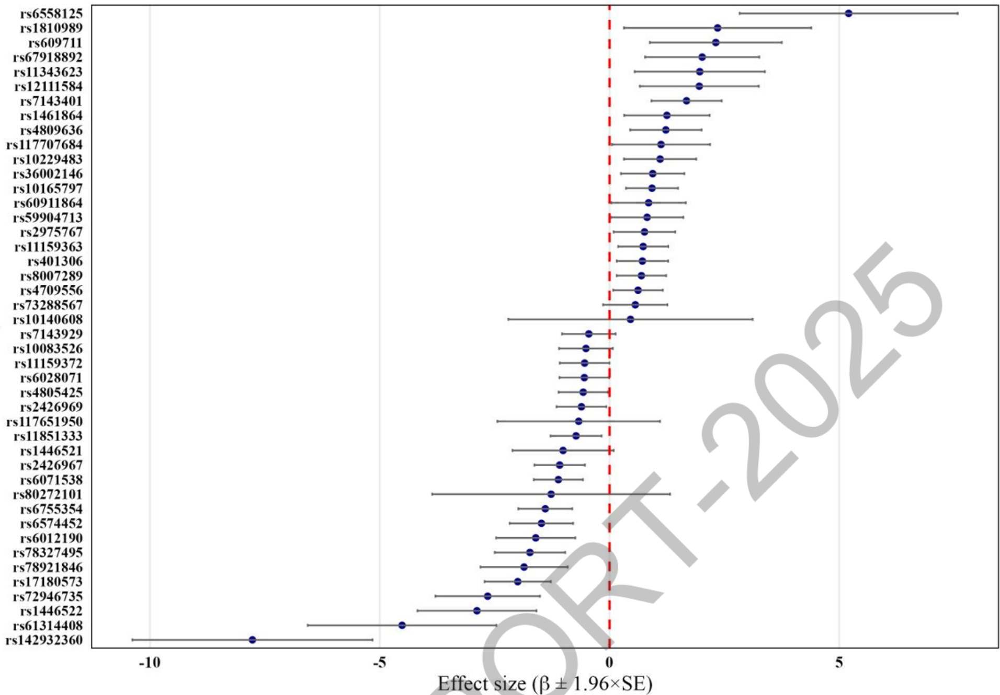

图 1-12 FINMAP 分析高置信度因果变异位点的 beta 效应森林图

附注:森林图展示了高置信度变异位点的beta效应，横轴表示效应值（beta）及其95%置信区间（CI），纵轴为对应的变异位点（RSID）。点代表估计的效应值，横线代表95%置信区间。红色竖线表示无效应线（beta=0）。

## 7.5 TWAS 分析结果

在鉴定出多个与性状相关的高置信度因果遗传位点基础上，为进一步解析这些位点可能调控的功能机制，我们随后开展了基于表达权重的转录组关联分析TWAS）。

## 7.5.1 单组织（single tissue）TWAS 分析结果

首先，利用GTEx v8数据库中49个组织的表达权重文件，采用FUSION工具对 GWAS summary数据进行了单组织（single tissue）TWAS 分析，共鉴定出16,038个关联显著的基因（p<0.05），其中15个位点在错误发现率（FDR）校正后仍具有提示性意义 $(p_{\_}  FDR  < 0.1)$ ，信号来源于9种不同组织。使用biomaRt包对ENSEBLID进行注释，成功识别出相关蛋白编码基因MKRN2、CPSF2、SLC20A1、FBLN5、PTPRU、ATXN3和NDUFB1基因（其中位于22号染色体的ENSG00000273188 和 12号染色体的 ENSG00000250790为长链非编码RNA，未能成功注释）。值得注意的是，即便是采用最严格的Bonferroni校正，仍旧有4个位点保持显著（p\_BON<0.05），对应的基因为MKRN2、CPSF2、SLC20A1、FBLN5（表1-7，图1-13）。

基于 GTEx v8数据的 TWAS-FUSION分析结果绘制了基因密度图(图1-14)，结果显示大部分染色体区域都有基因分布，但仍可见少部分区域变异密度仍较低，有些区域甚至几乎没有被任何的基因所覆盖，这与GWAS结果中变异密度图(图1-14）趋势基本一致。此外，为评估TWAS分析中统计检验是否存在系统性偏倚（如群体结构或其他混杂因素引起的假阳性膨胀），我们绘制了QQ图（图1-15）和计算了基因水平的膨胀系数（genomic inflation factor，λGc），其值为0.983。该值接近于理论预期值1，提示TWAS分析结果整体未出现显著的系统性偏倚。

我们进一步分析了 TWAS-FUSION 结果中所有基因的 TWAS.Z 值，发现大多数基因的TWAS.Z值分布在-4至4之间，而显著基因（p\_FDR<0.05）的绝对值均大于4，提示这些候选基因的关联信号具有较高的可信度（图1-16A）。随后我们评估了 FDR 值与 TWAS.Z 值之间的关系，结果显示，无论 TWAS.Z 为正（TWAS.Z>0）还是为负（TWAS.Z<0），其绝对值越大，FDR值越小，说明更显著的表达差异通常对应更小的p值。 进一步的线性回归分析验证了这一趋势，正向 TWAS.Z 的 Spearman 相关系数为 R=-0.59，负向为 R=0.57，且均达到了很高的统计学显著水平（p<2.2×10-16）（图1-16B）。综上结果表明，TWAS中显著基因的筛选具有良好的信号强度一致性和统计稳健性。

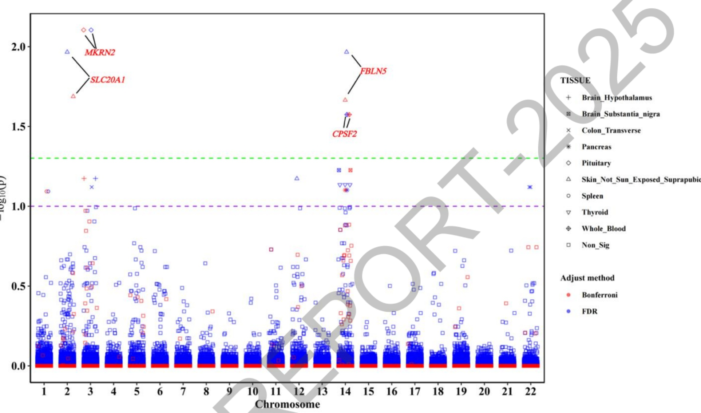

图 1-13 TWAS-FUSION 分析结果 Manhattan 图

附注:该图表示基于GTEx v8数据的 TWAS-FUSION关联分析结果曼哈顿图；紫色虚线（p=0.1）和绿色虚线（p=0.05）分别表示两个不同的的显著性关联阈值水平。图中蓝色代表经FDR校正后的 $p$ 值 $( p \_ \mathrm { F D R } )$ 的位点，红色代表经过Bonferroni校正后的 $\mathtt { p }$ 值 $( p \_ \mathrm { B O N } )$ 。曼哈顿图将关联分析之后所有位点经校正后的值 $p$ $( p _ { - }$ FDR/p BON $在$ 整个基因组上从左至右描绘，通常将 $p$ 值转换为 $- \log _ { 1 0 } ( p )$ ，x轴表示基因组位置， $\mathrm { y }$ 轴表示 $\log_{10}(p)$ 直，y轴代表与表型的关联程度， $\mathrm { y }$ 轴高度越高关联度越强（即 $p \_ \mathrm { F D R } / p \_ \mathrm { B O N }$ 值越小）。TISSUE表示权重模型面板名称（即组织类型），对于 $p$ 值小于0.05 的TWAS信号根据不同的PANEL使用不同的形状表示。图中标注了四个在两个校正方法下均显著 $\left(p_{\_} FDR /p_{\_} BON \right.$ 值均小于0.05）的基因（MKRN2、CPSF2、SLC20A1、FBLN5)。Manhattan图=曼哈顿图。

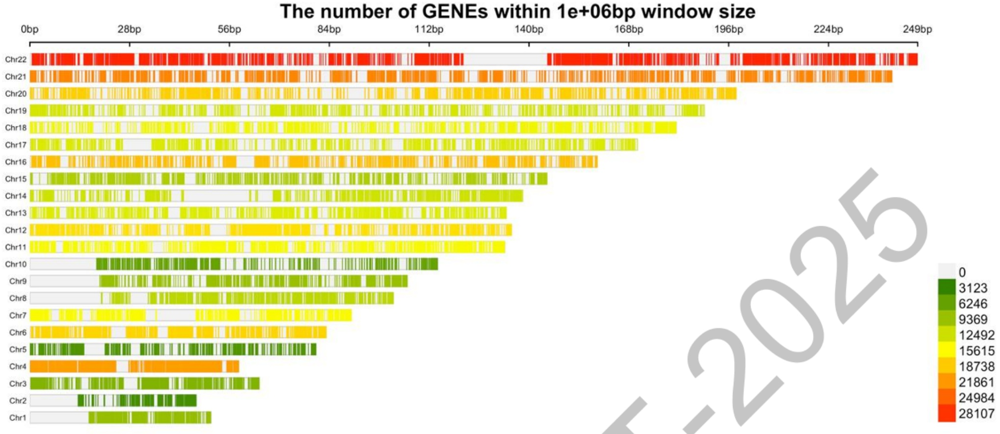

图 1-14 TWAS-FUSION 分析基因概率密度图

附注:图中左侧坐标轴显示22条染色体，顶侧坐标轴显示染色体上具体基因组位置。右下角图例表示基因的密度大小，图例越往下颜色越红表示所在染色体区域基因密度越大。

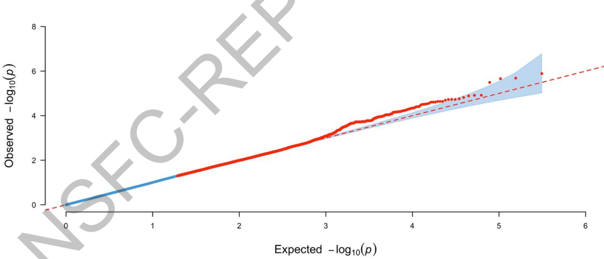

图 1-15 TWAS-FUSION 分析 QQ 图

附注:该图展示了基于 GTEx v8 数据的 TWAS-FUSION 分析 QQ 图。QQ 图的 x 轴则是期望的均匀分布的概率值，y轴是位点实际关联分析结果 $- \log_{10}(p)$ 值。如果变异对性状或表型的影响存在显著相关的自然选择，可看到两者相互分离情况，p值（TWAS.P）越低分离程度就越高，QQ图尾部会翘起来。如果表型性状并非自然选择，则p值的实际值和均匀分布结果将集中于一条直线上(即图中红色虚线)。QQ图=分位图。

表 1-7 TWAS-FUSION 分析提示性关联结果（p-FDR<0.1）

| PANEL | CHR | MODEL | TWAS.Z | TWAS.P | ENSEMBL_ID | symbol Hgnc | p_FDR | p_BON |
| --- | --- | --- | --- | --- | --- | --- | --- | --- |
| GTExv8.ALL.Brain_Hypothalamus | 3 | top1 | -4.281 | 1.86E-05 | ENSG00000075975 | MKRN2 | 0.0670158 | 0.0670158 |
| GTExv8.ALL.Brain_Substantia_nigra | 14 | susie | -4.2181 | 2.46E-05 | ENSG00000165934 | CPSF2 | 0.0594336 | 0.0594336 |
| GTExv8.ALL.Colon Transverse | 3 | lasso | -4.1663 | 3.10E-05 | ENSG00000075975 | MKRN2 | 0.075857 | 0.227571 |
| GTExv8.ALL.Colon_Transverse | 22 | top1 | -4.218 | 2.46E-05 | ENSG00000273188 | ENSG00000273188 | 0.075857 | 0.1805886 |
| GTExv8.ALL.Colon_Transverse | 22 | top1 | -4.218 | 2.46E-05 | ENSG00000273137 | SELENOO-AS1 | 0.075857 | 0.1805886 |
| GTExv8.ALL.Pancreas | 14 | enet | -4.3762 | 1.21E-05 | ENSG00000165934 | CPSF2 | 0.0791945 | 0.0791945 |
| GTExv8.ALL.Pituitary | 3 | enet | -4.8406 | 1.30E-06 | ENSG00000075975 | MKRN2 | 0.00786384 | 0.00786384 |
| GTExv8.ALL.Skin_Not_Sun_Exposed_Suprapubic | 2 | lasso | -4.7465 | 2.10E-06 | ENSG00000144136 | SLC20A1 | 0.01081389 | 0.02053647 |
| GTExv8.ALL.Skin_Not_Sun_Exposed_Suprapubic | 12 | enet | 4.26135 | 2.03E-05 | ENSG00000250790 | ENSG00000250790 | 0.0671321 | 0.2013963 |
| GTExv8.ALL.Skin_Not_Sun_Exposed_Suprapubic | 14 | susie | 4.7357 | 2.20E-06 | ENSG00000140092 | FBLN5 | 0.01081389 | 0.02162778 |
| GTExv8.ALL.Spleen | 1 | top1 | -4.374 | 1.22E-05 | ENSG00000060656 | PTPRU | 0.0807396 | 0.0807396 |
| GTExv8.ALL.Thyroid | 14 | lasso | -4.2944 | 1.75E-05 | ENSG00000066427 | ATXN3 | 0.0732753 | 0.2035425 |
| GTExv8.ALL.Thyroid | 14 | susie | -4.326 | 1.52E-05 | ENSG00000183648 | NDUFB1 | 0.0732753 | 0.1767912 |
| GTExv8.ALL.Thyroid | 14 | lasso | -4.2771 | 1.89E-05 | ENSG00000165934 | CPSF2 | 0.0732753 | 0.2198259 |
| GTExv8.ALL.Whole_Blood | 14 | enet | -4.6565 | 3.20E-06 | ENSG00000165934 | CPSF2 | 0.02665516 | 0.02665516 |

附注:PANEL表示权重模型面板名称（即组织类型），代表该基因在该组织的遗传调控模型中与表型显著相关；CHR表示染色体编号；MODEL 表示用于 TWAS 分析中性能最优的模型；TWAS.P 表示 TWAS 的原始 p 值；TWAS.Z 表示 TWAS 分析中基因表达与性状关联的 Z 值，其正负代表预测表达水平与性状的关联方向，Z值大于0表示预测表达水平升高与性状表型增加（或患病）正相关，Z值小于0则表示负相关；ENSEMBL\_ID 表示 ENSEMBL 数据库中的基因编号；hgnc\_symbol 表示 HGNC 官方基因符号，通过 biomaRt 包从ENSEMBL\_ID 转换获得；p\_FDR 表示经过错误发现率（FDR）校正后的 p 值，此表格展示 p\_FDR<0.1 的提示性关联结果；p\_BON 表示经 Bonferroni 校正后的 p 值，若p\_BON<0.05，则在表格中以加粗形式显示。

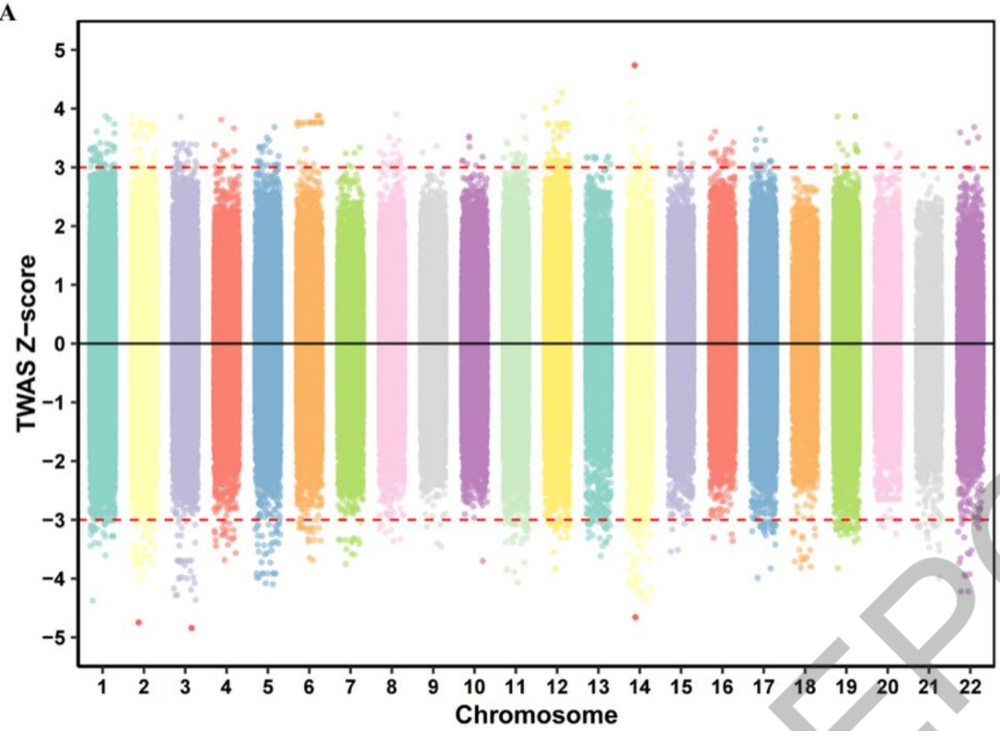

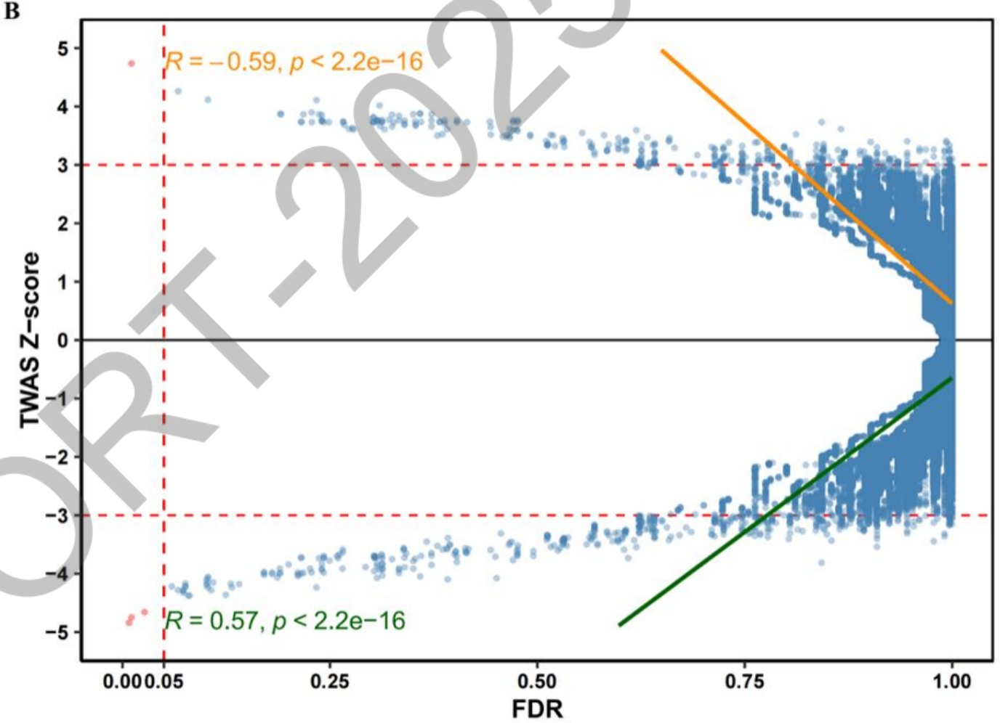

图 1-16 基于 TWAS-FUSION 分析结果的 Z-score 在染色体及 FDR 维度下的分布特征图

附注:A 图展示了基因在不同染色体上的 TWAS Z-score 分布情况。每个点代表一个基因，红色点为在 FDR 校正后p 值（p FDR）<0.05的显著基因。x 轴为染色体编号，y轴为TWAS Z-score，红色虚线为±4的阈值线，用于指示 Z-score显著偏离中值（Z=0）的区域。B 图展示了 FDR 值与 TWAS Z-score之间的关系。红色虚线表示 p\_FDR=0.05 的显著性阈值，以及 Z-score 的±4 边界。点图中加入了两条分别代表正向（橙色）与负向（绿色）Z-score的线性拟合回归曲线，并附有 Spearman 相关系数和显著性p 值，提示 Z-score与FDR之间的相关趋势。

TWAS通常在每个位点上识别出多个与性状相关的基因。为判断这些转录组全关联信号是否具有条件独立性，并评估在剔除TWAS 中表达权重影响后 GWAS 信号是否仍具有显著性，我们对表3-13 中的基因开展了条件分析与联合分析（COJO)。在GTEx v8数据集中，条件分析识别出多个独立显著的 TWAS基因信号（图1-17，表1-8）

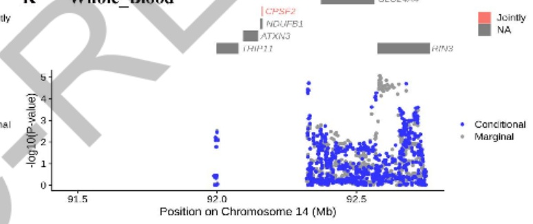

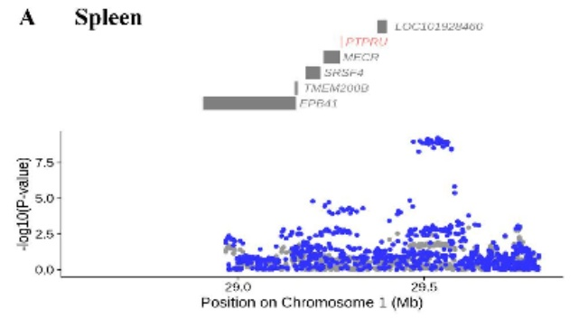

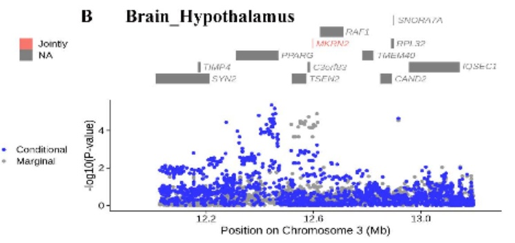

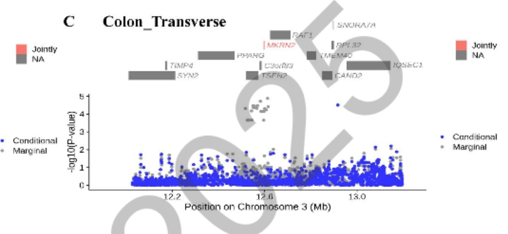

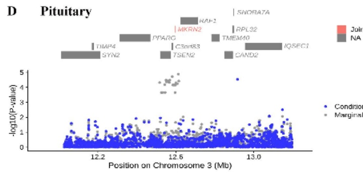

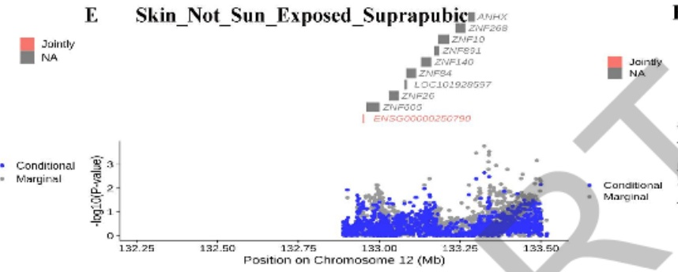

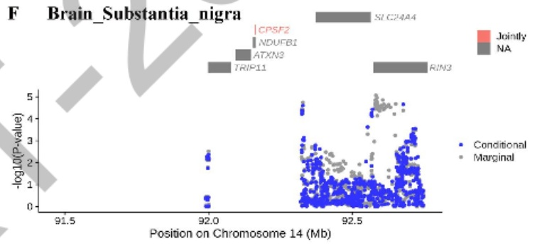

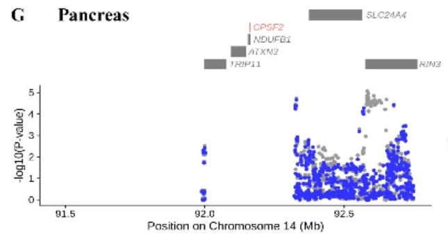

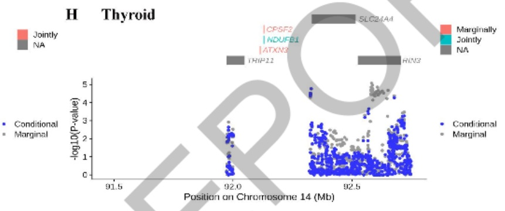

J Skin\_Not\_Sun\_Exposed\_Suprapubic

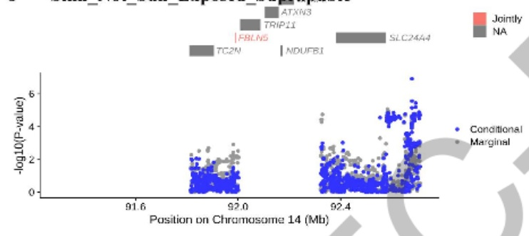

图1-17 TWAS 显著基因的条件分析区域关联图

附注:该图展示了TWAS分析中显著基因在条件分析后的区域关联图。图的上半部分展示了该基因座（locus）内的所有基因。其中，图H和Ⅰ的绿色基因代表联合条件分析后中仍保持显著（Jointly significant），红色基因则表示条件分析后显著性下降，仅为边缘显著（Marginal significant）。在其他图中，红色基因则表示联合条件分析后仍显著。所有图中灰色基因为未达到显著性标准的基因。图的下半部分为GWAS的曼哈顿图，灰色点代表原始的GWAS结果，蓝色点表示在控制绿色基因的预测表达值进行条件分析后的 GWAS 结果。SLC20A1基因所在的分析区域（1ocus）因未包含绝对TWAS Z值大于1.96的基因而未成功绘制区域图。

COJO条件分析结果显示，甲状腺组织（Thyroid）中的NDUFB1基因、横结肠组织（Colon Transverse）中的ENSG00000273188基因和耻骨上区未曝晒皮肤（Skin Not Sun Exposed Suprapubic）的 ENSG00000250790 基因经条件分析后变得显著（jointly significant）；相反，甲状腺组织（Thyroid）的 CPSF2、ATXN3基因和横结肠组织（Colon\_Transverse）的 SELENOO-AS1基因，虽在边缘上显著（marginally significant），但在控制其他基因表达后失去显著性（图1-17H、I）。此外，CPSF2、PTPRU、SLC20A1、FBLN5、MKRN2基因在相应组织与染色体区域的条件分析中仍保持显著，表明这些基因在各自区域对 GWAS 信号具有独立解释能力（表1-8，图1-17A-G，图1-17J-K）

表 1-8 TWAS 显著基因条件分析和联合分析（COJO）结果

| Tissue | CHR | GENE | TWAS.Z | TWAS.P | JOINT.Z | JOINT.P |
| --- | --- | --- | --- | --- | --- | --- |
| GTExv8.ALL.Brain_Substantia_nigra | 14 | CPSF2 | -4.2 | 2.50E-05 | -4.2 | 2.50E-05 |
| GTExv8.ALL.Pancreas | 14 | CPSF2 | -4.4 | 1.20E-05 | -4.4 | 1.20E-05 |
| GTExv8.ALL.Whole_Blood | 14 | CPSF2 | -4.7 | 3.20E-06 | -4.7 | 3.20E-06 |
| GTExv8.ALL.Spleen |  | PTPRU | -4.4 | 1.20E-05 | -4.4 | 1.20E-05 |
| GTExv8.ALL.Skin_Not_Sun_Exposed_Suprapubic |  | SLC20A1 | -4.7 | 2.10E-06 | -4.7 | 2.10E-06 |
| GTExv8.ALL.Skin_Not_Sun_Exposed_Suprapubic | 14 | FBLN5 | 4.7 | 2.20E-06 | 4.7 | 2.20E-06 |
| GTExv8.ALL.Skin_Not_Sun_Exposed_Suprapubic | 12 | ENSG00000250790 | 4.3 | 2.00E-05 | 4.3 | 2.00E-05 |
| GTExv8.ALL.Brain_Hypothalamus | 3 | MKRN2 | -4.3 | 1.90E-05 | -4.3 | 1.90E-05 |
| GTExv8.ALL.Colon Transverse | 3 | MKRN2 | -4.2 | 3.10E-05 | -4.2 | 3.10E-05 |
| GTExv8.ALL.Colon_Transverse | 22 | ENSG00000273188 | -4.2 | 2.50E-05 | -4.2 | 2.50E-05 |
| .ALL.Colon_Transverse GTExv8. | 22 | SELENOO-AS1 | -4.2 | 2.50E-05 | -2.2 | 0.26 |
| GTExv8.ALL.Pituitary | 3 | MKRN2 | -4.8 | 1.30E-06 | -4.8 | 1.30E-06 |
| GTExv8.ALL.Thyroid | 14 | NDUFB1 | -4.3 | 1.50E-05 | -4.3 | 1.50E-05 |
| GTExv8.ALL.Thyroid | 14 | ATXN3 | -4.3 | 1.70E-05 | -0.58 | 0.56 |
| GTExv8.ALL.Thyroid | 14 | CPSF2 | -4.3 | 1.90E-05 | -0.43 | 0.66 |

附注:Tissue表示GTEx v8数据库中的不同组织类型；CHR表示染色体编号；GENE表示基因，COJO 分析后显著的基因予以加粗显示；TWAS.P 表示 TWAS 的原始p 值；TWAS.Z 表示 TWAS 的原始Z 值；JOINT.Z 表示 COJO 分析后的 TWAS.Z 值；JOINT.P 表示 COJO 分析后的 TWAS.P 值。

精细定位分析为TWAS信号提供了因果关联的支持。为进一步识别潜在的因果基因，本研究使用FOCUS工具计算了每个TWAS区域以及相关组织中基因的后验纳入概率（PIP）。共识别出10个基因组区域，其90%可信基因集（credible gene set）中的 TWAS.Z绝对值大于3（表1-9，图1-18）。每个基因集中，我们综合考虑PIP值、TWAS.Z值、疾病生物学相关性及组织特异性遗传调控效应，对潜在因果基因进行优先排序。当多个基因PIP值接近时，我优先考虑来源于脑组织的调控信号。

例如，在基因组区域13:20905444-13:21812026中，尽管IFT88基因的 PIP为 0.274（TWAS.Z=3.29），略高于ZDHHC20基因（PIP=0.16，TWAS.Z=3.14），但由于ZDHHC20的遗传预测表达在小脑（brain\_cerebellum)中与表型显著相关，因此更可能作为该位点的候选基因（图1-19A)。在区域14:39872843-14:42597498中，CTAGE5在主动脉（artery\_aorta）中的 PIP达到0.738，为本次分析中最高值（图1-19B）。在区域2:112719634-2:115656075中，TMEM87B在心房耳（heart\_atrial\_appendage）中的 PIP 为 0.683（图1-195C）。在区域20:46185593-20:48582292中，SULF2在脂肪组织（adipose）中的PIP为0.536（图1-19D）。在区域14:91151663-14:92450055中，TC2N基因在脑尾状核（brain\_caudate\_basal\_ganglia）中的 PIP 为 0.49（图 1-19E），而CATSPERB 在阳光暴露小腿皮肤组织(skin\_sun\_exposed\_lower\_leg)中的PIP为0.602(图1-19F)，但其TWAS.Z值较低（TWAS.Z=0.257），因此这两个基因均被纳入候选基因列表。在区域 14:102923688-14:104535557中，BAG5在脑- 脊髓颈 1段（brain\_spinal\_ cord\_cervical\_c-1）中的 PIP为 0.202（图 1-19G）。在区域20:40455203-20:42569780 中，ZHX3 在脑尾状核 -基底神经节（brain\_caudate\_basal\_ganglia）中的 PIP为 0.397（图 1-19H）。

此外，在其他若干区域，尽管部分基因的TWAS.Z值绝对值大于3，但其PIP相对较低且未在脑组织中有调控信号，故未被纳入后续候选基因分析。

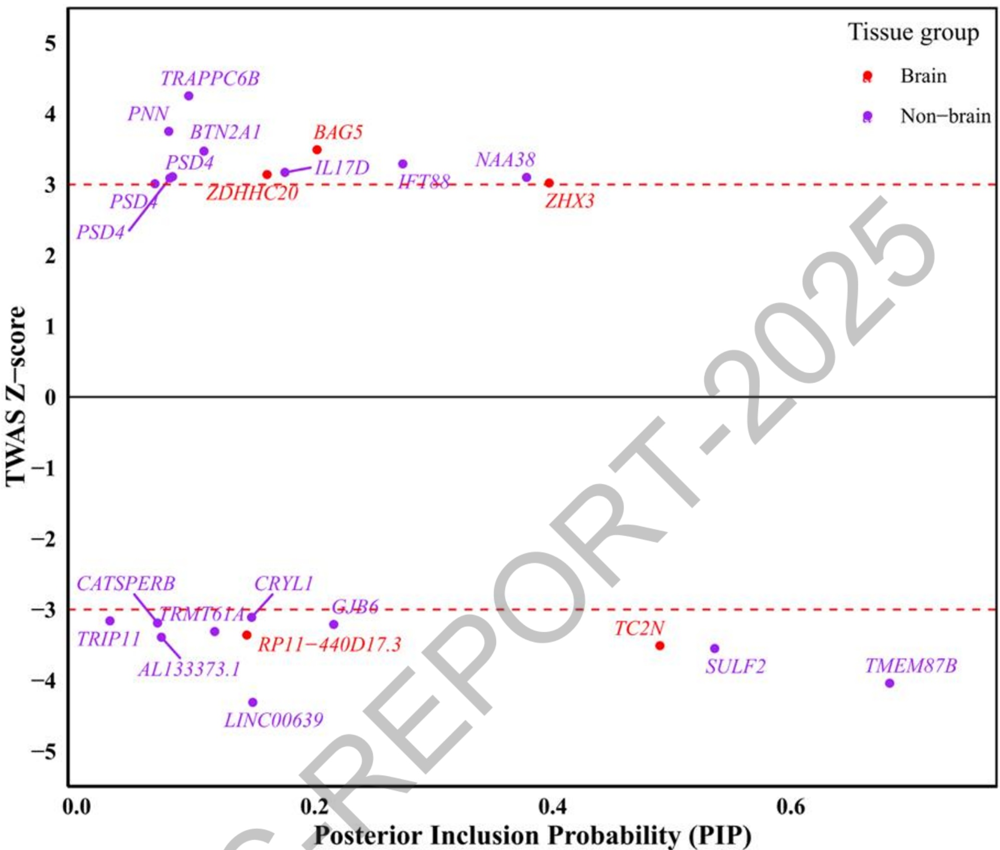

图 1-18 TWAS-FOCUS 分析中基因 PIP 与 TWAS.Z 的关系图

附注:该图展示了 TWAS 信号经过 FOCUS 精细定位分析得到的 TWAS.Z 绝对值大于 3的候选基因的后验纳入概率(PIP)与 TWAS.Z之间的关系图。x 轴代表PIP， y轴代表 TWAS.Z。红色散点图代表脑组织来源的信号基因，紫色散点代表非脑组织来源的信号基因。

表 1-9 TWAS-FOCUS 分析中 90%可信基因（cred set）集中 TWAS.Z 绝对值大于 3 的基因列表

| CS | BLOCK | GENE | TISSUE | TYPE | CHR | twas_z pop1 | pips_pop1 | cred set |
| --- | --- | --- | --- | --- | --- | --- | --- | --- |
|  | 13:20905444-13:21812026 | IFT88 | testis | protein_coding |  | 3.29 | 0.274 |  |
|  | 13:20905444-13:21812026 | GJB6 | esophagus_gastroesophageal_junction | protein_coding |  | -3.21 | 0.216 |  |
|  | 13:20905444-13:21812026 | IL17D | testis | protein_coding | 3 | 3.17 | 0.175 |  |
|  | 13:20905444-13:21812026 | ZDHHC20 | brain_cerebellum | protein_coding | 13 | 3.14 | 0.16 |  |
|  | 13:20905444-13:21812026 | CRYL1 | thyroid | protein_coding | 13 | -3.11 | 0.147 |  |
|  | 14:39872843-14:42597498 | CTAGE5 | artery_aorta | protein_coding | 14 | -5.1 | 0.738 |  |
| 2 | 14:39872843-14:42597498 | LINC00639 | ovary | lincRNA | 14 | -4.31 | 0.148 |  |
| 2 | 14:39872843-14:42597498 | TRAPPC6B | esophagus_mucosa | protein_coding | 14 | 4.25 | 0.0942 |  |
| 2 | 14:39872843-14:42597498 | PNN | lung | protein_coding | 14 | 3.75 | 0.0774 |  |
| 3 | 14:91151663-14:92450055 | TC2N | brain_caudate_basal_ganglia | protein_coding | 14 | -3.51 | 0.49 |  |
| 3 | 14:91151663-14:92450055 | AL133373.1 | artery_aorta | protein_coding | 14 | -3.39 | 0.0712 |  |
| 3 | 14:91151663-14:92450055 | CATSPERB | heart_left_ventricle | protein_coding | 14 | -3.19 | 0.068 |  |
| 3 | 14:9115166314:92450055&amp; | CATSPERB | skin_sun_exposed_ lower | protein_coding | 14 | 0.257 | 0.602 |  |
| 3 | 14:91151663-14:92450055 | TRIP11 | thyroid | protein_coding | 14 | -3.16 | 0.028 |  |
| 4 | 14:102923688-14:104535557 | BAG5 | brain_spinal_cord_ cervical c-1 | protein_coding | 14 | 3.49 | 0.202 |  |
| 4 | 14:102923688-14:104535557 | TRMT61A | adipose_visceral_omentum | protein_coding | 14 | -3.31 | 0.116 |  |
| 5 | 20:40455203-20:42569780 | ZHX3 | brain_caudate_basal_ganglia | protein_coding | 20 | 3.02 | 0.397 |  |
| 6 | 20:46185593-20:48582292 | SULF2 | adipose | protein_coding | 20 | -3.55 | 0.536 |  |
| 7 | 2:94661085-2:98012646 | RP11-440D17.3 | brain_caudate_basal_ganglia | lincRNA |  | -3.36 | 0.143 |  |
| 8 | 2:112719634-2:115656075 | TMEM87B | heart_atrial_appendage | protein_coding |  | -4.04 | 0.683 |  |
| 8 | 2:112719634-2:115656075 | PSD4 | esophagus_gastroesophageal_junction | protein_coding |  | 3.11 | 0.0806 |  |
| 8 | 2:112719634-2:115656075 | PSD4 | spleen | protein_coding |  | 3.09 | 0.0784 |  |
| 8 9 | 2:112719634-2:115656075 | PSD4 | ovary | protein_coding | 222226 | 3.01 | 0.0658 |  |
|  | 6:26141529-6:26697324 | BTN2A | breast_mammary_tissue | protein_coding |  | 3.47 | 0.107 |  |
| 10 | 7:117278234-7:119433998 | NAA38 | pancreas | protein_coding | 7 | 3.1 | 0.378 |  |

附注:BLOCK 表示 GWAS 信号区间；GENE 表示候选基因；TISSUE 表示 GTEx v8 中不同组织的 TWAS 模型；TYPE 表示基因的类型；CHR 表示染色体编号；twas\_z\_pop1 表示 TWAS 分析的 Z-score，代表预测表达与表型的相关性强度。pips\_pop1 表示即该基因在此区域为因果基因的后验纳入概率（PIP）。cred\_set 表示是否被纳入 90% credible set 中，1 表示是，0表示否。&:TWAS.Z 绝对值小于3，但 PIP>0.5.

G GenomicRegion:14:102923688-14:104535557

B Genomic Region:14:39872843-14:42597498

A Genomic Region: 13:20905444-13:21812026

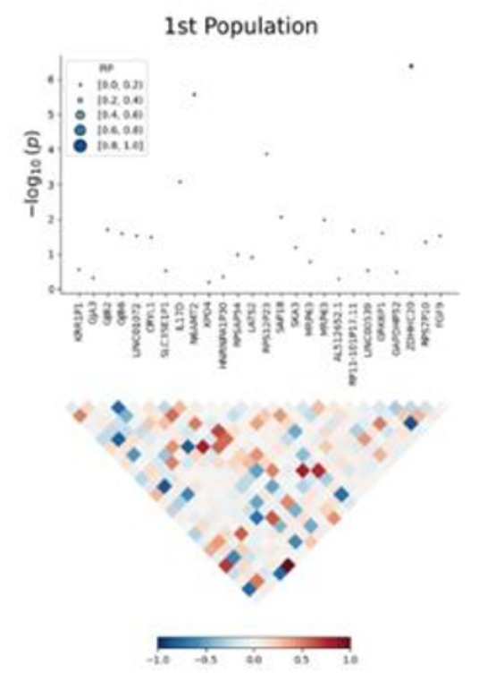

E Genomic Region: 14:91151663-14:92450055

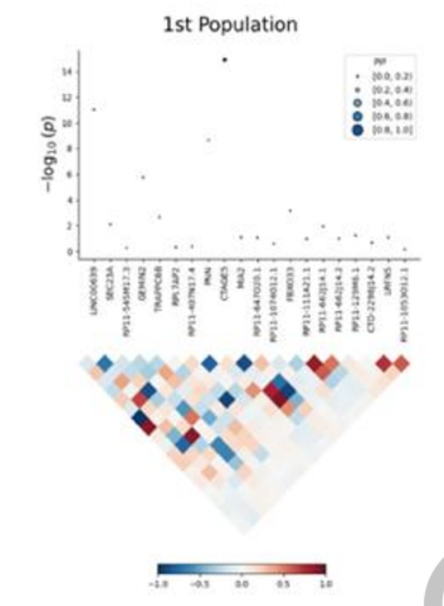

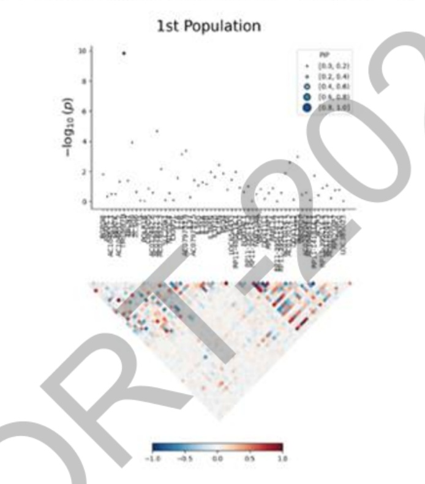

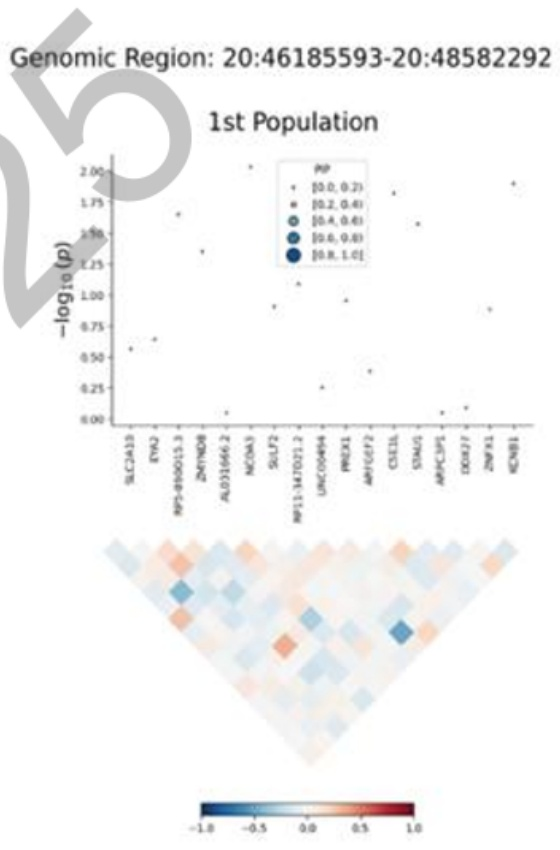

HGenomic Region:20:40455203-20:42569780

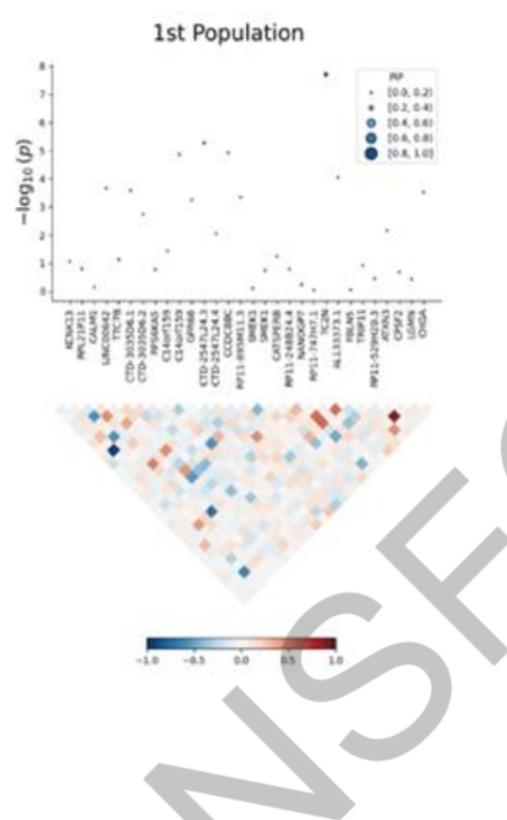

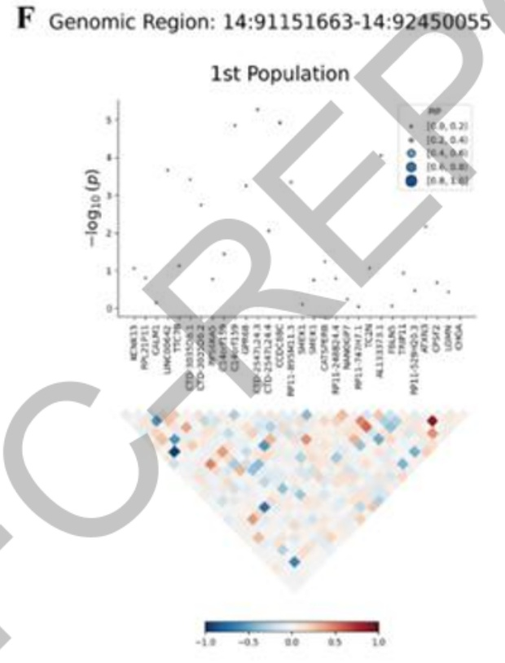

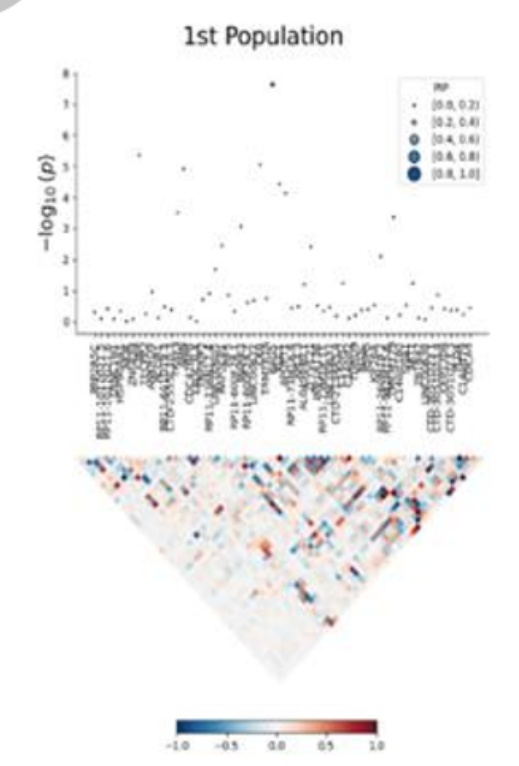

图 1-19 TWAS 信号精细定位分析结果图

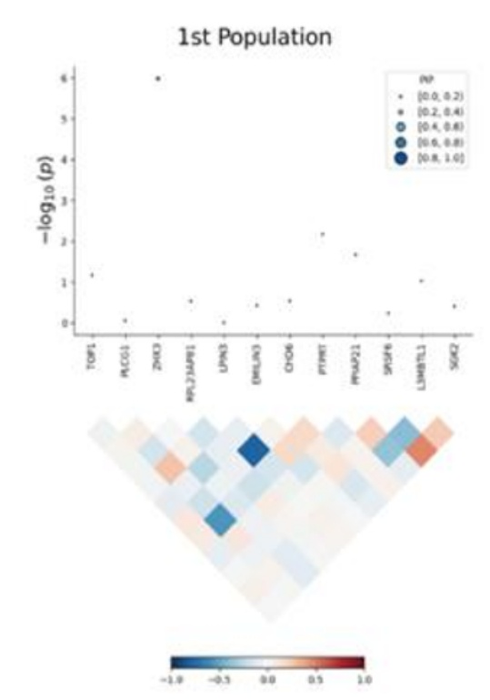

附注:该图展示了 TWAS 信号经过 FOCUS 精细定位分析的结果。PIP 表示后验纳入概率。纵轴显示的是由 FOCUS 得出的 TWAS p 值，横轴显示的是该基因组区域内的各个基因。图下半部分展示了该区域的局部相关性结构。

## 7.5.2跨组织（cross tissue）TWAS 分析结果

在系统评估单组织（single tissue）TWAS结果后，我们进一步考虑到不同组织间可能存在共调控的表达模式，尤其是在复杂性状的遗传调控中，不同组织对表型的影响可能具有协同作用或互补效应。因此，为捕捉复杂性状中多组织协同或互补的遗传效应，我们开展了基于UTMOST的跨组织（cross tissue）TWAS分析，以整合多组织的表达权重信息并提升检测效能与生物学解释力。

首先，基于我们的 GWAS 汇总统计结果，使用 UTMOST 对 GTEx v8 的 49个组织的表达权重模型逐一进行单组织关联分析，共得到22,056个候选基因纳入下一步的UTMOST跨组织关联分析。然后，使用GBJ检验对所有组织中的基因-性状关联结果进行跨组织分析，共得到3,629个有p值结果的基因，其中有160 个基因的 p 值小于 0.05，经过 FDR 校正后 LINC01850基因显示出显著的性状关联（p\_FDR<0.05），提示其在多个组织中的协同表达模式与表型显著相关（表1-10，图1-20）。

综上，本研究在单组织与跨组织两个层面对GWAS信号的转录组关联特征进行了系统评估。单组织 TWAS 分析中，FUSION与 COJO一致鉴定出 MKRN2、SLC20A1、FBLN5 和 CPSF2 为显著基因（p\_FDR<0.05），NDUFB1经 COJO 分析后亦达显著水平。FOCUS精细定位分析在10个基因组区域构建了个90%可信基因集，并基于PIP值及脑组织信号优先筛选出 ZDHHC20、CTAGE5、TMEM87B、SULF2、TC2N、CATSPERB、BAG5和 ZHX3 等候选基因。跨组织 TWAS 分析额外鉴定出LINC01850在多组织中表现出协同表达效应，与性状显著相关$(p_{\_FDR} < 0.05)$

表 1-10 TWAS-UTMOST 跨组织分析显著位点（p-FDR<0.05）

| ENSEMBL_ID Test_score | p_value |  | Hgnc_symbol | p_FDR |
| --- | --- | --- | --- | --- |
| ENSG00000227708 | 4.409542 | 1.035895e-05 | LINC01850 | 0.03759262 |

附注: ENSEMBL\_ID 表示 ENSEMBL 数据库中的基因编号；Test\_score表示 UTMOST跨组织分析中的统计检验分数；P\_value 表示 UTMOST 分析的原始p 值；Hgnc\_symbol 表示HGNC 官方基因符号，通过 biomaRt 包从 ENSEMBL\_ID 转换获得；p\_FDR 表示经过 FDR校正后的p 值。

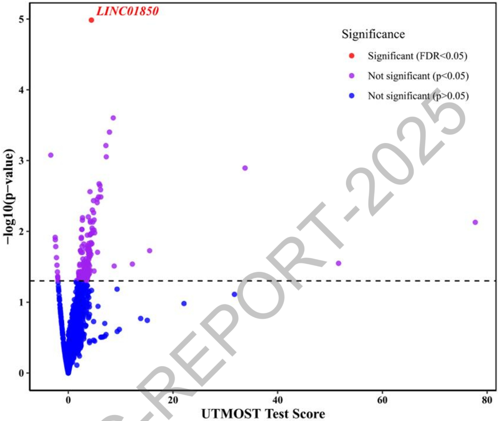

图 1-20 TWAS-UTMOST 分析基因的 Test\_score 与 p\_value 的火山图

附注:该图展示了 UTMOST 分析得到的 3,629 个基因的 Test\_socre 与 p\_value 的火山图；x 轴表示Test\_socre 值，y 轴表示-log1o(p\_value)值；蓝色和紫色散点分别表示 UTMOST 分析的原始 p\_value 大于0.05 和小于0.05的非显著性基因；红色散点表示原始 p\_value 经过 FDR 校正后小于 0.05 的显著性基因；黑色虛线代表 $y = - \log_{10}(0.05)$ 的水平参考线。

## 7.6 SMR 因果分析结果

为进一步探索GWAS关联信号背后的潜在调控机制，我们采用基于摘要数据的孟德尔随机化方法（SMR），系统分析了GWAS结果与eQTL（基因表达）、sQTL（剪接变异）和mQTL（DNA甲基化）数据共定位情况。SMR方法通过整合GWAS与 QTL数据，有助于识别可能通过影响基因表达、剪接或甲基化等分子机制而介导表型变异的候选基因。

在 SMR-eQTL 分析中，基于 GTEx v8 cis-eQTL 数据、BrainMeta v1/v2、Westra、CAGE、Geuvadis 和 PsychENCODE 等数据，检测到一系列满足 $p_{\_} \mathrm{SNR} < 0.05$ 且 $p _ { - }$ HEIDI>0.01 的候选基因，但经多重校正后均未达到显著性（表1-11）。在SMR-mQTL分析中，基于Brain-mMeta、Hatton-EAS、Hannon-Blood dataset1/2 和 Hannon-FetalBrain等数据，也检测部分符合条件的基因信号，但同样在校正后未见显著结果（表1-12）。

表 1-11 SMR-eQTL 分析结果汇总

<table><tr><td rowspan="2">eQTL 数据</td><td colspan="2">eQTL</td><td></td><td></td></tr><tr><td>基因总数</td><td>p_SMR&lt;0.05 p_BON</td><td>&lt;0.05 p</td><td>FDR&lt;0.05/0.1</td></tr><tr><td>GTEx V8</td><td>193,262</td><td>8,800</td><td>0</td><td>0/0</td></tr><tr><td>BrainMeta v1</td><td>6,347</td><td>281</td><td>0</td><td>0/0</td></tr><tr><td>BrainMeta v2</td><td>13,765</td><td>638</td><td>0</td><td>0/0</td></tr><tr><td>Westra</td><td>5,766</td><td>276</td><td>0</td><td>0/0</td></tr><tr><td>CAGE</td><td>7,690</td><td>380</td><td>0</td><td>0/0</td></tr><tr><td>Geuvadis</td><td>1,580</td><td>61</td><td>0</td><td>0/0</td></tr><tr><td>PsychENCODE (PEER50/HCP100)</td><td>8,958/9,556</td><td>415 /447</td><td>0</td><td>0/0</td></tr></table>

附注:p\_BON 表示 p\_SMR 经 Bonferroni 校正后 p 值；p\_FDR 表示 p\_SMR 经 FDR 校正后 $p$ 值。

表 1-12 SMR-mQTL 分析结果汇总

<table><tr><td rowspan="2">mQTL 数据</td><td colspan="2"></td><td colspan="2">mQTL</td></tr><tr><td>基因总数</td><td>p_SMR&lt;0.05</td><td>p_BON&lt;0.05</td><td>p_FDR&lt;0.05/0.1</td></tr><tr><td>Brain-mMeta</td><td>77,955</td><td>3,246</td><td>0</td><td>0/0</td></tr><tr><td>Hatton-EAS</td><td>112,245</td><td>5,127</td><td>0</td><td>0/0</td></tr><tr><td>Hannon-Blood dataset1/</td><td></td><td></td><td></td><td></td></tr><tr><td>Hannon-FetalBrain</td><td></td><td></td><td></td><td></td></tr></table>

附注:-表示 SMR 分析未识别到与 mQTL数据共定位的基因。余附注同表1-11的附注。

在 SMR-sQTL 分析中，基于 GTEx v8 项目 49 种人类组织的 cis-sQTL 汇总数据，共检测到 10,884 个基因信号满足 p\_SMR<0.05 且 $p_{\_} \mathrm{HEIDI} > 0.01$ 。经FDR校正后，仍有157个信号达到显著水平 $(p_{\_FDR} < 0.05)$ 。剔除在多个组织中重复出现的基因后，最终确定7个编码蛋白基因（NDUFB1、HAP1、SULF2、CKB、SNRPA1和MZT2A）和2个非编码蛋白基因（SNHG10、RP11-1252D15.1）为显著的SMR-sQTL关联基因，分布于46种组织中，提示这些基因可能通过剪接调控与表型相关。其中，NDUFB1、HAP1和 SNHG10的基因信号均来自脑组织(图1-21B)，又以NDUFB1基因的信号最为密集(达到127次，图1-21A，表1-13）。

当将显著阈值放宽至 $p_{\_}  FDR  = 0.1$ 时，共识别到308个具有提示性的基因信号。去除重复后，最终确定18个编码蛋白基因（ADAMTS7、CCDC175、CCZ1B、CKB、EMID1、GPR135、HAP1、JKAMP、L3HYPDH、LGMN、MZT2A、NDUFB1、RPS6KL1、SNRPA1、SULF2、

TMEM235、TMEM259和WNK1）和3个非编码基因（RP11-1252D15.1、RP3-402G11.28和 SNHG10）为提示性 SMR-sQTL关联基因（表1-13）

表 1-13 发现队列 SMR-sQTL 分析结果提示性结果汇总（p\_FDR<0.1）

| 序号 | Gene | 基因类型 | 显著信号 (p_BON/p_FDR&lt;0.05) | 提示信号 (p_FDR&lt;0.1) | Counts |
| --- | --- | --- | --- | --- | --- |
| 1 | NDUFB1 | protein_coding | 否/是 | 是是是是是是是是是是是是是是是是是是是是是 | 137 |
|  | RP3-402G11.28 | non_protein_coding | 否/否 |  | 35 |
| 23 | SNRPA1 | protein_coding | 否/是 |  | 27 |
| 4 | HAP1 | protein_coding | 否/是 |  | 20 |
| 5 | EMID1 | protein_coding | 否/否 |  | 17 |
| 6 | L3HYPDH | protein_coding | 否/否 |  | 15 |
| 7 | GPR135 | protein_coding | 否/否 |  | 14 |
| 8 | SNHG10 | non_protein_coding | 否/是 |  | 8 |
| 9 | CCDC175 | protein_coding | 否/否 |  | 6 |
| 10 | LGMN | protein_coding | 否 否 |  | 6 |
| 11 | TMEM235 | protein_coding | 否 |  |  |
| 12 | WNK1 | protein_coding | 否否 否 |  |  |
| 13 | JKAMP | protein_coding | 否 否 |  | 4432222 |
| 14 | CCZ1B | protein_coding | 否/否 |  |  |
| 15 | SULF2 | protein_coding | 否/是 |  |  |
| 16 | TMEM259 | protein_coding | 否/否 |  |  |
| 17 | RP11-1252D15.1 | non_protein_coding | 否/是 |  |  |
| 18 | MZT2A | protein_coding | 否/否 |  | 1 |
| 19 | RPS6KL1 | protein_coding | 否/否 |  | 1 |
| 20 | CKB | coding protein | 否/是 |  | 1 |
| 21 | ADAMTS7 | protein coding | 否/否 |  |  |

附注:Counts 表示在 SMR-sQTL分析中每个基因信号出现的次数;p\_BON表示p\_SMR 经 Bonferroni校正后 p 值;p\_FDR 表示 p\_SMR 经FDR 校正后 p 值。该表格展示了所有提示性信号基因(p\_FDR<0.1)。在显著性判定中，我们采用了两种不同的校正标准，即p\_BON和p\_FDR。

A

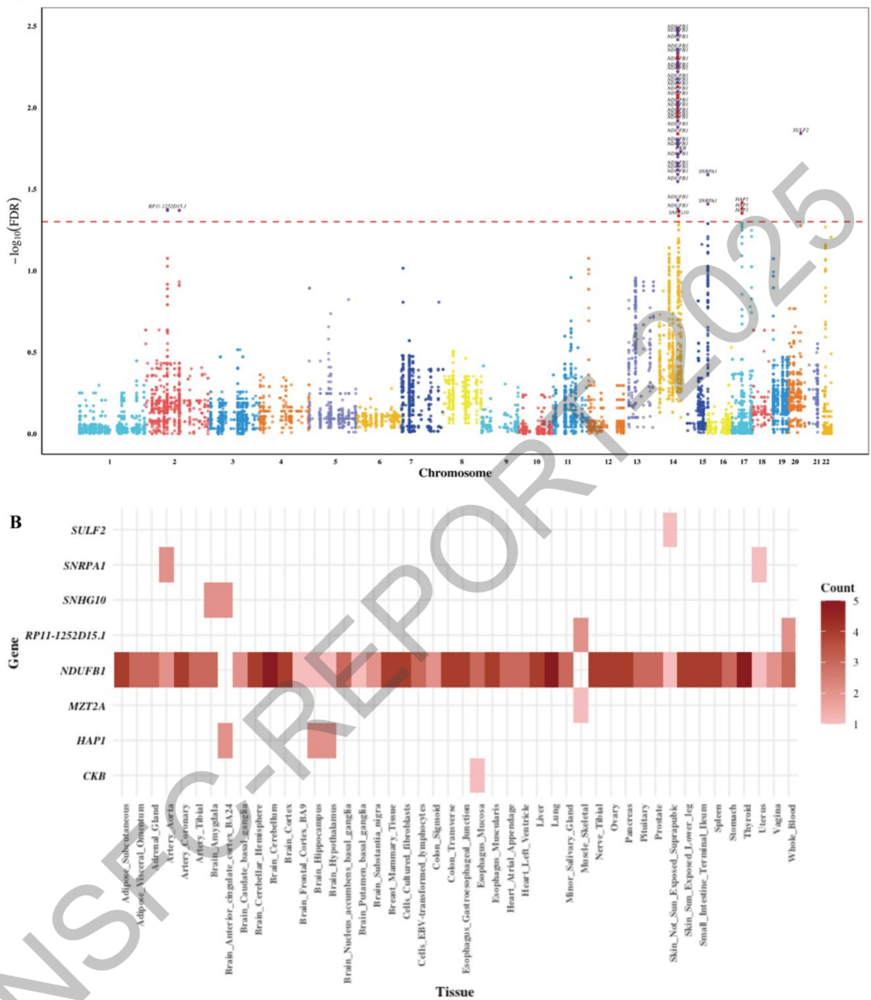

图 1-21 发现队列 SMR-sQTL 分析结果 manhattan 图和组织热图

附注:图 A 展示了 $\mathrm{SMR-sQTL}$ 分析中10,884个满足 $p_{\_} \mathrm{SNR} < 0.05$ 且 $p_{\_} \mathrm{HEIDI} > 0.01$ 的基因信号的manhattan 图。x 轴表示染色体，y 轴表 $-\log_{10}(p\_FDR)$ ；红色虚线表示显著性阈值 $(p_{\_}FDR = 0.05)$ 。在$p_{\_}  FDR  < 0.05$ 的的基因中，来源于脑组织的标记为红色，非脑组织的标记为紫色。图B展示了 $\mathrm { S M R - } \mathrm { S Q T L }$分析中157个显著基因信号 $\left( p_{\_}  FDR  < 0.05 \right)$ 且 $p_{\_} \mathrm{HEIDI} > 0.01$ 的热图。x轴为组织，y轴为基因，颜色深浅反映基因出现次数，次数越多颜色越深。

## 7.7 SharePro 共定位分析结果

在本研究中，为进一步探索GWAS识别的潜在致病位点与基因表达调控之间的因果关系，我们采用SharePro方法对前期分析所得到的一系列候选基因进行了共定位分析。候选基因来源包括:GWAS 显著性位点 $(p < 5 \times 10^{-8})$ 、提示性位点 $( 5 \times 10^{-8} < p < 1 \times 10^{-5} )$ 及独立位点对应的邻近基因、FINEMAP鉴定的高置信度基因（PIP>0.9），以及TWAS筛选的提示性候选基因 $(p -  FDR  < 0.1)$ 。共计纳入45个候选基因，并结合GTExV8数据库中相关组织的表达数量性状位点（eQTL）信息进行共定位分析。

结果显示，在13种组织中共鉴定出34个阳性共定位位点（共定位概率share>0.9且变异后验概率variantProb>0.9，表1-14）。其中，编号1-5、18-21和31-32的变异位点均位于RIN3基因内含子；编号7-10和12-15变异位于CPSF2基因内含子；编号22-24号变异位于CREB5基因内含子；编号29-30变异位于 EYA2基因内含子；编号6、17和25-28位点位于基因间区，其最近的基因分别为SLC24A4、ATXN3、NDUFB1基因。此外，还有多个由高度LD的 SNP组成的复合共定位信号簇，例如编号33-34位点，其变异后验概率均在0.2-0.3之间，提示这些位点可能共同参与调控相邻基因的表达。

综上，RIN3、CPSF2、NDUFB1、ATXN3、EYA2、SLC24A4和CREB5基因在其对应的GWAS信号区域内均呈现表显著共定位证据，提示这些基因的表达变异可能在疾病风险中具有因果作用。这些基因兼具较高的生物学相关性与共定位置信度，值得在后续研究进一步开展功能验证。

表 1-14 SHAREPRO 共定位分析阳性结果位点列表

| 编号 | CS | CHR | Share | VariantProb | GENE-GENE | Tissue |
| --- | --- | --- | --- | --- | --- | --- |
| 1 | rs7154217 | 14 | 1 | 1 | CATSPERB-RIN3 | Adrenal_Gland |
| 2 | rs6575263 | 14 | 1 | 1 | CATSPERB-RIN3 | Adrenal_Gland |
| 3 | rs12435243 | 14 | 1 | 1 | CATSPERB-RIN3 | Heart_Left_Ventricle |
| 4 | rs7154217 | 14 | 1 | 1 | CATSPERB-RIN3 | Heart_Left_Ventricle |
| 5 | rs6575263 | 14 | 1 | 1 | CATSPERB-RIN3 | Heart_Left_Ventricle |
| 6 | rs879303 | 14 | 1 | 1 | CATSPERB-SLC24A4;RIN3 | Heart Left_Ventricle |
| 7 | rs7151027 | 14 | 1 | 1 | CPSF2-CPSF2 | Adipose_Visceral_Omentum |
| 8 | rs28698177 | 14 | 1 | 1 | CPSF2-CPSF2 | Adipose_Visceral_Omentum |
| 9 | rs28698177 | 14 | 1 | 1 | CPSF2-CPSF2 | Colon_Sigmoid |
| 10 | rs7151027 | 14 | 1 | 1 | CPSF2-CPSF2 | Colon_Sigmoid |
| 11 | rs7152991 | 14 | 1 | 0.9963 | CPSF2-NDUFB1 | Esophagus_Mucosa |
| 12 | rs28698177 | 14 | 1 | 1 | CPSF2-CPSF2 | Muscle_Skeletal |
| 13 | rs7151027 | 14 | 1 | 1 | CPSF2-CPSF2 | Muscle_Skeletal |
| 14 | rs7151027 | 14 | 1 | 1 | CPSF2-CPSF2 | Nerve_Tibial |
| 15 | rs28698177 | 14 | 1 | 1 | CPSF2-CPSF2 | Nerve_Tibial |

续表 1-14 SHAREPRO 共定位分析阳性结果位点列表

<table><tr><td>编号</td><td>CS</td><td>CHR</td><td>Share</td><td>VariantProb</td><td>GENE-GENE</td><td>Tissue</td></tr><tr><td>16</td><td>rs6575263</td><td>14</td><td>1</td><td>1</td><td>FBLN5-RIN3</td><td>Artery_Coronary</td></tr><tr><td>17</td><td>rs879303</td><td>14</td><td>1</td><td>1</td><td>FBLN5-SLC24A4;RIN3</td><td>Artery_Coronary</td></tr><tr><td>18</td><td>rs7154217</td><td>14</td><td>1</td><td>1</td><td>FBLN5-RIN3</td><td>Artery_Coronary</td></tr><tr><td>19</td><td>rs12435243</td><td>14</td><td>1</td><td>1</td><td>FBLN5-RIN3</td><td>Colon_Sigmoid</td></tr><tr><td>20</td><td>rs7154217</td><td>14</td><td>1</td><td>1</td><td>FBLN5-RIN3</td><td>Sigmoid Colon</td></tr><tr><td>21</td><td>rs6575263</td><td>14</td><td>1</td><td>1</td><td>FBLN5-RIN3</td><td>Colon_Sigmoid</td></tr><tr><td>22</td><td>rs177574</td><td>7</td><td>1</td><td>1</td><td>HIBADH-CREB5</td><td>Putamen_basal_ganglia Brain</td></tr><tr><td>23</td><td>rs200014312</td><td>7</td><td>1</td><td>1</td><td>HIBADH-CREB5</td><td>Brain_Putamen_basal_ganglia</td></tr><tr><td>24</td><td>rs4722799</td><td>7</td><td>1</td><td>1</td><td>HIBADH-CREB5</td><td>Brain_Putamen_basal_ganglia</td></tr><tr><td>25</td><td>rs10142459</td><td>14</td><td>1</td><td>1</td><td>NDUFB1-ATXN3;NDUFB1</td><td>Adipose Subcutaneous</td></tr><tr><td>26</td><td>rs11160042</td><td>14</td><td>1</td><td>0.9946</td><td>NDUFB1-ATXN3;NDUFB1</td><td>Pancreas</td></tr><tr><td>27</td><td>rs10142459</td><td>14</td><td>1</td><td>0.9996</td><td>NDUFB1 ATXN3;NDUFB1</td><td>Pancreas</td></tr><tr><td>28</td><td>rs10142459</td><td>14</td><td>1</td><td>0.995</td><td>NDUFB1-ATXN3;NDUFB1</td><td>Whole_Blood</td></tr><tr><td>29</td><td>rs34987478</td><td>20</td><td>1</td><td>0.992</td><td>SULF2-EYA2</td><td>Brain_Frontal_Cortex_BA9</td></tr><tr><td>30</td><td>rs4809615</td><td>20</td><td>1</td><td>0.9998</td><td>SULF2-EYA2</td><td>Brain_Frontal_Cortex_BA9</td></tr><tr><td>31</td><td>rs7154217</td><td>14</td><td>1</td><td></td><td>TC2N-RIN3</td><td>Adrenal_Gland</td></tr><tr><td>32</td><td>rs6575263</td><td>14</td><td>1</td><td></td><td>TC2N-RIN3</td><td>Adrenal_Gland</td></tr><tr><td rowspan="4">33</td><td>rs28449405/ rs201897177/</td><td></td><td></td><td>0.2852/ 0.2441/</td><td>NDUFB1-NDUFB1/</td><td></td></tr><tr><td>rs200367735/</td><td>14</td><td></td><td>0.2391/</td><td>ATXN3;NDUFB1/</td><td>Adipose_Subcutaneous</td></tr><tr><td>rs113437931</td><td></td><td></td><td>0.2316</td><td>ATXN3;NDUFB1/NDUFB1</td><td></td></tr><tr><td>rs201897177/ rs11343793/ rs200367735/</td><td></td><td></td><td>0.2852/ 0.2441/</td><td>NDUFB1-ATXN3;</td><td>Whole_Blood</td></tr></table>

附注:CS表示 SHAREPRO 分析中效应组中的变异位点；CHR表示染色体；Share代表共定位概率；VariantProb表示变异位点在效应组中的代表性权重；GENE表示SHAREPRO共定位分析前的“候选基因”和分析后得到的高置信度的“目标基因”，其中“-”前表示“候选基因”，“-”后表示“目标基因”；Tissue表示GTEx数据库中相应的组织，其中脑组织和全血组织以加粗字体显示。

## 8）性别分层分析结果

为探讨性别在该性状中的潜在遗传差异，我们基于有亲缘关系的总体队列（n=1,248）进行了性别分层分析，其中男性患者657例，女性患者591例。分析标准与总体队列的一致，设定全基因组显著性关联阈值为 $p { = } 5 { \times } 1 0 ^ { - 8 }$ ，提示性关联阈值为 $p { = } 1 { \times } 1 0 ^ { - 5 }$ 。在男性队列中，检测到一个位点（rs149844620）达到全基因组显著水平 $(p=2.26 \times 10^{-8})$ 另有107个位点达到提示性阈值，基因组膨胀系数（λ）为1.016（图1-22上半部分，图1-23A）。在女性队列中，未监测到显著性位点，而检测到163个位点达到提示性位点，λ为1.009（图1-22下半部分，图1-23B）。对两队列提示性关联位点进行比较后发现，男女队列之间无重叠信号，提示存在性别特异性的遗传机制。进一步，与总体队列结果交叉比对显示，男性和女性队列分别仅有4个和3个位点与总体信号重合（图1-24A

为进一步评估这些差异的因果可能性，我们基于lead SNP 进行FINEMAP分析，筛选PIP>0.9的高置信度位点，并比较其在不同性别种的效应。结果共识别出7个高置信度位点（男性患者:TGFBR3-rs149844620、PIK3C3-rs60996133、KCTD1-rs186828722、ING2-rs188779841 和 SPOCK1-rs146702465；女性患者:ANKRD36C-rs13406335、NR3C2-rs150357753），但其log1o(bf)均在4-6之间，未达到显著性阈值（≥6.1），可能与分层后样本量减少导致的统计功效下降有关（表1-15）。

进一步比较 GWAS 的 p 值 （p\_gwas），这些位点在对应性别队列中p值均显著小于另一性别及总体队列的p值。其中， ANKRD36C-rs13406335 在总体队列中亦达到提示性阈值$(p_{\_}   gwas  = 3.382 \times 10^{-6})$ 值得注意的是，TGFBR3-rs149844620、KCTD1-rs186828722和SPOCK1-rs146702465在男性队列中呈显著负效应（beta值分别为-7.572、-7.125、-5.857），与总体队列方向一 一致（beta值分别为-3.115、-2.354、-3.033），而在女性队列中该位点效应方向相反（beta值分别为2.212、1.284、0.129），提示其可能存在性别反转效应。其余4个位点在两个性别中效应方向一致，亦与总体队列方向一致，但Z检验结果显示其效应强度存在显著性差异（p\_ztest\_fdr均<0.05）（表1-16、图1-24B）。

综上，性别分层分析揭示了部分变异在不同性别中存在显著遗传效应差异，提示性别可能在该性状的遗传调控中发挥关键的修饰作用。

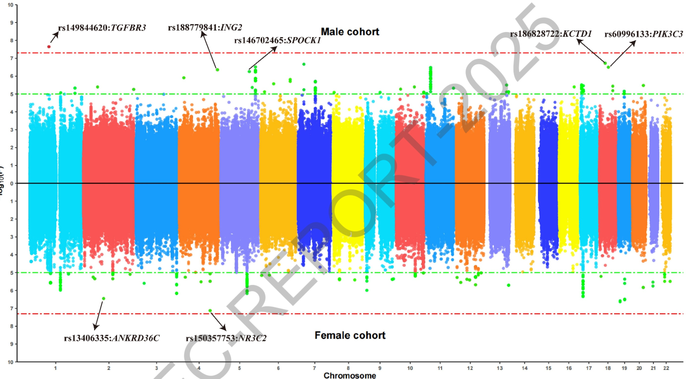

图 1-22 性别分层分析中男性患者队列和女患者队列的 gwas 分析 manhattan 图

附注:图展示了性别分层分析中男女队列的GWAS 结果manhattan图，x轴上半图表示男性患者队列，下半图表示女性患者队列；红色虚线表示全基因组层面的显著性关联阈值水平（5×10-8），绿色虚线表示全基因组层面具有提示性关联的统计学水平（1×10-5）。图中分别标出了两个队列中FINEMAP分析后的高置信度（PIP>0.9）位点结果，并显示了各自的rsID编号和对应的邻近基因（具体信息请见后文）。余附注同图 1-6。

A

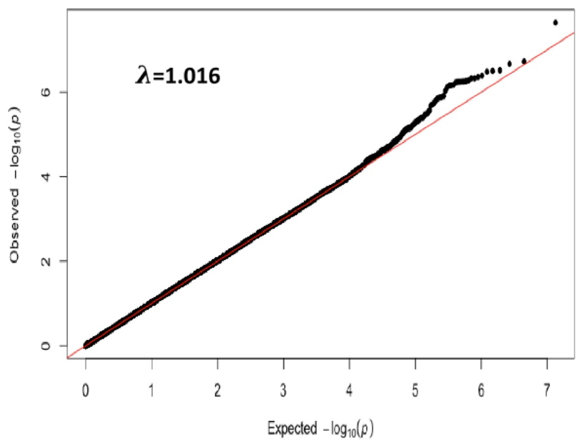

B

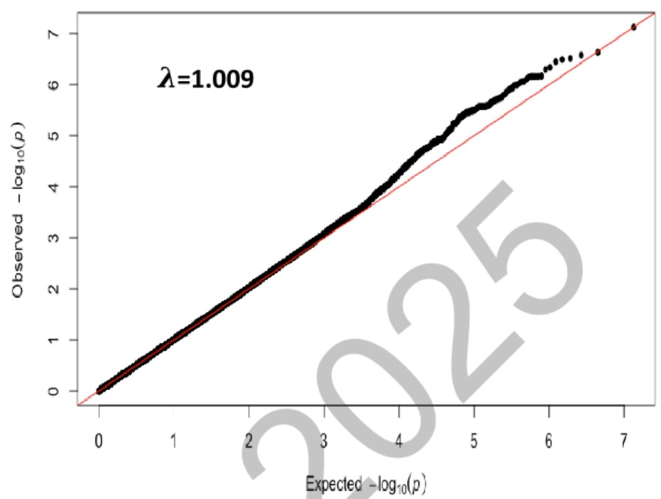

图 1-23 性别分层分析中男性患者队列和女患者队列的 gwas 分析 QQ 图

附注:图中展示了性别分层分析中男女队列的gwas分析 QQ图，A图表示男性患者队列的 QQ图，B 图表示女性患者队列的 QQ 图。余附注同图 1-7。

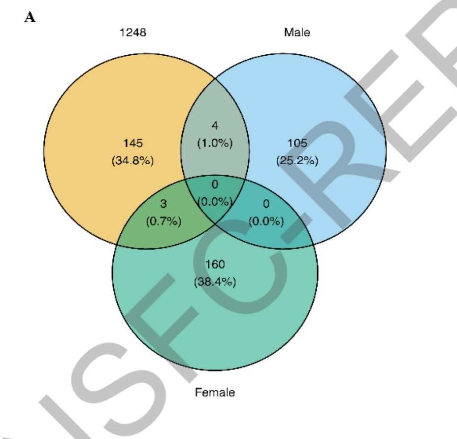

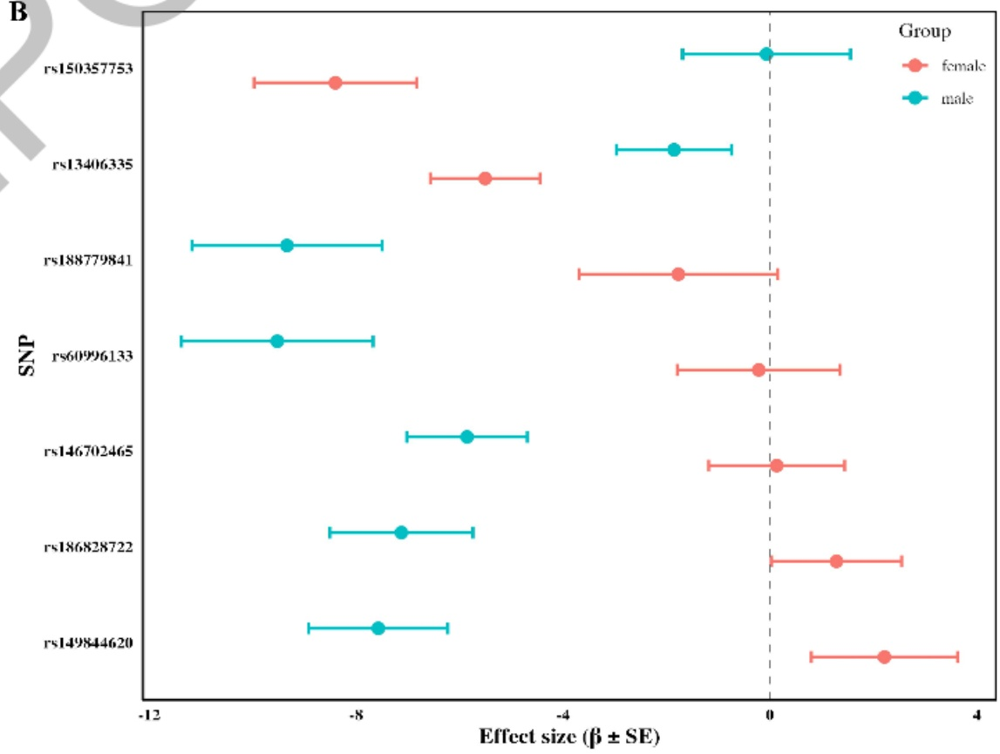

图1-24性别分层队列与原始队列的提示性位点的交集关系图

附注:图A展示了三个队列GWAS分析中提示性关联位点（1×10-5）的交集情况，包括总队列（n=1,248），男性队列（Male，n=657）和女性队列（Female，n=591）。图B展示了性别分层分析中，FINEMAP筛选的高置信度因果变异位点（PIP>0.9）在男性与女性中的效应比较，x轴为SNP的回归系数（Beta），y 轴为各 SNP。

表 1-15 性别分层分析中 FINEMAP 分析的高置信度因果变异位点

<table><tr><td>队列</td><td>CHR</td><td>rsid</td><td>参考 碱基</td><td>效应 碱基</td><td> $\mathrm { M A F ^ { \& } }$ </td><td>系数&amp;</td><td>标准误&amp;</td><td> $p ^ { \& }$ </td><td> $\mathbf { Z - } \mathbf { s c o r e } ^ { \P }$ </td><td> $\log_{10}(bf)^{\dagger}$ </td><td>²  $\mathbf { \tilde { \nabla } P } \mathbf { \tilde { I } } \mathbf { P } ^ { \P }$ </td><td>基因组区域§</td><td>临近基因§</td></tr><tr><td rowspan="6">男性队列 (n=657)</td><td>1</td><td>rs149844620</td><td>G</td><td>A</td><td>0.018</td><td>-7.573</td><td>1.344</td><td>2.26E-08</td><td>-5.633</td><td>5.355</td><td>0.993564</td><td>intronic</td><td>TGFBR3</td></tr><tr><td>18</td><td>rs60996133</td><td>TA</td><td>T</td><td>0.011</td><td>-9.525</td><td>1.853</td><td>3.16E-07</td><td>-5.140</td><td>4.317</td><td>0.936667</td><td>intronic</td><td>PIK3C3</td></tr><tr><td>18</td><td>rs186828722</td><td>G</td><td>A</td><td>0.019</td><td>-7.125</td><td>1.382</td><td>1.89E-07</td><td>-5.156</td><td>4.562</td><td>0.963929</td><td>intronic</td><td>KCTD1</td></tr><tr><td>4</td><td>rs188779841</td><td>G</td><td>A</td><td>0.011</td><td>-9.338</td><td>1.839</td><td>4.40E-07</td><td>-5.077</td><td>4.382</td><td>0.924745</td><td>intergenic</td><td>ING2;RWDD4</td></tr><tr><td>5</td><td>rs146702465</td><td>C</td><td>G</td><td>0.026</td><td>-5.857</td><td>1.164</td><td>5.55E-07</td><td>-5.030</td><td>4.297</td><td>0.927568</td><td>intergenic</td><td>TRPC7;SPOCK1</td></tr><tr><td>2</td><td>rs13406335</td><td>C</td><td>T</td><td>0.031</td><td>-5.506</td><td>1.060</td><td>3.55E-07</td><td>-5.195</td><td>4.598</td><td>0.986135</td><td>intronic</td><td>ANKRD36C</td></tr><tr><td>(n=591)</td><td>4</td><td>rs150357753</td><td>T</td><td>C</td><td>0.014</td><td>-8.402</td><td>1.570</td><td>7.47E-08</td><td>-5.352</td><td>4.424</td><td>0.947527</td><td>intronic</td><td>NR3C2</td></tr></table>

附注:该表展示了后验纳入概率（PIP）大于0.90的位点。余附注同表1-5。

表 1-16 FINEMAP 分析的高置信度因果变异位点中性别差异性比较

<table><tr><td rowspan="2"></td><td rowspan="2">rsID</td><td colspan="3">男性队列</td><td colspan="3">女性队列</td><td colspan="3">总体队列</td><td rowspan="2">Z_score</td><td rowspan="2"> $p \_ { \mathrm { z t e s t } }$ </td><td rowspan="2"> $p \_ \mathrm { { \tt { z t e s t \_ f d r } } }$ </td></tr><tr><td>系数</td><td>标准误</td><td>p_gwas</td><td>系数</td><td>标准误</td><td>p_gwas</td><td>系数</td><td>标准误</td><td>p_gwas</td></tr><tr><td rowspan="5">男性</td><td>rs149844620</td><td>-7.572</td><td>1.344</td><td>2.26E-08</td><td>2.212</td><td>1.413</td><td>1.01E-01</td><td>-3.115</td><td>0.988</td><td>1.61E-03</td><td>-5.017</td><td>5.24E-07</td><td>3.67E-06</td></tr><tr><td>rs60996133</td><td>-9.525</td><td>1.853</td><td>3.16E-07</td><td>-0.218</td><td>1.572</td><td>9.63E-01</td><td>-3.859</td><td>1.223</td><td>1.60E-03</td><td>-3.830</td><td>1.28E-04</td><td>2.99E-04</td></tr><tr><td>rs186828722</td><td>-7.125</td><td>1.382</td><td>1.89E-07</td><td>1.284</td><td>1.261</td><td>3.67E-01</td><td>-2.354</td><td>0.935</td><td>1.21E-03</td><td>-4.494</td><td>6.96E-06</td><td>2.43E-05</td></tr><tr><td>rs188779841</td><td>-9.338</td><td>1.839</td><td>4.40E-07</td><td>-1.772</td><td>1.921</td><td>3.31E-01</td><td>-5.861</td><td>1.380</td><td>2.20E-05</td><td>-2.845</td><td>4.44E-03</td><td>5.18E-03</td></tr><tr><td>rs146702465</td><td>-5.857</td><td>1.164</td><td>5.55E-07</td><td>0.129</td><td>1.314</td><td>8.55E-01</td><td>-3.033</td><td>0.900</td><td>7.43E-04</td><td>-3.410</td><td>6.50E-04</td><td>9.09E-04</td></tr><tr><td>女性</td><td>rs13406335</td><td>-1.855</td><td>1.113</td><td>3.55E-07</td><td>-5.506</td><td>1.060</td><td>3.55E-07</td><td>-3.589</td><td>0.772</td><td>3.38E-06</td><td>2.375</td><td>1.75E-02</td><td>1.75E-02</td></tr><tr><td>队列</td><td>rs150357753</td><td>-0.068</td><td>1.623</td><td>7.47E-08</td><td>-8.402</td><td>1.570</td><td>7.47E-08</td><td>-3.419</td><td>1.053</td><td>1.15E-03</td><td>3.690</td><td>2.24E-04</td><td>3.91E-04</td></tr></table>

附注:系数表示 gwas 分析中位点的效应系数（即 beta 值)；z\_score 表示 Z 检验中获得的 z 值， p\_ztest 表示 Z 检验中获得的 $p$ 值， $p _ { - }$ ztest\_fdr表示 $p _ { - }$ ztest 校正后的 $p$ 值。

## 9）验证阶段GWAS分析结果

为验证研究结果的稳健性，我们在排除具有亲缘关系的个体后，对893例无亲缘关系的“内部验证队列”重复进行了GWAS分析。分析标准与“发现队列”（n=1,248）一致，设定全基因组显著性阈值为 $p = 5 \times 10^{-8}$ ，提示性阈值为 $p = 1 \times 1 0 ^ { - 5 }$

## 9.1 GWAS 关联分析结果

GWAS结果显示，共检测到41个显著性位点（表1-17）及139个提示性位点。显著性位点中，以14号染色体 FBXO33 区域高度连锁的位点最为密集（多达39个）。“发现队列”中的两个显著性位点（13号染色体上的MRPL57-rs142932360和14号染色体上的FBXO33-rs28801081）在“内部验证队列”中依旧显著（表1-17，图1-25A，图1-28）。另外，“内部验证队列”新增一个3号染色体上的显著性位点NPHP3-AS1-rs183315911（图1-25A，图1-26）。基因组膨胀系数λ=1.036，提示无明显系统性偏倚。

## 9.2 遗传度和遗传截距

LDSC结果显示，SNP总遗传力（h²)为0.127（SE=0.523)，略低于“发现队列”的0.1511（SE=0.3606）。回归截距（intercept）为1.0114（SE=0.0072），均提示种群分层及系统性偏倚得到良好控制。

## 9.3 先导位点和独立位点的识别

LD clumping 筛选出 24个先导位点，GCTA-COJO条件联合分析获得 22 个独立位点。独立 SNP映射的编码蛋白基因包括FBXO33、ANKRD36C、IL36RN、HIBADH、ANKRD7、SGCZ、SULF2、CNTN4、SLC8A1、BCL9、ELMO2、HMX3、ING2、NETO1、TRABD；非编码蛋白基因包括LINC01031、LINC01169、NPHP3-AS1、LOC101928764、MIR4275、LINC02339、PER3P1。

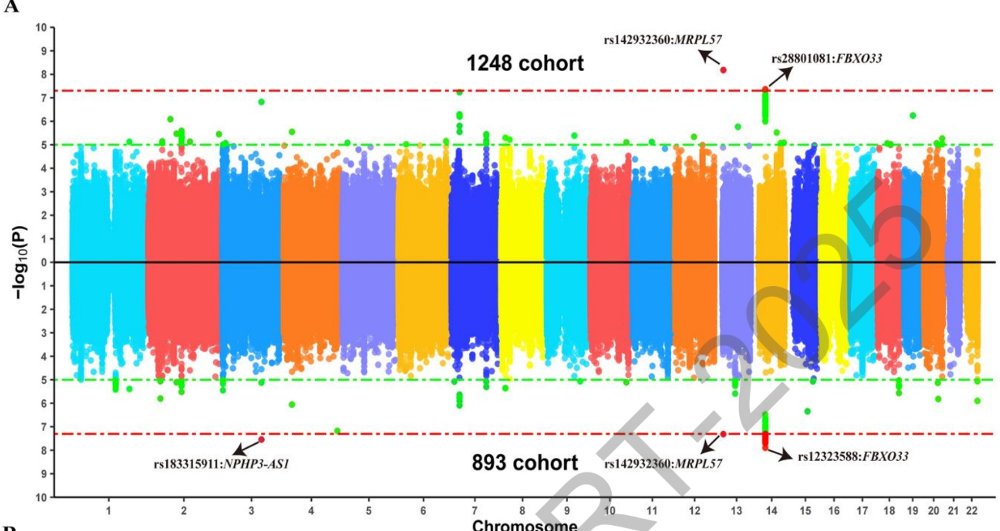

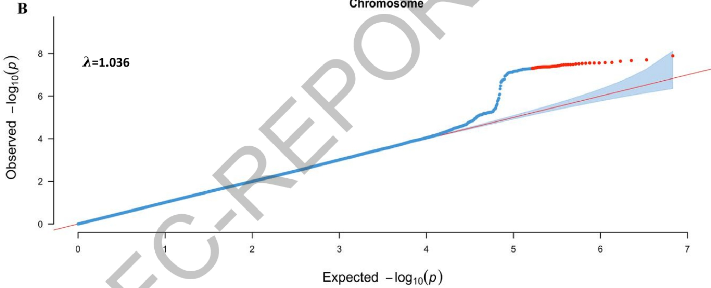

图 1-25 “内部验证队列”gwas 分析 manhattan 图和 QQ 图

附注:图 A 表示 gwas 分析 manhattan 图，x 轴上半图表示 1,248 例有亲缘关系“发现队列”的曼哈顿图，下半图表示893例无亲缘关系“内部验证队列”的曼哈顿图；红色虚线表示全基因组层面的显著性关联阈值水平 $( 5 \times 1 0 ^ { - 8 } )$ ，绿色虚线表示全基因组层面具有提示性关联的统计学水平 $( 1 \times 1 0 ^ { - 5 } )$ 。图中分别标出了两个队列中显著性位点结果，并显示了各自的rsID编号和对应的邻近基因。余附注同图1-6。图 B 表示“内部验证队列”gwas 分析的 QQ 图，余附注同图 1-7。

表1-17“内部验证队列”的常见变异关联分析达到全基因组显著性关联的位点

| rsID | CHR | PS# | Allele0 | Allele1 | AF | Beta | Se | p 值 | 基因组域 | 临近基因 |
| --- | --- | --- | --- | --- | --- | --- | --- | --- | --- | --- |
| rs183315911 | 3 | 132915462 | A | G | 0.018 | -7.12 | 1.282 | 2.86E-08 | intergenic | NPHP3-AS1;TMEM108 |
| rs142932360$ | 13 | 21260607 | A | G | 0.012 | -8.74 | 1.599 | 4.87E-08 | intergenic | MRPL57;ZDHHC20 |
| rs12323588 | 14 | 39927797 | G | A | 0.15 | -2.64 | 0.469 | 1.99E-08 | intergenic | FBX033;LINC02315 |
| rs10150213 | 14 | 39884660 | A | T | 0.151 | -2.62 | 0.471 | 2.80E-08 | intergenic | FBX033;LINC02315 |
| rs8004765 | 14 | 39885418 | A | G | 0.152 | -2.58 | 0.470 | 4.34E-08 | intergenic | FBX033;LINC02315 |
| rs28896193 | 14 | 39887831 | G | A | 0.15 | -2.58 | 0.472 | 4.96E-08 | intergenic | FBX033;LINC02315 |
| rs28875768 | 14 | 39888216 | A | C | 0.151 | -2.62 | 0.471 | 2.78E-08 | intergenic | FBX033;LINC02315 |
| rs28801081$ | 14 | 39890124 | A | T | 0.152 | -2.62 | 0.470 | 2.62E-08 | intergenic | FBX033;LINC02315 |
| rs1957194 | 14 | 39892848 | C | T | 0.152 | -2.57 | 0.470 | 4.94E-08 | intergenic | FBX033;LINC02315 |
| rs10162561 | 14 | 39896556 | C | T | 0.152 | -2.57 | 0.470 | 4.51E-08 | intergenic | FBX033;LINC02315 |
| rs10147825 | 14 | 39899481 | T | G | 0.152 | -2.59 | 0.470 | 3.78E-08 | intergenic | FBX033;LINC02315 |
| rs62014496 | 14 | 39900498 | A | T | 0.153 | -2.57 | 0.470 | 4.68E-08 | intergenic | FBX033;LINC02315 |
| rs62014497 | 14 | 39900617 | G | A | 0.152 | -2.57 | 0.470 | 4.38E-08 | intergenic | FBX033;LINC02315 |
| rs4903113 | 14 | 39901167 | T | C | 0.151 | -2.59 | 0.472 | 4.22E-08 | intergenic | FBX033;LINC02315 |
| rs62014498 | 14 | 39903077 | C | T | 0.152 | -2.57 | 0.470 | 4.65E-08 | intergenic | FBX033;LINC02315 |
| rs28699596 | 14 | 39903899 | C | T | 0.153 | -2.57 | 0.470 | 4.42E-08 | intergenic | FBX033;LINC02315 |
| rs17780444 | 14 | 39903937 | T | C | 0.152 | -2.58 | 0.470 | 4.13E-08 | intergenic | FBX033;LINC02315 |
| rs17780457 | 14 | 39904031 | A | G | 0.153 | -2.58 | 0.469 | 3.94E-08 | intergenic | FBX033;LINC02315 |
| rs17180573 | 14 | 39904242 | T |  | 0.152 | -2.63 | 0.470 | 2.31E-08 | intergenic | FBX033;LINC02315 |
| rs17180580 | 14 | 39904347 | G |  | 0.152 | -2.60 | 0.470 | 3.35E-08 | intergenic | FBX033;LINC02315 |
| rs10137555 | 14 | 39905158 | A | G | 0.152 | -2.57 | 0.468 | 4.24E-08 | intergenic | FBX033;LINC02315 |
| rs17780469 | 14 | 39909686 |  | G | 0.151 | -2.59 | 0.471 | 3.99E-08 | intergenic | FBX033;LINC02315 |
| rs17780487 | 14 | 39920654 | C | T | 0.151 | -2.57 | 0.469 | 4.22E-08 | intergenic | FBX033;LINC02315 |
| rs17780499 | 14 | 39920688 | G | A | 0.151 | -2.57 | 0.469 | 4.22E-08 | intergenic | FBX033;LINC02315 |
| rs62014503 | 14 | 39920831 | C | T | 0.15 | -2.61 | 0.470 | 2.92E-08 | intergenic | FBX033;LINC02315 |
| rs62014504 | 14 | 39921035 | C | A | 0.15 | -2.59 | 0.470 | 3.47E-08 | intergenic | FBX033;LINC02315 |
| rs62014505 | 14 | 39921173 | T | C | 0.15 | -2.60 | 0.469 | 3.02E-08 | intergenic | FBX033;LINC02315 |
| rs62014506 | 14 | 39921184 | T | C | 0.15 | -2.62 | 0.470 | 2.67E-08 | intergenic | FBX033;LINC02315 |

续表1-17“内部验证队列”的常见变异关联分析达到全基因组显著性关联的位点

| rsID | CHR | PS# | Allele0 | Allele1 | AF | Beta | Se | p 值 | 基因组域 | 临近基因 |
| --- | --- | --- | --- | --- | --- | --- | --- | --- | --- | --- |
| rs62014507 | 14 | 39921217 | A | G | 0.151 | -2.57 | 0.469 | 4.22E-08 | intergenic | FBX033;LINC02315 |
| rs79142406 | 14 | 39921371 | C | G | 0.149 | -2.60 | 0.472 | 3.94E-08 | intergenic | FBX033;LINC02315 |
| rs201174636 | 14 | 39924091 | G | A | 0.148 | -2.63 | 0.475 | 3.32E-08 | intergenic | FBX033;LINC02315 |
| rs199621142 | 14 | 39924092 | T | A | 0.148 | -2.63 | 0.475 | 3.32E-08 | intergenic | FBX033;LINC02315 |
| rs4903138 | 14 | 39925182 | T | C | 0.148 | -2.66 | 0.474 | 2.15E-08 | intergenic | FBX033;LINC02315 |
| rs10220288 | 14 | 39925681 | C | A | 0.151 | -2.57 | 0.469 | 4.22E-08 | intergenic | FBX033;LINC02315 |
| rs62014538 | 14 | 39926461 | A | G | 0.15 | -2.58 | 0.469 | 4.26E-08 | intergenic | FBX033;LINC02315 |
| rs13379163 | 14 | 39927231 | G | T | 0.15 | -2.59 | 0.470 | 3.73E-08 | intergenic | FBX033;LINC02315 |
| rs12323588 | 14 | 39927797 | G | A | 0.15 | -2.64 | 0.469 | 1.99E-08 | intergenic | FBX033;LINC02315 |
| rs139809569 | 14 | 39928022 | CT | C | 0.149 | -2.61 | 0.470 | 2.80E-08 | intergenic | FBX033;LINC02315 |
| rs8004897 | 14 | 39928825 | A | C | 0.15 | -2.61 | 0.472 | 3.28E-08 | intergenic | FBX033;LINC02315 |
| rs10131657 | 14 | 39929500 | T | G | 0.151 | -2.59 | 0.469 | 3.40E-08 | intergenic | FBX033;LINC02315 |
| rs10134423 | 14 | 39929959 | T | G | 0.15 | -2.68 | 0.470 | 1.28E-08 | intergenic | FBX033;LINC02315 |
| rs10083487 | 14 | 39930437 | A | G | 0.148 | -2.62 | 0.472 | 3.07E-08 | intergenic | FBX033;LINC02315 |

附注:\$:代表1,248亲缘关系队列中显著性位点。余附注同表1-8。

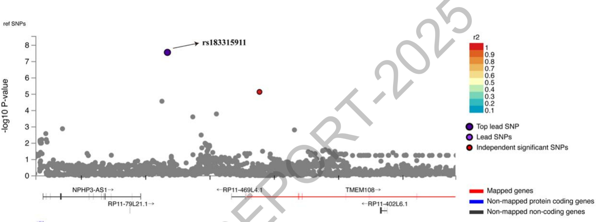

图 1-26 “内部验证队列”gwas 分析 3 号染色体上显著性位点 rs183315911 的 locuszoom 图

附注:图展示了“内部验证队列”gwas分析中3号染色体上显著性位点rs183315911的locuszoom图。图中横轴均表示染色体上具体位置，左侧纵轴均表示变异关联分析-log10(p)值结果， 右侧图例和变异的颜色表示与该区域中最显著关联变异的LD大小，图下方还标有该区域中基因的注释信息，红色代表直接映射的基因（Mapped gene），蓝色代表基因间区的编码基因（Non-mapped protein coding genes），黑色代表基因间区的非编码基因（Non-mapped protein non-coding genes）。该图主要可用于精确定位因果变异，是对曼哈顿图中显著位点所在基因组所在区域的进一步放大展示。

## 9.4 FINEMAP 精细定位分析结果

基于24个先导位点(±500kb)区域的FINEMAP分析共获得45个高置信度位点(PIP>0.9，1og10(bf)>6.1），经注释后，共识别出20个临近基因，包括FBXO33、CNTN6、SULF2、SGCZ、IL1F10、SLC13A3、SLC8A1、ING2、SHANK3、ANKRD7、ARSA、BUB3、CDKN2AIP、LATS2、LINC00358、LINC01169、LINC02339、NETO1、PER3P1和 MIR4275（表1-18）。其中，MIR4275-rs609711（发现阶段: $\mathrm{PIP}=1,\log_{10}(\mathrm{bf})=13.2992$ ；验证阶段:PIP=1,1og10(bf)=13.2985)、SGCZ-rs1461864（发现阶段:PIP=0.999269，1og1o(bf)=9.9597；验证阶段:PIP=1，log10(bf)=13.6111）和CNTN6-rs401306（发现阶段:PIP=1，1og10(bf)=13.2992；验证阶段:PIP=1, $\log_{10}(bf) = 11.4692$ 这3个位点与“发现阶段”的高置信度位点重叠。“验证阶段”的41个显著性位点中，FBXO33 区域的 rs62014497为高置信度位点(PIP=1,1og10(bf)=13.266)，其与“发现阶段”的高置信度位点 rs17180573 和显著性位点 rs28801081 均高度连锁 $( \mathbf { R } ^ { 2 }$ 均为0.9919)。而 NPHP3-AS1 区域的 rs183315911(PIP=0.982776,1og10(bf)=4.99267)和 MRPL57区域的rs142932360（PIP=0.993046，log10(bf)=5.242）均为提示性位点。此外，IL1F10基因区域的均有各不同的高置信度位点信号出现在两个队列中（即位点不同，但位点映射的临近基因一致）。

## 9.5“验证阶段”与“发现阶段”的GWAS信号一致性分析结果

如图3-31A所示，“内部验证队列”与“发现队列”在信号分布上表现出高度一致性。基于两个队列的GWAS 汇总结果文件，我们共筛选出6,736,575个共享 SNP，并对其效应系数（beta）和p值进行相关性分析。结果显示，两队列中 SNP的 beta值和p值均呈现高度相关性，相关系数分别为0.93（p<0.001）和0.85（p<0.001），进一步支持了两组分析结果之间的高度一致性与稳定性（图1-27C-D）。此外，在显著性/提示性区间 $(p < 1 \times 10^{-5})$ 0的122个位点中， “发现队列”的显著性位点在“内部验证队列”列中均表现出更小的p值，且beta值方向一致（图1-27A）。值得注意的是，在14号染色体上，“内部验证队列”的信号显著性强于“发现队列”，而其余染色体信号则稍弱于“发现队列”（图1-27B）。

表 1-18“内部验证队列”FINEMAP分析的高置信度因果变异位

| Index SNP | Prioritized SNPs | CHR | BP | 参考 碱基 | 效应 碱基 | $\mathrm { M A F ^ { \& } }$ | 系数&amp; | $\mathrm { S E ^ { \& } }$ | $\mathfrak { p } ^ { \& }$ | $\mathrm { P I P } ^ { \P }$ | $\overline{\mathrm{d}\overline{\mathrm{o}}\mathrm{g}_{10}(\mathrm{b}\overline{\mathrm{f}})}_{\mathrm{d}}^{\eta}$ | 基因组区域§ | 临近基因§ |
| --- | --- | --- | --- | --- | --- | --- | --- | --- | --- | --- | --- | --- | --- |
| rs192946209 | rs4980277 | 10 | 123309803 | G | A | 0.146 | -1.186 | 0.496 | 1.64E-02 |  | 13.297 | intergenic | BUB3;GPR26 |
| rs10793690 |  | 1 | 147200593 | C | CT | 0.016 | -4.256 | 1.410 | 2.35E-03 |  | 13.2263 | intronic | FMO5 |
| rs142932360 | rs746861687 | 13 | 21000378 | C | CAT A | 0.072 | 2.092 | 0.667 | 1.56E-03 | 0.99993 | 7.25707 | intronic | LATS2 |
|  | rs144810264 | 13 | 21004545 | CGT | C | 0.047 | 2.653 | 0.807 | 9.03E-04 | 0.99993 | 7.24197 | intronic | LATS2 |
|  | rs9592158 | 13 | 61929260 | T | C | 0.169 | -1.298 | 0.464 | 4.71E-03 | 1 | 13.4015 | intergenic | LINC02339; LINC00358 |
|  | rs7317840 | 13 | 61523070 | G | A | 0.183 | 1.470 | 0.452 | 1.05E-03 | 1 | 13.4015 | intergenic | LINC02339; LINC00358 |
| rs9592119 | rs2323576 | 13 | 61926312 | T | C | 0.223 | 1.176 | 0.413 | 4.11E-03 | 1 | 13.4015 | intergenic | LINC02339; LINC00358 |
|  | rs6562182 | 13 | 61528044 | G | C | 0.171 | -1.666 | 0.462 | 2.86E-04 | 1 | 13.4015 | intergenic | LINC02339; LINC00358 |
|  | rs4886384 | 13 | 61946231 | C | T | 0.057 | 0.784 | 0.759 | 3.02E-01 | 1 | 13.4015 | intergenic | LINC02339: LINC00358 |
|  | rs34927460 | 14 | 39913706 | C | CT | 0.32 | -0.763 | 0.379 | 4.52E-02 | 1 | 13.266 | intergenic | FBX033;LINC02315 |
| rs10134423 | rs35498418 | 14 | 40054893 | AT | A | 0.281 | 0.769 | 0.380 | 4.07E-02 | 1 | 13.266 | intergenic | FBX033;LINC02315 |
|  | rs62014497 | 14 | 39900617 | G | A | 0.152 | -2.574 | 0.470 | 4.38E-08 | 1 | 13.266 | intergenic | FBX033;LINC02315 |
|  | rs10150742 | 14 | 39879032 | G | T | 0.48 | 0.749 | 0.353 | 3.10E-02 | 1 | 13.266 | intergenic | FBX033;LINC02315 |
|  | rs35207438 | 14 | 39502122 |  | T | 0.469 | -0.444 | 0.356 | 2.17E-01 | 1 | 13.266 | intergenic | FBX033;LINC02315 |
| rs80074687 | rs1550472 | 15 | 66692257 | T | C | 0.033 | 2.709 | 0.938 | 4.07E-03 | 1 | 13.2731 | intergenic | LINC01169;SMAD6 |
|  | rs80074687 | 15 | 66685950 |  | C | 0.039 | -4.375 | 0.861 | 4.55E-07 | 1 | 12.4104 | downstream | LINC01169 |
| rs60704913 | rs6566660 | 18 | 72822243 | G | C | 0.019 | 2.833 | 1.287 | 2.55E-02 | 0.99867 | 6.17673 | intronic | NETO1 |
| rs147623211 | rs3092463 | 20 | 46637295 | CA | C | 0.291 | 1.196 | 0.388 | 2.35E-03 | 0.99904 | 6.18029 | intronic | SLC13A3 |
| rs2235734 | rs4810653 | 20 | 47688741 | T | C | 0.405 | 1.045 | 0.348 | 2.73E-03 | 0.99999 | 8.94971 | intronic | SULF2 |
| rs996879 | rs7570267 |  | 113071001 | G | A | 0.104 | 0.930 | 0.585 | 1.11E-01 | 1 | 13.1375 | intronic | IL1F10 |

续表1-18“内部验证队列”FINEMAP分析的高置信度因果变异位

<table><tr><td>Index SNP</td><td>Prioritized SNPs</td><td>CHR</td><td>BP</td><td>参考 碱基</td><td>效应 碱基</td><td> $\mathrm { M A F ^ { \& } }$ </td><td>系数&amp;</td><td> $\mathrm { S E ^ { \& } }$ </td><td> $\mathfrak { p } ^ { \& }$ </td><td> $\mathrm { P I P } ^ { \P }$ </td><td> $\mathrm{log_{10}(b\bar{f})}$ </td><td>基因组区域§</td><td>临近基因§</td></tr><tr><td rowspan="5">rs11912419</td><td>rs131709</td><td>22</td><td>50635146</td><td>G</td><td>T</td><td>0.346</td><td>-1.266</td><td>0.365</td><td>4.94E-04</td><td></td><td>13.3002</td><td>intergenic</td><td>ARSA;SHANK3</td></tr><tr><td>rs1003322</td><td>22</td><td>50633861</td><td>C</td><td>A</td><td>0.456</td><td>1.233</td><td>0.345</td><td>3.59E-04</td><td></td><td>13.3002</td><td>intergenic</td><td>ARSA;SHANK3</td></tr><tr><td>rs9616802</td><td>22</td><td>50633733</td><td>C</td><td>T</td><td>0.373</td><td>1.274</td><td>0.357</td><td>3.33E-04</td><td></td><td>13.3002</td><td>intergenic</td><td>ARSA;SHANK3</td></tr><tr><td>rs6009945</td><td>22</td><td>50650785</td><td>C</td><td>A</td><td>0.444</td><td>-0.762</td><td>0.355</td><td>3.09E-02</td><td></td><td>13.3002</td><td>intergenic</td><td>ARSA;SHANK3</td></tr><tr><td>rs131714</td><td>22</td><td>50630089</td><td>C</td><td>G</td><td>0.016</td><td>1.017</td><td>1.363</td><td>4.34E-01</td><td>0.99940</td><td>6.5237</td><td>intergenic</td><td>ARSA;SHANK3</td></tr><tr><td rowspan="5">rs17027121</td><td>rs59119268</td><td>2</td><td>41059014</td><td>T</td><td>C</td><td>0.038</td><td>1.535</td><td>0.934</td><td>1.02E-01</td><td></td><td>13.3241</td><td>intergenic</td><td>SLC8A1;LINC01913</td></tr><tr><td>rs7595541</td><td>2</td><td>41026084</td><td>T</td><td>A</td><td>0.485</td><td>-1.247</td><td>0.351</td><td>3.51E-04</td><td>1</td><td>13.3241</td><td>intergenic</td><td>SLC8A1;LINC01913</td></tr><tr><td>rs17027121</td><td>2</td><td>41035797</td><td>T</td><td>G</td><td>0.481</td><td>-1.673</td><td>0.349</td><td>1.59E-06</td><td>1</td><td>13.3241</td><td>intergenic</td><td>SLC8A1;LINC01913</td></tr><tr><td>rs35469745</td><td>2</td><td>41030223</td><td>A</td><td>T</td><td>0.465</td><td>-1.555</td><td>0.351</td><td>8.66E-06</td><td>1</td><td>13.3241</td><td>intergenic</td><td>SLC8A1;LINC01913</td></tr><tr><td>rs116929978</td><td>2</td><td>41044142</td><td>T</td><td>C</td><td>0.016</td><td>-2.569</td><td>1.391</td><td>5.83E-02</td><td>0.99992</td><td>7.43932</td><td>intergenic</td><td>SLC8A1;LINC01913</td></tr><tr><td rowspan="3">rs115250073</td><td>rs401306</td><td>3</td><td>1612770</td><td>G</td><td>T</td><td>0.359</td><td>0.969</td><td>0.362</td><td>6.73E-03</td><td>1</td><td>11.4692</td><td>intergenic</td><td>CNTN6;CNTN4</td></tr><tr><td>rs4143128</td><td>3</td><td>1628712</td><td>T</td><td>G</td><td>0.386</td><td>0.961</td><td>0.362</td><td>7.10E-03</td><td>0.99999</td><td>9.73427</td><td>intergenic</td><td>CNTN6;CNTN4</td></tr><tr><td>rs13114506</td><td>4</td><td>183414407</td><td></td><td>C</td><td>0.17</td><td>-1.277</td><td>0.477</td><td>6.64E-03</td><td>1</td><td>13.2964</td><td>intergenic</td><td>CLDN24;CDKN2AIP</td></tr><tr><td rowspan="2">rs188779841 rs148134968</td><td>rs188779841</td><td>4</td><td>183524215</td><td>G</td><td>A</td><td>0.01</td><td>-9.493</td><td>1.747</td><td>6.65E-08</td><td>0.99977</td><td>6.93499</td><td>intergenic</td><td>ING2;RWDD4</td></tr><tr><td>rs609711</td><td>4</td><td>28529153</td><td>C</td><td>T</td><td>0.038</td><td>2.645</td><td>0.914</td><td>3.77E-03</td><td>1</td><td>13.2985</td><td>intergenic</td><td>LINC02261;MIR4275</td></tr><tr><td>rs140656419</td><td>rs2402363</td><td>7</td><td>118548634</td><td>G</td><td>T</td><td>0.012</td><td>4.919</td><td>1.584</td><td>1.76E-03</td><td>1</td><td>12.6383</td><td>intergenic</td><td>ANKRD7;LINC02476</td></tr><tr><td rowspan="5"></td><td>rs80194114</td><td>7</td><td>118373207</td><td>G</td><td>A</td><td>0.012</td><td>-4.790</td><td>1.588</td><td>2.36E-03</td><td></td><td>12.6352</td><td>intergenic</td><td>ANKRD7;LINC02476</td></tr><tr><td>rs2971036</td><td>7</td><td>9963009</td><td>T</td><td></td><td>0.496</td><td>1.345</td><td>0.348</td><td>1.15E-04</td><td></td><td>13.3862</td><td>intergenic</td><td>PER3P1;MGC4859</td></tr><tr><td>rs7799978</td><td>7</td><td>9676432</td><td>G</td><td>A</td><td>0.024</td><td>-0.278</td><td>1.162</td><td>7.97E-01</td><td></td><td>13.3862</td><td>intergenic</td><td>PER3P1;MGC4859</td></tr><tr><td>rs12334232</td><td>7</td><td>9959348</td><td>G</td><td>A</td><td>0.059</td><td>1.132</td><td>0.703</td><td>1.02E-01</td><td></td><td>13.3862</td><td>intergenic</td><td>PER3P1;MGC4859</td></tr><tr><td>rs968082</td><td>7</td><td>9863534</td><td>G</td><td>A</td><td>0.315</td><td>-0.164</td><td>0.382</td><td>6.59E-01</td><td></td><td>13.3862</td><td>intergenic</td><td>PER3P1;MGC4859</td></tr><tr><td rowspan="3"></td><td>rs2971038</td><td>7</td><td>9961791</td><td>C</td><td>T</td><td>0.452</td><td>1.112</td><td>0.348</td><td>1.43E-03</td><td></td><td>13.3862</td><td>intergenic</td><td>PER3P1;MGC4859</td></tr><tr><td>rs1461864</td><td>8</td><td>14527064</td><td>A</td><td>G</td><td>0.088</td><td>1.728</td><td>0.606</td><td>4.81E-03</td><td>1</td><td>13.6111</td><td>intronic</td><td>SGCZ</td></tr><tr><td>rs10113046</td><td>8</td><td>14530324</td><td>T</td><td>G</td><td>0.464</td><td>0.980</td><td>0.354</td><td>5.57E-03</td><td>1</td><td>11.445</td><td>intronic</td><td>SGCZ</td></tr><tr><td rowspan="2">rs184571381</td><td>rs1461858</td><td>8</td><td>14529476</td><td>C</td><td>A</td><td>0.474</td><td>-0.700</td><td>0.357</td><td>5.31E-02</td><td>0.99936</td><td>6.80586</td><td>intronic</td><td>SGCZ</td></tr><tr><td></td><td></td><td></td><td></td><td></td><td></td><td></td><td></td><td></td><td></td><td></td><td></td><td></td></tr></table>

附注:同表1-5。

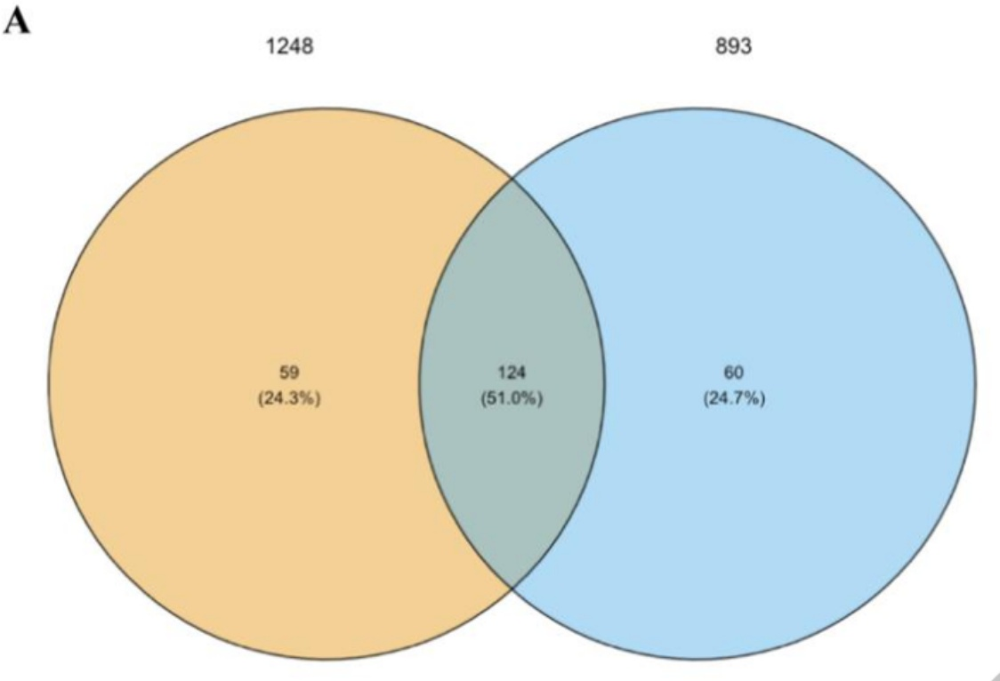

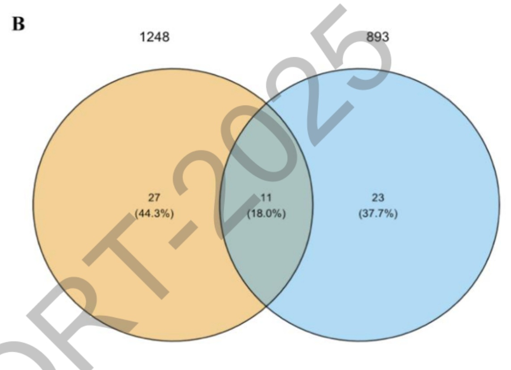

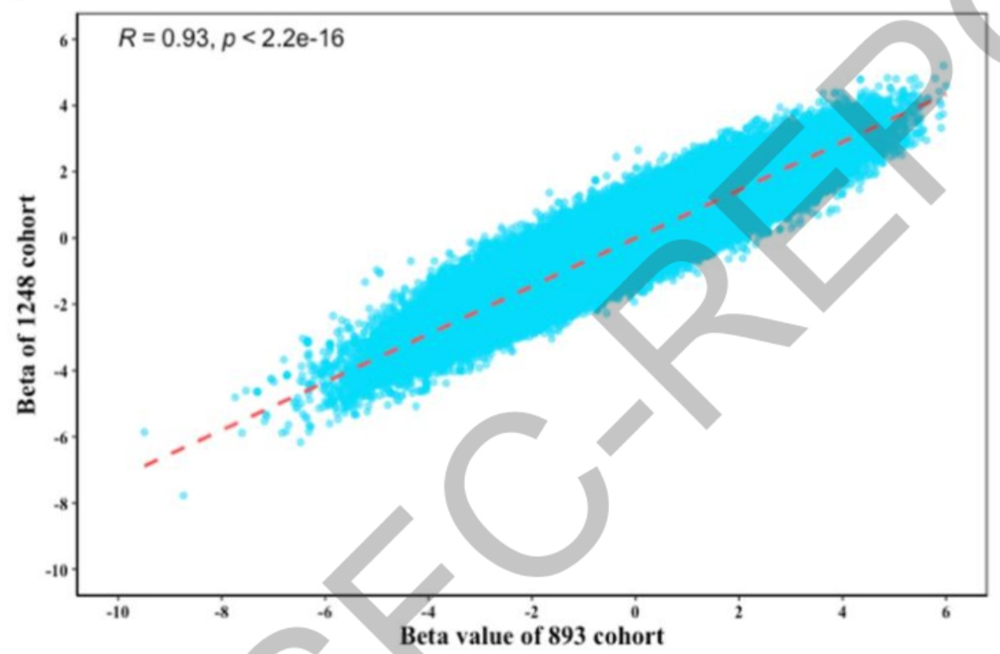

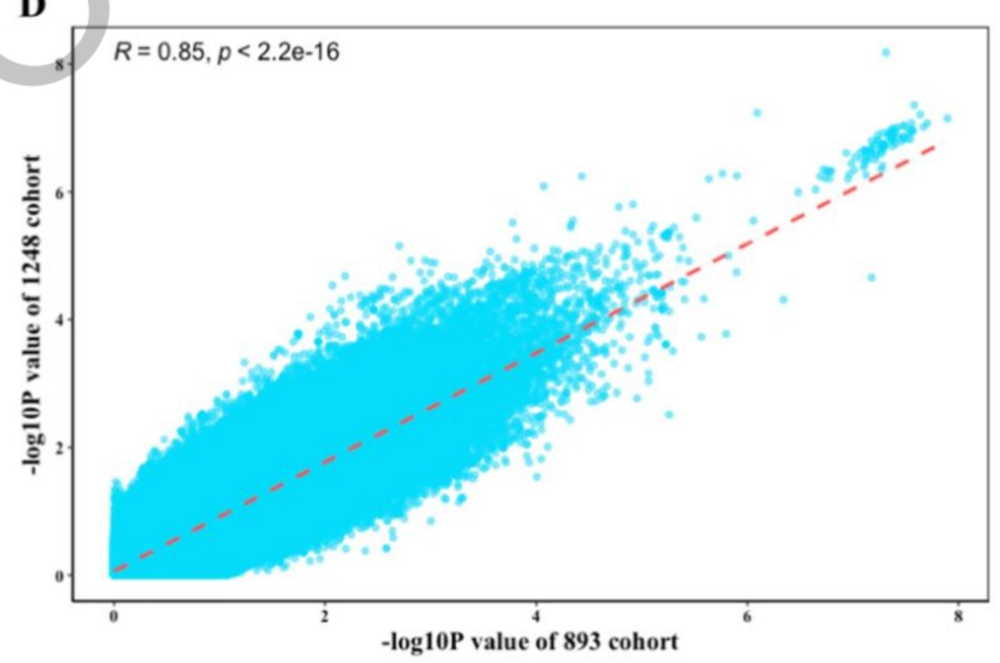

图 1-27“内部验证队列”与“发现队列”的gwas结果相关性图

附注:图A和图B分别表示“发现队列”和“内部验证队列”FINEMAP分析纳入的候选位点和FINEMAP分析结果中高置信度位点定位邻近候选基因的交集图。图 C 和图 D 分别表示“发现队列”和“内部验证队列”列 GWAS 分析结果中 beta值和p值的相关性分析图，x轴代表“内部验证队列”对应的数据，y轴代表“发现队列”对应的数据。

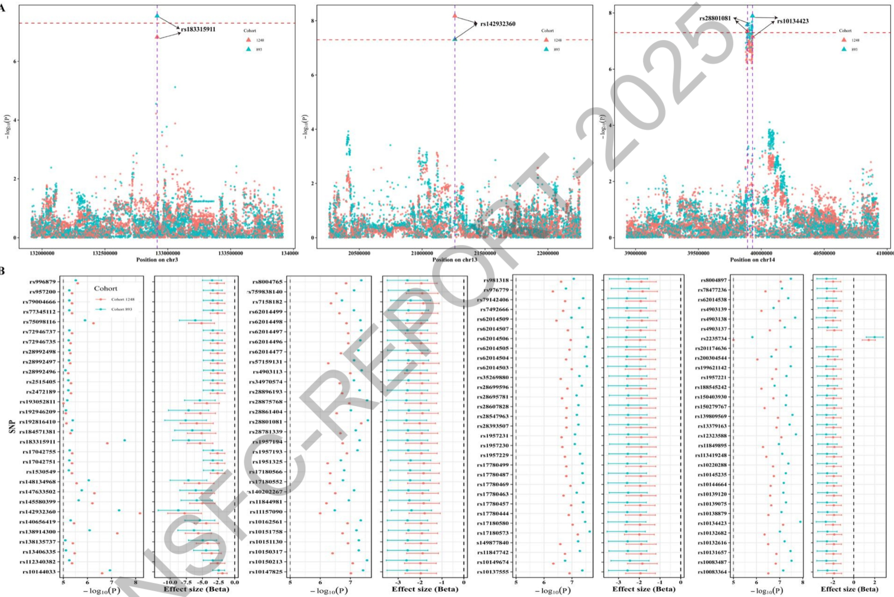

图 1-28“发现队列”和“内部验证队列”的 GWAS 分析最显著性位点 locuszoom 区域比较图和提示性位点 beta 值和 p 值的森林图

附注:该组合图展示了“发现队列”和“内部验证队列”在显著性/提示性位点上的gwas结果比较。蓝色代表“内部验证队列”，红色代表“发现队列”。图A表示两队列中最显著位点（即p值最小）的locuszoom 区域图。13号染色体上的 rs142932360位点在两个队列中均为最显著性位点；3号染色体上的rs183315911位点和14号染色体上rs10134423在“内部验证队列”中为最显著位点，但在“发现队列”中不显著；14号染色体上的rs28801081位点虽为“发现队列”对应区域的最显著位点，但是在“内部验证队 域具有更低p值。图B展示了两队列中显著性/提示性位点 beta 值和 p 值比较。y 轴为 SNP 位点，x 轴分别表示-log1o(p)值和 beta±1.96se。

## 9.6 TWAS 分析结果

在此基础上，我们对无亲缘关系样本开展了TWAS-FUSION分析，识别出若干显著性基因（p\_FDR<0.05）和提示性关联基因 $(p_{\_}  FDR  < 0.1)$ ，包括编码蛋白基因 ZNF385C、SSTR2、PTPRU 以及非编码基因 SELENOO-AS1。其中，SLC20A1 和 PTPRU基因亦出现在“发现阶段”的 TWAS-FUSION 分析，且 SLC20A1 在两个队列中均在更严格的 Bonferroni 校正后保持显著（表3-25）。

表 3-25 “内部验证队列”TWAS-FUSION 分析提示性关联结果 $( p _ { - }$ FDR<0.1)

| PANEL | CHR | MODEL | TWAS.Z | TWAS.P | ENSEMBL_ID | Hgnc_symbol | P_FDR | p_BON |
| --- | --- | --- | --- | --- | --- | --- | --- | --- |
| GTExv8.ALL.Colon_Transverse | 22 | top1 | -4.407 | 0.0000105 | ENSG00000273188 | ENSG00000273188 | 0.03851925 | 0.0770385 |
| GTExv8.ALL.Colon_Transverse | 22 | top | -4.407 | 0.0000105 | ENSG00000273137 | SELENOO-AS1 | 0.03851925 | 0.0770385 |
| GTExv8.ALL.Ovary | 3 | enet | 4.1093 | 0.0000397 | ENSG00000230732 | ENSG00000230732 | 0.097409 | 0.1522495 |
| GTExv8.ALL.Ovary | 17 | top1 | 3.956 | 0.0000762 | ENSG00000187595 | ZNF385C | 0.097409 | 0.292227 |
| GTExv8.ALL.Ovary | 17 | susie | -4.0126 | 0.00006 | ENSG00000180616 | SSTR2 | 0.097409 | 0.2301 |
| GTExv8.ALL.Skin_Not_Sun_Exposed_Suprapubic | 2 | lasso | -4.7648 | 0.0000019 | ENSG00000144136 | SLC20A1 | 0.01874691 | 0.01874691 |
| GTExv8.ALL.Spleen |  | top1 | -4.386 | 0.0000115 | ENSG00000060656 | PTPRU | 0.076107 | 0.076107 |

附注:同表3-13的附注。

## 9.7 SMR 因果分析结果

为探讨GWAS关联信号背后的潜在分子机制，我们进一步开展了与“发现队列”一致的SMR 分析，以评估 GWAS 信号与 eQTL、sQTL和 mQTL的共定位关系。结果显示，与“发现队列”的 SMR 结果一致，在 SMR-eQTL/mQTL 分析中检测到一系列满足p\_SMR<0.05且pHEIDI>0.01的关联基因，但经多重校正后均未达显著。

在 SMR-sQTL 分析中，基于 GTEx v8 项目 49种人类组织的 cis-sQTL 汇总数据，共检测到10,549个基因信号满足 $p_{\_} \mathrm{SNR} < 0.05$ 且 $p_{\_} \mathrm{HEIDI} > 0.01$ 。经 FDR 校正后，仍有106个信号在统计学上具有显著性（pFDR<0.05）。剔除在多个组织中重复出现的基因后，最终确定3个编码蛋白基因（HAP1、TMEM235、UFD1L）和1个非编码蛋白基因（TPT1-AS1）为显著的 SMR-sQTL 关联基因，信号来源于36种组织。其中，HAP1、TMEM235和 TPT1-AS1基因信号均来自脑组织（图1-29）。值得注意的是，HAP1基因在“发现队列”的 SMR-sQTL分析中亦被检出，并在更严格的 bonferroni校正下仍显著 $(p_{\mathrm{BON}}<0.05)$ ；相比之下，“发现队列”中较为显著的NDUFB1基因在该本次分析中未达到显著性标准。

当显著性阈值放宽至pFDR<0.1时，共识别到207个具有提示性意义的基因信号。去除重复后，最终确定14个编码蛋白基因（ANKLE2、ARAP2、DPEP1、GHR、HAP1、PCDH9、R3HDM4、SNRPA1、SULF2、TMEM176A TMEM235、TMEM259、TMTC4、UFD1L）和1个非编码基因（TPT1-AS1）为提示性 SMR-sQTL关联基因（表1-19）。

表 1-19“内部验证队列”SMR-sQTL 分析提示性结果汇总 $(p_{\_}  FDR  < 0.1)$

| 序号 | Gene | 基因类型 | 显著信号 (p_BON/p_FDR&lt;0.05) | 提示信号 (p_FDR&lt;0.1) | Counts | 发现队列提示性结果 |
| --- | --- | --- | --- | --- | --- | --- |
| 1 | TPT1-AS1 | non_protein_coding | 否/是 |  | 122 |  |
| 2 | HAP1 | protein coding | 是/是 |  | 30 |  |
| 3 | GHR | protein_coding | 否/否 |  | 14 |  |
| 4 | TMTC4 | protein_coding | 否/否 |  | 8 |  |
| 5 | TMEM235 | protein_coding | 否/是 |  | 7 |  |
| 6 | TMEM176A | protein_coding | 否/否 |  | 5 |  |
| 7 | UFDIL | protein_coding | 否/是 |  | 5 |  |
| 8 | SNRPA1 | protein_coding | 否/否 |  | 3 |  |
| 9 | TMEM259 | protein_coding | 否/否 |  |  |  |
| 10 | ARAP2 | protein_coding | 否/否 |  |  |  |
| 11 | ANKLE2 | protein_coding | 否/否 |  | 3222 |  |
| 12 | DPEP1 | protein_coding | 否/否 |  |  |  |
| 13 | R3HDM4 | protein_coding | 否/否 |  | 2 |  |
| 14 | PCDH9 | protein_coding | 否/否 | 是是是是是是是是是是是是是是是 | 1 | 否是否否是否否是否否否否否否是 |
| 15 | SULF2 | protein_coding | 否 /否 |  | 1 |  |

附注:bonferroni校正后依旧显著（p\_BON<0.05）的位点予以加粗显示，余附注同表3-18。

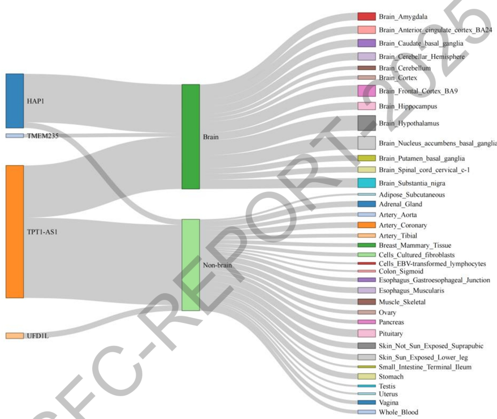

图1-29“内部验证队列”SMR-sQTL 分析显著性基因与组织关系桑葚图

附注:该图展示了“内部验证队列”中SMR-sQTL分析显著性基因 $(p_{\_FDR} < 0.05)$ 与 GTEx v8 数据中组织来源的桑葚图。左侧为显著基因名，右侧为相应基因信号来源的GTExv8组织名称，中间为根据组织属性分为为脑组织（Brain）和非脑组织（None-brain）

## 9.8 SharePro 共定位分析结果

最后，我们采用 SharePro 方法对 GWAS 与 GTEx v8 eQTL 数据进行共定位分析。基于共享概率（shrae）>0.9与变异后验概率（variantProb）>0.9的筛选标准，共在3号与14号染色体上鉴定出22个阳性变异，归属于8个独立的共定位信号簇（CS，表1-20）。多数变异的后验概率接近1.0，提示其为共定位候选基因。具体而言，表3-25中编号1-4号和13-15号位点位于基因间区，其最近的共定位候选基因分别为 CNTN4和NDUFB1基因；5-12号、17、18号位点均位于RIN3基因内含子区域。虽然这些信号最初在CATSPERB、LGMN、TC2N基因的共定位分析中被检测到，但其基因组位置提示 RIN3可能是更直接的共定位基因。

此外，我们还观察到若干由高度LD变异构成的复合共定位信号簇（20-22号位点），其后验概率介于0.1-0.6之间，提示它们存在协同作用。总体而言，无亲缘关系的“内部验证队列”多层次分析结果与有亲缘关系的“发现队列”高度一致，不仅验证了GWAS信号的稳健性与可重复性，还进一步揭示了RIN3、CNTN4、NDUFB1等基因在疾病遗传调控中的潜在功能，为后续机制研究提供了重要线索

表1-20“内部验证队列”SHAREPRO共定位分析阳性结果位点列表

| 编号 | CS | CHR | Share | VariantProb | GENE-GENE | Tissue |
| --- | --- | --- | --- | --- | --- | --- |
| 1 | rs115250073 | 3 | 0.9487 | 0.9924 | CNTN4-CNTN6;CNTN4 | Adipose_Visceral_Omentum |
| 2 | rs115250073 | 3 | 0.9487 |  | CNTN6-CNTN6;CNTN4 | Brain_Frontal_Cortex_BA9 |
| 3 | rs115250073 | 3 | 0.9487 |  | CNTN6-CNTN6,;CNTN4 | Brain_Hypothalamus |
| 4 | rs115250073 | 3 | 0.9487 |  | CNTN6-CNTN6,;CNTN4 | Esophagus_Gastroesophageal_Junction |
| 5 | rs6575263 | 14 | 1.0 | 1.0 | CATSPERB-RIN3 | Adrenal_Gland |
| 6 | rs7154217 | 14 | 1.0 | 1.0 | CATSPERB-RIN3 | Adrenal Gland |
| 7 | rs7154217 | 14 | 1.0 | 1.0 | CATSPERB-RIN3 | Heart_Left_Ventricle |
| 8 | rs6575263 | 14 | 1.0 | 1.0 | CATSPERB-RIN3 | Heart_Left_Ventricle |
| 9 | rs879303 | 14 | 1.0 | 1.0 | CATSPERB-RIN3 | Heart_Left_Ventricle |
| 10 | rs6575263 | 14 | 1.0 | 1.0 | LGMN-RIN3 | Brain_Caudate_basal_ganglia |
| 11 | rs12435243 | 14 | 1.0 | 1.0 | LGMN-RIN3 | Brain_Caudate_basal_ganglia |
| 12 | rs7154217 | 14 | 1.0 | 1.0 | LGMN-RIN3 | Brain_Caudate_basal_ganglia |
| 13 | rs11160042 | 14 | 1.0 | 0.9984 | NDUFB1-ATXN3;NDUFB1 | Pancreas |
| 14 | rs7156027 | 14 | 1.0 | 0.9893 | NDUFB1-ATXN3;NDUFB1 | Pancreas |
| 15 | rs7156027/rs10142459 | 14 | 1.0 | 0.9487/0.0513 | NDUFB1-ATXN3;NDUFB1/ | Whole_Blood |
| 16 | rs7152991 | 14 | 1.0 | 0.9566 | ATXN3;NDUFB1 NDUFB1-NDUFB1 | Whole_Blood |
| 17 | rs7154217 | 14 | 1.0 | 1.0 | TC2N-RIN3 | Adrenal_Gland |
| 18 | rs6575263 | 14 | 1.0 | 1.0 | TC2N-RIN3 | Adrenal_Gland |
| 19 | rs10142459/rs7156027 | 14 | 1.0 | 0.5698/0.4302 | NDUFB1-ATXN3;NDUFB1 | Adipose_Subcutaneous |
| 20 | rs201897177/rs200367735/ rs28449405 |  | 1.0 | 0.3487/0.3026/0.3026 | NDUFB1-ATXN3;NDUFB1/ ATXN3-NDUFB1/NDUFB1 | Adipose_Subcutaneous |
| 21 | rs200367735/rs28449405/ |  | 1.0 | 0.3313/0.3313/0.3211 | NDUFB1-ATXN3;NDUFB1/ | Adipose_Subcutaneous |
| 22 | rs201897177 rs113437931/rs201897177 rs200367735/rs28449405 |  | 1.0 | 0.5652/0.1502/ | NDUFB1-ATXN3;NDUFB1 NDUFB1-NDUFB1/ATXN3;NDUFB1/ | Whole_Blood |

附注:同表1-14。

## 9.9 分类变量表型关联分析结果

在完成基于亲缘关系校正的连续表型变量全基因组关联分析（GWAS）后，为进一步探索候选位点在表型极端状态下的遗传效应，我们在无亲缘关系的“内部验证队列”中按$\mathrm { A A O _ { R E } }$ 值进行排序，选取前20%（早发组）和后20%（晚发组）个体，共计356例，构建二分类性状。随后，引入性别等混杂因素作为协变量，使用PLINK软件对二分类结局变量进行logistic回归分析。结果显示，未发现达到显著性水平的位点，共检测到106个位点达到提示性关联阈值，膨胀系数为1.027。通过FUMA鉴定出6个先导位点（rs848519、rs35084227、rs139643927、rs10134423、rs55998144 和 rs9929869)和7个独立位点(rs848519、rs848609、rs35084227、rs139643927、rs10134423、rs55998144和rs9929869）（图1-30），独立位点定位于CRIM1、FEZ2、ANAPC1P2、DDX43、FBXO33、RPS29和CDH11基因（图1-31）。其中，rs35084227、rs10134423和 rs9929869的OR值小于1，其余的位点 OR值均大于1（表1-21），且 rs10134423在“验证队列”中为显著性位点 $(p=1.281 \times 10^{-8})$ ，与“发现队列”的显著位点 rs28801081呈高度连锁（ $\mathrm{R}^{2} \equiv 0.9837$ 。然而，当我们使用FINEMAP进行精细定位分析时，未能鉴定出高置信度位点。

表 1-21 356 例极端表型样本 GWAS 结果独立位点结果

| 编 号 | rsID | CHR | BP | A1 | OR | 临近基因 | p |
| --- | --- | --- | --- | --- | --- | --- | --- |
| 1 | rs848519 | 2 | 36524858 | C | 2.664 | CRIM1 | 4.22E-06 |
| 2 | rs848609 |  | 36589285 | T | 2.679 | FEZ2 | 7.04E-06 |
| 3 | rs35084227 | 226 | 87050079 | C | 0.4552 | ANAPC1P2 | 4.45E-06 |
| 4 | rs139643927 |  | 73386435 | CA | 2.178 | 00EP;DDX43 | 2.15E-06 |
| 5 | rs10134423 | 14 | 39929959 | G | 0.2628 | FBX033;LINC02315 | 3.54E-07 |
| 6 | rs55998144 | 14 | 49352563 | AG | 2.738 | LINC00648;RPS29 | 4.08E-06 |
| 7 | rs9929869 | 16 | 63604011 | T | 0.439 | CDH8;CDH11 | 8.87E-06 |

附注:BP表示基于GRCh38/hg38的染色体位置；A1表示效应等位基因；OR表示比值比(Odds Ratio)，代表该位点等位基因与疾病关联的效应大小，OR大于1表示该等位基因是疾病的危险因素（风险等位基因） OR小于1表示该等位基因是疾病的保护因素（保护性等位基因）；位点周围基因根据基因物理位置的距离来评估最近的基因，并予以加粗显示。

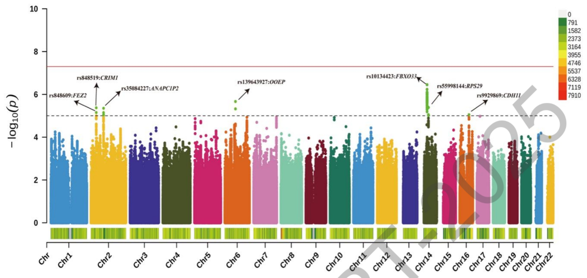

B

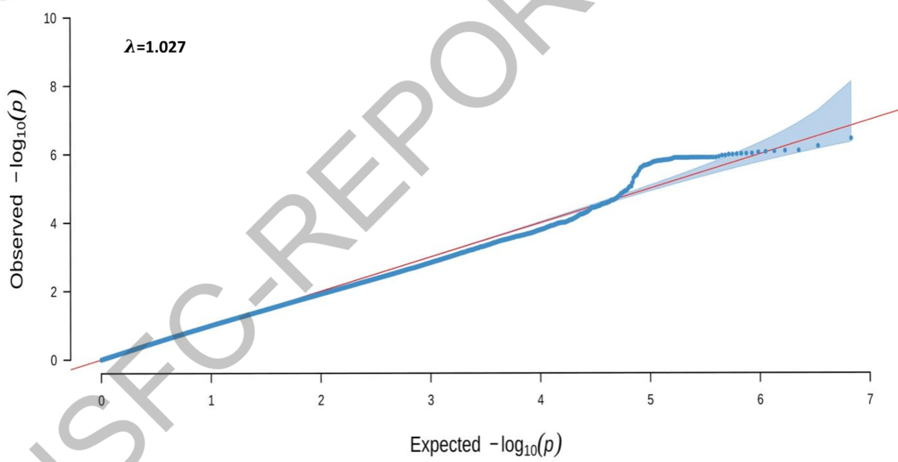

图 1-30 356 例极端表型样本 gwas 分析 manhattan 图和 QQ 图

附注:附注同图 1-8。

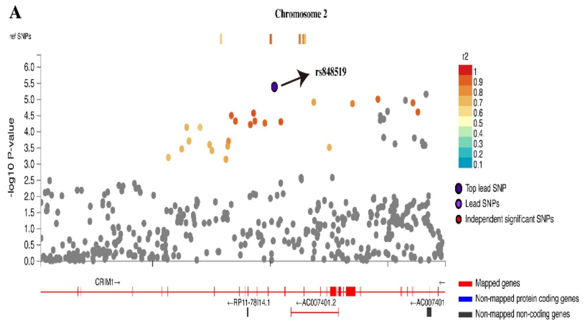

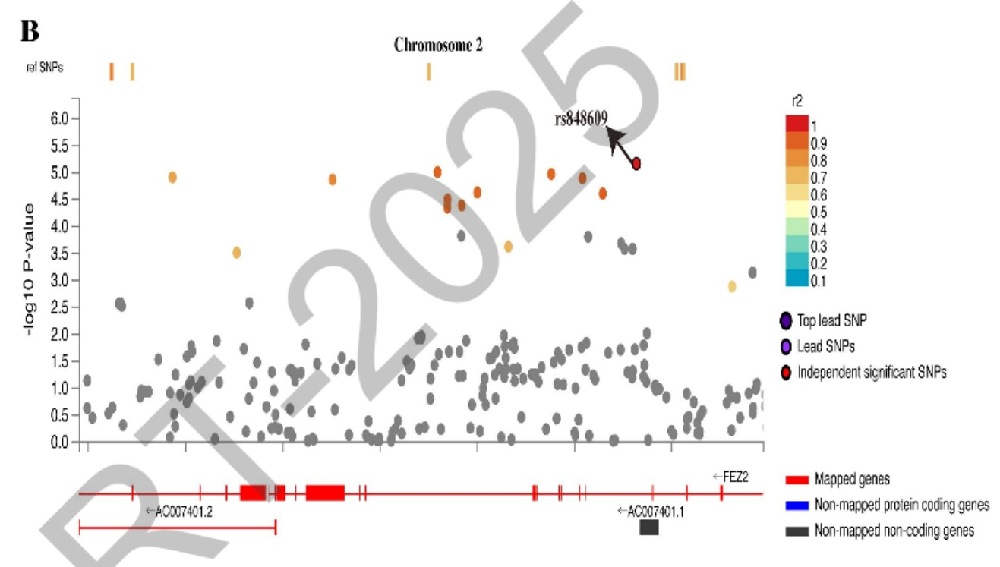

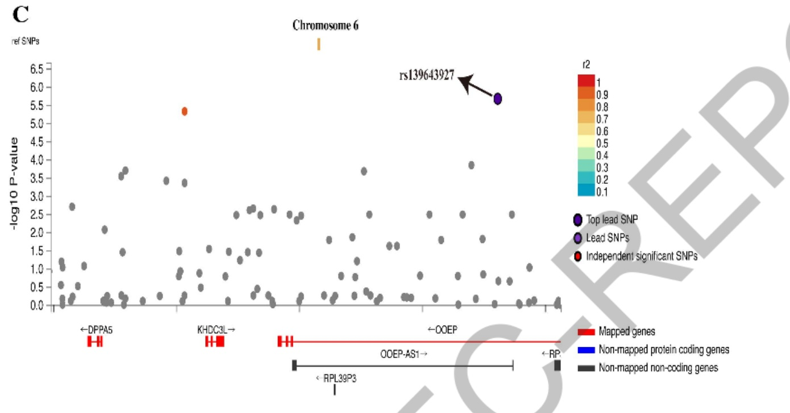

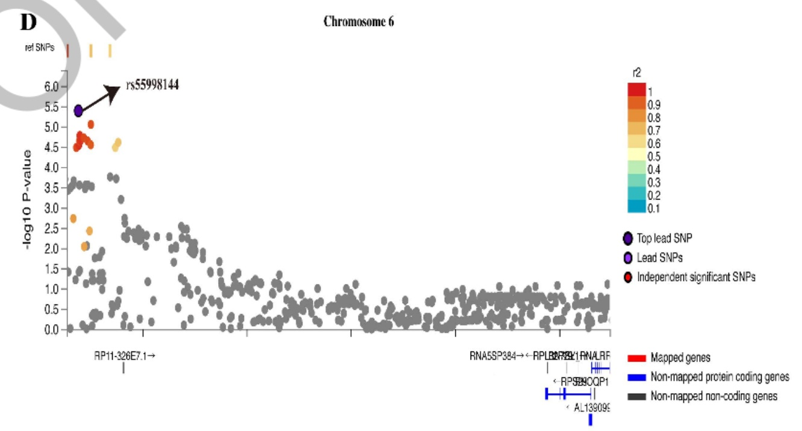

图 1-31 356 例极端表型样本 gwas 分析部分独立位点 locuszoom 图

附注:图展示了 356 例极端表型样本 gwas 分析中独立位点中 OR 大于 1 的位点 locuszoom 图。A、B、C、D 图分别代表 rs848519、rs848609、rs139643927、rs55998144 位点的locuszoom 图。余附注同 1-26。

## 9.10多基因风险评分（PRS）结果

在鉴定了与表型显著关联的遗传变异后，为进一步评估这些遗传信号在个体层面上的累计效应，我们开展了多基因风险评分（polygenic risk score，PRS）分析。为避免亲缘关系带来的结构偏倚，在PRS分析中我们从中筛选出893例无一二级亲缘关系的样本和1,320例无亲缘关系的正常对照样本作为基础数据。

## 9.10.1 基于 893 例无亲缘关系样本 PRS 分析结果

该步骤分析基于893例无亲缘关系样本，按照7:3的比例随机划分为基线样本（625例)和目标样本(268例)，以 $\mathrm { A A O _ { R E } }$ 为连续变量表型。在多个GWAS显著性阈值下 $(p-GWAS)$构建 PRS 后，PRSice 确定的最优模型对应 $p-GWAS<0.16185$ 共纳入113,436个 SNP。该模型在目标样本中可解释 $\mathrm { A A O _ { R E } }$ 表型3.18%的方差（R²=0.0318，p=0.0038，图1-32A），提示在剔除主效应突变后，常见遗传变异仍对AO具有一定的累积贡献。相比之下，采用更严格显著性阈值构建的PRS 由于纳入 SNP数量有限，其解释力明显下降，进一步支持$\mathrm { A A O _ { R E } }$ 具有多基因遗传特征。且PRS与表型成正相关(相关系数r=0.191，p=0.002，图1-32B)。

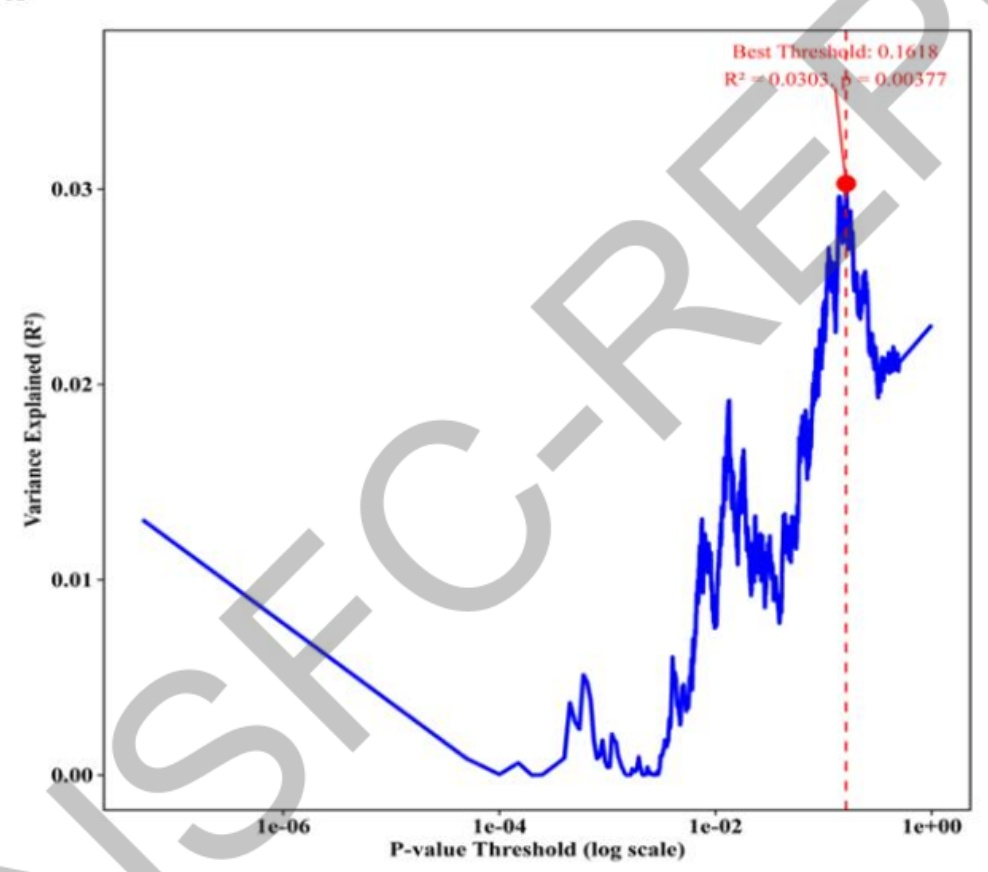

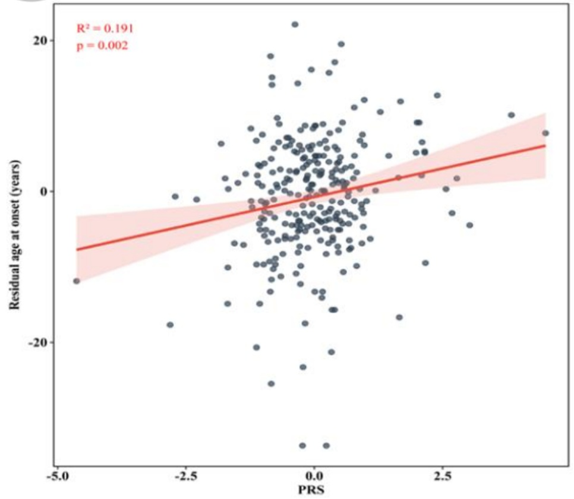

图 1-32 893 例非亲缘关系样本 PRS 分析结果图

附注:图A表示PRS分析中，不同GWAS 显著性阈值 $(p -  GWAS )$ 下PRS模型的模型解释变异度(R²)。x 轴代表用于构建 PRS 的 p-GWAS 值，y 轴代表在目标样本中，PRS 回归模型对表型变异的统计解释能力。红色圆点代表PRS分析最优模型时对应的值 $(p-GWAS<0.16185)$ 。在该阈值下，基于所选 SNP 构成的 PRS 与表型显著相关 $\left( \mathrm{R}^{2}=0.0318, p=0.0038 \right)$ 。图B表示目标样本中PRS值与连续表型之间的关系，x轴代表个体的PRS值，y轴代表对应的连续表型取值。

## 9.10.2基于 893 例无亲缘关系样本和1,320例正常对照样本的 PRS 分析结果

在探索AAO相关遗传信号是否可能在疾病状态层面呈现累积效应的背景下，本研究进一步在病例-对照框架下开展了PRS 分析。该分析基于893例无亲缘关系样本和1,320例无亲缘关系的正常对照，共构成2,213例病例-对照总体队列。按照8:2的比例随机划分为基线样本（1,170例，其中病例714例，对照1,056例；男性899例， 女性871例）和目标样本（443例，其中病例179例，对照264例；男性226例，女性217例），以是否发病为二分类表型（图1-33，表1-22）。

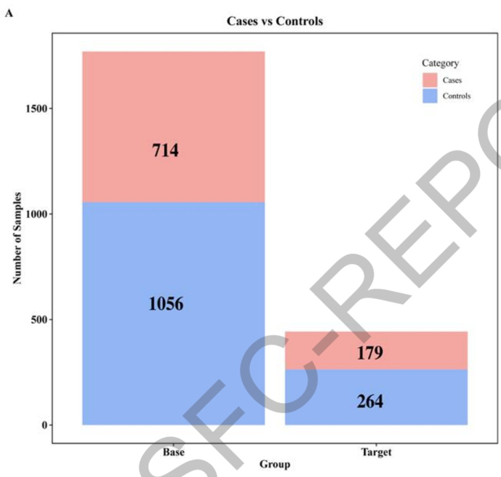

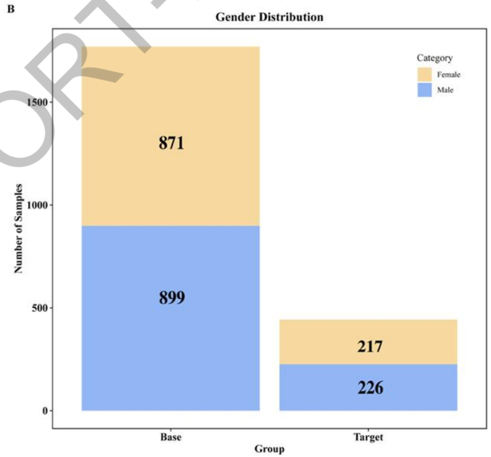

图1-332,213例样本中基线样本和目标样本中样本成分结构图

附注:该图表示PRS分析中2,213例样本按照8:2拆分成基线样本和目标样本的成分结构图。A图为病例对照分布图，B为性别分布图。X轴代表拆分的样本类型，y轴代表样本数。

表1-222,213例样本中基线样本和目标样本的基线信息

<table><tr><td rowspan="2"></td><td colspan="2">基线样本</td><td colspan="2">目标样本</td></tr><tr><td>Case</td><td>Control</td><td>Case</td><td>Control</td></tr><tr><td>样本量</td><td>714</td><td>1056</td><td>871</td><td>899</td></tr><tr><td>年龄（岁），均数±标准差</td><td> $3 9 . 4 0 { \pm } 1 2 . 3 8$ </td><td> $6 5 . 4 0 \pm 8 . 3 8$ </td><td> $4 0 . 6 3 { \pm } 1 1 . 4 5$ </td><td> $6 4 . 8 5   \pm 7 . 5 7$ </td></tr><tr><td>（岁），均数±标准差  $\mathrm { A A O _ { \circ } }$ </td><td> $3 6 . 0 8 { \pm } 1 0 . 1 3$ </td><td></td><td>35.78±10.67</td><td></td></tr><tr><td>（岁），均数±标准差  $\mathrm { A A O _ { p } }$ </td><td>35.79±8.01</td><td></td><td>35.68±7.56</td><td></td></tr><tr><td>（岁），均数±标准差  $\mathrm { A A O _ { R E } }$ </td><td>0.00±6.67</td><td></td><td>0.00±6.79</td><td></td></tr><tr><td>均数±标准差  $ATXN3-CAG_{exp}$ </td><td>70.45±3.45</td><td></td><td>71.35±3.41</td><td></td></tr><tr><td>均数±标准差  $ATXN3-CAG_{norm}$ </td><td> $2 0 . 0 1 { \pm } 6 . 8 7$ </td><td></td><td>19.89±7.15</td><td></td></tr></table>

附注:同表3-5.

鉴于基线样本量相对有限且与对照比例存在一定程度不平衡，为降低回归模型中分离（separation）的风险，基线样本的遗传关联分析采用PLINKv2.0软件的惩罚回归模型（--glmfirth），以SNP的基因型计数作为自变量、二分类表型作为因变量，并将性别及前10个主成分（PCA）作为协变量（--covar） 以控制潜在人群结构及性别混杂因素对遗传关联结果的影响。质控后共保留1,621,084个变异位点，整体膨胀系数为1.016（图1-34)，提示未观察到明显的系统性偏倚。

在此基础上，利用PRSice-2在多个 GWAS 显著性阈值下构建PRS模型，并在目标样本中评估其与疾病状态的关联。结果显示，在 $p-GWAS=5.0\times10^{-4}$ 阈值下获得的 PRS 模型在当前样本中表现出最优拟合效果，该模型共纳入329个SNP（图1-35A）。与仅包含协变量的基础模型相比，纳入PRS后模型拟合度明显提高，提示与发病年龄相关的多基因遗传信号在病例-对照层面亦呈现一致的累积效应方向。考虑到病例-对照PRS分析中潜在的过拟合风险，我们进一步通过10,000次置换检验评估模型稳健性，该PRS模型在经验检验框架下仍具有统计学显著性，表明上述结果并非完全由随机因素驱动。进一步通过受试者工作特征曲线（ROC）分析评估PRS 在当前样本中的区分趋势，其AUC值提示PRS在病例与对照之间具有一定的区分能力（图1-35B）。

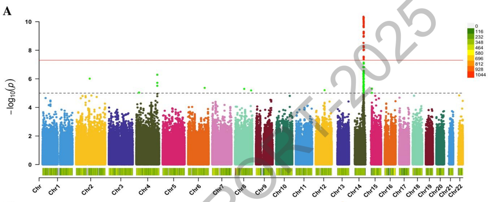

B

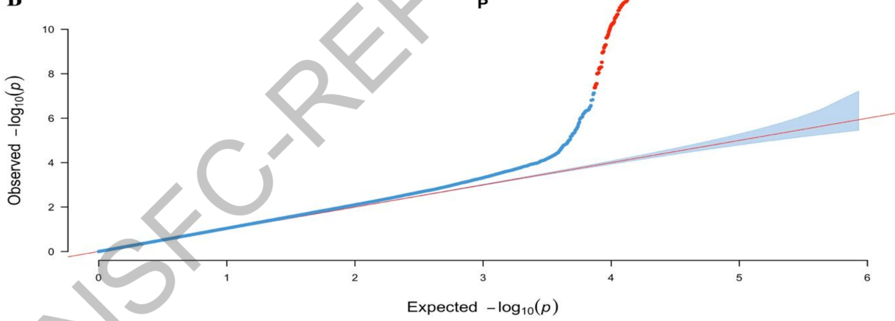

图 1-34 2,213 例样本 PRS 分析中 1,170 例基线样本 gwas 分析 manhattan 图和 QQ 图

附注:附注同图3-10。

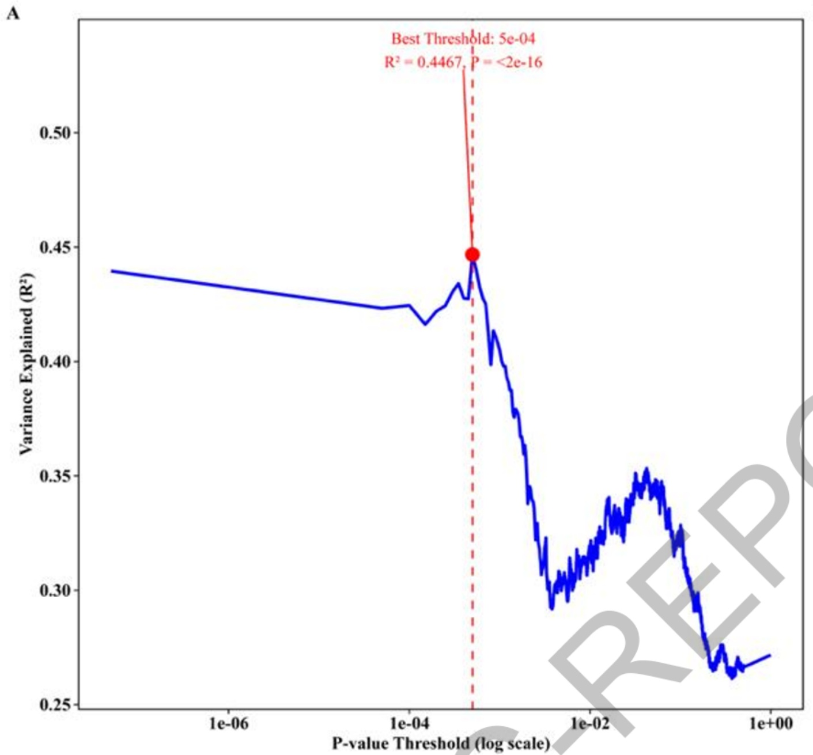

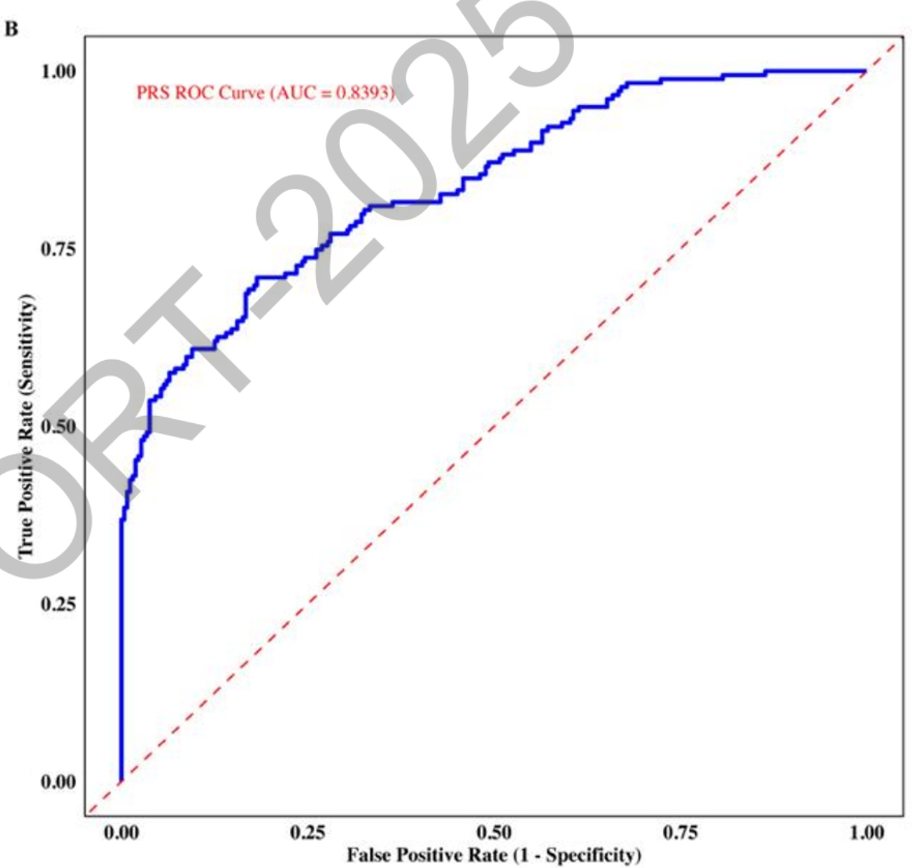

图 1-35 2,213 例样本 PRS 分析结果图

附注:图 A 表示 PRS 分析中，不同 GWAS 显著性阈值（p-GWAS）下 PRS 模型的模型解释变异度（R²)，x 轴代表用于构建 PRS 的 p-GWAS值 $, \mathrm { y }$ 轴代表在目标样本中，PRS回归模型对表型变异的统计解释能力。红色圆点代表PRS分析最优模型时对应的值。图B表示基于最优p-GWAS $p-GWAS<5.0\times10\%$ 4）构建的PRS模型在目标样本中的受试者工作特征（ROC）曲线，蓝色曲线表示PRS模型的判别性能，红色虚线为随机分类参考线（AUC=0.5）。该模型的曲线下面积（AUC）为0.8393，提示PRS在区分病例与对照方面具有较好的判别能力。

## 9.11 gsMap 空间映射分析结果

我们进一步进行了gsMap分析，以探索SCA3的AAO遗传力在不同组织区域的显著富集情况。结果显示，脊髓、肾上腺、大脑、肌肉、交感神经、背根神经和内耳表现出提示性关联信号（柯西p值分别为0.0083、0.0094、0.0183、0.0230、0.0374、0.0485，经Bonferroni 校正后均不显著，图1-36B，表1-23），提示这些组织可能在SCA3 发病中发挥重要作用。

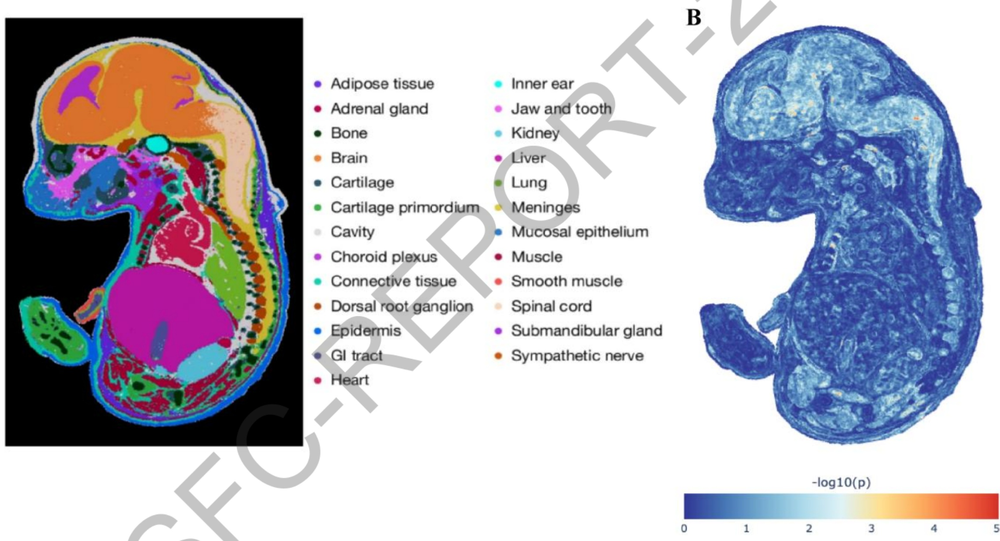

图 1-36 893 例无亲缘关系队列 gsMap 分析在小鼠 E16.5 胚胎单细胞空间转录组数据的空间映射结果图

附注:图 A表示小鼠E16.5胚胎空间转录组（ST）数据，根据组织类型着色参考图，来自参考文献[223]。图B 展示了基于893例无亲缘关系队列 GWAS 汇总数据的在小鼠 E16.5 胚胎 ST 数据的 gsMap 分析空间映射图。

表 1-23 基于小鼠 E16.5 胚胎期 ST 数据的 gsMap SCA3 cauchy 组合检验结果

| annotation | p_cauchy | p_median |
| --- | --- | --- |
| Spinal cord | 0.008346150974771316 | 0.0385372925818686 |
| Adrenal gland | 0.009404956809483389 | 0.04539132046517695 |
| Brain | 0.018274517995327533 | 0.054181309857953455 |
| Muscle | 0.021410726289421977 | 0.0786468374297812 |
| Sympathetic nerve | 0.02300393716308491 | 0.0545756833159694 |
| Dorsal root ganglion | 0.03736807547508625 | 0.0776278224980808 |
| Inner ear | 0.0485114940263478 | 0.2676333113688561 |
| Choroid plexus | 0.050522949737547784 | 0.1342508695836387 |
| Smooth muscle | 0.0537047959130551 | 0.1736439720767905 |
| Epidermis | 0.0651697544734261 | 0.29650241567867425 |
| Meninges | 0.10378322264410555 | 0.27328984775070564 |
| Kidney | 0.13189503099919053 | 0.26161897430940473 |
| GI tract | 0.15287355072291953 | 0.2788544413425305 |
| Submandibular gland | 0.189504071527971 | 0.4186625394523968 |
| Mucosal epithelium | 0.25855803368227803 | 0.4909004901345412 |
| Heart | 0.3005229197766426 | 0.3664662903301918 |
| Adipose tissue | 0.4204120855258161 | 0.4107443375922908 |
| Liver | 0.48050307804453596 | 0.46140348461704 |
| Connective tissue | 0.5404008665217224 | 0.4576934182822477 |
| Lung | 0.5736425506815015 | 0.5198466463786641 |
| Jaw and tooth | 0.6977483618498737 | 0.55700761383433 |
| Cartilage primordium | 0.8134719182166142 | 0.6336091542532118 |
| Cavity | 0.9647642347895283 | 0.4918626597110809 |
| Cartilage | 0.9767554409649534 | 0.6683954882670651 |
| Bone | 0.9845494137859784 | 0.707733194292038 |

附注:annotation 标示了 25 个胚胎期小鼠器官；p\_cauchy 表示通过 Cauchy 组合检验得出的 p 值；p\_median 表示基于中位数验证检验得出的 p 值。p\_cauchy<0.05 的 annotation 和p\_cauchy 值予以加粗显示。

## 10）候选基因排序

基于前述“发现队列”和“验证队列”分析结果，本研究整合了位点层面结果（包括包括显著性位点、提示性位点、FINEMAP精细定位高置信度位点结果）与基因层面结果（包括 TWAS、SMR和 SHAREPRO共定位分析结果），对候选基因进行了系统排序与优先级评估（图1-37）

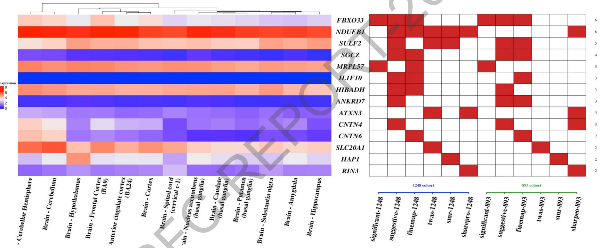

图1-37 候选基因排序和组织富集分析结果

附注:图表示候选基因的排序图和组织富集分析热图，其中只展示了同时出现在两个队列分析结果中的13个候选基因。左图为候选基因在 GTEx v8数据13 种脑组织中的富集热图，右图为候选基因的重复出现次数的排序图，中间为基因名。

在对位点进行功能注释后，本研究基于基因信号在不同分析方法中出现次数对候选基因进行综合排序。本分析仅纳入同时出现在两个队列分析结果中的编码蛋白基因。结果显示，共有14个基因在发现队列和验证队列中至少获得一种证据支持（图3-42）。其中，FBXO33和NDUFB1在不同分析方法中被支持的次数最多（均为6次），其次为 SULF2（5次）。此外，两个队列中同时出现的基因:Significant（FBXO33、MRPL57），Suggestive (FBXO33、SULF2、HIBADH、SGCZ、CNTN4、ANKRD7)，FINEMAP（FBXO33、 SGCZ、IL1F10、CNTN6）,TWAS（SLC20A1），SMR（HAP1）, SharePro（NDUFB1、ATXN3、RIN3）。最终我们筛选前三个基因为最高优先级基因:显著性位点基因（FBXO33）和出现次数最多的基因（NDUFB1、SULF2）。

## 11）候选基因 RT-qPCR 结果

根据图3-42和3.4.8的基因排序结果，我们最终纳入最高优先级基因FBXO33、NDUFB1和 SULF2 进行 RT-qPCR 检测。候选基因对应的引物序列如表 1-24。

表 1-24 RT-qPCR 引物序列

| 基因-F/R | 种属 | 序列 |
| --- | --- | --- |
| FBXO33-F | 人 | GCACCAGCTTTCGGGTCTAT |
| FBXO33-R | 人人 | TCAGATCAGAGCCCCGAAGA |
| NDUFB1-F |  | GTCCCTATGGGATTTGTCATTGG |
| NDUFB1-R | 八人人人 | CAGTTAGCCGTTCATCACTCTT |
| SULF2-F |  | ACATCGTATACACCGCCGAC |
| SULF2-R |  | GTGTCCAGCAGCTTGAGGAT |

附注:F代表正向引物；R代表反向引物。

该研究纳入 30 例正常对照和 30 例 SCA3 患者对候选基因进行 RT-qPCR 检测，两组平均年龄分别为11.15±4.17岁和31.11±12.37岁；两组男女比例分别为；共济失调期患者平均发病年龄为 $3 4 . 0 0 { \pm } 1 0 . 1 9$ 岁，平均病程为6.14±4.14年，平均 $\mathrm { C A G } _ { \mathrm { e x p } }$ 为 $7 1 . 9 9 { \pm } 4 . 2 6$ 次，SARA 和 ICARS 评分分别为11.15±4.17分和 31.11±12.37（受试者基线信息见表1-25）。RT-qPCR 检测结果显示发现 SCA3 患者中 FBXO33、NDUFB1、SULF2 基因 mRNA 表达水平较正常对照显著下降 $p = 0.0004$ ，p=0.0063，p=0.0002；图1-25）。

表 1-25 RT-qPCR 检测受试者基线特征

|  | 正常对照 | SCA3 患者 | p |
| --- | --- | --- | --- |
| 例数 | 30 | 30 | / |
| 年龄（岁） | 30.15±11.17 | $3 1 . 1 1 { \pm } 1 2 . 3 7$ | 0.27 |
| 男/女 | 18/12 | 16/14 | / |
| 发病年龄（岁） | / | $3 4 . 0 0 { \pm } 1 0 . 1 9$ | / |
| 病程 （年） | / | $5 . 1 2 { \pm } 1 . 2 5$ |  |
| $\mathrm { C A G _ { n o m } }$ | 1 | 14.12±4.26 |  |
| $\mathrm { C A G } _ { \mathrm { e x p } }$ | 1 | 71.99±4.26 |  |
| SARA（分） | 1 | 11.46±2.36 |  |
| ICARS（分） | / | $2 9 . 9 2 { \pm } 1 4 . 3 1$ |  |

附注:表中连续型变量用“平均值±标准差”表示，“/”表示数据不适用。a:采用2个独立样本非参数检验；b:采用卡方检验。

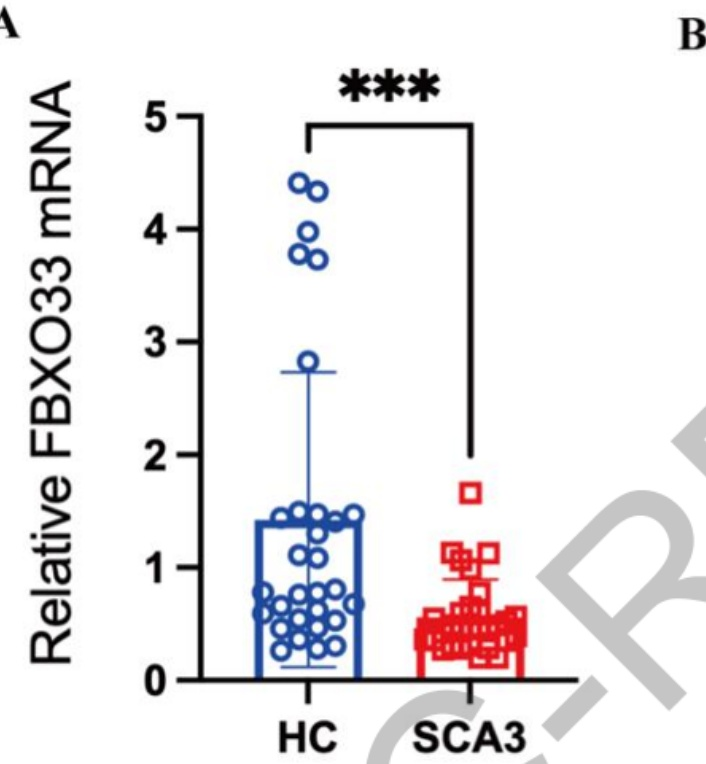

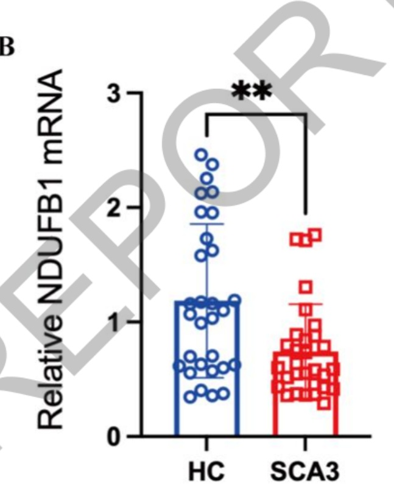

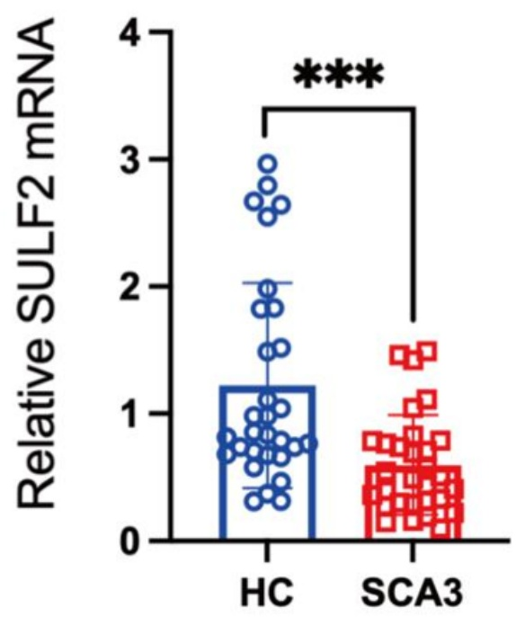

图 1-38 候选基因 RT-qPCR 结果

附注:图表示3个候选基因的 RT-qPCR的柱状图。A、B、C 分别代表 FBXO33、NDUFB1、SULF2基因的结果。\*\*表示 p<0.01，\*\*\*表示p<0.001。

综上，我们在“发现阶段”和“验证阶段”中一致鉴定到两个达到全基因组显著性水平的风险位点（MRPL57-rs142932360和FBXO33-rs28801081），并且其效应方向均指向发病提前，提示这些遗传变异可能加速疾病进展。进一步整合FINEMAP精细定位、TWAS、SMR及 SharePro共定位等多种 post-GWAS 策略，我们在位点与基因层面均获得多层证据支持的高可信度候选基因信号。其中，FBXO33、NDUFB1和SULF2基因信号在多个独立分析中反复出现，且经RT-qPCR验证SCA3患者外周血中mRNA表达水平均显著下调，强化了其作为遗传修饰基因的生物学可靠性。

## 第二部分:从罕见变异角度鉴定SCA3 患者AO遗传修饰因素

## 1）队列构成情况

与“第一部分:从常见变异角度鉴定SCA3患者AO遗传修饰因素”的初始队列一致。经初步排除后，剩余1,270例临床期SCA3患者满足入组条件被纳入后续质控与关联分析。

发现队列:同“第一部分:从常见变异角度鉴定SCA3患者AO遗传修饰因素”的“1队列构成情况”中的“发现队列”。 5

验证队列1:为验证连续性状分析结果的稳健性，我们根据发现队列中AO残差的排序，选择前30%（早发）与后30%（晚发）共832例极端表型样本构建“验证队列1”，开展二分类关联分析。

验证队列2:同“第一部分:从常见变异角度鉴定SCA3患者AO遗传修饰因素”的“1队列构成情况”中的“内部验证队列”。进行连续性状关联分析。

验证队列3:为同时控制亲缘关系与测量误差，在验证队列2中进一步选取AO残差位于前30%与后30%的596例极端表型个体，构建“验证队列3”，并进行二分类关联分析。

## 2）发病年龄残差计算结果

在发现队列中，发病年龄残差计算结果同“第一部分:从常见变异角度鉴定SCA3患者AO遗传修饰因素”中的“2 发病年龄残差计算结果”。

## 3）描述性统计分析结果

在发现队列中，男性 657 例，女性 591 例，ATXN3基因长短链CAG等位基因重复次数大小（即 $ATXN3-\bar{CA}G_{\mathrm{exp}}$ 和 $ATXN3-CAG_{norm}$ 分别为71.50±3.31（56\~83）以及19.87±6.25（11-46）次，年龄为41.80±11.59（13-80）岁，A0为35.68±10.43（5-68）岁（表2-1，图1-1）。发现队列与三个内部验证队列相比，除AO残差绝对值之外，其余受试者人口学资料和基因型特征没有明显差异（表2-1）。

## 4）用于关联分析的罕见变异筛选结果

在发现队列中，经严格的样本与变异质控后，我们进一步结合等位基因频率（MAF）对全基因组变异进行筛选，最终获得28,950,851个位点满足罕见变异标准（MAF<0.01），用于后续的罕见变异关联分析。

基于上述符合条件的罕见变异，绘制了全基因组变异密度图。结果显示，绝大多数染色体区域均可观察到罕见变异分布，仅少数基因组区段呈现较低的变异密度，甚至出现几乎完全缺乏变异覆盖的区域（图2-1）。

表2-1 受试者人口学资料和临床特征

<table><tr><td colspan="2"></td><td>发现队列</td><td>验证队列1</td><td>验证队列2</td><td>验证队列3</td><td>p</td></tr><tr><td colspan="2">受试者总人数，例数 性别（男性/女性），例数</td><td>1248 657/591</td><td>832 437/395</td><td>893 484/409</td><td>596 329/267</td><td>0.67</td></tr><tr><td>ATXN3-CAGexp</td><td>均数±标准差</td><td>71.50±3.31</td><td>71.28±3.24</td><td>71.52±3.35</td><td>71.23±3.25</td><td>0.18</td></tr><tr><td></td><td>范围 均数±标准差</td><td>56-83 19.87±6.25</td><td>56-83 19.76±6.25</td><td>56-83 19.83±6.25</td><td>56-83 19.78±6.29</td><td>0.98</td></tr><tr><td>ATXN3-CAGnorm</td><td>范围 均数±标准差</td><td>11-46 41.80±11.59</td><td>13-46 42.58±12.07</td><td>13-46 41.45±11.78</td><td>13-46 42.38±12.43</td><td></td></tr><tr><td>年龄，岁</td><td>范围 均数±标准差</td><td>13-80 35.68±10.43</td><td>5-68 36.15±11.31</td><td>13-80 35.34±10.9</td><td>13-80 35.97±11.94</td><td>0.18</td></tr><tr><td>发病年龄，岁</td><td>范围 均数±标准差</td><td>5-68 35.68±7.96</td><td>5-68 36.20±7.79</td><td>5-68 35.61±8.05</td><td>5-68</td><td>0.45</td></tr><tr><td>预测发病年龄，岁</td><td>范围</td><td>8.02-72.92</td><td>8.02-72.92</td><td>8.02-72.92</td><td>36.30±8.02 8.02-72.92</td><td>0.18</td></tr><tr><td>发病年龄残差，岁</td><td>均数±标准差 范围</td><td>0.00±6.73 -33.69-22.15</td><td>-0.05±8.18 -33.69-22.15</td><td>-0.27±7.48</td><td>-0.33±9.03</td><td>0.76</td></tr><tr><td>发病年龄残差 绝对值，岁</td><td>均数±标准差 范围</td><td>5.08±4.42 0.04-33.69</td><td>7.00±4.23 2.45-33.69</td><td>-33.69-22.15 5.79±4.75</td><td>-33.69-19.55 7.88±4.42</td><td>&lt;0.001</td></tr></table>

附注:ATXN3-CAGexp=ATXN3 基因异常扩增等位基因 CAG 拷贝数；ATXN3-CAGnorm=ATXN3 基因正常等位基因CAG拷贝数。

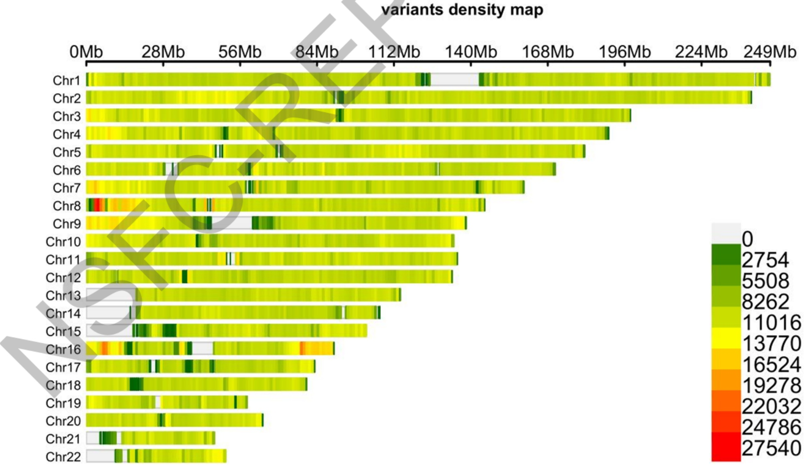

图2-1 最终纳入关联分析的罕见变异概率密度图

附注:图中左侧坐标轴显示22条染色体，顶侧坐标轴显示染色体上具体基因组位置。右下角图例表示变异的密度大小，图例越往下颜色越红表示所在染色体区域变异密度越大。

B

## 5）群体分层结果

本研究使用GCTA进行PCA分析，并通过碎石图确定各队列用于罕见变异关联分析的主成分（PC）数量，以校正潜在人群结构对结果的影响。发现队列拐点位于第15个PC，验证队列1、2、3分别位于第14、5、5个PC，因此后续关联分析分别纳入相应数量的PC作为协变量（图2-2）。进一步在发现队列中选取方差贡献度排名前3的PC绘制散点图，结果显示研究对象在多维空间中紧密聚集，未见明显群体分层或异质性（图2-3）。

D

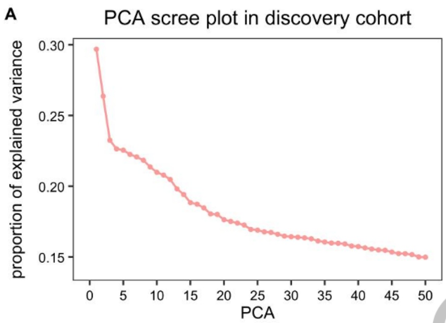

PCA scree plot in replication cohort 1

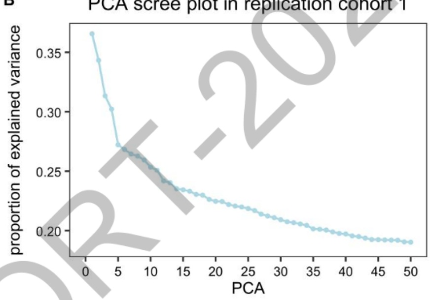

C

PCA scree plot in replication cohort 2

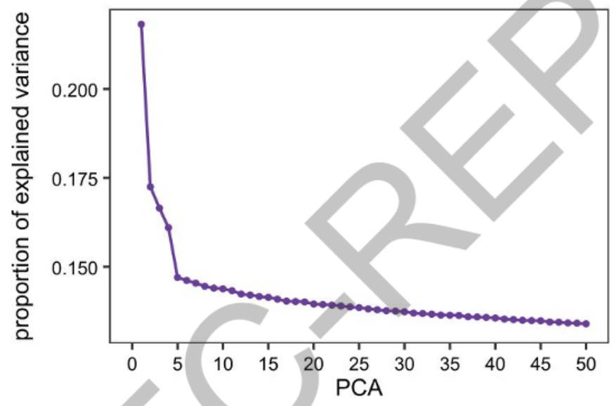

PCA scree plot in replication cohort 3

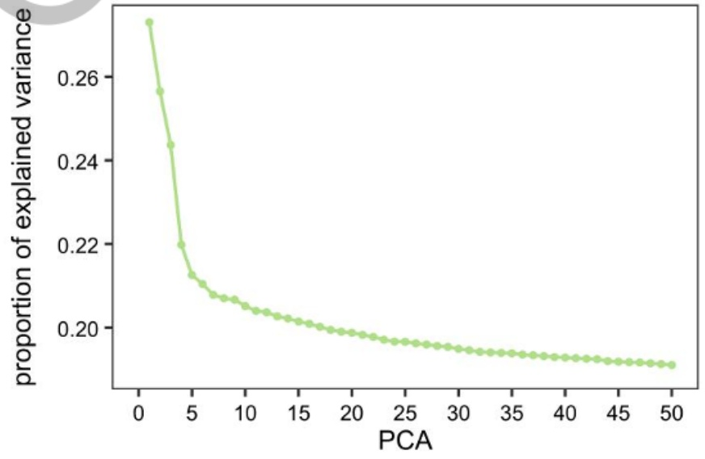

图 2-2 发现队列与验证队列 PCA 碎石图

附注:图A、B、C分别表示发现队列，验证队列1、2与3的碎石图。PCA=主成分分析。

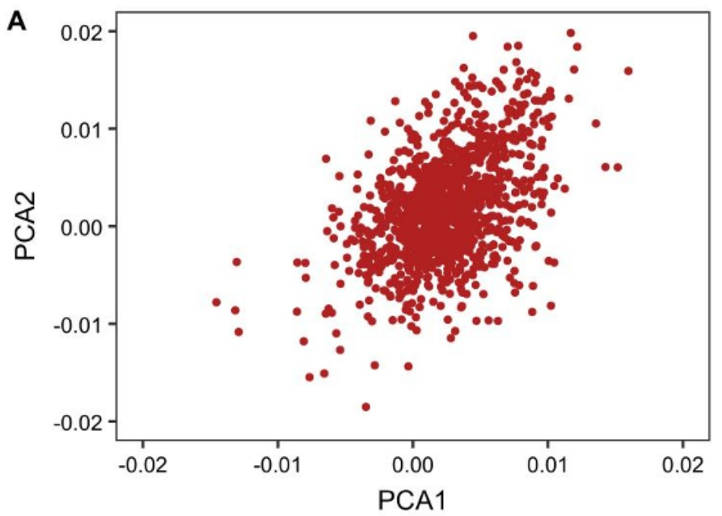

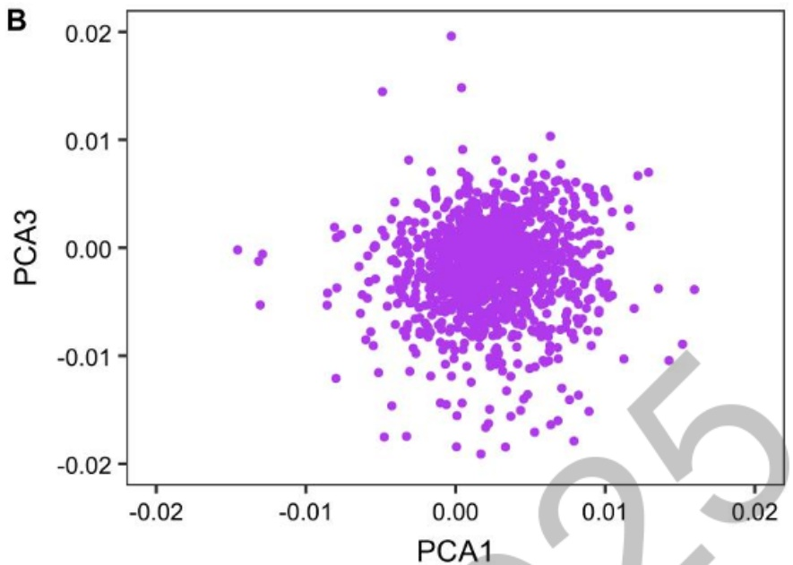

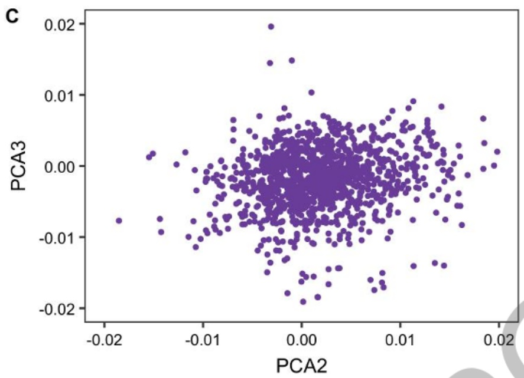

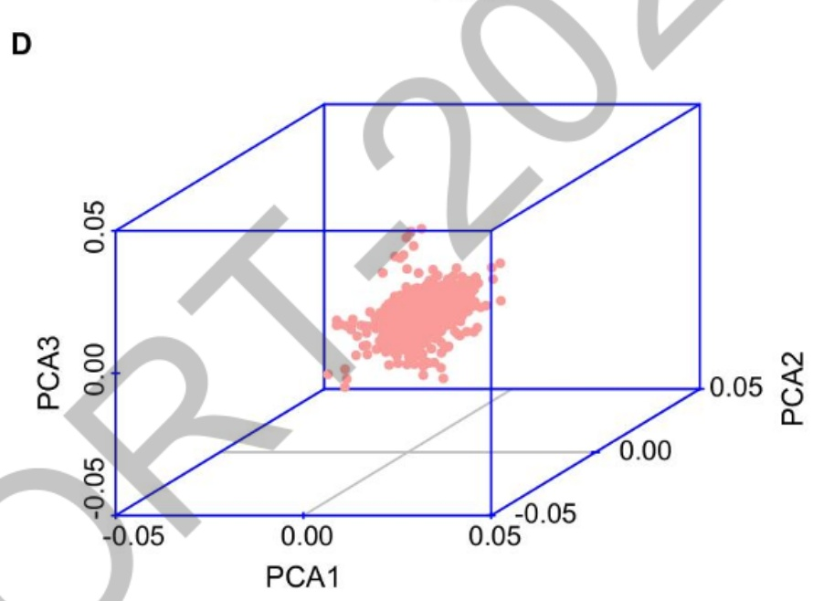

图 2-3 发现队列前 3 个 PCA 的散点图

附注:图A、B、C分别表示发现队列中前3个PCA之间的二维散点图。图D则表示前3个PCA间的三维散点图。

## 6）发现队列基因编码区RVAS 结果

本研究将编码区变异按功能影响划分为5个类别，即破坏性错义变异、错义变异、假定功能缺失变异、假定功能缺失与破坏性错义变异、同义变异，并应用STAAR-O分析方法进行了以基因编码区为单位的罕见变异关联分析，以确定基因编码区各个类别中的稀有变异是否与A0有关。结果显示，共13,859个基因编码区内变异其总次要等位基因计数（cMAC）大于等于10，被纳入罕见变异关联分析。5种分类集合整体的膨胀系数为0.84，共5个基因（LMO7, PMFBP1, KRTAP10-4, PEX26, TUBA8）在全基因组范围内可显著修饰SCA3患者的AO，2个基因（BMP5,PTER），满足本研究设定的全基因组提示性关联阈值(表2-2)。其中，在错义变异这一集合中，膨胀系数为 $0.82,LMO7(p=1.21\mathrm{E}-06)$ , PMFBP1 $(p=7.69\mathrm{E}-09)$ 、PEX26 $p=1.35\mathrm{E}-06$ TUBA8 $(p=1.38\mathrm{E}-06)$ 、BMP5 $(p=1.38\mathrm{E}-06)$ 与 PTER $(p=6.08\mathrm{E}-06)$ 基因上的错义变异可影响患者AO。在同一变异这一集合中，膨胀系数为0.85, KRTAP10-4 $(p=7.99\mathrm{E}-08)$ 基因上的同义变异显示与AO在全基因组层面存在显著关联。而在其余变异集合中，没有基因在全基因组范围内可影响患者A0（表2-2，图2-4）。

表2-2 全基因组显著性或提示性关联的基因

| gene | chr | start | end | variant | cMAC | p | category | degree |
| --- | --- | --- | --- | --- | --- | --- | --- | --- |
| BMP5 | 6 | 55753645 | 55875564 | 7 | 10.01 | 4.96E-06 | missense | suggest |
| PTER | 10 | 16436943 | 16513745 | 6 | 11.00 | 6.08E-06 | missense | suggest |
| LM07 | 13 | 75620434 | 75859870 | 46 | 86.02 | 1.21E-06 | missense | significant |
| PMFBP1 | 16 | 72112157 | 72176878 | 24 | 50.01 | 7.69E-09 | missense | significant |
| KRTAP10-4 | 21 | 44573724 | 44638284 | 53 | 122.64 | 7.99E-08 | synonymous | significant |
| PEX26 | 22 | 18077920 | 18131138 | 21 | 54.02 | 1.35E-06 | missense | significant |
| TUBA8 | 22 | 18110331 | 18146554 | 15 | 48.02 | 1.38E-06 | missense | significant |

附注:cMAC=总次要等位基因计数；chr=染色体；degree=满足全基因组显著性或者提示性关联；variant=变异的数目。

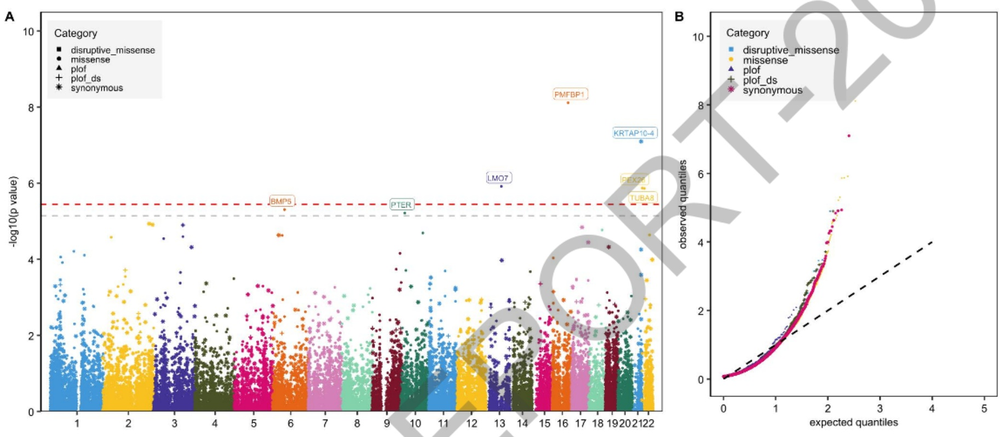

图 2-4 STAAR-O 模型基因编码区关联分析 Manhattan 和 QQ 图

附注:左图示STAAR-O模型基因编码区罕见变异关联分析的曼哈顿图；红色实线表示全基因组层面的显著性关联阈值水平，黑色虚线表示全基因组层面具有提示性关联的统计学水平。曼哈顿图将关联分析之后编码区所有基因的p值在整个基因组上从左至右描绘，通常将p值转换为-log10(p)值，x轴表示基因组位置， 轴表示-log10(p)值，y轴代表与表型的关联程度，y轴高度越高关联度越强（即p值越小） 右图示基于 STAAR-O 模型进行单位点罕见变异关联分析的 QQ图。QQ 图的 x轴则是期望的均匀分布的概率值，y轴是位点实际关联分析结果的-log10(p)值。如果变异对性状或表型的影响存在显著相关的自然选择，可看到两者相互分离情况，p值越低分离程度就越高，QQ图尾部会翘起来。如果表型性状并非自然选择，则p值的实际值和均匀分布结果将集中于一条直线上（即图B中红色直线）。Manhattan图=曼哈顿图；QQ图=分位图。disruptive missense=破坏性错义变异；missense=错义变异；plof=假定功能缺失变异；plof\_ds=假定功能缺失与破坏性错义变异；synonymous=同义变异。

## 7）发现队列非编码 RNA基因 RVAS 结果

本研究采用STAAR-O罕见变异联合检验方法，以非编码RNA（ncRNA）基因为分析单位，开展全基因组层面的罕见变异关联分析。分析结果显示，共3,617个非编码RNA基因其cMAC大于等于10，满足关联统计检验标准。其中，在全基因组范围内，未观察到非编码RNA基因满足本研究预设的提示性或显著性关联阈值。此外，整体统计检验的基因组膨胀系数为0.91，位于可接受范围内，提示全基因组关联结果未受到系统性膨胀影响，整体呈现略偏保守的分布特征（图2-5）。

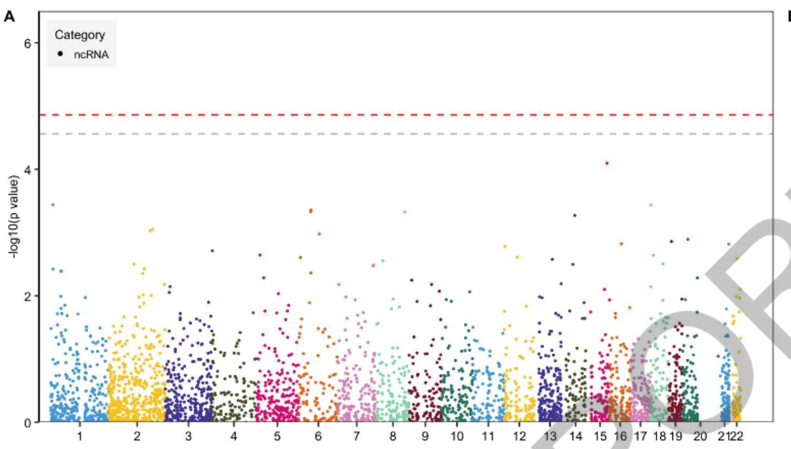

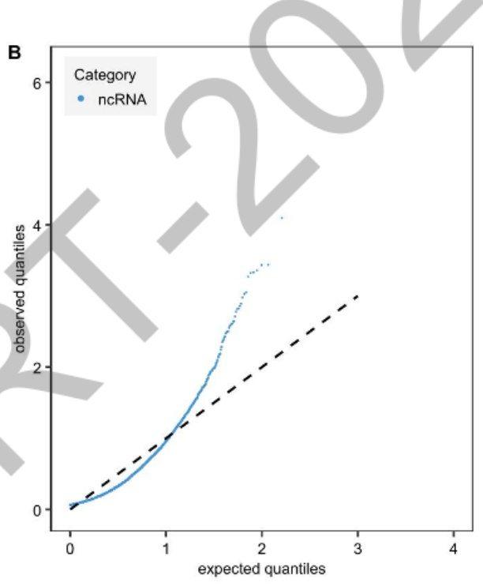

图 2-5 STAAR-O 模型非编码 RNA 基因水平关联分析 Manhattan 和 QQ 图

附注:该图表示在非编码 RNA 水平的 STAAR-O模型关联分析结果图。图中相关图注信息与图 2-4相同，ncRNA=非编码 RNA。

## 8）发现队列基因非编码调控区RVAS 结果

本研究将基因非编码调控区依据其潜在的功能影响划分为七类，包括:downstream、upstream、UTR、promoter\_CAGE、promoter\_DHS、enhancer\_CAGE 以及 enhancer\_DHS。基于这些功能类别，利用 STAAR-O对每个调控区域内的基因进行罕见变异集合分析，以评估其与 SCA3患者AO的关联。为展示全基因组关联信号及统计性能，本研究进一步绘制Manhattan 图和 QQ图，用于直观呈现显著性分布及检验偏倚情况。

结果显示，基于 $\mathrm { c M A C { \geq } 1 0 }$ 的筛选标准，共有17,449个基因的非编码调控区变异集合被纳入后续的关联统计分析。总体而言，七类非编码变异集合的整体膨胀系数为0.908，各个类别基因组膨胀系数均接近1，提示模型未出现明显的统计膨胀，关联结果可信。在全基因组范围内，共有6个基因（SLC35F3、ZNF165、TNFRSF19、MAPK8IP3、CALM3）的稀有变异在至少一个非编码调控区域类别中达到基因水平的显著关联阈值，提示这些基因的调控区域变异可能显著影响SCA3患者的AO。此外，1个基因（RALYL）达到本研究设定的提示性关联水平（表2-3，图2-6）。

具体而言，enhancer CAGE 变异集合的膨胀系数为 0.84，其中 SLC35F3（p=3.85E-07)，ZNF165（p=2.60E-06）的变异与 AO 显著相关。enhancer DHS 变异集合的膨胀系数为 0.91，其中RALYL（p=4.58E-06）基因上的变异达到提示性关联水平。downstream变异集合的膨胀系数为0.88，其中TNFRSF19（ $p=2.19\mathrm{E}-06$ ）在全基因组范围内显示显著关联。promoter\_CAGE变异集合的膨胀系数为0.86，其中MAPK8IP3（p=1.54E-06）的变异显示与AO显著关联。UTR（UTR）变异集合的膨胀系数为0.87，其中CALM3（p=1.91E-06）在基因组水平显示与AO显著相关。在其余类别的非编码变异集合中，未观察到达到全基因组显著或提示性水平的基因（表2-3，图2-6）。

表 2-3 非编码调控区域全基因组显著性或提示性关联的基因

| gene | chr | start | end | variant | cMAC | p | category | degree |
| --- | --- | --- | --- | --- | --- | --- | --- | --- |
| SLC35F3 | 1 | 233904933 | 234324516 | 4 | 20.01 | 3.85E-07 | enhancer_CAGE | significant |
| ZNF165 | 6 | 28080975 | 28089563 | 7 | 15.00 | 2.60E-06 | enhancer_CAGE | significant |
| RALYL | 8 | 84182787 | 84921844 | 54 | 147.21 | 4.58E-06 | enhancer_DHS | suggest |
| TNFRSF19 | 13 | 23570370 | 23676104 | 7 | 17.04 | 2.19E-06 | downstream | significant |
| MAPK8IP3 | 16 | 1706183 | 1770317 | 209 | 27.08 | 1.54E-06 | promoter_CAGE | significant |
| CALM3 | 19 | 46601074 | 46610793 |  | 10.02 | 1.91E-06 | UTR | significant |

附注:表中相关注释信息与表2-2相同。

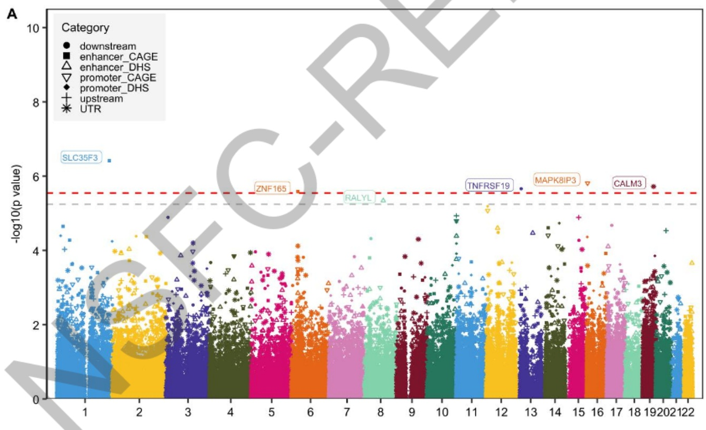

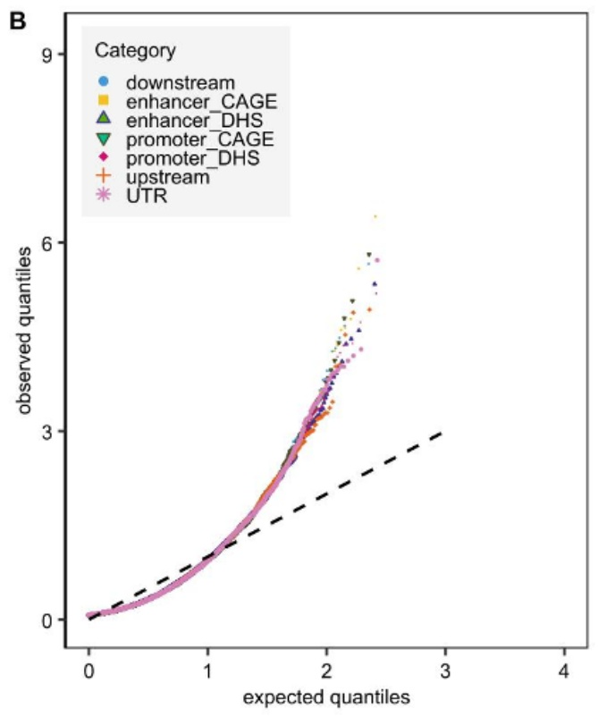

图 2-6 STAAR-O 模型基因非编码调控区水平关联分析 Manhattan 和 QQ 图

附注:该图表示在基因非编码调控区的 STAAR-O模型关联分析结果图。downstream=downstream；upstream=upstream; UTR=UTR; promoter\_CAGE=promoter\_CAGE; promoter\_DHS=promoter\_DHS; enhancer\_CAGE=enhancer\_CAGE；enhancer\_DHS=enhancer\_DHS。相关图注信息与图 2-4 相同。

## 9）发现队列基因组区域RVAS结果

## 9.1 固定长度滑动窗口 RVAS 结果

为系统搜索全基因组中的稀有变异聚集信号，本研究采用固定长度滑动窗口策略进行关联分析。在每条染色体上以2kb为窗口、1kb为步长构建重叠变异集合，并利用STAAR-O检验其关联性且cMAC小于10的窗口被排除在分析之外。随后绘制Manhattan图和QQ图，以直观呈现全基因组范围内窗口水平关联结果，并用于评估整体统计分布与模型拟合的可靠性。

在本研究的全基因组滑动窗口分析中，最终共有2,603,346个通过质控且cMAC≥10的重叠区段被纳入关联检验。总体来看，各窗口包含的稀有变异数量呈现相对一致的分布，其中位罕见变异数为21个，中位累积cMAC值为52.04，表明本分析策略能够在全基因组范围内捕获捕获罕见变异的局部聚集信号。检测到的基因组膨胀系数为0.86，略低于理论值1，但仍处于可接受范围内，p值分布的QQ图亦表现出较好的拟合趋势，提示整体统计结果趋于保守，未受到系统性结构变异、隐性群体分层或模型错误设定所导致的系统性膨胀影响（图2-7）。

在全基因组扫描中，共识别11个达到预设显著性或提示性阈值的关联窗口，这些窗口分布于9、10、15和22号染色体，相关的统计信息已列于表2-4。具体而言，9号染色体上检测到3个窗口与患者AO关联（chr9:67391544-67393543；chr9:67392544-67394543；chr9:124872544-124874543 其中2个位点彼此相邻或部分重叠位于chr9:67391544-67394543 区域，提示该染色体特定位点可能存在局部罕见变异富集信号。10号染色体上共发现5个与患者A0显著关联的窗口(chr10:13250409-13252408；chr10:13251409-13253408 ; chr10:80267409-80269408; chr10:131875409-131877408; chr10:131876409-131878408），这些窗口分别在2个区域（chr10:13250409-13253408区域；chr10:131875409-131878408区域）高度重叠，显示该基因组区段的关联信号在空间上具有较强的重复性与稳健性，提示这些区域可能存在真实且稳定的罕见变异富集效应。此外，15号染色体上检测到1个显著窗口（chr15:41110327-41112326）以及22号染色体上识别出2个重叠的窗口（chr22:50709999-50711998，chr22:50710999-50712998），提示AO相关的罕见变异信号在多条染色体区域富集，呈跨染色体分布特征（表2-4，图2-7）。

表2-4固定长度滑动窗口关联分析全基因组显著性或提示性关联区域

| chr | start | end | variant | cMAC | p | category | degree | gene |
| --- | --- | --- | --- | --- | --- | --- | --- | --- |
| 9 | 67391544 | 67393543 | 5 | 10.11 | 1.18E-08 | sliding window | significant | intergenic |
| 9 | 67392544 | 67394543 | 5 | 10.11 | 1.18E-08 | sliding window | significant | intergenic |
| 9 | 124872544 | 124874543 | 26 | 59.02 | 2.15E-08 | sliding window | suggest | intronic |
| 10 | 13250409 | 13252408 | 30 | 131.25 | 2.59E-09 | sliding window | significant | intergenic |
| 10 | 13251409 | 13253408 | 26 | 55.11 | 7.43E-09 | sliding window | significant | intergenic |
| 10 | 80267409 | 80269408 | 17 | 36.02 | 2.81E-09 | sliding window | significant | intergenic |
| 10 | 131875409 | 131877408 | 19 | 47.13 | 3.60E-09 | sliding window | significant | intergenic |
| 10 | 131876409 | 131878408 | 15 | 42.11 | 1.10E-08 | sliding window | significant | intergenic |
| 15 | 41110327 | 41112326 | 34 | 57.03 | 9.95E-09 | sliding window | significant | intergenic |
| 22 | 50709999 | 50711998 | 39 | 99.09 | 1.66E-09 | sliding window | significant | intronic |
| 22 | 50710999 | 50712998 | 41 | 88.07 | 5.12E-09 | sliding window | significant | intronic |

附注:对于每个显著关联窗口，我们将位于窗口两侧±25kb范围内的最近基因标记为“附近基因”(若无基因落在该范围内，则gene列记为NA）。余表中相关注释信息与表2-3相同。

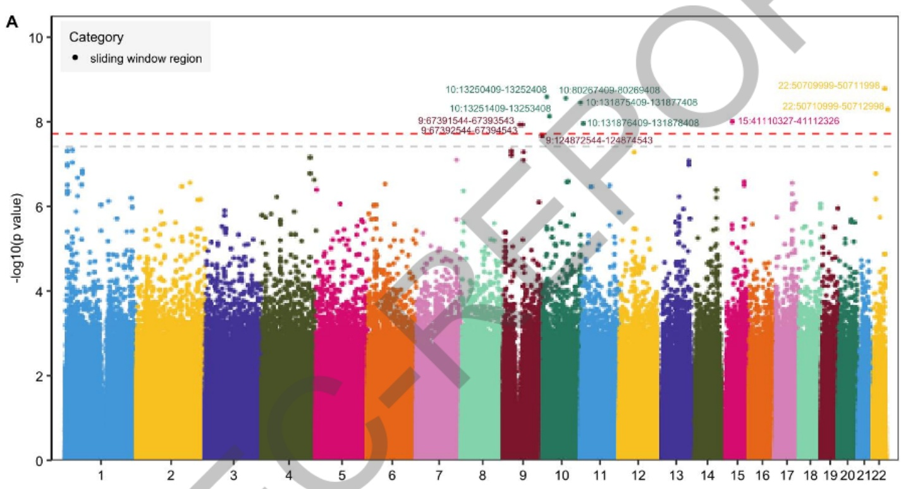

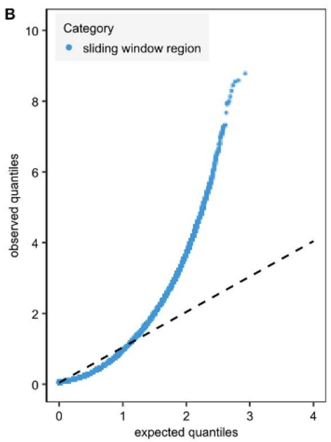

图 2-7 STAAR-O 模型基因组区域固定长度滑动窗口关联分析 Manhattan 和 QQ 图

附注:该图表示在基因组区域固定长度滑动窗口水平的STAAR-O模型关联分析结果图。图中相关图注信息与图 2-7 相同，sliding window=滑动窗口。

## 9.2 自适应动态窗口 RVAS 结果

为克服固定窗口在信号边界上的限制，本研究引入自适应动态窗口分析，以数据驱动方式灵活界定变异聚集区域，从而更有效捕获潜在功能性罕见变异簇。但考虑到动态窗口在变异稀疏或边界位置可能出现统计不稳定性，本研究进一步将其与固定窗口结果结合:即以滑动窗口的局部关联结果作为参考，验证动态窗口扫描结果的稳健性，两者互补可提高关联区域识别的全面性与可靠性。通过整合动态窗口的自适应扫描优势与固定窗口的稳健边界约束，更好地识别与AO相关的罕见变异关联区域。

结果显示，在全基因组范围内，动态窗口分析共识别到5个达到显著性阈值（GWER<0.05）的关联窗口，这些窗口分布于1、10、15和22号染色体，相关统计结果见表2-5。我们将位于窗口两侧±25kb范围内的最近基因标记为“附近基因”。在此框架下，1号染色体上新发现1个显著窗口与患者AO相关（chr1:6770706-6795171），其基因组位置落在CAMTA1基因的内含子区域，该区段未与滑动窗口分析鉴定的显著关联区域发生重叠或相邻，提示其可能代表一个仅在自适应窗口扫描框架下被捕获的候选信号，其稳定性和生物学意义仍需进一步验证。其余4个显著窗口均与滑动窗口分析所检测到的关联区段紧密相邻或高度重叠，包括:1）位于基因间区、邻近UCMA或PHYH基因的chr10:13251279-13256454 区段;2)PPP2R2D 基因附近的 chr10:131873324-131876490 区段；3）邻近 CHAC1或 INO80基因的 chr15:40961584-40962537区段；4）落在 SHANK3 基因内含子区域的chr22:50709609-50711993区段。动态窗口方法在这些区域中识别到与固定窗口一致的显著信号，且关联p值更显著，体现了其在界定变异聚集边界方面的自适应扫描优势（表2-4与2-5，图2-7）。

表2-5 自适应动态窗口关联分析全基因组显著性或提示性关联区域

| chr | start | end | variant | cMAC | GWER | p | category | OvlSliding | gene |
| --- | --- | --- | --- | --- | --- | --- | --- | --- | --- |
| 1 | 6770706 | 6795171 | 250 | 305.47 | 3.55E-2 | 1.73E-21 | dynamic window | no | intronic |
| 10 | 13251279 | 13256454 | 60 | 78. 15 | 1.50E-3 | 5.99E-24 | dynamic window | yes | intergenic |
| 10 | 131873324 | 131876490 | 40 | 37.05 | 3.25E-2 | 1.12E-21 | dynamic window | yes | intergenic |
| 15 | 40961584 | 40962537 | 40 | 30.53 | 2.25E-2 | 3.90E-22 | dynamic window | yes | intergenic |
| 22 | 50709609 | 50711993 | 40 | 50.04 | 3.85E-2 | 2.59E-21 | dynamic window | yes | intronic |

附注:表中相关注释信息与表2-4相同。

综上，分布于10、15和22号染色体上，由滑动窗口与自适应动态窗口两种独立策略共同识别的4个AO关联窗口，在多种分析下表现出稳定一致的信号，可作为本研究重点解析的候选基因组区域。

## 10）亲缘关系对关联分析影响评估结果

为系统评估样本间亲缘关系对全基因组关联分析结果的潜在影响，本研究在“保留全部样本并校正亲缘关系”和“剔除亲缘样本（PIHAT>0.2）”两种策略下，针对四类功能注释变异集合（基因编码区、非编码RNA基因、基因非编码调控区、滑动窗口）进行了关联检验，并绘制散点图直观展示两种策略下-1og10(p)值的分布与差异。分析显示，两种策略的关联结果高度一致，散点主要沿y=x对角线分布，仅有极少数点偏离且幅度较小，表明保留亲缘样本并进行校正未造成显著膨胀或过度校正导致功效损失。四类功能注释变异集合的 pearson 相关系数均大于 $0.80 (p < 2.2 E-16)$ ，提示不同亲缘处理策略下关联信号高度一致，且亲缘校正效果与变异功能类别无关(图2-8)。综上，保留亲缘样本并进行适当校正既能保证关联分析结果的稳定性和准确性，又可增加样本量，提高统计效能，是本研究发现队列中合理且有效的策略。

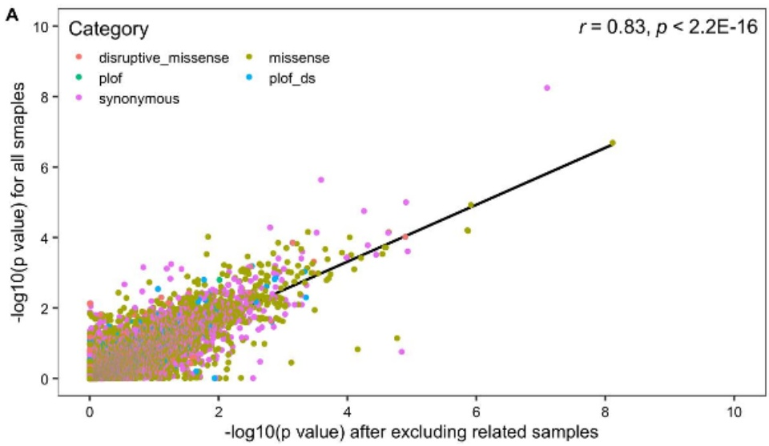

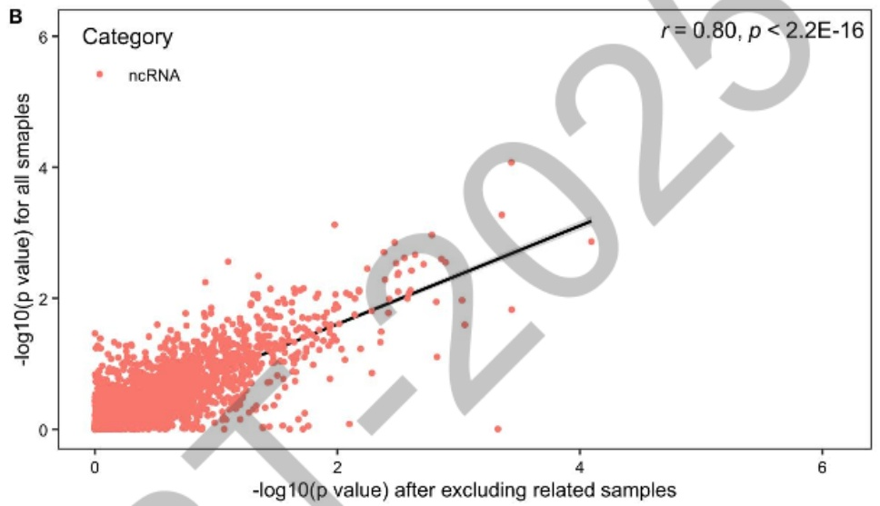

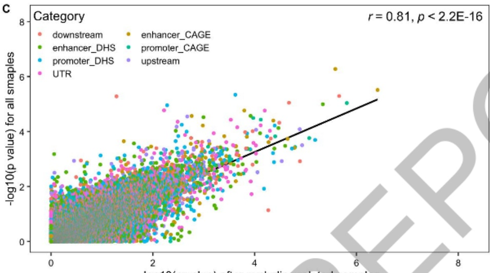

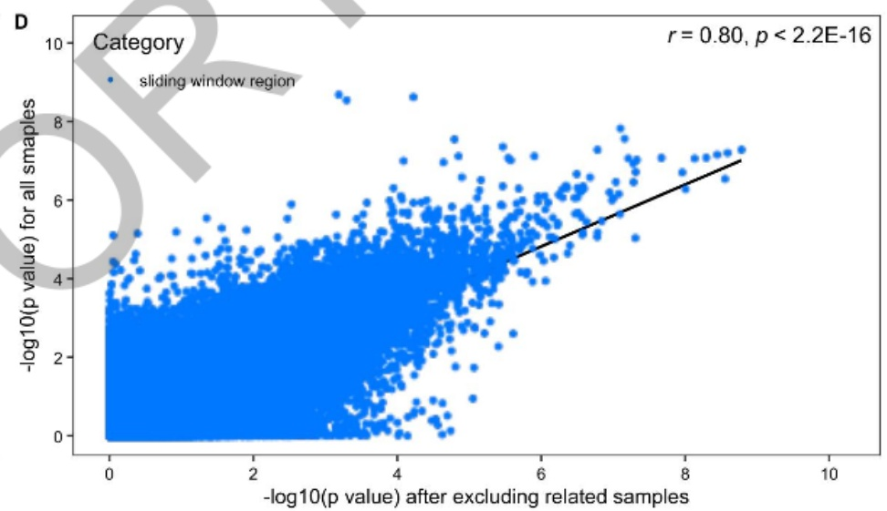

图2-8剔除亲缘样本前后不同功能注释变异集合全基因组罕见变异关联信号一致性

附注:该散点图展示了STAAR-O关联分析中剔除亲缘样本前后关联结果对比，分别对应以下四种情况:基因编码区（A）、非编码RNA基因（B）、基因非编码调控区（C）以及固定长度滑动窗口（D)。图中纵、横坐标分别表示分析前后关联显著性p值的-log10转换结果，数值越高表示关联越强。各图左上角给出皮尔逊相关系数r与双侧p值，所有r≥0.80、p<2.20E-16，提示剔除亲缘样本前后关联效应量估计高度一致。对角线表示y=x，点若落在此线上，说明剔除亲缘样本前后测到的显著性水平毫无差异，偏离越远，差异越大。点颜色按变异注释类别区分。

## 11）潜在关联基因验证结果

在发现队列中，本研究初步鉴定出13个可能影响SCA3患者AO的潜在关联基因。为评估这些信号的稳健性和重复性，我们在三个验证队列中对相应稀有变异集合进行了重复分析，并绘制p值热图和 cMAC热图直观展示结果。

在验证队列1（分类性状、极端表型样本）中，多个潜在关联基因的遗传关联信号得到有效验证。其中，PTER（p=0.03）、 $LMO7 (p = 0.02)$ $P M F B P I ( p = 0 . 0 2 )$ 、KRTAP10-4 $(p=2.55\mathrm{E}-03)$ 、SLC35F3 $(p=5.21\mathrm{E}-04)$ 、RALYL（p=0.03）基因均显示出与疾病AO的显著关联。cMAC 分析显示，LMO7、PMFBP1、KRTAP10-4和RALYL的稀有变异累积负荷较高（cMAC>10），表明这些基因在极端表型样本中具有明显稀有变异富集现象（图2-9与图2-10A）。

在验证队列2（连续性表型、非亲缘样本）中，大部分潜在关联基因的重复分析呈现出稳健且一致的遗传关联信号。除 PEX26 与 TUBA8 外，BMP5（p=5.14E-05）、PTER (p=3.60E-06)、LMO7（p=1.19E-05)、PMFBP1(p=2.04E-07)、KRTAP10-4（p=5.64E-09)、SLC35F3（p=3.06E-06）、ZNF165（p=5.28E-07）、RALYL（p=1.02E-05） 、TNFRSF19（p=5.10E-06）、MAPK8IP3（p=9.18E-06）、CALM3（p=7.40E-07 基因均表现出显著而稳定的关联效应。cMAC分析显示，RALYL、KRTAP10-4、PMFBP1和LMO7的累积等位基因负荷分别为119、85、53和77，进一步验证了这些基因稀有变异的累积效应（图2-9与图2-10B）。

在验证队列3中，潜在关联基因的关联结果进一步得到验证。PTER（p=0.05）、LMO7 (p=0.01）、PMFBP1（p=0.04）、KRTAP10-4（p=2.56E-04）、PEX26（p=0.08）、SLC35F3（p=6.51E-04）、RALYL（p=1.64E-03）均达到统计学显著水平。cMAC分析显示，LMO7、KRTAP10-4和 RALYL的累积等位基因负荷分别为52、59和67，提示这些基因在不同队列中均存在稀有变异聚集效应（图2-9与图2-10C）

综上，通过三个验证队列的重复分析，本研究确认了一个跨队列稳健的潜在关联基因集合，包括PTER、LMO7、PMFBP1、KRTAP10-4、SLC35F3和 RALYL。其p值显著性和cMAC 值在发现队列及各验证队列中表现一致，充分支持其在 SCA3 患者 AO遗传背景中的潜在作用。

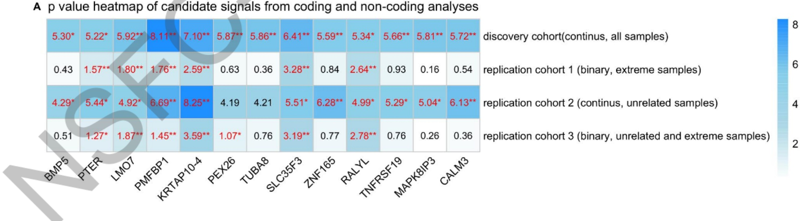

BcMAC heatmap of candidate signals from coding and non-coding analyses

| 10* | 11* | 86** | 50** | 123** | 54** | 48* | 20* | 15* | 147** | 17* | 27* | 10* | discovery cohort(continus, all samples) | 140 |
| --- | --- | --- | --- | --- | --- | --- | --- | --- | --- | --- | --- | --- | --- | --- |
| 9 | 8 | 72** | 33* | 87** | 23* | 20* | 14* | 11* | 83** | 15* | 18* | 7 | replication cohort 1 (binary, extreme samples) | 120 100 |
| 8 | 7 | 77** | 53** | 85** | 39* | 33* | 17* | 11* | 119** | 12* | 22* | 7 | replication cohort 2(continus, unrelated samples) | 80 |
| 6 | 6 | 52** | 25* | 59** | 15* | 12* | 11* | 8 | 67** | 9 | 14* | 6 | replication cohort 3 (binary, unrelated and extreme samples) | 60 40 |
| BMP5 | PTER | LMO7 | PMFBP1 | KRTAP10-4 | PEX26 | TUBA8 | SLC35F3 | ZNF165 | RALYL | TNFRSF19 | MAPK8IP3 | CALM3 |  | 20 |

## 图 2-9 发现队列鉴定的潜在关联基因在三个验证队列中的关联p 值热图和 cMAC 值热图

附注:该图分别展示了发现队列鉴定的潜在关联基因在三个验证队列中的关联p值热图（A）和cMAC值热图（B）。图A和图B中四行分别代表:发现队列（连续性状，全样本），验证队列1（二分类性状，极端表型样本），验证队列2（连续性状，非亲缘样本），验证队列3（二分类性状，非亲缘且极端表型样本）。对于发现队列，基因编码区关联分析显著性阈值为0.05/13,859=3.61E-06，提示性阈值为 0.1/13,859=7.22E-06；非编码 RNA 基因关联分析显著性阈值为 0.05/3,617=1.38E-05，提示性阈值为0.1/3,617=2.76E-05；基因非编码调控区分析显著性阈值为 0.05/17,449=2.87E-06， 提示性阈值为0.1/17,449=5.73E-06。对于验证队列1与3，关联分析显著性阈值为0.05，提示性阈值为0.1。对于验证队列2，基因编码区关联分析显著性阈值为 0.05/12,189=4.10E-06，提示性阈值为1/12,189=8.20E-05；非编码 RNA 基因关联分析显著性阈值为 0.05/3,199=1.56E-05，提示性阈值为 1/3,199=3.13E-04；基因非编码调控区分析显著性阈值为0.05/17,333=2.88E-06，提示性阈值为1/17,333=5.77E-06。图中展示了来自两类关联分析的潜在关联基因。其中，PTER、LMO7、PMFBP1、KRTAP10-4、PEX26、TUBA8来源于基因编码区关联分析，其p值显著性判定参照编码区分析的检验阈值标准。此外，SLC35F3、ZNF165、RALYL、TNFRSF19、MAPK8IP3、CALM3来源于基因非编码调控区关联分析，其p值显著性则参照非编码区分析的检验阈值标准。A图中颜色深浅表示关联检验p值显著性，颜色越深表示显著性越强。文本框中数字表示p值大小，\*\*表示p值满足显著性阈值设定，\*表示p值满足提示性阈值设定，未标记表示p值不满足显著性或提示性阈值设定。B图中颜色深浅表示潜在关联基因相应变异集合其总次要等位基因计数大小，颜色越深表示cMAC值越大。文本框中数字表示cMAC值大小，\*\*表示潜在关联基因相应变异集合其总次要等位基因计数 cMAC值≥50，\*表示 cMAC 值≥10，未标记表示 cMAC 值<10。

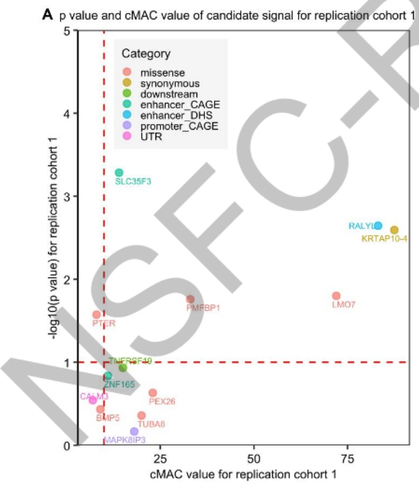

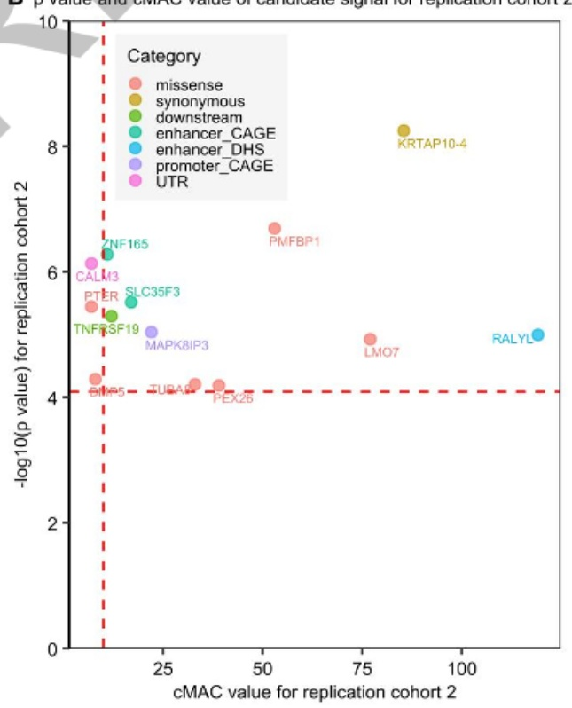

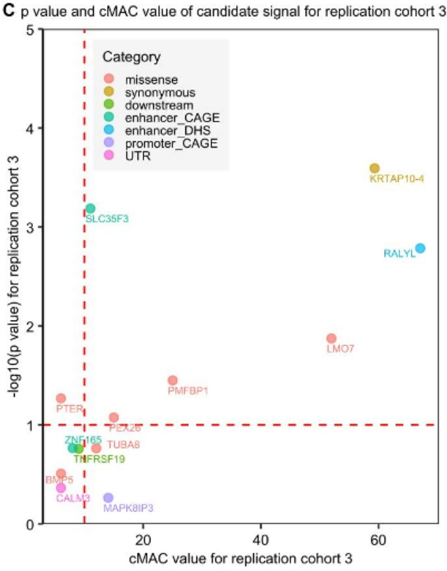

图2-10发现队列鉴定的潜在关联基因在三个验证队列中关联分析结果

附注:该图分别展示了发现队列鉴定的潜在关联基因在三个验证队列中的关联结果，图A、图B和图C分别代表验证队列1（二分类性状，极端表型样本），验证队列2（连续性状，非亲缘样本），验证队列3（二分类性状，非亲缘且极端表型样本）。图中红色水平虚线分别代表各个队列提示性关联阈值水平，红色垂直虚线表示cMAC等于10。其余相关的图注信息详细见图2-9。

## 12）潜在关联基因组区域验证结果

在发现队列中，本研究通过固定长度滑动窗口与自适应动态窗口联合策略，鉴定出四个可能与SCA3患者AO相关的潜在基因组区域，分别位于染色体10、15和22的特定区段。为评估这些候选区域的稳健性，我们在三个验证队列中对相应区域进行滑动窗口分析，并通过p值和 cMAC 值热图进行可视化。 1

验证队列1（针对分类性状及极端表型样本）成功验证了大部分候选区域的关联信号。除15号染色体上的候选关联区域外，10号与22号染色体上的其他三个潜在关联基因组区域在均显示可显著影响 SCA3患者 AO，包括:1）邻近 UCMA或PHYH基因的chr10:13251279-13256454区域，对应的验证窗口为chr10:13250409-13252408（p=0.01）和chr10:13251409-13253408（p=0.01）；2）PPP2R2D基因附近的 chr10:131873324-131876490区域，对应的验证窗口为 chr10:131875409-131877408 （p=0.03 ）和chr10:131876409-131878408(p=0.04);3)SHANK3基因内含子区的chr22:50709609-50711993区域，对应的验证窗口为 chr22:50709999-50711998（p=1.01E-03 ）和chr22:50710999-50712998（p=1.96E-03）。此外，这些关联基因组区域的 cMAC值均高于30，提示这些区域的稀有变异在极端表型样本中具有明显累积效应（图2-11与图2-12A）。

在验证队列2（连续性状、非亲缘样本）中，同样除15号染色体的潜在关联基因区域外，其余三个基因组区域依然展现出稳健的关联信号，p值均远低于严格校正的提示性关联阈值（1/2,615,346=3.82E-07 具体来看，邻近UCMA或PHYH基因的chr10:13251279-13256454区段，在对应的2个滑动窗口中均呈现高度显著的p值（p值分别为 6.36E-08和 8.82E-08）。类似地，在 PPP2R2D基因附近的 chr10:131873324-131876490区段对应的2个滑动窗口（p值分别为7.04E-08和1.99E-07），也显示与患者AO相关，此外。SHANK3 基因内含子区的 chr22:50709609-50711993 区域也在验证窗口(p = 8.39E-08)中显示出关联统计学信号。这些结果说明，即便排除了亲缘影响，这些区域的稀有变异仍然对 SCA3 患者 AO具有修饰效应（图 2-11 与图 2-12B）。

在验证队列3（分类性状、非亲缘极端表型样本）中，由于亲缘关系或极端值限制，仅邻近 UCMA 或 PHYH 基因的 chr10:13251279-13256454 区域显示与 AO 相关，对应的验证窗口为 chr10:13250409-13252408（p=0.04）和 chr10:13251409-13253408（p=0.04）。而10号染色体上的另一个潜在关联基因组区域（PPP2R2D基因附近的chr10:131873324-131876490区域）以及15号染色体上SHANK3基因内含子区的chr22:50709609-50711993区域未显示出与A0的关联。此外，22号染色体上潜在关联基因组区域未检测到相关变异，其 cMAC值为0，但其他区域 cMAC值仍维持在较高水平(27-36），说明潜在关联基因组区域内的稀有变异在非亲缘极端表型样本中的累积趋势仍然存在（图2-11与图2-12C）。

总体来看，通过三个验证队列重复分析，发现队列鉴定的潜在关联基因组区域中，基因间区且邻近 UCMA 或PHYH基因的 chr10:13251279-13256454 区段；PPP2R2D基因周围的 chr10:131873324-131876490 区段；SHANK3内含子区的 chr22:50709609-50711993 区段在至少两个验证队列中表现出稳健的关联信号。p值热图和cMAC热图显示这些区域稀有变异累积负担普遍较高，提示其可能在 SCA3 患者AO的遗传背景中发挥潜在作用。

A p value heatmap of candidate signals from sliding window analyses

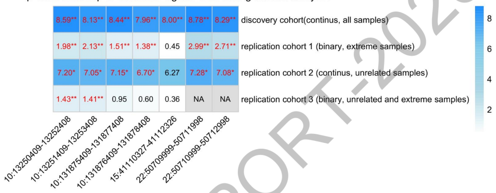

B cMAC heatmap of candidate signals from sliding window analyses

| 131** | 55** | 47* | 42* | 57* | 99** | 88** |
| --- | --- | --- | --- | --- | --- | --- |
| 49* | 38* | 37* | 33* | 38* | 69** | 61** |
| 94** | 46* | 34* | 33* | 44* | 72** | 64** |
| 36* | 30* | 29* | 27* | 31* | NA | NA |

图 2-11 发现队列鉴定的潜在关联基因组区域在三个验证队列中的关联p 值热图和 cMAC 值热图附注:该图分别展示了发现队列鉴定的潜在关联基因区域在三个验证队列中的关联p值热图（A）和cMAC值热图（B）。图A和图B中四行分别代表:发现队列（连续性状，全样本），验证队列1（二分类性状，极端表型样本），验证队列2（连续性状，非亲缘样本），验证队列3（二分类性状，非亲缘且极端表型样本）。对于发现队列，滑动窗口关联分析显著性阈值为0.05/2,603,346=1.92E-08，提示性阈值为0.1/2,603,346=3.84E-08；对于验证队列1与3，关联分析显著性阈值为0.05，提示性阈值为0.1。对于验证队列2，基因编码区关联分析显著性阈值为0.05/2,591,215=1.93E-08，提示性阈值为1/2,591,215=3.86E-07。A图中颜色深浅表示关联检验p值显著性，颜色越深表示显著性越强。文本框中数字表示p值大小，\*\*表示p值满足显著性阈值设定，\*表示p值满足提示性阈值设定，未标记表示p值不满足显著性或提示性阈值设定。B图中颜色深浅表示潜在关联基因相应变异集合其总次要等位基因计数大小，颜色越深表示cMAC值越大。文本框中数字表示cMAC值大小，\*\*表示潜在关联基因相应变异集合其总次要等位基因计数 cMAC 值≥50，\*表示 cMAC 值≥10，未标记表示 cMAC 值<10。

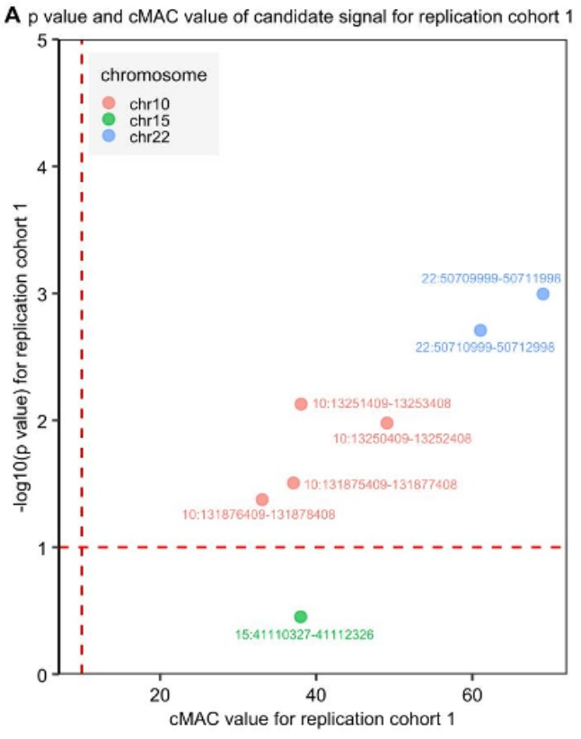

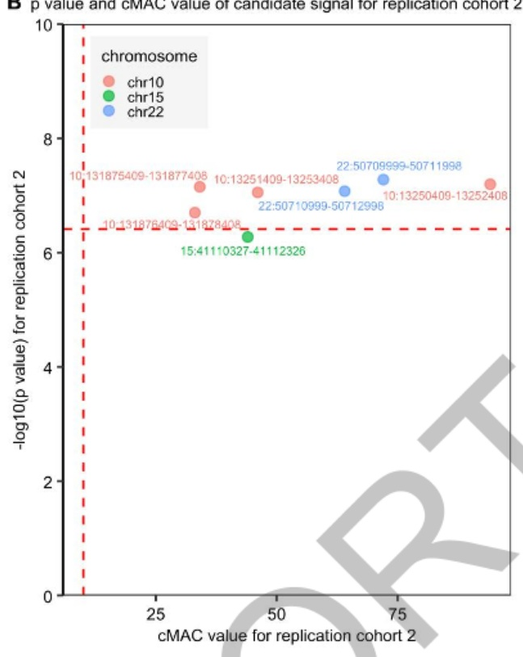

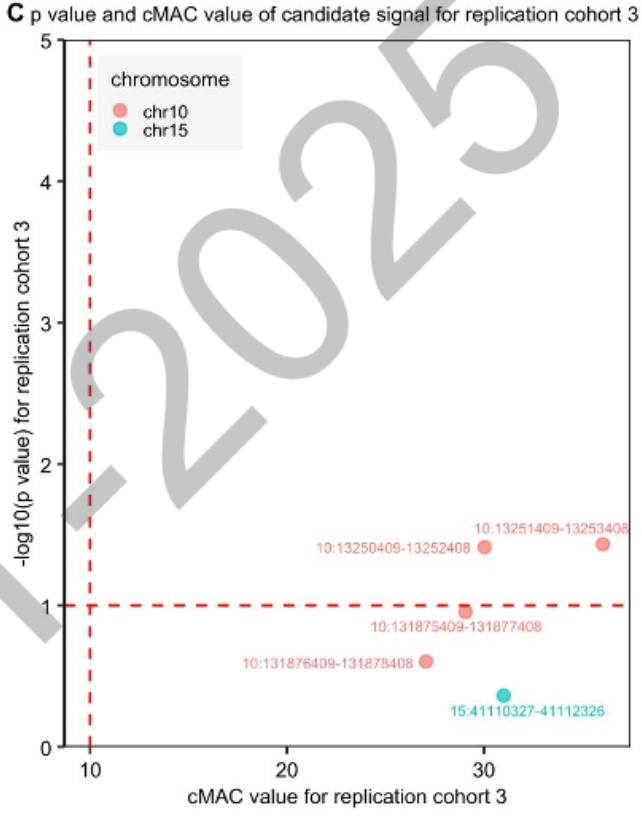

图2-12 发现队列鉴定的潜在关联基因区域在三个验证队列中关联分析结果

附注:该图分别展示了发现队列鉴定的潜在关联基因组区域在三个验证队列中的关联结果，图A、图B和图C分别代表验证队列1（二分类性状，极端表型样本），验证队列2（连续性状，非亲缘样本)，验证队列3（二分类性状，非亲缘且极端表型样本）。对于验证队列1与3，关联分析显著性阈值为0.05，提示性阈值为0.1。图中红色水平虚线分别代表各个队列提示性关联阈值水平，红色垂直虚线表示cMAC等于10。其余相关的图注信息详细见图2-11。

## 13）候选基因关联分析研究结果

基于候选基因研究策略，本研究在发现队列中应用STAAR-O方法评估24个潜在修饰基因的稀有变异负荷及关联显著性。分析显示，各候选基因稀有变异在功能注释类别间分布不均，调控区（enhancer\_DHS、UTR、enhancer\_CAGE、promoter\_DHS、promoter\_CAGE）变异累积普遍高于蛋白编码区，其中DIDO1（enhancer\_DHS，cMAC=757.61）、UBR5（enhancer DHS，cMAC=596.35）和 PARD3（enhancer DHS，cMAC=582.33）负荷最高。相比之下，蛋白编码区的潜在功能破坏性变异发生率较低（cMAC通常<20），部分基因如 DLGAP2、HERC2P10未检测到稀有变异，FAN1 仅在 UTR区存在少量变异（cMAC≈5)，可能限制了关联信号的统计检出能力（图2-13）。

在发现队列的 STAAR-O关联显著性分析中，CFAP57是唯一在多个注释类别中达到提示性关联阈值水平（0.1/24=4.17E-03）的基因。该基因的罕见同义变异（p=3.45E-03）、promoterDHS（2.41E-03）、enhancerCAGE（2.83E-03）和 UTR（3.91E-03）罕见变异集合均表现出提示性关联，同时这些集合的cMAC亦处于中高水平（范围约17-68）。同时，plof(cMAC=2.00, p=7.50E-03)、promoterCAGE(cMAC=6, p=0.01)、plofds(cMAC=4.01, $p = 0.05$ 罕见变异集合也显示关联趋势。在随后对三个验证队列的重复分析中，CFAP57的稀有变异集合也表现出一定的稳健性和一致性（表2-6，图2-13）。 1

此外，PARD3、CERS4、MSH3、ITGB1、DHFR、TRIM29、LIG1、DIDO1等候选基因特定功能注释类别的罕见变异也显示出与AO的关联趋势（p<0.05）。例如，PARD3的enhancer\_DHS 区域(cMAC=582.33, p=0.01)、CERS4 的 UTR 区域(cMAC=62.13,p=0.01)、ITGB1的 enhancer\_DHS 区域（cMAC=340.16，p=0.02）累积较高的罕见变异，并显示与AO具有潜在关联，提示其调控区变异可能参与AO的调节。MSH3在多个功能注释变异集合内均呈潜在关联趋势，包括 missense（cMAC=65.20，p=0.02）、disruptive\_missense (cMAC=17.00,p=0.03)、plof\_ds(cMAC=18.00, p=0.03)、promoter\_CAGE(cMAC=22.23, $p = 0.03$ 以及 synonymous（cMAC=9.08，p=0.04），提示其调控区及蛋白功能区的罕见变异可能通过多种机制影响 AO（表2-6，图2-13）。

A

p value by candidate gene and functional category for discovery cohort

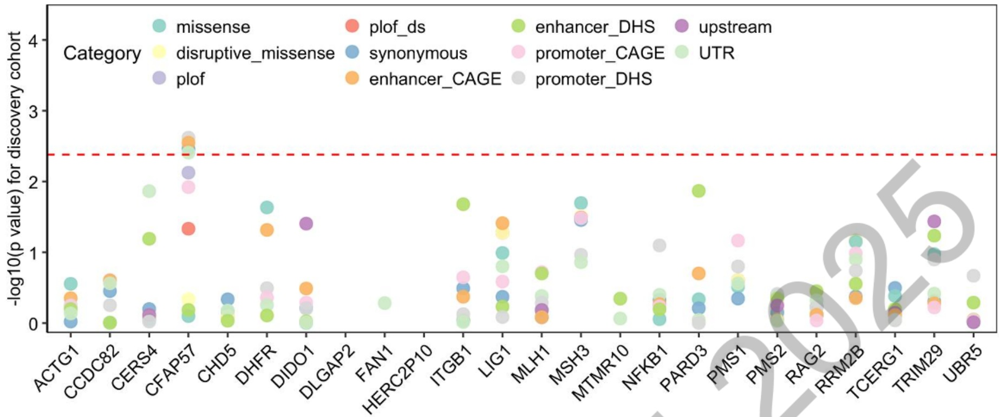

B

cMAC by gene and functional category for discovery cohort

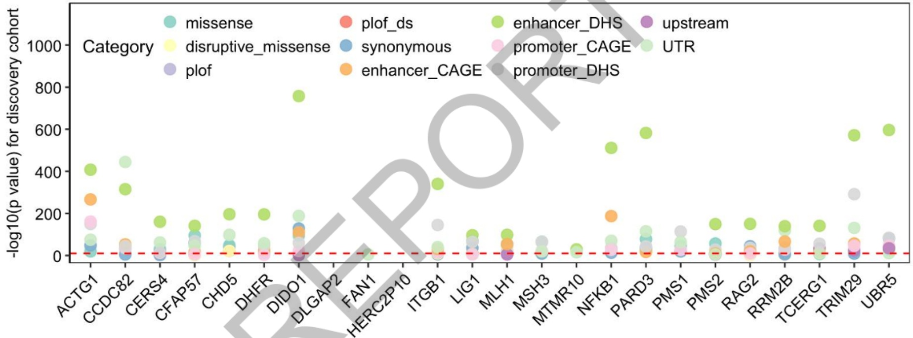

图2-13候选基因在发现队列的关联检验结果结果

附注:图 A、图 B 分别代表发现队列中 24 个候选基因关联 p 值与 cMAC 结果。图 A 中红色水平虚线表示提示性关联阈值（0.1/24=4.17E-03），图 B 中红色水平虚线表示 cMAC等于10。

表 2-6 CFAP57候选基因在四个队列的关联分析结果

| gene | category | SNV | cMAC | p value | cohort |
| --- | --- | --- | --- | --- | --- |
| CFAP57 | synonymous | 17 | 60.03 | 3.45E-03* | discovery cohort |
| CFAP57 | enhancer_CAGE | 8 | 17.01 | 2.83E-03* | discovery cohort |
| CFAP57 | promoter_DHS | 31 | 68.06 | 2.41E-03* | discovery cohort |
| CFAP57 | UTR | 17 | 47.00 | 3.91E-03* | discovery cohort |
| CFAP57 | synonymous | 13 | 24.01 | 6.52E-04** | replication cohort 1 |
| CFAP57 | enhancer_CAGE | 6 | 14.01 | 6.92E-03* | replication cohort 1 |
| CFAP57 | promoter_DHS | 23 | 48.05 | 6.72E-03* | replication cohort 1 |
| CFAP57 | UTR | 15 | 34.00 | 1.08E-02 | replication cohort 1 |
| CFAP57 | synonymous | 16 | 27.01 | 7.13E-04** | replication cohort 2 |
| CFAP57 | enhancer_CAGE | 7 | 11.00 | 8.01E-03* | replication cohort 2 |
| CFAP57 | promoter_DHS | 28 | 53.04 | 8.11E-03* | replication cohort 2 |
| CFAP57 | UTR | 16 | 34.00 | 1.64E-03* | replication cohort 2 |
| CFAP57 | synonymous | 12 | 19.01 | 0.03 | replication cohort 3 |
| CFAP57 | enhancer_CAGE | 5 | 9.01 | 0.08 | replication cohort 3 |

续表2-6 CFAP57候选基因在四个队列的关联分析结果

| CFAP57 | promoter_DHS | 19 | 35.02 | 0.06 | replication cohort 3 |
| --- | --- | --- | --- | --- | --- |
| CFAP57 | UTR | 15 | 26.00 | 7.41E-03* | replication cohort 3 |

附注:此表展示了CFAP57候选基因在四个队列的罕见变异关联分析结果，p value为 STAAR-O关联分析结果。表中黑色粗体表示与AO具有提示性或显著性关联。\*\*表示满足候选基因水平显著性关联阈值（0.05/24=2.08E-03），\*表示满足候选基因水平提示性关联阈值（0.1/24=4.17E-03）。

总体来看，候选基因的调控区普遍存在较高的稀有变异累积，而蛋白编码区潜在功能破坏性变异发生率较低。在候选基因中，CFAP57是唯一在多个注释类别中同时呈现高变异负荷和统计关联的基因，可能在 SCA3 患者 AO 中发挥关键修饰作用。PARD3、CERS4、MSH3、ITGB1、DHFR、TRIM29、LIG1和 DIDO1的特定调控区或UTR变异也显示潜在关联趋势，提示其稀有变异可能通过调控基因表达或蛋白功能影响发病时间。DLGAP2、HERC2P10和FAN1的罕见变异检出率极低，可能限制了其关联分析效能。

## 14）潜在关联基因组织表达结果

为了评估发现队列中鉴定的14个潜在关联基因在神经系统中的功能(包括RVAS研究鉴定的13个基因及候选基因水平鉴定的1个潜在修饰基因CFAP57），本研究分析了这些基因在不同组织和脑区的中位 TPM表达量。整体来看，除 KRTAP10-4外，其他基因在脑组织中均可检测到表达，提示其可能在中枢神经系统发挥作用。CALM3在脑区和非脑组织中均表现为高水平表达，尤其在皮层和小脑最为显著；PTER、LMO7、TUBA8、PEX26、SLC35F3和MAPK8IP3 在多个脑区中呈均衡且稳定的表达；RALYL在小脑及小脑半球中表达突出，提示可能在小脑相关神经功能中具有特殊作用；PMFBP1与CFAP57在脑区整体表达较低，但在小脑等关键区域仍可检测，显示潜在局部功能；KRTAP10-4在脑区表达几乎处于基线水平（图2-14）。

B

A

comparison of gene expression in brain vs non-brain tissues

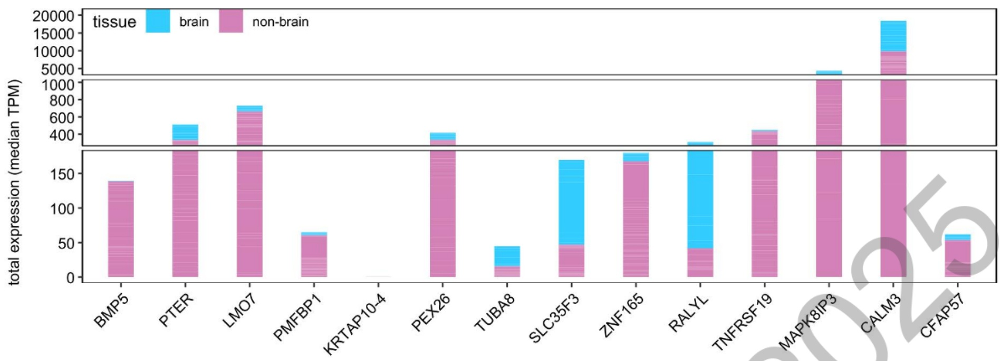

gene expression in brain tissues

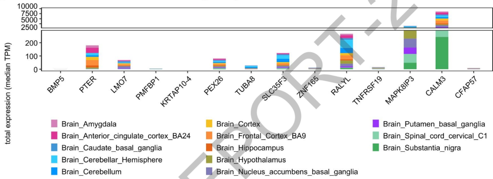

图2-14 潜在关联基因组织表达结果

附注:图A（左）汇总比较了潜在关联基因在“全部脑组织”与“全部非脑组织”中的整体表达差异:蓝色箱形图代表脑组织，红色箱形图代表非脑组织；纵轴为标准化后的基因表达量。图B（右）进一步展示该基因在不同脑区的表达分布，每个颜色对应一个具体脑区，箱形图汇总了对应区域内相应基因的表达水平。

## 15）潜在关联基因组区域内邻近基因组织表达结果

为进一步探讨潜在关联基因组区域对 SCA3 患者AO的可能影响，本研究分析了四个关键潜在关联区域邻近基因的组织表达情况。chr10:13251279-13256454区段邻近UCMA与PHYH基因，其中UCMA在脑组织及非脑组织表达均较低，而PHYH在小脑、皮层等SCA3相关脑区表达显著，提示其可能为该区域的关键修饰基因。chr10:131873324-131876490区段邻近PPP2R2D基因，其在脑组织中差异显著，尤其在小脑及小脑半球形成表达峰值，提示其可能在小脑神经功能及SCA3发病中发挥作用。chr15:40961584-40962537 区段邻近 CHAC1与 INO80基因，其中 INO80在小脑及相关区域的表达明显高于其他脑区，可能在小脑功能调控及病理过程中具有关键意义。

chr22:50709609-50711993区段位于SHANK3内含子区，该基因在小脑及相关结构中表达较高，提示其可能参与小脑功能维持和 SCA3发病机制（图2-15）

总体来看，PHYH、PPP2R2D、INO80和SHANK3在小脑及相关脑区的高表达特征，提示这些基因可能在SCA3发病机制中发挥重要作用，为解析潜在关联基因组区域功能、风险监测及个性化治疗策略提供了重要线索。

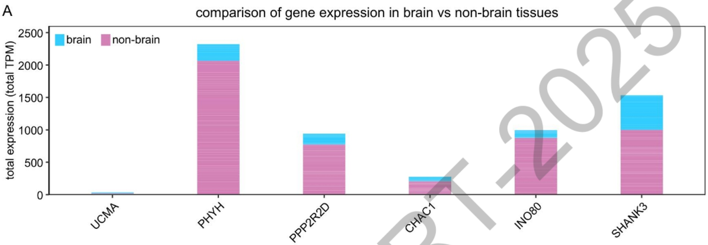

gene expression in brain tissues

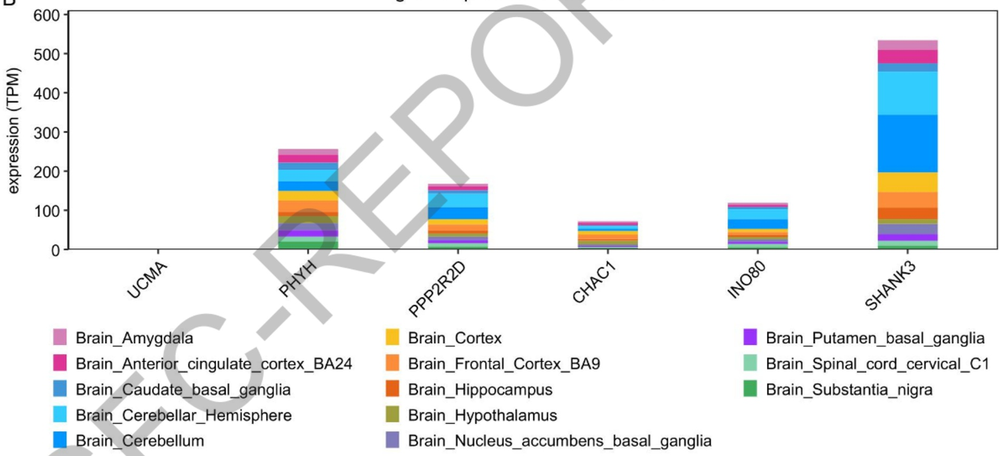

图2-15 潜在关联基因组区域内邻近基因组织表达结果

附注:图A（左）比较了潜在关联基因组区域邻近基因在脑组织与非脑组织中的整体标准化表达量（蓝色为脑组织，红色为非脑组织）。图B（右）展示了这些基因在不同脑区的表达分布，不同颜色对应各脑区，箱形图表示该区域内的表达水平。

## 16）关联基因与基因组区段最终鉴定结果

## 16.1 关联基因最终鉴定结果

在发现队列中，本研究通过STAAR-O对全基因组罕见变异集合进行关联分析，旨在识别可能影响SCA3患者AO的潜在修饰因素，并在三个验证队列中评估其可重复性。同时，通过候选基因研究，分析了24个可能修饰基因与AO的遗传关联，并结合GTEx数据评估潜在关联基因及邻近基因在脑组织中的表达模式，以筛选具有中枢神经系统调控潜力的修饰基因。

结果显示，PTER、LMO7、PMFBP1的错义变异集合，KRTAP10-4的非同义变异集合，SLC35F3 的 enhancer CAGE 变异集合，以及 RALYL 和 CFAP57 的 enhancer DHS 变异集合，在发现队列和验证队列中均对AO显著影响，验证了关联信号的稳健性。候选基因分析进一步显示，CFAP57在多个注释类别中呈现高变异负荷和显著关联。GTEx数据表明，PTER、LMO7、PMFBP1、SLC35F3、RALYL 和 CFAP57在脑组织中均有表达，而KRTAP10-4 在脑组织中几乎未检测到表达。结合SCA3主要受中枢神经系统影响的特征， 前五个基因被确认具有潜在修饰作用，而KRTAP10-4被排除（图2-16）。

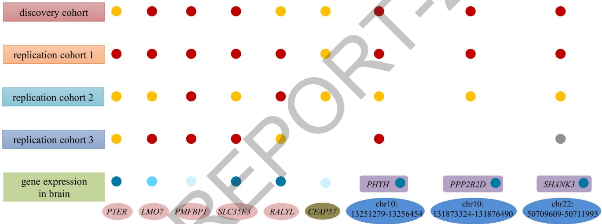

图2-16关联基因及基因组区段的最终鉴定结果

附注:第一行和第三行分别表示发现队列与复制队列2中，以连续性状作为表型进行关联分析后鉴定的基因或基因组区段在全基因组水平上的关联结果。黄色圆点表示达到提示性关联阈值（p< 0.1/n），红色圆点表示达到显著性关联阈值(p < 0.5/n)，n表示纳入分析的基因总数第二行和第四行分别表示复制队列1与复制队列3中，以分类性状作为表型进行关联分析后鉴定的基因或基因组区段在名义显著性水平上的关联结果，黄色圆点表示提示性关联（p<0.1），红色圆点表示名义显著性关联（p <0.05）。第五行表示关联基因或基因组区段内邻近基因在脑组织中的表达情况。圆点颜色深浅表示脑组织表达量水平（以TPM表示）:TPM>100为深蓝色，TPM<50为浅蓝色，介于二者之间为中等蓝色。图中列出了在小脑中相对高表达的基因组区段邻近基因。CFAP57为候选基因水平鉴定的关联基因，其余为RVAS鉴定的关联基因或基因组区域

综上，PTER、LMO7、PMFBP1、SLC35F3、RALYL和 CFAP57 可能是SCA3 患者AO的潜在修饰基因，为后续功能验证、分子机制研究及干预策略提供了候选靶点。

## 16.2 关联基因组区域最终鉴定结果

在发现队列中，本研究结合固定长度滑动窗口和自适应动态窗口策略，对全基因组罕见变异进行 STAAR-O关联分析，以识别可能影响SCA3患者AO的潜在基因组区域。筛选出的候选区域在三个独立验证队列中进一步采用固定长度滑动窗口分析以评估稳健性。

结果显示，chr10:13251279-13256454区域在所有验证队列中均显著影响AO，邻近PHYH基因在小脑、皮层等SCA3相关脑区高表达，提示其可能为关键修饰基因。PPP2R2D附近的 chr10:131873324-131876490 区域在两个验证队列中显著关联 AO，同时 PPP2R2D在小脑高表达暗示在小脑功能及 SCA3发病中具有潜在作用。SHANK3内含子区chr22:50709609-50711993 区域在验证队列中也被复制，且 SHANK3在小脑及相关结构中高表达提示可能参与小脑神经功能调节及SCA3发病机制。相比之下，chr15:40961584-40962537 区域邻近 CHAC1/INO80基因未在验证队列中复制，未显示显著效应（图2-16）。

综上，以下基因组区域可能是影响SCA3患者AO的潜在修饰因素:chr10:13251279-13256454 区段，邻近 PHYH 基因可能是该区域影响 SCA3 的主要修饰基因；chr10:131873324-131876490 区段，附近的 PPP2R2D 基因可能是该区域影响 SCA3 患者 AO 的核心调控基因；chr22:50709609-50711993 区段，位于 SHANK3 基因内含子区，可能通过影响 SHANK3 基因的功能在 SCA3 的发病机制中发挥关键调控作用。

## 17）鉴定的关联基因与关联基因组区域变异对发病年龄的影响结果

## 17.1 鉴定的关联基因变异对发病年龄的影响结果

基于RVAS与候选基因关联策略（发现队列与验证队列多队列检验），结合GTEx基因表达分析，本研究发现 PTER、LMO7、PMFBP1基因的罕见错义变异，SLC35F3基因enhancer CAGE 变异，以及 RALYL 和 CFAP57 基因的 enhancer DHS 变异影响 SCA3 患者AO。为展示这些修饰基因变异对AO的影响模式，本研究在发现队列中比较了携带与非携带相关变异患者的AO残差及AO残差绝对值，并绘制云雨图直观展示分布。此外，根据AO残差将患者分为早发组、中间组和迟发组，分析每组变异携带频次。

PTER。携带PTER错义变异患者AO残差为-7.75±13.06年（中位数-2.85，四分位距-15.27\~0.44），非携带者为 $0 . 0 7 { \pm } 6 . 6 2$ 年（中位数0.32，四分位距-3.68\~4.52），差异显著$(p1 = 0.05)$ ，携带者表现早发倾向。A0残差绝对值携带组10.86±10.33年，非携带组$5 . 0 3 { \pm } 4 . 3 0$ 年 $(p2 = 0.07)$ ），显示携带组个体间存在差异（表2-7，图2-17A与B）。校正$\mathrm { C A G } _ { \mathrm { e x p } }$ 后，线性回归显示提前约7.86年（SE=2.03，t=-3.87， $p1=1.16E-04$ ，协方差分析同样显著 $\mathrm{F}=14.95,\ \mathrm{p}2=1.16\mathrm{E}-04$ （表2-8）。在基于AO残差的分组频次分析中，无论采用1:3:1比例分组，还是采用三等分分组，携带者在早发组中的比例均略高于非携带者，但两种分组方式的组间差异均未达到显著 $(pI{=}0.08$ 和 $p2=0.41$ （表2-9）。这可能与携带者总体数量较少有关，尽管其效应明确但携带者频率较低，但难以在分组频次层面获得统计显著性。（表2-9），整体来看，PTER错义变异的携带人数较少，各变异的携带人数多为1-2人，主要由chr10:16511117:G:A这一变异贡献（携带人数为4），且该变异仅出现在早发组中（图2-17C）。

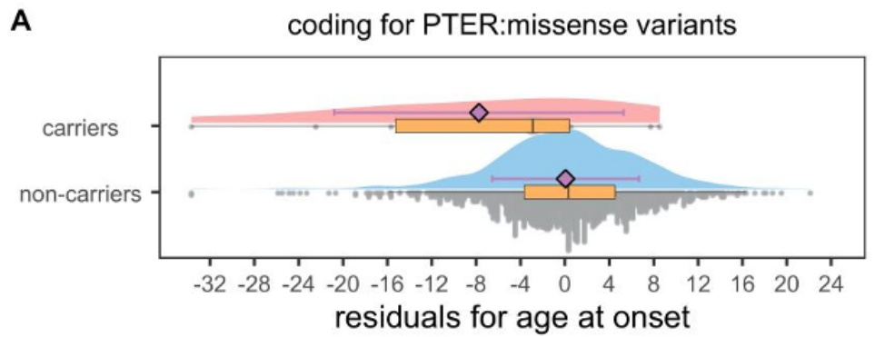

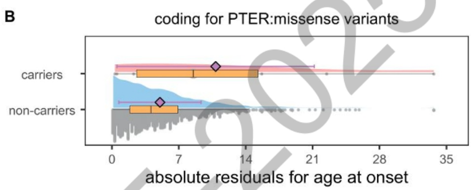

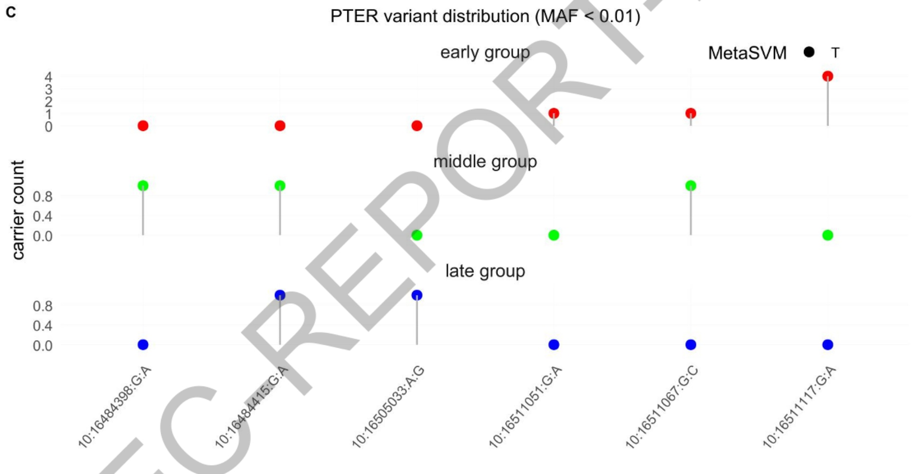

图 2-17 PTER 基因编码区罕见错义变异携带者 AO 残差特征及变异分布图

附注:图A为PTER基因编码区罕见错义变异（MAF<0.01）携带者与非携带者AO残差云雨图。图B展示了携带者与非携带者两组患者AO残差绝对值的云雨图，以评估AO残差偏离程度的组间差异。图A和图B中黄色箱线图表示携带者与非携带者两组四分位数分布情况，紫色菱形符号表示均值，其两侧的水平线表示均值±1倍标准差的范围，用于体现数据集中趋势与离散程度。图C显示PTER基因编码区罕见错义变异在AO残差三等分分组（早发组、中间组、晚发组）中的分布特征。横坐标为在发现队列中鉴定到的罕见错义变异，每个变异以棒棒糖图（1ollipop）表示。颜色代表不同的分组:红色为早发组、绿色为中间组、蓝色为晚发组。上、中、下三部分分别对应三个分组中变异携带者的数量。棒棒糖的形状表示MetaSVM 软件的预测结果，●T表示可容忍（tolerable），▲D表示有害（damaging)），◆M表示该变异未被MetaSVM收录，功能预测结果未知。

LMO7。LMO7基因错义变异的分析显示，携带者的AO残差为-2.19±8.25年（中位数-1.45，四分位距约-4.76\~2.53），而非携带者为0.15±6.59年（中位数0.32，四分位距约-3.67\~4.67)，两组间AO残差存在显著差异 $(pI = 0.01) \circ  AO$ 残差绝对值差异不显著 $(p2=0.90)$（表2-7，图2-18A、B）。校正 $\mathrm { C A G } _ { \mathrm { e x p } }$ 后，携带变异AO提前约2.34年 $\left(  SE =0.77,  t =-3.06 \right)$ $p1=2.30\mathrm{E}-03$ ），协方差分析显著（F=9.34，p2=2.30E-03）（表2-8）。AO残差分组分析显示，早发组携带比例高于迟发组 $(pI=0.04,p2=0.14)$ ，早发组富集明显(表2-9，图2-18C)。

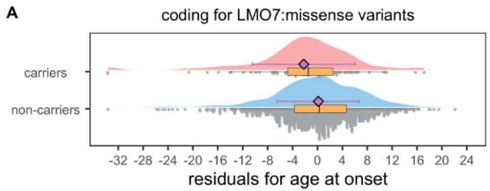

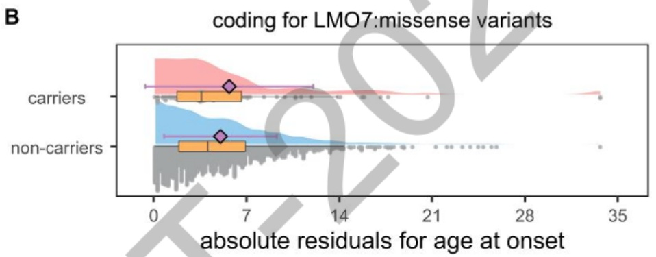

LMO7 variant distribution (MAF < 0.01)

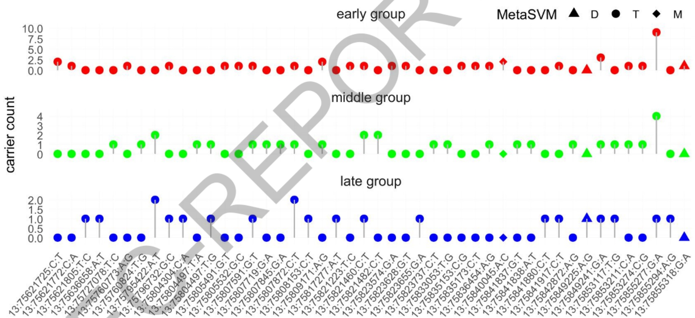

图 2-18 LMO7 基因编码区罕见错义变异携带者 AO 残差特征及变异分布图

附注:图A展示了LMO7基因编码区罕见错义变异（MAF<0.01）携带者与非携带者的AO残差分布云雨图。 图B 显示两组患者AO残差绝对值的云雨图比较。图C示意LMO7基因编码区罕见错义变异在AO残差三等分分组（早发组、中间组、晚发组）中的分布情况。其余相关图注信息详见图2-16。

PMFBP1。PMFBP1基因错义变异携带者与非携带者间的AO残差仅呈现趋势而未达显著（携带组:-1.88±8.64年，中位数-1.26，四分位距约-5.02\~2.30；非携带组: $0 . 0 8 { \pm } 6 . 6 3$年，中位数0.32，四分位距约-3.68\~4.53；p2=0.10）。A0残差绝对值在两组之间也无显著差异 $(p2=0.56)$ （表2-7，图2-19A与B）。然而，在校正 $ATXN3-CAG_{exp}$ 重复次数后，线性回归与协方差分析均揭示其独立效应:回归分析显示携带该变异可导致AO提前约

1.96年（SE=0.97，t=-2.02，p1=0.04），协方差分析同样得到显著结果（F=4.07，p2=0.04）。这一结果确认了PMFBP1作为 SCA3患者AO修饰基因的地位（表2-8）。此外，在基于AO残差均分为三组的分析中，PMFBP1错义变异在早发组的携带与非携带人数之比为21/395，高于中间组的17/399和迟发组的12/404。在1:3:1比例分组中也观察到类似的分布模式:早发组携带率（14/235）高于晚发组（10/239） $(p2=0.32)$ （表2-9）。这种一致的空间分布模式进一步印证了PMFBP1错义变异与疾病早发倾向的关联，尽管在早发组中的富集趋势因效应较弱，相对较低的等位基因频率及样本量有限而未达到统计学显著性。AO残差三等分分组变异分布图直观展示了这一现象:PMFBP1错义变异在早发组中显示出相对集中的趋势，而在中间组与迟发组中分布稀疏，尤其是MetaSVM预测为有害的两个变异（chr16:72150702:T:C与chr16:72150775:G:A，图中以▲标示）仅在早发组中出现（图2-19C）。

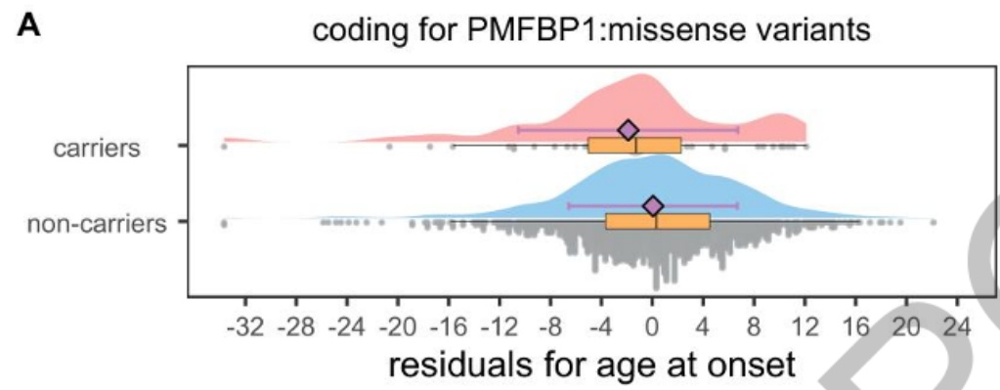

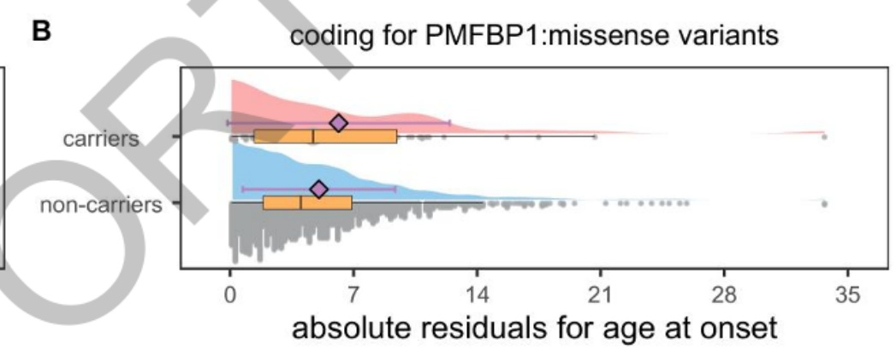

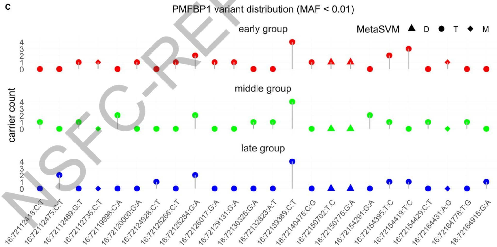

图 2-19 PMFBP1 基因编码区罕见错义变异携带者 AO 残差特征及变异分布图

图 A 云雨图比较了 PMFBP1基因编码区罕见错义变异（MAF<0.01）携带者与非携带者的 AO 残差分布。图 B 云雨图展示两组患者 AO残差绝对值的分布差异。图C 显示 PMFBP1 罕见错义变异在 AO残差三等分组（早发、中间、晚发）中的分布情况。其余图注详情见图2-17。

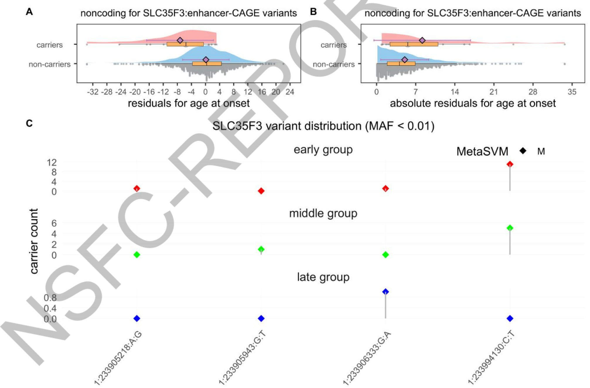

SLC35F3。携带 SLC35F3 基因 enhancer CAGE 变异的患者 AO 残差为-7.22±9.49 年(中位数-5.56，四分位距约-10.97\~-0.56），非携带者为 $0 . 1 2 { \pm } 6 . 6 6$ 年（中位数0.32，四分位距约-3.66\~4.54），两组差异高度显著 $(p=2.31 \times 10E-04)$ ；尽管携带组AO残差绝对值比非携带组更大，但该绝对值差异未达到显著水平 $p = 0.17$ （表2-7、图2-20A与B）。校正$ATXN3-CAG_{exp}$ 后，回归模型与协方差分析，SLC35F3 基因 enhancer\_CAGE 变异对应的效应量约为-7.33年 $(SE=1.50,\ t=-4.88,\ pI=1.23E-06)$ ，协方差分析也同样显著（F=23.76，$pI = 1.23\mathrm{E} - 06$ ，指示其与大约7年左右的提前发病呈强相关（表2-8）。 基于 AO 残差的分组分析进一步支持这一点:按1:3:1分组，早发、迟发、中间组携带者与非携带人数比为12/237、0/249、8/742，三组差异极显著 $(pI = 8.95E - 05)$ ，按等分三组时也显著 $(p2=2.48\mathrm{E}-03)$表明 SLC35F3增强子区相关变异在早发组中明显富集（表2-9、图2-20C）。

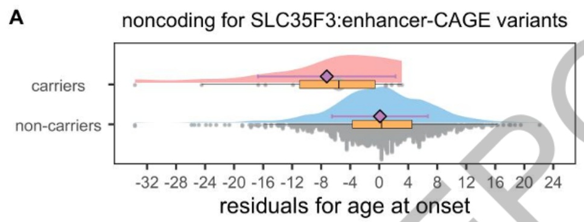

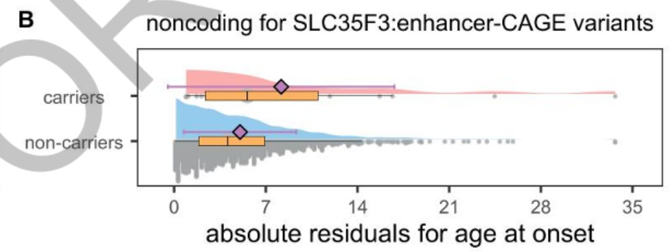

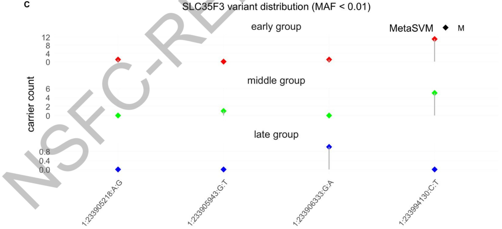

图 2-20 SLC35F3 基因 enhancer\_CAGE 罕见变异携带者 AO 残差特征及变异分布

附注:图 A 通过云雨图比较了 SLC35F3 基因 enhancer CAGE 罕见变异携带者与非携带者的 AO 残差分布；图B云雨图则展示了两组间AO残差绝对值的分布差异。图C进一步呈现了罕见变异在按AO残差划分的三组（早发、中间、晚发）中的分布情况。其余图注详情参见图2-17。

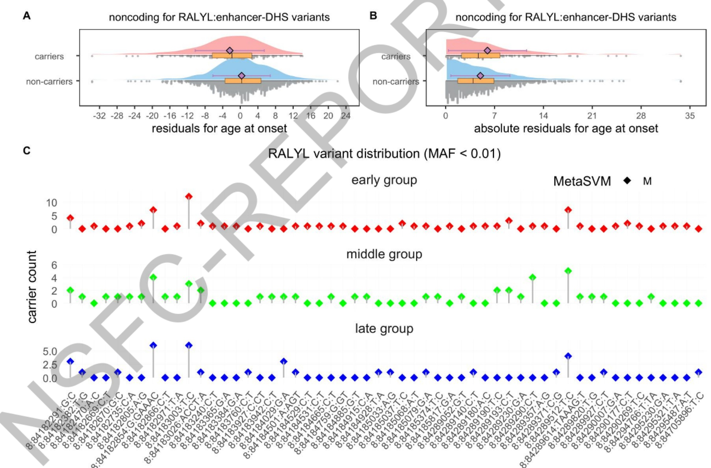

图 2-21 RALYL 基因 enhancer DHS 罕见变异携带者 AO 残差特征及变异分布

RALYL。RALYL 基因 enhancer DHS 携带变异的患者其 AO 残差为-2.39±7.85 年（中位数-1.85年，四分位距约-6.35\~2.62），显著小于非携带者的 $0 . 3 1 \pm 6 . 5 1$ 年（中位数0.34年，$-3.46 \sim 4.73$ $(pI = 1.84E - 04)$ 。然而，AO残差绝对值在携带组与非携带组之间差异不显著$(p2 = 0.11)$ ，这表明变异主要影响AO的方向性（提前），而非显著增加组内个体间的离散程度（表2-7、图2-21A与B）。在校正 $ATXN3-CAG_{exp}$ 扩增数后，多变量线性回归显示$R A L Y L$ 增强子区变异与约2.70年的AO提前相关（SE=0.59，t=-4.55，p1=5.99E-06）。协方差分析结果同样高度显著（F=20.67， $p2=5.99\mathrm{E}-06$ ，支持RALYL增强子区变异是影响AO的独立遗传修饰因子（表2-8）。对患者按AO残差进行分组后的变异分布结果显示，按1:3:1分组时，早发、中间、迟发组变异携带者分别为 $4 6 \not \sim 7 8 .$ 和 19, 三组差异显著$(pI = 4.86E - 04)$ ；按三等分分组时，早发、中间、迟发组变异携带者分别为65、44和34，结果也显著 $(p2=2.99\mathrm{E}-03)$ （表2-9、图2-21C）。

附注:图 A 和图 B 以云雨图展示了 RALYL 基因 enhancer DHS 区罕见变异携带者与非携带者的 AO残差分布与AO残差绝对值的差异；图C呈现了罕见变异在按AO残差均分为早发、中间和晚发三组中的分布情况。其他图注详情见图2-17。

CFAP57。在候选基因分析中，CFAP57是唯一一个在多种功能注释类别中同时表现出高变异负荷和统计关联的基因。在发现队列中，对于 CFAP57基因，其promoter\_DHS变异集合在所有变异集合中，呈现最高cMAC及最显著的关联信号。以该集合为例，我们进一步评估并展示了该基因对SCA3 患者AO的修饰作用。结果显示，携带CFAP57基因enhancerDHS 区罕见变异的患者其 AO残差为-2.33±7.16年（中位数-2.25年，四分位距为-5.67\~1.82），显著小于非携带者的 $0 . 1 2 { \pm } 6 . 6 9$ 年（中位数0.32年，四分位距为-3.66\~4.55）$(p1=6.06E-03)$ ，表明 CFAP57 基因 promoter DHS 区变异与 AO 的提前显著相关。然而，AO残差绝对值在携带组与非携带组之间差异不显著 $(p2=0.83)$ （表2-7、图2-22A与B)。在校正 $ATXN3-CAG_{exp}$ 后，多变量线性回归显示CFAP57基因promoter\_DHS区变异与约2.45年的AO提前相关 $(  SE =0.90, t =-2.73, p1=6.44  E -03 )$ 。协方差分析结果同样显著（F=7.45，$p2=6.44E-03$ ，支持 CFAP57基因 promoter\_DHS 区变异作为 AO独立遗传修饰因子（表2-8）。进一步对患者按AO残差分组后的变异分布也与上述方向效应一致。在按1:3:1分组时，早发、中间与晚发组三者的携带者分别为21、32和6，差异显著 $(p1 = 4.26\mathrm{E} - 03)$ ;按三等分分组时，早发、中间与迟发组携带者分别为28、19和12，结果也显著（p2=0.03）（表2-9、图2-22C）。

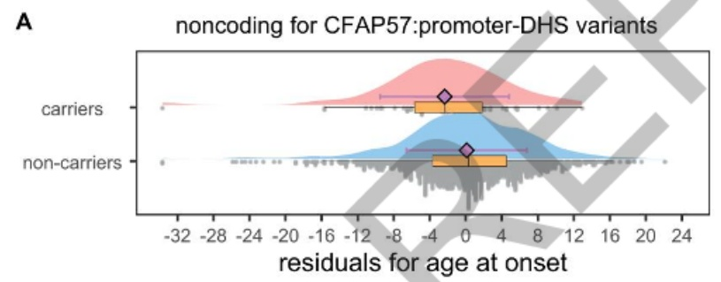

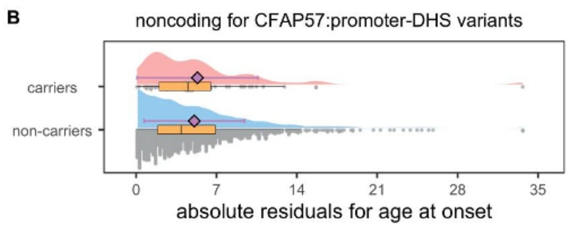

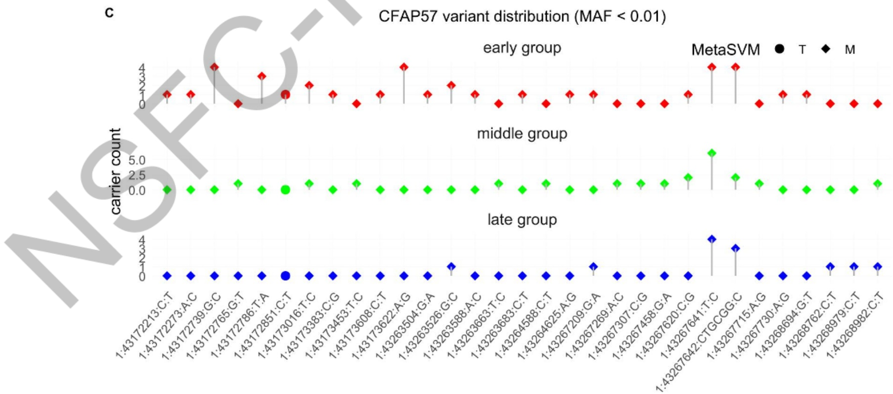

图 2-22 CFAP57 基因 promoter DHS 罕见变异携带者 AO 残差特征及变异分布

附注:图 A 通过云雨图展示了 CFAP57 基因基因 promoter\_DHS 区罕见变异携带者与非携带者的AO残差分布；图B 比较了两组之间AO残差绝对值的差异；图C则呈现了该罕见变异在按AO残差均分所得的早发、中间和晚发三组中的分布情况。其他图注信息详见附图2-17。

表 2-7 关联基因相关变异携带者与非携带者 AO 差异

| group | $\mathbf { C A G _ { e x p } }$ | AO | AO残差 | AO 残差绝对值 | $\underline { { \pmb { p 1 } } }$ | $\underline { { p 2 } }$ |
| --- | --- | --- | --- | --- | --- | --- |
| PTER | 68.82±5.15 | 34.36±11.76 | -7.75±13.06 | 10.86±10.33 |  |  |
| 携带组 | 70.00(67.00~71.50) | 35.00(24.00~42.00) | -2.85(-15.27~0.44) | 8.52(2.56~15.27 | 0.05 | 0.07 |
| 非携带组 | 71.52±3.28 71.00(69.00~74.00) | 35.69±10.42 36.00(28.00~43.00) | 0.07±6.62 0.32（-3.68~4.52） | 5.03±4.30 4.04（1.85~6.92 |  |  |
| LM07 携带组 | 71.29±3.27 | 33.98±9.76 | -2.19±8.25 | 5.69±6.33 |  |  |
| 非携带组 | 71.00(71.00~73.00) 71.51±3.32 | 34.00(27.00~40.75) 35.80±10.46 | -1.45（-4.76~2.53) 0.15±6.59 | (1.77~6.65) 3.61 5.03±4.25 | 0.01 | 0.90 |
| PMFBP1 | 71.00(69.00~74.00) | 36.00(28.00~43.75) | 0.32（-3.67~4.67) | (1.85~6.94) 4.06 |  |  |
| 携带组 | 71.22±4.06 71.00(69.00~74.75) | 34.46±10.71 36.50(26.00~44.00) | -1.88±8.64 -1.26（-5.02~2.30） | 6.14±6.30 4.70（1.37~9.47) |  |  |
| 非携带组 | 71.51±3.28 71.00(69.00~74.00) | 35.73±10.41 36.00(28.00~43.00) | 0.08±6.63 (-3.68~4.53) 0.32 | 5.03±4.32 | 0.10 | 0.56 |
| SLC35F3 | 71.75±3.95 | 27.85±10.66 |  | 4.01（1.85~6.92) |  |  |
| 携带组 | 73.00(68.75~75.00) | 29.50(21.75~32.25) | -7.22±9.49 -5.56(-10.97~-0.56) | 8.17±8.64 5.56(2.37~10.97) | 2.31E-04 | 0.17 |
| 非携带组 | 71.49±3.30 71.00(69.00~74.00) | 35.80±10.38 36.00(28.00~43.00) | 0.12±6.66 0.32（-3.66~4.54) | 5.03±4.30 4.04（1.85~6.94) |  |  |
| RALYL | 71.63±3.66 | 32.97±10.84 | -2.39±7.85 | 5.98±5.60 |  |  |
| 携带组 | 72.00(70.00~74.00) | 33.00(24.00~41.00) | -1.85(-6.35~2.62) | 4.66(2.27~7.81) | 1.84E-04 | 0.11 |
| 非携带组 | 71.48±3.27 71.00(69.00~74.00) | 36.03±10.32 36.00(29.00~44.00) | 0.31±6.51 0.34（-3.46~4.73） | 4.95±4.23 3.94（1.73~6.92） |  |  |
| CFAP57 |  |  |  |  |  |  |
| 携带组 | 71.12±3.55 71.00(69.00~73.00) | 34.25±10.51 34.00(27.00~40.00) | -2.33±7.16 -2.25（-5.67~1.82) | 5.34±5.27 |  |  |
| 非携带组 | 71.51±3.30 71.00 (69.00~74.00) | 35.75±10.42 | 0.12±6.69 | 4.54（2.04~6.45) 5.06±4.37 | 6.06E-03 | 0.83 |

附注:p1为携带者与非携带者两组之间AO残差的差异， $p 2$ 为携带者与非携带者两组之间AO残差绝对值的差异。

表 2-8 关联基因相关变异对 AO 的影响

<table><tr><td rowspan="2">变量</td><td colspan="4">线性回归分析</td><td colspan="2">协方差分析</td></tr><tr><td>系数</td><td>标准差</td><td>t 值</td><td> $\underline { { p 1 } }$ </td><td>F值</td><td> $p 2$ </td></tr><tr><td>PTER 基因错义变异</td><td>-7.86</td><td>2.03</td><td>-3.87</td><td>1.16E-04</td><td>14.95</td><td>1.16E-04</td></tr><tr><td>LMO7基因错义变异</td><td>-2.34</td><td>0.77</td><td>-3.06</td><td>2.30E-03</td><td>9.34</td><td>2.30E-03</td></tr><tr><td>PMFBP基因错义变异</td><td>-1.96</td><td>0.97</td><td>-2.02</td><td>0.04</td><td>4.07</td><td>0.04</td></tr><tr><td>SLC35F3 基因 enhancer_DHS 区变异</td><td>-7.33</td><td>1.50</td><td>-4.88</td><td>1.23E-06</td><td>23.76</td><td>1.23E-06</td></tr><tr><td>RALYL 基因 enhancer_DHS 区变异</td><td>-2.70</td><td>0.59</td><td>-4.55</td><td>5.99E-06</td><td>20.67</td><td>5.99E-06</td></tr><tr><td>CFAP57 基因 promoter_DHS 区变异</td><td>-2.45</td><td>0.90</td><td>-2.73</td><td>6.44E-03</td><td>7.45</td><td>6.44E-03</td></tr></table>

附注:上述线性回归分析与协方差分析均患者AO为因变量，并校正了 $\mathrm { C A G } _ { \mathrm { e x p } }$ 对 AO 的影响。p1为线性回归模型中关联基因相关变异携带情况对患者AO影响系数的 $p$ 值， $p 2$ 为协方差分析中关联基因相关变异携带情况的 $p$ 值。

表2-9基于AO残差分组的关联基因变异携带频次分析

<table><tr><td rowspan="2"></td><td colspan="4">基于 AO 残差按 1:3:1 比例分为三组</td><td colspan="4">基于AO残差均分为三组</td></tr><tr><td>早发组</td><td>晚发组</td><td>中间组</td><td> $p I$ </td><td>早发组</td><td>晚发组</td><td>中间组</td><td> $p 2$ </td></tr><tr><td>PTER 基因错义变异携 带与非携带者人数 LMO7基因错义变异携</td><td>5/244</td><td>2/247</td><td>4/746</td><td>0.08</td><td>6/410</td><td>2/414</td><td>3/413</td><td>0.41</td></tr><tr><td>带与非携带者人数 PMFBP基因错义变异</td><td>21/228</td><td>8/241</td><td>53/697</td><td>0.04</td><td>35/381</td><td>/395 2</td><td>26/390</td><td>0.14</td></tr><tr><td>携带与非携带者人数 SLC35F3 基因</td><td>14/235</td><td>10/239</td><td>26/724</td><td>0.32</td><td>21/395</td><td>2/404</td><td>17/399</td><td>0.28</td></tr><tr><td>enhancer_DHS 区变异 携带与非携带者人数 RALYL 基因</td><td>12/237</td><td>0/249</td><td>8/742</td><td>8.95E-05</td><td>13/403</td><td>1/415</td><td>6/410</td><td>2.48E-03</td></tr><tr><td>enhancer_DHS 区变异 携带与非携带者人数</td><td>46/203</td><td>19/230</td><td>78/672</td><td>4.86E-04</td><td>65/351</td><td>34/382</td><td>44/372</td><td>2.99E-03</td></tr><tr><td>CFAP57基因 promoter_DHS 区变异 携带与非携带者人数</td><td>21/228</td><td>6/243</td><td>/718</td><td>4.26E-03</td><td>28/388</td><td>12/404</td><td>19/397</td><td>0.03</td></tr></table>

附注:p1为基于AO残差患者按1:3:1比例分为三组后，三组之间关联基因相关变异携带情况的比较结果，p2为基于AO残差患者平均分为三组后，三组之间关联基因相关变异携带情况的比较结果。

综上，总体来看，PTER、SLC35F3基因变异效应明显，可显著提前AO约7-8年，属于主要修饰因子。LMO7、PMFBP1、RALYL、CFAP57变异效应适中，可提前AO约2-3年，属于温和但可靠的修饰因子。这些基因相关变异主要影响AO方向（提前发病），对个体间离散度的影响有限，且多在早发组中普遍富集。总之，PTER、LMO7、PMFBP1、SLC35F3、RALYL 和 CFAP57 基因是 SCA3 患者 AO 的重要遗传修饰因子。

## 17.2鉴定的关联基因组区域变异对发病年龄的影响结果

通过对发现队列与验证队列的多队列关联分析，并结合GTEx基因表达数据，我们锁定了三个与SCA3患者AO相关的关键基因组区:PHYH基因附近（chr10:13251279-13256454）、PPP2R2D基因周围（chr10:131873324-131876490）及SHANK3基因内含子区（chr22:50709609-50711993）。为解析这些区域罕见变异对AO的调控作用，我们比较了携带与非携带者的AO残差及其绝对值，并用云雨图展示分布模式。同时，根据AO残差将患者分为早发、中间和晚发三组，评估各组中罕见变异的携带频率，以探讨其在不同发病模式中的分布特征及潜在生物学意义。

结果显示，在邻近 PHYH基因的 chr10:13251279-13256454 基因组区域，携带该区域变异的SCA3患者A0残差为-1.74±8.9年，中位数-1.45年（四分位数-4.36\~3.32），非携带者AO残差 $0 . 1 8 { \pm } 6 . 4 5$ 年，中位数0.32年(四分位数-3.66\~4.54)，两组差异接近显著 $(p1 = 0.07)$而AO残差绝对值组间差异不显著（表2-10）。云雨图显示携带者AO分布整体左偏，体现早发倾向（图2-23A与 B）。 $ATXN3-CAG_{exp}$ 后，线性回归与协方差分析均显示独立负向调控作用（β=-1.92，SE=0.66，t=-2.92，p1=3.62E-03；F=8.50，p2=3.62E-03 （表2-11）。AO残差分组分析显示早发组携带者略高（p1=0.32，p2=0.08）（表2-12，图2-23C）

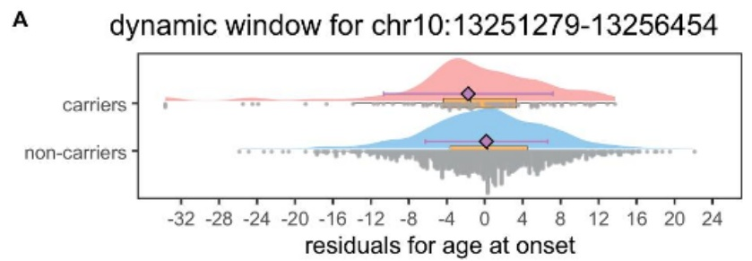

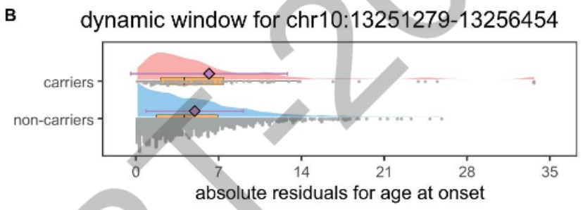

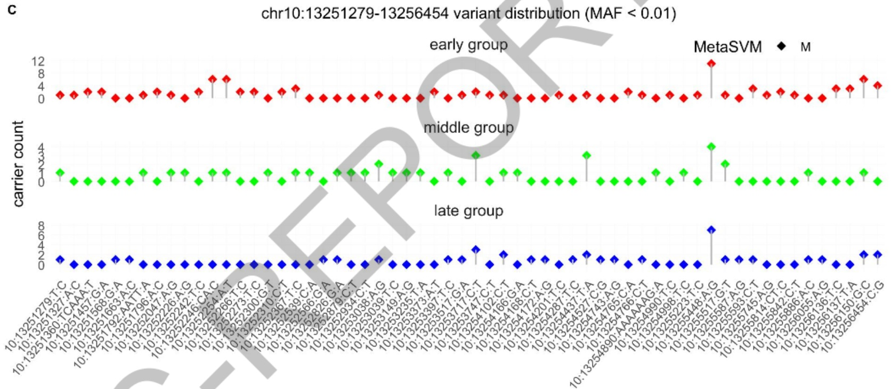

图 2-23 chr10:13251279-13256454 基因组区域罕见变异携带者 AO 残差特征及变异分布

附注:图A呈现了chr10:13251279-13256454基因组区域罕见变异（MAF<0.01）携带者与非携带者的 AO残差分布云雨图。图 B 比较了两组患者 AO残差绝对值的云雨图分布。图 C 展示了该区域内罕见变异在AO残差三等分分组（早发组、中间组、晚发组）中的分布情况。其余图注信息见图2-17。

在位于 PPP2R2D 基因附近的 chr10:131873324-131876490 基因组区域，携带该区域变异患者的A0残差为-2.81±8.18年，中位数为-2.45年（四分位距:-6.36\~1.44），而非携带者的A0残差为0.17±6.60年，中位数为0.32年（四分位距:-3.66\~4.54）。两组分布呈现高度显著差异 $(pI = 8.90\mathrm{E} - 04)$ 。AO残差的绝对值在携带组两组间差异未达到统计学显著水平 $(p2 = 0.15)$ （表2-10，图2-24A与B）。回归分析显示，携带状态对应AO的回归系数为-2.98（SE=0.82，t=-3.64， $pI = 2.87\mathrm{E} - 04$ ；协方差分析结果同样显著（F=13.23，$p2=2.87\mathrm{E}-04$ ，（表2-11）。AO残差分组显示早发组富集，根据残差分布划分的早、中、晚三组中，早发组携带者与非携带者人数比为25/224，晚发组仅7/242，组间分布具有显著差异 $(pI = 2.23E - 03)$ 将样本按残差均等分为三组，早发组携带者比例仍显著高于晚发组$(p2=3.48\mathrm{E}-03)$ （表2-12、图2-24C）。

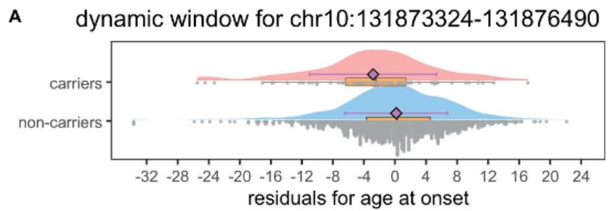

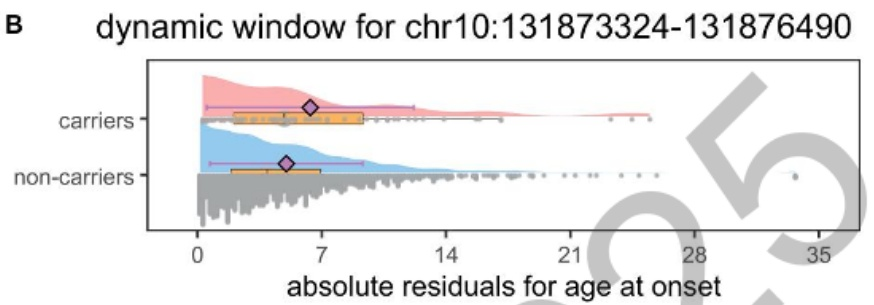

chr10:131873324-131876490 variant distribution (MAF < 0.01)

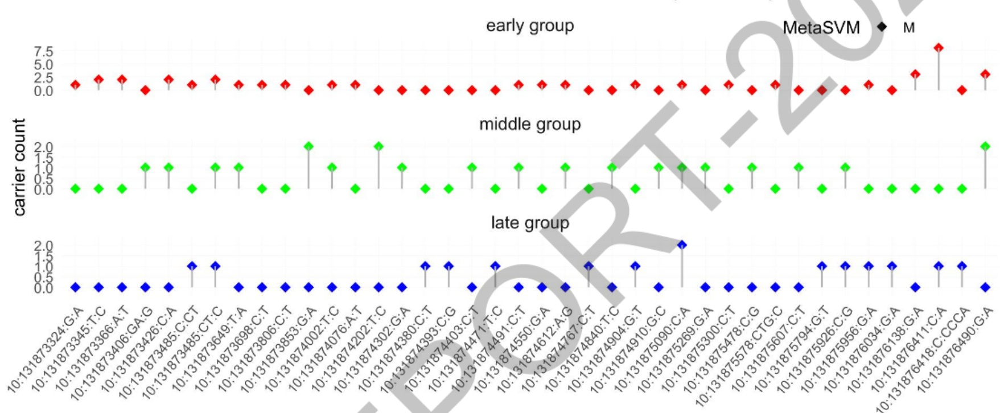

图 2-24 chr10:131873324-131876490 基因组区域罕见变异携带者 AO 残差特征及变异分布

附注:图A云雨图展示了chr10:131873324-131876490基因组区域内罕见变异（MAF<0.01）携带者与非携带者在AO残差上的分布差异。图B云雨图进一步比较了两组个体AO残差绝对值的分布特征。图C则描绘了该区域内罕见变异在AO残差三等分分组（即早发组、中间组与晚发组）中的分布情况。其余相关图注信息详见图 2-17。

在chr22:50709609-50711993（位于 SHANK3基因内含子区）的基因组区域，该区域变异携带者的A0残差为-2.23±7.75年，中位数为-1.85年（四分位距:-5.36\~1.83年），而非携带者的A0残差为0.17±6.62年，中位数为0.32年（四分位距:-3.66\~4.55年），两组之间差异具有统计学显著性 $(p1=5.90\mathrm{E}-03)$ （表2-10、图2-25A）。而AO残差绝对值在两组间无显著差异 $(p2=0.37)$ （表2-10、图2-25B）。线性回归与协方差分析均进一步支持该区域变异对AO的独立负向调控作用（线性回归系数 $\beta = - 2.40$ $\mathrm{SE}=0.75$ ， t=-3.22, $p1=1.31  E- 03$ ；协方差分析 $F=10.37$ $p2=1.31\mathrm{E}-03$ （表2-11）。当按1:3:1的比例划分早、中、晚发病组时，早发组中携带者与非携带者人数比为26/223，晚发组为14/235，组间分布差异显著 $(p1 = 0.05)$ 。当改为按AO残差均等分为三组时，该趋势更为明确:早发组携带者与非携带者之比为40/376，中间组为34/382，晚发组为19/397，组间分布差异达到统计学显著（p2=0.02）（表2-11、图2-25C）。

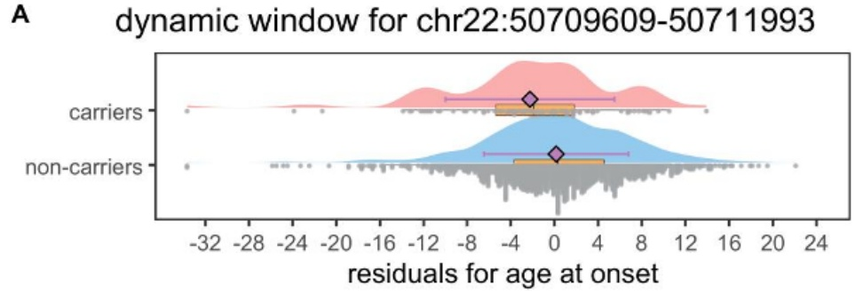

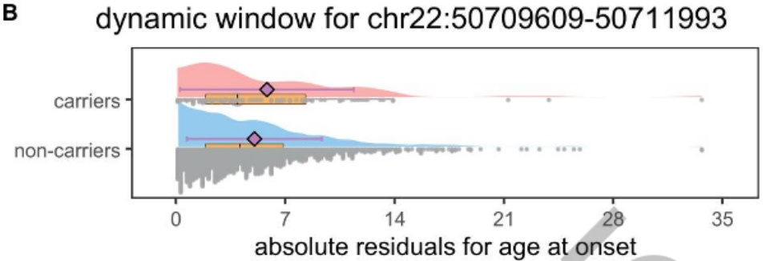

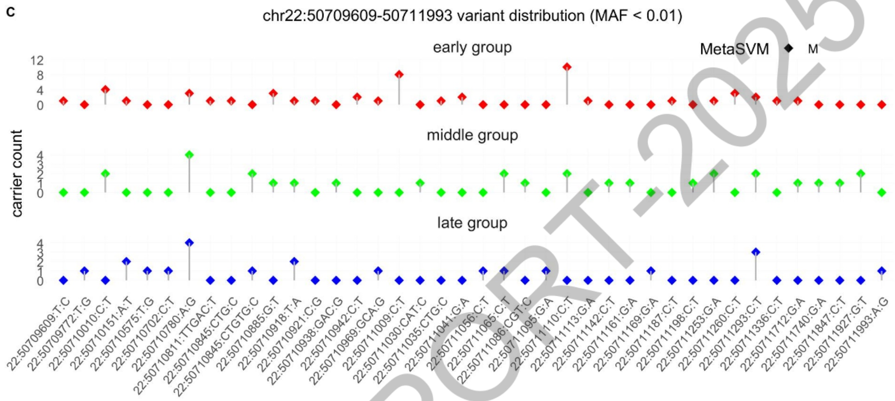

图 2-25 chr22:50709609-50711993 基因组区域罕见变异携带者 AO 残差特征及变异分布

附注:图A以云雨图形式直观对比chr22:50709609-50711993区段内罕见变异（MAF<1%）携带者与非携带者的AO残差分布；图B展示了携带者与非携带AO残差绝对值分布的云雨图；图C则依据AO残差将样本均分为早发、中间、晚发三组并呈现了罕见变异在各组的分布频率。其余参见图2-17。

表 2-10 关联基因相关变异携带者与非携带者 AO 差异

<table><tr><td colspan="4">CAGexp AO group</td></tr><tr><td colspan="2">chr10:13251279-13256454</td></tr><tr><td>71.04±3.64 35.03±11.38 -1.74±8.91 6.18±6.63</td></tr><tr><td>携带组 71.00(69.00~73.00) 36.00(27.00~43.00) -1.45(-4.36~3.32) 4.08(2.10~7.40)</td></tr><tr><td>0.07 0.25 35.74±10.33 71.54±3.28 0.18±6.45 4.97±4.11</td></tr><tr><td>非携带组 4.04(1.75~6.92) 71.00(70.00~74.00) 36.00(28.00~43.00) 0.32（-3.66~4.54)</td></tr><tr><td>chr10:131873324-131876490</td></tr><tr><td>32.37±10.71 71.70±3.16 -2.81±8.18 6.34±5.83 携带组</td></tr><tr><td>30.00(24.00~39.00) -2.45(-6.36~1.44) 4.87(2.04~9.32) 8.90E-04 0.15</td></tr><tr><td>35.88±10.38 71.48±3.32 0.17±6.60 5.00±4.31</td></tr><tr><td>3.94(1.85~6.92) 71.00(69.00~74.00) 36.00(29.00~43.00) 0.32（-3.66~4.54)</td></tr><tr><td></td></tr><tr><td>-2.23±7.75 33.67±10.78 5.82±5.56 33.00(25.00~41.00) -1.85(-5.36~1.83) 3.92(1.85~8.29)</td></tr><tr><td>71.00(70.00~73.00) 5.90E-03 0.37</td></tr><tr><td>5.02±4.32 35.83±10.39 0.17±6.62</td></tr></table>

附注: $p 1$ 为携带者与非携带者两组之间AO残差的差异， $p 2$ 为携带者与非携带者两组之间AO残差绝对值的差异。

表 2-11 关联基因相关变异对 AO 的影响

<table><tr><td rowspan="2">变量</td><td colspan="4">线性回归分析</td><td colspan="2">协方差分析</td></tr><tr><td>系数</td><td>标准差</td><td>t值</td><td> $p 1$ </td><td>F值</td><td> $p 2$ </td></tr><tr><td>chr10:13251279-13256454 区域变异</td><td>-1.92</td><td>0.66</td><td>-2.92</td><td>3.62E-03</td><td>8.50</td><td>3.62E-03</td></tr><tr><td>chr10:131873324-131876490区域变异</td><td>-2.98</td><td>0.82</td><td>-3.64</td><td>2.87E-04</td><td>13.23</td><td>2.87E-04</td></tr><tr><td>chr22:50709609-50711993 区域变异</td><td>-2.40</td><td>0.75</td><td>-3.22</td><td>1.31E-03</td><td>10.37</td><td>1.31E-03</td></tr></table>

附注:上述线性回归分析与协方差分析均患者AO为因变量，并校正了 CAGexp 对 的影响。p1为线性回归模型中关联基因相关变异携带情况对患者AO影响系数的 $p _ { \parallel }$ 为协方差分析中关联基因相关变异携带情况的p值。

表2-12 基于AO残差分组的关联基因组区域内变异携带频次分析

<table><tr><td rowspan="2"></td><td colspan="2">基于 AO 残差按 1:3:1 比例分为三组</td><td colspan="4">基于 AO残差均分为三组</td></tr><tr><td>早发组</td><td>晚发组 中间组</td><td>早发组</td><td>晚发组</td><td>中间组</td><td> $p 2$ </td></tr><tr><td>chr10:13251279-13256454区 域变异携带与非携带者人数</td><td>26/223</td><td>17/232 72/678</td><td>49/367 0.32</td><td>32/384</td><td>34/382</td><td>0.08</td></tr><tr><td>chr10:131873324-131876490 区域变异携带与非携带者人数</td><td>25/224</td><td>39/711 7/2</td><td>36/380 2.23E-03</td><td>14/402</td><td>21/395</td><td>3.48E-03</td></tr><tr><td>chr22:50709609-50711993区 域变异携带与非携带者人数</td><td>26/223</td><td>4 47/703 0.05 2</td><td>40/376</td><td>19/397</td><td>28/388</td><td>0.02</td></tr></table>

附注: $p 1$ 为基于AO残差患者按1:3:1比例分为三组后，三组之间关联基因相关变异携带情况的比较结果， $p 2$ 为基于AO残差患者平均分为三组后，三组之间关联基因相关变异携带情况的比较结果。

综上，我们在 SCA3患者中确认了三个独立影响AO的区域:PHYH附近的chr10:13251279-13256454、PPP2R2D 附近的 chr10:131873324-131876490，以及 SHANK3内含子区的chr22:50709609-50711993。三处区域的变异在早发患者中呈现普遍富集，均主要影响AO的方向，可使AO提前约2-3年，并对个体间离散度影响有限。

## 第三部分:从常见变异角度鉴定SCA3患者AO遗传修饰因素

## 1）队列构成情况

本研究共纳入中国大陆地区1,361例共济失调患者。其中包括1,236例经分子确诊的SCA3患者以及125例诊断未明共济失调患者。经过样本及变异质控，最终纳入1,146例SCA3 患者和104例诊断未明共济失调患者及36,836,095个变异符合质控标准纳入后续统计分析。 S

## 2）描述性统计分析结果

在 SCA3 患者中，男性 608例，女性 538 例，ATXN3 正常/扩增等位基因 CAG 拷贝数（即 ATXN3-CAGexp 和 ATXN3-CAGnorm）分别为 $7 1 . 7 5 \pm 3 . 3 2 ^ { ) }$ 和 $1 9 . 8 4 \pm 6 . 1 7$ 次，年龄为$4 1 . 5 3   \pm 1 1 . 6 0$ 岁，AO为 $3 5 . 3 9   \pm   1 0 . 4 8$ 岁， $\mathrm { A O _ { p } }$ 为35.46±7.45岁， $\mathrm { \bar { A } O _ { R E } }$ 为 $- 0 . 1 4   \pm   7 . 2 4$ 岁。

在诊断未明共济失调患者中，男性 62例，女性42例，GLS 长短链 GCA 重复等位基因大小分别为 $1 3 . 5 5 \pm 4 . 2 3$ 和 $9 . 4 8   \pm 2 . 5 9$ 次，年龄为 $\beta 6.00 \pm 16.09$ 岁，AO为 $3 0 . 4 6   \pm 1 8 . 0 7$岁。两个队列其他基线数据见表3-1。

表 3-1 受试者基线数据

| SCA3 患者 (队列 | $\mathrm{A},~\mathrm{n}=1,146$ | 诊断未明共济失调患者 (队列 $B,\ n=104)$ |
| --- | --- | --- |
| 性别（男/女） | 608/538 | 62/42 |
| 年龄（岁），均数±标准差 | 41.53±11.60 | $3 6 . 0 0 {\pm} 1 6 . 0 9$ |
| （岁），均数±标准差 $\mathrm { A O _ { 0 } }$ | 35.39±10.48 | 30.46±18.07 |
| （岁），均数±标准差 $\mathrm { A O _ { p } }$ | 35.46±7.45 |  |
| （岁），均数±标准差 $\mathrm { A O _ { R E } }$ | -0.14±7.24 |  |
| SARA，均数±标准差 | 9.66±5.21 | 9.67±4.30 |
| 均数±标准差 ICARS, | 26.63±14.16 | 22.22±10.25 |
| 共济失调，频数（%） | 1146（100） | 104（100） |
| 音障碍， ，频数（%） 构 | 1032（90.05） | 40（38.46） |
| 吞咽困难， ，频数（%） | 353（30.80） | 4（3.85） |
| 震颤， 频数（%） |  | 8（7.69） |
| ，均数±标准差 $\mathrm{ATXN3-CAG_{exp}}$ | $2 0 . 3 8 { \pm } 6 . 9 3 ^ { \# } / 1 9 . 8 4 { \pm } 6 . 1 7 ^ { \& }$ | 19.95±6.40# |
| 均数±标准差 $\underline { { { 4 T X N 3 } } } - \mathrm { C A G } _ { \mathrm { n o r m } } ,$ | $6 0 . 9 3 { \pm } 7 . 0 6 ^ { \# } / 7 1 . 7 5 { \pm } 3 . 3 2 ^ { \& }$ | $1 2 . 5 4 { \pm } 4 . 5 5 ^ { \# }$ |
| 均数±标准差 $\bar { G } \bar { E } S - \mathrm { G C A } _ { \mathrm { l o n g e r } } ,$ | $1 3 . 3 6 { \pm } 3 . 3 8 ^ { \# }$ | $1 3 . 6 1 \pm 4 . 2 3 ^ { \# } / 1 3 . 5 5 \pm 4 . 2 3 ^ { \& }$ |
| 均数±标准差 $GLS-GCA_{short}$ | $9 . 5 0 { \pm } 2 . 5 8 ^ { \# }$ | $9 . 5 4 { \pm } 2 . 6 3 ^ { \# } / 9 . 4 8 { \pm } 2 . 5 9 ^ { \& }$ |
| 基因组覆盖度，均数±标准差 | $0 . 9 4 { \scriptstyle \pm } 0 . 0 0 ^ { \# }$ | $0 . 9 4 { \scriptstyle \pm } 0 . 0 0 ^ { \# }$ |
| 基因组有效测序深度，均数±标准差 | $3 9 . 4 6 { \pm } 6 . 1 8 ^ { \# }$ | $3 8 . 6 6 { \pm } 5 . 2 0 ^ { \# }$ |

附注:分类变量以频数（百分比）表示，连续变量以均数±标准差表示； $\mathrm{AAO_{6}=obscrved   AAO}$ ，实际观察到的 $\mathrm { A A O } ,$ ，也即本研究定义的开始出现共济失调症状的发病年龄； $\mathrm{AO_{p}=prediected AO}$ ，预测的$AO; AO_{RE}= residual AO$ ，即发病年龄残差；SARA=Scale for the Assessment and Rating of Ataxia，评估共济失调严重程度的量表；ICARS=International Cooperative Ataxia Rating Scale，评估共济失调的国际协作评分量表； $ATXN3-CAG_{exp}=ATXN3$ 扩增等位基因CAG重复拷贝数； $ATXN3-CAG_{norm}=ATXN3$ 正常等位基因 CAG 重复拷贝数； $GLS-GCA_{ longer } = GLS$ 正常等位基因长链GCA重复拷贝数； $GLS-GCA_{short}=GLS$常等位基因短链GCA 重复拷贝数；\$，WGS相关结果；&，PCR相关结果；-，无数据。

## 3）SCA3 患者 AO 及 $\mathrm { A O _ { R E } }$ 的统计结果

基于 $\mathrm { C A G } _ { \mathrm { e x p } }$ 计算患者的 $\mathrm { A O _ { p } , }$ 并计算 $\mathrm { A O _ { R E } }$ ，结果表明最终 1,146 例 SCA3 患者的 AAO为 $3 5 . 3 9 { \pm } 1 0 . 4 8$ 岁（表3-2，图3-1A）， $\mathrm { A O _ { p } }$ 平均为35.46±7.45岁，AORE为-0.14±7.24 岁（表3-2，图3-1B）。以AO为因变量，分别以 $ATXN3-CAG_{exp}$ 和 $ATXN3-CAG_{norm}$ 为自变量构建线性回归模型。结果显示， $ATXN3-CAG_{exp}$ 可显著影响患者 $\mathrm{AO}^{\prime}(p<0.001)$ $\mathbf { C A G } _ { \mathrm { e x p } }$ 与AO呈现明显的负相关关系， $\mathbf { C A G } _ { \mathrm { e x p } }$ 越大，AO越早，每增加一个重复拷贝数，AO提早约2.35岁（表3-2，图3-2A）；而 $ATXN3-CAG_{norm}$ 对 AO 没有明显影响 $(p = 0.738)$ （表3-2，图3-2B）。

表 3-2 ATXN3 等位基因 CAG 重复拷贝数与 AAO 之间线性拟合结果

<table><tr><td rowspan="2">模型</td><td colspan="2">截距项</td><td colspan="2">系数</td><td rowspan="2"> $\mathbb { R } ^ { 2 }$ </td><td rowspan="2">AIC</td><td rowspan="2">BIC</td><td rowspan="2">logLik</td></tr><tr><td>均值</td><td>标准误</td><td>p 值 均值 标准误</td><td>p 值</td></tr><tr><td> $\mathrm{AAO} \sim \mathrm{CAG}_{\mathrm{exp}}$ </td><td>204.14</td><td>4.46</td><td>-2.35 &lt;0.001</td><td>0.06 &lt;0.001</td><td>0.56</td><td>7712.30</td><td>7727.43</td><td>-3853.15</td></tr><tr><td> $\mathrm{AAO} \sim \mathrm{CAG}_{\mathrm{norm}}$ </td><td>35.06</td><td>1.04</td><td>0.05 &lt;0.001</td><td>0.738</td><td>&lt;0.001</td><td>8643.05</td><td>8658.18</td><td>-4318.53</td></tr></table>

附注: $\mathrm{AAO}\sim\mathrm{CAG}_{\mathrm{exp}}=\mathrm{AAO}$ 与ATXN3-CAGexp 间的拟合模型； $\mathrm{AAO}\sim\mathrm{CAG}_{\mathrm{norm}}=\mathrm{AAO}$ 与 $ATXN3-CAG_{norm}$间的拟合模型。R²=决定系数；AIC=赤池信息准则；BIC=贝叶斯信息准则；logLik=对数似然值。AIC与 BIC 值越小、R²与logLik 值越大，模型拟合越好。

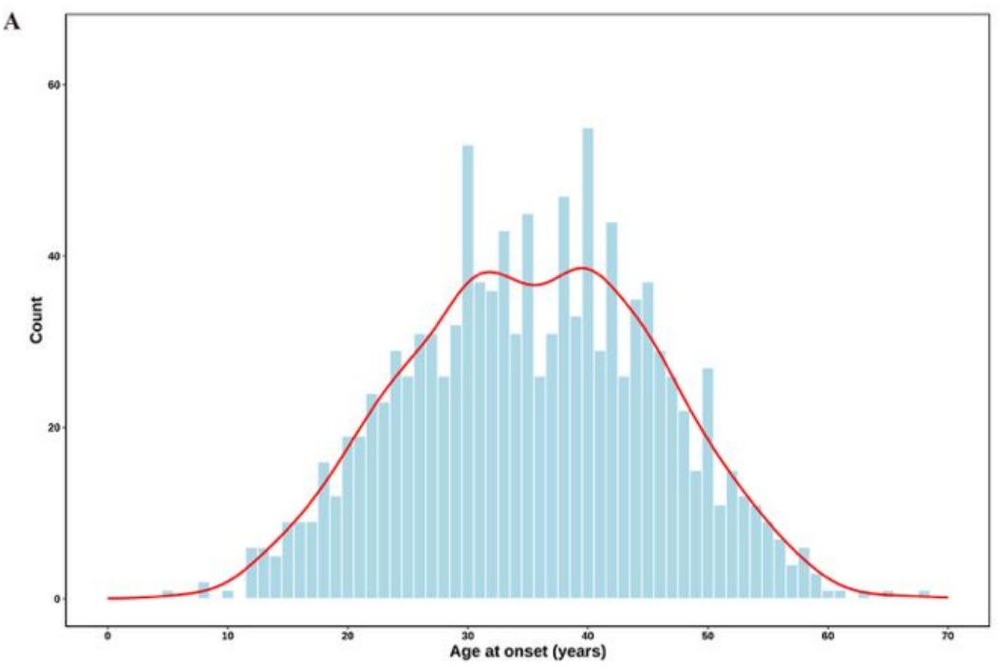

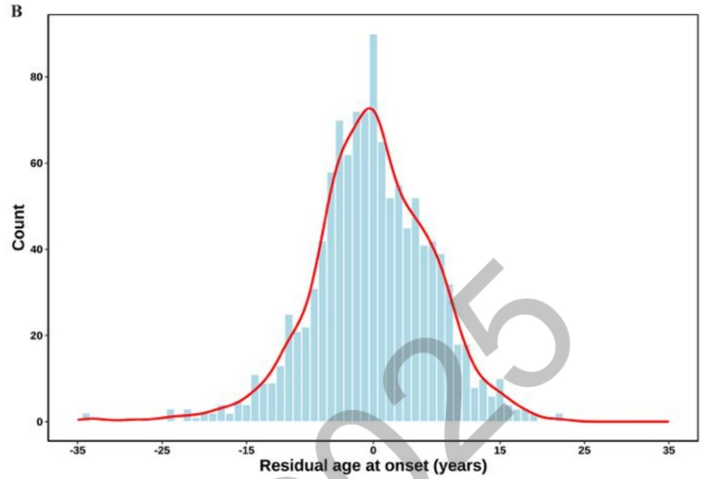

图 3-1 1,146 例 SCA3 患者 AO 与 $\mathrm { A O _ { R E } }$ 分布图

附注:图表示 SCA3 患者的 AO 与 $\mathrm { A A O _ { R E } }$ 分布图，X 轴代表 SCA3 患者的 AO 和 $\mathrm { A O _ { R E } }$ ，y轴代表频数（Counts）。浅蓝色柱状代表某一 $\mathrm{AO/AO_{RE}}$ 下的患者频数，红色实现为根据频数拟合的密度曲线。

图 3-2 1,146 例 SCA3 患者 $ATXN3-CAG_{ exp }/ATXN3-CAG_{ norm }$ 与 AO之间的关系图

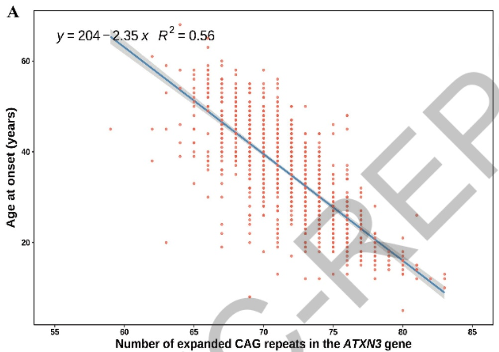

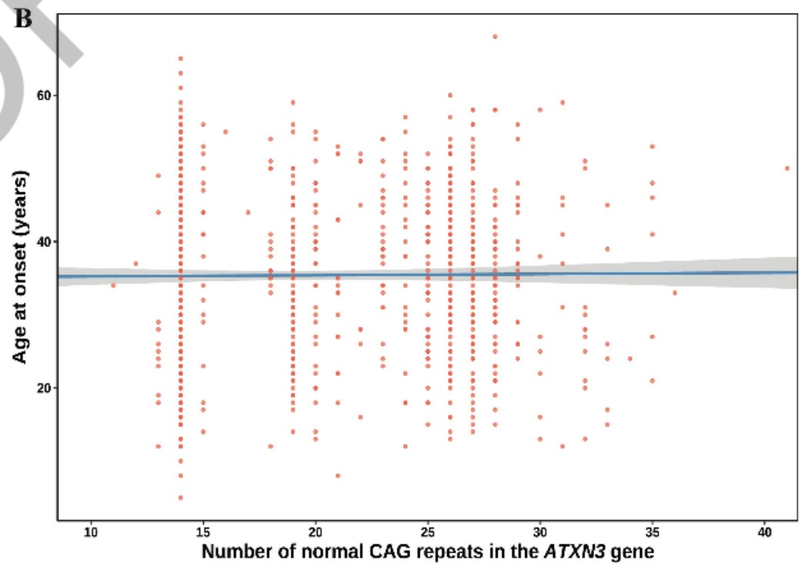

附注:图 示 ATXN3-CAG 与 AO之间的关系图。图 A 表示 $ATXN3-CAG_{exp}$ 与 AO 的关系图，图 B表示 $ATX/3-CAG_{norm}$ 与 AO 的关系图。x 轴代表 ATXN3-CAG，y轴代表每个患者的 AO，红色圆点代表每一个患者的CAG和AO值，蓝色斜线代表回归线，浅蓝色阴影代表回归拟合的95%置信区间。图A左上角标注的公式为回归模型的表达式。

## 4） 基于 RP-PCR/CE 技术检测 SCA3 患者 ATXN3-CAG 和诊断未明共济失调患者 GLS-GCA的结果

1,146 例 SCA3 样本送 WGS 测序前均再次使用 RP-PCR/CE 检测 ATXN3 等位基因 CAG拷贝数（ATXN3-CAG）以明确SCA3诊断。SCA3样本PCR结果中，异常致病的扩增条带分子量为450bp左右，而正常扩增条带分子量为250bp左右（如图3-3和图3-4）。SCA3患者的 $ATXN3-CAG_{exp}$ 和 $ATXN3-CAG_{norm}$ 分别为71.75±3.32次和19.84±6.17次（表3-1），最常见的拷贝数分别为71次（157/1,146，13.70%，图3-5A）和14次（501/1,146，43.72%，图3-5B）。

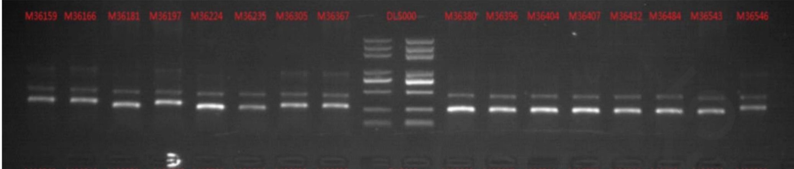

图 3-3 部分 SCA3 样本的 PCR 结果电泳胶图成像结果图

附注:从左至右起，第1，2，3，4，5，6，7，8，11，12，13， 16，17，18孔分别为SCA3 患者样本点样孔。中间第 9，10 孔点样加入的 DL5000 是 Marker，Marker由下往上依次是100bp，250bp，500bp，750bp，1000bp，2000bp，3000bp，5000bp。如图所示， 异常致病的扩增条带分子量为450bp左右，而正常扩增条带分子量为 250bp左右。

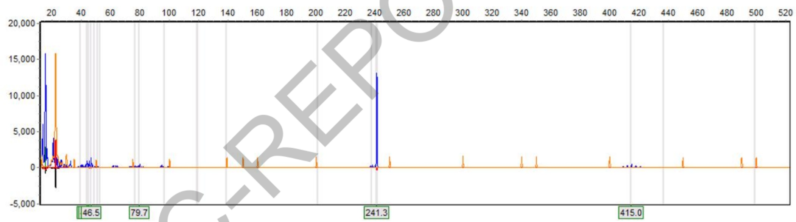

图 3-4 SCA3 样本毛细管电泳峰图结果示意图

附注:该样本异常致病的扩增条带分子量为415bp，而正常扩增条带分子量为242bp，经过ATXN3基因CAG重复序列拷贝数计算公式=(波峰处 DNA 长度-199)/3 代入换算，可得到该样本 $ATXN3-CAG_{exp}$和 $A\bar{T}XN3-CAG_{norm}$ 分别为72次和14次。

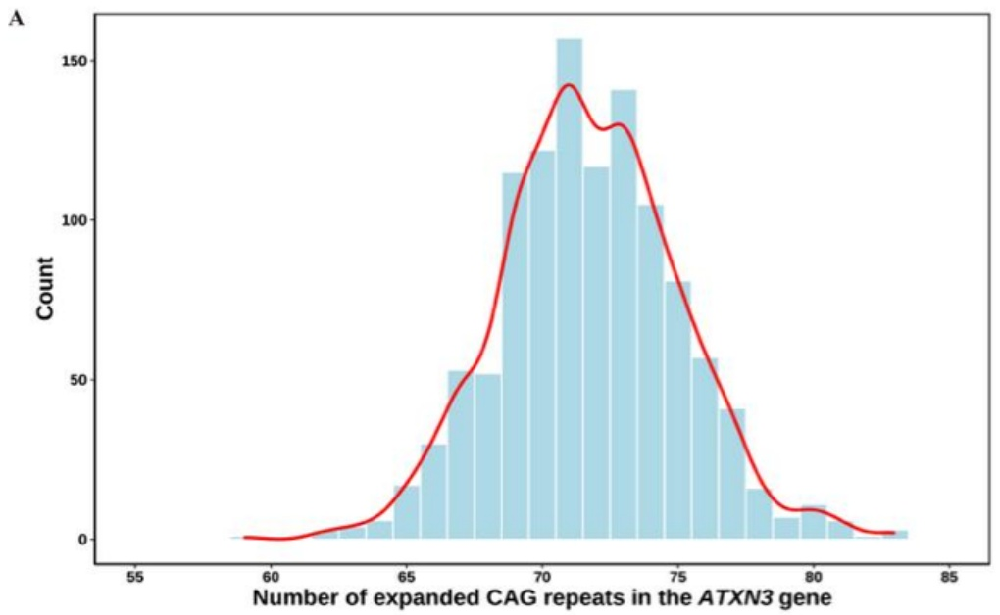

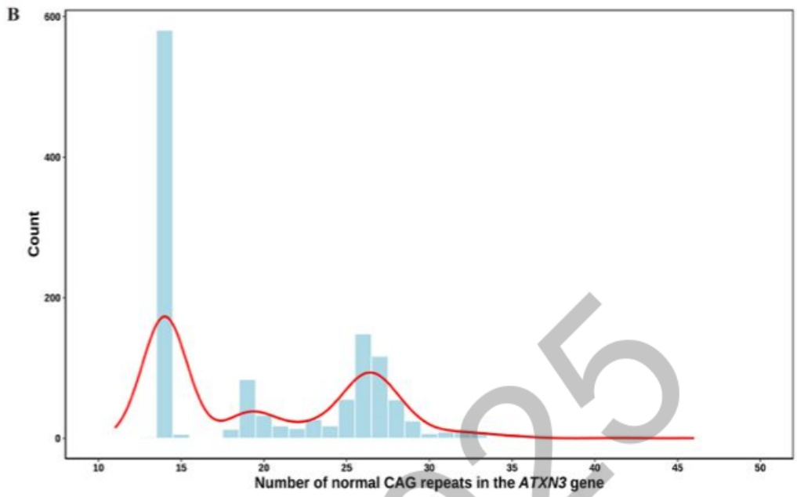

图 3-5 1,146 例 SCA3 基于 PCR 技术的 ATXN3-CAG 分布图

附注:图 A 中 x 轴代表 SCA3 患者的 $ATXN3-CAG_{exp}$ 图 B 中 x 轴代表 SCA3 患者的 $ATXN3-CAG_{norm}$ y轴均代表频数（Count）。浅蓝色柱状代表某一ATXN3-CAG下的频数，红色实线为根据频数拟合的密度曲线。

总共125 例诊断未明共济失调患者使用 RP-PCR/CE检测 GLS等位基因 GCA 拷贝数（GLS-GCA），进过质控后最终104例患者纳入分析。104例诊断未明共济失调患者样本PCR结果中，所有患者均未达到GLS基因GCA重复致病阈值680次[86]。所有扩增条带分子量为220bp左右（图3-6）。其中，GLS正常等位基因长链GCA拷贝数 $( GLS - GCA _{ longer } )$和 GLS 正常等位基因短链 GCA 拷贝数 $\left( \overline{G}LS - GCA _{ shorter } \right)$ 分别为 13.55±4.23 次和 9.48±2.59次（表3-1），最常见的长度分别为8次（25/104，24.03%，图3-7A）和8次（71/104，69.23%，图3-7B）。

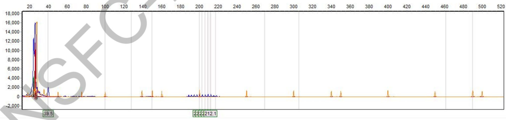

图3-6诊断未明共济失调患者样本毛细管电泳峰图结果示意图

附注:该样本GLS基因正常等位基因GCA重复长链拷贝数 $( GLS - GCA _{ longer } )$ 和正常等位基因 GCA重复短链拷贝数 $( GLS - GCA _{ shorter } )$ 的扩增条带分子量分别为 212bp 和 207bp，经过 GLS 基因 GCA 重复拷贝数计算公式=（波峰处DNA长度-168）/3代入换算，可得到该样本 $GLS-GCA_{longer}$ 和 $GLS-GCA_{short}$分别为15次和13次。

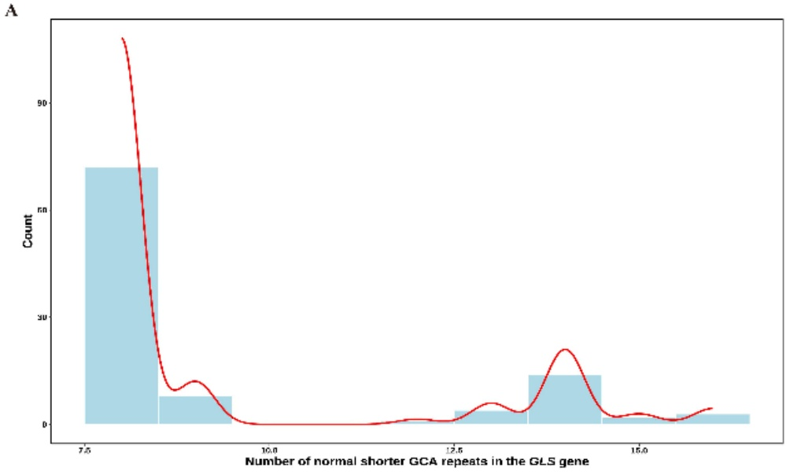

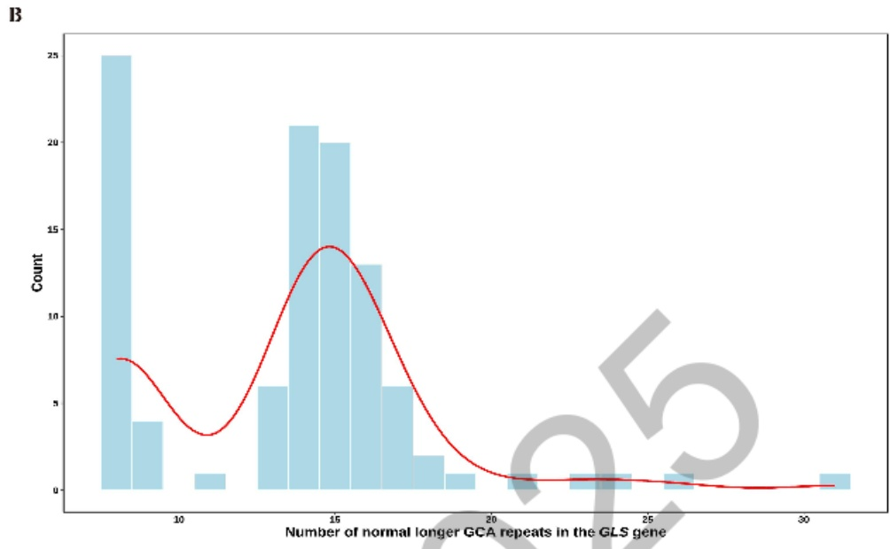

图 3-7 104 例诊断未明共济失调患者基于 PCR 技术检测 GLS-GCA 分布图

附注:图A中x轴代表诊断未明共济失调患者的 $GLS-GCA_{longer}$ 图B中x轴代表诊断未明共济失调患者的 $GLS-GCA_{short}$ ，y轴均代表频数（Count）。浅蓝色柱状代表某 $\overline{GLS}-GCA$ 下的频数，红色实线为根据频数拟合的密度曲线。

## 5）基于 WGS 技术检测 SCA3 患者和诊断未明共济失调患者 GLS-GCA 的结果

总共1,236例 SCA3 患者和 125 例诊断未明共济失调患者使用进行 WGS 测序，然后使用 ExpansionHunter 检测 GLS-GCA。经过样本和变异质控后，最终 1,146 例 SCA3 患者和

基于 WGS 结果，1,146 例 SCA3 患者的 $GLS-GCA_{longer}$ 和 $GLS-GCA_{short}$ 分别为13.36±3.38次和9.50±2.58次（表3-1） 由图3-8可见， $GLS-GCA_{longer}$ 的范围为 8-32次，最常见的 $GLS-GCA_{longer}$ 依次为14次（326/1,146，28.45%），8次（209/1,146，18.24%），15次（203/1,146，17.71%） $GLS-GCA_{short}$ 的范围为 6-18 次，最常见的 GLS-GCAshorter依次为8次（782/1,146，68.24%），14次（152/1,146，13.26%），9次（74/1,146，6.46%）。

基于 WGS 结果，104 例诊断未明共济失调患者的 $GLS-GCA_{longer}$ 和 $GLS-GCA_{short}$ 分别为13.61±4.23次和9.54±2.63次（表3-1）。由图3-9可见104例诊断未明共济失调患者中，$GLS \text{。 }  GCA _{ longer }$ 的范围为8-31次，最常见的 $GLS-GCA_{longer}$ 依次为8次（24/104，23.08%），15次（22/104，21.15%），14次（20/104，19.23%）； $GLS-GCA_{short}$ 的范围为 8-17 次，最常见的 $GLS-GCA_{short}$ 依次为8次（71/104，68.27%），14次（14/104，13.46%），9次（8/104,7.69%)。

图 3-9 104 例诊断未明共济失调患者基于 WGS 技术的 GLS-GCA 结果图附注:与图3-8类似。

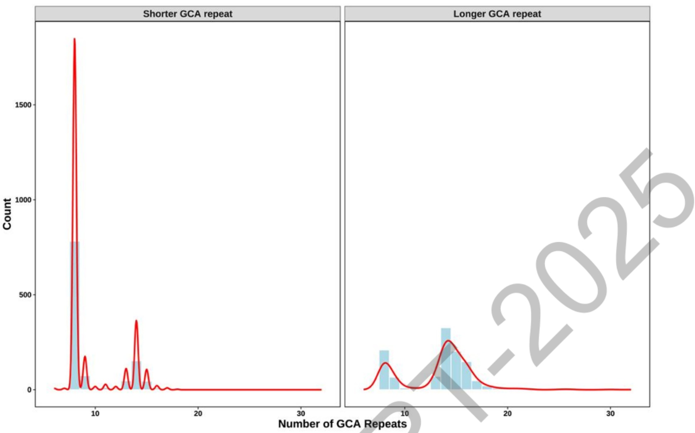

图 3-8 1,146 例 SCA3 患者基于 WGS 技术的 $\overline{GLS}-\overline{GCA_{short}}$ 和 $GLS-GCA_{longer}$ 结果图

附注:图中 x 轴代表 GLS-GCA，y 轴代表频数（Count）。浅蓝色柱状代表某一 GLS-GCA 的患者频数，红色实线为根据频数拟合的密度曲线。

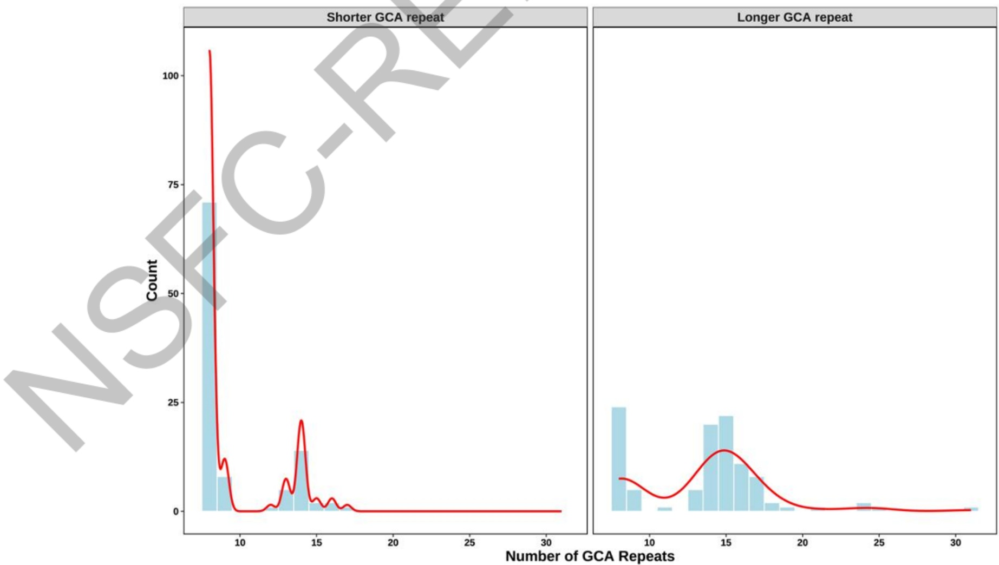

## 6）基于 WGS 技术检测 SCA3 患者 ATXN3-CAG 的结果

基于 WGS 结果，1,146 例 SCA3 患者的 $ATXN3-CAG_{exp}$ 和 $ATXN3-CAG_{norm}$ 分别为$6 0 . 9 3 { \pm } 7 . 0 6$ 次和20.38±6.93次（表3-1）。由图3-10可见， $ATXN3-CAG_{exp}$ 的范围为 30-91次，最常见的 $ATXN3-CAG_{exp}$ 依次为61次（82/1,146，7.16%），62次（70/1,146，6.11%），55次（69/1,146，6.02%）； $ATXN3-CAG_{norm}$ 的范围为14-70次，最常见的 $ATXN3-CAG_{norm}$依次为14次（531/1,146，46.34%），27次（140/1,146，12.22%），28次（102/1,146，8.90%）。

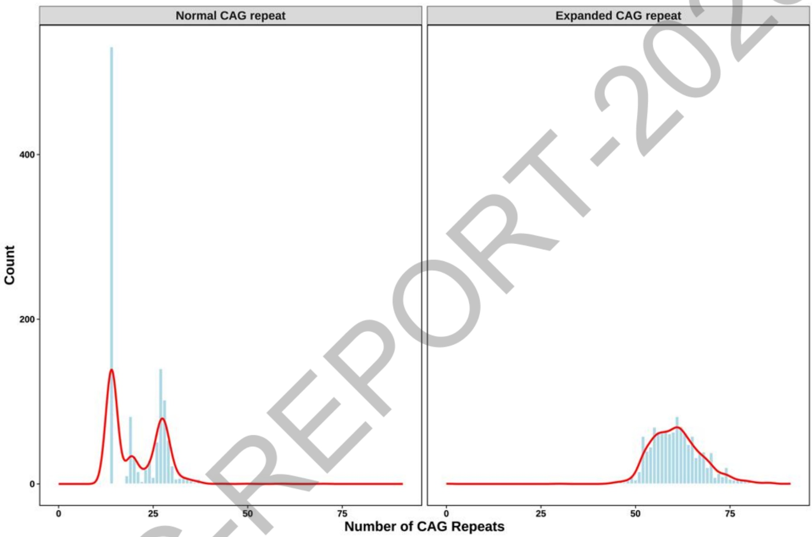

图 3-10 1,146 例 SCA3 患者基于 WGS 技术的 ATXN3-CAG 结果图

附注:图中 x 轴代表ATXN3 基因 CAG 拷贝数（ATXN3-CAG），y轴代表频数（Count）。浅蓝色柱状代表某一ATXN3-CAG的患者频数，红色实线为根据频数拟合的密度曲线。

## 7）基于WGS技术检测短串联重复序列准确性评估结果

本研究旨在基于候选基因策略，探讨 GLS 基因中的 GCA 重复序列是否对 SCA3 患者的AAO具有修饰作用。由于本研究中所有 SCA3患者的 GLS基因GCA重复拷贝数均通过WGS-ExpansionHunter方法获得，因此有必要评估该方法在检测该重复序列时的准确性与可靠性。为此，我们将基于已有数据，从以下三个方面对WGS-ExpansionHunter在短串联重复序列检测中的准确性进行全面评估。

## 7.1基于WGS结果对诊断未明共济失调患者的“诊断未明”状态的再评估结果

在本研究中，我们基于WGS数据对诊断未明共济失调患者进行了重复序列重新评估。在原有PanelA和PanelB基础上，新增近年来文献中报道的共济失调相关基因构建PanelC（包括 GLS），使用ExpansionHunter 对这三个Panel 中所有相关共济失调基因的重复序列拷贝数进行计算，以验证WGS检测与前期PCR筛查在判定“未达致病阈值”这一诊断未明状态上的一致性。分析结果显示，所有目标基因的的STR结果均未超过对应的阈值（图3-11），这一结果表明，基于WGS的 STR检测能够与先前PCR筛查一致地将上述患者归类为“诊断未明”，即WGS在重复序列异常排除方面具备可靠性和一致性。

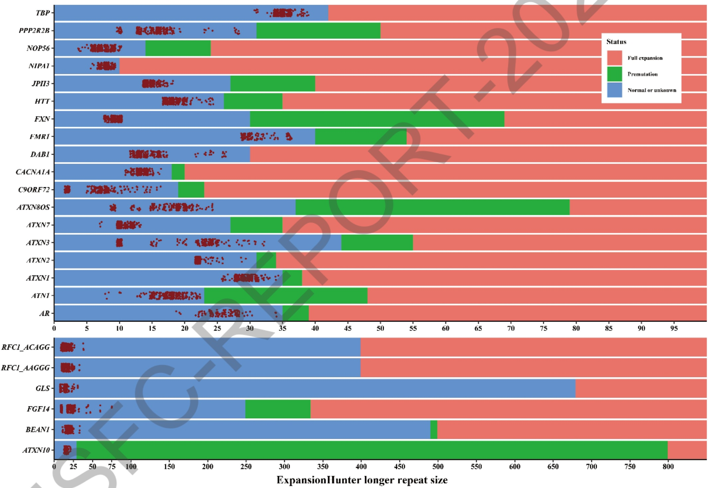

图 3-11 104 例诊断未明共济失调患者基于 WGS 技术筛查 Panel 基因重复序列拷贝数结果图

每个红色散点代表每一个样本中较长重复等位基因（longer repeat allele）的重复序列长度。色条分别表示正常或未知区间（蓝色）、临界区间（绿色）以及完全致病区间（红色）。每个基因的具体阈值范围详见表2-1。从图中结果可以看出，104例诊断未明共济失调患者在这些Panel基因均未检测到异常扩增重复序列，这一结果与前期PCR检测结果一致。

## 7.2 SCA3 患者基于 WGS 和 PCR 检测 ATXN3-CAG 的一致性比较结果

在本研究中，1,146 例 SCA3 患者在接受 WGS 测序前，均已通过 RP-PCR/CE明确ATXN3-CAG $(ATXN3-CAG_{norm}/ATXN3-CAG_{exp})$ ，以明确SCA3的诊断。然后，基于WGS数据，使用 ExpansionHunter 重新评估 $ATXN3-CAG_{norm}/ATXN3-CAG_{exp}$ 。为验证 WGS检测结果的准确性，我们系统比较了SCA3患者样本中WGS与PCR两种方法所得的$ATXN3-CAG_{norm}/ATXN3-CAG_{exp}$ 结果（表3-3）。

首先，我们比较了两种方法在 $ATXN3-CAG_{norm}$ (CAG重复数<50）检测中的差异，并采用Wilcoxon秩和检验进行统计分析（图3-12）。结果显示，两组之间存在轻微但有统计学意义的差异 $(p < 0.05)$ ，但该差异可能受到少数极端离群值的影响。在剔除部分异常值后，两组差异即不再显著（结果未展示）。相比之下，对于 $A \check { T } X N \bar { 3 } \text { - } \underline { \mathrm { C A G } } _ { \mathrm { e x p } }$ (CAG 重复拷贝数>50），两种检测方法之间存在显著差异，且整体上WGS测得的重复次数低于PCR测得的结果（图3-12）。

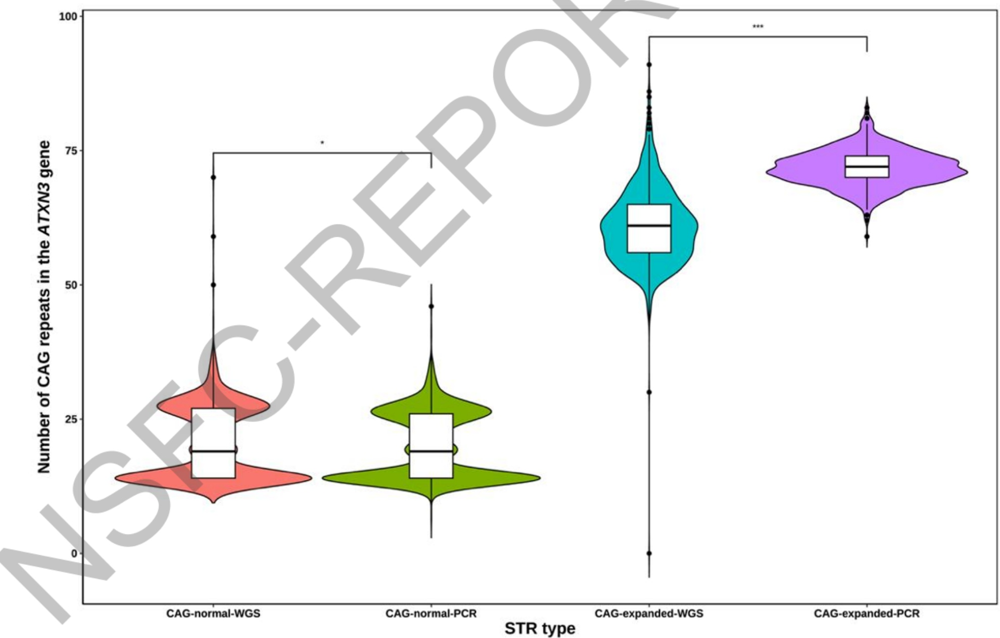

图 3-12 1,146 例 SCA3 患者不同检测方法下 ATXN3-CAG 的比较

附注:图中小提琴图展示了通过 WGS 和PCR检测的不同 STR类型中，ATXN3-CAG的分布情况，涵盖正常和扩增等位基因。图中叠加箱线图，显示中位数及其四分位范围。组间差异采用Wilcoxon秩和检验进行比较。\*表示p<0.05，\*\*\*表示p<0.001。WGS=全基因组测序；PCR=聚合酶链式反应。

表 3-3 受试者 WGS 和 PCR检测重复拷贝数差值表

<table><tr><td rowspan="2"></td><td colspan="2">SCA3 患者（n=1,146）</td><td colspan="2">诊断未明共济失调患者（n=104）</td></tr><tr><td> $ATXN3-CAG_{norm}$ </td><td> $ATXN3-CAG_{exp}$ </td><td> $\mathrm { G L S - G C A _ { s h o r t e r } }$ </td><td> $\mathrm { G L S - G C A _ { l o n g e r } }$ </td></tr><tr><td>||=0</td><td>674（58.81%）</td><td>12（1.05%）</td><td>98（94.24%）</td><td>92（88.46%）</td></tr><tr><td>||=1</td><td>425（37.09%）</td><td>38（3.32%）</td><td>3（2.88%）</td><td>10（9.62%）</td></tr><tr><td>||=2</td><td>23（2.01%）</td><td>31（2.71%）</td><td>0</td><td>2（1.92%）</td></tr><tr><td>||&gt;3</td><td>22（1.92%）</td><td>1012（88.30%）</td><td>3（2.88%）</td><td>0</td></tr><tr><td>NA</td><td>2（0.17%）</td><td>53（4.62%）</td><td>0</td><td>0</td></tr></table>

附注: $ATXN3-CAG_{exp}=ATXN3$ 扩增等位基因CAG重复拷贝数； $ATXN3-CAG_{norm}=ATXN3$ 常等位基因重复CAG 重复拷贝数； $GLS-GCA_{short}=GLS$ 正常等位基因短链 GCA 重复拷贝数 $\mathrm{GLS}_{\bar{}} \mathrm{GCA}_{\mathrm{longer}} = \mathrm{GLS}$正常等位基因长链 GCA 重复拷贝数；| |=WGS 与 PCR 检测重复拷贝数结果差值的绝对值；NA，代表 WGS检测拷贝数失败。

随后，我们采用 Bland-Altman 方法评估了 WGS 与 PCR 在 $ATXN3-CAG_{norm}$ 检测中的一致性。结果显示，两者的平均差值（WGS-PCR）略大于零，提示WGS测量值整体上略高于PCR。超过95%的样本差值位于一致性限（平均差值±1.96SD）范围内，表明整体一致性良好（图3-13A）。然而，在CAG重复次数较高的样本中，WGS测值偏高的趋势更为明显，提示可能存在比例性偏倚。进一步的Spearman秩相关分析显示，两种方法在$ATXN3-CAG_{norm}$ 检测中高度相关（R=0.94， $p < 2.2 \times 10^{-16}$ （图3-13B），进一步支持WGS在检测中等长度三核苷酸重复时的可靠性。

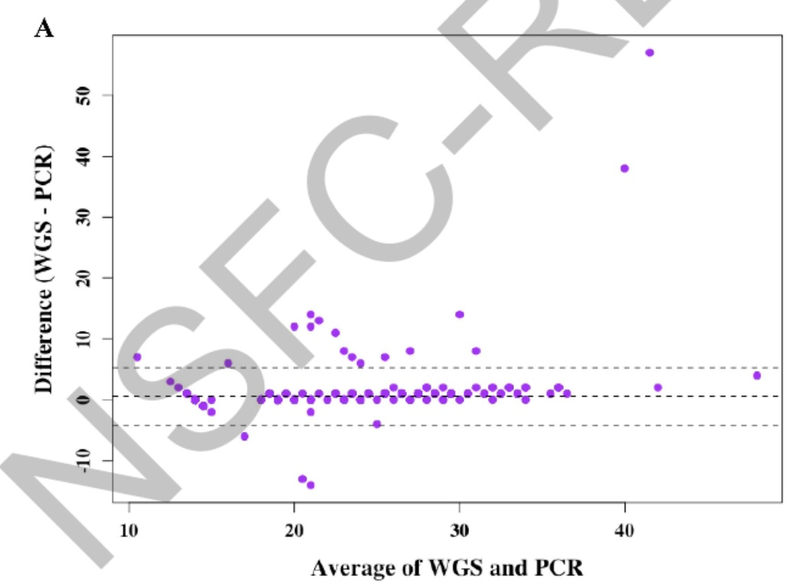

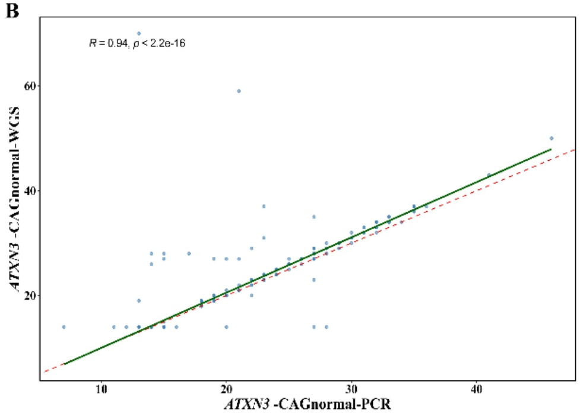

图 3-13 1,146 例 SCA3 患者不同检测方法下 $ATXN3-CAG_{norm}$ 结果一致性分析

附注:图A展示了WGS与PCR测得的 $ATXN3-CAG_{norm}$ 之间 Bland-Altman一致性分析结果。x 轴为WGS和PCR测量值的平均值，纵轴为两者之差（WGS-PCR）。中心虚线表示平均差值，其他两条虚线表示95%一致性限（均值±1.96×标准差）。图B散点图展示了WGS与PCR测得 $ATXN3-CAG_{norm}$之间的相关性结果。图中每个点代表一个样本，红色虚线表示理论一致性线 $( \mathrm { y } { = } \mathrm { x } )$ ，绿色实线为线性回归拟合曲线。相关性分析使用 Spearman秩相关系数计算。

在对 $ATXN3-CAG_{exp}$ （CAG重复次数>55）的比较中。WGS与PCR结果存在高度显著差异 $p < 0.001$ ，图3-12），且差异程度明显大于 $\mathrm { C A G _ { n o r m } }$ 。与前者类似，WGS检测结果中也存在若干异常离群值。Bland-Altman 分析结果表明，尽管WGS 与PCR在 $\mathrm { C A G } _ { \mathrm { e x p } }$ 检测中的一致性略低于 $\mathrm { C A G _ { n o m } } ,$ ，但整体上仍有超过95%的样本差值落在一致性限范围内（图3-14A），提示两者在多数情况下具有良好一致性。然而，Spearman相关性分析显示，两种方法在 ATXN3-CAGexp检测中仅呈现较弱相关性 $R=0.12,\ p<2.3\times10^{-5}$ 图3-14B），提示 WGS 在检测长 CAG 重复时的准确性不如中等重复长度的检测。

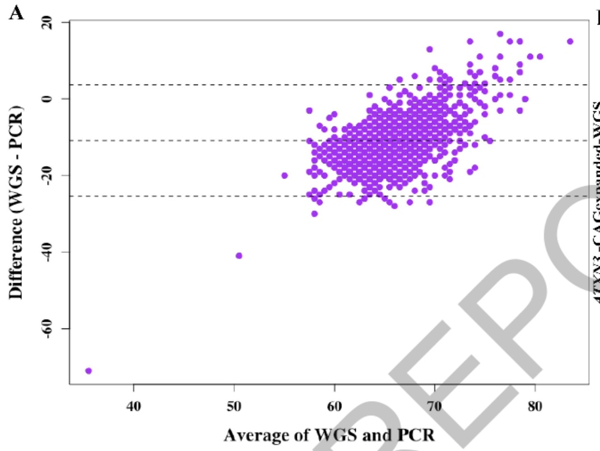

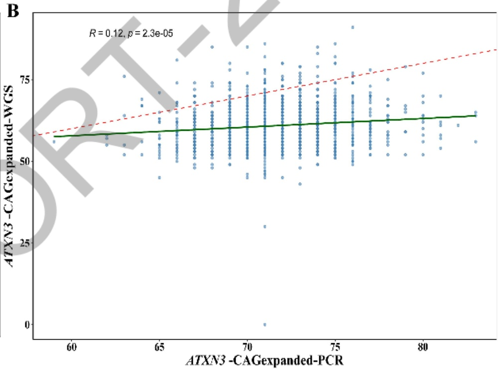

图 3-14 1,146 例 SCA3 患者不同检测方法下 $ATXN3-CAG_{exp}$ 结果一致性分析

附注:图 A 展示了 WGS 与 PCR 测得的 $ATXN3-CAG_{exp}$ 之间的 Bland-Altman一致性分析结果。图 B散点图展示了 WGS 与 PCR测得 $ATXN3-CAG_{exp}$ 之间的相关性结果。余附注同图3-13。

## 7.3 诊断未明共济失调患者基于 WGS 和 PCR 检测 GLS-GCA 的一致性比较结果

在本研究中，对104 例诊断未明共济失调患者完成WGS后，我们基于 WGS 数据，利用ExpansionHunter软件重新评估 $GLS-GCA_{ shorter } (GCA$ 重复拷贝数 $< 20 / GLS - GCA_{ longer } (GCA$重复拷贝数<35）。为验证WGS检测结果的准确性，我们同样在诊断未明共济失调患者样本中系统比较了 WGS 和 PCR两种方法在 $GLS-GCA_{ shorter } / GLS-GCA_{ longer }$ 检测中的表现。

首先，我们使用Wilcoxon秩和检验比较了两种方法检测 $GLS-GCA_{ shorter }/GLS-GCA_{ longer }$结果之间的差异（图3-15）。结果显示，WGS与PCR在 $GLS-GCA_{shorter}/GLS-GCA_{longer}$ 检测中结果无显著差异 $(p>0.05)$ ，提示两种方法之间具有良好的一致性。

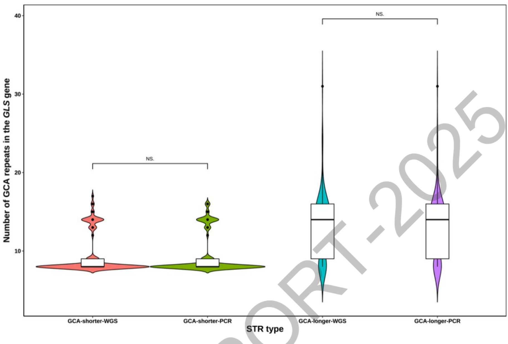

图 3-15 104 例诊断未明共济失调患者不同检测方法 GLS-GCA 的比较

附注:小提琴图展示了通过 WGS 和 PCR 检测的不同 STR 类型中 GLS-GCA 的分布情况，涵盖正常和扩增等位基因。图中叠加箱线图，显示中位数及其四分位范围。组间差异采用Wilcoxon秩和检验进行比较。NS.表示 $p { \geq } 0 . 0 5$ 。WGS=全基因组测序；PCR=聚合酶链式反应。

其次，我们采用Bland-Altman方法进一步评估了WGS 与PCR在测量结果上的一致性。结果均显示，两者的平均差值几乎都等于零（表3-2）。超过95%的样本两者差值位于平均差值±1.96 SD范围内，表明二者具有很好的一致性(图3-16A和图3-16B)。此外，Spearman秩相关分析结果验证了两种方法在 $GLS-GCA_{shorter}/GLS-GCA_{longer}$ 检测中的强相关性。结果显示，两种方法高度相关 $(GLS-GCA_{shorter}$ $\mathrm { R } { = } 0 . 9 1$ $p < 2 . 2 \times 1 0 ^ { - 1 6 }$ ，图 2-19A; $GLS-GCA_{ longer }$ R=0.98, $p < 2 . 2 \times 1 0 ^ { - 1 6 }$ ，图2-19B），WGS技术在检测中等长度CAG重复数时的可靠性。

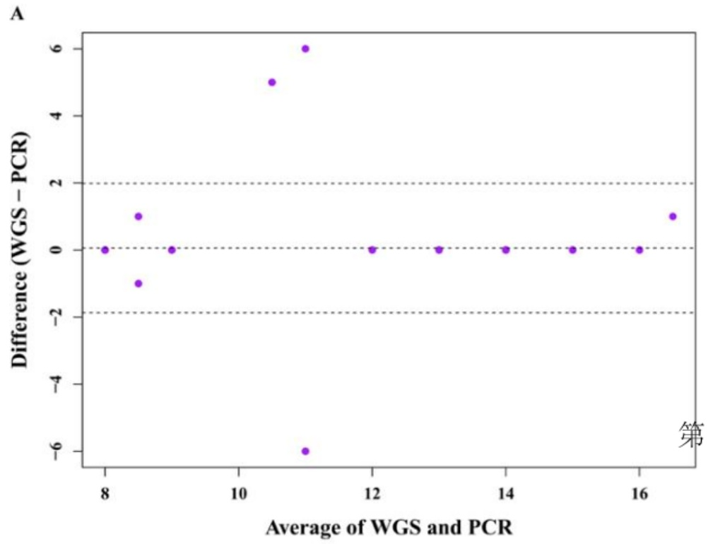

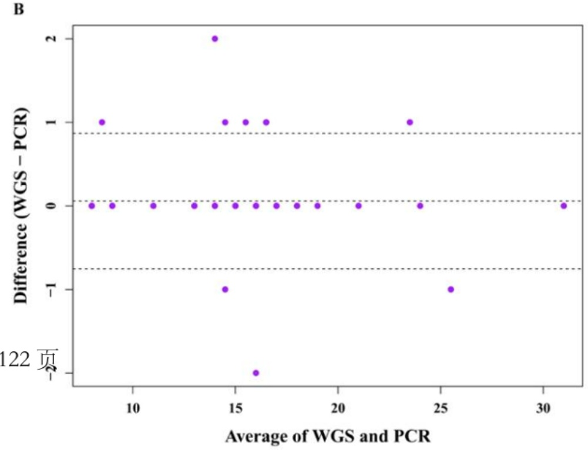

图 3-16104 例诊断未明患者不同检测方法 $GLS-GCA_{ shorter } / GCA_{ longer }$ 一致性分析:Bland-Altman图

附注:图中展示了 WGS 与 PCR 测得的 GLS-GCA之间的 Bland-Altman 一致性分析结果。图 A 中展示了 WGS 与 PCR 测得的 $GLS-GCA_{short}$ 之间的 Bland-Altman一致性分析结果。图 B 中展示了 WGS与 PCR 测得的 $GLS-GCA_{longer}$ 之间的Bland-Altman一致性分析结果。图中大部分点落在一致性限范围内，提示两种方法具有良好的一致性，少数超出一致性限的点也偏离不远。余附注同图3-13。

最后，我们比较了所有样本中WGS与PCR测得的重复序列拷贝数之间的相关性。结果显示，当重复拷贝数小于50次时（图3-17），Spearman相关系数最高可达0.98；然而，当重复拷贝数超过50次时（图3-13），Spearman相关系数则降至0.12。整个数据来看，Spearman相关系数为0.94。这些结果表明，WGS技术在检测中等长度短串联重复序列（重复次数<50次）时具有较高的可靠性；但随着重复次数增加≥50次，其准确性有所下降。总体而言，WGS技术的检测结果准确性仍较高。结合本研究中WGS对$GLS-GCA_{shorter}/GLS-GCA_{longer}$ 检测结果的表现，证明了 WGS 技术在检测 GLS 基因 GCA 重复拷贝数方面的高可靠性，为后续探讨 $G L \mathcal { S }$ 基因 GCA 重复对 SCA3 患者的修饰作用研究提供了坚实基础。

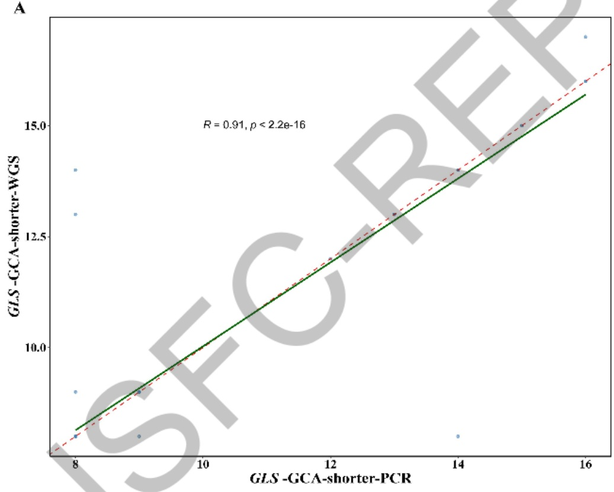

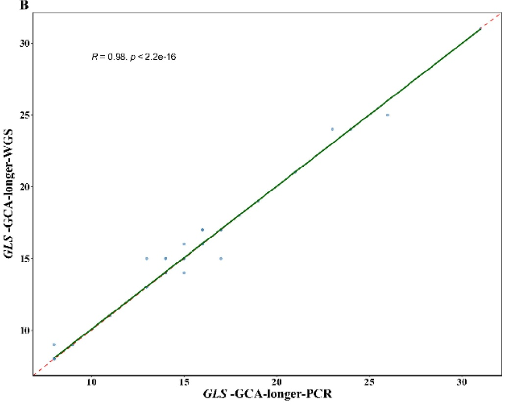

图3-17 104 例诊断未明患者不同检测方法下 $GLS-GCA_{shorter}/GLS-GCA_{longer}$ 结果相关性分析

附注:图 A 散点图展示了 WGS 与 PCR 测得的 $GLS-GCA_{short}$ 之间的 Spearman 相关性 $( \mathsf { p } )$ ，图B散点图展示了 WGS 与 PCR 测得的 $GLS-GCA_{longer}$ 之间的 Spearman 相关性 $( \rho )$ 。图中每个点代表一个样本，红色虚线表示理论一致性线（y=x），绿色实线为线性回归拟合曲线。相关性分析使用Spearman秩相关系数计算，结果表明两种方法在 $GLS-GCA_{short}$ 测量中具有高度一致性。

## 8）GLS基因中 GCA重复序列对 SCA3患者 AO修饰作用结果

在本研究中，SCA3 患者的 AO大部分受到 $ATXN3-CAG_{exp}$ 的影响，其调整后的决定系数（R²）为0.5558（图3-2）。为评估GLS基因中的GCA重复序列对AO的潜在修饰作用，我们采用协方差分析，将 $ATXN3-CAG_{exp}$ 作为协变量进行校正（以连续变量形式纳入模型)。我们分别将 $GLS-GCA_{shorter}/GLS-GCA_{longer}$ 作为连续变量和分类变量，探讨其对AO的影响。作为连续变量时，协方差分析未发现GCA重复序列长度与AO显著相关（ $(GLS-GCA_{shorter})$ $p=0.994;\;GLS-GCA_{ longer };\;p=0.686$ O

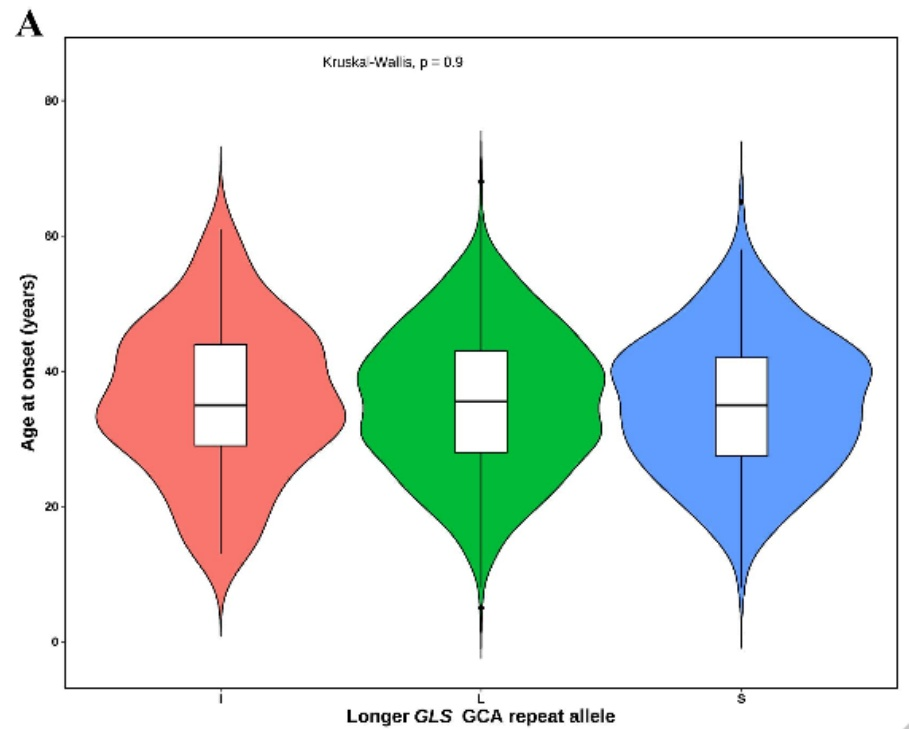

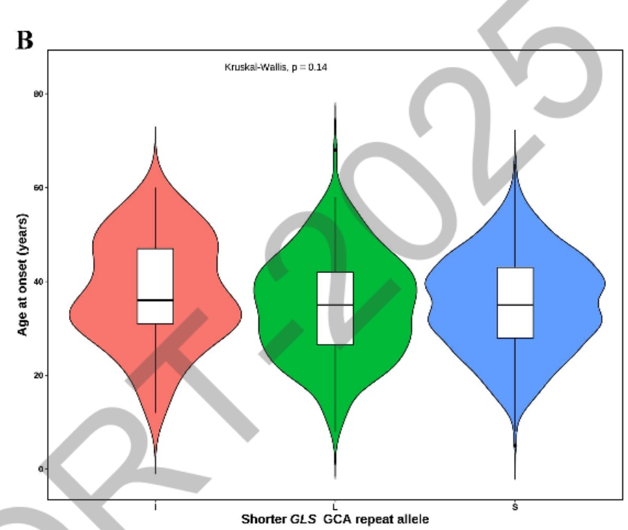

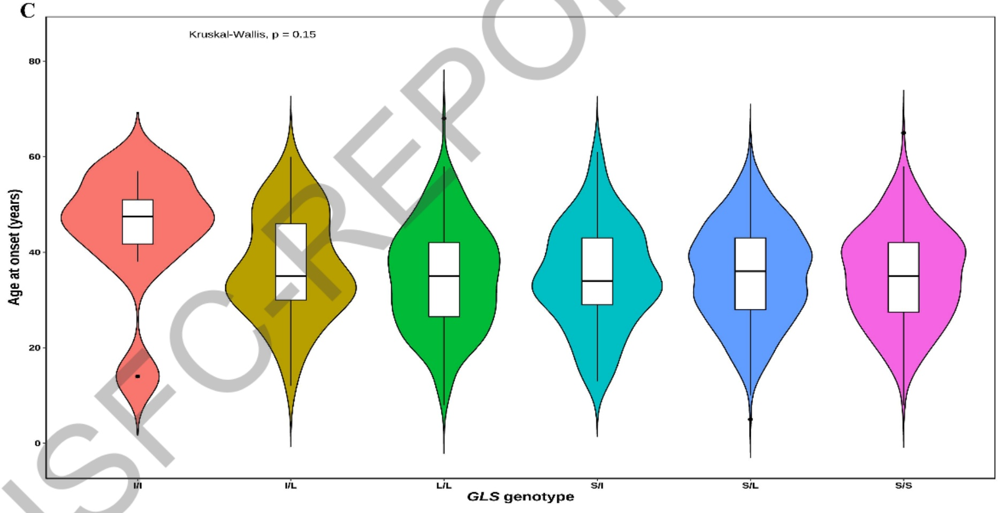

图3-18 不同长度 $GLS-GCA_{short}$ $GLS-GCA_{longer}$ 和 GLS-GCA 基因型分类样本 AO 的比较

附注:图A 中展示了不同长度 $GLS-GCA_{short}$ 分类（S、I、L）SCA3 患者 AO的比较。图 B 中展示了不同长度 $GLS-GCA_{longer}$ 分类（S、I、L）SCA3患者 AO的比较。图C 中展示了不同长度GLS-GCA基因分型（S/S、S/I、S/L、I/I、I/L、L/L）SCA3患者AO的比较。数据以小提琴图形式呈现，并叠加箱线图用于显示分布范围与中位数。统计分析采用Kruskal-Wallis秩和检验。

随后，我们将 $GLS-GCA_{short}$ 和 $GLS-GCA_{longer}$ 作为分类变量:按GCA重复次数将其划分为三类:短型（Short，S≤9次重复）、中间型（Intermediate，9次重复&lt;I≤13次重复）和长型（Long，L&gt;13次重复）。基于等位基因的组合，每个样本的GLS基因型被划分为六种:S/S、S/I、S/L、I/I、I/L和L/L。不同分类之间的AO并无统计学显著差异（图3-18）。但我们观察到， $GLS-GCA_{short}$ 和$GLS-GCA_{longer}$ 的中间型GCA重复序列（I，图3-19和图3-20），以及部分GLS基因型（I/L、I/I和S/I，图3-21）中，AO相对较晚。

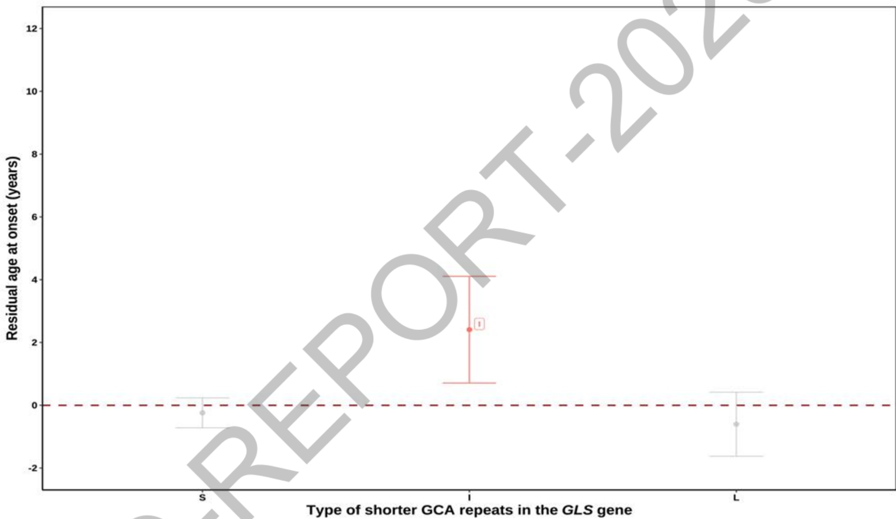

图 3-19 不同 GCA 重复长度的 $GLS-GCA_{short}$ 与患者 $\mathrm { A O _ { R E } }$ 的关系

附注 中展示了不同长度 $GLS-GCA_{short}$ 分类（S、I、L）SCA3患者 $\mathrm { A O _ { R E } }$ 的均值及其 95%CI。 x 轴为不同 GCA 重复长度的 $GLS-GCA_{short}$ 分类，y 轴为 SCA3 患者的 $\mathrm { A O _ { R E } }$通过点线图结合误差棒表示每一类的 $\mathrm { A O _ { R E } }$ 均值和95%CI，红色虚线表示零基线。图中均值$\mathrm { \overline { { A O } } _ { R B } }$ 大于0的组别（I）用标签和颜色进行高亮。

具体而言， $GLS-GCA_{longer}$ 和 $GLS-GCA_{short}$ 的Ⅰ组平均发病年龄残差$( mean-AO _{ RE })$ 分别为0.75年（95%CI:-0.56至2.06年）和2.41年（95%CI:0.71至4.11年）。三种GLS基因型的 $\mathrm{mean-AO_{RE}}$ 分别为: $I/I= 5.70$ 年（95%CI: 0.59至10.81年）， $I/L= 2.00$ 年（95%CI:0.18至3.82年）， $\mathrm{S/I{=}0.29}$ 年（95%CI: -1.05至1.63年)。各组样本量分别为:在 $GLS-GCA_{longer}$ 的I组93人、 $GLS-GCA_{short}$的I组73人、I/I组8人、I/L组65人，S/I组85人（见表3-4和3-5）。

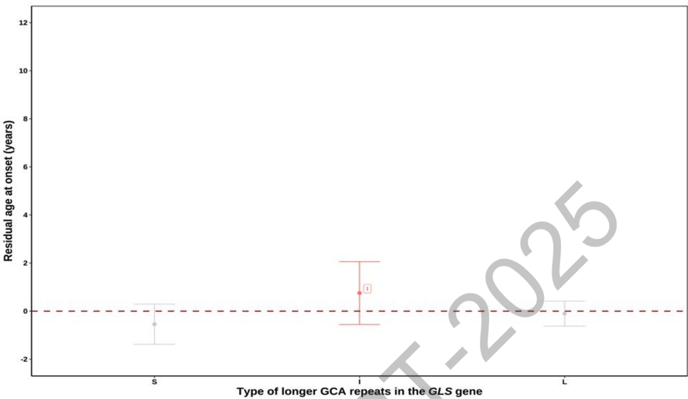

图 3-20 不同 GCA 重复长度的 $GLS-GC_{Al-eger}$ 与患者 $\mathrm { A O _ { R E } }$ 的关系

附注:图中展示了不同长度 $GLS-GCA_{ longer }$ 分类（S、I、L）SCA3患者 $\mathrm { A O _ { R E } }$ 的均值及其95%置信区间。X轴为不同GCA重复长度的 $\overline { { G L S - G C A _ { l o n g e r } } }$ 分类，y 轴为 SCA3 患者的 $\mathrm { A O _ { R E } }$ C通过点线图结合误差棒表示每一类的 $\zeta _ { \mathrm { A O _ { R } E } }$ 均值和95%CI，红色虚线表示零基线。图中均值$\mathrm { A O _ { R E } }$ 大于0的组别（I）用标签和颜色进行高亮。

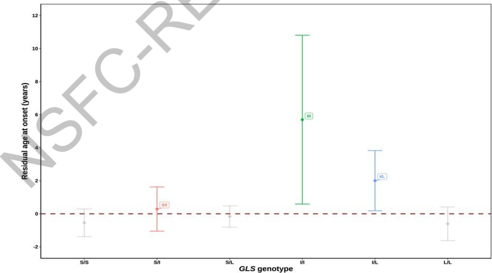

图 3-21 不同 GCA 重复长度的 GLS 基因型与患者 $\mathrm { A O _ { R E } }$ 的关系

附注:图中展示了不同 GCA 重复长度的 GLS 基因型（S/S、S/I、S/L、I/I、I/L和L/L）

SCA3 患者 $\mathrm { A O _ { R E } }$ 的均值及其95%置信区间。x轴为不同 GCA重复长度的 GLS基因型，y轴为 SCA3 患者的 $\mathrm { A O _ { R E } }$ 。通过点线图结合误差棒表示每一类的 $\mathrm { A O _ { R E } }$ 均值和95%CI，红色虚线表示零基线。图中均值 $\mathrm { A O _ { R E } }$ 大于0的组别（S/I、I/I、I/L）用标签和颜色进行高亮。

表 3-4 GLS 基因 GCA 重复拷贝数对 SCA3 患者 AO 的修饰作用

<table><tr><td rowspan="2">变量</td><td colspan="3">GLS-GCAshorter</td><td colspan="3"> $GLS-GCA_{longer}$ </td></tr><tr><td>S</td><td>I</td><td>L</td><td>S</td><td>I</td><td>L</td></tr><tr><td>样本量 n (%)</td><td>862(75.22)</td><td>73(6.37)</td><td>211(18.41)</td><td>275(24.00)</td><td>93(8.11</td><td>78(67.89)</td></tr><tr><td>AAOo</td><td>35.36</td><td>37.67</td><td>34.72</td><td>35.20</td><td>35.70</td><td>35.40</td></tr><tr><td></td><td>[34.67,36.05] 35.51</td><td>[35.03,40.31] 35.26</td><td>[33.23,36.21] 35.32</td><td>[33.99,36.41] 35.70</td><td>[33.39,38.01] 34.90</td><td>[34.66,36.14] 35.40</td></tr><tr><td> $\mathrm { A A O _ { p } }$ </td><td>[35.02,36.00] -0.24</td><td>[33.72,36.81]</td><td>[34.21,36.43]</td><td>[34.85,36.58]</td><td>[32.57,37.20]</td><td>[34.91,36.18]</td></tr><tr><td> $\mathrm { A A O _ { R E } } ^ { \pmb { \mathfrak { k } } }$ </td><td>[-0.72,0.24]</td><td>2.41 [0.71,4.11]</td><td>-0.60 [-1.62,0.42]</td><td>-0.54 [-1.38,0.30]</td><td>0.75 [-0.56,2.06]</td><td>-0.10 [-0.84,0.64]</td></tr></table>

附注: $\mathrm{AO_{0}=obscrved   AO}$ ，实际观察到的 $\mathrm { A O } _ { \mathcal { A } }$ 也即本研究定义的开始出现共济失调症状的发病年龄； $\mathrm{AO_{p}=prelected~AO}$ ，预测的AO AORE=residual AO，发病年龄残差；$GLS-GCA_{ longer } = GLS$ 正常等位基因长链 GCA 重复拷贝数； $GLS-GCA_{ shorter } = GLS$ 正常等位基因短链GCA重复拷贝数；按GCA重复次数大小将其划分为短型（Short，S≤9次重复）、中间型（Intermediate，9次重复&lt;I≤13次重复）和长型（Long，L&gt;13次重复）。数据以n（%）或均值[95%CI]表示；加粗字体表示具有统计学意义的阳性结果。

表 3-5 GLS 基因型对 SCA3 患者 AO 的修饰作用

<table><tr><td rowspan="2">变量</td><td colspan="2"></td><td colspan="4">GLS 基因型</td></tr><tr><td>S/S</td><td>S/I</td><td>S/L</td><td>I/I</td><td>I/L</td><td>L/L</td></tr><tr><td>样本量</td><td>275(24.00)</td><td>85(7.42)</td><td>502(43.80)</td><td>8(0.70)</td><td>65(5.67)</td><td>211(18.41)</td></tr><tr><td>n (%)</td><td>35.17</td><td>34.88</td><td>35.55</td><td>44.13</td><td>36.88</td><td>34.70</td></tr><tr><td> $\mathrm { A O _ { 0 } , }$ </td><td>133 .97,36.38]</td><td>[32.57,37.20]</td><td>[34.64,36.45]</td><td>[32.61,55.64]</td><td>[34.19,39.57]</td><td>[33.21,36.19]</td></tr><tr><td>AOp</td><td>35.72</td><td>34.88</td><td>35.54</td><td>38.43</td><td>34.87</td><td>35.32</td></tr><tr><td></td><td>[34.85,36.58]</td><td>[32.57,37.20]</td><td>[34.91,36.18]</td><td>[31.30,45.55]</td><td>[33.30,36.44]</td><td>[34.21,36.43]</td></tr><tr><td> $\mathrm { A O _ { R E } ^ { \mathrm { ~ \textbar ~ } } }$ </td><td>-0.54</td><td>0.29</td><td>-0.16</td><td>5.70</td><td>2.00</td><td>-0.60</td></tr><tr><td></td><td>[-1.38,0.29]</td><td>[-1.05,1.63]</td><td>[-0.81,0.48]</td><td>[0.59,10.81]</td><td>[0.18,3.83]</td><td>[-1.62,0.42]</td></tr></table>

附注:S/S 代表 GLS 基因型中 $GLS-GCA_{short}$ 和 $GLS-GCA_{longer}$ 两条等位基因的 GCA 重复拷贝数均为短型 $( \mathrm { S } { \leq } 9$ 次重复），依此类推。余附注同表3-5。

综上，基于候选基因策略，我们利用dWGS数据，结合高灵敏度与特异性的生物信息学工具 ExpansionHunter，系统评估了GLS 基因 GCA重复拷贝数（GLS-GCA）对SCA3患者AO中的潜在修饰作用。本研究首次发现，GLS基因中等长度的非扩增型GCA重复序列（I型:9<拷贝数≤13）可显著延迟SCA3的发病时间，为理解SCA3复杂的遗传调控机制提供了新的分子线索。

## 3. 研究人员的合作与分工。

本项目由项目负责人江泓教授进行总体指导，由江泓教授负责在中南大学湘雅医院神经内科门诊的遗传性共济失调患者的诊断，陈召副研究员、翁翎副主任医师、王春荣助理研究员、师玉亭副主任技师、彭慧蓉主管技师、何浪助理研究员负责SCA3患者相关样本的采集并完善相关临床资料的登记。雷利静博士、彭林柳助理研究员负责具体实验实施。其中雷利静博士负责全基因组常见变异关联研究部分以及候选基因关联研究；彭林柳助理研究员负责全基因组罕见变异关联研究部分。

## 4. 国内外学术合作交流等情况。

举办和参与国内专业学会和国际交流会议

| 会议名称 | 主办单位 | 级别 | 时间 | 负责/参与 |
| --- | --- | --- | --- | --- |
| 第二期国家老年疾病临床医学研究中心适宜技术推广项目-肛门括约肌肌电图在神经退行性疾病诊断中的应用线上推广 | 国家老年疾病临床医学研究中心(湘雅医院) | 国家级 | 2022.11 | 负责 |
| 2022 年 Ataxia Global Initiative（AGI）business meeting （线上） | AGI | 国际 | 2022.11 | 参与 |
| 2023 年 Ataxia Global Initiative（AGI）business meeting（线上） | AGI | 国际 | 2023.11 | 参与 |
| 2024 年 Ataxia Global Initiative（AGI）business meeting（线上） | AGI | 国际 | 2024.11 | 参与 |
| 2025 年 Ataxia Global Initiative AGI)business meeting（线上） | AGI | 国际 | 2025.12 | 参与 |
| 2025 Cold Spring Harbor Asia Conference-Short Tandem Repeats in Gene Regulationand Disease | CSH Asia | 国际 | 2025.11 | 参与 |
| 中华医学会第二十五届全国神经病学学术会议 | 中华医学会 | 国家级 | 2022.09 | 参与 |

| 中华医学会第二十六届全国神经病学学术会议 | 中华医学会 | 国家级 | 2023.09 | 参与 |  |
| --- | --- | --- | --- | --- | --- |
| 中华医学会第二十七届全国神经病学学术会议 | 中华医学会 | 国家级 | 2024.09 | 参与 |  |
| 中华医学会第二十八届全国神经病学学术会议 | 中华医学会 | 国家级 | 2025.09 | 参与 |  |
| 十五届中国医师协会神经内科医师分会年会 | 中国医师协会 | 国家级 | 2022.12 | 参与 |  |
| 十六届中国医师协会神经内科医师分会年会 | 中国医师协会 | 国家级 | 2023.06 | 参与 |  |
| 十七届中国医师协会神经内科医师分会年会 | 中国医师协会 | 国家级 | 2024.06 | 参与 | 」 |
| 第十八届中国医师协会神经内科医师分会年会 | 中国医师协会 | 国家级 | 2025.06 | 参与 |  |
| 第十一届中国罕见病高峰论坛 | 中国罕见病联盟 | 国家级 | 2022.04 | 参与 |  |
| 第十二届中国罕见病高峰论坛 | 中国罕见病联盟 | 国家级 | 2023.09 | 参与 |  |
| 2023脑炎大会-脑炎精准医学之路 | 中国罕见病联盟 | 国家级 | 2023.09 | 参与 |  |
| 2024脑炎大会-脑炎精准医学之路 | 中国罕见病联盟 | 国家级 | 2024.08 | 参与 |  |
| 第一届中国重复扩展疾病研究联盟暨潇湘神经遗传病高峰论坛 | 中国重复扩展疾病研究联盟 | 国家级 | 2023.05 | 参与 |  |
| 第二届中国核苷酸重复扩增疾病(REDs)协同创新研究会议暨神经罕见病/神经遗传病研讨会 | 中国微循环学会神经变性病专业委员会 | 国家级 | 2024.08 | 参与 |  |
| 第三届中国核苷酸重复扩增疾病(REDs)协同创新研究会议暨神经罕见病/神经遗传病研讨会 | 中国微循环学会神经变性病专业委员会 | 国家级 | 2025.06 | 参与 |  |
| 国家自然科学基金委员会“神经变性疾病的关键科学问题”学科发展战略研讨会 | 国家自然科学基金委员会 | 国家级 | 2025.12 | 参与 |  |
| 中国生物化学与分子生物学会2024年全国学术大会 | 中国生物化学与分子生物学会 | 国家级 | 2024.10 | 参与 |  |
| 中国卒中学会医疗质量管理和促进分会第十届学术年会 | 中国卒中学会 | 国家级 | 2025.03 | 参与 |  |
| 2022年湖南省医学会神经内科学专委会学术年会 | 湖南省医学会 | 省级 | 2022.08 | 参与 |  |

| 2023年湖南省医学会神经内科学专委会学术年会 | 湖南省医学会 | 省级 | 2023.10 | 参与 |
| --- | --- | --- | --- | --- |
| 2024年湖南省医学会神经内科学专委会学术年会 | 湖南省医学会 | 省级 | 2024.09 | 参与 |
| 2025年湖南省医学会神经内科学专委会学术年会 | 湖南省医学会 | 省级 | 2025.08 | 参与 |
| 第六届全国癫痫及发作性疾病高峰论坛 | 湖南省医学会 | 省级 | 2022.05 | 参与 |
| 衡山论坛-脑科学与脑疾病高峰大会暨神经病学高峰大会（二） | 湖南省神经科学学会 | 省级 | 2022.08 | 参与 |
| 潇湘神经罕见病学术沙龙 | 湖南省神经科学学会 | 省级 | 2023.09 | 参与 |
| 中国科大神经病学大会2025暨安徽省卒中学会第四次学术年会 | 安徽省卒中学会 | 省级 | 2025.03 | 参与 |
| 江苏省卒中学会第九次学术年会 | 江苏省卒中学会 | 省级 | 2025.05 | 参与 |

5. 存在的问题、建议及其他需要说明的情况。无。

## （二）成果部分

本项目从全基因组常见变异、罕见变异及GLS候选基因三个层面，系统解析了影响SCA3患者AO的遗传修饰因素。（1）在全基因组常见变异层面，鉴定出多 AO显著相关的遗传修饰位点与基因。其中，rs28801081和rs142932360两个位点达到全基因组显著性水平；FBXO33、NDUFB1和SULF2被确定为关键遗传修饰基因，提示其在调控SCA3发病年龄中可能发挥重要作用。（2）在罕见变异层面，发现一系列可影响AO的潜在遗传修饰因素，整体呈现出多基因、多基因组区域协同调控的特征，涉及编码区、调控区及基因间区等多个层面。具体而言:在基因水平上，PTER、LMO7、PMFBP1、SLC35F3、RALYL和CFAP57等基因显示出潜在的修饰效应；在基因组区域水平上，chr10:13251279-13256454（PHYH基因周围）、chr10:131873324-131876490（PPP2R2D基因附近）以及chr22:50709609-50711993（SHANK3基因内含子区）等区域与AO表现出潜在关联。（3）基于候选基因策略，系统评估了GLS基因

GCA重复序列（GLS-GCA）对AO的修饰作用，结果发现中等长度重复（I型:9<拷贝数≤13）与A0显著延迟相关，提示该重复序列可能具有潜在的保护效应。

本项目经费资助发表的SCI论文24篇，项目负责人以第一执笔人代表中华医学会神经病学分会神经遗传学组牵头撰写《中国遗传性共济失调诊治专家共识2024》1篇；获得国家发明专利1项、国际发明专利1项及软件著作权1项；获批国家自然科学基金区域创新发展联合基金1项，国家自然科学基金面项。项目负责人获评第二届金蜗牛奖罕见病医学贡献奖（2022）

## 2. 项目成果转化及应用情况。

本项目获批一项国家软件著作权，名称为“Gene4SCA临床与遗传数据库及分析平台”（登记号:2024SR0192056，江泓，赵贵虎，罗赛，李津臣，陈召）。

该软件著作权成功构建了SCA临床与遗传数据一站式查询分析平台Gene4SCA，全面地描绘了SCA的临床特征和遗传图谱。该平台一方面为临床医生提供了便捷的基因型-表型关联查询工具， 另一方面也为科研人员提供了强大的数据可视化分析界面，助力于SCA 新致病变异的挖掘与研究。

## 3. 人才培养情况。

（1） 丁子晏，毕业博士，N6-甲基腺苷在 SCA3/MJD发病机制中作用的研究，导师江泓，2022-01-01至2023-06-18

(2) 袁心容， 毕业博士，磷酸化α-syn 作为 MSA 生物标志物的应用及其调控机制研究，导师江泓，2022-01-01 至2023-11-29

J 彭林柳，毕业博士，SCA3发病年龄的临床预测模型构建与罕见变异关联研究，导师江泓，2022-01-01至2023-12-14

（4）王赏，毕业博士，基于多组学的泛素化修饰在SCA3发病机制中的作用研究，导师江泓，2022-01-01至2023-11-29

（5）邓琪，毕业博士，Ataxin-3-KLF4-Nrf2轴介导的铁死亡调控在 SCA3发病机制中的作用研究，导师江泓，2022-01-01至2025-11-25

（6） 唐翠伶，毕业博士，突触囊泡糖蛋白2A在SCA3发病机制中的作用研究，导师江泓，2022-09-01至2025-11-25

（7）陈大吉，毕业硕士，基于SV2A-PET显像的多系统萎缩患者突触密

度特征研究，导师江泓，2022-01-01至2023-06-18

(8）刘攀艳，毕业硕士，中国遗传性共济失调突变频率更新与临床特征分析，导师江泓，2022-01-01至2023-06-26

（9）罗赛，毕业硕士，SCA临床与遗传数据一站式查询分析平台的构建，导师江泓，2022-01-01至2023-06-26

（10）朱素丹，毕业硕士，基于 CRISPR/Cas9的新型 MSA 小鼠模型构建及其肠道菌群特征探究，导师江泓，2022-01-01 至2024-06-22

（11）付友，毕业硕士，MSA患者定量步态分析及其多模态影像特征研究，导师江泓，2022-01-01 至2024-06-22

（12）邓飞燕，毕业硕士，退行性共济失调患者视觉通路的影像学和电生理特征研究，导师江泓，2022-01-01 至 2024-06-22

（13）杜可芳，毕业硕士，MSA患者外周免疫特点及自身抗体谱特征的初步研究，导师江泓，2022-09-01至2025-06-23

（14）在读博士（雷利静、袁红玉、丁思羽、沈小凯、万娜、胡健、龚依晴、谭燕、欧阳日威、董梦圆、贺嘉玮、陈大吉、伍崎、彭荆紫、崔子婷、龙沁、裴转、何茹清、吕茴、董鑫宇、王柳、何宇腾）

（15）在读硕士（黄欣、龙夏菲、吴晓康、董骁、邹莹、肖欣盈、黄沁林、曾达仁、曾麟懿、曾晶、 李子杰）

培养在站博士后7名（何浪、万林林、陈召、彭林柳、王春荣、于之洋、邓淑文) 培养博士研究生44名，其中已毕业22名，在读22名；培养硕士研究生38名， 其中已毕业27名，在读11名。培养的学生中，获得2025年硕士研究生国家奖学金（董骁）、2025年校长创新奖学金（龚依晴）、2022年中南大学校长奖学金拔尖奖（彭林柳）、2022年中南大学优秀博士学位论文（彭云）。

4. 其他需要说明的成果。

无。

5. 项目成果科普性介绍或展示网站。

无。

## 研究成果目录

项目负责人通过系统，从文献库中检索研究成果或者按要求格式自行填入。请按照期刊论文、会议论文、学术专著、专利、会议报告、标准、软件著作权、科研奖励、人才培养、成果转化的顺序列出，其它重要研究成果如标本库、科研仪器设备、共享数据库、获得领导人批示的重要报告或建议等，应重点说明研究成果的主要内容、学术贡献及应用前景等。

项目负责人不得将非本人或非参与者所取得的研究成果、与受资助项目无关的研究成果、未标注国家自然科学基金资助和项目批准号的论文以及取得时间早于项目资助期开始时间的研究成果列入报告中。发表的研究成果（包括专利），项目负责人和参与者均应如实注明得到国家自然科学基金项目资助和项目批准号，科学基金作为主要资助渠道或者发挥主要资助作用的，应当将自然科学基金作为第一顺序进行标注。

## 期刊论文

(1) Linliu Peng; Yun Peng; Zhao Chen; Chunrong Wang; Zhe Long; Huirong Peng; Yuting Shi; Lu Shen; Kun Xia; Vanessa B Leotti; Laura Bannach Jardim; Beisha Tang; Rong Qiu; Hong Jiang; The progression rate of spinocerebellar ataxia type 3 varies with disease stage, Journal of Translational Medicine, 2022, 20(1). 第五标注

(2) Yun Peng; Linliu Peng; Zhao Chen; Huirong Peng; Puzhi Wang; Youming Zhang; Yangping Li; Chunrong Wang; Yuting Shi; Xuan Hou; Zhe Long; Hongyu Yuan; Na Wan; Linlin Wan; Keqin Xu; Lijing Lei; Shang Wang; Lang He; Yue Xie; Yiqing Gong; Qi Deng; Guangdong Zou; Zhichao Tang; Lu Shen; Kun Xia; Rong Qiu; Thomas Klockgether; Beisha Tang; Hong Jiang; The Natural History of Spinocerebellar Ataxia Type 3 in Mainland China: A 2-Year Cohort Study, Frontiers in Aging Neuroscience, 2022, 14: 917126. 第二标注

(3) Yuting Shi; Linliu Peng; Guangdong Zou; Zhao Chen; Linlin Wan; Zhichao Tang; Xuan Hou; Huirong Peng; Chunrong Wang; Lu Shen; Kun Xia; Rong Qiu; Beisha Tang; Hong Jiang; Characterization of the central motor conduction time in a large cohort of spinocerebellar ataxia type 3 patients, Parkinsonism amp;amp; Related Disorders，2022，104:58-63. 第二标注

(4) Dongxue Ding; Zhao Chen; Chunrong Wang; Xiang Tang; Lulu Zhang; Qi Fang; Rong Qiu; Hong Jiang; A Variant in Genes of the NPY System as Modifier Factor of Machado-Joseph Disease in the Chinese Population, Front iers in Aging Neuroscience, 2022, 14. 第二标注

(5) Linlin Wan; Sudan Zhu; Zhao Chen; Rong Qiu; Beisha Tang; Hong Jiang; Multidimensional biomarkers for multiple system atrophy: an update and future directions, Translational neurodegeneration, 2023, 12(1). 第二标注

(6) Linliu Peng; Linlin Wan; Mingjie Liu; Zhe Long; Daji Chen; Xinrong Yuan; Zhichao Tang; You Fu; Sudan Zhu; Lijing Lei; Chunrong Wang; Huirong Peng; Yuting Shi; Lang He; Hongyu Yuan; Na Wan; Xuan Hou; Kun Xia; Jinchen Li; Chao Chen; Rong Qiu; Beisha Tang; Zhao Chen; Hong Jiang; Diagnostic and prognostic performance of plasma neurofilament light chain in multiple system atrophy: a cross-sectional and longitudinal study, Journal of Neuro1ogy， 2023，270(9):4248-4261. 第二标注

(7) Chen, Zhao; Liao, Guang; Wan, Na; He, Zhiyou; Chen, Daji; Tang, Zhichao; Long, Zhe; Zou, Guangdong; Peng, Linliu; Wan, Linlin; Wang, Chunrong; Peng, Huirong; Shi, Yuting; Tang, Yongxiang; Li, Jian; Li, Yulai; Long, Tingting; Hou, Xuan; He, Lang; Qiu, Rong; Chen, Dengming; Wang, Junling; Guo, Jifeng; Shen, Lu; Huang, Yiyun; Ashizawa, Tetsuo; Klockgether, Thomas; Tang, Beisha; Zhou, Ming; Hu, Shuo; Jiang, Hong; Synaptic Loss in Spinocerebellar Ataxia Type 3 Revealed by SV2A Positron Emission Tomography, MOVEMENT DISORDERS, 2023, 38(6). 第二标注

(8) Wan, Linlin; Fu, You; Chen, Zhao; Long, Zhe; Chen, Daji; Yuan, Xinrong; Zhu, Sudan; Peng, Linliu; Liu, Wuping; Qiu, Rong; Tang, Beisha; Jiang, Hong; No Correlation between Plasma GPNMB Levels and Multiple System Atrophy in Chinese Cohorts, MOVEMENT DISORDERS, 2023, 38(10). 第二标注

(9) Daji Chen; Linlin Wan; Zhao Chen; Xinrong Yuan; Mingjie Liu; Zhichao Tang; You Fu; Sudan Zhu; Xuewei Zhang; Rong Qiu; Beisha Tang; Hong Jiang; Serum vitamin levels in multiple system atrophy: A case-control study, Frontiers in Aging Neuroscience, 2023, 14: 1105019. 第二标注

(10) Yuting Shi; Guangdong Zou; Zhao Chen; Linlin Wan; Linliu Peng; Huirong Peng; Lu Shen; Kun Xia; Rong Qiu; Beisha Tang; Hong Jiang; Efficacy of cerebellar transcranial magnetic stimulation in spinocerebellar ataxia type 3: a randomized, single-blinded, controlled trial, Journal of Neurology, 2023, 270(11):5372-5379. 第二标注

(11) Zhu, Sudan; Shi, Yuting; Chen, Zhao; Long, Zhe; Wan, Linlin; Chen, Daji; Yuan, Xinrong; Fu, You; Deng, Feiyan; Long, Xiafei; Du, Kefang; Qiu, Rong; Tang, Beisha; Wang, Chunrong; Jiang, Hong; The characteristic and biomarker value of transcranial sonography in cerebellar ataxia, ANNALS OF CLINICAL AND TRANSLATIONAL NEUROLOGY, 2024，11(8):2100-2111. 第二标注

(12) 龙夏菲；陈召；江泓；神经丝轻链蛋白与多聚谷氨酰胺病，中华医学遗传学杂志，2024，41(9):1131-1138. 第二标注

(13) Riwei Ouyang; Linlin Wan; David Pellerin; Zhe Long; Jian Hu; Qian Jiang; Chunrong Wang; Linliu Peng; Huirong Peng; Lang He; Rong Qiu; Junling Wang; Jifeng Guo; Lu Shen; Bernard Brais; Matt C Danzi; Stephan Zuchner; Beisha Tang; Zhao Chen; Hong Jiang; The genetic landscape and phenotypic spectrum of GAA-FGF14 ataxia in China: a large cohort study, EBioMedicine, 2024, 102. SCIE. 第二标注

(14) Yuan, Xinrong; Wan, Linlin; Chen, Zhao; Long, Zhe; Chen, Daji; Liu, Panyan; Fu, You; Zhu, Sudan; Peng, Linliu; Qiu, Rong; Tang, Beisha; Jiang, Hong; Peripheral Inflammatory and Immune Landscape in Multiple System Atrophy: A Cross-Sectional Study, MOVEMENT DISORDERS, 2024, 39(2). 第二标注

(15) Tang, Jingyi; Xing, Wu; Wang, Dongcui; Qin, Yan; Li, Junfeng; Zhang, Youming; Yang, Fangxue; Zhou, Gaofeng; Jiang, Hong; Liao, Weihua; White matter functional and structural alterations of spinocerebellar ataxia type 3: A longitudinal MRI study, Neuroscience, 2025, 567(/): 77-85. 第二标注

(16) Lijing Lei; Linliu Peng; Linlin Wan; Zhao Chen; Chunrong Wang; Huirong Peng; Rong Qiu; Beisha Tang; Ho ng Jiang; Genetic Analysis of GCA Repeats in the GLS Gene: Implications for Undiagnosed Ataxia and Spinocerebellar Ataxia 3 in Mainland China, Movement Disorders, 2025, 40(2). SCIE. 第二标注

(17) Jian Li; Daji Chen; Yongxiang Tang; Zhao Chen; Ming Zhou; Linlin Wan; Ling Xiao; You Fu; Zhiyou He; Zhichao Tang; Zhengqun Hu; Xinrong Yuan; Jinhui Yang; Sudan Zhu; Xuan Guo; Riwei Ouyang; Rong Qiu; Beisha Tang; Jifeng Guo; Hong Jiang; Shuo Hu; Synaptic Density Reductions in MSA: A Potential Biomarker Identified Through [18F]SynVesT-1 PET Imaging, Annals of Neurology, 2025. SCIE. 第二标注 V

(18) Chen, Daji; Sun, Lang; Wan, Linlin; Chen, Zhao; Peng, Linliu; Peng, Jinzi; Ouyang, Riwei; Long, Xiafei; Du, Kefang; Dong, Xiao; Wu, Xiaokang; Xiao, Xinying; He, Ruqing; Qiu, Rong; Tang, Beisha; Jiang, Hong; Alterations of the skin microbiome in multiple system atrophy: a pilot study, Npj Parkinsons Disease, 2025, 11(1):257-257. 第二标注

(19) Dong, Xiao; Chen, Daji; Wan, Linlin; Peng, Linliu; Chen, Zhao; Ouyang, Riwei; Long, Xiafei; Du, Kefang; Wu, Xiaokang; Xiao, Xinying; He, Ruqing; Qiu, Rong; Tang, Beisha; Jiang, Hong; A meta-analysis of survival and prognostic factors in multiple system atrophy, Journal of Neurology, 2025, 272(7):467-467. 第二标注

(20) Tang, Cuiling; Deng, Qi; Yuan, Xinrong; Ding, Ziyan; Hu, Jian; Peng, Linliu; Yuan, Hongyu; Wan, Na; Gong, Yiqing; Ding, Siyu; Tan, Yan; Lei, Lijing; Wan, Linlin; Qiu, Rong; Tang, Beisha; Chen, Zhao; Jiang, Hong; Peripheral Inflammation Profile of Cerebellar Ataxia, Current Neuropharmacology, 2025, 23(10):1276-1286. 第二标注

(21) Ding, Siyu; Peng, Linliu; Chen, Zhao; Dong, Mengyuan; Tang, Cuiling; Gong, Yiqing; He, Lang; Wu, Qi; Qiu, Rong; Jiang, Hong; The Status and Future Directions of Treatments for Polyglutamine Spinocerebellar Ataxia: A Bibliometric and Visual Analysis, Current Neuropharmacology, 2025, 24(1): 95-120. 第二标注

(22) Deng, Qi; Tang, Cuiling; Chen, Zhao; Yuan, Xinrong; Ding, Ziyan; Wang, Chunrong; Wan, Linlin; Hu, Jian; Deng, Feiyan; Long, Zhe; He, Lang; Peng, Linliu; Lei, Lijing; Yuan, Hongyu; Wan, Na; Gong, Yiqing; Tan, Yan; Ding, Siyu; Tang, Beisha; Qiu, Rong; Jiang, Hong; Decreased Peripheral Blood Lymphocytes in Spinocerebellar Ataxia Type 3 Correlate with Disease Severity, Movement Disorders, 2025, 40(7): 1379-1387. 第二标注

(23) Yuan, Hongyu; Chen, Zhao; Wan, Linlin; Peng, Linliu; Long, Zhe; He, Lang; Wang, Chunrong; Qiu, Rong; Tang, Beisha; Jiang, Hong; Pathogenicity analysis of three SCA14-associated missense mutations in PRKCG gene of Chinese patients with ataxia, Gene, 2025, 958(/): 149483-149483. 第二标注

(24) Huang, Xin; Chen, Zhao; Jiang, Qian; Liu, Panyan; Gong, Yiqing; Lei, Lijing; Chen, Jia; Wang, Chunrong; Wan, Linlin; He, Lang; Peng, Linliu; Qiu, Rong; Tang, Beisha; Jiang, Hong; Extending the Mutational Spectrum of SYNE1 Ataxia in Chinese Patients, Cerebellum, 2025, 24(5): 144-144. 第二标注

(25) 江泓；吴志英；中国遗传性共济失调诊治专家共识2024，中华神经科杂志，2024，57(4):315-325. 第一标注专利

(1）江泓；龚依晴；陈召；万林林；裘嵘；唐北沙；基于CRISPR/Cas9的人源化ATXN3基因敲入小鼠模型的构建方法及应用 2024-07-02至2042-12-09，中国，CN202211587327.4.

(2) 江泓；龚依晴；陈召；万林林；裘嵘；唐北沙；KONSTRUKTIONSVERFAHREN UND ANWENDUNG EINES HUMANISIERTEN ATXN3-GEN-KNOCK-IN-MAUSMODELLS BASIEREND AUF CRISPR/CAS9， 2025-07-31至2029-12-31, 欧洲，20245762.

## 软件著作权

（1）江泓；赵贵虎；罗赛；李津臣；陈召；Gene4SCA临床与遗传数据库及分析平台，2024SR0192056，原始取得，全部权利，2024-01-29.

## 人才培养

1. 出站博士后/毕业博士/毕业硕士/在站博士后/在读博士/在读硕士

(1) 何浪；在站博士后.

(2) 万林林；在站博士后.

(3) 邓淑文；在站博士后.

(4) 王春荣；在站博士后.

(5) 彭林柳；在站博士后.

(6) 陈召；在站博士后.

(7) 于之洋；在站博士后.

(8) 丁子晏；毕业博士，N6-甲基腺苷在SCA3/MJD发病机制中作用的研究，江泓，2022-01-01至2023-06-18.

(9) 袁心容；毕业博士，磷酸化 α-syn作为MSA生物标志物的应用及其调控机制研究，江泓，2022-01-01至2023-06-18.

(10) 王赏；毕业博士，基于多组学的泛素化修饰在SCA3发病机制中的作用研究，江泓，2022-01-01至2023-11-29.

(11) 彭林柳；毕业博士，SCA3发病年龄的临床预测模型构建与罕见变异关联研究，江泓，2022-01-01至2023-12-14.

(12) 唐翠伶；毕业博士，突触囊泡糖蛋白2A在SCA3发病机制中的作用研究，江泓，2022-01-01至2025-11-25.

(13) 邓琪；毕业博士，突触囊泡糖蛋白2A在SCA3发病机制中的作用研究，江泓，2022-01-01至2025-11-25.

(14) 罗赛；毕业硕士，SCA临床与遗传数据一站式查询分析平台的构建，江泓，2022-01-01至2023-06-26.

(15) 邓飞燕；毕业硕士，退行性共济失调患者视觉通路的影像学和电生理特征研究，江泓，2022-01-01至2024-06-22.

(16) 陈大吉；毕业硕士，基于SV2A-PET显像的多系统萎缩患者突触密度特征研究，江泓，2022-01-01至2023-06-18.

(17) 朱素丹；毕业硕士，2022-01-01至2024-06-22.

(18) 刘攀艳；毕业硕士，中国遗传性共济失调突变频率更新与临床特征分析，江泓，2022-01-01至2023-06-26.

(19) 付友；毕业硕士，MSA患者定量步态分析及其多模态影像特征研究，江泓，2022-01-01至2024-06-22.

(20) 杜可芳；毕业硕士，MSA患者外周免疫特点及自身抗体谱特征的初步研究，江泓，2022-09-01至2025-06-23.

(21) 雷利静；在读博士.

(22) 袁红玉；在读博士.

(23) 万娜；在读博士.

(24) 贺嘉玮；在读博士.

(25) 彭荆紫；在读博士.

(26) 沈小凯；在读博士.

(27) 龚依晴；在读博士.

(28) 胡健；在读博士.

(29) 崔子婷；在读博士.

(30) 裴转；在读博士.

(31) 丁思羽；在读博士.

(32) 陈大吉；在读博士.

(33) 龙沁；在读博士.

(34) 欧阳日威；在读博士.

(35) 伍崎；在读博士.

(36) 谭燕；在读博士.

(37) 董梦圆；在读博士.

(38) 董鑫宇；在读博士.

(39) 吕茴；在读博士.

(40) 王柳；在读博士.

(41) 何茹清；在读博士.

(42) 何宇腾；在读博士.

(43) 董骁；在读硕士.

(44) 龙夏菲；在读硕士.

(45) 邹莹；在读硕士.

(46) 肖欣盈；在读硕士.

(47) 黄欣；在读硕士.

(48) 黄沁林；在读硕士.

(49) 曾晶；在读硕士.

(50) 吴晓康；在读硕士.

(51) 曾达仁；在读硕士.

(52) 曾麟懿；在读硕士.

(53) 李子杰；在读硕士.

## 学术交流

(1) 2022-08-27至2022-08-27，举办第二期国家老年疾病临床医学研究中心适宜技术推广项目-肛门括约肌肌电图在神经退行性疾病诊断中的应用线上推广，线上线下结合长沙，国家老年疾病临床医学研究中心（湘雅医院），江泓.

<small>(2) 2022-11-05至2022-11-05，参加2022年Ataxia Global Initiative（AGI） business meeting，线上，江泓.</small>

(3) 2023-11-15至2023-11-15，参加2023年Ataxia Global Initiative（AGI） business meeting，线上，江泓.

(4) 2024-11-21至2024-11-21，参加2024年Ataxia Global Initiative（AGI） business meeting，线上，江泓.

(5) 2025-12-16至2025-12-16，参加2025年Ataxia Global Initiative（AGI） business meeting，线上，江泓.

(6) 2025-11-03至2025-11-07, 参加2025 Cold Spring Harbor Asia Conference- Short Tandem Repeats in Gene Regulation and Disease，苏州，江泓.

附表:研究成果统计数据表（本表针对各种类型资助项目收集数据以便进行整体资助效果分析使用，并非要求每类项目都具有以下各类成果。

<table><tr><td rowspan=4>获奖（项）</td><td colspan=16>国家级</td><td colspan=11>部级1</td><td rowspan=3 colspan=2>其他</td></tr><tr><td colspan=4>自然科学奖</td><td colspan=5>科技进步奖</td><td></td><td colspan=6>发明奖</td><td colspan=7>自然科学奖</td><td colspan=4>科技进步奖</td></tr><tr><td colspan=2>一等</td><td colspan=2>二等</td><td colspan=2>一等</td><td colspan=3>二等</td><td></td><td colspan=3>一等</td><td colspan=3>二等</td><td colspan=3>等</td><td colspan=4>等</td><td colspan=2>一等</td><td colspan=2>二等</td></tr><tr><td colspan=2>0</td><td colspan=2>0</td><td colspan=2>0</td><td colspan=3>0</td><td></td><td colspan=3>0</td><td colspan=3>0</td><td colspan=3>0</td><td colspan=4>0</td><td colspan=2>0</td><td colspan=2>0</td><td colspan=2>0</td></tr><tr><td rowspan=4>学术报告/论文/专著/其他（篇）</td><td colspan=3>特邀学术报告</td><td colspan=15>学术论文</td><td rowspan=2 colspan=4>学术专著</td><td rowspan=2 colspan=7>其他</td></tr><tr><td rowspan=2>国际学术会议</td><td rowspan=2 colspan=2>国内学术会议</td><td colspan=4>发表论文数</td><td colspan=11>论文检索收录情况</td></tr><tr><td colspan=2>期论义</td><td colspan=2>会议</td><td colspan=2>SCIE/SSCI</td><td colspan=3>EI</td><td colspan=3>北大中文核心期刊</td><td colspan=3>CSSCI</td><td colspan=2>中文</td><td colspan=2>外文</td><td colspan=2>标本库</td><td colspan=2>数据库</td><td colspan=2>科研仪器设备</td><td>重要报告</td></tr><tr><td>0</td><td colspan=2>0</td><td colspan=2>25</td><td colspan=2>0</td><td colspan=2>3</td><td colspan=3>0</td><td colspan=3>0</td><td colspan=3>0</td><td colspan=2>0</td><td colspan=2>0</td><td colspan=2>0</td><td colspan=2>0</td><td colspan=2>0</td><td>0</td></tr><tr><td rowspan=4>专利/标准/软著/成果转化</td><td></td><td colspan=6>专利（项）</td><td colspan=2></td><td colspan=11>标准</td><td rowspan=3 colspan=2>软件著作权</td><td rowspan=2 colspan=7>成果转化</td></tr><tr><td colspan=3>国内</td><td colspan=4>国外</td><td rowspan=2 colspan=2>国际</td><td colspan=11>国内</td></tr><tr><td>申请</td><td colspan=2>授权</td><td colspan=2>申请</td><td colspan=2>授权</td><td colspan=3>国家</td><td colspan=3>行业</td><td colspan=3>地方</td><td colspan=2>企业</td><td colspan=2>技术转让技</td><td colspan=2>术许可作</td><td colspan=2>价投资</td><td>经济效益(万元)</td></tr><tr><td>0</td><td colspan=2>1</td><td colspan=2>0</td><td colspan=2>1</td><td colspan=2>C</td><td colspan=3>0</td><td colspan=3>0</td><td colspan=3>0</td><td colspan=2>0</td><td colspan=2>1</td><td colspan=2>0</td><td colspan=2>0</td><td colspan=2>0</td><td>0</td></tr><tr><td rowspan=4>人才培养及学术交流</td><td colspan=17>人才培养（人）</td><td colspan=12>举办和参加学术会议</td></tr><tr><td colspan=8>中青年学术带头人</td><td rowspan=2 colspan=3>出站博士后</td><td rowspan=2 colspan=3>毕业博士</td><td rowspan=2 colspan=3>毕业硕士</td><td colspan=4>举办国际学术会议</td><td colspan=5>举办国内学术会议</td><td colspan=3>参加国际学术会议</td></tr><tr><td>优青</td><td colspan=2>杰青</td><td colspan=2>创新群体</td><td colspan=2>其他</td><td></td><td colspan=2>次数</td><td colspan=2>人数</td><td colspan=3>次数</td><td colspan=2>人数</td><td colspan=2>次数</td><td>人数</td></tr><tr><td>0</td><td colspan=2>0</td><td colspan=2>0</td><td colspan=2>0</td><td></td><td colspan=3>0</td><td colspan=3>6</td><td colspan=3>7</td><td colspan=2>0</td><td colspan=2>0</td><td colspan=3>1</td><td colspan=2>500</td><td colspan=2>5</td><td>1120</td></tr></table>

国家自然科学基金项目资金决算表

项目批准号:82171254

项目负责人:江泓

金额单位:万元

<table><tr><td rowspan="3">行次</td><td rowspan="3">科目名称</td><td colspan="3">预算数</td><td rowspan="2">累计支出数</td><td rowspan="2">结余数</td><td rowspan="2">结余资金比例</td></tr><tr><td>批准预算</td><td>预算调整</td><td>调整后预算</td></tr><tr><td>(1)</td><td>(2)</td><td>(3) = (1) + (2)</td><td>(4)</td><td>(5) =(3)-(4)</td><td>(6)</td></tr><tr><td>(1)</td><td>项目总经费</td><td>104.0000</td><td>0.0000</td><td>104.0000</td><td></td><td></td><td>0.00%</td></tr><tr><td>(2)</td><td>项目直接费用</td><td>80.0000</td><td>0.0000</td><td>80.0000</td><td>79.9983</td><td>0.0017</td><td></td></tr><tr><td>(3)</td><td>1、设备费</td><td>0.0000</td><td>0.0000</td><td>0.0000</td><td>0.0000</td><td>0.0000</td><td></td></tr><tr><td>(4)</td><td>其中:设备购置费</td><td>0.0000</td><td>0.0000</td><td>0.0000</td><td>0.0000</td><td>0.0000</td><td></td></tr><tr><td>(5)</td><td>2、业务费</td><td>74.8800</td><td>-3.2900</td><td>71.5900</td><td>71.5883</td><td>0.0017</td><td></td></tr><tr><td>(6)</td><td>3、劳务费</td><td>5.1200</td><td>3.2900</td><td>8.4100</td><td>8.4100</td><td>0.0000</td><td></td></tr><tr><td>(7)</td><td>项目间接费用</td><td>24.0000</td><td>0.0000</td><td>24.0000</td><td></td><td></td><td></td></tr></table>

注:1.本表中（1）、（3）、（5）、（6）栏为系统自动生成，无需填写；本表中（2）栏填列预算调整数；本表中（4）栏填列项目的实际支出数。

2.第（1）行=第（2）+（7）行

第（2）行=第（3）+（5）+（6）行；

第（3）栏=第（1）+（2）栏；

第（5）栏=第（3）-（4）栏；

第（1）行第（6）栏=第（2）行第（5）栏/第（1）行第（3）栏100%；

第（1）行第（1）栏=第（1）行第（3）栏；

第（1）行第（2）栏=0；

第（4）栏≤第（3）栏；

第（2）行第（5）栏≥0。

# 决算说明书

（请按照《国家自然科学基金预算制项目决算表编制说明》等有关要求，说明各科目支出、预算调整、结余情况，合作研究转拨资金情况，单价≥50万元的设备情况，资金使用和管理过程中遇到的问题及建议，以及其他需要说明的事项等。）

本项目总经费批准预算合计104.0000 万元。其中直接经费 80.0000 万元，包括业务费 71.5900 万元，劳务费8.4100 万元，间接经费 24.0000万元。 5

## 一、项目预算支出情况

本项目累计支出直接经费合计 79.9983 万元，包括业务费 71.5883 万元和劳务费 8.4100 万元。

## 二、项目预算的调整及执行情况

本项目执行过程中，由于实验样本调整减少测序化验加工费，费用减少；劳务费按实际情况发放，增加部分费用，对批复的预算业务费和劳务费作相应调整。

## 三、资金结余情况

本项目资金结余合计 16.67元，为业务费。

## 四、合作研究外拨资金情况

本项目不存在合作研究外拨资金情况。

## 五、单价50万元（含）以上的设备情况

本项目不存在购置单价50万元（含）以上设备情况。

六、资金管理和使用过程中问题建议无

结余资金情况说明

注:结余资金比例超过30%的项目该部分必填。

<table><tr><td colspan="7">项目负责人承诺:我所承担的项目（编号:82171254 名称:基于全基因组测序和人工智能的SCA3/MJD修饰基因鉴定及疾病预警平台建立）结题报告内容真实，数据准确，未出现《国家科学技术保密规定》中列举的属于国家科学技术秘密范围的内容，不涉及敏感科技信息。在今后的研究工作中，如有与本项目相关的成果，将如实注明得到国家自然科学基金项目资助和项目批准号，并报送国家自然科学基金委员会。项目负责人（签日期:</td></tr><tr><td colspan="4">依托单位科研管理部门:负责人（签章）:日期:</td><td colspan="2">依托单位财务管理部门:负责人（签章）:日期:</td><td>依托单位审查意见:依托单位公章:</td></tr><tr><td colspan="7">科学处审核意见:                             EP</td></tr><tr><td rowspan="2">完成情况综合评分(划√)</td><td>优</td><td>良</td><td colspan="2">中</td><td>差</td><td rowspan="2">负责人（签章）:日期:</td></tr><tr><td></td><td></td><td colspan="2"></td><td></td></tr><tr><td colspan="7">科学部核准意见  对重点项目等）:NSF负责人（签章）:日期:</td></tr><tr><td colspan="7">分管委领导意见（对重大项目等）:委领导（签章）:日期:</td></tr></table>

## 电子附件目录

| 序号 | 附件类型 | 附件名称 | 备注 |
| --- | --- | --- | --- |
| 1 | 其他 | 电子附件目录 | 电子附件目录 |
| 2 | 论著 | 代表性论著全文1 | Journal of Translational Medicine(发表当年IF=8.44) |
| 3 | 论著 | 代表性论著全文2 | Movement Disorders(发表当年IF=8.6) |
| 4 | 论著 | 代表性论著全文3 | Movement Disorders(发表当年IF=7.4) |
| 5 | 论著 | 代表性论著全文4 | EBioMedicine(发表当年IF=11.1) |
| 6 | 论著 | 代表性论著全文5 | Movement Disorders(发表当年IF=7.4) |
| 7 | 论著 | 1-8论著首页+基金页 | 1-8论著首页+基金页 |
| 8 | 论著 | 9-19论著首页+基金页 | 9-19论著首页+基金页 |
| 9 | 论著 | 专家共识-中国遗传共济失调诊治专家共识2024 | 专家共识 |
| 10 | 专利 | 发明专利证书1 | 发明专利证书 |
| 11 | 专利 | 发明专利证书2 | 发明专利证书 |
| 12 | 专利 | 软件著作权登记证书 | 软件著作权登记证书 |
| 13 | 其他 | 人才培养情况-学位论文扉页 | 6博士+7硕士毕业论文扉页 |
| 14 | 其他 | AGI国际会议+冷泉港会议A | GI国际会议+冷泉港会议 |
| 15 | 其他 | 中华医学会全国神经病学年会+中国医师协会神经内科医师分会年会证明 | 中华医学会全国神经病学年会+中国医师协会神经内科医师分会年会证明 |
| 16 | 其他 | 其他国内会议学术交流 | 国内其他会议证明 |
| 17 | 奖励 | 项目-奖励证书 | 项目-奖励证书 |