项目批准号 82171934申请代码 H2702归口管理部门收件日期

20250182171934

# 国家自然科学基金

# 资助项目结题/成果报告

资助类别:面上项目

亚类说明:

附注说明:

项目名称:面向儿童喘息症状辅助诊断的可解释性人工智能技术研究

负责人:宋兰

BRID: 07827.00.96569

电子邮件: songl@pumch.cn

电话: 010-69155442

依托单位: 中国医学科学院北京协和医院

联系人: 胡瑾

电话: 69155706

直接费用:55.0000（万元）

执行年限: 2022.01-2025.12

填表日期:2026年02月02日

国家自然科学基金委员会制（2025年）

## 项目摘要

## 中文摘要:

儿童喘息发病率极高且持续上升。年幼时喘息控制不佳，会影响成年时的肺功能，甚至与COPD的发生密切相关。因其病因复杂，诊断过程严重依赖临床经验丰富的儿科专家。然而，我国儿科医生极度缺乏且多数缺少规范的喘息症状诊断培训，难以完成准确诊断。人工智能（AI）技术有望提高儿科医生对喘息症状的诊断能力，但相关研究尚处于起步阶段，诊断过程黑盒、难以控制，且缺乏可解释性。因此，面向儿童喘息症状辅助诊断的可解释AI技术研究是一个急需解决且意义重大的研究方向。本课题拟以儿童喘息症状诊断为出发点，以可解释AI辅助诊断技术为手段，从“症状级可解释性”、“病灶级可解释性”和“全局可解释性”三个角度入手，以临床病历文本和影像为基础，建立基于文本数据的可解释模型，分析影像数据局部特征与诊断结果的关联性，实现基于病历文本-影像数据临床真实应用场景的面向儿童喘息诊断的全局可解释性框架，带动国内儿科诊断水平的提升。

## Abstract:

The incidence of pediatric wheeze is extremely high and continues to rise. Poor control of wheeze at a young age affects lung function in adulthood and is even closely related to the occurrence of COPD. Given its numerous etiologies, the diagnosis of childhood wheeze relies heavily on the clinical experience of pediatrician. However, China is facing an extreme shortage of pediatricians and most of them lack the training that enables them to make high-quality diagnosis with regard to wheezing symptoms. Artificial intelligence technology is expected to improve the diagnostic ability of general pediatricians for wheezing symptoms. However, the related research is still in its infancy. Most of the existing research proposes a diagnosis process that is completely in a black box, making it difficult to control and lacking interpretability. Therefore, the research of interpretable artificial intelligence-assisted technology for diagnosing pediatric wheeze is an urgent and significant research direction. Taking the diagnosis of pediatric wheeze as the starting point, and developing an interpretable auxiliary diagnostic technique as the goal, this project starts from the triad of symptom-level interpretability, lesion-level interpretability and global-level interpretability. Based on the text of clinical medical records and image data, this project aims to establish the interpretable model based on text data, to analyze the correlation between local features of image data and diagnostic results, and to realize the global interpretable framework for pediatric wheezing diagnosis based on text of medical records and image data of the clinical real-world, thus to improve the diagnostic level of pediatrician in China.

关键词（用分号分开）:儿童；喘息；辅助诊断；可解释性；人工智能

Keywords (separated by;): Child; Wheezing; Diagnosis, computer assisted; Interpretability; Artificial Intelligence

## 结题摘要

中文摘要（对项目的背景、主要研究内容、重要结果、关键数据及其科学意义等做简单概述）:

项目背景:儿童喘息病因复杂，早期精准诊断困难，临床亟需高可解释性的辅助诊断技术。本项目以儿童喘息的重要病因之一——难治性肺炎支原体肺炎（RMPP）为例，融合多中心医学影像数据与人工智能方法，构建了覆盖2000余例患儿的多模态数据库，并围绕病灶与全局可解释性目标，系统开展了从病理机制探索、自动预警模型构建到个体化治疗决策分析的全链条研究。

主要研究内容与方法:1）应用定量CT技术揭示RMPP肺微血管重塑模式，验证微循环障碍假说；2）构建基于Transformer架构的全自动端到端预警模型（Trans-DLF），实现基于基线CT的早期RMPP风险分层；3）利用因果森林算法，分析支气管镜介入治疗的异质性效应，识别获益患者亚群；4）在婴幼儿重症肺炎近邻场景中拓展因果森林，评估糖皮质激素疗效异质性；并将血管定量技术拓展应用于COVID-19成人队列，并验证其跨病种、跨年龄的泛化能力。

项目的重要结果与关键数据:1）机制层面，首先发现RMPP患儿存在特征性“微血管减少（BV5%降低）伴大血管相对扩张”的肺血容量重分布。2）模型层面，所构建的Trans-DLF模型在内外测试集上均表现稳健（曲线下面积[AUC]达0.89-0.90），决策热图与临床关注病灶吻合，具良好可解释性与泛化能力。3）治疗层面，因果模型识别出的获益亚群，经支气管镜治疗后发热时长显著缩短（平均缩短1.16天），而非获益亚群无效，为精准干预提供依据。4）拓展研究中，因果森林模型同样成功识别出婴幼儿重症肺炎的激素治疗获益人群；而在COVID-19患者中复现了类似肺血容量重分布规律，并证实小血管占比（BV5%）对临床结局具高预测价值（AUC=0.79）

项目的科学意义:本研究在儿童肺炎领域系统整合了定量影像、深度学习与因果推断，不仅为理解其病理机制提供了新影像学证据，更构建了一套兼具高性能与多层次可解释性的AI辅助诊断框架。成果有望转化为辅助临床早期识别高危患儿、优化治疗决策的实用工具，并为探索其他儿童喘息性疾病的智能辅助诊断路径提供了可借鉴的方法学模式。

## Abstract (Brief description of research background, main methods, contributions, and research data):

Background: The etiology of pediatric wheezing is complex, posing challenges for early and accurate diagnosis, which creates a clinical need for highly interpretable auxiliary diagnostic tools. This study used refractory Mycoplasma pneumoniae pneumonia (RMPP), a major cause of paediatric wheeze, as a research paradigm to integrate multi-center chest-CT imaging and artificial intelligence (AI) and construct a multi-modal database covering over 2000 patients. The aim was to develop an interpretable, end-to-end framework spanning pathological mechanism exploration, early-warning model construction, and individualized treatment decision analysis.

Research Content and Methods: The research included: 1) Applying quantitative CT to characterize pulmonary microvascular remodeling in RMPP and test the microcirculation dysfunction hypothesis; 2) Developing a Transformer-based, end-to-end early-warning model (Trans-DLF) for risk stratification using baseline CT; 3) Employing causal forest algorithms to analyze the heterogeneous effects of bronchoscopic intervention and identify benefiting patient subgroups; 4) We extended causal-forest analysis to infants and toddlers with severe pneumonia to assess heterogeneity in glucocorticoid treatment effects, and applied the core vascular quantification techniques to an adult COVID-19 cohort to validate generalizability.

Results: 1) Mechanistically, a characteristic redistribution of pulmonary blood volume was identified in RMPP, featuring microvascular reduction (decreased BV5%) alongside relative macrovascular dilation. 2) The Trans-DLF model demonstrated robust performance in both internal and external tests (AUC 0.89-0.90), with decision heatmaps aligning well with clinical lesions, ensuring high interpretability. 3) For treatment, the causal model indentified a benefit subgroup for whom bronchoscopic intervention significantly reduced fever duration by an average of 1.16 days, an effect not observed in the

non-benefit subgroup. 4) In extension studies, causal forests reliably identified glucocorticoid responders in infants and toddlers with severe pneumonia; in the COVID-19 cohort, a similar blood volume redistribution pattern was observed, and BV5% showed high predictive value (AUC 0.79) for clinical outcomes, confirming the framework's cross-disease and cross-population validity. Significance: This study systematically integrates quantitative imaging, deep learning, and causal inference in pediatric pneumonia. It provides novel radiological evidence for understanding RMPP pathology and establishes a high-performance, multi-level interpretable AI framework. These findings offer a practical tool for the early identification of high-risk pediatric patients and provide a methodological model for the intelligent diagnosis of other pediatric wheezing disorders.

关键词（用分号分开）:可解释人工智能；儿童喘息；肺炎支原体肺炎肺血管定量；因果推断

Keywords (separated by;): Explainable artificial intelligence; Pediatric wheezing; Mycoplasma pneumoniae pneumonia; Pulmonary vascular quantification; Causal inference

## 正文

《结题/成果报告》正文分为两个部分:结题部分和成果部分。请按照《结题成果报告》填报说明及撰写要求填写。

## (一)结题部分

## 1. 研究计划执行情况概述。

（1）按计划执行情况。

本项目按照申请书拟定的研究路线，围绕“面向儿童喘息症状辅助诊断的可解释性人工智能技术研究”这一目标，以儿童喘息的重要病因之一——难治性肺炎支原体肺炎（RMPP）为研究范例，系统完成了从数据库构建、病理机制探索、全自动诊断模型构建到治疗决策分析的全链条系列研究，并开展了方法学拓展验证。

研究全程以“可解释性”为核心主线，在个三方面取得了实质性进展:

①机制层面可解释性:通过肺血管定量CT影像学技术，首次揭示了RMPP特征性的肺微血管重分布模式，探索微血管损失病理机制，为AI模型提供了可靠的生物学病理基础解释（研究内容一）。

②模型层面可解释性:构建了基于Transformer架构的端到端预警模型(Trans-DLF ，利用注意力机制并辅以梯度热图（Grad-CAM）可视化，实现了病灶级的决策依据追溯，明确了模型决策所关注的影像区域，使模型判断过程透明化（研究内容二）。

③决策层面可解释性:应用因果森林算法，定量解析了支气管镜干预效果的异质性，探索治疗与结局的因果关系，精准识别出真正获益的患者亚群，以实现全局可解释性，从因果层面解释治疗有效性（研究内容三）。

此外，为进一步探讨并验证因果森林算法在真实世界药物治疗分层决策中的适用性，团队在儿科重症监护室（PICU）重症肺炎近邻场景开展了系统性糖皮质激素疗效的因果评估研究（研究内容四），该外延研究从药物决策维度验证了因果森林在真实世界数据上的可解释性与稳健性，与本项目在RMPP主线形成的方法学闭环保持一致，进一步完成了算法通用性与鲁棒性的验证要求。同时，为了进一步验证技术方法的普适性，项目团队将核心的血管定量技术与A分析框架拓展应用于COVID-19肺炎的成人队列研究（研究内容五），成功复现了类似的肺微循环障碍规律。这不仅证实了所研究的技术具备跨疾病、跨年龄、跨人群、跨场景的泛化能力，也丰富了研究内涵，从方法学上完成了计划中对技术通用性和鲁棒性的探索要求。

## （2）研究目标完成情况。

依托构建的大规模多模态数据库，本研究系统开展了从“症状” 病灶”到“全局”的三个维度的可解释性人工智能辅助诊断研究。具体完成情况如下:

①完成了大规模多模态数据库构建。本研究构建了多中心多模态大规模数据库，研究基于儿童喘息相关疾病，依托项目组建立的紧密协作网络，成功收集了来自国家级儿童中心（首都儿科研究所、 浙大儿院）、大型综合医院儿科（北京协和医院）以及基层地市级医院儿科 （日照市中医院）的不同地区不同层级医院的儿童喘息相关数据。 数据库构成了包含生化检查、胸部影像及临床文本的高质量数据集。截止结题，本研究已累计入库病例达2340例，其中RMPP早期预警模型队列包含1224例，PICU重症肺炎队列包含1116例，数据库在数据去标识化、缺失值处理、一致性校验、跨中心编码对齐等方面进行了规范化处理和严格质控，形成了可用于算法训练、内部验证和外部泛化评估的标准化数据资源，为后续研究奠定了坚实的数据基础。

成功构建了多层次、可解释的AI辅助诊断技术框架。项目以可解释性为核 不 心， 在机制理解、模型决策与临床干预三个层面建立了一系列创新性方法，整体上形成了一个同时覆盖“症状可解释性、病灶可解释性和全局可解释性”的AI辅助诊断技术框架，并通过近邻场景验证与跨疾病应用验证了其稳健性与泛化性，形成了一个从方法创新到外部验证的完整闭环。

研究内容一:在机制层面，通过定量CT揭示了RMPP患者特征性的肺血管重塑模式（微血管减少），为儿童喘息中RMPP这一具体类型的病理生理机制提供了影像学证据，并将影像学改变与临床症状背后的潜在生物学机制联系起来，增强了整体诊断框架的可解释性深度。该部分工作从全肺范围、血管分级与空间分布等“全局特征”出发，实际上对应并支撑了课题提出的“全局可解释性”目标，为后续对全局特征进行像素/体素级定量分析与可视化解释提供了基础。

研究内容二:在模型层面，开发构建的Trans-DLF模型不仅实现了对RMPP风险的高精度全自动预测，更通过可视化技术使模型决策关注的影像区域（如肺实变区）得以直观呈现，让医生能够理解模型的决策依据，实现了病灶级的模型可解释性。

研究内容三:在决策层面，创新性地将因果推断方法引入儿科RMPP治疗决策分析，超越相关性，明确了支气管镜干预与退热时间的因果关系，识别出差异化的治疗反应亚群，为理解为何治疗有效提供了新思路，实现了治疗决策的全局可解释性。该工作在建模时将临床病历中的关键症状、病程特点及实验室指标与影像量化特征共同纳入因果森林框架 通过对异质性治疗效应的分解，构建了从症状组合与影像特征到治疗结局的可解释决策链条，可视为对症状层面可解释模型的进一步拓展。该模型不仅能够识别提示高风险的临床与影像特征组合，还能够揭示在不同症状和表型背景下支气管镜干预获益或无获益的原因。

研究内容四:在决策验证层面，通过将因果森林算法迁移至PICU重症肺炎这一近邻临床场景，系统评估了糖皮质激素在婴幼儿群体中的疗效。该研究不仅识别出了激素治疗效应的异质性，还通过因果推断识别出对激素敏感的特定表型， 药物治疗维度进一步夯实了决策层面可解释性的稳健性，验证了算法在复杂真实世界数据中的可靠性。该部分同样基于临床病历与症状特征构建模型 从症状模式→治疗效应的角度补充了症状级与决策级可解释性证据链。

研究内容五:在泛化性验证层面，将核心的肺血管定量分析框架应用于成人COVID-19队列研究。通过量化远端小血管体积的动态变化，证实了该影像学生物标志物在跨物种、跨疾病中的通用价值。这一过程验证了本研究提出的机制层面可解释性具备跨人群的普适性，完成了从儿童特异性研究到广谱呼吸道疾病分析的技术外延，进一步巩固了围绕“全局特征”的可解释建模思路。

③有效解决了若干临床实际难题，研究产出具有明确应用价值。研究直接面向临床需求与痛点，提供了潜在的解决方案:

研究内容二中构建并验证的Trans-DLF模型，仅需单次基线CT，即可实现RMPP早期风险预警分层，在外部测试中AUC达0.89，为早期识别高危患儿提供了可靠的自动化辅助工具。其病灶级注意力热图在提升诊断准确率的同时，也显著提高了儿科医生对AI技术的信任度和接受度。

研究内容三通过因果森林模型为临床医生制定支气管镜治疗策略提供了数据驱动的个体化决策依据，能有效区分出治疗获益与非获益人群，有助于推动精准医疗，减少非必要的医疗干预。

④实现了显著的方法学创新，并验证了技术的泛化潜力。 项目成功将血管定量、Transformer架构、因果推断等前沿AI方法与儿科呼吸疾病深度交叉融合，并在多家独立医疗中心完成了模型性能与稳定性的系统评估，证明了技术路线在不同医院、不同设备条件和不同人群结构下的可迁移性和鲁棒性。研究内容四通过在PICU重症肺炎场景下应用因果森林评估激素疗效，实现了因果推断框架从有创干预决策向内科药物治疗评价的跨场景方法学验证。研究内容五通过将项目核心影像分析方法拓展应用至COVID-19成人队列研究，不仅证明了技术路线的鲁棒性，更证明了其具备解决更广泛呼吸道疾病临床问题的应用潜力。

总结:本项目以RMPP为范例，初步构建了一个覆盖机制阐释、自动诊断、治疗决策辅助的全链条 且在症状层面、病灶层面和全局结构层面均具备明确可解释性的儿科呼吸疾病AI辅助诊断框架，并在多家外部测试中心进行了验证。研究成果为早期识别高危患儿、优化治疗决策提供了创新的方法学工具和扎实的证据基础，并在跨疾病、跨人群、跨场景验证中展现了良好的技术生命为实现提升基层诊疗水平、合理配置医疗资源的远期应用目标奠定了坚实基础。

综上所述，本项目已顺利完成研究目标。具体包括:成功构建大规模数据库，为后续研究搭建基础；完成人工智能算法模型的自主研发、构建及优化，经外部独立测试与验证显示模型具有良好的泛化性能，并系统开展了模型可解释性分析；人才培养方面，累计培养学生6名；学术产出方面，在相关领域国内外学术期刊发表论文10篇，其中SCI收录论文7篇、中文核心期刊论文1篇，申报国家发明专利3项；学术交流方面:在中华医学会放射学学术年会、

欧洲放射学年会（ECR）等国内外高水平学术会议上进行专题报告或壁报展示交流本项目研究成果，进一步扩大了项目在儿科影像与人工智能领域的学术影响力与行业认可度。

## 2. 研究工作主要进展、结果和影响。

## （1）主要研究内容

本项目针对儿童肺炎尤其是难治性肺炎支原体肺炎（RMPP）这一导致儿童喘息症状的重要病因之一，围绕其早期识别难、病理机制不清、治疗决策模糊等临床痛点，依托多中心队列，系统开展了医学影像、人工智能（AI）与因果推断的交叉研究。核心研究内容包含以下四个有机联系的维度

a） RMPP肺微血管病理重塑机制的定量影像学研究:为验证RMPP由于免疫损伤导致肺微循环障碍的假说，本研究引入全自动血管分割与定量分析技术，通过对肺血管容积（PBV）进行不同管径分级（微小血管vs. 粗大血管）的精细化定量，旨在揭示RMPP特征性的肺血管重塑模式，验证“微血栓形成与微循环损失”的病理机制，并筛选出可以早期预警RMPP的无创影像学标志物，从影像学角度阐明其病理生理机制。

b） 基于端到端Transformer架构的 RMPP全自动早期预警系统构建:针对现有预测模型依赖人工测量、泛化能力差、多源数据信息输入繁杂、难以在临床推广的问题，本项目旨在解决儿童RMPP的临床预警难题，创新性地构建并验证了 一个基于端到端 Transformer架构的全自动深度学习模型cans-DLF 该模型利用自注意力机制（Self-Attention）捕捉CT图像中的长程依赖关系，实现了仅凭单次基线平扫CT数据即可对RMPP风险进行 全自动、高精度的早期分层，并系统验证其在不同医疗中心环境下的鲁棒性。本研究的核心突破重点体现在:①采用符合儿科伦理的机会性预警新模式:Trans-DLF并非用于筛查的额外检查工具，而是严格设计用于对临床上因病情需要（如治疗无效、疑似并发症）而已获取的单次基线平扫CT图像进行深度分析。这一机会性使用的策略，恪守了儿科影像ALARA原则（即保证图像质量同时辐射剂量尽可能低），在实现预警功能同时，不增加任何额外的辐射暴露与检查负担。②通过AI技术最大化单次检查价值:为深度挖掘既有CT图像的预后信息，本研究利用Transformer特有的

自注意力机制，克服了传统卷积神经网络（CNN）感受野的局限，实现了对儿童胸部CT中弥漫性肺炎病变的全局性长程依赖关系进行智能化建模。基于此，系统仅凭单一影像数据即可完成从原始图像到风险分层的全自动处理，彻底摆脱了对人工勾画、复杂临床数据录入的依赖，在提升精度的同时实现了数据减负。③完成系统性验证，证实广泛适用潜力:为确证其可靠性与推广价值，本项目完成了严格的多中心、多场景回顾性验证。结果表明，Trans-DLF在不同层级医疗机构、不同扫描设备及不同患者亚组括门急诊场景）中均表现出高度鲁棒且稳定的高性能。这标志着RMPP风险评估模式从“主观、滞后”向“客观、即时”的转变 为该系统未来无缝整合至临床诊断流程，为医生在关键决策点提供即时、客观的循证支持，奠定了坚实的技术与数据基础。总结而言，本项目不仅从技术上攻克了模型自动化与泛化的难题，更从临床实践与伦理角度提供了一项创新解决方案:通过深度赋能既有CT检查，在不增加任何风险与负担的前提下，实现对RMPP的早期、自动预警。

c）基于因果推断的支气管镜介入治疗个体化决策方法与技术拓展研究:本项目针对儿童难治性肺炎支原体肺炎（RMPP）临床诊疗中的另一关键难题一一软式支气管镜（FB）介入治疗指征模糊、存在过度医疗风险的问题，开展了方法学创新的探索性研究。为推动临床决策从传统预测模型的“相关性预测”跨越到“因果性推断”，本项目引入了因果推断（Causal Inference）方法。具体而言，研究应用因果森林（Causal Forest）算法， 深入分析了多中心队列中患儿复杂的影像学量化特征与接受FB治疗后的临床获益之间的非线性因果关系。该方法的核心价值在于，能够从观察性数据中反事实推断出每位患儿在接受与不接受FB干预下的潜在结局差异，从而精准识别出那些真正能够从有创FB操作中显著获益的患儿亚群。这项研究为临床制定精准性、个体化的RMPP介入治疗方案提供了新的工具与初步证据，有助于减少不必要的医疗操作。

d）方法学拓展:为验证本项目因果推断的技术路线在非RMPP场景的通用性与稳健性，团队在PICU重症肺炎近邻场景开展了系统性糖皮质激素疗效的因果评估研究，作为对因果森林算法在药物决策中的进一步探讨与验

证，补全了本项目在“介入决策与药物决策”两条路径上的因果分层证据链。同时，为进一步检验核心影像分析技术的跨疾病与跨人群适用性，本研究成功将肺血管定量分析与人工智能预测模型应用于新冠病毒（COVID-19）肺炎的临床研究之中。该拓展性工作系统揭示了COVID-19患者肺血容量在不同管径血管与肺叶间的异常重分布规律，并验证了基于该定量指标（PBV）的影像标志物对患者临床重症化结局的独立预测效能。此项仅充分体现了本项目所发展技术体系在应对新发呼吸道传染病时的强大适应性与临床价值，也为深入理解病毒性肺炎所致的微循环障碍病理机制提供了来自医学影像学的证据。

总结而言，本项目的研究工作体现了从疾病诊断预警向治疗决策支持与跨疾病与跨应用场景验证的纵深拓展。通过引入因果推断框架探索精准治疗路径，并通过在婴幼儿重症肺炎及COVID-19肺炎中的应用证实了核心技术方法的广泛适用性，全面提升了研究成果的临床影响力和方法论贡献。

（2）取得的主要研究进展 重要结果、关键数据等及其科学意义或应用前景

本项目在儿童肺炎诊疗尤其是难治性肺炎支原体肺炎（RMPP）的发病机制探索与新型影像生物标志物研发方面取得了以下阶段性进展:

## a 核心进展一:发现并验证RMPP肺血管“微血管减少-大血管扩张”的肺血容量重分布规律

本部分研究基于UV-Net深度学习血管分割模型，对636例患儿（512例交叉验证队列及124例外部测试队列）的胸部CT进行了全自动、精准的肺血管分割与定量分析（图1）。通过创新性地按血管横截面积将肺血容量（Pulmonary B1ood Volume，PBV）划分为三类:小血管（横截面积小于 $< 5 ~ \mathrm { m m } ^ { 2 }$ 的血管，BV5）、中等血管（横截面积在 $5 - 1 0   \mathrm { m m } ^ { 2 }$ 的血管，BV5-10）、大血管（横截面积 $\phantom { - } ^ { * } 1 0 \phantom { - } \mathrm { m m } ^ { 2 }$ 的血管，BV10），随后，通过计算各类血管占PBV的百分比，分别定义了BV5%、BV5-10%和 BV10%三项定量评价指标。之后研究将 PBV指标与

RMPP发生风险的关系进行分析，并将其整合入极端梯度提升算法（XGBoost）预测模型，以评估其增益价值。

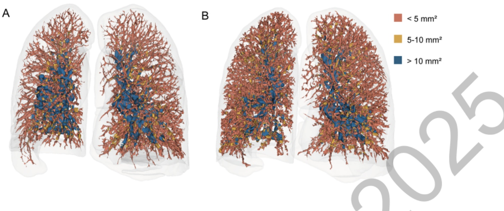

图1患有难治性肺炎支原体肺炎的5岁患儿在基线（A）与随访（B）时的胸部CT 肺血管分割图像

在交叉验证队列的基线CT 中，如图 2 A 可见，研究发现 RMPP 组的 BV5%显著低于非 RMPP 组（58.50% vs. 60.63%， 0.007），而BV10%显著高于非RMPP 组（20.90% vs. 19.39%, .004）。在有随访CT的患者中，其中位随访时间为16 天，这些患儿的 BV5%从基线的 59.80%上升至63.07%（P< 0.001），而BV10%由20.17%下降至18.71%（Pく0.001），提示随着炎症消退，肺血管循环状态逐步恢复。然而，即使在随访阶段，RMPP患儿仍存在残余的肺血管分布异常，其 BV5%仍显著低于非 RMPP 组（62.42% vs. 63.55%，P = 0.03) 如图2 B所见，RMPP 患儿的 BV10%则高于非 RMPP组（19.08% vs. 18.31%, 0.003），说明微血管损伤在部分患儿中具有持续性。

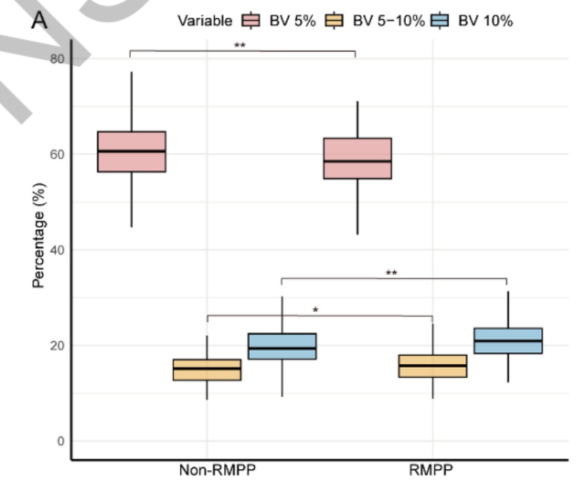

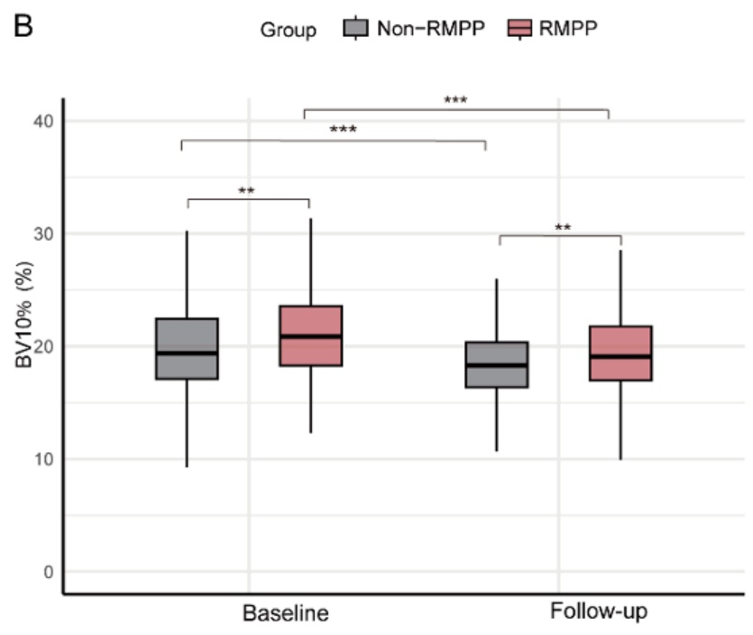

## 图 2 交叉验证队列中 RMPP 与非 RMPP 患者肺血管容量的变化情况

注:BV5%:横截面积 ${ \langle 5 \mathrm { ~  ~ { ~ m m } ^ { 2 } ~ } }$ 的血管占肺总血容量（PBV）的百分比；BV5-10%:横截面积在$5 \mathrm { ~ - ~ } 1 0   \mathrm { ~ m m } ^ { 2 }$ 之间的血管占PBV的百分比；BV10%:横截面积 ${ \mathrm { > } } 1 0    { \mathrm { ~ m m } ^ { 2 } }$ 的血管占 PBV的百分比；CT:计算机断层扫描；PBV:肺血容量；RMPP:难治性肺炎支原体肺炎。

在PBV指标的相关性分析中，如图3所示，BV5%与中性粒细胞比例D-dimer均呈负相关（分别为-0.12、-0.13、-0.19；P均 $\textlangle 0.0 \textcircled{f}$ 提示小血管灌注减少与炎症负荷及高凝状态紧密相关；BV10%则呈正相关 14-0.21, $P \leq 0.01$

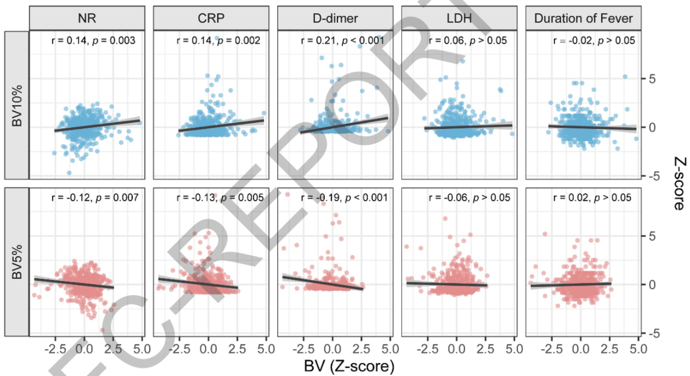

## 图 3 定量肺血管参数与 RMPP 已知风险因素之间的 Pearson 相关性分析

注:为确保各指标间的可比性，所有变量均经过 Z-score归一化处理。BV5%:横截面积<5 $\mathrm { m m } ^ { 2 }$ 的血管占肺总血容量（PBV）的百分比；BV5-10%:横截面积在 $5 { - } 1 0   \mathrm { m m } ^ { 2 }$ 之间的血管占PBV的百分比；BV10%:横截面积 ${ \mathrm { > } } 1 0    { \mathrm { ~ m m } ^ { 2 } }$ 的血管占PBV的百分比；CRP:C-反应蛋白；LDH:乳酸脱氢酶；NR:中性粒细胞比例；PBV:肺血容量；RMPP:难治性肺炎支原体肺炎。

进一步的多变量逻辑回归证实，如表1所示，在调整多项临床协变量后，BV5%仍为独立保护因素（优势比[0R]=0.70，P=0.005），而BV10%为独立危险因素（0R=1.49， $P = 0.002$ 。在5-10岁患儿亚组中，这一趋势仍完全保持，说明PBV改变与RMPP的关联具有年龄稳定性。

表1交叉验证队列中与 RMPP 相关的定量肺血容量参数的单因素及多因素逻辑回归分析

<table><tr><td colspan="3">单因素分析</td><td colspan="3">多因素分析校正后</td></tr><tr><td>定量肺血容量参数</td><td>优势比(OR)</td><td>95% CI P</td><td>优势比(OR)</td><td>95% CI</td><td>P</td></tr><tr><td>交叉验证队列 (n = 512)</td><td></td><td></td><td></td><td></td><td></td></tr><tr><td>BV5%</td><td>0.75</td><td>0.002* 0.63-0.90</td><td>0.70</td><td>0.54-0.89</td><td>0.005*</td></tr><tr><td>BV5 - 10%</td><td>1.22</td><td>0.03* 1.02-1.46</td><td>23</td><td>0.97-1.55</td><td>0.08</td></tr><tr><td>BV10%</td><td>1.36</td><td>1.13-1.63</td><td>0.001* 1.49</td><td>1.17-1.92</td><td>0.002*</td></tr><tr><td>5 -10 岁患儿亚组(n = 316)</td><td></td><td></td><td></td><td></td><td></td></tr><tr><td>BV5%</td><td>0.75</td><td>0.012* 59-0.</td><td>0.68</td><td>0.49-0.83</td><td>0.018*</td></tr><tr><td>BV5 - 10%</td><td>1.18</td><td>94-1. 0.15 47</td><td></td><td></td><td></td></tr><tr><td>BV10%</td><td>1.33</td><td>1.06-1.69 0.015*</td><td>1.58</td><td>1.15-2.19</td><td>0.005*</td></tr></table>

注:CI:置信区间；BV5%:横截面积<5mm²的血管占肺总血容量（PBV）的百分比；BV5-10%:橫截面积在 $\overline { { 5 } } \overline { { - 1 } } 0   \mathrm { { m m } ^ { 2 } }$ 之间的血管占PBV的百分比；BV10%:横截面积 ${ \mathrm { > } } 1 0    { \mathrm { ~ m m } ^ { 2 } }$ 的血管占 PBV 的百分比。\* P < 0.05

如图4A所示，研究基于最小绝对收缩和选择算子（LASSO）回归从候选变量中筛选出19个核心预测特征，其中包括16项临床变量及3项肺血容量（PBV）指标。基于上述特征，利用XGBoost算法分别构建了仅含临床特征的临床模型以及融合了PBV指标的临床-BV联合模型。如图4B所示，在交叉验证队列中，联合模型相较于单一临床模型的预测效能显著提升，其曲线下面积（AUC）由0.88显著增至 $0.91 \left( P \in 0.001 \right)$ 。此外，如表2所示，临床-BV联合模型的评价指标在准确率、精确率、F1分数及特异性等维度均表现更优。

而在外部测试队列中，联合模型的AUC提升至0.84，尽管统计学差异未达到显著性水平 $(P = 0.09)$ ，但其准确率、精确率、特异性及F1分数均优于临床模型，展现出良好的外部泛化性能。最后，基于Shapley（SHAP）可解释性分析的特征重要性排序进一步揭示，BV10%是模型决策中影响最大的关键变量之一，其重要性仅次于发热时长、体温及CRP水平。

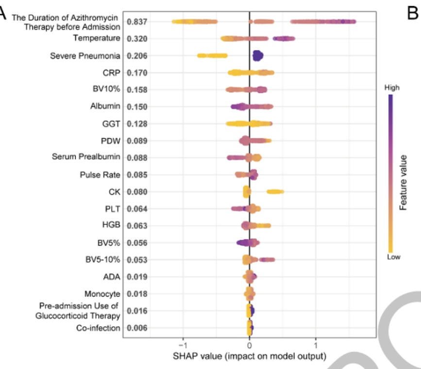

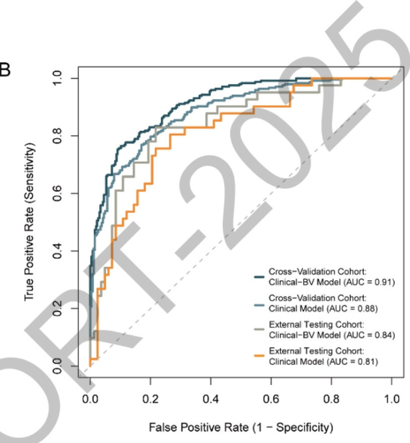

图 4 模型可解释性分析与性能评估

注:ADA:腺苷脱氨酶；AUC:ROC曲线下面积；BV5-10%:横截面积在 $5 { - } 1 0   \mathrm { m m } ^ { 2 }$ 之间的血管占 PBV的百分比；BV10%:横截面积 ${ \mathrm { > } } 1 0    { \mathrm { ~ m m } ^ { 2 } }$ 的血管占PBV的百分比；CK:肌酸激酶；clinical-BV: 临床-血容量（模型）；CRP:C-反应蛋白；GGT:γ-谷氨酰转肽酶；HGB:血红蛋白；PBV:肺血容量；PDW:血小板分布宽度；PLT:血小板计数；RMPP:难治性肺炎支原体肺炎；ROC:受试者工作特征（曲线）；SHAPs:Shapley加性解释；XGBoost:极端梯度提升算法。

表2 交叉验证队列与外部测试队列中极端梯度提升算法模型的性能指标

| 数据集 | 曲线下面积（95%置 信区间) | 准确度 | 精确率 | 敏感性 |  | 特异性 F1 分数 | p |
| --- | --- | --- | --- | --- | --- | --- | --- |
| 交叉验证集 |  |  |  |  |  |  | &lt;0.001 |
| 临床模型 | 0.88(0.86-0.91) | 0.79 | 0.76 | 0.86 | 0.72 | 0.81 |  |

| 临床-BV | 0.91 (0.89-0.94) |  | 0.83 | 0.81 | 0.88 | 0.77 | 0.84 |  |
| --- | --- | --- | --- | --- | --- | --- | --- | --- |
| 联合模型 |  |  |  |  |  |  |  | 0.09 |
| 外部测试集 |  |  |  |  |  |  |  |  |
| 临床模型 |  | 0.81 (0.73-0.89) | 0.76 | 0.78 | 0.89 | 0.49 | 0.83 |  |
| 临床-BV |  | 0.84 (0.77-0.92) | 0.79 | 0.87 | 0.81 | 0.76 | 0.84 |  |
| 联合模型 |  |  |  |  |  |  |  |  |

综合上述结果，本研究通过双中心的CT定量分析，主要发现如下:

①首次系统性揭示RMPP存在显著的肺微血管重分布特征:即小血管灌注减少（BV5%下降）与大血管扩张（BV10%上升）并存。

②阐明与临床病理的关联:相关性分析表明，BV5%变化与RMPP患儿明显的炎症风暴特征、凝血激活以及临床危重度高度 一致，反映出肺微循环受损与免疫-血管反应之间的密切耦合。

③确认独立预测价值:多因素逻辑回归分析证实校正临床混杂因素后，BV5%是RMPP的独立保护因素，而BV10%是独立危险因素。该关联在5-10岁主要亚组中保持稳定，证实了其普适性。

④ 提升 AI 预测模型效能:将 PBV 定量指标整合入 XGBoost 预测模型后，还显著增强了其预测 RMPP的性能，为RMPP的早期识别、风险分层及治疗决策提供了可落地且无创的影像生物标志物。

## 科学意义与应用前景:

本研究首次在体、无创地揭示了RMPP存在以“微血管损伤与缩窄、大血管代偿性扩张”为特征的肺血容量重分布规律，为理解其“免疫-血管”交互作用的病理生理机制提供了直接影像学证据。所定义的PBV定量指标（BV5%、BV10%）不仅是强大的独立风险标志物，更能作为可融合的模块，显著增强现有临床预测模型的效能与可解释性。这为开发基于CT成像的RMPP早期预警与精准分层工具奠定了坚实的理论基础，并提供了可直接向临床转化的新型影像生物标志物。

## b)核心进展二:成功构建并验证了基于Transformer架构的、高泛化性RMPP全自动早期预警模型

针对现有模型临床部署困难的瓶颈，本研究成功开发了一款仅基于单次平扫CT的端到端深度学习预警系统（Trans-DLF）。该系统最大的创新在于，无需任何人工干预或额外的临床数据输入，即可实现全自动、高精度的风险分层，为临床提供了一个即用型决策支持工具。本研究创新性地采用Transformer架构，依托三家不同层级医疗机构的多中心队列，共纳入1224例儿童支原体肺炎患者，构建并验证了仅基于基线胸部薄层CT的Tran sformer端到端深度学习模型（Trans-DLF），用于难治性支原体肺炎（RMPP）的早期预测。方法上，本研究首先通过自动肺分割与切片块生成，将每三层CT片段输入ResNet-18 以提取局部表征，再送入六层Transformer编码器，通过多头自注意力机制，智能化地捕捉全肺范围内病灶的跨层长程空间依赖关系，全面评估肺炎的弥漫性严重程度，并由多层感知机输出患者级预测概率，无需手工特征提取，且不依赖血液学或临床变量，实现了真正意义上的影像自动化分析。这种设计克服了传统3D卷积神经网络（3D-CNN）感受野有限、难以全局建模的固有缺陷。在此基础上，为确保模型优势具有可比较性，研究进一步构建了三类对照模型以作对比:其一为三维卷积神经网络（3D-CNN）模型，直接以三维CT体素作为输入，通过多层3D卷积与池化结构提取空间特征，再经全局池化与全连接层完成预测；其二为纯临床模型，在逻辑回归框架中筛选发热时间等独立风险因子， 以此构建传统统计学模型；其三为多模态列线图，即将Transformer输出概率与上述独立临床变量整合，以进一步评估多模态融合是否对预测性能具有额外增益。所有模型均在训练集完成拟合后，在验证集、内部测试集及两个独立外部测试队列中进行系统效能评估。最后，研究通过Grad-CAM实现模型解释性可视化，揭示深度网络在肺部结构中的注意力分布（图5）。

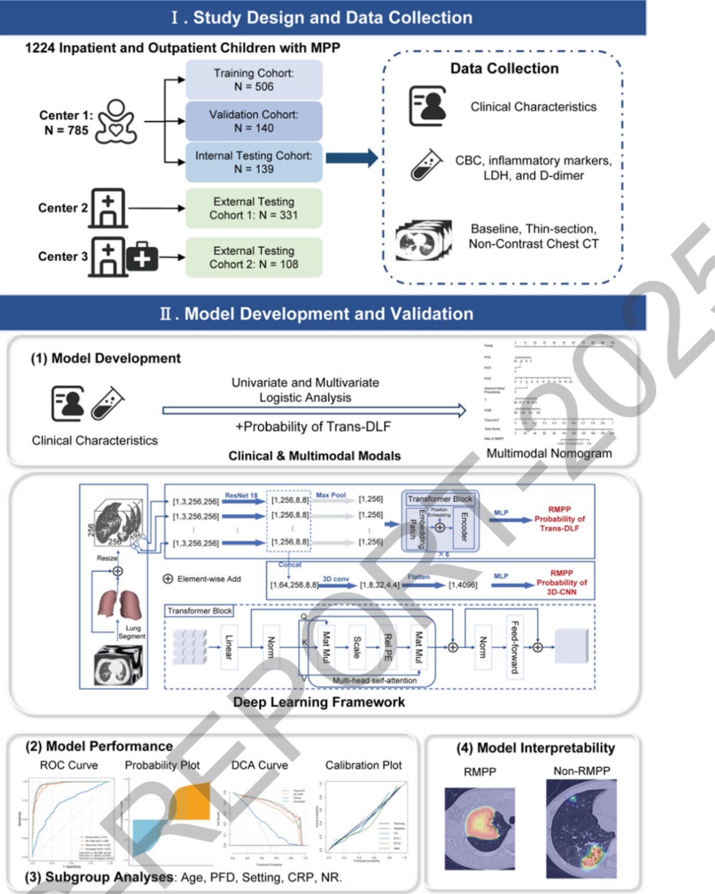

图 5 研究流程图

计算机断层扫描；CBC:全血细胞计数；LDH:乳酸脱氢酶；RMPP:难治性肺炎支原体肺炎；MLP:多层感知器；RelPE:相对位置编码；Trans-DLF:基于Transformer的深度学习框架；3D-CNN:三维卷积神经网络；CRP:C反应蛋白；NR:中性粒细胞比率；PFD:就诊前发热持续时间；ROC:受试者工作特征曲线；DCA:决策曲线分析。

如图6 A-D及表3所示，Trans-DLF在各数据集中的表现均较为稳定，区分能力良好，并在多中心环境下展现出较强的泛化特性。训练集中Trans-DLF对应AUC达0.97（95%CI0.96-0.98），验证集为0.91（0.86-0.96），内部测试集为0.90（0.85-0.95）。在两个外部测试队列中，AUC均稳定维持在

0.89（95%CI分别为0.84-0.94与0.82-0.95）的高水平，提示该模型在不同医院与患者群体中均具有强的可移植性。在具体性能指标上，如表3所示，训练集准确率达0.92、敏感性0.96、特异性0.87；验证集分别对应为0.87、0.88、0.86；外部测试集准确率保持在0.84-0.86区间，敏感性约0.82-0.85，特异性约0.81-0.84。其在跨队列的稳定表现进一步证明了模型对不同影像设备、不同人群结构、不同扫描条件具有一定的适应能力。而作为端到端影像深度学习方法的传统代表，3D-CNN 在五个队列中的 AUC 介于 $\overline { 0 . 8 6 } \stackrel { \mathrm { ~ v ~ } } { - } 0 . . 9 0$区间，与 Transformer 模型相比虽略低，但未达统计学显著差异（DeLong 检验所有 $P \geq 0.05$ 。多模态列线图将 Trans-DLF 的 CT 特征与临床变量融合后，整体性能与单独基于胸部 CT 影像的 Trans-DLF 模型基本相 (所有比较 P均>0.05），提示Transformer模型在处理CT 图像时可能已经捕获了部分隐含的、与疾病严重度等临床状态相关的信息，从而在仅凭影像的情况下达到了与传统多模态方法相当的预测效能，使得额外融合临床数据对预测效果的增益有限。相比之下，纯临床模型的预测效能相对较弱，其AUC范围为0.65-0.76，显著低于 Trans-DLF 模型（所有 DeLong 检验 $P \leq 0.001$ 。如图 7 A-E决策曲线分析进一步证实， 在 0.1 - 0.8 的阈值概率范围内，Trans-DLF 模型展现的临床净获益显著优于3D-CNN 及单一临床模型，且与多模态列线图的临床获益水平基本持平。 而图 7 F 中校准曲线进一步显示，Trans-DLF 的预测概率与真实发生率高度吻合，预测偏差极小。

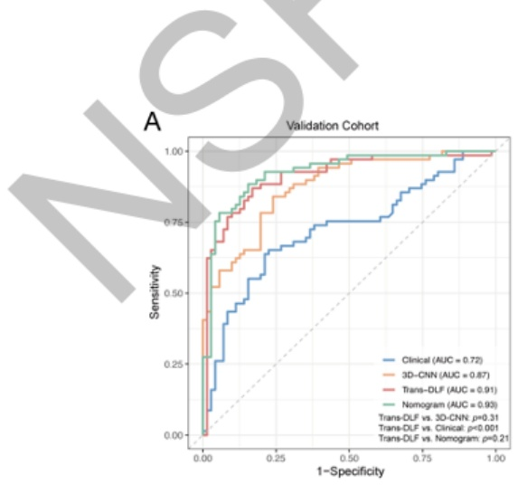

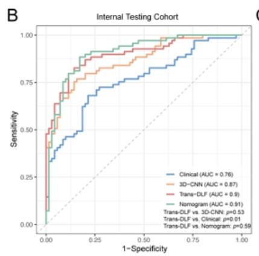

C

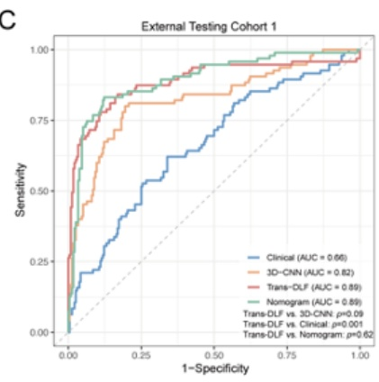

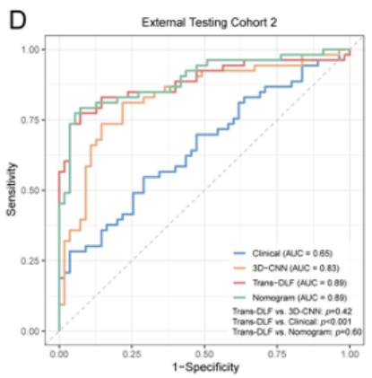

图6难治性肺炎支原体肺炎（RMPP）预测模型的性能评估

注:Trans-DLF:基于Transformer的深度学习框架；3D-CNN:3D卷积神经网络；AUC:曲线下面积。

表3深度学习模型与临床模型对难治性肺炎支原体肺炎的预测性能

<table><tr><td>模型</td><td>曲线下面积 (95% CI)</td><td>准确度(95% CI)</td><td>敏感性 (95% CI)</td><td>特异性 (95% CI)</td><td>阳性预 测值 (95%</td><td>阴性预 测值 (95%</td><td>F1 分数 (95%</td></tr><tr><td>Trans-DLF</td><td></td><td></td><td></td><td></td><td></td><td></td><td></td></tr><tr><td>训练</td><td>0.97</td><td>0.92</td><td>0.96</td><td>0.87</td><td>0.88</td><td>0.96</td><td>0.92</td></tr><tr><td>集</td><td>(0.96- 0.98)</td><td>(0.89-</td><td>(0.94-</td><td>(0.83 - 0.91)</td><td>(0.84</td><td>(0.93-</td><td>(0.89 - 0.94)</td></tr><tr><td></td><td>0.91</td><td>0.94) 0.85</td><td>0.98)</td><td>0.83</td><td>0.92) 0.83</td><td>0.98)</td><td>0.85</td></tr><tr><td>验证</td><td>(0.86-</td><td></td><td>0.87</td><td></td><td></td><td>0.87</td><td>(0.79 -</td></tr><tr><td>集</td><td></td><td>(0.79-</td><td>(0.79-</td><td>(0.73</td><td>(0.74-</td><td>(0.79 -</td><td></td></tr><tr><td></td><td>0.96)</td><td>0.91)</td><td>0.94)</td><td>0.91</td><td>0.92)</td><td>0.94)</td><td>0.91)</td></tr><tr><td>内部</td><td>0.90</td><td>0.83</td><td>0.84</td><td>0 81</td><td>0.82</td><td>0.84</td><td>0.83</td></tr><tr><td>测试</td><td>(0.85-</td><td>(0.76-</td><td>(0.75</td><td>(0.72</td><td>(0.72-</td><td>(0.75-</td><td>(0.75-</td></tr><tr><td>集</td><td>0.95)</td><td>0.89)</td><td>0.92)</td><td>0.90)</td><td>0.90)</td><td>0.92)</td><td>0.89)</td></tr><tr><td>外部</td><td>0.89</td><td>0.82</td><td>.84 0.</td><td>0.81</td><td>0.65</td><td>0.93</td><td>0.73</td></tr><tr><td>测试</td><td>(0.84-</td><td>(0.78-</td><td>(0.76-</td><td>(0.76-</td><td>(0.56-</td><td>(0.89-</td><td>(0.66-</td></tr><tr><td>集1</td><td>0.94)</td><td>0.86)</td><td>0.91)</td><td>0.86)</td><td>0.73)</td><td>0.96)</td><td>0.79)</td></tr><tr><td>外部</td><td>0.89</td><td>0.83</td><td>0.83</td><td>0.84</td><td>0.83</td><td>0.84</td><td>0.83</td></tr><tr><td>测试</td><td>(0.82 -</td><td>(0.76</td><td>(0.72-</td><td>(0.73-</td><td>(0.73-</td><td>(0.74-</td><td>(0.74-</td></tr><tr><td>集2 3D-CNN</td><td>0.95)</td><td>0.90)</td><td>0.92)</td><td>0.93)</td><td>0.93)</td><td>0.93)</td><td>0.90)</td></tr><tr><td></td><td>0.95</td><td>1 0.79</td><td>0.99</td><td>0.59</td><td>0.71</td><td>0.99</td><td>0.83</td></tr><tr><td>训练</td><td>(0.94-</td><td>(0.75-</td><td>(0.98-</td><td>(0.53-</td><td>(0.66-</td><td>(0.97-</td><td>(0.79-</td></tr><tr><td>集</td><td>0.97)</td><td>0.83)</td><td>1.00)</td><td>0.65)</td><td>0.75)</td><td>1.00)</td><td>0.86)</td></tr><tr><td></td><td>0.87</td><td>0.80</td><td>0.84</td><td>0.76</td><td>0.77</td><td>0.83</td><td>0.81</td></tr><tr><td>验证 S</td><td>(0.82-</td><td>(0.73 -</td><td>(0.75-</td><td>(0.66-</td><td>(0.68-</td><td>(0.73 -</td><td>(0.73 -</td></tr><tr><td>集</td><td>0.93)</td><td>0.86)</td><td>0.92)</td><td>0.86)</td><td>0.87)</td><td>0.92)</td><td>0.87)</td></tr><tr><td>内部</td><td>0.87</td><td>0.69</td><td>0.88</td><td>0.50</td><td>0.64</td><td>0.81</td><td>0.74</td></tr><tr><td>测试</td><td>(0.81 -</td><td>(0.61 -</td><td>(0.80-</td><td>(0.39 -</td><td>(0.54-</td><td>(0.69-</td><td>(0.66-</td></tr><tr><td>集</td><td>0.93)</td><td>0.77)</td><td>0.96)</td><td>0.63)</td><td>0.73)</td><td>0.93)</td><td>0.81)</td></tr><tr><td>外部</td><td>0.82</td><td>0.80</td><td>0.78</td><td>0.81</td><td>0.63</td><td>0.90</td><td>0.69</td></tr><tr><td>测试</td><td>(0.77-</td><td>(0.76-</td><td>(0.69-</td><td>(0.77-</td><td>(0.54-</td><td>(0.86-</td><td>(0.62-</td></tr><tr><td>集1</td><td>0.88)</td><td>0.85)</td><td>0.86)</td><td>0.86)</td><td>0.71)</td><td>0.94)</td><td>0.76)</td></tr><tr><td>外部</td><td>0.83</td><td>0.77</td><td>0.75</td><td>0.78</td><td>0.77</td><td>0.77</td><td>0.76</td></tr><tr><td>测试</td><td>(0.75-</td><td>(0.69-</td><td>(0.64-</td><td>(0.67-</td><td>(0.65-</td><td>(0.65-</td><td>(0.67-</td></tr><tr><td></td><td></td><td></td><td></td><td></td><td></td><td></td><td></td></tr><tr><td>集2 临床模型</td><td>0.91)</td><td>0.84)</td><td>0.86)</td><td>0.89)</td><td>0.88)</td><td>0.88)</td><td>0.84)</td></tr><tr><td rowspan="3">训练 集</td><td>0.72</td><td>0.67</td><td>0.58</td><td>0.75</td><td>0.70</td><td>0.65</td><td>0.64</td></tr><tr><td>(0.67-</td><td>(0.63-</td><td>(0.52 -</td><td>(0.70-</td><td>(0.64-</td><td>(0.58-</td><td>(0.58-</td></tr><tr><td>0.76)</td><td>0.71)</td><td>0.64)</td><td>0.80)</td><td>0.76)</td><td>0.70)</td><td>0.69)</td></tr><tr><td>验证</td><td>0.72</td><td>0.71</td><td>0.65</td><td>0.78</td><td>0.74</td><td>0.70</td><td>0.69</td></tr><tr><td>集</td><td>(0.64-</td><td>(0.64-</td><td>(0.53-</td><td>(0.68-</td><td>(0.62-</td><td>(0.59-</td><td>(0.59-</td></tr><tr><td></td><td>0.81)</td><td>0.79)</td><td>0.76)</td><td>0.87)</td><td>0.85)</td><td>0.80)</td><td>0.78)</td></tr><tr><td>内部</td><td>0.76</td><td>0.73</td><td>0.68</td><td>0.79</td><td>0.76</td><td>0.71</td><td>0.72</td></tr><tr><td>测试</td><td>(0.68-</td><td>(0.66-</td><td>(0.56-</td><td>(0.68-</td><td>(0.64-</td><td>(0.61-</td><td>(0.61 -</td></tr><tr><td>集</td><td>0.84)</td><td>0.81)</td><td>0.79)</td><td>0.88)</td><td>0.86)</td><td>0.81)</td><td>0. 80)</td></tr><tr><td>外部</td><td>0.66</td><td>0.71</td><td>0.27</td><td>0.88</td><td>0.48</td><td>0.75</td><td>0.35</td></tr><tr><td>测试</td><td>(0.60 -</td><td>(0.66-</td><td>(0.19-</td><td>(0.84-</td><td>(0.35-</td><td>(0.70-</td><td>(0.25-</td></tr><tr><td>集1</td><td>0.73)</td><td>0.76)</td><td>0.36)</td><td>0.92)</td><td>0.61)</td><td>0.80)</td><td>0.44)</td></tr><tr><td>外部</td><td>0.65</td><td>0.58</td><td>0.30</td><td>0.85</td><td>0.67</td><td>0.56</td><td>0.42</td></tr><tr><td>测试</td><td>(0.55-</td><td>(0.49-</td><td>(0.18-</td><td>(0.75-</td><td>(0.48 一</td><td>(0.45 -</td><td>(0.27-</td></tr><tr><td>集2</td><td>0.76)</td><td>0.67)</td><td>0.43)</td><td>0.94)</td><td>0.85)</td><td>0.67)</td><td>0.54)</td></tr></table>

注:Trans-DLF:基于 Transformer的深度学习框架；3D-CNN:3D 卷积神经网络；CI:置信区间。

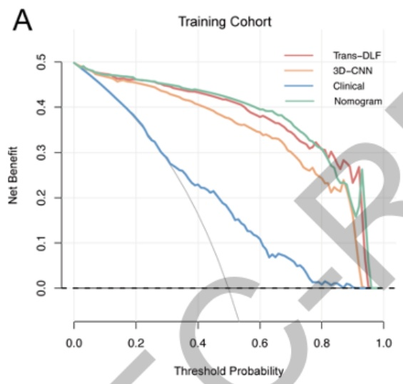

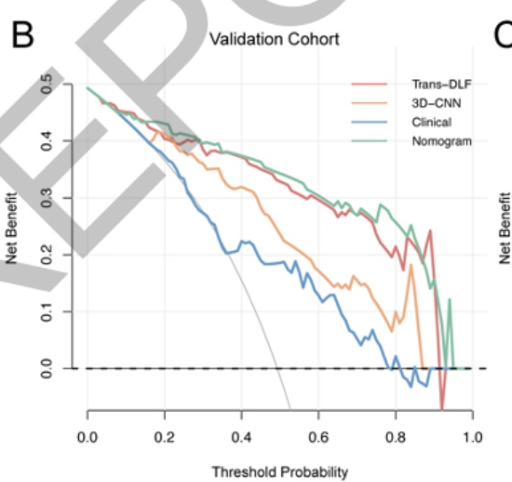

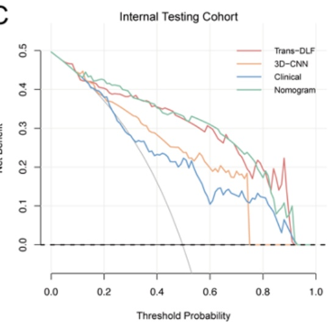

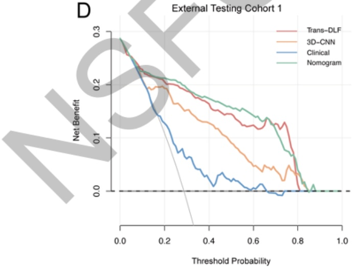

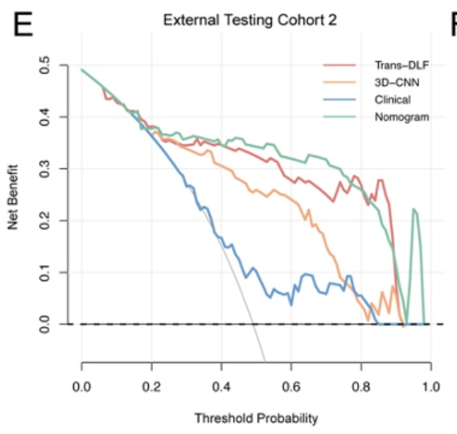

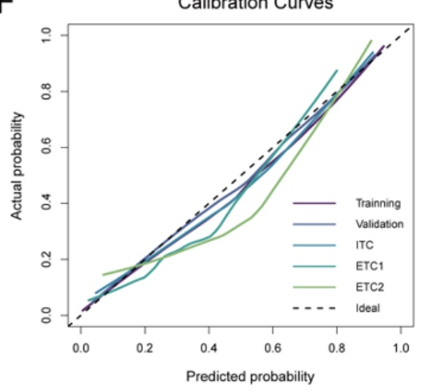

图7 基于Transformer 的深度学习框架、3D 卷积神经网络、临床模型及多模态列线图的临床获益与校准性能评估

注:Trans-DLF:基于Transformer的深度学习框架；3D-CNN:3D卷积神经网络；ITC:内部测试队列；ETC1:外部测试队列1；ETC2:外部测试队列2。

在亚组分析中，如图8所示，Trans-DLF在多个临床分层中均保持相对稳健的性能表现。在外部测试队列的门诊场景中，该模型AUC达0.87（95%CI 0.78-0.96）。在年龄层面，<5岁患儿组AUC为0.87（0.77-0.98） , 5 - 12岁为0.90（0.86-0.94），>12岁为0.81（0.66-0.96）。此外，无论在高热等高炎症负荷亚组，还是在轻重症分层中，Trans-DLF的区分度均维持在0.85- 0.92 区间，说明模型在不同疾病状态下表现相对平稳。

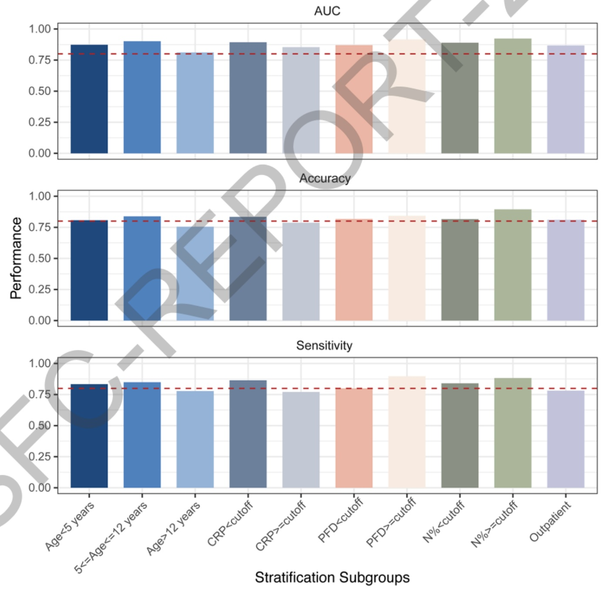

图8 基于 Transformer的深度学习框架在外部测试队列中的亚组分析

注:AUC:曲线下面积；PFD:入院前发热时长；CRP:C-反应蛋白；NR:中性粒细胞比例。

在可解释性分析中，如图9所示，梯度加权类激活映射（Grad-CAM）热力图反映了模型在判别过程中所关注的主要影像区域。RMPP患儿中，注意力区域较多分布于明显实变、不张或密度增高的肺段，而在非RMPP患儿中，关注点更多集中在体积较小的实变区，而对于相对轻度的磨玻璃影区域则模型关注度较低。此类注意方式与临床影像观察存在一定一致性，提示模型在一定程度上利用了与疾病相关的结构性影像特征，为其临床可解释性提供了一定支持。

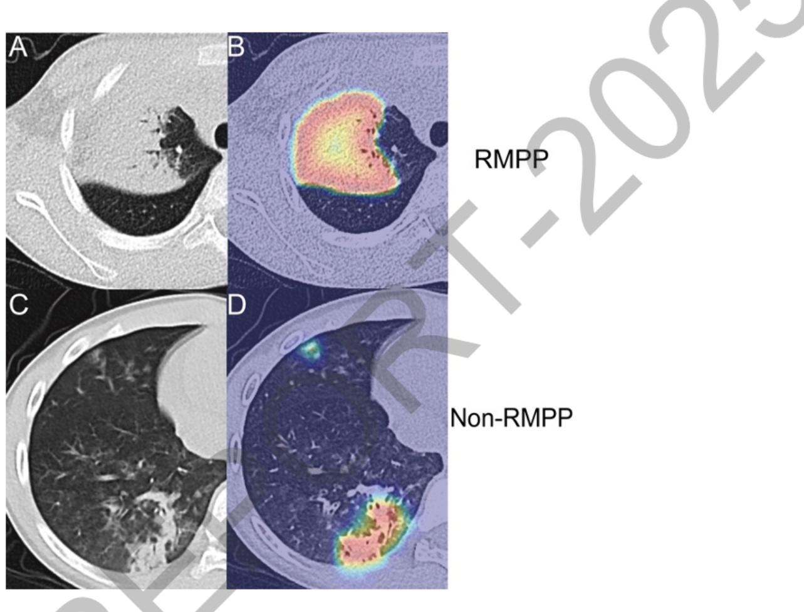

图9 代表性 CT 图像及基于 Transformer 的深度学习框架对应的热力图可视化结果

注:RMPP，难治性肺炎支原体肺炎

整体来看，本研究成功构建并验证了基于平扫CT的 Trans-DLF 预警系统。 该模型在多中心、多场景验证中均展现出优异且稳定的预测性能（AUC 0.89-0.97），其预测效能显著优于纯临床模型（Pく0.001），并与更复杂的3D-CNN及多模态列线图模型表现接近（P>0.05）。模型具备良好的校准性、预测一致性和临床决策净获益，其决策过程通过可解释性分析被证实聚焦于实变等关键影像特征。

## 科学意义与应用前景

由于不依赖人工测量或额外临床变量，可直接在标准CT流程中自动运行，Trans-DLF系统实现了RMPP风险评估模式的根本转变，即从依赖多源数据和人工判读，跨越为基于单一标准影像的全自动分析。其卓越的泛化能力使其能作为“即插即用”工具，无缝整合至现有CT诊断流程，在检查完成时即可提供客观的风险预警。这为临床医生在治疗升级等关键临床决策点，实现早期、精准的干预提供了强有力的工具，具有直接转化为临床实践的巨大潜力

## c） 核心进展三:应用因果推断模型，实现儿童支气管镜治疗获益人群的精准识别

针对儿童支原体肺炎（MPP）治疗中，柔性支气管镜（FB）治疗获益异质性大、临床指征模糊的临床难题，本研究创新性地引入了因果推断（Causal Inference）方法。研究摒弃了传统预测模型仅能关联结局的局限，基于两中心回顾性队列（衍生队列753例，外部验证队列139例患儿），首次采用因果森林（Causal Forest）算法来估计个体治疗效应（ITE），即预测每位患儿接受与不接受FB治疗后的潜在结局差异（图10）。研究构建并验证了一种将定量CT 特征与临床变量整合的因果森林模型，旨在从观察性数据中量化FB的个体化治疗效应，为实现精准介入治疗提供循证工具。模型输入的关键创新在于纳入了由AI软件对胸部CT进行自动分割提取的肺炎病灶定量影像参数，包括实变/不张体积 (CAV) 磨玻璃影体积、整体病灶体积（PV）、病灶平均衰减值(PA) 磨玻璃影病灶平均衰减值（GA）、实变/不张病灶平均衰减值（CA）及CAR（CAV占病灶百分比），为模型提供了客观的结构化信息（图11）。而后研究采用因果森林估计个体治疗效应（ITE），并通过交叉验证与校准测试筛选最优模型。同时研究根据 ITE 的最优 Youden 指数确定 ITE 对应阈值，其后将患儿根据阈值划分为FB获益与非获益两个亚组，并进一步在多变量线性回归中检验FB在各亚组中的真实治疗效应，同时开展组间特征差异分析、特征重要性与交互分析，以探索FB治疗效应异质性的结构性来源。

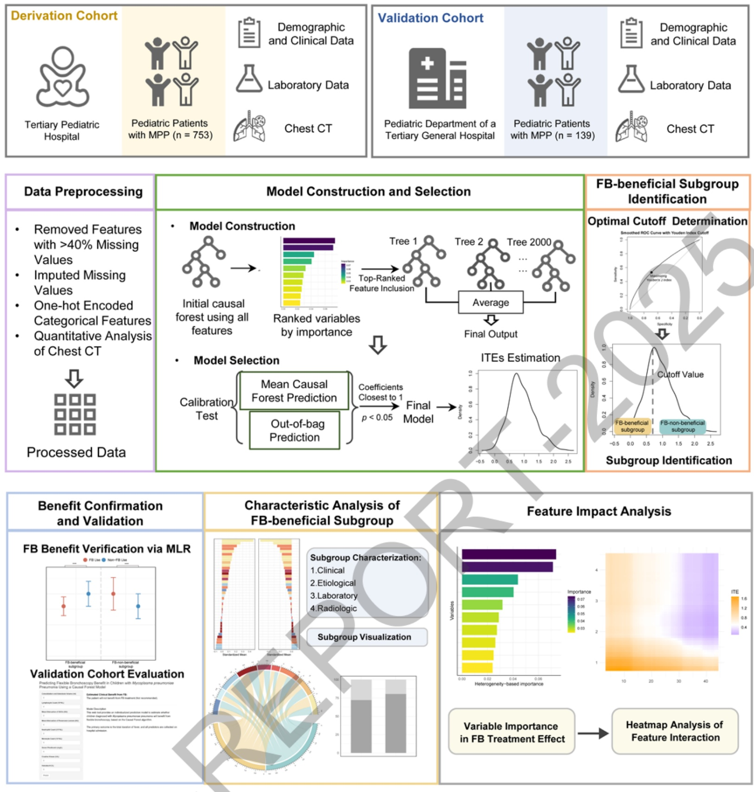

图10 模型构建与分析工作流概览

注 MPP:肺炎支原体肺炎；CT:计算机断层扫描；FB:纤维支气管镜；ITEs:个体治疗效应；MLR:多因素线性回归。

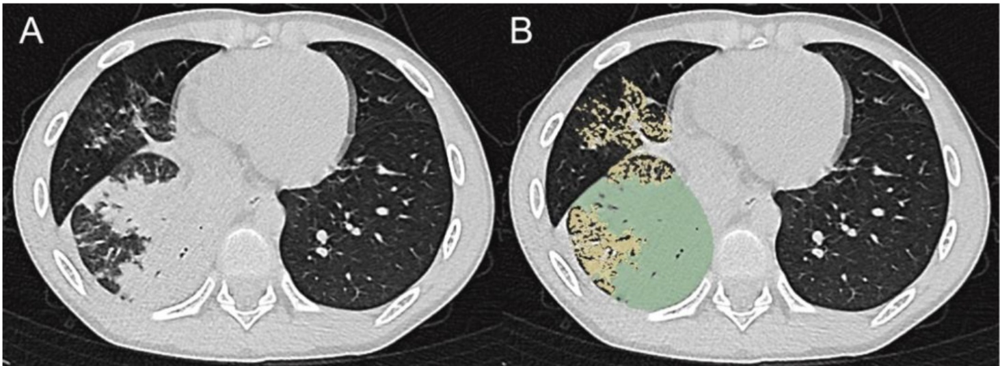

## 图11 肺炎病灶定量分析代表性图像

注:肺炎病灶进行自动分割后，其中磨玻璃影以黄色标注，实变与肺不张以绿色标注

模型能够成功在衍生队列中有效识别出具有显著不同FB治疗反应（“显著获益”与“无效甚至有害”）的患儿群体（图12A）。在衍生队列中，通过ITE 阈值 0.74 可划分出 FB 获益组 280 例与 FB 非获益组 473 例，两组对 FB 治疗的反应呈现完全相反的方向性:在FB获益组中，FB治疗可显著缩短发热总时长 $\beta = -1.16, P \in 0.001$ ，而在FB非获益组中，FB干预反而延长了发热时长（ $\beta = 2.17,\ P \leq 0.001$ ，提示存在潜在危害。在仅含不张患儿的亚群中，该趋势仍然显著:FB获益组中 $\beta = -2.45 (P < 0.001)$ ，FB非获益组中 $\beta = 2.27 (P \leq 0.001)$ ，说明肺不张并不足以作为FB的充分指征。进一步分层分析显示，无论入院前发热时间≤5天或>5天，FB在获益组中均可减少发热时长（分别β = -1.74与-1.26，P均< 0.001），而在FB非获益组中均呈现发热延长（β值分别为2.66与2.04，P均<0.001）。年龄分层同样呈现一致趋向，6岁以下与以上患儿中，FB获益组的治疗效应均为负向（β = -1.44与-1.47，P均<0.001) 而FB非获益组均为正向延长（β = 2.31与2.21，P均<0.001）， 提示模型在多个临床亚群中的稳健性。而模型在独立验证队列中得到了外部验证，在模型识别出的FB获益组中FB可显著减少发热时长（β -0.68, $P = 0.04$ ，而FB非获益组未观察到此效应，进一步支持模型的可迁移性。这一“疗效相反”的结论在仅含肺不张患儿、不同发热时长及不同年龄的亚组中均保持稳定，且模型在独立验证队列中成功复现了预测效果， 证明了其泛化能力强。

组间特征比较与模型解释性分析揭示了根本原因（图12，图13）。如图12 B-C所示，对FB获益组与非获益组的临床与影像特征比较显示，影像量化特征而非临床或实验室指标是区分治疗反应的关键来源。在衍生队列中，FB获益组的PV、CAV、PA、CAA、GA显著高于非获益组（P均く0.001），CAR也更高(中位数 27.93% vs 19.62%， $P \leq 0.001$ 。这一差异在验证队列中也同样出现，CAV、PA、CAA、GA等指标在获益组中均更高（P均く0.001），CAR差异亦显著（27.50% vs 12.24%， $P \leq 0.001$ 。即获益组与非获益组在临床和实验室指标上无显著差异，但在CT定量特征上截然不同。获益组具有更大的实变体积（CAV）、更高的病灶密度（PA）以及更高的实变与不张占比（CAR）。

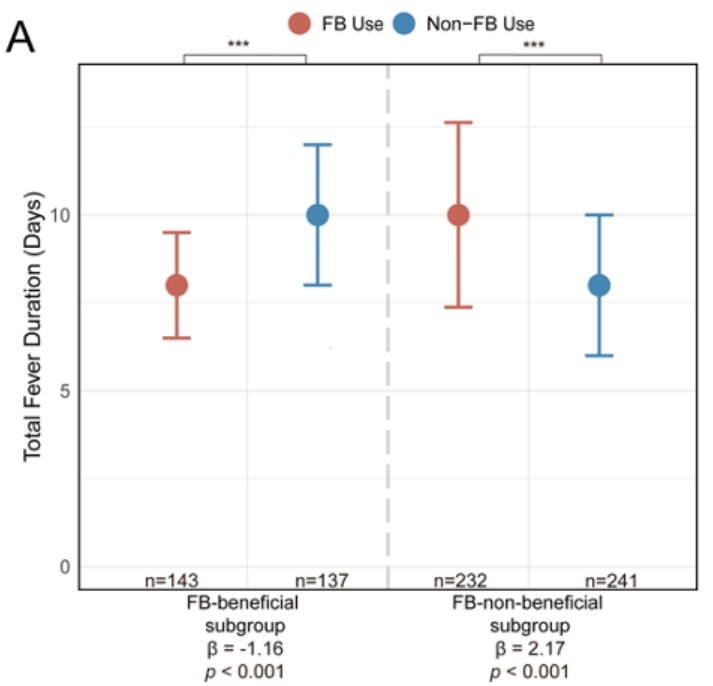

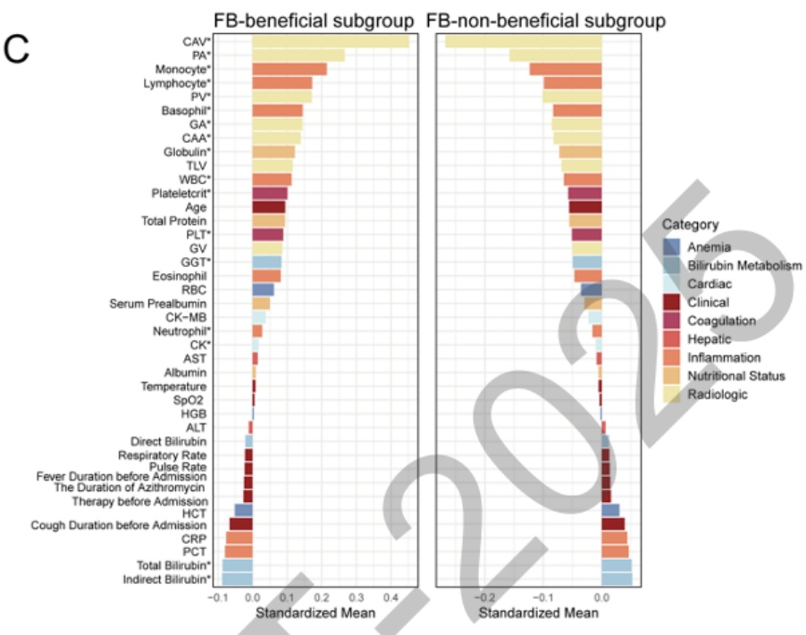

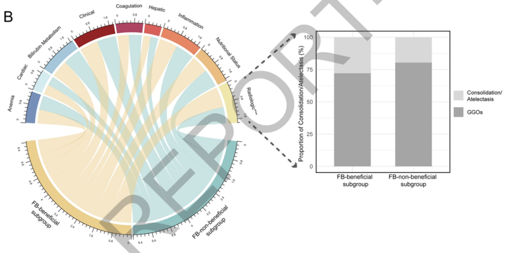

图12 衍生队列中分组效果验证及FB 获益亚组的特征分析

注 FB: 纤维支气管镜；GGOs:磨玻璃影； $\mathrm { S p 0 _ { 2 } }$ :经皮血氧饱和度；CRP:C-反应蛋白；降钙素原；WBC:白细胞计数；RBC:红细胞计数；HCT:红细胞压积；HGB:血红蛋白；PLT:血小板计数；ALT:丙氨酸氨基转移酶；AST:天门冬氨酸氨基转移酶；GGT:γ容积；PV:肺炎病灶体积；CAV:实变与肺不张体积；GV:磨玻璃影体积；PA:肺炎病灶平均衰减（密度）；CAA:实变与肺不张平均衰减；GA:磨玻璃影平均衰减。\*\*\*表示P 0.001，\*表示 P<0.05。

而如图13所示，模型特征重要性分析进一步表明，CAV、淋巴细胞计数、GA、PA、CAV相关指标处于模型最主要的贡献位置，而热图交互分析显示，当

CAV增大且伴随PA或GA升高时，FB治疗效应随之增强，而当CAV较低时，FB不仅难以产生获益，甚至可能延长病程。特征重要性分析确认，实变/不张体积（CAV）是预测治疗效应的首要决定性变量。交互分析进一步显示，当CAV较大且病灶密度较高时，FB的治疗正向效应最强。

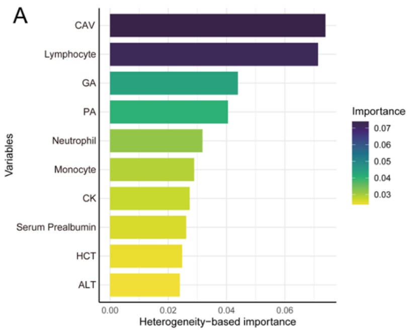

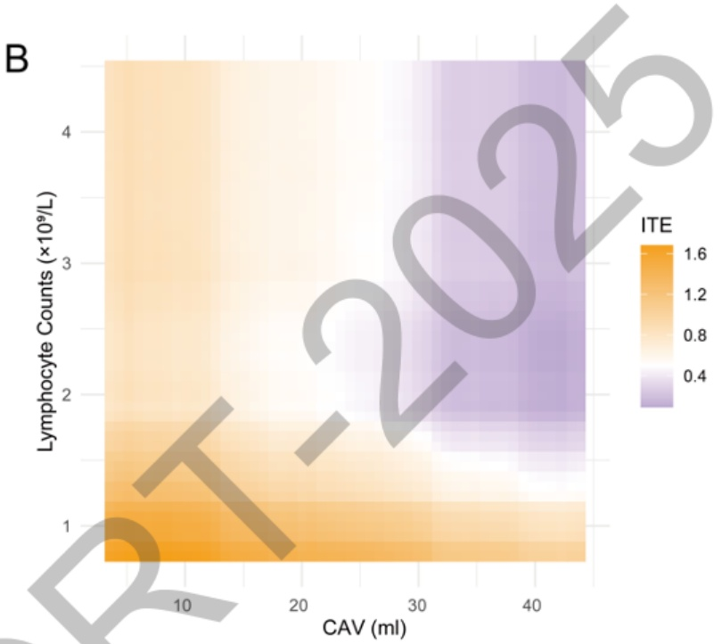

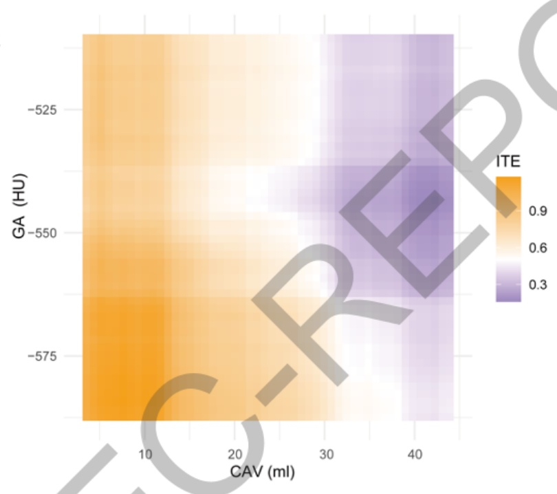

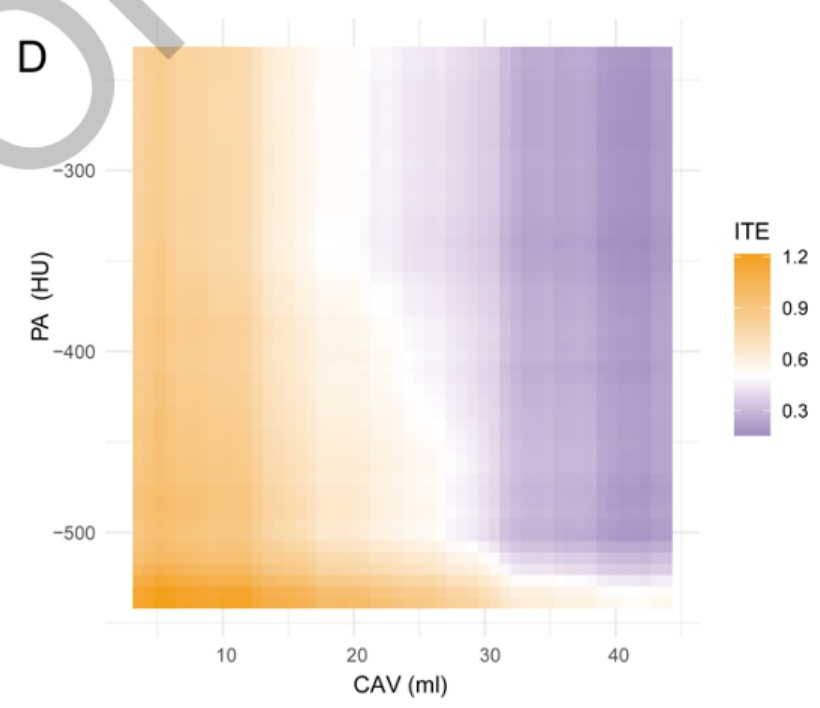

图13 特征重要性与热图分析

注:CAV:实变/肺不张体积；GA:磨玻璃影平均衰减；PA:肺炎病灶平均衰减；CK:肌酸激酶；HCT:红细胞压积；ALT:丙氨酸氨基转移酶；ITE:个体治疗效应。

## 科学意义与应用前景

本研究通过引入因果推断框架，首次在儿科呼吸介入领域实现了从“哪些患儿需要FB”到“FB对哪些患儿真正有益”的认知跃迁。所构建的因果森林模型不仅是一个预测工具，更是一个个体化疗效评估器，它定量揭示了FB治疗的显著异质性，并证明其疗效与以大体积、高密度实变为核心的特定影像学表型强相关，而与多数传统临床指标关联微弱。该模型成功在多中心数据中稳定识别出真正能从FB中显著获益的人群，同时明确揭示对另一部分患儿（尤其是仅表现为弥漫磨玻璃影或小灶实变者），FB可能无效甚至有害。这为重新审视并精准化FB临床指征提供了革命性的数据驱动依据。该工具可直接应用于辅助医生筛选出最佳获益的患儿人群，从而减少无效或潜在有害的侵入性支气管镜操作，提高治疗精准度与资源利用效率，真正推动儿童MPP的介入治疗迈向精准医学时代。

## d) 核心进展四:方法学外延验证-在PICU重症肺炎中，应用因果森林实现糖皮质激素个体化用药指导

针对重症社区获得性肺炎患儿中系统性糖皮质激素（GCs）治疗获益异质性大与用药指征不清的问题，本研究在真实世界场景中引入因果推断框架，系统评估了药物治疗的个体化效应。研究依托单中心重症监护室（PICU）内1116名重症社区获得性肺炎（CAP）婴幼儿的临床数据（中位年龄82.50天，其中 273 例接受 GCs 治疗 通过构建包含 2000棵决策树的因果森林模型，估计了每位患儿的个体治疗效应（ITE）。研究以ICU住院时长为主要结局，机械通气亚组同步评估通气时长（图14）。

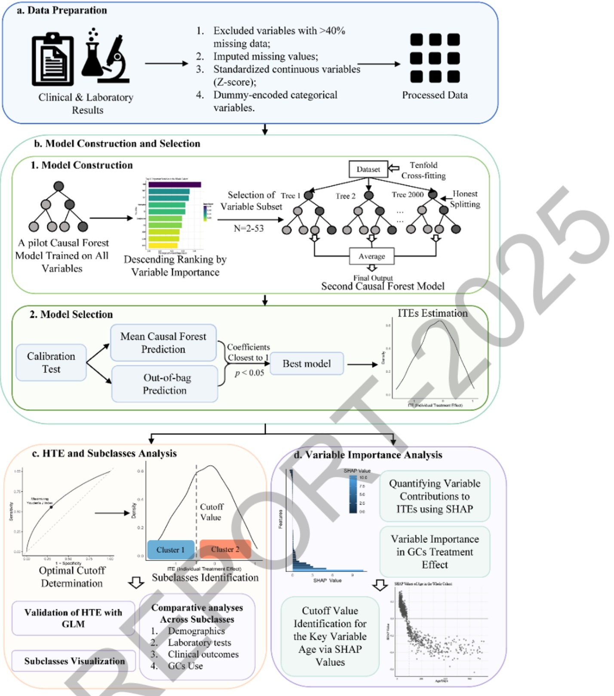

图14 模型构建与分析流程概览

注:ITEs:个体治疗效应；HTE:异质性治疗效应；GLM:广义线性模型；GCs:糖皮质激素；SHAP:Shapley加性解释。

通过交叉验证与校准测试，研究筛选出最优因果森林模型，其平均CATE预测系数（1.06）与袋外（00B）预测系数（0.94）均表现出良好的校准度，证明模型能有效捕捉治疗异质性。研究利用Youden指数确定最优切点，将患儿划分为两个截然不同的响应亚组（图15A）。在获益组中（Cluster1，n=446）:GCs 治疗可显著缩短 ICU 住院时长（β = -0.16 1og-days，p 0.001）；在机械通气（MV）亚组中，GCs同样显著缩短了通气时间（β= 0.35 1og-hours，p < 0.001)。而在非获益组（Cluster 2，n=670） :GCs 干预与更长的 ICU住院时间显著正相关 $\left( \beta = 0.46 \log - \mathrm{days}, p < 0.001 \right)$ ，提示在该亚群中GCs 可能无效甚至带来潜在负面影响。

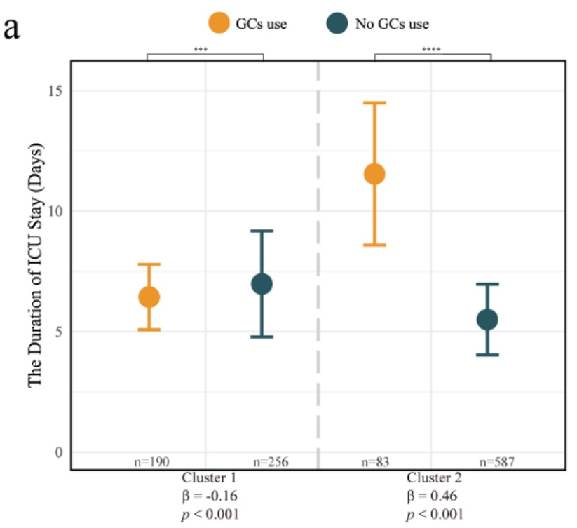

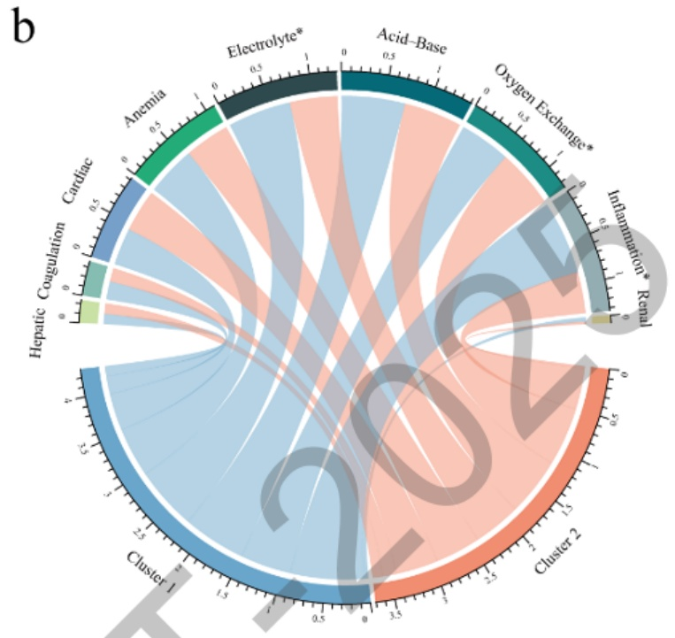

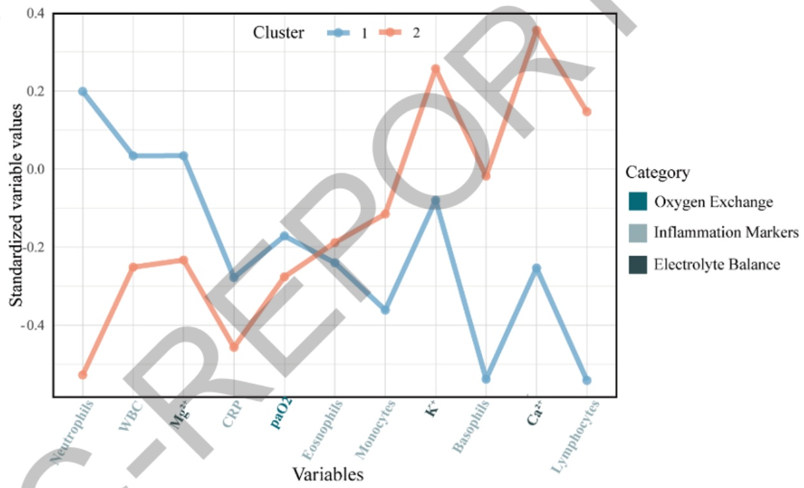

图15 全队列亚组特征分析

注: GCs:糖皮质激素；ICU:重症监护室；WBC:白细胞； $\mathrm { M g } ^ { 2 + }$ :血清镁离子；CRP:C-反应蛋白；paO2:动脉血氧分压； $\mathrm { K } ^ { + } ;$ 血清钾离子； $\mathrm { C a } ^ { 2 + }$ :血清钙离子。

而组间特征的比较进一步揭示了决定GCs疗效的关键结构性差异（图15 B-C）。获益组患儿普遍年龄较大（中位数216.00天 $\mathrm { v s } \quad 5 8 . \quad 0 0$ 天， $p \zeta$ 0.001），且表现出更高水平的炎症负荷，包括更高的白细胞计数、中性粒细胞计数及C-反应蛋白水平。而呼吸道合胞病毒感染是非获益组的核心特征(42.96% vs 32.18%, $p \leq 0.001$ ，获益组中细菌及非典型病原体的感染率则更高。

研究进一步通过Shapley加性解释（SHAP）量化各变量贡献，确认年龄是决定GCs疗效的核心关键变量，并识别出150天这一重要临床阈值，即大于150天的患儿表现出明确的负向SHAP值，即代表可以从GCs治疗中获益（图16）。

b

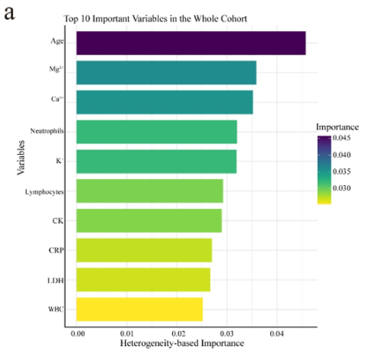

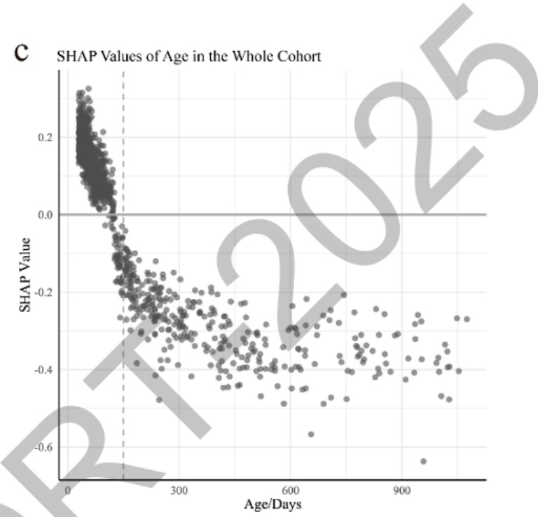

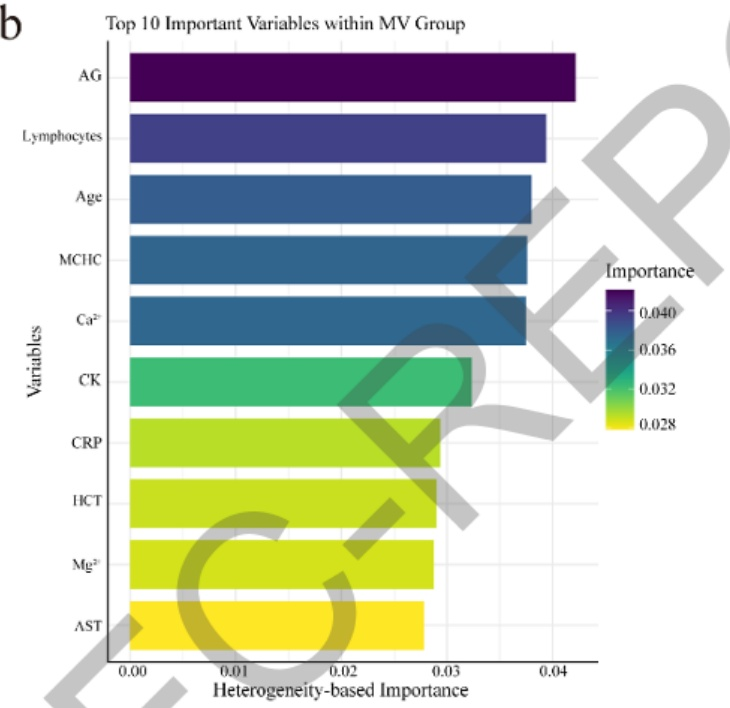

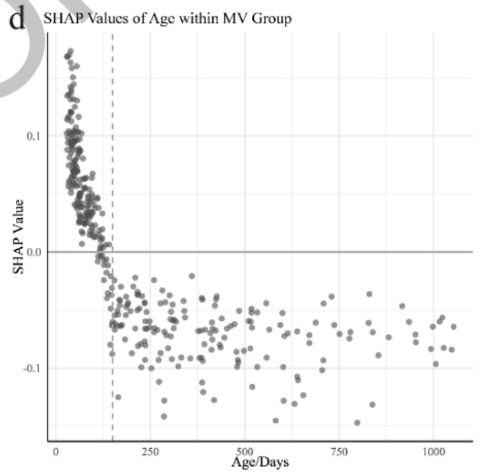

图16 特征重要性排序以及年龄对个体治疗效应的影响

注:GCs:糖皮质激素；ICU:重症监护室；WBC:白细胞； $\mathrm { M g } ^ { 2 + }$ :血清镁离子；CRP:C-反应蛋白； $\mathrm { p a 0 _ { 2 } } \mathrm { {  } }$ 动脉血氧分压；K:血清钾离子； $\mathrm { C a } ^ { 2 + }$ :血清钙离子；CK:肌酸激酶；LDH:乳酸脱氢酶； $\mathrm { A G } ;$ 阴离子间隙；MCHC:平均红细胞血红蛋白浓度；HCT:红细胞压积；AST:天门冬氨酸氨基转移酶；SHAP:Shapley加性解释。

科学意义与应用前景:本研究首次系统揭示婴幼儿重症肺炎激素治疗的异质性，实现了从群体平均水平到个体因果推断的跨越。研究通过数据驱

动的方式，为重症肺炎精准治疗提供了双重指导:一方面，识别出高炎症、高龄及细菌感染等是激素治疗高获益的生物标志物；另一方面，明确提示了低龄及呼吸道合胞病毒（RSV）感染患儿应谨慎或避免使用辅助激素。这一工具可辅助PICU医生制定更合理的抗炎策略，在提升治疗精准度的同时，最大限度减少药物相关不良反应。同时，该近邻场景的外延研究从药物决策维度进一步探讨并验证了因果森林在真实世界数据上释性与稳健性，体现了该方法的通用性与临床可迁移性。

## e) 核心进展五:成功将肺血管定量分析技术拓展至 COVID-19 肺炎研究，验证其作为跨疾病微循环障碍影像标志物的潜力

为验证本项目自主研发的影像分析技术的泛化能力与普适性，我们将核心的肺血管定量分析方法，拓展应用于新型冠状病毒（COVID-19）肺炎的临床研究。本研究基于一个连续入组的921例患者的回顾性队列，旨在系统评估不同严重程度新冠（COVID-19）患者的肺血容量（pulmonary blood volume，PBV）重分布特点，并进一步验证PBV在奥密克戎毒株感染中对远期结局的预测价值。方法上，研究纳入2022年 月至2023年1月期间921例经核酸或抗原确诊的 COVID-19 患者，所有患者入院当天接受薄层胸部CT，并使用经验证的深度学习算法自动完成肺、肺叶、病灶（磨玻璃影与实变）及肺血管分割（图17），通过对胸部CT的全自动分析，系统揭示COVID-19肺微循环障碍的独特规律。基于血管横截面积 量化了多类PBV指标:PBV为全肺血管体积总和；BV5%为横截面积≤ $: 5 ~ \mathrm { m m } ^ { 2 }$的小血管PBV占比，用于表征微循环灌注；BV10%为横截面积> $\cdot 1 0 \; \mathrm { { m m } } ^ { 2 }$ 的大血管PBV占比，反映较大肺血管扩张；ΔBV2%为约 $2 ~ \mathrm { ~ m m } ^ { 2 }$ 区间的小血管PBV 比例，是区分轻中症与重危病例差异最大的微血管指标。此外，还计算了肺叶PBV分布及实变、磨玻璃影、病灶总体积与病灶占肺比例等变量，用于分析炎症负荷对PBV的潜在影响。研究首次在体、量化地描绘了COVID-19重症化过程中的肺血管表型变化（图17，图18）。

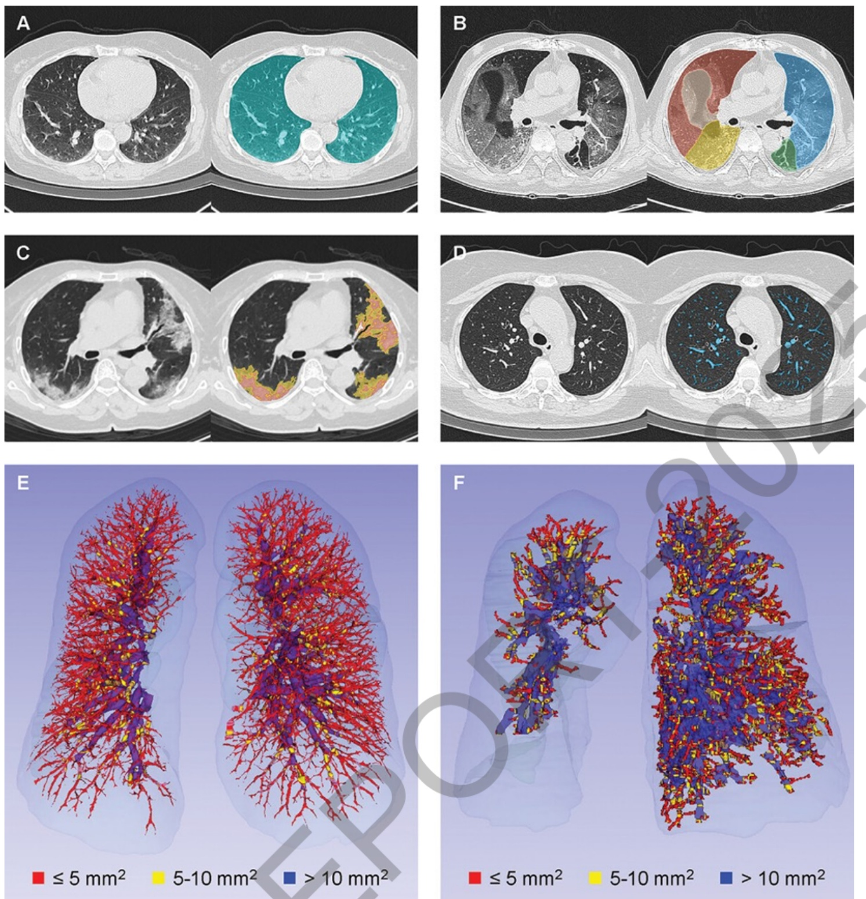

图17 肺部血管及病灶的代表性分割结果

注:A-D中不同颜色代表不同结构，全肺:青色；肺叶:蓝至红；磨玻璃影:黄色；实变:红色；肺血管:蓝色。

在统计分析策略上，本研究采用多变量Logistic回归模型，校正年龄、吸烟史 合并症、疫苗接种情况、感染时长及关键实验室指标，以评估PBV特征对30天临床进展及六个月不良结局（包括插管、ICU入住及全因死亡）的独立预测能力。同时，本研究基于BV5%、BV10%及∆BV2%构建多组Logistic预测模型，并通过AUC、DeLong检验等方法系统比较其预测效能，为PBV作为无创量化生物标志物的临床适用性与推广价值提供方法学支撑。

如图18 显示，重危组患者的总 PBV 显著低于轻中症组（239 mL vs. 259 mL，P=0.002），提示重危症患者总体肺血容量下降，并存在明确的血流分布改变。在肺叶层面，重危组患者的PBV明显由下叶向上叶和中叶重新分布（右上叶 24% vs. 19%, $P \leq 0 . 0 0 1$ ；右中叶 11% vs. 8%， $P \leq 0 . 0 0 1$ ；左上叶 23% vs. 21%, $P = 0.04$ ，而轻中症组则表现出更高的下叶 PBV（右下叶 29% vs. 24%, $P \textlangle 0.001$ ；左下叶 23% vs.18%，Pく0.001），提示重危组空间分布上移。在血管大小层面，重危组小血管容量占比即BV5%（面积 $\leqslant \mathrm { ~ 5 ~ }   \mathrm { m m } ^ { 2 }$ 的小血管PBV比例）明显降低（32%vs.44%，Pく0.0005），而大血管（>10 mm²占比（BV10%）显著升高（51%vs.39%， $P \leq 0.0005$ 。∆BV2% 2区间血管PBV）为区分两组差异最大的重要特征（11.14% vs.19.00% 0.0005），表明最小血管区段的PBV损失最为突出，凸显了微循环的精准评估价值。提示重危组存在血管层级重构，呈现“微血管丢失-大血管相对扩张”的典型模式。上述模式提示，随着疾病加重，肺部出现从下叶到上叶、从小血管到大血管的PBV重分布特征，与微血栓形成、微循环损伤及肺血管阻力变化可能相关。

D

F

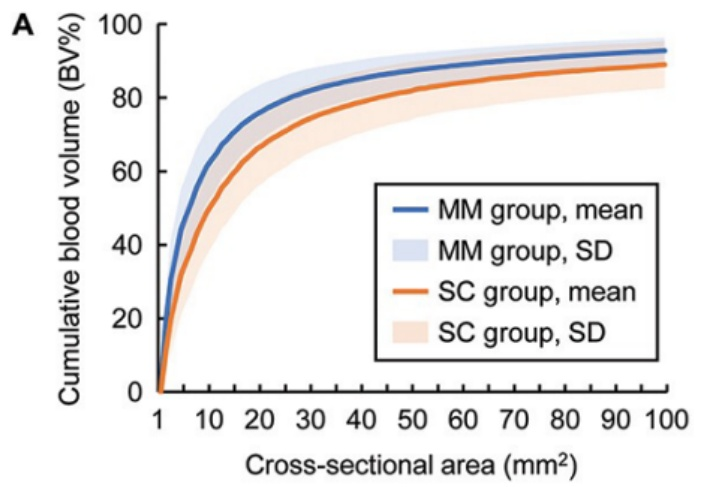

B

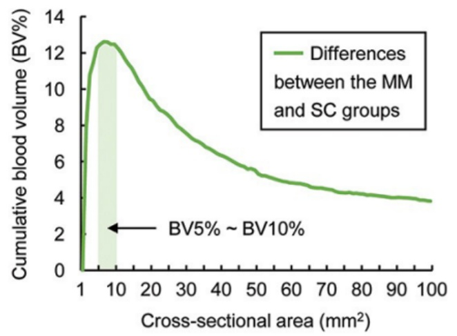

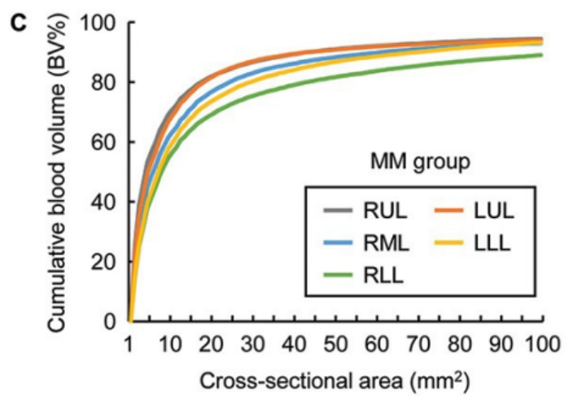

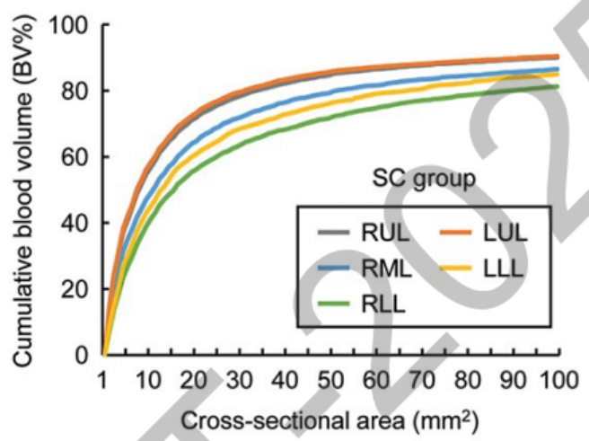

E

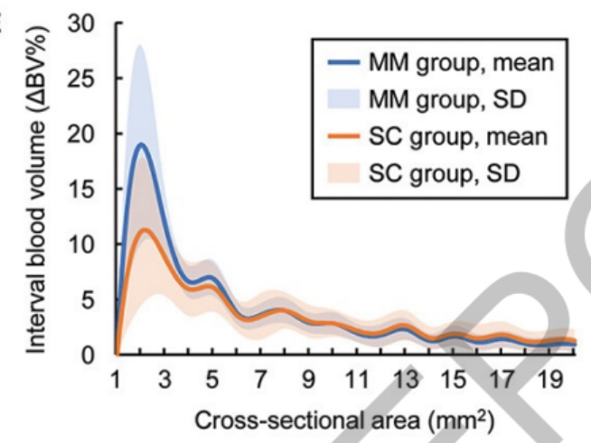

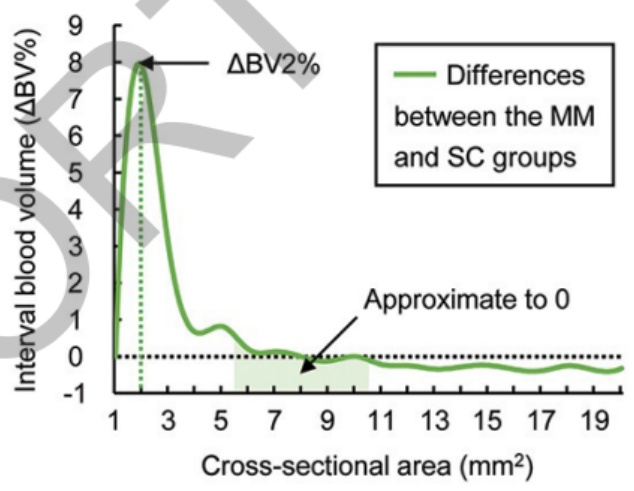

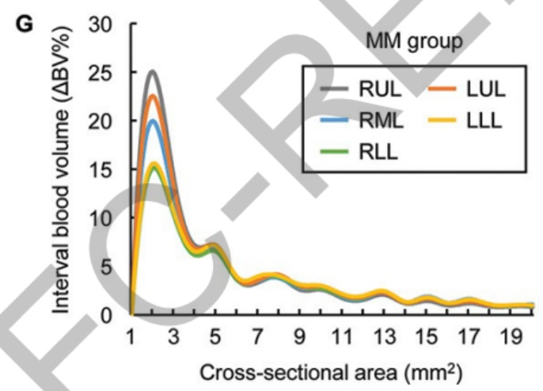

H

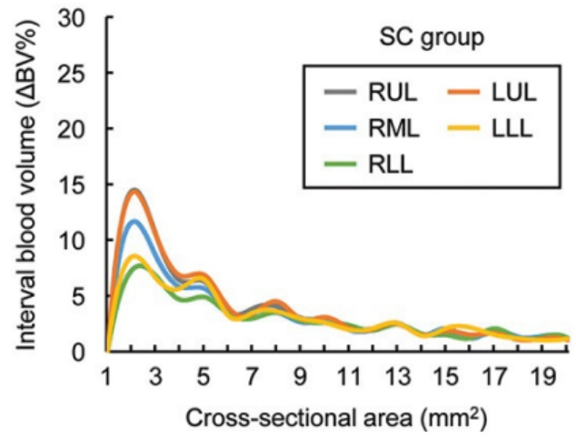

图18肺血容量随血管横截面积变化的分布谱图

注: $\mathrm { B V } \% \mathrm { : }$ 表示累积肺血容量，如，BV5%代表横截面积不超过 $5 \mathrm { m m } ^ { 2 }$ 的血管血容量占肺总血容量的百分比。ΔBV%:表示区间肺血容量。例如，△BV5%代表横截面积为 $5 \mathrm { m m } ^ { 2 }$ (在 $1 \mathrm { m m } ^ { 2 }$分辨率下，指 $4 \mathrm { m m } ^ { 2 } \zeta$ 横截面积≤5mm²）的血管血容量占肺总血容量的百分比。MM:轻型/普通型； $\mathrm { S C } ;$ 重型/危重型； ${ \mathrm { S D } } ;$ 标准差；RUL:右上叶；RML:右中叶；RLL:右下叶；LUL:左上叶； $\operatorname { L L L } \colon$ 左下叶。

多变量分析证实，PBV指标是预测不良预后的强大且独立的影像生物标志物（表4）。如在结局预测方面，BV5%、BV10%与ΔBV2%在多变量分析中均为多个临床事件的独立预测因子。以BV5%为例，其作为连续变量可显著预测六个月复合不良事件（包括插管、ICU入住及死亡） $( 0 \mathrm { R } = 0 . 9 3 , P \textlangle 0 . 0 0 1 )$ 和六个月死亡 $( 0 R = 0.95, P = 0.001 )$ ；当按42%阈值为界，低BV5%患者发生六个月复合不良事件的风险显著升高 $( 0 R = 4.66, P < 0.001 )$ ，死亡风险同样显著增加（0R = 3.34，P = 0.007），且该关联在调整全部临床混杂因素后仍然存在。

表4 COVID-19 患者中不同临床结局与 BV5%的逻辑回归分析

<table><tr><td rowspan="3">结局</td><td colspan="2">单因素回归</td><td colspan="2"></td><td colspan="2">多因素回归</td><td></td></tr><tr><td>OR (95% CI)</td><td></td><td>value P</td><td></td><td>OR (95% CI)</td><td></td><td>P value</td></tr><tr><td>重症感染</td><td colspan="6"></td><td></td></tr><tr><td>BV5%连续值</td><td>0.91(0.90,</td><td>0.93)</td><td>&lt;0.001</td><td></td><td></td><td>0.92 (0.90, 0.94)</td><td>&lt;0.001</td></tr><tr><td>二分类 BV5%*</td><td>6.18 (4.11,</td><td>9.30)</td><td>&lt;0.001</td><td></td><td></td><td>4.42(2.71, 7.20)</td><td>&lt;0.001</td></tr><tr><td>30 天随访内由 MM 进展为 SC</td><td></td><td></td><td></td><td></td><td></td><td></td><td></td></tr><tr><td>BV5%连续值</td><td>0.97 (0.</td><td>.95, 0.99)</td><td>0.02</td><td></td><td></td><td>0.98 (0.95, 1.01)</td><td>0.2</td></tr><tr><td>二分类 BV5%*</td><td>88</td><td>(1.09, 3.26)</td><td>0.02</td><td></td><td></td><td>1.46(0.75, 2.82)</td><td>0.26</td></tr><tr><td>六个月随访内出现复合不良事件</td><td></td><td></td><td></td><td></td><td></td><td></td><td></td></tr><tr><td>BV5%连续值</td><td>0.92 (0.89, 0.94)</td><td></td><td>&lt;0.001</td><td></td><td></td><td>0.93 (0.91, 0.96)</td><td>&lt;0.001</td></tr><tr><td>二分类 BV5%*</td><td>7.25 (3.91, 13.44)</td><td></td><td>&lt;0.001</td><td></td><td></td><td>4.66 (2.31, 9.42)</td><td>&lt;0.001</td></tr><tr><td>六个月随访内出现死亡</td><td></td><td></td><td></td><td></td><td></td><td></td><td></td></tr><tr><td>BV5%连续值</td><td>0.93 (0.91, 0.96)</td><td></td><td>&lt;0.001</td><td></td><td></td><td>0.95 (0.91, 0.98)</td><td>0.001</td></tr><tr><td>二分类BV5%*</td><td></td><td>5.25(2.39, 11.54)</td><td>&lt;0.001</td><td></td><td>3.34(1.38,8.09)</td><td></td><td>0.007</td></tr></table>

注:OR:比值比（优势比）；CI:置信区间；MM:轻型/普通型；SC:重型/危重型。

在预测模型性能方面，如图19所示，以BV5%构建的Logistic模型在测试集中用于区分重症感染的AUC为0.77，在预测六个月复合不良事件和六个月死亡时的AUC分别为0.79和0.75。该模型的表现与ΔBV2%、BV10%以及CT视觉评分相近（DeLong检验均 P>0.05），但整体AUC略低于定量病灶体积比例对应的AUC值。然而，在敏感度指标上，基于BV5%的模型展现出相对优势:用于预测六个月复合不良事件时敏感度达92%，用于预测六个月死亡时敏感度为93%，均明显高于其他PBV相关指标及定量病灶体积比例。这一结果提示，以

Predicting all-cause adverse events during six-month follow-up

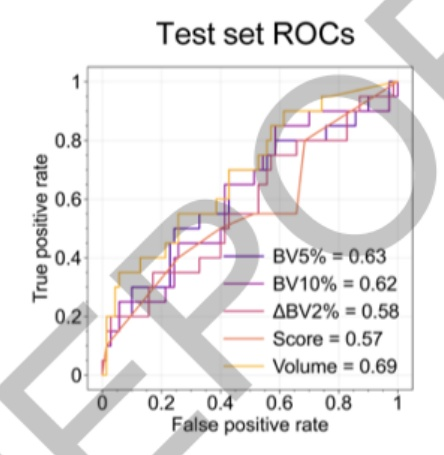

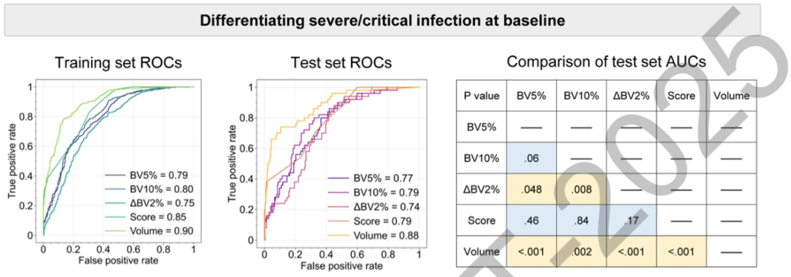

BV5%反映的小血管灌注特征对于识别高风险患者具有更强的敏感性，在长期预后预测中具有潜在临床价值。即BV5%等指标构建的预测模型，其核心优势在于极高的敏感性（预测不良事件敏感度92%，预测死亡敏感度93%），这意味着它能有效捕捉绝大多数高风险患者，在临床筛查中具有重要应用价值。

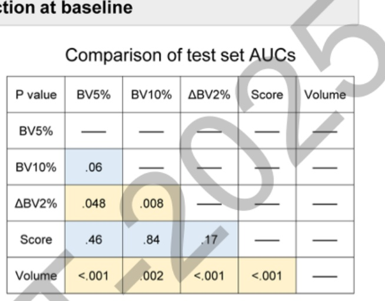

Predicting progression from MM to SC during 30-day follow-up

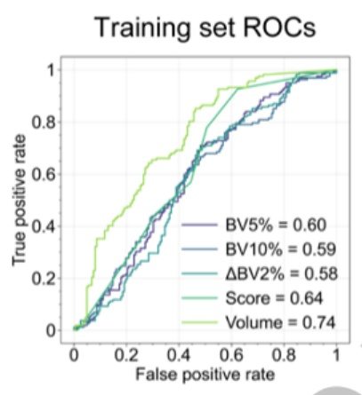

<table><tr><td colspan=6>ompanson or test set AuCs</td></tr><tr><td>P value</td><td>BV5%</td><td>BV10%</td><td>ΔBV2%</td><td>Score</td><td>Volume</td></tr><tr><td>BV5%</td><td></td><td></td><td></td><td></td><td></td></tr><tr><td>BV10%</td><td>.65</td><td></td><td></td><td></td><td></td></tr><tr><td>△BV2%</td><td>.12</td><td>.26</td><td></td><td></td><td></td></tr><tr><td>Score</td><td>.57</td><td>.64</td><td>.93</td><td></td><td></td></tr><tr><td>Volume</td><td>.47</td><td>.39</td><td>.21</td><td>.03</td><td></td></tr></table>

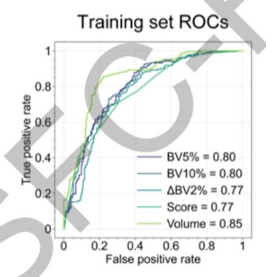

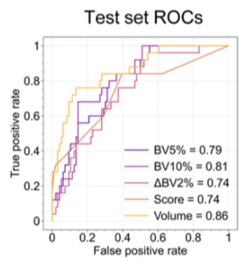

<table><tr><td colspan=6>Comparison of test set AUCs</td></tr><tr><td>P value</td><td>BV5%</td><td>BV10%</td><td>ΔBV2%</td><td>Score</td><td>Volume</td></tr><tr><td>BV5%</td><td></td><td></td><td></td><td></td><td></td></tr><tr><td>BV10%</td><td>.43</td><td></td><td></td><td></td><td></td></tr><tr><td>ΔBV2%</td><td>.008</td><td>.044</td><td></td><td></td><td></td></tr><tr><td>Score</td><td>.42</td><td>.26</td><td>.96</td><td></td><td></td></tr><tr><td>Volume</td><td>.09</td><td>.15</td><td>.01</td><td>.002</td><td></td></tr></table>

Predicting all-cause mortality during six-month follow-up

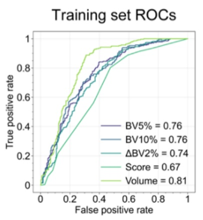

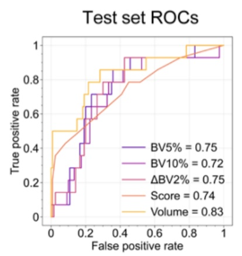

图19 基于肺血容量的鉴别或预测模型的性能评估

注:BV5%和BV10%:分别代表横截面积不超过 $5 \mathrm { m m } ^ { 2 }$ 和 $1 0 \mathrm { m m } ^ { 2 }$ 的累积肺血容量占肺总血容量的百分比。ΔBV2%:代表横截面积为 $2 ~ \mathrm { { m m } ^ { 2 } }$ 的区间肺血容量占肺总血容量的百分比。Score:肺炎严重程度的CT视觉评估评分。Volume:定量新冠肺炎病灶体积占比。ROC:受试者工作特征曲线；AUC:ROC曲线下面积；mm:轻型/普通型；sc:重型/危重型；ICU:重症监护室。

科学意义与应用前景:总体而言，该研究将本项目开发的核心影像定量技术成功应用于另一重要呼吸道病毒性疾病（COVID-19），系统揭示了该病毒性肺炎特征性的肺微循环障碍的影像学模式，为理解其血管病理机制提供了直接影像学证据；在技术层面，验证了肺血容量（PBV）作为跨疾病微血管损伤的潜在生物标志物的价值，研究结果证明了本项目所采用的人工智能影像分析方法具备良好的跨疾病、跨年龄（从儿童支原体肺炎到成人病毒性肺炎）的技术泛化能力。这为理解包括新冠病毒在内的其他病原体所致肺炎的血管病理生理机制提供了重要工具和新证据，也提示了该技术作为评估肺部炎症性微血管障碍的普适性定量分析的作用，为未来应对新发呼吸道传染病提供了强大的方法学工具。

## 3. 研究人员的合作与分工

本项目依托临床医学、医学影像学、计算机科学与流行病学等多学科深度协作模式，团队分工清晰、协作高效，构建了包括临床需求、技术研发、多场景验证的工作模式，为研究顺利推进与成果产出提供坚实保障。具体分工如

a) 项目统筹与设计:由项目负责人宋兰牵头，全面负责项目的研究方案总体设计、研究技术路线制定、多中心协作协调及伦理合规全程监督，统筹把控研究方向与质量，确保项目有序推进。

b)临床数据采集与管理:

i. 首都儿科研究所团队（曲东、戈海延等）:负责重症社区获得性肺炎（CAP）患儿的回顾性队列建设与收集，包括制定严格的纳入排除标准、确保临床数据的规范化采集与质控，并提供了1116例婴儿及幼儿患者的诊疗信息，为因果推断研究奠定了数据基础。

ii. 浙江大学医学院附属儿童医院团队（俞刚、李哲明、李竞、朱珠等）:负责建立标准化的临床病例库，制定统一数据采集规范与质量标准，完成核心队列的临床及影像数据的采集、清洗与标准化处理工作。

iii. 山东省日照市中医院团队（杨斐、张宝凤等）:负责提供地市级医疗机构的真实世界临床与影像数据，为模型的外部验证， 评估其在基层场景的适用性提供了关键数据支撑。

iv. 中国医学科学院北京协和医院团队（应周梦、胡歌、朱振宸、王金华、徐可佩、彭丽等）:负责提供高水平综合型三甲医院的临床与影像数据，提供独立的模外部验证数据集队列，进一步提升验证数据的代表性与权威性。

## c）算法实现与数据分析:

i. 中国医学科学院北京协和医院团队（应周梦、胡歌、朱振宸等）:负责因果推断等高级统计分析的具体执行、统计图表制作、结果解读及学术论文的初稿撰写，保障研究结论的科学性与成果转化质量。

北京深睿博联科技有限责任公司团队（周振、谭卫雄、李秀丽、刘小青等）:提供核心技术支持，聚焦影像自动分割算法的研发、优化及配套在线工具开发，推动技术落地。

d）统计学与方法学指导:由首都医科大学宣武医院循证医学部门的韩伟教授负责统计学方法的审核与指导，全面审核研究全过程的统计学方法设计与应用，协助控制研究中的混杂因素，严格把控数据分析的严谨性与结论的可靠性。

## 4. 国内外学术合作交流等情况

a）构建多层次多中心协作网络:本项目构建了覆盖不同层级的协作网络:联合国家医学中心与疑难重症诊疗中心-中国医学科学院北京协和医院（顶尖综合性大型三甲医院）、国家级儿童专科医学中心-首都儿科研究所（儿科领域享有极高声誉的国家级专科机构）、区域性儿童医疗中心-浙江大学医学院附属儿童医院（华东地区重要儿童临床与研究基地）以及地市级综合医院-山东省日照市中医院（代表基层医疗实践场景），这形成了涵盖国家级、省级及地市级医院的数据协作网络。这种分级诊疗背景下的合作模式，确保了研究数据能全面反映从国家顶级医疗中心到基层医院的临床实践谱系，有助于评估模型在不同临床环境和设备条件下的适用范围与泛化能力。

b）深化医工交叉融合实践:项目组与医疗人工智能相关企业及科研实验室保持了紧密的合作关系及常态化协作机制。通过定期的专题研讨与交流，高效推动临床需求向工程技术方案的精准转化，实现了从“临床问题提出-算法研发优化-临床验证反馈”的闭环研究模式。

c）促进学术成果国内外传播:本课题研究成果在中华医学会放射学学术大会（第31、32次）、欧洲放射学年会（ECR）等国内外顶级会议上多次进行口头汇报或壁报展示，获得国内外同行广泛关注与认可，提升了研究的学术影响力。会议目录如下:

| 会议名称 | 汇报/壁报题目 |
| --- | --- |
| 中华医学会第31次放射学学术大会 | Application of artificial intelligence inpediatric wheezing illnesses |
| 中华医学会第31次放射学学术大会 | 基于 U-Net 网络 CT 量化分析预测病毒性肺炎感染后间质性肺异常的发生 |
| 中华医学会第32次放射学学术大会 | 基于定量CT肺血管体积参数的儿童难治性肺炎支原体肺炎的预测模型研究 |
| 中华医学会第32次放射学学术大会 | 基于因果森林与定量CT指标的儿童肺炎支原体肺炎支气管镜疗程预测模型 |
| 2026年欧洲放射学年会 | A Causal Forest Model IntegratingQuantitative CT Scores to Predict Benefit |
|  | from Flexible Bronchoscopy in Pediatric Mycoplasma pneumoniae Pneumonia: A Two- Center Retrospective Study |

## 5. 存在的问题、建议及其他需要说明的情况。

## 研究存在的主要局限:

第一、回顾性研究的局限:尽管研究采用了多中心验证、倾向性评分及因果推断等多种方法来减少或控制偏倚，但回顾性研究固有的局限性导致难以完全排除未被测量的混杂因素的干扰。

第二、机制验证深度需加强:关于肺血管重塑（BV5%降低）的研究结论主要基于影像学表型分析，受限于儿科临床伦理 难以获取肺组织活检标本进行病理对照，因此缺乏组织病理学、细胞分子生物学水平的直接确证以充分阐释其生物学机制。

第三、远期预后数据欠缺:目前研究的终点主要集中在急性期临床指标，对于患儿出院后的长期肺功能恢复、远期后遗症发生率等预后指标的长期追踪相对不足，难以全面评估干预措施的长期价值。

第四、临床部署存在壁垒:现有模型对计算资源存在一定依赖，如因果森林等模型依赖于高精度的定量CT 分割数据，而Trans-DLF模型基于复杂的深度神经网络架构。在尚未配备高性能计算终端或集成AI辅助诊断系统的基层医疗机构或其他资源有限场景下，模型的实时运行与大规模推广可能面临硬件设施与软件集成方面的制约。

## 未来工作优化建议

第一、推进前瞻性临床验证:基于现有模型筛选出的高危人群或潜在获益人群，设计并开展前瞻性的观察性队列研究或随机对照试验（RCT），以进一步验证模型在真实世界临床环境中的有效性与安全性，为临床转化提供高级别证据。

第二、开展多组学融合研究:整合外周血生物标志物数据（如代谢组学、蛋白组学），构建“影像表型-生物标志物-生物学机制”的关联体系，深入解析疾病发生发展的核心机制。

第三、建立长期随访队列:增加对患儿远期预后的随访模块，系统追踪患儿长期肺功能、生长发育及后遗症发生情况，评估早期预警与干预策略对改善长期肺健康的潜在价值。

第四、探索轻量化部署方案:研发模型压缩算法、云端协同计算等技术方案，降低模型对本地计算资源的需求，突破硬件与系统限制， 推动技术在基层医疗机构等资源有限场景的应用。

## （二）成果部分

1. 项目取得成果的总体情况。

本项目在执行期间，围绕研究目标，在机理探索、技术创新与临床转化方面均取得实质性进展，圆满完成了既定研究任务。本项目在学术论文发表、辅助诊断模型构建及临床应用探索方面取得了一定成果:

a）学术论文产出: 完成了11篇论文的撰写和发表工作（其中10篇已正式发表或正式接收，且7篇为SCI论著），内容主要包含RMPP的定量影像学机制研究、AI早期预警工具构建、因果推断治疗决策支持、肺血管定量分析技术在COVID-19肺炎中的拓展应用等以及2篇综述，系统评述了人工智能在儿科喘息性疾病中的应用前沿及在儿童喘息症状鉴别诊断中的作用。这些成果不仅体现了本项目从基础到临床、从技术创新到知识总结的系统性科研探索，也显著提升了团队在儿科呼吸影像人工智能领域的学术影响力。

i. Zhoumemg Ying，Lan Song （共同通讯作者），Zhengyu Jin. Application of artificial intelligence in pediatric wheezing illnesses. Chinese Journal of Academic Radiology

(JCR Q4, IF 0.8) , 2025;8(2):89-102. doi:10.1007/s42058-025-00185-0.综述，正式发表，第一标注

ii. Zhoumeng Ying, Zheming Li, Jing Li, Fei Yang, Zhu Zhu, Ge Hu, Wei Han, Zhenchen Zhu, Baofeng Zhang, Zhen Zhou, Mengyu Duan, Weixiong Tan, Xinxin Li, Zhengyu Jin, Lan Song (共同通讯),Gang Yu. Quantitative analysis of 2 pulmonary vascular alterations in children with refractory Mycoplasma pneumoniae pneumonia. Quantitative Imaging in Medicine and Surgery (JCR Q2, IF 2.3) ;15(11) :10409-10421. doi:10.21037/qims-2025-1008.SCI 论著， 正式发表，第一标注

iii. Zhoumeng Ying, Ge Hu, Jing Wei Han, Fei Yang, Zheming Li, Zhenchen Zhu, Baofeng Zhang, Zhen Zhou, Weixiong Tan, Zhu Zhu, Mengyu Duan, Zhengyu Jin，Lan Song（共同通讯作者) , Gang Yu.A CT-Based Deep Learning Model for the Automated Risk Stratification of Refractory Mycoplasma pneumoniae Pneumonia in Children.SCI 论著，European Radiology杂志投稿中,第一标注

Zhoumeng Ying, Jing Li, Zheming Li, Ge Hu, Fei Yang, Zhu Zhu, Wei Han, Zhenchen Zhu, Baofeng Zhang, Zhen Zhou, Mengyu Duan, Weixiong Tan, Xinxin Li, Zhengyu Jin, Lan Song(共同通讯作者),Gang Yu. A causal forest model integrating quantitative CT scores to predict benefit from flexible bronchoscopy in pediatric Mycoplasma pneumoniae pneumonia: a two-center retrospective study. Respiratory Research (JCR Q1, IF 5.0), 2025, doi:10.1186/s12931-025-03447-8.SCI论著，正式发表，第一标注

v. Zhoumeng Ying, Haiyan Ge, Wei Han, Ge Hu, Zhenchen Zhu, Jinhua Wang, Lan Song (共同通讯作者)， Dong Qu and Zhengyu

Jin. Assessing the Heterogeneous Treatment Effects of Glucocorticoids in Infants and Toddlers with Severe Pneumonia. Biomedicines (JCR Q1, IF 3.9), 2025;13(10):2333. doi:10.3390/biomedicines13102333.SCI 论

## 著，正式发表，第一标注

vi. Lan Song(第一作者), Zhenchen Zhu, Ge Hu, Xin Sui, Song, Zhengyu Jin. The role of artificial intel igence the differential diagnosis of wheezing symptoms children. Radiology Science (国际英文杂志) 2022;1:1-9. doi:10.15212/RADSCI-2022-0002.综述，正式发表，第一标注

vii. Ge Hu, Zhenchen Zhu, Zhengsong Pan, Weixiong Tan, Wei Han Zifeng Wu, Zhen Zhou, Xinlun Tian, Wei Song, Yizhou Yud, Lan Song（共同通讯作者） and Zhengyu Jin. Pulmonary Blood Volume Redistribution COVID-19 Patients of Different Severity and Its Predictive Value for Six-Month Outcomes in the Less Pathogenic Omicron Variant. Pulmonology (JCR Q1, IF

2026;32(1):2607932.doi:10.1080/25310429.2025.2607932.SCI论

## 著，Online发表，第二标注

Zhoumeng Ying, Zhenchen Zhu, Ge Hu, Zhengsong Pan, Weixiong Tan, Wei Han, Zifeng Wu, Zhou Z, Jinhua Wang, Wei Song, Lan Song, Zhengyu Jin. U-Net-based computed tomography quantification of viral pneumonia can predict fibrotic interstitial lung abnormalities at 3-month follow-up. Front Med (Lausanne) (JCR Q1, IF 3.0). 2024;11:1435337. doi: 10.3389/fmed.2024.1435337. SCI 论著，

## 正式发表，第二标注

ix. 戈海延（第一作者，项目骨干成员），刘霜，陈静，高文萍，黄偲元，李芳，吕芳，曲东.儿童川崎病休克综合征与脓毒性休克的早期鉴别探讨.《中华儿科杂志》（中国核心期刊），2025，63

（11）:1260-1265.中文论著，正式发表，第一标注

x. Jinhua Wang, Xin Sui, Ruijie Zhao, Huayang Du, Jiaru Wang, Yun Wang, Ruiyao Qin, Xiaoping Lu, Zhuangfei Ma, Yinghao Xu, Zhengyu Jin, Lan Song (共同通讯作者), Wei Song. Value of deep learning reconstruction of chest low-dose image quality improvement and lung parenchyma assessmen on lung window. European Radiology (JCR Q1, 2024;34(2):1053-1064. doi:10.1007/s00330-023-10087-3.SCI 论著，正式发表，第一标注

xi. Jingna Xie, Yingshuo Wang, Qiuyang Sheng, Xiaoqing Liu (项目骨干成员), Jing Li,Fenglei Sun, Yuqi Wang， Shuxian Li, Yiming Li, Yizhou Yu, Gang Yu. Identification of mycoplasma pneumonia in children based on fusion of multi-modal clinical free-text description and structured test data. Health informatics journal (JCR Q2, IF 2.3). 2024;30 :14604582241255818.

doi:10.1177/14604582241255818.SCI 论著，正式发表，第五标注

## b） 发明专利申报或授权情况:

发明人:宋兰，应周梦，朱振宸，胡歌，周振，谭卫雄.一种难治性肺炎支原体肺炎预测模型的构建方法、设备.专利申请号:202510660348.1，类型:发明，申请日期:2025.05.21，专利状态:优先审查中（2026年1月14日），申请人:中国医学科学院北京协和医院

ii.发明人:宋兰，应周梦，胡歌，朱振宸，周振，谭卫雄.基于肺微血管变化预测RMPP的方法、设备、介质和程序产品.专利申请号:

202510660210.1，类型:发明，申请日期:2025.05.21，专利状态:优先审查中（2026年1月14日），申请人:中国医学科学院北京协和医院

iii.发明人:金征宇;毛丽;李秀丽;宋兰;俞益洲;李一鸣;乔昕.一种类别预测模型的生成方法及装置.专利号:ZL202110332831.9，类型:发明，授权公告日:2023年04月25日，授权公告号:CN113077427B，专利权人:北京深睿博联科技有限责任公司、杭州深睿博联科技有限公司

c） 创新型算法与工具开发:研发了基于CT影像与Transformer架构的RMPP全自动早期预警系统（Trans-DLF），以及基于因果森林的支气管镜治疗体化治疗获益预测工具，核心算法已具备封装为可交互的在线临床决策辅助工具的能力，为后续的临床转化研究奠定了坚实的技术基础。

d) 临床诊疗路径提供新证据:研究通过大样本、多中心研究，系统揭示了RMPP的肺微循环障碍影像模式，明确了CT 定量分析技术在儿科重症肺炎风险分层与精准诊疗中的独特价值，为优化临床实践提供了高级别循证依据。

## 2. 项目成果转化及应用情况。

研究成果已初步实现从算法到工具的转化。基于因果森林模型的核心研究结果，项目团队开发了基于Web端的个体化治疗效应的在线计算工具。工具访问:Shiny App: https://htefb.shinyapps.io/shiny\_ite\_app/。核心功能:该交互式工具允许临床医师输入患儿特定的定量CT参数（如实变体积）及关键临床指标，实时计算并可视化个体化治疗效应（ITE），预测其从柔性支气管镜（FB）治疗中获益的概率参考值。应用价值:该工具将复杂的因果推断模型转化为直观的临床参考，旨在辅助临床医生识别最可能获益的患儿，帮助医生更直观地理解不同特征患儿可能存在的治疗获益差异，推动介入治疗从经验性迈向量化决策，减少不必要的医疗操作。

## 3. 人才培养情况。

本项目充分发挥了多学科交叉研究平台的育人功能，在人才培养方面发挥了积极作用，成功培养了一批复合型青年研究人才:

a）复合型医学研究人才培养:依托本项目，培养了包括胡歌（助理研究员，2022-09至今）、朱振宸（临床博士后，2023-09-01至2026-08-30）、应周梦（在读博士，2022-09-01至2026-06-30）、王金华（在读博士，2023-09-01至2026-06-30）、徐可佩（在读硕士，2024-09-01至2027-06-30）、彭丽（在读硕士，2025-09-01至2028-06-30）等在内的多名学生。其中，应周梦依托本项目分别获批市级（《机器学习驱动的儿童肺炎支原体肺炎可弯曲支气管镜疗效异质性研究》）及校级（《基于大语言模型的儿童肺炎支原体肺炎辅助诊断模型构建与验证》）创新创业计各一项，实现了科研课题与人才培养的深度融合。此外，通过项目实践及全程参与，这些学生均在临床流行病学研究设计、医学影像数据处 深度学习算法应用、高级统计分析及学术论文写作等方面得到了系统的训练和显著提升，提升了解决复杂临床问题的科研能力。

b)临床团队科研能力提升:通过多中心协作机制及项目的实施，加强了参与单位及合作单位（包括首都儿研所、浙大医学院附属儿童医院、日照市中医院）青年医生在数据规范化管理、科研思维培养及学术论文撰写方面的能力，促进了临床与基础、工科团队的交流与融合以及共同成长。

## 4. 其他需要说明的成果。

项目构建的覆盖“国家-区域-地方”三级医疗机构的协同研究网络，其运行模式与数据质量控制经验，已成为可推广的科研合作范例。

## 5. 项目成果科普性介绍或展示网站。

目前暂无面向公众的专门科普网站。但研究成果已在中华医学会放射学学术年会、欧洲放射学年会等国内外顶级学术会议上进行交流展示。

## 研究成果目录

项目负责人通过系统，从文献库中检索研究成果或者按要求格式自行填入。请按照期刊论文、会议论文、学术专著、专利、会议报告、标准、软件著作权、科研奖励、人才培养、成果转化的顺序列出，其它重要研究成果如标本库、科研仪器设备、共享数据库、获得领导人批示的重要报告或建议等，应重点说明研究成果的主要内容、学术贡献及应用前景等。

项目负责人不得将非本人或非参与者所取得的研究成果、与受资助项目无关的研究成果、未标注国家自然科学基金资助和项目批准号的论文以及取得时间早于项目资助期开始时间的研究成果列入报告中。发表的研究成果（包括专利），项目负责人和参与者均应如实注明得到国家自然科学基金项目资助和项目批准号，科学基金作为主要资助渠道或者发挥主要资助作用的，应当将自然科学基金作为第一顺序进行标注。

## 期刊论文

(1) Zhoumeng Ying; Lan Song; Zhengyu Jin; Application of artificial intelligence in pediatric wheezing illnesses, Chinese Journal of Academic Radiology, 2025，8(2):89-102. 第一标注

(2) Zhoumeng Ying; Jing Li; Zheming Li; Ge Hu; Fei Yang; Zhu Zhu; Wei Han; Zhenchen Zhu; Baofeng Zhang; Zhen Zhou; Mengyu Duan; Weixiong Tan; Xinxin Li; Zhengyu Jin; Lan Song; Gang Yu; A causal forest model integrating quantitative CT scores to predict benefit from flexible bronchoscopy in pediatric Mycoplasma pneumoniae pneumonia: a two-center retrospective study, Respiratory Research, 2025, 27(1): 18-18. 第一标注

(3) Ge Hu; Zhenchen Zhu; Zhengsong Pan; Weixiong Tan; Wei Han; Zifeng Wu; Zhen Zhou; Xinlun Tian; Wei Song; Yizhou Yu; Lan Song; Zhengyu Jin; Pulmonary blood volume redistribution in COVID-19 patients of different severity and its predictive value for six-month outcomes in the less pathogenic Omicron variant, Pulmonology, 2026，32(1):2607932. 第二标注

(4) Zhoumeng Ying; Zhenchen Zhu; Ge Hu; Zhengsong Pan; Weixiong Tan; Wei Han; Zifeng Wu; Zhen Zhou; Jinhua Wang; Wei Song; Lan Song; Zhengyu Jin; U-Net-based computed tomography quantification of viral pneumonia can predict fibrotic interstitial lung abnormalities at 3-month follow-up, Frontiers in Medicine, 2024, 11(无). 第二标注

(5) 戈海延；刘霜；陈静；高文萍；黄偲元；李芳；吕芳；曲东；儿童川崎病休克综合征与脓毒性休克的早期鉴别探讨，中华儿科杂志，2025，63(11):1229-1233.第一标注

(6) Wang, Jinhua; Sui, Xin; Zhao, Ruijie; Du, Huayang; Wang, Jiaru; Wang, Yun; Qin, Ruiyao; Lu, Xiaoping; Ma, Zhuangfei; Xu, Yinghao; Jin, Zhengyu; Song, Lan; Song, Wei; Value of deep learning reconstruction of chest low-dose CT for image quality improvement and lung parenchyma assessment on lung window, EUROPEAN RADIOLOGY, 2024，34(2):1053-1064. 第一标注

(7) Ying, Zhoumeng; Ge, Haiyan; Han, Wei; Hu, Ge; Zhu, Zhenchen; Wang, Jinhua; Song, Lan; Qu, Dong; Jin, Zhengyu; Assessing the Heterogeneous Treatment Effects of Glucocorticoids in Infants and Toddlers with Severe Pneumonia, Biomedicines, 2025， 13(10). 第一标注 1

(8) Ying, Zhoumeng; Li, Zheming; Li, Jing; Yang, Fei; Zhu, Zhu; Hu, Ge; Han, Wei; Zhu, Zhenchen; Zhang, Baofeng; Zhou, Zhen; Duan, Mengyu; Tan, Weixiong; Li, Xinxin; Jin, Zhengyu; Song, Lan; Yu, Gang; Quantitative analysis of pulmonary vascular alterations in children with refractory Mycoplasma pneumoniae pneumonia, Quantita tive Imaging In Medicine and Surgery, 2025, 15(11). 第一标注

(9) Lan Song; Zhenchen Zhu; Ge Hu; Xin Sui; Wei Song; Zhengyu Jin; The role of artificial intelligence in the differential diagnosis of wheezing symptoms in children, Radiology Science, 2022, 1(1): 1-9. 第一标注

(10) Xie, Jingna; Wang, Yingshuo; Sheng, Qiuyang; Liu, Xiaoqing; Li, Jing; Sun, Fenglei; Wang, Yuqi; Li, Shuxian; Li, Yiming; Yu, Yizhou; Yu, Gang; Identification of mycoplasma pneumonia in children based on fusion of multi-modal clinical free-text description and structured test data, HEALTH INFORMATICS JOURNAL, 2024, 30(2). 第五标注

## 专利

(1)金征宇；毛丽；李秀丽；宋兰；俞益州；李一鸣；乔昕；一种类别预测模型的生成方法及装置，2023-04-25至2041-03-29，中国，ZL 2021 1 0332831.9.

(2)宋兰；应周梦；朱振宸；胡歌；周振；谭卫雄；一种难治性肺炎支原体肺炎预测模型的构建方法、设备，2025-05-21中国，202510660348.1.

(3) 宋兰；应周梦；胡歌；朱振宸；周振；谭卫雄；基于肺微血管变化预测 RMPP的方法、设备、介质和程序产品，2025-05-21，中国，202510660210.1.

## 会议报告

(1) 应周梦；宋兰; 金征宇; Application of artificial intelligence in pediatric wheezing illnesses,中华医学会第31次放射学学术大会，上海世博中心，2024-11-15至2024-11-17.

(2) 宋兰；应周梦；金征宇；基于定量CT肺血管体积参数的儿童难治性肺炎支原体肺炎的预测模型研究，中华医学会第32次放射学学术大会，长沙国际会议中心，2025-11-13至2025-11-16.

(3) 应周梦；李竞；胡歌；宋兰；俞刚；A Causal Forest Model Integrating Quantitative CT Scores to Predict Benefit from Flexible Bronchoscopy in Pediatric Mycoplasma pneumoniae Pneumonia: A Two-Center Retrospective Study， 2026年欧洲放射学年会，Austria Center, Bruno-Kreisky-Platz 1， 1220 Vienna， Austria, 2026-03-04至2026-03-08.

(4) 应周梦；宋兰；金征宇；基于因果森林与定量CT 指标的儿童肺炎支原体肺炎支气管镜疗程预测模型，中华医学会第32次放射学学术大会，长沙国际会议中心，2025-11-13至2025-11-16.

(5) 宋兰；应周梦；朱振宸；胡歌；金征宇；基于U-Net网络CT量化分析预测病毒性肺炎感染后间质性肺异常的发生，中华医学会第31次放射学学术大会，上海世博中心，2024-11-15至2024-11-17.

## 项目成果应用前景

本项目成果拟应用领域:1、儿童喘息相关疾病管理2、儿童肺炎精准化治疗

预计在5-10年推广使用

附表:研究成果统计数据表（本表针对各种类型资助项目收集数据以便进行整体资助效果分析使用，并非要求每类项目都具有以下各类成果。

<table><tr><td rowspan=4>获奖（项）</td><td colspan=16>国家级</td><td colspan=11>部级1</td><td rowspan=3 colspan=2>其他</td></tr><tr><td colspan=4>自然科学奖</td><td colspan=5>科技进步奖</td><td></td><td colspan=6>发明奖</td><td colspan=7>自然科学奖</td><td colspan=4>科技进步奖</td></tr><tr><td colspan=2>一等</td><td colspan=2>二等</td><td colspan=2>一等</td><td colspan=3>二等</td><td></td><td colspan=3>一等</td><td colspan=3>二等</td><td colspan=3>等</td><td colspan=4>等</td><td colspan=2>一等</td><td colspan=2>二等</td></tr><tr><td colspan=2>0</td><td colspan=2>0</td><td colspan=2>0</td><td colspan=3>0</td><td></td><td colspan=3>0</td><td colspan=3>0</td><td colspan=3>0</td><td colspan=4>0</td><td colspan=2>0</td><td colspan=2>0</td><td colspan=2>0</td></tr><tr><td rowspan=4>学术报告/论文/专著/其他（篇）</td><td colspan=3>特邀学术报告</td><td colspan=15>学术论文</td><td rowspan=2 colspan=4>学术专著</td><td rowspan=2 colspan=7>其他</td></tr><tr><td rowspan=2>国际学术会议</td><td rowspan=2 colspan=2>国内学术会议</td><td colspan=4>发表论文数</td><td colspan=11>论文检索收录情况</td></tr><tr><td colspan=2>期论义</td><td colspan=2>会议</td><td colspan=2>SCIE/SSCI</td><td colspan=3>EI</td><td colspan=3>北大中文核心期刊</td><td colspan=3>CSSCI</td><td colspan=2>中文</td><td colspan=2>外文</td><td colspan=2>标本库</td><td colspan=2>数据库</td><td colspan=2>科研仪器设备</td><td>重要报告</td></tr><tr><td>0</td><td colspan=2>0</td><td colspan=2>10</td><td colspan=2>0</td><td colspan=2>0</td><td colspan=3>0</td><td colspan=3>0</td><td colspan=3>0</td><td colspan=2>0</td><td colspan=2>0</td><td colspan=2>0</td><td colspan=2>0</td><td colspan=2>0</td><td>0</td></tr><tr><td rowspan=4>专利/标准/软著/成果转化</td><td></td><td colspan=6>专利（项）</td><td colspan=2></td><td colspan=11>标准</td><td rowspan=3 colspan=2>软件著作权</td><td rowspan=2 colspan=7>成果转化</td></tr><tr><td colspan=3>国内</td><td colspan=4>国外</td><td rowspan=2 colspan=2>国际</td><td colspan=11>国内</td></tr><tr><td>申请</td><td colspan=2>授权</td><td colspan=2>申请</td><td colspan=2>授权</td><td colspan=3>国家</td><td colspan=3>行业</td><td colspan=3>地方</td><td colspan=2>企业</td><td colspan=2>技术转让技</td><td colspan=2>术许可作</td><td colspan=2>价投资</td><td>经济效益(万元)</td></tr><tr><td>2</td><td colspan=2>1</td><td colspan=2>0</td><td colspan=2>0</td><td colspan=2>C</td><td colspan=3>0</td><td colspan=3>0</td><td colspan=3>0</td><td colspan=2>0</td><td colspan=2>0</td><td colspan=2>0</td><td colspan=2>0</td><td colspan=2>0</td><td>0</td></tr><tr><td rowspan=4>人才培养及学术交流</td><td colspan=17>人才培养（人）</td><td colspan=12>举办和参加学术会议</td></tr><tr><td colspan=8>中青年学术带头人</td><td rowspan=2 colspan=3>出站博士后</td><td rowspan=2 colspan=3>毕业博士</td><td rowspan=2 colspan=3>毕业硕士</td><td colspan=4>举办国际学术会议</td><td colspan=5>举办国内学术会议</td><td colspan=3>参加国际学术会议</td></tr><tr><td>优青</td><td colspan=2>杰青</td><td colspan=2>创新群体</td><td colspan=2>其他</td><td></td><td colspan=2>次数</td><td colspan=2>人数</td><td colspan=3>次数</td><td colspan=2>人数</td><td colspan=2>次数</td><td>人数</td></tr><tr><td>0</td><td colspan=2>0</td><td colspan=2>0</td><td colspan=2>0</td><td></td><td colspan=3>0</td><td colspan=3>0</td><td colspan=3>0</td><td colspan=2>0</td><td colspan=2>0</td><td colspan=3>0</td><td colspan=2>0</td><td colspan=2>0</td><td>0</td></tr></table>

国家自然科学基金项目资金决算表

项目批准号:82171934

项目负责人:宋兰

金额单位:万元

<table><tr><td rowspan="3">行次</td><td rowspan="3">科目名称</td><td colspan="3">预算数</td><td rowspan="2">累计支出数</td><td rowspan="2">结余数</td><td rowspan="2">结余资金比例</td></tr><tr><td>批准预算</td><td>预算调整</td><td>调整后预算</td></tr><tr><td>(1)</td><td>(2)</td><td>(3) = (1) + (2)</td><td>(4)</td><td>(5) =(3)-(4)</td><td>(6)</td></tr><tr><td>(1)</td><td>项目总经费</td><td>69.7000</td><td>0.0000</td><td>69.7000</td><td></td><td></td><td>12.93%</td></tr><tr><td>(2)</td><td>项目直接费用</td><td>55.0000</td><td>0.0000</td><td>55.0000</td><td>45.9900</td><td>9.0100</td><td></td></tr><tr><td>(3)</td><td>1、设备费</td><td>6.0000</td><td>0.0000</td><td>6.0000</td><td>0.0000</td><td>6.0000</td><td></td></tr><tr><td>(4)</td><td>其中:设备购置费</td><td>6.0000</td><td>0.0000</td><td>6.0000</td><td>0.0000</td><td>6.0000</td><td></td></tr><tr><td>(5)</td><td>2、业务费</td><td>32.6000</td><td>0.0000</td><td>32.6000</td><td>29.9700</td><td>2.6300</td><td></td></tr><tr><td>(6)</td><td>3、劳务费</td><td>16.4000</td><td>0.0000</td><td>16.4000</td><td>16.0200</td><td>0.3800</td><td></td></tr><tr><td>(7)</td><td>项目间接费用</td><td>14.7000</td><td>0.0000</td><td>14.7000</td><td></td><td></td><td></td></tr></table>

注:1.本表中（1）、（3）、（5）、（6）栏为系统自动生成，无需填写；本表中（2）栏填列预算调整数；本表中（4）栏填列项目的实际支出数。

2.第（1）行=第（2）+（7）行

第（2）行=第（3）+（5）+（6）行；

第（3）栏=第（1）+（2）栏；

第（5）栏=第（3）-（4）栏；

第（1）行第（6）栏=第（2）行第（5）栏/第（1）行第（3）栏100%；

第（1）行第（1）栏=第（1）行第（3）栏；

第（1）行第（2）栏=0；

第（4）栏≤第（3）栏；

第（2）行第（5）栏≥0。

决算说明书

| 科目名称 | 预算批复数 | 预算调整 | 调整后预算 | 累计支出 | 结余数 |
| --- | --- | --- | --- | --- | --- |
| 设备费 | 6.00 | 0.00 | 6.00 | 0.00 | 6.00 |
| 业务费 | 32.60 | 0.00 | 32.60 | 29.97 | 2.63 |
| 劳务费 | 16.40 | 0.00 | 16.40 | 16. 02 | 0.38 |
| 合计 | 55.00 | 0.00 | 55.00 | 45.99 | 9.01 |

结余资金情况说明

注:结余资金比例超过30%的项目该部分必填。

<table><tr><td colspan="7">项目负责人承诺:我所承担的项目（编号:82171934 名称:面向儿童喘息症状辅助诊断的可解释性人工智能技术研究）结题报告内容真实，数据准确，未出现《国家科学技术保密规定》中列举的属于国家科学技术秘密范围的内容，不涉及敏感科技信息。在今后的研究工作中，如有与本项目相关的成果，将如实注明得到国家自然科学基金项目资助和项目批准号，并报送国家自然科学基金委员会。项目负责人（签日期:</td></tr><tr><td colspan="4">依托单位科研管理部门:负责人（签章）:日期:</td><td colspan="2">依托单位财务管理部门:负责人（签章）:日期:</td><td>依托单位审查意见:依托单位公章:</td></tr><tr><td colspan="7">科学处审核意见:                             EP</td></tr><tr><td rowspan="2">完成情况综合评分(划√)</td><td>优</td><td>良</td><td colspan="2">中</td><td>差</td><td rowspan="2">负责人（签章）:日期:</td></tr><tr><td></td><td></td><td colspan="2"></td><td></td></tr><tr><td colspan="7">科学部核准意见  对重点项目等）:NSF负责人（签章）:日期:</td></tr><tr><td colspan="7">分管委领导意见（对重大项目等）:委领导（签章）:日期:</td></tr></table>

## 电子附件目录

| 序号 | 附件类型 | 附件名称 | 备注 |
| --- | --- | --- | --- |
| 1 | 论著 | 文章1 | Application of artificialintelligence in pediatricwheezing illnesses |
| 2 | 论著 | 文章2 | A causal forest model integratingquantitative CT scores to predictbenefit from flexiblebronchoscopy in pediatricMycoplasma pneumoniae pneumonia:a two-center retrospective study |
| 3 | 论著 | 文章3 | Pulmonary blood volumeredistribution in COVID-19patients of different severityand its predictive value forsix-month outcomes in the lesspathogenic Omicron variant |
| 4 | 论著 | 文章4 | Assessing the HeterogeneousTreatment Effects ofGlucocorticoids in Infants andToddlers with Severe Pneumonia |
| 5 | 论著 | 文章5 | Quantitative analysis ofpulmonary vascular alterations inchildren with refractoryMycoplasma pneumoniae pneumonia |
| 6 | 论著 | 文章6 | U-Net-based computed tomographyquantification of viral pneumonialcan predict fibrotic interstitiallung abnormalities at 3-monthfollow-up |
| 7 | 论著 | 文章7 | 儿童川崎病休克综合征与脓毒性休克的早期鉴别探讨 |
| 8 | 论著 | 文章8 | Value of deep learningreconstruction of chest low-doseCT for image quality improvementland lung parenchyma assessment onlung window |
| 9 | 论著 | 文章9 | The role of artificialintelligence in the differentialdiagnosis of wheezing symptoms inchildren |
| 10 | 论著 | 文章10 | Identification of mycoplasmapneumonia in children based onfusion of multi-modal clinicalfree-text description andstructured test data |
|  |  | 种难治性肺炎支原体肺 |  |
| 11 | 专利 | 炎预测模型的构建方法、设备 |  |
| 12 | 专利 | 基于肺微血管变化预测RMPP的方法、设备、介质和程序产品 |  |
| 13 | 专利 | 种类别预测模型的生成方法及装置 |  |
| 14 | 其他 | 中华医学会第31次放射学学术大会 | 中华医学会第31次放射学学术大会:Application of artificialintelligence in pediatricwheezing illnesses |
| 15 | 其他 | 中华医学会第31次放射学学术大会 | 中华医学会第31次放射学学术大会:基于U-Net网络CT量化分析预测病毒性肺炎感染后间质性肺异常的发生 |
| 16 | 其他 | 中华医学会第32次放射学学术大会 | 中华医学会第32次放射学学术大会:基于定量CT肺血管体积参数的儿童难治性肺炎支原体肺炎的预测模型研究 |
| 17 | 其他 | 中华医学会第32次放射学学术大会 | 中华医学会第32次放射学学术大会:基于因果森林与定量 CT指标的儿童肺炎支原体肺炎支气管镜疗程预测模型 |
| 18 | 其他 | 2026年欧洲放射学年会Q | 2026年欧洲放射学年会:A CausalForest Model IntegratingQuantitative CT Scores to PredictBenefit from FlexibleBronchoscopy in PediatricMycoplasma pneumoniae Pneumonia:A Two-Center Retrospective Study |