项目批准号 82173746申请代码 H3407归口管理部门收件日期

20250182173746

# 国家自然科学基金

# 资助项目结题/成果报告

资助类别:面上项目

亚类说明:

附注说明:

项目名称:基于网络药理学的人工智能辅助抗阿尔茨海默病药物设计研究

负责人:唐赟

BRID: 09273.00.67527

电子邮件:ytang234@ecust.edu.cn

电话: 021-64251052

依托单位: 华东理工大学

联系人:罗妍

电话: 021-64252413

直接费用:55.0000（万元）

执行年限: 2022.01-2025.12

填表日期:2026年01月02日

国家自然科学基金委员会制（2025年）

## 项目摘要

## 中文摘要:

阿尔茨海默病（AD）是严重危害人们健康的重大疾病，但目前还缺乏有效治疗药物，其原因就是其致病机制过于复杂，目前尚未完全弄清。研究表明AD是一种多基因、多通路疾病，针对单个靶标的药物很难达到治疗目的，因此，采用多个药物-多个靶标的网络模式来开发抗AD药物，有望突破目前的困境。大量组学数据及人工智能技术的发展，也为突破这种困境提供了机遇。本项目拟在前期研究基础上，充分利用各类生物医学数据，发展基于网络的分析方法，从三个方面来开展研究。首先基于已有数据，构建蛋白-基因-通路-疾病关联网络，进而发展方法预测潜在靶标和靶标组合；其次，基于靶标组合开展药物重定位研究，即从已知药物中寻找具有多靶标抗AD活性的老药和老药组合；第三，基于靶标组合虚拟筛选具有多靶标抗AD活性的小分子化合物，并进行结构优化。最后我们将在实验验证的基础上，来尝试理解AD的致病机制。本项目的实施将为抗AD药物研发提供新的解决方案，

## Abstract:

Alzheimer's disease (AD) is a major disease that seriously endangers people's health. However, there is still a lack of effective treatment drugs. The reason is that its pathogenic mechanism is too complicated and has not been fully understood yet. Studies have shown that AD is a multi-gene, multi-pathway disease, and it is difficult for drugs targeting a single target to achieve therapeutic goals. Therefore, the use of a multi-drug-multi-target network model to develop anti-AD drugs is expected to break the current dilemma. A large amount of omics data and the development of artificial intelligence technology also provide opportunities for breaking through this dilemma. Based on preliminary studies, this project intends to make full use of various types of biomedical data and develop network-based analysis methods to conduct research from three aspects. At first, we will build a protein-gene-pathway-disease association network based on existing data, and then develop methods to predict potential targets and target combinations. Secondly, we will carry out drug repositioning studies based on the predicted target combinations, that is, to find old drugs and old drug combinations with novel multi-target anti-AD activities. Thirdly, based on the target combination, we will discover a series of small molecular compounds with multi-target anti-AD activities, and carry out structural optimization. Finally, we will try to understand the pathogenesis of AD on the basis of experimental verification. The implementation of this project will provide new solutions for the development of anti-AD drugs.

关键词（用分号分开）:药物设计；人工智能；阿尔茨海默病；网络药理学；靶标预测

Keywords (separated by;): Drug design; Artificial intelligence; Alzheimer's disease; Network pharmacology; Target prediction

## 结题摘要

中文摘要（对项目的背景、主要研究内容、重要结果、关键数据及其科学意义等做简单概述）:

本项目针对阿尔茨海默病（AD）发病机制复杂、单一靶点药物疗效有限的问题，围绕“基于网络的靶标与药物组合预测”这一核心目标，系统开展了计算与实验相结合的研究。通过发展并整合多种网络药理学、深度学习及多组学数据分析方法，系统预测并实验验证了AD的潜在治疗靶标、老药新用及药物组合，为AD的联合治疗策略提供了新思路与新资源。

主要研究内容包含三个方面:一是发展并应用了基于网络和结构的靶标组合预测方法（如TCnet），结合表型筛选与关键节点识别算法（GAPR），成功预测出NRF2、NR3C1等多个AD潜在靶标及GSK3 β/ADAM17等靶标组合；二是构建大规模药物-靶标-疾病网络及知识图谱，实现了AD潜在药物与药物组合的预测，发现并实验验证了包括赖脯胰岛素、谷胱甘肽等10个抗AD老药及牛磺酸-多奈哌齐等16对药物组合；三是研发了知识图谱增强的DTI预测模型KG-CNNDTI和结合结构信息的Pocket-CPI模型，应用于AD相关靶标的虚拟筛选，成功发现多个活性化合物。

项目取得系列重要成果:共发表SCI论文12篇（其中第一标注4篇），申请发明专利1项，获软件著作权2项；实验验证了3个AD潜在靶标、2对靶标组合、10个抗AD老药及6个活性化合物，其中牛磺酸-多奈哌齐组合在细胞模型中显示出显著协同抗炎效果；发展了TCnet、KG-CNNDTI等多个原创性预测模型，部分方法已公开发表并获较高引用。项目执行期间培养博士生4名、硕士生5名，项目负责人多次在国内外学术会议汇报研究成果，推动了网络药理学在复杂疾病药物研发中的应用。

本研究不仅为AD治疗提供了新的潜在靶标和药物候选，也建立了一套融合网络预测与实验验证的研究范式，对多靶点药物研发具有重要科学意义和应用价值。

## Abstract (Brief description of research background, main methods, contributions, and research data):

Alzheimer's disease (AD) is a complex neurodegenerative disorder with limited therapeutic options due to its multifactorial pathogenesis. This project aimed to develop network-based computational strategies for predicting potential therapeutic targets, drug repurposing candidates, and effective drug combinations for AD.

We integrated network pharmacology, multi-omics data, and deep learning approaches to construct predictive models ineluding TCnet for target combination discovery, GAPR for key target identification, and KG-CNNDTI for drug-target interaction prediction. These methods were applied to large-scale biological networks and knowledge graphs incorporating protein-protein interactions, drug-target data, and disease-associated genes. Experimental validations were performed using cell-based models to confirm computational predictions.

The project identified three potential AD targets (NRF2, NR3C1, SHBG), two target combinations (GSK3β/ADAM17, NRF2/APP), and ten repurposed drugs (e.g., insulin lispro, glutathione, balsalazide) with anti-AD activity. Sixteen drug combinations were predicted, among which the taurine-donepezil pair showed synergistic anti-inflammatory effects in vitro. Additionally, six active compounds were discovered through virtual screening against AD-related targets. In total, 12 SCI-indexed papers were published (four as first-acknowledged), one Chinese invention patent was filed, and two software copyrights were obtained. During the project period, 4 PhD students and 5 master's students were trained. The project leader presented the research findings multiple times at domestic and international academic conferences, promoting the application of network pharmacology in drug development for complex diseases.

Our work provides a set of network-driven prediction tools and experimentally validated candidates for AD therapy, demonstrating the value of integrative

computational-experimental frameworks in uncovering multi-target strategies for complex diseases.

| 关键词（用分号分开）:阿尔茨海默病；药物设计；网络药理学；人工智能； 靶标预测 |
| --- |
| Keywords (separated by;): Alzheimer's disease; Drug design; Network |

## 正文

《结题/成果报告》正文分为两个部分:结题部分和成果部分。请按照《结题/成果报告》填报说明及撰写要求填写。

## (一)结题部分

1. 研究计划执行情况概述。

（1）按计划执行情况。

本项目按照原定研究计划，有序推进，认真实施，圆满完成了各项任务指标。

（2）研究目标完成情况。

对照项目原定目标，均已圆满完成。具体各项目标完成情况如下:

1）原定目标:发展基于网络的靶标组合和药物组合预测方法，进而针对AD预测关键靶标和靶标组合，并从已知药物中发现具有抗AD活性的老药和老药组合。实际完成:已发展基于网络的靶标和靶标组合预测方法如TCnet、药物和药物组合预测方法，并应用这些方法针对AD预测得到多个靶标和老药及其组合；

2）原定目标:预期发现AD潜在靶标1-2个、靶标组合1-2对，发现抗AD有效化合物3-5个，发现抗AD有效药物组合1-2对，发表高水平SCI收录论文8-10篇，申请专利1-2项，培养研究生5-6名。实际完成:已发现AD潜在靶标3个（NRF2、NR3C1、SHBG)，靶标组合 2 对（GSK3β 和 ADAM17、NRF2 和 APP)，抗 AD有效老药 10个(倍氯米松、甲泼尼龙、考尼伐坦、槲皮素、咖啡酸、赖脯胰岛素、谷胱甘肽、巴柳氮、萘丁美酮、托麦汀）及6个活性化合物，抗AD有效药物组合16对（其中1对获得实验确证，即牛磺酸-多奈哌齐组合)，发表SCI收录论文12篇（其中第一标注4篇)，申请中国发明专利1项，获得计算机软件著作权2项，获奖1项，培养研究生9名（其中毕业硕士3名、毕业博士2名）。

## 2. 研究工作主要进展、结果和影响。

（1）主要研究内容。

本项目按照原定研究计划进行，主要开展了如下三个方面的研究:

1）基于网络的阿尔茨海默病潜在靶标和靶标组合预测。首先我们提出了一个基于网络和基于结构相结合的组合策略，以融合二者的优势来预测具有抗AD活性的知母皂苷元衍生物的潜在靶点，并进一步对预测靶点NRF2进行了体外实验验证。其次我们结合表型筛选数据与网络药理学方法，对AD进程中的氧化应激假说机制与重要靶标和通路进行了预测分析，据此发现了一系列AD潜在靶标，如NR3C1、SHBG、ESR1、PGR和AVPR1A。我们还将关键节点识别算法GAPR首次应用于AD疾病网络，挖掘出了不同层级的 AD 关键靶标，如 APP、MAPK1 等，并揭示了 NRF2 与 APP 作为抗 AD 靶标组合的可行性。最后，我们提出了一种基于多组学和网络算法的抗阿尔茨海默病靶标组合预测策略 TCnet，用于发现潜在的靶标组合，如 GSK3β 和 ADAM17 组合。

2）基于网络的阿尔茨海默病潜在药物和药物组合预测。首先从多种生物和疾病相关数据库收集数据，构建一个庞大的 PPI网络+DTI网络+基因-疾病网络，重点分析其中的AD相关基因网络。然后通过不同药物-疾病网络模块叠合方式筛选具有互补构象的药物组合，最终获得15种具有潜在治疗效果的抗AD药物组合，生物实验确定了其中5种具有抗AD作用的老药，即赖脯胰岛素、谷胱甘肽、巴柳氮、萘丁美酮以及托麦汀。我们在上述基于网络和表型筛选数据进行靶标预测时，也发现了一些具有显著神经保护作用的老药，比如倍氯米松、甲泼尼龙和考尼伐坦。最近，我们通过在知识图谱中加入细胞系扰动数据，从而实现疾病特异性药物组合预测，并对具有潜力的抗AD药物组合进行了实验验证，发现牛磺酸-多奈哌齐药物组合效果明显，目前正开展动物体内实验验证。

3）基于网络和基于深度学习的药物-靶标相互作用预测。为针对AD靶标进行高效虚拟筛选，我们开发了一个知识图谱增强的DTI预测模型KG-CNNDTI，并将该模型用于13个 AD靶标与3131个中药成分的虚拟筛选，得到40个潜在中药成分，实验确证3 个活性化合物。其次我们发展了新的 DTI 预测模型 Pocket-CPI，并针对 NMDA 受体的N1/N3亚型结构虚拟筛选了1800万个化合物，选取12个化合物进行活性测试，从中获得3个IC50值在100μM内。

（2）取得的主要研究进展、重要结果、关键数据等及其科学意义或应用前景。

上述各部分所取得的主要研究进展和成果等分述如下:

## 1、基于网络的阿尔茨海默病潜在靶标和靶标组合预测

## 1.1 基于网络和结构的组合方法预测抗 AD 化合物的潜在靶标

前期研究中，我们发现知母皂苷元衍生物（sarsasapogeninderivatives,AAs）具有抗AD活性，但其分子机制尚不清楚。为此，我们提出了一个基于网络推理（Network-Based

Inference，NBI）方法和基于结构方法相结合的组合策略，以融合二者的优势来预测AAs的作用靶点（图1），并进一步对预测出来的重要靶点进行了体外实验验证。

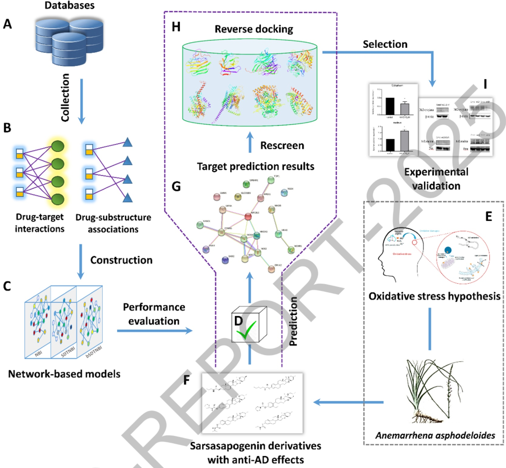

图1、抗 AD知母皂苷元衍生物的靶标预测以及 AD潜在致病机制研究流程。NBM和 SBM的结合策略包括以下步骤: （A）从公共数据库中收集药物和DTI数据，（B）构建DTI和药物-子结构关联网络，（C）构建NBM模型并进行性能评估，（D）具有最优预测性能的模型，（E-G）抗AD知母皂苷元衍生物的靶标预测结果，（H）通过反向对接重新筛选预测靶标，（I）体外实验验证。

首先，基于药物-靶标相互作用（Drug-Target Interactions,DTI）数据构建DTI网络，我们构建了一系列基于网络的预测模型，然后将表现最优的 bSDTNBI-FCFP4模型用于20种抗AD知母皂苷元衍生物（AA1-AA20）的潜在靶标预测。其次，针对重点化合物AA13，通过基于结构的反向对接方法对预测结果中排名前20的靶标（采用复合物晶体结构或者AlphaFold预测的结构模型）进行了再次筛选，发现AA13可以与其中多个靶标产生有利的相互作用。然后进行了文献分析，确定排名第二的NRF2作为潜在靶标进行体外实验验证。最后，体外实验结果表明，AA13可以促进NRF2从细胞质向细胞核的转移，下调NRF2在细胞质中的表达水平，并上调其在细胞核中的表达水平。这一动态变化说明，AA13非常有可能通过作用于NRF2靶标发挥抗AD的作用。我们进一步分析了 NRF2 及其他预测靶标如 MAOB、PPARG 以及 NR3C1 等在抗 AD 药物研发以及全面揭示AD致病机制中的重要性。

本研究工作于 2023 年 5 月发表于 J. Chem. Inf. Model., 2023, 63(9): 2881-2894.

## 1.2 基于网络和表型筛选数据的 AD 治疗靶标预测

本研究中，我们结合表型筛选数据与网络药理学方法，对AD进程中的氧化应激（Oxidative stress，OS）假说机制与重要靶标和通路进行了预测分析（图2)。我们首先从 DrugBank、TargetMol 和 SPECS 数据库中收集并购买了 222 个药物与天然产物化合物，通过 SH-SY5Y细胞实验得到了这批化合物对细胞的神经保护作用数据。为了获取这些化合物的作用靶标信息，我们从 ChEMBL、BindingDB、PDSPKi Database 和 IUPHAR Guide to PHARMACOLOGY 四个数据库中收集实验验证的 DTI 数据，并为所有实验化合物进行靶标匹配。然后，基于化合物初筛数据和靶标匹配信息，对所有匹配得到的靶标进行Wilcoxon统计检验，以得到与发挥神经保护作用显著相关的靶标基因。

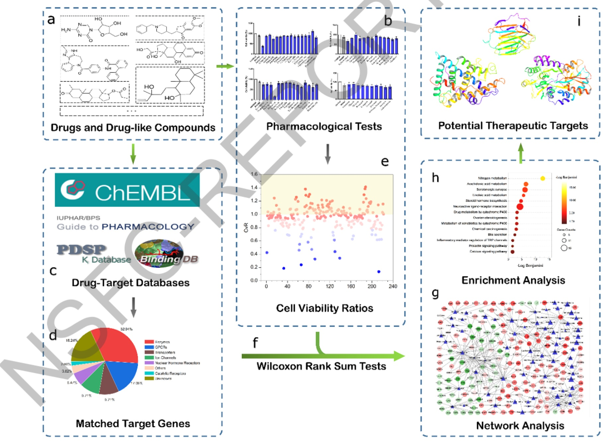

图2、本研究计算系统药理学方法工作流程。（a）药物和类药物化合物的收集；（b）SH-SY5Y细胞上的药理实验；（c）基于多数据库的药物作用靶标的匹配；（d）基于IUPHAR Guide to PHARMACOLOGY的匹配靶标分类；（e）每一个药物的药理实验细胞活性比值的计算；（f）匹配靶标的Wilcoxon秩和检验；（g）构建DTI网络进行进一步分析；（h）具有神经保护作用的药物的GSEA分析；（i）AD潜在治疗靶标的发现。

之后，我们构建了与神经保护作用相关的药物-靶标网络，并使用NetworkAnalyzer进行可视化分析。同时，为了发现与AD相关的关键靶标和通路，我们进行了基因集富集分析（Gene Set Enrichment Analysis, GSEA）分析，从通路角度分析关键靶标在 AD致病机制中的重要作用。据此我们发现了一系列AD的潜在治疗靶标，比如NR3C1、SHBG、ESR1、PGR 和 AVPR1A。这些靶基因与 AD 的神经保护作用和发病机制，特别是氧化应激机制密切相关。同时，基于对前面药理实验结果的计算分析，我们也发现一些具有显著神经保护作用的老药，比如倍氯米松、甲泼尼龙和考尼伐坦，这些药物不仅为AD老药新用研究提供了新方案，也具备成为抗AD药物的潜力。此外，通过对具有神经保护作用相关的药物靶标集进行富集分析，我们确定了14 条与神经保护作用以及AD密切相关的通路。

总之，我们在本研究中提出的药理表型初筛实验与计算分析的结合策略，不仅能够识别有研究前景的AD治疗靶标以及抗AD药物，也能够用于其他复杂疾病的治疗靶标识别和机制揭示。相关研究论文已发表在 Journal of Alzheimer's Disease, 2024, 99(s1): S139-S156.

## 1.3 基于网络的 AD 关键治疗靶标识别及相互作用蛋白预测

本研究通过AD相关风险基因构建的网络，将基于网络的关键节点识别算法GAPR（Greedy Articulation Protein Removal）首次应用于 AD 疾病网络，以挖掘 AD 疾病网络中的关节蛋白集、寻找AD重要治疗靶标，从而为发现AD有效治疗策略服务。

我们首先从多个生物医学数据库中收集并整合蛋白-蛋白相互作用（Protein-Protein Interactions，PPI）数据以及AD相关致病基因（AD-related Genes,ADG）数据，构建了较为全面的人类PPI网络以及ADG疾病网络，并计算其网络拓扑性质。其次，将关节蛋白贪婪剔除算法（GAPR）应用于ADG网络，通过GAPR方法对 ADG网络的逐层分解，得到了APP、MAPK1、JUN、APOE、BIN1 等位于不同层级的 AD关键治疗靶标集(图 3)。该关键治疗靶标集对于 AD 致病机制的揭示以及抗 AD 药物研究具有指导作用。

同时，基于收集的 PPI数据集，通过 CN、Salton、Jaccard 及 Sørensen 等十种基于局部信息的节点相似性指标，LP、IDNL3、EDNL3及IEDNL3等九种基于局部信息的局部路径指标，以及Katz、ACT等三种基于全局信息的相似性指标，我们构建了22种基于网络的PPI链路预测模型，其中包括16种现有的链路预测策略以及6种我们发展的链路预测新策略。模型交叉验证以及外部测试集验证结果表明，我们发展的IDNL3模型具有最优秀的预测性能。基于IDNL3模型，我们对相关关节蛋白以及其他蛋白进行了案例研究。关键治疗靶标相互作用蛋白的发现，能够为设计靶向药物及抗AD靶标组合的选择提供重要参考信息。

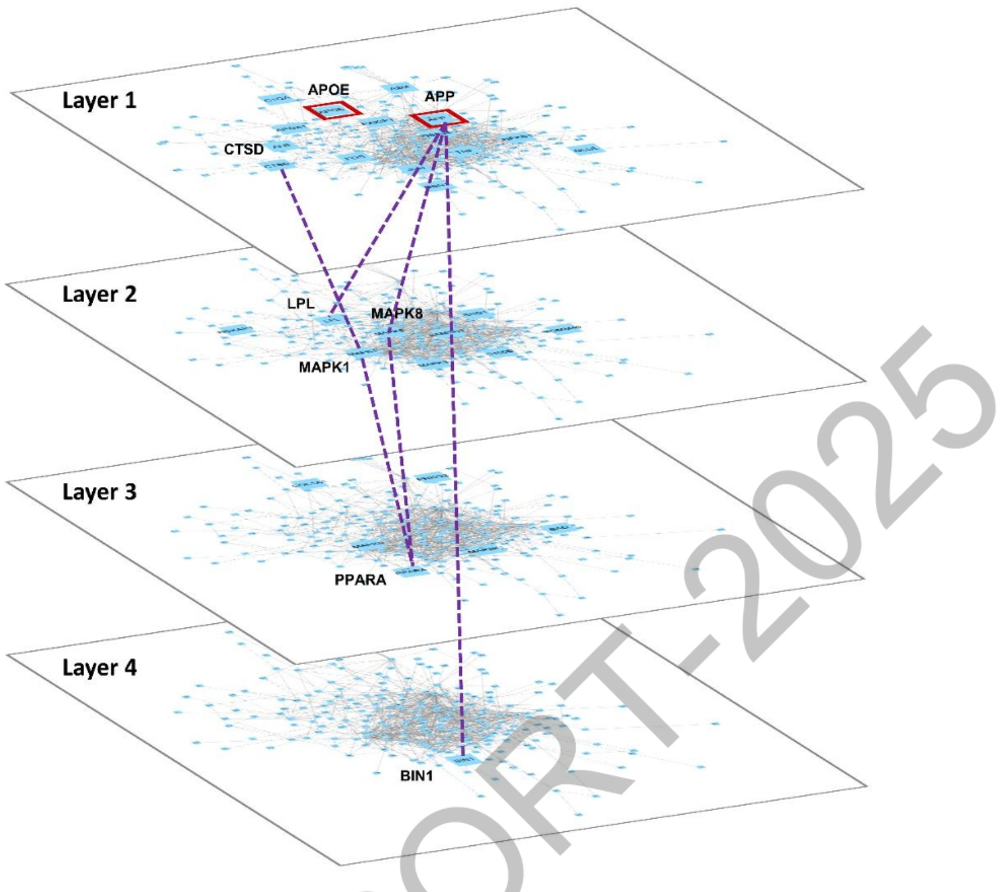

图3、阿尔茨海默病 ADG 网络关节蛋白层级及其相互作用示意图。通过 GAPR 方法对 ADG 网络的分解过程形成了4层共31个在四个步骤中被剔除的关节蛋白，在网络中表示为蓝色方块的节点，这些关节蛋白扰动疾病网络方面具有关键作用。紫色虚线代表蛋白-蛋白相互作用，具有红色标记的节点是经多项研究证明的AD关键靶标。

综上，本研究通过基于网络的GAPR方法系统预测了AD疾病网络中的关键治疗靶标 APP、MAPK 1、JUN、APOE以及BIN1等，并构建了能够为关键治疗靶标准确识别相互作用蛋白的 IDNL3 链路预测模型，为 AD 关键基因 APP 与 NRF2 预测了潜在的相互作用蛋白，并揭示了NRF2与APP 作为抗 AD靶标组合的可行性。本研究是周默冉2023年9月答辩的博士学位论文中的第二章内容，没有公开发表。

## 1.4 基于网络的复杂疾病靶标组合预测方法 TCnet

针对单靶标药物治疗复杂疾病如AD效果不佳的问题，寻找有效的靶标组合，并基于靶标组合开发药物或药物组合，是尝试解决问题的途径之一。为此，提出了一种基于多组学和网络算法的抗阿尔茨海默病靶标组合预测策略TCnet，用于发现潜在的靶标组合，加深对疾病机制的理解，同时进一步解释中药的作用机制，如图4所示，首先，从3个公共高质量数据库（DisGeNet,AlzGPS,GEO）中收集阿尔茨海默病的疾病基因和多组学数据，构建潜在疾病基因集；其次，比较了2种多组学数据融合方法，相似性网络融合和多核学习融合在疾病模块识别中的性能；第三，利用多层重启随机游走算法来识别模块中的关键基因；最后，设计了一个打分函数TCscore预测潜在的 AD靶标组合。

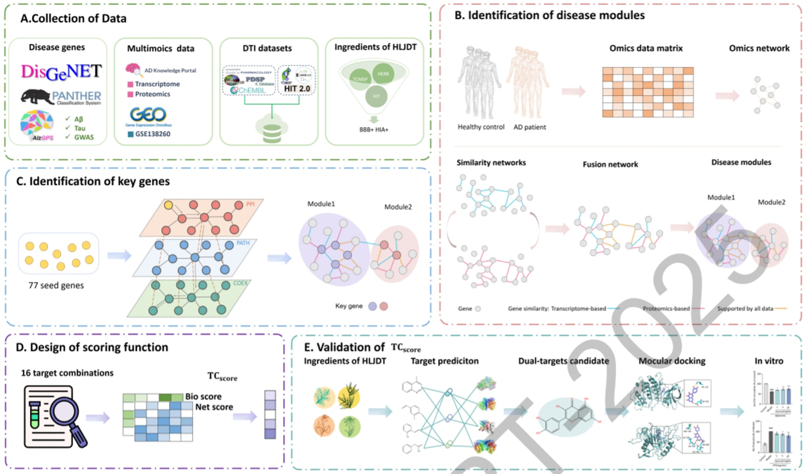

图4、基于网络的抗阿尔兹海默病靶标组合流程图。（A）数据收集；（B）识别疾病模块；（C）识别关键靶标；（D）构建打分函数；（E）打分函数的实验验证。

通过对疾病模块进行评价最终得到两个疾病相关性最强的模块 M1 和 M2，基于多层重启随机游走算法分别识别到11个和13个关键靶标，文献验证与AD相关性为87.5% (21/24)。提出的靶标组合打分函数TCscore在验证集上的召回率为75%，为靶标组合筛选提供了有力的支撑。为了进一步评价策略的合理性，我们以中药黄连解毒汤为例，对其进行了多靶标药物筛选，发现其活性成分槲皮素能够同时靶向GSK3β和ADAM17，分子对接和体外细胞实验的结果证实槲皮素能逆转Aβ损伤并抑制神经炎症，验证了多靶标策略的可行性。本研究工作于 2025年4月发表于 J. Chem. Inf. Model., 2025,65(7): 3866-3878.

## 2、基于网络的阿尔茨海默病潜在药物和药物组合预测

## 2.1 基于网络的抗 AD 药物及药物组合预测

基于网络的方法能够突破传统的“一药一靶”模式限制，用于探索“单药多靶”及“多药多靶”的可能性。本研究即采用基于网络的方法来发现抗AD药物及药物组合。

本研究首先从多种生物信息学和系统生物学数据库、疾病相关数据库与药物-靶标相互作用数据库收集了一系列具有生物实验验证的高质量蛋白-蛋白相互作用（PPI）数据、AD疾病相关基因数据以及药物-靶标相互作用（DTI）数据。通过对数据集进行整合与处理，我们构建了涵盖243.603个PPI相互作用以及16.677个独特蛋白的人类蛋白相互作用PPI网络，包含了1,265个FDA批准的上市药物与1,577个不同的人源靶标的

6,961条DTI数据的DTI网络，包含324个AD相关基因的ADG网络。其次，通过基于网络分离度的预测方法，我们为799,480个上市药物的药物组合计算了药物-药物靶标模块之间的拓扑距离关系，并通过基于网络邻近度的方法以及药物靶标模块与AD疾病模块之间的拓扑距离关系，以此量化药物组合中药物与药物、药物与AD之间的潜在关联性。基于网络的邻近度预测结果显示，单个药物如赖脯胰岛素、美沙拉嗪等已经显示出对于AD的治疗潜力。

然后，我们通过从六种不同的药物-疾病网络模块叠合方式中筛选具有互补构象的药物组合，获得了3,828个药物组合，并分析了这些药物的组合类型。此外，根据对药物组合进行打分排序，本研究为阿尔茨海默病提供了 15 种具有潜在治疗效果的抗 AD药物组合，包括加兰他敏与赖脯胰岛素、卡巴拉汀与卡托普利、以及多奈哌齐与托麦汀等，并对这些药物组合的潜在抗AD机制进行了讨论分析。最后，通过AD细胞损伤模型的构建与药物实验验证，我们确定了5种具有抗AD作用的老药，即赖脯胰岛素、谷胱甘肽、巴柳氮、萘丁美酮以及托麦汀（图5)。药物组合的实验验证有望在本实验室后续工作中推进。 2

A

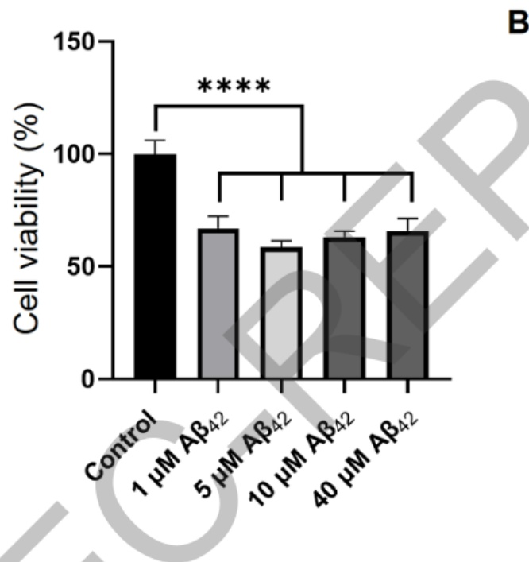

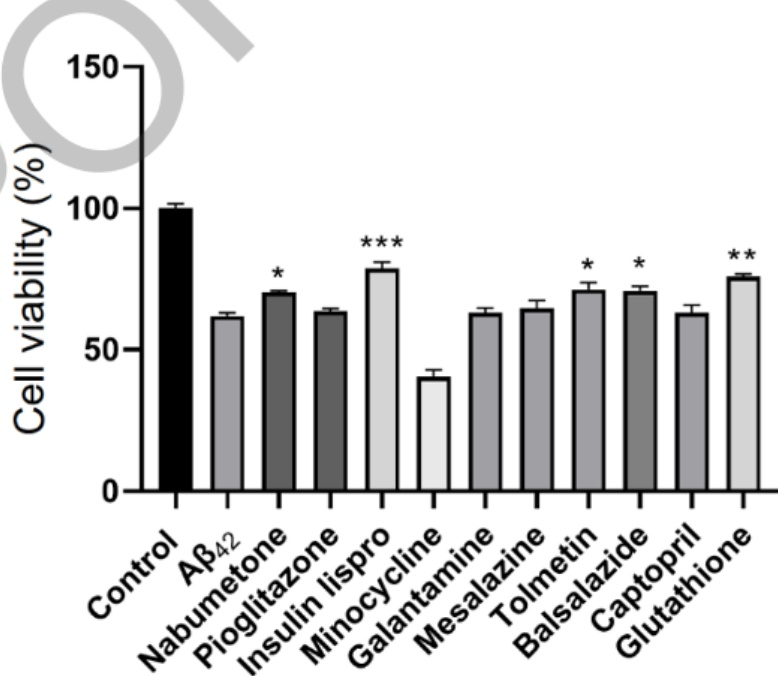

图5、Aβ42损伤细胞模型构建结果（A）及预测排名前10药物对Aβ42损伤细胞模型的保护作用实验结果（B）。所有实验均重复三次。在统计检验过程中， $^ { * } \mathrm { p }   \leq   0 . 0 5$ $^ { * * } \mathrm { p }   \leq   0 . 0 1$ $\mathrm{e}^{\mathrm{w} * *} \mathrm{p} < 0.001$ 以及$\mathrm{***p} < 0.0001$ o

综上所述，本研究为抗AD多靶标药物研发提供了一种全面的基于网络的预测新策略，通过该方法得到了具有抗AD效果的一系列老药以及多个老药组合，这些药物及药物组合可作为预防或推迟阿尔茨海默病发病进程的有力治疗方案。本研究是周默冉2023年9月答辩的博士学位论文中的第五章内容，没有公开发表。

## 2.2 基于知识图谱的抗阿尔茨海默病药物组合研究

阿尔茨海默病（AD）发病机制复杂多样，导致针对特定生物靶标开发具有选择性和有效性的单一药物的策略频频受阻。为了克服单药治疗的局限性，联合治疗被认为是一种很有前途的疗法，可以实现更多的复杂疾病治疗。

本研究中，我们通过在知识图谱中加入细胞系扰动数据，从而实现疾病特异性药物组合预测，并对具有潜力的抗AD药物组合进行了实验验证（图6）。我们从L1000FWD数据库以及DRIAD工作中收集药物对于神经细胞系（NEU，ReNcellVM细胞系）的基因上下调扰动数据，并将其加入MSI知识图谱当中，构建了针对神经退行性疾病的特异性扰动知识图谱。之后我们从DCDB2.0、CDCDB以及DDInter数据库收集到药物组合的阳性阴性样本数据，并将神经退行性疾病相关的药物组合划分为一个单独的外部验证集。模型AUC在重复十次阴性样本选取中达到了0.9295优于基线模型(原始知识图谱）的 0.9224；且在外部验证集上的 Recall 相比基线模型从 0.5382 提升到 0.5926；这进一步说明了我们策略的合理性:通过在知识图谱中引入特定细胞系扰动数据，对非特异性疾病药物组合的预测影响不大，但是对于感兴趣的特异性疾病会有较大的预测准确性上的提升。

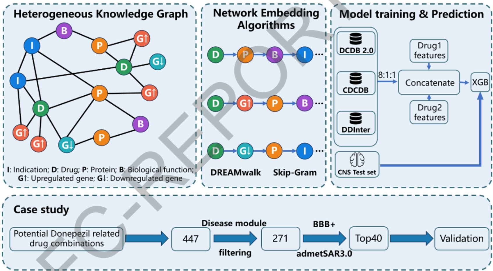

图6、计算工程流程图。

后续我们也针对AD上市药物多奈哌齐进行了药物组合的预测，其中排名前40的药物组合中19个单药有AD相关的文献验证；而AD相关药物组合文献验证的有3组。我们对排名靠前的牛磺酸-多奈哌齐药物组合进行了实验验证，使用LPS诱导BV2构建神经炎症模型，设立空白对照组、模型组、牛磺酸单药组 $(0.1\mu M、 1\mu M、 10\mu M)$ 、多奈派齐单药组 $(0.1\mu M、 1\mu M)$ 、牛磺酸+多奈派齐联合给药组。采用ELISA法检测细胞上清液中的促炎因子 $(  IL-1 \beta ,  TNF-a ,  IL-6  )$ 和干扰素 $( \mathrm{INN} - \beta )$ 。细胞水平实验结果展示（图7），牛磺酸与多奈哌齐的组合可以较好地降低炎症因子（IL-6、TNF-α、IL-1β）和IFN-β水平，并且具有明显的协同效应，我们进一步证实联合给药组 $( 1 0 \mu \mathrm { M }$ 牛磺酸 $+ 1 \mu \mathrm { M }$ 多奈哌齐）比单药组更好地抑制IRF-3的入核，从而发挥抑制炎症作用。目前正在进行动物体内实验验证中，本研究工作尚未发表。

IL-6

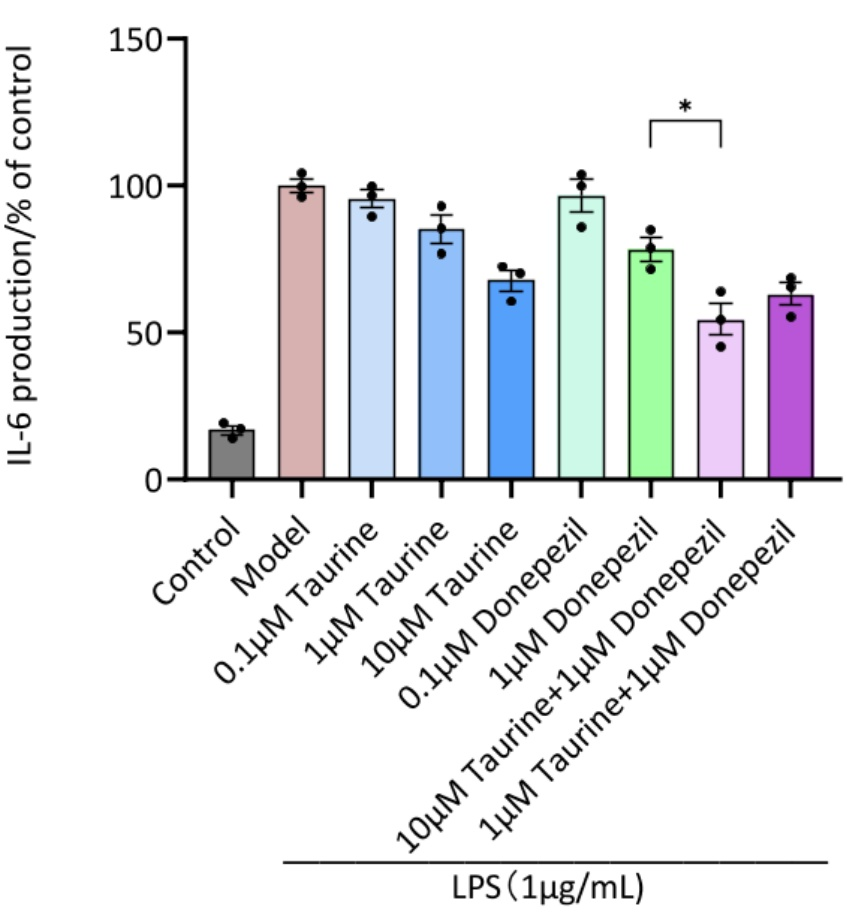

A

TNF-α

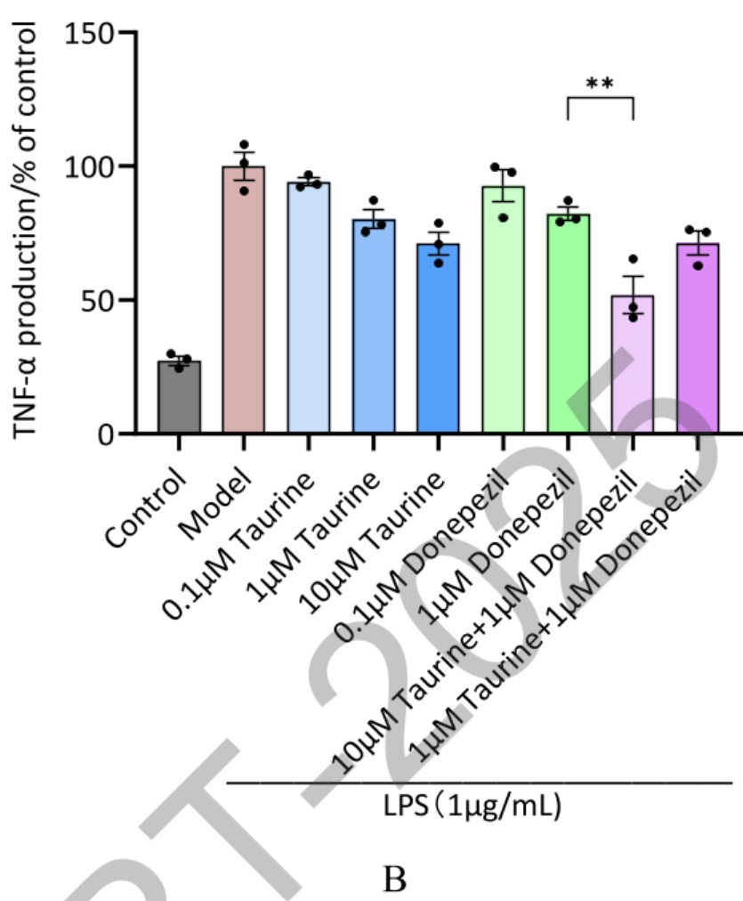

IL-1β

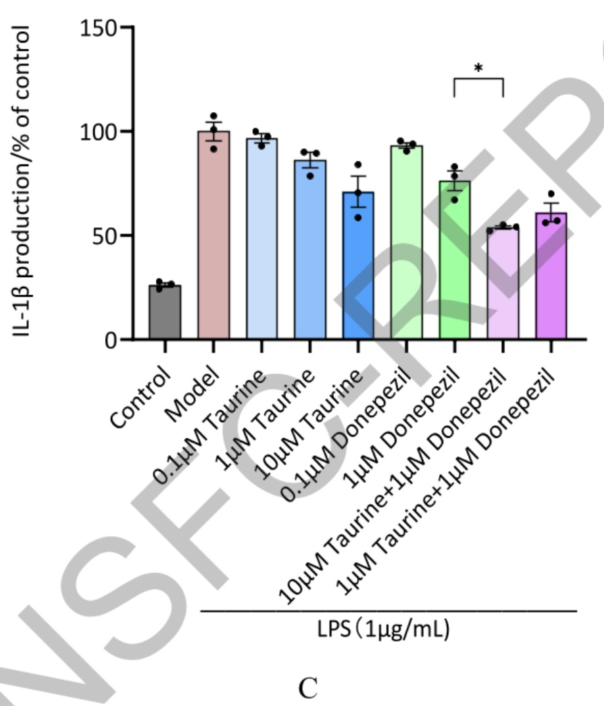

IFN-β

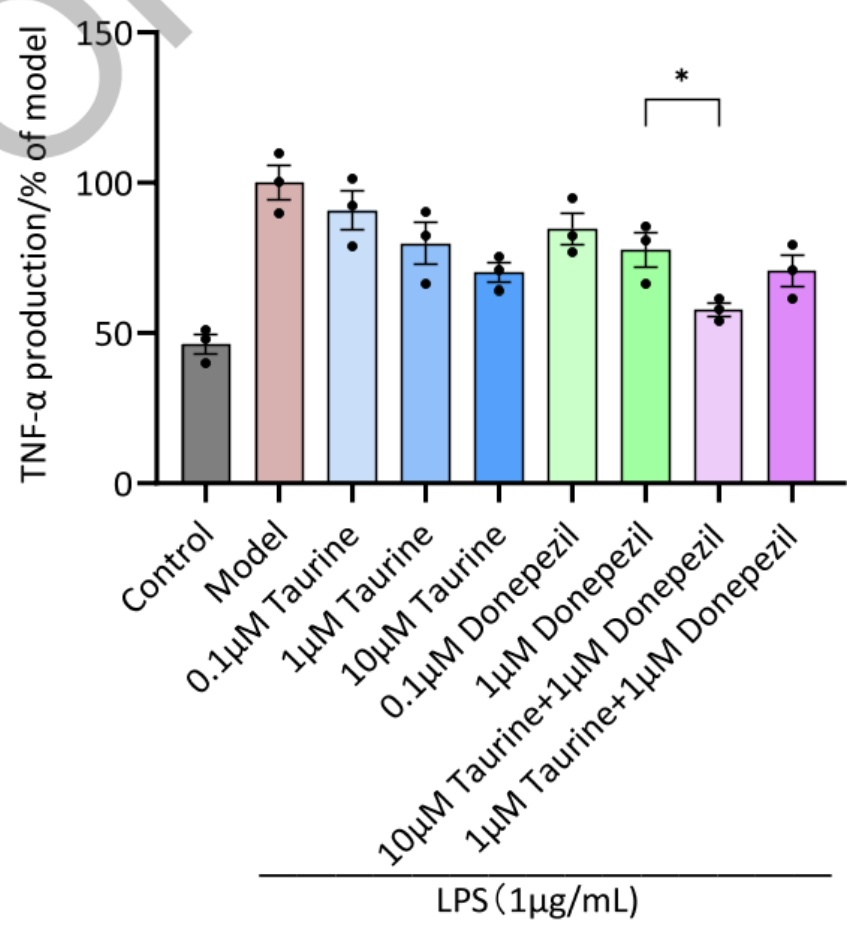

D

图7、不同剂量的牛磺酸（Taurine）、多奈哌齐（Donepezil）及其组合在免疫炎症抑制中的作用:（A)IL-6;（B)TNF-α;（C) IL-1β；（D)IFN-β。

## 3、基于网络和基于深度学习的药物-靶标相互作用预测

## 3.1 知识图谱增强的药物靶标预测模型的构建并应用于抗 AD 药物筛选

近年来，知识图谱（Knowledge Graph，KG）因其能够整合异构生物数据、捕捉生物分子之间的复杂关系，在药物研发领域展现出巨大潜力。本研究中，为针对AD靶标进行高效虚拟筛选，开发了一个知识图谱增强的药物-靶标相互作用（DTI）预测模型。该模型构建的基本流程为（图8):首先，对已知的DTI数据进行清洗，构建高质量的数据集。其次，采用Node2Vec算法从知识图谱中提取蛋白的拓扑结构信息，并结合ProteinBERT生成蛋白序列表征，以此构建更全面的蛋白特征。同时比较了5种分子指纹及1种基于预训练的Uni-Mol分子表征来刻画药物特征。接着，利用3种机器学习模型和 1 种深度学习模型进行 DTI 预测，通过 Accuracy、Precision、Recall、AUC 和 AUPR指标选择最优预测模型。将最优模型与现有模型进行比较以此评价模型的性能。通过消融实验比较知识图谱信息与蛋白序列信息对DTI预测任务的影响。最后，以阿尔兹海默病为案例研究，对13个AD关键靶标进行虚拟筛选，挖掘潜在活性分子。

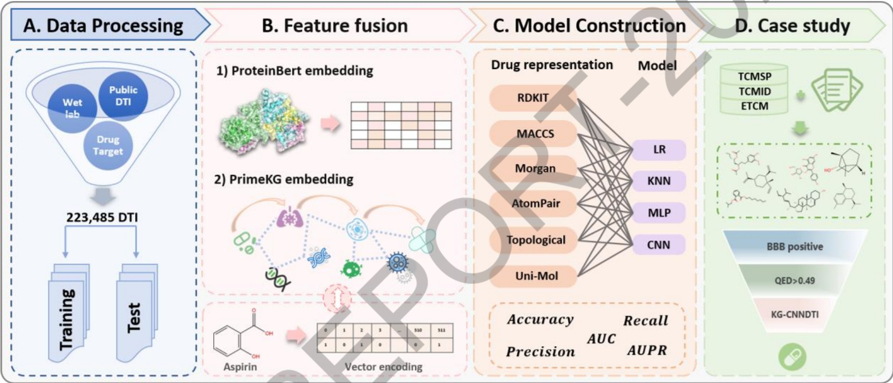

图8、建模工作流程图:（A）数据处理；（B）特征融合；（C）模型构建；（D）案例分析。

在223,485条高质量数据集上，以蛋白质预训练模型的向量特征和知识图谱嵌入特征表征蛋白，结合6种分子表征和4种人工智能算法构建了24个预测模型。以AUC值作为评价指标，最优模型 KG-CNNDTI的 AUC 值达到 0.972。将最优模型用于 13 个 AD靶标与3131个中药成分的虚拟筛选，得到40个潜在中药成分，其中5个化合物经文献验证与AD相关。我们进一步对其中3个化合物进行了体外细胞实验验证，获得证实；另有9个化合物于2025年8月寄送到合作的斯洛伐克科学院进行测试，发现其中1个化合物既能抑制Aβ聚集，又能溶解已聚集的Aβ斑块。

本研究最后与斯洛伐克科学院的合作研究尚未发表，前面的研究已于2025年11月发表在 Chinese Journal of Natural Medicines, 2025, 23(11): 1283-1292.

## 3.2 基于深度学习的虚拟筛选方法用于NMDA新型抑制剂筛选

本研究中，我们提出了一个新的DTI预测模型Pocket-CPI，通过整合蛋白质3D结构信息及其潜在结合位点信息，可以同时学习蛋白质的全局特征和局部特征，并在两个基准数据集上表现出最好的预测性能。然后我们将Pocket-CPI用于NMDA新型抑制剂筛选研究。

N-甲基-D-天冬氨酸（N-methyl-D-aspartate，NMDA）受体是人体内一种重要的离子通道，与多种神经系统疾病比如AD的发生发展密切相关，因而是AD的潜在靶标。NMDA受体存在多种亚型，而功能性的NMDA受体是由不同类型亚基组成的异四聚体。目前，对N1/N2亚型的研究较多，而对N1/N3亚型的研究较少。因此开发靶向N1/N3亚型的特异性调节剂具有重要意义。虽然N1/N3的晶体结构已经有文献报道 $\nrightarrow$ 但由于我们选择的结合位点位于膜附近，晶体结构中这段也是缺失的。因此我们参考其他文献，通过同源模建方法来获得N1/N3亚型结构。为了验证该结构可靠性，我们将已知的两个抑制剂EU1180-438、WZB117，与我们同源模建得到的蛋白结构进行了自对接。自对接结果中的结合位点与前人文献中推测的结合位点基本一致，说明我们构建的蛋白质结构是比较可靠的。

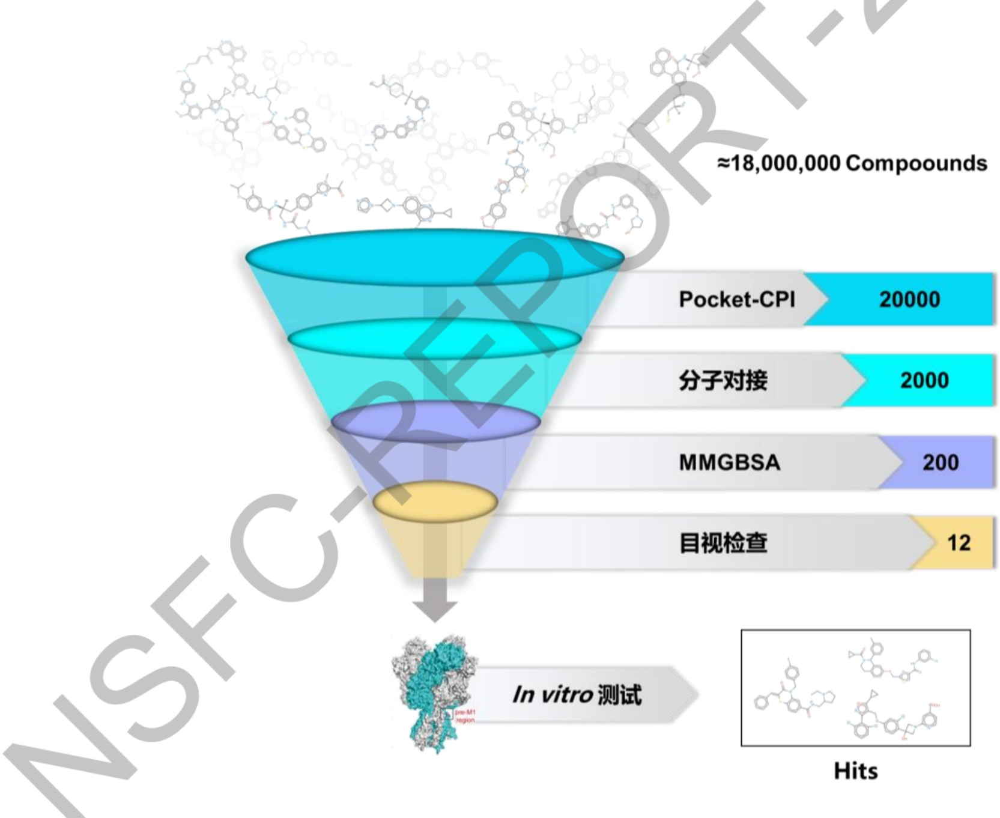

图9、深度学习与物理知识相结合的分层虚拟筛选策略。

接下来，我们提出了一种基于深度学习与物理知识相结合的组合筛选策略（图9）。首先使用我们前面发展的Pocket-CPI模型对包含约1800万分子的数据库进行筛选，选取前2万个分子；接着使用分子对接和MM-GBSA结合自由能计算来进一步过滤，最后结合人工目视检查，最终挑选了12个候选化合物进行活性测试。整个筛选过程在2天内完成。生物实验测试（FDSS荧光实验）结果表明，其中3个化合物的 $\mathrm { I C } _ { 5 0 }$ 值在 $1 0 0 \mu \mathrm { M }$以内（表1），活性最好分子libA1854的 $\mathrm { I C } _ { 5 0 }$ 值达到 $2 . 4 5 \mu \mathrm { M }$ 。经膜片钳实验进一步测试，发现其在低浓度下对N1/N3亚型表现出一定的抑制率 $( 1 0 \mu \mathrm { M }$ 下抑制率为46.17%)。

表1、NMDA新型抑制剂生物活性测试结果

<table><tr><td>编号</td><td>化合物ID</td><td>结构式</td><td>FDSS 荧光实验  $( \mathbf { I C _ { 5 0 } } )$ </td></tr><tr><td>1</td><td>libA1854</td><td>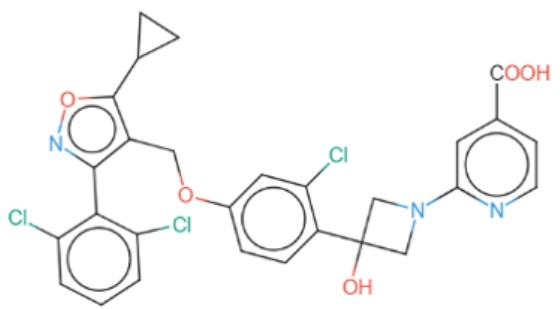</td><td>2.45 μM</td></tr><tr><td>2</td><td>libB01433</td><td>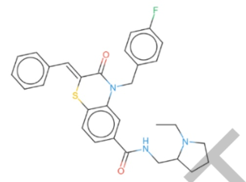</td><td>64.25 μM</td></tr><tr><td>3</td><td>libB13257</td><td>V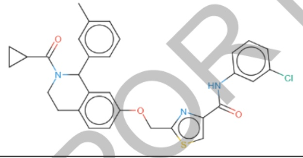</td><td>85.03 μM</td></tr></table>

本研究工作暂未公开发表，参见于鑫鑫2025年6月答辩的博士学位论文中的第二章和第三章内容。

## 3. 研究人员的合作与分工。

本项目主要在项目负责人的指导下，由博士生和硕士生共同完成。先后共有5位博士生和5位硕士生参与项目研究。具体说来，本实验室博士生主要进行方法发展研究，而硕士生则主要是进行数据收集和模型构建研究；合作实验室王蕊教授课题组研究生承担生物测试研究，马磊教授课题组研究生承担部分化合物合成任务。同学们相互之间保持紧密合作关系。

随着项目的推进，研究生因毕业而退出、也因入学而新增，但团队人数维持着动态平衡。王吉烨于2022年6月博士毕业，周默冉于2023年9月博士毕业，秦丽于2022年6月硕士毕业，许田力于2023年6月硕士毕业，岳成圆于2025年6月硕士毕业。

新增人员中，王泽为2021年9月入学的硕博连读生，于洪波为2023年9月入学的硕博连读生，陈柏钰为2023年9月入学的硕士生，邵卢艺为2022年9月入学的本博八年制拔尖学生，这些同学都参与了项目研究，并且还在继续研究中。

## 4. 国内外学术合作交流等情况。

本项目在研期间，项目负责人积极参与国内外学术交流，多次应邀在国内外学术会议上介绍本课题相关研究工作，其中国内学术报告6次，国际学术报告1次。

## 5. 存在的问题、建议及其他需要说明的情况。

无。

## （二）成果部分

## 1. 项目取得成果的总体情况。

项目在研期间，总计发表标注项目资助编号（82173746）的SCI收录论文12篇（其中第一标注4篇）；申请中国发明专利1项（已公开）；获得计算机软件著作权2项；获得科技奖励1项；培养毕业博士2名、毕业硕士3名。发现AD潜在靶标3个（NRF2、NR3C1、SHBG)，靶标组合 2 对（GSK3β 和 ADAM17、NRF2 和 APP)，抗 AD 有效老药10个（倍氯米松、甲泼尼龙、考尼伐坦、槲皮素、咖啡酸、赖脯胰岛素、谷胱甘肽、巴柳氮、萘丁美酮、托麦汀）及6个活性化合物，抗AD有效药物组合16对（其中1对获得实验确证，即牛磺酸-多奈哌齐组合）。

## 2. 项目成果转化及应用情况。

项目成果中，尚未有实现转化的情况。

发表的12篇SCI收录论文，截至2026年2月2日已被引用224次。其中2024年7月发表在 Nucleic Acids Research 的文章已被引用 92 次，为 ESI 高被引论文。

## 3. 人才培养情况。

本研究课题前后共有4位博士生、5位硕士生参加，已先后毕业博士2名（王吉烨、周默冉）、硕士3名（秦丽、许田力、岳成圆），目前在读博士生2位（王泽、于洪波），在读硕士生2位（陈柏钰、邵卢艺）。

## 4. 其他需要说明的成果。

项目负责人因“基于网络的虚拟筛选方法:概念验证”成果获得2022年药明康德生命化学研究奖-学者奖。

## 5. 项目成果科普性介绍或展示网站。

暂无。

## 研究成果目录

项目负责人通过系统，从文献库中检索研究成果或者按要求格式自行填入。请按照期刊论文、会议论文、学术专著、专利、会议报告、标准、软件著作权、科研奖励、人才培养、成果转化的顺序列出，其它重要研究成果如标本库、科研仪器设备、共享数据库、获得领导人批示的重要报告或建议等，应重点说明研究成果的主要内容、学术贡献及应用前景等。

项目负责人不得将非本人或非参与者所取得的研究成果、与受资助项目无关的研究成果、未标注国家自然科学基金资助和项目批准号的论文以及取得时间早于项目资助期开始时间的研究成果列入报告中。发表的研究成果（包括专利），项目负责人和参与者均应如实注明得到国家自然科学基金项目资助和项目批准号，科学基金作为主要资助渠道或者发挥主要资助作用的，应当将自然科学基金作为第一顺序进行标注。

## 期刊论文

(1) Yue, Chengyuan; Chen, Baiyu; Chen, Long; Xiong, Le; Gong, Changda; Wang, Ze; Liu, Guixia; Li, Weihua; Wang, Rui; Tang, Yun; KG-CNNDTI: A knowledge graph-enhanced prediction model for drug-target interactions and demonstrated in drug screening for anti-Alzheimer' s disease, Chinese Journal of Natural Medicines, 2025, 23(11):1283-1292. SCIE. 第一标注

(2) Yue, Chengyuan; Chen, Baiyu; Pan, Fei; Wang, Ze; Yu, Hongbo; Liu, Guixia; Li, Weihua; Wang, Rui; Tang, Yun; TCnet: A Novel Strategy to Predict Target Combination of Alzheimer's Disease via Network-Based Methods, Jou rnal of Chemical Information and Modeling, 2025, 65(7): 3866-3878. SCIE. 第一标注

(3) Moran Zhou; Qian Jiao; Zengrui Wu; Weihua Li; Guixia Liu; Rui Wang; Yun Tang; Uncovering the Oxidative Stress Mechanisms and Targets in Alzheimer's Disease by Integrating Phenotypic Screening Data and Polypharmacology Networks, Journal of Alzheimer's Disease, 2024, 99(s1): S139-S156. SCIE. 第一标注

(4) Moran Zhou; Jiamin Sun; Zhuohang Yu; Zengrui Wu; Weihua Li; Guixia Liu; Lei Ma; Rui Wang; Yun Tang; Investigation of Anti-Alzheimer's Mechanisms of Sarsasapogenin Derivatives by Network-Based Combining Structure-Based Methods, Journal of Chemical Information and Modeling, 2023, 63(9): 2881-2894. SCIE. 第一标注(5) Zhuohang Yu; Zengrui Wu; Ze Wang; Yimeng Wang; Moran Zhou; Weihua Li; Guixia Liu; Yun Tang; Network-Based Methods and Their Applications in Drug Discovery, Journal of Chemical Information and Modeling, 2024， 64(1):57-75. SCIE. 第二标注

(6) Yu, Xinxin; Wang, Yimeng; Chen, Long; Li, Weihua; Tang, Yun; Liu, Guixia; ACtriplet: an improved deep learning model for activity cliffs prediction by integrating triplet loss and pre-training, Journal of Pharmaceutical Analysis, 2025, 15(8): 101317. SCIE. 第三标注

(7) Yaxin Gu; Zhuohang Yu; Yimeng Wang; Long Chen; Chaofeng Lou; Chen Yang; Weihua Li; Guixia Liu; Yun Tang; admetSAR3.0: a comprehensive platform for exploration, prediction and optimization of chemical ADMET properties, Nucleic Acids Research, 2024,52(W1):W432-W438. SCIE.第三标注

(8) Fei Pan; Cheng-nuo Wang; Zhuo-hang Yu; Zeng-rui Wu; Ze Wang; Shang Lou; Wei-hua Li; Gui-xia Liu; Ting Li; Yu-zheng Zhao; Yun Tang; NADPHnet: a novel strategy to predict compounds for regulation of NADPH metabolism via network-based methods, Acta Pharmacologica Sinica, 2024, 45(10): 2199-2211. SCIE. 第三标注

(9) Li Qin; Jiye Wang; Zengrui Wu; Weihua Li; Guixia Liu; Yun Tang; Drug Repurposing for Newly Emerged Diseases via Network - based Inference on a Gene - disease - drug Network, Molecular Informatics, 2022, 41(9):2200001. SCIE. 第三标注

(10) Jiye Wang; Chaofeng Lou; Guixia Liu; Li Wen; Zengrui Wu; Yun Tang; Profiling prediction of nuclear receptor modulators with multi-task deep learning methods: toward the virtual screening, Briefings in Bioinformatics， 2022， 23(5):bbac351. SCIE. 第三标注

(11) Yayuan Peng; Jiye Wang; Zengrui Wu; Lulu Zheng; Biting Wang; Guixia Liu; Weihua Li; Yun Tang; MPSM-DTI: prediction of drug-target interaction via machine learning based on the chemical structure and protein sequence, Digital Discovery, 2022, 1(2): 115-126. SCIE. 第三标注

(12) Wu, Zengrui; Ma, Hui; Liu, Zehui; Zheng, Lulu; Yu, Zhuohang; Cao, Shuying; Fang, Wenqing; Wu, Lili; Li, Weihua; Liu, Guixia; Huang, Jin; Tang, Yun; wSDTNBI: a novel network-based inference method for virtual screening, Chemical Science, 2022, 13(4): 1060-1079. SCIE. 第六标注

## 专利

(1)唐赟；潘斐；黄瑾；刘桂霞；李卫华；一种基于网络的鉴定复杂疾病中潜在靶点的方法和系统，2025-07-22，中国，2025110092012.

## 会议报告

(1） 唐赟；基于网络的药物设计方法和应用，深圳理工大学第四届生物与医药前沿研讨会，深圳，2025-11-16至2025-11-18.

(2) 唐赟；人工智能药物设计方法发展与应用探索，AI制药走进华为暨小分子创新药院士及专家论坛，深圳，2024-11-03至2024-11-03.

(3) 唐赟; Network-based methods applied in drug discovery for complex diseases, Asia Hub for e-Drug Discovery Symposium 2025 (AHeDD2025)，杭州， 2025-09-23至2025-09-25.

(4) 唐赟；网络药理学方法发展和应用探索，2025湘雅药学学术大会，湖南长沙，2025-03-28至2025-03-30.

(5) 唐赟；基于复杂网络和多组学数据的疾病靶标预测，2023中国药物化学学术会议暨中欧药物化学研讨会，重庆，2023-10-08至2023-10-10.

(6) 唐赟；基于网络的靶标识别和药物设计，第十一届国际分子模拟与人工智能应用学术会议，成都，2023-05-06至2023-05-08.

(7) 唐赟；基于网络推理方法及其在药物发现中的应用，第11届全国生物信息学与系统生物学学术大会，广州，2023-02-25至2023-02-27.

## 软件著作权

(1) 唐赟；顾雅馨；俞卓杭；汪祎梦；化合物ADMET性质综合平台admetSAR [简称:admetSAR 3.0] 3.0，2024SR1462837，原始取得，全部权利，2024-02-01. 1

(2) 唐赟；丁萌；李宇林；基于深度学习的药物分子生成软件[简称:GenerateMo1]1.0，2023SR0381519，原始取得全部权利，2022-10-17.

## 科研奖励

(1) 唐赟(1/1)；基于网络的虚拟筛选方法:概念验证，药明康德生命化学研究奖管理委员会，其他，其他，2022（唐赟）

## 人才培养

1. 出站博士后/毕业博士/毕业硕士/在站博士后/在读博士/在读硕士

(1) 王吉烨；毕业博士，基于复杂网络的药物设计方法发展与应用研究，唐赟，2022-01-01至2022-06-30.

(2) 周默冉；毕业博士，基于网络药理学的阿尔茨海默病致病机制与治疗药物预测研究，唐赟，2022-01-01至2023-09-30.

(3) 秦丽；毕业硕士，基于深度生成模型的雌激素受体α亚型配体设计和基于基因-疾病-药物网络的药物重定位研究，唐赟，2022-01-01至2022-06-30.

基于蛋白质语言模型嵌入特征和深度学习的药物-靶标相互作用预测模型的构建和含氟新结构化合物靶标预测研究，唐赟，2022-01-01至2023-06-30.

(5) 岳成圆；毕业硕士，基于网络的抗阿尔兹海默病靶标预测与药物筛选研究，唐赟，2022-09-01至2025-06-30.

(6) 王泽；在读博士，2022-01-01至2025-12-31.

(7)于洪波；在读博士，2023-09-01至2025-12-31.

(8) 陈柏钰；在读硕士，2023-09-01至2025-12-31.

(9) 邵卢艺；在读硕士，人才培养/学生培养/在读硕士/邵卢艺，2025-01-01至2025-12-31

## 项目成果应用前景

本项目成果拟应用领域:1、生物医药2、人口与健康

预计在5-10年推广使用

附表:研究成果统计数据表（本表针对各种类型资助项目收集数据以便进行整体资助效果分析使用，并非要求每类项目都具有以下各类成果。

<table><tr><td rowspan=4>获奖（项）</td><td colspan=16>国家级</td><td colspan=11>部级1</td><td rowspan=3 colspan=2>其他</td></tr><tr><td colspan=4>自然科学奖</td><td colspan=5>科技进步奖</td><td></td><td colspan=6>发明奖</td><td colspan=7>自然科学奖</td><td colspan=4>科技进步奖</td></tr><tr><td colspan=2>一等</td><td colspan=2>二等</td><td colspan=2>一等</td><td colspan=3>二等</td><td></td><td colspan=3>一等</td><td colspan=3>二等</td><td colspan=3>等</td><td colspan=4>等</td><td colspan=2>一等</td><td colspan=2>二等</td></tr><tr><td colspan=2>0</td><td colspan=2>0</td><td colspan=2>0</td><td colspan=3>0</td><td></td><td colspan=3>0</td><td colspan=3>0</td><td colspan=3>0</td><td colspan=4>0</td><td colspan=2>0</td><td colspan=2>0</td><td colspan=2>1</td></tr><tr><td rowspan=4>学术报告/论文/专著/其他（篇）</td><td colspan=3>特邀学术报告</td><td colspan=15>学术论文</td><td rowspan=2 colspan=4>学术专著</td><td rowspan=2 colspan=7>其他</td></tr><tr><td rowspan=2>国际学术会议</td><td rowspan=2 colspan=2>国内学术会议</td><td colspan=4>发表论文数</td><td colspan=11>论文检索收录情况</td></tr><tr><td colspan=2>期论义</td><td colspan=2>会议</td><td colspan=2>SCIE/SSCI</td><td colspan=3>EI</td><td colspan=3>北大中文核心期刊</td><td colspan=3>CSSCI</td><td colspan=2>中文</td><td colspan=2>外文</td><td colspan=2>标本库</td><td colspan=2>数据库</td><td colspan=2>科研仪器设备</td><td>重要报告</td></tr><tr><td>0</td><td colspan=2>2</td><td colspan=2>12</td><td colspan=2>0</td><td colspan=2>12</td><td colspan=3>0</td><td colspan=3>0</td><td colspan=3>0</td><td colspan=2>0</td><td colspan=2>0</td><td colspan=2>0</td><td colspan=2>0</td><td colspan=2>0</td><td>0</td></tr><tr><td rowspan=4>专利/标准/软著/成果转化</td><td></td><td colspan=6>专利（项）</td><td colspan=2></td><td colspan=11>标准</td><td rowspan=3 colspan=2>软件著作权</td><td rowspan=2 colspan=7>成果转化</td></tr><tr><td colspan=3>国内</td><td colspan=4>国外</td><td rowspan=2 colspan=2>国际</td><td colspan=11>国内</td></tr><tr><td>申请</td><td colspan=2>授权</td><td colspan=2>申请</td><td colspan=2>授权</td><td colspan=3>国家</td><td colspan=3>行业</td><td colspan=3>地方</td><td colspan=2>企业</td><td colspan=2>技术转让技</td><td colspan=2>术许可作</td><td colspan=2>价投资</td><td>经济效益(万元)</td></tr><tr><td>1</td><td colspan=2>0</td><td colspan=2>0</td><td colspan=2>0</td><td colspan=2>C</td><td colspan=3>0</td><td colspan=3>0</td><td colspan=3>0</td><td colspan=2>0</td><td colspan=2>2</td><td colspan=2>0</td><td colspan=2>0</td><td colspan=2>0</td><td>0</td></tr><tr><td rowspan=4>人才培养及学术交流</td><td colspan=17>人才培养（人）</td><td colspan=12>举办和参加学术会议</td></tr><tr><td colspan=8>中青年学术带头人</td><td rowspan=2 colspan=3>出站博士后</td><td rowspan=2 colspan=3>毕业博士</td><td rowspan=2 colspan=3>毕业硕士</td><td colspan=4>举办国际学术会议</td><td colspan=5>举办国内学术会议</td><td colspan=3>参加国际学术会议</td></tr><tr><td>优青</td><td colspan=2>杰青</td><td colspan=2>创新群体</td><td colspan=2>其他</td><td></td><td colspan=2>次数</td><td colspan=2>人数</td><td colspan=3>次数</td><td colspan=2>人数</td><td colspan=2>次数</td><td>人数</td></tr><tr><td>0</td><td colspan=2>0</td><td colspan=2>0</td><td colspan=2>0</td><td></td><td colspan=3>0</td><td colspan=3>2</td><td colspan=3>3</td><td colspan=2>0</td><td colspan=2>0</td><td colspan=3>0</td><td colspan=2>0</td><td colspan=2>0</td><td>0</td></tr></table>

国家自然科学基金项目资金决算表

项目批准号:82173746

项目负责人:唐赟

金额单位:万元

<table><tr><td rowspan="3">行次</td><td rowspan="3">科目名称</td><td colspan="3">预算数</td><td rowspan="2">累计支出数</td><td rowspan="2">结余数</td><td rowspan="2">结余资金比例</td></tr><tr><td>批准预算</td><td>预算调整</td><td>调整后预算</td></tr><tr><td>(1)</td><td>(2)</td><td>(3) = (1) + (2)</td><td>(4)</td><td>(5) =(3)-(4)</td><td>(6)</td></tr><tr><td>(1)</td><td>项目总经费</td><td>69.1000</td><td>0.0000</td><td>69.1000</td><td></td><td></td><td>25.49%</td></tr><tr><td>(2)</td><td>项目直接费用</td><td>55.0000</td><td>0.0000</td><td>55.0000</td><td>37.3831</td><td>17.6169</td><td></td></tr><tr><td>(3)</td><td>1、设备费</td><td>8.0000</td><td>0.0000</td><td>8.0000</td><td>0.0000</td><td>8.0000</td><td></td></tr><tr><td>(4)</td><td>其中:设备购置费</td><td>8.0000</td><td>0.0000</td><td>8.0000</td><td>0.0000</td><td>8.0000</td><td></td></tr><tr><td>(5)</td><td>2、业务费</td><td>30.0000</td><td>-0.0900</td><td>29.9100</td><td>20.2931</td><td>9.6169</td><td></td></tr><tr><td>(6)</td><td>3、劳务费</td><td>17.0000</td><td>0.0900</td><td>17.0900</td><td>17.0900</td><td>0.0000</td><td></td></tr><tr><td>(7)</td><td>项目间接费用</td><td>14.1000</td><td>0.0000</td><td>14.1000</td><td></td><td></td><td></td></tr></table>

注:1.本表中（1）、（3）、（5）、（6）栏为系统自动生成，无需填写；本表中（2）栏填列预算调整数；本表中（4）栏填列项目的实际支出数。

2.第（1）行=第（2）+（7）行

第（2）行=第（3）+（5）+（6）行；

第（3）栏=第（1）+（2）栏；

第（5）栏=第（3）-（4）栏；

第（1）行第（6）栏=第（2）行第（5）栏/第（1）行第（3）栏100%；

第（1）行第（1）栏=第（1）行第（3）栏；

第（1）行第（2）栏=0；

第（4）栏≤第（3）栏；

第（2）行第（5）栏≥0。

## 决算说明书

（请按照《国家自然科学基金预算制项目决算表编制说明》等有关要求，说明各科目支出、预算调整、结余情况，合作研究转拨资金情况，单价≥50万元的设备情况，资金使用和管理过程中遇到的问题及建议，以及其他需要说明的事项等。)

本项目批准直接经费为55万元，按照预算进行经费使用，业务费和劳务费略有调整。

截止2025年12月31日，直接费用累计支出37.3831万元，结余17.6169万元。项目总经费结余资金比例为25.49%。本项目没有合作研究外拨资金情况，也不涉及单价50万元以上的设备购置情况。

本项目具体各项使用说明如下:

1. 设备费:预算8万元。实际支出暂为0，主要是最近更新的部分计算机设备，尚未收到报销发票，后续会按照预算完成使用。

2. 业务费:预算30万元，根据实际情况略有调整， 调整后预算为29.91万元。实际支出20.2931万元，其中材料费8.1386万元，用于购买化合物样品、 实验试剂等材料；测试化验加工费3.6550万元，用于支付化合物样品测试等费用；会议/差旅/国际合作与交流费2.7705万元，用于参加国内学术会议注册费、差旅费及市内交通费等； 出版/文献/信息传播/知识产权事务费2.0502万元，用于论文发表及知识产权申请。另有一笔科研实验设备维修费3.6788万元。

3. 劳务费:预算17万元，根据实际情况略有调整，调整后预算为17.09万元。实际支出17.09万元，用于参与项目的研究生助研津贴。

本项目经费使用较方便，没有其他需要说明的事项。

结余资金情况说明

注:结余资金比例超过30%的项目该部分必填。

<table><tr><td colspan="7">项目负责人承诺:我所承担的项目（编号:82173746 名称:基于网络药理学的人工智能辅助抗阿尔茨海默病药物设计研究）结题报告内容真实，数据准确，未出现《国家科学技术保密规定》中列举的属于国家科学技术秘密范围的内容，不涉及敏感科技信息。在今后的研究工作中，如有与本项目相关的成果，将如实注明得到国家自然科学基金项目资助和项目批准号，并报送国家自然科学基金委员会。项目负责人（签日期:</td></tr><tr><td colspan="4">依托单位科研管理部门:负责人（签章）:日期:</td><td colspan="2">依托单位财务管理部门:负责人（签章）:日期:</td><td>依托单位审查意见:依托单位公章:</td></tr><tr><td colspan="7">科学处审核意见:                             EP</td></tr><tr><td rowspan="2">完成情况综合评分(划√)</td><td>优</td><td>良</td><td colspan="2">中</td><td>差</td><td rowspan="2">负责人（签章）:日期:</td></tr><tr><td></td><td></td><td colspan="2"></td><td></td></tr><tr><td colspan="7">科学部核准意见  对重点项目等）:NSF负责人（签章）:日期:</td></tr><tr><td colspan="7">分管委领导意见（对重大项目等）:委领导（签章）:日期:</td></tr></table>

## 电子附件目录

| 序号 | 附件类型 | 附件名称 | 备注 |
| --- | --- | --- | --- |
| 1 | 论著 | 代表性论文1 | Chinese Journal of NaturalMedicines, 2025, 23(11):1283-1292. |
| 2 | 论著 | 代表性论文2 | Journal of Chemical Informationand Modeling, 2025, 65(7):3866-3878. |
| 3 | 论著 | 代表性论文3 | Journal of Alzheimer s Disease,2024, 99(s1): S139-S1156. |
| 4 | 论著 | 代表性论文4 | Journal of ChemicalInformationand Modeling,2023, 63 (9) :2881-2894. |
| 5 | 论著 | 代表性论文5 | Journal of Chemical Informationand Modeling, 2024, 64(1): 57–75. |
| 6 | 论著 | 其他论文 | 其他7篇论文的首页及基金号标注页 |
| 7 | 奖励 | 科研奖励 | 2022年12岳荣获药明康德生命化学研究奖证书 |
| 8 | 专利 | 专利申请 | 一种基于网络的鉴定复杂疾病中潜在靶点的方法和系统。申请号:2025110092012，申请日:2025年7月22日。 |
| 9 | 其他 |  | 化合物ADMET性质综合平台admetSAR[简称:admetSAR 3.0]3.0。登记号:2024SR1462837，颁发日期:2024年9月30日。 |
| 10 | 其他 | 软件著作权2 | 基于深度学习的药物分子生成软件[简称:GenerateMol]1.0。登记号:2023SR0381519，颁发日期:2023年3月22日。 |
| 11 | 其他 | 人才培养1 | 王吉烨博士学位论文封面 |
| 12 | 其他 | 人才培养2 | 周默冉博士学位论文封面 |
| 13 | 其他 | 人才培养3 | 秦丽硕士学位论文封面 |
| 14 | 其他 | 人才培养4 | 许田力硕士学位论文封面 |
| 15 | 其他 | 人才培养5 | 岳成圆硕士学位论文封面 |
| 16 | 其他 | 会议报告1 | 第四届生物与医药前沿研讨会（大会主题:AI制药）邀请函 |
| 17 | 其他 | 会议报告2 | AI制药走进华为暨小分子创新药院士及专家论坛邀请函 |
| 18 | 其他 | 会议报告3 | Asia Hub for e-Drug DiscoverySymposium 2025(AHeDD2025)国际会议邀请函 |
| 19 | 其他 | 会议报告4 | 2025湘雅药学学术大会邀请函 |
| 20 | 其他 | 会议报告5 | 第十一届国际分子模拟与人工智能应 用学术会议邀请函 |