项目批准号 92159203申请代码 H2701归口管理部门收件日期


20250492159203

# 国家自然科学基金

# 资助项目结题/成果报告

资助类别:重大研究计划

亚类说明:重点支持项目

附注说明:肿瘤演进与诊疗的分子功能可视化研究

项目名称:基于分子影像的细胞焦亡可视化及调控三阴性乳腺癌演进的研究

负责人:汪登斌

BRID: 09021.00.73161

电子邮件:dbwang8@aliyun.com

电话: 021-25077030

依托单位:上海交通大学

联系人: 马颖怡

电话: 02134206890

直接费用:265.0000（万元）

执行年限: 2022.01-2025.12

填表日期:2026年01月12日

国家自然科学基金委员会制（2025年）

## 项目摘要

## 中文摘要:

本项目聚焦肿瘤演进过程中细胞焦亡的可视化，拟揭示细胞焦亡调控肿瘤演进机制:三阴性乳腺癌(Triple negative breast cancer， TNBC)无临床诊疗靶点，化疗易耐药，预后不良。细胞焦亡是一种新的细胞程序性死亡方式，有望改写肿瘤治疗范式，并克服肿瘤耐药性。前期研究发现，光疗可诱导TNBC细胞焦亡，并伴有Caspase-1活化，但机制不明。结合文献提示，我们提出光疗通过Cas pase-1介导TNBC细胞焦亡，抑制肿瘤演进，并克服肿瘤耐药性。为验证此假说，本课题拟围绕细胞焦亡与肿瘤演进，研制新型MRI/NIR-II荧光双激活分子探针，可视化TNBC细胞焦亡关键分子事件，综合应用基因过表达/敲减、体内MRI/NIR-II荧光成像，多角度、多层次阐明Caspase-1在细胞焦亡及调控肿瘤演进过程中的关键角色。本课题有望为TNBC治疗及克服耐药性提供一种新策略，具有重大研究意义。

## Abstract:

This project focuses on the visualization of pyroptosis in the process of tumor evolution, and reveals the mechanism of pyroptosis regulating tumor evolution. Triple negative breast cancer (TNBC) without targeted therapy is susceptible to chemotherapy with poor prognosis. Pyroptosis is a new type of programmed cell death, which is expected to overcome drug resistance. We have previously found that phototherapy can induce pyroptosis of TNBC cells, accompanied by caspase-1 activation, but the mechanism is unknown. Combined with the literature, we proposed that phototherapy mediated pyroptosis of TNBC cells by caspase-1, so as to inhibit cell proliferation and overcome drug resistance. To test this hypothesis, we develop a novel dual-Activated MRI/NIR-II fluorescent molecular probe for dynamic visualization of caspase-1, a key molecular in the pyroptosis of TNBC cells. Using in vitro expression/silence experiments, MRI/NIR-II imaging, we attempt to address whether phototherapy induces the pyroptosis through caspase-1 and whether caspase-1 plays a key role in the pyroptosis of TNBC cells. The implementation of this project will provide a new strategy for TNBC treatment and overcoming drug resistance, which has important potential clinical value.

关键词（用分号分开）:分子影像学；磁共振成像；乳腺癌；多模态；

Keywords (separated by;): Molecular Imaging; MRI; Breast Cancer; Multi-modality;

## 结题摘要

## 中文摘要（对项目的背景、主要研究内容、重要结果、关键数据及其科学意义等做简单概述）:

本项目紧密围绕“细胞焦亡调控TNBC演进关键分子事件在体可视化”的核心科学命题，针对三阴性乳腺癌（TNBC）免疫原性低下、易转移及治疗响应差的临床难题，通过创新设计多模态分子探针体系，整合MRI/NIR荧光/磁粒子成像/能谱CT等前沿技术，系统解析了细胞焦亡在TNBC治疗中的免疫调控机制并开发了系列诊疗一体化新策略。取得的主要成果包括:成功构建了具备Caspase-1/3双响应性的智能多肽分子探针体系，首次实现了对化疗、放疗及光动力治疗诱导的TNBC细胞焦亡过程中Casp ase-1/3活性时空动态的精准无创追踪与通路区分，系统阐明了二者在多种治疗联合诱导细胞焦亡中的核心调控机制。基于此可视化技术，揭示了细胞焦亡通过重塑免疫抑制性微环境、显著激活抗肿瘤免疫应答从而协同提升免疫治疗响应率、驱动冷肿瘤向热肿瘤转化的关键作用；同时解析了细胞焦亡通过调控炎症信号网络抑制肿瘤复发转移的分子通路。在应用层面，开发了PD-L1靶向多肽分子探针，通过糖点击预靶向策略增强肿瘤富集，实现微环境响应性阿霉素释放诱导焦亡并同步下调PD-L1，为化疗免疫联合提供可视化监控工具；构建了pH/Caspase-3级联响应型前药探针，实现溶酶体酸性环境触发药物释放、焦亡诱导及AIE荧光聚集增强，显著延长肿瘤滞留并增效光动力免疫治疗；设计了G SH响应型铋基放疗增敏剂，通过地西他滨激活GSDME表达逆转凋亡-焦亡转换障碍，联合能谱CT成像引导放疗并重塑免疫微环境；开发了X射线激活铂前药，利用放疗深度穿透性实现奥沙利铂定点释放及C aspase-1响应型AIEgen动态监测焦亡，显著提升深部肿瘤免疫治疗响应。项目发表了一些列高水平论文，建立了细胞焦亡可视化技术体系，为TNBC免疫联合治疗提供了动态监测工具、机制解析平台及诊疗一体化新方案，对突破冷肿瘤治疗瓶颈具有重要科学价值与临床转化潜力。

## Abstract (Brief description of research background, main methods, contributions, and research data):

This project centers on the core scientific objective of "in vivo visualization of key molecular events in pyroptosis-regulated triple-negative breast cancer (TNBC) progression," addressing the clinical challenges of TNBC, including low immunogenicity, high metastatic potential, and poor therapeutic response. Through innovative design of a multimodal molecular probe system integrating cutting-edge technologies such as MRI/NIR fluorescence/magnetic particle imaging (MPI)/spectral CT, we systematically elucidated the immunomodulatory mechanisms of pyroptosis in TNBC therapy and developed a series of novel theranostic strategies. Key achievements include: Successful construction of an intelligent dual-responsive (Caspase-1/3) polypeptide molecular probe system, enabling for the first time precise, non-invasive spatiotemporal tracking and pathway differentiation of Caspase-1/3 activity during pyroptosis induced by chemotherapy, radiotherapy, and photodynamic therapy in TNBC. This systematically clarified their core regulatory mechanisms in pyroptosis under combined treatments. Using this visualization technology, we revealed pyroptosis' s crucial role in synergistically enhancing immunotherapy response rates and converting "cold" tumors to "hot" tumors by remodeling the immunosuppressive microenvironment and activating anti-tumor immune responses. Concurrently, we deciphered molecular pathways through which pyroptosis suppresses tumor recurrence and metastasis by regulating inflammatory signaling networks. At the application level, we developed: A PD-L1-targeted polypeptide probe that enhances tumor enrichment via glyco-click pretargeting strategy, achieving microenvironment-responsive doxorubicin release to induce pyroptosis while simultaneously downregulating PD-L1 expression, providing a visual monitoring tool for chemo-immunotherapy combination. A pH/Caspase-3 cascade-responsive prodrug probe that enables lysosomal acidic environment-triggered drug release, pyroptosis induction, and aggregation-induced emission (AIE) fluorescence enhancement, significantly prolonging tumor retention and boosting photodynamic immunotherapy efficacy. A GSH-responsive bismuth-based radiosensitizer that reverses the apoptosis-to-pyroptosis conversion barrier by

```
activating GSDME expression via decitabine, combined with spectral CT imaging for
radiotherapy guidance and immune microenvironment remodeling. An X-ray-activatable
platinum prodrug that utilizes radiotherapy's deep-penetration capability for
site-specific oxaliplatin release and dynamic pyroptosis monitoring via
Caspase-1-responsive AIEgen, markedly enhancing immunotherapy response in deep-seated
 tumors. The project has published a series of high-impact papers and established a
pyroptosis visualization technology system. This provides dynamic monitoring tools,
mechanistic analysis platforms, and integrated theranostic solutions for TNBC
 combination immunotherapy, offering significant scientific value and clinical
translational potential for overcoming the treatment bottleneck of "cold" tumors.
关键词（用分号分开）：乳腺癌；分子影像；细胞焦亡；免疫治疗                                             肿瘤微环境
                                                                           roptosis;
Keywords (separated by;): breast cancer; molecular imagi
 immunotherapy; tumor microenvironment
```

## 正文

《结题/成果报告》正文分为两个部分:结题部分和成果部分。请按照《结题/成果报告》填报说明及撰写要求填写。

## （一）结题部分

## 1. 研究计划执行情况概述

## （1）按计划执行情况

本项目以解析细胞焦亡诱导三阴性乳腺癌（TNBC）的炎症反应为切入点，探索细胞焦亡调控 TNBC 演进及其分子机制，发展新型半胱天冬酶-1(Caspase-1)智能响应多肽分子探针，借助磁共振/近红外（MRI/NIR）荧光分子成像技术，动态跟踪 Caspase-1 在 TNBC 细胞焦亡中的活性变化，阐明 Caspase-1 在细胞焦亡中所扮演的角色。

## (2) 研究目标完成情况

本项目紧密围绕"细胞焦亡调控TNBC演进关键分子事件在体可视化"的核心科学命题，成功构建了具备Caspase-1/3双响应性的智能多肽分子探针体系。通过整合MRI/NIR荧光成像与磁粒子成像（MPI）等前沿分子影像技术，实现了对化疗、放疗及光动力治疗诱导的 TNBC 细胞焦亡过程中 Caspase-1/3 活性时空动态的精准追踪，系统阐明了二者在多种治疗联合诱导的细胞焦亡中的核心调控机制。本项目基于细胞焦亡可视化分子影像技术，揭示了细胞焦亡增效TNBC免疫治疗的关键作用:通过重塑免疫抑制性微环境，显著激活抗肿瘤免疫应答，从而协同提升免疫治疗响应率；同时解析了细胞焦亡通过调控炎症信号网络抑制肿瘤复发转移的分子通路，为联合治疗增效TNBC免疫策略提供理论依据。


## 2. 研究工作主要进展、结果和影响

## (1) 主要研究内容

## 1）研究内容1:基于双通道可激活探针的肿瘤细胞焦亡多模态成像与动态监测研究

近年来发现的细胞焦亡是一种新型的程序性细胞死亡（Programmed cell death,PCD)，其特点是具有炎症性，通过诱导细胞膜破裂，导致促炎症细胞因子释放。细胞焦亡可用于激活抗肿瘤免疫反应，从而通过促炎性细胞死亡根除肿瘤。近期研究表明，在动物实验中，只要有约15%的肿瘤细胞发生焦亡，这足以清除整个肿瘤。发生焦亡的肿瘤细胞能够释放危险信号，招募抗肿瘤免疫细胞，从而导致肿瘤细胞和免疫细胞之间的正反馈循环。肿瘤与焦亡相关的潜在分子机制和调控通路仍有待研究澄清。此外，对细胞焦亡的探索为肿瘤治疗干预开辟了新途径。研究人员旨在通过靶向与焦亡过程相关的通路，开发可增强抗肿瘤免疫力和改善患者预后的新策略。如果了解了细胞焦亡的信号传导和调控机制，就可以将其作为新的肿瘤治疗靶点。然而，如果不充分了解细胞死亡过程中焦亡的具体通路， 就无法制定肿瘤细胞焦亡的治疗策略。

作为一个重要的半胱氨酸蛋白酶家族，Caspase在细胞凋亡、坏死性凋亡和焦亡过程中发挥着重要作用。其中，Caspase-1 在典型的焦亡通路中发挥着关键作用。一旦被病原体相关分子模式（Pathogen-associated molecular patterns， PAMPs）或损伤相关分子模式（Damage-associated molecular patterns，DAMPs）激活，Caspase-1 就会裂解 gasdermin 家族的成员 gasdermin D（GSDMD)，然后使其寡聚并在细胞膜上形成孔，从而释放出IL-1β和ⅡL-18等炎症介质。在非经典通路中，人类的 Caspase-4/5 和小鼠的 Caspase-11 会被脂多糖（lipopolysaccharide，LPS）直接激活，从而裂解 GSDMD， 导致发生焦亡。在过去的几十年中，半胱天冬酶-3（Caspase-3）的活化被认为是细胞凋亡过程的生化特征之一。然而，最近的研究也发现，（GSDME）触发焦亡 这可能会使细胞死亡通路的调控变得更加复杂。目前，人们对肿瘤治疗中的细胞焦亡调控机制还缺乏全面的了解。因此，为了更好地了解细胞焦亡的具体通路，迫切需要非侵入性成像方法来直观地监测和定量分析这些与焦亡相关的Caspases 在体内的激活情况。酶活化的可视化提供了有关焦亡通路动态检测的途径，并可进一步预测细胞焦亡在肿瘤治疗中的疗效。

分子成像技术的应用日益普及，它能无创识别和观察活体中的各种生物大分子和基本生物过程，促进人们更好地理解基础生物学和诊断疾病。由于荧光成像（Fluorescent imaging，FI）灵敏度高、成本低、获取速度快，已被研究人员和临床医生广泛用于研究和诊断。然而，由于组织对光有明显的吸收和散射，荧光成像受到组织穿透深度的限制。由于磁共振成像(Magnetic resonance imaging，MRI)穿透组织不受任何限制，且具有较高的空间分辨率，因此可提供高质量的三维（3D）图像，显示体内生物大分子的分布情况。另外近年来，出现了一种可提供氧化铁纳米粒子分布三维信息的新成像技术——磁粒子成像(Magnetic particle imaging，MPI)。与磁共振成像相比，磁粒子成像有几个优点，包括没有潜在的干扰背景信号、灵敏度高、成像采集速度快。另外，通过多模态成像，可以克服每种成像模态的弱点，从而实现高灵敏度和高空间分辨率的体内成像。迄今为止，这些方法已被用于通过检测免疫激活、细胞凋亡和坏死的生物标记物来评估肿瘤治疗。然而，目前用于监测焦亡的成像方法面临着很大的局限性，特别是在区分不同的焦亡通路（如Caspase-1/GSDMD与Caspase-3/GSDME 轴）和实现动态检测方面。现有的探针大多通过单模态检测系统聚焦于单一生物标记物或通路，缺乏对并行的焦亡通路进行多参数分析的能力。免疫组化等传统方法仍然具有侵入性，只能提供终点测量。值得注意的是，可激活的多模态探针在这方面有很大潜力，这种探针能够同时追踪多种与肿瘤特异性靶向和体内应用自我校准能力有关的细胞焦亡相关生物标记物。因此，本研究构思了一种主动靶向、灵敏且特异的成像方法来评估瘤内的细胞焦亡状态并揭示细胞焦亡机制。据本研究所知，目前还没有通过单一探针在体内同时检测不同的焦亡通路的报道。

在此，为了检测体内不同的焦亡通路，本研究设计了一种Caspase-1/3响应探针（Caspase-1/3 responsive probe， CRP)，用于对与瘤内细胞焦亡相关的生物标志物（Caspase-1 Caspase-3）进行近红外荧光（NIRF）、磁共振（MR）和磁粒子（MP）成像（方案 1）。CRP包括超顺磁性氧化铁（Superparamagnetic iron oxide，SPIO）与纤连蛋白（Fibronectin,FN）靶向肽（CREKA）和侧链为染料标记的 Caspase-1 或 Caspase-3 可裂解肽。当 CRP 分别被 Caspase-1 和Caspase-3 激活时，会发出固定的MR/MP信号和两个“亮起”的NIRF信号和 Cy7)。使用 CRP 在体外监测 Caspase-1 和 Caspase-3，具有极佳的选择性、灵敏度和定量性能。化疗小鼠全身给药后，CRP靶向肿瘤并与Caspase-1和 Caspase-3 反应释放染料标记肽，从而增加了近红外荧光信号，而 CRP 中 SPIO的MR/MP信号作为内部参考保持不变。CRP的这两个“亮起”近红外荧光信号与Caspase-1/3的表达水平和瘤内的焦亡状态密切相关，揭示了肿瘤化疗中瘤内焦亡的机制。此外，Caspase-1/3抑制剂也在体内证明了CRP荧光信号与Caspases-1/3之间的关系。因此，通过可激活纳米报告器的多模态成像，可以在体内观察到不同的焦亡通路，为肿瘤化疗中精确评估焦亡状态提供了一条新途径。

简而言之，本研究旨在开发一种双激活多模态纳米报告器（CRP)，实现在肿瘤化疗过程中通过近红外荧光（NIRF）、磁共振（MR）和磁粒子（MP）成像技术动态监测不同的焦亡通路（Caspase-1/GSDMD和 Caspase-3/GSDME信号通路)，从而评估疗效并阐明焦亡机制。这一策略未来还可应用于其他疾病和其他生物标记物的早期检测和动态可视化。最近，许多新型纳米材料已被证实可诱导细胞焦亡，且与免疫疗法相结合，可进一步优化肿瘤治疗。该探针将来也可以与这些新型纳米材料相结合，实现高效治疗和监测的集成工程平台

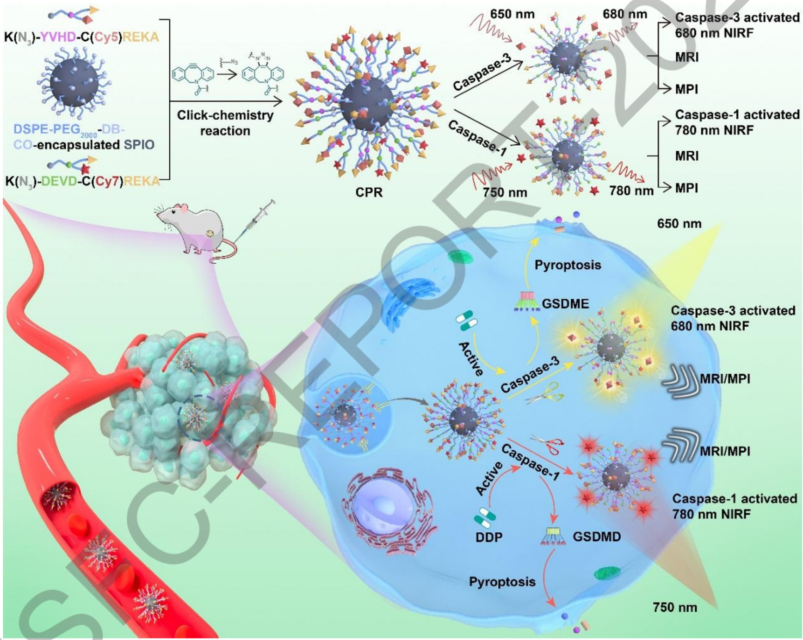

方案1 化疗中的瘤内细胞焦亡检测和 CRP 的成像机制示意图。

## (1） 双通道可激活探针 CRP的构建与表征

采用微波辅助固相肽合成（SPSS）方法制备了Caspase-1可裂解肽（YVHD-CREKA-N₃）和 Caspase-3可裂解肽（DEVD-CREKA-N₃），然后用 Cy5和Cy7标记用于近红外成像。之后，SPIO颗粒通常采用高温分解法合成，并用DSPE-PEG2000-DBCO修饰。为了淬灭Cy5 和 Cy7的荧光，将这两种肽与 SPIO混合，通过DBCO与叠氮化物之间的点击化学反应将它们固定在 SPIO表面，生成 CRP。共轭后，透射电子显微镜（Transmission electron microscopy，TEM）图像显示CRP在胶体溶液中分散良好（图1A-B）。通过动态光散射（Dynamic light scattering， DLS)测定，CRP的平均尺寸从 SPIO的 20.1 ± 0.6 nm扩大到 33.5 ±0.8nm（图1C)。此外，元素图谱结果显示，多肽中富含的N 元素位置与 TEM图像中显示的铁相位置重合，表明多肽有效地附着在SPIO上（图1D-F）。

此外，本研究还利用 X射线衍射（X-ray diffraction，XRD）对 CRP 的结晶相进行分析。如图4所示，X射线衍射图证实了SPIO核心的晶体结构，四氧化三铁的结构一致。

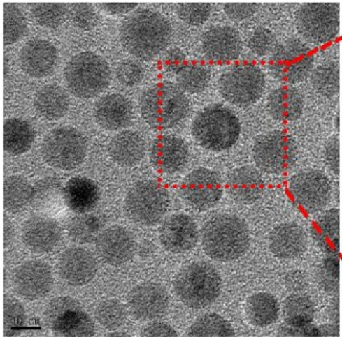

B

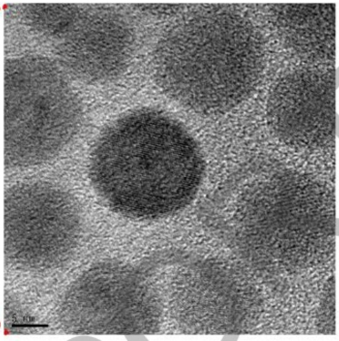

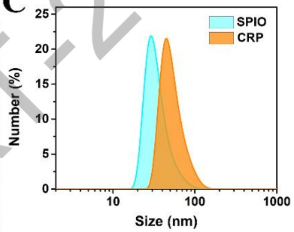

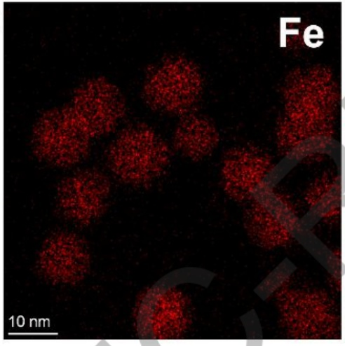

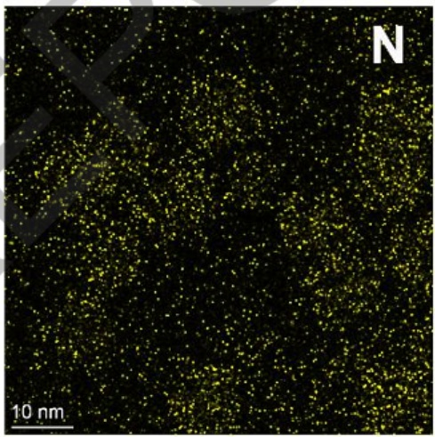

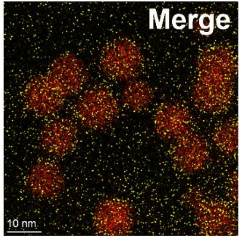

图 1 双通道可激活探针 CRP 的形貌表征。(A, B) CRP 的 TEM 图像。(C) CRP和 SPIO 的 DLS。(D-F) TEM 元素图谱，包括 CRP 的铁、氮元素。

此外，图 5 A-B 显示了不同铁浓度下体外 CRP的 T2 加权图像。CRP的横向弛豫度(r2)为 58.89 s-1 mM-1。CRP在MRI 上的线性检测范围为 0\~5 μM。此外，SPIO的 MPI信号与浓度呈线性关系，斜率为 47.6μg-1（图 5C-D）。MPI 上 CRP的线性检测范围为0\~1.25 mg/mL。因此，MR/MP信号准确地反映了CRP的浓度变化，表明 MR/MP成像可以定量检测体外和体内的 CRP。此外，本研究还进行了DLS 实验，以评估 CRP在生理条件（如 37C下的 PBS或血清）下24小时内的长期胶体稳定性。如图6所示，CRP在这些条件下保持了极好的胶体稳定性，没有观察到明显的聚集或降解。这一发现进一步证明了

CRP在生理环境中的潜在适用性。

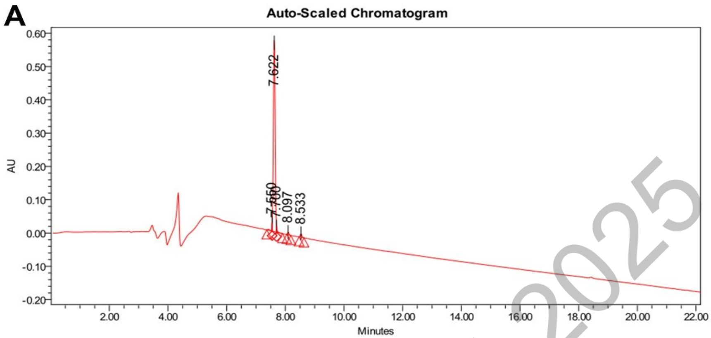

B

```
      Peak Results
   RT   Area  Height % Area
1 7.550  30322 22798   1.18
2 7.622 2464243 571211 95.54
3 7.700  20092 15597  0.78
4 8.097  25209  7409  0.98
5 8.533 39487  10567   1.53
```

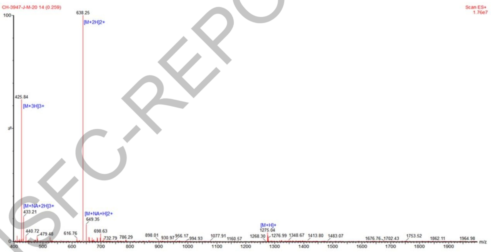

图 2 Caspase-1 反应肽 YVHD-CREA-N₃ 的结构表征。（A) 高效液相色谱法和 (B) 质谱法分析 Caspase-1 反应肽 YVHD-CREA-N3。

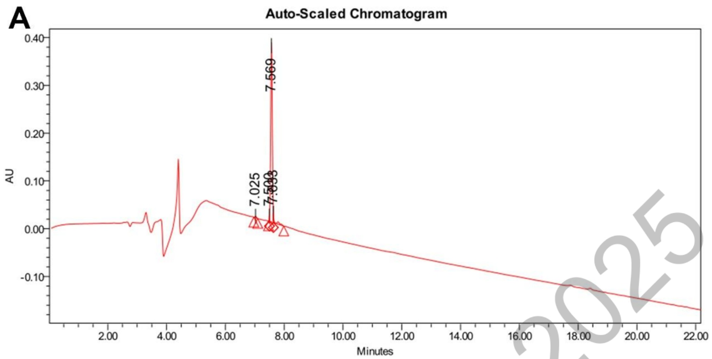

B

```
      Peak Results
   RT   Area  Height % Area
1 7.025  1193C  3193   0.80
2 7.500   7838 10886   0.52
3 7.569 1419122 363409 95.03
4 7.633  54493 19263  3.65
```

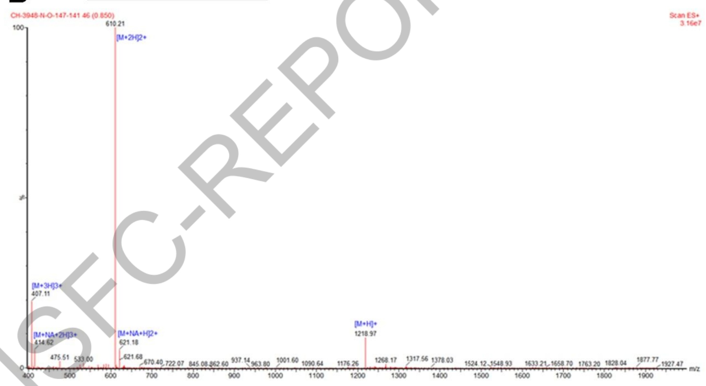

图 3 Caspase-3 反应肽 DEVD-CREKA-N3 的结构表征。(A)高效液相色谱和(B)质谱分析 Caspase-3 反应肽 DEVD-CREKA-N3。

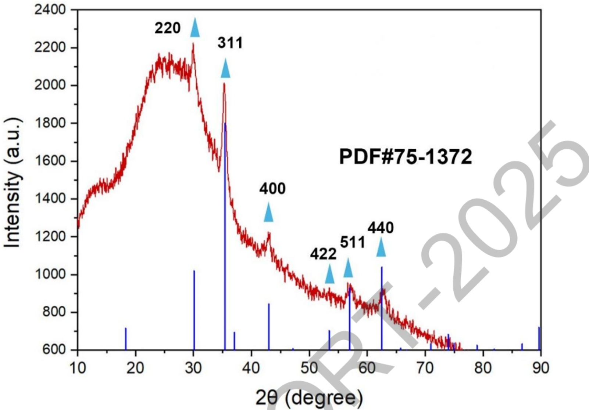

图 4 CRP 的 X 射线衍射图。

众所周知，ZIF-8可以在酸性条件下分解。通过在pH6.0的PBS 中孵育的MSPC 的 TEM 和 DLS 分析，本研究鉴定了 ZIF-8 和 MSPC 纳米点的酸性响应分解行为。TEM和DLS结果表明，ZIF-8纳米晶体的形态在酸性条件下被破坏，粒径减小至17nm（图3D）。然而，PBS（pH 6.0）中的 MSPC显示了水合粒径显著增加，约为330 nm（图3E）。此外，为了进一步研究 SQ-675在水中的聚集，本研究采用了分子动力学模拟。与单个SQ-675的优化几何结构相比，SQ-675在水中自组装形成J-聚集体，其中 SQ-675的亲水单元暴露在溶剂中，而疏水芳香基团被埋在核中（图3F）。同时，构象的放大图和旋转图显示 SQ-675形成具有分子间π-π堆积特征的J-聚集体。此外，元素TEM图显示在PBS（pH 6.0）中的MSPC聚集体中均匀分布的C、N、O和S元素，它们都是SQ-675的组成元素，这表明聚集体是由从MSPC释放的 SQ-675 聚集形成的（图3G）。

此外，其他对照探针，包括包裹SQ-675的MS纳米点、包裹SQ-675和PEITC的 MSP纳米点以及包裹 SQ-675 和 CORM-401的 MSP纳米点，都是使用类似的程序合成的，这表明这些平均水合粒径为5.0nm的纳米点可以通过简单而有效的途径容易地合成，并且可能具有更高的肾清除率安全性（图5）。酸性PBS中的MS、MSC和MSP纳米点显示出类似的聚集现象，其流体动力学尺寸约为310 nm，这可能归因于 SQ-675从MSPC释放后形成的聚集。

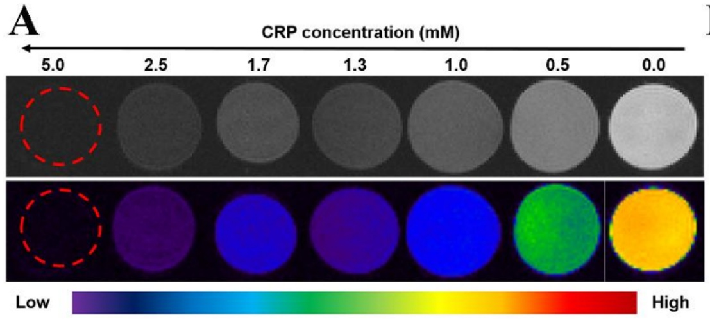

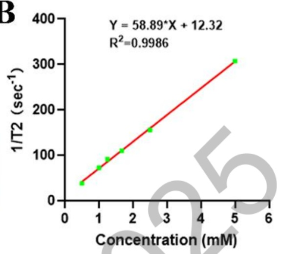

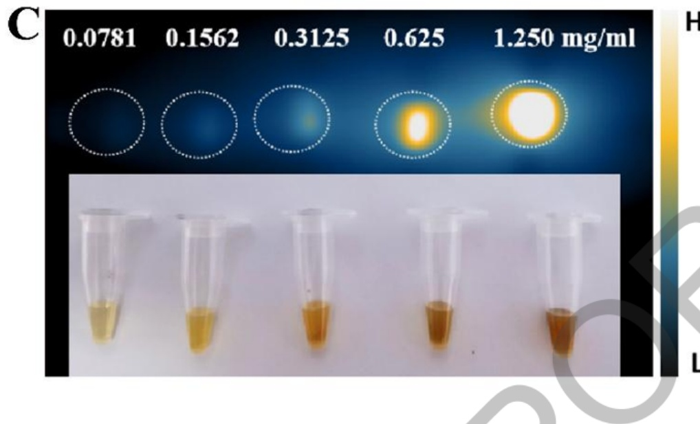

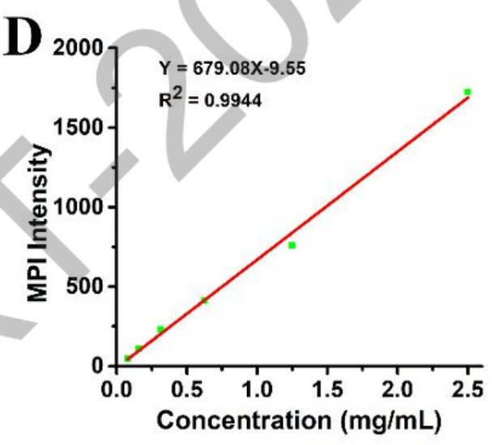

图 5 CRP 的 MR 和 MP 体外成像性能表征。(A) 不同浓度的 CRP 的 T2WI 和伪彩图像。(B) CRP 的 T2 弛豫度与浓度的关系图。(C)不同浓度下 CRP的 MP图像。(D) CRP的 MP 强度与浓度的关系图。

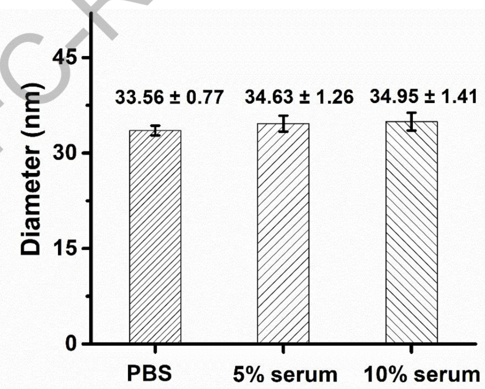

图 6 用动态光散射（DLS) 评估 CRP 在 PBS、5% 或 10%血清中培养 24 小时后的胶体稳定性。

随后，对CRP的紫外可见光谱（ultraviolet-visible，UV-vis）和荧光光谱进行了分析。如图 7A 所示。在650 nm和 750 nm波长处，CRP表现出明显的吸收峰，其强度随着浓度的增加而增加。相比之下，荧光光谱在680nm和780 nm处显示出两个不同的峰值，随着CRP浓度的增加，峰值增强的幅度很小，这归因于SPIO在近红外区域的淬灭效应（图7B，C）。因此，具有淬灭荧光的 CRP 有希望成为检测和成像 Caspase-1 和 Caspase-3 的候选物质。为了评估CRP 在检测各种 Caspase 方面的功效，本研究全面分析了 CRP 与不同浓度的活性 Caspase-1 或 Caspase-3 一起孵育后的紫外可见光谱和荧光光谱。与Caspase-1 或 Caspase-3 在 37 ℃ 下孵育 30 分钟后， 在 650 nm 和 750 nm处的最大吸收峰明显增强。这种增强表明酶反应促进了荧光染料的释放（图7 D，G)。此外，本研究还评估了 CRP 对 Caspase-1/3 和其他相关 Caspase 的检测选择性。如图8所示，在这些条件下， CRP 对 Caspase-1/3 具有高度特异性，交叉反应极少，性能稳定。此外，随着 Caspase-1 和 Caspase-3 浓度的增加，CRP 在 680 nm 和 780 nm 的荧光也分别增加（图 7 E、H)。680 nm 波长处的荧光强度与 Caspase-1 的浓度之间以及 780 nm 波长处的荧光强度与Caspase-3 的浓度之间呈线性相关（图 7 F、I）。回归方程分别为 F680 = 7871.8[caspase-1] + 689.6 和 F780 = 8146.4[caspase-3] + 445.6，线性系数分别为0.9986 和 0.9976 （表 。这些结果表明，CRP检测Caspase酶的灵敏度和准确度都很高， 足以检测肿瘤细胞和肿瘤中的目标 Caspase 酶。

表1 CRP的主要特性

```
   纳米      直径        λab    λem      特异
                                                     敏感性
报告
    器     (nm)    (nm)    (nm)      性
                    650     680     caspas    F680 = 7871.8[caspase-1] +
   CRP     33.5±                    e-1              689.6
          0.8       750     780     caspas    F780 = 8146.4[caspase-3] +
                                    e-3             445.6
```

注:λab 和 λem 分别为吸光峰和发射峰的波长。CRP的直径由 DLS测定。

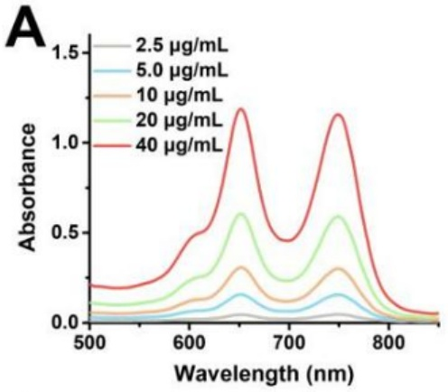

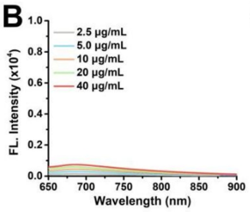

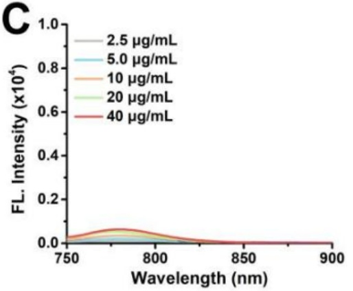

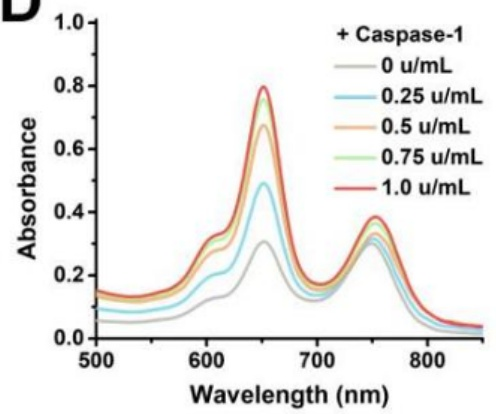

E

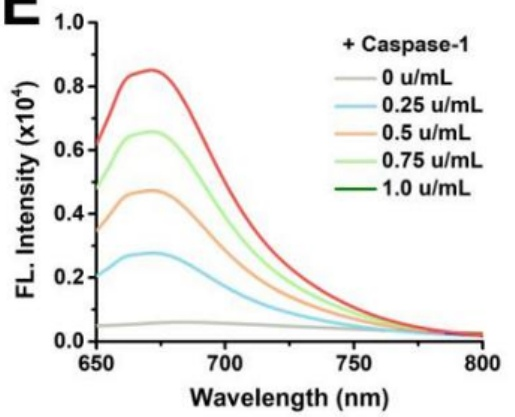

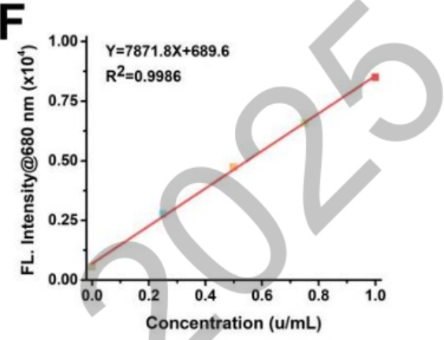

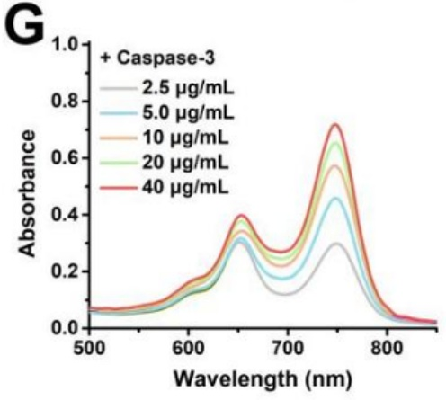

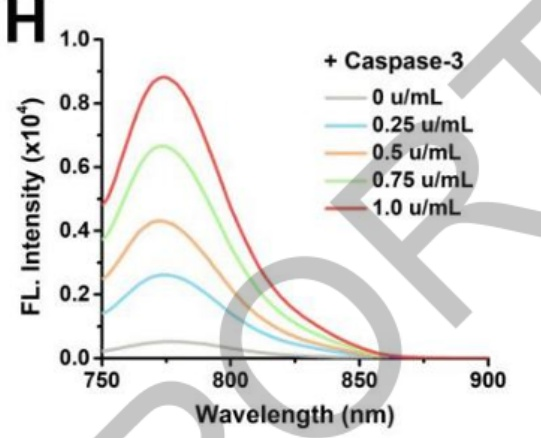

1

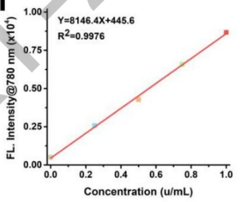

图 7(A) CRP（2.5-40 μg/mL）的吸收光谱。(B, C) CRP（2.5-40 μg/mL）在(B) 650 nm 和 (C) 750 nm 激发下的荧光光谱。(D, E) CRP(10 μg/mL)与 Caspase-1 (0-1.0 U/mL）孵育的吸收和荧光光谱（λex:650 nm)。(F) 680 nm 处荧光强度与 Caspase-1 浓度的线性相关。(G, H) CRP(10 μg/mL)与 Caspase-1 （0-1.0 U/mL）孵育的吸收和荧光光谱（λex:750 nm）。(I) 780 nm 处荧光强度与Caspase-3 浓度之间的线性相关。

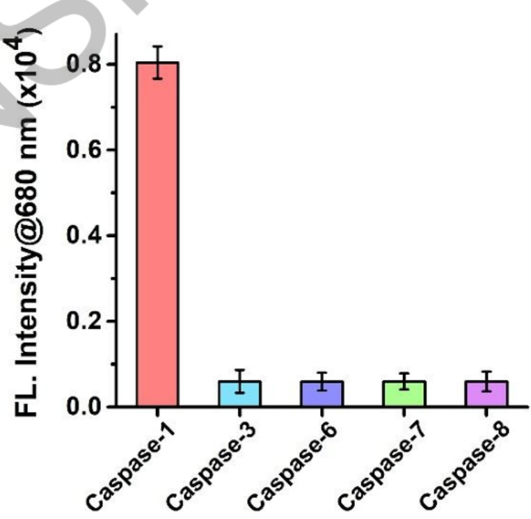

B

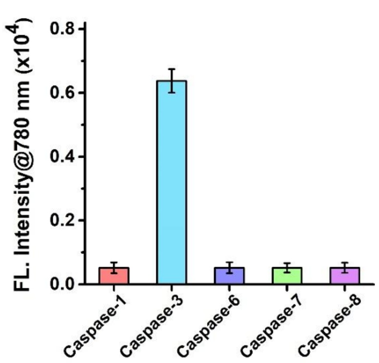

图8与不同的Caspase（1.0 U/mL）孵育后，CRP（10μg/mL）在（A）680 nm