项目批准号 92159302申请代码 H1813归口管理部门收件日期

20250492159302

# 国家自然科学基金

# 资助项目结题/成果报告

资助类别:重大研究计划

亚类说明:集成项目

附注说明:肿瘤演进与诊疗的分子功能可视化研究

项目名称:肺癌快速演进的关键分子功能可视化及智能诊断策略研究

负责人:李为民

BRID: 09015.00.82131

电子邮件: weimin003@163.com

电话: 028-85421885

依托单位:四川大学

联系人:朱卫华

电话: 028-85401949

直接费用:350.0000（万元）

执行年限: 2022.01-2025.12

填表日期:2025年12月23日

国家自然科学基金委员会制（2025年）

## 项目摘要

## 中文摘要:

本课题申报集成项目方向1:基于肿瘤异质性和微环境关键分子功能可视化的诊疗新策略。部分原位癌及早期肺癌可长期稳定，但部分快速进展至晚期，机制不清。识别肺癌快速演进并及时干预是目前的临床难点。课题组前期利用单细胞转录组和空间转录组测序，初步筛选出了肺癌演进的关键细胞亚群和基因；构建分子探针实现了肺癌EGFR突变分子功能可视化；并建立了基于影像的人工智能模型预测肺结节性质、病理亚型及治疗响应。本课题将基于已建立的肺结节临床队列，挖掘稳定型肺结节、缓慢进展型肺癌及快速进展型肺癌的生物标志物；利用空间转录组、单细胞转录组等确定介导肺癌快速演进的关键分子，并在细胞、动物水平揭示其作用机制；采用分子探针和靶向示踪技术，通过活体成像实现关键分子功能可视化；再融合临床、影像、病理、分子多维度数据，构建肺癌快速演进风险模型，并在前瞻性队列中验证及优化，实现肺癌快速演进的无创智能预测，指导临床制定早期干预策略。

## Abstract:

This project applied for the direction 1 of integration project : new diagnosis and treatment strategy based on tumor heterogeneity and key molecular function visualization of microenvironment. Clinical studies have shown that a certain number of lung carcinoma in situ (LCIS) and early microinvasive carcinoma (MIC) can be stable for a long period, whereas some of them can rapidly progress to advanced lung cancer. However, the molecular mechanism and phenotype of LCIS and MIC are still unclear, and how to identify the rapid progression of lung cancer and intervention in time remains very challenging. Previously, we identified the key cell subsets and mutant genes in lung cancer progressing course by use of single-cell transcriptome and spatial transcriptome sequencing. In addition, we have also focused on developing specific molecular probes to visualize the key biotargets of lung cancer (e.g., EGFR). Furthermore, the imaging artificial intelligence model was established to predict the nature, pathological subtypes and treatment response of pulmonary nodules. For this project, we have already explored the clinical and imaging markers of stable pulmonary nodules, slowly progressive lung cancer and rapidly progressive lung cancer based on previously established clinical cohort of pulmonary nodules. Next, we will apply spatial transcriptome, genome and single cell transcriptome to identify the key molecules in the rapid progression of lung cancer. , Subsequently, the functions and molecular mechanisms of the key molecules will be extensively studied in cellular system and animal models Additionally, we will visualize the distribution of the key molecules with functional activity in living system by developing highly selective molecular probes. Finally, a risk model in lung cancer rapid progression will be proposed by fusing the clinical imaging pathological molecular multi-dimensional data and the model will be verified in the prospective clinical cohort. To the end, this project may have potential to achieve the noninvasive intelligent prediction of lung cancer rapid progression and guide the design of clinical intervention strategies at early stage.

关键词（用分号分开）:气管、支气管、肺肿瘤；演进；分子功能；可视化；诊断

Keywords (separated by;): Tumor of trachea, bronchus and lung; Progression; Molecular function; Visualization; Diagnosis

## 结题摘要

## 中文摘要（对项目的背景、主要研究内容、重要结果、关键数据及其科学意义等做简单概述）:

肺癌是我国发病率和死亡率最高的恶性肿瘤，早期识别其快速演进类型并实现精准干预是改善预后的关键。本研究围绕“肺癌快速演进的关键分子功能可视化及智能诊断策略研究”总体目标，通过构建大规模临床队列，整合多组学技术与人工智能方法，系统揭示了肺癌快速演进的分子机制，并研发了系列可视化探针与智能预测模型。首先建立了包含43326例肺结节的临床研究队列，从中精分出稳定/良性、缓慢进展与快速进展三类群体，系统描绘了其临床、病理及分子特征。基于单细胞转录组与空间转录组分析，鉴定了SPP1\*巨噬细胞、SLPI⁺AT2样细胞等关键肿瘤微环境细胞亚群，揭示了CD74、PRAME等分子在免疫逃逸、肿瘤复发与侵袭中的核心作用。在分子功能可视化方面，成功开发了靶向EGFR、ALK、KRAS等驱动基因的突变蛋白探针，以及监测脂滴代谢、免疫微环境粘度/活性氧的双光子/近红外荧光探针与PET探针，实现了关键分子活性的实时、在体可视化监测。在智能诊断方面，项目融合影像、临床、病理与分子数据，构建了基于深度学习的肺结节恶性风险预测模型，并创新研发了中国版肺结节分级标准C-Lung-RADS。该模型在区分快速与缓慢进展型肺癌方面AUC达0.83，对≤1 cm小结节预测准确率达90%，敏感性显著优于国际标准Lung-RADS。此外，项目还建立了临床-影像-病理-分子四维整合预测体系，诊断效能提升至92%，并在前瞻性队列中得到验证。本项目实现了从“机制发现”到“探针可视化”再到“智能诊断”的全链条创新，不仅深化了对肺癌演进规律的认识，也为早期肺癌的精准筛查、风险分层与个体化管理提供了重要的理论依据与技术支撑，具有显著的临床转化潜力与社会价值。

## Abstract (Brief description of research background, main methods, contributions, and research data):

Lung cancer remains the leading cause of cancer-related mortality in China. Early identification of rapidly progressing subtypes and precise intervention are crucial for improving patient outcomes. This project, entitled“Visualization of Key Molecular Functions and Intelligent Diagnosis Strategy for the Rapid Progression of Lung Cancer, aimed to elucidate the molecular mechanisms underlying rapid tumor progression and develop visualization probes and intelligent prediction models through integrative multi-omics and artificial intelligence approaches. We established a clinical cohort of 43,326 pulmonary nodules, which were classified into stable/benign, slowly progressive, and rapidly progressive groups. Using single-cell and spatial transcriptomics, we identified key tumor microenvironment cell subsets, such as SPP1\* macrophages and SLPI\* AT2-like cells, and revealed the pivotal roles of CD74 and PRAME in immune evasion, recurrence, and invasion. For molecular visualization, we developed mutant-specific probes targeting EGFR, ALK, and KRAS, as wel1 as two-photon/near-infrared fluorescent probes and PET tracers for monitoring lipid droplets and immune microenvironment viscosity/reactive oxygen species, enabling real-time in vivo visualization of key molecular activities. In intelligent diagnostics, we integrated imaging, clinical, pathological, and molecular data to construct a deep learning-based risk prediction model for pulmonary nodules. We also created the Chinese Lung-RADS (C-Lung-RADS), a novel risk stratification system. The model achieved an AUC of 0.83 in distinguishing rapidly from slowly progressive lung cancers, with 90% accuracy for nodules ≤1 cm, significantly outperforming the international Lung-RADS standard. Furthermore, a clinical-imaging-pathological-molecular integrated predictive system improved diagnostic accuracy to 92%, validated in a prospective cohort. This project accomplished an innovative pipeline from“mechanistic discovery" to“probe visualization" and "intelligent diagnosis," advancing the understanding of lung cancer progression and providing robust tools for early screening, risk stratification, and personalized management, with strong potential for clinical translation.

| 关键词（用分号分开）:肺癌；分子功能可视化；分子探针；智能诊断； |
| --- |
| Keywords (separated by;): Lung cancer; Molecular function visualization,; Molecular probes; Intelligent diagnosis; |

## 正文

《结题/成果报告》正文分为两个部分:结题部分和成果部分。请按照《结题/成果报告》填报说明及撰写要求填写。

## （一）结题部分

1. 研究计划执行情况概述。

## （1）按计划执行情况。

本项目围绕“肺癌快速演进的关键分子功能可视化及智能诊断策略研究”的总体目标，全面并按计划完成了既定任务，在靶点发现、探针开发和临床转化三个层面取得了系列重要进展:

## 1）临床队列与多组学平台建设

本项目成功建立并完善了华西医院的肺结节临床研究队列43326例，通过纳入排除标准，共纳入6033例患者，其中稳定/良性肺结节患者1848例，缓慢进展型肺癌患者2874例，快速进展型肺癌1311例的研究，系统描绘了临床、病理及分子特征，构建了快速进展型肺癌的临床风险预测模型。

搭建了单细胞转录组（scRNA-seq）、空间转录组等多组学分析平台；基于临床队列，纳入不同进展快慢的肺癌患者50余例，收集患者的肿瘤及癌旁组织，进行单细胞多组学测序，描绘了进展快慢肺癌的肿瘤微环境细胞图谱，并发现了驱动肺癌快速进展的关键分子靶点。

## 2）快速演进肺癌关键细胞亚群发现与功能分子验证

本项目为深入探讨快速进展型肺癌的微环境特征及关键分子机制，率先绘制不同病理类型及临床分期肺癌的免疫图谱。发现肺癌组织中SPP1+巨噬细胞(Mφ)显著富集在早期肺癌进展中起关键作用。鉴定了一个新型的巨噬细胞亚群，阐明其具有增殖潜能的 SPP1+巨噬细胞（SPP1+Mp）也可分化为Mp，更新了Mφ来源的传统认识。进一步发现，CD74是巨噬细胞与肺癌细胞互作的关键靶点，CD74 活化后上调 PD-L1 表达，抑制 CD8+T细胞 IFN-Y释放，导致免疫逃逸。

在肺癌快速进展研究中，采用单细胞转录组和空间转录组，描绘了肿瘤细胞(AT2-like)五个细胞亚群时空特征，在肿瘤边缘发现了高表达 SLPI基因的AT2- like 2 亚群，该亚群细胞可通过上调 DKK1 激活 Wnt/β-catenin 通路，导致干性和EMT增强，驱动肺腺癌向外恶性侵袭。针对早期肺癌快速复发难点，纳入复发组和未复发组I期肺腺癌，通过多组学整合分析，鉴定出PRAME基因是Ⅰ期肺腺癌快速复发的关键分子标志物，并通过细胞和动物实验证实PRAME启动子区低甲基化是促进肿瘤侵袭转移的关键机制。

基于快速演进关键细胞亚群及关键信号通路，收集肺结节队列外周血，进行肺癌自身抗体、外泌体及环状RNA检测以及 ctDNA甲基化等检测，鉴定了ALKBH3，TSPAN14，SLPI和 SHOX2等关键分子，并筛选优化了检测技术，分析差异性指标，筛选出介导肺癌快速演进的分子标志物。

## （4）关键分子功能可视化探针的开发

本项目采用激光显微切割技术，对实性肺癌和磨玻璃肺癌进行蛋白质组学分析，研究发现实性肺癌组织中与脂滴（LDs）相关的蛋白PLIN2显著上调。进一步研发了一种新型双光子近红外荧光探针，可有效监测实性肿瘤细胞内脂滴（LDs）的变化，该研究为快速进展型肺癌的诊断提供了一种快速有效的工具。进一步研究免疫微环境，我们开发了基于免疫抑制微环境的一系列近红外粘度微环境探针以及粘度微环境与活性氧双响应探针，可精准检测不同进展肿瘤微环境特征，为关键分子的可视化提供了新型工具。

针对肺癌关键驱动基因，本项目成功构建了多种荧光基团标记的靶向分子探针（包括EGFR、ALK和 KRAS等），这些分子探针可与靶标蛋白的活性位点特异性结合，实现了突变蛋白的靶向标记。体外、细胞及动物模型实验结果表明，这些分子探针与突变蛋白具有较高亲和力（IC50<10nM），能实时、动态地标记肺癌细胞的突变蛋白，并在小鼠模型和31例肺癌患者进行了可视化验证，准确性达100%，为肺癌精准诊疗提供了新工具。

进一步基于分子影像学手段探索表观遗传修饰与代谢重编程机制，成功开发了靶向组蛋白去乙酰化酶（HDAC）及戊糖磷酸途径限速酶（G6PD）的特异性PET探针，有效捕捉早期肺癌快速进展的代谢信号。此外，针对肿瘤免疫微环境及特异性膜蛋白靶点，项目构建了高亲和力、低脱靶的抗体偶联核素显像剂（Immuno-PET）。通过构建多维分子成像体系，显著提升了微小病灶的检出率，为肺癌的早期精准发现、分子分型及生物学行为评估提供了关键的可视化工具。

## (5）构建肺癌快速演进智能风险预测模型

本项目已搭建数字病理分析平台，纳入500例IB期肺腺癌手术患者，其中肿瘤进展患者250例，已完成304例（304/600，60.8%）患者、共计3452张全载玻片图像（WSI）的扫描，充分挖掘组织病理信息，探索各组间在数字病理水平的差异，描绘了不同演进速度肺癌的数字病理特征。

基于影像组学和深度学习技术，本研究建立了良性/稳定结节、缓慢进展型及快速进展型肺癌无创预测模型。提取所有患者胸部 CT的DICOM影像数据，对病灶进行分割和影像组学特征提取（使用Pyradiomics工具），并基于PyCaret机器学习库构建临床与影像组学预测模型；基于ResNet50网络结构训练深度学习预测模型，训练集共4224例，验证集共1809例。该模型在区分快速进展型与缓慢进展型肺癌方面AUC达0.83，对≤1cm小结节的预测准确性高达90%。

进一步基于12万例中国人群多中心队列，融合影像、临床与随访等多维度数据，创新研发了中国版肺结节恶性风险智能评估系统C-Lung-RADS。该系统集成了决策树算法、深度卷积神经网络与多维梯度提升回归等先进人工智能技术，实现了对肺结节恶性风险的精准分层，其敏感性显著优于国际标准 Lung-RADS（87.1% vs 63.3%）。通过创新的阶梯式分级策略，优化了医疗资源配置效率为不同风险人群制定了个体化管理路径。

整合影像、临床信息、检验数据等，突破多模态数据融合的技术难点，诊断效能由85%提升至92%。进一步纳入了2939例肺结节患者， 其中快速进展423例，缓慢进展2516例，按照7:3的比例分为训练集和验证集，并且纳入520例包括快速进展和缓慢进展肺癌样本的 ctDNA 甲基化检测数据，建立临床-影像-病理-分子综合模型，诊断效能达90%以上；并建立前瞻性自然人群队列，在受试者初次发现肺结节时，利用前述所建立的综合模型预测演进风险。模型训练旨在优化深度学习模型的参数，以建立胸部CT图像与临床演进之间的最优模型。

## （2）研究目标完成情况。

本项目严格按照申报书设定的研究目标开展研究工作，并在以下三个方面全面达成既定目标，取得了从基础机制到临床应用的系列突破:

## 1）揭示肺癌进化轨迹，确定并证实了驱动肺癌快速演进的关键分子及其作用机制。

本项目从细胞、分子及肿瘤微环境多维度系统阐明了肺癌恶性演进的关键驱动因素。在细胞层面，发现了SLPI+AT2样细胞作为侵袭前沿的关键亚群，通过激活特定信号通路增强肿瘤干细胞特性（AdvSci2025)。在分子层面，首次证实PRAME通过表观遗传调控和信号通路激活，驱动肺腺癌早期快速复发与转移，其机制得以明确（Nat Commun 2025)。在微环境层面，揭示了SPP1+巨噬细胞通过塑造免疫抑制微环境促进肿瘤免疫逃逸的完整路径（Signal Transduct Target Ther 2022, Cell RepMed 2023)。上述工作系统性地揭示了肺癌的进化轨迹，鉴定出多个关键分子靶点，并深入阐明了其作用机制。

## 2）实现肺癌快速演进关键分子与微环境特征的可视化。

本项目在分子功能可视化方面取得了显著进展。我们开发了多种分子探针，特别是针对EGFR、ALK、KRAS等关键肺癌驱动基因的突变探针。这些探针通过与靶向蛋白的活性位点特异性结合，能够在体外、细胞及动物模型中实现高效的实时标记，提供了强有力的分子成像工具。这些探针的开发不仅提升了肿瘤精准诊断的能力，也为后续治疗提供了重要的分子标志（NatCommun2022，发明专利:ZL202010951404.4)。在肿瘤微环境的可视化方面，我们创新性地应用双光子近红外荧光成像技术，成功实现了实性肿瘤细胞内脂滴（LDs）的实时监测(Sens Actuators B Chem 2025)。通过这一技术，我们能够检测肿瘤的代谢活动，特别是在快速进展型肺癌中的变化，为肺癌的早期诊断和精准评估提供了新的方法和工具。此外，我们开发了基于免疫微环境的系列近红外和双光子探针，用于微环境中粘度与活性氧的识别。这些新型探针能够精准识别肺部微环境特征(Sens Actuators B Chem 2022, Anal Chem 2022,发明专利: ZL 2022 1 0513912.3),从而为进一步研究肿瘤的演进与转移提供可视化工具。 S

## 3）成功构建多参数人工智能模型，实现了肺癌快速演进的无创预测与智能诊断。

针对国内肺结节精准管理难题，项目基于超大样本多中心队列，自主研发了C-Lung-RADS 系统（Nat Med2024)。该系统采用创新的阶梯式分级与多模态 AI融合策略，对肺结节恶性风险的敏感性显著优于国际标准Lung-RADS（87.1% vs 63.3%)，并能有效识别 78.2%的低危结节避免过度诊疗，同时精准筛查4.4%的高危结节。基于万余例多中心数据，构建了融合临床、影像、病理与分子特征的深度学习预测模型；模型对快速进展型肺癌的预测AUC达0.83，对小结节具有高判别能力（准确率90%），为肺癌早期精准干预提供了可落地的智能工具。在影像组学和深度学习技术的应用方面，整合影像、临床信息、检验数据等，突破多模态数据融合的技术难点，诊断效能由 85%提升至 92%(Nat Biomed Eng 2023)。建立了肺癌进展预测模型，该模型结合了临床、影像学和分子数据，能够准确预测肺癌的进展。通过对胸部CT影像数据的处理与分析，该模型成功在前瞻性队列中实现了快速进展型与缓慢进展型肺癌的有效区分（发明专利:CN202411917234.2)，AUC值高达0.83，对小结节的诊断准确率达到90%。这一智能预测模型为临床诊断提供了重要支持，为早期干预肺癌提供了可行的技术路径。

## 2. 研究工作主要进展、结果和影响。

## （1）主要研究内容。

## 1）肺结节临床研究队列建立。

基于四川大学华西医院资源，严格纳入并随访10,000例肺结节患者。依据随访期间结节体积倍增时间（VDT）及病理结果，将其精分为三组:稳定肺结节组（3年无变化）、缓慢进展型肺癌组 $( \mathrm { V D T } \geq 4 0 0$ 天）及快速进展型肺癌组（VDT <400天)。系统采集并整合每位患者的完整临床信息、系列胸部CT影像、手术病理组织样本及分子数据，构建高质量、多维度的临床研究资源库。本研究基于华西医院肺结节临床研究队列，筛选纳入稳定/良性结节、缓慢进展型及快速进展型肺癌患者进行研究，探索快速进展型肺癌临床病理特征及预后。其次，针对部分手术治疗肺癌患者，前瞻性收集其新鲜组织标本行多组学研究，探索介导肺癌快速进展的关键细胞亚群及分子。

## 2）肺癌快速演进关键分子的多组学筛选与功能机制验证。

利用单细胞转录组测序（scRNA-seq）与空间转录组测序技术，联合分析各组肿瘤组织，从细胞亚群与空间分布层面系统筛选驱动恶性演进的关键细胞群与差异表达分子。进一步整合基因组、转录组及外周血多组学数据，交叉验证并鉴定核心驱动分子。在细胞与动物水平，通过基因编辑、功能实验及高通量测序，深入阐明其在促进肿瘤增殖、侵袭、转移及免疫逃逸中的具体作用与下游信号通路机制。

## 3）关键分子功能可视化探针的构建与应用。

针对筛选验证的关键分子如肺癌代谢重编程关键酶G6PD、表观遗传调控因子HDAC等，采用计算机辅助药物设计、结构优化及放射性/荧光标记技术，构建高特异性、高亲和力的分子探针。通过体外结合实验、细胞共定位及在体成像，系统评价探针的靶向性、稳定性及信噪比。最终，在细胞系来源移植瘤（CDX）和患者来源异种移植（PDX）等小鼠模型中，利用MicroPET/CT、双光子/近红外荧光成像等技术，实现对关键分子活性和肿瘤代谢特征的实时、在体可视化监测与定位。

## 4）多参数融合的肺癌快速演进智能预测模型构建与临床验证。

深度挖掘临床队列数据，基于深度学习技术，分别从初次及系列随访的胸部CT影像中自动提取预测性影像标签。同时，利用数字病理技术量化病理切片特征。将上述影像标签、数字病理特征、临床信息及外周血分子标志物进行多模态融合，通过特征筛选与模型训练，构建临床-影像-病理-分子综合预测模型。随后，在独立的前瞻性临床队列中对模型进行验证与优化，评估其对肺结节良恶性、尤其是对“快速进展型肺癌”的鉴别与预测效能，最终形成可辅助临床决策的智能诊断体系。

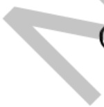

## (2）取得的主要研究进展、重要结果、关键数据等及其科学意义或应用前景。

## 1）建立肺结节临床研究队列

基于华西医院大样本肺结节队列（N=43326），本研究最终纳入6033例患者，其中快速进展型肺癌1311例。在良性/稳定结节组、缓慢进展型及快速进展型肺癌组，患者中位年龄依次为50、55、58岁，男性占比依次为60.1%、31.4%、45.9%，吸烟占比依次为32.3%、15.8%、31.3%，因呼吸系统症状就诊的占比依次为13.9%、19.7%、28.5%。快速进展型比缓慢进展型肺癌患者年龄更大、男性及吸烟者占比更多。快速进展型肺癌组中，鳞癌、小细胞癌、含有实体型/微乳头型成分的腺癌、低分化及中晚期癌占比显著更高，EGFR野生型、KRAS突变、TP53突变及PD-L1高表达更常见，患者预后更差（如图1和如图2）。

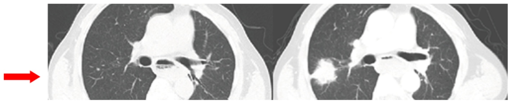

图1、快速进展型肺癌。

右上叶结节，图 A和图B分别为2013-06-26、2014-10-20胸部CT，时隔1年结节快速长大，术后证实为肺鳞癌；VDT=60天，MDT=55天。

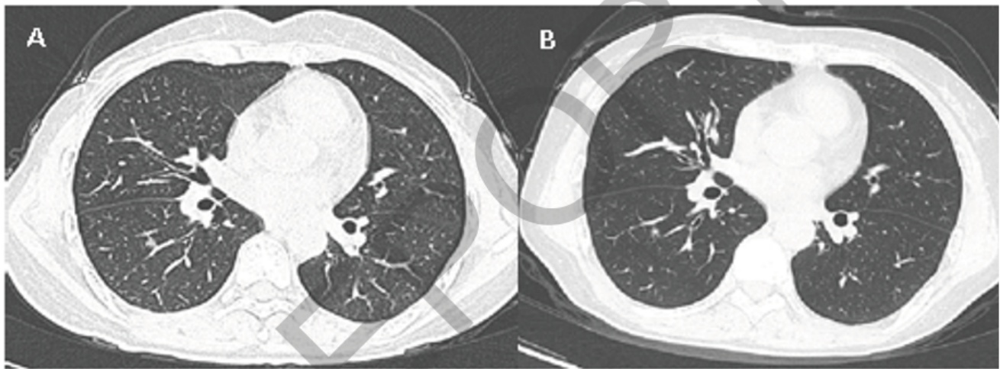

图2、缓慢进展型肺癌。

右下叶结节，图A和图B分别为2009-06-18、2020-05-07胸部CT，时隔11年，结节变化不明显，术后证实为微浸润性肺腺癌；VDT=9959天，MDT=-20067天。

## 2）肺癌快速进展分子机制及关键分子靶点研究

首先聚焦早期肺腺癌（LUAD）的侵袭进展分子机制，利用空间转录组学（Stereo-seq）与单细胞RNA测序（scRNA-seq）的整合策略，系统揭示了肺结节向侵袭性腺癌演变过程中的关键细胞亚群、空间结构及信号网络特征。研究团队共采集21例肺腺癌患者、24个肿瘤样本，获得超过10万细胞的高质量单细胞数据及40余万空间转录位点信息，建立了首个涵盖MIA（微浸润癌）至IA（浸润性腺癌）阶段的空间细胞图谱（如图3）。

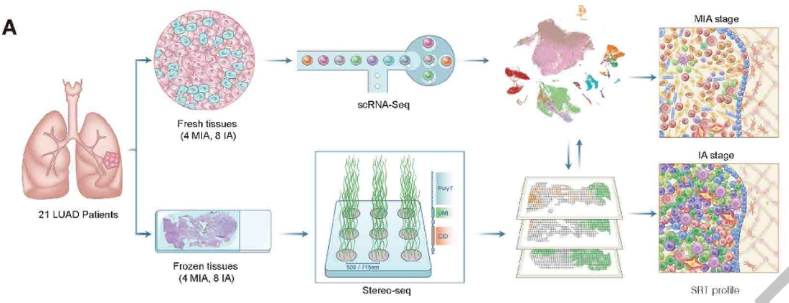

图3、24个LUAD样本肿瘤微环境中细胞群的单细胞及空间转录组测序分析。

通过多组学联合分析发现，LUAD从MIA 向IA 进展过程中，肿瘤细胞发生显著亚群分化与功能特化，其中来源于AT2细胞谱系的恶性亚群（AT2-like细胞）表现出最强的侵袭相关性。我们首次鉴定出高表达分泌型白细胞蛋白酶抑制剂（SLPI）的AT2-like2细胞亚群，该亚群具有明确的空间特异性-集中分布于肿瘤侵袭前沿，且在13例检测样本中均稳定存在，其定位与肿瘤侵袭活性高度吻合。功能特征上，该亚群兼具高干细胞样特性（SOX2+、CD133+标志物阳性）与增强的代谢活性（戊糖磷酸途径关键基因上调） 提示其在肿瘤侵袭中的核心驱动作用（如图4）。

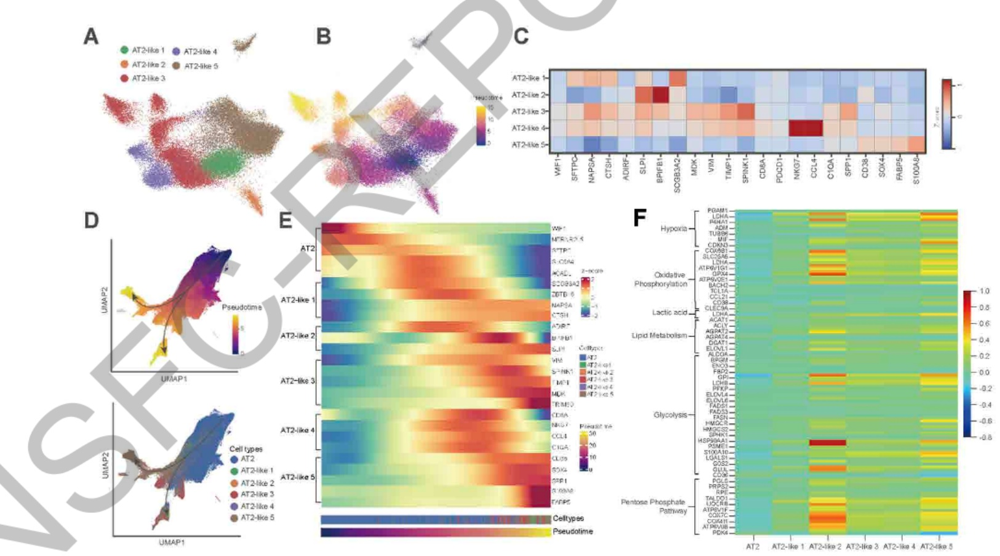

图4、基于空间转录组学的 LUAD 肿瘤中 AT2 及 AT2 样细胞轨迹分析。

A. 根据标志基因表达划分的五种AT2样亚型位点的 UMAP可视化图谱；B. 按拟时序着色的五组AT2样细胞亚群UMAP可视化图谱:C. 五类 AT2样亚型间表达差异最显著基因的热力图；D. 使用 Molecle3 算法构建的 AT2 与 AT2 样细胞轨迹图，包含正常 AT2位点和AT2样亚型位点；E. 按拟时序与 AT2样亚型着色的差异表达基因热力图；F.AT2细胞与AT2样亚型代谢相关基因的热力图。

体外实验证实 SLPI 低表达可显著抑制 LUAD 细胞系 PC9 的增殖、迁移及侵袭能力；体内实验中，SLPI低表达组小鼠肺转移结节数较对照组减少50%以上（P<0.01），且肿瘤组织中上皮标志物E-钙粘蛋白表达上调，证实SLPI对肿瘤侵袭转移的关键调控作用。分子机制上，SLPI通过上调 DKK1 激活Wnt/β-catenin通路，促进肿瘤细胞干细胞样特性（CD133、SOX2表达升高）与上皮-间质转化(EMT)，Western blot 验证显示 SLPI低表达组 β-catenin、Cyclin D1、N-cadherin表达显著降低，明确了该信号通路的调控作用（如图5）。该研究鉴定了SLPI、MRC1 及 Wnt/β-catenin通路关键分子（如 DKK1）可作为LUAD侵袭的特异性治疗靶点，为开发精准靶向药物提供了明确方向；针对 SLPI的抑制剂有望阻断肿瘤侵袭和转移，改善IA阶段患者预后。 S

A

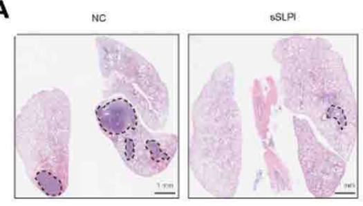

B

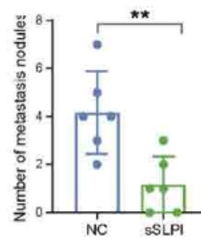

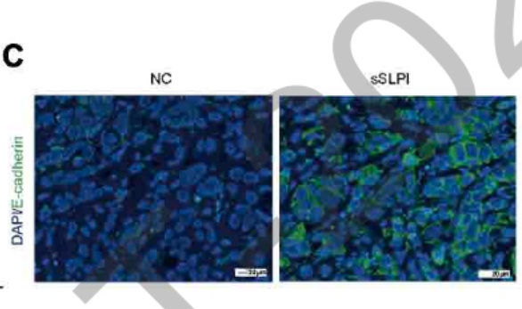

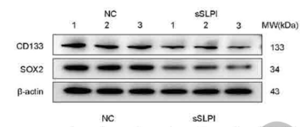

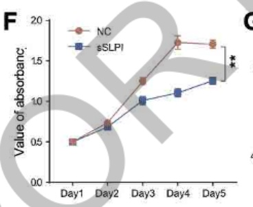

E

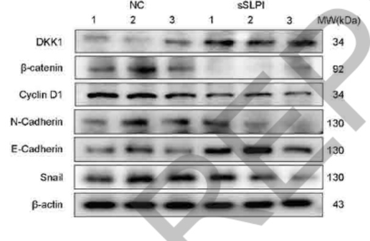

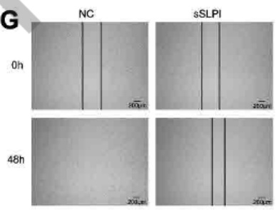

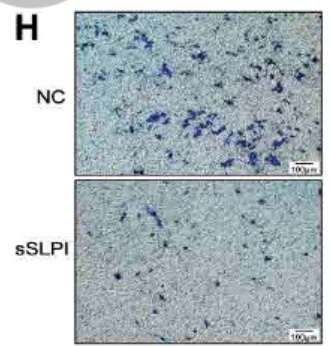

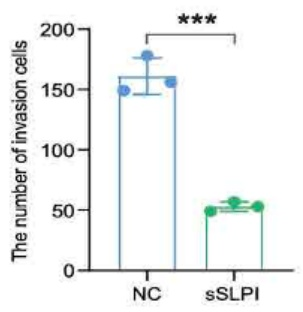

图5、分泌性白细胞蛋白酶抑制剂（SLPI）促进肿瘤边缘的侵袭性。

A. 尾静脉注射 $2 \times 4 \overline { 0 } ^ { 6 }$ 个 PC9 细胞（NC组）与 SLPI-shRNAPC9 细胞（sSLPI组）8周后小鼠肺组织HE染色图像；B. 肺表面转移结节数量统计（数据以均值±标准差表示)，采用非配对t 检验评估显著性；C. 小鼠移植瘤组织中 E-cadherin的免疫荧光染色。比例 $= 2 0   \mu \mathrm { m }$ ；D.PC9细胞（NC）与 SLPI低表达细胞（sSLPI）中CD133、SOX2表达的蛋白质印迹分析；E.RNA-seq检测 PC9细胞（NC）与SLPI低表达细胞（sSLPI）差异基因表达谱；F.CCK-8法检测PC9细胞（NC组）与 SLPI-shRNAPC9细胞（sSLPI组）第1-5天的细胞增殖速率；G.伤口愈合实验检测PC9细胞（NC组）与 SLPI-shRNAPC9细胞（sSLPI组）的迁移能力；H. Transwell 实验检测 PC9 细胞（NC 组）与 SLPI-shRNA PC9 细胞（sSLPI 组）的特异性侵袭能力。

进一步纳入122例Ⅰ期非小细胞肺癌患者的手术肿瘤样本和癌旁组织，在随访期间，57例患者发生复发转移，65例患者未发生复发转移。随后，我们对样本进行了基因组、表观遗传组和转录组测序及多组学整合分析，以期综合解析期非小细胞肺癌术后复发转移的发病机理，为个性化治疗决策提供依据（如图6）。

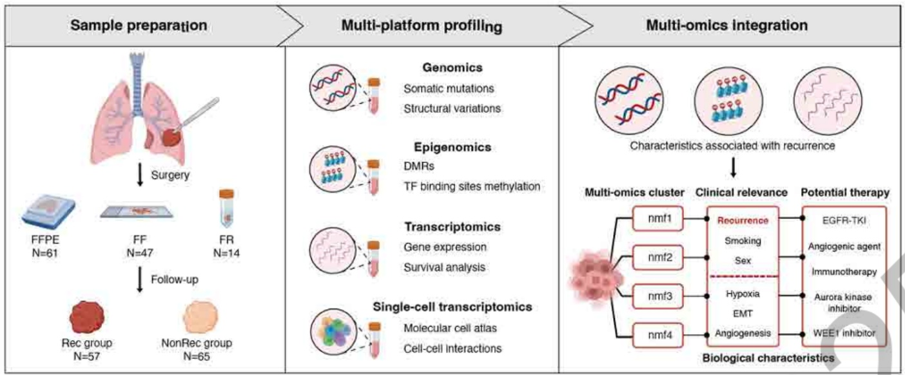

图6、Ⅰ期非小细胞肺癌术后复发转移研究流程图。

研究发现，高级别病理亚型（实体性、微乳头型）、更显著的DNA错配修复障碍（dMMR）特征以及更高的同源重组缺陷（HRD）评分与肺癌术后复发转移相关。同时，DNA结合域的TP53基因错义突变与肺腺癌患者更短的无复发生存时间（RFS）显著相关，表明其具有更高的基因组不稳定性。此外，对肿瘤组织和配对癌旁组织的表观遗传组及转录组分析表明，发生复发转移的非小细胞肺癌表现出整体的 DNA低甲基化趋势。PRAME 是肺腺癌复发转移组中低甲基化且高表达最为显著的基因，其表达水平受到转录因子TEAD1结合位点甲基化的调控。生存分析显示PRAME高表达与不良预后相关。体内体外实验表明，PRAME的高表达可通过调控上皮间质转化（EMT）相关基因的表达促进肺癌细胞的增殖和迁移，而敲除PRAME基因可以明显抑制肺癌转移（如图7）。

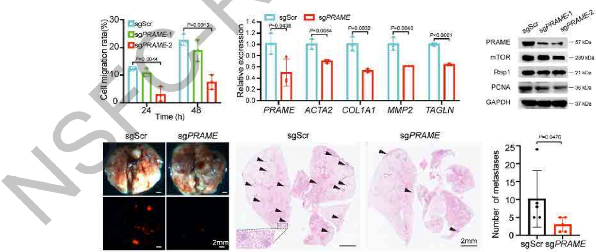

图7、PRAME基因的生物学功能研究。

进一步，我们通过单细胞转录组分析对Ⅰ期非小细胞肺癌术后复发转移的肿瘤微环境特征进行了探索。本研究发现正常组织中Ⅱ型肺泡上皮细胞几乎没有拷贝数变异（CNV）事件，而复发转移组肿瘤CNV水平最高，表明其具有更高的恶性程度。对免疫微环境分析表明，复发转移组肺癌的CD8+T细胞具有低毒性和高耗竭状态的特征，SPP1巨噬细胞的富集可通过激活炎症通路促进肺癌复发转移。细胞通讯分析进一步显示，复发转移组中肿瘤-免疫细胞相互作用的缺乏有助于形成免疫抑制微环境（如图8）。

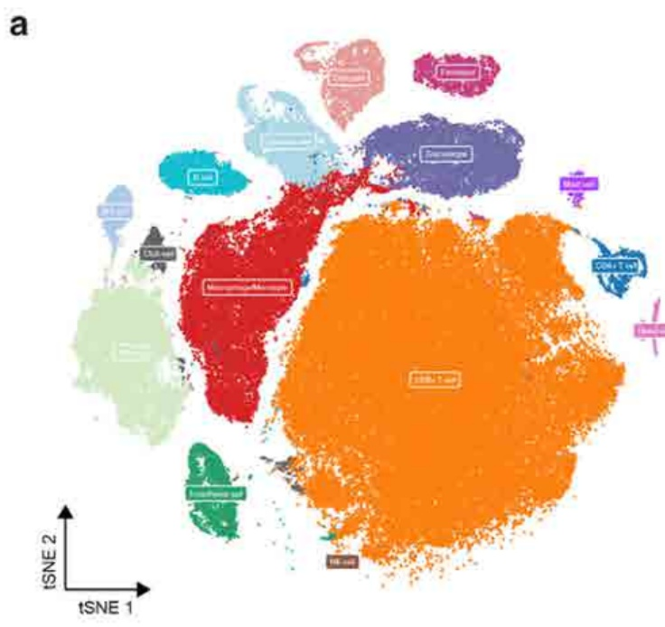

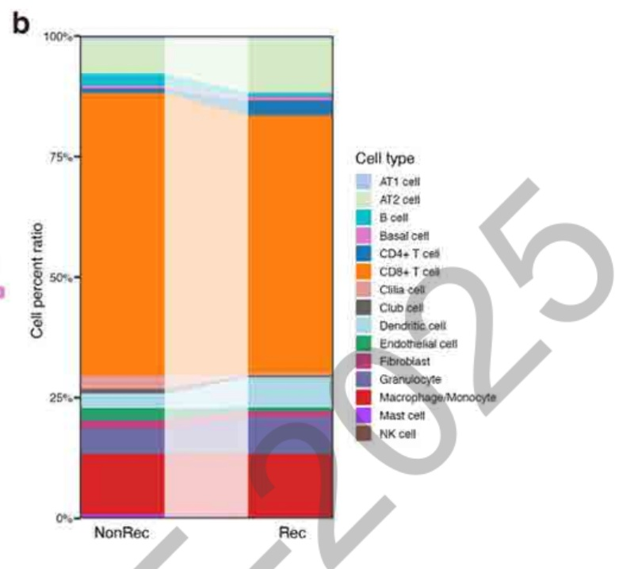

图8、Ⅰ期非小细胞肺癌术后复发转移的肿瘤微环境特征。

我们运用非负矩阵分解（NMF）算法整合多组学数据，将非小细胞肺癌分为四个亚型（nmf1、nmf2、nmf3、nmf4）。生存分析表明，多组学数据整合可以对患者术后复发转移风险分层，其中nmf1、nmf2为高风险组，nmf3为中风险组，nmf4为低风险组。此外，研究人员针对各亚型独特的分子特征提出了潜在治疗策略（如图9）。

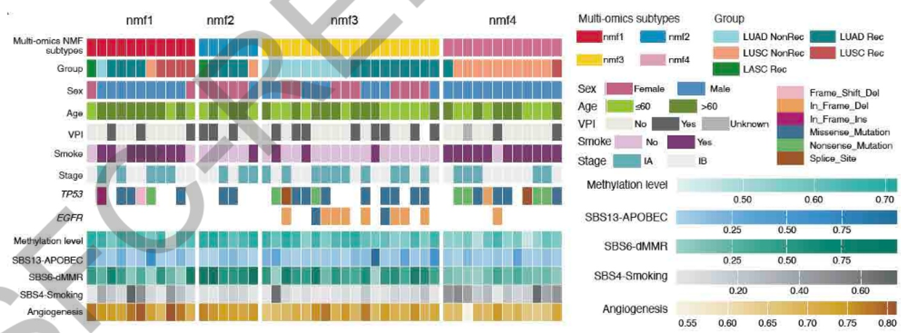

图9、多组学整合分析非小细胞肺癌的四个亚型。

此外，我们综合运用 bulk RNA-seq 及单细胞 RNA 分析等技术建立 LUSC 及LUAD多组学免疫微环境图谱。发现巨噬细胞和淋巴细胞对非小细胞肺癌患者的两种主要亚型之间的免疫异质性有重要贡献。发现DC、Tregs、CD4细胞和巨噬细胞的重叠基因较少，鉴定出这些细胞类型的免疫细胞标志物MARCO、ALOX5AP和SPP1的高表达与肺癌的不良预后相关。同时，进一步对巨噬细胞再分群并鉴定出四个细胞亚群。除了三个传统的巨噬细胞亚群FABP4-Mφ、FCN1-Mφ、SPP1-Mφ外，还发现了以 SELENOP为标记基因的新的巨噬细胞亚群。SPP1-Mφ亚群在LUSC的发生发展起重要作用，SELENOP-Mφ亚群在LUAD中发挥抗肿瘤作用。进一步运用拟时序分析描绘了巨噬细胞的发育轨迹并提出了二元分支结构的发育过程。我们的发现证明了巨噬细胞在不同亚型肺癌演进过程的重要作用，为肺癌患者个性化治疗提供新思路（如图10）。

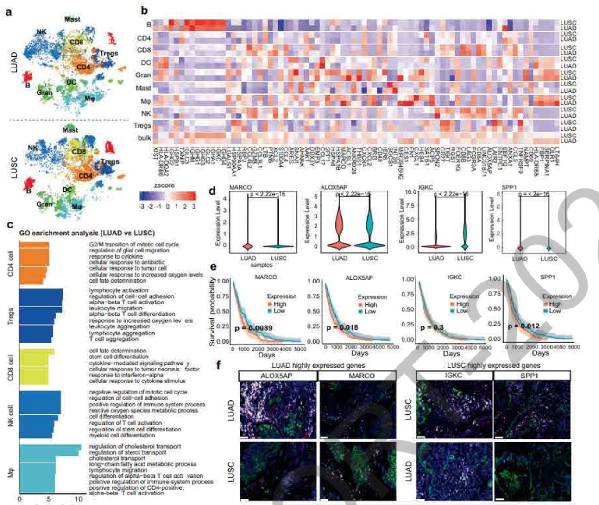

图10、构建了肺癌的免疫微环境图谱。

鉴定非吸烟肺腺癌中高浸润且具增殖潜能的 SPP1+巨噬细胞新亚群:通过对47,580个髓系细胞的深度分析，我们鉴定出一个前所未有的巨噬细胞亚群，因其高表达促癌基因 SPP1 及细胞周期相关基因（如 MK167、STMN1），故命名为 SPP1+增殖性巨噬细胞（SPP1+pro）。该亚群在非吸烟患者的肿瘤组织（tNS）中丰度显著高于吸烟患者肿瘤组织(tS)，构成了非吸烟肺腺癌肿瘤微环境(TME)的独特特征（如图11）。

揭示 SPP1+pro细胞是单核来源巨噬细胞（MDM）的新型独立来源:传统观点认为，肿瘤组织中的MDM仅来源于循环单核细胞的招募与分化。然而，我们的轨迹分析显示，SPP1+pro细胞与MDM之间存在明确的分化联系，并且SPP1+ pro和经典单核细胞均可作为MDM的祖细胞。这一发现打破了MDM的单一来源认知，揭示了肿瘤微环境可通过诱导局部巨噬细胞增殖（SPP1+pro）来补充免疫抑制性MDM的新机制（如图12）。

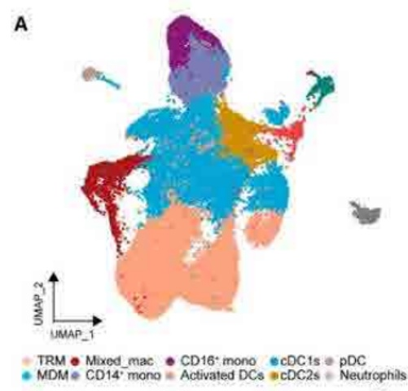

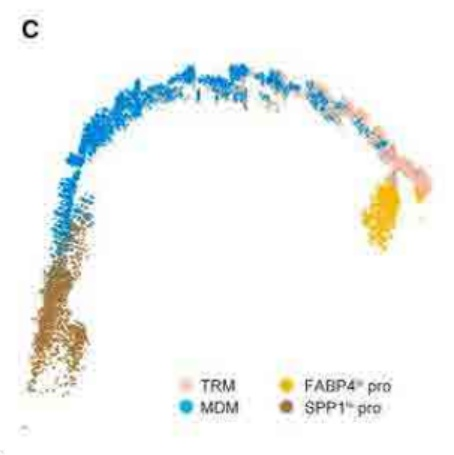

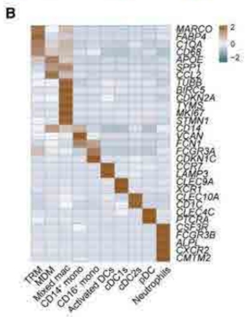

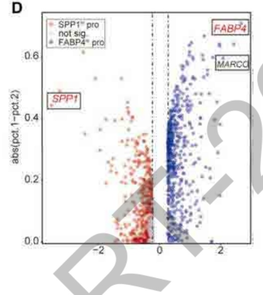

图 11、髓系细胞中 SPP1 高表达增殖性细胞（SPP1 pro）的鉴定。

A. 髓系细胞的 UMAP视图；B. 各髓系细胞亚型中已知标记基因平均表达水平的热图；C. 通过 Monocle2 推断的 MDM、TRM 和 Mixed mac 的发育轨迹；D. FABP4 高表达增殖性细胞（FABP4 pro）与 SPP1 高表达增殖性细胞（SPP1pro）之间的差异表达基因。

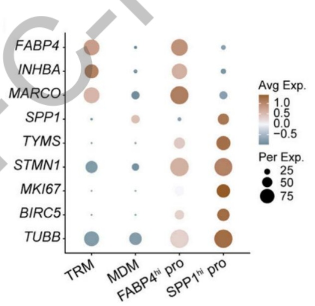

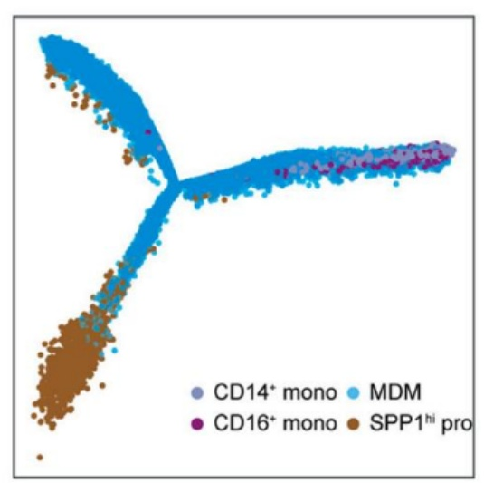

图12、髓系细胞中 SPP1高表达增殖性细胞（SPP1pro）的鉴定。

A. 四个巨噬细胞亚群中标记基因平均表达水平的点图；B. 通过Monocle2推断的单核细胞来源巨噬细胞、单核细胞与SPP1高表达增殖性细胞的发育轨迹。

进一步在髓系细胞亚群分析中，本研究鉴定出19个髓系细胞簇，发现合并

COPD的LSCC中肿瘤相关巨噬细胞（TAMs）比例显著升高。细胞流式和多重免疫荧光实验进一步验证了 TAMs 尤其是 TREM2+ TAMs 在 Tumor 组中的显著富集。基于 TCGA 队列分析发现，TAMs 高浸润与 LSCC 患者较差的总体生存显著相关，提示该亚群在肿瘤进展中具有重要临床意义。该结果明确了TREM2+TAMs 是 COPD相关 LSCC 中关键的免疫抑制驱动细胞群，为靶向髓系免疫抑制提供了潜在干预方向。进一步通过SCENIC调控网络分析，本研究发现 Tumor 组 TAMs 中 HIF-1α 和 JUNB 显著激活。功能实验表明，HIF-1α是 TAMs 中 MIF 高表达的关键调控因子:敲低 HIF-1α 可显著抑制 TAMs 分泌 MIF，而敲低 JUNB 并无明显影响。在肿瘤细胞-TAMs 共培养体系中，抑制HIF-1α 的 TAMs 显著降低肿瘤细胞迁移能力，表明 HIF-1α-MIF 轴在促进肿瘤侵袭和进展中发挥关键作用（如图13）。该发现揭示了 COPD相关缺氧和炎症环境下 TAMs 功能异常的分子基础，为靶向 TAMs 的代谢-转录调控提供了理论依据。

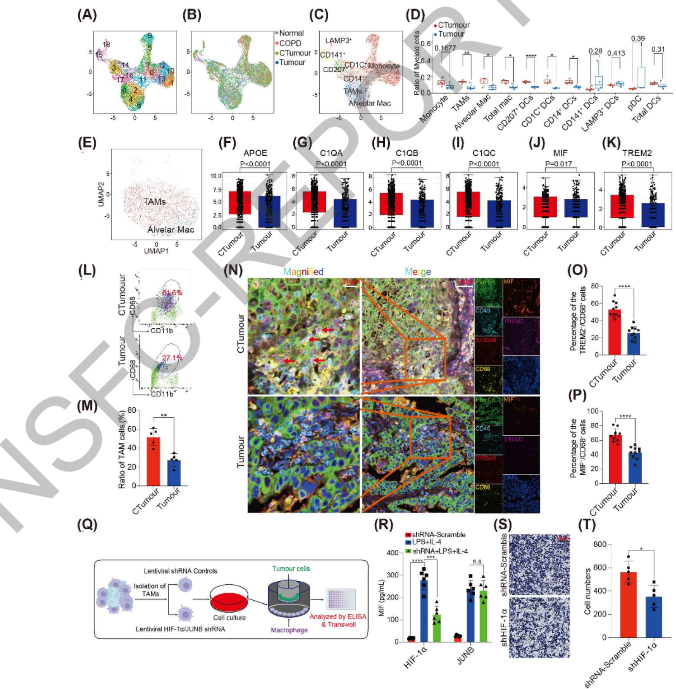

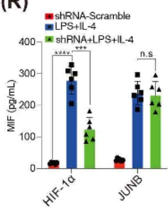

图13、主要髓系细胞进行降维、聚类和细胞注释，并对免疫抑制分子进行了多色荧光染色和细胞共培养分析。

T细胞分析显示，Tumor组中 $\mathrm { C D 8 ^ { + } T }$ 细胞大量浸润，但功能状态明显异常。拟时序分析表明， $\mathrm { C D 8 ^ { + } ~ T }$ 细胞在Tumor中主要停留在初始态和终末耗竭态，而有效的细胞毒性中间状态显著减少。Tumor组 $\mathrm { C D 8 ^ { + } T }$ 细胞中TIGIT、LAG3和PD-1 等耗竭分子显著上调，而细胞毒性相关基因显著下调。通过FACS 实验进一步证实，Tumor组中 PD-1+、PD-L1+耗竭型 $\mathrm { C D 8 ^ { + } T }$ 细胞比例显著升高。该结果表明，COPD可能在肿瘤发生早期即驱动 $\mathrm { C D 8 ^ { + } T }$ 细胞向免疫抑制和耗竭方向转变，从而削弱抗肿瘤免疫监视。

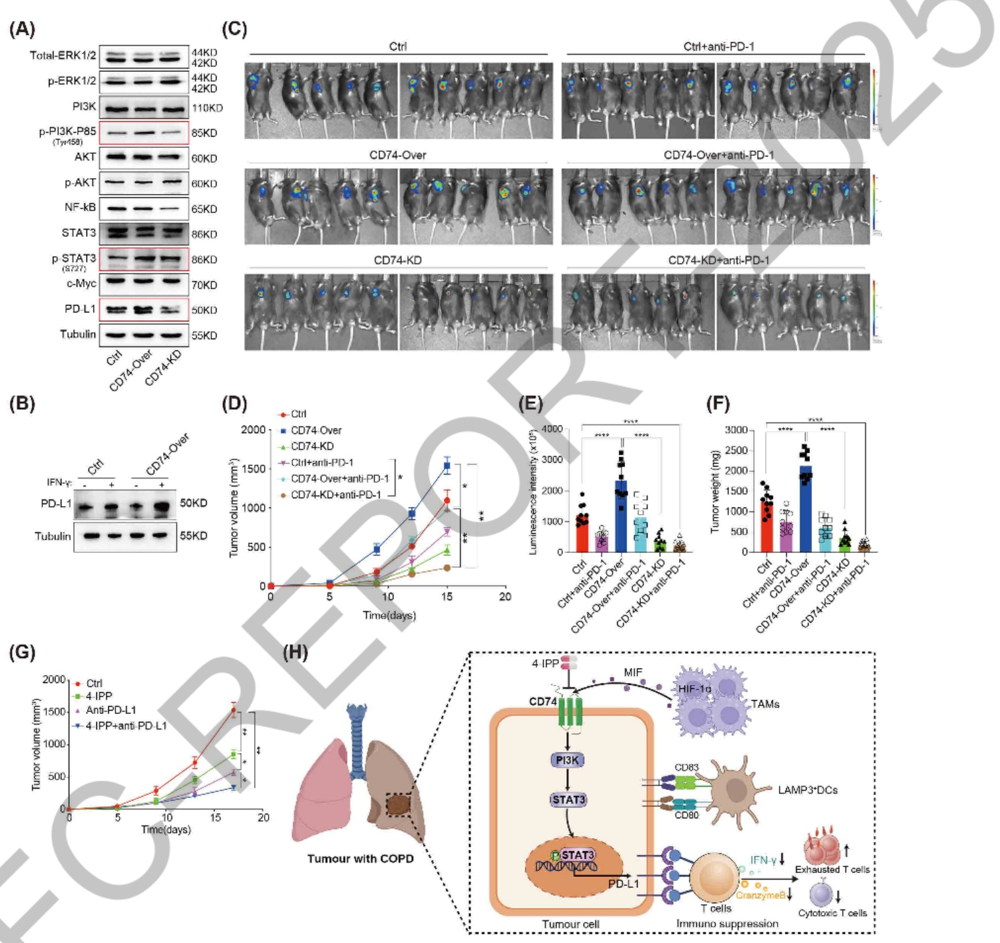

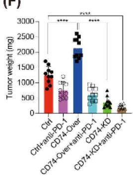

图 14、利用 WB 和小鼠肿瘤模型分析了 CD74 通过调控 PI3K-STAT3-PD-L1信号通路促进肿瘤进展。

通过 CNV和轨迹分析，本研究鉴定出 LSCC 中具有显著异质性的恶性上皮细胞群体。其中，Tumor来源的 S1 亚群表现出更高的转录异质性，并显著高表达MHC-II相关基因（CD74、HLA-DRA、HLA-DMA），同时兼具上皮和免疫特征。临床数据分析显示，CD74+肿瘤细胞高表达与LSCC患者不良预后显著相关。功能实验表明，CD74过表达并不直接增强肿瘤细胞体外增殖，但在免疫完整小鼠模型中显著促进肿瘤生长，而在免疫缺陷模型中该效应消失，提示CD74 的促瘤作用高度依赖免疫系统。机制研究显示，TAMs 分泌的 MIF可激活肿瘤细胞表面的 CD74，进一步促进 PI3K和 STAT3 磷酸化并显著上调 PD-

L1 表达。阻断 CD74 或抑制 MIF-CD74 结合可显著降低 PD-L1 水平。在体内治疗实验中，CD74 阻断联合 PD-1 抑制剂，或 MIF抑制剂联合 PD-1 抑制剂，均显著抑制肿瘤生长并改善生存，显示出明确的协同治疗潜力（如图14）。本研究从单细胞层面系统揭示了肺癌免疫微环境重塑的关键机制，首次提出“TAM-MIF-CD74+肿瘤细胞 $\mathrm { - C D 8 ^ { + } T }$ 细胞耗竭”构成的免疫抑制轴。CD74及其上下游信号轴有望成为预测免疫治疗疗效和开发新型联合免疫治疗方案的重要靶点，具有明确的临床转化潜力。

## 3）创建关键功能分子可视化新技术

首先，我们成功设计并合成了靶向EGFR激活突变体的荧光探针。该探针的设计巧妙地利用了EGFR突变体（如L858R）与TKI（如吉非替尼）结合后，其内部微环境疏水性发生特异性变化的特性，实现了EGFR突变体功能分子的可视化研究。该探针在与突变型EGFR结合后荧光强度显著增强，从而实现对目标蛋白的特异性识别与信号放大。进一步，通过分子水平和细胞水平的实验验证发现，该探针能特异性地识别肺癌快速演进中的EGFR激活突变，并将其活性状态转化为可检测的荧光信号，实现了在癌细胞水平对致病蛋白EGFR突变功能的“可视化”检测（如图15-16)。另外，项目通过在一系列EGFR不同突变型的肺癌细胞模型中进行研究，发现该探针所呈现的荧光强度与癌细胞的增殖活性及其对TKI靶向药物（如，吉非替尼）的敏感性高度相关。接着，我们进一步对探针的体内活性进行了验证，通过构建多种不同EGFR突变的小鼠肺癌模型，发现该探针仅在EGFR突变型小鼠肿瘤组织中实现可视化成像，证实了探针用于EGFR突变功能分子的可视化检测。更重要的是，该探针能有效区分EGFR野生型小鼠模型与EGFR 激活突变型小鼠模型，为后续探针用于临床样本中EGFR 突变功能分子的检测奠定了实验基础。最后，我们又利用该探针实现了肺癌患者原代肿瘤细胞中 EGFR 突变体的有效检测，成功实现了对 EGFR-TKI 治疗患者的疗效准确预测。该方法能够快速、有效判断肿瘤细胞群体的“EGFR功能突变”的细胞比例，从而为临床提供了一种新型的、基于功能的可视化诊断工具，为项目后续智能诊断模型的建立奠定了研究基础（如图17）。

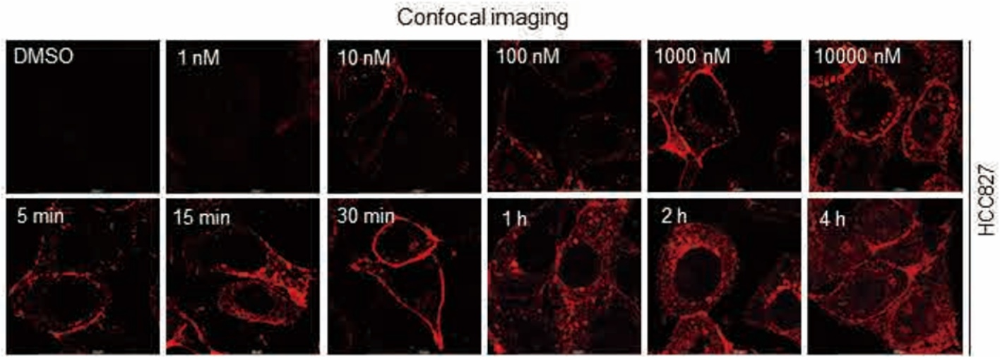

图15、分子探针在 EGFR突变型肺癌细胞中对 EGFR 激活突变蛋白的可视化动态研究。

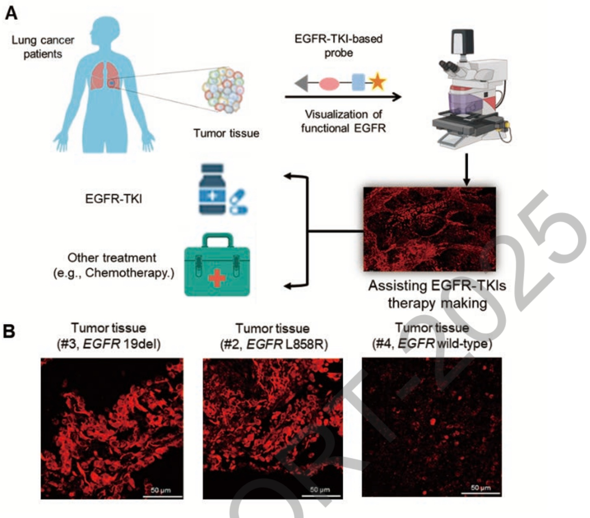

图16、利用 EGFR-TKI 分子探针进行肺癌 EGFR 突变检测方法构建。

A. 成功获得靶向 EGFR的分子探针，并基于点击化学（click-chemistry）构建了组织原位（in situ)荧光成像的方法，可实现 EGFR 突变体功能活性检测；B. 初步实验表明，基于 EGFR-TKI 分子探针的方法可实现 EGFR 突变体活性功能的可视化检测。

本项目又针对肺癌演进另一关键突变靶点KRAS，进行了分子探针的构建与研究工作，成功开发了系列能高特异性识别KRAS G12C突变的功能分子探针。其中，探针HX40可在野生型背景中检测出具有功能活性的KRAS G12C突变体，实现了肺癌中 KRAS 关键突变体功能分子的可视化研究，为肿瘤演进中 KRAS功能突变的研究提供了重要的可视化工具。通过一系列分子和细胞水平的实验验证，我们发现该探针不仅能有效区分不同肿瘤细胞的KRAS突变型，且细胞中探针含量与下游ERK1/2磷酸化水平具有一定相关性，进一步证实了该探针可用于KRAS突变体功能分子的可视化研究（如图18）。随后，我们又构建了KRAS突变小鼠模型，通过探针在体内标记的量化分析和功能成像，探究了探针标记与KRASG12C突变蛋白功能活性的相关性，同时通过血常规及体内主要脏器的HE染色考查了探针的生物相容性及毒性。结果表明该探针在小鼠体内具有较好的靶向性和生物相容性，满足体内KRAS突变体功能分子检测的条件。随后，我们将这种新型KRAS 突变分子探针的检测方法进行了优化，利用KRAS G12C 突变阳性的临床样本考查探针标记的准确性。最后，我们通过收集37例肺癌穿刺样本，在临床样本中探究了该探针与KRAS突变及下游ERK1/2磷酸化水平的相关性，发现该探针可实现肺癌组织中KRAS突变体的功能可视化，结果显示荧光信号主要分布于部分携带KRASG12C突变的肺癌组织中，与基因突变检测结果对比，发现探针检测 KRAS G12C突变的 AUC为 0.94，特异性高达95%，敏感性为87%，准确率为93%。上述结果进一步证明了分子探针在肺癌关键分子功能可视化中的科学价值和临床意义，为后续研究奠定了基础。

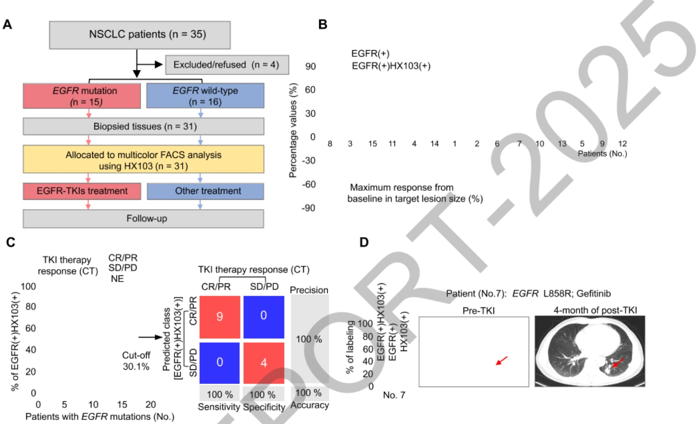

图 17、探针 HX103 的临床应用研究。

A. 临床研究的试验设计；B.HX103（蓝色）和EGFR抗体（灰色）的穿刺样本检测，及EGFR-TKI治疗后肿瘤进展(红色)；C. 探针检测与靶向治疗效果对比；D. 患者治疗前后CT图，红色箭头为肿瘤病灶区。

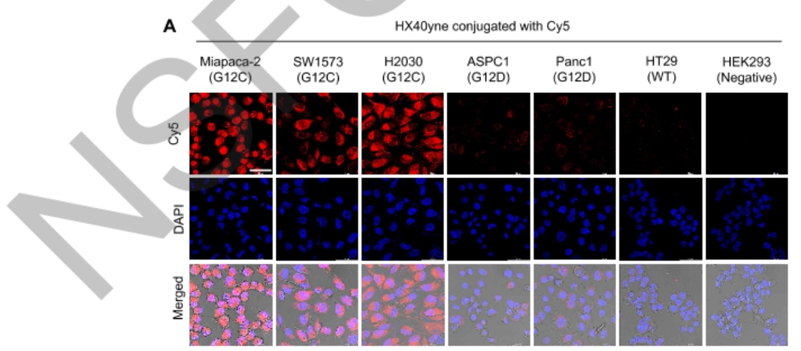

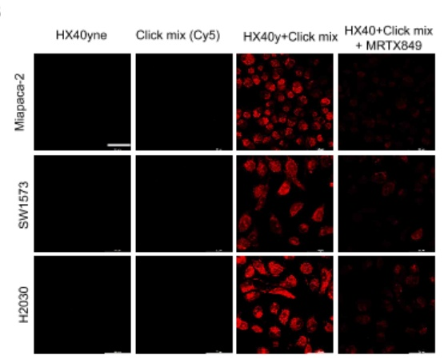

图18、靶向KRAS 突变的分子探针在细胞水平的活性及特异性研究。

A. 采用激光共聚焦显微镜进行功能成像研究；B. 竞争性实验探究分子探针标记的特异性。

我们成功设计并构建了多个靶向戊糖磷酸途径关键酶 G6PD的特异性 PET探针（包括[18F]X215及[68Ga]X220)。为全面评估探针的体内生物学性能，研究团队利用肺癌PC-9、A549细胞系来源的CDX模型，以及更具临床转化参考价值的患者来源异种移植（PDX）小鼠模型，系统开展了多时间点的MicroPET/CT活体显像验证，重点考察了探针在体内的生物分布、代谢清除规律及其对肺癌病灶的特异性靶向能力。

PET/CT动态显像结果显示，所构建的示踪剂在注射后能迅速聚集于肿瘤部位，肿瘤轮廓清晰可见。随着时间推移（15至120分钟），探针在肿瘤组织中维持了较高的放射性摄取（SUV值），而非靶向器官（如心脏、肝脏）的背景信号逐渐降低，表现出良好的血液清除特性。定量分析数据进一步证实，肿瘤与肌肉（T/M）及其他背景组织的放射性比值维持在较高水平，特别是T/M比值显著，显示出优异的信噪比（如图19）。该系列G6PD特异性探针具备出色的体内靶向性和理想的药代动力学性质，验证了其在肺癌早期精准诊断中的应用潜力。

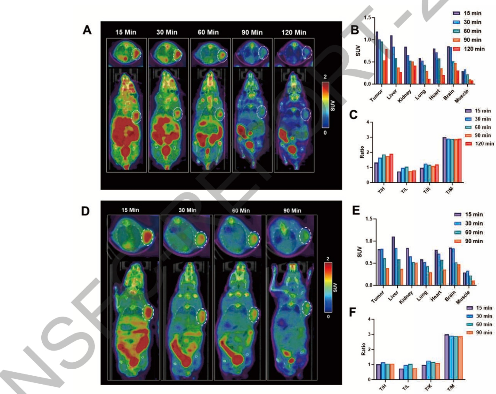

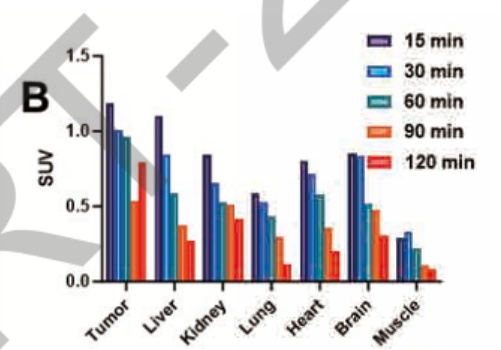

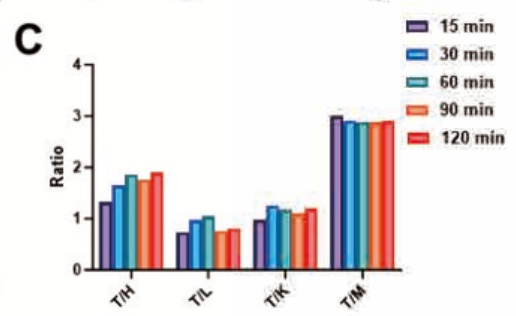

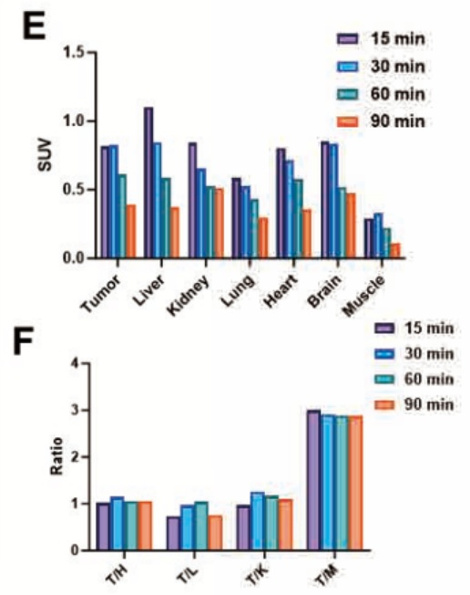

图 19、图 1 G6PD 特异性 PET 探针[18F]X215 与[68Ga]X220 在肺癌荷瘤小鼠中的 Micro PET/CT 显像及定量分析。

A.[18F]X215在肺癌PDX小鼠模型中注射后不同时间点（15、30、60、90、120min）的代表性横断面（上）及冠状面（下）显像图，白色虚线圈出位置为肿瘤病灶。B-C.[18F]X215 在 PC-9模型中的主要器官 SUV 值分布及肿瘤与背景组织比率定量分析。D. 在肺癌PC-9CDX小鼠模型中注射后不同时间点（15-90min)的 Micro PET/CT 显像图。E-F. [68Ga]X220 在 PC-9 模型中的主要器官 SUV 值分布及肿瘤与背景组织比率定量分析。

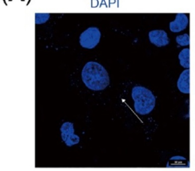

(B)

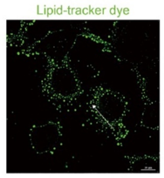

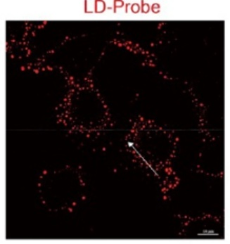

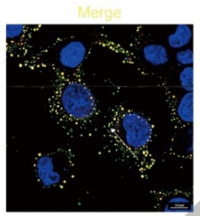

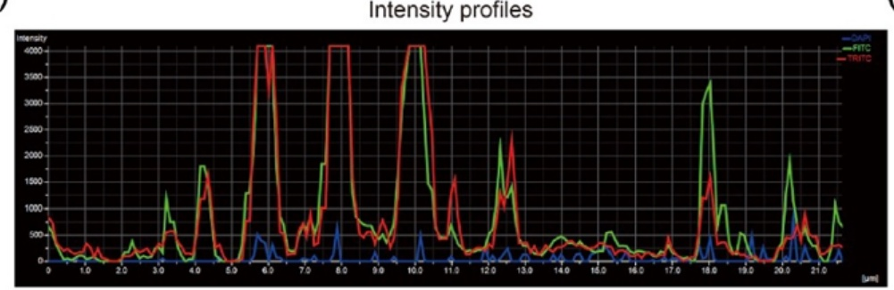

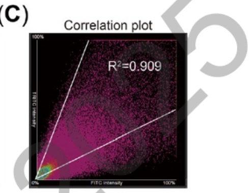

图 20、探针 LD-probe 脂滴靶向性成像。

滴靶向性

(A)

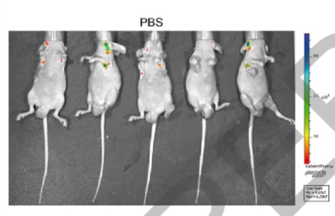

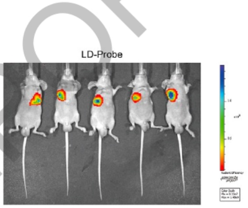

(B)

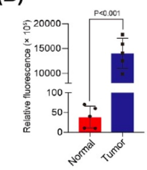

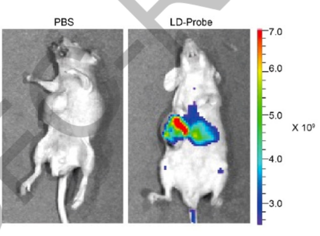

(E)

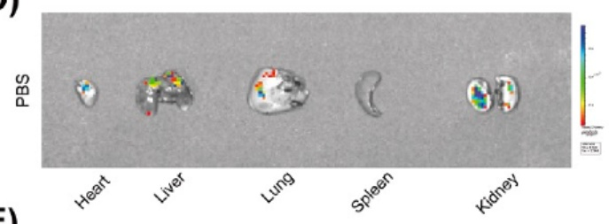

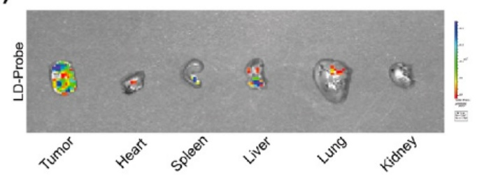

图 21、探针LD-probe 对小鼠肺癌皮下肿瘤的靶向成像。

A-B. 在A549肿瘤模型中，瘤内注射探针和PBS组的荧光强度和统计图；C. 通过尾静脉注射探针和PBS，具有良好的肿瘤靶向性；D-E.尾静脉注射探针和PBS后，分别取出组织后进行体外成像。

为了研究不同进展快慢肺癌中标志物的差异，我们对 5例 SN-ADC 和6例GGN-ADC样本中精确分离的恶性组织区域进行蛋白质组学分析。研究发现SN-ADC组织中与脂滴（LDs）相关的蛋白PLIN2显著上调，同时LDs积累明显增加。基于此，我们研发了一种新型双光子近红外特异性脂滴靶向荧光探针，该探针可用于区分肿瘤组织与正常组织间LDs的不同表达，并揭示早期 SN-ADC与GGN-ADC之间LDs的显著差异（如图20-22）。该研究为早期肺癌诊断提供了一种快速有效工具，具备潜在临床应用价值。

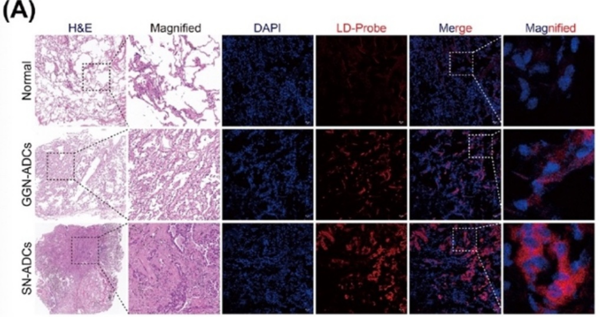

(B)

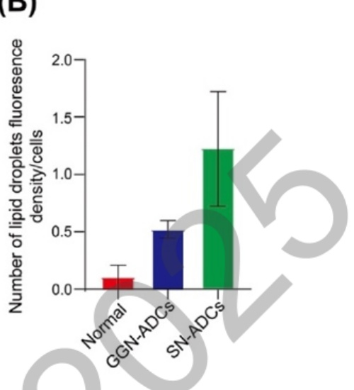

图 22、探针LD-probe 对正常肺组织、实性结节肺癌组织、磨玻璃结节肺癌组织染色成像。

## 4）构建肺癌快速演进智能预测模型

针对肺结节检出率高、难定性的问题，团队基于四川大学华西医院及其医联体12万例受试者，纳入肺结节人群5.9万例 创新中国肺结节报告和数据系统(Chinese Lung Nodules Reporting and Data System, C-Lung-RADS)，智能评估肺结节的恶性风险等级（低危、中危、高危、极高危），并给出不同风险等级肺结节管理建议。具体而言，C-Lung-RADS采用数据驱动的模式，以阶梯式、多模态方式自动评估肺结节。在第一阶段，C-Lung-RADS 通过影像大数据将肺结节进行初步分级，将其分成低、中、高、极高危四个等级。第二阶段，C-Lung-RADS运用深度卷积神经网络DCNN生成图像级别的恶性概率。第三阶段，结合影像、临床以及随访数据等多模态数据，开发多维度的梯度提升回归GBR模型来全面评估结节的良恶性，并给出个性化管理建议。在内部测试集中，多维度模型（影像+临床+随访）的AUC为0.918（95%置信区间[CI]:0.917-0.919），高于双维度模型（影像+临床，AUC0.882，95%CI:0.881-0.883）和单维度模型（影像，AUC 0.881，95%CI:0.880-0.882）。在独立验证集中多模态模型的诊断效能也是最佳（AUC 0.927，95% CI: 0.926-0.928）。

C-Lung-RADS 系统整合了第一阶段决策树的初步分级、第二阶段 DCNN模型和GBR模型输出的恶性概率，综合评估肺结节风险分级，并提供相应的随访及决策建议。在内部测试集中，C-Lung-RADS诊断恶性肺结节的灵敏度为79.9%，明显高于 Lung-RADS 的 60.3%。同样在独立测试集中，C-Lung-RADS 鉴别恶性肺结节的灵敏度为87.1%，优于Lung-RADS 63.3%。证实肺癌筛查场景中，C-Lung-RADS 较 Lung-RADS 更适用于中国人群肺结节的风险分层（如图 23）。根据现行指南、专家共识和医生临床经验，C-Lung-RADS建议对低危结节进行年度LDCT随访；对中危和高危结节分别进行6个月和3个月CT随访；对于极高危结节，建议进行多学科讨论并立即临床干预。

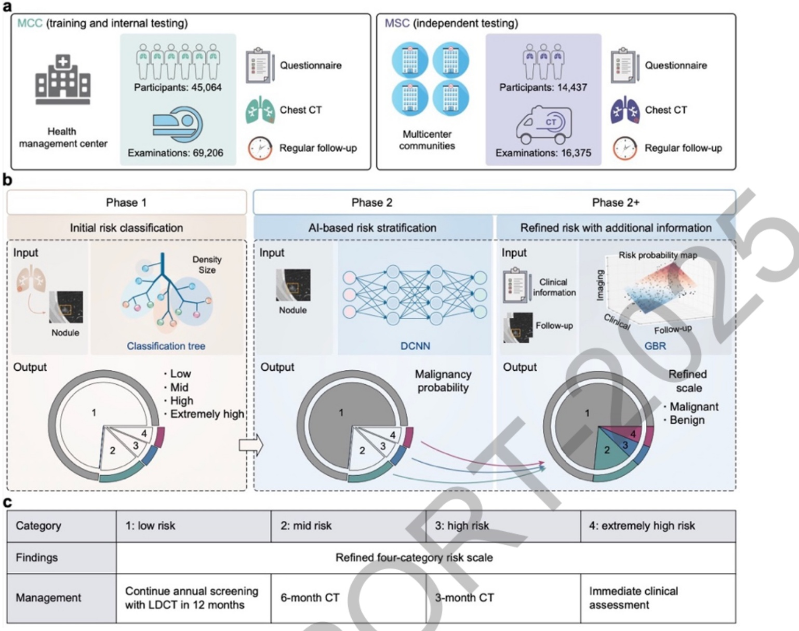

图 23、C-Lung-RADS 肺结节风险分级及精准管理策略。

鉴于单一影像数据建立的AI模型诊断效能低的难点，首次在影像特征上增加临床信息、检验数据，创建基于Transformer的多模态融合智能诊断技术，通过自注意力机制捕获每种数据模态的特定信息特征和全局依赖关系，克服模态之间的差异和异构性，破解了人工智能肺癌诊断模型开发的技术难点。医工结合开发了肺癌AI辅助诊断系统，获首个肺癌AI诊断三类医疗器械注册证(如图24)。该产品在168家医院推广应用，提高了肺癌早筛早诊可及性与同质化。

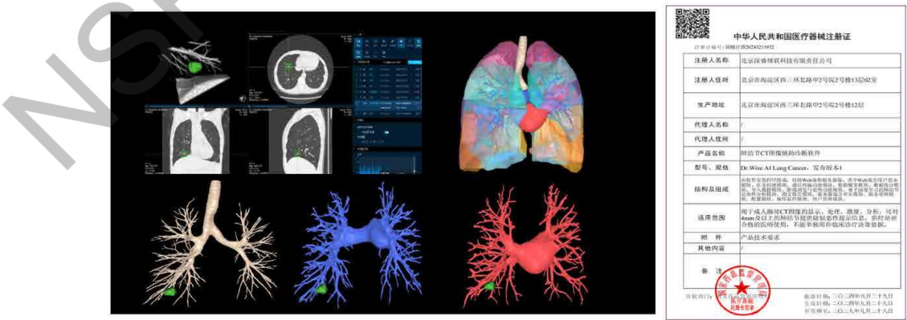

图24、研发了肺癌人工智能辅助诊断产品。

最后，为构建无创预测工具，本研究分别建立了临床模型、影像组学模型和深度学习模型，以区分良性/稳定结节、缓慢进展型与快速进展型肺癌。深度学习模型表现最佳，在验证集中AUC达0.830，敏感性0.658，特异性0.839。融合临床信息可提升人工智能模型效能。针对≤1cm小结节，深度学习模型展现出与高年资医生相当的预测能力，准确性高达90%，具有重要临床转化潜力（如图25）。综上，本研究明确了快速进展型肺癌独特的临床病理、分子及肿瘤微环境特征，并成功构建了高效的无创预测模型，尤其为小结节的精准风险分层提供了有力工具。

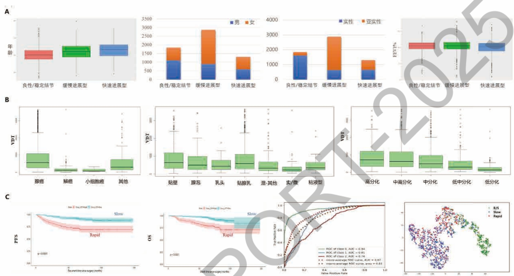

图25、基于回顾性肺癌随访队列，分析快速进展型肺癌临床特征并建立无创预测模型。

A.人口学特征；B.病理特征；C.预后及预测模型建立

## 3. 研究人员的合作与分工。

本项目采用多学科交叉协作模式，各团队分工明确、协同高效，共同推进分子探针研发与系统验证工作。项目总负责人李为民教授统筹整体实施与临床研究方案设计。基础研究团队张立、汪周峰等负责临床样本的多组学分析、关键靶点筛选及其在细胞与动物模型中的机制验证。药物化学团队邓慧等专注于探针分子的结构设计、优化与化学合成。核医学团队白平等建立了稳定的放射性核素标记工艺，并完成探针的质量控制。影像医学团队陈勃江、王成弟等主导CT影像的重建、处理与深度数据分析。病理与临床研究团队张忆、张瑞、杨澜、王浩宇等负责临床样本收集、病理切片制备与染色评估。各团队通过定期学术交流与数据共享平台紧密协作，形成“靶点发现-探针设计-合成标记-体内外验证-多模态数据分析”全链条研究体系，有力保障了研究目标的系统实现。

## 4. 国内外学术合作交流等情况。

本项目在实施期间积极开展多层次、高水平的国内外学术合作与交流，有效

促进了研究思路的国际化与成果的传播。

在国际合作方面，团队与美国麻省总医院（MGH）Martinos生物医学成像中心建立了稳定的学术交流机制，围绕分子影像前沿技术、探针研发与临床转化等主题开展定期研讨，及时吸纳国际先进理念，提升了研究的创新性与前瞻性。

在学术交流方面，团队通过“请进来”与“走出去”相结合的方式:（1）主办国际会议:项目负责人李为民教授作为大会主席，成功牵头举办了三届“成都/华西精准医学国际学术论坛”，为领域内学者搭建了高水平的交流平台；（2）参与重要会议:团队成员多次参加美国胸科学会（ATS）年会、欧洲呼吸学会（ERS）年会、美国核医学与分子影像学会（SNMMI）年会等本领域顶级国际会议，李为民教授、汪周峰、王浩宇等人在会上与国际同行进行了深入交流与讨论。

项目依托研究平台招收并培养国际留学生1名，推动了科研经验的国际传播与青年人才的跨文化培养。

## 5. 存在的问题、建议及其他需要说明的情况。

## （1）关键分子探针的临床转化路径尚需完善。

本研究成功开发了系列高亲和力、高特异性的分子探针，并在临床前模型中验证了其优异的成像性能。然而，从实验室成果走向临床应用仍存在关键障碍。目前，大部分探针尚未完成系统的临床前GLP（优良实验室规范）毒理学评价及人体药代动力学研究，其长期生物安全性、最佳给药剂量与成像时间窗尚不明确。后续将开展规范的临床前安全评价，并在此基础上设计探索性研究者发起临床试验（IT），以评估其在人体内的安全性、药代动力学特征及初步诊断效能，加速其向临床诊断工具的转化。

## (2)人工智能模型的普适性与标准化面临挑战。

本项目构建的C-Lung-RADS系统及多模态融合预测模型在内部及国内多中心验证中表现出色，但其泛化能力在不同地域、不同人群、不同CT扫描设备与协议下的表现仍需进一步验证。下一步应牵头组织全国多中心前瞻性验证研究，建立标准化的影像采集与预处理流程。

## （3）多组学标志物的临床落地应用存在整合瓶颈。

研究发现了多个与肺癌快速演进相关的基因组、转录组及表观遗传组标志物(ctDNA甲基化等)。然而，将这些发现转化为适用于临床的、经济高效的检测产品仍面临挑战。如何将多组学信息整合成简易的检测套餐，并确定其在现有诊疗路径（如与影像、病理结合）中的最佳介入点和临床价值，仍需深入探索。未来将核心分子标志物转化为IVD（体外诊断）试剂盒，并开展大规模、前瞻性的卫生经济学研究。

## （二）成果部分

## 1. 项目取得成果的总体情况。

本项目围绕“肺癌快速演进的关键分子功能可视化及智能诊断策略研究”总体目标，通过多学科交叉协作与系统攻关，在基础机制探索、关键技术研发、临床模型构建及成果转化应用等方面取得了一系列重要进展与创新性成果，全面完成了预定研究任务，形成了从“机制发现一工具研发一模型构建一临床验证”的完整研究体系。

在基础研究层面，项目成功构建了大规模、高质量的肺结节临床研究队列，解析了肺癌快速演进的临床病理与分子特征。通过整合单细胞转录组、空间转录组、蛋白质组等多组学技术，首次揭示了SLPI+AT2样细胞、SPP1+增殖性巨噬细胞等关键细胞亚群在肺癌侵袭、免疫微环境重塑及早期复发中的核心作用，并明确了PRAME、CD74等关键分子的功能机制，为肺癌演进提供了新的生物学见解与治疗靶点。

在技术研发方面，项目针对肺癌关键驱动基因（EGFR、KRAS等）及代谢异常标志物（G6PD、脂滴等)，成功设计并合成了系列高特异性、高亲和力的分子探针（包括荧光探针与PET探针），实现了对肺癌关键分子功能与微环境特征的实时、在体可视化监测。所研发的探针在细胞、动物模型及临床样本中均表现出良好的靶向性、稳定性与信噪比，为肺癌的分子分型、疗效预测及术中导航提供了新型工具。

在智能诊断体系构建方面，项目基于超12万例多中心队列数据，创新研发了中国肺结节恶性风险智能分级系统(C-Lung-RADS)，该系统融合影像、临床、病理及分子多维数据，采用阶梯式分级与多模态人工智能融合策略，其敏感性显著优于国际标准Lung-RADS（87.1% vs 63.3%)。同时，构建了融合深度学习与影像组学的肺癌快速演进无创预测模型，对≤1cm肺小结节的良恶性判别准确率达90%，实现了肺癌早期风险精准分层与个体化管理。

在成果产出与转化方面，项目共发表高水平学术论文36篇，其中IF>10的论文 20篇，包括 Nat Med、Nat Commun、Adv Sci 等国际权威期刊；申请/授权国家发明专利12项，涵盖分子探针、检测试剂盒、人工智能系统等多个方向；研发的“肺癌AI辅助诊断系统”获国家Ⅲ类医疗器械注册证，并在全国168家医院推广应用，服务超百万人次，实现了科研成果向临床服务的有效转化。

在人才培养与团队建设方面，项目培养博士研究生3名，1人入选国家“万人计划”青年拔尖人才，2人入选省级人才计划，形成了一支多学科交叉、创新能力突出的研究团队。项目负责人获国家杰出医师称号，团队多次在ATS、ERS、SNMMI等国际权威学术会议作报告，提升了我国在肺癌分子影像与智能诊断领域的学术影响力。

综上，本项目不仅在肺癌快速演进机制研究方面取得重要理论突破，更在分子探针、智能诊断系统等关键技术研发与转化方面实现显著进展，为肺癌早期精准诊疗提供了系统的科学依据、技术工具和临床路径，具有重要的科学价值与社会意义。

## 2. 项目成果转化及应用情况。

本项目围绕肺癌早期精准诊疗的核心目标，成功将基础研究发现转化为具有明确应用前景的技术、标准和产品，形成了“核心专利-行业标准-医疗器械”的立体化成果转化体系，社会效益与转化潜力显著。

## （1）形成具有自主知识产权的核心技术

项目围绕关键靶点发现、分子探针、诊断模型与检测方法进行全方位知识产权布局，共申请/授权国家发明专利12项，构筑了核心技术壁垒。这些专利涵盖多个关键方向: 2

诊断检测技术:包括靶向EGFR等基因的数字PCR检测试剂盒(ZL202211548410.0)、基于外周血ctDNA甲基化的检测方法(ZL202411240526.7)及肺部疾病智能分类系统（ZL202411700874.8)，为液体活检和影像智能诊断提供了工具。

新型分子探针: 成功研发了靶向EGFR突变体的小分子抑制剂（ZL202411657091.0) 用于肿瘤微环境可视化监测的双响应荧光探针（ZL202210513912.3）及肺纤维化检测探针（ZL202210903926.6），为分子影像和术中导航奠定了基础。

新型药物递送与治疗系统:开发了光动力-靶向-基因联合治疗系统（ZL202210384759.9）及核苷类抗肿瘤药物（ZL202210783673.3），拓展了治疗研究的新路径。

## （2）创建并推广中国版肺结节智能分级标准

V 针对中国人群体质与流行病学特征，项目创新性地研发了“C-Lung-RADS” (中国版肺结节恶性风险分级标准)。该标准深度融合影像组学与临床参数，采用阶梯式分级管理策略（如低风险年度随访、高风险3月复查或诊断性治疗），其敏感性（87.1%）显著优于国际标准Lung-RADS（63.3%）。该标准已在国内多家医院进行试点应用，为肺结节的规范化、个体化管理提供了“中国方案”，有效优化了医疗资源配置。

## (3）研发并获批首个人工智能辅助诊断系统，实现大规模临床推广

基于项目积累的深度学习算法与多中心数据，团队研发的“肺癌AI辅助诊断系统”成功获批国家Ⅲ类医疗器械注册证，成为国内该领域首个获证产品。该系统可自动检测肺结节、进行良恶性风险分层及肺癌早期筛查，目前已推广至全国168家医院，并集成于“车载CT”等移动筛查平台。该系统的应用显著提升了基层医院的肺癌早诊能力，实现了科研成果向普惠医疗服务的有效转化。

## 3. 人才培养情况。

依托本项目，课题组培养了一批具备放射性药物化学、肿瘤生物学及分子影像学交叉学科背景的青年科研人才。多名研究生直接参与了探针设计、合成及生物学评价的全过程，掌握了放射性药物研发的关键技术

（1）研究生培养:依托本项目，主要参与人张瑞、杨澜、王浩宇分别于2022年6月、2022年6月、2025年6月博士研究生毕业。

(2）青年人才培养:项目主要参与人王成弟于2023年获国家“万人计划”青年拔尖人才称号；汪周峰于2023年获批四川省学术和技术带头人后备人选；张瑞和杨澜2022年博士毕业留华西医院参加工作。

（3.）高端人才孵化:项目负责人李为民于2024年12月获国家杰出医师称号。

## 4. 其他需要说明的成果。

本项目还在科研范式创新、平台建设及社会影响层面取得了一系列重要成果，具体说明如下:

## (1）建立了“临床队列-多组学发现-探针开发-智能模型-临床验证”技术链条

本项目成功实践并验证了一条从真实世界临床问题出发，贯通基础研究、技术开发与临床应用的完整创新路径。这一范式不仅高效地产出了具有原创性与临床价值的科研成果，更重要的是为肿瘤研究，特别是分子功能可视化领域，提供了一个可复制、可推广的系统性研究框架，具有重要的方法论意义。

## （2）建成了国际先进、国内领先的肺癌研究综合资源平台

项目执行期间，系统性地构建并完善了包含大规模临床前瞻性队列、高质量组织样本库、多组学数据库及高分辨率影像数据库在内的综合性科研资源平台。该平台不仅有力支撑了本项目的研究，未来还将作为开放共享的基础设施，持续为肺癌的机制研究、新靶点发现及诊断技术创新提供关键资源，具有长远价值。

## (3）组建了具有国际影响力的高水平学团队

通过持续举办高规格国际学术会议、在国际顶级期刊上发表系列论文，项目团队在肺癌分子影像与智能诊断领域建立了显著的学术声誉。项目负责人及核心成员多次在国际权威学术组织年会（如ATS、ERS、SNMMI）上作特邀报告，主导了相关议题的国际讨论，提升了我国在该领域的学术话语权与影响力。

## （4）推动了肺癌早期诊疗理念的创新与临床实践优化

项目成果，特别是 C-Lung-RADS 标准和 AI辅助诊断系统的推广应用，正在实质性地改变我国肺结节的临床管理路径。其倡导的基于精准风险的个体化、阶梯式管理理念，促进了临床医生诊疗行为的规范化，推动了医疗资源从“普筛”向“精查”的优化配置，产生了广泛而积极的行业影响。

## 5. 项目成果科普性介绍或展示网站。

（1）中国科学报报道:肺结节风险分级有了中国方案’。发布时间:2024年9月26 日。

# 肺结节风险分级有了“中国方案”

本报记者张思玮

肺癌是全球公认的“头号癌症杀手”。根据国家癌症中心与国际癌症研究机构(IARC)联合发布的《2022年中国恶性肿瘤疾病负担数据》，中国2022年最新肺癌发病例数为106.06万、死亡例数达73.3万，发病人数与死亡人数均居各类癌症首位。

早期肺癌多无明显症状，临床上多数患者出现症状就诊时已属晚期。国际肺癌研究协会(IASLC)最新研究成果表明，早期肺癌的5年生存率达82%，而晚期肺癌的5年生存率仅为7%。因此，肺结节的早期精准诊断对于识别肺癌高危人群、开展早诊早治、改善预后尤为关键。

近日，《自然-医学》在线发表了四川大学华西医院与联影智能、上海科技大学合作完成的肺结节分级科研成果。他们提出的适合中国人群的肺结节风险分级系统C-Lung-RADS，可以全视角评估肺结节风险等级，赋能医生精准筛查可疑恶性结节，为肺结节的个性化管理提供了切实有效的参考依据，从面实现对早期肺癌的有效筛查。

## 中国人群肺结节风险分级系统缺乏

多年来，国内外一直致力于通过筛查实现肺癌的早诊早治，降低肺癌相关死亡率。

2011年，美国国家肺癌筛查试验的随机对照研究结果显示，与X线检查相比，采用低剂量螺旋CT(LDCT)对肺癌高危人群进行筛查可使肺癌死亡率下降20%。随后，欧美多个医学组织的肺癌筛查指南均推荐在高危人群中采用LD-CT进行肺癌筛查。

近年来，我国越来越多的医疗机构开始开展LDCT肺癌筛查工作。但与西方国家相比，我国的肺癌发病危险因素更为复杂，除吸烟外，在二手烟、环境油烟等综合因素的影响下，我国女性非吸烟人群发生肺癌的比例远高于西方人群。因此，在肺癌筛查的具体实践中必须考虑东西方人群差异、既往病史等。

此外，现有风险分级系统主要依赖人工评估，费时费力，且目前国际通行的由美国放射学会发布的肺部影像报告和数据系统(Lung-RADS)缺乏聚焦中国人群的验证和优化. 在临床中常出现不适配患者真实病情的情况。

“比如临床常见直径在5毫米至10毫米的小结节管理就存在难点。大多数此类结节是良性的，但患者通常会因为焦患、恐慌而要求进一步检查，这可能导致过度诊疗。另外，临床医生大多凭借既往经验诊断肺结节，诊断精准度因人而异。如果医生对小结节的良恶性判断不精准，会出现错诊、开展不必要的外科手术等问题，致使患者错过最佳诊疗时间。”因此，论文通讯作者、四川大学华西医院教授李为民表示，亟须建立适合中国人群的肺结节风险分级系统，让患者就诊更放心、医生诊断更有信心。

## 精准识别肺结节的良恶性风险

为了解决上述问题，华西医院与联影智能深度合作，纳入12万中国人的肺部影像数据，并将影像学数据、临床病历信息以及随访期间的结节变化情况等多维度信息进行整合分析，创新研发出适合中国人群的肺结节恶性风险分级系统C-Lung-RADS,以更全面的视角评估肺结节恶性风险等级，提升诊断的准确性和可靠性。

论文通讯作者、四川大学华西医院研究员王成弟介绍，C-Lung-RADS 采用数据驱动模式，以分阶段、多模态方式自动分类、评估肺结节，并给出管理不同风险等级肺结节的建议。

具体而言，在第一阶段，C-Lung-RADS通过影像大数据将肺结节进行自动分级，将其分成低、中、高、极高危4个等级；第二阶段运用深度卷积神经网络生成图像级别的恶性概率，融合影像、临床等信息，精确诊断高危肺结节；第三阶段，进一步纳入随访结果，开发多维度的梯度提升回归模型，全面评估结节的良恶性，并给出个性化管理建议。

“经过数据验证，我们发现C-Lung-RADS在敏感性等多项指标上优于国际标准。例如，C-Lung-RADS 鉴别高危肺结节的灵敏度为

87.1%，优于Lung-RADS的 63.3%，能够帮助医生更精准地识别高危肺结节，减少漏诊情况发生。”此外，王成弟介绍，C-Lung-RADS可融合影像、临床、随访数据，建立多模态融合模型，精准诊断极高危肺结节，实现早期肺癌的精准诊断，为肺结节的个性化管理提供切实有效的参考依据。

## 助力基层地区肺癌早筛工作

据不完全统计，目前全国三甲医院日均接待肺结节检查患者至少几百名，每位患者常规产生200幅到300幅影像图片，且影像图片数量年增长率为30%，导致肺结节影像诊断任务重，容易漏诊和误诊。

基于此，C-Lung-RADS肺结节智能筛查和报告系统实现自动输出结节类型并进行量化分析和风险分级，在帮助医生减轻日常工作负担的同时进一步提高诊断准确性。

考虑到边远、欠发达地区缺乏医疗设备，大范围开展早筛难免力不从心，研究团队还自主开发了智慧健康管理移动车，将C-Lung-RADS肺结节智能筛查和报告系统搭载其中，凭借移动化优势，最大限度地突破地域限制，将智能化筛查技术送往千家万户，让基层民众不用来回奔波就能获得优质医疗服务，促进基层地区肺癌筛查水平的跨越式提升。

据王成弟介绍，自2022年起，该智慧健康管理移动车已“驶入”四川广安、绵竹等地，为3万多名群众提供肺癌筛查，发现了100多例早期肺癌患者。

李为民表示，C-Lung-RADS在数据源头上具有“中国特色”，为医生提供了更专业、更适合国人的肺结节精准诊断与评估“中国方案”，具有很高的科学性和针对性，是我国重大疾病诊断标准本土化的一次突破。依托人工智能辅助诊断技术，C-Lung-RADS有望在全国范围内普及肺癌精准早筛早诊，优化医疗资源配置。

相关论文信息:

https://doi.org/10.1038/s41591-024-03211-3

## 研究成果目录

项目负责人通过系统，从文献库中检索研究成果或者按要求格式自行填入。请按照期刊论文、会议论文、学术专著、专利、会议报告、标准、软件著作权、科研奖励、人才培养、成果转化的顺序列出，其它重要研究成果如标本库、科研仪器设备、共享数据库、获得领导人批示的重要报告或建议等，应重点说明研究成果的主要内容、学术贡献及应用前景等。

项目负责人不得将非本人或非参与者所取得的研究成果、与受资助项目无关的研究成果、未标注国家自然科学基金资助和项目批准号的论文以及取得时间早于项目资助期开始时间的研究成果列入报告中。发表的研究成果（包括专利），项目负责人和参与者均应如实注明得到国家自然科学基金项目资助和项目批准号，科学基金作为主要资助渠道或者发挥主要资助作用的，应当将自然科学基金作为第一顺序进行标注。

## 期刊论文

(1) CD Wang; J Shao; YC He; JJ Wu; XT Liu; LQ Yang; Y Wei; XS Zhou; YQ Zhan; F Shi; DG Shen; WM Li; Data-driven risk stratification and precision management of pulmonary nodules detected on chest computed tomography, Nature Medicine, 2024, 30(11). 第一标注

(2) Chengdi Wang; Qiuxiao Yu; Tingting Song; Zhoufeng Wang; Lujia Song; Ying Yang; Jun Shao; Jingwei Li; Yinyun Ni; Ningning Chao; Li Zhang; Weimin Li; The heterogeneous immune landscape between lung adenocarcinoma and squamous carcinoma revealed by single-cell RNA sequencing, Signal Transduction and Targeted Therapy, 2022, 7(1). 第一标注 1

(3) Hui Deng; Qian Lei; Chengdi Wang; Zhoufeng Wang; Hai Chen; Gang Wang; Na Yang; Dan Huang; Quanwei Yu; Mengling Yao; Xue Xiao; Guonian Zhu; Cheng Cheng; Yangqian Li; Feng Li; Panwen Tian; Weimin Li; A fluorogenic probe for predicting treatment response in non-small cell lung cancer with EGFR-activating mutations, Nature Communications, 2022, 13(1). 第一标注

(4) Chengdi Wang; Wenrong Liu; Shuangyan Tan; Jiankang Zhou; Xiaomin Xu; Yue Ming; Jian Cheng; Jiao Li; Zhen Zeng; Yuanli Zuo; Juan He; Yong Peng; Weimin Li; Characterization of distinct circular RNA signatures in solid tumors., Mol Cancer, 2022, 21(1). 第一标注

(5) Luo, Wenxin; Zeng, Zhen; Jin, Yang; Yang, Lan; Fan, Ting; Wang, Zhoufeng; Pan, Yitong; Yang, Ying; Yao, Menglin; Li, Yangqian; Xiao, Xue; Wang, Gang; Wang, Chengdi; Chang, Shuai; Che, Guowei; Zhang, Li; Li, Yalun; Peng, Yong; Li, Weimin; Distinct immune microenvironment of lung adenocarcinoma in never-smokers from smokers, C ELL REPORTS MEDICINE, 2023, 4(6):101078. 第一标注

(6) Li, Jingwei; Zhang, Qiran; Jiang, Decheng; Shao, Jun; Li, Weimin; Wang, Chengdi; CircRNAs in lung cancer- role and clinical application, CANCER LETTERS, 2022, 544(/): 215810. 第一标注

(7) Wang, Denian; Wu, Pengfei; Yang, Zhi; Yu, Chunyan; Li, Qingyan; Zhang, Rui; Yang, Ying; Liu, Yanyan; Zhang, Wengeng; Zhou, Xinglong; Zhu, Daxing; Zhan, Zixuan; Li, Weimin; Accurate diagnosis of early-stage lung cancer by targeting lipid droplets with a two-photon near-infrared fluorescence probe, Sensors and Actuators B-chemical，2025，426. 第一标注

(8) Hongyu Zhou; Yizhou Yu; Chengdi Wang; Shu Zhang; Yuanxu Gao; Jia Pan; Jun Shao; Guangming Lu; Kang Zhang; Weimin Li; A transformer-based representation-learning model with unified processing of multimodal input for clinical diagnostics, Nat Biomed Eng, 2023, 7(6). 第二标注

(9) Wang, Chengdi; Li, Jingwei; Chen, Jingyao; Wang, Zhoufeng; Zhu, Guonian; Song, Lujia; Wu, Jiayang; Li, Changshu; Qiu, Rong; Chen, Xuelan; Zhang, Li; Li, Weimin; Multi-omics analyses reveal biological and clinical insights in recurrent stage I non-small cell lung cancer, Nature Communications, 2025, 16(1). 第二标注

(10) Yifei Lin; Lei Chen; Jin Huang; Weimin Li; Breadth versus depth: balancing variables, sample size, and quality in Chinese cohort studies, the BMJ, 2025, 无(391). SCIE. 第三标注

(11) Wang, Zhoufeng; Zhu, Guonian; Tang, Pan; Wang, Yan; Luo, Wenxin; Song, Wenpeng; Pan, Zhikang; Zheng, Bingjie; Jiang, Yongchao; Xiao, Defu; Jin, Xin; Bai, Yong; Che, Guowei; Li, Weimin; SLPI+ AT2-Like Cells

Orchestrate Lung Adenocarcinoma Invasion via Wnt Pathway Activation and Stromal Crosstalk in a Spatially Defined Margin Niche, Advanced Science, 2025, /(/). 第四标注

(12) Qin, Na; Wang, Zhoufeng; Xu, Xianfeng; Xie, Yuan; Chen, Yingjia; Luo, Wenxin; Tang, Pan; Wang, Xin; Bi, Lingfeng; Gong, Linnan; Li, Zhe; Chen, Congcong; Wang, Kai; Guo, Songwei; Zhao, Zihuan; Xiang, Jun; Zhu, Meng; Jiang, Yue; He, Yuanlin; Dai, Juncheng; Yin, Rong; Wang, Cheng; Hu, Zhibin; Ma, Hongxia; Li, Weimin; Shen, Hongbing; Comprehensive Characterization of Somatic Mutation Timing Reveals the Evolutionary Trajectory of Lung Adenocarcinoma in Chinese Patients, Cancer Research, 2025, 85(15): 2905-2920. 第四标注

(13) Liu, Li; Fu, Shengxiang; Gu, Haojie; Li, Yangqian; Zhu, Guonian; Ai, Hua; Li, Weimin; Platinum(IV)-Backboned Polymer Prodrug-Functionalized Manganese Oxide Nanoparticles for Enhanced Lung Cancer Chemoimmunotherapy via Amplifying Stimulator of Interferon Genes Activation, Acs Nano, 2025, 19(2):2726-2741. 第三标注

(14) Jun Shao; Jiechao Ma; Qin Zhang; Weimin Li; Chengdi Wang; Predicting gene mutation status via artificial intelligence technologies based on multimodal data integration to advance precision oncology, Seminar s in Cancer Biology, 2023, /(/): 1-15. 第二标注

(15) Wang, Chengdi; Ma, Jiechao; Zhang, Shu; Shao, Jun; Wang, Yanyan; Zhou, Hong-Yu; Song, Lujia; Zheng, Jie; Yu, Yizhou; Li, Weimin; Development and validation of an abnormality-derived deep-learning diagnostic system for major respiratory diseases, NPJ DIGITAL MEDICINE, 2022, 5(1): 124. 第二标注

(16) Li, Yalun; Ji, Liyan; Zhang, Yingqian; Zhang, Jiexin; Reuben, Alexandre; Zeng, Hao; Huang, Qin; Wei, Qi; Tan, Sihan; Xia, Xuefeng; Li, Weimin; Zhang, Jianjun; Tian, Panwen; The combination of tumor mutational burden and T-cell receptor repertoire predicts the response to immunotherapy in patients with advanced non-small ce11 1ung cancer, MEDCOMM, 2024, 5(6). 第二标注

(17) Lingfeng Bi; Xin Wang; Jiayi Li; Weimin Li; Zhoufeng Wang; Epigenetic modifications in early stage lung cancer: pathogenesis, biomarkers, and early diagnosis, MedComm, 2025, 6(3). 第二标注

(18) Li JM; Liu YX; Dai J; Yang L; Xiong F; Xia J; Jin J; Wu YP; Peng XC; mRNA Vaccines: Current Applications and Future Directions, MedComm, 2025, 6(11). SSCI. 第六标注

(19) Y. Li; H. Zeng; C. Qi; S. Tan; Q. Huang; X. Pu; W. Li; D. Planchard; P. Tian; Features and efficacy of triple-targeted therapy for patients with EGFR-mutant non-small-cell lung cancer with acquired BRAF alterations who are resistant to epidermal growth factor receptor tyrosine kinase inhibitors, ESMO 0pen, 2024, 9(10):103935. 第二标注 ▲

(20) Zhan, Zixuan; Wei, Zeliang; Ying, Binwu; Chai, Li; Yu, Quanwei; Yu, Xiuxian; Zhou, Li; Wan, Chengyu; Li, Fan; Huang, Jin; Chen, Piaopiao; Huang, Wen; Li, Weimin; A near-infrared fluorescent probe for visualizing viscosity fluxes in live cells and idiopathic pulmonary fibrosis, SENSORS AND ACTUATORS B-CHEMICAL, 2022, 371(/). 第二标注

(21) Wang, Haoyu; Wang, Yan; Yang, Ruiyuan; Liu, Dan; Li, Weimin; Risk of second primary lung cancer in patients with thyroid cancer: a meta-analysis based on big population studies, CHINESE MEDICAL JOURNAL, 2023, 136(13):1532-1538. 第一标注

(22) Wang, Chengdi; Shao, Jun; Song, Lujia; Ren, Pengwei; Liu, Dan; Li, Weimin; Persistent increase and improved survival of stage I lung cancer based on a large-scale real-world sample of 26,226 cases, CHINESE MEDICAL JOURNAL，2023，136(16):1937-1948. 第一标注

(23) Wang, Denian; Li, Sixiang; Yang, Zhi; Yu, Chunyan; Wu, Pengfei; Yang, Ying; Zhang, Rui; Li, Qingyan; Yang, Jian; Li, Hongchun; Ji, Guiyi; Wang, Yan; Xie, Kang; Liu, Yanyan; Wang, Kaige; Zhu, Daxing; Zhang, Wengeng; Liu, Dan; Chen, Bojiang; Li, Weimin; Single-cel1 transcriptome analysis deciphers the CD74-mediated immune evasion and tumour growth in lung squamous cell carcinoma with chronic obstructive pulmonary disease, CLI NICAL AND TRANSLATIONAL MEDICINE, 2024, 14(8). 第二标注

(24) Zhan, Zixuan; Lei, Qian; Dai, Yongcheng; Wang, Denian; Yu, Quanwei; Lv, Yi; Li, Weimin; Simultaneous Monitoring of HOCl and Viscosity with Drug-Induced Pyroptosis in Live Cells and Acute Lung Injury, ANALYTICAL CHEMISTRY, 2022， 94(35):12144-12151. 第二标注 1

(25) Deng, Xuemei; Wang, Yuying; Yang, Xiongqi; Yu, Quanwei; Huang, Ridong; Chen, Hai; Li, Weimin; He, Yang; Synthesis, Structural Modification, and Antismall Cell Lung Cancer Activity of 3-Arylisoquinolines with Dual Inhibitory Activity on Topoisomerase I and II, Journal of Medicinal Chemistry, 2025, 68(3): 3518-3546. 第二标注

(26) Xin Wang; Yanmei Chen; Chengcheng Ma; Lingfeng Bi; Zhixi Su; Weimin Li; Zhoufeng Wang; Current advances and future prospects of blood-based techniques for identifying benign and malignant pulmonary nodules, Critical Reviews in Oncology/Hematology, 2025, 207(/): 104608. 第二标注

(27) Zhoufeng Wang; Kehui Xie; Guonian Zhu; Chengcheng Ma; Cheng Cheng; Yangqian Li; Xue Xiao; Chengpin Li; Jun Tang; Hui Wang; Zhixi Su; Dan Liu; Wengeng Zhang; Yan Huang; Huairong Tang; Rui Liu; Weimin Li; Early detection and stratification of lung cancer aided by a cost-effective assay targeting circulating tumor DNA (ctDNA) methylation, Respiratory Research, 2023, 24(1). 第四标注

(28) Li, Guo; Chen, Lu; Bai, Hua; Zhang, Li; Wang, Jie; Li, Weimin; Depletion of squalene epoxidase in synergy with glutathione peroxidase 4 inhibitor RSL3 overcomes oxidative stress resistance in lung squamous cell carcinoma, PRECISION CLINICAL MEDICINE, 2024, 7(2). 第一标注

(29) Ji, Guiyi; Luo, Wenxin; Zhu, Yuan; Chen, Bojiang; Wang, Miye; Jiang, Lili; Yang, Ming; Song, Weiwei; Yao, Peiji; Zheng, Tao; Yu, He; Zhang, Rui; Wang, Chengdi; Ding, Renxin; Zhuo, Xuejun; Chen, Feng; Li, Jinnan; Tang, Xiaolong; Xian, Jinghong; Song, Tingting; Tang, Jun; Feng, Min; Shao, Jun; Li, Weimin; Early-stage lung cancer detection via thin-section low-dose CT reconstruction combined with AI in non-high risk populations: a large-scale real-world retrospective cohort study, Precision Clinical Medicine, 2025, 8(2). 第三标注

(30) Wang, Haoyu; Yang, Ruiyuan; Liu, Dan; Li, Weimin; Association of pretreatment neutrophil-to-lymphocyte ratio with clinical outcomes in cancer immunotherapy: An evidence synthesis from 30&lt;i&gt; meta&lt;/i&gt;-analyses, INTERN ATIONAL IMMUNOPHARMACOLOGY, 2024， 132. 第一标注 1

(31) Zhang, Chenyang; Shao, Jun; Tang, Xiaolong; Wu, Jiayang; Li, Peiyi; Li, Weimin; Wang, Chengdi; The real-world treatment characteristic and efficacy of immune checkpoint inhibitors in non-small cell lung cancer: Data from a retrospective cohort study, INTERNATIONAL IMMUNOPHARMACOLOGY, 2024, 134. 第一标注

(32) Cheng, Cheng; Zhu, Guonian; Li, Yangqian; Wang, Haoyu; Wang, Suyan; Li, Chengping; Feng, Jiaming; Wang, Zhoufeng; Li, Weimin; Single-cell transcriptome analysis reveals cellular and molecular alterations in small cel1 lung cancer tumors following chemotherapy, INTERNATIONAL JOURNAL OF CANCER, 2023, 153(6):1273-1286. 第一标注

(33) Chang Qi; Yalun Li; Hao Zeng; Qi Wei; Sihan Tan; Yuanyuan Zhang; Weimin Li; Panwen Tian; Current status and progress of PD-L1 detection: guiding immunotherapy for non-small cell lung cancer, Clinical and Experimental Medicine, 2024, 24(1).第二标注 1

(34) Zhang, Yuanyuan; Zeng, Hao; Qi, Chang; Tan, Sihan; Huang, Qin; Pu, Xin; Suda, Kenichi; Santarpia, Mariacarmela; Tian, Panwen; Li, Yalun; Efficacy of targeted therapy in patients with non-small cell lung cancer harboring very rare mutations in EGFR exon 18, TRANSLATIONAL LUNG CANCER RESEARCH, 2024, 13(4). 第二标注

(35) Lu, Wenting; Sun, Jiayi; Jing, Yawan; Xu, Jing; Huang, Chengming; Deng, Yi; Tian, Panwen; Li, Yalun; Combined Use of Gefitinib and Bevacizumab in Advanced Non-Small-Cell Lung Cancer with EGFR G719S/S768I Mutations and Acquired C797S Without T790M After Osimertinib: A Case Report and Literature Review, Current Oncology, 2025, 32(4). 第三标注

(36) Zhao, Maoyuan; Hou, Wang; Pu, Dan; Li, Zhixi; Tu, Li; Ow, Calista Jia Ling; Tian, Jie; Li, Weimin; Impact of Pulmonary microbiota on lung cancer treatment-related, JOURNAL OF CANCER, 2024, 15(14):4503-4512. 第一标注

(8) 詹梓炫；魏泽良；李为民；黄文；一种化合物在制备肺纤维化粘度响应性荧光探针中的应用，2023-07-24至2033-07-24，中国，ZL 2022 1 0903926.6.

专利

(1) 李为民；刘丹；周刚；瞿烨波；导管设备，2023-08-22至2033-08-22，中国，ZL 2022 1 0584853.9.

(2)李为民；肖凯；罗奎；龚启勇；黄金星；陈杰；一种光动力-小分子靶向-基因治疗联合用药系统及其制备方法，2023-12-08至2033-12-08，中国，ZL 2022 1 0384759.9.

(3) 李为民；刘磊；张立；NLN神经溶素在制备作为治疗肺癌药物的用途，2025-03-14至2035-03-14，中国，ZL 202311070241.9.

(4) 李为民；何杨；王玉英；马玲玲；黄日东；余权威；杨雄琪；陈海；一种靶向EGFR突变的二甲基氧膦取代的苯胺嘧啶衍生物、其制备方法、用途及其制成的药物，2025-03-11至2035-03-11，中国，ZL202411657007.0.

(5) 李为民；胡文闯；胡杰；张红英；唐源；陈冠男；杜昭；王刚；肺癌靶向治疗多基因多突变类型测序文库构建方法与试剂盒，2025-04-18至2035-04-18，中国，ZL202510136204.6.

(6) 柴莹莹；黄日东；陈海；余权威；李为民；何杨；一种银-核苷五元环络合物超分子水凝胶及其制备方法，2023-06-06至2033-06-06，中国，ZL 2022 1 0833716.4.

(7) 詹梓炫；徐莹；李为民；一种双重响应胞内粘度和次氯酸的荧光探针、制备方法和应用，2023-06-20至2033-06-20,中国，ZL 2022 1 0513912.3. 1

(9) 柴莹莹；黄日东；陈海；李为民；何杨；核苷单体在制备抗肿瘤的药物中的用途，2023-06-06至，中国，ZL20221083 3716.4.

(10)周永召；李为民；杨先碧；陈凤；谭智文；高云龙；马文越；苏宇；于静；任梁；陈玉亭；王校复；肺结节检验报告单信息提取方法、装置、设备及存储介质，2024-11-22至2034-11-22，中国，ZL 2024 1 1240526.7.

(11）张文庚；李为民；吴东平；罗东海；徐刚伟；一种检测人EGFR基因多突变位点的数字PCR试剂盒，2023-11-26至2034-11-26，中国，ZL 2022 1 1548410.0.

(12)王成弟；李为民；石峰；邵俊；刘星廷；贺怿楚；吴交交；谷宇；基于胸部影像的肺部疾病多亚型分类方法、系统、设备，2025-02-25至2036-02-24，中国，ZL202411700874.8.

## 项目成果应用前景

本项目成果拟应用领域:1、肺癌早诊早治2、人工智能

预计在5年以内推广使用

附表:研究成果统计数据表（本表针对各种类型资助项目收集数据以便进行整体资助效果分析使用，并非要求每类项目都具有以下各类成果。

<table><tr><td rowspan=4>获奖（项）</td><td colspan=16>国家级</td><td colspan=11>部级1</td><td rowspan=3 colspan=2>其他</td></tr><tr><td colspan=4>自然科学奖</td><td colspan=5>科技进步奖</td><td></td><td colspan=6>发明奖</td><td colspan=7>自然科学奖</td><td colspan=4>科技进步奖</td></tr><tr><td colspan=2>一等</td><td colspan=2>二等</td><td colspan=2>一等</td><td colspan=3>二等</td><td></td><td colspan=3>一等</td><td colspan=3>二等</td><td colspan=3>等</td><td colspan=4>等</td><td colspan=2>一等</td><td colspan=2>二等</td></tr><tr><td colspan=2>0</td><td colspan=2>0</td><td colspan=2>0</td><td colspan=3>0</td><td></td><td colspan=3>0</td><td colspan=3>0</td><td colspan=3>0</td><td colspan=4>0</td><td colspan=2>0</td><td colspan=2>0</td><td colspan=2>0</td></tr><tr><td rowspan=4>学术报告/论文/专著/其他（篇）</td><td colspan=3>特邀学术报告</td><td colspan=15>学术论文</td><td rowspan=2 colspan=4>学术专著</td><td rowspan=2 colspan=7>其他</td></tr><tr><td rowspan=2>国际学术会议</td><td rowspan=2 colspan=2>国内学术会议</td><td colspan=4>发表论文数</td><td colspan=11>论文检索收录情况</td></tr><tr><td colspan=2>期论义</td><td colspan=2>会议</td><td colspan=2>SCIE/SSCI</td><td colspan=3>EI</td><td colspan=3>北大中文核心期刊</td><td colspan=3>CSSCI</td><td colspan=2>中文</td><td colspan=2>外文</td><td colspan=2>标本库</td><td colspan=2>数据库</td><td colspan=2>科研仪器设备</td><td>重要报告</td></tr><tr><td>0</td><td colspan=2>0</td><td colspan=2>36</td><td colspan=2>0</td><td colspan=2>2</td><td colspan=3>0</td><td colspan=3>0</td><td colspan=3>0</td><td colspan=2>0</td><td colspan=2>0</td><td colspan=2>0</td><td colspan=2>0</td><td colspan=2>0</td><td>0</td></tr><tr><td rowspan=4>专利/标准/软著/成果转化</td><td></td><td colspan=6>专利（项）</td><td colspan=2></td><td colspan=11>标准</td><td rowspan=3 colspan=2>软件著作权</td><td rowspan=2 colspan=7>成果转化</td></tr><tr><td colspan=3>国内</td><td colspan=4>国外</td><td rowspan=2 colspan=2>国际</td><td colspan=11>国内</td></tr><tr><td>申请</td><td colspan=2>授权</td><td colspan=2>申请</td><td colspan=2>授权</td><td colspan=3>国家</td><td colspan=3>行业</td><td colspan=3>地方</td><td colspan=2>企业</td><td colspan=2>技术转让技</td><td colspan=2>术许可作</td><td colspan=2>价投资</td><td>经济效益(万元)</td></tr><tr><td>0</td><td colspan=2>12</td><td colspan=2>0</td><td colspan=2>0</td><td colspan=2>C</td><td colspan=3>0</td><td colspan=3>0</td><td colspan=3>0</td><td colspan=2>0</td><td colspan=2>0</td><td colspan=2>0</td><td colspan=2>0</td><td colspan=2>0</td><td>0</td></tr><tr><td rowspan=4>人才培养及学术交流</td><td colspan=17>人才培养（人）</td><td colspan=12>举办和参加学术会议</td></tr><tr><td colspan=8>中青年学术带头人</td><td rowspan=2 colspan=3>出站博士后</td><td rowspan=2 colspan=3>毕业博士</td><td rowspan=2 colspan=3>毕业硕士</td><td colspan=4>举办国际学术会议</td><td colspan=5>举办国内学术会议</td><td colspan=3>参加国际学术会议</td></tr><tr><td>优青</td><td colspan=2>杰青</td><td colspan=2>创新群体</td><td colspan=2>其他</td><td></td><td colspan=2>次数</td><td colspan=2>人数</td><td colspan=3>次数</td><td colspan=2>人数</td><td colspan=2>次数</td><td>人数</td></tr><tr><td>0</td><td colspan=2>0</td><td colspan=2>0</td><td colspan=2>0</td><td></td><td colspan=3>0</td><td colspan=3>0</td><td colspan=3>0</td><td colspan=2>0</td><td colspan=2>0</td><td colspan=3>0</td><td colspan=2>0</td><td colspan=2>0</td><td>0</td></tr></table>

国家自然科学基金项目资金决算表

项目批准号:92159302

项目负责人:李为民

金额单位:万元

<table><tr><td rowspan="3">行次</td><td rowspan="3">科目名称</td><td colspan="3">预算数</td><td rowspan="2">累计支出数</td><td rowspan="2">结余数</td><td rowspan="2">结余资金比例</td></tr><tr><td>批准预算</td><td>预算调整</td><td>调整后预算</td></tr><tr><td>(1)</td><td>(2)</td><td>(3) = (1) + (2)</td><td>(4)</td><td>(5) =(3)-(4)</td><td>(6)</td></tr><tr><td>(1)</td><td>项目总经费</td><td>455.0000</td><td>0.0000</td><td>455.0000</td><td></td><td></td><td>6.89%</td></tr><tr><td>(2)</td><td>项目直接费用</td><td>350.0000</td><td>0.0000</td><td>350.0000</td><td>318.6361</td><td>31.3639</td><td></td></tr><tr><td>(3)</td><td>1、设备费</td><td>0.0000</td><td>0.0000</td><td>0.0000</td><td>0.0000</td><td>0.0000</td><td></td></tr><tr><td>(4)</td><td>其中:设备购置费</td><td>0.0000</td><td>0.0000</td><td>0.0000</td><td>0.0000</td><td>0.0000</td><td></td></tr><tr><td>(5)</td><td>2、业务费</td><td>334.0000</td><td>0.0000</td><td>334.0000</td><td>312.2961</td><td>21.7039</td><td></td></tr><tr><td>(6)</td><td>3、劳务费</td><td>16.0000</td><td>0.0000</td><td>16.0000</td><td>6.3400</td><td>9.6600</td><td></td></tr><tr><td>(7)</td><td>项目间接费用</td><td>105.0000</td><td>0.0000</td><td>105.0000</td><td></td><td></td><td></td></tr></table>

注:1.本表中（1）、（3）、（5）、（6）栏为系统自动生成，无需填写；本表中（2）栏填列预算调整数；本表中（4）栏填列项目的实际支出数。

2.第（1）行=第（2）+（7）行

第（2）行=第（3）+（5）+（6）行；

第（3）栏=第（1）+（2）栏；

第（5）栏=第（3）-（4）栏；

第（1）行第（6）栏=第（2）行第（5）栏/第（1）行第（3）栏100%；

第（1）行第（1）栏=第（1）行第（3）栏；

第（1）行第（2）栏=0；

第（4）栏≤第（3）栏；

第（2）行第（5）栏≥0。

## 决算说明书

（请按照《国家自然科学基金预算制项目决算表编制说明》等有关要求，说明各科目支出、预算调整、结余情况合作研究转拨资金情况，单价≥50万元的设备情况，资金使用和管理过程中遇到的问题及建议，以及其他需要说明的事项等。）

## 项目预算安排及执行情况

1、项目直接经费预算批复情况

预算足额批复，资金到位率100%。无调整情况。

2、专项经费拨付情况

专项经费及时到位后，严格按预算使用，无外拨。

3、配套经费到位情况

未申请配套经费。

4、项目直接经费使用情况

项目直接经费累计支出318.6361万元。具体如下:

（1）设备费:任务书预算0万元，执行期预算无调整，实际支出0万元，实际结余0万元。

（2）业务费:任务书预算334万元，执行期预算无调整，实际支出312.2961万元，实际结余21.7039万元。全部用于项目相关的材料费、测试化验加工费的支出。

（3）劳务费:任务书预算16万元，执行期预算无调整，实际支出6.34万元，实际结余9.66万元。主要用于在读研究生的劳务费。

5、项目直接经费结余情况

项目直接经费结余31.3639万元，具体科目结余经费原因如下:

（1）材料费结余原因:按预算执行基本用完，仅少量结余。

（2）测试化验加工费结余原因:课题组在使用经费过程中坚持勤俭节约原则，提高资金使用效率，在保证测试效果良好、测试结果可靠的前提下，通过多方比价选择合适的检测机构，

部分测序的实际单价较预算低，导致结余。

（3）劳务费结余原因:项目实际工作时长和劳务费发放标准较预算低，导致结余。

（4）专家咨询费结余原因:初期预算按校外专家标准编制，执行过程中部分问题向本校内部专家进行咨询而未发放咨询费，以及利用其他会议邀请校外专家的机会向其进行咨询而未使用本项目资金发放咨询费，导致结余。

6、资金使用和管理过程中遇到的问题及建议暂无。

7、其他需要说明的事项暂无。

结余资金情况说明

注:结余资金比例超过30%的项目该部分必填。

<table><tr><td colspan="7">项目负责人承诺:我所承担的项目（编号:92159302 名称:肺癌快速演进的关键分子功能可视化及智能诊断策略研究）结题报告内容真实，数据准确，未出现《国家科学技术保密规定》中列举的属于国家科学技术秘密范围的内容，不涉及敏感科技信息。在今后的研究工作中，如有与本项目相关的成果，将如实注明得到国家自然科学基金项目资助和项目批准号，并报送国家自然科学基金委员会。项目负责人（签日期:</td></tr><tr><td colspan="4">依托单位科研管理部门:负责人（签章）:日期:</td><td colspan="2">依托单位财务管理部门:负责人（签章）:日期:</td><td>依托单位审查意见:依托单位公章:</td></tr><tr><td colspan="7">科学处审核意见:                             EP</td></tr><tr><td rowspan="2">完成情况综合评分(划√)</td><td>优</td><td>良</td><td colspan="2">中</td><td>差</td><td rowspan="2">负责人（签章）:日期:</td></tr><tr><td></td><td></td><td colspan="2"></td><td></td></tr><tr><td colspan="7">科学部核准意见  对重点项目等）:NSF负责人（签章）:日期:</td></tr><tr><td colspan="7">分管委领导意见（对重大项目等）:委领导（签章）:日期:</td></tr></table>

## 电子附件目录

| 序号 | 附件类型 | 附件名称 | 备注 |
| --- | --- | --- | --- |
| 1 | 论著 | 研究成果-论文1 |  |
| 2 | 论著 | 研究成果-论文2 |  |
| 3 | 论著 | 研究成果-论文3 |  |
| 4 | 论著 | 研究成果-论文4 |  |
| 5 | 论著 | 研究成果-论文5 |  |
| 6 | 论著 | 研究成果-论文6 |  |
| 7 | 论著 | 研究成果-论文7 |  |
| 8 | 论著 | 研究成果-论文8 |  |
| 9 | 论著 | 研究成果-论文9 |  |
| 10 | 论著 | 研究成果-论文10 | V |
| 11 | 论著 | 研究成果-论文11 |  |
| 12 | 论著 | 研究成果-论文12 |  |
| 13 | 论著 | 研究成果-论文13 |  |
| 14 | 论著 | 研究成果-论文14 |  |
| 15 | 论著 | 研究成果-论文15 |  |
| 16 | 论著 | 研究成果-论文16 |  |
| 17 | 论著 | 研究成果-论文17 |  |
| 18 | 论著 | 究成果-论文18 |  |
| 19 | 论著 | 研究成果-论文19 |  |
| 20 | 论著 | 研究成果-论文20 |  |
| 21 | 论著 | 研究成果-论文21 |  |
| 22 | 论著O | 研究成果-论文22 |  |
| 23 | 论著 | 研究成果-论文23 |  |
| 24 | 论著 | 研究成果-论文24 |  |
| 25 | 论著 | 研究成果-论文25 |  |
| 26 | 论著 | 研究成果-论文26 |  |
| 27 | 论著 | 研究成果-论文27 |  |
| 28 | 论著 | 研究成果-论文28 |  |
| 29 | 论著 | 研究成果-论文29 |  |
| 30 | 论著 | 研究成果-论文30 |  |
| 31 | 论著 | 研究成果-论文31 |  |
| 32 | 论著 | 研究成果-论文32 |  |
|  |  |  |  |
| 33 | 论著 | 研究成果-论文33 |  |
| 34 | 论著 | 研究成果-论文34 |  |
| 35 | 论著 | 研究成果-论文35 |  |
| 36 | 论著 | 研究成果-论文36 |  |
| 37 | 专利 | 研究成果-专利1 |  |
| 38 | 专利 | 研究成果-专利2 |  |
| 39 | 专利 | 研究成果-专利3 |  |
| 40 | 奖励 | 研究成果-专利4 |  |
| 41 | 专利 | 研究成果-专利5 |  |
| 42 | 专利 | 研究成果-专利6 |  |
| 43 | 专利 | 研究成果-专利7 |  |
| 44 | 专利 | 研究成果-专利8 |  |
| 45 | 专利 | 研究成果-专利9 |  |
| 46 | 专利 | 研究成果-专利10 |  |
| 47 | 专利 | 研究成果-专利11 |  |
| 48 | 专利 | 研究成果-专利12 |  |