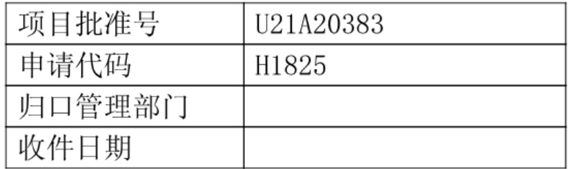

202509U21A20383

# 国家自然科学基金

# 资助项目结题/成果报告

资助类别:联合基金项目

亚类说明:重点支持项目

附注说明:区域创新发展联合基金

项目名称:基于人工智能的泌尿系统肿瘤诊疗平台研发与应用

负责人:林天歆 BRID: 09229.00.06658

电子邮件: lintx@mail.sysu.edu.cn 电话: 020-34070392

依托单位:中山大学

联系人: 冯春华

电话: 020-84115962

直接费用:260.0000（万元）

执行年限: 2022.01-2025.12

填表日期:2026年05月15日

国家自然科学基金委员会制（2025年）

## 项目摘要

## 中文摘要:

随着人工智能(Artificial Intelligence，AI)与大数据医疗平台的飞速发展，AI技术的识别速度与准确度得到极大提高，在恶性肿瘤精准诊疗领域起着日益重要的作用。既往研究表明AI技术的引入可有效辅助恶性肿瘤的诊疗决策，从而改善患者预后。在临床实践中，以膀胱癌为代表的泌尿系统恶性肿瘤诊疗过程中存在着诸多亟待解决的诊断与治疗不精准问题。在前期研究中，我们基于AI技术构建并多中心验证了一系列膀胱癌诊断模型，结果表明其可有效提高膀胱癌的诊断准确性并辅助治疗策略选择。由此，我们提出针对泌尿系统常见恶性肿瘤诊疗过程中存在的系列问题，在前期研究的基础上，进一步基于卷积神经网络、深度迁移学习、渐进自动化增量学习、知识图谱技术等最新发展的AI技术，研发全链条覆盖泌尿系统常见恶性肿瘤诊疗过程的一体化AI精准诊疗平台。本项目有望解决泌尿系统肿瘤诊疗过程中面临的系列难题，实现泌尿系统肿瘤精准诊疗。

## Abstract:

With the rapid development of artificial intelligence (AI) and medical big data platform, the recognition speed and accuracy of AI technology have been greatly improved, which plays an increasingly important role in the field of accurate diagnosis and treatment of malignant tumors. Previous (studies have shown that the introduction of AI technology can effectively assist the diagnosis and treatment decision of malignant tumors, so as to improve the prognosis of patients. In clinical practice, there are many problems in the diagnosis and treatment of urinary malignancies, such as bladder cancer. In the previous study, we constructed and verified a series of bladder cancer diagnosis models based on AI technology. The results show that it can effectively improve the accuracy of diagnosis of bladder cancer and assist in the selection of treatment strategies. Therefore, we propose to solve a series of problems in the diagnosis and treatment of common malignant tumors in the urinary system. On the basis of previous research, we further develop an integrated AI precision diagnosis and treatment system covering the diagnosis and treatment of common malignant tumors in the urinary system based on the latest development of AI technologies such as convolution neural network, deep migration learning, incremental incremental learning, knowledge mapping technology. This project is expected to solve a series of problems in the diagnosis and treatment of urinary system tumors, and achieve accurate diagnosis and treatment of urinary system tumors.

关键词（用分号分开）:多种肿瘤；泌尿系统肿瘤；人工智能；诊断模型；

诊疗平台

Keywords (separated by;): Multiple Tumors; Urinary System Tumors; Artificial Intelligence; Diagnostic Model; Diagnosis and treatment platform

## 结题摘要

## 中文摘要（对项目的背景、主要研究内容、重要结果、关键数据及其科学意义等做简单概述）:

在临床实践中，以膀胱癌为代表的泌尿系统恶性肿瘤诊疗存在着诸多亟待解决的临床痛点、难点。人工智能(Artificial Intelligence,AI)与大数据医疗平台的飞速发展，为解决传统人工诊疗困境提供了潜在的解决方案。我们结合前期研究基础，构建多中心多模态标准化临床诊疗大数据库，采用前沿深度学习技术，针对泌尿系统恶性肿瘤传统诊疗流程的若干薄弱环节和痛难点，研发系列AI精准诊断系统，包括尿液细胞学AI诊断系统、膀胱镜检AI诊断系统、膀胱癌临床T分期AI诊断系统、膀胱癌电切病理T分期AI诊断系统、膀胱癌病理N分期AI诊断系统、前列腺癌临床AI诊断系统、前列腺癌病理N分期AI诊断系统、肾癌临床AI诊断系统、肾癌N分期AI诊断系统等，涵盖泌尿系统常见肿瘤的早期筛查与诊断分期全流程。系列AI精准诊断系统性能均可媲美甚至超越资深医师，相比传统诊疗模式，敏感性、特异性、准确性与诊断效率均有不同程度的提升。进一步，结合智能数据治理与云平台技术，我们研发了泌尿系统常见恶性肿瘤AI一体化精准诊疗平台，已在全国多中心试用推广，有力推进智能精准医学。

在本项目的支持下，团队已发表SCI论文17篇（另有1篇文章已录用，暂未见刊），获批国家发明专利7项，积极参加国内外学术会议交流研究进展，并顺利培养了1名青年长江学者、2名国家优青、2名博新计划获得者及2名青托工程入选者，完成培养博士研究生15人，硕士研究生14人，圆满完成研究目标。

# Abstract (Brief description of research background, main methods,

contributions, and research data):

In clinical practice, there are numerous pressing clinical challenges in the diagnosis and treatment of malignant tumors of the\_urinary system, with bladder cancer being a representative example. The rapid development of artificial intelligence (AI) and big data medical platforms has provided potential solutions to the challenges of traditional manual diagnosis and treatment. Building on our previous research, we established a large-scale, standardized, multi-center, multi-modal clinical diagnosis and treatment database. Utilizing cutting-edge deep learning technologies, we developed a series of AI precision diagnostic systems to address key weaknesses and challenges in the traditional diagnostic and treatment processes for urinary system malignancies, including urinary cytology AI diagnostic system, cystoscopy AI diagnostic system, bladder cancer clinical T stage AI diagnostic system, bladder cancer pathological T stage AI diagnostic system, bladder cancer pathological N stage AI diagnostic system, prostate cancer clinical AI diagnostic system, prostate cancer pathological N stage AI diagnostic system, renal cancer clinical AI diagnostic system, renal cancer N stage AI diagnostic system, etc. , covering the entire process of early screening, diagnosis, and staging of common tumors in the urinary system. The performance of the series of AI precision diagnosis systems can rival or even surpass that of senior physicians, radiologists and pathologists. Compared with traditional diagnosis and treatment models, sensitivity, specificity, accuracy, and diagnostic efficiency have all been improved to varying degrees. Furthermore, by combining intelligent data governance and cloud platform technology, we developed an AI integrated precision diagnosis and treatment platform for common malignant tumors in the urinary system, which has been tested and promoted in multiple centers across the country, effectively promoting intelligent precision medicine. With the support of this project, the team has published 17 SCI papers (1 article has been accepted but not yet published), obtained 7 national invention patents, and actively participated in domestic and international academic conferences to exchange research progress, and successfully trained 1 Young Changjiang Scholar, 2 Outstanding Young Scholars, 2 recipients of the fellowship of China National Postdoctoral Program for Innovative Talents, and 2 selected candidates for the Young Elite Scientists

| Sponsorship Program (Doctoral Program) by CAST. We have also trained 15 doctoral students and 14 master's students, successfully achieving the research goals. |
| --- |
| 关键词（用分号分开）:泌尿系统肿瘤；人工智能；精准诊断；诊断模型； 诊疗平台 |
| Keywords (separated by;): Urinary System Tumors; Artificial Intelligence; |

## 正文

《结题/成果报告》正文分为两个部分:结题部分和成果部分。请按照《结题/成果报告》填报说明及撰写要求填写。

## （一）结题部分

## 1. 研究计划执行情况概述。

（1）按计划执行情况。

本项目计划建立针对泌尿系统常见恶性肿瘤（膀胱癌、肾癌、前列腺癌）的大规模标准化数据库，采用前沿人工智能（Artificial Intelligence，AI）技术，建立并验证系列膀胱癌、肾癌、前列腺癌人工智能诊断模型，进而整合搭建泌尿系统肿瘤一体化AI诊疗平台，以期实现高效、精准个性化诊疗。

项目按既定计划开展，执行顺利，未遇到需要调整的重大问题。

（2）研究目标完成情况。

项目按既定计划顺利开展，如期完成研究目标，包括:1、建立泌尿系统肿瘤多中心多模态标准化数据库；2、基于多中心数据，开发并验证系列膀胱癌AI诊断系统；3、基于多中心数据，开发并验证系列前列腺癌AI诊断系统；4、基于多中心数据，开发并验证系列肾癌AI诊断系统；5、整合搭建泌尿系统肿瘤一体化 AI精准诊疗平台。

## 2. 研究工作主要进展、结果和影响。

（1）主要研究内容。

1、构建泌尿系统常见恶性肿瘤（膀胱癌、肾癌、前列腺癌）多中心多模态标准化数据库；

2、基于多中心数据，开发并验证系列膀胱癌AI诊断系统；

3、基于多中心数据，开发并验证系列前列腺癌AI诊断系统；

4、基于多中心数据，开发并验证系列肾癌AI诊断系统；

5、整合搭建泌尿系统肿瘤一体化AI精准诊疗平台。

（2）取得的主要研究进展、重要结果、关键数据等及其科学意义或应用前景。

项目主要研究结果。

1、构建泌尿系统常见恶性肿瘤（膀胱癌、肾癌、前列腺癌）多中心多模态标准化数据库

高质量标准化真实世界大数据是研发性能可靠的AI模型的基础。为提高AI模型诊断性能并在真实世界中全面评估其应用价值，本团队已建立泌尿系肿瘤数据采集标准规范，构建影像、内镜、文本等多模态数据自动化质控模块，采用分布式存储实现多模态数据治理。目前已收集全国10家医院12000余例患者相关临床数据，包括尿液脱落细胞学报告-尿液脱落细胞学涂片高分辨率数字化扫描图像、膀胱镜检查报告-膀胱镜检图像及视频、膀胱癌电切标本病理报告-膀胱癌电切标本病理切片高分辨率数字化扫描图像、膀胱癌清扫淋巴结病理报告-膀胱癌清扫淋巴结病理切片高分辨率数字化扫描图像、膀胱癌患者盆腔CT/MR报告-膀胱癌患者盆腔CT/MR原图、前列腺穿刺病理报告-前列腺穿刺病理切片高分辨率数字化扫描图像、前列腺癌清扫淋巴结病理报告-前列腺癌清扫淋巴结病理切片高分辨率数字化扫描图像、前列腺癌患者盆腔CT/MR报告-前列腺癌患者盆腔 CT/MR 原图、肾癌患者腹部 CT/MR 报告-肾癌患者腹部 CT/MR 原图等多模态数据。

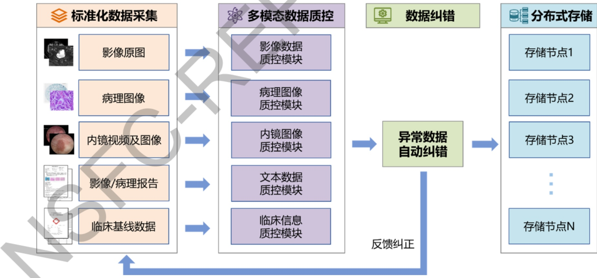

图1:泌尿系常见肿瘤多模态标准化数据库构建

## 2、基于多中心数据，开发并验证系列膀胱癌AI诊断系统

## 2.1 开发并验证尿液细胞学 AI诊断系统

尿液脱落细胞学检查是兼具经济性与可靠性的无创诊断技术，在临床上应用广泛。然而，传统尿液细胞病理学结果通过人工阅片，高度依赖细胞病理医师经验，且工作量大、漏诊率高，总体诊断敏感性仅为30%，无法满足早诊早治的临床需求。为了解决上述问题，本团队收集多家中心5260例患者的尿液脱落细胞学病理涂片，通过数字切片扫描仪获得数字病理图像。采用多层级特征提取方法，结合三种深度学习算法同时提取斑块级和细胞级特征，构建了基于尿液细胞学的膀胱癌 AI无创诊断系统PUCAS。在多中心验证中，PUCAS 的 AUC值为 0.928（95%CI:0.874-0.982）至0.970（95%CI:0.958-0.981）。在不典型病变类别中，PUCAS 的敏感性为 0.843（95%CI:0.793-0.886），高于 FISH检查（0.575，95% CI:0.479-0.668)。在亚组分析中，相比于细胞学和 FISH，PUCAS 的敏感性显著更高，在早期肿瘤（0.857）、微小肿瘤（0.914）、上尿路上皮癌（0.928）、残留肿瘤（0.966)和复发肿瘤（0.948)组中尤为明显。在复发检测临床场景中，PUCAS可以减少57.5%的内镜使用，促进膀胱癌早期无创精准诊断。

A

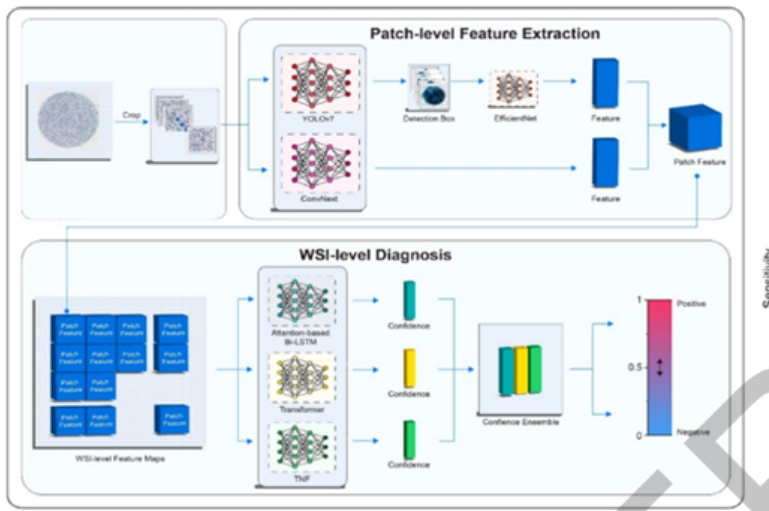

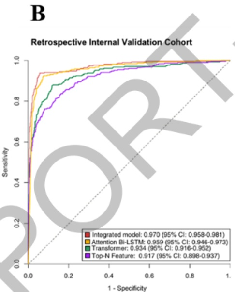

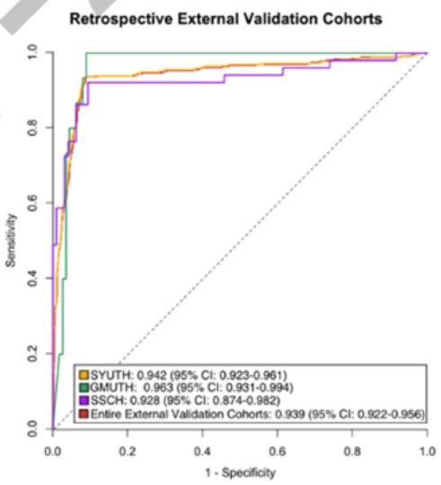

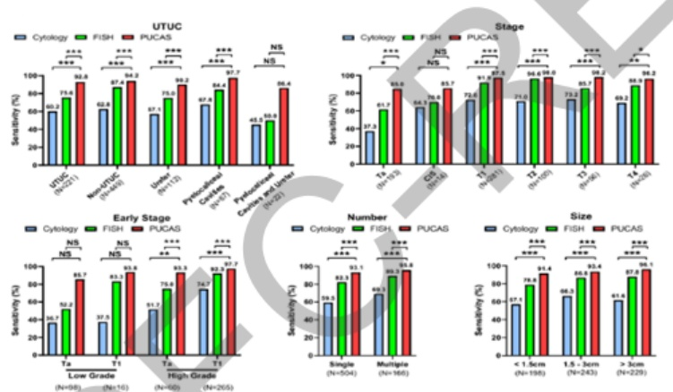

D

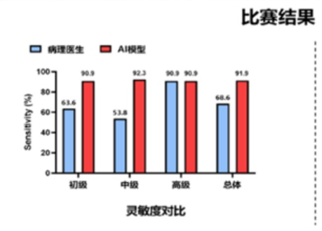

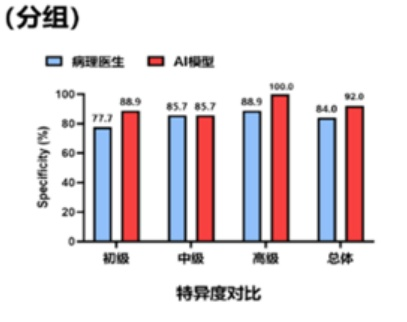

图2:尿液细胞学AI诊断系统研发。A. 算法框架与模型训练流程；B.AI系统在内部、外部验证集中的 AUC 达 0.928至 0.970；C.AI系统在各亚组中的诊断敏感性，对比传统细胞学与FISH均更优；D. 在2023年中国膀胱癌高峰论坛现场举行人机竞赛，比较不同年资细胞病理医师与AI诊断系统的诊断性能，结果显示，AI在灵敏度和特异度方面均胜出。

此成果已发表于柳叶刀子刊EClinicalMedicine（项目负责人为唯一通讯作者)，并获得一项授权国家发明专利“尿路上皮细胞联合分类方法、装置、设备及存储介质”（项目负责人为第二发明人，项目组成员为第一发明人）。

## 2.2 开发并验证膀胱镜检 AI诊断系统

膀胱镜检查是膀胱癌早期诊断的金标准，然而，传统膀胱镜检依靠肉眼诊断，对微小病灶及原位癌诊断敏感性差，总体漏诊率超过35%，且诊断准确性受限于医生的临床经验，经验不足的医生容易漏诊、误诊。为了解决上述问题，本团队基于6家三甲医院的10729例患者的69204张膀胱镜照片，利用残差深度网络及金字塔场景分割模块，研发了基于膀胱镜的膀胱癌人工智能诊断系统，在内外部验证中准确率均达0.98以上。本团队进一步通过3D全卷积神经网络算法、训练数据精细化标注等策略优化AI系统，提高对原位癌等非典型病变的识别能力。优化后，AI系统对疑难病例亚组诊断敏感性达0.95，高于各年资临床医生 口有力促进膀胱癌早期精准诊断。

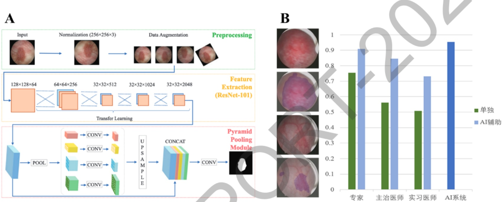

图3:膀胱镜AI诊断系统研发。A. 算法框架与模型训练流程；B. 疑难案例亚组中AI系统与不同年资医师的诊断敏感性对比，AI优于各年资医师，并可辅助提升医师诊断敏感性。

此成果已发表于肿瘤学领域权威期刊 Journal of the National Cancer Institute（项目负责人为最后通讯作者）及《中华医学杂志》（项目负责人为唯一通讯作者)。

## 2.3 开发并验证膀胱癌临床T分期AI诊断系统

临床T分期对膀胱癌治疗决策意义重大。术前无创诊断T分期主要依赖CT/MR等传统影像学手段，总体准确性低于60%。为了解决上述问题，本团队采用迁移学习技术，收集来自4家中心的1891例患者的尿液细胞学数据，微调模型特征参数，构建基于尿液细胞学的膀胱癌T分期无创诊断系统(PUCAS-M)。PUCAS-M在外部验证集中的AUC达0.857，显著优于传统影像学诊断，整合多模态数据后，AUC及敏感性可进一步提升至0.900与0.874，促进膀胱癌无创精准分期。

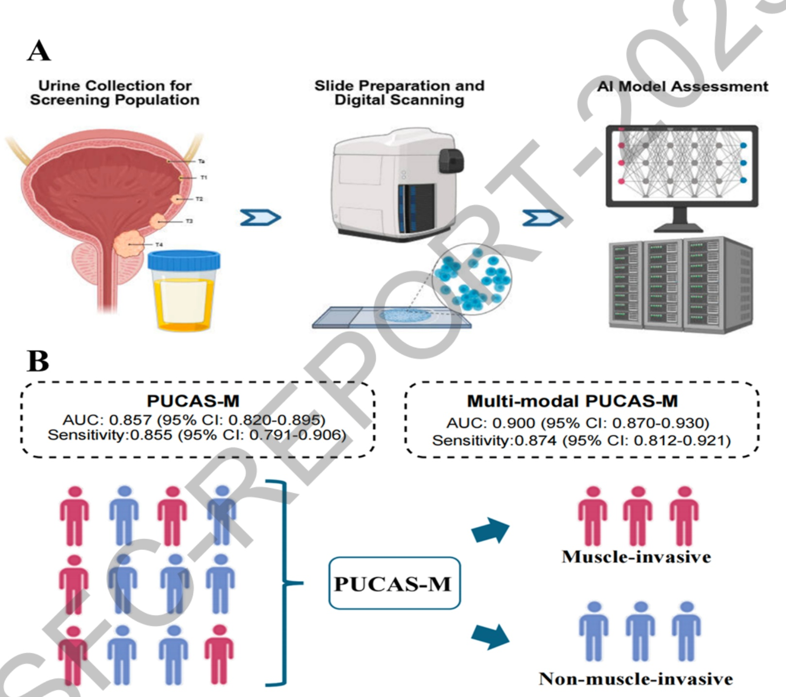

图4:膀胱癌临床T分期AI诊断系统研发。A. 模型训练流程；B. 整合多模态数据后，AI系统可实现0.900的 AUC与0.874的敏感性，精准区分肌层浸润与非肌层浸润膀胱癌。

此成果已发表于顶尖医工融合期刊Advanced Science（项目负责人为共同通讯作者，项目组成员为最后通讯作者)。

## 2.4 开发并验证膀胱癌电切病理T分期AI诊断系统

电切标本病理T分期为膀胱癌患者是否需要接受根治性手术提供决定性依据，但由于电切标本不完整、烧灼、缺乏完整肌层、电切术者技术、人工阅片主观性等原因，电切标本的病理分期工作存在工作量大且准确性不理想的问题。为了解决该问题，本团队收集了692例患者的854张经尿道肿瘤电切标本组织病理切片高分辨率数字化扫描图像，采用卷积神经网络ScanNet算法进行图像分割和分类训练，基于密集重建技术抓取漏过信息，构建了基于电切标本病理图像的膀胱癌肌层浸润AI诊断系统PAIDM。在验证集中，PAIDM展示了良好的诊断准确性，在斑块级和全切片级的诊断准确率均超过87%。在PAIDM与病理学家的比较中，PAIDM的 AUC为 0.847（95%CI 0.779-0.905），不低于病理学家的平均诊断水平，且优于初级病理医生。AI预测区域与人工标注区域之间具有高度一致性，提高了PAIDM的可解释性。相较传统病理医师阅片诊断，PAIDM具有诊断准确性更好、效率更高、有助于医疗水平同质化等优点，有助于提升根治术前膀胱癌肌层浸润的诊断准确性，从而精准指导手术方案决策。

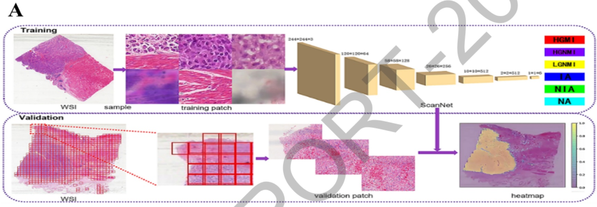

B

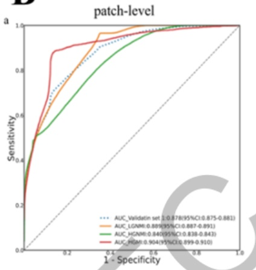

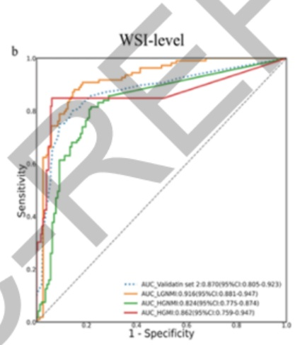

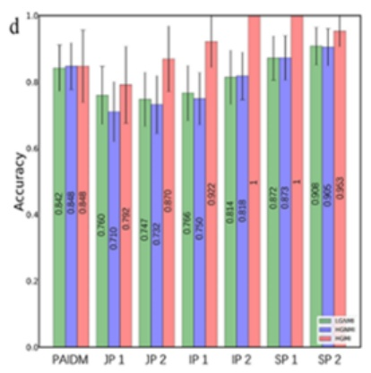

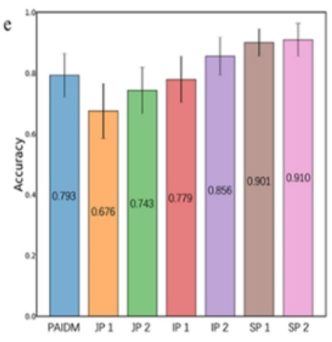

图5:膀胱癌病理T分期AI诊断系统研发。A. 算法结构与模型训练流程；B AI系统在 patch 级别与 WSI 级别的诊断水平，AUC 不低于 0.84；C.AI 系统对比不同年资医师的诊断准确性，已达资深病理医师水平。

此成果已发表于 Journal of Translational Medicine(项目负责人为最后通讯作

## 2.5 开发并验证膀胱癌病理N分期AI诊断系统

淋巴转移是膀胱癌最常见的转移方式，准确的淋巴分期对指导术后进一步治疗及判断预后具有重要意义。然而，目前淋巴结的病理评估依靠病理科医生人工阅片，诊断效率较低，特别是微转移病灶的直径小、病变累及范围少，人眼分辨力有限，加之病理医生临床工作量繁重，极有可能出现肿瘤淋巴微转移灶的漏诊。传统病理学检查在微转移的检测中显示出有限的敏感性，这可能会增加肿瘤进展风险并延迟潜在的辅助治疗。免疫组化和分子标记物能增加微转移病灶的检出率，但费用较高，难以常规使用。为了解决上述问题，本团队基于5家大型三甲医院998例患者的7991张膀胱癌清扫淋巴结病理切片高分辨率数字化扫描图像，共20590个淋巴结，采用最新的深度学习算法HRNet-w18 作为 backbone进行分割和分类训练，构建了膀胱癌病理淋巴分期人工智能诊断模型LNMDM。在内部和外部验证集中，LNMDM的 AUC达 0.978（95% CI0.960- 0.996）至 0.998（0.996 - 1.000)。人机对比与人机协作实验显示，LNMDM的诊断敏感性（0.983 [95%CI 0.941 - 0.998]）显著超过初级病理学家（0.906[0.871 - 0.934]）和高级病理学家(0.947 [0.919 - 0.968])；同时，在 LNMDM 辅助下，初级病理学家 (从0.906到0.953）和高级病理学家（从0.947到0.986）的诊断敏感性都有了显著提升，诊断时间也大大缩短。在多癌种测试中，LNMDM在乳腺癌数据集上的AUC达0.943(95% CI0.918 - 0.969),在前列腺癌数据集上的 AUC 为 0.922(95% CI 0.884 - 0.960)。在13例既往病理报告诊断为“淋巴转移阴性”的患者中，LNMDM检测到淋巴结内存在最大径小于2mm的肿瘤微转移。此外，通过调整模型二分类阈值，LNMDM可在保持100%的灵敏度的同时，直接排除80-92%的阴性玻片免于审查，可在临床实际部署应用中显著降低病理医生的阅片负担。

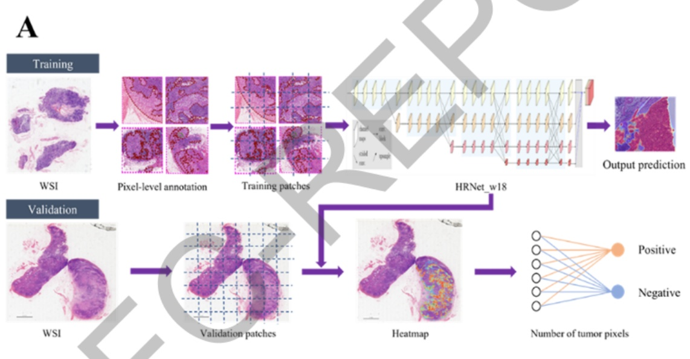

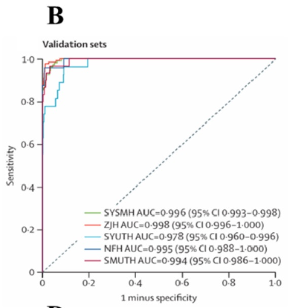

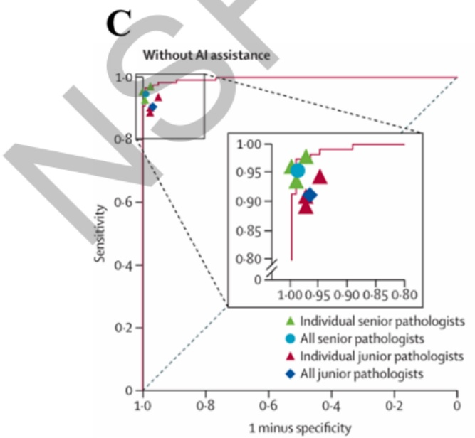

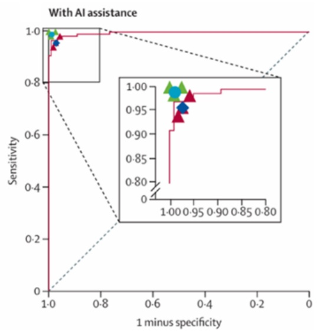

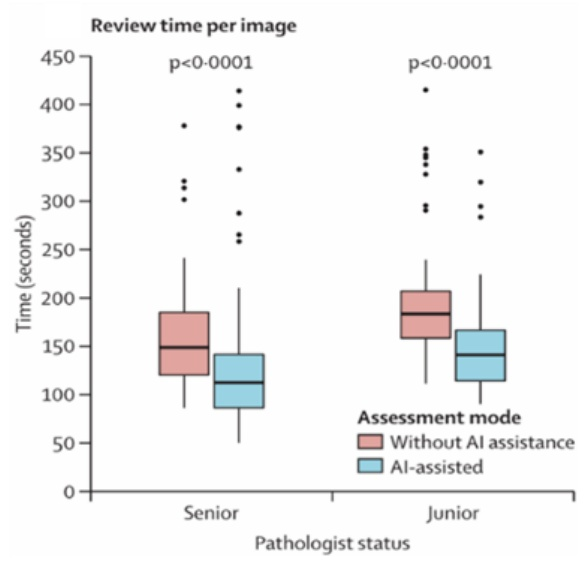

图6:膀胱癌病理N分期AI诊断系统研发。A. 算法结构与模型训练流程；B.AI系统在多中心验证集的诊断性能，AUC均在0.978以上；C. 人机对比与协作试验，AI诊断系统敏感性胜过病理医师，且在AI辅助下，不同年资医师的诊断敏感性均有所提升；D.AI辅助下，不同年资病理医师阅片时间均显著缩短。

此成果已作为当期封面文章发表于全球肿瘤学权威期刊 Lancet Oncology(项目负责人为唯一通讯作者)，为ESI高被引论文，并得到2024年欧洲泌尿外科学会指南引用。此外，该成果获得一项授权国家发明专利“膀胱癌淋巴结转移的病理图像识别方法、装置、介质”（项目负责人为第二发明人）。

## 3、基于多中心数据，开发并验证系列前列腺癌AI诊断系统

## 3.1 开发并验证前列腺癌临床AI诊断系统

早期前列腺癌症状隐匿，与良性前列腺增生相似，诊断主要依赖血清PSA检测与盆腔MR检查，可疑人群采用穿刺活检确诊。然而，良性前列腺增生、感染等情况也会导致PSA升高，增生、炎症改变的MR影像也易与癌变病灶混淆。这一方面导致临床上大量PSA“灰区”（4-10ng/mL）患者接受了不必要的穿刺活检（检出率仅约15-20%）；另一方面，检出的肿瘤中大部分为低危前列腺癌(Gleason评分≤6)，亦说明存在一定程度过度诊治。为了解决上述问题，本团队收集全国5家大型三甲医院3108例患者的盆腔MR报告-MR原图、前列腺穿刺病理报告-穿刺病理切片高分辨率数字化扫描图像，采用前沿基础模型建构技术，基于混合专家模型（MoE）框架与无监督掩码建模训练策略，分别训练前列腺盆腔MR报告文本数据专家模型、前列腺盆腔MR影像数据专家模型、前列腺穿刺病理报告文本数据专家模型、前列腺穿刺病理图像数据专家模型。进一步，基于病理报告-病理图像数据对、影像报告-影像原图数据对，连接多头注意力模块，分别进行影像-文本对齐训练和病理-文本对齐训练。阳性金标准设为穿刺活检病理确诊为前列腺癌，阴性金标准设为穿刺活检阴性且持续随访2年以上PSA未升高，以此微调训练前列腺癌临床AI诊断系统。结果显示，AI系统在验证集中诊断准确性达0.901，可有效提高前列腺癌早期筛查诊断准确性。

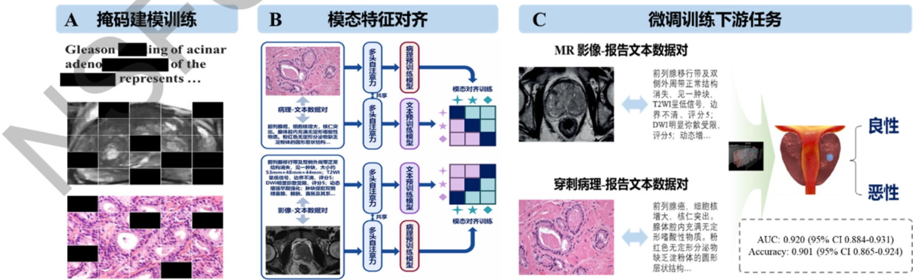

图7:前列腺癌临床AI诊断系统研发。A. 采用无监督掩码建模方式预训练各模态特征提取器；B.通过病理图像-病理报告文本数据对及影像原图-影像报告文本数据对进行模态特征对齐；C.确立金标准，微调训练下游良恶鉴别任务，AI系统诊断 AUC 达 0.920 (95% CI 0.884-0.931)，准确性达 0.901(95% CI 0.865-0.924)。

## 3.2 开发并验证前列腺癌病理N分期AI诊断系统

淋巴转移是前列腺癌常见的转移方式，对术后病理证实存在淋巴转移的前列腺癌患者行术后辅助治疗，可有效减少复发、改善预后。因此，术后精准诊断前列腺癌淋巴转移，有助于制定针对性治疗方案，改善患者预后。然而，当前对淋巴结病理的阅片流程是劳动密集型与经验依赖性的，需要病理医生在显微镜下目视检查每个清扫淋巴结的病理切片，而每例患者的清扫淋巴结总切面数可达30\~100，工作繁琐、耗时费力，容易漏诊直径微小（<2mm）的转移癌灶。多项研究表明，前列腺癌根治术后常规病理检查淋巴转移的漏诊率高达8.8\~13.3%，且这些被漏诊的患者预后显著更差。尽管连续切片和免疫组化染色可提高病理检查的敏感性，但也将相应大幅增加材料与劳动费用，无法常规开展。因此，亟需开发更为精准、快速、高效的诊断工具。为解决上述问题，本团队基于全国5家大型三甲医院的1297例前列腺癌患者的18761个术后清扫淋巴结的8158张高分辨率数字病理图像数据，利用 RegNet\_Y40 & DeepLabV3plus 深度卷积神经网络算法，构建了前列腺癌病理淋巴转移AI诊断模型ProCaLNMD，在多中心验证集中 AUC 达 0.975 以上，敏感性达到高级病理医师水准（98.3% vs 98.3%），优于初级病理医师（98.3% vs 87.1%）， 并纠正了各医院既往病理报告27例（占总阳性病例的8.5%）的淋巴微转移漏诊病例。人机协作试验中，在ProCaLNMD的协助下，不同年资病理学家的敏感性均有显著提高，审查淋巴结切片的时间减少了27%到34%不等。 7

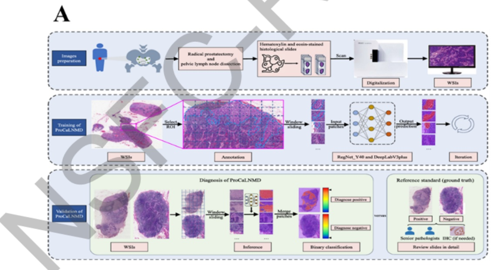

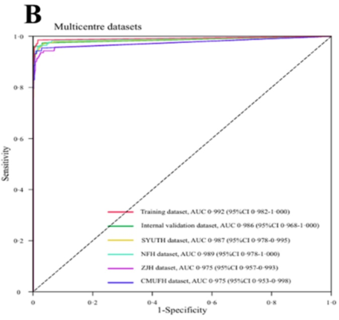

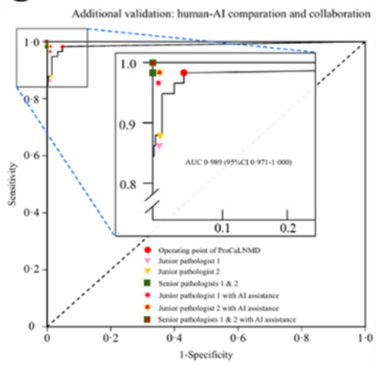

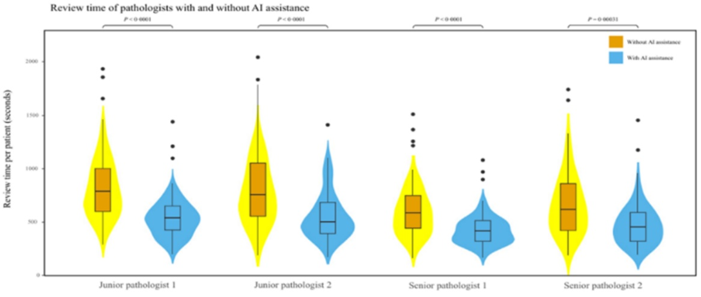

图8:前列腺癌病理N 分期AI诊断系统研发。A. 算法结构与模型训练流程；B.AI诊断系统在多中心验证集中的诊断性能，AUC均不低于0.975；C.人机对比与协作试验，AI诊断系统不仅敏感性优于各年资病理医师，还能辅助医师显著提高诊断敏感性；D.在AI系统的辅助下，不同年资病理医师的阅片速度均有显著提高。

此成果已发表于柳叶刀子刊EClinicalMedicine（项目负责人为唯一通讯作者)，并获得一项授权国家发明专利“前列腺癌淋巴结转移的组织病理学识别方法、装置”（项目负责人为第四发明人，项目组成员为第一发明人）。

## 4、基于多中心数据，开发并验证系列肾癌AI诊断系统

## 4.1 开发并验证肾癌临床 AI 诊断系统

肾癌临床诊断主要依赖肾脏CT影像，然而，乏脂性肾错构瘤等良性病变在影像学表现上常与肾恶性肿瘤高度相似，导致术前定性诊断困难，从而影响治疗策略选择。传统影像学评估主要依赖人工阅片，主观性强，诊断一致性有限，尤其在非典型病例中误判风险较高。为解决上述问题，本团队收集7家大型三甲医院6315例患者的肾脏增强CT影像数据，涵盖肾透明细胞癌、嫌色细胞癌及乏脂性错构瘤等主要病理类型。所有影像数据均经过统一预处理，包括窗宽窗位标准化调整、强度归一化等。由10年以上经验的影像科及泌尿外科医师对肾脏区域及肿瘤区域进行精细化标注，构建高质量的肾癌影像数据库。在模型构建策略上，本团队采用DeepLabV3+网络作为肾脏及肿瘤区域自动分割的核心框架。模型以二维CT切片作为输入，输出肾脏实质及肿瘤区域的像素级分割结果。模型训练过程中采用Diceloss与交叉熵损失函数的联合优化策略，并通过随机旋转、翻转及强度扰动等数据增强方式提升模型的鲁棒性。在完成肿瘤区域的自动分割后，基于分割得到的肿瘤感兴趣区域（ROI)，进一步采用Xception网络构建肾癌定性诊断模型，输出肿瘤良恶性分类概率。在多中心独立验证队列中，AI系统AUC值达0.935（95% CI: 0.912 - 0.958）至 0.948（95% CI: 0.927 - 0.969），整体诊断敏感性达0.89。在非典型病例及小体积肿瘤（最大径≤1cm）亚组中，系统仍保持稳定的诊断性能，显著优于人工评估。

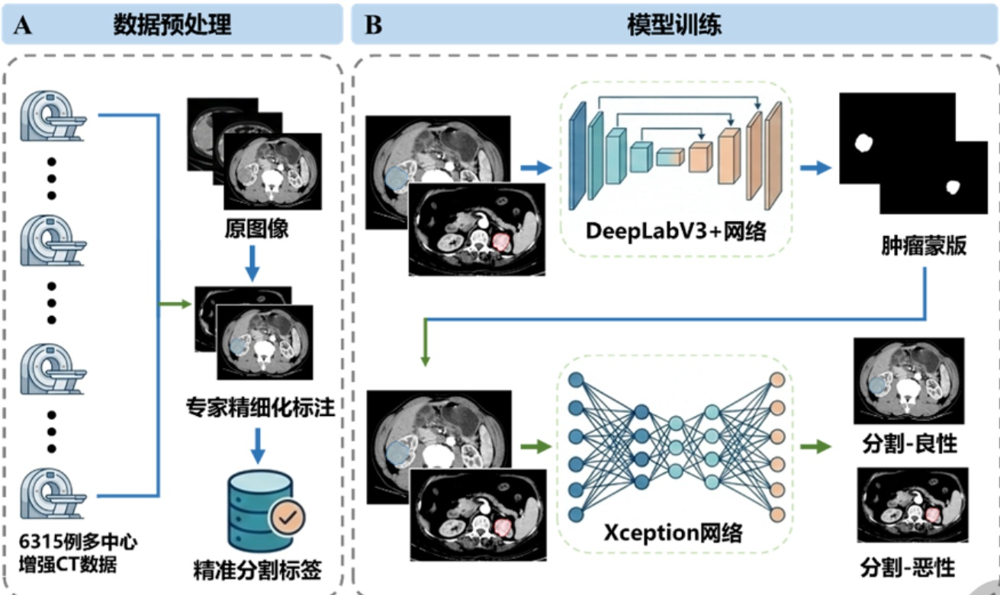

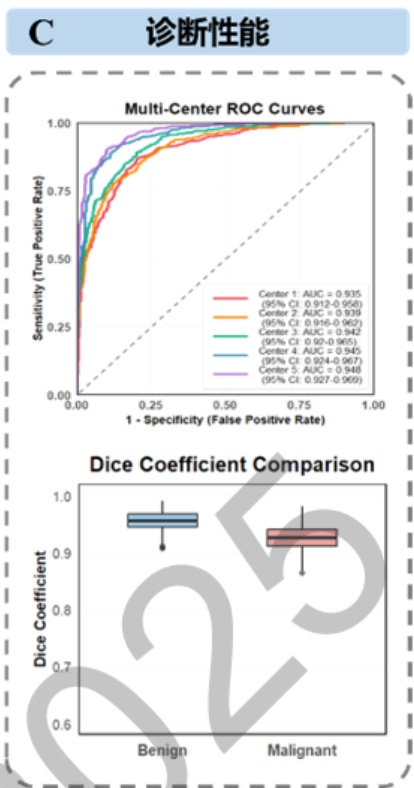

图9:肾癌临床AI诊断系统研发。A. 数据预处理，高年资专家对图像内解剖结构进行精细化标注；B. 算法结构与模型训练流程；C.AI系统诊断性能，多中心验证集中的 AUC 达 0.935 (95%CI 0.912-0.958) 至 0.948 (95%CI 0.927-0.969)。

## 4.2 开发并验证肾癌 N 分期 AI 诊断系统

在肾癌诊疗过程中，淋巴结转移状态是影响手术方式选择和预后评估的关键指标，术前通常仅依靠影像学评估作为参考。然而，传统影像学方法准确性有限，隐匿性淋巴结转移患者难以评估，从而导致术前分期相关治疗决策缺乏可靠依据。为了解决上述问题，本团队回顾性收集3家大型三甲医院1182名肾癌患者的肾脏增强CT原图数据及对应的病理分期信息，重点纳入影像学评估为cN-但术后病理明确存在淋巴结转移的患者。选取肿瘤最大径切片及其上、下各三张连续切面图像作为模型输入，以保留肿瘤的空间上下文信息。模型采用 SwinTransformer网络，充分利用肿瘤及周围组织的局部和整体结构信息。通过多层结构逐步提取影像特征，最后通过全连接分类器输出患者是否存在淋巴结转移的二分类预测概率。训练过程中使用交叉熵损失函数，并结合数据增强与迁移学习策略，提高模型泛化能力和稳定性。在独立验证队列中，AI系统AUC值达0.848(95%CI:0.811 - 0.885）至0.876（95%CI: 0.842 - 0.910），在影像学评估为 cN-的患者亚组中，敏感性达到0.82，显著优于传统影像学评估方法，为术前淋巴结转移风险判断提供可靠依据。

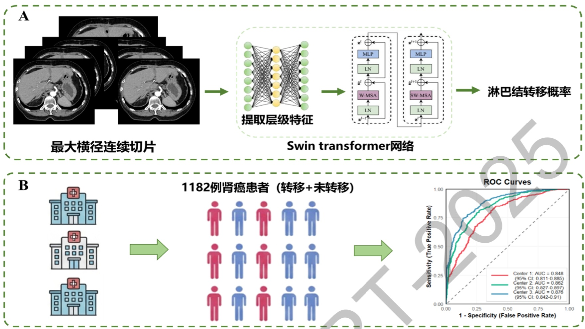

图 10:肾癌临床N 分期 AI诊断系统研发。A. 算法结构与训练流程；B. 模型在多中心队列中的诊断性能，AUC值不低于0.848。

## 5、整合搭建泌尿系统肿瘤一体化AI精准诊疗平台

通过建立标准化数据治理中台、开发智能模型调度引擎、微服务化封装改造各AI诊断系统，构建泌尿系统常见恶性肿瘤一体化人工智能精准诊疗平台，满足不同临床场景需求，全链条覆盖泌尿系统常见肿瘤诊疗过程，推进智慧精准医疗。

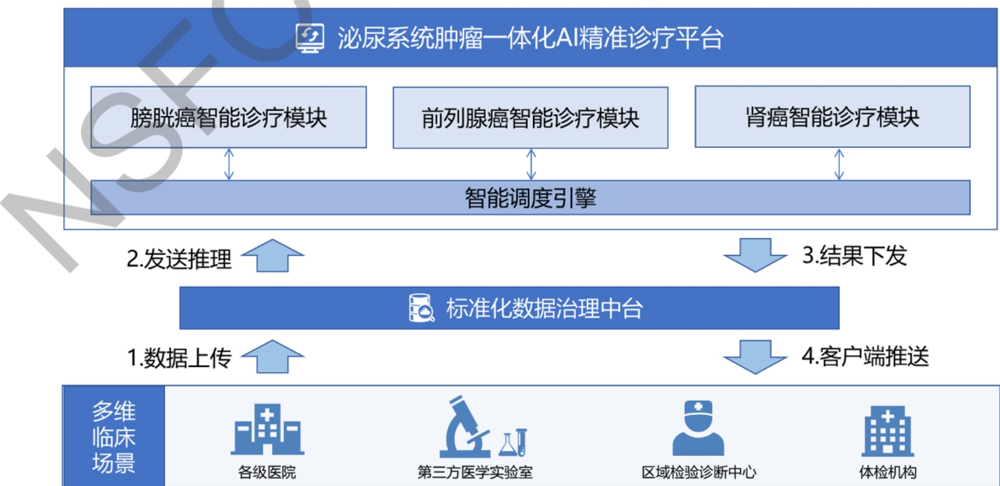

图11:泌尿系常见肿瘤一体化AI精准诊疗平台构建。

## 3. 研究人员的合作与分工。

该项目研究总人数为10人，其中高级职称1人，中级职称4人，初级职称0人，博士后0人，博士生2人，硕士生3人，主要分工如下:林天歆为项目负责人，负责整个项目的思路设计及统筹；参与人吴少旭负责多中心膀胱癌、肾癌、前列腺癌影像学数据、病理切片、细胞学图像等数据的收集，协助项目负责人进行相关的临床及科研工作指导；参与人李锴文负责多中心膀胱癌、肾癌、前列腺癌影像学数据、病理切片、细胞学图像等数据的审核、筛选工作，并提供临床及科研工作指导；参与人陈雄负责膀胱癌影像学数据、组织病理切片数据和相应临床数据的收集及标注工作，参与算法开发和系统构建以及文章、专利的撰写工作；参与人潘杰鑫负责膀胱癌尿液细胞学数据、内镜图像数据和相应临床数据的收集和标注工作，参与文章及专利的撰写工作；参与人郑汉豪负责肾癌影像学数据、病理组织切片数据和相应临床数据的收集和标注工作，参与文章及专利的撰写工作；参与人沈泽锋负责前列腺癌影像学数据、病理组织切片数据和相应临床数据的收集和标注工作，参与文章及专利的撰写工作；参与人陈长昊负责膀胱癌、肾癌、前列腺癌影像学数据、病理切片、细胞学图像等数据的标注后审核工作，并提供临床及科研工作指导；参与人陈旭负责文章及专利申请审核工作，参与算法开发和系统构建，提供临床及科研工作指导；参与人杨雪帆负责前列腺癌影像学数据、病理组织切片数据及相应临床数据的收集和标注工作，参与文章及专利的撰写工作。项目参与人之间精诚合作，相互协调沟通，使得该项目顺利开展。该资助项目执行期间无新增或退出研究人员。

## 4. 国内外学术合作交流等情况。

本项目积极推进国际化合作，在学术交流、专家协作与成果产出方面取得若干实质性进展:

项目负责人林天歆于2024年9月7日在中国医师协会内镜医师分会汇报智能膀胱镜系统研发与应用进展；于2025年3月21日在欧洲泌尿外科学与世界华人泌尿外科医师联合会议上担任主席并做大会报告；于2025年10月26日出席《新英格兰医学杂志》主办的AIMS2025年会，围绕多模态医学AI发表主题演讲。

项目组成员吴少旭于2023年10月21日在中华医学会第三十届全国泌尿外科学术会议上汇报前列腺癌病理分期智能诊疗系统研发进展；于2024年8月11日在中国医师协会泌尿外科医师分会(CUDA)年会上汇报泛肿瘤淋巴分期智能诊疗系统研发进展；于2024年12月7日在广东省医学会第十四次微创外科分会年会就膀胱癌全周期智能诊疗体系建设作主题报告；于2025年6月15日在中国医师协会泌尿外科医师分会(CUDA)年会上就泌尿系统肿瘤一体化智能精准诊疗平台研发与应用发表主题演讲。

项目牵头单位中山大学邀请美国杜克大学病理系主任、国际知名泌尿肿瘤专家黄教悌教授进行线下指导，就分子分型验证、多模态AI模型构建与临床转化等关键环节进行深度交流，并达成数据共享与联合合作意向。

## 5. 存在的问题、建议及其他需要说明的情况。

项目按既定计划开展，执行顺利，未遇到需要说明的重大问题。

## （二）成果部分

## 1. 项目取得成果的总体情况。

项目按既定计划开展，顺利完成目标。在本项目资助下发表SCI论文17篇(另有1篇文章已录用，暂未见刊)，影响因子10分以上的10篇，分别发表在The Lancet Oncology (IF:35.9)、The Lancet Digital Health (IF:24.1)、Nature Cancer (IF:28.5)、Cancer Research (IF:16.6)、EClinicalMedicine (3 篇) (IF:10.0)、Advanced Science (2 篇) (IF:14.1)、Journal of Experimental & Clinical Cancer Research (IF:12.8)等国际权威肿瘤学期刊上。 获得授权国家发明专利7项。顺利培养博士研究生15人，硕士研究生14人，其中4人荣获中山大学优秀毕业生，取得优秀博士毕业论文4篇。项目成果共获得1项省部级一等科研奖励（第七届广东医学科技奖）、1项国家级二等科研奖励（2023年国家科技进步二等奖）。

## 2. 项目成果转化及应用情况。

本项目属于医学人工智能应用研究，我们基于多中心多模态泌尿系统肿瘤诊疗大数据，开发并验证了系列AI精准诊断系统，已制定相关技术企业标准，并通过云平台技术整合搭建泌尿系统肿瘤一体化AI精准诊疗平台。该平台已在全国50余家医院初步部署应用，通过“云-边-端”协同架构，实现诊疗资源的优化配置和高效利用，促进优质医疗资源下沉基层，推动智慧诊疗模式创新，显著提升我国泌尿系肿瘤精准诊疗水平。

## 3. 人才培养情况。

在本项目资助下，人才梯队建设与教育教学工作取得良好效果。项目负责人林天歆先后荣获第三届全国创新争先奖（2023）、第十七届广东省丁颖科技奖（2023）、国务院政府特殊津贴（2024）、全国先进工作者（2025）等殊荣。因援疆工作突出，获评第十批省市优秀援疆干部人才并记功一次（2023）。此外，教学成果“疾病导向、临床融合、创新引领’医学研究生培养体系的构建与实践”荣获国家级教学成果奖二等奖（2023），主持完成的项目“治疆方略引领下的广东省组团式’研究生医疗援疆模式探索与实践”荣获广东省学位与研究生教育学会优秀教学成果奖特等奖（2023）。

在名师引领与平台支撑下，团队青年人才辈出:项目组成员吴少旭获教育部2023年度“青年长江学者”奖励，陈旭、陈长昊获国家自然科学基金2023年度优秀青年科学基金项目资助。博士后郑汉豪、安明杰分别获得2024、2025年博士后创新人才计划资助，研究生安明杰获得2023年国自然科学基金青年学生项目（博士生专项）计划资助，洪桂斌、李元龙入选首届中国科协青年人才托举工程博士生专项计划。共培养博士研究生15人，硕士研究生14人，其中4人荣获中山大学优秀毕业生，获评优秀博士毕业论文4篇。

## 4. 其他需要说明的成果。

无。

## 5. 项目成果科普性介绍或展示网站。

本项目利用前沿人工智能技术，针对泌尿系统常见肿瘤(膀胱癌、前列腺癌、肾癌）临床诊疗中存在的痛点难点问题，研发系列人工智能诊断系统，涵盖细胞学筛查、内镜镜下病灶识别、影像学分期、术后标本病理分期等临床场景，诊断准确性可媲美甚至超越大型三甲医院资深医师水平，同时效率也有大幅提升。本团队进一步整合搭建泌尿系肿瘤一体化人工智能诊疗平台，采用云技术、联邦学习等方法在全国范围内推广应用，促进优质医疗资源下沉基层，有力提升了泌尿系统肿瘤诊疗准确性，推进智慧精准诊疗。

## 研究成果目录

项目负责人通过系统，从文献库中检索研究成果或者按要求格式自行填入。请按照期刊论文、会议论文、学术专著、专利、会议报告、标准、软件著作权、科研奖励、人才培养、成果转化的顺序列出，其它重要研究成果如标本库、科研仪器设备、共享数据库、获得领导人批示的重要报告或建议等，应重点说明研究成果的主要内容、学术贡献及应用前景等。

项目负责人不得将非本人或非参与者所取得的研究成果、与受资助项目无关的研究成果、未标注国家自然科学基金资助和项目批准号的论文以及取得时间早于项目资助期开始时间的研究成果列入报告中。发表的研究成果（包括专利），项目负责人和参与者均应如实注明得到国家自然科学基金项目资助和项目批准号，科学基金作为主要资助渠道或者发挥主要资助作用的，应当将自然科学基金作为第一顺序进行标注。

## 期刊论文

(1) Wu Shaoxu; Hong Guibin; Xu Abai; Zeng Hong; Chen Xulin; Wang Yun; Luo Yun; Wu Peng; Liu Cundong; Jiang Ning; Dang Qiang; Yang Cheng; Liu Bohao; Shen Runnan; Chen Zeshi; Liao Chengxiao; Lin Zhen; Wang Jin; Lin Tianxin; Artificial intelligence-based model for lymph node metastases detection on whole slide images in bladder cancer: a retrospective, multicentre, diagnostic study, The Lancet Oncology, 2023, 24(4):360-370. 第二标注

(2) Wu, Shaoxu; Wang, Yun; Hong, Guibin; Luo, Yun; Lin, Zhen; Shen, Runnan; Zeng, Hong; Xu, Abai; Wu, Peng; Xiao, Mingzhao; Li, Xiaoyang; Rao, Peng; Yang, Qishen; Feng, Zhengyuan; He, Quanhao; Jiang, Fan; Xie, Ye; Liao, Chengxiao; Huang, Xiaowei; Chen, Rui; Lin, Tianxin; An artificial intelligence model for detecting pathological lymph node metastasis in prostate cancer using whole slide images: a retrospective, multicentre, diagnostic study， eClinicalMedicine, 2024， 71: 102580. 第一标注

(3) Wu Shaoxu; Shen Runnan; Hong Guibin; Luo Yun; Wan Huan; Feng Jiahao; Chen Zeshi; Jiang Fan; Wang Yun; Liao Chengxiao; Li Xiaoyang; Liu Bohao; Huang Xiaowei; Liu Kai; Qin Ping; Wang Yahui; Xie Ye; Ouyang Nengtai;

Huang Jian; Lin Tianxin; Development and validation of an artificial intelligence-based model for detecting urothelial carcinoma using urine cytology images: a multicentre, diagnostic study with prospective validation, e ClinicalMedicine，2024，71:102566.第一标注

(4) Jiang, Fan; Hong, Guibin; Zeng, Hong; Lin, Zhen; Liu, Ye; Xu, Abai; Shen, Runnan; Xie, Ye; Luo, Yun; Wang, Yun; Zhu, Mengyi; Yang, Hongkun; Wang, Haoxuan; Huang, Shuting; Chen, Rui; Lin, Tianxin; Wu, Shaoxu; Deep learning-based model for prediction of early recurrence and therapy response on whole slide images in non-muscle- invasive bladder cancer: a retrospective, multicentre study, eClinicalMedicine, 2025, 81:103125. 第一标注

(5) Shen, Runnan; Jiang, Fan; Huang, Xiaowei; Hong, Guibin; Luo, Yun; Wan, Huan; Xie, Ye; Zhu, Mengyi; Wang, Yun; Liu, Bohao; Qin, Ping; Wang, Yahui; Wang, Haoxuan; Yang, Hongkun; Lin, Zhen; Chen, Rui; Ouyang, Nengtai; Huang, Jian; Lin, Tianxin; Wu, Shaoxu; Artificial Intelligence-Assisted Urine Cytology for Noninvasive Detection of Muscle-Invasive Urothelial Carcinoma: A Multi-Center Diagnostic Study with Prospective Validation, Advanced Science, 2025， 12(39). 第一标注

(6) Chen, Xiong; Zhu, Dongxi; Li, Chenchen; Lin, Yi; Lv, Lin; Ai, Feiling; Chen, Zhijian; Shen, Runnan; Shen, Xuwen; You, Guochang; Jiang, Zhige; Zhong, Wenlong; Lin, Tianxin; Modifiable factors affects cancer-specific survival: findings from a large population-based prospective cohort study, Journal of Translational Medicine, 2025, 23(1): 486. 第一标注

(7) Pan, Jiexin; Hong, Guibin; Zeng, Hong; Liao, Chengxiao; Li, Huarun; Yao, Yuhui; Gan, Qinghua; Wang, Yun; Wu, Shaoxu; Lin, Tianxin; An artificial intelligence model for the pathological diagnosis of invasion depth and histologic grade in bladder cancer, Journal of Translational Medicine, 2023, 21(1): 42. 第二标注

(8) Li, Xiaoyang; Zou, Chen; Wang, Chunhui; Chang, Cheng; Lin, Yi; Liang, Shuai; Zheng, Haoran; Liu, Libo; Deng, Kai; Zhang, Lin; Liu, Bohao; Gao, Mingchao; Cai, Peicong; Lao, Jianwen; Xu, Longhao; Wu, Daqin; Zhao,

Xiao; Wu, Xiao; Li, Xinyuan; Luo, Yun; Zhong, Wenlong; Lin, Tianxin; Non-Invasive Tumor Budding Evaluation and Correlation with Treatment Response in Bladder Cancer: A Multi-Center Cohort Study, Advanced Science, 2025, 12(22):e2416161. 第三标注 C

(9) Li Kaiwen; Zhong Wenlong; Fan Jinhai; Wang Shaogang; Yu Dexin; Xu Tao; Lyu Jiaju; Wu Shaoxu; Qin Tao; Wu Zhuo; Xu Longhao; Wu Kaijie; Liu Zheng; Hu Zhiquan; Li Fan; Wang Jinyou; Wang Qi; Min Jie; Zhang Zhiqiang; Yu Luping; Ding Sentai; Huang Longfei; Zhao Tingting; Huang Jian; Lin Tianxin; Neoadjuvant gemcitabine - cisplatin plus tislelizumab in persons with resectable muscle-invasive bladder cancer: a multicenter, single-arm, phase 2 trial， Nature Cancer, 2024. 第四标注

(10) Zhou, Qianghua; Chen, Xu; Yao, Kai; Zhang, Yangjie; He, Haixia; Huang, Hao; Chen, Hao; Peng, Shengmeng; Huang, Ming; Cheng, Liang; Zhang, Qiang; Xie, Ruihui; Li, Kaiwen; Lin, Tianxin; Huang, Hai; TSPAN18 facilitates bone metastasis of prostate cancer by protecting STIM1 from TRIM32-mediated ubiquitination, JOURNAL OF EXPERIMENTAL & CLINICAL CANCER RESEARCH, 2023, 42 (1): 195. 第七标注

(11) Xiao, Kanghua; Peng, Shengmeng; Lu, Junlin; Zhou, Ting; Hong, Xuwei; Chen, Siting; Liu, Guangyao; Li, Hong; Huang, Jian; Chen, Xu; Lin, Tianxin; UBE2S interacting with TRIM21 mediates the K11-linked ubiquitination of LPP to promote the lymphatic metastasis of bladder cancer, CELL DEATH & DISEASE, 2023, 14(7): 408. 第五标注

(12) An Mingjie; Zheng Hanhao; Huang Jian; Lin Yan; Luo Yan; Kong Yao; Pang Mingrui; Zhang Dingwen; Yang Jiabin; Chen Jiancheng; Li Yuanlong; Chen Changhao; Lin Tianxin; Aberrant nuclear export of circNCOR1 underlies SMAD7-mediated 1ymph node metastasis of bladder cancer, Cancer Research, 2022, 82(12): 2239-53. 第十标注

(13) Lu, Junlin; Lai, Jiajian; Xiao, Kanghua; Peng, Shengmeng; Zhang, Yangjie; Xia, Qidong; Liu, Sen; Cheng, Liang; Zhang, Qiang; Chen, Yuelong; Chen, Xu; Lin, Tianxin; A clinically practical model for the preoperative prediction of lymph node metastasis in bladder cancer: a multicohort study, BRITISH JOURNAL OF CANCER， 2023，129(7):1166-1175. 第五标注

(14) Zhao, Xutu; Li, Kaiwen; Zhuang, Ruilin; Liu, Hao; He, Wang; Dong, Wen; Huang, Hai; Huang, Jian; Lin, Tianxin; Comparison in Efficacy of Periurethral Reconstruction Leading to Urinary Continence Improvement After Robot-assisted Radical Prostatectomy, ANNALS 0F SURGICAL ONCOLOGY, 2024, 31(13): 8978-8985. 第七标注

(15) He, Guohua; Liu, Yunfei; Bagga, Arvind; Onubogu, Chinyere Ukamaka; Schaefer, Franz; Zou, Zhiyong; Smoyer, William E.; Xiao, Nianzhou; Lin, Tianxin; Lanewala, Ali Asghar; Kang, Hee Gyung; Waheed, Muhammad Zeeshan; Park, Seungkyo; Jiang, Xiaoyun; Song, Yi; Ding, Jie; Trends and socioeconomic inequality of the burden of congenital abnormalities of the kidney and urinary tract among children and adolescents, NEPHROLOGY DIALYSIS TRANSPLANTATION, 2024，40(3):484-494. 第五标注

(16) He, Guohua; Wang, Yaqi; Cheng, Cheng; Guo, Jianhui; Lin, Zhilang; Liang, Ziyun; Jin, Bei; Tao, Liyuan; Rong, Liping; Chen, Lizhi; Lin, Tianxin; Hua, Yining; Park, Seungkyo; Mo, Ying; Li, Jing; Jiang, Xiaoyun; PM&lt;sub&gt;2.5&lt;/sub&gt; constituents associated with mortality and kidney failure in childhood-onset lupus nephritis: A 19-year cohort study, SCIENCE OF THE TOTAL ENVIRONMENT, 2024, 235(5): 277-283. 第四标注

(17) Lin, Junyi; Tang, Zhuang; Zhang, Chengjunyu; Dong, Wen; Liu, Yeqing; Huang, Hao; Liu, Hao; Huang, Jian; Lin, Tianxin; Chen, Xu; TFE3 gene rearrangement and protein expression contribute to a poor prognosis of renal cell carcinoma, HELIYON, 2023, 9(5): e16076. 第五标注

(18) Shaoxu Wu; Guibin Hong; Yun Wang; Hong Zeng; Zhen Lin; Jie Yang; Jianning Chen; Hongtao Chen; Yan Huang; Liangli Hong; Yuanyuan Wang; Weineng Feng; Yunjie Zeng; Huasheng Huang; Chunhui Wang; Chen Xing; Gehong Dong; Xing Hua; Changhai Qi; Aijun Liu; Jihua Wu; Xu Chen; Changhao Chen; Wenlong Zhong; Ye Xie; Mengyi Zhu; Chengxiao Liao; Haoxuan Wang; Hongkun Yang; Fan Jiang; Runnan Shen; Shuting Huang; Rui Chen; Tianxin Lin; Artificial intelligence-based pathological model for pan-cancer lymph node metastasis detection: a multicentre diagnostic study with retrospective and prospective validation, The Lancet Digital Health, 2025,无(无). 第一标注

专利

(1）吴少旭；林天歆；洪桂斌；沈润楠；王赟；黄晓巍；吴泽勤；陈睿；尿路上皮细胞联合分类方法、装置、设备及存储介质，2025-05-09至2044-12-09，中国，ZL202411795209.1.

(2)陈旭琳；林天歆；吴少旭；洪桂斌；林真；汪进；陈睿；膀胱癌淋巴结转移的病理图像识别方法、装置、介质，2023-05-05至2033-05-04，中国，ZL202310149312.8.

(3)吴少旭；林天歆；洪桂斌；沈润楠；江帆；黄晓巍；陈睿；膀胱癌淋巴结转移预测方法、装置、设备及存储介质，2025-07-22至2045-04-22，中国，ZL202510507958.8.

(4)吴少旭；王赟；洪桂斌；林天歆；林真；陈睿； V前列腺癌淋巴结转移的组织病理学识别方法、装置，2025-07-29至2044-04-14, 中国，ZL202510459021.8.

(5) 陈长昊；林天歆；陈健成；郑汉豪；刘戴胤；李元龙；安明杰；circSEMA3C编码SEMA-123aa在膀胱癌淋巴转移靶向治疗中的作用，2025-09-09至2044-10-28，中国，ZL202411511594.2.

(6)陈长昊；林天歆；刘戴胤；郑汉豪；陈健成；李元龙；安明杰；环状RNA-circ MYCBP2翻译的多肽及其在调控膀胱癌中的应用，2025-09-23至2044-04-08，中国，ZL202410416616.0.

(7) 陈旭；王洪；钟建美；阮微媚；王婵娟；陈嘉欣；林天歆；黄健；范建兵；用于诊断膀胱癌淋巴结转移的甲基化生物标志物或组合及其应用，2024-10-22至2044-04-15，中国，ZL202410449233.3.

## 标准

(1)中国标准，林天歆；吴少旭；洪桂斌；沈润楠；王赟；膀胱癌病理淋巴分期智能诊断系统，Q440104SYX 001—2023，中山大学孙逸仙纪念医院，2024-07-05.

(2) 中国标准，林天歆；吴少旭；洪桂斌；沈润楠；王赟；膀胱癌电切标本病理分级分期智能诊断系统，Q440104SYX 002—2023，中山大学孙逸仙纪念医院，2023-07-05.

(3)中国标准，林天歆；吴少旭；洪桂斌；沈润楠；王赟；膀胱镜检智能诊断系统，Q440104SYX003—2023，中山大学孙逸仙纪念医院，2023-07-05.

(4)中国标准，林天歆；吴少旭；洪桂斌；沈润楠；王赟；尿液细胞学智能诊断系统，Q440104SYX 004—2023，中山大学孙逸仙纪念医院，2023-07-05.

(5)中国标准，林天歆；吴少旭；洪桂斌；沈润楠；王赟；膀胱癌CT、MRI影像采集、标注与质量控制规范，Q440104SYX 005—2023，中山大学孙逸仙纪念医院，2023-07-05.

## 科研奖励

(1） 林天歆(1/10)；国家科学技术进步奖，中华人民共和国国务院，科技进步，国家二等奖，2024（林天歆；黄健；陈旭；王建辰；吴少旭；FAN JIAN-BING；陈长昊；何旺；钟文龙；冯嘉豪）.

(2) 林天歆(1/1)；全国创新争先奖，国家人力资源保障部，中国科协，国家科技部，国务院国资委，其他，其他，2023（林天歆）.

(3) 林天歆(1/12)；膀胱癌智能化诊疗体系的创建与推广应用，广东省医学会，其他，省部一等奖，2025（林天歆；吴少旭；何旺；陈睿；陈旭；陈长昊；洪桂斌；王赟；林真；钟文龙；郑俊炯；陈雄）.

(4) 林天歆(1/1)；全国先进工作者，中共中央、国务院，其他，其他，2025（林天歆）.

(5) 林天歆(1/1)；国务院特殊津贴，国务院，其他，其他，2024（林天歆）.

(6) 林天歆(1/1)；优秀援疆干部人才，中共新疆维吾尔自治区委员会，其他，其他，2023（林天歆）.

(7) 林天歆(1/1)；广东省丁颖科技奖，广东省科学技术协会，其他，其他，2023（林天歆）.

(8) 林天歆(4/15)；国家级教学成果奖，中华人民共和国教育部，其他，国家二等奖，2023（宋尔卫；高国全；李春海；林天歆；匡铭；兰平；王淑珍；郭开华；宋斌；杨霞；陈穗俊；周家国；沈君；齐炜炜；祁方昉）.

(9) 林天歆(1/9)；治疆方略引领下的广东省“组团式”研究生医疗援疆模式的探索与实践，广东省学位与研究生教育学会，其他，其他，2024（林天歆；郑俊炯；胡晓丹；吴小立；罗云；黄艳；吴河坪；谢旭晶；陆立）.

## 人才培养

1. 出站博士后/毕业博士/毕业硕士/在站博士后/在读博士/在读硕士

(1) 卢思弘；毕业博士，基于术前FISH检测的临床预测模型在膀胱癌预后预测中的应用研究，林天歆，2022-01-01至2023-05-10.

(2) 罗名栎；毕业博士，腹腔镜对比开放根治性膀胱切除原位回肠新膀胱术:大于12年随访的RCT结果，林天歆，2022-01-01至2024-05-10. 1

(3) 肖康华；毕业博士，UBE2S通过TRIM21-LPP轴泛素化调控膀胱癌 淋巴转移的功能机制研究，林天歆，2022-01-01至2024-05-10.

(4) 沈润楠；毕业博士，基于尿液细胞学构建尿路上皮癌无创精准诊断系统，林天歆，2022-01-01至2025-05-07.

(5) 沈泽锋；毕业博士，基于病理组学辅助膀胱癌临床诊疗的应用研究，林天歆，2022-01-01至2023-05-06.

(6) 蔡梓建；毕业博士，circSLC30A7通过增强VEGF-CmRNA稳定性促进膀胱癌淋巴转移的机制研究，林天歆，2022-01-01至2023-05-09.

(7) 汪洪津；毕业博士，基于CRISPR系统的多功能OMV递送平台增强肿瘤免疫治疗的研究，林天歆，2022-09-01至2025-05-07.

(8) 谢伟槟；毕业博士，基于超声造影与人工智能的膀胱癌肌层浸润诊断预测模型的构建与验证，林天歆，2022-01-01至2025-05-07.

(9) 林彦；毕业博士，膀胱癌源性ITGA6+外泌体诱导淋巴管重塑转移前微环境形成促进淋巴转移的机制研究，林天歆，2022-01-01至2025-05-07.

(10) 郑汉豪；毕业博士，PDGFRα+ITGA11+CAFs亚群促进膀胱癌淋巴管癌栓的机制研究，林天歆，2022-01-01至2024-05-10

(11) 安明杰；毕业博士，IGLL5+B细胞亚群阻碍三级淋巴结构形成抑制膀胱癌免疫治疗应答的机制研究，林天歆，2022-01-01至2025-05-07.

(12) 陈泽仕；毕业硕士，尿液细胞病理学的人工智能诊断系统的建立与验证，林天歆，2022-01-01至2023-05-26.

(13) 林逸；毕业硕士，淋巴转移瘤棕榈酸代谢重编程介导淋巴结CD8T细胞耗竭的机制研究，林天歆，2022-09-01至2025-05-07.

(14) 徐龙昊；毕业硕士，R848通过促进CXCL9阳性肿瘤相关巨噬细胞重塑逆转膀胱癌免疫治疗抵抗的机制研究，林天歆，2022-01-01至2023-05-10.

(15) 姚聿晖；毕业硕士，双侧尿路结石成分特点分析:一项多中心回顾性研究，林天歆，2022-01-01至2024-05-10.

(16) 李华润；毕业硕士，根治性膀胱切除术后辅助治疗对高危患者预后影响:中国真实世界研究，林天歆，2022-01-01至2024-05-10.

(17) 张杰；毕业硕士，构建一个鉴别尿酸与尿酸铵结石的CT影像组学预测模型，林天歆，2022-01-01至2023-05-09.

(18) 吴宇鹏；毕业硕士，可视穿刺经皮肾镜碎石术治疗南疆维吾尔族儿童肾结石的疗效分析，林天歆，2022-01-01至2023-05-09.

(19) 廖文建；毕业硕士，功能核酸的三维结构和机制研究，林天歆，2022-01-01至2024-05-10.

(20)廖承骁；毕业硕士，膀胱癌淋巴血管侵犯人工智能病理诊断模型的建立与验证，林天歆，2021-09-01至2024-05-10.

(21) 邹伊童；毕业硕士， 基于病理组学的肾上腺皮质癌预后预测模型的构建与验证，林天歆，2022-09-01至2025-06-01.

(22) 吴际林；毕业硕士，MUL1通过SUMO修饰介导线粒体HSPA9易位抑制膀胱癌淋巴转移的作用和机制研究，林天歆，2022-01-01至2023-05-10.

(23） 甘清桦；毕业硕士，机器人辅助腹腔镜与常规腹腔镜治疗大体积肾上腺肿瘤（>5cm）的疗效对比，林天歆，2021-09-01至2024-05-10.

(24) 张子旭；毕业硕士，腹腔镜肾部分切除术离体猪肾培训模型的验证及应用，林天歆，2022-01-01至2023-05-10.

(25) 黄毅；毕业博士，膀胱癌疾病负担、治疗及预后模型研究，林天歆，2021-09-01至2024-05-10.

(26) 潘杰鑫；毕业硕士，膀胱癌病理分级及肌层浸润人工智能诊断系统的建立与验证，林天歆，2022-01-01至2022-05-18.

(27)黄铭；毕业博士，HSF1通过PRMT5-WDR5轴转录调控膀胱癌淋巴转移的作用和机制研究，林天歆，2022-01-01至2022-05-18.

(28) 林俊艺；毕业博士，基于CT的影像组学在辅助肾肿瘤临床诊疗中的应用探索，林天歆，2022-01-01至2022-05-18.

(29) 苏胤杰；毕业博士，低表达YTHDC1促进膀胱癌顺铂耐药的实验研究，林天歆，2022-01-01至2022-05-18. 2. 中青年学术带头人（优青、杰青、创新群体、其他）

(1） 吴少旭；其他国家级人才计划，无，教育部“青年长江学者”，2024-05-01至2027-04-30，30.0000万元.

(2) 陈长昊；青年科学基金项目（B类） 32322023，细胞转化及分化调控网络研究，2024-01-01至2026-12-31，200.0万元.

(3) 陈旭；青年科学基金项目 (B类) 32322056，膀胱癌发病机制与诊疗转化应用，2024-01-01至2026-12-31, 200.0万元.

## 项目成果应用前景

本项目成果拟应用领域:1、智能医学2、精准诊疗3、肿瘤筛查

预计在5年以内推广使用

附表:研究成果统计数据表（本表针对各种类型资助项目收集数据以便进行整体资助效果分析使用，并非要求每类项目都具有以下各类成果。

<table><tr><td rowspan=4>获奖（项）</td><td colspan=16>国家级</td><td colspan=11>部级1</td><td rowspan=3 colspan=2>其他</td></tr><tr><td colspan=4>自然科学奖</td><td colspan=6>科技进步奖</td><td colspan=6>发明奖</td><td colspan=7>自然科学奖</td><td colspan=4>科技进步奖</td></tr><tr><td colspan=2>一等</td><td colspan=2>二等</td><td colspan=2>一等</td><td colspan=4>二等</td><td colspan=3>一等</td><td colspan=3>二等</td><td colspan=3>等</td><td colspan=4>等</td><td colspan=2>一等</td><td colspan=2>二等</td></tr><tr><td colspan=2>0</td><td colspan=2>0</td><td colspan=2>0</td><td colspan=4>1</td><td colspan=3>0</td><td colspan=3>0</td><td colspan=3>0</td><td colspan=4>0</td><td colspan=2>0</td><td colspan=2>0</td><td colspan=2>6</td></tr><tr><td rowspan=4>学术报告/论文/专著/其他（篇）</td><td colspan=3>特邀学术报告</td><td colspan=15>学术论文</td><td rowspan=2 colspan=4>学术专著</td><td rowspan=2 colspan=7>其他</td></tr><tr><td rowspan=2>国际学术会议</td><td rowspan=2 colspan=2>国内学术会议</td><td colspan=4>发表论文数</td><td colspan=11>论文检索收录情况</td></tr><tr><td colspan=2>期论义</td><td colspan=2>会议</td><td colspan=2>SCIE/SSCI</td><td colspan=3>EI</td><td colspan=3>北大中文核心期刊</td><td colspan=3>CSSCI</td><td colspan=2>中文</td><td colspan=2>外文</td><td colspan=2>标本库</td><td colspan=2>数据库</td><td colspan=2>科研仪器设备</td><td>重要报告</td></tr><tr><td>0</td><td colspan=2>0</td><td colspan=2>18</td><td colspan=2>0</td><td colspan=2>0</td><td colspan=3>0</td><td colspan=3>0</td><td colspan=3>0</td><td colspan=2>0</td><td colspan=2>0</td><td colspan=2>0</td><td colspan=2>0</td><td colspan=2>0</td><td>0</td></tr><tr><td rowspan=4>专利/标准/软著/成果转化</td><td></td><td colspan=6>专利（项）</td><td colspan=2></td><td colspan=11>标准</td><td rowspan=3 colspan=2>软件著作权</td><td rowspan=2 colspan=7>成果转化</td></tr><tr><td colspan=3>国内</td><td colspan=4>国外</td><td rowspan=2 colspan=2>国际</td><td colspan=11>国内</td></tr><tr><td>申请</td><td colspan=2>授权</td><td colspan=2>申请</td><td colspan=2>授权</td><td colspan=3>国家</td><td colspan=3>行业</td><td colspan=3>地方</td><td colspan=2>企业</td><td colspan=2>技术转让技</td><td colspan=2>术许可作</td><td colspan=2>价投资</td><td>经济效益(万元)</td></tr><tr><td>0</td><td colspan=2>7</td><td colspan=2>0</td><td colspan=2>0</td><td colspan=2>C</td><td colspan=3>0</td><td colspan=3>0</td><td colspan=3>0</td><td colspan=2>5</td><td colspan=2>0</td><td colspan=2>0</td><td colspan=2>0</td><td colspan=2>0</td><td>0</td></tr><tr><td rowspan=4>人才培养及学术交流</td><td colspan=17>人才培养（人）</td><td colspan=12>举办和参加学术会议</td></tr><tr><td colspan=8>中青年学术带头人</td><td rowspan=2 colspan=3>出站博士后</td><td rowspan=2 colspan=3>毕业博士</td><td rowspan=2 colspan=3>毕业硕士</td><td colspan=4>举办国际学术会议</td><td colspan=5>举办国内学术会议</td><td colspan=3>参加国际学术会议</td></tr><tr><td>优青</td><td colspan=2>杰青</td><td colspan=2>创新群体</td><td colspan=2>其他</td><td></td><td colspan=2>次数</td><td colspan=2>人数</td><td colspan=3>次数</td><td colspan=2>人数</td><td colspan=2>次数</td><td>人数</td></tr><tr><td>2</td><td colspan=2>0</td><td colspan=2>0</td><td colspan=2>1</td><td></td><td colspan=3>0</td><td colspan=3>15</td><td colspan=3>14</td><td colspan=2>0</td><td colspan=2>0</td><td colspan=3>0</td><td colspan=2>0</td><td colspan=2>0</td><td>0</td></tr></table>

国家自然科学基金项目资金决算表

项目批准号:U21A20383

项目负责人:林天歆

金额单位:万元

<table><tr><td rowspan="3">行次</td><td rowspan="3">科目名称</td><td colspan="3">预算数</td><td rowspan="2">累计支出数</td><td rowspan="2">结余数</td><td rowspan="2">结余资金比例</td></tr><tr><td>批准预算</td><td>预算调整</td><td>调整后预算</td></tr><tr><td>(1)</td><td>(2)</td><td>(3) = (1) + (2)</td><td>(4)</td><td>(5) =(3)-(4)</td><td>(6)</td></tr><tr><td>(1)</td><td>项目总经费</td><td>310.8000</td><td>0.0000</td><td>310.8000</td><td></td><td></td><td>39.28%</td></tr><tr><td>(2)</td><td>项目直接费用</td><td>260.0000</td><td>2.8000</td><td>262.8000</td><td>140.7314</td><td>122.0686</td><td></td></tr><tr><td>(3)</td><td>1、设备费</td><td>10.0000</td><td>10.0000</td><td>20.0000</td><td>17.8991</td><td>2.1009</td><td></td></tr><tr><td>(4)</td><td>其中:设备购置费</td><td>6.0000</td><td>14.0000</td><td>20.0000</td><td>17.8991</td><td>2.1009</td><td></td></tr><tr><td>(5)</td><td>2、业务费</td><td>140.0000</td><td>-10.0000</td><td>130.0000</td><td>89.0573</td><td>40.9427</td><td></td></tr><tr><td>(6)</td><td>3、劳务费</td><td>110.0000</td><td>2.8000</td><td>112.8000</td><td>33.7750</td><td>79.0250</td><td></td></tr><tr><td>(7)</td><td>项目间接费用</td><td>50.8000</td><td>-2.8000</td><td>48.0000</td><td></td><td></td><td></td></tr></table>

注:1.本表中（1）、（3）、（5）、（6）栏为系统自动生成，无需填写；本表中（2）栏填列预算调整数；本表中（4）栏填列项目的实际支出数。

2.第（1）行=第（2）+（7）行

第（2）行=第（3）+（5）+（6）行；

第（3）栏=第（1）+（2）栏；

第（5）栏=第（3）-（4）栏；

第（1）行第（6）栏=第（2）行第（5）栏/第（1）行第（3）栏100%；

第（1）行第（1）栏=第（1）行第（3）栏；

第（1）行第（2）栏=0；

第（4）栏≤第（3）栏；

第（2）行第（5）栏≥0。

# 决算说明书

(请按照《国家自然科学基金预算制项目决算表编制说明》等的有关要求，说明项目预算支出情况、预算调整情况、 资金结余情况、合作研究外拨资金情况、单价50万元（含）以上的设备情况、资金管理和使用过程中的问题建议，以及其他需要说明的事项。）

本项目总获批310.8000万，支出情况如下:

1. 设备费:共支出17.8991万，用于支付数据备份存储设备、高性能计算设备的购置费用。

## 2. 业务费（共支出89.0573万），其中:

（1）测试化验加工费（54.4108万）:用于支付病理玻片抽调、蜡块包埋和玻片染色，委托第三方机构进行病理、影像等数据采集与整理和人工智能诊疗平台测试等的费用。

（2）差旅费/会议费/国际合作与交流费（18.9514万）:用于支付外地会议相关的会议注册费、交通费、住宿费，及本市内交通费等费用。

（3）出版/文献/信息传播/知识产权事务费（15.6951万）:用于支付专利申请费、论文发表费等费用。

## 3. 劳务费（共支出33.7750万），其中:

（1）劳务性费用（30.6750万）:用于支付参与本项目研究的博士和硕士研究生、科研辅助人员等的费用。

（2）专家咨询费（3.1000万）:用于支付指导本项目的医学与人工智能专家的咨询费用。

4. 调整情况:原设备费预算10.0000万元，其中设备购置费预算6.0000万，根据实际科研需求，需增购高性能计算设备与存储设备，应用于课题数据分析与数据存储，故设备费预算调增至20.0000万，其中设备购置费调增至20.0000万；业务费从140.0000万调减至130.0000万；间接费用从50.8000万调减至48.0000万；劳务费从110.0000万调增至112.8000万。

5. 结余情况:项目获批310.8000万，结余122.0686万，后续拟进一步扩大样本量，迭代优化已建立的泌尿系统肿瘤人工智能诊疗平台，提升人工智能诊疗平台的泛化能力（如泛化至更多场景、泛化至其他癌种等），促进诊疗平台实现更大范围的推广与应用落地。

6. 本项目没有合作研究外拨资金，没有购买单价50万元及以上的设备，没有超支，资金管理和使用严格按照预算执行，合规支出。

# 结余资金情况说明

## 结余资金产生原因:

## 1、设备费:

（1）部分设备受供应链恢复等原因，市场价格波动大，实际支出低于预算价格。

## 2、业务费:

（1）在服务委托过程中，项目组执行竞争性谈判等内控程序，通过与服务方协商，将实际合同价款均控制在预算额度内，形成结余。

（2）部分第三方机构服务委托任务的验收流程未完全结束，因此资金暂未划拨。

## 3、劳务费:

（1）因前期部分任务用时超预期，任务量核算等审批环节未进行完毕，且年末单位账户冻结，部分前期工作劳务费暂未发放。

（2）部分专家前期由于临时事务，无法参加预定时间的咨询指导会议，咨询费用形成结余。

## 资金使用计划:（结余122.0686万）

## 1、设备费（2.1009万）

购买数据存储设备等。

## 2、业务费（40.9427万）

（1）测试化验加工费（约20.0000万）:支付前期第三方机构已进行的智能诊疗平台测试等费用，以及后续拟开展的数据扩大收集、平台迭代优化等费用。

（2）差旅费/会议费/国际合作与交流费（约10.0000万） :支付市内交通费、业务调研差旅费等费用。

（3）出版/文献/信息传播/知识产权事务费（约10.0000万）:支付论文发表费等费用。

## 3、劳务费（79.0250万）

费用。

## 注:结余资金比例超过30%的项目该部分必填。

（2）专家咨询费（约20.0000万）:支付专家指导后续研究的相关费用。

<table><tr><td colspan="7">项目负责人承诺:我所承担的项目（编号:U21A20383 名称:基于人工智能的泌尿系统肿瘤诊疗平台研发与应用）结题报告内容真实，数据准确，未出现《国家科学技术保密规定》中列举的属于国家科学技术秘密范围的内容，不涉及敏感科技信息。在今后的研究工作中，如有与本项目相关的成果，将如实注明得到国家自然科学基金项目资助和项目批准号，并报送国家自然科学基金委员会。项目负责人（签日期:</td></tr><tr><td colspan="4">依托单位科研管理部门:负责人（签章）:日期:</td><td colspan="2">依托单位财务管理部门:负责人（签章）:日期:</td><td>依托单位审查意见:依托单位公章:</td></tr><tr><td colspan="7">科学处审核意见:                              EP</td></tr><tr><td rowspan="2">完成情况综合评分(划√)</td><td>优</td><td>良</td><td colspan="2">中</td><td>差</td><td rowspan="2">负责人（签章）:日期:</td></tr><tr><td></td><td></td><td colspan="2"></td><td></td></tr><tr><td colspan="7">科学部核准意见  对重点项目等）:NSF负责人（签章）:日期:</td></tr><tr><td colspan="7">分管委领导意见（对重大项目等）:委领导（签章）:日期:</td></tr></table>

## 电子附件目录

| 序号 | 附件类型 | 附件名称 | 备注 |
| --- | --- | --- | --- |
| 1 | 其他 | 培养博士及硕士研究生 | 学位论文首页 |
| 2 | 其他 | 人才培养相关证明 | 青年长江、优青、国博、博新、青托等 |
| 3 | 专利 | 授权国家发明专利 |  |
| 4 | 奖励 | 获得奖项 |  |
| 5 | 论著 | 代表性论文 | 5篇代表性论文全文 |
| 6 | 论著 | 非代表性论文 | 非代表性论文仅提供首页与资助页 |
| 7 | 其他 | 标准 |  |
| 8 | 其他 | 经费决算表和决算说明书已 | 盖章版本 |
| 9 | 其他 | 预算调整申请表 | 已盖章签字版本 |