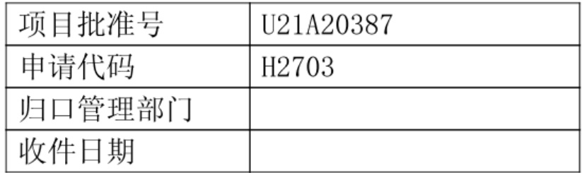

202509U21A20387

# 国家自然科学基金

# 资助项目结题/成果报告

资助类别:联合基金项目

亚类说明:重点支持项目

附注说明:区域创新发展联合基金

基于超快成像的多模态超声影像组学精准诊断冠状动脉微血管疾病的项目名称:方法研究

负责人: 马春燕

BRID: 03395.00.31979

电子邮件: mcy\_echo@163.com

电话: 024-83282114

依托单位: 中国医科大学

联系人:于东

电话: 024-31939077

直接费用:260.0000（万元）

执行年限: 2022.01-2025.12

填表日期:2026年01月31日

国家自然科学基金委员会制（2025年）

## 项目摘要

## 中文摘要:

冠状动脉微血管疾病(CMVD)可显著增加不良心血管事件的发生风险，得到临床高度关注，对CMVD的无创、早期精准诊断将是冠心病领域新的突破点。超声是无创、简便诊断心血管疾病的首选方法，但CMVD面临心肌微血流成像困难的问题，且单一影像方法效能低。我们前期已实现基于超快平台的肾脏微血管成像，因而有望突破超声心肌微血流成像的难题；同时探索融合微血流特征、功能和结构影像及临床信息的多模态超声组学诊断模型的创新性方法，可预见性的能显著提高CMVD的诊断效能。为此，本项目拟攻克基于数字通道信号的超快心肌微血流成像关键技术，明确影像特征变化规律，探索异质性、小样本数据时序/时空特征学习方法，融合多模态数据特征，建立CMVD多模态超声组学诊断模型，并进行临床应用与优化。研究为精准诊断CMVD及明确病情进展、指导治疗、评价疗效提供无创、简便的解决方案，并拓展了超声的应用范畴，为心血管疾病诊疗提供新思路。

## Abstract:

Coronary microvascular disease (CMVD) can significantly increase the risk of adverse cardiovascular events, which has received high clinical attention. Noninvasive and early accurate diagnosis of CMVD will be a new breakthrough in the diagnosis and treatment of coronary heart disease. Ultrasound is the preferred method for non-invasive and convenient diagnosis of cardiovascular diseases. However, CMVD is faced with problems of difficulty in myocardial microvascular imaging and low efficiency of single imaging method.We have previously achieved renal microvascular imaging based on the ultrafast platform, which is expected to break through the difficulty of ultrasound myocardial microvascular imaging; Meanwhile, an innovative approach to multimodal ultrasound radiomics diagnostic model integrating the microvascular features, functional and structural images as well as clinical information is explored to significantly improve the diagnostic performance of CMVD. Therefore, this aim of this project is to overcome the key technology of ultra-fast myocardial microvascular imaging based on digital channel signals, clarify the pattern of image feature variation, and explore the learning model for temporal/spatial features from the heterogeneous few shot data. With the learned features, CMVD diagnostic model with the multimodal ultrasound radiomics is built and is evaluated on the clinical application.The research provides a non-invasive and convenient solution for accurate diagnosis of CMVD, specifying the progress of disease, guiding treatment and evaluating efficacy. It also expands the application scope of ultrasound and provides a new insight for the diagnosis and treatment of cardiovascular diseases.

关键词（用分号分开）:超声心动图；心肌声学造影；冠状动脉微血管疾病；

超声组学；多模态数据

Keywords (separated by;): Echocardiography; Myocardial contrast echocardiography; Coronary microvascular diseases; Ultrasound radiomics; Multimodality data

## 结题摘要

中文摘要（对项目的背景、主要研究内容、重要结果、关键数据及其科学意义等做简单概述）:

冠状动脉微血管疾病(CMVD)可显著增加不良心血管事件的发生风险，得到临床高度关注，对CMVD的无创精准诊断将是冠心病领域新的突破点。超声是无创、简便诊断心血管疾病的首选方法，但CMVD面临心肌微血流成像困难的问题，且单一影像方法效能低。亟待突破超声心肌微血流成像的难题，并构建融合微血流特征、功能和结构影像及临床信息的多模态超声组学诊断新模型，以提高CMVD的诊断效能。

项目针对“如何无创、简便、早期精准诊断CMVD”这一亟需解决的临床问题，采用医工结合的方式，开展以下研究:首先在超快超声平台上开展基于数字通道信号的超快心肌微血流成像(UF-MFI)关键技术研究，实现心肌微血流成像所需的超快图像采集、心肌微血流多普勒信号与组织信号的有效分离，并对心肌感兴趣区域矩阵网格内各点的多普勒频谱进行分析以完成全视野多普勒参数计算；其次，通过研究生理状态下UF-MFI影像特征与心肌微血流定量信息的对应关系，并构建不同病情进展程度及治疗状态的CMVD猪模型，比较不同病程阶段及治疗前后UF-MFI影像特征的变化，揭示CMVD相关UF-MFI影像特征的变化规律，并从微血管功能与结构层面阐明其生物学机制 最后，建立CMVD研究队列并开展多模态数据采集，针对多源异质性特征进行小样本特征学习，构建并验证多模态超声影像组学诊断模型，采用多种统计指标评价其临床诊断效能，并通过特征学习与多模态融合不断迭代优化模型。

项目攻克了基于数字通道信号的UF-MFI关键技术，建立了一种无创、简便且不依赖增强剂的心肌微血流超声成像新方法，系统明确了CMVD的UF-MFI影像特征变化规律，构建了诊断准确率超过90%的C MVD多模态超声影像组学模型，并研发了一套CMVD无创、简便和精准诊断的软件系统，可用于病情评估、疗效监测；同时，依托该项目已发表SCI论文10篇，授权专利4项，申请专利1项，申请软件著作权1项，获辽宁省科技进步二等奖1项，培养博硕士研究生8名。

项目研究成果为精准诊断CMVD及明确病情进展、指导治疗、评价疗效提供了无创、简便的解决方案，拓展了超声的应用范畴。此外，依托超声可及性强、成本较低的优势，有望为CMVD的精准诊断提供可推广的辅助诊断工具，并为基层医疗与分级诊疗体系建设提供支持。

## Abstract (Brief description of research background, main methods, contributions, and research data):

Coronary microvascular disease (CMVD) substantially increases the risk of adverse cardiovascular events and has therefore become a major focus of clinical interest. The development of a noninvasive and accurate diagnostic approach for CMVD represents a critical unmet need and a potential breakthrough in the field of coronary artery disease. Although ultrasound is the preferred first-line modality for noninvasive and convenient cardiovascular assessment, its application to CMVD is limited by the difficulty of myocardial microvascular flow imaging and the relatively low diagnostic performance of single-modality imaging. There is thus an urgent need to overcome the technical barriers of ultrasound-based myocardial microcirculation imaging and to develop a novel multimodal ultrasound radiomics framework that integrates microvascular flow, functional and structural imaging features, together with clinical information, to improve the diagnostic accuracy for CMVD.

To address the clinically urgent problem of how to achieve noninvasive, convenient, and early precise diagnosis of CMVD, this project adopted an interdisciplinary medical - engineering approach. First, key ultrafast myocardial microvascular flow imaging (UF-MFI) techniques based on digital channel signals were developed on an ultrafast ultrasound platform, enabling ultrafast image acquisition for myocardial microvascular imaging, effective separation of microvascular Doppler signals from tissue signals, and full-field Doppler parameter computation through spectral analysis at each point within a matrix grid of myocardial regions of interest. Second, by investigating the relationship between UF-MFI imaging features and quantitative myocardial

microvascular flow under physiological conditions, and by establishing porcine CMVD models with different disease stages and treatment states, we compared UF-MFI features across disease progression and before and after therapy to characterize CMVD-related UF-MFI patterns and to elucidate their biological basis from the perspective of microvascular structure and function. Finally, a CMVD research cohort was established for multimodal data acquisition, and small-sample feature learning was performed to handle heterogeneous multi-source data, leading to the construction and validation of a multimodal ultrasound radiomics diagnostic model. Its clinical diagnostic performance was evaluated using multiple statistical metrics, and the model was iteratively optimized through feature learning and multimodal fusion. The project successfully overcame key technical barriers in UF-MFI based on digital channel signals and established a novel noninvasive, simple, and contrast-agent-free ultrasound approach for myocardial microvascular flow imaging. It systematically characterized the UF-MFI imaging signatures of CMVD and developed a multimodal ultrasound radiomics model with a diagnostic accuracy exceeding 90%, together with a dedicated software system for noninvasive, convenient, and precise CMVD diagnosis, disease assessment, and therapeutic response monitoring. To date, the project has resulted in 10 SCI-indexed publications, 4 granted patents, 1 pending patent application, 1 software copyright, one Second Prize of the Liaoning Provincial Science and Technology Progress Award, and the training of 8 doctoral, and master's trainees. Overall, these achievements provide a noninvasive and practical solution for the precise diagnosis of CMVD, assessment of disease progression, guidance of therapy, and evaluation of treatment efficacy, while substantially expanding the scope of ultrasound in microcirculatory imaging. Owing to the wide availability, low cost, and ease of use of ultrasound, the proposed methodology has strong potential for broad clinical translation, supporting primary care and hierarchical medical systems and improving access to advanced CMVD diagnostics.

关键词（用分号分开）:冠状动脉微血管疾病；超快心肌微血流成像；多模态超声影像组学；心肌微循环功能与结构；无创精准诊断

Keywords (separated by;): Coronary Microvascular Disease; Ultrafast Myocardial Microvascular Flow Imaging; Multimodal Ultrasound Radiomics; Myocardial Microcirculation Function and Structure; Non-invasive Precision Diagnosis

## 正文

## (一）结题部分

## 1. 研究计划执行情况概述

## (1) 按计划执行情况

本项目自2022年1月启动以来，按照拟定的目标及任务分阶段研发，完成了项目既定目标，具体如下:

2022年，完成了基于数字通道信号的超快心肌微血流成像（UF-MFI）关键技术研究，建立了不同病情进展及治疗状态的冠状动脉微血管疾病（CMVD)-猪模型，并完成了CMVD回顾性队列的多数据源异质性分析。

2023年，建立CMVD前瞻性研究队列，完成不少于200例病例入组，系统采集临床信息及多模态超声数据；同步开展了CMVD-猪模型UF-MFI影像特征变化及机制研究，并对小样本超声图像进行了时序及时空特征学习。

2024年，进一步完善前瞻性队列建设，累计完成300余例病例入组，构建了多模态影像组学诊断模型，并开展模型验证与初步临床应用评估。

2025年，完成诊断模型的进一步验证与优化，系统总结研究成果，开展学术交流，完成论文发表、专利申请及项目验收等工作。

项目各阶段研究任务均按计划完成，研究工作运行平稳。

## (2) 研究目标完成情况

本项目围绕立项时提出的研究目标，系统开展了基础研究、动物实验、临床队列研究及模型构建与验证等工作，研究目标已完成并达到预期要求，完成的研究目标如下:

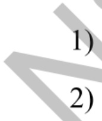

攻克基于数字通道信号的UF-MFI关键技术；

2) 明确CMVD的 UF-MFI影像特征变化规律及机制；

3) 构建CMVD的多模态超声影像组学精准诊断模型。

## 2.研究工作主要进展、结果和影响

## (1) 主要研究内容

## 内容一:基于数字通道信号的UF-MFI关键技术研究

基于超快超声平台实现心肌微血流成像所需的超快图像采集；开展心肌微血流多普勒信号与组织信号的有效分离；在此基础上，对心肌感兴趣区域矩阵网格内各点的多普勒频谱进行分析，完成全视野多普勒参数计算。

## 内容二:CMVD的UF-MFI影像特征变化规律及机制研究

研究生理状态下UF-MFI影像特征与心肌微血流定量信息的对应关系；构建不同病情进展程度及接受治疗的CMVD猪模型，比较不同病程阶段及治疗前后UF-MFI影像特征的变化，揭示 CMVD 相关UF-MFI影像特征的变化规律；进一步分析UF-MFI获得的心肌微血流定量信息与微血管功能及结构之间的关系，从机制层面阐明CMVD中UF-MFI影像特征变化的生物学基础。

## 内容三:多模态超声影像组学融合的 CMVD 诊断模型的构建及临床应用

建立CMVD研究队列并开展多模态数据采集；研究多数据源异质性特征，开展小样本数据特征学习并构建多模态超声影像组学诊断模型；对多模态超声影像组学诊断模型进行验证与临床应用评估，采用多种统计指标评价其诊断效能，并通过特征学习与多模态融合迭代优化模型。

## (2) 取得的主要研究进展、重要结果、关键数据等及其科学意义或应用前景内容一:基于数字通道信号的 UF-MFI 关键技术研究

本项目围绕UF-MFI成像技术，自主研发了一套具有开放式架构的超快多普勒成像系统平台。该平台采用创新性的模块化设计理念，具备完整的超快多普勒成像处理链路，实现了超快超声图像采集、心肌微血流多普勒信号与组织信号分离及全视野多普勒参数计算等核心功能，总体设计框架如图1所示。

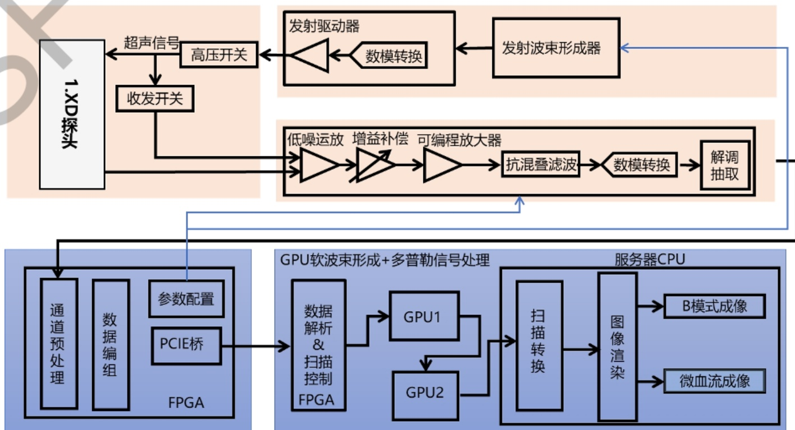

图1 基于数字通道信号的UF-MFI成像系统平台总体设计框架

## 1) 超快超声图像采集

本项目为满足超快超声成像对高通道数、高带宽与实时处理能力的要求，构建了一套高性能的超快超声图像采集系统。该系统围绕“高速采集-并行处理-实时显示”的技术路线，综合采用模块化前端采集与后端处理平台，实现从超声激励、回波采集到多维信息重建与可视化的完整闭环，整体硬件结构如图2所示。该系统在保证灵活可扩展性的同时，兼顾数据吞吐能力与实时处理性能，为高帧率、高灵敏度的超快多普勒成像提供了可靠基础。

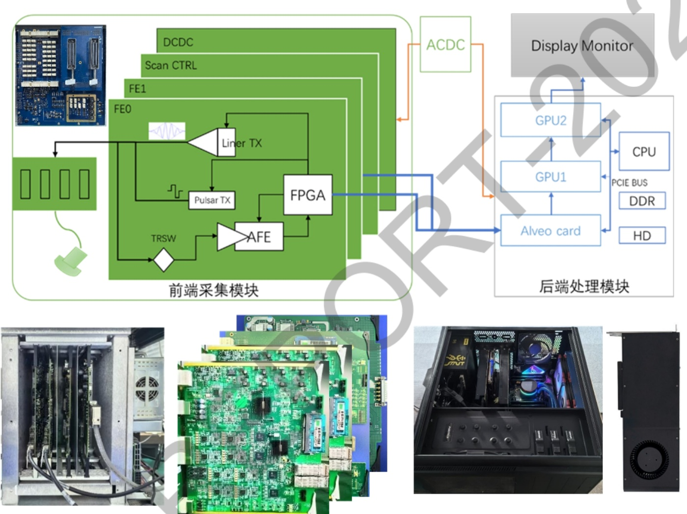

图2 超快超声图像采集系统的整体硬件结构

超快超声图像采集系统由前端采集模块和后端处理模块两部分组成。

前端采集模块包括采集电路板、电源及传感器接口等组件，负责完成超声号的激励、接收及数据预处理。系统采用模块化设计架构，每块前端采集板(FE板）集成64个收发通道，支持两块FE板并联工作，从而构建128通道的收发系统。发射端采用线性发射架构，可实现任意波形激励，并支持发射幅度调制与波形加窗，以满足精细化发射控制的需求。

后端处理模块以服务器主机为核心，通过PCIe总线将高速FPGA采集卡与两块高性能GPU互联，构成异构并行计算架构，实现对超声回波数据的整序转换、波束形成以及二维成像与多普勒信息处理，最终完成实时动态多普勒图像显示。

前后端模块之间通过 Molex74764-11014 ×10G 高速差分线缆进行数据传输。该系统的主要组件配置如表1所示。

表1 超快超声图像采集系统主要组件配置表

<table><tr><td>类别</td><td>型号选型</td><td>功能数量</td></tr><tr><td rowspan="3">前端配置</td><td>发射电路主芯片:AD9106+HDML55L2</td><td>实现128通道线性发射，</td></tr><tr><td>接收电路主芯片:AFE58JD48</td><td>实现128通道发射接收，线性</td></tr><tr><td>FPGA: AMD Xilinx KU5P</td><td>发射 4 片 FPGA 负责收发控制</td></tr><tr><td rowspan="6">后端配置</td><td>主板:Supermicro M12SWA-TF</td><td>其中两块 GPU分别负责波束</td></tr><tr><td>CPU : AMD Ryzen Threadripper PRO 形成和多普勒信息处理</td><td></td></tr><tr><td>5945WX</td><td>采集卡负责扫描循环配置及</td></tr><tr><td>内存:Samsung-DDR4-3200MT</td><td>数据中转</td></tr><tr><td>GPU: NVIDIA Geforce RTX 4090</td><td></td></tr><tr><td>采集卡:AMD Alveo™M U55C</td><td></td></tr><tr><td></td><td>硬盘:2TB Samsung-SSD 990 PRO</td><td></td></tr></table>

该系统实现了对超快多普勒信号的高性能采集、处理与存储，其主要达成指标如表2所示:

表2超快超声图像采集系统主要达成指标

| 采集系统核心参数 | 达成指标 |
| --- | --- |
| 通道数据采样带宽 | 81.92Gbps（128 通道/RF16bits/40MHz） |
| 数据处理带宽 | 20.48Gbps（128通道/IQ32bits/5MHz） |
| 最高采集帧频 | 20KHz |
| 最高存储帧数 | 10.28GB/次，连续数据采集时间>5秒 |
| 最高成像分辨率 | 0.3mm 以上 |

## 2)心肌微血流多普勒信号与组织信号分离

在超快超声成像过程中，组织运动信号与血流信号在时域和频域中高度混叠，严重制约了灌注评估的准确性。针对这一问题，本项目提出了一种基于多角度相干复合与奇异值分解(SVD)的自适应分离算法，构建了一条从多角度平面波高速采集到时空数据建模，再到SVD自适应分离与心肌灌注定量评估的完整技术流程，具体技术方案如图3所示。该流程首先利用多角度平面波实现大视场、高帧率成像，通过相于复合增强空间一致性；随后将时序与空间信息联合构建高维数据矩阵，刻画组织与血流的混合特性；在此基础上，引入基于能量分布的奇异值分解实现两类信号的自适应分离；最终获得高信噪比的心肌运动图像与微血流多普勒图像，具体如下:

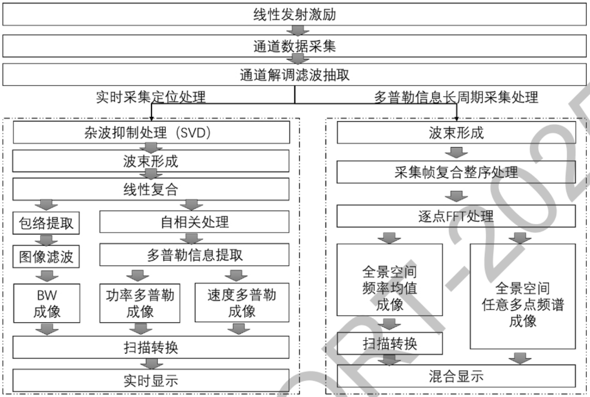

图3 心肌微血流多普勒信号与组织信号分离技术方案

## ① 多角度平面波超快成像与相干复合

超快成像中高帧频依赖于单次发射覆盖较大的扫查范围并完成成像，因此项目中采用非聚焦波来扩大单次发射的声场辐射范围。包括发射M个不同偏转角度平面波，获得的远高于传统成像方式的帧率。首先对不同扫查角度$\theta _ { 1 } , \theta _ { 2 } , . . . , \theta _ { n }$ 下采集的超声回波序列进行相干复合。对空间位置 $( x , y , z )$ 处的回波强度 $I ( x \mathcal { G } , \underline { { \sigma } } )$ 利用泰勒展开近似表示角度偏移(∆x,∆y)后的信号:

$$
\begin{aligned}I(x, y, \Delta x, \Delta y, \sigma) = I(x, y, \sigma) + (\frac{\partial x}{\partial I} \Delta x + \frac{\partial y}{\partial I} \Delta y) \\+ \frac{1}{2!} (\frac{\partial^2 I}{\partial x^2} \Delta x^2 + 2 \frac{\partial^2 I}{\partial x \partial y} \Delta x \Delta y + \frac{\partial^2 I}{\partial y^2} \Delta y^2)\end{aligned}
$$

在小角度近似下，可将其线性化，得到角度复合的局部能量模型:

$$
I ( x , y , \Delta x , \Delta y , \sigma )   \approx   [ \Delta x , \Delta y ] ^ { T } H _ { \sigma , y , x } [ \Delta x , \Delta y ]
$$

其中 $H _ { \sigma , y , x }$ 为局部Hessian矩阵，用于描述能量在空间中的二阶变化。进一步对复合后的能量场进行拉普拉斯变换，得到混合能量分布:

$$
L _ { \sigma } ( x , y , \sigma ) = \sigma ^ { 2 } I ( x , y ) + \frac { \partial ^ { 2 } } { \partial x ^ { 2 } } G ( x , y , \sigma )
$$

式中 $G ( x , y , \sigma )$ 为标准差 $\sigma$ 的高斯核函数，用于平滑能量分布并抑制噪声。

## 2 时空数据矩阵构建与信号混合特性

将多角度复合后的序列沿时间轴与空间轴进行整合，构建高维数据矩阵$X \in R ^ { M \times N }$ ，其中行代表空间采样点，列代表时间帧。该矩阵同时包含两类主要成分:组织运动分量:低频、大振幅、高能量的心肌整体运动信号；血流分量:高频、小振幅、低能量的微血流多普勒信号。

由于两类信号在时域和空域上高度混叠，需要进一步采用矩阵分解方法进行分离。

## 3 基于 SVD的组织与血流自适应分离

对矩阵X进行奇异值分解（SVD）， $X   =   U \Sigma V _ { \phi } ^ { H }$ ，其中: $\mathcal { \hat { M } }   \in   R ^ { M \times M }$ ，左奇异向量，代表空间模式； $\Sigma \in R ^ { M \times N }$ ，奇异值对角矩阵，按能量从大到小排列；$V ^ { H } \in R ^ { N \times N }$ ，右奇异向量的共轭转置，代表时间模式。根据奇异值的能量分布，设定双阈值 $\lambda _ { c 1 }$ 和 $\lambda_{c2} \quad (\lambda_{c1} > \lambda_{c2})$ ，将奇异值划分为三类:1. 组织主导分量:$\left| \lambda \right| > \lambda _ { _ { c 1 } }$ ，对应心肌整体运动；2.血流主导分量: $\lambda_{c2} < | \lambda | < \lambda_{c1}$ ，对应微血流；3. 噪声分量: $| \lambda | < \lambda _ { c 2 }$ ，直接舍弃。重构组织信号矩阵 $X ^ { \prime }$ 和血流信号矩阵 $X ^ { \prime \prime }$

$$
X = X - U \Sigma ^ { \prime } V ^ { H }
$$

$$
X ^ { \prime \prime }   =   X   -   U \Sigma ^ { \prime \prime } V ^ { H }
$$

其中 $\Sigma ^ { \prime }$ 为仅保留组织主导奇异值的对角矩阵， $\Sigma ^ { \prime \prime }$ 为仅保留血流主导奇异值的对角矩阵。

## 4 自适应阈值策略与心肌灌注评估

在阈值选择方面，采用基于奇异值能量累积比例的自适应策略: $\lambda _ { c 1 }$ 取奇异值能量累积占比达到95%时的阈值，确保覆盖主要组织运动； $\lambda _ { c 2 }$ 取奇异值能量累积占比达到99.5%时的阈值，用于剔除噪声。

最后，经重构后可获得高信噪比的心肌运动图像，用于位移与应变等形变参数分析，同时得到清晰的心肌微血流多普勒图像，用于心肌灌注的定量评估。通过该流程，实现了高帧频超声数据采集与多普勒分析，从而获得常规超声难以获取的血流动力学信息。

## 3) 全视野多普勒参数计算

本项目的系统平台以超高帧率、长时连续采集与全视野频谱分析能力为核心目标，为此构建了能够在大数据量条件下稳定获取和存储超快多普勒序列的成像与处理体系。相比传统超声血流成像与脉冲多普勒频谱分析方式，本系统在数据规模、时间连续性和空间覆盖范围上均实现数量级提升，从而支持全视野频率均值成像以及任意空间位置的多普勒频谱分析。

其中，“超高帧率”是指在给定成像深度条件下，成像帧率接近声波单次收发所允许的物理极限；“长周期采集”是指能够连续存储持续数秒、规模达上万帧的多普勒成像数据，单次采集数据量超过10GB，从而覆盖多个心动周期的完整动态过程。系统在完成实时定位后由操作者触发采集指令，实现数秒级不间断的连续数据获取与存储。

在获得波束形成后的初步成像帧后，可根据观察时长需求对采集数据进行分段处理。对超声IQ序列进行逐点全带宽短时傅里叶变换，获取每个成像点$( x , y )$ 对应的多普勒频谱信息:

$$
S(t,f,x,y)=STFT\left\{ \underline{X}(t,x,y) \right\}
$$

其中 $S ( t , f , x , y )$ 为时频能量谱，t为时间，f为频率。能够展示组织运动（心肌壁）与中高频微血流信号的能量分布。

基于频域能量分布，对每个成像点的频谱进行自适应阈值分割，分离组织、血流与噪声分量，对分割后的血流频谱采用质心法进行速度估计，得到每个成像点的血流速度参数:

$$
v ( x , y ) = \frac { \sum _ { f \in \Omega _ { b l o o d } } f | S ( f , x , y ) | } { \sum _ { f \in \Omega _ { b l o o d } } | S ( f , x , y ) | }
$$

其中 $\textcircled{Q}  _ { b l o o d }$ 为血流频谱的频率区间， $\nu ( x , y )$ 为血流速度，有效提升了低速血流的检测灵敏度。将正向与反向血流速度参数进行空间叠加，生成全视野血流速度图:

$$
V(x,y)=w_{+}v_{+}(x,y)+w_{-}v_{-}(x,y)
$$

其中 $\nu _ { {   } _ { + } } ( x , y )$ 和 $\nu _ { - } ( x , y )$ 分别为正向与反向血流速度， $w _ { + }$ 和 $w _ { - }$ 为对应权重系数。双向叠加有效提升了血流方向与速度的显示连续性，抑制了角度依赖伪影。

相较于传统脉冲多普勒频谱仅能在同一时间提供单一空间点的频谱信息，本项目能够同步获得视野内多个甚至任意位置的频谱变化结果，有助于更全面地表征全局多普勒信息。

## 内容二:CMVD的 UF-MFI影像特征变化规律及机制研究

## 1) 明确生理状态UF-MFI影像特征与心肌微血流定量信息的关系

本项目为明确生理状态UF-MFI影像特征与心肌微血流定量信息的关系，对健康实验猪进行UF-MFI和PET检查，获取心肌微血流定量参数。

项目纳入10只健康成年雌性实验猪，月龄为9.3±0.9，体重为27.66±3.78kg。采集实验猪 UF-MFI 超声图像及 PET 图像(图 4)，测量 UF-MFI 血流动力学参数(VM、MPG) 以及心肌血流灌注量 MBF，测量 PET 心肌血流灌注量 MBF (表 3)

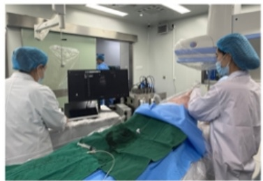

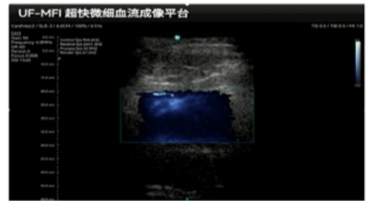

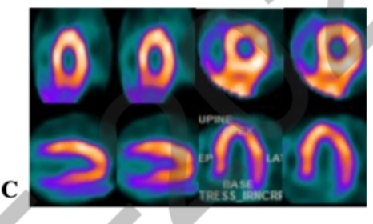

图4 实验猪 UF-MFI 及 PET 影像。图 A:应用 UF-MFI 成像系统平台采集健康实验猪心脏图像；图B:UF-MFI成像系统平台采集的健康实验猪心脏图像；图C:PET成像采集的健康实验猪心脏图像

表 3 实验猪 UF-MFI 及 PET 微血管血流参数

<table><tr><td></td><td>CMV D-1</td><td>CMV D-2</td><td>CMV D-3</td><td>CMV D-</td><td>CMV D-5</td><td>CMV D-6</td><td>CMV D-7</td><td>CMV D-8</td><td>CMV D-9</td><td>CMV D-10</td></tr><tr><td>UF-MFI</td><td colspan="8"></td><td></td><td></td></tr><tr><td>VM(cm/s)</td><td>17.7</td><td>16.5</td><td>17.3</td><td>16.7</td><td>15.4</td><td>16.9</td><td>18.1</td><td>17.7</td><td>16.8</td><td>17.2</td></tr><tr><td>MPG(mmHg)</td><td>0.13</td><td>0.11</td><td>0.12</td><td>0.11</td><td>0.09</td><td>0.11</td><td>0.13</td><td>0.13</td><td>0.11</td><td>0.12</td></tr><tr><td>MBF(ml/min.g)</td><td>1.2</td><td>1</td><td>1.1 1.3</td><td>0.9</td><td></td><td>1.2</td><td>1.4</td><td>1.2</td><td>1</td><td>1.1</td></tr><tr><td>PET</td><td></td><td></td><td></td><td></td><td></td><td></td><td></td><td></td><td></td><td></td></tr><tr><td>MBF(ml/min.g)</td><td>1.3</td><td>.2</td><td>1.2</td><td>1.3</td><td>1</td><td>1.3</td><td>1.4</td><td>1.3</td><td>1.1</td><td>1.1</td></tr></table>

注:VM:平均血流速度；MPG:平均压差；MBF:心肌血流量。

## 明确 CMVD 的 UF-MFI 影像特征变化规律

本项目为明确CMVD的UF-MFI影像特征变化规律，构建不同病情进展程度及给予治疗的 CMVD-猪模型，进行UF-MFI和 PET检查。

构建CMVD-猪模型:选择30只健康成年雌性实验小型猪，月龄为8.9±1.3，体重为26.97±4.12kg。连续3 天以 50mg/kg·天的剂量注射链脲佐菌素(STZ) 诱导糖尿病，检测血糖和酮体水平；自第4天起，进行高脂高糖高盐饲料喂养，饲料包含10%蔗糖、15%果糖、25%饱和脂肪、1%胆固醇及20g/天氯化钠，喂养一周。其中20只喂养至10周后，随机选择10只进行尼可地尔药物治疗（CMVD-治疗猪)，另10只无治疗(CMVD-10W猪);其余10只喂养至24周(CMVD-24W猪)。

在基线状态和建模之后进行UF-MFI检查，采集超声图像，同时进行PET检查(图5)，测量两种检查的心肌血流灌注量MBF 及UF-MFI血流动力学参数(VM、MPG)。结果提示，与对照组相比较，CMVD-10W、CMVD-24W以及CMVD-治疗组 UF-MFI 的 MBF 及 PET 的 MBF 均减低，且 CMVD-24W 减低较CMVD-10W 更为显著，而 CMVD-治疗组的 MBF 较 CMVD-24W 有所升UF-MFI血流动力学参数亦有不同程度改变(表4)。

比较治疗前后 UF-MFI 影像特征变化:通过分析 UF-MFI 与 PET 获取的影像特征之间的关系，比较CMVD 治疗前后的UF-MFI 影像特征变化。

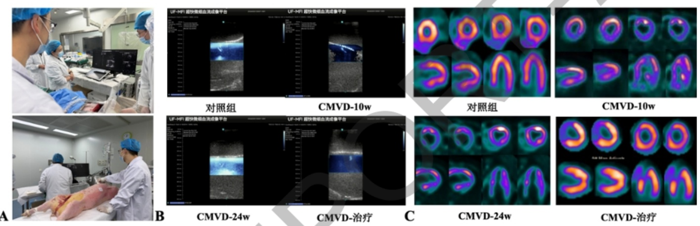

图 5 不同程度 CMVD 猪模型 UF-MFI 及 PET 影像。图 A:建立 CMVD-10w、24w 以及治疗组猪模型，应用 UF-MFI成像系统平台采集心脏图像；图B:UF-MFI成像系统平台采集的不同组 CMVD 猪心脏图像；图C:PET 成像采集的不同组 CMVD 猪心脏图像。

表 4 CMVD 猪模型 UF-MFI 及 PET 微血管血流参数比较

|  | 对照组 | CMVD-10w | CMVD-24w | CMVD-治疗 | P |
| --- | --- | --- | --- | --- | --- |
| UF-MFI |  |  |  |  |  |
| VM(cm/s) | 21.1±3.4 | 17.0±1.3 | 14.4±2.7 | 16.7±3.7 | &lt;0.05 |
| MPG(mmHg) | 0.18±0.32 | 0.12±0.02 | 0.08±0.01 | 0.11±0.03 | &lt;0.05 |
| MBF(ml/min.g) | 1.7±0.3 | 1.1±0.3 | 1.1±0.4 | 1.3±0.4 | &lt;0.05 |
| PET |  |  |  |  |  |
|  |  |  |  |  |  |
| MBF | 1.9±0.5 | 1.2±0.2 | 1.2±0.3 | 1.6±0.4 | &lt;0.05 |

## 3) 明确 CMVD 的 UF-MFI 影像特征变化的机制

项目为明确CMVD的UF-MFI影像特征变化的机制，采用分子生物学和组织学方法，检测各组猪模型的心肌微血管功能和组织学结构。

心肌微血管功能:采用 ELISA 检测各组实验猪血清 eNOS、ET-1 和 ICAM-1表达情况，结果表明与对照组相比较，CMVD-10W、CMVD-24W以及CMVD-治疗组的ET-1 及ICAM-1均升高，CMVD-24W升高较 CMVD-10W更为显著，而 CMVD-治疗组的 ET-1 及 ICAM-1 较 CMVD-24W 减低；而 eNOS 的检测结果则相反(图 6A)。采用 Western blot 方法检测各组实验猪心脏微血管组织 eNOS、ET-1 和 ICAM-1 表达情况。实验结果与各组实验猪血清 eNOS、ET-1 和 ICAM-1表达情况趋势一致(图6B)。

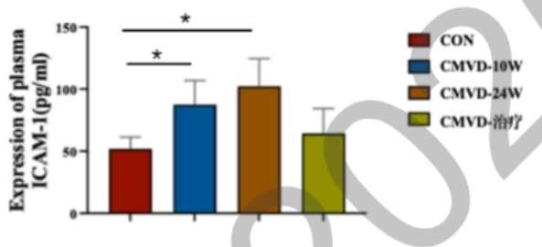

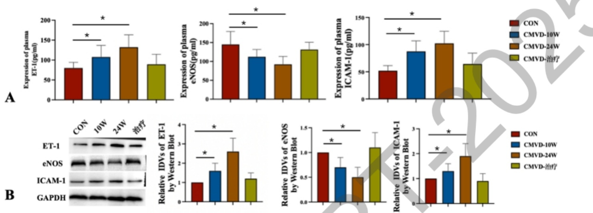

图 6 CMVD 猪模型心肌微血管功能。图 A:血清 eNOS、ET-1和 ICAM-1 的表达情况；图 B:心脏微血管组织 eNOS、ET-1 和ICAM-1 的表达情况。

心肌微血管组织结构:取猪左心室前壁靠近心内膜组织切片后进行HE染色。显微镜下观察，与对照组相比，CMVD各组心肌细胞肿胀，体积增大，肌节弛缓，心肌细胞排列紊乱，线粒体增大、变圆、嵴变短。心肌微血管扩张，中性粒细胞聚集在坏死区边缘的小血管周围。CMVD-24w较10w更为加重，而与CMVD各组相比，治疗组有所改善(图7)。

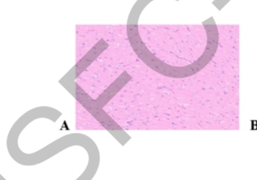

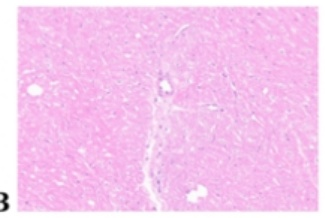

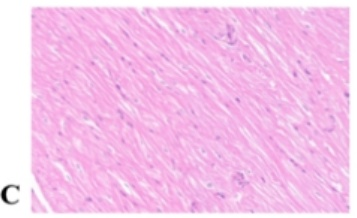

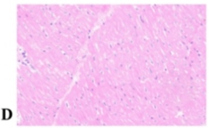

图7CMVD猪模型心肌微血管组织结构。图A:对照组实验猪心肌（微血管）切片；图B: CMVD-10W猪模型心肌（微血管）切片；图C:CMVD-24W猪模型心肌（微血管）切；图D:CMVD-治疗组猪模型心肌（微血管）切片。

心肌微血管超微结构:在体视显微镜下取猪左心室前壁微血管组织，制备超薄切片后染色，并在透射电子显微镜下观察。结果显示，随着造模周数的延长，实验猪微血管内皮细胞出现明显超微结构损伤:内皮细胞水肿并向管腔内突出，胞质内可见空泡和囊泡，内质网及线粒体明显肿胀，相邻内皮细胞之间形成间隙。部分微血管内皮细胞出现核固缩、染色质边集及细胞器崩解等改变。微血管管腔形态不规则，并可见血小板聚集及纤维蛋白网形成。而治疗组上述超微结构损伤程度有所减轻，微血管结构呈现不同程度的恢复(图8)。

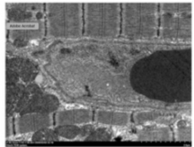

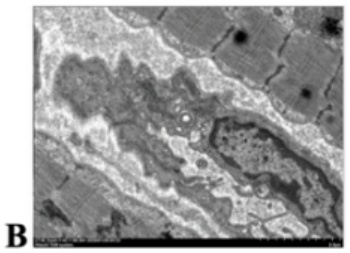

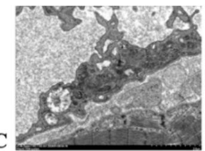

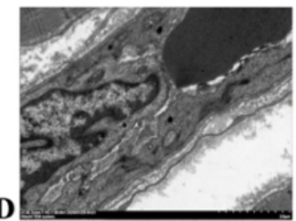

图8CMVD猪模型心肌微血管超微结构。图A:对照组实验猪心肌微血管电镜图 图 B: CMVD-10W猪模型心肌微血管电镜图；图C:CMVD-24W猪模型心肌微血管电镜图； 图CMVD-治疗组猪模型心肌微血管电镜图。

心肌微血管密度:组织切片进行CD31 免疫组化染色。在光学显微镜下，随机选取每个切片中5个不重叠、富含心肌组织的视野。将CD31阳性染色的内皮细胞或形成明确管腔的血管结构计为一个微血管。使用ImageJ软件测量每个视野的实际组织面积。结果提示随着病情进展，CMVD心肌微血管密度减低，而治疗组有一定程度恢复(图9)。

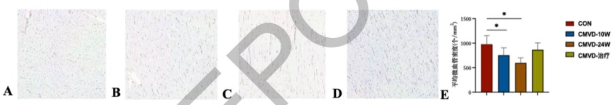

图9CMVD猪模型心肌微血管密度。图A:对照组猪模型心肌微血管密度；图B:CMVD-10W猪模型心肌微血管密度；图C:CMVD-24W猪模型心肌微血管密度；图D:CMVD-治疗组猪模型心肌微血管密度；图E:四组猪模型心肌微血管密度。

## 内容三:多模态超声影像组学融合的 CMVD 诊断模型的构建及临床应用

## 1) CMVD 队列建立及多模态数据采集

本项目依托多中心临床研究(注册号:ChiCTR2100043914)，共纳入CMVD患者378例，其中男性235例，女性143例。具体CMVD队列建立方法如下:选择因胸痛就诊，临床疑诊为“冠心病”，择期冠状动脉造影术证实无明显心外膜下冠状动脉狭窄（<20%）的患者。入选标准:典型心绞痛症状或非ST段抬高型急性心肌梗死症状但硝酸甘油疗效不佳，有静息或负荷状态下心肌缺血的客观证据，无明显心外膜下冠状动脉狭窄（<20%)且PET检测CFR<2.0；排除标准:变异性心绞痛、心肌病、心肌炎、瓣膜病、冠状动脉痉挛、急性心肌炎或超声心动图显示心肌肥厚等。

本项目制定了临床和影像信息采集标准，并按照DICOM和HL7协议进行全面的多模态数据采集，多模态数据包括临床信息及超声影像特征(图10)。临床信息:身高、体重、血压、血糖、血脂等冠心病危险因素、心绞痛症状CCS分级及心肌缺血的客观证据，同时检测血清肌钙蛋白水平。超声影像特征:①常规超声及组织多普勒超声成像:采集心尖三个切面的动态视频，并检测左心室收缩及舒张功能参数；②二维斑点追踪成像:采集左心室18个节段的心肌纵向应变/应变率-时间曲线，并检测应变、应变率及达峰时间；③腺苷负荷冠状动脉血流显像:采集静息及腺苷负荷状态下冠状动脉左前降支远端血流频谱，并测量冠状动脉血流储备；④超快心肌微血流成像:采集心尖三个切面的动态视频，并检测心肌血流量及血流动力学参数。

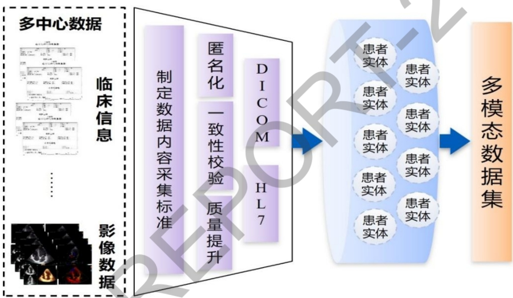

图10按照临床和影像信息采集标准采集多模态数据

## 2) 小样本数据特征学习及诊断模型构建

## ① 小样本数据特征学习

样本特征学习赋予影像分析模型以“举一反三”的能力，使其无需重新训练即可快速适配新任务，在CMVD智能诊断中具有重要的临床应用价值，为此我们提出了RAP小样本特征学习模型(图11)。该模型由空间分支和分割分支两部分构成:空间分支通过将 support 图像配准至 query图像，提供分割目标的粗略空间定位，即实现“在哪里分割”的学习；分割分支基于共享编码器提取support与 query图像的多尺度特征，并通过上下文增强的原型表示计算二者的相似度。解码器利用基于注意力机制的融合模块，将空间位置信息与原型相似度有效整合，将医学先验知识引入模型推理过程，生成更加准确稳定的分割结果。

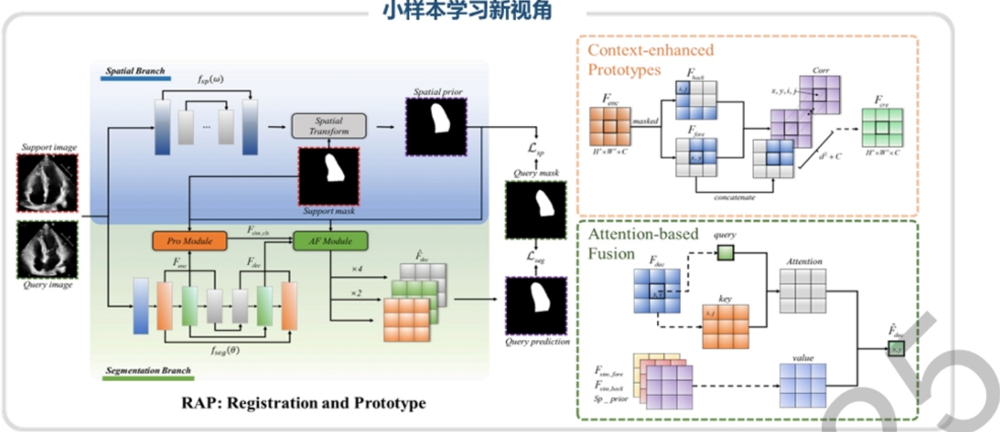

图11 小样本数据特征学习

## ② 诊断模型构建

本项目围绕CMVD超声影像结构细微、运动复杂且多参数耦合的特点，构建了一套覆盖心脏结构精细分割、功能参数自动量化、病变特征智能识别与多模态综合诊断的完整智能分析体系。该体系以左心室心肌分割、关键点与关键帧检测为基础，逐步实现射血分数、舒张功能、局部运动异常及瓣膜钙化等多维心脏表型的自动量化，并进一步通过跨中心鲁棒建模与多模态融合，建立高可靠性的CMVD智能辅助诊断模型，具体如下:

## A. 左心室心肌自动分割

基于拓扑特征与U-Net网络提出拓扑敏感加权模型，该模型能够同时提升心肌分割像素精度与拓扑正确性(图12)。采用双分支架构，分割分支包含心肌完整性拓扑模块以保证心肌分割结果不产生断裂，权重分支包含位置权重更新策略与边界敏感拓扑模块，两者结合以提升心肌边缘的分割质量。

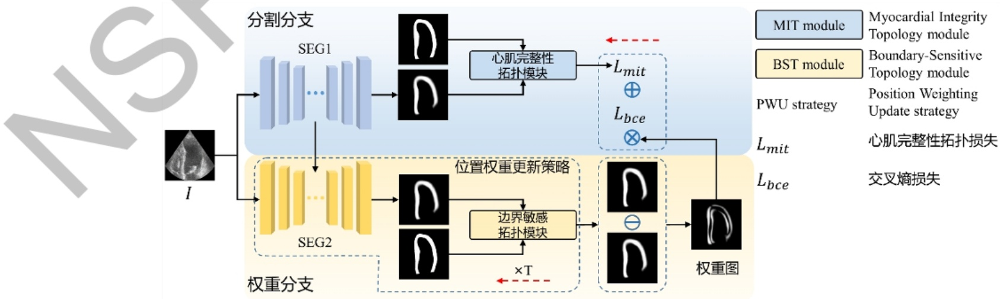

图12基于拓扑特征的左心室心肌自动分割

此外，提出了一种端到端的置信度图细化边界增强网络(CMR-BENet)，从上下文特征融合、边缘结构建模以及置信度图的有效评估与利用三个关键层面系统性提升心肌分割性能(图13)。其中，层语义感知模块通过自适应融合编码器相邻层的语义信息，获取更加丰富的多尺度上下文特征，并有效抑制噪声干扰；边缘信息增强模块进一步提升边界预测的准确性，强化对心肌整体结构特征的刻画能力；最后，基于置信度图的细化模块以简洁高效的方式生成并利用置信度图，对分割结果进行逐步优化，从而实现更加精确且稳健的心肌分割效果。

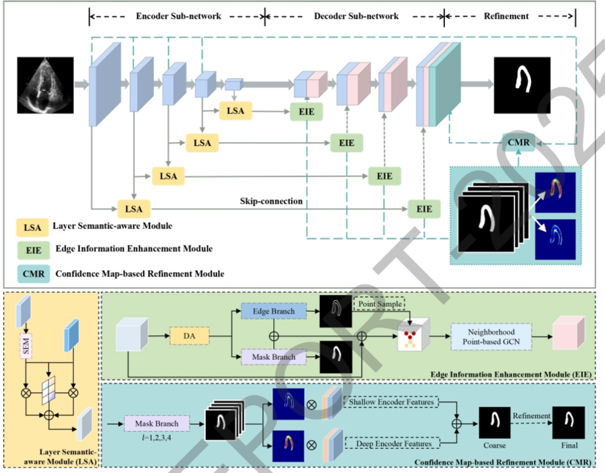

图13基于边界和置信度图的心肌分割

## B. 左心室射血分数智能评估

CMVD 患者左心室射血分数 (LVEF) 的评估依赖医生对左心室轮廓的手动分割及关键解剖标志点的人工定位，流程繁琐且易受主观因素影响。研究提出一种多任务深度学习网络 EchoEFNet (图14)，实现 LVEF的自动化、精准评估。该网络以引入扩张卷积的 ResNet50作为骨干网络，在获取高层语义特征的同时有效保留空间结构信息；其分支解码结构通过多尺度特征融合设计，实现左心室分割与关键标志点的同步检测。基于自动获得的分割掩膜与标志点信息，进一步采用双平面 Simpson 法实现 LVEF的自动计算。

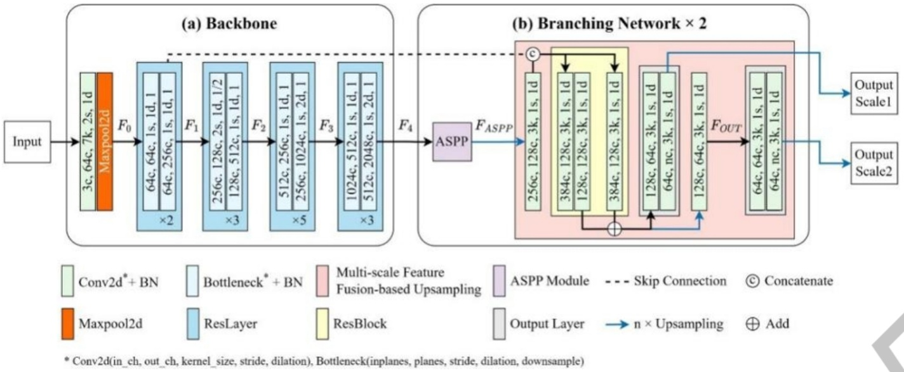

图14 基于左心室分割和标志点检测的左心室射血分数智能评估

## C. 左心室关键点检测

CMVD超声心动图图像常存在组织边界模糊、对比度低等问题，使得关键点连续、稳定检测面临较大挑战。针对超声心动图中关键点相对空间位置稳定、时序变化连续的特点，研究提出一种基于时空图卷积网络的超声心动图关键点自动检测方法(图15)。该方法通过引入时空依赖建模，利用图卷积神经网络学习关键点之间的结构关系，并结合门控循环单元刻画关键点在连续帧中的时间一致性，从而在复杂、模糊的组织背景下显著提升关键点定位的精度与稳定性。同时，模型采用动态邻接矩阵和新型时空解码模块，实现关键点的逐帧精准检测，为左心室结构的自动量化分析提供了可靠技术支撑。

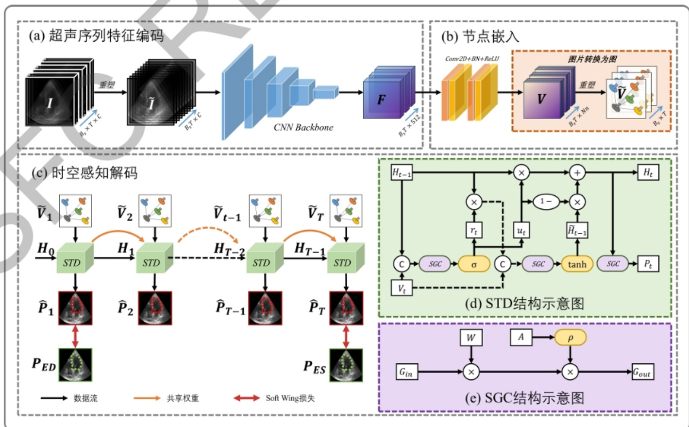

图15 引入时空一致性约束的超声左心室关键点检测

## D. 心脏结构自动测量

针对心脏动态超声序列，临床评估通常需要在特定心动期相对心脏结构进行定量测量，实现关键帧与关键解剖点的自动检测对于CMVD的精准诊断具有重要的临床价值。研究从模型假设空间的角度出发，引入多任务学习策略，解决小样本学习问题(图16)，并联合建模与其高度相关的关键帧识别任务，充分挖掘两者之间的内在关联，学习更加稳健的共享特征表示，提出了一种端到端的关键帧与关键点同步检测模型。同时，针对稀疏标注数据所固有的不确定性，引入贝叶斯推断框架，对模型参数与预测结果进行后验建模，在稀疏标注条件下提供可信的不确定性估计，提升模型的稳定性与可靠性。

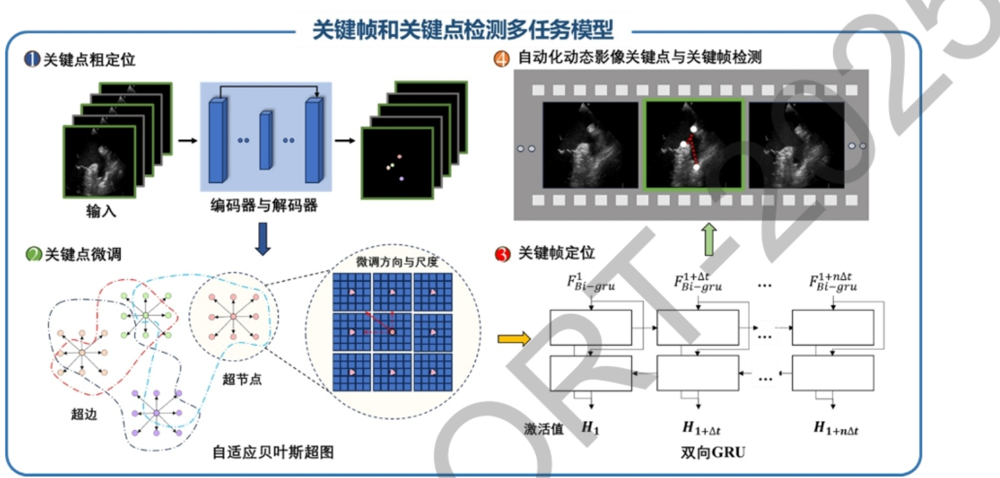

图 16 CMVD 心脏结构自动测量

## E. 心肌局部运动异常智能检测

节段性室壁运动异常(RWMA）是冠心病重要影像表现之一，现有RWMA诊断方法难以表征细微而复杂的室壁运动差异，限制了诊断准确性。研究提出基于时空注意力机制的 RWMA 自动诊断模型(STGA-MS，图17)，该模型由三个核心模块构成:时空分组注意力模块，用于联合建模心肌运动的空间分布特征与时间演化特征；节段特征提取模块，用于精细化提取不同心肌节段区域的运动特征；多尺度下采样模块，通过不同感受野捕获心肌运动形变的多尺度信息，获得更加全面的运动表征。STGA-MS 模型有效提升了RWMA自动诊断准确性与一致性。

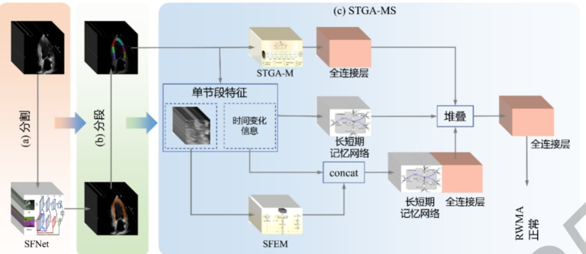

图17 心脏超声局部运动异常智能检测

## F. 主动脉瓣钙化智能识别

基于动态局部特征融合机制，提出了一种用于CMVD心脏超声主动脉瓣钙化的自动识别模型(图18)。该模型引入局部特征融合模块以有效整合分割结果，并通过掩码调节模块补充亮度信息、优化钙化区域掩码表达；同时，构建基于金字塔结构的双分支特征融合模块，实现全局语义信息与局部细节特征的协同建模。该模型显著提升了对CMVD主动脉瓣钙化的表征能力。

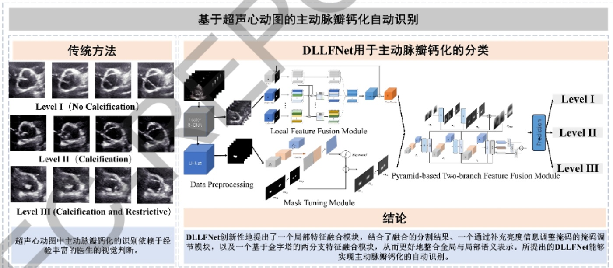

图18 CMVD 心脏超声主动脉瓣钙化智能识别

## 心脏舒张功能智能评估

CMVD心脏舒张功能评估依赖多切面超声图像，并需多参数计算及多条件判断，整体流程复杂、耗时费力。研究构建基于全频域注意力机制的心脏舒张功能评价框架，有效简化舒张功能评估流程（图19)。首先，采用U-Net模型分割完整心动周期内的左心室与左心房；随后，基于凸包算法提取左心室与左心房面积、长度及宽度的时序变化曲线；在此基础上，构建一维ResNet网络，并引入全频域注意力机制对时序曲线进行特征学习，克服传统注意力机制偏重低频信息的问题，全面挖掘多频域特征，实现CMVD心脏舒张功能的全自动、客观评价。

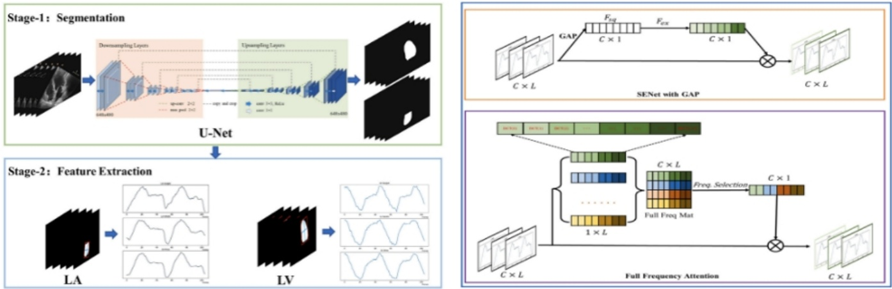

图 19 CMVD 心脏舒张功能智能评估

## H. CMVD 诊断模型

本项目针对超声数据在不同中心、不同设备间的异质性 提出 一种基于时空循环一致性的对抗迁移算法，通过特征空间的判别与对齐，解决源域与目标域分布不均的问题。针对标注数据的稀疏性瓶颈，利用多视角超声心动图建立无向图标签传播机制，并将空域图卷积与时域全局自注意力机制交替整合，深度挖掘心肌在时空维度的细微演变规律。最终，通过稀疏多核学习实现临床信息与影像特征的高阶融合，在剔除模态间冗余变量的同时，建立具有高度可解释性的CMVD智能辅助诊断模型(图20)

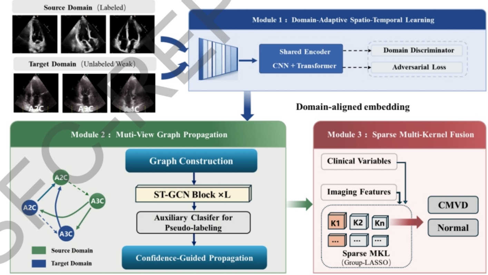

图20 基于稀疏表征与时空对抗迁移的 CMVD诊断模型

本项目完成了CMVD智能辅助诊断模型的研发与验证，形成“多中心鲁棒表征—多视角时空学习—稀疏可解释融合”的完整技术链路。项目提出的多模态模型AUC达0.90，优于临床信息(AUC=0.67)、单模态模型(UF-MFI，AUC=0.78；STE，AUC=0.79)，表明多模态联合建模能够显著提升CMVD的整体判别能力。

消融实验发现，域自适应时空学习模块通过特征空间判别与对齐，将多中心/多设备带来的分布差异压缩到统一的表征空间，提升跨中心泛化稳定性；相应实验表现为 AUC由 0.88提升至0.90。多视角图传播模块利用A2C/A3C/A4C等视角之间的结构关联建立患者级无向图，并以置信度引导的传播机制充分利用弱标注/稀疏标注信息，增强小样本条件下的可学习信号；对应AUC由0.87提升至0.90。时域全局注意力模块在时间维度建模心肌细微演变的长程依赖关系，相比局部或短记忆建模更有利于捕捉微循环功能变化的累积效应；对应AUC由0.87提升至0.90。稀疏多核融合模块对临床变量与影像/功能特征进行高阶融合，同时通过稀疏约束抑制冗余变量、突出关键诊断因子并提供可解释的特征贡献路径；对应 AUC由 0.87提升至 0.90。

## 3) CMVD 诊断模型验证及临床应用

本项目基于多中心、不同设备来源的超声心动图数据对所提出的智能辅助诊断模型进行了系统评估与验证。实验结果表明，该模型在跨中心条件下仍保持稳定且优异的判别性能，多模态联合模型的 AUC 达到 0.90，显著优于单一影像模态或仅依赖临床指标的诊断方式，体现了其良好的泛化能力与临床适用性。在实际应用场景中，模型能够整合UF-MFI、 应变成像及临床参数，输出具有可解释性的CMVD风险评估结果，为医生提供定量化、客观化的诊断依据。同时，稀疏多核融合与时空一致性约束使模型在小样本和弱标注条件下依然具备可靠性，具备在真实临床工作流程中推广应用的可行性，可用于CMVD的早期筛查、病情分级及疗效随访评估。

## 科学意义或应用前景

项目围绕“如何无创、简便、早期精准诊断CMVD”这一亟需解决的临床系统开展了超快心肌微血流成像关键技术、影像特征变化规律及多模态诊断模型研究。在技术层面，项目基于数字通道信号实现了UF-MFI关键方法的构建，为心肌微血流的定量化分析提供了新的技术手段，有助于拓展超声技术在微循环层面的应用范围。在机制层面，通过CMVD动物模型结合PET成像与组织学检测，初步阐明了UF-MFI影像特征与心肌微血流状态及微血管结构和功能之间的关系，为理解CMVD相关影像学表现提供了实验依据。在临床研究层面，依托CMVD队列，探索多模态超声影像组学融合的诊断模型构建与验证，评估其在CMVD辅助诊断中的潜在价值。

项目拓展了超声技术在心肌微循环层面的应用范围，并为CMVD的早期识别和风险评估提供潜在的辅助诊断手段。在应用层面，鉴于超声检查在基层医疗机构中具有设备覆盖率高、成本相对较低和可操作性强等特点，本项目形成的技术方法具备在更广泛医疗场景中进一步验证和推广的可能性，有望在一定程度上缓解高端影像设备资源分布不均带来的诊疗限制，为分级诊疗体系建设提供参考。相关方法和研究思路也可为其他心血管疾病的超声影像研究与应用提供借鉴。

## 3. 研究人员的合作与分工

本项目围绕CMVD的无创精准诊断，组建了由医学影像、超声工程、人工智能和临床医学多学科交叉组成的研究团队，在项目负责人马春燕的统一组织和协调下，各研究人员围绕超快心肌微血流成像、多模态超声影像组学建模及临床与动物实验验证等核心任务紧密协作，形成了高效稳定的协同研究机制。

在具体分工方面，马春燕负责项目总体设计与实施统筹；杨金柱、李洪赫和冯庸承担多模态超声影像组学模型构建与算法优化；曹鹏和瞿明军负责影像特征学习与定量参数提取方法研究；王宝宇、牛阳、曹蕾负责基于数字通道信号的UF-MFI关键技术研发；贾大林负责CMVD临床研究队列建立与数据管理；王姝负责PET检查及相关对照数据获取；李鑫鑫、赵翠婷和朱晴负责CMVD猪模型构建及影像与病理对照研究。上述分工覆盖了从工程技术、算法建模到临床与动物实验验证的完整技术链条。

在单位合作方面，项目牵头单位中国医科大学主要负责CMVD多模态心脏超声应用、发病机制研究及临床队列建立；合作单位东北大学主要承担多模态超声影像组学诊断模型与人工智能算法研发；合作单位东软医疗系统股份有限公司主要负责心肌微血流成像与超快成像平台的关键技术研发。三方单位在临床需求、算法模型和工程实现等方面优势互补，形成紧密协同的“医-工-企”联合创新体系。

项目执行过程中，随着研究内容不断深化和实验规模扩大，部分研究人员作为新增成员加入课题组以增强关键技术攻关能力，其中冯庸和王永槐补充参与影像组学模型构建，张淼和刘瑞麟加入超快超声成像技术研发团队，李金佩、王诗彤、白雪纯和董天心加入CMVD猪模型研究与实验验证工作。上述人员的加入主要是为满足模型优化、成像算法实现及动物实验工作的实际需要，对项目目标的顺利完成发挥了重要支撑作用

## 4. 国内外学术合作交流等情况

主办及承办国家级及省级超声新技术继续教育学习班、规范化巡讲等学术会议14次，参与国际会议交流7人次，参与国家级、省级学术会议30人次。

表 5 主办及承办学术会议情况

| 序号 | 推广方式 | 培训题目 | 时间 |
| --- | --- | --- | --- |
| 1 | 心北方-7省2市联盟学术会议 | 心北方-超声心动图新技术研讨会 | 2022.03.27 |
| 2 | 国家级继续教育项目 | 第二届东北血管超声高端论坛 | 2022.10.15-16 |
| 3 | 省级学术会议 | 辽宁省影像医学临床医学研究中心学术会议 | 2022.06.11 |
| 4 | 省级继续教育项目 | 辽宁省影像医学临床医学研究中心第二届高峰论坛 | 2022.12.18 |
| 5 | 省级继续教育项目 | 辽宁省医学会第三十一次超声医学学术会议 | 2022.12.25 |
| 6 | 省级学术会议 | 2023年第四届超声心动图学术沙龙科研专场 | 2023.02.18 |
| 7 | 省级学术会议 | 2023年辽宁省影像医学临床医学研究中心第三届高峰论坛-心肌肥厚专场 | 2023.03.05 |
| 8 | 国家级继续教育项目 | 2023年CSE全国超声心动图规范化培训班 | 2023.07.06-07 |
| 9 | 省级继续教育项目 | 经食管超声心动图规范化培训班 | 2024.10.06 |
| 10 | 省级学术会议 | 2024辽宁省预防医学会健康测量与评价专委会首届学术会议 | 2024.11.08-10 |
|  | 省级继续教育项目 | 辽宁省医学会第三十二次超声医学学术会议 | 2024.12.06-08 |
| 12 | 省级继续教育项目 | 超声心动图培训班 | 2025.06.11-13 |
| 13 | 省级学术会议 | 辽宁省预防医学会健康测量与评价专委会超声新技术培训 | 2025.06.27-28 |
| 14 | 省级学术会议 | 辽宁省医学会第三十三次超声医学学术会议 | 2025.12.19-21 |

表6 国际会议交流情况

| 序号 | 姓名 | 会议 | 题目 | 时间 |
| --- | --- | --- | --- | --- |
| 1 | 马春燕 | 2024年美国超声心动图学会年会 | Clinical Application Considerations ofTissue Motion Annular Displacement | 2024.6.14-16 |
| 2 | 王永槐 | 2024年美国超声心动图学会年会 | Predicting Coronary Artery Stenosis inPatients without Carotid Plaques: CanCarotid Elasticity Modulus Steal theSpotlight? | 2024.6.14-16 |
| 3 | 董天心 | 2024年美国超声心动图学会年会 | Left Atrial Stiffness Index andCardiovascular RiskFactors: APopulation- Based Multicenter Study | 2024.6.14-16 |
| 4 | 王宝宇 | 2024年图像信号处理、生物医药工程与信息学大会 | A Real-time GPU-based Frameworkfor Curved Array Ultrafast UltrasoundDoppler Imaging. | 2024.10.26-28 |
| 5 | 杨倩蓥 | 2025 年第 20届世界超声医学与生物学联合会大会 | Diagnostic efficacy of tissue motionannular displancement to detectsubclinical cardiotoxicity in breastcancer patients | 2025.5.29-6.1 |
| 6 | 王永槐 | 2025年第 20届世界超声医学与生物学联合会大会 | Deep learning-based workflow forone-stop assessment of left ventricularfunction using two-dimensionalechocardiogram | 2025.5.29-6.1 |
|  | 陈孟嘉 | 2025年美国超声心动图学会年会 | Multimodal imaging in the diagnosisof left ventricular aneurysm-True orfalse | 2025.9.5-7 |

## 5.存在的问题、建议及其他需要说明的情况无。

## （二）成果部分

## 1. 项目取得成果的总体情况

## (1) 攻克了基于数字通道信号的 UF-MFI 关键技术

本项目攻克了基于数字通道的UF-MFI关键技术，构建了超快多普勒成像平台，实现高帧率、高分辨率的超声采集与多GPU并行高速处理，处理效率较传统系统提升显著；同时突破了自适应血流分离与全视野多普勒参数计算技实现心肌微血流的精准成像与定量分析。

## (2) 构建了 CMVD 多模态超声影像组学诊断模型

本项目构建了基于稀疏表征与时空对抗迁移的CMVD诊断模型，诊断AUC达0.90。

## (3) 研发了一套CMVD 诊断软件系统

本项目研发了一套 CMVD 诊断软件系统 (图 21)，该诊断软件系统集成了数据采集、信号处理、特征提取与智能诊断等核心功能，系统采用模块化架构和可视化界面设计，能够对多源数据综合分析， 实现对 CMVD智能诊断。

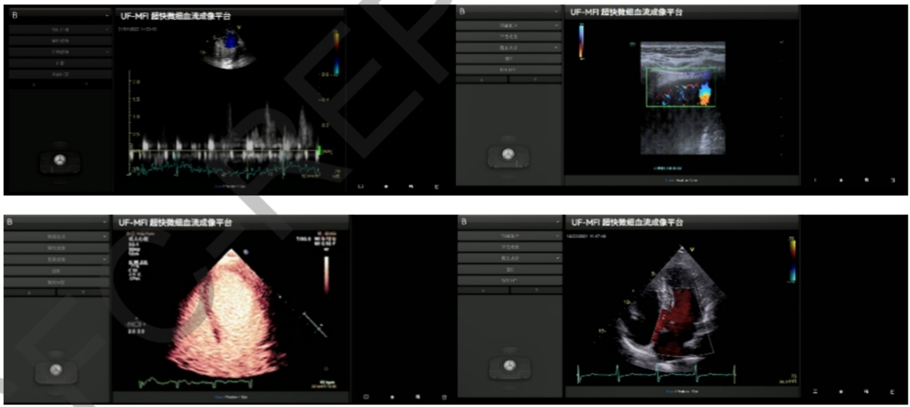

图 21 CMVD 诊断软件系统

学术成果:发表学术论文10篇，授权专利4项，申请专利1项，申请软件著作权1项，获辽宁省科技进步二等奖1项。

表7 发表学术论文

| 序号 | 论文名称 | 刊名 | 年卷页码 | 第一作者及通讯作者 | 中科院分区 | 影响因子 |
| --- | --- | --- | --- | --- | --- | --- |
| 1 | Soluble Vascular CellAdhesion Molecule-1 as anInflammation-RelatedBiomarker of Coronary SlowFlow | J Clin Med | 2023, 12(2) | 朱晴，马春燕 | 2 | 7.7 |
| 2 | Understanding thepathogenesis of coronaryslow flow: Recent advances | TrendsCardiovascMed | 2024, 34(3):137-144 | 朱晴马春燕 | 2 | 2.7 |
| 3 | A spatio-temporalgraphconvolutional network forultrasoundechocardiographic landmarkdetection | Med ImageAnal | 2024, 97:103272 | 李洪赫，杨金柱 | 1 | 10.7 |
| 4 | Learning what and wheretosegment: A new perspectiveon medical imagefew-shotsegmentation | MedImageAnal | 2023, 87:102834 | 冯庸，杨金柱 | 1 | 10.7 |
| 5 | 应用于超声微血管成像的壁滤波算法对比研究 | 生物医学工程学杂志 | 2022,39(04) :740-748+758 | 王宝宇，张石 |  |  |
| 6 | Reference values of thecarotid elastic modulus usingshear wave elastography andarterial stiffness change incoronary slow flow | Eur JRadiol | 2022, 157:110582 | 王永槐，马春燕，高明宇 | 2 | 7.0 |
| 7 | Topology-sensitiveweighting model formyocardial segmentation | ComputBiol Med | 2023, 165:10728 | 孙松，杨金柱 | 1 | 7.7 |
| 8 | A 1Bayesian networkforsimultaneous keyframe andlandmark detection inultrasonic cine | Med ImageAnal | 2024, 97:103228 | 李洪赫，杨金柱 |  | 10.7 |
| 9 | Ultrasound Power DopplerImaging Using Regional-LagSigned Delay Multiply andSum Beamformer | Acoust.Phys | 2025, 71:638-647 | 王宝宇，闫鑫 | 4 | 1.2 |
| 10 | Doppler Imaging Using pthroot Frame - and - sumNonlinear CompoundingBased on Clutter FilteringBaseband Channel Data | J MechMed Biol | 2025, 25(2):2540014 | 王宝宇张石 | 4 | 0.6 |

表8申请专利

| 序号 | 专利名称 | 专利类型 | 专利号 | 批准时间 | 发明人 |
| --- | --- | --- | --- | --- | --- |
|  | 种基于虚源的基带延时乘累加超声波束形成方法 | 发明C | N115153622A | 2022.10 | 刘瑞麟，张石，王宝宇，张淼 |
| 2 | 用于波束合成的方法及装置、超声设备、计算机可读存储介质 | 发明C | N117503197A | 2024.02 | 王宝宇，郭柏，潘靓，杨朝林 |
| 3 | 种基于超声波的心脏冠脉微细血流采集处理方法 | 发明C | N119157569A | 2024.12 | 王宝宇，张石 |
| 4 | 种超声高帧率采集系统 | 发明C | N119700188A | 2025.03 | 王宝宇，张石，马春燕，王永槐，王诗彤 |
| 5 | 种基于超声标准化切面对照的导航方法 | 发明C | N114557721A | 2022.05 | 马春燕，杨金柱，冯庸；王永槐，李洪赫，曹鹏；冯朝路，覃文军，栗伟 |

表9申请软件著作权

| 序号 | 名称 | 登记号 | 登记时间 | 著作权人 |
| --- | --- | --- | --- | --- |
| 1 | 心脏功能分析平台软件 | 2024SR0555561 | 2024.04 | 东北大学 |

表10 科技奖励

| 序号 | 获奖课题名称 | 获奖时间 | 奖励名称 | 奖项级别 | 奖励级别第 | 一获奖人 |
| --- | --- | --- | --- | --- | --- | --- |
| 1 | 冠心病超声心动图精准诊疗关键技术的创新与转化应用 | 2025.07 | 辽宁省科技进步奖 | 省部级 | 二等奖 | 马春燕 |

## 2. 项目成果转化及应用情况

自主研发了心血管超声一站式智能评价方法，与深圳迈瑞医疗公司研发生产了搭载该系统的国内首台心血管超声高端设备 Recho R9(图 22)，转化金额20万元，并实现广泛临床应用，填补了国内空白，产生直接经济效益2.48亿元。

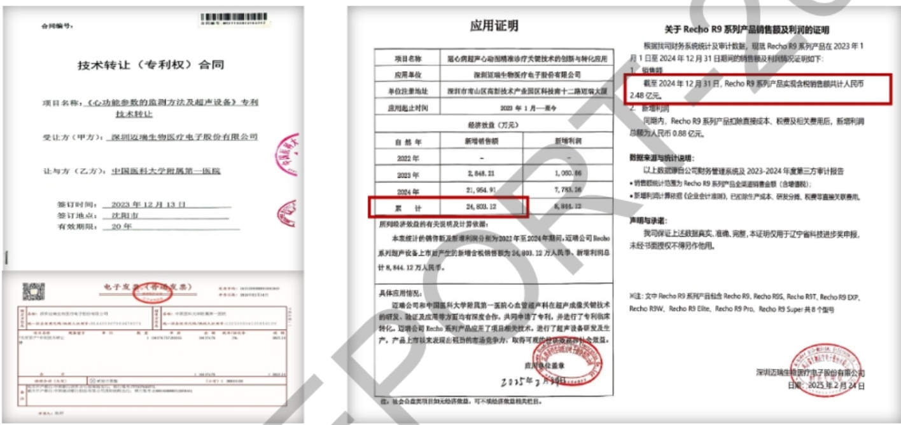

图22专利转化及产生的直接经济效益

## 3. 人才培养情况

项目共培养博硕士研究生8名。研究生主持国家级项目5项，获辽宁省优秀毕业研究生1名，辽宁省优秀毕业论文1项。

表11 研究生培养

| 序 | 姓名 | 学位 | 就读学校 | 毕业时间毕 | 业论文 |
| --- | --- | --- | --- | --- | --- |
|  | 李鑫鑫 | 博士 | 中国医科大学 | 2022年 | HES1 转录抑制BANP参与调控慢性间歇性低氧诱导血管内皮细胞衰老的机制研究 |
| 2 | 王永槐 | 博士 | 中国医科大学 | 2023年 | 基于深度学习的超声一站式左心室功能智能评价及在 CABG 中的预后预测价值探讨 |
| 3 | 李洪赫 | 博士 | 东北大学 | 2025年 | 超声影像左心室收缩功能评估关键技术研究 |
| 4 | 瞿明军 | 博士 | 东北大学 | 2025年 | 超声心动图心功能评估方法研究 |
| 5 | 李金佩 | 硕士 | 中国医科大学2 | 023年 | 组织二尖瓣环位移评价冠状动脉慢血流患者左心室收缩功能及成年人参考值研究 |
| 6 | 王诗彤 | 硕士 | 中国医科大学 | 2023年 | 左心室分层应变评价冠状动脉慢性完全闭塞患者心肌纤维化的研究 |
| 7 | 白雪纯 | 硕士 | 中国医科大学 | 2024年 | 超声心动图联合 PIANO 评分对 NSTEMI 患者PCI术后无复流现象的预测价值 |
| 8 | 董天心 | 硕士 | 中国医科大学 | 在读 |  |

表12 研究生主持国家级项目

| 序号 | 主持者 | 项目名称 | 项目级别 | 经费金额(万) | 项目执行时间(年月-年月) |
| --- | --- | --- | --- | --- | --- |
| 1 | 王永槐 | 微管内皮细胞外泌体衍生的SNHG12编码49aa 微肽促进线粒体自噬调控蒽环类药物化疗相关心功能不全的机制研究 | 中国博士后科学基金第77批面上资助 | 8 | 2025.08-2027.12 |
| 2 | 李鑫鑫 | 靶向粒细胞诱捕网的双重载药超声微泡构建及其防治心梗再灌注无复流的研究 | 国家自然科学基金青年基金 | 30 | 2025.01-2027.12 |
| 3 | 李鑫鑫 | NETs 通 过 METTL14 调控TRAIP/TRAF2/NF-kB 信号轴介导内皮炎症在心肌缺血再灌注损伤中的作用机制研究 | 中国博士后科学基金第76批面上资助 | 8 | 2025.01-2026.12 |

表13 辽宁省优秀毕业研究生

| 序号 | 姓名 | 学位 | 就读学校 | 毕业时间 |
| --- | --- | --- | --- | --- |
| 1 | 王诗彤 | 硕士 | 中国医科大学 | 2023年 |

表14 辽宁省优秀学位论文

| 序号姓 | 名 | 学位 | 就读学校 | 毕业时间 | 毕业论文 |
| --- | --- | --- | --- | --- | --- |
| 1 | 王永槐 | 博士 | 中国医科大学 | 2023年 | 基于深度学习的超声一站式左心室功能智能评价及在 CABG 中的预后预测价值探讨 |

## 4. 其他需要说明的成果无。

## 5. 项目成果科普性介绍或展示网站

心血管疾病是我国居民死亡的首要原因，其中大量患者虽然冠状动脉造影“正常”，却长期存在胸痛、心悸、乏力等症状，其根本原因往往是冠状动脉微血管疾病（CMVD）。这类疾病长期以来因缺乏有效的无创检测手段而被忽视， 造成误诊、漏诊和延误治疗，给患者及公共医疗体系带来沉重负担。在国家自然科学基金的支持下，本项目围绕“如何无创、简便、早期精准诊断CMVD”这一临床与公共卫生领域的关键问题，发展了超快心肌微血流成像 （UF-MFI）与多模态超声影像组学新技术体系，并同步开展了面向公众的系统性科普传播，提升社会对心脏微循环健康的认知水平，回应广大纳税人对科研成果的关切。项目组依托全国性健康主题日与新媒体传播渠道，向社会发布与本项目密切相关的心血管微循环与超声新技术科普内容，形成了可持续传播的成果展示体系。具体如下:(1)“全国血管健康日”:超微血流成像助力血管精准评估

传播链接:https://mp.weixin.qq.com/s/s8oEwA9HuJpP2EALgrqzeQ

该科普文章以“全国血管健康日”为切入点，向公众介绍了SMI/超微血流成像技术如何像“显微镜”一样看清血管里的微小血流变化，解释了为什么微血管健康比大血管堵不堵更早决定心脏风险。该内容与本项目中UF-MFI心肌微血流成像技术的原理高度一 致，是对本项目核心技术的公众化表达。

## (2) “负荷超声心动图”:给心脏“加点燃料”的检查

## 传播链接:https://mp.weixin.qq.com/s/\_OgHQzKfx6jVHeWjYre6pA

该科普文章用通俗语言介绍了负荷超声如何模拟“运动状态下的心脏工作”，让隐藏的心肌缺血暴露出来。这与本项目中通过不同生理状态下心肌微血流变化来识别CMVD的研究路线高度一致，是项目成果向公众的自然延伸。

通过上述系列科普内容的持续传播，项目组将本项目的核心成果转化为公众可以理解的健康理念:“心脏病不只是血管堵了，更可能是微血流出了问题；超声不仅能看结构，也能看微循环”。项目所研发的无创、无辐射、无需造影剂的心肌微血流检测方法，与国家“健康中国”战略中强调的早筛查、早发现、低成本、可推广高度契合，也非常适合在基层医疗机构推广应用。

目前项目成果已通过以下方式向社会公开共享:依托全国血管健康日、世界心脏日等权威健康主题日进行集中传播，通过微信公众号等新媒体平台发布系列科普文章与动画，将本项目核心技术(微血流成像、功能负荷评估、多模态诊断)转化为公众可理解的医学知识。

## 研究成果目录

项目负责人通过系统，从文献库中检索研究成果或者按要求格式自行填入。请按照期刊论文、会议论文、学术专著、专利、会议报告、标准、软件著作权、科研奖励、人才培养、成果转化的顺序列出，其它重要研究成果如标本库、科研仪器设备、共享数据库、获得领导人批示的重要报告或建议等，应重点说明研究成果的主要内容、学术贡献及应用前景等。

项目负责人不得将非本人或非参与者所取得的研究成果、与受资助项目无关的研究成果、未标注国家自然科学基金资助和项目批准号的论文以及取得时间早于项目资助期开始时间的研究成果列入报告中。发表的研究成果（包括专利），项目负责人和参与者均应如实注明得到国家自然科学基金项目资助和项目批准号，科学基金作为主要资助渠道或者发挥主要资助作用的，应当将自然科学基金作为第一顺序进行标注。

## 期刊论文

(1) Zhu, Qing; Zhao, Cuiting; Wang, Yonghuai; Mu, Lixin; Li, Xinxin; Qi, Yiqiu; Yang, Jun; Ma, Chunyan; Soluble Vascular Cell Adhesion Molecule-1 as an Inflammation-Related Biomarker of Coronary Slow Flow, JOURNAL OF CLINICAL MEDICINE, 2023, 12(2). SCIE. 第一标注

(2) Qing Zhu; Shiting Wang; Xin Huang; Cuiting Zhao; Xinxin Li; Dalin Jia; Chunyan Ma; Understanding the pathogenesis of coronary slow flow: Recent advances, Trends in Cardiovascular Medicine, 2022, Online(Online). SCIE. 第一标注

(3) Li, Honghe; Yang, Jinzhu; Xuan, Zhanfeng; Qu, Mingjun; Wang, Yonghuai; Feng, Chaolu; A spatio-temporal graph convolutional network for ultrasound echocardiographic landmark detection, MEDICAL IMAGE ANALYSIS, 2024, 97. SCIE. 第一标注

(4) Feng, Yong; Wang, Yonghuai; Li, Honghe; Qu, Mingjun; Yang, Jinzhu; Learning what and where to segment: A new perspective on medical image few-shot segmentation, MEDICAL IMAGE ANALYSIS, 2023, 87. SCIE. 第一标注

(5) 王宝宇；张淼；刘瑞麟；张石；应用于超声微血管成像的壁滤波算法对比研究，生物医学工程学杂志，2022，39(04):740. 北大中文核心期刊. 第一标注

(6) Yong-huai Wang; Yuan-Qiang Kang; Xuan-Yi Jin; Ping-Ping Meng; Zheng-Yu Guan; Da-Lin Jia; Ming-Yu Gao; C hun-Yan Ma; Reference values of the carotid elastic modulus using shear wave elastography and arterial stiffness change in coronary slow flow, European Journal of Radiology, 2022, 157(110582). SCIE. 第二标注

(7) Sun, Song; Wang, Yonghuai; Yang, Jinzhu; Feng, Yong; Tang, Lingzhi; Liu, Shuo; Ning, Hongxia; Topology-sensitive weighting model for myocardial segmentation, COMPUTERS IN BIOLOGY AND MEDICINE, 2023, 165. SCIE. 第三标注▲

(8) Feng, Yong; Yang, Jinzhu; Li, Meng; Tang, Lingzhi; Sun, Song; Wang, Yonghuai; A Bayesian network for simultaneous keyframe and landmark detection in ultrasonic cine, MEDICAL IMAGE ANALYSIS, 2024, 97. SCIE. 第一标注

(9) Wang, B.; Yang, X.; Zhang, S.; Yan, X.; Ultrasound Power Doppler Imaging Using Regional-Lag Signed Delay Multiply and Sum Beamformer, Acoustical Physics, 2025, 71(4): 638-647. SCIE. 第一标注

(10) Baoyu Wang; Yuhan Miao; Lei Cao; Shi Zhang; Ultrafast Doppler imaging using P-th root frame-and-sum nonlinear compounding based on clutter filtering baseband channel data, Journal of Mechanics in Medicine and Biology, 2025, 25(2). SCIE. 第一标注

## 专利

(1) 刘瑞麟；张石；王宝宇； 张淼； 种基于虚源的基带延时乘累加超声波束形成方法，2022-06-08至，中国，CN202210 652905.1.

(2) 王宝宇；郭柏； 杨朝林；用于波束合成的方法及装置、超声设备、计算机可读存储介质，2023-11-13至，中国, CN202311514547.9.

(3) 王宝宇；张石；一种基于超声波的心脏冠脉微细血流采集处理方法，2024-11-21至，中国，CN202411668079.5.

(4)王宝宇；张石；马春燕；王永槐；王诗彤；一种超声高帧率采集系统，2024-12-05至，中国，CN202411781753.0.

(5)马春燕；杨金柱；冯庸；王永槐；李洪赫；曹鹏；冯朝路；覃文军；栗伟；一种基于超声标准化切面对照的导航方法，2022-03-01，中国，CN202210195823.9.

## 软件著作权

(1) 东北大学；心脏功能分析平台软件，2024SR0555561，原始取得，全部权利，2024-04-24.

## 科研奖励

(1) 马春燕(1/9)；冠心病超声心动图精准诊疗关键技术的创新与转化应用，辽宁省科学技术奖励委员会办公室，科技进步，省部二等奖，2025（马春燕；谢明星；王永槐；吴楠；朱晴；李鑫鑫；安兴；李潭；刘文）.

## 人才培养

1. 出站博士后/毕业博士/毕业硕士/在站博士后/在读博士/在读硕士

(1） 李鑫鑫；毕业博士，HES1 转录抑制 BANP 参与调控慢性间歇性低氧诱导血管内皮细胞衰老的机制研究，马春燕，2022-01-13至2022-08-17.

(2) 王永槐；毕业博士，基于深度学习的超声一站式左心室功能智能评价及在 CABG 中的预后预测价值探讨，马春燕，2022-01-11至2023-07-11.

(3) 李洪赫；毕业博士，超声影像左心室收缩功能评估关键技术研究，杨金柱，2022-02-23至2025-05-14.

(4) 瞿明军；毕业博士，超声心动图心功能评估方法研究，杨金柱，2022-04-12至2025-06-09.

(5) 李金佩；毕业硕士，组织二尖瓣环位移评价冠状动脉慢血流患者左心室收缩功能及成年人参考值研究，马春燕，2022-07-11至2023-08-15.

(6) 王诗彤；毕业硕士，左心室分层应变评价冠状动脉慢性完全闭塞患者心肌纤维化的研究，马春燕，2022-01-12至2025-05-11.

(7) 白雪纯；毕业硕士，超声心动图联合 PIANO 评分对 NSTEMI 患者 PCI 术后无复流现象的预测价值，马春燕，2022-09-20至2024-07-03.

(8) 董天心；在读硕士，人才培养/学生培养/在读硕士/董天心

## 成果转化

(1) 成果技术转移/心功能参数的监测方法及超声设备，专利，技术转让，深圳迈瑞生物医疗电子股份有限公司，20.0万元，2023-12-13.

## 学术交流

(1) 2022-03-27至2022-03-27，举办举办或参加学术会议/举办国内学术会议/心北方-超声心动图新技术研讨会，辽宁省沈阳市，中国医科大学附属第一医院，马春燕.

(2) 2022-10-15至2022-10-16，举办举办或参加学术会议/举办国内学术会议/第二届东北血管超声高端论坛，辽宁省沈阳市，中国医科大学附属第一医院，马春燕.

(3) 2022-06-11至2022-06-11，举办举办或参加学术会议/举办国内学术会议/辽宁省影像医学临床医学研究中心学术会议辽宁省沈阳市，中国医科大学附属第一医院，马春燕

(4) 2022-12-18至2022-12-18，举办举办或参加学术会议/举办国内学术会议/辽宁省影像医学临床医学研究中心第二届高峰论坛，辽宁省沈阳市，中国医科大学附属第一医院，马春燕.

(5) 2022-12-25至2022-12-25，举办举办或参加学术会议/举办国内学术会议/辽宁省医学会第三十一次超声医学学术会议，辽宁省沈阳市，中国医科大学附属第一医院，马春燕.

(6) 2023-02-18至2023-02-18，举办举办或参加学术会议/举办国内学术会议/2023年第四届超声心动图学术沙龙科研专场，辽宁省沈阳市，中国医科大学附属第一医院，马春燕.

(7) 2023-03-05至2023-03-05，举办举办或参加学术会议/举办国内学术会议/2023年辽宁省影像医学临床医学研究中心第三届高峰论坛-心肌肥厚专场，辽宁省沈阳市，中国医科大学附属第一医院，马春燕.

(8) 2023-07-06至2023-07-07，举办举办或参加学术会议/举办国内学术会议/2023年 CSE 全国超声心动图规范化培训班，辽宁省沈阳市，中国医科大学附属第一医院，马春燕.

(9) 2024-10-06至2024-10-06，举办举办或参加学术会议/举办国际学术会议/经食管超声心动图规范化培训班，辽宁省沈阳市，中国医科大学附属第一医院，马春燕.

(10) 2024-11-08至2024-11-10，举办举办或参加学术会议/举办国内学术会议/2024辽宁省预防医学会健康测量与评价专委会首届学术会议，辽宁省沈阳市，辽宁省预防医学会健康测量与评价专委会，马春燕.

(11) 2024-12-06至2024-12-08，举办举办或参加学术会议/举办国内学术会议/辽宁省医学会第三十二次超声医学学术会议，辽宁省沈阳市，中国医科大学附属第一医院，马春燕.

(12) 2025-06-11至2025-06-13，举办举办或参加学术会议/举办国内学术会议/超声心动图培训班，辽宁省沈阳市，中国医科大学附属第一医院，马春燕.

(13) 2025-06-27至2025-06-28，举办举办或参加学术会议/举办国际学术会议/辽宁省预防医学会健康测量与评价专委会超声新技术培训，辽宁省沈阳市，辽宁省预防医学会健康测量与评价专委会，马春燕

(14) 2025-12-19至2025-12-21，举办举办或参加学术会议/举办国内学术会议/辽宁省医学会第三十三次超声医学学术会议，辽宁省沈阳市，中国医科大学附属第一医院，马春燕

(15) 2024-06-14至2024-06-16，参加举办或参加学术会议/参加国际学术会议/2024 年美国超声心动图学会年会，美国波特兰，马春燕.

(16) 2024-06-14至2024-06-16，参加举办或参加学术会议/参加国际学术会议/2024年美国超声心动图学会年会，美国波特兰，王永槐.

(17) 2024-06-14至2024-06-16，参加举办或参加学术会议/参加国际学术会议/2024 年美国超声心动图学会年会，美国波特兰，董天心

(18) 2024-10-26至2024-10-28，参加举办或参加学术会议/参加国际学术会议/2024年图像信号处理、生物医药工程与信息学大会，中国上海，王宝宇.

(19) 2025-05-29至2025-06-01，参加举办或参加学术会议/参加国际学术会议/2025 年第 20届世界超声医学与生物学联合会大会，日本京都，王永槐.

(20) 2025-05-29至2025-06-01，参加举办或参加学术会议/参加国际学术会议/2025年第20届世界超声医学与生物学联合会大会，日本京都，杨倩.

(21) 2025-09-05至2025-09-07，参加举办或参加学术会议/参加国际学术会议/2025 年美国超声心动图学会年会，美国，田纳西州，陈孟嘉.

## 项目成果应用前景

本项目成果拟应用领域:1、冠心病精准诊断2、心肌微血管病变评估3、心血管超声影像辅助诊疗

预计在5-10年推广使用

附表:研究成果统计数据表（本表针对各种类型资助项目收集数据以便进行整体资助效果分析使用，并非要求每类项目都具有以下各类成果。

<table><tr><td rowspan=4>获奖（项）</td><td colspan=16>国家级</td><td colspan=11>部级1</td><td rowspan=3 colspan=2>其他</td></tr><tr><td colspan=4>自然科学奖</td><td colspan=5>科技进步奖</td><td></td><td colspan=6>发明奖</td><td colspan=7>自然科学奖</td><td colspan=4>科技进步奖</td></tr><tr><td colspan=2>一等</td><td colspan=2>二等</td><td colspan=2>一等</td><td colspan=3>二等</td><td></td><td colspan=3>一等</td><td colspan=3>二等</td><td colspan=3>等</td><td colspan=4>等</td><td colspan=2>一等</td><td colspan=2>二等</td></tr><tr><td colspan=2>0</td><td colspan=2>0</td><td colspan=2>0</td><td colspan=3>0</td><td></td><td colspan=3>0</td><td colspan=3>0</td><td colspan=3>0</td><td colspan=4>0</td><td colspan=2>0</td><td colspan=2>1</td><td colspan=2>0</td></tr><tr><td rowspan=4>学术报告/论文/专著/其他（篇）</td><td colspan=3>特邀学术报告</td><td colspan=15>学术论文</td><td rowspan=2 colspan=4>学术专著</td><td rowspan=2 colspan=7>其他</td></tr><tr><td rowspan=2>国际学术会议</td><td rowspan=2 colspan=2>国内学术会议</td><td colspan=4>发表论文数</td><td colspan=11>论文检索收录情况</td></tr><tr><td colspan=2>期论义</td><td colspan=2>会议</td><td colspan=2>SCIE/SSCI</td><td colspan=3>EI</td><td colspan=3>北大中文核心期刊</td><td colspan=3>CSSCI</td><td colspan=2>中文</td><td colspan=2>外文</td><td colspan=2>标本库</td><td colspan=2>数据库</td><td colspan=2>科研仪器设备</td><td>重要报告</td></tr><tr><td>0</td><td colspan=2>0</td><td colspan=2>10</td><td colspan=2>0</td><td colspan=2>9</td><td colspan=3>0</td><td colspan=3>1</td><td colspan=3>0</td><td colspan=2>0</td><td colspan=2>0</td><td colspan=2>0</td><td colspan=2>0</td><td colspan=2>0</td><td>0</td></tr><tr><td rowspan=4>专利/标准/软著/成果转化</td><td></td><td colspan=6>专利（项）</td><td colspan=2></td><td colspan=11>标准</td><td rowspan=3 colspan=2>软件著作权</td><td rowspan=2 colspan=7>成果转化</td></tr><tr><td colspan=3>国内</td><td colspan=4>国外</td><td rowspan=2 colspan=2>国际</td><td colspan=11>国内</td></tr><tr><td>申请</td><td colspan=2>授权</td><td colspan=2>申请</td><td colspan=2>授权</td><td colspan=3>国家</td><td colspan=3>行业</td><td colspan=3>地方</td><td colspan=2>企业</td><td colspan=2>技术转让技</td><td colspan=2>术许可作</td><td colspan=2>价投资</td><td>经济效益(万元)</td></tr><tr><td>1</td><td colspan=2>4</td><td colspan=2>0</td><td colspan=2>0</td><td colspan=2>C</td><td colspan=3>0</td><td colspan=3>0</td><td colspan=3>0</td><td colspan=2>0</td><td colspan=2>1</td><td colspan=2>1</td><td colspan=2>0</td><td colspan=2>0</td><td>20.0</td></tr><tr><td rowspan=4>人才培养及学术交流</td><td colspan=17>人才培养（人）</td><td colspan=12>举办和参加学术会议</td></tr><tr><td colspan=8>中青年学术带头人</td><td rowspan=2 colspan=3>出站博士后</td><td rowspan=2 colspan=3>毕业博士</td><td rowspan=2 colspan=3>毕业硕士</td><td colspan=4>举办国际学术会议</td><td colspan=5>举办国内学术会议</td><td colspan=3>参加国际学术会议</td></tr><tr><td>优青</td><td colspan=2>杰青</td><td colspan=2>创新群体</td><td colspan=2>其他</td><td></td><td colspan=2>次数</td><td colspan=2>人数</td><td colspan=3>次数</td><td colspan=2>人数</td><td colspan=2>次数</td><td>人数</td></tr><tr><td>0</td><td colspan=2>0</td><td colspan=2>0</td><td colspan=2>0</td><td></td><td colspan=3>0</td><td colspan=3>4</td><td colspan=3>3</td><td colspan=2>0</td><td colspan=2>0</td><td colspan=3>14</td><td colspan=2>5004</td><td colspan=2>7</td><td>7</td></tr></table>

国家自然科学基金项目资金决算表

项目批准号:U21A20387

项目负责人:马春燕

金额单位:万元

<table><tr><td rowspan="3">行次</td><td rowspan="3">科目名称</td><td colspan="3">预算数</td><td rowspan="2">累计支出数</td><td rowspan="2">结余数</td><td rowspan="2">结余资金比例</td></tr><tr><td>批准预算</td><td>预算调整</td><td>调整后预算</td></tr><tr><td>(1)</td><td>(2)</td><td>(3) = (1) + (2)</td><td>(4)</td><td>(5) =(3)-(4)</td><td>(6)</td></tr><tr><td>(1)</td><td>项目总经费</td><td>306.0000</td><td>0.0000</td><td>306.0000</td><td></td><td>一</td><td>23.82%</td></tr><tr><td>(2)</td><td>项目直接费用</td><td>260.0000</td><td>0.0000</td><td>260.0000</td><td>187.1153</td><td>72.8847</td><td></td></tr><tr><td>(3)</td><td>1、设备费</td><td>30.0000</td><td>0.0000</td><td>30.0000</td><td>10.1423</td><td>19.8577</td><td></td></tr><tr><td>(4)</td><td>其中:设备购置费</td><td>30.0000</td><td>0.0000</td><td>30.0000</td><td>10.1423</td><td>19.8577</td><td></td></tr><tr><td>(5)</td><td>2、业务费</td><td>162.0000</td><td>0.0000</td><td>162.0000</td><td>122.7880</td><td>39.2120</td><td></td></tr><tr><td>(6)</td><td>3、劳务费</td><td>68.0000</td><td>0.0000</td><td>68.0000</td><td>54.1850</td><td>13.8150</td><td></td></tr><tr><td>(7)</td><td>项目间接费用</td><td>46.0000</td><td>0.0000</td><td>46.0000</td><td></td><td></td><td></td></tr></table>

注:1.本表中（1）、（3）、（5）、（6）栏为系统自动生成，无需填写；本表中（2）栏填列预算调整数；本表中（4）栏填列项目的实际支出数。

2.第（1）行=第（2）+（7）行

第（2）行=第（3）+（5）+（6）行；

第（3）栏=第（1）+（2）栏；

第（5）栏=第（3）-（4）栏；

第（1）行第（6）栏=第（2）行第（5）栏/第（1）行第（3）栏100%；

第（1）行第（1）栏=第（1）行第（3）栏；

第（1）行第（2）栏=0；

第（4）栏≤第（3）栏；

第（2）行第（5）栏≥0。

# 决算说明书

（请按照《国家自然科学基金预算制项目决算表编制说明》等有关要求，说明各科目支出、预算调整、结余情况，合作研究转拨资金情况，单价≥50万元的设备情况，资金使用和管理过程中遇到的问题及建议，以及其他需要说明的事项等。)

## 一、项目经费总体执行情况

本项目获批国家自然科学基金资助经费共306.0000万元，其中直接费用260.0000万元，间接费用46.0000万元。截至项目结题，实际支出直接经费187.1153万元，结余资金比例23.82%，经费执行情况良好， 符合《国家自然科学基金预算制项目管理办法》及相关财务规定。

项目经费支出结构合理，与研究任务和技术路线高度匹配，有力保障了项目顺利实施。

## 二、各科目支出情况说明

## （一）设备费

预算30万元，实际支出10.1423万元，主要用于购置项目研究所需的数据处理、算法执行等研究的硬件设备。设备采购严格按照政府采购及单位内控制度执行，程序规范。

## （二）业务费

预算162万元，实际支出122.7880万元，主要用于购买实验试剂、动物模型构建耗材、影像分析消耗品；分子检测、影像数据后处理等委托测试服务； 样本采集、学术会议及项目调研；学术会议注册费、项目交流会议；论文版面费、文献检索及学术数据库使用等。

## （三）劳务费

预算68万元，实际支出54.1850万元，用于支付研究生参与实验、数据分析等劳务补助，或项目实施过程中对关键科学问题的专家论证和咨询，符合基金委劳务费使用规定。

## 三、预算调整情况

本项目在执行过程中，严格按照国家自然科学基金批准的预算方案执行，未进行任何预算调整。各项经费支出均在原批准预算科目及额度范围内完成，经费使用与项目研究内容和技术路线保持一致。

## 四、结余资金情况

项目结题时结余资金比例23.82%。结余原因主要包括:

1. 实验流程优化，提高了经费使用效率；

2. 部分检测项目通过校内平台完成，费用低于原预算。结余经费将用于后续实验所需材料费、测试费、会议交流及论文发表等。

## 五、合作研究转拨资金情况

本项目与东北大学、东软医疗系统股份有限公司开展合作研究，按批准预算向合作单位转拨经费156.0000万元，实际拨付156.0000万元。

经费使用符合双方签订的合作协议及国家自然科学基金经费管理规定。

## 六、单价≥50万元设备情况

本项目未购置单价≥50万元的设备。

## 七、资金使用与管理中存在的问题及建议

无。

## 八、其他需要说明的事项

项目经费严格用于与本项目直接相关的研究活动，未发生超范围、超标准或不合规支出。所有票据齐全，账实相符，经费管理规范透明

结余资金情况说明

注:结余资金比例超过30%的项目该部分必填。

<table><tr><td colspan="7">项目负责人承诺:我所承担的项目（编号:U21A20387 名称:基于超快成像的多模态超声影像组学精准诊断冠状动脉微血管疾病的方法研究）结题报告内容真实，数据准确，未出现《国家科学技术保密规定》中列举的属于国家科学技术秘密范围的内容，不涉及敏感科技信息。在今后的研究工作中，如有与本项目相关的成果，将如实注明得到国家自然科学基金项目资助和项目批准号，并报送国家自然科学基金委员会。项目负责人（签日期:</td></tr><tr><td colspan="4">依托单位科研管理部门:负责人（签章）:日期:</td><td colspan="2">依托单位财务管理部门:负责人（签章）:日期:</td><td>依托单位审查意见:依托单位公章:</td></tr><tr><td colspan="7">科学处审核意见:                             EP</td></tr><tr><td rowspan="2">完成情况综合评分(划√)</td><td>优</td><td>良</td><td colspan="2">中</td><td>差</td><td rowspan="2">负责人（签章）:日期:</td></tr><tr><td></td><td></td><td colspan="2"></td><td></td></tr><tr><td colspan="7">科学部核准意见  对重点项目等）:NSF负责人（签章）:日期:</td></tr><tr><td colspan="7">分管委领导意见（对重大项目等）:委领导（签章）:日期:</td></tr></table>

## 电子附件目录

| 序号 | 附件类型 | 附件名称 | 备注 |
| --- | --- | --- | --- |
| 1 | 论著 | 论文1 |  |
| 2 | 论著 | 论文2 |  |
| 3 | 论著 | 论文3 |  |
| 4 | 论著 | 论文4 |  |
| 5 | 论著 | 论文5 |  |
| 6 | 论著 | 论文6 |  |
| 7 | 论著 | 论文7 |  |
| 8 | 论著 | 论文8 |  |
| 9 | 论著 | 论文9 |  |
| 10 | 论著 | 论文10 |  |
| 11 | 专利 | 专利1 |  |
| 12 | 专利 | 专利2 |  |
| 13 | 专利 | 专利3 |  |
| 14 | 专利 | 专利4 |  |
| 15 | 专利 | 专利5 |  |
| 16 | 其他 | 成果技术转移 |  |
| 17 | 其他 | 软件著作权1 |  |
| 18 | 奖励 | 科技奖励1 |  |
| 19 | 其他 | 国际会议1 |  |
| 20 | 其他 | 国际会议2 |  |
| 21 | 其他 | 国际会议3 |  |
| 22 | 其他 | 国际会议4 |  |
| 23 | 其他 | 国际会议5 |  |
| 24 | 其他 | 国际会议6 |  |
| 25 | 其他 | 国际会议7 |  |
| 26 | 其他 | 毕业论文1 |  |
| 27 | 其他 | 毕业论文2 |  |
| 28 | 其他 | 毕业论文3 |  |
| 29 | 其他 | 毕业论文4 |  |
| 30 | 其他 | 毕业论文5 |  |
| 31 | 其他 | 毕业论文6 |  |
| 32 | 其他 | 毕业论文7 |  |