项目批准号 U21A20390申请代码 H2709归口管理部门收件日期

202509U21A20390

# 国家自然科学基金

# 资助项目结题/成果报告

资助类别:联合基金项目

亚类说明:重点支持项目

附注说明:区域创新发展联合基金

项目名称:全栈式骨关节精准三维量化智慧诊疗及多模态影像融合机制研究

负责人:秦彦国

BRID: 03856.00.72753

电子邮件: 357974423@qq.com

电话: 0431-81136321

依托单位:吉林大学

联系人:朱明

电话: 0431-85167419

直接费用:260.0000（万元）

执行年限: 2022.01-2025.12

填表日期:2026年02月02日

国家自然科学基金委员会制（2025年）

## 项目摘要

## 中文摘要:

东北地区因寒冷气候和地质因素导致骨关节病变和地方骨病高发，是区域致残、致贫返贫的重要原因。致病要素权重不清、影像重建依赖经验、病灶评估缺乏三维量化、人-智协同缺位等是早期预防和同质化诊疗的难点。针对上述问题，基于项目团队在3D打印、多模态医学影像、计算机辅助诊疗等方面研究基础，通过对东北、华中等地区大规模病例数据的交叉比对，构建早期预警模型，阐明多重致病要素的作用权重和交互影响；研究CT-MRI软硬组织三维影像智能配准融合与自动分割方法，建立骨关节多时空多模态影像整合机制；基于多模态影像整合，卷积神经网络和多任务学习等智能技术实现组织自动分割，构建病灶精准量化评估和三维可视化术前规划方法，为三维量化诊疗标准确立奠定基础；研究人工智能技术与医学专家疾病诊疗先验知识有机融合策略，构建基于5G技术与云计算平台的人-智-云协同骨骼全生命周期健康管理机制。最终为全栈式骨关节疾病智慧诊疗提供理论基础。

## Abstract:

The cold climate and geological factors lead to a high incidence of bone and joint diseases and endemic osteoarthrosis in Northeast China, which are important causes for disability, poverty and return-to-poverty. Unclear weighting of disease causes, excessive relying on experience in 3D reconstruction, lack of 3D quantification of lesion and absence of AI collaboration are bottlenecks of early prevention and homogeneous diagnosis and treatment of bone and joint diseases. In view of the above-mentioned problems, an early warning model is constructed through analyzing large-scale clinical cases in Northeast and Central China based on the preliminary foundation conducted by the project team on 3D printing, multi-modality image fusion and computer-aided medicine to achieve the following objectives: to clarify the weights and interactions of the multiple causes of bone and joint diseases; to study AI registration fusion and automatic segmentation of 3D CT-MRI images and establish the multi-spatiotemporal multi-modality image fusion mechanism of bone and joint diseases; to realizes automatic tissue segmentation based on AI technologies such as multi-modality image fusion, convolutional neural network and multi-task learning and build precisely quantitative evaluation of lesions and 3D visualization of preoperative planning, which lays the foundation for the establishment of 3D quantitative diagnosis and treatment standards; to study the integration strategy of AI and experts' prior knowledge and build a ful1 life-cycle human-AI-cloud collaborative mechanism for bone health management based on 5G technology and cloud computing platform, so as to provide scientific theory for full-stack intelligent diagnosis and treatment of bone and joint diseases.

关键词（用分号分开）:骨关节病；多模态影像；三维重建；3D打印；人工智能

Keywords (separated by;): Osteoarthrosis; Multimodal imaging; Three-dimensional reconstruction; Three-dimensional printing; Artificial intelligence

## 结题摘要

## 中文摘要（对项目的背景、主要研究内容、重要结果、关键数据及其科学意义等做简单概述）:

东北地区因寒冷气候和地质因素导致骨关节病变和地方骨病高发，是区域致残、致贫返贫的重要原因。目前，骨关节疾病致病要素权重不清、病灶评估缺乏三维量化手段、多模态影像配准融合困难、人-智协同诊疗机制尚未建立，是实现早期预防和同质化诊疗的主要难点。本项目以人工智能算法和多模态医学影像为核心技术手段，针对上述问题开展系统性研究。

本项目基于大规模人群队列数据，采用关联规则学习、聚类分析、贝叶斯推理等数据挖掘方法，系统分析了骨关节疾病的多源风险因素及其交互作用，为疾病风险预测提供了流行病学证据。在影像分析层面，提出弱监督2D-3D特征共嵌入网络、双注意力引导Transformer及多尺度特征精炼网络等方法，实现了骨关节多模态影像多组织精准分割，为病灶识别与量化分析奠定了技术基础。在此基础上，围绕髋、膝、肩、脊柱等多部位骨关节高发疾病，构建了跨部位多病种的全栈式智能诊疗体系。该体系涵盖疾病早期诊断、智能分型分级、病灶三维量化分割及预后评估等核心环节，形成了从病变发现、严重程度评估到病灶精准量化的递进式诊疗路径，经多中心数据验证具有良好的泛化能力，诊断性能与高年资医师相当，可为基层医疗机构提供可靠的辅助诊断工具；同时基于无体模定量CT技术建立了多部位骨密度人群参考标准，实现了骨质疏松的机会性筛查，为骨关节多发疾病诊疗提供了全流程智能化支撑。最终，研究了基于联邦学习的多机构协作与隐私保护方法，探索远程智能防控模式，构建了人-智-云协同的全生命周期骨骼健康管理机制。

本项目发表SCI论文13篇、会议论文5篇，授权国家发明专利1项，获批计算机软件著作权4项，获得吉林省科技进步一等奖1项，培养博士研究生9名、硕士研究生8名。上述研究成果为全栈式骨关节疾病智慧诊疗提供了理论基础和关键技术支撑，有望为相关患者人群的个体化诊疗提供更多参考，对提升高寒区域骨关节疾病早期筛查与精准诊疗水平、改善患者预后具有重要科学意义和临床应用价值

## Abstract (Brief description of research background, main methods, contributions, and research data):

Northeastern China has a high incidence of osteoarticular diseases and endemic bone disorders due to cold climate and geological factors, representing a major cause of regional disability and poverty. Currently, the main challenges in achieving early prevention and standardized treatment include unclear weighting of pathogenic factors, lack of three-dimensional quantitative assessment methods for lesions, difficulties in multi-modal image registration and fusion, and the absence of human-AI collaborative diagnostic mechanisms. This project conducted systematic research on the above issues using artificial intelligence algorithms and multi-modal medical imaging as core technical approaches.

Based on large-scale population cohort data, this project employed data mining methods including association rule learning, cluster analysis, and Bayesian inference to systematically analyze multi-source risk factors and their interactions in osteoarticular diseases, providing epidemiological evidence for disease risk prediction. At the imaging analysis level, weakly-supervised 2D-3D feature co-embedding networks, dual attention-guided Transformers, and multi-scale feature refinement networks were proposed to achieve precise multi-tissue segmentation of multi-modal osteoarticular images, laying the technical foundation for lesion identification and quantitative analysis. Building upon this, a full-stack intelligent diagnostic system was constructed for multiple diseases across hip, knee, shoulder, and spine. This system encompasses early diagnosis, intelligent classification and grading, three-dimensional lesion quantification, and prognosis assessment, forming a progressive diagnostic pathway from lesion detection through severity assessment to precise quantification. Multi-center data validation demonstrated good generalization capability, with diagnostic performance comparable to senior physicians, providing reliable auxiliary diagnostic tools for

primary healthcare institutions. Meanwhile, population reference standards for multi-site bone mineral density were established based on phantomless quantitative CT technology, enabling opportunistic osteoporosis screening and providing full-process intelligent support for the diagnosis and treatment of common osteoarticular diseases. Finally, federated learning-based methods for multi-institutional collaboration and privacy protection were investigated, explored remote intelligent prevention and control models, and established a human-AI-cloud collaborative mechanism for life-cycle bone health management.

Supported by this project, a total of 13 SCI papers and 5 conference papers were published, 1 national invention patents and 4 computer software copyrights were granted, a First Prize of Jilin Provincial Science and Technology Progress Award was received, and 9 doctoral students and 8 master's students were trained. The above research achievements provide theoretical foundations and key technical support for full-stack intelligent diagnosis and treatment of osteoarticular diseases, and are expected to provide additional guidance for individualized diagnosis and treatment of relevant patient populations, holding significant scientific importance and clinical application value for improving early screening and precision treatment of osteoarticular diseases in cold regions and improving patient prognosis.

关键词（用分号分开）:骨关节病；多模态影像；三维重建；3D打印；人工智能

Keywords (separated by;): Osteoarthrosis; Multimodal imaging; Three-dimensional reconstruction; Three-dimensional printing; Artificial intelligence

## 正文

《结题/成果报告》正文分为两个部分:结题部分和成果部分。请按照《结题/成果报告》填报说明及撰写要求填写。

## （一）结题部分

## 1. 研究计划执行情况概述。

1.1 按计划执行情况。

本项目执行期为2022年1月至2025年12月。在此期间，课题组严格按照项目申请书的研究计划，系统开展各项研究工作，有序推进研究进度 圆满完成了预定研究内容，达到了既定研究目标。发表高水平SCI论文13篇，会议论文5篇，授权国家发明专利1项，获批计算机软件著作权4项，获得吉林省科技进步一等奖1项，研究成果入选国家骨科医学中心的"2024年度中国骨科十大临床诊疗新进展"。完成了8名硕士生，8名博士研究生培养。

## 1.2研究目标完成情况。

研究目标:研究高寒区域多发骨关节病相关致病机制，阐明疾病发生发展风险因素；研究骨关节多模态影像配准融合、多组织自动分割、多任务病灶识别与量化的人工智能方法及优化策略，解决骨关节疾病诊疗中关键组织及病损缺乏三维量化评估和多时空、模态影像数据配准融合及三维重建可视化问题；探索人-智-云协同模式，研究全生命周期骨骼健康管理机制。

完成情况:实现既定目标。

## 2. 研究工作主要进展、结果和影响。

## 2.1 主要研究内容。

## 2.1.1多发骨关节病多因素推理及致病机制分析

围绕高寒区域多发骨关节病的致病机制与风险预测开展系统性研究。基于大规模人群队列数据，采用关联规则学习、逻辑回归、聚类分析、贝叶斯算法等数据挖掘方法，分析关节炎患病率的时间变化趋势及人群差异，探讨社会经济因素、生活方式与骨骼肌肉系统健康的关系。研究肥胖相关指标及身体成分与关节置换术后预后的关联，并构建了骨关节病的多源异构数据知识库，实现致病因素的自动提取与推理分析，建立早期风险预测模型。

## 2.1.2多模态骨关节影像智能配准融合与自动分割策略优化

针对骨关节多模态影像的配准融合与多组织自动分割开展深入研究。开发骨与关节多部位的智能分割算法，实现骨、软骨、 半月板、韧带等关键组织的精准分割及体积、厚度等形态学参数的自动计算。探索弱监督学习策略降低标注成本，研究基于生成对抗网络的CT/MRI/X线跨模态影像配准融合方法，实现多模态影像的快速配准与知识迁移

## 2.1.3全栈式多任务骨关节疾病三维量化智能诊疗系统

构建涵盖髋、膝、肩、脊柱多部位多病种智能诊断、三维量化评估与术前规划的全栈式诊疗系统。针对股骨头坏死开发早期诊断及JIC智能分型模型；针对膝/髋关节骨关节炎建立智能诊断-分级-量化系统；针对肩袖损伤开发冈上肌撕裂诊断-量化-预后评估全周期智能诊疗模型。探索基于无体模定量CT的外周骨-中轴骨三维骨密度-骨质量-骨强度评估系统，建立髋、肩、脊柱骨密度人群-年龄变化趋势，实现了骨关节多发疾病诊疗的全流程智能化支撑。

## 2.1.4人-智-云协同全生命周期骨骼健康管理机制

面向全生命周期骨骼健康管理需求，探索人-智-云协同管理模式。针对医学影像数据孤岛问题，研究基于联邦学习的多机构协作与隐私保护方法，实现多中心数据安全协同训练。探索远程骨关节智能防控模式，联合医联体单位研究骨骼健康数据高效传输与共享机制，推动人-智融合算法迭代优化，为基层骨病防控同质化管理提供技术支撑。

## 2.2取得的主要研究进展、重要结果、关键数据等及其科学意义或应用前景。

## 2.2.1多发骨关节病多因素推理及致病机制分析

在多发骨关节病多因素推理及致病机制分析方面，聚焦骨关节退行性疾病，项目组基于大规模人群队列数据，系统开展了骨关节疾病患病率变化趋势、社会经济因素与骨骼肌肉健康的关系、以及个体身体成分与关节置换预后关联系列研究，为骨关节疾病的风险预测、机制筛选和防控策略制定提供了医学证据。

关节炎是全球范围内导致慢性疼痛和残疾的主要原因之一，了解其流行趋势对于公共卫生政策制定具有重要指导意义。项目组利用大型健康调查数据库，分析了22,566名成年人关节炎患病率的时间变化趋势及种族差异。研究结果显示，关节炎总体患病率从 2011-2012 年的 22.98%显著上升至2017-2018年的 27.95%（P<0.001）；其中骨关节炎患病率从12.02%上升至14.93%（P<0.001），而类风湿性关节炎和银屑病关节炎患病率保持相对稳定。分层分析显示，各族裔患病率增长存在异质性；年龄分层显示51-64岁和65-80岁年龄组增幅最为显著；女性患病率持续高于男性。值得注意的是，亚裔人群关节炎和类风湿性关节炎患病率呈显著上升趋势（P<0.05），该发现填补了既往研究中亚裔人群数据不足的空白。该研究建立的分析框架和方法学路径，可为我国开展类似流行病学调查及制定分层防控策略提供参考，相关成果发表于 BMC Public Health。

社会经济因素对人群健康的影响已受到广泛关注，但其与骨骼肌肉系统健康的具体关联尚不明确。项目组探讨了收入水平和运动量与肌肉骨骼系统健康的关系。研究采用骨质减少、骨质疏松及肌少症作为肌肉骨骼系统健康的评价指标，通过序数回归和中介效应分析进行统计学处理。结果表明，在调整混杂因素后，高收入人群拥有良好肌肉骨骼系统健康的概率分别是低收入和中等收入人群的1.650倍（95%CI:1.408-1.934）和1.403倍（95%CI:1.221-1.613）；积极运动人群的概率是运动不足人群的1.383倍（95%CI:1.200-1.595）。链式中介效应分析显示，中等强度运动时长在收入水平对肌肉骨骼系统健康的影响中起部分中介作用，低收入和中等收入组的中介效应比率分别为12.44%和8.20%，但体力活动水平呈现遮掩效应(maskingeffect)，提示运动类型和质量可能比运动时间更为重要。上述发现提示社会经济因素对骨骼健康的影响具有跨文化普遍性，为制定针对不同收入群体的骨骼健康提供了循证依据，成果发表于BMC Public Health。

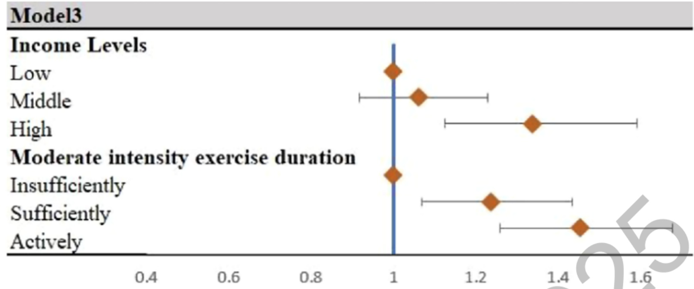

B

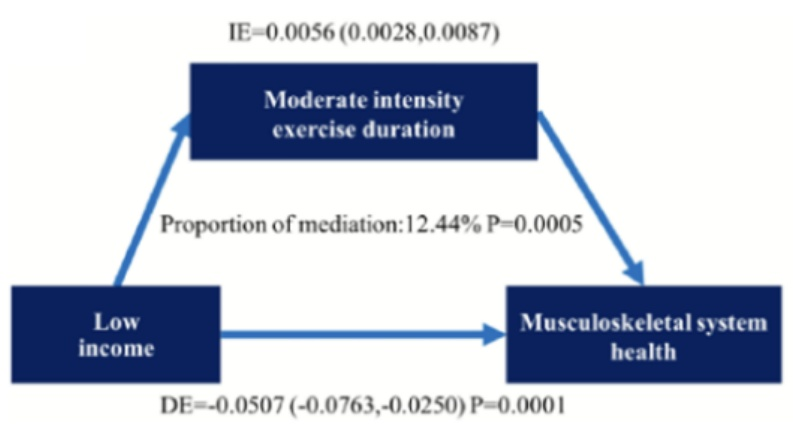

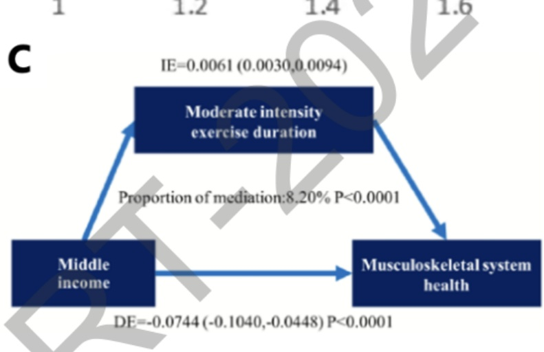

图1 收入水平与肌肉骨骼系统健康的关联及中等强度运动时长的中介作用。A:多因素校正后收入水平和运动量与肌肉骨骼系统健康的关系；B:中等强度运动时长在低收入组中的中介效应分析;C:中等强度运动时长在中等收入组的中介效应分析

肥胖对关节置换术预后的影响一直存在争议，既往研究多聚焦于BMI单一指标，忽视了身体成分的综合评估。项目组系统探讨多种肥胖相关指标及身体成分与术后自评健康状态的关联。研究比较了BMI、腰围、腰高比、身体圆度指数、相对脂肪量、总脂肪百分比、瘦体重等多个指标的预测能力。加权多因素logistic回归和限制性立方样条分析显示，在男性患者中，上述肥胖相关指标与较差的自评健康状态呈负相关，支持"肥胖悖论"的存在。ROC曲线分析揭示，瘦体重（1ean mass）对关节置换术后自评健康的预测能力最强（AUC=0.893，95%CI:0.835-0.951），优于传统的BMI指标（AUC=0.885）。该研究表明临床决策时应综合考虑身体成分变化，以最大化肥胖患者的手术获益，相关成果发表于TheJournal of Arthroplasty。

A BMI-ROC

D WHtR-ROC

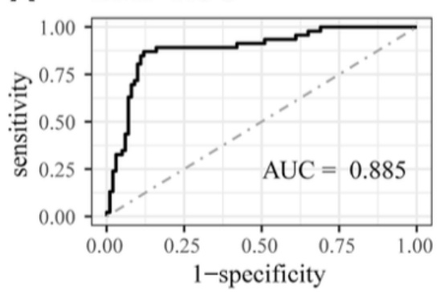

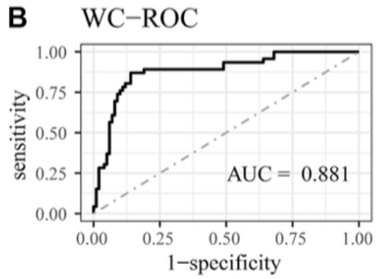

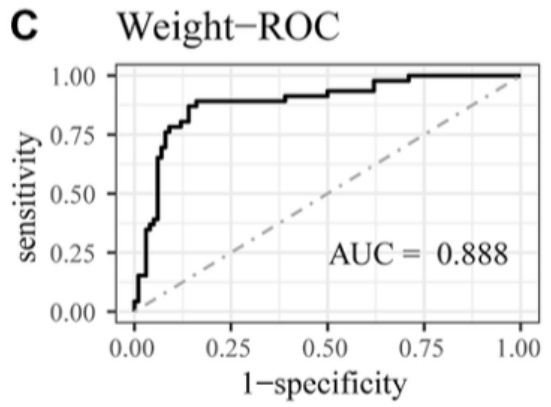

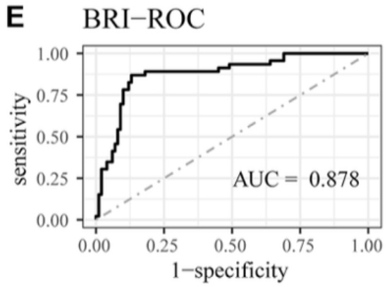

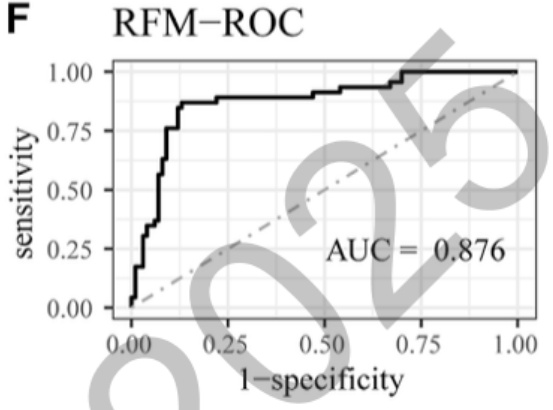

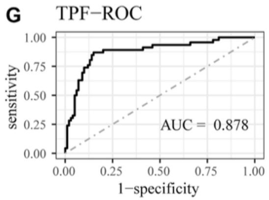

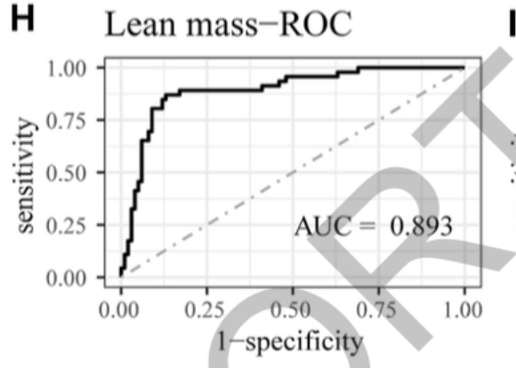

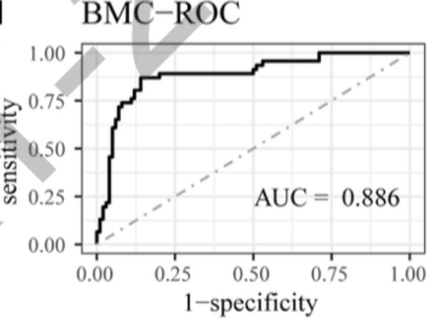

图 2 多种肥胖相关指标及身体成分预测自评健康状态的 ROC 曲线

## 2.2.2多模态骨关节影像智能配准融合与自动分割策略优化

骨关节多组织自动分割是实现疾病三维量化评估的基础。项目组围绕骨关节多模态影像多组织三维智能分割这一研究内容，系统开展了深度学习分割算法研发、弱监督学习策略探索及图像分析方法创新等系列研究，为后续病灶智能识别与量化分析奠定了技术基础。

骨关节影像三维智能分割弱监督学习策略方面，针对3D医学图像分割中标注成本高、现有方法忽视局部细节特征的问题，项目组创新性提出弱监督2D-3D特征共嵌入网络（2D-3D CoENet)，整合2D局部细节特征与3D全局结构特征，通过稀疏标注减少标注成本。该方法创新设计级联式2D-3D编码层实现特征深度融合，引入多视图学习与多视图语义一致性损失（MSC1oss）约束多视角特征并保证伪标签一致性，设计边缘增强模块（EEM）强化边缘细节以优化小组织分割。实验结果表明，在仅使用3%-8%标注的情况下，分割效果接近甚至超越全监督方法，对软骨等小组织分割精度提升显著，在SKI10数据集上Dice系数达96.69%。该研究提出了兼顾局部与全局特征的弱监督分割新框架，为膝关节等部位的精细分割提供了低标注成本解决方案，相关成果发表于BIBM2024。

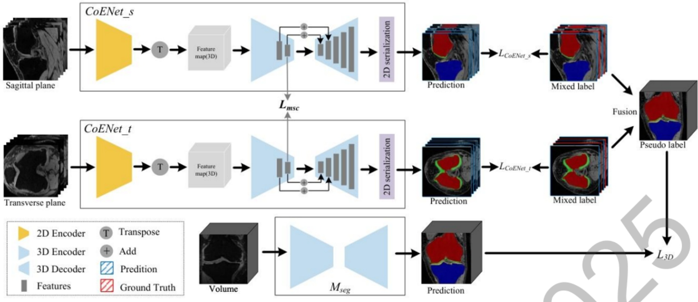

图3 基于矢状面-横断面协同学习的稀疏标注三维医学图像分割框架

在多组织精准分割方面，针对膝关节多组织形态差异大、 组织间边界紧邻导致的分割难题，项目组提出双注意力引导Transformer模型（nnCSCFormer)。该方法采用U型编解码结构，创新设计跨形状通道 Transformer模块（CSC TransformerBlock)，整合空间注意力与通道注意力机制捕获全局特征空间中空间维度与通道维度的关联关系，有效提取多组织特异性信息；同时引入跳跃注意力连接辅助解码器保留原始图像细节。实验结果表明，该模型可同时分割股骨、股骨软骨、胫骨、胫骨软骨、内侧半月板、外侧半月板六种组织，平均DSC达0.842，95HD低至2.9，在低分辨率膝关节 MRI上分割性能优于现有方法，相关成果发表于 ICCVDM 2024。

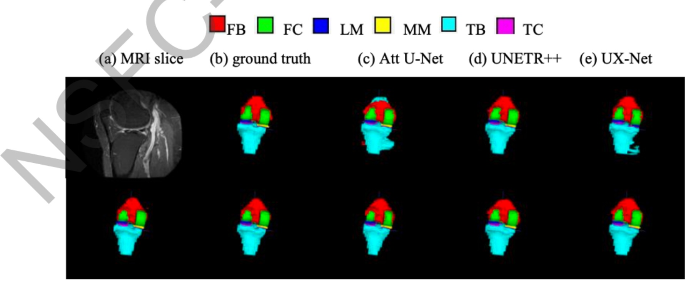

(f) nnFormer

(g) SwinUnet

(h) TransUnet

(i) nnCSFormer (j) nnCSCFormer

图4 基于 nnCSCFormer 的膝关节多组织分割效果与主流方法对比

在脊柱椎体分割方面，针对脊柱跨度大、曲率形态复杂、矢状面CT图像中相邻椎体相似度高导致的边缘细节捕获困难问题，项目组提出基于ResUNet的多尺度特征提取与特征精炼模型（MFRes-UNet)。该方法在编码器末端集成多尺度特征提取模块，采用多分支空洞卷积设计（膨胀率分别为1、3、5）扩展感受野，有效捕获脊柱全局结构及其与周围组织的上下文关系；同时在跳跃连接中嵌入特征精炼模块，采用大卷积核解耦策略分离空间卷积与通道卷积处理 并引入空间核选择机制根据不同区域特性动态选择最优卷积核，增强椎体边缘细节特征的提取能力。在CTSpine1k数据集上的实验结果表明，该模型平均Dice系数达88.89%，平均HD95为4.17mm，在颈椎、胸椎、腰椎各节段分割性能均优于3DUNet、VNet、TransUNet、ResUNet、nnUNet 等主流方法，相关成果发表于EESP 2024。

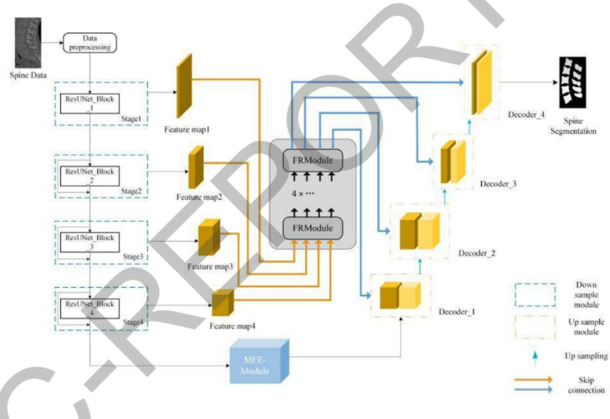

图5 基于多尺度特征提取与特征精炼的脊柱椎体分割网络架构

于上述技术积累，项目组构建了面向多部位骨与关节的智能分割技术体系，实现 了从弱监督学习到全监督精准分割、从单一组织到多组织联合分割的技术突破。所开发的分割算法可自动完成骨骼、软骨、半月板、椎体等多种组织的精准分割，并支持体积、厚度、关节间隙宽度等形态学参数的自动量化计算，为骨与关节疾病的三维可视化评估与临床辅助诊断提供了关键技术支撑。

## 2.2.3全栈式多任务骨关节疾病三维量化智能诊疗系统

基于前述多模态影像配准融合与自动分割技术，聚焦股骨头坏死、关节退行性病变、肩关节疾病及骨质疏松等高发病种，项目组开展跨部位（膝、髋、肩、脊柱）多病种智能诊断、三维量化评估全栈式诊疗系统。

## （1）股骨头坏死智能诊断-分型-量化研究

股骨头缺血性坏死(ONFH)是骨科常见的难治性疾病，我国非创伤性ONFH患者约 812万例，早期诊断对于保髋治疗至关重要。然而，早期ONFH 通常无症状，常规影像学检查易漏诊，MRI虽为首选检查方法，但诊断准确性高度依赖医师经验，基层医疗机构缺乏专科医师支撑。此外 ONFH的精确分型对预测股骨头塌陷、制定手术方案具有重要指导意义，但不同级别医师间的分型一致性较差。项目组围绕ONFH的早期诊断和精准分型需求，系统开展深度学习研究，从单中心探索到多中心验证，逐步建立了涵盖早期诊断和JIC分型的完整智能评估体系。

早期 ONFH的诊断依赖MRI，但诊断准确性受医师经验影响显著。为开发辅助诊断工具，课题组回顾性收集早期 ONFH 患者和正常髋关节 MRI数据，采用ResNeSt模型构建卷积神经网络。在图像预处理阶段，研究创新性地采用深度学习进行股骨头区域初步分割，以减少无关特征干扰。结果显示，CNN模型诊断早期 ONFH 的 AUC 达 0.98，准确性、灵敏性和特异性分别为 98.4%、97.6%和98.6%。人机对比实验表明，CNN模型准确性显著高于骨科主治医师(P=0.016)和住院医师（P<0.001），与副主任医师水平相当。该研究首次验证了深度学习在早期ONFH 诊断中的可行性，可为缺乏专科医师的基层医疗机构提供有效的辅助诊断工具，相关成果发表于 The Journal of Arthroplasty。

单中心研究难以全面反映模型的泛化能力。为开发具备更强鲁棒性的诊断系统，课题组进一步构建多中心数据集，纳入国内4家医疗机构的髋关节MRI，以DenseNet为架构开发深度卷积神经网络，用于从多种髋关节疾病中检测早期ONFH。结果显示，模型在内部测试集的AUROC、准确度和精确度分别为0.97、96.6%和97.6%；在外部测试集中，上述指标分别为0.95、95.2%和95.7%，显示出与骨科主治医师相当的诊断性能。Grad-CAM热力图证实模型关注区域集中于坏死区域，提高了模型的可解释性。该研究通过多中心验证证实了深度学习诊断系统的泛化能力和临床应用潜力，相关成果发表于International Orthopaedics。

A

B

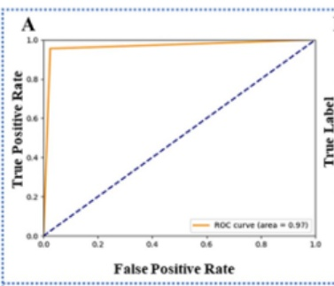

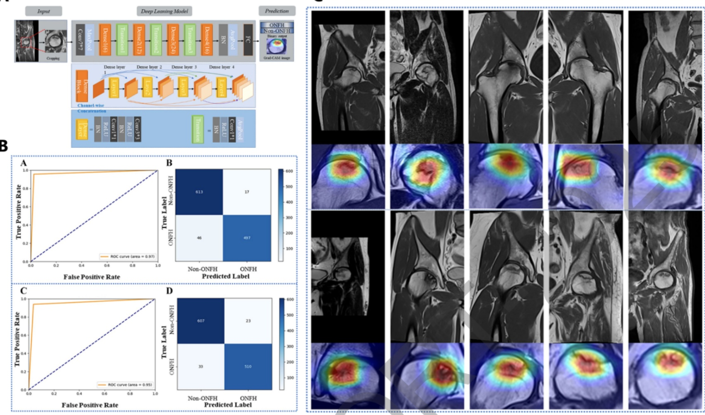

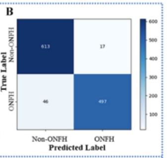

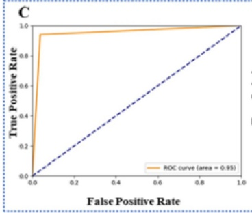

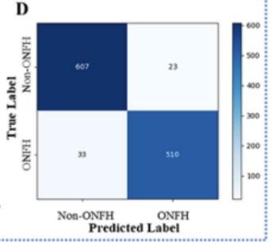

图6股骨头坏死患者诊断模型架构、性能及可视化。A:模型架构；B:训练集与测试集ROC曲线及混淆矩阵；C:Grad-CAM热力图可视化

ONFH的精确分型对预测股骨头塌陷风险和指导治疗决策具有重要意义。JIC分型系统基于坏死病灶大小和位置进行分类，在预测塌陷率方面具有明显优势，但不同级别医师间的分型一致性存在较大差异。为解决这一问题，课题组基于多中心数据开发JIC自动分型系统。研究采用 DenseNet 架构，在内部测试集中，模型整体准确率达87.76%，宏平均AUC、精确度、召回率和F值分别为0.90、84.80%、84.78%和 84.55%；在外部测试集中，整体准确率为 83.83%，宏平均 AUC达0.87。 模型对 JIC-C1和 JIC-C2型（高塌陷风险类型）的分类可靠性更高。Grad-CAM热力图显示CNN主要由坏死区域激活，验证了模型决策的合理性。人机对比结果显示，模型分型准确性显著优于骨科主治医师（P=0.002）和住院医师（P<0.001），与副主任医师相当，且单次分型仅需1.2秒。该研究首次建立了基于JIC分型的ONFH智能分类系统，可提供可靠、可重复的坏死严重程度评估，辅助骨科医师预测股骨头塌陷风险，相关成果发表于The Journal of Arthroplasty。

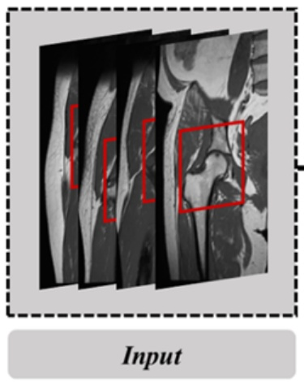

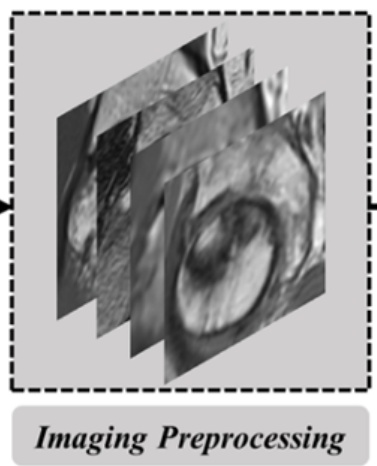

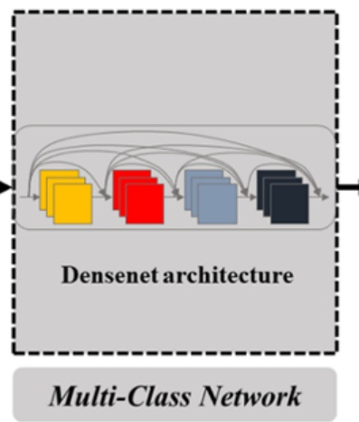

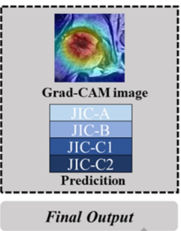

B

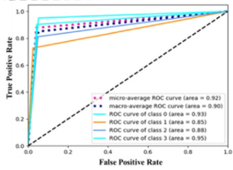

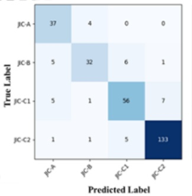

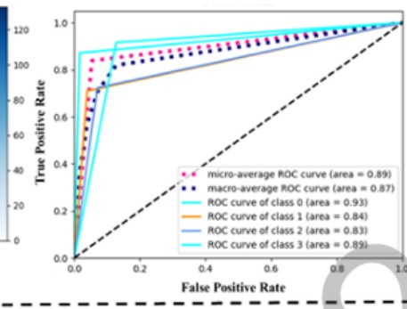

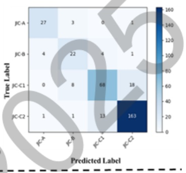

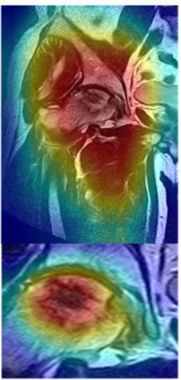

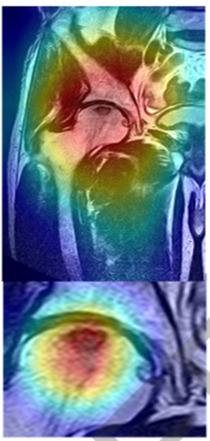

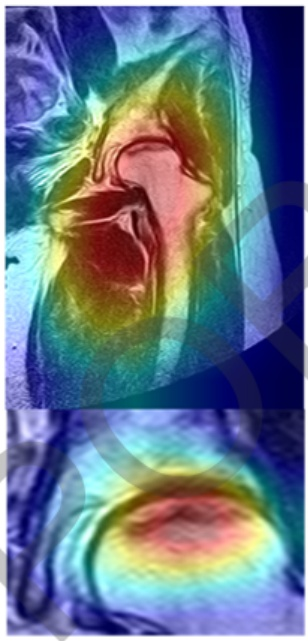

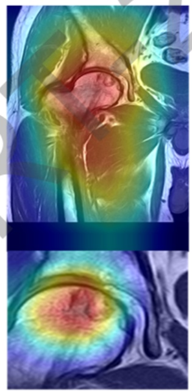

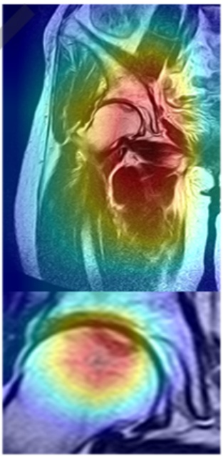

图7 多分类卷积神经网络框架图及预测结果解释性可视化。A:模型架构；B:训练集与测试集 ROC曲线及混淆矩阵；C:Grad-CAM热力图可视化

股骨头坏死病灶的精准量化对指导保髋手术方案制定具有重要临床价值。课题组通过 Res-U net 深度学习架构构建智能分割系统,通过 ITK-SNAP 软件建立人工标注金标准。结果显示,模型对未受累股骨头、髋臼和坏死病灶的DSC分别达93.4% 90.9%和 78.0%,实现了髋关节骨轮廓和坏死区域的精准分割。基于分割结果的三维体积定量显示,ONFH患者的坏死体积平均为 $9.70{\pm}8.44\  cm ^{3}$ ,且随 JIC分型加重而显著增加(JIC-A型 $2.30 \pm 1.75   cm ^3$ 、JIC-B型 $5.53 \pm 1.63    cm ^3$ 、JIC-C型$15.09 \pm 8.18    cm ^3,  P  < 0.01$ 。Bland-Altman分析证实自动分割与人工分割体积测量具有良好一致性。该研究实现了ONFH病灶的自动分割与客观定量,可为术前规划植骨量、监测疾病进展和评估治疗效果提供可靠工具，对改善早期ONFH保髋治疗具有重要应用价值。

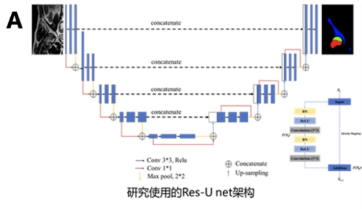

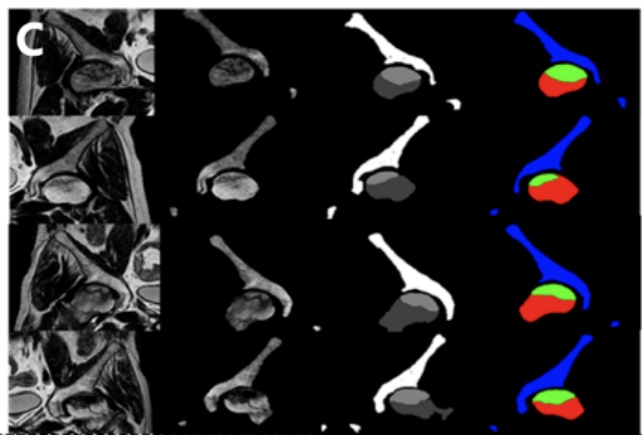

B

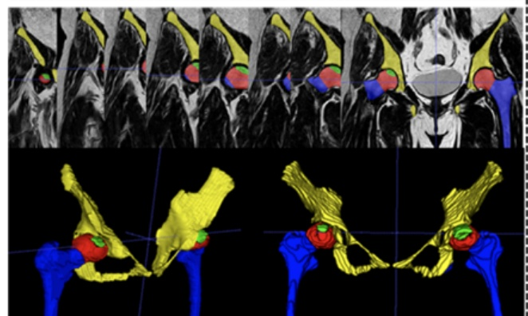

D

| 参数指标 | DSC (%) | Precision (%) | Recall (%) | F-value (%) | mIOU (%) | VOE (mm) |
| --- | --- | --- | --- | --- | --- | --- |
| 未受累股骨 头区域 | 93.4 | 93.5 | 93.2 | 93.4 | 87.6 | 0.124 |
| 髋臼 | 90.9 | 92.4 | 89.5 | 90.9 | 83.4 | 0.166 |
| 坏死病灶 | 78.0 | 78.1 | 77.8 | 78.0 | 63.9 | 0.361 |

图8股骨头坏死患者髋关节多组织智能分割及结果。A:Res-U net 网络架构；B:髋关节及坏死区域三维重建；C:MRI分割结果示例；D:各解剖结构分割性能指标

综上所述,课题组围绕股骨头缺血性坏死的临床诊疗需求,系统构建了"智能诊断-精准分型-定量评估"的完整AI辅助决策体系。该体系从早期诊断出发,通过ResNeSt 和 DenseNet 深度学习模型实现了对早期 ONFH的高精度识别,单中心研究 AUC 达 0.98,多中心验证 AUC 达 0.95,诊断性能与副主任医师相当,可为基层医疗机构提供可靠的筛查工具;在精准分型层面,基于JIC 分型系统的DenseNet模型实现了坏死严重程度的自动分类,整体准确率达 87.76%,显著优于主治医师水平,为预测股骨头塌陷风险和制定个体化治疗方案提供了客观依据;在定量评估方面,Res-U net 分割模型实现了坏死病灶的三维精准量化,DSC 达 93.4%,可客观测量坏死体积并指导术前植骨量规划。三项研究形成了从"发现病变"到"评估严重程度"再到"量化病灶范围"的递进式智能诊疗路径,贯穿ONFH早期诊断、风险分层和治疗决策全流程,为推动骨科影像智能化诊疗、提升ONFH保髋治疗效果提供了重要技术支撑。相关成果已在 The Journal of Arthroplasty 和 International Orthopaedics等国际权威期刊发表,展现出良好的临床转化应用前景。

## （2）关节退行性病变智能分析研究

关节退行性病变是老年人群高发疾病，严重影响患者生活质量并造成巨大社会经济负担。项目组围绕膝关节和髋关节两大主要负重关节，系统开展智能分析研究，建立了覆盖病灶智能检测、疾病分级评估的完整技术体系。

在髋关节方向，课题组针对髋关节骨关节炎开发了智能分级模型。采用

ResNet-50 结合 CBAM 注意力机制，纳入来自 3家中国医院的 22,673 个髋关节X线影像及国际OAI数据集1,249例进行训练与验证。模型在内部测试集准确率达90.83%（AUC0.94），外部验证准确率86.67%（AUC0.93），国际OAI验证准确率82.29%（AUC0.90）。人机对比实验表明，模型性能与副主任级骨科医师（10年经验）相当，并显著优于主治医师和住院医师（均P<0.001）。模型辅助可将各级别医师的诊断准确率提升4%-10%。Grad-CAM可视化证实模型关注区域与临床医师判读模式高度一致，相关研究发表于 Annals of Medicine。

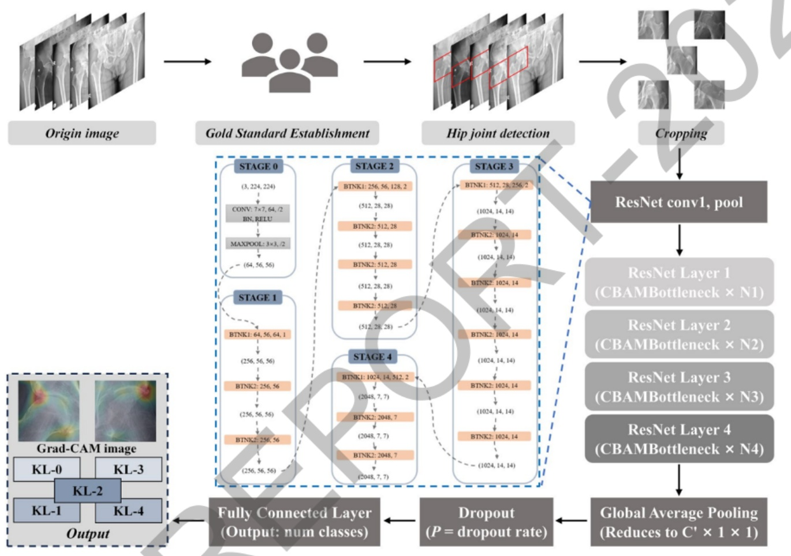

图 9 髋关节 KL 分级模型架构

## (3)肩关节骨与软组织智能评估体系研究

肩关节疾病是中老年人群常见病，肱骨近端骨折已成为第三大骨质疏松性骨折类型，肩袖损伤严重影响患者上肢功能和生活质量。然而，肩关节骨密度缺乏标准化评估方法，软组织损伤诊断高度依赖医师经验。项目组围绕肩关节临床诊疗需求，系统开展智能评估研究，建立了涵盖骨密度精准测量、人群参考标准构建、软组织损伤自动诊断的完整技术体系。

在骨密度评估方面，肱骨近端骨密度是肩关节手术规划的重要参数，但传统体模QCT需专用设备且无法回顾性分析既往CT数据。为解决这一问题，课题组使用半自动无体模定量CT（PL-QCT）系统，利用肩关节皮下脂肪和斜方肌作为内部校准参照，采用基于卷积图的自研算法实现肱骨近端松质骨密度的半自动测量。研究纳入188例患者376侧肱骨近端，由两名运动医学医师独立测量。

Bland-Altman 分析显示 PL-QCT 与传统体模 QCT(PB-QCT)平均偏差仅 1.0 mg/cc（一致性范围-9.4至11.4mg/cc，P>0.05），回归分析R²达0.9723，表明两种方法高度一致；短期重复性方面，PL-QCT的CV为6.17%（观察者内）和5.64%（观察者间），精密度可接受。该系统可利用常规胸部CT进行肱骨近端骨质疏松机会性筛查，为肩关节手术规划和个体化治疗方案制定提供骨密度依据，相关成果发表于 Osteoporosis International。

在人群参考标准构建方面，肱骨近端骨密度的年龄和性别相关变化规律尚不清楚，且腰椎骨密度能否替代肱骨近端评估存在争议。为解决这一问题，课题组基于 nnU-Net 开发全自动肱骨近端分割模型，在 2,675 名成年人的胸部 CT 中完成体积骨密度（vBMD）测量。采用GAMLSS模型建立性别特异性参考曲线（P3- P97百分位），结果显示:男性vBMD从成年早期即呈线性下降；女性vBMD在40-45岁前保持稳定甚至上升，此后呈陡峭同步下降，反映绝经期加速骨丢失。重要发现是腰椎 vBMD 与肱骨近端 vBMD 相关性较低(Pearson r=0.184-0.618)，且50岁后相关性进一步减弱，表明腰椎骨密度无法替代肱骨近端评估。该研究首次建立了肱骨近端 vBMD 的人群参考标准，为骨折风险评估和手术规划提供了循证依据，相关成果发表于 Osteoporosis International。

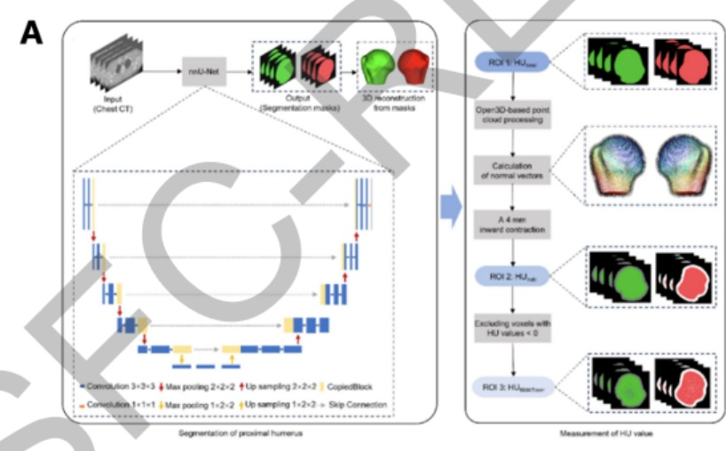

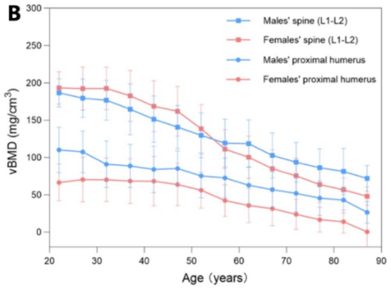

值测量流程；B:肱骨近端与腰椎vBMD随年龄变化的性别分层对比

在软组织诊断方面，冈上肌撕裂是肩袖损伤最常见类型，早期诊断对改善预后至关重要，但基于MRI的准确诊断对非肌骨专科医师仍具挑战性。为开发辅助诊断工具，课题组基于Xception架构构建2D和3D卷积神经网络模型，实现冈上肌撕裂的自动诊断。研究纳入701例肩关节MRI（2,804张图像）用于模型训练和内部测试，另69例经关节镜证实的手术患者构成临床验证集。结果显示，2D CNN模型性能最优，在手术测试集达到AUC 0.921（95%CI: 0.841-1.000）

灵敏度0.913、特异度0.848、F1-score 0.824;在内部测试集达到AUC0.882(95%CI: 0.817-0.947）。亚组分析显示模型对部分厚度撕裂和小撕裂检出率分别达0.625和0.833，且在1.5T与3.0TMRI间无显著性能差异，证实模型稳健性。与8名临床专家对比，2DCNN模型诊断性能优于低年资医师，与高年资医师相当，且单次诊断仅需0.17秒。该研究验证了深度学习辅助冈上肌撕裂诊断的临床可行性，可为基层医疗机构和经验不足的医师提供高效可靠的辅助诊断工具， 相关成果发表于 Journal of Orthopaedic Surgery and Research。

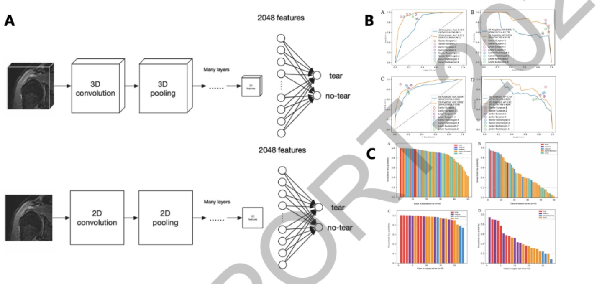

图11 肩袖撕裂深度学习诊断系统。A:2D 与3D CNN 模型架构；B:模型与临床医生在不同测试集上的 ROC 及 PR曲线对比；C:不同撕裂亚型的模型预测概率分布

## (4)骨密度智能评估与骨质疏松筛查研究

骨质疏松症是一种以骨量减少和骨微结构破坏为特征的全身性骨骼疾病，我国骨质疏松患病率随人口老龄化持续上升，已成为重要的公共卫生问题。然而，传统双能X线吸收法（DXA）在脊柱退行性病变患者中存在诊断偏倚，而定量（QCT）虽能准确测量松质骨密度，但需专用体模且操作复杂。此外，基层医疗机构缺乏骨密度检测设备，难以实现骨质疏松的早期筛查。项目组围绕骨质疏松的精准评估和机会性筛查需求，系统开展无体模QCT技术开发与临床验证研究，并探索基于常规X线的智能筛查方法。

传统 QCT需在扫描时放置体模校准，无法回顾性分析既往CT数据，限制了骨质疏松机会性筛查的开展。为解决这一问题，项目组与香港大学吕维佳教授团队联合开发了骨质状态智能评估系统——全自动无体模QCT系统(PL-QCT)，利用体内脂肪和肌肉组织作为内部校准参照，实现BMD自动测量和骨质疏松诊断。该系统可自动选择体内组织完成BMD校准，适用于大数据筛查。研究纳入

649例接受肺癌或COVID-19筛查低剂量CT（LDCT）的患者进行系统验证，以DXA结果为诊断参照。结果显示，该系统预测骨质疏松的AUC值为0.68-0.88，PL-QCT 测量的 BMD 与年龄变化趋势符合真实人群规律(30 岁以下约160 mg/cc至 80 岁以上约 70 mg/cc）。不同 CT 设备的 CT 值与 BMD 相关性 Pearson r 值达0.85-0.99，证实系统具有良好的跨设备一致性。该研究首次验证了自动无体模QCT 在 LDCT 中的诊断效能，可利用 COVID-19 或肺癌筛查 CT 进行骨质疏松机会性筛查，无需额外辐射暴露，相关成果发表于 Frontiers in Bioengineering and Biotechnology。

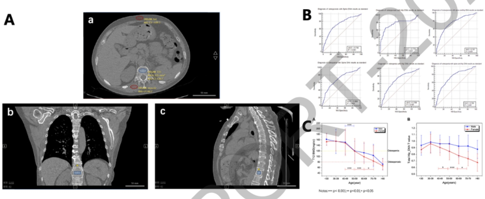

图12 无体模 QCT 骨密度机会性筛查系统。A:低剂量 CT 多平面 ROI 测量示意；B:PL-QCT诊断骨质疏松/骨量减少的 ROC曲线；C:PL-QCT 与 DXA 骨密度随年龄变化的性别分层对比

DXA是骨质疏松诊断的金标准，但在合并腰椎小关节骨关节炎（FJOA）的患者中，后方骨赘形成可能导致BMD测量值假性升高。为明确FJOA对不同测量方法的影响，课题组开展了QCT与DXA在FJOA患者中的对比研究。研究纳入 219 例患者，同时进行腰椎 DXA 和 QCT 检测。McNemar 检验显示 QCT 的腰椎骨质疏松检出率显著高于DXA（58% vs 34.2%，P<0.0001），两种方法诊断一致率仅 52%。多因素分析表明，严重 FJOA 与 QCT 测量的 vBMD 降低独立相关（β=-4.2，P<0.05），而轻中度和重度FJOA均与 DXA测量的 aBMD升高独立相关（轻中度β=0.31，P<0.001；重度β=1.03，P<0.001）。该研究首次证实FJOA对 DXA 骨密度测量存在显著影响，而QCT 可避免后方骨赘的干扰，为FJOA 患者的骨质疏松评估提供了更准确的方法选择，相关成果发表于Osteoporosis International。

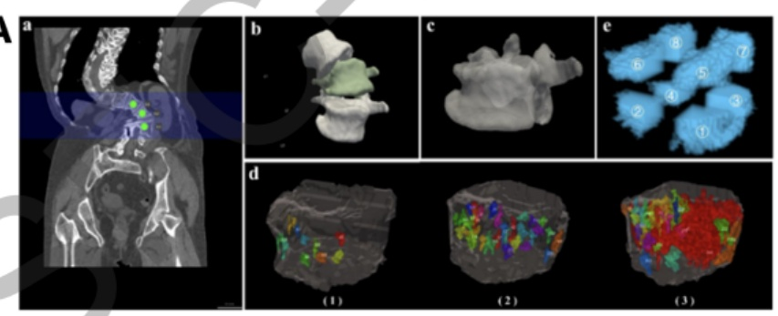

A

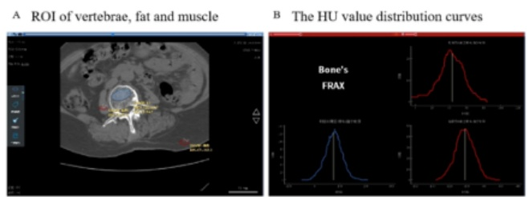

B

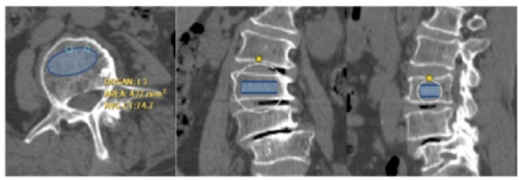

<table><tr><td>Factors</td><td></td><td colspan="4">QCT-vBMD (n = 1055)</td><td colspan="4">DXA T-score (n =825)</td></tr><tr><td></td><td></td><td>Coefficient Lower 95% CI</td><td></td><td>Upper 95% CI p value</td><td></td><td>Coefficient</td><td>Lower 95% CI</td><td>Upper 95% CI p value</td><td></td></tr><tr><td>Age</td><td>&lt;40</td><td>Ref</td><td>NA</td><td>NA</td><td>NA</td><td>Ref</td><td>NA</td><td>NA</td><td>NA</td></tr><tr><td></td><td>40-50</td><td>-42.78</td><td>-78.58</td><td>-6.98</td><td>0.019</td><td>0.16</td><td>-1.71</td><td>2.03</td><td>0.867</td></tr><tr><td></td><td>50-60</td><td>-76.28</td><td>-108.67</td><td>-43.89</td><td>&lt;0.001</td><td>-0.44</td><td>-2.14</td><td>1.25</td><td>0.608</td></tr><tr><td></td><td>60-70</td><td>-98.61</td><td>-130.72</td><td>-66.5</td><td>&lt;0.001</td><td>-1.14</td><td>-2.82</td><td>0.55</td><td>0.185</td></tr><tr><td></td><td>70-80</td><td>-110.57</td><td>-143.13</td><td>-78</td><td>&lt;0.001</td><td>-1.34</td><td>-3.05</td><td>0.37</td><td>0.123</td></tr><tr><td></td><td>&gt;80</td><td>-120.15</td><td>-154.98</td><td>-85.31</td><td>&lt;0.001</td><td>-0.82</td><td>-2.64</td><td>1.01</td><td>0.379</td></tr><tr><td>Gender</td><td>Male</td><td>Ref</td><td>NA</td><td>NA</td><td>NA</td><td>Ref</td><td>NA</td><td>NA</td><td>NA</td></tr><tr><td></td><td>Female</td><td>-18.78</td><td>-27.88</td><td>-9.68</td><td>&lt;0.001</td><td>-1.13</td><td>-1.61</td><td>-0.65</td><td>&lt;0.001</td></tr><tr><td>BMI</td><td>&lt;25</td><td>ref</td><td>NA</td><td>NA</td><td>NA</td><td>ref</td><td>NA</td><td>NA</td><td>NA</td></tr><tr><td></td><td>25-30</td><td>13.52</td><td>4.6</td><td>22.45</td><td>0.003</td><td>0.5</td><td>0.04</td><td>0.97</td><td>0.035</td></tr><tr><td>Facet joint</td><td>&gt;30 None</td><td>13.64</td><td>-0.98</td><td>28.26</td><td>0.067</td><td>1.83</td><td>1.07</td><td>2.6</td><td>&lt;0.001</td></tr><tr><td>osteoarthritis (%)</td><td></td><td>Ref</td><td>NA</td><td>NA</td><td>NA</td><td>Ref</td><td>NA</td><td>NA</td><td>NA</td></tr><tr><td></td><td>Slight-moderate 1.03</td><td></td><td>-1.06</td><td>3.12</td><td>0.333</td><td>0.31</td><td>0.16</td><td>0.46</td><td>&lt;0.001</td></tr><tr><td></td><td>Severe</td><td>-4.23</td><td>-7.68</td><td>-0.77</td><td>0.017</td><td>1.03</td><td>0.79</td><td>1.27</td><td>&lt;0.001</td></tr><tr><td>Abdominal aor- tic calcifica- tion (%)</td><td></td><td>-3.06</td><td>-5.24</td><td>-0.87</td><td>0.006</td><td>0.15</td><td>0</td><td>0.29</td><td>0.046</td></tr><tr><td>Intervertebral disc calcifica- tion (%)</td><td></td><td>0.57</td><td>-1.52</td><td>2.66</td><td>0.592</td><td>0</td><td>-0.14</td><td>0.14</td><td>0.988</td></tr><tr><td>Vacuum phenomenon (%)</td><td></td><td>3.14</td><td>0.81</td><td>5.47</td><td>0.008</td><td>0.3</td><td>0.14</td><td>0.46</td><td>&lt;0.001</td></tr></table>

图13 腰椎 QCT 骨密度测量与影响因素分析。A:基于 QCT 的腰椎骨密度测量方法；B:年龄、性别、BMI、脊柱退变等因素对 vBMD 和 DXA T 值的差异化影响 V

成人脊柱畸形（ASD）患者常合并骨质疏松，但椎体骨微结构的空间分布特征尚不清楚。为深入了解ASD患者骨质量的区域性差异，课题组基于无体模QCT技术开展椎体骨微结构研究。研究纳入167例冠状面ASD患者，测量顶椎及相邻椎体的 BMD 和骨空隙（bone void，BMD<40 mg/cm³区域）体积，将每个椎体分为凸侧和凹侧8个区域进行分析。结果显示， ASD 患者椎体骨空隙分布存在显著空间异质性和不对称性，骨空隙主要集中于凹侧后下方区域；在所有椎体水平，凹侧标准化骨空隙体积均显著高于凸侧；女性患者标准化骨空隙体积显著高于男性。该研究首次揭示了ASD患者椎体骨微结构的不对称分布特征，为理解ASD 进展机制和制定针对凹侧生物力学薄弱区域的干预策略提供了新视角，相关成果发表于 European Spine Journal。

A

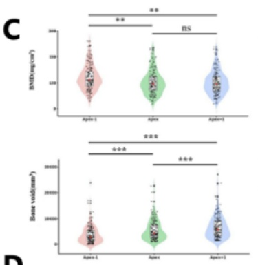

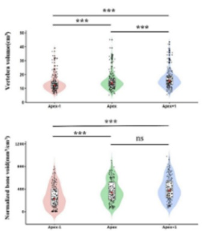

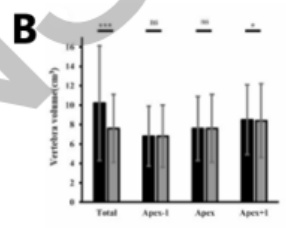

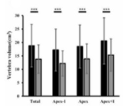

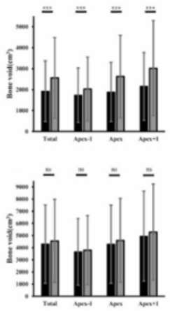

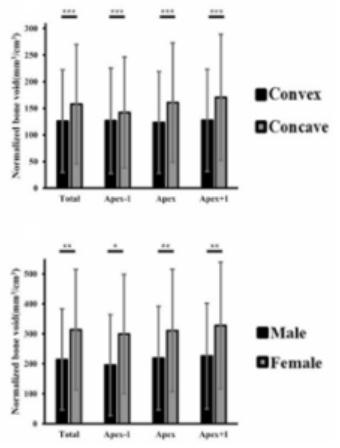

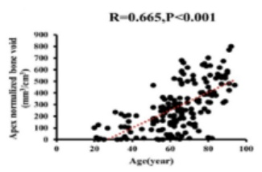

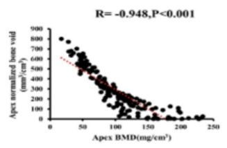

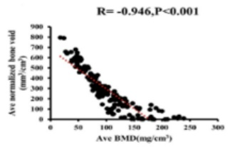

图14脊柱侧弯椎体骨空隙定量评估系统。A:椎体三维重建及八分区骨空隙检测方法；B:凸凹侧及性别间椎体与骨空隙体积对比；C:顶椎区不同节段的BMD与骨空隙差异；D:年龄、BMD与标准化骨空隙体积的相关性

## 2.2.4人-智-云协同全生命周期骨骼健康管理机制

基于上述智能诊疗技术的研发，项目组进一步依托云计算平台，构建了覆盖全生命周期的骨骼健康协同管理体系，并在多机构联邦学习及平台建设等方面取得了重要进展。

针对医学影像数据孤岛、隐私保护及多中心域偏移等问题，项目组系统开展了联邦学习方法研究，形成了从域自适应到半监督学习的完整技术体系

针对多中心 MRI 数据隐私保护与域偏移问题，2022 年提出基于混合专家（MoE）域自适应的加权联邦学习方法（Fed-MoEs）。该方法训练多种不同结构的公共模型，各参与方保留域适配私有模型，通过MoE结构动态融合公共与私有模型，基于Wasserstein距离计算数据集相似度构建权重矩阵指导公共模型参数更新。在三个不同设备采集的膝关节半月板MRI数据集上验证，该方法准确率分别达83.9%、79.2%、81.1%，AUC分别达0.891、0.835、0.864，较FedAvg平均提升 8%-10%，收敛速度较 FL+DE 提升 15%。该研究提出"多模型融合-相似度加权聚合-域自适应"的联邦学习新框架， 可实现多中心疾病筛查数据的不出院且可共享，适用于大型医疗联盟与区域医疗信息化建设，相关成果发表于BIBM 2022。

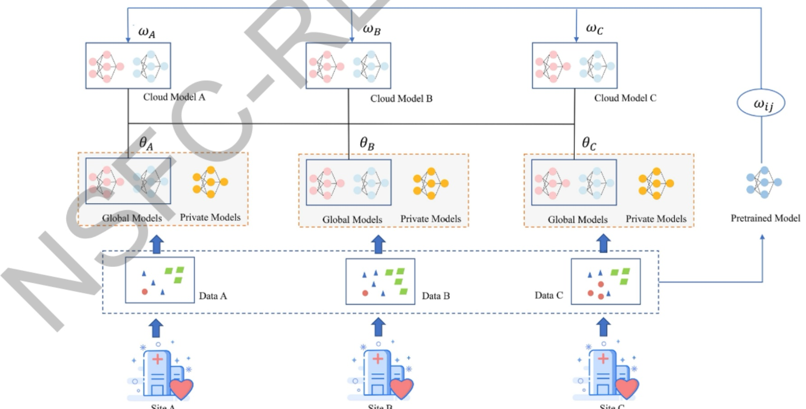

图15面向数据异构性的联邦学习框架:混合专家结构实现公共模型与私有模型的自适应融合

针对联邦学习中医疗数据标注不足与私有数据含噪声的问题，2024年进一步提出伪标签过滤的鲁棒联邦半监督学习方法（PFRFed）。该方法设计双动态阈值伪标签过滤机制自适应调整置信度与熵阈值，引入噪声容忍损失函数减轻噪声影响，提出基于局部模型余弦相似度的分组聚合方法加速全局模型收敛并减少噪声干扰。在两个公共医学影像数据集上实现95.20%和88.72%的分类准确率。该研究提出"动态伪标签过滤-噪声容忍-相似性分组聚合"的联邦半监督学习新框架，为医疗数据隐私保护与低标注依赖建模提供解决方案，可用于多机构协作的疾病筛查，适用于资源有限的基层医疗机构协同建模，相关成果发表于BIBM2024。

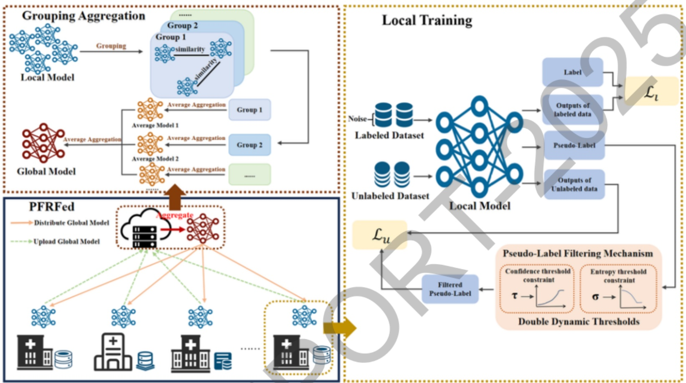

图16面向医疗数据隐私保护的半监督联邦学习框架:噪声容忍损失函数与伪标签质量控制

## （二）平台建设与学术合作

项目组聚焦于骨关节"诊-治-防"体系，构建了慢性骨病阶梯式管理诊疗防控体系，取得了系列创新成果:建立多模态影像分割及三维容积和密度测量方法，形成骨关节量化诊断新标准；建立假体设计优化及精准微创手术综合策略，开创骨病阶梯治疗新方案；构建骨健康全栈式人-智-云体系，为基层骨病防控同质化提供技术支撑。该体系获2023年吉林省科学技术进步奖一等奖。

## 3. 研究人员的合作与分工。

| 序号 | 姓名 | 单位 | 分工 |
| --- | --- | --- | --- |
| 1 | 秦彦国 | 吉林大学 | 项目统筹安排 |
| 2 | 刘建华 | 吉林大学 | 多模态影像配准与融合 |
| 3 | 王晰崴 | 吉林大学 | 大数据管理与生物信息挖掘 |
| 4 | 祝文涛 | 华中科技大学 | 临床影像诊断 |
| 5 | 白天 | 吉林大学 | 联邦学习系统构建 |
| 6 | 苗语 | 长春理工大学 | 图像分割算法开发 |
| 7 | 张丽媛 | 长春理工大学 | 人工智能技术支持 |
| 8 | 张津铭 | 华中科技大学 | 智能诊断系统开发与测试 |
| 9 | 盛基尧 | 吉林大学 | 临床影像诊断与分析 |
| 10 | 唐雄风 | 吉林大学 | 病例搜集和数据处理 |

## 4. 国内外学术合作交流等情况。

参加 Osteoarthritis Research Society International、The 8th Annual Meeting of ASIA、中华医学会骨科学术会议、中华医学会关节外科学术大会、中国医师协会骨科医师年会等国际/国内会议交流14次。

## 论文发言/壁报交流

(1）沈先月，唐雄风，秦彦国\*；基于深度学习的股骨头缺血性坏死三维MRI自动诊断与分型，首届中国图象图形学报研究生论坛，中国科学院空天信息创新研究院，2021-9-27至2021-9-29 1

(2) Xianyue Shen, Jianlin Xiao, Yanguo Qin\*; Development and Validation of An Automated Classification System for ONFH Using Deep Learning Approach: A Multi-Center Study, The 8th Annual Meeting of ASIA (ASIA 2022), Bali, Indonesia & Beijing, China， 2022-8-27 至 2022-8-28

（3）陈博，李颖智，秦彦国\*；外侧半月板后跟修复对前交叉韧带重建后膝关节稳定性的影响，第十四届中国医师协会骨科医师年会，青岛市，2023-6-1至2023-6-4

（4）沈先月，唐雄风，秦彦国\*；使用深度卷积神经网络从各种髋关节病变中自动检测早期股骨头坏死:一项多中心研究，第十四届中国医师协会骨科医师年会，青岛市，2023-6-1至2023-6-4

（5）唐雄风，秦彦国\*；膝关节磁共振多组织三维智能分割与定量分析研究，第十四届中国医师协会骨科医师年会，青岛市，2023-6-1至2023-6-4

(6）沈先月，唐雄风，秦彦国\*；基于深度学习方法开发和验证股骨头缺血性坏死自动分型系统:一项多中心研究，中华医学会第二十二届骨科学术会议暨第十五届COA学术大会，西安市，2023-11-22至2023-11-26

（7）陈博，唐雄风，沈先月，秦彦国\*；基于深度学习的膝关节X线ACL撕裂诊断与评估，中华医学会第二十二届骨科学术会议暨第十五届COA学术大会，西安市，2023-11-22至2023-11-26

（8）陈博，郭德明，唐雄风，李颖智，秦彦国\*；基于膝关节X线的前交叉韧带损伤智能预测模型构建，2024中华医学会关节外科学术大会，无锡市，2024-12-20 至2024-12-22

（9）郭德明，李士怀，秦彦国\*；基于R-BoneVit的肩临界角、肩峰指数半自动测量及临床验证，2024中华医学会关节外科学术大会，无锡市，2024-12-20至2024-12-22

(10) Xiongfeng Tang, Yanguo Qin\*; Fully automated quantification of knee joint fluid based on deep learning: Data from magnetic resonance imaging of healthy adults, Osteoarthritis Research Society International(OARSI), Seoul, South Korea 2025-4-24 至 2025-4-27

（11）徐圣昊，唐雄风，肖建林，杨敏，陈博，秦彦国\*；基于多中心双髋X线的深度学习模型在髋关节异常筛查中的应用:开发、验证及辅助读者研究，中华医学会2025年关节外科学术大会，上海市，2025-10-16至2025-10-19

（12）徐圣昊，唐雄风，肖建林，陈博，秦彦国\*；基于多中心双髋X线的深度学习模型在髋关节异常筛查中的应用:开发、验证及辅助读者研究，中华医学会第二十四届骨科学术会议暨第十七届 COA学术大会，天津市，2025-11-12至2025-11-16

(13）徐圣昊，肖建林，唐雄风，陈博，秦彦国\*；髋骨关节炎严重程度自动分级的深度学习模型的开发和验证:一项多中心研究，中华医学会第二十四届骨科学术会议暨第十七届COA学术大会，天津市，2025-11-12至2025-11-16

(14）郭德明，李士怀，秦彦国\*；基于深度学习的冈上肌萎缩自动评估及术后再撕裂风险预测，2025年中华医学会运动医疗分会学术年会，西安市，2025-11-28 至 2025-11-30

5. 存在的问题、建议及其他需要说明的情况。

## （二）成果部分

## 1. 项目取得成果的总体情况。

发表高水平SCI论文13篇，会议论文5篇，授权国家发明专利1项，获批计算机软件著作权4项，获得吉林省科技进步一等奖1项。研究成果获国家骨科医学中心颁发的"2024年度中国骨科十大临床诊疗新进展"。

## 2. 项目成果转化及应用情况。

本项目在实施过程中，一系列用于骨关节影像智能识别与诊断的人工智能系统专利及软件著作权获得授权，具体如下:

## 授权发明专利:

一种基于人工智能的前交叉韧带重建术后智能评估系统（2024113637929）

实审期发明专利:

一种基于人工智能的股骨头坏死分期分析方法及系统

## 软件著作权:

膝关节多组织图像智能分割系统（2025SR1957686）

前交叉韧带重建术后智能评估系统（2025SR1957098）

膝关节积液智能定量评估系统（2025SR1957795）

脑积水智能定量分析评估系统（2025SR2014143）

## 3. 人才培养情况。

项目负责人高度重视研究生培养工作，以导师身份指导培养了一批具有医工交叉能力的高素质骨科研究人才。在博士研究生培养方面，已培养8名博士生和8名硕士生。

在青年教师培养方面，项目培养的博士毕业生已成长为医工交叉领域青年骨干。2名博士研究生毕业后入职吉林大学第二医院，1名入职中国科学技术大学附属第一医院，三人持续深耕骨关节疾病智能诊疗研究，在多模态影像分析、深度学习算法开发等方向取得系列成果，已成为所在单位医工交叉研究的重要力量。

4. 其他需要说明的成果。

无

5. 项目成果科普性介绍或展示网站。

## 研究成果目录

项目负责人通过系统，从文献库中检索研究成果或者按要求格式自行填入。请按照期刊论文、会议论文、学术专著、专利、会议报告、标准、软件著作权、科研奖励、人才培养、成果转化的顺序列出，其它重要研究成果如标本库、科研仪器设备、共享数据库、获得领导人批示的重要报告或建议等，应重点说明研究成果的主要内容、学术贡献及应用前景等。

项目负责人不得将非本人或非参与者所取得的研究成果、与受资助项目无关的研究成果、未标注国家自然科学基金资助和项目批准号的论文以及取得时间早于项目资助期开始时间的研究成果列入报告中。发表的研究成果（包括专利），项目负责人和参与者均应如实注明得到国家自然科学基金项目资助和项目批准号，科学基金作为主要资助渠道或者发挥主要资助作用的，应当将自然科学基金作为第一顺序进行标注。

## 期刊论文

(1) Shen, Xianyue; Luo, Jia; Tang, Xiongfeng; Chen, Bo; Qin, Yanguo; Zhou, You; Xiao, Jianlin; Deep Learning Approach for Diagnosing Early Osteonecrosis of the Femoral Head Based on Magnetic Resonance Imaging, J0 URNAL OF ARTHROPLASTY, 2023， 38(10):2044-2050. 第一标注

(2) Shen, Xianyue; He, Ziling; Shi, Yi; Yang, Yuhui; Luo, Jia; Tang, Xiongfeng; Chen, Bo; Liu, Tong; Xu, Shenghao; Xiao, Jianlin; Zhou, You; Qin, Yanguo; Automatic detection of early osteonecrosis of the femoral head from various hip pathologies using deep convolutional neural network: a multi-centre study, INTERNATIONAL ORTHOPAEDICS，2023，47(9):2235-2244.第一标注

(3) Deming Guo; Xiaoning Liu; Dawei Wang; Xiongfeng Tang; Yanguo Qin; Development and clinical validation of deep learning for auto-diagnosis of supraspinatus tears, Journal of Orthopaedic Surgery and Research, 2023, 18(1). 第四标注 1

(4) Shen, Xianyue; He, Ziling; Shi, Yi; Liu, Tong; Yang, Yuhui; Luo, Jia; Tang, Xiongfeng; Chen, Bo; Xu, Shenghao; Zhou, You; Xiao, Jianlin; Qin, Yanguo; Development and Validation of an Automated Classification System for Osteonecrosis of the Femoral Head Using Deep Learning Approach: A Multicenter Study, JOURNAL OF ARTHROPLASTY, 2024，39(2):379-386. 第一标注

(5) Xiongfeng, Tang; Cheng, Zhang; Meng, He; Chi, Ma; Deming, Guo; Huan, Qi; Bo, Chen; Kedi, Yang; Xianyue, Shen; Tak-Man, Wong; William Weijia, Lu; Yanguo, Qin; One Novel Phantom-Less Quantitative Computed Tomography System for Auto-Diagnosis of Osteoporosis Utilizes Low-Dose Chest Computed Tomography Obtained for COVID-19 Screening, FRONTIERS IN BIOENGINEERING AND BIOTECHNOLOGY, 2022, 10(28). 第一标注

(6) Xu, Shenghao; Shen, Xianyue; Chen, Bo; Sun, Yingqiao; Tang, Xiongfeng; Xiao, Jianlin; Qin, Yanguo; Trends in prevalence of arthritis by race among adults in the United States, 2011-2018, BMC PUBLIC HEALTH, 2024, 24(1). 第一标注

(7) Deming Guo; Yuanzhi Weng; Zehao Yu; Shihuai Li; Wenrui Qu; Xiaoning Liu; Huan Qi; Chi Ma; Xiongfeng Tang; Ruiyan Li; Qinghe Han; Hao Xu; Weijia William Lu; Yanguo Qin; Semi-automatic proximal humeral trabecular bone density assessment tool: technique application andclinical validation, Osteoporosis International, 2024, 35(6). 第一标注

(8) Pan, Xiangjun; Liu, Shibo; Chen, Bo; Yu, Zehao; Hao, Wang; Tang, Xiongfeng; Qin, Yanguo; Correlation analysis of exercise volume and musculoskeletal disorders in people with income level differences: research based on the 2011-2018 NHANES dataset, BMC PUBLIC HEALTH, 2024, 24(1). 第一标注

(9) Ji, Chenqing; Wang, Xiayan; Weng, Yuanzhi; Ma, Chi; Li, Shihuai; Zhang, Hongda; Li, Ruiyan; Tang, Xiongfeng; Xie, Zhuoting; Qu, Wenrui; Xu, Hao; Lu, William W.; Guo, Deming; Qin, Yanguo; Asymmetric distribution of vertebral bone microstructure in coronal adult spinal deformity: a cross-sectional study based on quantitative CT, European Spine Journal, 2025, 35(1): 256-266. 第四标注

(10) Li, Rongpeng; Chen, Bo; Liu, Shibo; Pan, Xiangjun; Tang, Xiongfeng; Qin, Yanguo; Obesity Paradox in Joint Arthroplasty: A Cross-Sectional Study Highlighting the Predictive Power of Lean Mass on Self-Reported Health Status, Journal of Arthroplasty, 2025, 40(11). 第一标注

(11) Xu, Shenghao; Guo, Chaohui; Zuo, Jianlin; Yang, Min; Chen, Bo; Li, Shihuai; Xiao, Jianlin; Tang, Xiongfeng; Qin, Yanguo; Development and validation of a deep learning model for automatic severity grading of hip osteoarthritis: a multi-center study, Annals of Medicine, 2025, 57(1). 第一标注

(12) Li, Shihuai; Tang, Chong; Zhang, Hongda; Ma, Chi; Weng, Yuanzhi; Chen, Bo; Xu, Shenghao; Xu, Hao; Giunchiglia, Fausto; Lu, Weijia William; Guo, Deming; Qin, Yanguo; Age- and sex-related changes in proximal humeral volumetric BMD assessed via chest CT with a deep learning-based segmentation model, Osteoporosis International,2025，36(11):2185-2195. 第一标注

(13) Xiayan Wang; Chenqing Ji; Shihuai Li; Kexin Wang; Meng He; Zehao Yu; Yuanzhi Weng; Weibo Jiang; Xiongfeng Tang; Deming Guo; Yanguo Qin; Quantitative computed tomography provides improved accuracy for diagnosis of lumbar osteoporosis in patients with facet joint osteoarthritis: a cross-sectional study, Osteoporo sis International, 2025. 第一标注

## 会议论文

(1) Tian Bai; Yingfang Zhang; Yuzhao Wang; Yanguo Qin; Fa Zhang; Multi-site MRI classification using Weighted federated learning based on Mixture of Experts domain adaptation, IEEE International Conference on Bioinformatics and Biomedicine, Las Vegas, United States, 2022-12-6至2022-12-8. 第一标注

(2) Zhu, Mingzhu; Guo, Shuyu; Wang, Ziwei; Jiao, Jianhang; Bai, Tian; 2D-3D Feature Co-Embedding Network with Sparse Annotation for 3D Medical Image Segmentation, 2024 IEEE International Conference on Bioinformatics and Biomedicine, Lisbon，Portugal， 2024-12-3至2024-12-6. 第一标注

(3) Wang, Ziwei; Guo, Shuyu; Zhu, Mingzhu; Bai, Tian; Robust Federated Semi-Supervised Learning for Medical Image Classification via Pseudo-Label Filtering, 2024 IEEE International Conference on Bioinformatics and Biomedicine, Lisbon，Portugal，2024-12-3至2024-12-6. 第一标注

(4) Yixin Wang; Liyuan Zhang; Yu Miao; Xiongfeng Tang; A dual attention-guided transformer for multitissues segmentation of knee joint, 2024 5th International Conference on Computer Vision and Data Mining, Changchun，China，2024-7-19至2024-7-21. 第一标注

(5) Zhao· Hanlin; Zhang·Liyuan; Tang·Xiongfeng; MFRes-UNet: A ResUNet Fusing Multiscale Features for Accurate Spine CT Images Segmentation, 2024 5th International Conference on Electronic Engineering and Signal Processing， Derby，UK，2024-12-2至2024-12-4. 第一标注

专利

(1） 秦彦国；陈博；唐雄风；郭德明；徐圣昊；李士怀；孙英侨；

一种基于人工智能的前交叉韧带重建术后智能评估系统，2025-12-5至2035-12-5，中国，ZL202411363792.9.

## 软件著作权

(1) 吉林大学；膝关节多组织图像智能分割系统V1.0，2025SR1957686，原始取得，全部权利，2025-10-11.

(2) 吉林大学；膝关节积液智能定量评估系统 V1.0，2025SR1957795，原始取得，全部权利，2025-10-11.

(3) 吉林大学；脑积水智能定量分析评估系统[简称:脑积水智能定量]V1.0，2025SR2014143，原始取得，全部权利，2025-10-17.

(4) 吉林大学；前交叉韧带重建术后智能评估系统 V1.0，2025SR1957098，原始取得，全部权利，2025-10-11.

科研奖励

(1) 秦彦国(1/13)；骨关节衰老病变阶梯式“诊-治-防”智能体系的构建及推广，吉林省人民政府，科技进步，省部一等奖，2023（秦彦国；王金成；唐雄风；瞿文瑞；郭德明；李瑞延；常非；沈先月；卿云安；盛基尧；李颖智；陈博；王蒿）.

## 人才培养

## 1. 出站博士后/毕业博士/毕业硕士/在站博士后/在读博士/在读硕士

(1） 唐雄风；毕业博士，膝关节磁共振多组织三维智能分割与定量分析研究，秦彦国，2021-6-01至2023-07-01.

(2) 郭德明；毕业博士，基于深度学习的冈上肌撕裂MRI诊断与“骨骼一肌肉”三维定量决策支持研究，秦彦国，2021-09-01至2024-07-01.

(3) 沈先月；毕业博士，基于深度学习技术的股骨头缺血性坏死智能诊断和图像分割研究，秦彦国，2021-06-01至2023-07-01.

(4) 李植花；毕业博士，医学影像病灶检测与分割关键技术研究，蒋振刚；张丽媛，2022-09-01至2024-03-01.

(5) 陈威；在读博士，人才培养/学生培养/在读博士/陈威.

(6) 张江波；在读博士，人才培养/学生培养/在读博士/张江波.

(7) 李士怀；在读博士，人才培养/学生培养/在读博士/李士怀.

(8) 陈博；在读博士，人才培养/学生培养/在读博士/陈博.

(9) 徐圣昊；在读博士，人才培养/学生培养/在读博士/徐圣昊.

(10) 姬晨清；在读硕士，人才培养/学生培养/在读硕士/姬晨清.

(11) 王政达；在读硕士，人才培养/学生培养/在读硕士/王政达.

(12) 刘泽宇；在读硕士，人才培养/学生培养/在读硕士/刘泽宇.

(13) 杨凯晨；在读硕士，人才培养/学生培养/在读硕士/杨凯晨.

(14) 李荣鹏；在读硕士，人才培养/学生培养/在读硕士/李荣鹏.

(15) 汪夏炎；在读硕士，人才培养/学生培养/在读硕士/汪夏炎.

(16) 赵静怡；在读硕士，人才培养/学生培养/在读硕士/赵静怡.

(17) 刘子源；在读硕士，人才培养/学生培养/在读硕士/刘子源

## 项目成果应用前景

本项目成果拟应用领域:1、骨与关节疾病诊疗

预计在10年以上推广使用

附表:研究成果统计数据表（本表针对各种类型资助项目收集数据以便进行整体资助效果分析使用，并非要求每类项目都具有以下各类成果。

<table><tr><td rowspan=4>获奖（项）</td><td colspan=16>国家级</td><td colspan=11>部级1</td><td rowspan=3 colspan=2>其他</td></tr><tr><td colspan=4>自然科学奖</td><td colspan=5>科技进步奖</td><td></td><td colspan=6>发明奖</td><td colspan=7>自然科学奖</td><td colspan=4>科技进步奖</td></tr><tr><td colspan=2>一等</td><td colspan=2>二等</td><td colspan=2>一等</td><td colspan=3>二等</td><td></td><td colspan=3>一等</td><td colspan=3>二等</td><td colspan=3>等</td><td colspan=4>等</td><td colspan=2>一等</td><td colspan=2>二等</td></tr><tr><td colspan=2>0</td><td colspan=2>0</td><td colspan=2>0</td><td colspan=3>0</td><td></td><td colspan=3>0</td><td colspan=3>0</td><td colspan=3>0</td><td colspan=4>0</td><td colspan=2>1</td><td colspan=2>0</td><td colspan=2>0</td></tr><tr><td rowspan=4>学术报告/论文/专著/其他（篇）</td><td colspan=3>特邀学术报告</td><td colspan=15>学术论文</td><td rowspan=2 colspan=4>学术专著</td><td rowspan=2 colspan=7>其他</td></tr><tr><td rowspan=2>国际学术会议</td><td rowspan=2 colspan=2>国内学术会议</td><td colspan=4>发表论文数</td><td colspan=11>论文检索收录情况</td></tr><tr><td colspan=2>期论义</td><td colspan=2>会议</td><td colspan=2>SCIE/SSCI</td><td colspan=3>EI</td><td colspan=3>北大中文核心期刊</td><td colspan=3>CSSCI</td><td colspan=2>中文</td><td colspan=2>外文</td><td colspan=2>标本库</td><td colspan=2>数据库</td><td colspan=2>科研仪器设备</td><td>重要报告</td></tr><tr><td>0</td><td colspan=2>0</td><td colspan=2>13</td><td colspan=2>5</td><td colspan=2>0</td><td colspan=3>0</td><td colspan=3>0</td><td colspan=3>0</td><td colspan=2>0</td><td colspan=2>0</td><td colspan=2>0</td><td colspan=2>0</td><td colspan=2>0</td><td>0</td></tr><tr><td rowspan=4>专利/标准/软著/成果转化</td><td></td><td colspan=6>专利（项）</td><td colspan=2></td><td colspan=11>标准</td><td rowspan=3 colspan=2>软件著作权</td><td rowspan=2 colspan=7>成果转化</td></tr><tr><td colspan=3>国内</td><td colspan=4>国外</td><td rowspan=2 colspan=2>国际</td><td colspan=11>国内</td></tr><tr><td>申请</td><td colspan=2>授权</td><td colspan=2>申请</td><td colspan=2>授权</td><td colspan=3>国家</td><td colspan=3>行业</td><td colspan=3>地方</td><td colspan=2>企业</td><td colspan=2>技术转让技</td><td colspan=2>术许可作</td><td colspan=2>价投资</td><td>经济效益(万元)</td></tr><tr><td>0</td><td colspan=2>1</td><td colspan=2>0</td><td colspan=2>0</td><td colspan=2>C</td><td colspan=3>0</td><td colspan=3>0</td><td colspan=3>0</td><td colspan=2>0</td><td colspan=2>4</td><td colspan=2>0</td><td colspan=2>0</td><td colspan=2>0</td><td>0</td></tr><tr><td rowspan=4>人才培养及学术交流</td><td colspan=17>人才培养（人）</td><td colspan=12>举办和参加学术会议</td></tr><tr><td colspan=8>中青年学术带头人</td><td rowspan=2 colspan=3>出站博士后</td><td rowspan=2 colspan=3>毕业博士</td><td rowspan=2 colspan=3>毕业硕士</td><td colspan=4>举办国际学术会议</td><td colspan=5>举办国内学术会议</td><td colspan=3>参加国际学术会议</td></tr><tr><td>优青</td><td colspan=2>杰青</td><td colspan=2>创新群体</td><td colspan=2>其他</td><td></td><td colspan=2>次数</td><td colspan=2>人数</td><td colspan=3>次数</td><td colspan=2>人数</td><td colspan=2>次数</td><td>人数</td></tr><tr><td>0</td><td colspan=2>0</td><td colspan=2>0</td><td colspan=2>0</td><td></td><td colspan=3>0</td><td colspan=3>4</td><td colspan=3>0</td><td colspan=2>0</td><td colspan=2>0</td><td colspan=3>0</td><td colspan=2>0</td><td colspan=2>0</td><td>0</td></tr></table>

国家自然科学基金项目资金决算表

项目批准号:U21A20390

项目负责人:秦彦国

金额单位:万元

<table><tr><td rowspan="3">行次</td><td rowspan="3">科目名称</td><td colspan="3">预算数</td><td rowspan="2">累计支出数</td><td rowspan="2">结余数</td><td rowspan="2">结余资金比例</td></tr><tr><td>批准预算</td><td>预算调整</td><td>调整后预算</td></tr><tr><td>(1)</td><td>(2)</td><td>(3) = (1) + (2)</td><td>(4)</td><td>(5) =(3)-(4)</td><td>(6)</td></tr><tr><td>(1)</td><td>项目总经费</td><td>312.0000</td><td>0.0000</td><td>312.0000</td><td></td><td></td><td>58.30%</td></tr><tr><td>(2)</td><td>项目直接费用</td><td>260.0000</td><td>0.0000</td><td>260.0000</td><td>X        78.0983</td><td>181.9017</td><td></td></tr><tr><td>(3)</td><td>1、设备费</td><td>6.8000</td><td>0.0000</td><td>6.8000</td><td>0.0000</td><td>6.8000</td><td></td></tr><tr><td>(4)</td><td>其中:设备购置费</td><td>0.0000</td><td>0.0000</td><td>0.0000</td><td>0.0000</td><td>0.0000</td><td></td></tr><tr><td>(5)</td><td>2、业务费</td><td>220.4000</td><td>0.0000</td><td>220.4000</td><td>46.5483</td><td>173.8517</td><td></td></tr><tr><td>(6)</td><td>3、劳务费</td><td>32.8000</td><td>0.0000</td><td>32.8000</td><td>31.5500</td><td>1.2500</td><td></td></tr><tr><td>(7)</td><td>项目间接费用</td><td>52.0000</td><td>0.0000</td><td>52.0000</td><td></td><td></td><td></td></tr></table>

注:1.本表中（1）、（3）、（5）、（6）栏为系统自动生成，无需填写；本表中（2）栏填列预算调整数；本表中（4）栏填列项目的实际支出数。

2.第（1）行=第（2）+（7）行

第（2）行=第（3）+（5）+（6）行；

第（3）栏=第（1）+（2）栏；

第（5）栏=第（3）-（4）栏；

第（1）行第（6）栏=第（2）行第（5）栏/第（1）行第（3）栏100%；

第（1）行第（1）栏=第（1）行第（3）栏；

第（1）行第（2）栏=0；

第（4）栏≤第（3）栏；

第（2）行第（5）栏≥0。

## 决算说明书

（请按照《国家自然科学基金预算制项目决算表编制说明》等有关要求，说明各科目支出、预算调整、结余情况，合作研究转拨资金情况，单价≥50万元的设备情况，资金使用和管理过程中遇到的问题及建议，以及其他需要说明的事项等。)

本项目由吉林大学作为承担单位，长春理工大学、华中科技大学作为合作研究单位共同承担。项目总经费312.00万元，其中直接经费260.00万元，间接经费52.00万元。项目经费全部到账，严格按照经费开支范围和标准执行。经各单位分别编制决算并汇总，项目整体支出情况如下:

项目承担单位:直接经费总计208.00万元，共使用62.75万元，结余145.25万元；其中设备费预算6.80万元，结余6.80万元；业务费预算176.40万元，支出38.00万元，结余138.40万元；劳务费预算24.80万元，支出24.75万元， 结余0.05万元。支出主要用于学术交流与差旅、科研劳务及委托业务等。

合作研究单位:经费共计52.00万元，均已全额拨付至两家合作单位，具体如下:

长春理工大学获拨经费26.00万元，实际支出15.10万元，结余10.90万元。支出主要用于劳务费、科研差旅、专用材料等

华中科技大学获拨经费26.00万元，实际支出0.25万元，结余25.75万元。

# 结余资金情况说明

本项目总经费312.00万元（直接经费260.00万元，间接经费52.00万元），各单位实际支出共130.10万元，累计结余181.90万元。现就结余资金产生原因及后续使用计划说明如下:

## 一、结余资金产生原因

1.设备费结余:项目执行过程中，依托吉林大学计算机科学与技术学院高性能计算中心及吉林大学第二医院信息科提供的服务器资源，可满足全部计算需求，设备升级改造计划相应延缓。

2.业务费结余:一是项目依托单位吉大二院骨科诊疗中心作为吉林省骨与关节疾病临床医学研究中心，日常诊疗积累了大量符合标准的高质量影像数据，显著降低了数据采集及处理费用；二是项目执行前期受疫情影响，部分学术会议采用线上形式，节省了差旅费用。此外，部分已完成工作的测试化验费尚在财务结算流程中。

## 二、后续资金使用计划

结余资金按照《国家自然科学基金资助项目资金管理办法》相关规定，使用计划如下:

1、对执行期间已完成但尚未支付尾款的测试化验加工费、技术服务费等费用进行结账处理，各单位合计90.10万元；

2、在前期基础上进一步开展更大规模的多中心临床验证研究，评估系统的临床适用性和泛化能力，其中产生的数据收集、标注和合作费用，约65.00万元；

3、用于推进实验室计算设备的维护与升级改造，约6.80万元；

4、用于研究成果发表费用、差旅及学术交流费用，约20.00万元。

## 注:结余资金比例超过30%的项目该部分必填。

<table><tr><td colspan="7">项目负责人承诺:我所承担的项目（编号:U21A20390 名称:全栈式骨关节精准三维量化智慧诊疗及多模态影像融合机制研究）结题报告内容真实，数据准确，未出现《国家科学技术保密规定》中列举的属于国家科学技术秘密范围的内容，不涉及敏感科技信息。在今后的研究工作中，如有与本项目相关的成果，将如实注明得到国家自然科学基金项目资助和项目批准号，并报送国家自然科学基金委员会。项目负责人（签日期:</td></tr><tr><td colspan="4">依托单位科研管理部门:负责人（签章）:日期:</td><td colspan="2">依托单位财务管理部门:负责人（签章）:日期:</td><td>依托单位审查意见:依托单位公章:</td></tr><tr><td colspan="7">科学处审核意见:                             EP</td></tr><tr><td rowspan="2">完成情况综合评分(划√)</td><td>优</td><td>良</td><td colspan="2">中</td><td>差</td><td rowspan="2">负责人（签章）:日期:</td></tr><tr><td></td><td></td><td colspan="2"></td><td></td></tr><tr><td colspan="7">科学部核准意见  对重点项目等）:NSF负责人（签章）:日期:</td></tr><tr><td colspan="7">分管委领导意见（对重大项目等）:委领导（签章）:日期:</td></tr></table>