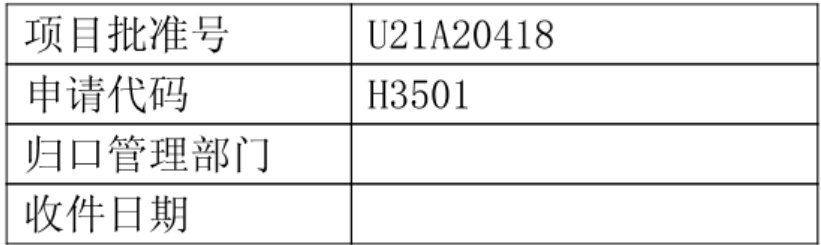

202509U21A20418

# 国家自然科学基金

# 资助项目结题/成果报告

资助类别:联合基金项目

亚类说明:重点支持项目

附注说明:区域创新发展联合基金

项目名称:组胺H3受体介导的摄食神经网络在肥胖症中的作用及机制研究

负责人:陈忠

BRID: 08852.00.18761

电子邮件:chenzhong@zju.edu.cn

电话: 0571-86618319

依托单位: 浙江中医药大学

联系人:朱小玲

电话: 0571-86613536

直接费用:260.0000（万元）

执行年限: 2022.01-2025.12

填表日期:2026年02月04日

国家自然科学基金委员会制（2025年）

## 项目摘要

## 中文摘要:

肥胖症危害大，缺乏有效安全的治疗手段。摄食行为调控的神经环路及分子机制尚未阐明是限制相关治疗策略研发的重要原因。申请人及课题组长期从事组胺及其受体的神经药理学作用研究，近期利用HDC-CreERT2小鼠及全脑显微光学切片断层成像技术首次解析了全脑三维组胺能神经网络，利用光遗传学、基因干预及行为学分析，申请人首次发现三条尚未报道的调控摄食行为的组胺能神经环路，组胺H3受体可能是调控摄食行为的关键受体，不同环路及细胞内H3受体功能不同，通过H3剪切体偏向性化合物调控不同细胞内的H3剪切体可能实现组胺能摄食神经环路的精准调控。因此，本项目拟利用多种转基因小鼠结合环路示踪、光/药理遗传学、钙成像、电生理、微透析、显微切割、三代测序、药理学等技术阐明组胺H3受体调控的摄食神经网络在肥胖症中的作用及机制，评价H3受体剪切体偏向性化合物的抗肥胖症药理活性及靶标相关性，为肥胖症的精准治疗提供新的药物靶点。

## Abstract:

Obesity is a growing health issue worldwide. Few therapies are both effective and safe due to limited knowledge of feeding neural circuits and related molecular mechanisms. The applicant has focused on the roles of histamine and its receptors in brain functions and disorders. Recently, by employing HDC-CreERT2 mice and fluorescence micro-optical sectioning tomography method, we uncovered three unreported histaminergic neural circuits that regulate feeding behaviors. Furthermore, with the help of Cre-Loxp technique, we found that histamine H3 receptor is a key regulator in these histaminergic neural circuits and plays different roles in different neurons of the feeding circuits. Interestingly, H3 receptor possesses diverse protein isoforms. Targeting different H3 isoforms by isoforms-biased compounds may achieve the precise manipulation of different histaminergic feeding circuits. Taken all, this project aims to clarify the roles and mechanisms of H3 receptor-mediated histaminergic feeding neural circuits in obesity, and evaluate the anti-obesity pharmacological activity of H3 receptor isoforms-biased compounds by employing yarious transgenic mice, neural circuit tracers, optogenetics, chemogenetics, calcium imaging, electrophysiology, microdialysis, microdissection, third-generation sequencing as well as pharmacological methods. This study will shed light on the mechanisms underlying feeding behaviors in obesity, providing potential drug target and candidate leading compounds for the precise treatment of obesity.

关键词（用分号分开）:组胺；组胺H3受体；肥胖；摄食行为；H3受体剪切体

Keywords (separated by;): histamine; histamine H3 receptor; obesity; feeding behaviors; H3 receptor isoforms

## 结题摘要

肥胖症危害严重，且缺乏安全有效的治疗手段。摄食行为调控的神经环路及分子机制尚未阐明，是限制相关治疗策略研发的重要原因。项目负责人长期从事组胺及其受体的神经药理学研究。本项目利用HDC-CreERT2小鼠及全脑显微光学切片断层成像技术，首次构建了量化的小鼠全脑组胺能神经投射三维图谱，并在此基础上揭示了丘脑室旁核（PVT）中组胺H3受体（H3R）对高脂饮食的特异性调控作用，及其在睡眠限制诱导的饮食偏好改变中的关键机制。本项目发现，PVT是极少数能够独立调控高脂与高糖饮食的神经集群所在的脑区，而H3R是PVT中脂响应神经集群的分子标志物。PVT内的H3R能够中继口腔内脂肪的口感信息，是脂肪令人产生“腻”感的关键分子，作为一种重要的“刹车”机制，特异性抑制高脂饮食摄入，但不影响高糖或普通饮食。进一步借助可选择性激活不同下游通路的H3 R剪接体，本项目发现H3R通过偏向性激活G12/13信号通路（而非经典的Gi通路），增强PVT脂肪响应神经元的兴奋性。结合人群数据分析与动物模型，本项目进一步阐明:睡眠限制可促使PVT局部组胺累积，导致下游H3R-β-arrestin过度激活，继而引起H3R表达下调，使PVT脂响应神经集群兴奋性降低，最终特异性诱导对高脂饮食的偏爱，而对糖偏好无显著影响。综上，本项目首次在全脑尺度上量化了组胺能神经投射图谱，系统揭示了PVT中H3R在调控高脂饮食及睡眠-代谢交互中的关键作用，明确了H3R-G12/13非典型信号转导通路对高脂饮食的特异性调控机制，为肥胖症等摄食障碍性疾病开发更具靶向性的调控药物提供了重要的理论依据。

# Abstract (Brief description of research background, main methods, contributions, and research data):

Obesity poses significant health risks, yet effective and safe treatment options remain limited. A major obstacle in developing relevant therapeutic strategies is the incomplete understanding of the neural circuits and molecular mechanisms governing feeding behavior. The principal investigator of this project has long been engaged in studying the neuropharmacological roles of histamine and its receptors. Utilizing HDC-CreERT2 mice and whole-brain micro-optical sectioning tomography (fMOST), this project has, for the first time, established a quantified three-dimensional atlas of histaminergic neural projections throughout the mouse brain. Building on this foundation, the study revealed the specific regulatory role of the histamine H3 receptor (H3R) in the paraventricular thalamus (PVT) on high-fat diet intake and its key mechanism in mediating sleep restriction-induced changes in dietary preference. This project discovered that the PVT is one of the very few brain regions containing distinct neuronal ensembles that independently regulate high-fat and high-sugar diets, with H3R serving as a molecular marker for the fat-responsive neuronal ensemble in the PVT. H3R in the PVT relays orosensory fat texture information and acts as a key molecular mediator for the sensation of "satiation" associated with fat. It functions as a crucial "braking" mechanism, specifically modulating high-fat diet intake without affecting high-sugar or normal diets. Furthermore, by employing H3R splice variants that selectively activate different downstream pathways, the project found that H3R enhances the excitability of PVT fat-responsive neurons by preferentially activating the G12/13 signaling pathway rather than the canonical Gi pathway. Integrating population data analysis with animal models, the project elucidated that sleep restriction leads to the local accumulation of histamine in the PVT. This, in turn, causes excessive activation of the downstream H3R-β-arrestin pathway, followed by downregulation of H3R expression, reduced excitability of the PVT fat-responsive neuronal ensemble, and ultimately induces a specific preference for high-fat diet without altering sugar preference. By establishing the first whole-brain scale quantitative atlas of histaminergic projections, this project systematically identifies H3R in the PVT as a critical target

| node regulating high-fat diet intake and sleep-metabolism interactions. It clarifies the role of the H3R-G12/13 atypical signal transduction mechanism in the specific modulation of high-fat diet. These findings provide a theoretical foundation for developing more targeted therapeutic agents for eating disorders such as obesity. |
| --- |
| 关键词（用分号分开）:组胺；组胺H3受体；肥胖；摄食行为；H3受体剪切体 |
| Keywords (separated by;): histamine; histamine H3 receptor; obesity; |

## 正文

《结题/成果报告》正文分为两个部分:结题部分和成果部分。请按照《结题/成果报告》填报说明及撰写要求填写。

## （一）结题部分

## 1. 研究计划执行情况概述。

## （1）按计划执行情况。

本项目按原计划书执行，完成了主要研究目标:系统构建了组胺能神经全脑下游输出图谱，明确不同组胺能神经环路调控摄食行为的作用及作用特征，阐明不同组胺能神经环路中的组胺H3 受体在摄食行为及肥胖症等摄食障碍性疾病中的细胞特异性作用，评价 H3 受体剪切体偏向性信号转导在摄食行为调控及摄食障碍性疾病中的作用。

## (2) 研究目标完成情况。

本项目按照原定计划明确了不同组胺能神经环路调控摄食行为的作用及作用特征，阐明不同组胺能神经环路中的组胺H3受体在摄食行为及肥胖症等摄食障碍性疾病中的细胞特异性作用及机制，评价H3受体剪切体偏向性信号转导在摄食行为调控及摄食障碍性疾病中的作用，为肥胖症、暴食症等摄食障碍性疾病的精准干预提供潜在新策略。研究成果以论文的形式发表在高影响因子的国内外权威性杂志上（共9篇，其中 CNS 子刊论文4篇），已培养硕士研究生6名，培养博士研究生6名，出站博士后1名。上述指标均完成原定目标。

## 2. 研究工作主要进展、结果和影响。

## （1）主要研究内容

1）系统构建了组胺能神经全脑下游输出图谱；

2）明确不同组胺能神经环路调控摄食行为的作用及作用特征；

3）阐明不同组胺能神经环路中的组胺H3受体在摄食行为及肥胖症等摄食障碍性疾病中的细胞特异性作用；

4）评价H3受体剪切体偏向性信号转导在摄食行为调控及摄食障碍性疾病中的作用。

## (2）取得的主要研究进展、重要结果、关键数据等及其科学意义或应用前景。

组胺能神经元以位置非常局限的胞体分布向全脑发射纤维投射调控几乎所有主要脑区。

过去的研究针对与中枢组胺相关的环路、脑区、受体进行了大量研究，但仍缺乏一定的系统性，对于其功能的精准分析与理解存在一定局限。本项目从中枢组胺能神经环路的本质出发，首次建立了量化小鼠全脑组胺能神经投射的三维图谱，并对其功能关联性与微观结构特征首次进行了直接分析。

本项目首先将课题组前期建立的 $H D C - C r e ^ { E R T 2 }$ 转基因小鼠与 Ai47基因报告小鼠杂交获得全脑 HDC 阳性细胞均带有绿色荧光标记的 $H D C - C r e ^ { E R T 2 }$ ；Ai47 小鼠，并对其进行免疫组化染色验证，发现这种标记方式的特异性与全面性都非常可靠（图1A-E） 接 本项目利用 fMOST 对 $H D C - C r e ^ { E R T 2 }$ ;Ai47 小鼠脑内组胺能神经元进行重构与分析，发现小 全脑组胺能神经元胞体数量约为左右对称分布的5000个，并精确重构了它们在TMN的空间分布的完整信息（图1F-H）。

A

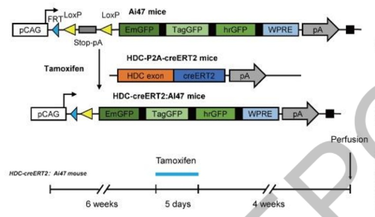

B

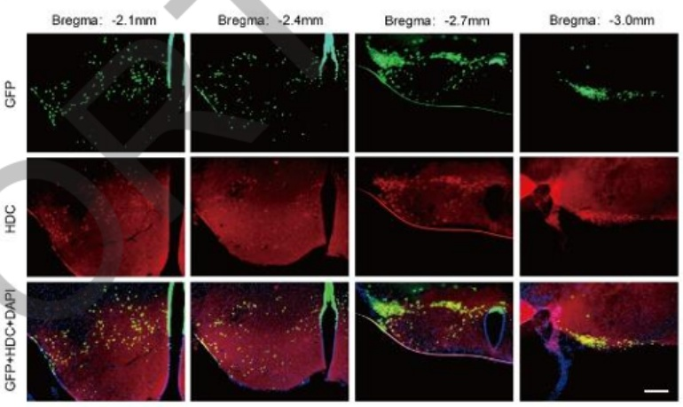

C

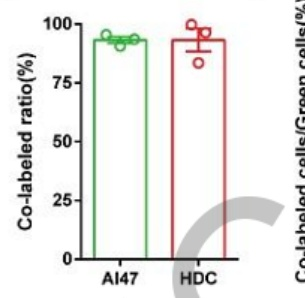

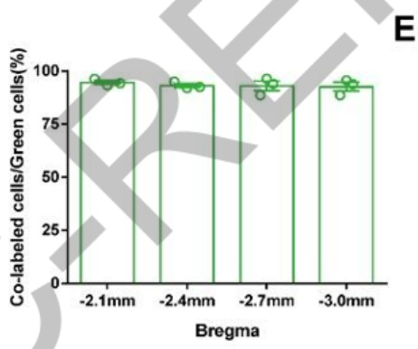

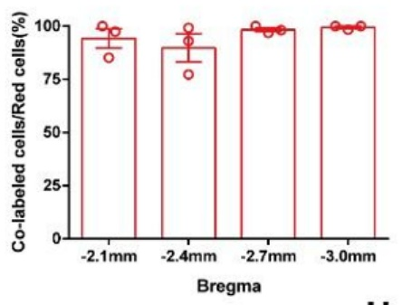

F

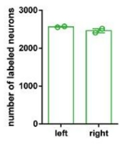

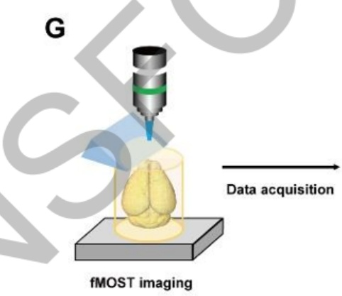

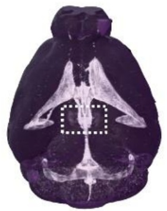

H

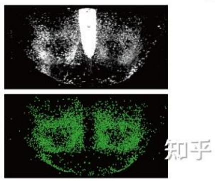

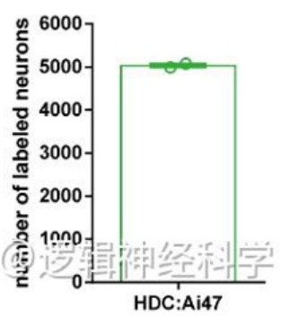

图1 重构小鼠全脑组胺能神经元胞体数量与位置信息

进一步，本项目通过一系列病毒注射与观察确认了AAV-CAG-FLEX-Arch-GFP作为标记全脑组胺能神经纤维的病毒工具，并对其进行了标记特异性验证（图2A-C)。利用fMOST对HDC-Arch-GFP注射小鼠脑内组胺能神经元胞体与纤维进行重构与分析，发现利用病毒注射的手段能标记全脑约40%的组胺能神经元，通过全脑荧光像素点数量计算，发现其全脑组胺能神经纤维数量与标记胞体数呈线性相关，证明了病毒标记纤维的可靠性（图2D-H）。随后利用全脑三维图像配准技术，我们重构了组胺能神经纤维在标准小鼠脑中呈现的三维标准图像，并由荧光像素点计算得到量化的全脑组胺能神经纤维密度，由密度值将其分为密集、中等、稀疏三个组（图2I,J)，从而获得了首个标准量化的小鼠全脑组胺能神经投射图谱。

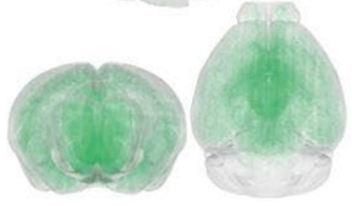

A

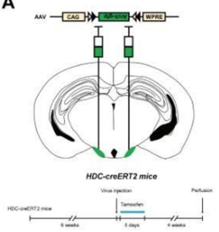

B

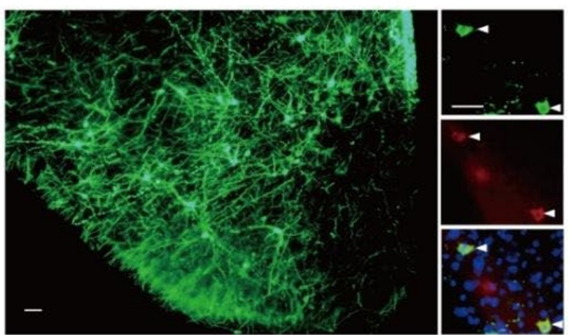

C

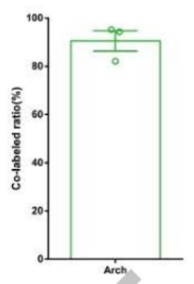

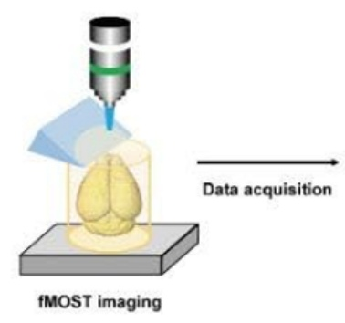

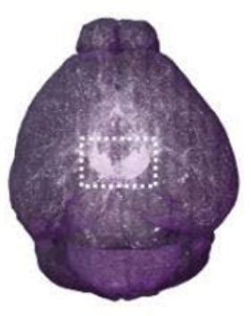

E

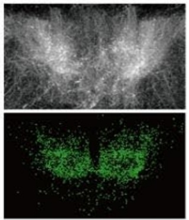

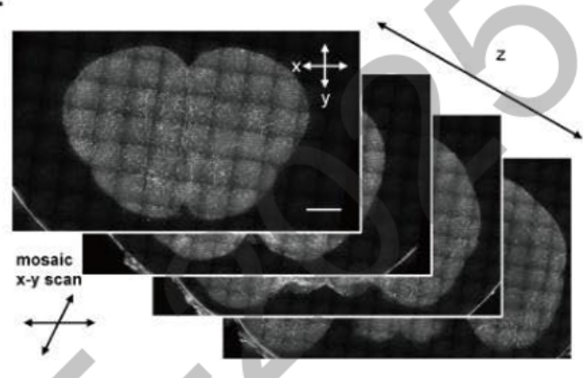

F

G

H

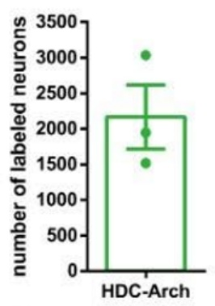

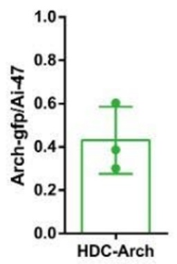

1

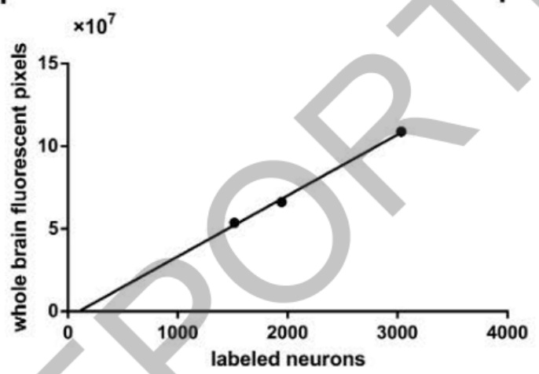

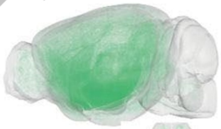

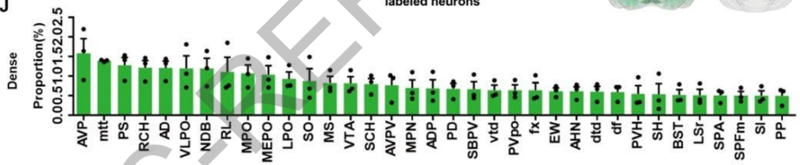

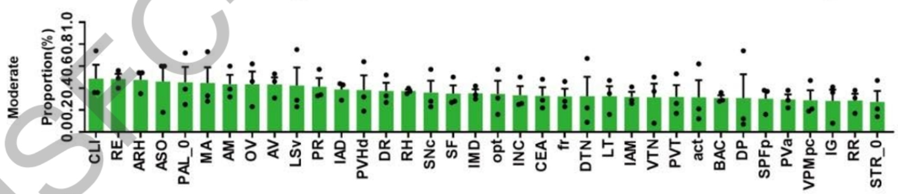

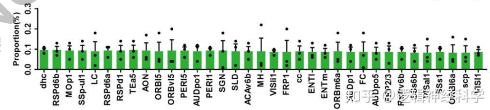

图2建立量化的全脑组胺能神经投射三维图谱

基于上述结果，本项目对不同组胺投射的生理、病理功能开展了系统的行为学评估，取得以下突破性结果:

## (1）首次揭示丘脑室旁核中组胺H3受体对高脂饮食的特异性调控作用

在上述研究构建的组胺能神经全脑投射图谱中，本项目关注到了组胺能纤维分布较为密集的丘脑室旁核（paraventricular thalamus，PVT)。不仅如此，该脑区组胺H3受体的表达丰度极高。因此，本项目综合运用神经元活性标记、核糖体亲和纯化、Smart-seq单细胞测序、光/化学遗传学及在体光纤记录等技术，对PVT内H3受体的功能开展了研究，发现PVT 中存在分别响应高脂与高糖饮食的神经元集群，明确H3受体是脂肪响应神经元的特异性分子标记。该H3受体介导的神经环路通过感知口腔中脂肪口感，实现对高脂食物摄入的特异性调控。

本项目首先利用FosTRAP等神经元活性标记技术，在全脑范围内筛选对高脂和高糖饮食反应不同的神经元。结果显示，在大多数脑区，脂肪与糖响应的神经元集群高度重叠；但在PVT中，这两类细胞却呈现“泾渭分明”的分布格局（图3A&B）。进一步的在体钙信号光纤记录证实，PVT脂肪响应神经元仅在高脂饮食摄入开始时被特异性激活，而对摄糖行为无动于衷（图3C-E）；PVT糖响应神经元则表现出相反的特性（图3F&G）。

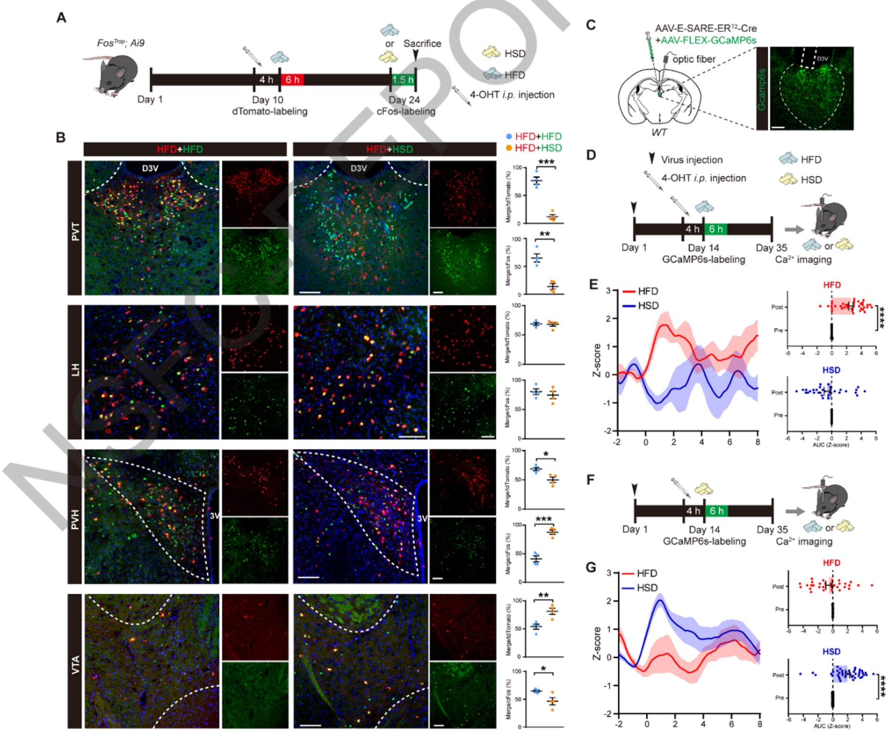

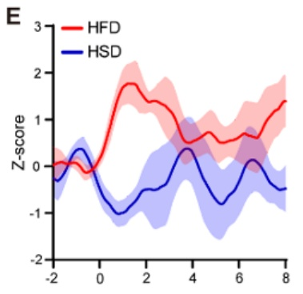

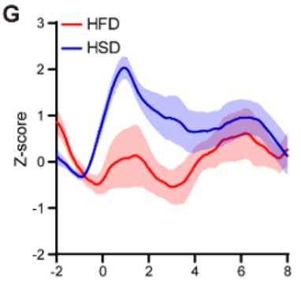

图3. 丘脑室旁核内存在分别响应高脂与高糖饮食的神经集群

为探究这两类神经元的功能，本项目结合活性标记与化学遗传学技术进行于预。结果显示，激活PVT脂肪响应神经元可显著抑制小鼠对高脂食物的摄入，而不影响高糖食物的消耗:抑制该群体则引发高脂食物的过度摄入。同样，操控PVT糖响应神经元能双向、特异地调控高糖食物的摄入。这表明PVT如同一个具备独立通道的交通枢纽，分别调控“脂肪偏好”与“糖偏好”这两条行为路径。

那么，是什么分子机制赋予PVT脂肪响应神经元其身份特异性？通过整合神经元活性标记、核糖体亲和纯化与 Smart-seq单细胞测序（图4A-C)，本项目对比了两群神经元的基因表达谱，并经原位杂交验证后明确组胺H3 受体在 PVT脂肪响应神经元中特异性高表达(图4D-H)。该现象与课题组前期关于PVT 是组胺能神经纤维重要投射靶区的发现高度契合。

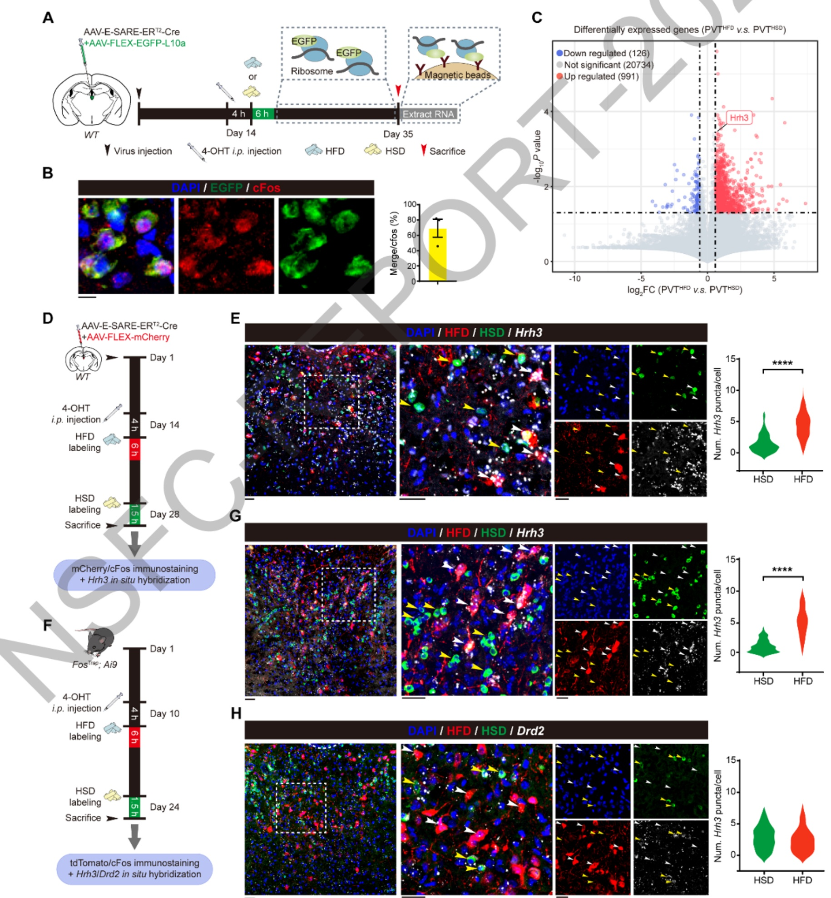

图4. 组胺H3 受体是丘脑室旁核脂肪响应神经元的特异性分子标志物

随后的功能实验证实，组胺H3受体是调控脂肪摄入的“分子开关”。在PVT神经元中特异性敲除组胺H3受体，会导致小鼠对高脂食物的摄入量与偏好度显著上升，而不影响高糖摄入:反之，在PVT脂肪响应神经元中过表达组胺H3受体，则能有效抑制高脂食物摄入(图5A-O)。直接通过光遗传学激活从组胺能神经元投向PVT的神经末梢，可模拟组胺H3受体过表达的效果—选择性减少脂肪摄入（图5P-T）。

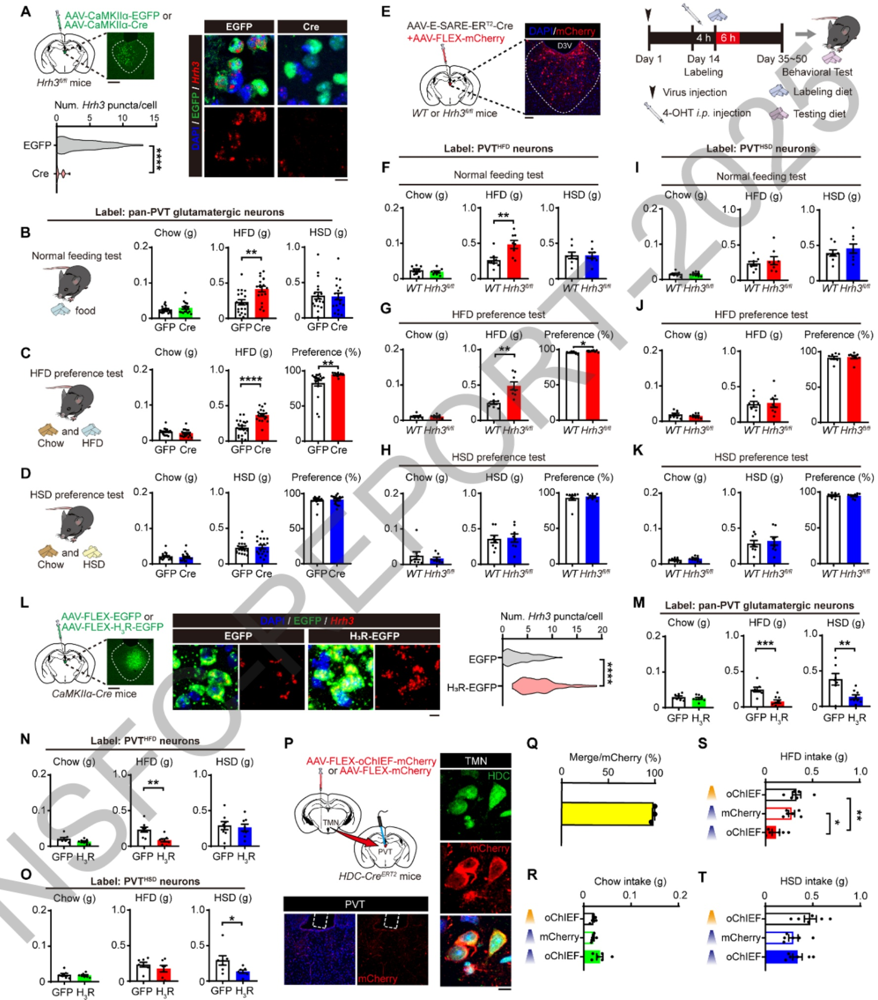

图5. 丘脑室旁核内组胺H3 受体特异性调控高脂饮食

那么，这条组胺能投射如何感知高脂食物？PVT脂肪响应神经元在摄入高脂食物的瞬间即被激活，提示其可能响应口腔阶段的食物信号（图3E）。本项目通过三级逆向追踪发现投射到PVT的组胺能神经接收三叉神经中脑核Me5的投射，提示PVT可能响应食物口感调控高脂饮食（图6A-C）。因此，本项目通过食品添加剂模拟脂肪质地，制备了无营养价值的“假脂肪”食物。结果显示，调控PVT脂肪响应神经元的活动可剂量依赖地影响“假脂肪”摄入，而不改变对甜食的消耗（图6E）。这些结果说明，脂肪在口腔中的感官体验是其偏好的关键驱动因素，而PVT内组胺H3受体是整合脂肪口感信息并引导摄食决策的核心节点。

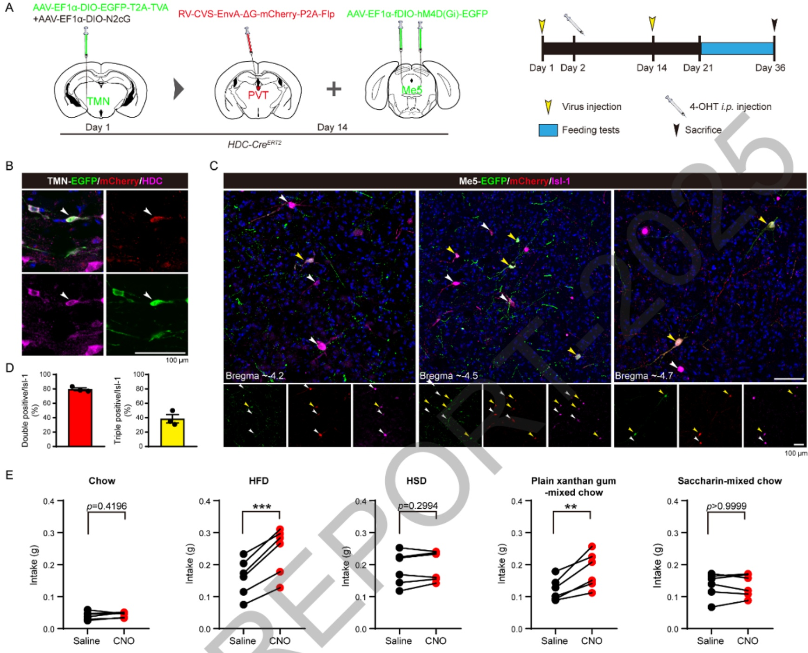

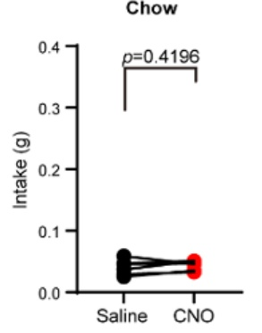

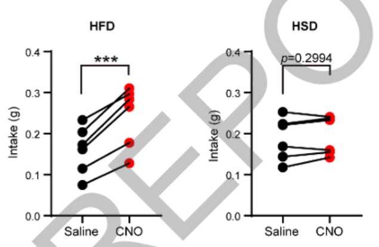

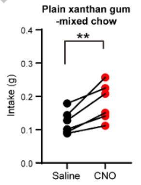

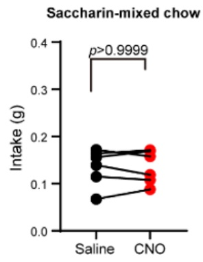

图6. 丘脑室旁核内组胺H3 受体响应脂肪口感调控高脂饮食

最后，研究借助可选择性激活不同下游通路的组胺H3受体剪切体，发现组胺H3受体通过偏向性激活G12/13信号通路，而非经典 $\mathbf { G _ { i } }$ 通路，来增强PVT脂肪响应神经元的兴奋性(图7)。这一非典型信号转导机制的阐明，为开发特异性更强的摄食调控药物提供了理论依据。

H{R

A

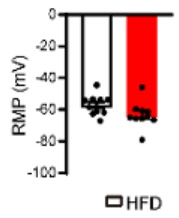

B

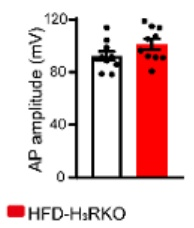

C

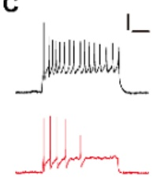

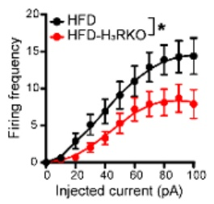

G

H

D

E

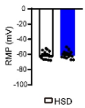

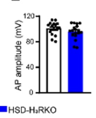

F

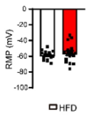

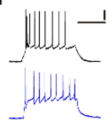

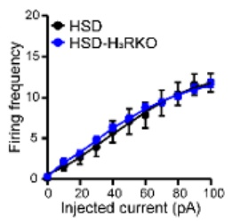

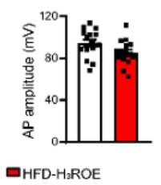

J

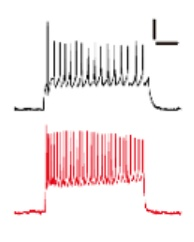

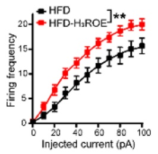

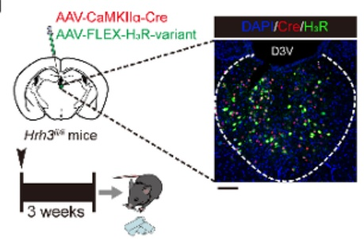

K

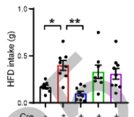

L

M

1.0 L

图 7. 组胺 H3 受体通过 $\bf { G } _ { 1 2 / 1 3 }$ 信号通路增强 PVT 脂肪响应神经元兴奋性

本研究系统揭示了脂肪与糖类偏好的差异化神经调控机制，明确了丘脑室旁核组胺H3受体通路在高脂饮食调控中的特异性作用 图 8)， 为解析脑内组胺能神经功能提供了新证据与新思路。

图 8. 丘脑室旁核内组胺H3 受体在高脂饮食调控中的作用研究总结图

## (2)首次揭示丘脑室旁核中组胺H3受体在睡眠限制诱导的高脂饮食偏爱中的作用

基于上述，本项目进一步整合英国生物银行（UKBiobank）队列分析与小鼠睡眠限制模型 通过全脑c-Fos图谱、化学遗传学、离体电生理及痕量蛋白检测等技术，首次揭示PVT中组胺H3受体是连接睡眠不足与高脂摄入过量的关键信号节点。

基于对UKBiobank超过四万人的数据分析，本项目发现睡眠质量与高脂饮食偏好存在特异性关联，而与高糖、高蛋白及总热量摄入无关（图9A）。为验证其因果关系，我们构建了小鼠睡眠限制模型。行为实验表明，睡眠受限会特异性增强小鼠对高脂饮食的偏好，而不影响其对普通饲料、高糖或高蛋白饮食的选择（图9H-N)。进一步分析显示，这种偏好变化的持续时间与睡眠结构的恢复进程同步（图9L，O），提示二者存在紧密的生理联系。

A

D

E

K

M

く

图9. 睡眠限制特异性诱导高脂饮食偏爱

为探寻调控这一行为的神经基础，本项目通过全脑c-Fos筛查锁定了PVT。在睡眠限制小鼠摄入高脂食物后，其PVT神经元激活水平显著低于对照组，而禁食或摄入其他食物则无此差异（图10A-E）。随后的离体电生理记录进一步证实，睡眠限制后PVT谷氨酸能神经元兴奋性普遍降低，表现为放电阈值升高、动作电位发放减少（图10G-N）。化学遗传学功能验证表明:激活PVT神经元可逆转睡眠限制诱导的高脂偏好，而抑制这些神经元则能直接模拟该表型，确立了PVT在睡眠限制后高脂偏爱调控中的关键地位。

A

B

C

D

G

E

F

H

图10. 睡眠限制抑制丘脑室旁谷氨酸能神经元的兴奋性

然而，化学遗传学广泛调控PVT神经元虽能同时影响小鼠对脂肪和糖分的摄入，无法复现睡眠限制仅改变脂肪偏好的特异性，再次提示PVT内部可能存在功能各异的神经元亚群。为此，本项目利用神经元活性依赖标记与离体电生理技术，分别记录了响应高脂与高糖的两群PVT神经元，发现睡眠限制选择性地降低了PVT脂响应神经元的兴奋性，而对PVT糖响应神经元几乎无影响（图11），从而在细胞层面解释了行为特异性的机制。

A

B

C

D

E

F

G

H

K

N

0

P

Q

R

S

T

图11. 睡眠限制特异性抑制了丘脑室旁核高脂饮食反应神经元的兴奋性

V基于本项目前期发现组胺H3 受体是 PVT中脂响应神经元的分子标记物，我们进一步考察了睡眠限制后PVT内H3受体的表达变化，发现:睡眠限制导致促觉醒递质组胺在PVT局部的累积（图12A-B)。这种持续的组胺信号激活了H3受体，进而通过β-arrestin通路引发受体自身的降解。在PVT中特异性敲低H3受体可模拟睡眠限制，引发特异性的高脂偏爱；而过表达H3受体或使用药物（barbadin）抑制β-arrestin通路，则能保护神经元功能，有效阻断睡眠限制诱发的高脂偏好（图12C-M)，提示PVT中H3受体的下调是导致睡眠限制后特异性高脂偏爱产生的关键分子机制。

A

B

C

D

E

F

G

K

图12. 抑制组胺 H3 受体降解可改善慢性睡眠限制诱导的高脂饮食偏好

本项目系统阐明了睡眠不足导致高脂饮食偏好的神经与分子机制。整个工作基于大规模人群数据分析首先确立现象，进而利用动物模型，在环路水平锁定丘脑室旁核为关键脑区，最后在细胞与分子层面，揭示了H3受体通过β-arrestin通路发生的特异性下调，是导致 PVT脂响应神经元功能抑制与行为转变的关键分子机制（图13)，为理解睡眠-代谢交互提供了新的理论框架，为肥胖症等摄食障碍性疾病的精准干预提供了潜在靶点。

图13. 睡眠限制诱导高脂饮食偏爱的神经及分子机制全文总结图

## 3. 研究人员的合作与分工。

本项目在项目负责人陈忠教授的总体协调与监督下，组建了一支涵盖神经科学、行为药理学及分子细胞生物学等多学科背景的研究团队。团队成员依据专业领域与实验技术专长进行分工，协同推进各项研究任务。具体分工如下:

1)陈忠教授，项目总负责人，负责项目的整体规划、资源协调、进度监督与研究方向的宏

观指导；

2) 郑艳榕研究员，负责核心行为学范式设计与评价、在体及离体电生理实验、相关分子生化检测与分析；

3)程立研究员，协同负责行为学评价、电生理记录技术的实施与优化、以及特定通路的生化验证实验；

4) 谈贝实验师，主要负责动物行为学实验的具体操作、数据采集与初步分析，以及电生理实验的技术支持；

5) 吴迪研究员，负责药效学评价模型的建立与评估、细胞培养体系构建及相关生化指标的检测；

6) 胡婷婷讲师，负责膜片钳电生理实验、细胞及组织水平的生化检测、以及免疫荧光成像实验；

7) 杨琳博士后，负责分子生化样本的制备、检测与数据分析，以及多通道荧光成像实验；

8) 王宇博士后，负责特定行为学测试的执行与数据整理，以及活体或组织荧光成像技术的应用；

9) 周静实验师，负责项目所需的各类细胞培养工作，以及相关的分子生物学与生化检测实验。

团队通过定期组会和专项技术讨论会进行紧密协作。项目负责人确保各模块进度同步，核心研究员（郑艳榕、程立）牵头技术交叉环节，实验师与博士后专注专项技术实施与数据产出，共同推动项目进展。

4. 国内外学术合作交流等情况。

表1. 项目组成员参加国内外重要学术会议大会报告情况汇总

| 序号 | 会议名称 | 报告题目/墙报题目 | 会议时间 | 会议点 | 类别:报告/墙报/科普 | 报告人 |
| --- | --- | --- | --- | --- | --- | --- |
| 1 | InternationalHistamineConference 2025 | The new physiologicaland pathologicalfunctions of histaminereceptors in the brain | 2025.11.01 | 中国杭州 | 大会报告 | 陈忠 |
| 2 | 中国药理学会第十七次学术大会 | 组胺 H3 受体与食物偏爱 | 2025.7.27 | 中国雄安 | 分会场报告 | 郑艳榕 |
| 3 | 第二十一届神经精神药理学术交流会 | 组胺能神经投射网络图谱构建与精准功能解析 | 2025.10.18 | 中国泸州 | 分会场报告 | 郑艳榕 |
| 4 | InternationalHistamineConference 2025 | Histamine-tunedsubicular circuitmediates alert-drivenaccelerated locomotionin mice | 2025.11.01 | 中国杭州 | 大会报告 | 杨琳 |
| 5 | InternationalHistamineConference 2025 | Histamine H1 receptorsin dentate gyrus-projecting cholinergicneurons of the medialseptum suppresscontextual fear retrievalin mice | 2025.11.01 | 中国杭州 | 大会报告C | 程立 |
| 6 | West LakeInternationalConference onPharmacology-2024 | 组胺 H3 受体的神经药理学功能及机制研究 | 2024.10.13 | 中国杭州 | 大会报告 | 郑艳榕 |
| 7 | 1st Joint meeting ofEHRS-HRSE | Biased histaminesignaling selectivelygates fat preference | 2024.5.24 | 意大利都灵 | 大会报告 | 郑艳榕 |
| 8 | 1st Joint meeting ofEHRS-HRSE | The rolesofhistaminergic neuralcircuits in the preciseregulation of CNSdisorders and itsmechanisms | 2024.5.24 | 意大利都灵 | 大会报告 | 陈忠 |

5. 存在的问题、建议及其他需要说明的情况。

无

## （二）成果部分

1. 项目取得成果的总体情况。

截止2025年12月31日，本项目发表SCI论文9篇，其中4篇CNS子刊，具体列表如下:(1) Yanrong Zheng; Jie Liao, Zhuowen Fang; Xinyan Tang; Zhuchen Zhou; Xinyue Zhao; Menghan Li; Mengting Liu; Shujun Xu; Jiahui Chen; Lingyu Xu; Yi Wang; Yan Zhang; Weiwei Hu; Zhong Chen. Biased histamine signaling selectively gates fat preference. Neuron, 2025, 26:S0896-6273(25)00842-6. 第一标注

(2) Wenkai Lin; Lingyu Xu; Yanrong Zheng; Sile An; Mengting Zhao; Weiwei Hu; Mengyao Li; Hui Dong; Anan Li; Yulong Li; Hui Gong; Gang Pan; Yi Wang; Qingming Luo; Zhong Chen; Whole-brain mapping of histaminergic projections in mouse brain, Proceedings of the National Academy of Sciences of the United States of America, 2023, 120(14). 第二标注

(3) Yanrong Zheng; Lishi Fan; Zhuowen Fang; Zonghan Liu; Jiahui Chen; Xiangnan Zhang; Yi Wang; Yan Zhang; Lei Jiang; Zhong Chen; Weiwei Hu; Postsynaptic histamine H3 receptors in ventral basal forebrain cholinergic neurons modulate contextual fear memory, Cell Reports, 2023, 42(9). 第三标注

(4) Lin Yang; Mengdi Zhang; Yuan Zhou; Dongxiao Jiang; Lilong Yu; Lingyu Xu; Fan Fei; Wenkai Lin; Yanrong Zheng; Jiannong Wu; Wang; Zhong Chen; Histamine-tuned subicular circuit mediates alert-driven accelerated locomotion in mice, Nature Communications, 2024, 15(1): 9887.第二标注

(5) Li Cheng; Ling Xiao; Wenkai Lin; Minzhu Li; Jiaying Liu; Xiaoyun Qiu; Menghan Li; Yanrong Zheng; Cenglin Xu; Yi Wang; Zhong Chen; Histamine H1 receptors in dentate gyrus-projecting cholinergic neurons of the medial septum suppress contextual fear retrieval in mice, Nature Communications, 2024, 15(1):5805. 第二标注

(6) Na Tan; Jiaying Shi; Lingyu Xu; Yanrong Zheng; Xia Wang; Nanxi Lai; Zhuowen Fang; Jialu Chen; Yi Wang; Zhong Chen; Lateral Hypothalamus Calcium/Calmodulin-Dependent Protein Kinase II α Neurons Encode Novelty-Seeking Signals to Promote Predatory Eating, Research, 2022, 2022(9802382):1-19. 第二标注

(7) Lingyu Xu; Wenkai Lin; Yanrong Zheng; Yi Wang; Zhong Chen; The Diverse Network of Brain Histamine in Feeding: Dissect its Functions in a Circuit-specific Way, Current Neuropharmacology, 2024,22(2):241-259. 第二标注

(8) Zhuowen Fang; Jiahui Chen; Yanrong Zheng; Zhong Chen; Targeting Histamine and Histamine Receptors for Memory Regulation: An Emotional Perspective, Current Neuropharmacology, 2024, 22(11):1846-1869. 第一标注

(9) Fangma Yijia; Liu Mengting; Liao Jie; Chen Zhong; Zheng Yanrong; Dissecting the brain with spatially resolved multi-omics, Journal of Pharmaceutical Analysis, 2023, 13(7): 694-710. 第一标注

## 2. 项目成果转化及应用情况。

本项目为全脑组胺能神经网络研究提供标准化工具与图谱；首次鉴定组胺H3 受体为PVT脂肪响应神经元的特异性分子标志物，发现了组胺H3受体非经典的信号转导通路对高脂饮食的特异性调控作用，提示设计组胺H3受体的偏向性调控药物有望实现更精准的疗效并减少副作用，为开发新一代抗肥胖或饮食失调精准干预药物提供了关键的理论指导。

## 3. 人才培养情况。

1、培养高层次人才情况:培养浙江省高层次人才特殊支持计划青年人才项目获得者（省青拔）2人（郑艳榕、程立，2024）

2、培养各类研究生毕业情况:培养博士研究生6名，硕士研究生6名；

3、合作博士后出站情况:出站博士后1名，已晋升为副研究员；

4、培养研究生获奖情况:培养浙江省优秀博士论文获得者1名；

## 4. 其他需要说明的成果。

## 5. 项目成果科普性介绍或展示网站。

https://zhuanlan.zhihu.com/p/620286506浙江大学/浙江中医药大学陈忠团队建立全脑3D组胺能神经投射图谱

https://www.zcmu.edu.cn/info/10498/12715.htm浙中医陈忠教授、郑艳榕研究员团队在Neuron 上发表最新研究成果

https://www.zcmu.edu.cn/info/10498/10125.htm 陈忠教授团队最新研究成果在Nature Communications 杂志上发表

## 研究成果目录

项目负责人通过系统，从文献库中检索研究成果或者按要求格式自行填入。请按照期刊论文、会议论文、学术专著、专利、会议报告、标准、软件著作权、科研奖励、人才培养、成果转化的顺序列出，其它重要研究成果如标本库、科研仪器设备、共享数据库、获得领导人批示的重要报告或建议等，应重点说明研究成果的主要内容、学术贡献及应用前景等。

项目负责人不得将非本人或非参与者所取得的研究成果、与受资助项目无关的研究成果、未标注国家自然科学基金资助和项目批准号的论文以及取得时间早于项目资助期开始时间的研究成果列入报告中。发表的研究成果（包括专利），项目负责人和参与者均应如实注明得到国家自然科学基金项目资助和项目批准号，科学基金作为主要资助渠道或者发挥主要资助作用的，应当将自然科学基金作为第一顺序进行标注。

## 期刊论文

(1) Yanrong Zheng; Jie Liao; Zhuowen Fang; Xinyan Tang; Zhuchen Zhou; Xinyue Zhao; Menghan Li; Mengting Liu; Shujun Xu; Jiahui Chen; Lingyu Xu; Yi Wang; Yan Zhang; Weiwei Hu; Zhong Chen; Biased histamine signaling selectively gates fat preference, Neuron, 2025, 26. SCIE. 第一标注

(2) Wenkai Lin; Lingyu Xu; Yanrong Zheng; Sile An; Mengting Zhao; Weiwei Hu; Mengyao Li; Hui Dong; Anan Li; Yulong Li; Hui Gong; Gang Pan; Yi Wang; Qingming Luo; Zhong Chen; Whole-brain mapping of histaminergic projections in mouse brain, Proc Nat1 Acad Sci U S A, 2023, 120(14). SCIE. 第二标注

(3) Yanrong Zheng; Lishi Fan; Zhuowen Fang; Zonghan Liu; Jiahui Chen; Xiangnan Zhang; Yi Wang; Yan Zhang; Lei Jiang; Zhong Chen; Weiwei Hu; Postsynaptic histamine H3 receptors in ventral basal forebrain cholinergic neurons modulate contextual fear memory, Cell Reports, 2023, 42(9). SCIE. 第三标注

(4) Lin Yang; Mengdi Zhang; Yuan Zhou; Dongxiao Jiang; Lilong Yu; Lingyu Xu; Fan Fei; Wenkai Lin; Yanrong Zheng; Jiannong Wu; Yi Wang; Zhong Chen; Histamine-tuned subicular circuit mediates alert-driven accelerated locomotion in mice, Nature Communications, 2024, 15(1). SCIE. 第二标注

(5) Li Cheng; Ling Xiao; Wenkai Lin; Minzhu Li; Jiaying Liu; Xiaoyun Qiu; Menghan Li; Yanrong Zheng; Cenglin Xu; Yi Wang; Zhong Chen; Histamine H1 receptors in dentate gyrus-projecting cholinergic neurons of the medial septum suppress contextual fear retrieval in mice, Nature Communications, 2024, 15(1). SCIE. 第二标注

(6) Na Tan; Jiaying Shi; Lingyu Xu; Yanrong Zheng; Xia Wang; Nanxi Lai; Zhuowen Fang; Jialu Chen; Yi Wang; Zhong Chen; Lateral Hypothalamus Calcium/Calmodulin-Dependent Protein Kinase II α Neurons Encode Novelty-Seeking Signals to Promote Predatory Eating, Research, 2022, 2022(9802382). SCIE. 第二标注

(7) Lingyu Xu; Wenkai Lin; Yanrong Zheng; Yi Wang; Zhong Chen; The Diverse Network of Brain Histamine in Feeding: Dissect its Functions in a Circuit-specific Way, Current Neuropharmacology, 2024, 22(2):241-259. SCIE. 第二标注

(8) Zhuowen Fang; Jiahui Chen; Yanrong Zheng; Zhong Chen; Targeting Histamine and Histamine Receptors for Memory Regulation: An Emotional Perspective, Current Neuropharmacology, 2024, 22(11):1846-1869. SCIE. 第一标注

(9) Yijia Fangma; Mengting Liu; Jie Liao; Zhong Chen; Yanrong Zheng; Dissecting the brain with spatially resolved multi-omics, Journal of Pharmaceutical Analysis, 2023, 13(7): 694-710. SCIE. 第一标注

## 会议报告

(1) 陈忠; The new physiological and pathological functions of histamine receptors in the brain, International Histamine Conference 2025, 中国杭州， 2025-10-31至2025-11-02.

(2) 郑艳榕；陈忠；组胺H3 受体的神经药理学功能及机制研究，West Lake International Conference on Pharmaco1ogy-2024，中国杭州，2024-10-13至2024-10-13.

(3) 杨琳;陈忠; Histamine-tuned subicular circuit mediates alert-driven accelerated locomotion in mice, International Histamine Conference 2025,中国杭州，2025-10-31至2025-11-01.

(4) 程立; 陈忠; Histamine H1 receptors in dentate gyrus-projecting cholinergic neurons of the medial septum suppress contextual fear retrieval in mice, International Histamine Conference 2025, 中国杭州, 2025-10-31至2025-11-02. C

(5) 郑艳榕;陈忠; Biased histamine signaling selectively gates fat preference, 1st Joint meeting of EHRS-HRSE，意大利都灵，2025-05-23至2025-05-25.

(6) 陈忠; The roles of histaminergic neural circuits in the precise regulation of CNS disorders and its mechanisms, 1st Joint meeting of EHRS-HRSE,意大利都灵，2024-05-23至2024-05-25.

(7) 郑艳榕；陈忠；组胺 H3 受体与食物偏爱，中国药理学会第十七次学术大会，中国雄安，2025-07-26至2025-07-27.

(8) 郑艳榕；陈忠；组胺能神经投射网络图谱构建与精准功能解析，第二十一届神经精神药理学术交流会，中国泸州，2025-10-17至2025-10-18.

## 人才培养

1. 出站博士后/毕业博士/毕业硕士/在站博士后/在读博士/在读硕士

(1） 程立；出站博士后，内侧隔核胆碱能神经元中组胺H1受体在恐惧记忆中的作用及其机制研究，陈忠，2022-01-01至2023-06-30.

(2) 陈嘉慧；毕业博士，前侧丘脑室旁核在恐惧记忆中的作用及其调控机制研究，陈忠，2021-12-30至2025-06-30.

(3) 赵新月；毕业博士，慢性睡眠限制诱导高脂饮食偏爱及荷叶碱的回调作用研究，陈忠，2021-12-30至2024-06-30.

(4) 杨琳；毕业博士，下托投射的组胺能神经环路在运动加速行为中的作用机制及石菖蒲活性成分对其调节作用的研究，陈忠，2021-12-30至2024-12-31

(5) 王宇；毕业博士，下托投射的胆碱能神经亚群在促进颞叶癫痫形成中的作用机制及石杉碱甲对其调节作用研究，陈忠，2021-12-30至2023-06-30.

(6) 徐玲钰；毕业博士，内侧隔核投射的组胺能神经环路在摄食行为中的作用及其机制研究，陈忠，2022-01-01至2023-06-30.

(7) 柳梦婷；毕业博士，基于空间转录组和单细胞测序技术的跨脑区抑郁异常网络构建及柴胡-白芍活性成分合用的抗抑郁作用机制研究，陈忠，2022-09-30至2025-06-30.

(8) 余学敏；毕业硕士，丘脑团聚核投射的组胺能神经环路在小鼠远期恐惧记忆消退功能中的作用及其机制研究，陈忠，2022-09-01至2025-06-30.

(9) 朱心妍；毕业硕士，终纹床核投射的组胺能神经环路在小鼠摄食和焦虑功能中的作用及其机制研究，陈忠，2022-09-01至2025-06-30.

(10) 孙瑜浩；毕业硕士，内侧隔核到穹窿下器官的谷氨酸能神经环路在寻水行为中的作用及机制研究，陈忠，2022-09-01至2025-06-30.

(11) 刘家颖；毕业硕士，胆碱能神经元上的组胺H1R在长时情景记忆中的作用及机制研究，陈忠，2022-01-01至2023-06-30.

(12) 肖玲；毕业硕士，腹侧被盖区不同类型神经元上组胺H1受体在运动中的作用及机制研究，陈忠，2022-01-01至2024-06-30.

(13) 徐淑君；毕业硕士，丘脑室旁核中的组胺三型受体在小鼠高脂偏爱形成中的作用与机制研究，陈忠，2022-09-30至2025-03-30.

## 学术交流

(1) 2025-10-31至2025-11-02，举办举办或参加学术会议/举办国际学术会议/International Histamine Conference 2025，中国杭州，浙江中医药大学，陈忠.

(2) 2024-05-23至2024-05-25，参加举办或参加学术会议/参加国际学术会议/1st Joint meeting of EHRS-HRSE,意大利都灵，陈忠、郑艳榕、胡薇薇、林文凯、徐玲钰、安大道.

## 项目成果应用前景

本项目成果拟应用领域:1、摄食障碍性疾病的治疗2、健康饮食管理

预计在5-10年推广使用

附表:研究成果统计数据表（本表针对各种类型资助项目收集数据以便进行整体资助效果分析使用，并非要求每类项目都具有以下各类成果。

<table><tr><td rowspan=4>获奖（项）</td><td colspan=16>国家级</td><td colspan=11>部级1</td><td rowspan=3 colspan=2>其他</td></tr><tr><td colspan=4>自然科学奖</td><td colspan=5>科技进步奖</td><td></td><td colspan=6>发明奖</td><td colspan=7>自然科学奖</td><td colspan=4>科技进步奖</td></tr><tr><td colspan=2>一等</td><td colspan=2>二等</td><td colspan=2>一等</td><td colspan=3>二等</td><td></td><td colspan=3>一等</td><td colspan=3>二等</td><td colspan=3>等</td><td colspan=4>等</td><td colspan=2>一等</td><td colspan=2>二等</td></tr><tr><td colspan=2>0</td><td colspan=2>0</td><td colspan=2>0</td><td colspan=3>0</td><td></td><td colspan=3>0</td><td colspan=3>0</td><td colspan=3>0</td><td colspan=4>0</td><td colspan=2>0</td><td colspan=2>0</td><td colspan=2>0</td></tr><tr><td rowspan=4>学术报告/论文/专著/其他（篇）</td><td colspan=3>特邀学术报告</td><td colspan=15>学术论文</td><td rowspan=2 colspan=4>学术专著</td><td rowspan=2 colspan=7>其他</td></tr><tr><td rowspan=2>国际学术会议</td><td rowspan=2 colspan=2>国内学术会议</td><td colspan=4>发表论文数</td><td colspan=11>论文检索收录情况</td></tr><tr><td colspan=2>期论义</td><td colspan=2>会议</td><td colspan=2>SCIE/SSCI</td><td colspan=3>EI</td><td colspan=3>北大中文核心期刊</td><td colspan=3>CSSCI</td><td colspan=2>中文</td><td colspan=2>外文</td><td colspan=2>标本库</td><td colspan=2>数据库</td><td colspan=2>科研仪器设备</td><td>重要报告</td></tr><tr><td>6</td><td colspan=2>0</td><td colspan=2>9</td><td colspan=2>0</td><td colspan=2>9</td><td colspan=3>0</td><td colspan=3>0</td><td colspan=3>0</td><td colspan=2>0</td><td colspan=2>0</td><td colspan=2>0</td><td colspan=2>0</td><td colspan=2>0</td><td>0</td></tr><tr><td rowspan=4>专利/标准/软著/成果转化</td><td></td><td colspan=6>专利（项）</td><td colspan=2></td><td colspan=11>标准</td><td rowspan=3 colspan=2>软件著作权</td><td rowspan=2 colspan=7>成果转化</td></tr><tr><td colspan=3>国内</td><td colspan=4>国外</td><td rowspan=2 colspan=2>国际</td><td colspan=11>国内</td></tr><tr><td>申请</td><td colspan=2>授权</td><td colspan=2>申请</td><td colspan=2>授权</td><td colspan=3>国家</td><td colspan=3>行业</td><td colspan=3>地方</td><td colspan=2>企业</td><td colspan=2>技术转让技</td><td colspan=2>术许可作</td><td colspan=2>价投资</td><td>经济效益(万元)</td></tr><tr><td>0</td><td colspan=2>0</td><td colspan=2>0</td><td colspan=2>0</td><td colspan=2>C</td><td colspan=3>0</td><td colspan=3>0</td><td colspan=3>0</td><td colspan=2>0</td><td colspan=2>0</td><td colspan=2>0</td><td colspan=2>0</td><td colspan=2>0</td><td>0</td></tr><tr><td rowspan=4>人才培养及学术交流</td><td colspan=17>人才培养（人）</td><td colspan=12>举办和参加学术会议</td></tr><tr><td colspan=8>中青年学术带头人</td><td rowspan=2 colspan=3>出站博士后</td><td rowspan=2 colspan=3>毕业博士</td><td rowspan=2 colspan=3>毕业硕士</td><td colspan=4>举办国际学术会议</td><td colspan=5>举办国内学术会议</td><td colspan=3>参加国际学术会议</td></tr><tr><td>优青</td><td colspan=2>杰青</td><td colspan=2>创新群体</td><td colspan=2>其他</td><td></td><td colspan=2>次数</td><td colspan=2>人数</td><td colspan=3>次数</td><td colspan=2>人数</td><td colspan=2>次数</td><td>人数</td></tr><tr><td>0</td><td colspan=2>0</td><td colspan=2>0</td><td colspan=2>0</td><td></td><td colspan=3>1</td><td colspan=3>6</td><td colspan=3>6</td><td colspan=2>1</td><td colspan=2>150</td><td colspan=3>0</td><td colspan=2>0</td><td colspan=2>1</td><td>6</td></tr></table>

国家自然科学基金项目资金决算表

项目批准号:U21A20418

项目负责人:陈忠

金额单位:万元

<table><tr><td rowspan="3">行次</td><td rowspan="3">科目名称</td><td colspan="3">预算数</td><td rowspan="2">累计支出数</td><td rowspan="2">结余数</td><td rowspan="2">结余资金比例</td></tr><tr><td>批准预算</td><td>预算调整</td><td>调整后预算</td></tr><tr><td>(1)</td><td>(2)</td><td>(3) = (1) + (2)</td><td>(4)</td><td>(5) =(3)-(4)</td><td>(6)</td></tr><tr><td>(1)</td><td>项目总经费</td><td>310.0000</td><td>0.0000</td><td>310.0000</td><td></td><td>一</td><td>11.04%</td></tr><tr><td>(2)</td><td>项目直接费用</td><td>260.0000</td><td>0.0000</td><td>260.0000</td><td>225.7774</td><td>34.2226</td><td></td></tr><tr><td>(3)</td><td>1、设备费</td><td>10.0000</td><td>0.0000</td><td>10.0000</td><td>0.0000</td><td>10.0000</td><td></td></tr><tr><td>(4)</td><td>其中:设备购置费</td><td>10.0000</td><td>0.0000</td><td>10.0000</td><td>0.0000</td><td>10.0000</td><td></td></tr><tr><td>(5)</td><td>2、业务费</td><td>217.2000</td><td>0.0000</td><td>217.2000</td><td>217.1174</td><td>0.0826</td><td></td></tr><tr><td>(6)</td><td>3、劳务费</td><td>32.8000</td><td>0.0000</td><td>32.8000</td><td>8.6600</td><td>24.1400</td><td></td></tr><tr><td>(7)</td><td>项目间接费用</td><td>50.0000</td><td>0.0000</td><td>50.0000</td><td></td><td></td><td></td></tr></table>

注:1.本表中（1）、（3）、（5）、（6）栏为系统自动生成，无需填写；本表中（2）栏填列预算调整数；本表中（4）栏填列项目的实际支出数。

2.第（1）行=第（2）+（7）行

第（2）行=第（3）+（5）+（6）行；

第（3）栏=第（1）+（2）栏；

第（5）栏=第（3）-（4）栏；

第（1）行第（6）栏=第（2）行第（5）栏/第（1）行第（3）栏100%；

第（1）行第（1）栏=第（1）行第（3）栏；

第（1）行第（2）栏=0；

第（4）栏≤第（3）栏；

第（2）行第（5）栏≥0。

## 附件

国家自然科学基金预算制项目决算表

项目批准号:U21A20418

项目负责人:陈忠

经费卡号:112211A00303

财务部门盖章:

金额单位:万元

<table><tr><td rowspan="3">行次</td><td rowspan="3">科目名称</td><td colspan="3">预算数</td><td rowspan="2">累计支出数</td><td rowspan="2">结余数</td><td rowspan="2">结余资金比例</td></tr><tr><td>批准预算</td><td>预算调整</td><td>调整后预算</td></tr><tr><td>(1)</td><td>(2)</td><td>(3)=(1)+(2)</td><td>(4)</td><td>(5) =(3)-(4)</td><td>(6)</td></tr><tr><td>(1)</td><td>1. 项目总经费</td><td>310.0000</td><td>0.0000</td><td>310.0000</td><td></td><td></td><td>11.04%</td></tr><tr><td>(2)</td><td>2. 项目直接费用</td><td>260.0000</td><td>0.0000</td><td>260.0000</td><td>225.7774</td><td>34.2226</td><td></td></tr><tr><td>(3)</td><td>2.1 设备费</td><td>10.0000</td><td>0.0000</td><td>10.0000</td><td>0.0000</td><td>10.0000</td><td></td></tr><tr><td>(4)</td><td>其中:设备购置费</td><td>10.0000</td><td>0.0000</td><td>10.0000</td><td>0.0000</td><td>10.0000</td><td></td></tr><tr><td>(5)</td><td>2.2业务费</td><td>217.2000</td><td>0.0000</td><td>217.2000</td><td>217.1174</td><td>0.0826</td><td></td></tr><tr><td>(6)</td><td>2.3劳务费</td><td>32.8000</td><td>0.0000</td><td>32.8000</td><td>8.6600</td><td>24.1400</td><td></td></tr><tr><td>(7)   3</td><td>. 项目间接费用</td><td>50.0000</td><td>0.0000</td><td>50.0000</td><td></td><td></td><td></td></tr></table>

注:1.本表中（1）、（3）、（5）、（6）栏为系统自动生成，无需填写；本表中（2）栏填列预算调整数；本表中（4）栏填列项目的实际支出数。

2.第（1）行=第（2）+（7）行；

第（2）行=第（3）+（5）+（6）行；

第（3）栏=第（1）+（2）栏；

第（5）栏=第（3）-（4）栏；

第（1）行第（6）栏=第（2）行第（5）栏/第（1）行第（3）栏\*100%；

第（1）行第（1）栏=第（1）行第（3）栏；

第（1）行第（2）栏=0；

第（4）栏≤第（3）栏；

第（2）行第（5）栏≥0。

# 决算说明书

（请按照《国家自然科学基金预算制项目决算表编制说明》等有关要求，说明各科目支出、预算调整、结余情况，合作研究转拨资金情况，单价≥50万元的设备情况，资金使用和管理过程中遇到的问题及建议，以及其他需要说明的事项等。）

## 一、项目预算支出情况

本项目总经费310.0000万元，其中直接费用260.0000万元和间接费用50.0000万元，截至2025年12月，本项目直接费用支出225.7774万元，结余34.2226万元。

1. 设备费0万元。

2. 业务费217.1174万元，其中用于项目中各类实验耗材开支（包括动物购买、动物饲料、模型构建、细胞培养、分子生物学及蛋白类实验试剂、免疫印迹用抗体等）等材料费209.3424万元，用于测试化验（病毒构建加工、高通量测序等）等测试加工费3.1420万元，参加学术会议等差旅费和市内交通费4.0277万元，文献检索费0.0924万元，文件材料及实验试剂邮寄费0.5129万元。

3. 劳务费8.6600万元，主要用于项目过程中研究生的劳务费支出。

## 二、预算调整情况

## 三、资金结余情况

项目结余金额为34.2226万元。

## 四、合作研究外拨资金情况

五、单价50万元（含）以上的设备情况无。

六、资金管理和使用过程中的问题建议无。

七、其他需要说明的事项无。

## 结余资金情况说明

(请说明项目结余资金产生的原因及后续资金使用计划。）

注:结余资金比例超过30%的项目该部分必填。

结余资金情况说明

注:结余资金比例超过30%的项目该部分必填。

<table><tr><td colspan="7">项目负责人承诺:我所承担的项目（编号:U21A20418 名称:组胺H3受体介导的摄食神经网络在肥胖症中的作用及机制研究）结题报告内容真实，数据准确，未出现《国家科学技术保密规定》中列举的属于国家科学技术秘密范围的内容，不涉及敏感科技信息。在今后的研究工作中，如有与本项目相关的成果，将如实注明得到国家自然科学基金项目资助和项目批准号，并报送国家自然科学基金委员会。项目负责人（签日期:</td></tr><tr><td colspan="4">依托单位科研管理部门:负责人（签章）:日期:</td><td colspan="2">依托单位财务管理部门:负责人（签章）:日期:</td><td>依托单位审查意见:依托单位公章:</td></tr><tr><td colspan="7">科学处审核意见:                             EP</td></tr><tr><td rowspan="2">完成情况综合评分(划√)</td><td>优</td><td>良</td><td colspan="2">中</td><td>差</td><td rowspan="2">负责人（签章）:日期:</td></tr><tr><td></td><td></td><td colspan="2"></td><td></td></tr><tr><td colspan="7">科学部核准意见  对重点项目等）:NSF负责人（签章）:日期:</td></tr><tr><td colspan="7">分管委领导意见（对重大项目等）:委领导（签章）:日期:</td></tr></table>

## 电子附件目录

| 序号 | 附件类型 | 附件名称 | 备注 |
| --- | --- | --- | --- |
| 1 | 论著 | 研究成果1 | Biased histamine signalingselectively gates fat preference.Neuron, 2025,26:S0896-6273(25)00842-6.第一标注 |
| 2 | 论著 | 研究成果2 | Whole-brain mapping ofhistaminergic projections inmouse brain, Proceedings of theNational Academy of Sciences ofthe United States of America,2023, 120(14).第 二标注 |
| 3 | 论著 | 研究成果3 | Postsynaptic histamine H3receptors in ventral basalforebrain cholinergic neuronsmodulate contextual fear memory,Cel1 Reports, 2023, 42(9).第三标注 |
| 4 | 论著 | 研究成果4 | Histamine-tuned subicular circuitmediates alert-driven acceleratedlocomotion in mice, NatureCommunications, 2024,15(1):9887. 第二标注 |
| 5 | 论著 | 研究成果5 | Histamine H1 receptors in dentatelgyrus-projecting cholinergicneurons of the medial septumsuppress contextual fearretrieval in mice, NatureCommunications, 2024,15(1):5805. 第二标注 |
| 6 | 论著 | 研究成果6 | Lateral HypothalamusCalcium/Calmodulin-DependentProtein Kinase II α NeuronsEncode Novelty-Seeking Signals toPromote Predatory Eating,Research, 2022,2022(9802382):1-19. 第二标注 |
| 7 | 论著 | 研究成果7 | The Diverse Network of BrainHistamine in Feeding: Dissect itsFunctions in a Circuit-specificWay, Current Neuropharmacology,2024,22(2):241-259. 第二标注 |
| 8 | 论著 | 研究成果8 | Targeting Histamine and HistamineReceptors for Memory Regulation:An Emotional Perspective, CurrentNeuropharmacology, 2024,22(11):1846-1869. 第一标注 |
| 9 | 论著 | 研究成果9 | Dissecting the brain withspatially resolved multi-omics,Journal of PharmaceuticalAnalysis, 2023, 13(7): 694-710.第一标注 |
| 10 | 其他 | 组胺国际会议-会议通知 | 举办国际会议证明 |
| 11 | 其他 | 参加国际组胺学术会议 | 参加国际会议证明 |
| 12 | 其他 | 研究生毕业论文首页 | 研究生毕业论文首页 |