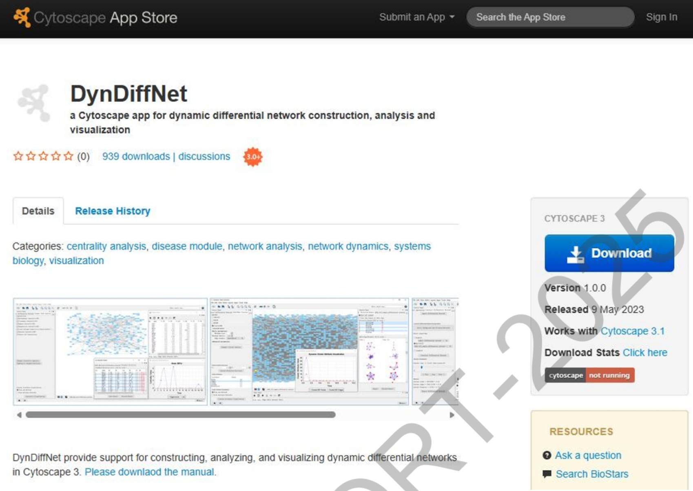
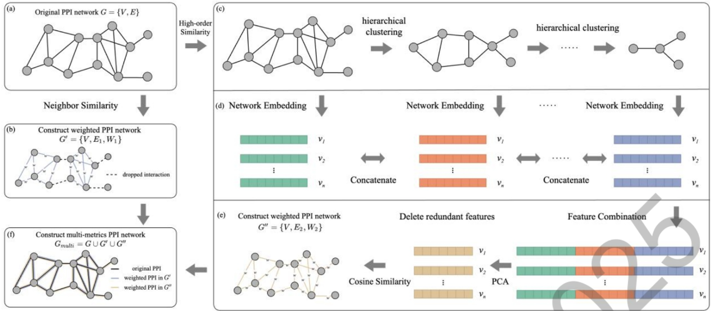
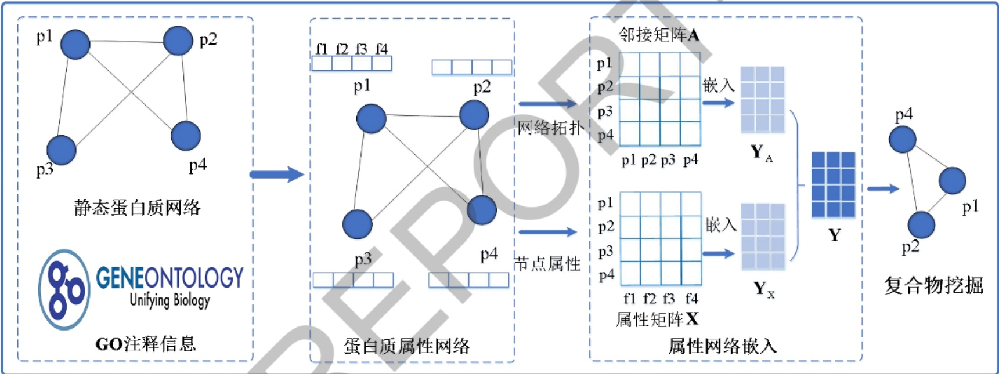
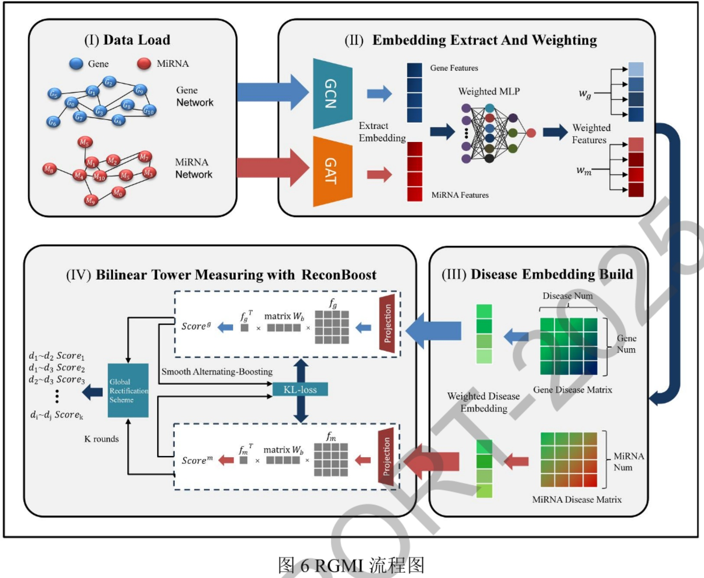

项目批准号 62202502申请代码 F0213归口管理部门收件日期


20251162202502

# 国家自然科学基金

# 资助项目结题/成果报告

资助类别:青年科学基金项目（C类）[原青年科学基金项目]

亚类说明:

附注说明:

项目名称:生物大数据驱动的动态多关系网络构建与分析

负责人:孟祥茂

BRID: 07926.00.00311

电子邮件: mxmanhui@xtu.edu.cn

电话: 18373164966

依托单位: 湘潭大学

联系人: 黄伟华

电话: 0731-58292064

资助经费:30.0000（万元）

执行年限: 2023.01-2025.12

填表日期:2025年12月10日

国家自然科学基金委员会制（2025年）

## 项目摘要

## 中文摘要:

生物网络建模与分析是复杂疾病研究的重要基础。当前已经积累了海量不同类型的生物大数据，如何利用数据驱动研究范式从这些海量的复杂数据中挖掘有效信息，进而构建动态多关系生物网络成为新的挑战。本项目拟从系统生物学的角度出发，以数据为基础，针对动态多关系生物网络的构建、分析与应用中的问题展开研究。主要研究内容包括:（1）通过对生物特征分析以及数据特征挖掘，整合不同类型的多元生物数据，提出动态多关系生物网络构建方法；（2）对构建的动态多关系生物网络进行多尺度拓扑分析，设计有效的量化分析方法与网络表征学习方法，为下游网络分析提供重要参考依据；（3）面向构建的动态多关系生物网络，提出适用于动态网络的关键节点和功能模块识别新方法，开发动态网络可视化分析平台并应用于复杂疾病分析中。本项目旨在为复杂疾病研究提供一个高质量的网络框架，同时为揭示复杂疾病发生、发展动态变化的分子机制研究提供有效分析手段。

## Abstract:

Modeling and analysis of biological networks is an important foundation for the research of complex diseases. At present, huge amounts of multiple types of biological big data have been accumulated. How to mine effective information from these massive complex data by using the data-driven research paradigm to construct dynamic multi-relational biological networks has become a new challenge. From the perspective of systems biology, this project intends to conquer the difficulties in construction, analysis and applications of multi-relational biological networks based on data. The main research contents include: (1) Through the analysis of biological characteristics and data feature mining, we will integrate different types of multi-biological data and propose a new model for constructing dynamic multi-relational biological network. (2) We will conduct multi-scale topology analysis of the constructed dynamic multi-relational biological network, and design effective quantitative analysis methods and network representation learning methods to provide an important reference for downstream network analysis. (3) Based on the constructed dynamic multi-relational biological network, we will propose novel algorithms for identifying essential nodes and functional modules and develop a visual analysis platform and apply it to complex diseases analysis. This project aims to provide a high-quality network framework for the research of complex diseases and try to provide effective analytical means to reveal the molecular mechanism of the occurrence and development of complex diseases.

关键词（用分号分开）:动态网络；蛋白质相互作用网络；生物信息学；

蛋白质复合物；疾病基因

Keywords (separated by;): Dynamic network; Protein-protein interaction network; Bioinformatics; Protein complex; Disease gene

## 结题摘要

## 中文摘要（对项目的背景、主要研究内容、重要结果、关键数据及其科学意义等做简单概述）:

通过生物网络建模来分析复杂疾病是当前生物信息学领域的关键研究方向之一，而生物网络的质量直接决定了下游分析任务的准确性与有效性。本项目通过整合多类型的生物数据，构建了高质量的动态生物网络，并成功应用于复杂疾病分析。项目取得的主要研究成果包括:1）提出了基于时序基因表达数据和蛋白质相互作用数据整合的多重动态差分蛋白质网络构建方法；2）深入挖掘蛋白质网络的局部邻域拓扑信息和全局高阶拓扑信息，结合蛋白质网络的属性数据，提出了基于多度量网络和协同核-依附结构的蛋白质复合物识别方法以及基于属性网络嵌入的蛋白质复合物识别方法；3）结合基因网络、miRNA网络和疾病关联数据，提出了一种基于多元数据整合的复杂疾病相似性网络构建与分析框架；4）提出了多种基于生物网络的复杂疾病基因预测方法；5）开发了基于Cytoscape平台的动态差分网络构建、分析与可视化工具DynDiffNet，并构建了高覆盖度的药物重定位知识图谱Web平台，该平台整合了靶点信息、癌症表达谱等多源异构数据。在项目资助支持下，项目组在IEEE/ACM Transactions on Computational Biology and Bioinformatics、Tsinghua Science and T echnology、BIBM和ISBRA等国际期刊和会议上发表学术论文10篇（含在线发表）；获得授权国家发明专利2项、软件著作权2项。此外，项目还培养了博士后、研究生及本科生共计7人。本项目的顺利实施不仅为复杂疾病的分析提供了高质量的网络框架，也为后续药物发现和精准治疗提供了重要的理论支持与应用指导。

# Abstract (Brief description of research background, main methods, contributions, and research data):

Analyzing complex diseases through biological network modeling is one of the key research directions in the current field of bioinformatics, and the quality of biological networks directly determines the accuracy and effectiveness of downstream analysis tasks. This project constructed high-quality dynamic biological networks by integrating multiple types of biological data and successfully applied them to the analysis of complex diseases. The main research achievements of the project include: 1) Proposing a method for constructing a multi-layer dynamic differential protein network based on the integration of time-series gene expression data and protein-protein interaction data; 2) Conducting in-depth mining of the local neighborhood topological information and global high-order topological information of protein networks, and combining the attribute data of protein networks, proposing a protein complex identification method based on multi-metric networks and a collaborative core-attachment structure, as well as a protein complex identification method based on attributed network embedding; 3) Combining gene networks, miRNA networks and disease association data, proposing a framework for constructing and analyzing complex disease similarity networks based on multi-source data integration; 4) Proposing a variety of complex disease gene prediction methods based on biological networks; 5) Developing DynDiffNet a tool for dynamic differential network construction, analysis and visualization based on the Cytoscape platform, and building a high-coverage web platform for drug repurposing knowledge graph, which integrates multi-source heterogeneous data such as target information and cancer expression profiles. With the support of the project funding, the research team has published 10 academic papers (including online publications) in international journals and conferences such as IEEE/ACM Transactions on Computational Biology and Bioinformatics, Tsinghua Science and Technology, BIBM and ISBRA; obtained 2 authorized national invention patents and 2 software copyrights. In addition, the project has trained a total of 7 researchers including postdoctoral fellows, postgraduate students and undergraduate students. The smooth implementation of

```
 this project not only provides a high-quality network framework for the analysis of
 complex diseases, but also offers important theoretical support and application guidance
 for subsequent drug discovery and precision medicine.
 关键词（用分号分开）：动态差分网络；疾病基因；蛋白质复合物；药物重定位；
Keywords (separated by;): Dynamic Differential Networks; Disease Gene;
 Protein Complex; Drug Repositioning;
```

## 正文

《结题/成果报告》正文分为两个部分:结题部分和成果部分。请按照《结题/成果报告》填报说明及撰写要求填写。

## （一）结题部分

## 1. 研究计划执行情况概述。

## （1）按计划执行情况。

在研究计划中，本项目组提出主要研究内容包括:整合不同来源的多种类型的生物信息，构建全面、综合性的动态多关系生物网络；对构建的动态多关系生物网络进行多尺度拓扑分析，设计有效的量化分析方法与网络表征学习方法；面向构建的动态多关系生物网络，要提出适用于动态网络的关键节点和功能模块识别新方法，开发动态网络可视化分析平台并应用于复杂疾病分析中。在具体项目执行中，研究基本按照计划执行。

## （2）研究目标完成情况。

综合三年来的工作，在本项目的支持下，本项目组按照研究计划中的研究内容和技术路线，研究目标完成情况如下:1.通过整合时序基因表达数据和蛋白质相互作用数据，提出了一种多重动态差分蛋白质网络构建方法；2. 充分利用蛋白质网络的邻居局部拓扑信息和高阶全局的拓扑信息，以及蛋白质网络的属性信息，本项目提出了基于多度量网络和协同核-依附结构的蛋白质复合物识别方法和基于属性网络嵌入的蛋白质复合物识别方法；3. 通过融合基因网络、miRNA网络和疾病关联数据，提出了一种基于多元数据整合的复杂疾病相似性网络构建与分析框架；4. 提出了系列基于生物网络的复杂疾病基因预测方法；5.开发了基于 Cytoscape的构建、分析和可视化动态差分网络的工具 DynDiffNet和构建了靶点及癌症表达谱等多源异构数据高覆盖度的药物重定位知识图谱的Web平台。

在该项目资助下，本项目组在 IEEE/ACM Transactions on Computational Biology and Bioinformatics、Tsinghua Science and Technology、IEEE International Conference on Bioinformatics and Biomedicine(BIBM) 和 International Symposium on Bioinformatics Research and Applications (ISBRA)等国际期刊及会议上共发表（含在线发表）了学术论文10篇，获得授权国家发明专利2项、软件著作权2项。共培养博士后/研究生/本科生共7人。参加国际学术会议6人次，有4人在会议上（含在线报告）进行了口头汇报，达到了预期的研究目标。

## 2. 研究工作主要进展、结果和影响。

## （1）主要研究内容。

本项目主要聚焦动态蛋白质网络的构建与应用分析，包括通过整合时序基因表达数据和蛋白质相互作用数据，提出一种多重动态差分蛋白质网络构建方法；通过利用蛋白质网络的邻居局部和全局的拓扑信息，以及生物属性信息，提出基于多度量网络和协同核-依附结构的蛋白质复合物识别方法以及基于属性网络嵌入的蛋白质复合物识别方法；通过整合基因网络、miRNA网络和疾病关联等多元数据，提出一种基于多元数据整合的复杂疾病相似性网络构建及分析方法；通过分析疾病基因与生物网络的拓扑特征密切相关，提出系列基于生物网络的复杂疾病基因预测方法；开发了基于Cytoscape平台的插件工具DynDiffNet 和药物重定位知识图谱的Web平台，为复杂疾病分析提供有效的分析手段。

（2）取得的主要研究进展、重要结果、关键数据等及其科学意义或应用前景。

本项目在上述主要研究内容取得的主要进展和重要结果如下:

## 1）提出一种多重动态差分蛋白质网络构建方法

差分网络分析可以帮助研究人员识别不同条件下网络的重构模式，为研究复杂疾病发生、发展的相关生物机制提供途径。然而现有的差分网络分析方法使用的数据类型单一，单一类型数据分析可能存在噪音、假阳性等问题，例如基于精度矩阵的差异定义的差分网络可能存在由于条件方差变化而导致虚假差分边。结合多种数据类型进行分析，可以提高分析的可靠性。在差分网络分析中，结合基因表达数据和蛋白质组学数据等不同类型的数据，可以减少假阳性的发现，并进一步提高结果的可靠性。因此，本项目提出一种多重动态差分蛋白质网络构建方法Multi-DPIN（如图1所示），该方法整合了时序基因表达数据和蛋白质相互作用数据。首先，使用3-sigma法则分别对健康（背景）样本和多个疾病样本的基因表达数据处理，计算每个蛋白质相关的活性阈值并使用该阈值过滤掉当前时间点下未活跃表达的蛋白质及其相互作用数据，构建动态背景蛋白质网络和动态疾病蛋白质网络；其次，在每个疾病网络中剔除与背景网络相同的网络拓扑结构；最后，提取所有疾病样本中相同的网络拓扑结构，构建多重动态差分蛋白质网络。

在乳腺癌、急性髓细胞性白血病和人类蛋白质相互作用数据集上的实验结果表明，Multi-DPIN识别已知疾病基因数量远高于对比方法（图2所示）。同时，BP、MF、CC三个方面GO富集分析结果表明，多重动态差分蛋白质网络能够识别数量更多和更具有生物学意义的复合物。该研究一方面结合多类型数据，提高了差分网络恢复疾病相关基因的能力与生物可解释性；另一方面通过多重差分网络分析提取出所有疾病网络共有的拓扑结构信息，增强挖掘疾病信息的能力。该成果发表至生物信息学领域国际会议 International Conference on Bioinformatics and Biomedicine (BIBM，https://doi.org/10.1109/BIBM66473.2025.11356092)上,并在会议上进行了口头报告。



图 3 DynDiffNet 软件

## 2）提出一种基于多度量网络和协同核-依附结构的蛋白质复合物识别方法

计算识别蛋白质复合物是生物信息学领域的重要研究方向，它可以加速蛋白质复合物的发现和研究，为生物学研究提供更深入的了解和更有效的解决方案。目前，现有基于计算的蛋自质复合物识别算法往往只利用蛋白质网络的局部拓扑信息，这很容易受到网络噪声的影响。另外，识别重叠蛋白质复合物仍然是个难题。为了解决这些问题，本项目提出了一种新的基于多度量网络和协同核-依附结构的蛋白质复合物识别方法Dopcc（如图4所示）。该方法的主要创新之处在于其充分利用了蛋白质网络的邻居局部拓扑信息和高阶全局的拓扑信息，其主要由两部分实现:（1）构建多度量网络，（2）基于核-依附结构的复合物识别。首先， Dopcc采用 Jaccard系数来量化蛋白质之间的局部邻居相似性信息，构建基于邻居相似性的蛋白质网络。然后，采用层次压缩与网络嵌入相结合方式，捕捉蛋白质之间的高阶结构相似度信息，构建基于全局信息的蛋白质网络。通过结合这两种基于局部信息和全局信息的网络，构建最终的多度量蛋白质网络。最后，设计了一种新的协同核-依附结构策略，从多度量蛋白质网络中识别可重叠的蛋白质复合物。



图4多度量网络构建流程

表 1 不同方法在 BioGRID 数据集上的性能比较

```
Methods     Predicted NPC   NRC    Recall Precision F-measure   Acc    MMR     CS
             Number
Dopcc         1383    820    403   0.6972  0.5929     0.6409   0.3526  0.3400 1.3335
DPCMNE        764     318    395   0.6834  0.4162     0.5174   0.3498  0.2265 1.0937
SSF           139      55    129   0.2232  0.3957     0.2854   0.3160  0.0484 0.6498
EWCA          1451     775   372  0.6436   0.5341     0.5838   0.3602  0.3035 1.2475
NCMINE        5363    539    306  0.5294   0.1005     0.1689   0.2801  0.1561 0.6051
RSGNM         148      77    198  0.3426   0.5203     0.4131   0.3301  0.0706 0.8138
ClusterONE    518      193   335  0.5796   0.3726     0.4536   0.3744  0.1492 0.9771
SPICi         430      120   256   0.4429  0.2791     0.3424   0.3530  0.1001 0.7956
COACH         1335    179    197  0.3408   0.1341     0.1925   0.2817  0.0785 0.5527
```

表2不同方法在IntAct 数据集上的性能比较

```
              Predicted
Methods      P         NPC    NRC   Recall  Precision F-measure   Acc   MMR      CS
              Number
Dopcc          1265     776   391   0.6765   0.6134    0.6434    0.3357 0.3339  1.3130
DPCMNE         715      318   403   0.6972   0.4448    0.5431    0.3409 0.2460  1.1300
SSF            173      66    171   0.2958   0.3815    0.3333    0.3168 0.0635  0.7135
EWCA           1426     816   390   0.6747   0.5722    0.6193    0.3351 0.3265  1.2809
NCMINE         4511     498   356   0.6159   0.1104    0.1872    0.2864 0.1890  0.6626
RSGNM          188      79    201   0.3478   0.4202    0.3806    0.3296 0.0694  0.7795
ClusterONE     551      200   349   0.6038   0.3630    0.4534    0.3685 0.1568  0.9787
SPICi          444      112   265   0.4585   0.2523    0.3254    0.3349 0.0977  0.7581
COACH          1242     218   246   0.4256   0.1755    0.2485    0.2540 0.1114  0.6139
```

实验表明，与其他八种经典的蛋白质复合物识别方法相比，本项目组提出的Dopcc 方法在两个酵母数据集上（BioGRID和 IntAct）的 F-measure、MMR和综合得分CS等方面更有优势，如表1、表2所示。该成果已发表在生物信息学领域国际期刊 IEEE/ACM Transactions on Computational Biology and Bioinformatics (CCF B类国际期刊，https://doi.org/10.1109/TCBB.2024.3429546)上。

## 3）提出了一种基于属性网络嵌入的蛋白质复合物识别方法

现有基于计算的复合物识别方法大多是利用蛋白质网络拓扑结构信息，而蛋白质节点本身的生物属性信息之间往往也存在一定的相关性。基于此，本项目组提出了一种基于蛋白质属性网络嵌入蛋白质复合物识别方法NE-DPC，能够同时利用蛋白质网络的拓扑结构和节点属性信息，如图5。该方法首先结合静态蛋白质网络和蛋白质的GO注释属性信息，构建了蛋白质属性网络。然后，面向蛋白质属性网络，采用现有的网络嵌入模型获取网络结构和属性的嵌入表示向量，并优化提取二者一致性的表示向量。最后，利用蛋白质对间的嵌入向量的相似性关系，采用核-依附结构策略识别蛋白质复合物。



图5基于属性网络嵌入的蛋白质复合物识别

表3不同方法在DIP数据集上的性能比较

```
  Gold      Method   Npc   Nkc  Recall Precision F1     SN     PPV    Acc    MMR     CS
S
          ClusterONE 126   117  0.4958  0.3559  0.4144 0.4201 0.6949 0.5403  0.237 1.1917
           COACH     258   169  0.7161  0.2945  0.4174 0.5749 0.4807 0.5257 0.3764 1.3195
            DPClus   138   140  0.5932  0.3494  0.4398 0.4201  0.715  0.548 0.3053  1.2931
            IPCA     290   144  0.6102  0.2772  0.3813 0.5089 0.5328 0.5207 0.3351  1.237
            MCL      113   129  0.5466  0.1856  0.2771 0.5171 0.6887 0.5968  0.23   1.1038
 CYC2008   MCODE      23   25   0.1059  0.4035  0.1678 0.3001 0.2898 0.2949 0.0503  0.513
            SPICi    113   124  0.5254  0.1697  0.2565 0.4613 0.6702  0.556 0.2491  1.0617
             Core    123   134  0.5678  0.2036  0.2998 0.5698  0.526 0.5475 0.2931 1.1403
           DPCMNE    179   153  0.6483  0.4686   0.544 0.5539 0.6171 0.5847  0.345  1.4737
            GANE     184   160   0.678  0.5041  0.5783 0.5882 0.5896 0.5889 0.3755  1.5426
            EWCA      619  175  0.7415  0.4751  0.5791 0.6282 0.5461 0.5857 0.4485  1.6134
           NE-DPC    682   177   0.75   0.5044  0.6032 0.6459 0.5554  0.599 0.4766  1.6788
```



表 5 RGMI与其他基线方法的对比结果

```
 方法名               AUC      RRC    F1      MCC      Acc       Sen      Pre
 Wang's           0.7263  0.7098   0.6446  0.5068   0.7256   0.4977  0.9144
 Li-MaxPooling    0.7757  0.8155   0.7295  0.5108   0.7519   0.6692  0.8018
Li-AvePooling     0.7406  0.7773   0.6915  0.3236   0.6579   0.7669  0.6297
 CoGO             0.8282  0.8536   0.7597  0.5265   0.7632   0.7489  0.7709
 DiSMVC           0.9125  0.9171   0.8423  0.6801   0.8398   0.8556  0.8294
RGMI              0.9658  0.9692   0.9043  0.8169   0.9075   0.8737  0.9371
```

结果显示（表5所示），RGMI在测试集上表现优异:AUROC为0.9658，AUPRC为 0.9692，F1分数为0.9043，MCC为0.8169，准确率为 0.9075，敏感性为 0.8737，精确率为 0.9371。相较 DiSMVC（AUROC 0.9125，AUPRC 0.9171，F1 0.8423),RGMI 提升约 5%-10%，相较 CoGO(AUROC 0.8282, AUPRC 0.8536)提升约15%，表明多元数据整合和动态加权显著增强了复杂疾病相似性预测能力。该成果已发表至生物信息学领域国际会议 International Symposium on Bioinformatics Research and Applications (ISBRA) （CCF C 类国际会议，https://doi.org/10.1007/978-981-95-0698-917）上。该技术已获得授权发明专利1项:孟祥茂、胡键亿、朱勇涛、卢诚谦.一种基于多元数据融合的疾病相似性预