项目批准号 61931011申请代码 F0104归口管理部门收件日期

20240261931011

# 国家自然科学基金

# 资助项目结题/成果报告

资助类别:重点项目

亚类说明:

附注说明:大规模无人机集群智能组网理论与技术

项目名称:大规模无人机集群智能自组网理论与技术研究

负责人:董超

BRID: 09850.00.16511

电子邮件: dch@nuaa.edu.cn

电话: 025-52115573

依托单位: 南京航空航天大学

联系人: 韩薇

电话: 025-84892758

直接费用:304.0000（万元）

执行年限: 2020.01-2024.12

填表日期:2025年02月19日

国家自然科学基金委员会制（2023年）

## 项目摘要

## 中文摘要:

大规模无人机集群在精准农业、军事侦察与作战等领域的广泛应用迫切需要集群自主能力的提升，如何在集群内构建无人机自组网并改善其性能以提供高效可靠的机间协同成为关键，而空间的立体性、资源的稀缺性以及节点的移动性等特征给大规模无人机自组网的性能提升带来严峻的挑战。顺应智能网联的技术趋势，本项目研究大规模无人机集群智能自组网理论与技术，在模型与机理探索的基础上，以“态势感知”、“信道接入”和“网络路由”为线索，依次解决“多域立体网络态势的精准高效感知”、“动态稀缺信道资源的快速稳健决策”与“四维时空网络拓扑的稳定低耗路由”这三个关键科学问题，提出群智认知动态系统、基于认知学习的网络演化趋势预测、基于知识迁移的快速信道资源调度与基于强化学习的四维时空路由等模型、方法与协议，开发半实物仿真演示验证平台，示范大规模无人机协同侦察这一典型应用并对项目成果进行验证，促进我国在无人机集群等领域优势地位的确立。

## Abstract:

The extensive application of large-scale Unmanned Aerial Vehicle (UAV) swarm in various domains like precision agriculture, military reconnaissance and operation poses a pressing requirement for the improvement of autonomy. How to form an UAV Ad Hoc network and enhance its performance for an efficient and reliable cooperation among UAVs turn to be the key issues. However, the characters including the three-dimensional space, the scarce resources and the mobile UAV, bring great challenges for improving the performance of large-scale UAV Ad Hoc networks. Following the technological trend of intelligent networking, this project focuses on the theories and technologies of intelligent self-organized networking for large-scale UAV swarm. After exploring the models and mechanisms of the network, taking "situation awareness, channel access and network routing" as a clue, this project will solve three important scientific issues which are "accurate and efficient sensing of multi-field and stereoscopic network situation", "fast and robust decision of dynamic and scarce channel resources" and "stable and low-cost routing of four-dimensional space-time network topology" in turn. During the research, this project will propose some novel models, methods and protocols, such as crowd cognitive dynamic system, prediction of network evolution trend based on cognitive learning, knowledge migration based fast scheduling of channel resources, and four-dimensional space-time routing based on reinforcement learning, etc. Meanwhile, this project will develop a semi-physical simulation platform to demonstrate cooperative reconnaissance which is a typical application of large-scale UAV swarm and validate the research results. We believe that this project can establish a leading position of China in the area of UAV swarm all over the world.

关键词（用分号分开）:自组网络；无人机集群；群体智能；自主性；认知

Keywords (separated by;): Ad Hoc Networks; UAV Swarm; Crowd Intelligence; Autonomy; Cognition

## 结题摘要

## 中文摘要（对项目的背景、主要研究内容、重要结果、关键数据及其科学意义等做简单概述）:

大规模无人机集群自组网是关乎民生与国土安全的国家战略需求，本项目研究了大规模无人机集群的组网模型与机理、多域立体网络态势群智感知、动态稀缺信道资源群智决策、四维时空网络群智路由等内容并构建半实物仿真平台进行技术验证。针对组网模型与机理，构建了面向大规模无人机集群自组网的协同认知动态系统模型，提出了无人机自主协同推理与不可靠环境下的弹性协同等方法；针对网络态势感知，构建了面向波束信号感知的多节点协作检测模型，提出了协同网络拓扑感知以及基于深度迁移学习与生成对抗网络的跨频段频谱预测等方法；针对信道资源决策，构建了面向联盟架构的信道资源分层决策模型，提出了基于知识迁移的双网络轨迹-用频联合优化以及基于强化学习的自主信道接入控制等方法；针对四维时空路由，提出基于交替优化的高效覆盖分簇算法、基于频谱感知的多信道链路快速更新方法与基于阻继网络的组播路由协议等方法；同时，搭建了基于Exata与Doc ker的半实物仿真平台对频谱侦察等大规模无人机集群典型应用进行演示。

项目发表高水平期刊论文110篇，申请国际与国家发明专利34项，成果应用于长江低空智联网、无人机智能协同目标识别等工程与装备，荣获国防科技进步一等奖、江苏省科学技术一等奖等省部级奖励。项目成果可以为我国无人机集群网络自主能力的提升提供理论和技术支持，推动无人机集群在低空经济以及军事侦察等领域的应用，具有重要的科学与实际意义。

## Abstract (Brief description of research background, main methods, contributions, and research data):

The self-organized networking for large-scale UAV swarm is a national strategic demand concerning public welfare and homeland security. This project investigates the networking models and mechanisms, crowd sensing of multi-field and stereoscopic network situation, crowd decision of dynamic and scarce channel resources, and crowd routing of four-dimensional space-time network for large-scale UAV swarms. A semi-physical simulation platform is also developed for technical validation. For networking models and mechanisms, a cooperative cognitive dynamic system model for large-scale UAV swarm Ad Hoc networks is constructed. Methods such as autonomous cooperative reasoning and elastic collaboration under unreliable environments are proposed. For network situation sensing, a multi-node cooperative detection model for beam signal sensing is developed. Additionally, approaches for collaborative network topology sensing and cross-band spectrum prediction based on deep transfer learning and generative adversarial network are introduced. For channel resource decision, a hierarchical decision model of channel resources for coalition architecture is constructed. Methods such as joint optimization of track-frequency for dual networks based on knowledge transfer and autonomous channel access control based on reinforcement learning are proposed. For four-dimensional space-time routing, an efficient coverage clustering algorithm based on alternating optimization, a fast updating method of multi-channel links based on spectrum sensing, and a multicast routing protocol based on barrage relay network are developed. Moreover, a semi-physical simulation platform based on Exata and Docker is built to demonstrate typical applications of large-scale UAV clusters such as spectrum reconnaissance. The project has published 110 high-quality journal papers and 34 international and national invention patents. The outcomes have been applied in projects such as the Yangtze River Low-Altitude Intelligent Internet and UAV-based intelligent cooperative target recognition. The project has been rewarded with provincial and ministerial-level awards, including the First Prize of National Defense Science and Technology Progress and the First Prize of Jiangsu Science and Technology. The findings provide theoretical and technical support for enhancing the autonomous capabilities of UAV swarm networks in China. They also promote UAV applications in low-altitude economy and military reconnaissance, holding significant scientific and practical value.

| 关键词（用分号分开）:无人机自组网；群体智能；协同认知动态系统； 态势感知； |  |
| --- | --- |
| Keywords (separated by;): UAV Ad Hoc Network; Crowd Intelligence; Cooperative Cognitive Dynamic System; Situation Sensing; |  |

## 报告正文

## （一）结题部分

## 1. 研究计划执行情况概述

## （1）按计划执行情况

表1 研究计划执行情况

<table><tr><td>年度</td><td>研究内容</td><td>年度目标</td><td>执行情况</td></tr><tr><td>2020</td><td>1. 调研国内外文献，完善与细化研究方案和技术路线；2. 重点研究组网模型与机理，重点在群智认知动态系统；3. 初步研究多域立体网络态势群智感知；4. 初步研究动态稀缺资源群智决策；5.   初步研究四维时空网络群智路由。</td><td>1. 拟投稿3 篇 IEEE期刊论文和2篇EI论文；2. 拟申请国家发明专利1项；3.  拟参加无线通信和网络领域IEEE主流年会12次。</td><td>本年度按照计划展开研究，年度成果如下:1. 发表 IEEE TCOM等IEEE期刊论文6篇，发表IEEEIPDPS 等 EI 论文 5篇；. 申请国家发明专利5项，授权国家发明专利5项；3. 参加无线通信和网络领域 IEEE 主流会议 1 次（IEEEIPDPS）。</td></tr><tr><td>2021</td><td>1.继续研究组网模型与机理，重点在联盟机理；2. 深入研究多域立体网络态势群智感知，重点在网络离散状态的获取；3. 深入研究动态稀缺信道资源群智决</td><td>1. 拟投稿 4篇IEEE期刊论文和2篇EI论文；2. 拟申请国家发明专利2项；3. 拟参加无线通信和网络领域IEEE主流年会1次。</td><td>本年度按照计划展开研究，年度成果如下:1. 发表 IEEE JSAC 等IEEE 期刊论文 12篇，发表IEEEGLOBECOM 等 EI论文4篇；2. 申请国家发明专利7项，授权国家发</td></tr><tr><td></td><td>策，重点在分层决策模型；4. 深入研究四维时空网络群智路由，重点在联盟骨干节点的选取；5. 完成半实物演示验证平台的初步设计。</td><td></td><td>明专利6项；3. 参加无线通信和网络领域 IEEE 主流会议 1 次（IEEEGLOBECOM）。D2</td></tr><tr><td rowspan="5">2022</td><td rowspan="2">1. 完善组网模型与机理的研究，重点在网络风险控制机理；2. 继续深入研究多域立体网络态势群智感知，重点在全局网络形势的推理；3. 继续深入研究动态稀缺信道资源群智决策，重点在联盟间资源调度；</td><td>1. 拟投稿 5 篇IEEE期刊论文和2篇EI论文；12. 拟申请国家发明专利2项；3.拟参加无线通信和网络领域IEEE主流年会12次。</td><td rowspan="3">本年度按照计划展开研究，年度成果如下:1. 发表 IEEE TVT 等IEEE 期刊论文 12篇，发表 IEEEGLOBECOM 等 EI论文7篇；. 申请国际发明专利1 项，申请国家发明专利8项，授权国家发明专利5项；3. 参加无线通信和网络领域 IEEE 主流会议3次（IEEE</td></tr><tr><td></td></tr><tr><td rowspan="3">4. 继续深入研究四维时空网络群智路由，重点在多维QoS 单播路由；5. 完成半实物演示验证平台搭建，设计无人机协同侦察想定；</td><td></td></tr><tr><td></td><td rowspan="2">MASS、   IEEEGLOBECOMIEEE ISPA)。</td></tr><tr><td></td></tr><tr><td>2023</td><td>1. 完善多域立体网络态势群智感知的分</td><td>1. 拟投稿5 篇IEEE期刊论文和2篇</td><td>本年度按照计划展开研究，年度成果如下:</td></tr><tr><td></td><td>析研究，重点在网络演化趋势预测；2. 完善动态稀缺信道资源群智决策的分析研究，重点在联盟内 MAC 协议；3. 完善四维时空网络群智路由的分析研究，重点在基于动态组播树的组播；4. 初步演示大规模无人机集群协同侦察。</td><td>EI论文；D2. 拟申请国家发明专利2项；3. 拟参加无线通信和网络领域IEEE 主流年会1次。</td><td>1. 发表 IEEE TWC 等IEEE 期刊论文 15篇，发表 IEEE ICC等EI论文11篇；2. 申请国家发明专利10项，授权国家发明专利2项；3. 参加无线通信和网络领域IEEE主流会议2次（IEEEICC                   IEEEINFOCOM）。</td></tr><tr><td>2024</td><td>1. 完善和总结整个项目；2. 基于搭建的演示验证平台对所提关键技术进行测试和性能验证；3.   完成结题报告。</td><td>1.  拟投稿5篇IEEE期刊论文和2篇EI论文；2. 拟申请国家发明专利2项；3. 拟参加无线通信和网络 IEEE主流年会1次。</td><td>本年度按照计划展开研究，年度成果如下:1. 发表 IEEE TCCN等IEEE 期刊论文15 篇，发表 IEEEWCNC等EI论文9篇；2. 申请国家发明专利3项；3. 参加无线通信和网络领域 IEEE 主流会议 3 次（IEEEWCNC、IEEEICCC、IEEE ICC)。</td></tr></table>

## (2) 研究目标完成情况

五年来，本项目针对大规模无人机集群这一国家战略技术的自主化需求，展开大规模无人机集群智能自组网基础理论与关键技术研究，重点围绕大规模无人机集群智能自组网的模型与机理、态势感知、信道接入、网络路由等国际前沿理论与技术进行攻关，主要包括多域立体网络态势群智感知、动态稀缺信道资源群智决策、四维时空网络群智路由等，同时构建了大规模无人机集群智能自组网科学演示验证平台，充分体现大规模无人机集群智能自组网理论和应用发展正由个体到集群、集中到分布、静态到动态的跨越特征，为提升集群的自主能力与推动大规模无人机集群的广泛应用提供理论和技术支持。 1

通过项目研究，取得一批科研成果，发表IEEE核心期刊论文60篇，其中中科院一区论文25篇、二区论文23篇，发表CCF推荐会议学术论文10篇，申请国际与国家发明专利34项，授权18项，项目负责人与2位课题负责人均成长为国家级高层次人才，获得省部级一等奖科研奖励3项，搭建一套大规模无人机集群智能自组网半实物仿真演示验证平台，研究成果在长江低空智联网等工程与装备中得到应用。研究目标与完成情况如表2所示。

表2 研究目标与完成情况

| 成果形式 | 预期成果 | 实际成果 |
| --- | --- | --- |
| 研究报告 | 1份 | 1份 |
| 高水平期刊论文和会议论文 | 30篇，其中SCI 20 篇，IEEE核心期刊论文10篇以上 | 110 篇，其中 SCI 79 篇，IEEE 核心期刊论文 60 篇，CCF推荐会议论文10篇。 |
| 申请发明专利 | 6~10项 | 申请国家发明专利33项，申请国际发明专利1项，授权国家发明专利18项。 |
| 人才培养 | 培养博士8名、硕士12名 | 培养博士8名，硕士28名；项目组成员获批“国防科技卓越青年科学基金”2人次，“国家杰出青年科学基金”1人次，“国家万人计划青年拔尖人才”2人次，教育部“青年长江学者”1人次。 |
| 学术交流 | 参加国际会议不少于6次，邀请国际知名无线网络专家不少于8名 | 参加国际学术会议10次；受邀进行大会报告5次；主办、承办国内外主流会议5次；邀请国际知名无线网络专家11名。 |
| 搭建演示验 | 1个 | 搭建1个平台:大规模无人机集群智能自组网半实物仿真 |
| 证平台 |  | 平台。 |
| 获奖 |  | 1）2024年，国防科技进步一等奖；2）2022年，江苏省科学技术一等奖；3）2021年，中国发明协会“发明创业奖-创新奖”一等奖；4）2023年，中国物联网十大科技进展；5）2023年，日内瓦国际发明展银奖；6）2023年，空军首届航空创意挑战赛一等奖；7）2023年，国际无人系统集群技术竞赛第一名。 |
| 成果应用 |  | 1）长江低空智联网；2）无人机智能协同目标识别系统；3）新一代电磁频谱管控系统；4）某战区联合指挥信息系统频谱管控业务。 |

综上，本项目围绕“大规模无人机集群这一国家战略技术的自主化需求”这一核心问题，面向大规模无人机集群智能自组网基础理论和关键技术展开研究，完成了高水平学术论文发表、发明专利申请授权、主办或参与国内外学术会议等方面的研究任务，在科研获奖、人才培养与成果应用方面超额完成研究目标。

## 2. 研究工作主要进展、结果和影响

## (1）主要研究内容

本项目着力于解决大规模无人机集群组网模型与机理构建、多域立体网络态势群智感知、动态稀缺信道资源群智决策与四维时空网络群智路由等核心问题。项目围绕“推动我国大规模无人机集群智能组网与提升集群自主能力”的核心目标，展开大规模无人机集群智能自组网基础理论和关键技术研究，主要研究内容包括:1）组网模型与机理；2）多域立体网络态势群智感知；3）动态稀缺信道资源群智决策；4）四维时空网络群智路由；5）半实物仿真演示验证平台。

研究组网模型与机理的目标是勾勒出大规模无人机集群智能自组网的内外部形态，理清网络构建与运行的机理，为项目后续方法、策略以及协议的研究奠定理论基础。研究多域立体网络态势群智感知，可以为信道资源决策与网络路由连接提供频谱占用情况、节点位置以及空间拓扑等信息，是实现智能自组网的基础。研究动态稀缺信道资源群智决策，目标是优化分配频谱、节点能量等资源来实现无人机节点高效的信道接入。研究四维时空网络群智路由，将为多种类型业务的数据包提供选路功能，从而连通整个网络。同时，为了对以上成果进行演示验证，项目组开发一套半实物仿真演示验证平台，以大规模无人机自主集群的典型应用示范为牵引，验证与评估项目理论与关键技术的各项成果，为促进我国在无人机集群等领域优势地位的确立提供理论与技术支持。

(2）取得的主要研究进展、重要结果、关键数据等及其科学意义或应用前景

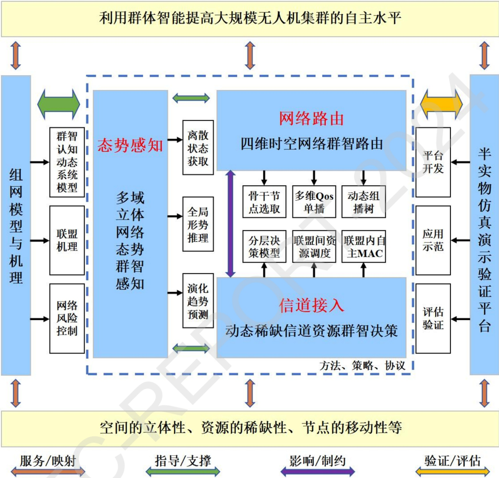

图1 本项目研究内容及各部分之间的关联

本项目以“利用群体智能提高大规模无人机集群的自主水平”为导向，考虑空间的立体性、资源的稀缺性、节点的移动性等典型特征所带来的技术挑战，以“态势感知、信道接入、网络路由”为切入点，从“组网模型与机理、多域立体网络态势群智感知、动态稀缺信道资源群智决策、四维时空网络群智路由、半实物仿真演示验证平台”这五个方面展开研究，以突破大规模无人机集群自组网的性能瓶颈，提升集群的自主能力，将大规模无人机集群推向更为广阔的应用空间。项目主要研究内容如图1所示。对照研究内容，本项目取得的研究进展概述如下:

1、组网模型与机理:

面向群体智能自组网的群智认知动态系统模型:面向群体智能协同，构建协同认知动态系统模型；面向智能空地一体化网络，提出一种无人机智能服务架构；面向动态电磁频谱环境，提出无人机认知重构组网架构；面向低空智联网网络资源管控难题，提出感传算控一体化机理。

面向群智驱动的无人机联盟机理:针对高能效的异质无人机资源优化问题，提出了一种次序重叠联盟形成博弈模型以优化无人机资源分配，从而最大化任务执行效用；提出了双边互利转移准则，以通过重叠联盟成员之间的部分合作来优化无人机资源分配；提出了一种基于偏好引力引导的禁忌搜索重叠联盟形成算法，以获得任务执行效用近似最优的联盟结构。

基于群体智能的网络风险控制机理:面向网络风险控制，构建基于OODA环的弹性协作智能架构，提高无人机集群协作的鲁棒性和灵活性；结合认知动态系统，提出协同认知风险控制机制，实现系统模块间的协同互助。

## 2、多域立体网络态势群智感知:

面向网络离散状态获取的多域群智感知:从精准、高效感知波束信号的角度出发，构建面向波束信号感知的多节点协作检测模型，设计多节点协同波束信号感知算法；针对传统协同定位方法收敛慢、精度低的问题，提出面向多节点协同定位的凸集投影算法和迭代平行投影算法；为增强辐射源识别抗信道变化的能力，提高在不同信道环境下的识别率，提出一种基于因果学习的信道鲁棒通信辐射源识别方法及系统。

面向网络全局形势推理的高效群智感知:从网络通联拓扑感知的模型构建和机理揭示入手，对相关性、格兰杰因果、转移熵和多维霍克斯过程四种典型方法进行系统对比分析；针对无线网络中信息有限和不可靠的情况，提出一种利用多传感器空间分集的协同拓扑感知框架来应对无线信道的随机性；针对无线网络拓扑存在时变性的问题，构建动态通联拓扑感知的系统模型，提出一种基于多维霍克斯过程的动态拓扑感知算法。

面向网络演化趋势预测的精准群智感知:将网络频谱状态演化特性建模为一个多维的特征向量，提出面向频谱演化相似性分析的二分K均值聚类和凝聚层次聚类方法，获得频谱状态演化的相似性知识针对数据稀缺条件下的单频点频谱预测问题，提出基于深度迁移学习的跨频段数据增强方法；针对数据稀缺条件下的多频点频谱预测问题，提出基于生成对抗网络与深度迁移学习的多频点跨频段数据增强方法。

## 3、动态稀缺信道资源群智决策:

面向联盟架构的信道资源分层决策模型:针对复杂多变的任务执行环境，以及任务的突发性、时变性造成的无人机联盟分区动态不定，用频需求多变的问题。构建一种基于联盟博弈的任务层与资源层分层博弈优化模型，提出基于梯度投影法的联合频谱分配与联盟形成算法，保障各无人机高效执行任务并进行合理的频谱分配。

基于知识迁移的联盟间快速稳健资源决策:针对无人机集群下行传输过程中因复杂电磁环境造成的内部互扰与外部攻击交叠，以及突发性任务对无人机部署时间的限制。提出一种基于异构双网络的轨迹-用频联合优化方法，并通过构建迁移知识库充分利用历史经验以加速无人机训练过程，保障无人机联盟的通信资源快速稳健分配。

基于强化学习的联盟内自主信道接入控制:针对大规模无人机集群自组网因节点数量多、网络动态变化导致的MAC层接入冲突，以及部分无人机节点因感知能力弱而无法形成有效的用频策略。提出一种基于碰撞发现的联盟内无人机信道接入方法并设计强化学习方法求解，以及基于“强感知”节点辅助“弱感知”节点的多用户协同抗干扰接入方法，并且在USRP硬件平台中验证了所提方法的有效性。

4、四维时空网络群智路由:

面向立体空间覆盖的联盟骨干节点动态选举:针对干扰环境下链路不稳定性加剧的问题，提出优化的骨干节点选择算法；针对最大化空间覆盖效率的问题，提出基于交替优化的高效覆盖分簇算法。

基于节点移动的多维QoS单播路由:针对路由协议和网络场景难以动态匹配的问题，提出一种基于三维Q学习的自适应路由协议；针对节点快速移动环境下自适应选择低数据负载路由的问题，提出一种基于数据包到达预测的路由协议；针对多指标敏感性路由决策

提出基于联合预测和熵权的路由协议；针对信道链路信息状态更新慢的问题，提出基于频谱感知的多信道链路快速更新方法。

基于动态组播树的高效组播路由:针对频谱数据传输对实时性与可靠性的高要求，提出一种基于阻继网络的组播路由协议，设计面向组播的受控阻塞区域的构建算法，有效提高了信息传输的效率并降低了网络开销。 1

## 5、半实物仿真演示验证平台:

演示验证平台开发:针对半实物仿真演示验证平台，基于SDN思想和云技术，采用分布式系统架构，数据平面和控制平面分离的设计思路，可以应对大规模网络、多用户并发仿真场景，使用数据驱动实时处理的仿真方式将整个仿真网络进行拓扑分层，用户数据隔离，实现高安全性、易扩展性、弹性可伸缩的仿真系统平台，搭建一个大规模无人机集群智能自组网分布式仿真演示验证平台。

协同侦察应用示范:在协同侦察应用示范研究中，通过构建非视距、多角色及干扰诱骗环境下的任务想定，推进频谱态势感知等关键技术研发，制定仿真评估方案。为协同侦察领域的理论研究提供重要支撑，丰富相关理论体系。通过对任务想定的研究和实践，进一步深化对集群智能自组网能力的认识，为后续的应用示范奠定基础。推动无人机集群技术在军事侦察、民用安防等领域的应用。

组网理论技术验证:开发网络态势群智感知、信道资源群智决策和网络群智路由等软件模块，构建“态势感知-资源决策-路由优化-态势重构”的环路，对应群智认知动态系统的运行流程。通过演示验证平台对协同侦察任务进行示范演示，验证项目所提出的各项基础理论与组网关键技术。通过构建专用虚拟仿真框架，实现虚实平台间的模型一致性，提升平台的整体性能。为群智理论技术的研究提供重要支撑，丰富相关理论体系。推动群智理论技术的应用，为相关领域的发展提供技术支持。

本项目拟解决的科学问题与完成情况如下:

本项目基于利用群体智能提高大规模无人机集群自主水平这一需求，力图突破瓶颈，实现个体到集群、集中到分布、静态到动态的跨越，拟解决科学问题与完成情况如下:

## 科学问题一:多域立体网络态势的精准高效感知

针对多域立体网络态势感知的精准性和高效性这一矛盾，本项目构建面向波束信号感知的多节点协作检测模型，提出面向多节点协同定位的凸集投影算法和迭代平行投影算法，从网络通联拓扑感知的模型构建和机理揭示入手，提出利用多传感器信息融合的协同拓扑感知框架来应对无线信道的随机性，将网络频谱状态演化特性建模为一个多维特征向量，提出基于深度迁移学习与生成对抗网络的跨频段频谱预测方法，提升态势感知的精度。 X

## 科学问题二:动态稀缺信道资源的快速稳健决策

针对动态环境、稀缺资源与快速稳健决策这一矛盾，本项目构建面向联盟架构的信道资源分层决策模型，提出基于梯度投影法的联合频谱分配与联盟形成算法，结合迁移学习理论，设计基于知识迁移的联盟间快速稳健资源决策，通过强感知节点辅助弱感知节点，提出基于强化学习的联盟内自主接入控制技术，实现了通信资源分配中稳定性与决策速度的双向提升。

## 科学问题三:四维时空网络拓扑的稳定低耗路由

针对四维时空网络拓扑中稳定路由与低耗路由之间的矛盾，本项目从骨干节点动态选举入手，提出基于交替优化的高效覆盖分簇算法，考虑当前和未来的多指标因素，提出基于联合预测和熵权的路由协议，结合阻继网络，设计面向组播路由的受控阻塞区域构建算法，有效提高了信息传输的效率并降低了网络开销。

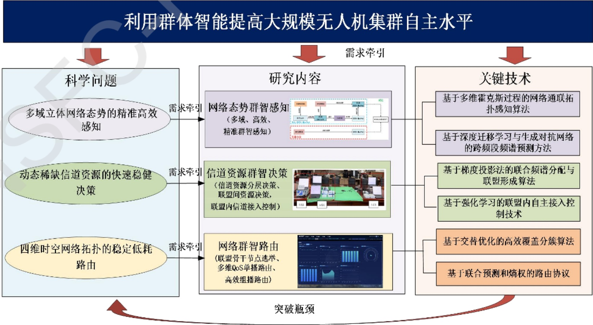

图2 本项目科学问题及解决情况

## 2.1 组网模型与机理

对于组网模型与机理的研究主要围绕群智认知动态系统模型、联盟机理以及网络风险控制机理三个方面展开，主要进展与重要成果如下图所示。

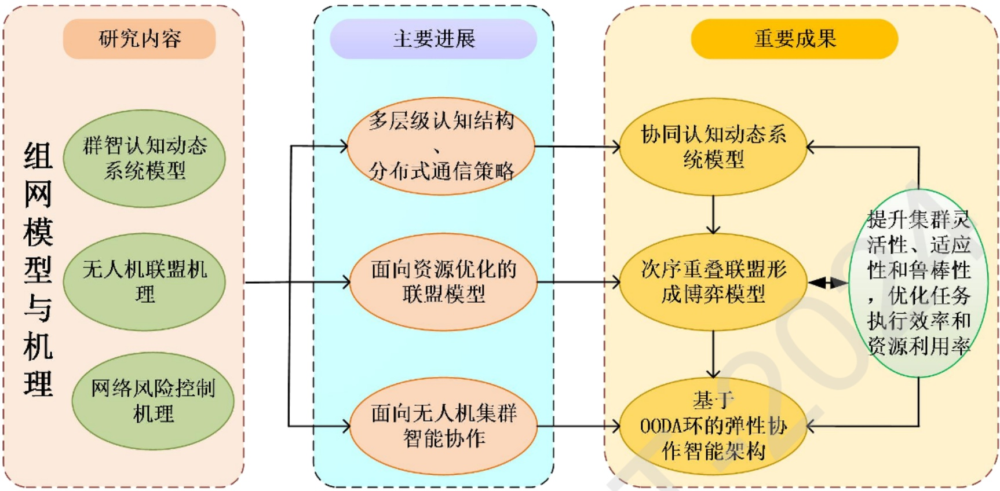

图3 组网模型与机理研究进展与主要成果

## 2.1.1 面向群体智能自组网的群智认知动态系统模型

## （1）协同认知动态系统模型

为了应对动态环境中的不确定性和复杂任务的执行需求，面向群体智能协同，本项目提出协同认知动态系统模型（Cooperative Cognitive Dynamic System, CCDS），通过多层级的认知结构和分布式通信策略，实现无人机集群的自主协同、动态决策和高效任务执行。CCDS的核心在于通过认知动态系统、动态自组网机制和生物启发的仿生机制，提升无人机集群的灵活性、适应性和鲁棒性，从而优化任务的执行效率和资源利用率。

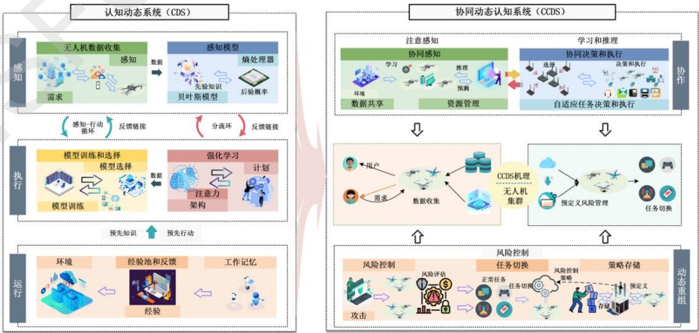

图4 协同动态认知系统

协同认知动态系统机理:CCDS通过构建多层级的认知框架，使无人机集群能够在动态环境中实现感知、决策和执行的闭环认知过程。如图4所示，该系统包含注意力感知、学习与推理、风险控制三个核心模块，通过协同运作提升集群的实时决策能力、任务分配效率和资源优化效果。注意力感知模块是CCDS的感知基础，依托多传感器融合技术动态获取环境信息，并根据任务需求进行自适应调整。通过优化感知范围和精度，该模块能够提升无人机集群对环境变化的敏感度和关键信息的捕捉能力，从而减少信息冗余、降低通信负载，并提升集群在决策过程中的信息准确性与实时性。学习与推理模块使无人机集群具备持续学习和自主推理能力。该模块通过对环境数据和历史任务数据的积累，利用机器学习算法优化决策路径，提升系统对新任务的适应能力。该模块还支持基于知识库的推理功能，能够在缺乏外部通信的情况下实现自主决策，从而提高系统的独立性与任务执行的稳健性。风险控制模块是CCDS保障任务执行安全性和可靠性的关键。该模块通过风险识别、任务切换和策略存储等功能，实现动态风险管理与响应。风险控制模块的引入使系统在面对突发状况和环境变化时具备快速调整任务规划的能力，确保集群的任务连续性和系统鲁棒性。

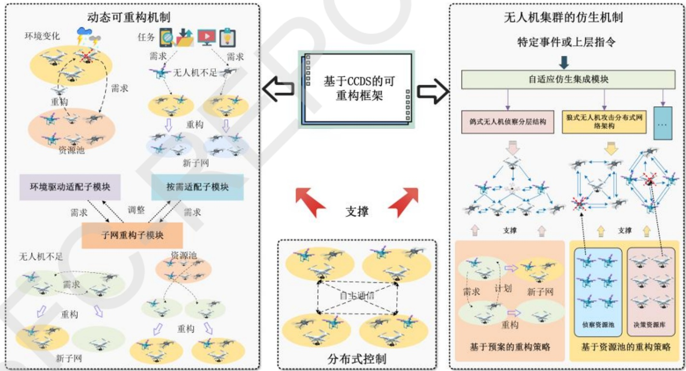

图 5 可重构框架

动态自组网机制:是CCDS提升无人机集群在通信和协作方面灵活性的核心策略。该机制通过内网机制和外网机制的协同运作，使集群能够在分布式通信框架下实现信息共享和动态决策，从而增强系统的任务执行效率和稳定性。内网机制主要用于集群内部的通信与协作，依托点对点通信架构实现分布式信息共享和自主决策。内网机制避免了对中央控制节点的过度依赖，从而降低系统的单点故障风险，同时通过强化学习算法优化任务路径规划和策略调整，使集群在面对任务环境变化时具备持续优化的能力。外网机制关注不同功能子网之间的协作通信。大型无人机集群通常由多个子网组成，每个子网承担不同的任务角色，如数据采集、决策分析和任务执行等。外网机制通过自适应通信策略，根据任务优先级和网络状态动态调整通信链路和拓扑结构，确保关键数据的有效传输和系统资源的高效利用。该机制的引入增强了子网之间的协同效能，并确保在网络负载变化时保持通信的稳定性和实时性。通过内网与外网机制的结合，CCDS实现了无人机集群的大规模任务协同和动态资源优化分配，提升了系统的自主调整能力和任务执行效率。此外，动态自组网机制能够支持子网的融合与分解，根据任务需求动态调整网络架构，使系统具备更强的任务适应性和环境自适应能力。

生物启发的仿生机制:以提高无人机集群在复杂环境中的自适应能力和任务执行效率。通过模仿自然界中动物群体的协同行为，仿生机制为无人机集群提供了高效的协同策略和任务调整方法，进一步提升系统的资源利用效率和任务完成率。鸽群导航策略借鉴了鸽群在飞行过程中动态调整队形和路径以优化区域覆盖的行为模式。无人机集群基于该策略能够通过路径优化和动态调整的方式减少任务覆盖的冗余，提升任务效率。同时，该策略在资源管理方面具有显著优势，通过调整路径规划和飞行高度，能够有效降低能耗，延长任务持续时间，增强系统的巡查能力和数据采集效率。狼群攻击策略借鉴了狼群在捕猎过程中协同攻击和分工协作的行为模式。该策略在无人机集群的目标打击和任务协同中发挥重要作用，使集群在执行目标攻击任务时具备更高的精准性和有效性。仿生机制通过分布式协同决策使无人机集群能够灵活分工，并动态调整攻击路径和任务分配，以提升系统的任务执行效能和鲁棒性。仿生机制的适应性与鲁棒性在于无人机集群面对环境变化和硬件故障时的快速调整能力。通过动态调整队形或功能分配，仿生机制能够在个别节点失效时自动补充缺失功能，确保任务的连续性。此外，仿生机制还支持任务切换和动态重配置，使集群能够依据任务场景选择合适的协同策略，从而提升系统在不同环境下的自适应能力和任务成功率。

## （2）无人机智能服务架构

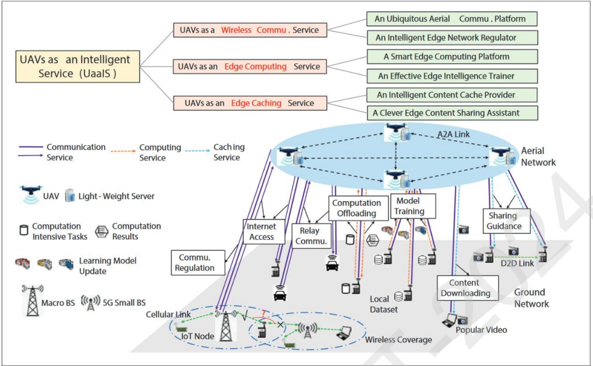

图6 无人机智能服务架构

无人机智能服务架构采用空地双层网络架构，空中的多架无人机构成空中网络，地面的各种移动用户和基础无线接入网（Radio Access Networks, RANs）构成地面网络。在上层空中网络中，每架无人机都配备了无线通信模块、嵌入式计算处理器（即轻量级服务器）、存储设备和各种物联网设备（如摄像头、传感器、RFID和执行器）。因此，无人机有望具备相当强的通信、计算和存储能力，在未来的6G中提供各种空中服务。在低层地面网络中，包括移动设备（手机/笔记本电脑）、自主机器人/车辆和物联网设备在内的移动用户由WiFi、小蜂窝和宏蜂窝组成的异构基础RANs提供服务。无人机也可以从空中为这些用户提供服务。无人机通过WiFi等空对空（A2A）通信实现互联，而无人机空中网络和地面网络则通过空对地（A2G）和地对空（G2A）通信实现连接。无人机智能服务架构能够利用无人机的优势和人工智能技术的发展，智能地提供各种服务。更具体地说，无人机可为未来6G网络提供三类即时服务，如图6所示。服务的分类基于通信和网络的三种基本服务，即通信、计算和缓存，其中每一类服务又分为两种。首先，无人机作为无处不在的空中通信平台和智能边缘网络调节器，构成了无线通信服务。其次，无人机作为智能边缘计算平台和有效的边缘智能训练器，构成了边缘计算服务。最后，无人机是一种边缘缓存服务，既是智能内容缓存提供者，又是聪明的边缘共享助手。后两种服务是由通信服务衍生而来的，因为无人机提供的任何服务都要以必要的A2G或G2A通信链路为前提。无人机智能服务架构的意义在于，它将传统云服务中的一些常见功能，包括基础设施、软件、平台即服务等，移植到无人机上，并将重点放在智能化上。在实践中，为了提供与基础设施、软件和平台即服务商业模式类似的“随用随付”型实用服务，相关无人机需具有网络感知能力，并与云服务提供商连接。云服务提供商利用网络功能虚拟化（Network Functions Virtualization, NFV），有助于在无人机上部署计算服务等服务。

## （3）无人机认知重构组网架构

为了更好地优化频谱资源、构建通信组网、夺取制电磁权，本项目构建基于电磁频谱态势的无人机认知重构组网体系模型。以多域频谱态势感知能力为基石，融合通感一体化架构和认知软件定义网络(Cognitive Software Defined Network, C-SDN)，无人机认知重构组网架构是面向电磁频谱域复杂多变特性的，具有3个特点:①设计通信感知一体化方式对电磁环境进行频谱态势感知、数据存储以及传输。②面向频谱态势的机动性、设备的异构型和多域合作的需求，设计应用C-SDN思想的无人机认知重构组网架构。③考虑到通信环境不稳定的特点，部署两类通信链路，实现高可靠控制平面和高速率业务平面的分离。

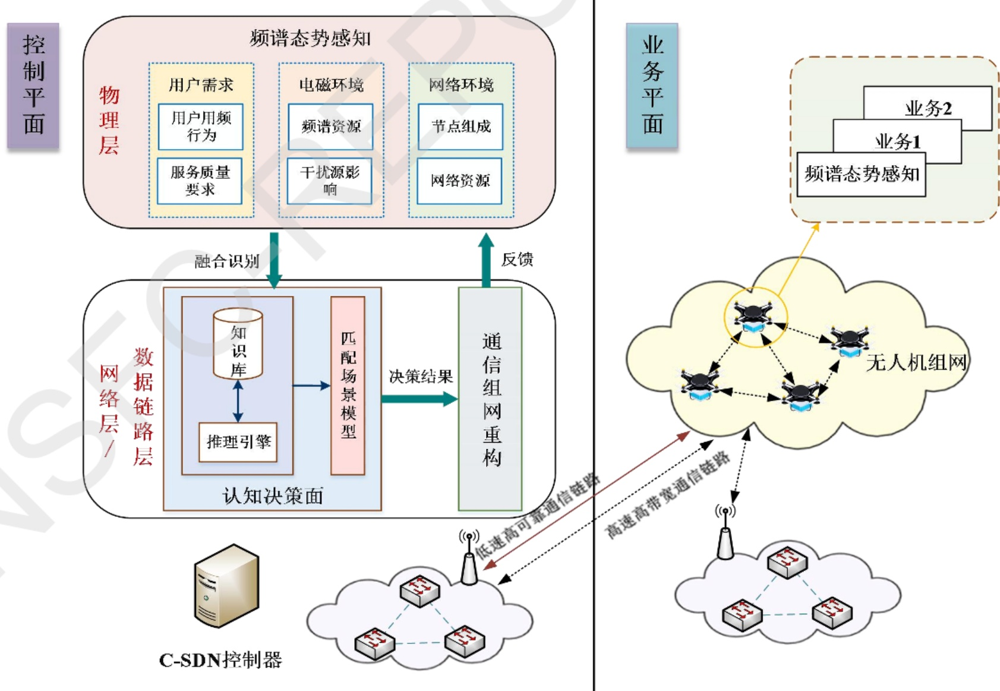

图7 无人机认知重构组网架构

该架构深入分析作战场景下用户需求、电磁环境以及网络环境等电磁频谱态势要素的作用机理，进行典型应用场景构建及需求匹配分析，结合态势感知、智能认知与动态管控，通过数据与控制信息传输链路分离的方式，可靠地实现通信资源的智能调度和组网通信协议的自适应切换，确保有条不紊的作战指挥。相比传统的FANET体系，无人机认知重构组网架构可以为各种作战场景提供更智能和高效的网络管理和控制能力。

C-SDN思想:在强对抗复杂环境中，末端战术通信网络会成为敌我双方的重点打击目标，其通信能力可能会受到限制甚至中断。在这种情况下，稳定的通信链路显得尤为重要。特别是当出现用频冲突或遭受电磁干扰导致通信中断等情况时，需要一个可靠的控制链路来指导用频，重新分配通信资源，并重构通信组网。C-SDN能够满足这种需求，它是一种新型网络架构，将认知能力与软件定义网络相结合，旨在提供更智能、灵活和高效的网络管理和控制。C-SDN采用业务平面和控制平面解耦合的形式。通过数控分离的方式，业务平面只需执行控制平面发送的指令和规则，无需关注网络拓扑等信息，从而提高了网络效率。同时，为了解决通信链路质量不稳定的问题，C-SDN中部署了两类通信链路:低速高可靠链路和高速高带宽链路。低速高可靠的链路用于控制平面传输网络控制信息，如频谱决策信令等；高速高带宽链路则作为业务信道来传输更多的网络业务数据。通过这种方式，控制信道的抗干扰能力较强。即使敌方电磁干扰影响了业务信道，控制平面仍能通过切换通信协议来控制业务平面，确保通信的连续性和可靠性。 C

## （4）低空智联网感传算网络资源管控机理

为实现三维高动态的低空智联网络中空域组网覆盖的网络资源优化配置，针对目前网络发展过程中所面临的拓扑结构高动态性、节点分布疏密不均以及组网不稳定性，面向任务感知、信息传输和终端计算，本项目设计空地融合网络的综合布局，实现网络感传算一体化，支撑高动态低空飞行器的高效安全运行。

信息交互和传感是实现网络“互联”与“智联”的基石，用户大数据的全方位信息感知是低空智联网系统进行通信和计算卸载的前提。针对低空网络环境复杂多变的特点，需提高传感器对任务感知的灵敏度和精确度，优化三维动态网络布局，实现全覆盖、高鲁棒的协同数据感知技术。

低时延、全覆盖的通信服务是未来通信网络发展的首要任务。在低空空域内部署通信网络可有效解决覆盖难的问题，为实现全球范围内空天地一体化的无缝覆盖的通信组网提供了临时的解决方案。与二维地面通信模型相比，实现空地融合的大连接、高鲁棒组网通信首先需结合环境状态与视距链路的连通性，建立涵盖“空-地”和“空-空”链路通信的三维立体覆盖模型，揭示网络覆盖率、可靠性与设备密度、分布特性、天线配置、飞行器路径的内在关系。其次，基于三维立体模型，通过部署于飞行器上的传感器网络精确感知预测网络环境和状态，自适应地快速接入信道，并以飞行器位置和轨迹进行关联和接入路由，预测网络状态，优化接入路由，保障连接的稳定性，实现稳定的组网接入和资源的优化配置。最后，通过多层次和多维度的网络资源优化配置，降低空地端到端的通信时延，建立空天地海无缝覆盖的鲁棒组网，实现低时延、高可靠的通信网络。 1

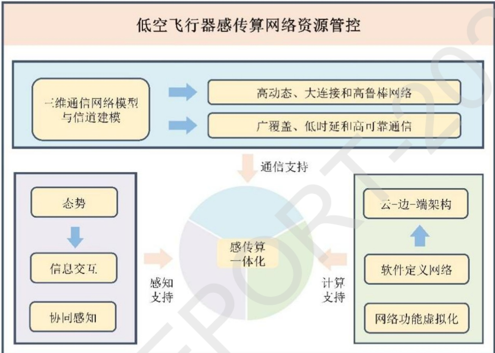

图8低空飞行器感传算网络资源管控机理

在“云-边-端”的网络架构中，既可以将无人机作为通信节点，把用户的计算任务卸载到地面基站或近地卫星网络中，也可以将机载计算服务器作为地面基础设施的补充，为地面用户提供无处不在的泛在计算服务。由于无人机的计算能力和电池能量受到限制，缓存和卸载决策优化是网络资源管理的关键设计问题之。随着计算资源异构化、网络结构复杂化、服务质量严格化、作业任务多样化，计算资源的部署逐渐呈现耦合趋势，传统的启发式算法在求解网络环境中的多目标优化问题存在局限性。为了实现智能边缘计算中网络资源的优化与配置，提高资源利用率，降低冗余率，可以采用深度强化学习的方法对多智能体进行训练，通过不断试错的机制得到网络计算资源配置与部署问题的最优解。此外，在对星地网络的云计算资源进行部署时，可以结合软件定义网络和网络功能虚拟化技术对空天地一体化信息网络重新架构，实现网络功能和计算资源的快速配置和动态调整。

考虑低空飞行器高移动性、智能性、异构性以及网络体系架构的高动态性和数据的多源性，实现低空智联网系统的网络资源泛在覆盖，必须将感知、通信、计算资源结合，以协同认知动态系统为基础，结合场景认知智能与智慧内生，构建异构群体智能的可重构网络。同时，结合机器学习的方法，增强低空飞行器个体智能，实现低空智联网节点协同，提高低空智联网的高效性和安全性，协调网络感知、计算、控制功能与资源部署，最终实现感传算一体化的网络体系架构。

## 2.1.2 面向群智驱动的无人机联盟机理

本项目将任务驱动无人机网络中的资源优化问题建模为一个具有可转移效用的次序重叠联盟形成博弈。在同一任务点协作执行任务的无人机集合称为联盟，其中联盟的数量为任务点的数量。所提出的任务驱动的次序重叠联盟形成博弈模型定义为 $\mathcal { G } = \{ N , U _ { m } \left( A _ { m } \right) , S C , X \}$ ，其中N为无人机博弈参与者， $U_{m}\left(A_{m}\right)$ 为任务点联盟m的效用函数，SC为重叠联盟结构， $X = \left\{ x_{1}, \cdots, x_{n}, \cdots, x_{N} \right\}$ 为进行资源分配的无人机决策向量，其中 $X_{n} = \left\{ A_{1}^{(n)}, \cdots, A_{m}^{(n)}, \cdots, A_{M}^{(n)} \right\}$ 为无人机n的资源分配向量。

次序重叠联盟形成博弈模型:根据现有的无人机资源分配向量，定义重叠联盟结构为 $SC = \left\{ A_{1}, \cdots, A_{m}, \cdots, A_{M} \right\} , \mathrm{Mem} \left( A_{m} \right) \in N$ ,其中 $A_{m} = \left\{ A_{m}^{(1)}, \cdots, A_{m}^{(n)}, \cdots, A_{m}^{(N)} \right\}$ 为任务点m 处的联盟， $A _ { m } ^ { ( n ) }$ 为联盟的成员集合。此外，每架无人机从其加入的联盟中获得一份收益。利用夏普利值的基本比例公平性，来解决无人机联盟成员收益共享问题。因此，无人机n的效用可表示为:

$$
\frac{u_{n}}{\sum_{n \in \mathrm{Mem}(A_{m})}\left|A_{m}^{(n)}\right|} U_{m}\left(A_{m}\right).\tag{1}
$$

双边互利转移准则（BMBT）:对于每个无人机博弈参与者n和交换前后两种联盟结构 $S C _ { \varrho }$ 和 $S C _ { p }$ ，双边互利转移准则中偏好决策定义如下:

$$
\begin{aligned}\overline{SC_{Q}} \sim_{n} \overline{SC_{p}} \Leftrightarrow u_{n}\left(\overline{SC_{Q}}\right) + \sum_{g \in \operatorname{Mom}\left(d_{j}\right) \backslash\{n\}}\left[u_{g}\left(\overline{SC_{Q}}\right) - u_{g}\left(\overline{SC_{p}}\right)\right] + \sum_{o \in \operatorname{Mom}\left(d_{j}\right) \backslash\{n\}}\left[u_{o}\left(\overline{SC_{Q}}\right)\right] \\> u_{n}\left(\overline{SC_{p}}\right) + \sum_{g \in \operatorname{Mom}\left(d_{j}\right) \backslash\{n\}}\left[u_{h}\left(\overline{SC_{p}}\right) - u_{h}\left(\overline{SC_{q}}\right)\right] + \sum_{o \in \operatorname{Mom}\left(d_{j}\right) \backslash\{n\}}\left[u_{o}\left(\overline{SC_{p}}\right)\right]\end{aligned}\tag{2}
$$

其中， $A \left( n \right) = \left\{ A _ { n } \in S C \mid A _ { m } ^ { \left( n \right) } \neq \varnothing , m \in M \right\}$ 为无人机n在其他投入资源的任务点联盟集合。该式子表明包含无人机n在进行资源分配操作时需满足总联盟效用大于分配操作之前。满足此条件时，交换操作成功，否则操作失败。这意味着无人机更倾向于选择有利于整个网络的资源分配联盟结构，从而实现双方的互利。

基于偏好引力引导的禁忌搜索重叠联盟:提出一种基于偏好引力导向禁忌搜索的分布式重叠联盟形成算法。具体来说，建立一个禁忌列表，记录每次交换操作后的联盟结构，以避免重复操作。此外，由于禁忌搜索算法对搜索策略敏感。

因此，考虑到任务资源属性的重叠性和互补性，所提算法设计了一种偏好引力的概念来引导禁忌搜索优化的方向，以提高算法的收敛性能。具体步骤如下:

（1）禁忌列表建立:根据历史联盟结构下的资源分配，在第k次迭代中建立禁忌列表，当无人机在进行联盟间资源分配的交换操作时，不能重复做出已经在禁忌列表中存在的联盟结构的交换操作。

（2）偏好引力的计算:禁忌搜索算法对初始解比较敏感，较好的初始解可以提高算法的收敛速度和最终收敛解的质量。为了指导无人机更好地寻找合适的资源分配决策，结合任务资源需求与无人机资源重叠与互补的特性，引入偏好引力的概念。

偏好引力可被视为任务点m所需的剩余资源与无人机n所负载的剩余资源之间的偏好程度。无人机n中的第z种类型任务资源 $\delta _ { n } ^ { ( z ) }$ $\mu _ { n } ^ { ( z ) }$ 对于投入任务点 $m$的偏好引力定义为:

$$
F_{n}^{(z)}(k)=\left[f_{1,n}^{(z)}(k),\cdots,f_{m,n}^{(z)}(k)\right]\tag{3}
$$

如果无人机携带的资源与任务完成的资源需求更好地匹配，则它们之间的偏好引力权重将越大，这表明无人机更倾向于为该任务点分配资源。

（3）搜索策略:无人机n所携带的第z类型资源分配给每个任务点的概率向量定义为:

$$
\begin{aligned} &P_{n}^{(z)}(k)=\left[p_{n, l}^{(z)}(k), \cdots, p_{n, M}^{(z)}(k)\right] \\&p_{n, m}^{(z)}(k)=\frac{\exp \left[f_{m, n}^{(z)}(k) \Gamma(k)\right]}{\sum_{m \in M} \exp \left[f_{m, n}^{(z)}(k) \Gamma(k)\right]}\\ \end{aligned}\tag{4}
$$

（4）联盟形成过程:根据偏好引力设计的选择概率，无人机随机选择第z种类型的资源 $\delta _ { n } ^ { ( z ) }$ ，如果无人机进行资源分配的交换操作满足所提出的BMBT偏好准则，资源交换成功，否则无人机保持原有资源分配下的联盟结构。

为验证以上机理，本项目将仿真场景设置规模大小为 $2  km ^{*}2  km$ ，其中网络中一共包括8架无人机和5个任务点，在不失一般性的前提下，所有无人机和任务点的初始位置向量及其资源向量在当前划定区域内随机均匀生成。每个无人机根据自身携带资源和状态属性，对网络中不同任务点投入的资源进行决策。基于所提出的分布式重叠联盟形成算法，无人机资源分配下的重叠联盟结构将逐渐收敛到稳定状态。

图9展示了在所提基于PGG-TS的分布式重叠联盟形成算法、基于合并-拆分操作的重叠联盟形成算法和非重叠联盟形成算法下，任务执行的平均效用随无人机数目增加的变化关系。由图可见，任务执行的平均效用随无人机数目增加而增加。此外，由于更灵活的资源分配下的次序重叠联盟结构，与基于合并-拆分操作的重叠联盟形成算法和非重叠联盟形成算法相比，所提基于PGG-TS的分布式重叠联盟形成算法下任务执行的平均效用分别增加了12.5%和38.5%。其原因在于所提基于PGG-TS的分布式重叠联盟形成算法在策略探索和利用之间进行权衡，并设计偏好引力引导无人机的策略搜索方向，尽可能避免形成局部最优的重叠联盟结构。

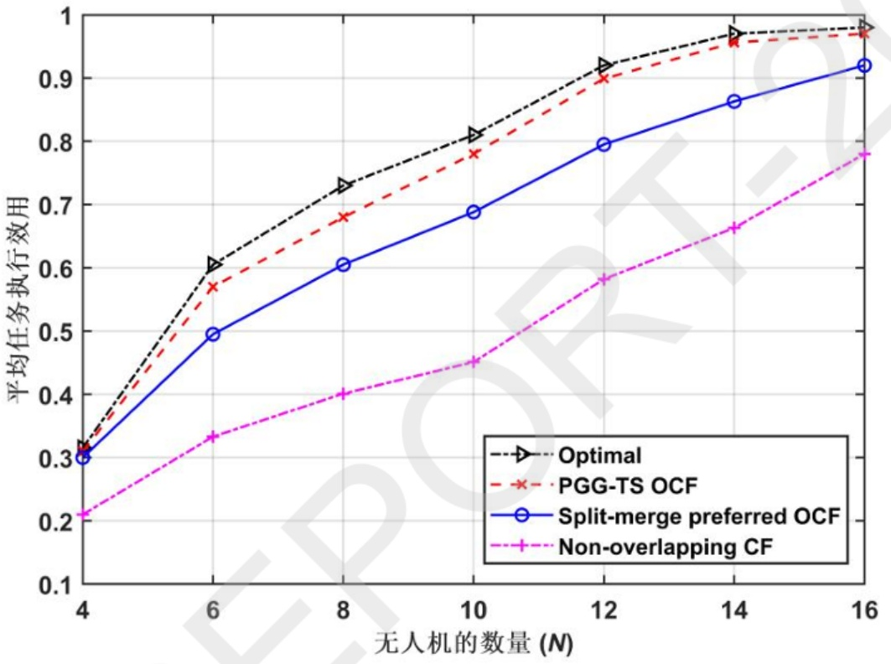

图9不同无人机数目条件下各联盟形成算法的任务执行平均效用对比

## 2.1.3 基于群体智能的网络风险控制机理

本项目面向网络风险控制，构建基于OODA环的弹性协作智能架构，提高无人机集群协作的鲁棒性和灵活性；结合认知动态系统，提出协同认知风险控制机制，实现系统模块间的协同互助。

## （1）基于OODA环的弹性协作智能架构

由于无人机的高机动性和战场环境中不可预测的传输信道，无人机群中的空对空（A2A）链路不可避免地会不可靠，无人机还可能因硬件/软件错误而崩溃，从而导致单点故障等风险。为了应对以上负面干扰，本项目提出了用于无人机集群网络风险控制的弹性协作智能架构，这是一种基于OODA（即观察、定向、决策和行动)环的全新架构，保证了无人机集群协作运行的高鲁棒性和高灵活性。鲁棒性高表现为即使在某些无人机执行任务时突然无法使用，其他无人机也能很好地承担其未完成的任务。灵活性高表现为只要机载资源足够，任何无人机的子任务都可以按需进行自适应调整。

弹性协作智能架构使无人机集群能够以按需、灵活的方式协作执行任务，这就是所谓的“松耦合协作”。所谓“按需”，是指可以动态地将蜂群中所有可用的无人机集合在一起，为任务执行做出贡献。而“灵活”则意味着不仅任何可用的无人机都可以在其能力范围内帮助执行任务，而且当某些预定的无人机不可用时，还可以自适应地调整任务的分配。

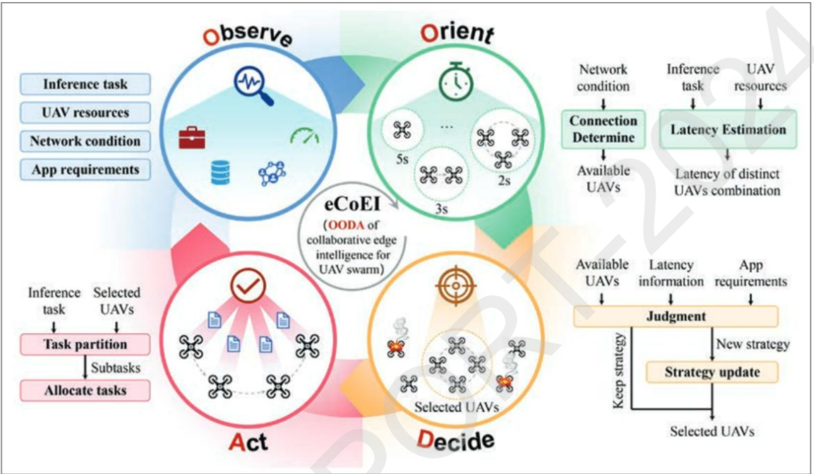

图 10 弹性协作智能架构的主要流程

弹性协作智能架构的设计基于OODA环，主要流程如图10所示。具体来说，在观察期，应定时感知和收集无人机群和任务的信息（即网络拓扑、推理任务、无人机资源、网络状况和应用需求）。网络拓扑信息可以从Hello消息中获取，在运行时，Hello消息会定期广播给周围所有节点，以发现周围的邻居。只有当无人机的资源发生变化时，才会发送信息，以进一步减少通信开销。在定位阶段，可通过分析网络状况信息获取当前可用的无人机。根据当前的任务和无人机资源，可以估算出不同无人机组合的任务延迟。在决策阶段，可综合利用可用无人机、延迟信息和应用需求等信息，在必要时确定新的时间表。当网络质量太差而无法提高性能或需要执行的任务很少时，任务将由单个无人机执行。在行动阶段，选定的任务被分配给在决策阶段选定的无人机。考虑到无人机资源和网络状况可能会动态变化。当无人机在空中执行任务时，整个OODA环将持续进行。如果在执行过程中某些选定的无人机无法使用，则会对任务的剩余未完成部分更新分区策略。

## （2）协同认知风险控制机制

认知风险控制（Cognitive Risk Control, CRC）旨在处理系统在存在意想不到的不确定性情况下运行的特殊情况。通过利用过去积累的、对当前情况存在有效信息的经验，CRC实现了预测适应特征，被证明对于抗干扰通信是有效的。结合认知动态系统（CDS），本项目提出一种连接雷达和通信系统的协同认知风险控制机制（Coordinated Cognitive Risk Control, C-CRC），允许一个系统从另一个系统中学习，并对另一个系统遇到的风险做出反应。

对于每个单独系统，感知-行动环（Perception-Action Cycle, PAC）是在系统本身内部进行的，用于生成和更新行动。在这基础上，本项目开发了一个新的构件，称为认知调解器。一般来说，认知中介旨在促进两个支柱系统之间的互动，并引导它们以协作的方式找到各自的解决方案。在认知调解器的支持下，两个系统间的分隔被打破，这在节点面临干扰或受到攻击时非常重要。在这种情况下，可能损害一个系统的风险不仅会在该系统内被检测到并得到处理，而且还会向另一个系统发出警报，并在第二个系统中采取措施以保持其性能。即一个系统的运行状态部分受另一系统的调节，这样相关系统能获得比独立做所有决定更好的性能。换句话说，认知中介将提供一种新的安全机制，使一个系统能够从另一个系统遇到的风险中吸取教训并做出反应。

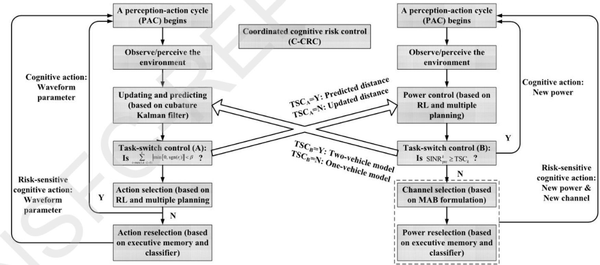

图11 协同认知风险控制机制的实现过程

协同认知风险控制机制的实现过程如图11所示。图中左侧是认知雷达的流程图，右侧是认知通信的流程图。调解器C-CRC位于中间，负责促进互助，帮助一个系统根据另一个系统的情况进行调整。右上箭头表示任务切换控制A对通信系统的影响，左上箭头表示任务切换控制B对雷达系统的影响。需要指出的是，对于任何给定节点而言，雷达的运行速度未必相同于通信的运行速度。雷达系统中的PAC运行速度可能更快，从而导致更频繁的滤波估计；或者，通信系统中的PAC运行效率更高，从而导致额外的信息交换。无论哪种情况，每个系统内部的执行过程都将保持不变；每个系统在评估完自己的任务切换控制结果后，就会将其传递给其他系统，但只有在需要时才会检查其他系统的评估结果。也就是说，两个系统仍按各自的步调运行，无需系统间同步。与认知式雷达和认知式通信系统各自的设计相比，这种新提出的协调设计所付出的额外代价/成本非常小。因为两个系统仍将遵循各自的运行程序，只需进行有限的信息交换，如图11中的两个箭头所示。这一特性对其在实际网络中的潜在应用非常有利。

## 2.2多域立体网络态势群智感知

对于多域立体网络态势群智感知的研究主要围绕网络离散状态获取、网络全局形势推理与网络演化趋势预测三个方面展开，主要进展与重要成果如下图所示。

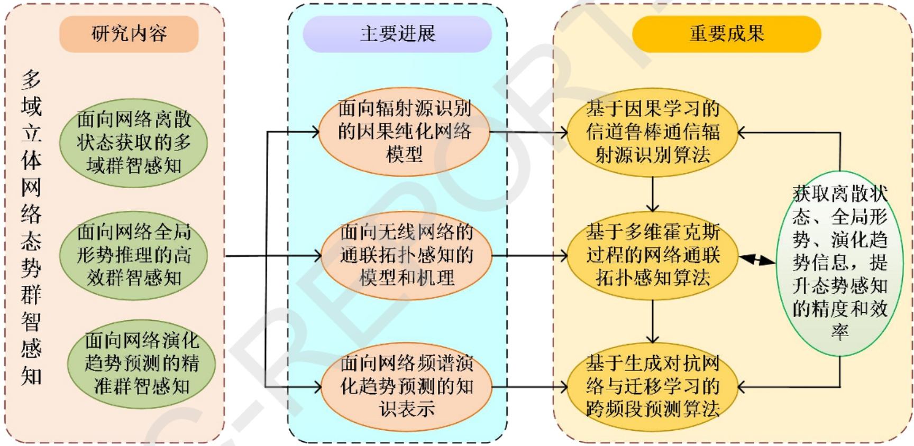

图12多域立体网络态势群智感知研究进展与主要成果

## 2.2.1 面向网络离散状态获取的多域群智感知

本项目从波束域信号感知、空间域位置信息感知、用户域辐射源身份感知等方面开展了面向网络离散状态获取的多域群智感知研究。从精准、高效感知波束信号的角度出发，构建了面向波束信号感知的多节点协作检测模型，并设计了多节点协同波束信号感知算法；针对传统协同定位方法收敛慢、精度低的问题，提出了面向多节点协同定位的凸集投影算法和迭代平行投影算法，并基于分布式协同定位半实物仿真系统的室外实验验证了所提算法的有效性；为增强辐射源识别抗信道变化的能力，提高在不同信道环境下的识别率，提出了一种基于因果学习的信道鲁棒通信辐射源识别方法及系统，提高了辐射源识别在不同信道下的性能，具有良好的泛化能力与稳定性。

## （1）多节点协同波束信号感知

波束信号感知在动态频谱共享和电磁信号侦察等领域发挥着日益重要的作用。一方面，随着物联网和移动互联网的迅速发展，稀缺的优质频谱资源与不断增长的用频需求之间的矛盾日益突出，动态频谱共享被认为是缓解这一矛盾的主要方式。随着近年来大规模天线阵列的快速进步和广泛应用，波束赋形技术提供了波束域这一新的频谱共享资源维度。另一方面，随着相控阵技术的广泛运用，电磁信号侦察的重点和难点逐渐从全向信号感知转向波束信号感知，检测和估计波束信号的存在性和分布特征是威胁目标识别、情报态势生成的前提和基础。

现有针对波束信号感知的研究大多面向信号源与感知节点之间的合作场景。然而，动态频谱共享场景中的授权用户和认知用户之间往往是非合作的，电磁信号侦察场景中的目标和感知节点之间也是非合作的。非合作场景下的波束信号感知机理尚不明确，波束信号检测和波束分布估计等关键技术还有待突破。

为此，本项目从精准、高效感知非合作波束信号的角度出发，建立了非合作波束信号的多节点协作主瓣检测的系统模型，包括装备线阵天线产生波束信号的非合作目标发射机和波束信号感知网络。感知网络的主要任务是检测目标波束信号的存在或不存在。本项目进一步提出了多数服从少数置信度（MFMC）算法对感知网络中各节点的能量检测统计信息进行融合。波束信号具有较强的方向性，因此只有波束信号覆盖范围内的节点才能检测到波束信号，结合MFMC算法推导出了波束信号多节点协作检测的闭式解。将所提的MFMC算法与能量检测算法进行对比分析，验证了MFMC算法的有效性。MFMC算法在保证较低虚警率的同时，显著提升了检测性能，如下图所示。

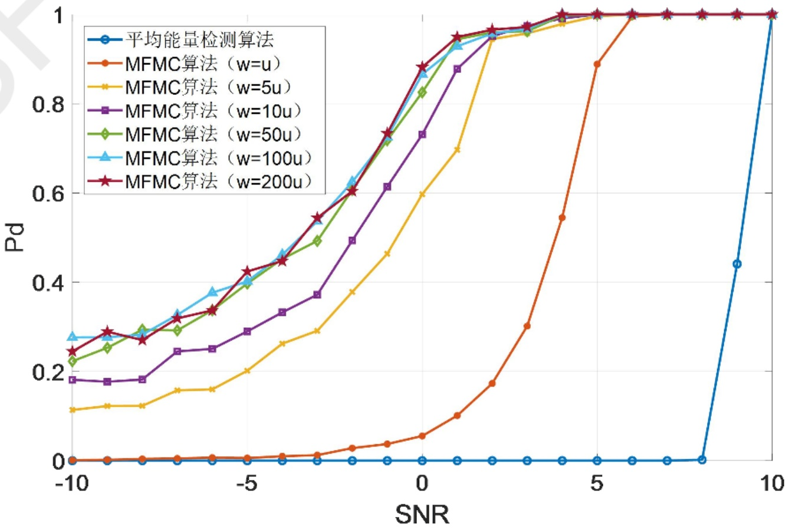

图13 MFMC 算法和平均能量检测统算法检测性能对比

## （2）稳健协同位置感知

针对混合无线网络中协同定位现有方法在收敛性方面存在的问题，提出了混合无线网络中的凸集投影算法（H-POCS）和迭代平行投影算法（H-IPPM）。为了解决混合无线网络中协同定位所面临的权重选择难题，提出了基于平衡因子加权的HBFW-IPPM算法以及基于协方差传播的HCPW-IPPM算法。为了验证算法在真实环境中的性能，开展了基于分布式协同定位半实物仿真系统的室外实验。实验结果显示，与HBFW-IPPM和 H-IPPM等其他算法相比，HCPW-IPPM 具有更高的收敛速度和定位精度，在缺乏先验信息的冷启动条件下同样具有出色的性能。其较快的收敛速度和较低的计算复杂度的特性可有效降低首次定位时间，还可以作为初始化算法为其他高精度算法提供了理想的初值选择。相关算法性能如下图所示。

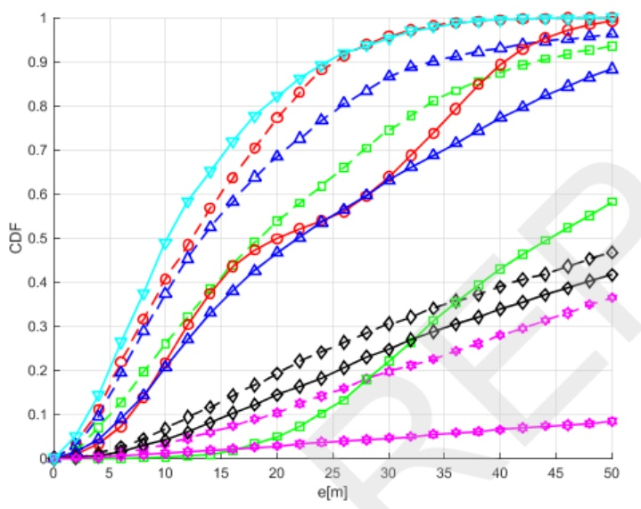

(a) 温启动水平定位误差 CDF 曲线

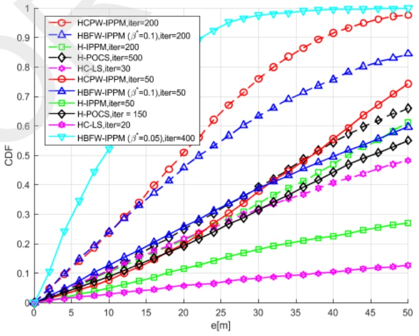

(b) 温启动垂向定位误差 CDF 曲线

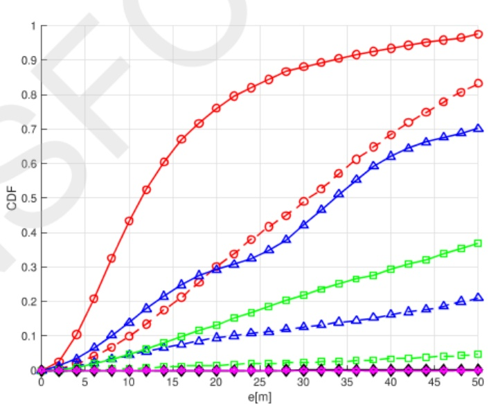

(c) 冷启动水平定位误差 CDF 曲线

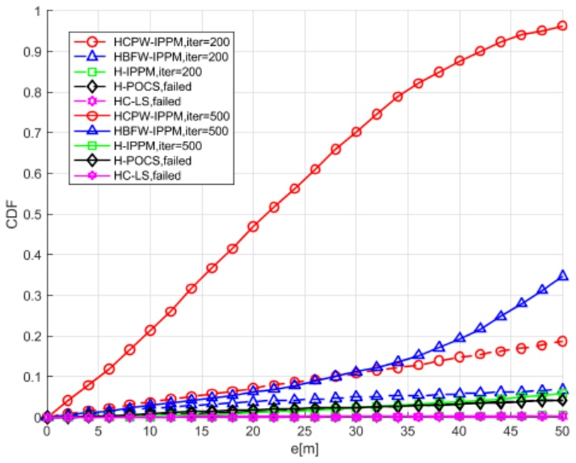

(d) 冷启动垂向定位误差 CDF 曲线

图14算法定位误差对比

## （3）信源身份感知

信源或辐射源识别是一种主要从接收信号提取射频指纹的单个设备识别技术。然而，射频指纹在训练和测试阶段中受到的信道影响通常是不同的，并且辐射源识别对抗信道变化能力较差。如何增强辐射源识别抗信道变化的能力，提高在不同信道环境下的识别率，成为了当前辐射源识别在实际应用中亟需解决的问题之一。

本项目提出了一种基于因果学习的信道鲁棒通信辐射源识别方法及系统，方法包括:获取实时通信辐射源信号并转化为识别样本，将识别样本输入至预训练的因果纯化网络获得通信辐射源实时识别结果；所述因果纯化网络的获取过程包括:基于结构因果模型对通信辐射源训练信号中的干扰元素和因果元素进行建模分析，提取前导码信号并对前导码信号进行标准化；利用中心化对数功率谱对标准化后的前导码信号进行特征表示获得训练样本；基于因果元素与通信辐射源的编号信息设备设定训练样本的辐射源标签；利用训练样本对所述因果纯化网络进行训练获得训练后的因果纯化网络；可以有效缓解信道效应，提高辐射源识别在不同信道下的性能，具有良好的泛化能力与稳定性。实验结果如下图所示。

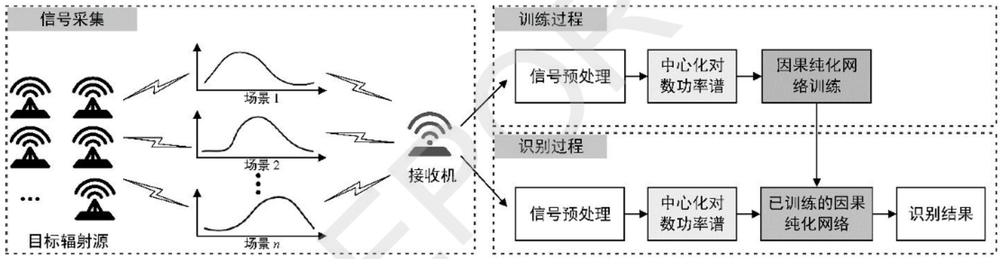

图15 辐射源识别方法流程图

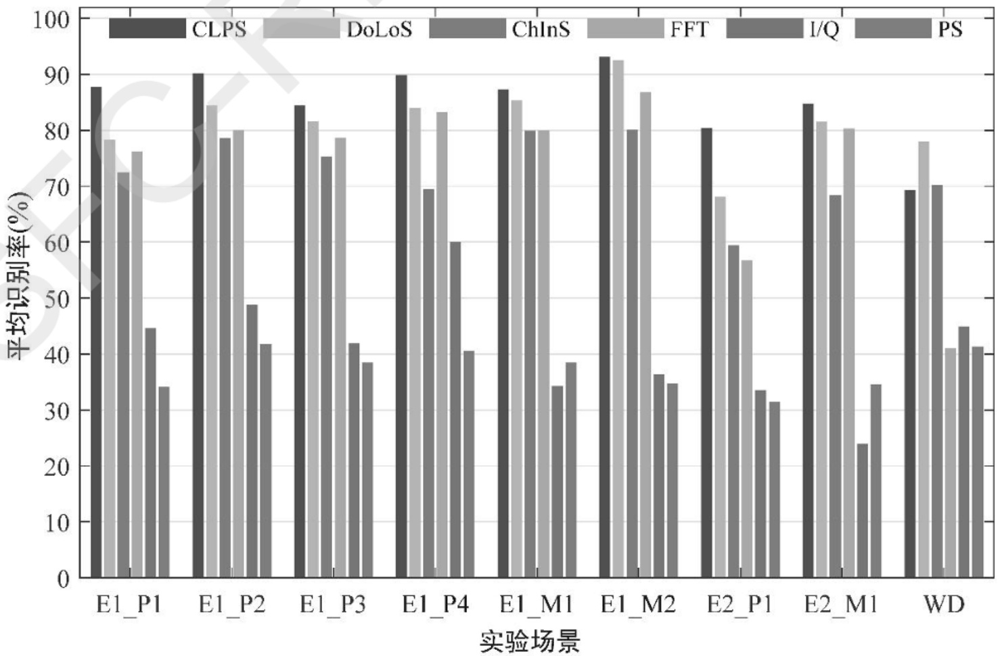

图16提出的中心化对数功率谱与现有特征表示方法的平均识别率对比图

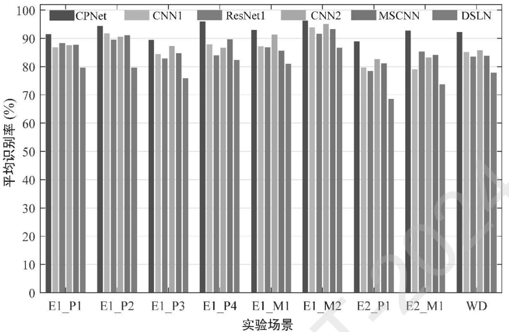

图17提出的网络模型与现有网络模型的平均识别率对比图

## 2.2.2 面向网络全局形势推理的高效群智感知

本项目从无线网络的通联拓扑感知的模型构建和机理揭示入手，对相关性、格兰杰因果、转移熵和多维霍克斯过程四种典型方法进行了系统对比分析；针对无线网络中信息有限和不可靠的情况，提出了一种利用多传感器空间分集的协同拓扑感知框架来应对无线信道的随机性，并分别从硬融合和软融合的角度提出并分析了四种分布式传感器协同拓扑感知方案；针对无线网络拓扑存在时变性的问题，构建了动态通联拓扑感知的系统模型，提出了一种基于多维霍克斯过程的动态拓扑感知算法，并通过仿真验证了所提算法在时变网络拓扑场景下的有效性，形成了对时变通联拓扑的捕获和跟踪能力。

## （1）面向无线网络的通联拓扑感知的模型和机理

针对通联拓扑感知在非合作场景下存在模型和机理不清晰的问题，对现有研究工作进行了梳理总结，在此基础上构建了通联拓扑感知系统模型，揭示了通联拓扑感知机理，并对相关性、格兰杰因果、转移熵和多维霍克斯过程四种典型方法进行了仿真对比分析。

首先，基于典型的非合作场景，明确感知系统的架构设计和功能实现，梳理关键技术，完成对系统可实现性和物理可行性的分析。其次，厘清通联拓扑的推理机理:利用“三域”模型建模无线网络能力生成的形成过程，为由物理域反演认知域奠定理解的基础；通过网络构建的过程分析信息交互的机制，进一步明确信息交互的落脚点在物理域的信号传输；针对具体协议进行分析，探索研究通信响应的机制背后存在的因果关系和统计规律。进一步，分析了相关的理论方法，并在同一数据维度下完成了对四种方法的对比，认识到简单利用相关性来度量通联关系并不能很好地满足推理的需求，并进一步讨论分析了基于格兰杰因果、转移熵和霍克斯过程的三种方法的优劣所在。

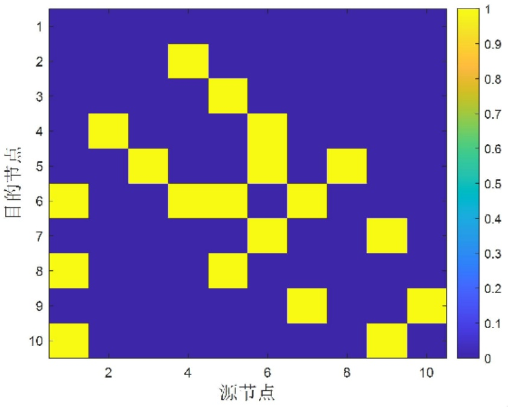

(a) 真实邻接矩阵

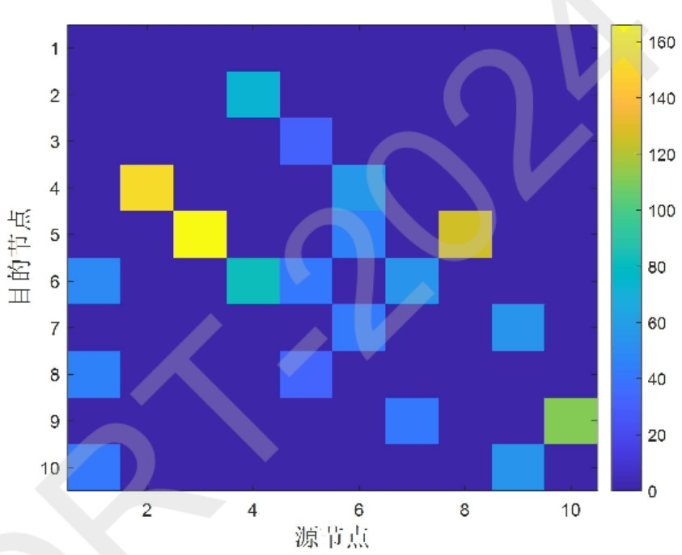

(b) 真实加权邻接矩阵

图18目标无线网络的真实通联拓扑可视化展示

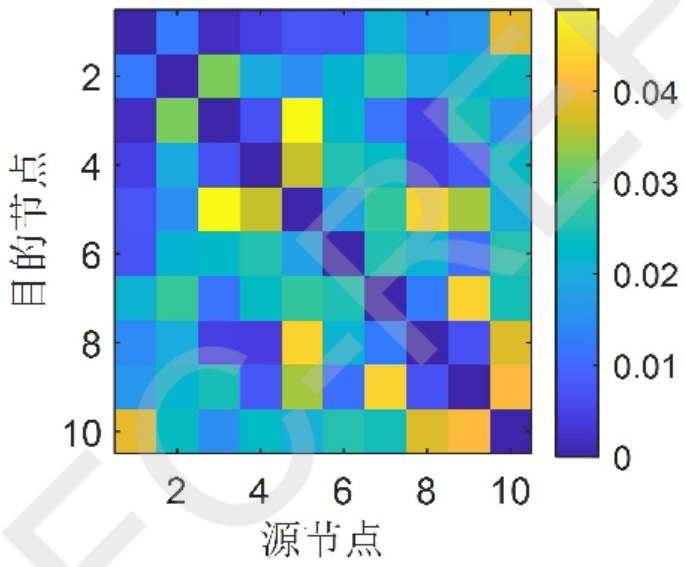

(a) Cor（相关性）

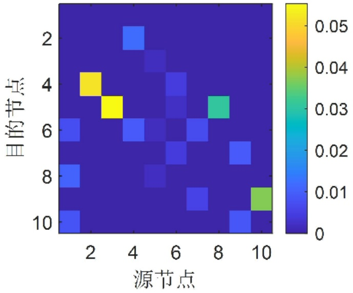

(b) GC（格兰杰因果）

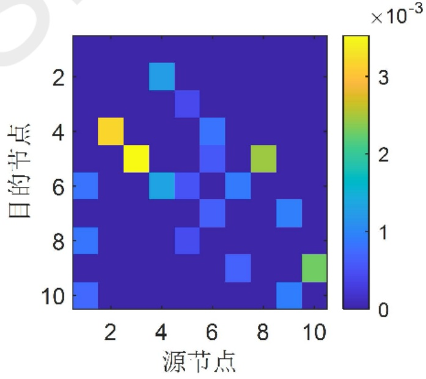

(c) TE（转移熵）

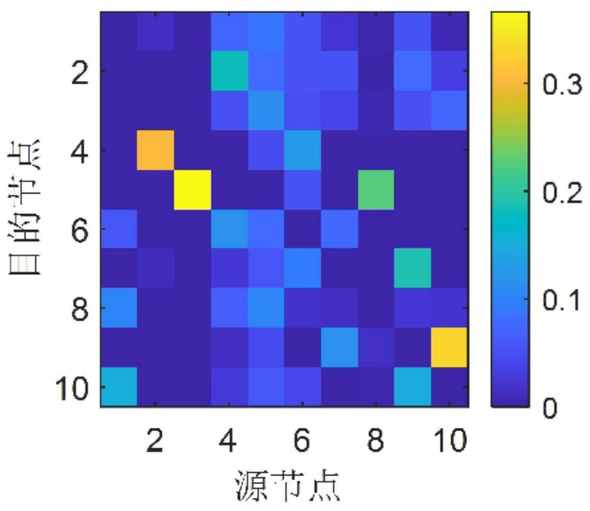

(d) MHP（霍克斯过程）

图19 四种算法推理得到的通联拓扑可视化展示

## （2）面向网络拓扑感知的全局网络形势融合

针对无线网络中信息有限和不可靠的情况，研究了分布式传感器的拓扑感知问题。首先，提出了一种利用多传感器空间分集的协同拓扑感知框架来应对无线信道的随机性。然后，将通信行为建模为多维霍克斯过程，其主要思想是在无线网络中，一个节点发送信息可能会诱发其他节点对其进行响应，例如一条确认消息或转发动作。在此基础上，分别从硬融合和软融合的角度提出并分析了四种分布式传感器协同拓扑感知方案。仿真结果表明，协同拓扑感知是解决无线信道随机性问题的有效措施。

无线网络拓扑感知作为网络推理的关键技术，在理解、解释和预测网络行为方面发挥着重要作用。但现有的研究大多集中于观察完整完善的拓扑推断，主要适用于有线网络，而不适用于具有各种信道随机性和不确定性的无线网络。因此本项目针对无线网络中信息有限和不可靠的情况，研究了分布式传感器的拓扑感知问题。首先提出了一种利用多传感器空间分集的协同拓扑感知框架来应对无线信道的随机性。然后将通信行为建模为多维霍克斯过程，其主要思想是在无线网络中，一个节点发送信息可能会诱发其他节点对其进行响应，例如一条确认消息或转发动作。在此基础上，分别从硬融合和软融合的角度提出并分析了四种分布式传感器协同拓扑感知方案。仿真结果表明，信号功率和事件重复次数对感知精度有较大影响，协同拓扑感知是解决无线信道随机性问题的有效措施。

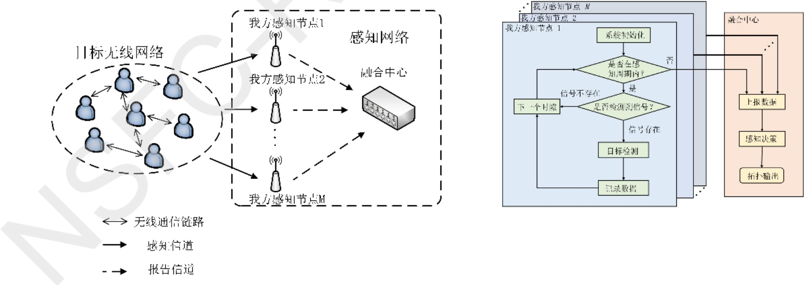

(a)协同拓扑感知系统模型

(b)系统拓扑感知流程框架

图20非合作无线网络协同拓扑融合感知示意图

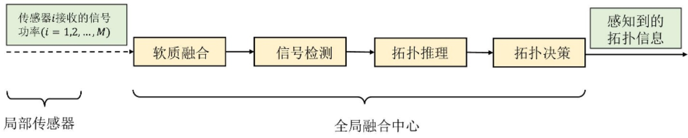

（a）信号功率软质融合

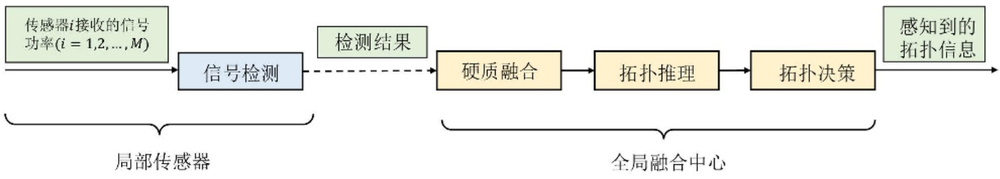

（b）信号检测结果硬质融合

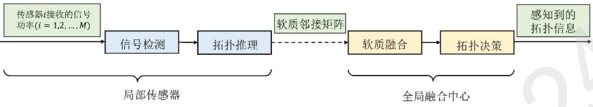

（c）邻接矩阵软质融合

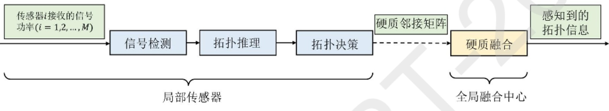

（d）邻接矩阵硬质融合

图21 多传感器拓扑感知的数据融合方案

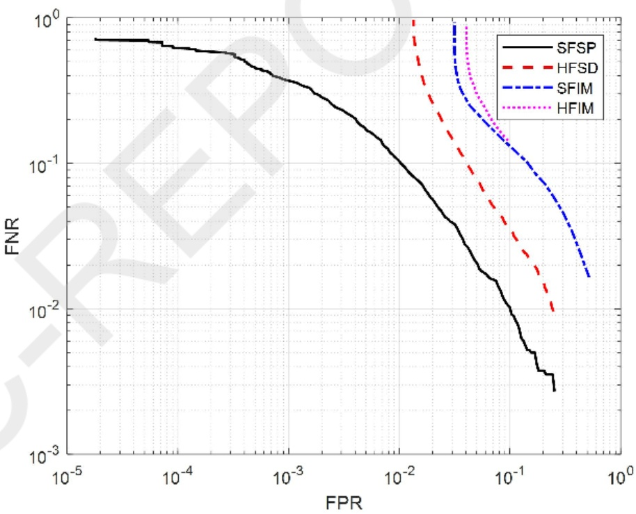

（a）四种融合方案的ROC 曲线

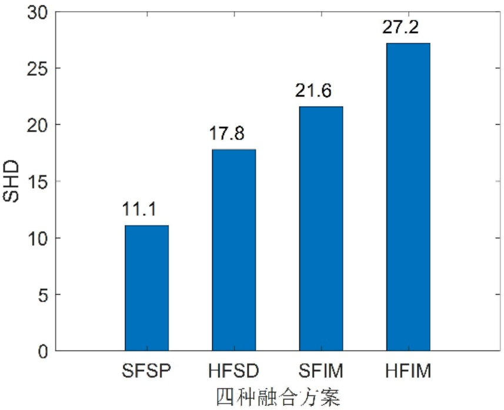

（b）四种融合方案的 SHD

图 22四种融合方案的对比

## （3）面向时变拓扑感知的多跳网络信息流向挖掘

针对目标无线网络拓扑存在时变性的问题，构建了动态通联拓扑感知的系统模型，提出了一种基于多维霍克斯过程的动态拓扑感知算法，并通过仿真验证了所提算法在时变网络拓扑场景下的有效性，形成了对时变通联拓扑的捕获和跟踪能力。

首先，基于非合作的时变场景，对时变网络进行建模，提出随时间获取目标无线网络通信行为的感知框架；其次，拓展动态多维霍克斯过程对时变的事件序列进行建模，进而把动态通联拓扑推理问题视为时变参数估计问题；进一步，引入时间滑动窗思想，利用最大加权似然估计法实现时变参数的估计；此外，针对固定阈值判决在时变场景下的缺点，提出了动态阈值的选择方法；最后，通过仿真验证所提算法在时变场景下的有效性，并分析了目标网络的拓扑变化率、感知错误率（包括信号检测错误率和目标节点识别错误率）以及滑动窗口数等因素对推理性能的影响。

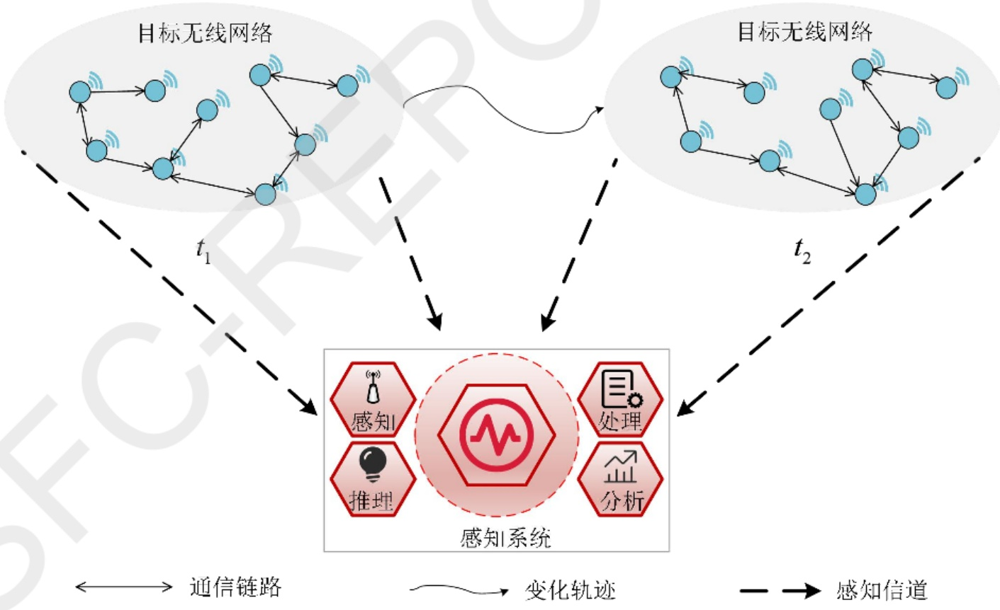

图23时变拓扑推理场景示意图

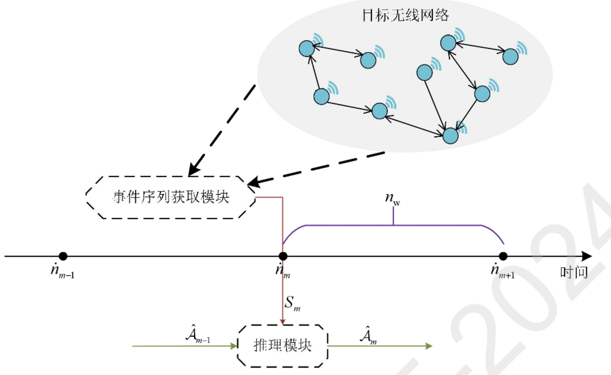

图 24 动态拓扑推理流程示意图

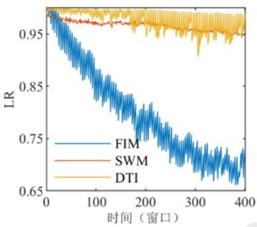

(a) LR 随时间变化

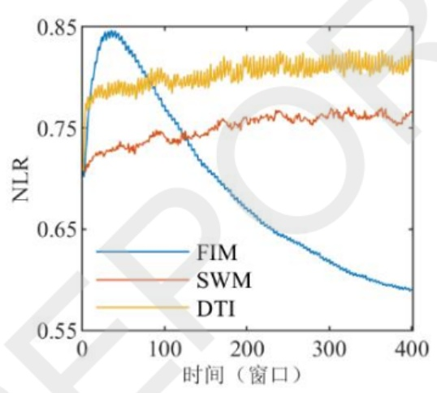

(b) NLR 随时间变化

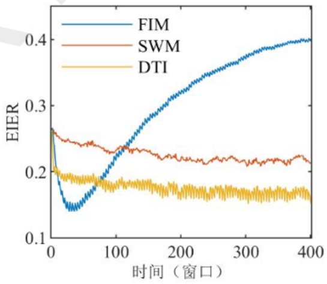

(c) EIER随时间变化

图 25 拓扑平滑变化模式下的性能对比

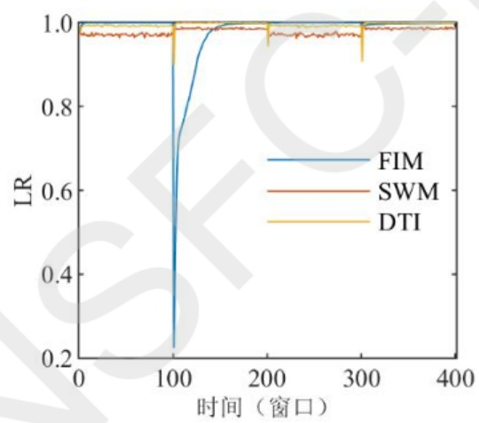

(a) LR 随时间变化

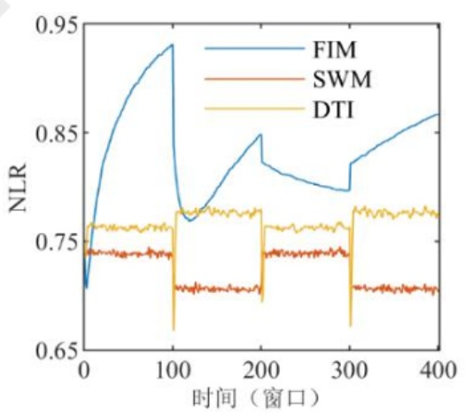

(b) NLR 随时间变化

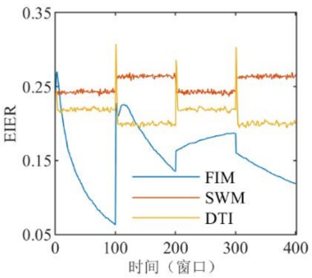

图26拓扑突变模式下的性能对比

(c) EIER 随时间变化

## 2.2.3 面向网络演化趋势预测的精准群智感知

本项目主要从面向网络频谱演化趋势预测的知识表示、面向网络单频点跨频段预测的深度迁移学习、面向网络多频点跨频段预测的生成式迁移学习等方面开展研究。首先，将频谱状态演化特性建模为一个多维的特征向量，提出了面向频谱演化相似性分析的二分K均值聚类和凝聚层次聚类方法，获得了频谱状态演化的相似性知识。其次，针对数据稀缺条件下的单频点频谱预测问题，提出了基于深度迁移学习的跨频段数据增强方法，分析了频带之间的相似性和频谱数据的可预测性，利用迁移成分分析，探讨了在跨频段频谱预测中影响迁移学习性能的主要特征，实测频谱数据的分析结果表明，在历史频谱数据有限的情况下，所提方法性能优于现有深度学习模型。进一步，针对数据稀缺条件下的多频点频谱预测问题，提出了基于生成对抗网络与深度迁移学习的多频点跨频段数据增强方法，核心思想是通过预先训练好的网络生成与目标数据高度相似的数据，并通过深度迁移学习来扩充这些数据，实测频谱数据的分析结果表明，提出的数据增强框架能够生成与原始数据高度相似特征分布的数据。

## （1）面向网络频谱演化趋势预测的知识表示

本项目将频谱状态演化特性建模为一个多维的特征向量，所提出的多维特征可以对频谱状态演化的特性进行更为系统的知识表示；实现了基于二分K均值聚类和凝聚层次聚类方法的频谱演化相似性分析，获得了频谱状态演化的相似性知识，实测数据聚类分析表明，这两种聚类方法可以精细刻画频谱状态演化的相似性。

频谱状态演化是指频谱状态随时间、频率或空间而变化。对于任意给定的频点，一系列按时间顺序排列的功率谱密度（Power Spectral Density, PSD）值组成了表征频谱状态演化的时间序列。时间序列可以表示为 $X = \{ x _ { 1 } , x _ { 2 } , . . . , x _ { t } \}$ ，其中 $x _ { t }$ 表示中X的第t项，即某频点在第t个时隙的PSD值。因此，频谱状态演化的特征应该从两个方面的专家知识来考虑:时间序列本身的特性和频谱状态演化的物理意义，从而确保特征的合理性和可解释性。

本项目主要关注六种特征。其中，均值和标准差是时间序列的常用度量，分别为序列的一阶矩和二阶矩，用来反映时间序列各项的集中趋势和离散程度。二维熵和自相关系数的收敛速度讨论了时间序列在时域中的周期性和平稳性。加权占空比和过均值数是从物理意义的角度关注占用状态的比率和时间分布。而后，可以将频谱状态演化的特性建模为由上述多个特征组成的归一化多维特征向量。

时间序列的均值是数据统计中最常用也是最重要的度量指标之一，它反映了时间序列中各项分布的集中趋势。一个频点在很长一段时间内频谱状态演化的平均值可定义为:

$$
\overline { { X } }   =   \frac { 1 } { T }   \sum _ { t = 1 } ^ { T } x _ { t } ,\tag{1}
$$

其中T表示时间序列X的长度。均值 $\bar { X }$ 的物理意义是指一段时间内接收到的某频率信号强度的均值（PSD均值）。

时间序列的标准差是数据统计中另一个常见且重要的度量指标，它衡量的是时间序列各项与其均值的偏离程度，描述了时间序列的波动性。一个频点的频谱状态演化的标准差可定义为:

$$
\sigma = \sqrt { \frac { 1 } { T } \sum _ { i = 1 } ^ { T } \left( x _ { t } - \bar { X } \right) ^ { 2 } }   .\tag{2}
$$

PSD值随时间的波动越剧烈，则频谱状态演化时间序列的标准差越大。

二维熵是在经典样本熵的基础上，通过测量时间序列中产生新模式的概率来量化时间序列的复杂性。作为对样本熵的一种改进，二维熵可以评估不同复杂程度的循环体，并用于描述相似模式在时间序列中的分布。二维熵越小，时间序列的自相似程度越高；否则，时间序列越复杂。因此，频谱状态呈周期性演化的频点的二维熵较小。当频点的状态演化的周期特性不同时，它们的二维熵也不同。

下面将具体阐述二维熵的计算过程。原始时间序列 $X = \{ x_{1}, x_{2}, \ldots, x_{t}, \ldots, x_{T} \}$ 可以被重建为一组 $p$ 维的样本向量，而每一个样本向量由时间序列X中的从第 $x _ { t }$项开始的连续 $p$ 个项组成，可表示为:

$$
X_{t}^{p} = \left\{ x_{t}, x_{t+1}, \cdots, x_{t+p-1} \right\}\tag{3}
$$

其中T是原始时间序列X的长度，下标t的取值范围可为 $t = 1 , 2 , \ldots , T - p + 1$ 。样本向量 $X _ { t _ { 1 } } ^ { p }$ 和 $X _ { t _ { 2 } } ^ { p }$ 之间的距离可以被定义为这两个样本向量中任意两个对应项之间的最大距离，表示为:

$$
d _ { t _ { 1 } , t _ { 2 } } ^ { p } = \max _ { q \in [ 0 , p - 1 ] } \left| x _ { t _ { 1 } + q } - x _ { t _ { 2 } + q } \right| ,\tag{4}
$$

其中 $t_{1} \neq t_{2}$ 。进一步，给定门限 $r$ ，两个样本向量 $X _ { t _ { 1 } } ^ { p }$ 和 ${ \boldsymbol { X } } _ { t _ { 2 } } ^ { p }$ 之间的相似性可以如

$$
\mu _ { t _ { 1 } , t _ { 2 } } ^ { p } = \left\{ \begin{aligned} & 1 - \frac { \left| t _ { 1 } - t _ { 2 } \right| } { T - p } , & d _ { t _ { 1 } , t _ { 2 } } ^ { p } \leq r \\ & 0 , & d _ { t _ { 1 } , t _ { 2 } } ^ { p } > r \end{aligned} \right. ,\tag{5}
$$

其中 $1   \leq   t _ { 1 }   \leq   T   -   p$ 且 $1 \leq t _ { 2 } \leq T - p$ 。在给定门限r下，某一 $p$ 维的样本向量 $X _ { t _ { 1 } } ^ { p }$ 与其他所有 $p$ 维样本向量 ${ \cal { X } } _ { t _ { 2 } } ^ { p }$ 相似的平均概率 $B _ { t _ { 1 } } ^ { p } ( r )$ 可以写成:

$$
B _ { t _ { 1 } } ^ { p } ( r ) = \frac { \sum _ { t _ { 2 } = 1 } ^ { T - p } \mu _ { t _ { 1 } , t _ { 2 } } ^ { p } } { T - p - 1 } .\tag{6}
$$

则任一 $p$ 维的样本向量 $X _ { t } ^ { p }$ 自相似的平均概率为:

$$
B ^ { p } ( r ) = \frac { \displaystyle \sum _ { t _ { 1 } = 1 } ^ { T - p } B _ { t _ { 1 } } ^ { p } ( r ) } { T - p } .\tag{7}
$$

而后，当样本向量的维度增加为p+1时，重复上述所有步骤。两个 $p + 1$ 维样本向量 $X _ { t _ { 1 } } ^ { p + 1 }$ 和 $X _ { t _ { 2 } } ^ { p + 1 }$ 仍然分别满足 $1   \leq   t _ { 1 }   \leq   T   -   p$ 和 $1 \leq t _ { 2 } \leq T - p$ ，且 $t _ { 1 } \neq t _ { 2 }$ 则任一$p + 1$ 维样本向量 $X _ { t } ^ { p + 1 }$ 自相似的平均概率 $B ^ { p + 1 } ( r )$ 可以被重写成:

$$
B ^ { p + 1 } ( r ) = \frac { \sum _ { t _ { 1 } = 1 } ^ { T - p } \sum _ { t _ { 2 } = 1 } ^ { T - p } \mu _ { t _ { 1 } , t _ { 2 } } ^ { p + 1 } } { ( T - p - 1 ) ( T - p ) } .\tag{8}
$$

二维熵的表达式即为:

$$
T w o E n ( m , r ) = \lim _ { T \rightarrow \infty } - \ln \left[ \frac { B ^ { p + 1 } ( r ) } { B ^ { p } ( r ) } \right].\tag{9}
$$

当时间序列的长度T不是无限时，二维熵可以被估计为:

$$
T w o E n ( m , r ) = - \ln \left[ \frac { B ^ { p + 1 } ( r ) } { B ^ { p } ( r ) } \right] .\tag{10}
$$

样本向量的维度通常设置为 $p \equiv 2$ ，给定门限r设置为0.2σ， $\sigma$ 是时间序列的标准差。

一个时间序列 $X_{t} = \left\{ x_{t}, x_{t+1}, \cdots \right\}$ 的平稳性指的是对每一个滞后数h，该序列具有与其时移序列 $X_{t+h} = \left\{ x_{t+h}, x_{t+h+1}, \cdots \right\}$ 相似的统计特性。当时间序列平稳时，基于历史数据对其未来趋势的预测将是可靠的。因此，有必要将时间序列的平稳性作为其时域演化特征的一个重要度量。一般而言，平稳时间序列的自相关系数将随着自相关系数阶数的增加，迅速下降到0左右。虽然以上的表述不能被用来证明时间序列的平稳性，但自相关系数的变化趋势确实可以反映出不同时间序列之间平稳性的差异。一个时间序列的阶自相关系数可以被定义为:

$$
\sum_{t = 1}^{T - l} \left( x_{t} - \bar{X} \right) \left( x_{t + l} - \bar{X} \right) \over \sum_{t = 1}^{T} \left( x_{t} - \bar{X} \right)^{2}\tag{11}
$$

其中l是子序列的滞后时间数， $\bar { X }$ 是整个时间序列的均值。自相关系数表示的是时间序列与其自身的相关性。当滞后时间l为0时，自相关系数始终为1。当阶数l增加时，平稳时间序列的自相关系数将急剧下降。将自相关系数的收敛速度定义为拟合直线的斜率，用于描述自相关系数的变化趋势，用CvRate表示。可以认为当收敛速度CvRate越大时，序列高阶自相关系数收敛得越快，时间序列趋于平稳。

为了度量各频点占用状态的比率，考虑引入占空比的概念。占空比作为频谱状态演化的一个重要特征，从物理意义上对频谱利用进行了定量的刻画。一个信道的占空比定义为该信道被占用的时隙与总时隙的比值，表示为: 1

$$
DC(f)=\frac{1}{N_t}\sum_{t=1}^{N_t}\Omega(t,f)\times100\%,\tag{12}
$$

其中 $\Omega ( t , f )$ 是二值变量，代表着频率 $f$ 的信道在第t个时隙是否被占用， $N _ { t }$ 是指到第t个时隙时经历的时隙总数。具体地，信道的状态和接收信号之间的映射关系可以表述如下:

$$
\begin{aligned}\Omega = 0: \quad & y(t) = w(t), \\\Omega = 1: \quad & y(t) = s(t) + w(t),\end{aligned}\tag{13}
$$

其中 $w ( t )$ 是背景噪声的时域离散表示， $s ( t )$ 是关注的信号的时域离散表示，y(t)是在频谱监测中接收到的信号的时域离散表示，t表示离散的时隙。

信道的状态Ω可以通过能量检测得到:当接收信号的PSD值近似等于背景噪声的PSD值时，认为信道为空闲的；当接收信号的PSD值远远高于背景噪声时，则认为信道被占用。能量检测设置的判决阈值决定了Ω的数值。为了保证尽可能不遗漏微弱信号以及被噪声干扰，检测阈值通常设置为高于背景噪声峰值3-5dB。然而 受各种因素的影响，背景噪声在不同的地点、不同的时间、不同的波段都存在差异，且有时波动较大。在实际应用中，往往很难确定一个固定的、合理的检测阈值。

信号的PSD的谷值和峰值之间选择多个检测阈值，表示为 $\Delta = \left\{ \delta_{1}, \delta_{2}, \ldots, \delta_{l} \right\}$ 。这些检测阈值满足 $x_{\min} \leq \delta_{1} < \delta_{2} < \cdots < \delta_{l} \leq x_{\max}$ 的条件。而后，信道的状态可以数学化地表示为:

$$
\left\{ \begin{aligned} \mathrm{if} \quad y(t, f) \leq \delta_i, \quad \Omega_i(t, f) = 0 \\ \mathrm{if} \quad y(t, f) > \delta_i, \quad \Omega_i(t, f) = 1 \end{aligned} \right. \quad (i = 1, 2, \ldots, l) \quad ,\tag{14}
$$

其中 $y ( t , f )$ 表示频率 $f$ 的信道上在第t个时隙的接收信号的PSD值。

显然，占空比 $D C _ { i }$ 是阈值 $\delta _ { i }$ 的函数，为了在不增加特征维数的情况下包含所有检测阈值的影响，可以对不同检测阈值下信道的所有占空比进行加权，生成信道的加权占空比。每个阈值下的占空比的权重设置为1，则加权占空比可定义为:

$$
DC_{w}(f)=\sum_{i=1}^{l}DC_{i}(f).\tag{15}
$$

加权占空比对检测阈值的灵敏度较低，同时还可以描述频谱状态演化的波动范围。加权占空比越大，信道被占用的比例越高，在频谱状态的演化过程中，信道状态大多表现为被占用。

为了描述每个频点被占用状态在时域上的分布，考虑计算PSD值过均值的数量。对于表示某频点状态演化的时间序列 $X = \left\{ x_{1}, x_{2}, \ldots, x_{t} \right\}$ 加入一个负无穷值的项作为新的首项形成一个新的序列 $\dot { X } = \{ - \infty , x _ { 1 } , x _ { 2 } , \ldots , x _ { t } \}$ 而后，连接序列X中的所有项形成一条频谱状态演化的包络线。由原序列X的均值 $\bar { X }$ 组成的长度为t+1的时间序列 $\left\{ { \overline { { X } } } , { \overline { { X } } } , . . . , { \overline { { X } } } \right\}$ 可以形成一条频谱状态演化的均值线。过均值数即为包络线和均值线的交点数的一半，记为 $N _ { c r o s s }$ o

将频点作为实体，则上述特征都可以表示为频点的属性，形成如下图所示的频谱状态演化的知识表示。进一步，可以根据这些属性来分析不同频点、不同频段、乃至不同业务的频谱状态演化之间是否存在相似关系。

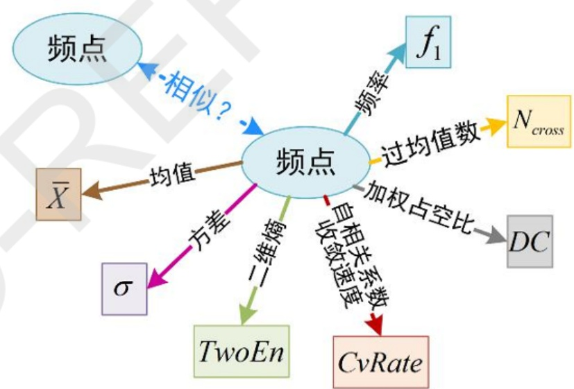

图27频谱状态演化的知识表示

结合知识图谱的图结构，容易想到将频点看作节点，将上述所有属性聚合到节点上，即将某频点频谱状态演化的特征建模为一个完整的6维特征向量$V_{f} = \left\{ \bar{X}_{f}, \sigma_{f}, TwoEn(m,r,f), CvRate(f), DC_{w}(f), N_{cross}(f) \right\} \circ V_{f}$ 是频率f处的频点的特征向量，则被监测频带内所有频点的状态演化特征可以由特征矩阵来描述，表示为:

$$
\boldsymbol { V } = \left[ \begin{aligned} \boldsymbol { V } _ { f _ { 1 } } \\ \boldsymbol { V } _ { f _ { 2 } } \\ \vdots \\ \boldsymbol { V } _ { f _ { n } } \end{aligned} \right] = \left[ \begin{aligned} \boldsymbol { \overline { { X } } } _ { f _ { 1 } } \quad \boldsymbol { \sigma } _ { f _ { 1 } } \quad \cdots \quad \boldsymbol { N } _ { c r o s s } \left( f _ { 1 } \right) \\ \boldsymbol { \overline { { X } } } _ { f _ { 2 } } \quad \boldsymbol { \sigma } _ { f _ { 2 } } \quad \cdots \quad \boldsymbol { N } _ { c r o s s } \left( f _ { 2 } \right) \\ \vdots \quad \vdots \quad \ddots \quad \vdots \\ \boldsymbol { \overline { { X } } } _ { f _ { n } } \quad \boldsymbol { \sigma } _ { f _ { n } } \quad \cdots \quad \boldsymbol { N } _ { c r o s s } \left( f _ { n } \right) \end{aligned} \right] = \left[ \begin{aligned} \nu _ { 1 1 } \quad \nu _ { 1 2 } \quad \cdots \quad \nu _ { 1 6 } \\ \nu _ { 2 1 } \quad \nu _ { 2 2 } \quad \cdots \quad \nu _ { 2 6 } \\ \vdots \quad \vdots \quad \ddots \quad \vdots \\ \nu _ { n 1 } \quad \nu _ { n 2 } \quad \cdots \quad \nu _ { n 6 } \end{aligned} \right] .\tag{16}
$$

由于每个特征的数值范围、单位和维数都不同，需对每个特征单独进行归一化处理，以尽可能消除不同特征数量级差距的影响。对整个特征矩阵，按列进行归一化，如下所示:

$$
v_{ij}^{'} = \frac{v_{ij} - \min\left(v_{1j}, v_{2j}, \ldots, v_{nj}\right)}{\max\left(v_{1j}, v_{2j}, \ldots, v_{nj}\right) - \min\left(v_{1j}, v_{2j}, \ldots, v_{nj}\right)}\tag{17}
$$

其中 $i = 1,2,\ldots,n , j = 1,2,\ldots,6$ 。所有归一化项 $\nu _ { i j } ^ { ' }$ 组成一个新的归一化特征矩阵 $V ^ { ' }$其中 ${ V _ { n } } ^ { \prime }$ 表示一个归一化的6维特征向量，n表示频率f处的频点的相应序号。 $V ^ { ' }$中的所有项均是[0,1]上的无量纲实数。由此，可利用归一化的多维特征向量 $V _ { n } ^ { ' }$ 来定量描述频谱状态演化特性之间的相似性和差异性。

为了进一步研究不同频点、不同频段或不同业务的频谱状态演化规律或特征，可以根据频谱演化特性对频点进行分类，即将状态演化规律相似的频点归属于同一类。然而，现有文献中并没有被广泛接受的关于频谱状态演化的先验类标签，这使得以分类为核心的有监督学习难以实现。基于多维特征向量的频谱状态演化的聚类分析是可行的:状态演化规律相似的频点将被包含在同一个簇中，这种聚类是一种无监督学习。

本项目采用两种高效的聚类算法一一凝聚层次聚类和二分K均值聚类，对真实频谱数据中的频谱状态演化进行聚类分析。对这两种聚类算法得到的聚类结果将进行讨论和比较，并进一步对聚类中特征选择的影响进行分析，以显示它如何决定聚类的方向。层次聚类算法是采用自底向上的凝聚策略或自顶向下的分裂策略，将数据集划分成不同层次以形成一个树状结构。整个凝聚或者说划分的过程可以被完整地记录下来，无需设置任何聚类的目标簇数。当我们回溯聚类过程的相应阶段时，任意簇数下的聚类结果均可得到。

本项目采用了一种凝聚的层次聚类算法AGNES。不同频点的频谱状态演化的距离仍统一为其多维特征向量之间的欧氏距离。为了尽可能地避免链式结构，降低对异常值的敏感性，将簇间的链接准则设置为非加权平均链接。这意味着两个簇之间的距离定义为各簇中任意对象之间距离的平均值。其数学表达式为:

$$
d\left( \mathcal{C}_{i}, \mathcal{C}_{j} \right) = \frac{1}{\left| \mathcal{C}_{i} \right| \left| \mathcal{C}_{j} \right|} \sum_{p \in \mathcal{C}_{i}} \sum_{q \in \mathcal{C}_{j}} \left\| \mathcal{V}_{p}^{'} - \mathcal{V}_{q}^{'} \right\|_{2},\tag{18}
$$

其中，簇内的对象都是频点， $\mathcal { C } _ { i }$ 和 $\mathcal { C } _ { j }$ 是汇聚过程中的任意两个簇， $\left\| \mathcal { C } _ { i } \right\|$ 和 $\left\| \mathcal { C } _ { j } \right\|$ 是这两个簇内的频点个数。 $\left\| \pmb { V } _ { p } ^ { ' } - \pmb { V } _ { q } ^ { ' } \right\| _ { 1 }$ 是 $\mathcal { C } _ { i }$ 簇内的对象 $V _ { p } ^ { ' }$ 和 $\mathcal { C } _ { j }$ 簇内的对象 $V _ { q } ^ { ' }$ 之间的欧式距离。

K均值聚类算法将所有对象分成k个簇，使同一簇中的对象相似性高，不同簇的对象间相似性低。相似性通过每个簇的质心间的欧几里德距离来度量。质心定义为每一个簇中所有对象的均值。

为了减小初始质心的选取对最终聚类结果的影响，采用了二分K均值聚类算法，简称为BiKmeans。BiKmeans聚类算法与传统的K均值聚类算法的不同在于，聚类开始时所有对象在同一个簇内，每次迭代都会选择一个簇进行分割，直到最终的簇数达到设定簇数目标为止。在每次迭代中，与分割其他簇相比，分割该次迭代所选的簇可以使聚类代价函数最小化。这里提到的聚类代价函数是用来衡量聚类性能的，它描述了各簇内的对象围绕其簇的质心的紧密程度，也称为平方误差和（Sum of Squared Errors, SSE），定义为:

$$
\mathrm { S S E } = \sum _ { i = 1 } ^ { k } \sum _ { n \in \mathcal { C } _ { i } } \left\| \boldsymbol { V } _ { n } ^ { ' } - \boldsymbol { c } _ { i } \right\| _ { 2 } ^ { 2 } ,\tag{19}
$$

其中 $\mathcal { C } _ { i }$ 包含了第i个簇内的所有对象，即聚类结果， $c _ { i }$ 是第i个簇的质心的多维特征向量。SSE越小，聚类的性能越好。每次迭代时，选择一个与最小SSE相对应的簇进行划分，可以保证聚类结果接近全局最优。

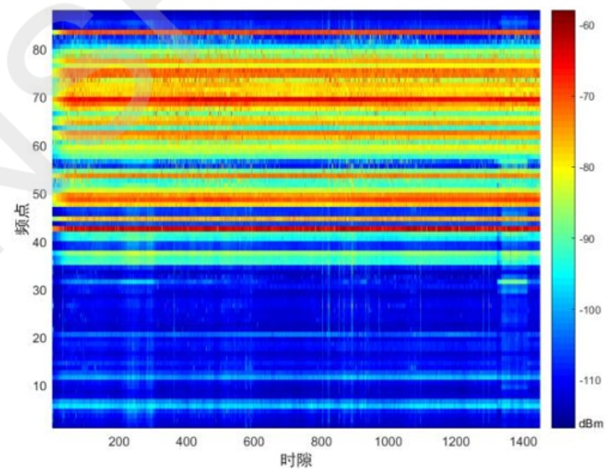

(a)频谱状态演化（885-965MHz）

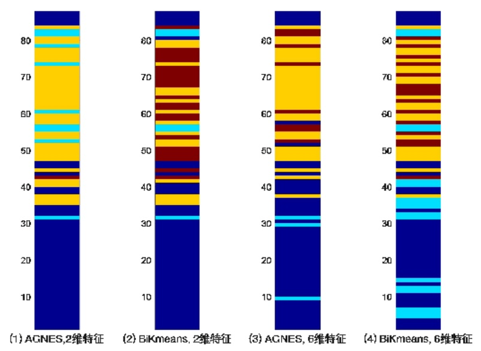

(b)两种聚类算法的聚类结果，目标簇数设置为4

图 28 利用 AGNES 和 BiKmeans 算法进行频谱状态演化聚类的结果

为了进行频谱预测，需要对频谱数据进行自相关性分析，以验证所采集数据的可预测性。因此，对于使用频谱分析仪及移动设备采集的频谱数据，分别进行了自相关性计算并分析。如下图所示，时域上，展现出较强的自相关性，即未来的某个时刻的状态可由历史时刻的状态进行预测。

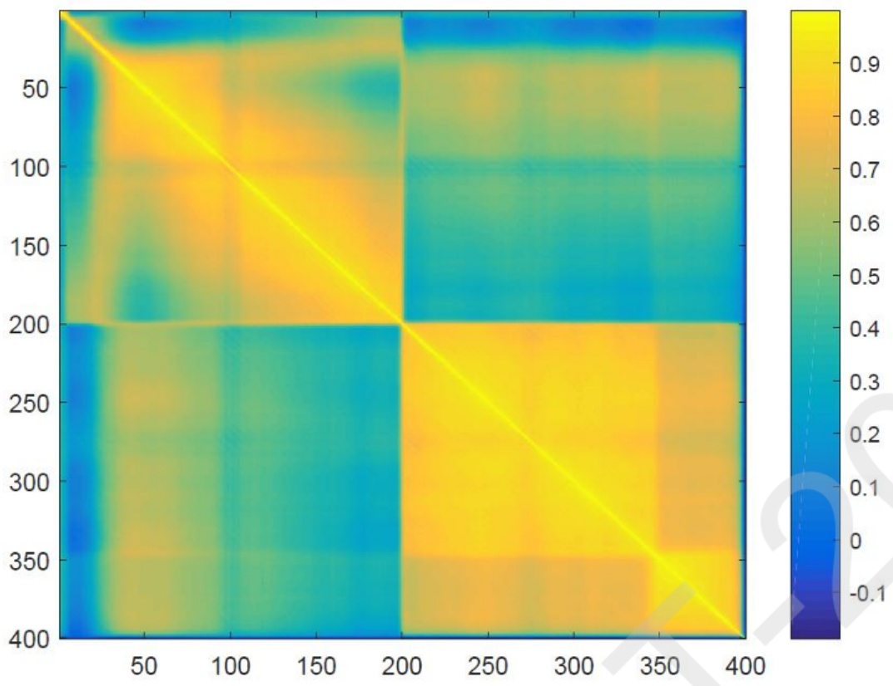

(a) 频点间相关性

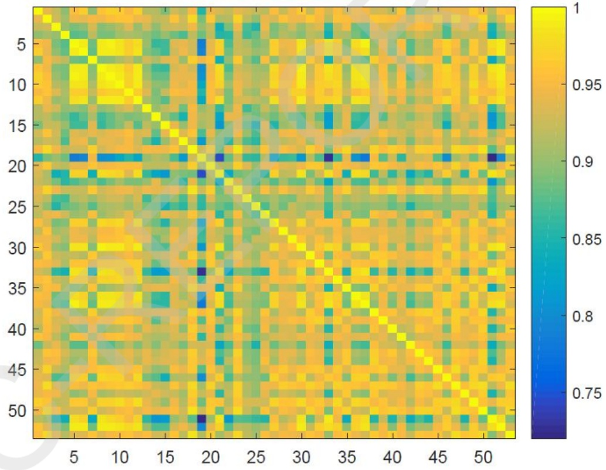

(b)1 小时内每分钟之间相关性

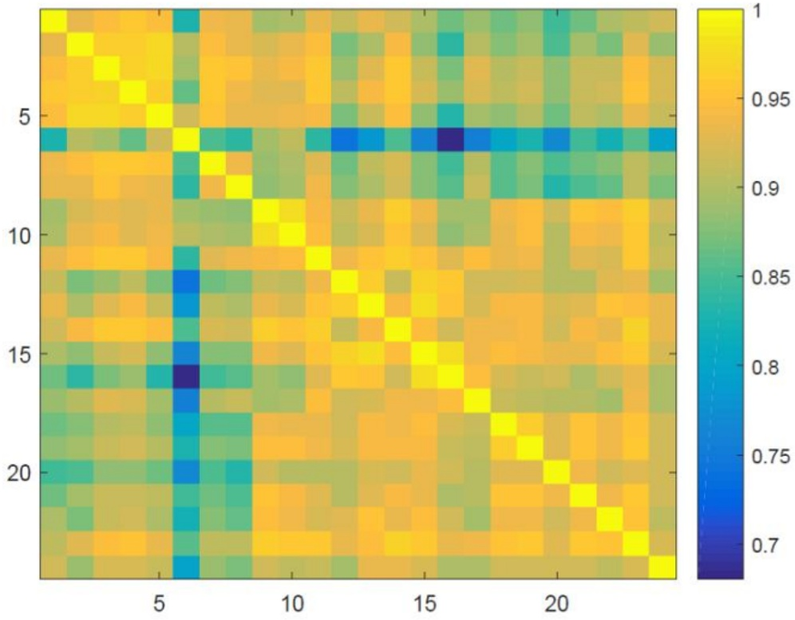

(c)24 小时之内每小时之间相关性

图29频谱分析仪采集数据自相关性分析

如下图所示，对移动设备采集信号覆盖数据进行自相关分析，该设备在该频点上的信号接收强度在时域上具有较强的相关性，验证了其可预测性。

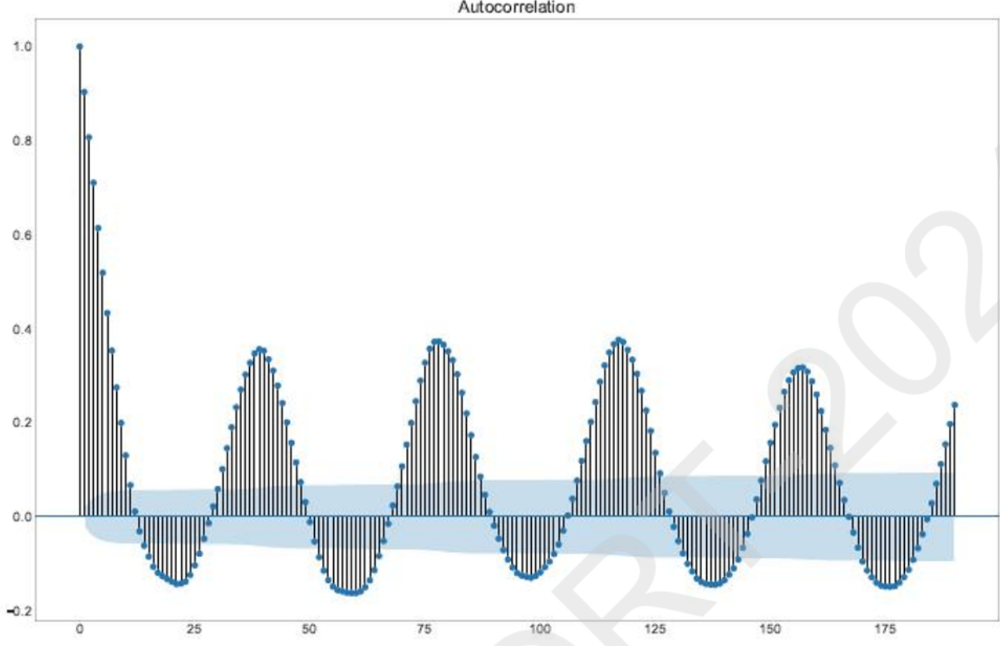

图30移动设备采集数据自相关性分析

## （2）面向网络单频点跨频段数据增强的深度迁移学习预测

针对数据稀缺条件下的单频点频谱预测问题，提出了基于深度迁移学习的跨频段数据增强方法。首先，通过对业务活动的分析和基于动态时间归整计算各频点数据之间的欧式距离，验证了频带之间的相似性和频谱数据的可预测性；其次，利用迁移成分分析，探讨了在跨频段频谱预测中影响迁移学习性能的主要特征；进一步，验证了所提数据增强方法在跨频段单频点频谱预测中的有效性；对实测频谱数据的分析结果表明，在历史频谱数据有限的情况下，所提方法性能优于现有深度学习模型。

首先，通过对不同频段数据的分析，提出了一种基于测量各频段服务活动相似度的频谱数据增强迁移学习策略。其次，为了保证正向迁移分析了每个源域数据集和每个目标域的数据集之间频谱数据的相似，并基于动态时间规整(Dynamic Time Warping，DTW)测量源域和目标域之间的每个频率点的相似性，在时域维度上，分析了基于特征分布的源域数据和目标域数据的相似性分析。在动态时间归整的基础上，采用迁移成分分析（Transfer Component Analysis，TCA）方法对源域数据和目标域数据进行映射，并进行降维后得到最具有可迁移性的特征。

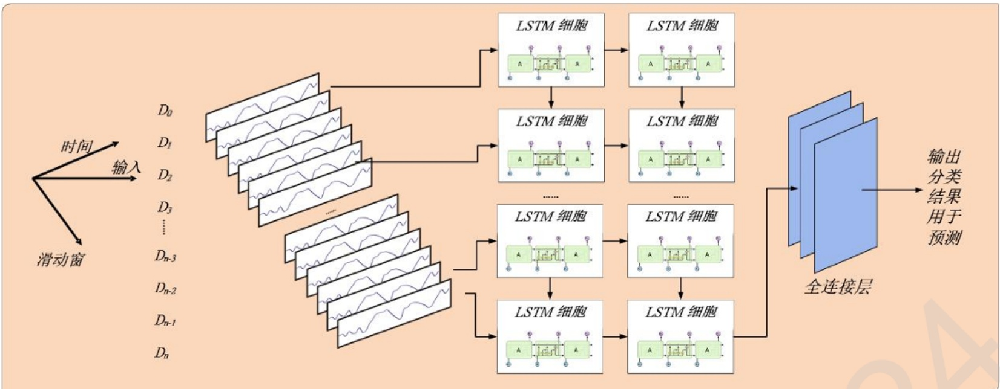

(a) 长短期记忆网络的频谱预测模型

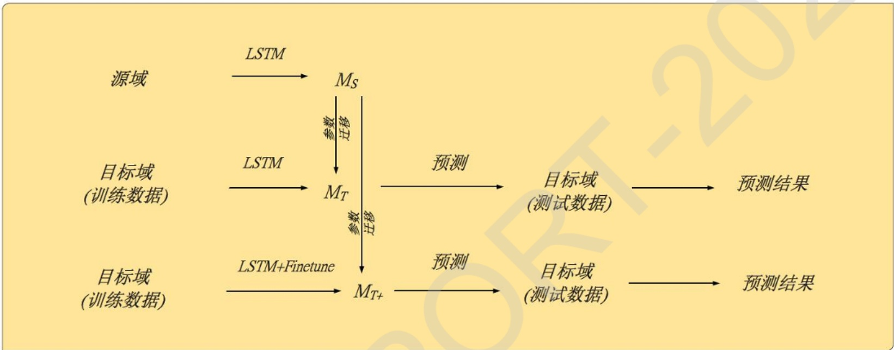

(b) 深度迁移学习模型用于频谱预测的比较实验

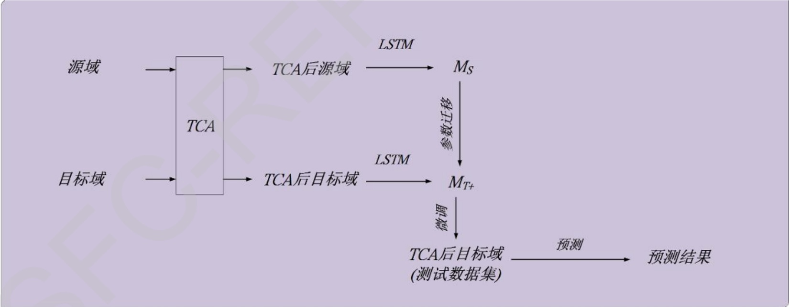

(c) 迁移成分分析的比较实验

图31 基于深度迁移学习的单频点频谱预测数据增强实验框架

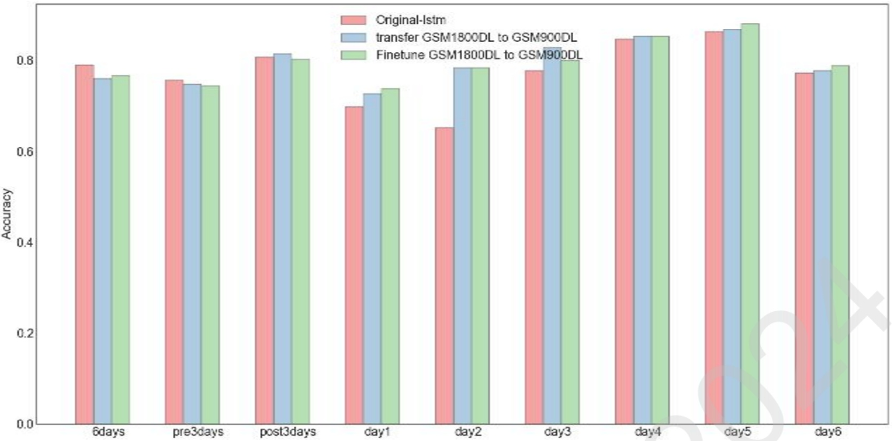

(a) 从 GSM1800 下行频段迁移至 GSM900 下行频段的跨频段频谱预测准确率

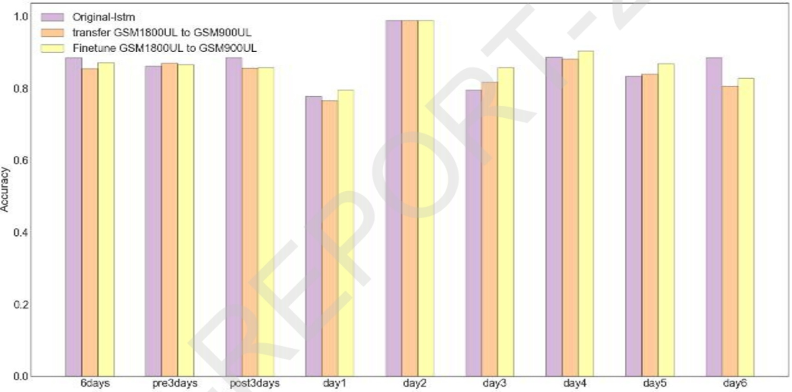

（b）GSM1800上行频段迁移至 GSM900上行频段的跨频段频谱预测准确率

图32不同跨频段频谱预测实验组的准确率

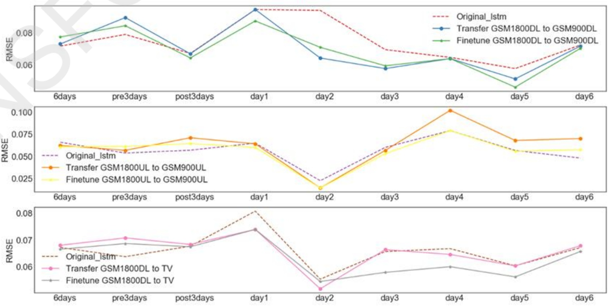

图33 深度迁移学习用于跨频段频谱预测实验的 RMSE

## （3）面向网络多频点跨频段预测的生成式迁移学习

针对数据稀缺条件下的多频点频谱预测问题，提出了基于生成对抗网络与深度迁移学习的多频点跨频段数据增强方法。首先，通过对真实频谱数据进行相关分析。在此基础上，基于生成对抗网络和深度迁移学习，提出了一种用于历史数据稀缺条件下频谱预测的跨频段数据增强框架。该框架的核心思想是通过预先训练好的DCGAN生成与目标数据高度相似的数据，并通过深度迁移学习来扩充这些数据。进一步通过引入 Frechet Inception 距离（Frechet Inception Distance，FID）评估度量，对真实频谱数据的实验，验证了提出的数据增强框架能够生成与原始数据高度相似特征分布的数据。

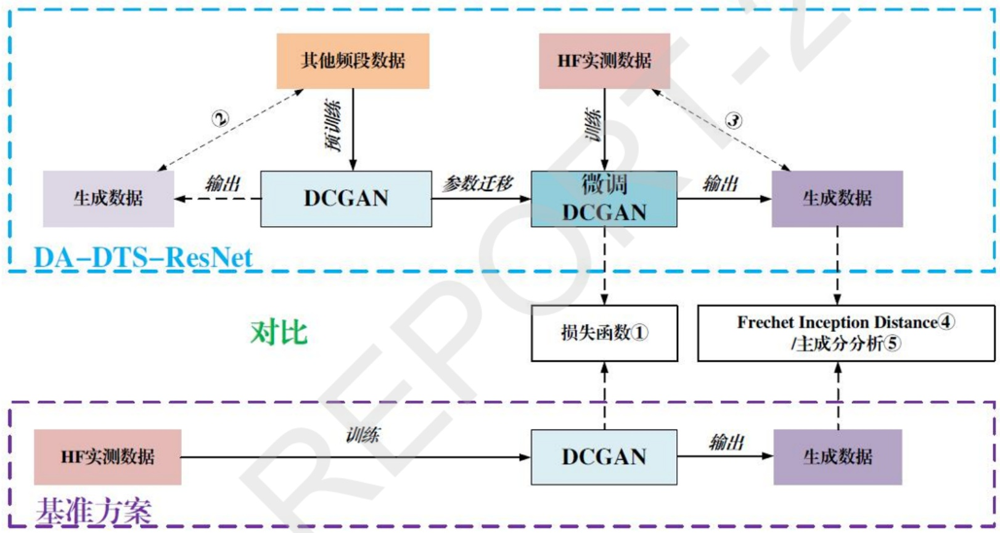

(a) 验证数据稀缺条件下所提出框架能生成更相似的数据

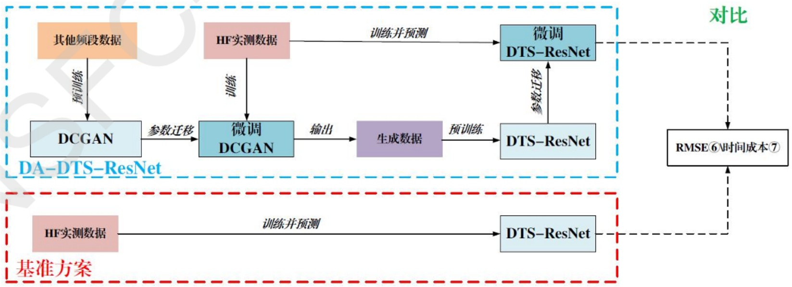

（b）验证数据稀缺条件下所提出框架有效提升频谱预测性能

图34基于生成对抗网络和深度迁移学习的频谱数据增强框架

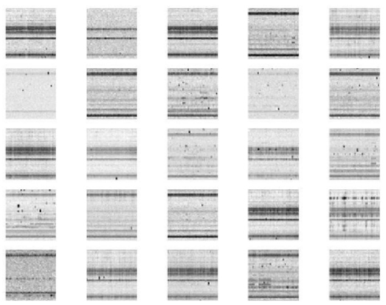

（a）GSM900UL 真实数据

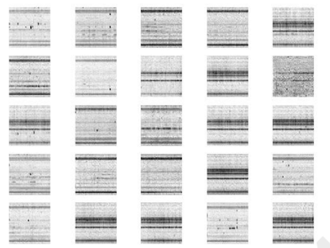

（b）GAN 生成的数据（epoch=3000）

图 35 用 GSM900UL 数据预训练的 GAN 的生成数据与真实数据对比

## 2.3 动态稀缺信道资源群智决策

对于动态稀缺信道资源群智决策的研究主要围绕面向联盟架构的信道资源分层决策模型、基于知识迁移的联盟间快速稳健资源决策和基于强化学习的联盟内自主信道接入控制三个方面展开，主要进展与重要成果如下图所示。

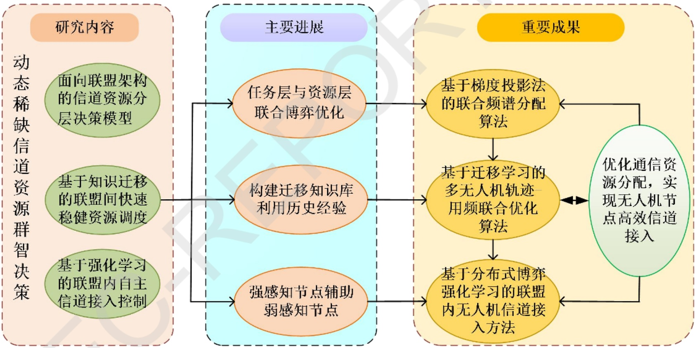

图36动态稀缺信道资源群智决策研究进展与主要成果

## 2.3.1 面向联盟架构的信道资源分层决策模型

多架无人机组成联盟协同完成任务可以有效地提高任务完成效能。然而，面对复杂多变的任务执行环境，由于任务的突发性、时变性，会使得无人机联盟分区发生变化，用频需求随之发生改变。在频谱资源动态稀缺的条件下，任务层与资源层的紧耦合关系，导致频谱利用率低，自主调整能力弱。本项目针对上述问题，重点探索任务层与资源层的联合博弈优化方法。具体而言，首先考虑侦察任务特性、无人机任务完成能力、可用频谱资源等因素导致的异构任务需求，提出任务完成效能评估模型。然后，运用联盟博弈模型，突破传统帕累托准则与自私准则的极端约束，提出了期望联盟互利准则。最后，提出了一种联合频谱分配与联盟形成算法，使得各无人机可自主选择执行任务并进行合理的频谱分配。

考虑一个由N个无人机组成的网络，其中多个无人机形成联盟来协同地执行侦察任务。记网络中任务集与无人机集分别为 $\mathcal { M } = \{ 1 , 2 , . . . , M \}$ 和 $\mathcal { N } = \{ 1 , 2 , . . . , N \} \; .$ O如下图所示，首先，各无人机独立地选择一个任务并进行信息采集，然后顺序地将其采集的信息发送给其联盟头进行数据融合。在任务执行过程中，假设联盟内使用时分多址接入或令牌环等方式，因此不存在联盟内相互干扰。 1

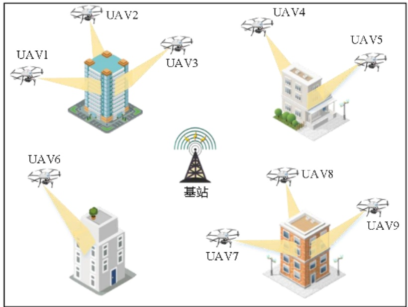

(a) 各联盟成员单独进行信息采集

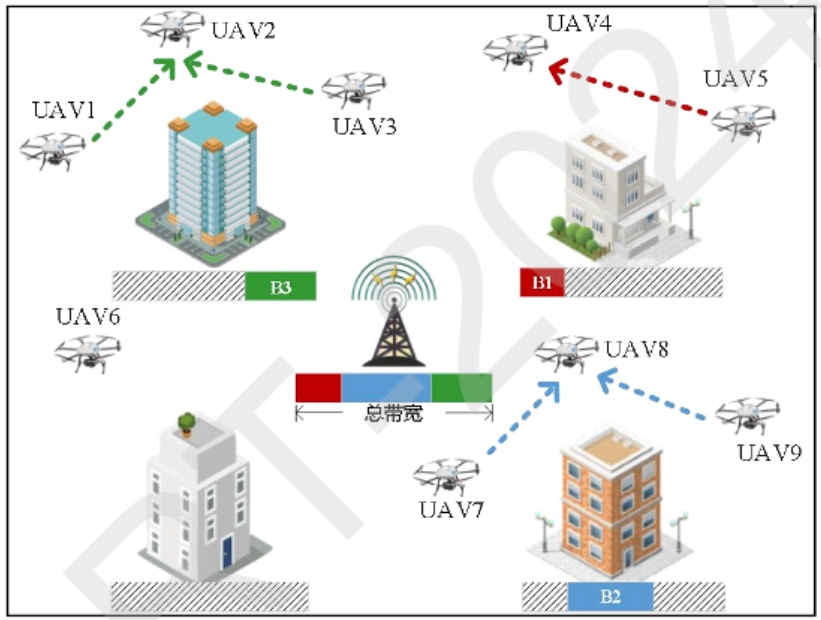

(b) 联盟内信息融合

图37 多无人机协同执行侦察任务示意图

将多无人机协同侦察问题构建为一个可转移效用（Transferable Utility,TU）的联盟形成博弈问题。可转移效用联盟博弈表示联盟成员可按照任何适当公平的规则对联盟效用进行分配。在所构造的联盟博弈中，无人机作为博弈参与者，其动作为侦察任务的选择。联盟 $S _ { i }$ 的收益定义为:

$$
v _ { R } ( S _ { i } ) = \left[ 1 - \prod _ { j \in S _ { i } } ( 1 - P _ { j } ^ { i } ) \right] \cdot V a l ( i ) .\tag{20}
$$

联盟 $\mathcal { S } _ { i }$ 的代价则定义为:

$$
v_{C}(\mathcal{S}_{i}) = \left\{ \begin{aligned} \bar{\xi} \cdot \left[ T_{s}(i) + \frac{(|\mathcal{S}_{i}| - 1) \cdot \lambda(i)}{B_{i} \log_{2}(1 + \frac{p_{i}d_{i}^{-\delta}}{B_{i}N_{0}})} \cdot (A_{0} + A_{1}) + \rho \cdot Risk(i), \quad |\mathcal{S}_{i}| > 1 \right] \\ \bar{\xi} \cdot T_{s}(i) \cdot (A_{0} + A_{1}) + \rho \cdot Risk(i), \quad |\mathcal{S}_{i}| = 1 \end{aligned} \right.\tag{21}
$$

因此，定义联盟 $S _ { i }$ 的价值函数为收益与代价之差，即:

$$
v(\mathcal{S}_{i}) = v_{R}(\mathcal{S}_{i}) - v_{C}(\mathcal{S}_{i}).\tag{22}
$$

联盟的价值函数代表了整个联盟可获得的收益。在可转移效用联盟博弈中，联盟获得的收益可以按照一定的分配规则分配给各联盟成员。本项目采用平均分配准则，各无人机效用为:

$$
u _ { j } ( \mathcal { S } _ { i } ) = \frac { v ( \mathcal { S } _ { i } ) } { \left| \mathcal { S } _ { i } \right| } .\tag{23}
$$

传统的两类联盟形成准则均存在不足。帕累托准则考虑所有无人机的效用，但是约束性极强，当无人机想改变联盟选择时将受到其他无人机效用的约束而导致联盟分区受限。自私准则仅考虑改变联盟的无人机自身效用，可能会破坏其他无人机的效用。本项目提出一种期望联盟互利准则。其核心思想在于将受到策略改变影响的联盟内的无人机作为一个整体，无人机改变联盟选择时仅考虑该整体的效用，而忽略其他联盟中无人机的效用。其定义如下:

对于任一无人机 $j \in \mathcal { N }$ 和两个联盟 $\mathcal { S } _ { 1 } \subseteq \overline { { \mathcal { N } } }$ 和 $\mathcal { S } _ { 2 } \subseteq \mathcal { N }$ ，期望联盟互利准则定义如下动作:

$$
\begin{align*}\mathcal{S}_{1} \succ_{j} \mathcal{S}_{2} \Leftrightarrow u_{j}(\mathcal{S}_{1}) + \sum_{k \in \mathcal{S}_{1} \setminus \{j\}} u_{k}(\mathcal{S}_{1}) + \sum_{k \in \mathcal{S}_{2} \setminus \{j\}} u_{k}(\mathcal{S}_{2} \setminus \{j\}) \\> u_{j}(\mathcal{S}_{2}) + \sum_{k \in \mathcal{S}_{1} \setminus \{j\}} u_{k}(\mathcal{S}_{1} \setminus \{j\}) + \sum_{k \in \mathcal{S}_{2} \setminus \{j\}} u_{k}(\mathcal{S}_{2}).\end{align*}\tag{24}
$$

该准则中，当无人机i加入新联盟，无人机i以及离开和加入联盟中的无人机总效用在提升。根据上述分析可知，无人机的效用不仅由任务选择决定，还由各联盟的频谱分配决定。当联盟分区改变时，联盟中的传输数据量会相应改变，此时需要频谱的重新分配以保障任务的执行。提出了以下带宽重新分配规则。

给定联盟分区 $\mathcal { S } = \left\{ \mathcal { S } _ { 1 } , \mathcal { S } _ { 2 } , \ldots , \mathcal { S } _ { M } \right\}$ ，无人机j期望离开当前联盟 $S _ { i }$ 并加入新联盟$S _ { n }$ ，此时联盟 $\mathcal { S } _ { i }$ 和 $S _ { n }$ 拥有的总频谱带宽将进行重新分配。同时，其他联盟的频谱分配保持不变。带宽重新分配规则只需要在发生成员变化的联盟内进行，因此可以减轻基站的负担，并进一步促进联盟的形成。

本项目提出基于梯度投影法的联合频谱分配与联盟形成算法，该算法由各无机单独执行，是一种分布式的学习算法。在每次迭代中，任意选择一个无人机进行策略的更新。首先，选定的无人机会随机选择一个任务，并根据带宽重新分配后的结果，探索其预期的效用值。之后，选定的无人机在期望联盟互利准则下进行效用的比较，来决定是留在原有联盟执行当前任务还是加入新联盟去执行其他任务。联盟形成与带宽分配之间的相互关系如下图所示。无人机首先通过探索一个新任务更新当前无人机网络的联盟分区。当所选任务确定时，与任务相关的属性（例如任务收益与风险）也随之确定。优化了联盟的带宽分配之后，其反过来会影响无人机的效用，以影响联盟的形成过程。因此，无人机将继续更新其联盟分区。通过反复迭代，直到收敛到最终的稳定联盟分区，在这个状态下任何一个无人机都不会偏离其当前的任务选择。

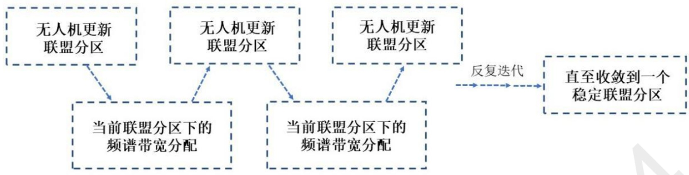

图38联盟形成与带宽分配之间的相互关系示意图

仿真实验中考虑一个如图39所示的多无人机协同侦察任务执行场景。具体地，考虑一个 $1000\mathrm{m} \times 1000\mathrm{m} \times 500\mathrm{m}$ 的立方体任务区域内共有10个无人机与4个地面任务。每个任务的任务属性各不相同。以任务1为例，其属性为(7.5,1.2,50,0.5)，分别表示任务价值 $V a l ( 1 ) = 7 . 5$ ，任务危险系数 $Risk(1) = 1.2$ 联盟内所需传输数据量为λ(1)=50，以及任务固定完成时间 $T_{s}(1) = 0.5$ 。在图39中，每个圆代表一个联盟，里面的点则代表拥有不同任务完成概率的无人机，例如执行任务1的两个无人机的任务完成概率分别为0.6和0.8。此外， 为确保联盟内的通信，将频谱带宽分配给每个任务，例如任务4拥有5MHz的带宽。

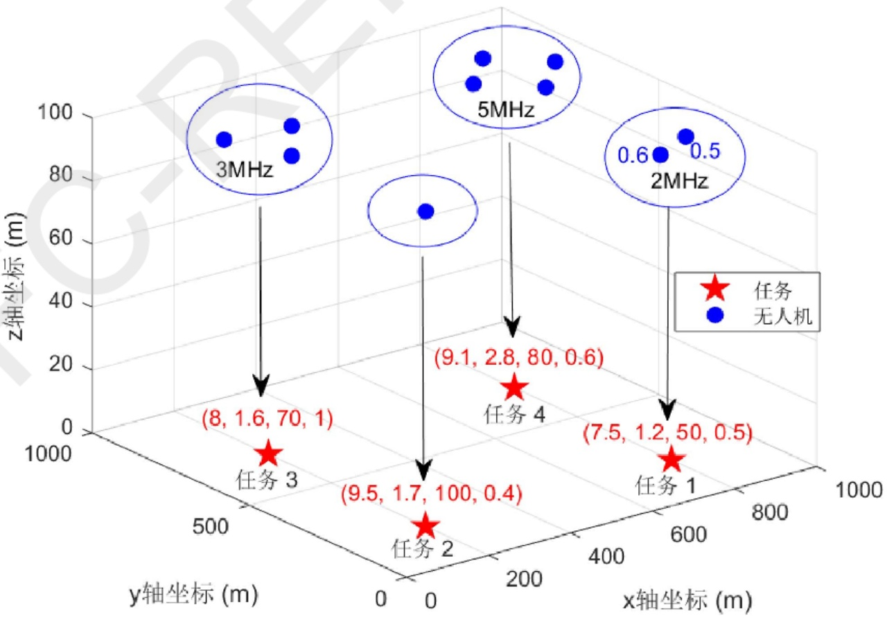

图39多无人机协同侦察任务仿真场景示意

## （1）不同偏好关系下的收敛性能

下图显示了传统帕累托准则、传统自私准则以及所提期望联盟互利准则下的网络收敛性能。仿真结果通过500次的独立实验并取其期望值获得。

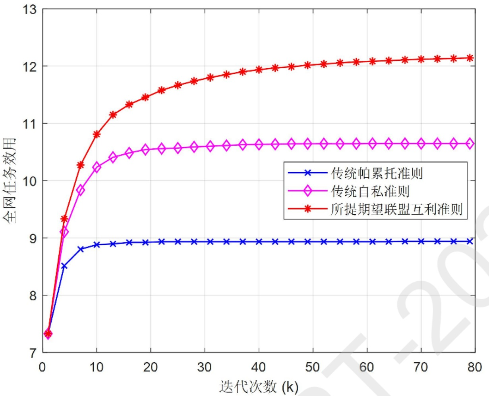

图40 不同偏好关系下的网络收敛性能

从图中可以看出，三种准则均衡很快收敛到稳定联盟分区。此外，尽管所提期望联盟互利准则的收敛速度略慢于其他两种准则，但能获得最高的全网任务效用。其原因在于，在帕累托准则下，无人机自身联盟选择的改变不但要使得自身效用增加，同时要保证也不会破坏任何一个在当前联盟或新联盟中的无人机的效用。因此，其强约束使得无人机在进行联盟尝试时受到了极大的制约，陷入局部最优。相比之下，尽管自私准则使得无人机更有可能离开原来的联盟去获得更好的效用，但会破坏其他无人机的效用。在所提期望联盟互利准则下，无人机通过局部的合作既限制了无人机的过度自私，又减少了其尝试新联盟时的约束。

## （2）全网任务效用性能

下图展示了全网任务效用和各无人机任务执行概率之间的关系对比。

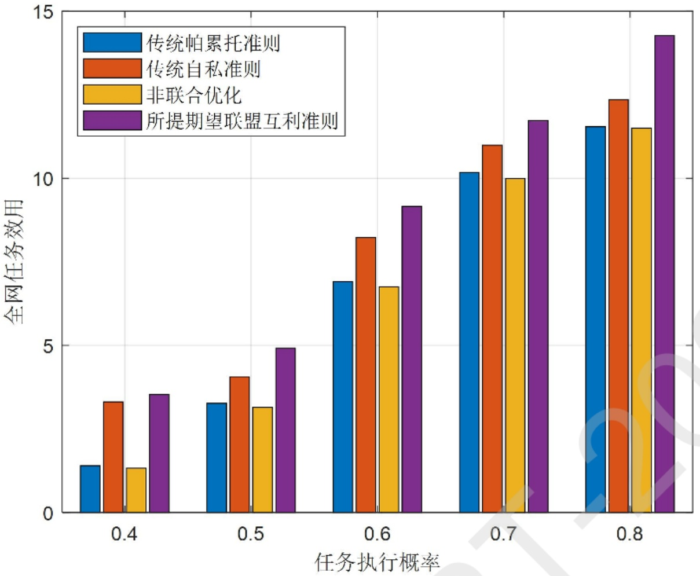

图41 全网任务效用和各无人机任务完成概率之间关系

从图中可以看出，随着任务完成概率的增加，全网任务效用呈现上升趋势。其原因在于，完成概率越高，任务收益越高。此外，还可得出以下结论:1）所提期望联盟互利准则的性能优于其他两种传统的偏好关系；2）所提的联合优化方案在三种偏好关系下均优于非联合优化方案。但由于帕累托秩序的强约束性，其性能最低，且接近于非联合优化方案。

图42和图43分别表示全网任务效用和各任务平均效用和任务数目之间的关系。可以看出，全网任务效用随着任务数量的增加而增加，其原因在于当网络中可选任务增多时，每个无人机可以有更适合的任务选择。具体地，网络中任务的异构性会导致各任务的收益与代价不尽相同。因此，当任务数量增多时，无人机可根据当前情况选择收益大代价小的任务从而提高自身收益。但是当任务数远大于无人机数时，由于无人机数目有限，某些任务无法由无人机执行，因此全网任务效用不会有显著的提升。然而，当任务数从2增加至16时，各任务平均效用先上升后下降。其原因在于，随着任务的增加，无人机选择更适合的任务，并通过协作来提高任务的效用。然而，当任务数量急剧增加时，会存在无人机单独完成任务甚至有些任务无法被完成，因此降低了各任务平均效用。

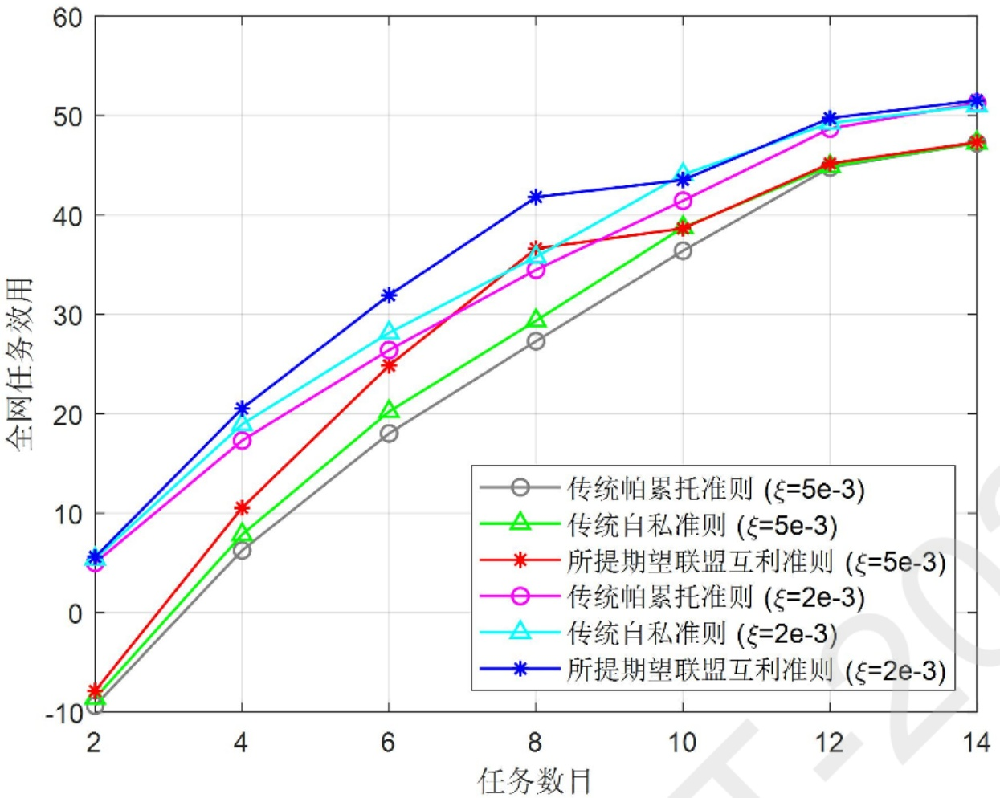

图42 全网任务效用和任务数目之间关系

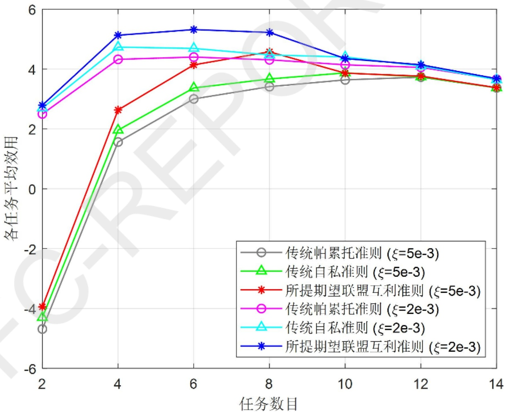

图43各任务平均效用和任务数目之间关系

## 2.3.2 基于知识迁移的联盟间快速稳健资源决策

多无人机在频谱资源紧张情况下与地面用户间的通信将面临“内忧外患”，无人机在规划自身飞行轨迹的同时需同步进行高效用频决策。一方面地面用户很可能分布较为密集，各无人机在进行下行传输时需要尽可能选择不同频段以减少互扰，另一方面各无人机需要躲避源自外部的恶意干扰攻击。此外，考虑到现实环境中任务的突发性，预留给无人机的部署时间非常有限。针对上述问题，本项目提出异构双网络架构进行用频-轨迹联合决策，并构建迁移知识库收集历史任务经验，通过迁移学习加速无人机训练过程。最终，实现无人机集群通信资源的快速、稳健配置。

考虑一个如图所示的无人机与地面用户间下行通信场景，N架无人机需向M个地面用户传输侦察信息，可用通信频段数为P，环境中存在一个外部于扰机。通信系统中无人机的集合与地面用户集合分别表示为 $\mathcal { M } = \{ 1 , 2 , . . . , M \}$ 和$\mathcal { N } = \{ 1 , 2 , . . . , N \}$ ，通信频段集合为 $\mathcal { P } = \{ 1 , 2 , . . . , P \}$ 。无人机在与地面用户的通信过程中，一方面需要规划路线以尽可能靠近用户，另一方面需要进行用频决策以躲避外部干扰机的恶意攻击并尽可能减少系统中的互扰。地面用户分布较为密集，尽管同一架无人机可同时向多个用户传输信息而不造成互扰，但是同一频段的不同无人机会对非目标传输的用户造成互扰。

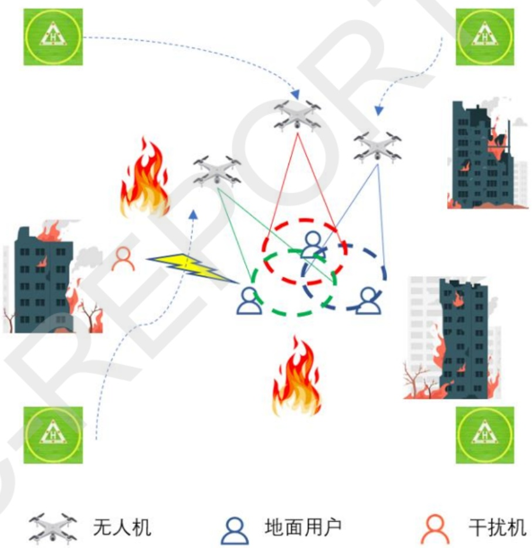

图44多无人机向地面用户传输侦察信息示意图

无人机飞行以及传输侦察信息的总时长为T，这段时间内包含E个等长的时隙，用于刻画无人机调整飞行动作和切换传输用户所需的最短时间。地面用户m在时隙t的通信速率 $r _ { m } ( t )$ 可以被表示如下，假设无人机k向其传输信息。

$$
r _ { m } ( t ) = B \log _ { 2 } ( 1 + \rho _ { m } ( t ) ) ,\tag{25}
$$

其中B表示分配给各地面用户的传输带宽，地面用户m的信干噪比可具体表示为:

$$
\rho _ { m } ( t ) = \frac { f _ { k , m } ^ { \mathrm { s p } } ( t ) P _ { t x } g _ { m , k } ( t ) } { I _ { m } ( t ) + I _ { j } ( t ) + N ( t ) } ,\tag{26}
$$

其中 $g _ { m , k }$ 表示无人机k到地面用户m的信道增益。 $P _ { \alpha }$ 为无人机的发射功率，N为加性高斯白噪声。 $f _ { k , m } ^ { s p }$ 表示无人机k对地面用户m的传输策略。

$$
f_{k,m}^{sp}(t)=\left\{\begin{aligned} 0, &  当无人机 k 不向用户 m 传输信息  \\ 1, &  当无人机 k 向用户 m 传输信息  \end{aligned}\right\}\tag{27}
$$

$I _ { m }$ 表示与用户m同频的其他无人机带来的互扰， $I _ { j }$ 表示用户m受到外部干扰机的恶意干扰攻击。

$$
I _ { m } ( t ) = \sum _ { j \neq k } f _ { j , m } ^ { \mathrm { s p } } P _ { \mathrm { t x } } g _ { m , j } ( t ) .\tag{28}
$$

$$
I _ { j a m } ( t ) = f _ { j a m , m } P _ { j a m } g _ { j a m , m } ( t ) .\tag{29}
$$

其中 $f _ { j a m , m }$ 用于指示地面用户m是否与干扰机同频。

为防止出现部分地面用户完被所有无人机忽视的极端情况，本项目采用Jain公平性指数评估系统的公平性，即用户接收传输情况的公平性:

$$
F_{\mathrm{fair}}(t)=\frac{\left(\sum\limits_{m=1}^{M} r_{m}(t)\right)^{2}}{M \sum\limits_{m=1}^{M} r_{m}(t)^{2}}\tag{30}
$$

不失一般性的，本项目采用公平性指数与所有用户的通信速率之和相乘后的值作为性能性能评价指标，具体表达式如下:

$$
\eta _ { \mathrm { s y s t e m } } ( t ) = F _ { \mathrm { f a i r } } ( t ) \sum _ { m = 1 } ^ { M } r _ { m } ( t ) .\tag{31}
$$

本项目的目标是在无人机发射功率有限的情况下，通过调整无人机的飞行轨迹与对用户的传输策略最大化用户的公平性加权速率和，具体优化问题可通过下列公式表示:

$$
\mathrm { m a x } _ { a _ { \mathrm { U A V } } , f _ { k , m } ^ { \mathrm { s p } } } \eta _ { \mathrm { s y s t e m } } ,\tag{32}
$$

$$
x_{\min} \leq x_{\mathrm{UAV}_{\mathrm{k}}} \leq x_{\max}, y_{\min} \leq y_{\mathrm{UAV}_{\mathrm{k}}} \leq y_{\max},\tag{33}
$$

$$
\sqrt{ \left( x_{_{ UAV _k}} - x_{_{ UAV _j}} \right)^2 + \left( y_{_{ UAV _k}} - y_{_{ UAV _j}} \right)^2 } \geq d_{_{ safe }}
$$

$$
\sqrt{ \left( x_{ UAV _k} - x_{obs} \right)^2 + \left( y_{ UAV _k} - y_{obs} \right)^2 } \geq d_{ safe 1}\tag{34}
$$

$$
\sum _ { k = 1 } ^ { K } f _ { k , m } ^ { \mathrm { s p } } \leq 1 , \forall k .\tag{35}
$$

其中， $a _ { \mathrm { U A V } }$ 是无人机的飞行动作，共有前进、后退、向右飞行、向左飞行、悬停五种可选动作。约束(33)表示各无人机只能在目标区域内飞行。约束(34)表示各无人机之间需要保持安全距离，一部分原因是出于安全考虑，另一部分原因则是为了尽量避免各无人机侦察区域的高度重叠。同时，无人机需要与障碍物保持安全距离以防止因碰撞导致无人机受损。约束(35)表示禁止出现多架无人机向同一用户传输信息的情况，避免出现资源冗余。

为解决上述优化问题，本项目提出基于异构双网络的无人机轨迹-用频联合优化算法，并通过构建知识库收集离线场景下的无人机决策经验，最终通过迁移学习加速无人机训练过程，实现无人机快速部署。

将多无人机与无线通信环境的交互过程建模为分布式部分可观测马尔可夫决策过程。各无人机被视为具备自主路径规划与用频决策的智能体，可切换自身飞行动作与传输所用的频段，通过地面用户的反馈评估当前动作的优劣，并不断进行调整。下面以无人机k，（其感知范围内存在无人机j，地面用户m）为例，说明过程中对多智能体而言最关键的三个元组:<局部可观测信息，动作，奖励>。

用频决策网络的局部观测:无人机自身位置，相邻无人机位置，干扰机当前占用的频段。其数学表达式如下:

$$
S_{ UAV-free _k} = \{POS_{ UAV _k},POS_{ UAV _j},I_{jammer}\}.\tag{36}
$$

轨迹决策网络的局部观测:该部分由四部分构成，无人机自身位置，相邻无人机的位置，感知范围内地面用户的状态，感知范围内障碍物的坐标。其数学表达式如下:

$$
S_{ UAV-traj _k} = \{ POS_{ UAV _k}, POS_{ UAV _j}, S_{ GW _m}, POS_{obs} \}.\tag{37}
$$

地面用户的状态 $S _ { \mathrm { G U _ { m } } }$ 具体包括三部分:地面用户的位置，通信速率以及指示函数(8)所表示的用户接收无人机传输的情况。具体数学表达式如下:

$$
S _ { \mathrm { G U } _ { \mathrm { m } } } ( t ) = \{ P O S _ { \mathrm { G U } _ { \mathrm { m } } } , r _ { \mathrm { m } } ( t ) , \sum _ { j } f _ { k , \mathrm { m } } ^ { \mathrm { s p } } \} .\tag{38}
$$

动作:无人机的飞行动作可以被定义为{前进，后退，向右飞行，向左飞行，悬停}。无人机的飞行高度 $h _ { \mathrm { U A V } }$ 保持不变，本项目只考虑无人机在水平方向的飞行轨迹。无人机的功率动作被定义为 $\{ 1 , 2 , . . . , P \}$ ，即各通信频段，每个无人机在一个时隙只能选择一个频段。

奖励:用频决策网络与轨迹决策网络在一个时隙内生成联合决策，两个网络之间则存在上下层关联，网络具体结构如图45所示。轨迹决策网络为上层网络，其策略受到用频与飞行动作的共同影响，其奖励值设定如下:

$$
\mathrm{recward}_{t r a j}=\eta_{\mathrm{system}}-\mathrm{penl}_{1}-\mathrm{penl}_{2},\tag{39}
$$

$\mathrm { { \tt p e n l } _ { i } }$ 是无人机之间的碰撞惩罚项， $\mathrm { { \tt p e n l } } _ { 2 }$ 是无人机与障碍物之间的碰撞惩罚项。

用频决策网络为下层网络，其策略仅与自身产生的用频选择相关，其奖励值设定如下:

$$
\mathrm { r e w a r d } _ { f r e q } = - \mathrm { p e n l } _ { 3 } - \mathrm { p e n l } _ { 4 } ,\tag{40}
$$

penl3表示无人机与干扰机同频惩罚项，以促使无人机躲避干扰机的攻击。penl4表示无人机间同频惩罚项，以鼓励各无人机尽量不使用相同频段。

本项目采用QMix架构作为多无人机的训练框架以实现分布式轨迹决策。在训练阶段，通过一个混合网络接收各无人机的动作效用值和当前的全局状态，该混合网络输出所有无人机联合动作的效用值以指导各无人机网络参数的更新。在执行阶段，各无人机保留了训练期间学到的全局最优策略，不再需要全局状态信息，各无人机仅通过局部观测信息就可独立进行轨迹规划。

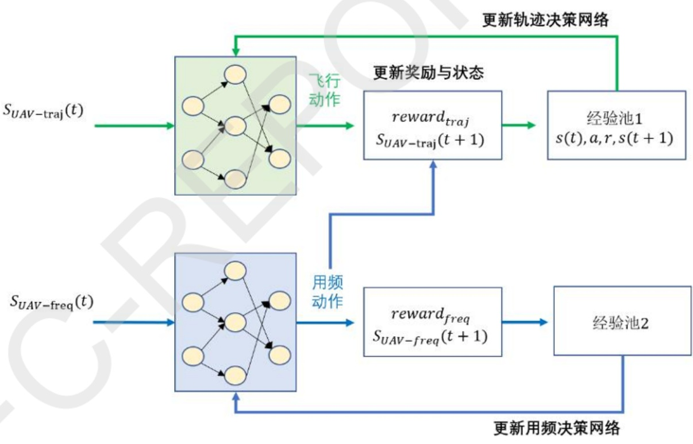

图45 无人机异构双网络结构图

仿真实验中考虑一个如图39所示的多无人机进行下行传输的场景。具体而言， 1000m×1000m的目标区域内共有4架无人机（红色圆，UBSs）与6个地面用户（蓝色三角，GTs），地面用户分布较为集中。场景中分布着一些建筑物（黄色表示高建筑物，绿色表示矮建筑物），无人机在飞行过程中需要与之保持安全距离。各无人机发射功率为10dBm，于扰机发射功率为20dBm，可用频段数为4，干扰机在每个时隙会施放跳频干扰，占用其中1个频段。

下图展示了消除互扰前后无人机飞行轨迹图，用户高密度场景下的互扰不意味着无人机完全无法向地面用户传输信息。但是无人机为躲避互扰会不断在目标区域附近调整自己的位置，这显然会延长算法的收敛时间且消耗无人机的能量。更不利的是，部分无人机可能选择远离目标区域以降低全体无人机的互扰，造成了资源的巨大浪费。而采用所提出的轨迹-用频联合优化方法后，各无人机则迅速到达了目标区域，并稳定的向地面用户传输侦察信息。

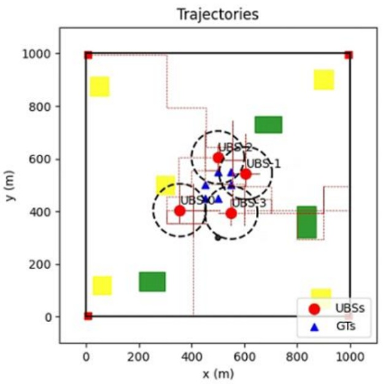

消除互扰前

(随机用频策略)

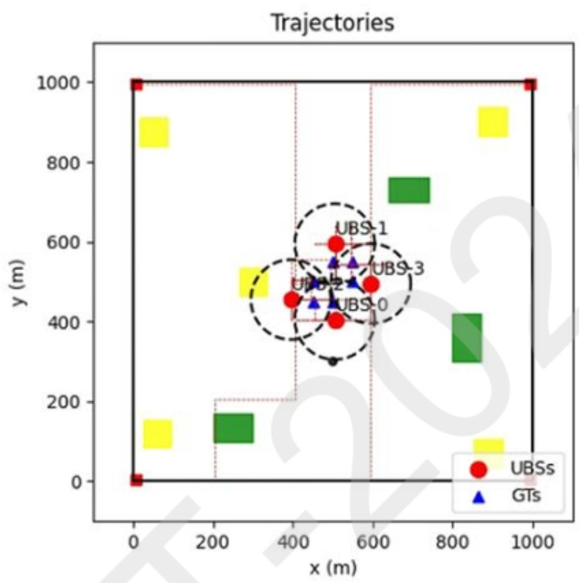

消除互扰后

(联合优化)

图46 消除互扰前后无人机飞行轨迹图

下图对比了抗互扰场景下不同算法的综合性能，随机用频策略在后期上限低于联合优化，不断变化的互扰关系将迫使无人机不断调整自己的位置。此外，后期的性能下降反映了随机策略带来的不稳定性。传统联合优化策略的收敛速度比随机用频策略更缓慢，显然受到了超大动作空间的影响，其动作空间尺寸为可用频段数量乘以飞行动作数量。而本项目所提出的异构双网络联合优化方法为轨迹决策网络与用频决策网络分配了独立的动作空间，避免了因动作空间过大导致的探索效率低下。

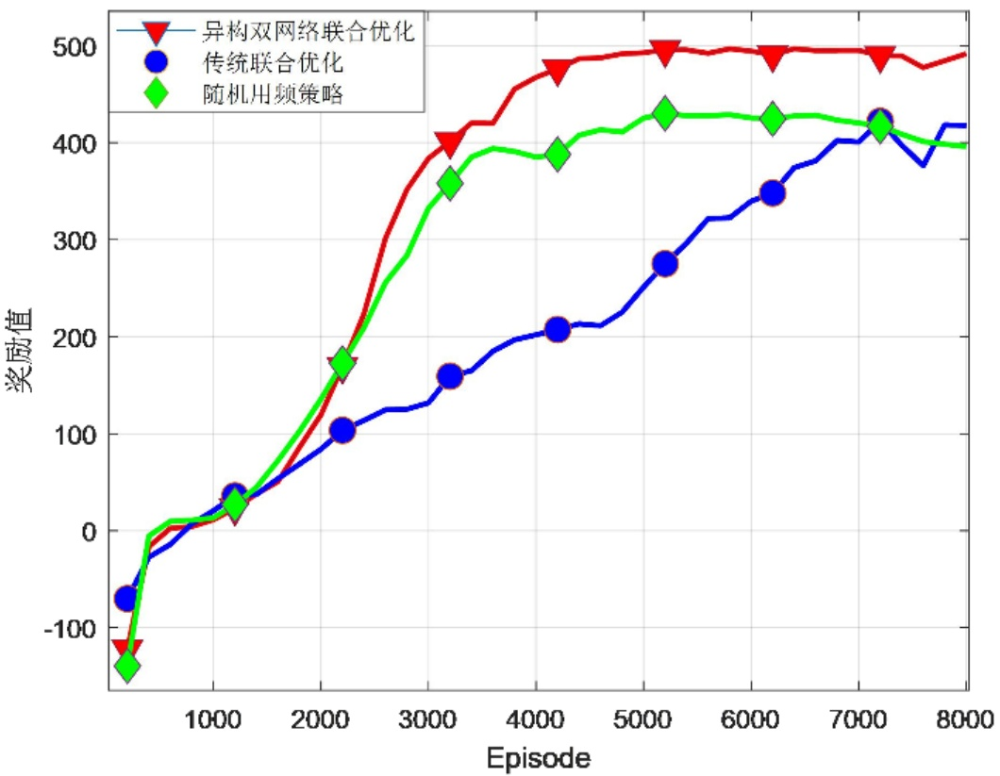

图47 互扰场景下算法性能对比

下图对比了加入外部干扰后不同算法的综合性能，此时随机用频策略已经接近完全失效，与外部干扰同频的无人机几乎无法向地面用户传输任何信息。传统联合优化方法的收敛速度与所提异构双网络联合优化方法的收敛速度差距更大，表明在更加复杂的频谱环境下巨大动作空间对智能体学习能力的影响更为严重。对比图中的抗互扰场景，异构双网络联合优化方法即使在加入外部干扰后依然保证了各无人机良好的传输性能，其泛用性也优于传统联合优化方法。 1

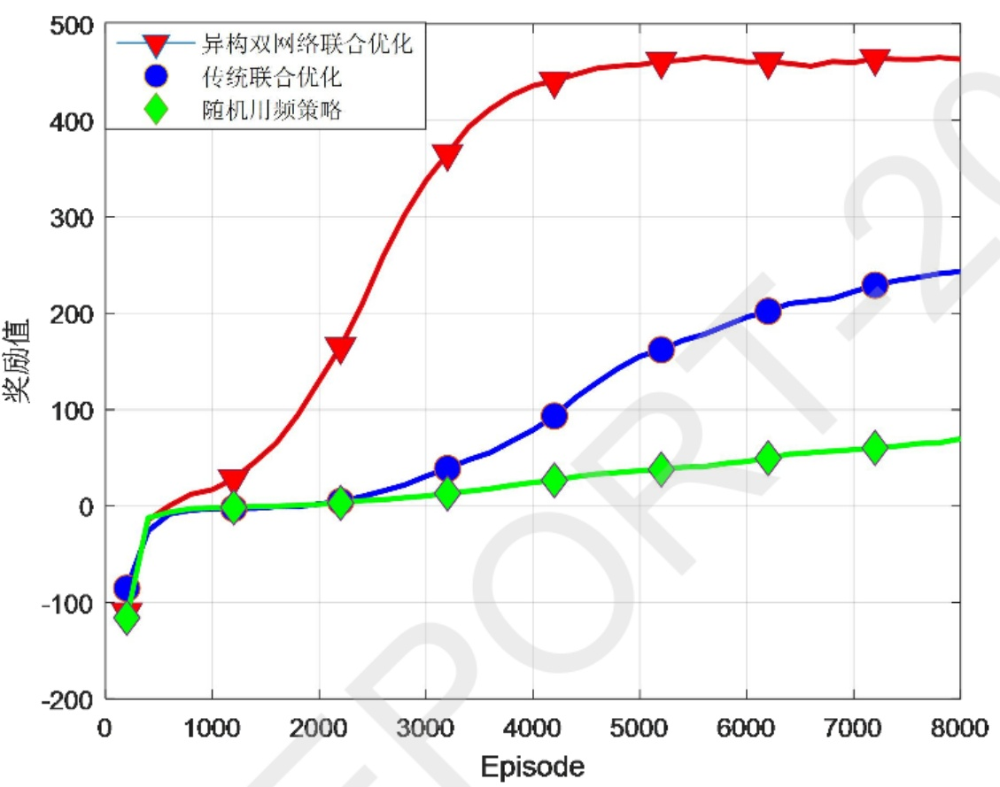

图48干扰场景下算法性能对比

## 2.3.3 基于强化学习的联盟内自主信道接入控制

大规模无人机集群自组网因节点数量多、网络动态变化，往往在MAC层面临严重的接入冲突。且在实际应用场景中，各无人机的感知能力不完全相同，很可能存在部分节点感知能力较弱，难以完全感知到环境中所有信道的情况，在面临外部干扰时无法形成有效的用频策略。针对上述问题，本项目将分为两部分以说明具体解决方案。在第一部分，提出基于碰撞发现的联盟内无人机信道接入方法，设计无二义性且稳定的无人机自组网MAC接入协议，减少无人机信道接入过程中的冲突。在第二部分，基于“强感知”节点辅助“弱感知”节点的核心思想设计多用户协同抗干扰接入方法，并通过USRP硬件平台验证所提方法的有效性。

## （1）基于碰撞发现的联盟内无人机信道接入方法

考虑联盟内有N架无人机，由于信道资源有限，无人机之间以半双工的方式进行交互。为了避免发生碰撞，联盟内无人机采用TDMA的方式接入信道，将一帧划分成若干个时隙，无人机选择一个时隙进行信息传输。

如图49所示，由于没有中心节点，需设计MAC接入协议以减小无人机的碰撞:将一个时隙划分为三个子时隙，第一个子时隙内，选择该时隙的无人机进行广播，其余无人机保持监听；在第二个子时隙内，无人机获取碰撞反馈，该子时隙进一步划分为k个小时隙，广播过的无人机随机选择r个小时隙发射1比特信号，并在剩余的k-r个小时隙里侦听，同时，接收失败的无人机在所有k个小时隙内发射1比特信号，因此，若广播者监听到了信号则说明消息发生了碰撞；在第三个子时隙内，成功接收到消息的无人机发射信号。该协议无需信息交互即可获得信道时隙占用情况，适用于动态无人机网络。

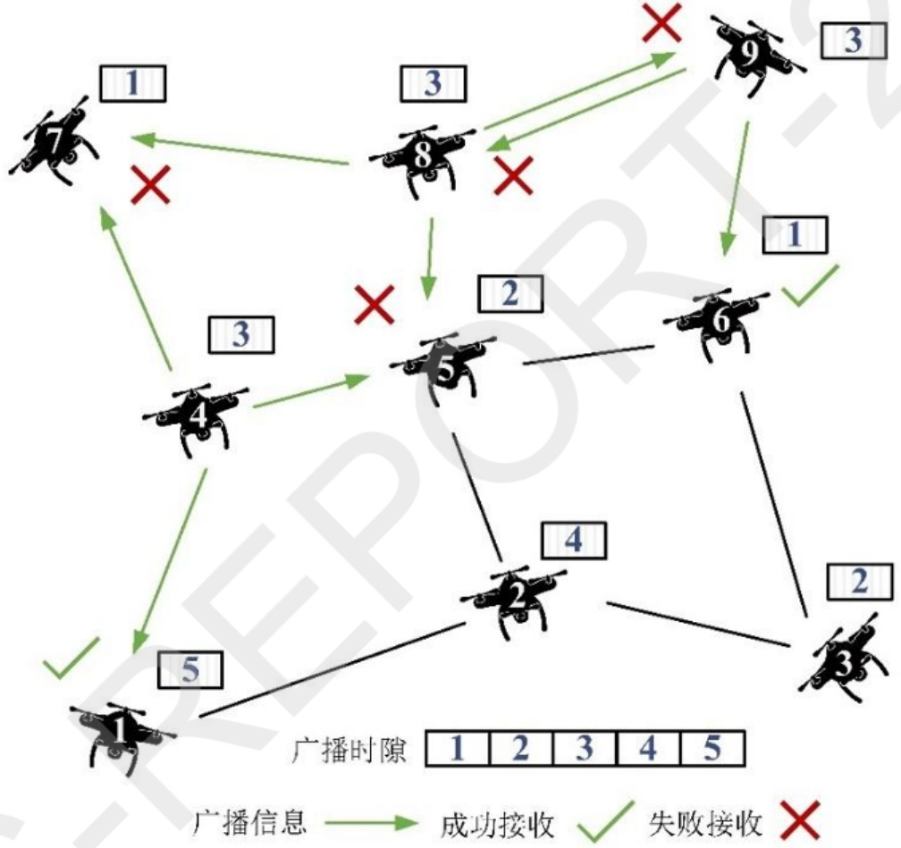

图49无人机联盟内信息交互示意图

无人机联盟网络内部，无人机i的消息碰撞分为主邻居碰撞和次邻居碰撞，表示为 $s _ { i } = s _ { i p } + s _ { i s }$ ，全网所有无人机碰撞次数可表示为 $s = \sum s _ { i }$ ，因此，优化目标应表示为全网碰撞次数最小化。然而，在实际网络中无人机很难获取准确的消息碰撞次数。基于上述所提的碰撞发现机制，无人机虽然能够获知是否发生了碰撞，但是无法得知具体次数。此外，信道接入的目的是为了成功传输信息，因此，无人机联盟内信道接入问题可以表示为

$$
P = \arg \max H = \arg \max \sum H_{p}\tag{41}
$$

其中， $H _ { i }$ 表示无人机i是否传输成功，1表示成功，0表示失败。通过优化无人机的时隙接入，提升信道利用效率。

由于无人机网络缺少控制中心，无人机需要以分布式的方式进行接入，采用博弈强化学习方法进行分析求解。经理论分析，博弈为势能博弈，存在纳什均衡解。而后，设计基于同步最优响应方法求解。仿真结果如图50所示，在一个$10 km ^{\ast}10 km$ 的联盟中布设若干架无人机，由图可以看出，算法在约15次迭代后收敛，由于在每一次迭代中所有无人机同时更新，无人机的数量对两种算法的收敛速度影响较小。

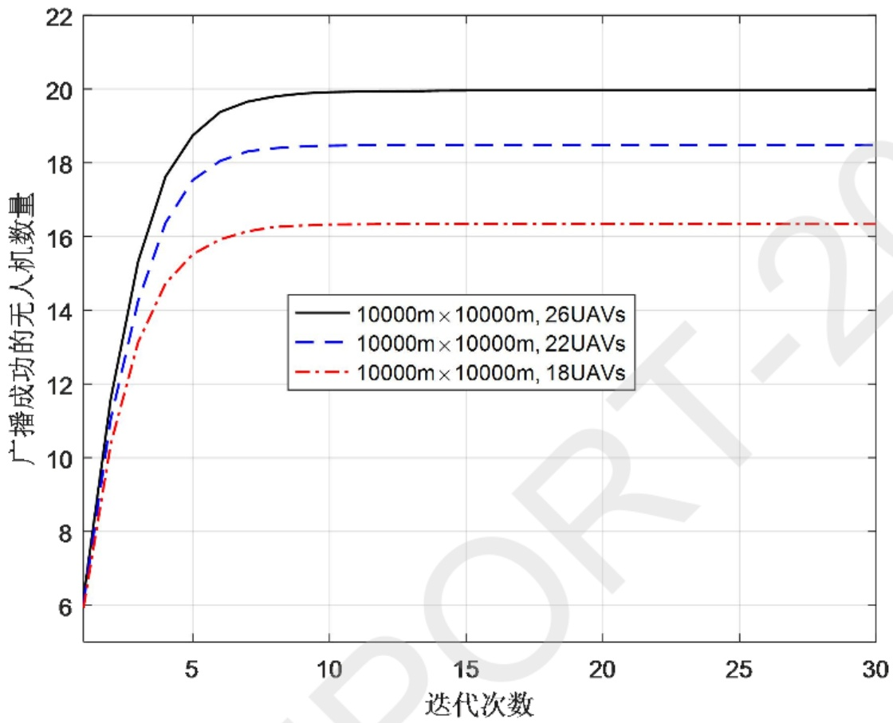

图 50 不同网络密度下算法收敛性能对比

## （2）多用户协同抗干扰硬件仿真平台

通过“强感知节点”辅助“弱感知节点”的方式实现多用户协同配合，以全面提升整个系统的抗干扰能力。在通信网络中某些用户可能因为硬件的限制存在感知频带窄的问题，不能完全感知环境中所有可用信道的情况。而一般来讲，没有宽带频谱感知能力的抗干扰算法在面对复杂干扰作用下，无论是收敛时间还是收敛效果远远不如拥有宽带频谱感知能力的算法。因此，对于拥有强感知节点的用户，其学习到的抗干扰经验及感知数据，都将有利于辅助弱感知节点的用户，其中感知数据为各信道所探测的平均功率情况 $\mathsf { P } ^ { \mathsf { A } } = \{ \mathsf { p } _ { 1 } ^ { \mathsf { A } } , \dots , \mathsf { p } _ { \mathsf { M } } ^ { \mathsf { A } } \}$ 。对此，系统中具备更强感知能力的节点可通过预先定义的协同信道向弱感知节点发送辅助信息。通过协同信道，弱感知节点用户可获得强感知节点用户学习到的抗干扰经验、强感知节点位置下频谱态势情况以及强感知节点用户所选择的信道，随后处理协同信息，估计相应位置下的近似频谱态势，并利用自身的抗于扰算法自主学习，最终，实现以强助弱的协同抗干扰。系统的完整结构设计如下图所示:

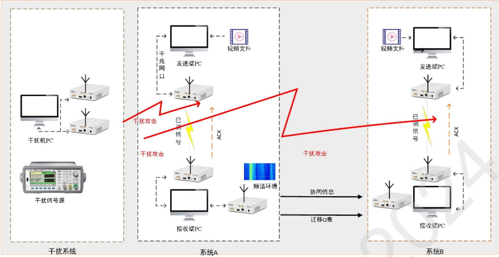

图 51 协同抗干扰示意图

该通信抗干扰演示验证平台由干扰产生子系统、A通信收发子系统、B通信收发子系统构成，所用到的硬件主要有USRP-2920、USRP-2954、信号发生器及PC等。其中干扰产生子系统由1个信号源、1个USRP-2920、1台PC构成；A通信收发子系统由 2 台 USRP-2920、1台USRP-2954、2 台 PC 构成；B通信收发子系统由3台USRP-2920、2台PC构成。USRP通过以太网与对应的PC相连。由于USRP-2954可实现的感知范围更广，将A通信子系统设定为强节点系统，B通信子系统设定为弱节点系统，对应设置A通信子系统拥有宽带频谱感知能力，B通信子系统无宽带频谱感知能力，如下图所示:

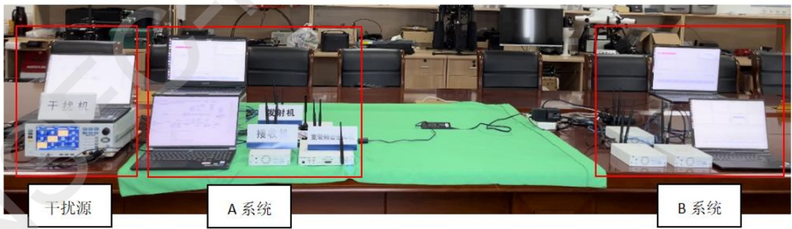

图 52协同抗干扰演示验证平台

下图展示了A系统获取空间频谱数据并形成频谱数据瀑布图，并基于干扰状态的语义特征将瀑布图转化为频谱语义图。在频谱语义图中绿色代表算法决策的通信信道，红色代表感知到于扰所施加的信道，结合语义图以及频谱瀑布图可以看出在15次算法决策中，全部实现了干扰的躲避。日志展示了抗干扰算法的决策时间，从中可以读出算法的决策时间为毫秒级。

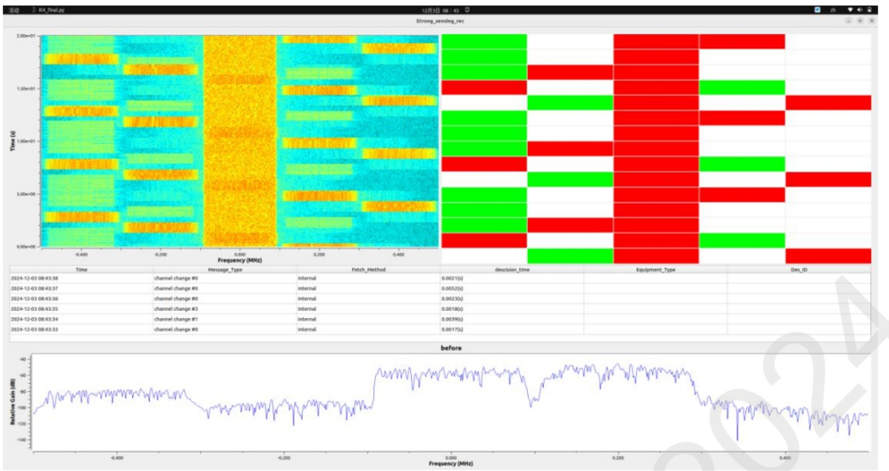

图 53 系统宽带频谱感知

下图展示了借助协同信道在A系统辅助下B系统恢复的频谱信息，在该频谱语义图中，蓝色表示A系统所决策的通信信道，绿色表示B系统决策的通信信道，红色代表干扰信道。结合图53表明在15次算法决策周期内B系统成功接收到A系统发送的信道信息，并且还原出B系统当下的频谱态势，实现了躲避内部互扰及外部干扰。同样，日志展示了抗干扰算法的决策时间，从中可以读出算法的决策时间为毫秒级。

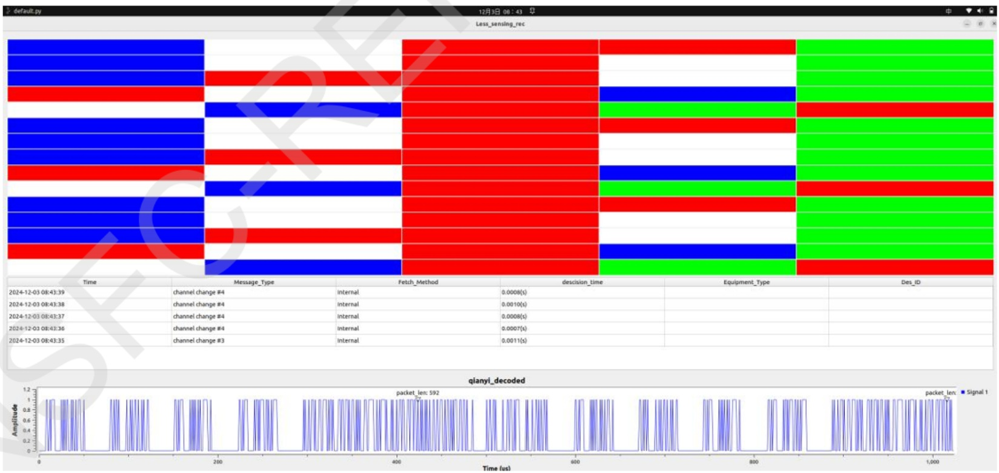

图 54 B 系统协同感知

如图55展示了在强节点系统A中，通信收发使用的调制方式为QPSK、子载波数为48。该子系统的接收端成功接收到视频文件，并且在采样率为200KHz的情况下吞吐量保持在16Kbps以上，表明在该段时间成功躲避通信信道可能面临的压制性干扰。

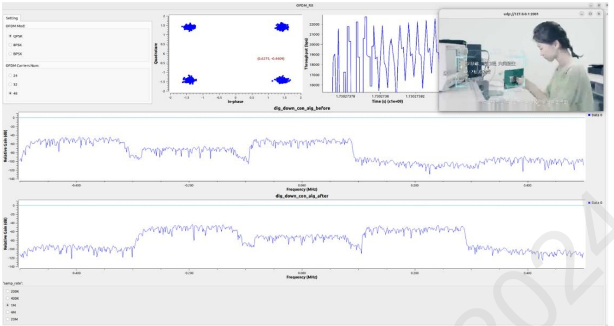

图 55强收发子系统 A 的接收界面

如图56展示了弱节点系统B中，通信收发使用的调制方式为QPSK、子载波数为48。该子系统的接收端成功接收到视频文件，由于设置算法决策间隔为1s，压制性干扰会使得吞吐量降为0，故通过吞吐量曲线可以得出在A系统的辅助下，B系统在20次算法决策中仅被干扰到1次，抗干扰成功率可达95%。

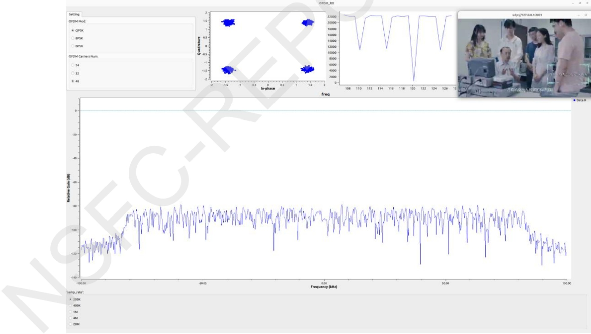

图56强收发子系统 B 接收界面

## 2.4 四维时空网络群智路由

对于四维时空网络群智路由的研究主要围绕联盟骨干节点的选取、多维QoS单播路由以及高效组播路由三个方面展开，主要进展与重要成果如下图所示。

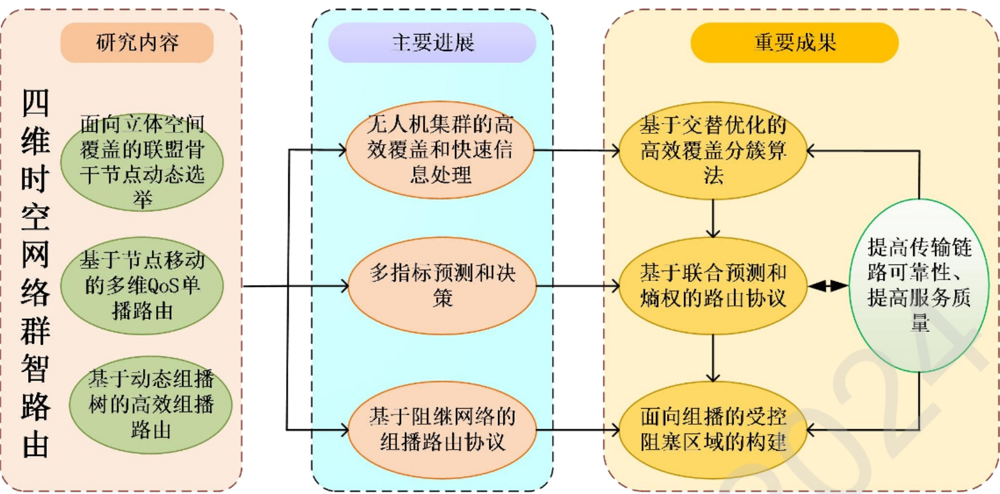

图 57 四维时空网络群智路由研究进展与主要成果

## 2.4.1 面向立体空间覆盖的联盟骨干节点动态选举

本项目针对干扰环境下链路不稳定性加剧的问题，提出优化的骨干节点选择算法；针对最大化空间覆盖效率的问题，提出基于交替优化的高效覆盖分簇算法。

## （1）优化的骨干节点选择算法

利用无人机节点的位置变化预测无人机节点间的链路预期时间，并结合无人机节点物理层和数据链路层的指标变化，本项目提出了优化的骨干节点选择算法。通过无人机节点之间的链路预期时间和物理层、数据链路层的指标，综合计算出邻居节点中综合性能好的节点，将其选取设置为联盟骨于节点，对于骨于节点的选择本项目采用基于OLSR的 MPR节点优化选择算法。

利用部署的GPS模块，无人机能够获取到自身的位置信息，并将其封装进入HELLO消息进行广播，邻居节点接受到带有位置信息的HELLO消息后可以计算出当前节点间的链路预期时间，具体计算公式如下:

$$
\Delta t = \frac{- a \pm \sqrt{a^{2} - bc}}{b},\tag{42}
$$

其中

$$
\begin{array} { c } { a = \left( x _ { j } ( t ) - x _ { i } ( t ) \right) \nu _ { x , r e l } ( t ) + \left( y _ { j } ( t ) - y _ { i } ( t ) \right) \nu _ { y , r e l } ( t ) , } \\ { b = \nu _ { x , r e l } ( t ) ^ { 2 } + \nu _ { y , r e l } ( t ) ^ { 2 } , } \\ { c = d \left( t \right) ^ { 2 } - R ^ { 2 } , } \end{array}\tag{43}
$$

式中，∆t为无人机节点i和j间的链路预期时间， $x _ { i } ( t )$ 为无人机节点i在t时刻的 x坐标， $\nu _ { _ { x , r e l } } \left( t \right)$ 为无人机节点j相对于无人机节点i在x轴的相对运动速度， $y _ { i } \big ( t \big )$ 为无人机节点i 在t时刻的y坐标， $\nu _ { _ { y , r e l } } \left( t \right)$ 为无人机节点j相对于无人机节点i在y轴的相对运动速度， $d ( t )$ 为无人机节点i和j在t时刻的距离，R为无人机间的通信范围。

为选取综合性能更好的骨干节点，本项目采用跨层协作方式，具体的，利用无人机节点的物理层和数据链路层指标变化，将其反馈至网络层，网络层结合上述计算出的链路预期时间，综合计算出节点的综合性能，计算公式如下:

$$
S_{NP,j} = \frac{1}{1 + p_j + a_j},\tag{44}
$$

$$
p_{j} = \frac{p_{j} - \min_{i} p_{i}}{\max_{i} p_{i} - \min_{i} p_{i}}\tag{45}
$$

$$
a_{j} = \frac{A_{j} - \min_{i} A_{i}}{\max_{i} A_{i} - \min_{i} A_{i}}\tag{46}
$$

式中， $p _ { j }$ 为无人机节点j的包错误率，min $p _ { i }$ 为无人机节点i的一跳邻居节点中包错误率的最小值，max $p _ { i }$ 为无人机节点i的一跳邻居节点中包错误率的最大值； $A _ { j }$ 为无人机节点j因没有路由而产生的丢包数， $\operatorname* { m i n } _ { i } A _ { i }$ 为无人机节点i的一跳邻居节点中因为没有路由而产生的丢包数的最小值， $\operatorname* { m a x } _ { i } A _ { i }$ 为无人机节点i的一跳邻居节点中因为没有路由而产生的丢包数的最大值。

根据上述信息，当需要选取骨干节点时，首先获取节点的一跳和二跳邻居集合，将其中根据任务需求需要设置为骨干节点的节点设置为MPR节点，判断是否所有的二跳邻居节点都被MPR集合覆盖，对于未被设置为MPR节点的一跳邻居节点，考虑其通信性能和网络性能计算节点的综合性能，并根据综合性能排序得到有序集合N。针对有序集合N，选取综合性能得分最高的节点，将其设置为MPR 节点并加入 MPR集合，同时从有序集合N中移出，判断是否所有的二跳邻居节点都被MPR集合覆盖，若没有则继续选取。最后就可以得到节点的MPR集合，也即骨干节点。

为验证以上优化机理，本项目将仿真场景设置为一长宽均为1500m的城区范围，城区采用均匀节点模型随机部署了30架无人机，无人机采用随机运动模型，并在城区范围中随机部署了干扰源，干扰无人机通信。

骨干节点选择算法设计的仿真结果如下图所示。图中主要考量了无人机节点在不同速度下网络的递交率性能变化。图中可以看出，采用面向立体空间覆盖的联盟骨干节点动态选举算法可以实现更好的递交率。其中olsr-slp为本项目提出

的优化骨干节点选择算法。

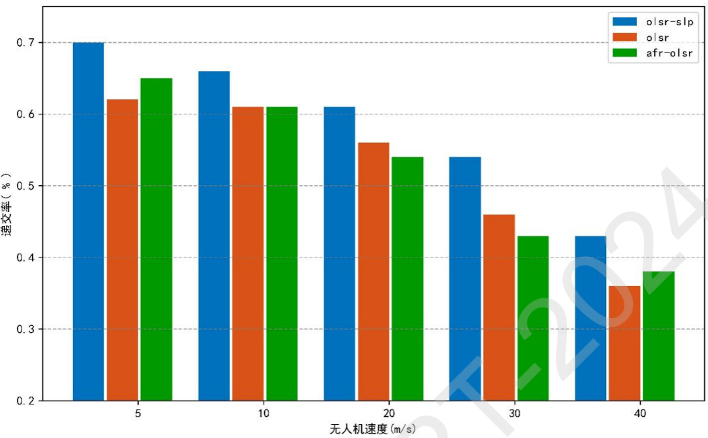

图 58 递交率

## （2）基于交替优化的高效覆盖分簇算法

考虑到多无人机集群区域覆盖性能是绝大部分任务的基本需求，以及信息感知时延与处理精度的重要性，在分簇方法下，无人机集群的高效覆盖和快速信息处理问题是很重要的。因此，本项目研究了时延约束下覆盖效率优化问题，提出基于交替优化的高效覆盖分簇算法，优化集群簇头的选择和簇成员的加入。

在分层无人机网络系统中，选择一组节点作为骨干节点簇头，其他节点选择簇头加入相应簇集群中成为簇成员。其中，簇头集 $H \subseteq N$ ，簇成员集$M = \left\{ M_{i} \mid i \in H \right\}$ 。网络中存在一个中心节点携带移动边缘计算器为其他节点提供边缘计算服务。考虑到某些应用对处理时延要求较高，需要根据任务要求设置传输时延约束。设中心无人机到簇头无人机的时延阈值为 $t _ { h }$ ，簇头无人机到簇成员无人机的阈值为 $t _ { m }$

通过任意两节点之间距离与两倍探测半径R的比值定义任意两架无人机的覆盖效率，可以表示为:

$$
s _ { i j } = \frac { \min \left\{ d _ { i j } , 2 R \right\} } { 2 R } ,\tag{47}
$$

其中， $d _ { _ { i j } } = \sqrt { \left\| \boldsymbol { w } _ { i } - \boldsymbol { w } _ { j } \right\| ^ { 2 } }$ ，由于无人机不会相撞，因此 $d _ { i j } > 0$ 。整个无人机集群的覆盖效率用下式表示，即任意两个节点间的距离与两倍探测半径比值总和与节点连接数的比率。

$$
\frac{\sum_{i = 1}^{N}\sum_{j = i + 1}^{N}\min\left\{ d_{ij},2R \right\}}{2R} \Bigg/ \frac{N^*(N - 1)}{2} = \frac{\sum_{i = 1}^{N}\sum_{j = i + 1}^{N}\min\left\{ d_{ij},2R \right\}}{R^*N^*(N - 1)},\tag{48}
$$

当节点间的时延不满足约束时，解处于不可行区。构造时延约束的罚函数来对不可行区中的无约束问题进行惩罚。罚函数定义为:

$$
\psi = \alpha _ { 1 } \sum _ { i \in H , j \in M _ { i } } \left( \sigma _ { i j } + \sigma _ { j i } \right) + \alpha _ { 2 } \sum _ { i \in H } \left( \sigma _ { 1 i } + \sigma _ { i 1 } \right) + \alpha _ { 3 } \sum _ { 1 \neq i \in N } \sigma _ { i } ,\tag{49}
$$

其中， $\alpha_{1}, \alpha_{2}, \alpha_{3}$ 是惩罚项系数，其值均大于0， $\sigma _ { i i }$ 和 $\sigma _ { i }$ 表达式分别如下:

$$
\sigma_{ij} = \left\{ \begin{aligned} &\max(0, t_{ij} - t_{H}), i \notin H \lor J \notin H, \sigma_{ij} < \infty, \\ &\max(0, t_{ij} - t_{H}), i, j \in H, \sigma_{ij} < \infty, \\ &0, \quad  其他情况 . \end{aligned} \right.\tag{50}
$$

$$
\sigma_{i}=\left\{\begin{aligned}d_{1i},t_{1i}=\infty\vee t_{i1}=\infty,\\0, 其他情况.\end{aligned}\right.\tag{51}
$$

由式(50)可知，当传输时延 $t _ { i j }$ 满足约束条件时， $\sigma _ { i j }$ 为0，此时不做任何惩罚；当不满足约束条件时， $\sigma _ { i j }$ 大于0，此时对时延进行惩罚。当簇头节点与中心节点无法通信时，传输时延无穷大，此时，通过两节点间的距离来作为惩罚，如式(51)所示。为了最大化无人机集群覆盖面积，利用罚函数法来处理其约束，并将原问题转化为无约束的最小化问题(52)，表述如下:

$$
\min_{W,H,M} J = -F + \psi\tag{52}
$$

基于交替优化的高效覆盖分簇算法以无人机集群初始状态(包括无人机的初始位置、簇头和簇成员）、时延约束为输入。然后应用交替迭代算法得到无人机的最优结构，即，无人机集群的簇划分。在每次迭代中，对于给定的无人机集群位置集W，通过求解一个二进制整数规划问题来优化簇头集 $H _ { \circ }$ 其他无人机节点加入与簇头时延最小的簇，从而确定簇成员集M。

给定当前无人机的位置集 $W _ { k }$ 、簇成员集 $M _ { k }$ ，确定簇头集H的子问题可以表示为:

$$
\min _ { H } J \left( W _ { k } , H , M _ { k } \right)\tag{53}
$$

采用贪心算法来对该问题进行求解。首先，从当前簇头集 $H _ { k }$ 找到一个簇头 i，如果将它从簇头集中删除能够让目标函数值减少最多，那么就从簇头集中删除该簇头节点；如果没有找到使目标函数值减小的簇头，那么就保持当前簇头集。然后，考虑将非簇头节点变成簇头节点，如果某个非簇头节点变成簇头节点能让目标函数值减少最多，那么将其添加进簇头集；如果没有找到，就保持当前簇头集不变。

给定当前无人机的位置集 $W _ { k }$ 、簇头集 $H _ { k }$ ，确定簇成员集M的子问题可以表示为:

$$
\min_{M} J(W_{k}, H_{k}, M)\tag{54}
$$

采用最短路径算法，非簇头节点从簇头集中找到与其传输时延最小的簇头并加入该簇头所在的簇集群，成为簇成员。

图中可以看出高效覆盖分簇迭代算法在覆盖效率性能上比其他基准算法都要好。除面向覆盖策略外，其余算法的覆盖效率均随着无人机数量的增加而降低，这是由于时延约束了无人机之间的距离。

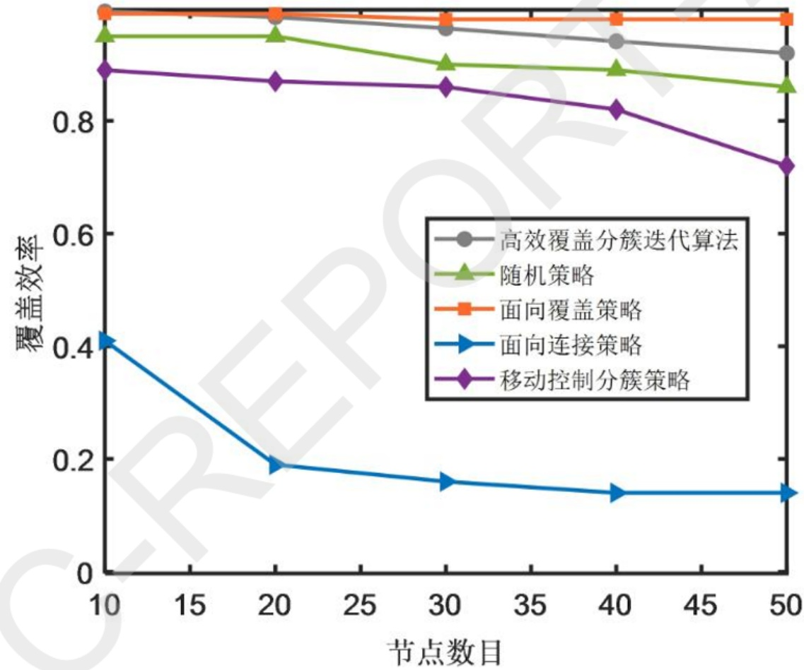

图59节点数量对覆盖效率的影响

## 2.4.2 基于节点移动的多维 QoS 单播路由

本项目针对路由协议和网络场景难以动态匹配的问题，提出一种基于三维Q学习的自适应路由协议；针对节点快速移动环境下自适应选择低数据负载路由的问题，提出一种基于数据包到达预测的路由协议；针对多指标敏感性路由决策，提出基于联合预测和熵权的路由协议；针对信道链路信息状态更新慢的问题，提出基于频谱感知的多信道链路快速更新方法。

## （1）基于三维Q学习的自适应路由协议

无人机自组网的无线环境异常复杂和动态，很难自适应地确定哪种路由模式更适合快速变化的位置和拓扑。此外，相邻无人机（NU）的3D移动性和数据包到达快速变化，会对数据包的转发造成大量不可预知的影响，因此考虑包括3D移动性和数据包到达预测在内的链路状态以做出适当的路由决策是具有挑战性的。因此，本项目提出一种基于三维Q-Learning（3DQ）的路由协议，以保证数据包的递交率，提高服务质量 $( \mathrm { Q o S } )$ 。3DQ路由协议利用基于Q学习的路由决策方案在 3D空间中自适应地产生结合中继转发多跳（Hop-By-Hop, HBH）和存储-携带-转发（Store-Carry-Forwarding,SCF）的路由决策。具体如下:首先，无人机利用链路质量预测模块来预测NU的链路状态；然后，通过基于Q学习的模块自适应地产生路由决策。

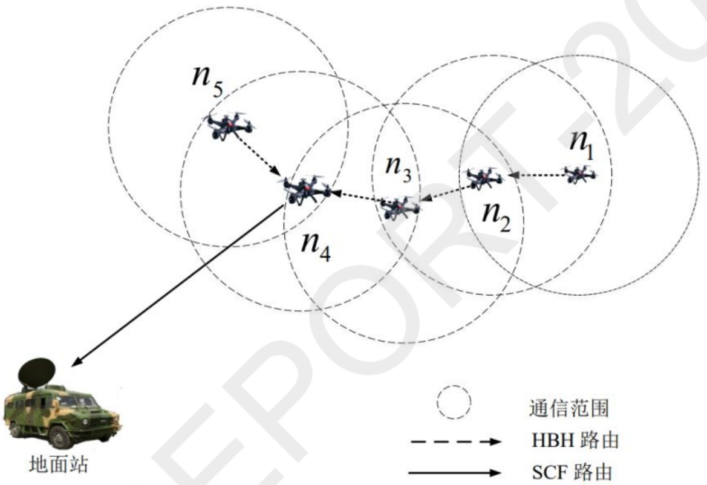

图 60 3DQ 路由协议中的两种路由模式示例图

3DQ路由协议的系统示例如图60所示，其中， $n _ { \mathrm { l } }$ 到 $n _ { s }$ 表示执行巡航或侦察任务的无人机，GS在左下角表示路由目的地。 $n _ { 1 }$ 到 $n _ { s }$ 可以在3D空间中自由移动并将数据包传输到GS。协议利用两种路由模式，即逐跳（HBH）和存储-进位-转发（SCF），其中，HBH模式是指无人机将数据包转发给一个NU进行中继，而SCF模式是将数据包存储在当前无人机（CU）中，物理移动到GS的通信范围内直接传输。图60中，虚线表示HBH模式，实线表示SCF模式；当有合适的接收NU时，UAV会将数据包转发给NU，而当没有合适的接收NU时，也就是HBH模式失败，会将它们物理存储并携带到GS，也就是采用SCF模式。

如图61所示，3DQ路由协议由链路状态预测模块和路由决策模块组成。显然，预测模块为决策模块提供支撑，如图61中的大箭头所示。此外，NUs的信息是预测模块的输入，路由请求是决策模块的输入。由朝向地面站的度数预测(Degree Towards the Ground Station Prediction, DTGSP）算法和数据包到达预测（Packet Arrival Prediction, PAP）算法组成的链路状态预测模块为路由决策模块提供了基础，包括Q学习算法及其补充更新操作。一旦无人机生成要路由的数据包，它们将启动路由请求，其路由决策模块将自适应地提供路由决策。

通过仿真评估了3DQ路由的各种性能，结果表明，在各种通信场景下，与基线协议相比，3DQ在无人机自组网中最多可以提高71.36%、89.32%和83.54%的数据包递交率、吞吐量和延迟，可有效避免高移动和低质量路径。

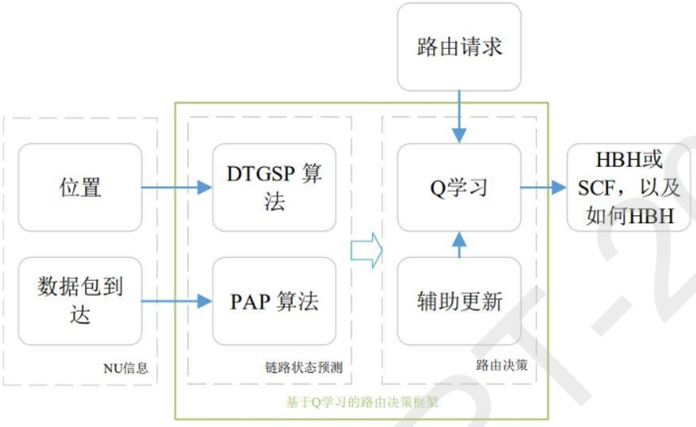

图 61 3DQ 路由的架构

## （2）基于数据包到达预测的路由协议

无人机自组网路由的重大问题是动态拓扑和数据流量带来的传输缓冲区溢出和相应的数据包丢失，因此，预测流量例如数据包到达率（Packet Arrival Rate, PAR），可以有效地解决这个问题。为了提高传输链路的可靠性，本章提出了一种用于无人机自组网的数据包到达预测路由协议，使用机器学习和联合决策方法来自适应地找到合适的路由。

假设每个无人机配备了相同长度的缓冲区，其溢出将导致丢包。然后让 $Q ( t )$表示在整数时隙 $\overline{t} \in \{0,1,2,\cdots\}$ 上的NU的离散时间排队系统。具体来说，初始状态 $\tilde { Q } ( 0 )$ 为非负实值随机变量，其状态由随机数据包到达 $a ( t )$ 和传输过程$b \big ( t \big )$ 驱动，动态方程可表示为:

$$
Q ( t + 1 ) = \max \left[ Q ( t ) - b ( t ) , 0 \right] + a ( t ) \quad \text { for } \quad t \in \{ 0 , 1 , 2 , \cdots \}.\tag{55}
$$

将 $Q ( t )$ 称为一个NU的时隙t上的积压（Backlog），积压可以表示需要传输的数据包数量。随机数据包到达过程 $\left\{ a \left( t \right) \right\} _ { t = 0 } ^ { \infty }$ 是定义在时隙 $t \in \{ 0 , 1 , 2 , \cdots \}$ 上的实值随机变量序列。 $b ( t )$ 的值表示NU的队列在时隙t上可以处理的数据包数量。$a ( t )$ 的值表示时隙t到达的新数据包的数量，假设为非负数。因此， $a ( t )$ 和 $b \big ( t \big )$对积压 $b ( t )$ 非常重要。

随机数据包到达过程 $a ( t )$ 可以由数据包到达率PAR来具体反应。长短期记忆（LSTM）是一种循环神经网络（RNN）的记忆扩展架构，以帮助RNN记住大量输入以进行更长时间的预测，因此本项目采用LSTM来结合未知、快速和自适应地预测未来的 PAR。基于LSTM的PAP模块架构展示如图62所示。PAR是和无人机的位置息息相关的，因此将一架无人机的LSTM的输入 $x _ { t }$ 设置为其在时隙t中的“PAR-位置”向量，写为 $x_{t} = \left\{ r_{t}, p_{t} \right\}$ ，其中 $r _ { t }$ 代表 PAR 值， $p _ { t }$ 代表3维的坐标值。显然，基于LSTM的PAP算法可以通过其趋势和相关位置来预测 PAR。

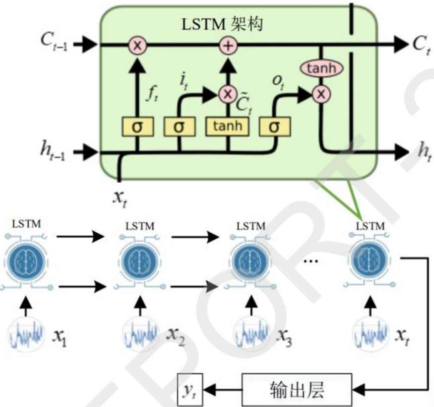

图 62 基于 LSTM 的 PAP 模块架构

路由决策可以基于预测的PAR，综合考虑当前和未来的队列积压、信道情况综合做出。一旦无人机请求数据包传输，中央控制器可以根据每个S的NURFD $\mu$ 自适应计算路径的 RDF ω，然后按照 RDF排序，然后取最低的路径RDF作为输出决策。其中RDF为路由决策因子，表示为:

$$
\omega _ { i } = \alpha \frac { d _ { i } } { D } + \beta \frac { r _ { i } } { R } + \theta \frac { l _ { i } } { L } + \psi \frac { h _ { i } } { H } ,\tag{56}
$$

其中 $d _ { i }$ 表示路由路径i的每一跳的最大距离， $D$ 表示无人机之间的最大通信距离，通常等于无人机的通信范围， $r _ { i }$ 表示路由路径i的最大PAR，对数据包递交率的影响显著，R表示r的最大值，一般等于无人机的最大物理PAR， $l _ { i }$ 表示路径i的最大当前队列积压长度，L表示无人机缓冲区大小， $h _ { i }$ 代表路由路径i的跳数，H表示中央控制器决策历史中的最大跳数。除此之外， $\alpha$ 、 $\beta$ 、θ和ψ表示满足 $\alpha + \beta + \theta + \psi = 1$ 的多项式的因子，用于各种任务场景。NURFD表示第k个NU的NU路由决策因子，表示为:

$$
\mu _ { k } = \chi \frac { d _ { k } } { D } + \upsilon \frac { r _ { k } } { R } + \tau \frac { l _ { k } } { L } ,\tag{57}
$$

其中 $\chi$ 、υ和τ表示满足 $\chi + \upsilon + \tau = 1$ ，具体要因任务要求而异。

同时，引入了超时定时器和确认（ACK）指令来分别控制路由时间和重传。值得注意的是，在实际部署中，中央控制器还可以采用主动路由模式构建路由表，直接查表输出路由决策。但由于反应模式可以显示预测模块如何充分支持路由决策过程，因此使用反应模式阐述。经过上述设计，PAP路由协议可以在流量预测、路由决策和部署方面自适应地运行。 1

## （3）基于联合预测和熵权的路由协议

通过预测无人机的位置和数据包到达率（PAR）等因素，所提出的基于联合预测和熵权（JPE）的路由协议旨在提高传输链路的可靠性。JPE协议使用机器学习方法，特别是基于长短期记忆（LSTM）的联合预测（JP）模块，来预测无人机链路的移动性和数据流量。这一预测构成了后续路由决策的基础。然后，路由决策问题被表述为一个优化问题，并提出了一种基于熵权的多度量（EWMM）方法来寻找合适的传输路径。熵权的使用允许在路由决策中考虑多指标。总之，JPE路由协议是为FANET提出的一种解决方案，它使用多指标预测和决策，通过预测移动性和数据流量来提高传输链路的可靠性，并使用基于熵权的方法来找到合适的路由路径。

为了做出有效的路由决策，必须同时考虑指标:缓冲区可用大小、传输率和链接失效时间，否则会导致缓冲区溢出、传输速率低和链路中断等问题。这些因素在EWMM方法中至关重要。此外，通过使用基于SDN的控制架构，集中控制器（CC）可以做出从SU到BS的路由决策。为了做出快速的联合决策，提出了一种联合度量熵决策方法来衡量这条路由路径的合适程度，首先将每个决策因子归一化为

$$
X_{ij} = \frac{\max\left\{X_{j}\right\} - X_{ij}}{\max\left\{X_{j}\right\} - \min\left\{X_{j}\right\}} \times \alpha_{j} + (1 - \alpha_{j}), \quad i = 1,2,\ldots,N, \quad j = 1,2,\ldots,M,\tag{58}
$$

其中 $X _ { i j }$ 表示第i个NU的第j个度量的决策度量，度量包括传输速率、链路持续时间、NU位置、NU速度等。另外，N为NU的数量，M为决策指标的数量，$\alpha _ { j }$ 表示控制第j个决策指标取值范围的效率系数，且 $\sum _ { j = 1 } ^ { M } \alpha _ { j } = 1$ O

然后，CU根据下式得到第j个决策度量的熵:

$$
E n t _ { j } = - \frac { 1 } { \ln N } \sum _ { i = 1 } ^ { N } \left( F _ { i j } \cdot \ln F _ { i j } \right) , \mathrm { ~ j = 1 , 2 , \ldots , M } ,\tag{59}
$$

其中， $F _ { i j }$ 代表第i个NU的j个网络指标比例，表示为

$$
F_{ij} = \frac{X_{ij}}{\sum_{k = 1}^{N}X_{kj}}, \quad  j  = 1,2,\ldots,M.\tag{60}
$$

基于熵理论，将第j个指标的熵权重定义为 $\Upsilon _ { j }$

$$
\Upsilon_{j}=\frac{1-Ent_{j}}{\sum_{k=1}^{M}(1-Ent_{k})}, \quad j=1,2,\ldots,M.\tag{61}
$$

基于归一化值和度量熵，CU可以推导第i个NU的可用性为 $A { \nu } a _ { i }$

$$
A v a _ { i } = \sum _ { j = 1 } ^ { M } \left( Y _ { j } , X _ { i j } \right) , \mathrm { i } = 1 , 2 , \cdots , N .\tag{62}
$$

接下来，CU可以得到第i个NU的转发概率为 $P r o _ { i }$

$$
P r o _ { i } = 1 - \frac { A v a _ { i } } { \sum _ { k = 1 } ^ { N } A v a _ { k } } , \quad i = 1 , 2 , \cdots , N .\tag{63}
$$

基于SDN的控制架构中的CC可以使用所提出的基于LSTM的JP模块自适应地预测NU的未来状态x，并消除不自洽的NU并获得候选NUs（CNUs）。当无人机请求数据包传输时，CU使用概率最高的路径。对于实际部署，JPE路由协议利用超时定时器和确认（ACK）机制分别控制路由时间和重传。路由协议使用反应式方法，因为它能有效展示预测功能如何支持路由选择。此外，JPE协议还包含处理网络碎片的机制。当无人机或无人机组（SUG）子网与BS断开连接时，该SUG内产生的流量数据包将存储在SUG边缘。一旦有可行的路径，这些数据包就会转发到BS。或者，如果在路径可用之前达到最大缓存时间，则会丢弃所存储的数据包。总之，JPE路由协议在流量和移动性预测、路由决策和实际部署方面都是自适应运行的。

仿真结果表明，JPE协议在动态网络环境下的可靠性和端到端时延方面优于其他路由协议。与SPA协议相比，JPE协议还可以将数据包传送率和延迟性能分别提高30.13%和31.24%。

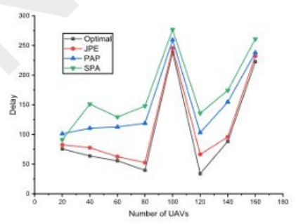

(a)

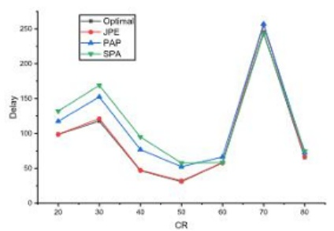

(b)

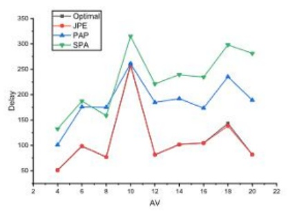

(c)

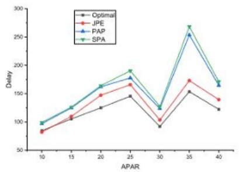

(d)

图63延迟性能:(a)延迟与无人机数量的关系，(b)延迟与 CR的关系，(c)延迟与 AV的关系，(d)延迟与 APAR 的关系。

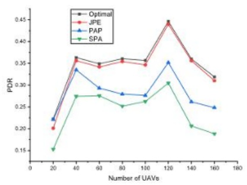

(a)

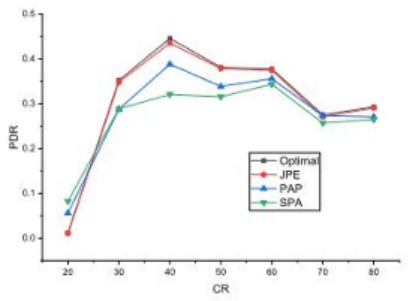

(b)

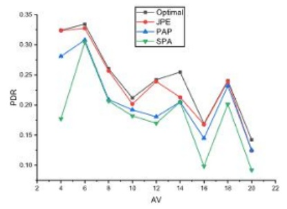

(c)

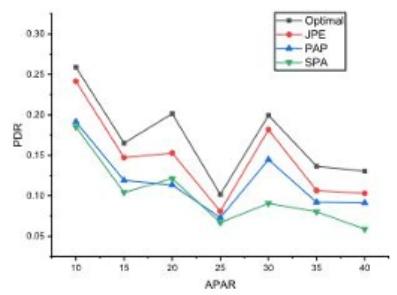

(d)

图 64 PDR 性能:(a)PDR 与无人机数量的对比，(b)PDR 与 CR 的对比，(c)PDR 与 AV 的对比，(d)PDR 与 APAR 的对比。 1

## （4）基于频谱感知的多信道链路快速更新方法

为了解决多信道协议在干扰攻击下的问题，本项目提出一种利用物理层电磁频谱态势感知模块的路由协议 ESOLSR（Electromagnetic Spectrum Situation AwarenessOLSR）。通过结合频谱感知模块，加快对相邻节点信息的处理，并结合接口功能更新与参数自适应调整，使得干扰阶段链路信息能够得到快速更新，并且能够更快地将拓扑信息广播到全网中。ESOLSR利用获取的干扰信息进行主要改进三个方面:链路状态的联合更新、接口功能的更新、参数的自适应调整。该协议结合了三种方法来加速链路的整体更新过程，以最终实现干扰后路由的快速恢复。

ESOLSR在链路状态更新中采用物理层传感模块来感知节点周围的干扰源位置和频谱使用情况，这是相较于传统协议的主要改进。该协议直接在物理层分析频谱感知模块获取的干扰信息，省去了上层分析的延迟，从而加速了通信恢复。这一机制提升了ESOLSR在高干扰环境中的链路恢复效率，使其更加适用于对时延和稳定性要求较高的应用场景。在干扰攻击发生时，ESOLSR利用外部电磁频谱感知功能，快速识别受干扰的节点和链路，并迅速更新链路状态信息，进而调整路由表和传输路径。这一机制确保了通信路径的快速恢复，实现了高效的网络恢复能力。ESOLSR在链路表中维护被干扰的链路信息，包括本地无线接口地址和邻居无线接口地址。ESOLSR根据获取的干扰信息动态更新链路表中受干扰链路的链路状态和保持时间。

无线接口功能是指通过无线接口发送和转发控制消息的功能。ESOLSR对无线电接口功能进行了改进和更新，以解决不必要的高开销问题。与传统协议相比，ESOLSR在遇到干扰攻击后，通过更高效的无线接口功能处理控制报文，从而降低了网络负担。ESOLSR利用物理层频谱感知模块，从频谱层面更快地检测到干扰的开始和结束。被干扰的接口在遇到干扰攻击时不需要发送和转发控制报文，可以大大减少不必要的开销。

在干扰期间，需要自适应地调整HELLO报文的传输间隔和邻居表的保留时间。这将使得网络拓扑更新更快，增强了邻居节点和两跳相邻节点处理干扰信息的能力。对于距离受干扰节点较远的节点，它通过TC消息的传播和转发来了解干扰信息。因此，当检测到干扰时，这些消息的传输间隔将会缩短，从而使拓扑信息的变化能够更快地在全局范围内传播。

仿真结果表明，所提ESOLSR在网络拓扑快速变化的干扰场景下能够迅速进行反应，与OLSR相比，包投递率提升26.6%，并且能够在不引入太多控制开销的前提下，加快整体路由的恢复。

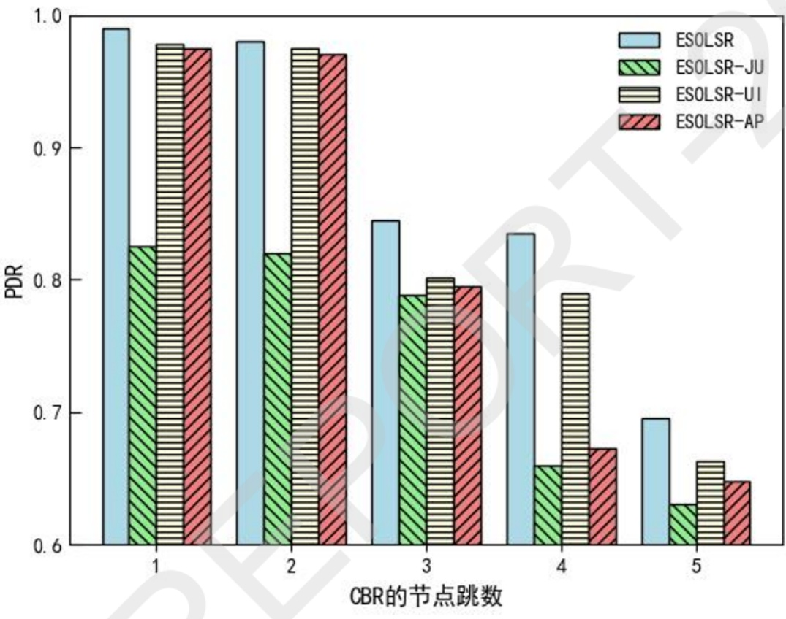

图 65 采用不同方法下 CBR 的 PDR 性能

## 2.4.3基于动态组播树的高效组播路由

组播允许数据从一个源节点发送到多个目标节点，组播通信是将数据从单一源节点发送到多个目标节点。源节点只需向组播地址发送数据，无需了解所有接收者的具体信息。组播路由是网络中实现组播通信的关键技术，它负责确定从源节点到所有接收者的传输路径。组播树是组播路由的基础结构，它是一个从源节点到所有接收者的路径集合。

## （1）基于协同转发的路由技术

阻继网络（Barrage RelayNetwork,BRN）是一种专为战术边缘通信设计的移动自组网技术。它利用TDMA和自主协同转发方案，无需链路级碰撞避免，即可实现快速可靠的广播。在BRN中，每个中继节点可以与其他中继节点组成临时协作团队，团队中的节点共同传输完全相同的分组。这些节点在发送信号时对载波相位进行伪随机抖动，使接收节点处的信道特性呈现时变特性。因此，接收节点同时收到来自多个发送节点的相同分组。第t个时隙的第k个节点处接收的信号为

$$
\mathbf{y}_{i}^{t}=\mathbf{x}^{t} \sum_{j \in D_{t}} \sqrt{P_{j}} h_{i, j}^{t}++\boldsymbol{\omega}_{i}^{t},\tag{64}
$$

其中，分组 $\mathbf { x } ^ { t }$ 由方差为1的复数符号组成， $D _ { t }$ 代表t时隙参与协同转发的节点组， $P _ { j }$ 为第i个节点的发送功率， $h _ { i , j } ^ { t }$ 为节点i与j之间的信道增益， $\omega _ { i } ^ { t }$ 为高斯白噪声。发送这样使得即使多个节点同时传输相同的数据，也不会发生碰撞或相互干扰，从而实现了低延迟和高度鲁棒的广播。例如，假设源节点在第1个时隙广播分组，所有成功接收该分组的节点将在第2个时隙协同广播完全相同的分组，以此类推，直到分组传播到目标节点。为了防止分组在传播过程中返回到源节点，每个节点仅重复传输一次接收到的分组。此外，为了避免冲突，源节点在至少第4个时隙可以广播下一个分组，从而实现空间复用，提高网络效率。

在此广播方式下，BRN的路由不同于传统基于组播树的路由，而是协作的链路。BRN 通过创建受控阻塞区域（Controlled Barrage Region, CBR）的空间隔离区域来支持单播路由。CBR由一组缓冲节点组成。这些本身不转发信号的缓冲节点被指定在协作节点的周围，阻止外部分组进入控制区域，同时阻止内部分组流出，因此实现了空间隔离的单播传输。CBR的建立是通过广播请求发送(Request-to-Send, RTS)和清除发送(Clear-to-Send, CTS)分组来完成的。源节点广播一个RTS分组，其中包含目的节点的身份和一个跳数字段，每个中继节点接收后都会递增这个跳数字段并广播。目的节点接收到RTS消息后，会等待一段时间，然后广播一个CTS消息，其中包含源到目的地的跳数距离和另一个跳数字段。接收CTS消息的节点可以确定自己的跳数，并根据跳数确定自己是内部节点还是缓冲节点。内部节点将CTS消息转发到下一级节点，缓冲节点则不转发CTS消息，并充当CBR的边界。

## （2）面向组播的受控阻塞区域构建

在组播业务中，源节点要将相同的数据流传输给一组通信设备。在组播网络中，为每个源到目的节点对构建独立的CBR单播链路会导致较高的时延和开销。如图66所示，通过扩展CBR的概念，根据组播范围调整缓冲节点的数量和位置，并将目的节点也作为转发节点，BRN也能够支持组播通信。

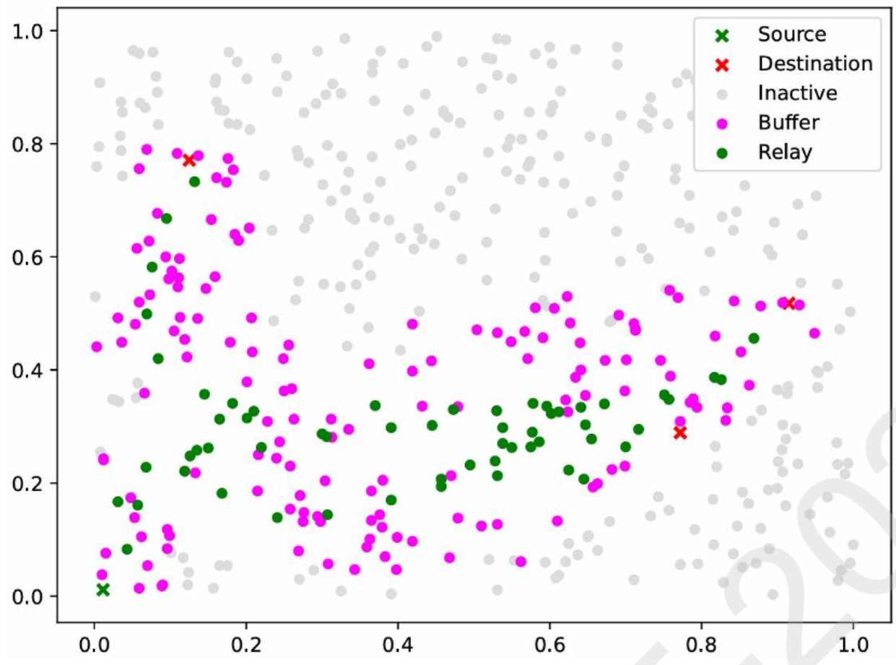

图 66 基于 BRN 的组播路由示意图

首先在单播路由中，网络中的任一节点如果满足下式则是CBR内部的转发节点:

$$
h ^ { \mathrm { R T S } } \pm h ^ { \mathrm { C T S } } \leq h ^ { \mathrm { S D } } + \omega ,\tag{65}
$$

其中 $h ^ { \mathrm { { R T S } } }$ 表示该节点与源节点的跳数； $h ^ { \mathrm { { C T S } } }$ 表示与目的节点的跳数； $h ^ { \mathrm { { S D } } }$ 表示目的节点与源节点的最小跳数； $\omega$ 是一个非负整数，表示超宽。此外，如果该节点不是转发节点但是收到了CTS分组，则是缓冲节点。其余节点为不活动节点。

组播路由可以通过类似合并多个单播路由的方式产生。为了让一个源节点发送消息给多个目的节点，网络中生成了不同的单播CBR，即生成多组缓冲节点。当任一组CBR中缓冲节点是其他组的转发节点时，取消其缓冲节点的身份。这种方式将多组缓冲节点合并成为了一组，从而形成面向组播的协作路由。组播CBR的建立依然需要通过广播RTS 和 CTS 分组实现。RTS 分组中需要添加所有目的节点的身份，每个目的节点均需广播CTS分组。若某个目的节点在收到其他目的节点的CTS分组并计算出自己的身份是转发节点时，则无需发送CTS分组。即如果在第i个目的节点的CTS分组广播时，第i个目的节点满足下式则两目的节点在同一个CBR中:

$$
h _ { j } ^ { \mathrm { S D } } + h _ { i , j } ^ { \mathrm { C T S } } \leq h _ { i } ^ { \mathrm { S D } } + \omega .\tag{66}
$$

## （3）仿真分析

图67给出了协同转发中使用组播路由与单播路由的吞吐量曲线。该仿真中，节点位于边长为10km的正方形区域，任选一源节点每隔3个时隙向网络广播一次分组以避免冲突。发射功率被平均分给所有节点，接收节点处的信噪比决定协同传输是否成功。仿真说明了与单播路由相比，使用组播路由协议时吞吐量显着提高。随着目标节点数量的增加，单播路由的吞吐量显着下降，而本项目提出的方法保持相对稳定。当节点数量增加时，两种协议的吞吐量都会略有下降。这是因为MCBR允许每个数据包仅从源节点广播一次，网络中的中继节点只需中继该数据包一次，从而大大提高了组播的效率。假设有N个目的节点，源发送M个分组，第i个目的节点到源的跳数距离是 $n _ { i }$ ，则当所有目的节点均收完所有分组时，使用组播路由需要的时隙数是 $t_{m}=3(M-1)+\max n_{i}$ ，而使用单播路由需要的时隙数是 $t_{u}=3N(M-1)+\max(n_{i}+3i)$

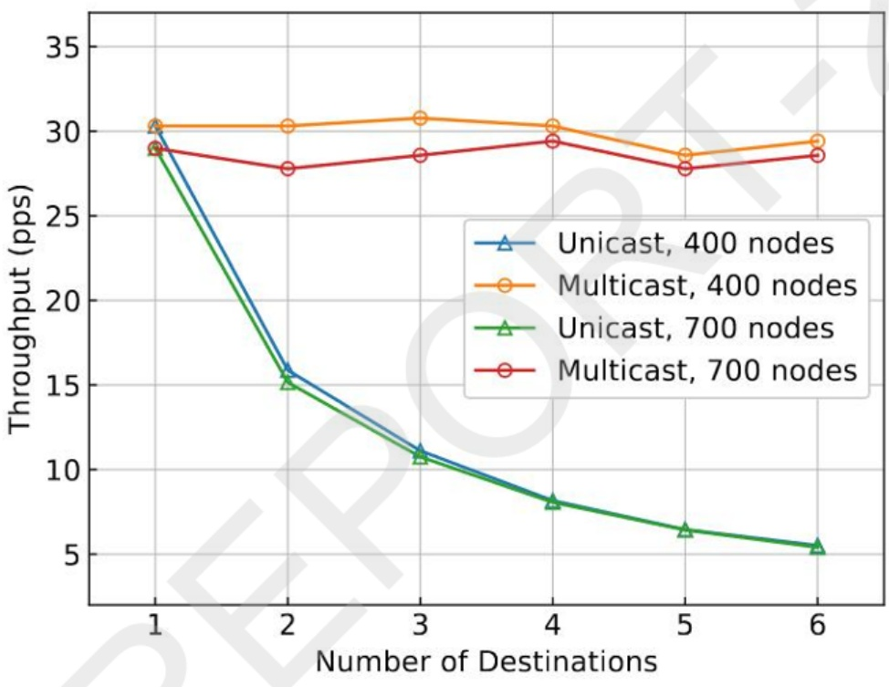

(c) Throughput

图67协同转发中使用组播路由与单播路由的吞吐量对比图

图 68 显示，建立 MCBR的控制消息开销明显低于 CBR。在建立 MCBR 时，当一些目标节点位于MCBR内或边缘时，这些节点将不会广播CTS。尽管如此，它们仍然可以从源节点接收多播数据包。因此，节点数量不会显著影响控制消息开销；相反，目的地节点的位置和广播CTS的顺序具有一定的影响。

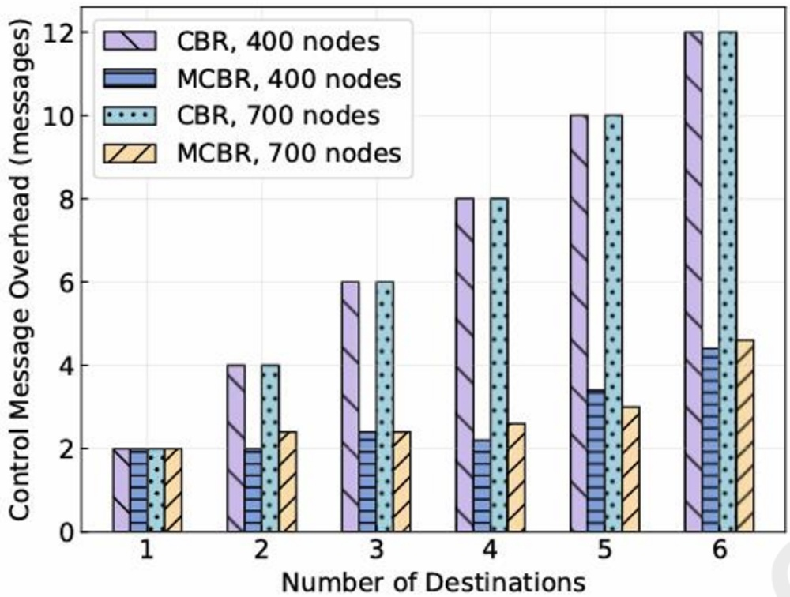

图68控制消息开销对比图

## 2.5半实物仿真演示验证平台

对于半实物仿真演示验证平台的研究主要围绕演示验证平台开发、协同侦察应用示范、组网理论技术验证三个方面展开，主要进展与重要成果如下图所示。

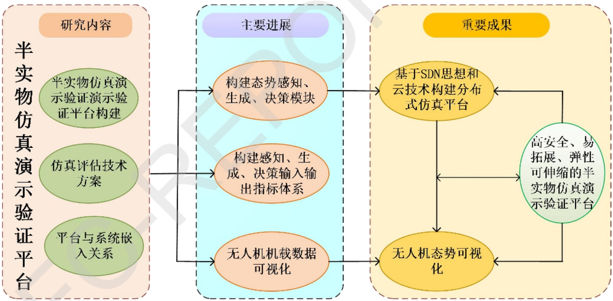

图69半实物仿真演示验证平台研究进展与主要成果

## 2.5.1 演示验证平台开发

## （1）技术架构与特性

基于SDN思想和云技术构建大规模无人机集群智能自组网半实物仿真平台，采用分布式架构分离数据平面和控制平面，通过数据驱动实时处理实现拓扑分层与用户数据隔离，具备应对大规模网络、多用户并发仿真的能力，拥有高安全性、易扩展性和弹性可伸缩性。

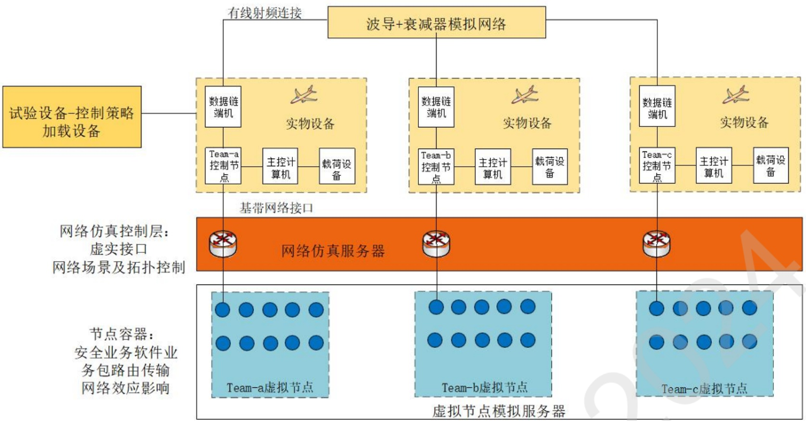

图 70 系统研制目标和技术思路

## （2）模拟仿真功能

半实物仿真演示系统可模拟典型无人系统网络环境和任务场景，支持项目原型系统设备及实物验证软件接入，以真实安全控制和载荷数据驱动仿真，实现虚实结合。

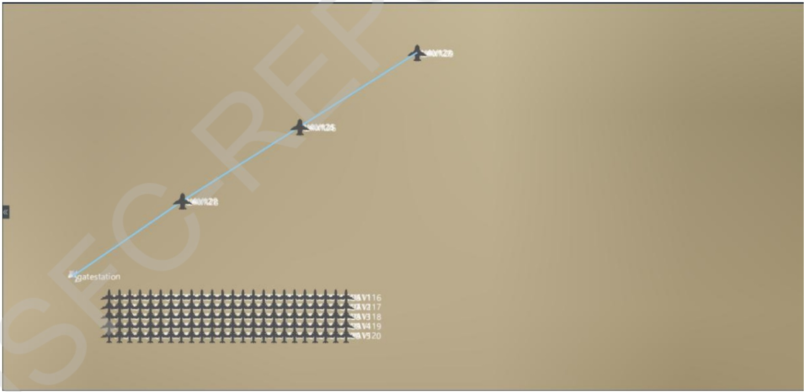

图71 仿真节点位置分布图

## （3）分布式网络仿真验证

运用分布式网络仿真验证技术，能快速搭建契合任务场景的网络试验环境，构建由多个分簇组成的无人机自组织网络，并在仿真中依据任务流程动态控制网络拓扑结构变化，利用数字化仿真技术突破无人机实飞验证在空域、节点规模、拓扑及通信条件生成等方面的限制。

## （4）虚实结合网络仿真

借助网络接口接入实际控制业务数据和载荷数据到仿真模型，基于容器技术封装真实自组网协议栈和安全相关业务软件镜像，以实际数据和业务逻辑驱动仿真，验证组网安全控制策略。

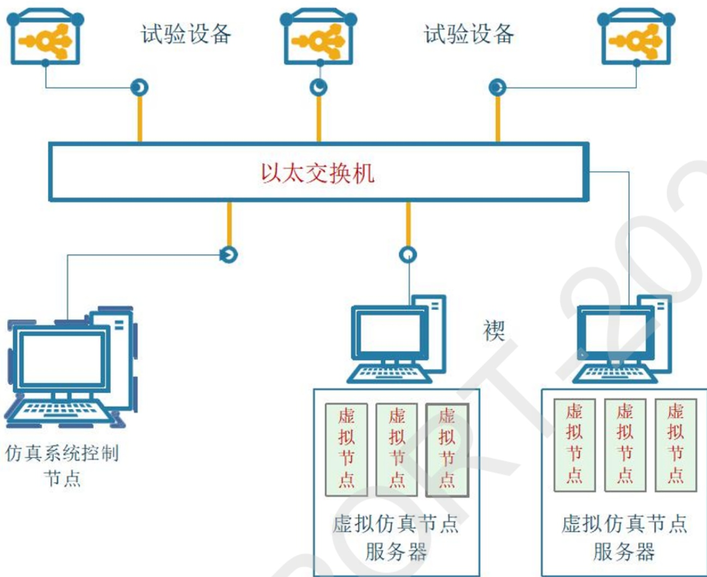

图 72 系统整体架构

## （5）软件定义微服务仿真架构

采用该架构，在网络仿真控制层实现任务场景生成、网络拓扑控制和全局信息采集管理，在虚拟节点层构建网络节点协议模型和业务模型，支持用户自定义新业务模型，便于仿真系统场景规模和模型扩展。

## （6） 网络效应模拟技术

对无人机网络的分簇、多跳路由、无线链路传输特性进行建模和仿真，为业务分组传输提供丢包、时延等网络效应模拟，验证安全管控逻辑在真实信道和网络环境中的性能。

图 73 十六架实物无人机及分布式仿真软件

## 2.5.2 协同侦察应用示范

## （1）多任务想定

在协同侦察应用中，构建了多任务想定。通过配置场景管理模块读入并格式化分类数据，将其分发至虚拟仿真平台和实物平台。在此过程中，对网络态势群智感知、信道资源群智决策和网络群智路由等软件模块进行了开发与应用。

## （2） 任务实施

## 1.非视距协同侦察

针对超远距离目标或遮挡隐蔽目标，进行实物无人机侦察任务规划，考虑目标被植被隐蔽程度和光照条件差异，选择不同飞行高度、绕行路线和协同方法；同时进行虚拟网络场景模拟，根据实物场地进行地域建模、网络建模和节点软件体系建模。在该场景下，隐蔽目标处于大型障碍物后或掩体内部，无人机集群需进行特殊编队队形规划以完成特定角度和覆盖范围的中继传输，网络可能出现分裂为无法互通的子网，导致网络密度不均匀和信道资源分配不均衡问题。

## 2.多角色协同侦察

根据不同任务目标，集群中的无人机搭载不同载荷，扮演不同角色。例如在基于可见光传感器的侦察活动中，将照明设备和拍摄设备分别装载到不同无人机上，还设置假目标诱导敌方雷达和无线设备开机。通过搭载激光传感器或高度传感器的无人机获取场地基准数据并导入虚拟仿真平台，根据基准数据智能调整网络状态和角色配备。

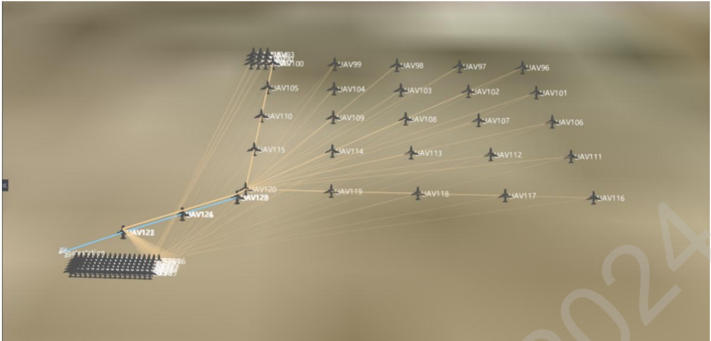

图 74 场景运行图

## 3.干扰诱骗环境下的协同侦察

在实物环境设置无人机GPS于扰诱骗，利用群智感知算法对干扰诱骗程度进行感知评估，做出威胁预警，并基于网络风险控制以及群智路由等关键技术进行相对导航纠正与路由修正。

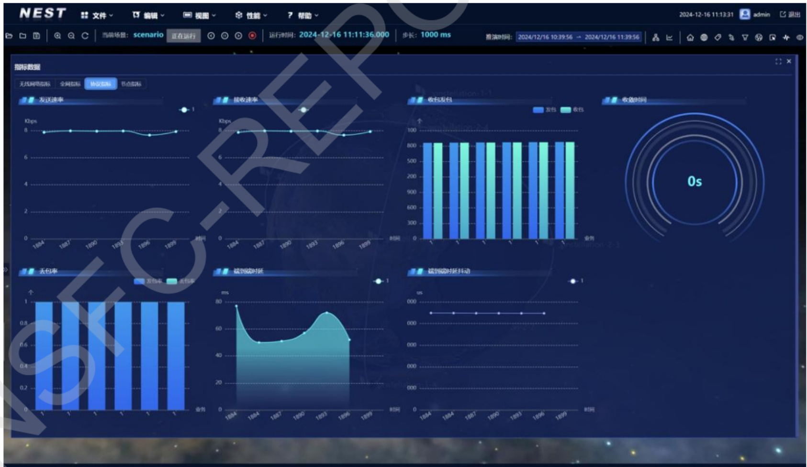

图 75 场景结果分析图

## 2.5.3 组网理论技术验证

## （1）平台搭建架构与数据交互机制

在平台搭建方面，项目组凭借丰富的虚实互联半实物仿真系统开发经验，精心打造了半实物演示验证平台。此平台的核心在于其高效的数据管理与分发体系。

配置数据作为整个系统运行的关键基础，被细致地划分为环境数据、应用数据和其他配置数据等多个类别。环境数据涵盖了诸如地理信息、气象条件、电磁干扰背景等因素，这些数据为无人机集群的飞行和任务执行提供了现实场景的模拟基础，确保无人机在虚拟环境中的行为能够贴近实际情况。应用数据则与具体的任务应用紧密相关，包括频谱侦察任务中的信号特征参数、目标识别任务中的图像数据格式与处理要求等，直接指导无人机在不同任务场景下的操作流程。

数据分发模块在平台中起着桥梁和枢纽的作用。它通过一系列复杂而有序的程序，将各类配置数据准确无误地实例化或实时分发至虚拟仿真平台和实物平台中的各类软件实体。在虚拟仿真平台中，软件实体如无人机仿真模型、网络通信模拟模块等接收这些数据后，能够构建出高度逼真的虚拟任务场景，模拟无人机在不同环境和任务条件下的飞行轨迹、通信链路建立与数据传输过程。对于实物平台中的软件实体，如无人机机载控制系统、地面控制站软件等，数据的注入使其能够根据实际任务需求和环境状况，精准地控制无人机的飞行姿态、传感器数据采集以及与其他无人机或地面设备的通信协作。这种数据的无缝流动和精准对接，确保了整个平台在物理和虚拟层面的紧密结合，为后续的技术应用和验证奠定了坚实的基础。 Y

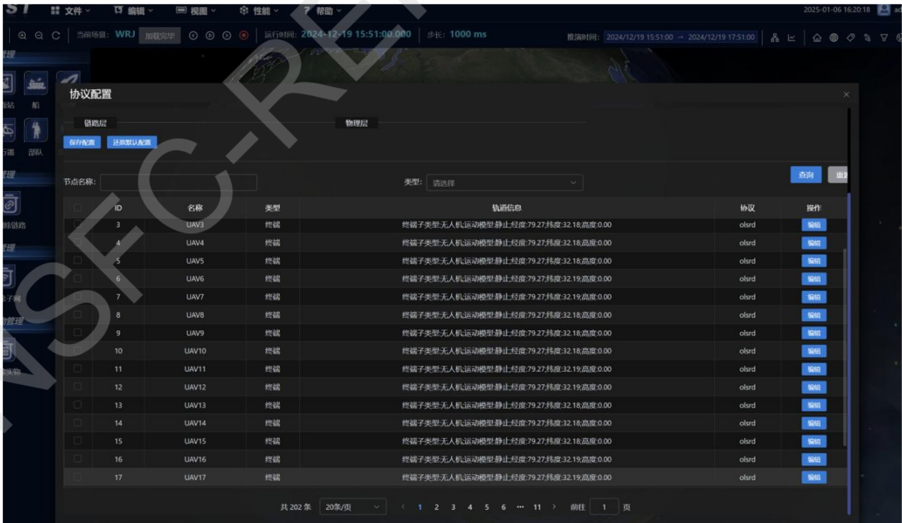

图76链路配置参数图

## （2）关键技术应用原理与优势

## 1.多主体建模驱动分布式协同创新

基于SDN思想和云技术构建的分布式协同框架体系，是实现平台高效运行和复杂任务协同的核心技术支撑。SDN思想的引入使得网络的控制平面与数据平面得以分离，在无人机集群的网络架构中，控制平面能够集中管理和动态调配网络资源，根据任务需求和网络状态实时调整路由策略、带宽分配等关键参数。例如，在频谱侦察任务中，当某些区域的频谱数据采集需要更高的带宽和更低的延迟时，控制平面可以迅速为相关无人机节点分配专用的网络通道，保障数据的快速传输。 1

云技术则为平台提供了强大的计算和存储资源池，使得大量无人机的仿真计算和数据存储得以高效实现。在多主体建模过程中，任务规划、群智组网和电磁环境等多域模型能够在分布式的架构下实现高度协同。任务规划模型根据目标区域的特点、任务优先级和无人机的性能参数，制定出最优的任务执行方案，包括无人机的起飞时间、飞行路径规划、侦察区域覆盖策略等。群智组网模型则基于群体智能算法，实现无人机之间的自组织网络构建和动态优化，确保在复杂环境和任务变化下网络的稳定性和可靠性。电磁环境模型通过对实际电磁环境的建模和仿真，为无人机的通信和频谱感知提供准确的环境参数，帮助无人机在电磁干扰环境中选择合适的通信频率和功率，提高通信的抗干扰能力。这种多域模型的协同工作机制，充分发挥了各模型的优势，实现了无人机集群在复杂任务场景下的高效协作和智能决策。

## 2.虚拟仿真框架保障模型一致性与高效迁移

采用基于容器化的方法构建的专用虚拟仿真框架，在实现真实平台模型向虚拟平台的无缝迁移方面具有独特的优势。容器化技术通过将应用程序及其依赖环境打包成独立的容器镜像，实现了应用的快速部署和隔离运行。在本平台中，真实平台上的无人机模型、传感器模型、通信协议模型等都可以被封装成容器镜像，并在虚拟仿真平台中快速启动和运行。

在模型迁移过程中，虚拟仿真框架确保了模型的一致性。这意味着在真实平台上经过验证和优化的模型，在虚拟平台上能够以相同的性能和行为表现进行运行和测试。例如，无人机的飞行动力学模型在真实飞行测试中经过了参数校准和性能优化，通过虚拟仿真框架迁移到虚拟平台后，能够在不同的虚拟环境条件下保持相同的飞行特性和响应规律，从而为无人机的控制算法开发和验证提供了可靠的基础。这种无缝迁移和模型一致性保障机制，大大提高了平台的开发效率和测试准确性，减少了因平台差异导致的模型误差和性能偏差，使得在虚拟平台上进行的仿真测试结果能够更加准确地反映真实平台的运行情况，为无人机集群技

术的研究和发展提供了有力的支持。

## 3. 研究人员的合作与分工

本项目由南京航空航天大学牵头，中国人民解放军陆军工程大学参与，具体参与人员如表1所示，合作与分工情况如下图所示。

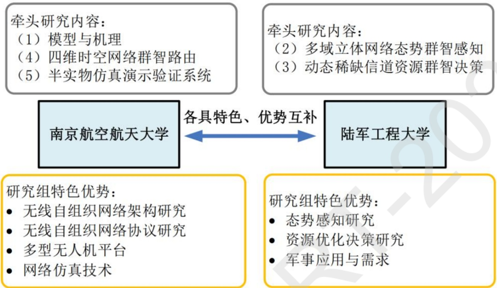

图 77 项目分工示意图

表1 项目主要参与人员情况表

| 姓名 | 出生年月 | 职称 | 单位名称 | 项目分工 | 角色 |
| --- | --- | --- | --- | --- | --- |
| 董超 | 1980-01 | 教授 | 南京航空航天大学 | 项目负责人 | 项目主持 |
| 徐煜华 | 1983-11 | 教授 | 中国人民解放军陆军工程大学 | 群智接入 | 课题主持 |
| 丁国如 | 1986-05 | 教授 | 中国人民解放军陆军工程大学 | 群智感知 | 课题主持 |
| 戚楠 | 1989-12 | 副教授 | 南京航空航天大学 | 资源决策 | 参与人 |
| 盛汉霖 | 1986-10 | 教授 | 南京航空航天大学 | 组网应用 | 参与人 |
| 朱小军 | 1986-03 | 教授 | 南京航空航天大学 | 网络路由协议 | 参与人 |
| 屈毓锛 | 1987-02 | 副教授 | 南京航空航天大学 | 组网模型与机理 | 参与人 |
| 陈润丰 | 1997-08 | 讲师 | 中国人民解放军陆 | 接入决策 | 参与人 |
|  |  |  | 军工程大学 |  |  |
| 冯智斌 | 1995-05 | 讲师 | 中国人民解放军陆军工程大学 | 接入决策 | 参与人 |
| 田世伟 | 1987-06 | 讲师 | 中国人民解放军陆军工程大学 | 位置感知 | 参与人 |
| 魏国峰 | 1995-01 | 讲师 | 中国人民解放军陆军工程大学 | 群智感知 | 参与人 |
| 孙佳琛 | 1994-10 | 讲师 | 中国人民解放军陆军工程大学 | 群智感知C | 参与人 |
| 张磊 | 1972-02 | 教授 | 南京航空航天大学 | 演示验证设计 | 参与人 |
| 殷晨宇 | 1999-06 | 工程师 | 南京航空航天大学 | 演示验证仿真 | 参与人 |
| 卜坤伦 | 1998-02 | 工程师 | 南京航空航天大学 | 演示验证实物 | 参与人 |

## 4. 国内外学术合作交流等情况

## 1）邀请国内外学者汇报交流:

• 2020年6月 26日，项目组邀请加拿大工程院院士、IEEE Fellow、加拿大西安大略大学 Xianbin Wang 教授做了题为“Intelligent Wireless Communications in 5G/6G Networks”的线上报告。

2020年7月27日，项目组邀请丹麦奥尔堡大学范伟副教授做了题为 “Plane Wave Generator Design for 5G antenna systems: A review and future aspects”的线上报告。

2021年5月15日，项目组邀请IEEEFellow、美国斯蒂文斯理工学院终身教授、加拿大工程院院士姚育东教授于南航天地一体频谱认知智能实验室进行学术交流，并做了名为“我们在人工智能时代学习、工作、成长”的讲座。

2021年9月3日，应项目组邀请，奥地利国家技术研究所(Austrian Institute of Technology，AIT）首席科学家 Thomas Zemen教授团队通过线上会议的形式和项目组成员进行了学术交流。双方就态势建模中面向6G通信的信道模拟可实现性以及产业化问题进行了深入探讨。

2021年9月4日，项目组邀请IEEETCOM、TWC编委、伦敦玛丽女王大学刘元玮副教授通过腾讯会议进行线上学术分享，以“STAR:

Simultaneous Transmission and Reflection for 360° Coverage by Intelligent Surfaces”为题展开了精彩的学术报告。

• 2022年3月21日，项目组邀请英国皇家工程院院士、IEEE fellow、IET fellow、EURASIP fellow、南安普顿大学 Lajos Hanzo教授进行线上学术分享，并以“Space, Air, Ground Integrated Networking: From Single- to Multi-Component Pareto Optimization”为题展开了精彩的学术报告。

● 2023年5月4日，项目组邀请瑞典隆德大学终身教职系列助理教授蔡雪松做了题为“High Resolution Parameter Estimationfor Radio Channels”的线上报告。

• 2023 年5 月 26 日，项目组邀请 IEEE Fellow、加拿大工程院院士、欧洲科学院院士、香港理工大学郭嵩教授于南航天地一体频谱认知智能实验室进行学术交流，就边缘智能领域展开交流合作。

● 2023年11月7日，项目组邀请西班牙马德里理工大学Cesar Briso教授来南航进行学术交流，以“A Connected Sky: 6G Communications for UAVs”为题展开了精彩的学术报告

• 2023年 11 月 15日，项目组邀请英国萨塞克斯大学 Maziar Nekovee 院士来南航进行学术交流，以“New Approaches To Achieve Netzero in Interconnected Energy and Communication Networks”为题展开了精彩的学术报告。

2024年7月10日，项目组邀请希腊塞萨勒大学教授TheodorosA. Tsiftsis 来南航进行学术交流，以“University of Thessaly Recent: Activities & Neuromorphic-Inspired Metasurfaces”为题展开了精彩的学术报告。

## 2）主办、参与的国内外主流会议:

● 2022年8月，项目组在南京协助承办了全国电磁频谱空间人工智能学术大会。

● 2022年8月25日，项目组在南京承办了“第六届未来网络发展大会的网络智能与大数据论坛”。

2023年11月17日，项目组在南京承办了“电磁频谱杀伤网技术专题论坛”。

2023年11月24日，项目组在无锡承办了2023中国物联网大会（CIOTC）和2023年全国通信理论与技术学术会议中的“频谱资源与无线传输专题论坛”。

● 2024年项目组在宁波承办了中国电子信息年会“低空智联网组网与控制技术”专题论坛。

2020年5月18日至5月22日，项目组参与人屈毓锛参加了2020年 IEEE International Parallel and Distributed Processing Symposium 国际学术会议，并发表了题为“Robust Server Placement for Edge Computing”的会议论文。

●2021年12月7日至12月11日，项目组学生经宇骞参加了2021年 IEEE Global Communications Conferenc 国际学术会议，并发表了题为“Joint UAV Location and Resource Allocation for Air-Ground Integrated Federated Learning”的会议论文。

● 2022年10月19日至10月23日，项目组学生吴飞宇参加了2022年 IEEE International Conference on Mobile Ad Hoc and Smart System 国际学术会议，并发表了题为“CIOFL: Collaborative Inference-Based Online Federated Learning for UAV Object Detection”的会议论文。

● 2022年12月4日至12月8日，项目组学生刘仕杰参加了2022年 IEEE Conference on Global Communications 国际学术会议，并发表了题为“Performance Evaluation of BATMAN-adv Protocol on Convergecast Communication in UAV Networks”的会议论文。

2022年12月17日至12月19日，项目组学生周传鑫参加了2022年 IEEE International Symposium on Parallel and Distributed Processing with Applications 国际学术会议，并发表了题为“Multi-Antenna Based Fast Routing Recovery Protocol for Dynamic UAV Networks”的会议论文。

● 2023年5月17日至5月20日，项目组学生曹怡璐参加了 2023年 IEEE Conference on Computer Communications Workshops 国际学术会议，并发表了题为“SFC Deployment in Space-Air-Ground Integrated Networks Based on Matching Game”的会议论文。

● 2023年5月 28日至6月1日，项目组学生尤嘉豪参加了2023年 IEEE International Conference on Communications 国际学术会议，并发表了题为“Computation Offloading for Uncertain Marine Tasks by Cooperation of UAVs and Vessels”的会议论文。

2024年4月21日至4月24日，项目组学生吴佳婧参加了2024年 IEEE Wireless Communications and Networking Conference 国际学术会议，并发表了题为“Optimal UAV Swarm Reconstruction Strategy Based on Minimum Cost Maximum Flow Algorithm"和“rotocol for Maximizing Sampling Frequency of Spectrum Reconnaissance UAV Clusters”的会议论文。

● 2024年6月9日至6月13日，项目组学生张珉参加了2024年IEEE International Conference on Communications 国际学术会议，并发表了题为“Adaptive and Load Balancing Ground Users Access Design for UAV-Assisted Networks”的会议论文。

2024年8月7日至8月9日，项目组学生赵述军参加了2024年IEEE/CIC International Conference on Communications in China 国际学术会议，并发表了题为“Energy-Efficient Resource Allocation for Adaptive NOMA assisted UAV Communications Network”的会议论文。

## 3）大会特邀报告:

● 2022年9月18日，项目组课题负责人丁国如教授受邀参加中国电子学会2022年全国电子战大会，并做了题为“群目标网络电磁行为分析”的专题论坛报告。

● 2023年11月17日，项目负责人董超教授受邀参加中国电子学会2023年航天电子对抗学术年会，并做了题为“面向频谱杀伤网的无人机集群智能协同技术”的专题论坛报告。

2023年11月24日，项目负责人董超教授受邀参加2023年中国物联网大会和2023年全国通信理论与技术学术会议，并做了题为“无人机蜂群全空中自主计算研究”的专题论坛报告。

● 2024年9月22日，项目组课题负责人丁国如教授受邀参加中国指挥与控制学会2024第二届态势感知认知创新和产业论坛，并做了题为“电磁频谱空间数字孪生技术与应用探索”的专题论坛报告。

● 2024年8月 25日，项目组课题负责人丁国如教授受邀参加中国电子学会2024年全国通信理论与技术学术会议，并做了题为“认知通信与干扰一体化理论与方法探索”的专题论坛报告。

## 4）参加国际发明展:

• 2023 年，项目组成果“Intelligent Divine Eye on Air: High-Precision Real-Time Object Detection System Based on Multi-UAV Collaboration(智慧天眼:无人机协同高精度实时目标检测系统）”斩获第48届日内瓦国际发明展银奖。该成果不仅能够通过协同的方式整合无人机集群有限的算力和存储资源，进行高精度实时目标检测，更能在部分节点失去连接的情况下，通过任务动态分配，快速、可靠地完成对目标的检测任务，能为应急救援、环境监测、安全防护、侦察监视等重要领域提供重要支持。

## 5. 存在的问题、建议及其他需要说明的情况

## (二）成果部分

## 1. 项目取得成果的总体情况

大规模无人机集群在精准农业、军事侦察与作战等领域的广泛应用迫切需要集群自主能力的提升，如何在集群内构建无人机自组网并改善其性能以提供高效可靠的机间协同成为关键，而空间的立体性、资源的稀缺性以及节点的移动性等特征给大规模无人机自组网的性能提升带来严峻的挑战。顺应智能网联的技术趋势，本项目围绕推动我国大规模无人机集群智能组网与提升集群自主能力这一核心目标，展开大规模无人机集群智能自组网基础理论和关键技术研究，项目执行期间主要取得的成果如表3所示。

表2项目研究目标与成果

| 成果形式 | 预期成果 | 实际成果 |
| --- | --- | --- |
| 研究报告 | 1份 | 1份 |
| 高水平期刊论文 | 30篇，其中 SCI 20篇，IEEE核心期刊论文10篇以上 | 110篇，其中 SCI79篇，IEEE核心期刊论文60篇，CCF推荐会议论文10篇。 |
| 申请发明专利 | 6~10项 | 申请国家发明专利33项，申请国际发明专利1项，其中授权国家发明专利18项。 |
| 人才培养 | 培养博士8 | 培养博士8名，硕士28名；项目组成员获批“国防科技卓 |
|  | 名、硕士12名 | 越青年科学基金”2人次，“国家杰出青年科学基金”1人次，“国家万人计划青年拔尖人才”2人次，教育部“青年长江学者”1人次。 |
| 学术交流 | 参加国际会议不少于6次，邀请国际知名无线网络专家不少于8名 | 参加国际学术会议10次；受邀进行大会报告5次；主办、承办国内外主流会议5次；邀请国际知名无线网络专家11名。 |
| 搭建演示验证平台 | 1个 | 搭建1个平台:大规模无人机集群智能自组网半实物仿真平台。 |
| 获奖 |  | 获奖情况:1）2024年，国防科技进步一等奖；2）2022年，江苏省科学技术一等奖；3）2021年，中国发明协会“发明创业奖-创新奖”一等奖；4）2023年，中国物联网十大科技进展；5）2023年，日内瓦国际发明展银奖；6）2023年，空军首届航空创意挑战赛一等奖；7）2023年，国际无人系统集群技术竞赛第一名。 |
| 成果应用 | D | 成果应用:1）长江低空智联网；2）陆军转型建设无人平台通信装备；3）新一代电磁频谱管控系统；4）某战区联合指挥信息系统频谱管控业务。 |

具体取得的理论研究成果如下:

## 理论研究成果

（1）组网模型与机理:针对动态环境中的不确定性和复杂任务的执行需求，面向群体智能协同，提出协同认知动态系统模型，实现无人机集群的自主协同、动态决策和高效任务执行。针对高能效的异质无人机资源优化问题，提出次序重叠联盟形成博弈模型以最大化任务执行效用。面向网络风险控制，构建基于OODA环的弹性协作智能架构，提高无人机集群协作的鲁棒性和灵活性。

相关成果发表IEEE核心期刊论文20篇，EI论文14篇，获得2024年度国防科技进步一等奖，申请国家发明专利11项，申请国际发明专利1项，其中授权国家发明专利3项。

(2）多域立体网络态势群智感知:针对网络态势精准高效感知这一核心问题，本项目构建面向波束信号感知的多节点协作检测模型，提出面向多节点协同定位的凸集投影算法和迭代平行投影算法，并基于室外实验验证所提算法的精度和效率；从网络通联拓扑感知的模型构建和机理揭示入手，提出利用多传感器信息融合的协同拓扑感知框架来应对无线信道的随机性，形成对时变通联拓扑的捕获和跟踪能力；将网络频谱状态演化特性建模为一个多维特征向量，提出基于深度迁移学习与生成对抗网络的跨频段频谱预测方法，提升态势感知的精度。

相关成果发表IEEE核心期刊论文24篇，EI论文14篇，获江苏省科学技术一等奖1项，申请国家发明专利6项，其中授权国家发明专利3项。

(3）动态稀缺信道资源群智决策:面向联盟架构的信道资源分层决策需求，构建基于联盟博弈的任务层与资源层联合博弈优化模型，提出基于梯度投影法的联合频谱分配与联盟形成算法。针对联盟间快速稳健资源分配问题，提出异构双网络轨迹-用频联合优化方法，并构建迁移知识库加速算法收敛过程。针对联盟内自主信道接入控制问题，提出基于碰撞发现的联盟内无人机信道接入方法与“强感知”辅助“弱感知”多用户协同抗扰方法，并在USRP硬件平台上验证了方法的有效性。

相关成果发表EEE核心期刊论文13篇，EI论文2篇，申请国家发明专利7项，其中授权国家发明专利5项。

(4)四维时空网络群智路由:面向立体空间覆盖的联盟骨干节点动态选举问题，提出基于交替优化的高效覆盖分簇算法。针对多维QoS单播路由构建需求，提出基于频谱感知的多信道链路快速更新方法，设计基于联合预测和熵权的路由协议。针对高效组播路由构建需求，提出基于阻继网络的组播路由协议，设计面向组播的受控阻塞区域的构建算法。

相关成果发表IEEE核心期刊论文3篇，EI论文6篇，获2022-2023年中国物联网十大科技进展奖励，申请国家发明专利9项，其中授权国家发明专利7项。

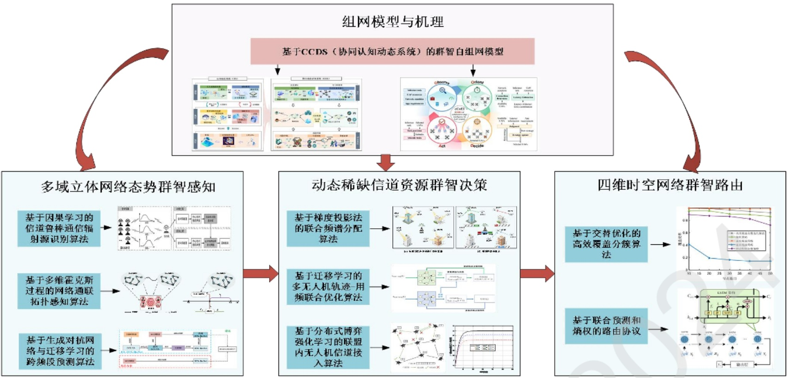

图 78 项目主要理论成果

## 2. 项目成果转化及应用情况

（1）转让国家发明专利0项，总金额:0万元。

## （2） 成果应用服务情况:

1）针对低空经济中低空网络的覆盖难题，提出四维时空网络路由技术，与江苏联通合作，建成覆盖长江南京段98公里、江面至低空 500米范围的立体覆盖网络，提升了长江低空智联网的立体覆盖能力，作为牵头单位，入选中国电子学会2022-2023年度中国物联网十大科技进展。

2）针对无人机集群协同执行DNN等复杂神经网络计算的难题，使用四旋翼无人机搭载自组网、相机、英伟达处理器等载荷，创新协同推理、在线学习、机间组网通信等技术，研发无人机协同目标识别系统，应用于南部战区75841部队，不依赖地面处理的情况下，目标识别率达到90%以上，识别时延小于20S。

3）针对无人机集群立体频谱环境精准感知难等问题，提出了电磁频谱深度感知技术，更好地发掘了异构分布的时-空-频多维资源，实现了不规则信号覆盖下频谱资源的精细化感知。该技术应用在中国电子科技集团公司第二十二研究所研制的新一代电磁频谱管控系统中，结合无人机应用场景实现了空地协同的频谱资源稳健决策，拓展了电磁频谱管控维度，显著提升了频谱利用率，平均系统吞吐量提升15倍。在北京奥运、国庆阅兵、反恐维稳等多次重大活动保障中发挥了重要作用，为我国新一代电磁频谱管控系统的研制提供了重要理论和技术支撑。

4）针对无人机集群频谱资源利用率低的问题，突破了预分配和集中式分配的传统频谱接入方式，研发了无人机编队动态自主频谱决策技术，实现了复杂动态电磁环境下的无人机集群智能频谱决策。成果应用于某战区联合指挥信息系统频谱管控业务处理软件，频谱决策时间从分钟级降为秒级，该软件已在战区常态化部署应用，具有重要的社会军事效益。

图 79 成果应用服务

## 3. 人才培养情况

（1）项目组教师人才培养情况:

董超教授于2024年获批“国防科技卓越青年科学基金”；

• 丁国如教授于 2024年获批“国家杰出青年科学基金”；

徐煜华教授于2021年获批“国防科技卓越青年科学基金”；

徐煜华教授于2022年入选“国家万人计划青年拔尖人才”；

董超教授于2020年入选“国家万人计划青年拔尖人才”；

● 丁国如教授于2020年入选教育部“青年长江学者”。

## （2）项目组学生培养情况:

项目进行期间共培养，博士生8名，硕士生28名，其中:

指导1 名学生获得2021年博士研究生国家奖学金；

● 指导1名学生获得2022年博士研究生国家奖学金；

● 指导3 名学生获得2024年硕士研究生国家奖学金；

指导1名学生获得2024年吴仲华优秀博士学位论文奖；

指导1名学生获得2022年全军优秀硕士学位论文；

指导学生获得2023年空军首届航空创意挑战赛一等奖；

指导学生2023年国际无人系统集群技术竞赛第一名；

● 指导学生两次获得全国大学生物联网技术与应用“三创"大赛一等奖（2022年、2023年）；

· 指导学生在“兆易创新杯”第十九届中国研究生电子设计竞赛中获得全国总决赛最佳论文奖及技术类竞赛全国总决赛团队一等奖。

## 4. 其他需要说明的成果

1）项目成果在相关领域获得了认可，荣获2024年度国防科技进步一等奖、2022年度江苏省科学技术一等奖与2023年度中国物联网十大科技进展等奖励。

图80获奖证明

## 5. 项目成果科普性介绍或展示网站

1）2021年，项目组研究成果获2021年度中国发明协会发明创业奖创新奖等奖:https://cog.nuaa.edu.cn/2021/1207/c798a271477/page.htm

2）2022年，项目组联合主办首届全国电磁频谱空间人工智能学术大会于南京召开:https://cog.nuaa.edu.cn/2022/0808/c757a289729/page.htm

3）2022年，项目组联合承办的第六届未来网络发展大会的网络智能与大数据论坛于南京召开:https://cog.nuaa.edu.cn/2022/0827/c757a290622/page.htm

4）2023年，项目组承办的电磁频谱杀伤网技术专题论坛于南京召开:https://cog.nuaa.edu.cn/2023/1120/c754a325046/page.htm

5）2023年，项目组在2023中国物联网大会（CIOTC）和2023年全国通信理论与技术学术会议中承办的“频谱资源与无线传输专题论坛”于无锡召开:https://cog.nuaa.edu.cn/2023/1208/c754a326851/page.htm

6）2023年，项目组成果获日内瓦国际发明展银奖:https://cog.nuaa.edu.cn/2023/0622/c757a314010/page.htm

7）2024年，项目组承办的中国电子信息年会“低空智联网组网与控制技术”专题论坛在宁波召开:https://cog.nuaa.edu.cn/2024/0506/c754a338165/page.htm

## 研究成果目录

项目负责人通过系统，从文献库中检索研究成果或者按要求格式自行填入。请按照期刊论文、会议论文、学术专著、专利、会议报告、标准、软件著作权、科研奖励、人才培养、成果转化的顺序列出，其它重要研究成果如标本库、科研仪器设备、共享数据库、获得领导人批示的重要报告或建议等，应重点说明研究成果的主要内容、学术贡献及应用前景等。

项目负责人不得将非本人或非参与者所取得的研究成果、与受资助项目无关的研究成果、未标注国家自然科学基金资助和项目批准号的论文以及取得时间早于项目资助期开始时间的研究成果列入报告中。发表的研究成果（包括专利），项目负责人和参与者均应如实注明得到国家自然科学基金项目资助和项目批准号，科学基金作为主要资助渠道或者发挥主要资助作用的，应当将自然科学基金作为第一顺序进行标注。

## 期刊论文

（1）董超；经宇骞；屈毓锛；周博；黄洋；贾子晔；戴海鹏；吴启晖；面向低空智联网频谱认知与决策的云边端融合体系架构，通信学报，2023，44(11):1-12. EI，北大中文核心期刊. 第一标注

(2) 曾子鸣；董超；朱小军；贾子晔；面向群体快速融合的仿生无人机集群架构，电信科学，2022，38(8):17-27. 北大中文核心期刊. 第一标注

(3) Lang Ruan; Guangxia Li; Weiheng Dai; Shiwei Tian; Guangteng Fan; Jian Wang; Xiaoqi Dai; Cooperative Relative Localization for UAV Swarm in GNSS-Denied Environment: A Coalition Formation Game Approach, IEEE Internet of Things Journal, 2022， 9(13): 11560-11577. SCIE, EI. 第一标注

(4) Yeting Huang; Nan Qi; Zanqi Huang; Luliang Jia; Qihui Wu; Rugui Yao; Connectivity Guarantee Within UAV Cluster: A Graph Coalition Formation Game Approach, IEEE Open Journal of the Communications Society, 2023, 4: 79-90. EI. 第十标注

(5) Shuo Feng; Simon Haykin; Coordinated Cognitive Risk Control for Bridging Vehicular Radar and Communication Systems, IEEE Transactions on Intelligent Transportation Systems, 2020, 23(5): 4135-4150. SCIE, EI. 第五标注

(6) Yuben Qu; Hao Sun; Chao Dong; Jiawen Kang; Haipeng Dai; Qihui Wu; Elastic Collaborative Edge Intelligence for UAV Swarm: Architecture, Challenges, and Opportunities, IEEE Communications Magazine, 2024, 62(1):62-68. SCIE，EI. 第一标注

(7) Yao Ji; Chao Dong; Xiaojun Zhu; Qihui Wu; Fair-Energy Trajectory Planning for Multi-Target Positioning Based on Cooperative Unmanned Aerial Vehicles, IEEE Access, 2020, 8: 9782-9795. SCIE, EI. 第四标注

(8) Yifan Zhou; Fuhui Zhou; Huilin Zhou; Derrick Wing Kwan Ng; Rose Qingyang Hu; Robust Trajectory and Transmit Power Optimization for Secure UAV-Enabled Cognitive Radio Networks, IEEE Transactions on Communications 2020，68(7):4022-4034.SCIE，EI.第五标注

(9) Chao Dong; Yun Shen; Yuben Qu; Kun Wang; Jianchao Zheng; Qihu Wu; Fan Wu; UAVs as an intelligent service: Boosting edge intelligence for air-ground integrated networks, IEEE Network Magazine, 2021, 35(4):167-175. SCIE，EI. 第二标注

(10) Yuben Qu; Chao Dong; Jianchao Zheng; Haipeng Dai; Fan Wu; Song Guo; Anpalagan Alagan; Empowering Edge Intelligence by Air-Ground Integrated Federated Learning, IEEE NETWORK, 2021, 35(5): 34-41. SCIE, EI. 第二标注

(11) Yuben Qu; Haipeng Dai; Haichao Wang; Chao Dong; Fan Wu; Song Guo; Qihui Wu; Service Provisioning for UAV-Enabled Mobile Edge Computing, IEEE JOURNAL ON SELECTED AREAS IN COMMUNICATIONS, 2021, 39(11):3287-3305. SCIE，EI. 第二标注

(12) Yuben Qu; Haipeng Dai; Yan Zhuang; Jiafa Chen; Chao Dong; Fan Wu; Decentralized Federated Learning for UAV Networks: Architecture, Challenges, and Opportunities, IEEE Network, 2021, 35(6): 156-162. SCIE, EI. 第二标注

(13) Wei Wu; Fuhui Zhou; Baoyun Wang; Qihui Wu; Chao Dong; Rose Qingyang Hu; Unmanned Aerial Vehicle Swarm-Enabled Edge Computing: Potentials, Promising Technologies, and Challenges, IEEE Wireless Communications, 2022，29(4):78-85.SCIE，EI.第五标注

(14) Yuben Qu; Lihao Wang; Haipeng Dai; Weijun Wang; Chao Dong; Fan Wu; Server Placement for Edge Computing: A Robust Submodular Maximization Approach, IEEE Transactions on Mobile Computing, 2023, 22(6):3634-3649. SCIE，EI. 第二标注

(15) Ziye Jia; Qihui Wu; Chao Dong; Chau Yuen; Zhu Han; Hierarchical Aerial Computing for Internet of Things via Cooperation of HAPs and UAVs, IEEE Internet of Things Journal, 2023, 10(7): 5676-5688. SCIE, EI. 第一标注

(16) Yun Shen; Yuben Qu; Chao Dong; Fuhui Zhou; Qihui Wu; Joint Training and Resource Allocation Optimization for Federated Learning in UAV Swarm, IEEE Internet of Things Journal, 2023, 10(3):2272-2284. SCIE，EI. 第一标注

(17) Weiqing Ren; Yuben Qu; Chao Dong; Yuqian Jing; Hao Sun; Qihui Wu; Song Guo; A Survey on Collaborative DNN Inference for Edge Intelligence, Machine Intelligence Research, 2023, 20: 370-395. SCIE, EI. 第一标注

(18) Yuben Qu; Dongyu Lu; Haipeng Dai; Haisheng Tan; Shaojie Tang; Fan Wu; Resilient Service Provisioning for Edge Computing, IEEE Internet of Things Journal, 2023, 10(3): 2255-2271. SCIE, EI. 第二标注

(19) Hao Sun; Chao Dong; Yuben Qu; Haipeng Dai; Zhenhua Li; Lei Zhang; Qihui Wu; Song Guo; All-Sky Autonomous Computing in UAV Swarm, IEEE Transactions on mobile computing, 2024, 23(12): 13258-13274. SCIE, EI. 第一标注

(20) Yuben Qu; Haipeng Dai; Fan Wu; Dongyu Lu; Chao Dong; Shaojie Tang; Guihai Chen; Robust Offloading Scheduling for Mobile Edge Computing, IEEE Transactions on Mobile Computing, 2022, 21(7): 2581-2595. SCIE, EI. 第五标注

(21) Kefeng Guo; Chao Dong; Kang An; NOMA-Based Cognitive Satellite Terrestrial Relay Network: Secrecy Performance Under Channel Estimation Errors and Hardware Impairments, IEEE Internet of Things Journal, 2022, 9(18):17334-17347. SCIE，EI. 第二标注

(22) Weijun Wang; Haipeng Dai; Chao Dong; Fu Xiao; Jiaqi Zheng; Xiao Cheng; Deployment of Unmanned Aerial Vehicles for Anisotropic Monitoring Tasks, IEEE Transactions on Mobile Computing, 2022, 21(2): 495-513. SCIE, EI. 第十标注

(23) Xiaojun Zhu; Zhouqing Han; Shaojie Tang; Lijie Xu; Chao Dong; Deploying the Minimum Number of Rechargeable UAVs for a Quarantine Barrier, ACM Transactions on Sensor Networks, 2023, 19(2). SCIE, EI. 第二标注

(24) Ziye Jia; Qihui Wu; Chao Dong; Chau Yuen; Zhu Han; Column Generation for Optimization Problems in Communication Networks, IEEE Network, 2023, 37(3): 86-92. SCIE， EI. 第三标注

(25) Jiachen Sun; Jinlong Wang; Jin Chen; Guoru Ding; Fandi Lin; Clustering Analysis for Internet of Spectrum Devices: Real-World Data Analytics and Applications, IEEE Internet of Things Journal, 2020, 7(5):4485-4496. SCIE，EI. 第四标注

(26)孙佳琛；王金龙；丁国如；陈瑾；群体智能协同通信:愿景、模型和关键技术，中国科学:信息科学，2020，50(3):307-317. 北大中文核心期刊. 第三标注

(27) Guofeng Wei; Bangning Zhang; Guoru Ding; Bing Zhao; Kefeng Guo; Daoxing Guo; On the Detection of a Non-Cooperative Beam Signal Based on Wireless Sensor Networks, Security and Communication Networks, 2020, 2020(1). SCIE，EI. 第三标注

(28) Guofeng Wei; Bangning Zhang; Guoru Ding; Bing Zhao; Yimin Wei; Daoxing Guo; Massive MIMO-Based Distributed Signal Detection in Multi-Antenna Wireless Sensor Networks, Sensors, 2020, 20(7). SCIE, EI. 第三标注

(29) Ning Yang; Pinghui Li; Daoxing Guo; Linyuan Zhang; Guoru Ding; Detection of Transmitted Power Violation Based on Geolocation Spectrum Database in Satellite-Terrestrial Integrated Networks, Sensors, 2020, 20(16). SCIE， EI. 第三标注

(30）孙佳琛；王金龙；丁国如；陈瑾；龚玉萍；频谱知识图谱:面向未来频谱管理的智能引擎，通信学报，2021，42(5):1-12.EI，北大中文核心期刊. 第四标注

(31) Yutao Jiao; Ping Wang; Dusit Niyato; Bin Lin; Dong In Kim; Toward an Automated Auction Framework for Wireless Federated Learning Services Market, IEEE TRANSACTIONS ON MOBILE COMPUTING, 2021, 20(10):3034-3048. SCIE，EI. 第十标注

(32) Jiangchun Gu; Guoru Ding; Yitao Xu; Haichao Wang; Qihui Wu; Proactive optimization of transmission power and 3D trajectory in UAV-assisted relay systems with mobile ground users, CHINESE JOURNAL OF AERONAUTICS, 2021，34(3):129-144. SCIE，EI. 第三标注

(33) Fandi Lin; Jin Chen; Guoru Ding; Yutao Jiao; Jiachen Sun; Haichao Wang; Spectrum prediction based on GAN and deep transfer learning: A cross-band data augmentation framework, CHINA COMMUNICATIONS, 2021, 18(1):18-32. SCIE. 第五标注

(34) Rui Xu; Daoxing Guo; Bangning Zhang; Guoru Ding; Finite Blocklength Covert Communications with Random Selection of Channe1 Use, IEEE WIRELESS COMMUNICATIONS LETTERS, 2021, 10(9): 2085-2089. SCIE, EI. 第三标注

(35) Yan Yan; Kang An; Bangning Zhang; Wei-Ping Zhu; Guoru Ding; Daoxing Guo; Outage-Constrained Robust Multigroup Multicast Beamforming for Satellite-Based Internet of Things Coexisting With Terrestrial Networks, IE EE Internet of Things Journa1, 2021, 8(10): 8159-8172. SCIE, EI. 第四标注

(36) Peng Tang; Yitao Xu; Guofeng Wei; Yang Yang; Chao Yue; Specific emitter identification for IoT devices based on deep residual shrinkage networks, China Communications, 2021, 18(12): 81-93. SCIE. 第四标注

(37) Kang Li; Yutao Jiao; Yehui Song; Jinghua Li; Chao Yue; Passive localization of multiple sources using joint RSS and AOA measurements in spectrum sharing system, China Communications, 2021, 18(12):65-80. SCIE. 第四标注

(38）宋叶辉；丁国如；徐承龙；孙佳琛；汤鹏；面向非合作无人机通信网络的通联拓扑推理技术，电子与信息学报，2022，44(3):924-939.EI，北大中文核心期刊.第三标注

(39) Fei Huang; Guangxia Li; Shiwei Tian; Jin Chen; Guangteng Fan; Jinghui Chang; Safe Navigation for UAV-enabled Data Dissemination by Deep Reinforcement Learning in Unknown Environments, China Communications, 2022， 19(1):202-217. SCIE. 第一标注

(40) Fei Huang; Guangxia Li; Haichao Wang; Shiwei Tian; Yang Yang; Jinghui Chang; Navigation for UAV Pair-Supported Relaying in Unknown IoT Systems with Deep Reinforcement Learning, Chinese Journal of Electronics, 2022， 31(3):416-429. SCIE，EI. 第一标注

(41）黄斐；李广侠；王海超；丁国如；田世伟；苌敬辉；宋叶辉；高效节能的无人机多用户携能传输优化研究，宋叶辉，2022，37(6):1297-1313. 北大中文核心期刊. 第二标注

(42) Rui Xu; Daoxing Guo; Bangning Zhang; Guoru Ding; Finite Blocklength Covert Communications in Interweave Cognitive Radio Networks, IEEE Communications Letters, 2022, 26(9): 1989-1993. SCIE, EI. 第三标注

(43) Rui Xu; Bangning Zhang; Daoxing Guo; Haichao Wang; Guoru Ding; Finite Blocklength Covert Communications: When the Warden Wants to Detect the Communications Quickly, IEEE Transactions on Vehicular Technol1ogy， 2022， 71(10):11278-11283. SCIE，EI. 第三标注

(44) Jiangchun Gu; Guoru Ding; Haichao Wang; Yitao Xu; Integrated Communications and Jamming: Toward Dual-Functional Wireless Networks Under Antagonistic Environment, IEEE Communications Magazine, 2023, 61(5):181-187. SCIE，EI. 第五标注

(45) Jiangchun Gu; Guoru Ding; Yizhen Yin; Haichao Wang; Yitao Xu; Yehui Song; Cognitive J2SAC: Joint jamming, sensing, and communication under antagonistic environment, China Communications, 2023, 20(9):78-95. SCIE. 第四标注

(46) Ning Yang; Daoxing Guo; Yutao Jiao; Guoru Ding; Ting Qu; Lightweight Blockchain-Based Secure Spectrum Sharing in Space- Air - Ground-Integrated IoT Network, IEEE Internet of Things Journal, 2023, 10(23):20511-20527. SCIE，EI. 第四标注

(47) Fandi Lin; Jin Chen; Guoru Ding; Yutao Jiao; Short-Term Fine-Grained Regional MUF Prediction for HF Communication Based on Time-Series Decomposition, IEEE Transactions on Antennas and Propagation, 2023, 71(12):9890-904. SCIE，EI. 第四标注

(48) Yan Li; Guoru Ding; Haichao Wang; Li You; Xianglong Yu; Cooperative Multistation Secure Transmission in HF Skywave Massive MIMO Communications for Wide-Area IoT Applications, IEEE Transactions on Reliability, 2023，72(2):459-471. SCIE，EI. 第四标注

(49) Jiangchun Gu; Guoru Ding; Haichao Wang; Yitao Xu; Robust Beamforming for Sensing Assisted Integrated Communication and Jamming Systems, IEEE Transactions on Vehicular Technology, 2023, 72(10): 13649-13654. SCIE, EI. 第四标注

(50) Guofeng Wei; Yutao Jiao; Guoru Ding; Yitao Xu; Bangning Zhang; Daoxing Guo; MetaRadio: Bridging Wireless Communications Between Real and Virtual Spaces, IEEE Communications Magazine, 2023, 61(6): 140-146. SCIE，EI. 第四标注

(51)魏国峰；丁国如；焦雨涛；徐以涛；郭道省；汤鹏；面向无线电数字孪生的多感知节点卷积融合身份识别算法，通信学报，2023，44(11):13-24. EI，北大中文核心期刊. 第四标注

(52) 李岩；丁国如；崔丽；王海超；徐以涛；大规模多入多出技术的短波地波安全传输方法，哈尔滨工程大学学报，2023，44(6):1037-1042.EI，北大中文核心期刊. 第二标注

(53) 李岩；丁国如；崔丽；王海超；徐以涛；一种基于大规模MIMO的短波地波安全传输方法，哈尔滨工程大学学报，2023，2023(6). EI，北大中文核心期刊. 第二标注

(54) Ning Yang; Hao Jiang; Daoxing Guo; Yuan Liu; Guoru Ding; Zhen Chen; Zhaohui Yang; Proof of Reputation: A Blockchain-based Countermeasure to Defend against Massive SSDF in Cognitive Radio Networks, IEEE Communications Letters, 2024, 28(11): 2693-2697. SCIE, EI. 第四标注

(55) Xing Guo; Yitao Xu; Jiachen Sun; Guoru Ding; Fandi Lin; Yehui Song; Dynamic Graph Temporal-Frequency Dual-Channel Network for Multi-band Spectrum Prediction, IEEE Communications Letters, 2024, 28(12):2940-2944. SCIE，EI. 第四标注

(56) Jiangchun Gu; Guoru Ding; Haichao Wang; Yitao Xu; Sensing Assisted Integrated Communication and Jamming Systems With RSMA for Dynamic Suspicious Communications, IEEE Transactions on Vehicular Technology, 2024，73(4):5965-5970. SCIE，EI. 第四标注

(57) Jiachen Sun; Jin Chen; Guoru Ding; Fandi Lin; Yehui Song; Spectrum Recommendation in Cognitive Internet of Things: A Knowledge-Graph-Based Framework, IEEE Transactions on Cognitive Communications and Networking, 2024, 10(1):21-34. SCIE, EI. 第五标注

(58) Shengbin Lin; Yitao Xu; Haichao Wang; Guoru Ding; Multi-Antenna Covert Communication Assisted by UAV-RIS With Imperfect CSI, IEEE Transactions on Wireless Communications, 2024, 23(10): 13841-13855. SCIE, EI. 第四标注

(59) Yuan Liu; Bangning Zhang; Daoxing Guo; Haichao Wang; Guoru Ding; Joint Precoding Design and Location Optimization in Joint Communication, Sensing and Computing of UAV Systems, IEEE Transactions on Cognitive Communications and Networking, 2024, 10(2): 541-552. SCIE, EI. 第四标注

(60) Xieda Song; Guoru Ding; Yitao Xu; Haichao Wang; Jiangchun Gu; Yuan Liu; Cooperative Sensing of Non-Cooperative Beam Signals, IEEE Transactions on Cognitive Communications and Networking, 2024, 10(3):807-818. SCIE，EI. 第四标注

(61) Peng Tang; Guoru Ding; Yitao Xu; Yutao Jiao; Yehui Song; Guofeng Wei; Causal Learning for Robust Specific Emitter Identification Over Unknown Channel Statistics, IEEE Transactions on Information Forensics and Security, 2024， 19: 5316-5329. SCIE，EI. 第五标注

(62) Yuan Liu; Bangning Zhang; Daoxing Guo; Haichao Wang; Guoru Ding; Ning Yang; Jiangchun Gu; A Game Theoretical Anti-Jamming Beamforming Approach for Integrated Sensing and Communications Systems, IEEE Transactions on Vehicular Technology, 2024, 73(10): 15780-15785. SCIE, EI.第四标注

(63) Maomao Zhang; Peng Tang; Guofeng Wei; Xue Ni; Guoru Ding; Huali Wang; Open Set Domain Adaptation for Automatic Modulation Classification in Dynamic Communication Environments, IEEE Transactions on Cognitive Communications and Networking, 2024, 10(3):852-865. SCIE, EI. 第四标注

(64) 苏琳；魏国峰；汤鹏；焦雨涛；张胜磊；丁国如；基于数据融合ResNet网络的外辐射源定位方法，哈尔滨工程大学学报，2024，1. EI，北大中文核心期刊 第四标注

(65) Jiteng Liu; Guoru Ding; Yitao Xu; Haichao Wang; Jiangchun Gu; Distributed beamforming design for UAV - based integrated communication and jamming systems, Electronics Letters, 2024, 60(18). SCIE, EI. 第三标注

(66) Tianwei Liu; Guangxia Li; Lu Lu; Siming Li; Shiwei Tian; Robust Hybrid Cooperative Positioning Via a Modified Distributed Projection-Based Method, IEEE Transactions on Wireless Communications, 2020, 19(5):3003-3018. SCIE，EI. 第一标注

(67) Yehui Song; Guoru Ding; Jiachen Sun; Jinghua Li; Yitao Xu; Topology tracking of dynamic UAV wireless networks, Chinese Journal of Aeronautics, 2022, 35(11): 322-335. SCIE, EI. 第四标注

(68) Zitong Liu; Guoru Ding; Zheng Wang; Shilian Zheng; Qihui Wu; Cooperative Topology Sensing of Wireless Networks with Distributed Sensors, IEEE Transactions on Cognitive Communications and Networking, 2021, 7(2):524-540. SCIE，EI. 第二标注

(69) Dianxiong Liu; Yuhua Xu; Jinlng Wang; Jin Chen; Qihu Wu; Alagan Anpalagan; Kun Xu; Yuli Zhang; Opportunistic Utilization of Dynamic Multi-UAV in Device-to-Device Communication Networks, IEEE Transactions on Cognitive Communications and Networking, 2020, 6(3): 1069-1083. SCIE, EI. 第四标注

(70) Jiaxin Chen; Qihui Wu; Yuhua Xu; Nan Qi; Tao Fang; Dianxiong Liu; Spectrum Allocation for Task-driven UAV Communication Networks Exploiting Game Theory, IEEE Wireless Communications, 2021, 28(4): 174-181. SCIE, EI. 第三标注

(71) Jiaxin Chen; Ping Chen; Yuhua Xu; Nan Qi; Tao Fang; Chao Dong; Qihui Wu; Joint Channel and Link Selection in Formation-Keeping UAV Networks: A Two-Way Consensus Game, IEEE Transactions on Mobile Computing, 2022， 21(8):2861-2875. SCIE，EI. 第一标注

(72) Jiaxin Chen; Qihui Wu; Yuhua Xu; Nan Qi; Xin Guan; Yuli Zhang; Zhen Xue; Joint Task Assignment and Spectrum Allocation in Heterogeneous UAV Communication Networks: A Coalition Formation Game-Theoretic Approach, IEEE Transactions on Wireless Communications, 2021, 20(1): 440-452. SCIE, EI. 第三标注

(73) Qihui Wu; Yuhua Xu; Nan Qi; Tao Fang; Youming Sun; Luliang Jia; Joint Computation Offloading, Role and Location Selection in Hierarchical Multi-coalition UAV MEC Networks: A Stackelberg Game Learning Approach, IEEE Internet of Things Journal, 2022, 9(19): 18293-18304. SCIE, EI. 第三标注

(74) Xingyue Yu; Xu Dong; Xiaoqin Yang; Chaohui Chen; Lang Ruan; Fei Song; Yuping Gong; Air-Ground Integrated Deployment for UAV-Enabled Mobile Edge Computing: A Hierarchical Game Approach, IET Communications, 2020， 14(15):2491-2499. SCIE，EI. 第四标注

(75) Jiaxin Chen; Qihui Wu; Yuhua Xu; Nan Qi; Tao Fang; Luliang Jia; Chao Dong; A Multi- leader Multi-follower. Stackelberg Game for Coalition based UAV MEC Networks, IEEE Wireless Communication Letters, 2021，10(11):2350-2354. SCIE，EI. 第三标注

(76) Nan Qi; Zhe Su; Wenjing Wang; Rugui Yao; Theodoros A. Tsiftsis; Cost-Efficient Wireless Friendly Jamming and Interference Mitigation: No Pains, No Gains, IEEE Transactions on Vehicular Technology, 2024, 73(2):2252-2265. SCIE，EI. 第一标注

(77) Yifan Du; Nan Qi; Xiaojie Li; Ming Xiao; Alexandros-Apostolos A. Boulogeorgos; Theodoros A. Tsiftsis; Qihui Wu; Distributed Multi-UAV Trajectory Planning for Downlink Transmission: a GNN-Enhanced DRL Approach, IEEE Communications Letters, 2024, 13(12): 3578-3582. SCIE, EI. 第一标注

(78) Nan Qi; Zanqi Huang; Fuhui Zhou; Qingjiang Shi; Qihui Wu; Ming Xiao; A Task-Driven Sequential Overlapping Coalition Formation Game for Resource Allocation in Heterogeneous UAV Networks, IEEE Transactions on Wireless Communications, 2023, 22(8): 4439-4455. SCIE, EI. 第二标注

(79) Yijia Liu; Nan Qi; Zhibo Pang; Xinyu Zhang; Qihui Wu; Shi Jin; Kai-Kit Wong; Metasurface-Based Modulation With Enhanced Interference Resilience, IEEE Communications Letters, 2023, 27(5): 1447-1451. SCIE, EI. 第三标注

(80) Kewei Wang; Nan Qi; Xin Guan; Qingjiang Shi; Ming Xiao; Shi Jin; Kai-Kit Wong; Transmit/Passive Beamforming Design for Multi-IRS Assisted Cel1-Free MIMO Networks, IEEE SYSTEMS JOURNAL, 2023, 17(4):6282-6291. SCIE，EI. 第二标注

(81) Zhe Su; Qihui Wu; Nan Qi; Luliang Jia; Zhiyong Du; Biased Stackelberg game-based UAV relay anti-jamming communications: Exploiting trajectory optimization and transmission mode selection, IET Communications, 2022， 16(20):2467-2478. SCIE，EI. 第八标注

(82) Wei Wang; Nan Qi; Luliang Jia; Chunguo Li; Theodoros A. Tsiftsis; Mei Wang; Energy-Efficient UAV-Relaying 5G/6G Spectrum Sharing Networks: Interference Coordination With Power Management and Trajectory Design, IEEE Open Journal of the Communications Society, 2022, 3: 1672-1688. EI. 第三标注

(83) Nan Qi; Zanqi Huang; Wen Sun; Shi Jin; Xiang Su; Coalitional Formation-based Group-buying for UAV-enabled Data Collection: an Auction Game Approach, IEEE Transactions on Mobile Computing, 2022, 22(12):7420-7437. SCIE，EI. 第二标注

(84) Wenjing You; Chao Dong; Qihui Wu; Yuben Qu; Yulei Wu; Rong He; Joint task scheduling, resource allocation, and UAV trajectory under clustering for FANETs, China Communications, 2022, 19(1):104-118. SCIE. 第一标注

(85) Wenjing You; Chao Dong; Xiao Cheng; Xiaojun Zhu; Qihui Wu; Guihai Chen; Joint Optimization of Area Coverage and Mobile Edge Computing with Clustering for FANETs, IEEE Internet of Things Journal, 2021, 8(2):695-707. SCIE，EI. 第一标注

(86) Min Zhang; Chao Dong; Peng Yang; Ting Tao; Qihui Wu; Tony Q. S. Quek; Adaptive Routing Design for Flying Ad Hoc Networks, IEEE Communications Letters, 2022, 26(6): 1438-1442. SCIE, EI. 第一标注

(87) Min Zhang; Chao Dong; Simeng Feng; Xin Guan; Huichao Chen; Qihui Wu; Adaptive 3D Routing Protocol for Flying Ad Hoc Networks Based on Prediction-Driven Q-Learning, China Communications, 2022, 19(5):302-317. SCIE. 第一标注

(88)刘青昕；朱小军；董超；刘世超；面向无人机网络快速路由恢复的改进0LSR协议，无线电通信技术，2022，48(6):989-997. 北大中文核心期刊. 第一标注

(89)吴佳婧；朱小军；董超；张磊；面向无人机频谱侦察的频谱采样性能研究，无线电通信技术，2023，49(3):438-446. 北大中文核心期刊. 第一标注

(90) Ji' ao Tang; Xiaojun Zhu; Lu Lin; Chao Dong; Lei Zhang; Monitoring routing status of UAV networks with NB-IoT., The Journal of Supercomputing, 2023, 79: 19064-19094. SCIE, EI. 第二标注

(91) Min Zhang; Hao Cheng; Peng Yang; Chao Dong; Haitao Zhao; Qihui Wu; Tony Q. S. Quek; Adaptive Routing Design for Flying Ad Hoc Networks: A Joint Prediction Approach, IEEE Transactions on Vehicular Technology, 2024, 73(2):2593-2604.SCIE，EI.第一标注

(92) Xiaojun Zhu; Xiaowei Zhao; Chao Dong; Optimal UAV deployment with star topology in area coverage problems, The Journal of Supercomputing, 2024, 80: 15464-15484. SCIE, EI. 第三标注

(93)刘世超；张磊；朱小军；贾子晔；基于Docker和EXata的大规模无人机网络仿真系统，无线电通信技术，2022，48(6):1039-1048.北大中文核心期刊.第四标注

(94) Chaoying Dong; Xin Xu; Aijun Liu; Xiaohu Liang; Load balancing routing algorithm based on extended link states in LEO constellation network, China Communications, 2022, 19(2): 247-260. SCIE. 第二标注

## 会议论文

(1) Ziming Zeng; Chao Dong; Jiajing Wu; Xiaojun Zhu; Lei Zhang; Optimal UAV Swarm Reconstruction Strategy Based on Minimum Cost Maximum Flow Algorithm, 2024 IEEE Wireless Communications and Networking Conference, Dubai, United Arab Emirates, 2024-4-21至2024-4-24. EI. 第一标注

(2) Jiahao You; Ziye Jia; Chao Dong; Lijun He; Yilu Cao; Qihui Wu; Computation Offloading for Uncertain Marine Tasks by Cooperation of UAVs and Vessels, IEEE International Conference on Communications, Rome, Italy, 2023-5-28至2023-6-1. EI. 第一标注

(3) Feiyu Wu; Chao Dong; Yuben Qu; Hao Sun; Lei Zhang; Qihui Wu; CIOFL: Collaborative Inference-Based Online Federated Learning for UAV Object Detection, 2022 IEEE 19th International Conference on Mobile Ad Hoc and Smart System, Denver, CO, USA, 2022-10-19至2022-10-23. EI. 第一标注

(4) Feiyu Wu; Yuben Qu; Weijun Wang; Chao Dong; Yuqian Jing; Lei Zhang; Qihui Wu; Efficient Online Edge Learning for UAV Object Detection via Adaptive Batch Size Fitting, 2023 9th International Conference on Big Data Computing and Communications, Hainan, China, 2023-8-4至2023-8-6. EI. 第二标注

(5) Jiajing Wu; Chao Dong; Xiaojun Zhu; Zhengrui Qin; Distributed Protocol for Maximizing Sampling Frequency of Spectrum Reconnaissance UAV Clusters, 2024 IEEE Wireless Communications and Networking Conference, Dubai, United Arab Emirates, 2024-4-21至2024-4-24. EI. 第一标注

(6) Dongyu Lu; Yuben Qu; Fan Wu; Haipeng Da; Chao Dong; Guihai Chen; Robust Server Placement for Edge Computing, 2020 IEEE International Parallel and Distributed Processing Symposium, LA, USA, 2020-5-11至2020-5-22. EI. 第四标注

(7) Zilin Hu; Wenxing Cao; Feiyu Wu; Zaichuan Zhang; Chao Dong; Yuben Qu; A Real-Time UAV Crowd Counting System Based on Edge Computing, 2021 13th International Conference on Wireless Communications and Signal Processing， Changsha，China,，2021-10-20至2021-10-22. EI.第二标注

(8) Yu Li; Yuben Qu; Chao Dong; Fuhui Zhou; Lei Zhang; Qihui Wu; Dynamic DNN Model Switching for Collaborative Edge Intelligence in UAV Swarm, 2023 15th International Conference on Wireless Communications and Signal Processing, Hangzhou, China， 2023-11-2至2023-11-4. EI. 第一标注

(9) Yilu Cao; Ziye Jia; Chao Dong; Yanting Wang; Jiahao You; Qihui Wu; SFC Deployment in Space-Air-Ground Integrated Networks Based on Matching Game, IEEE Conference on Computer Communications Workshops, New York, USA, 2023-5-17至2023-5-20. EI. 第三标注

(10) Shujun Zhao; Simeng Feng; Chao Dong; Xiaojun Zhu; Qihui Wu; Lei Zhang; Energy-Efficient Resource Allocation for Adaptive NOMA assisted UAV Communications Network, 2024 IEEE/CIC International Conference on Communications in China, Hangzhou, China, 2024-8-7至2024-8-9. EI. 第一标注

(11) Yuqian Jing; Yuben Qu; Chao Dong; Yun Shen; Zhenhua Wei; Shangguang Wang; Joint UAV Location and Resource Allocation for Air-Ground Integrated Federated Learning, 2021 IEEE Global Communications Conference, Madrid, Spain， 2021-12-7至2021-12-11. EI. 第二标注

(12) Maomao Zhang; Guofeng Wei; Peng Tang; Guoru Ding; Huali Wang; Open Set Modulation Recognition for Robust Channel Based on Multimodal Information Fusion, 2024 IEEE/CIC International Conference on Communications in China,Hangzhou, China， 2024-8-7至2024-8-9. EI.第四标注

(13) Shijie Liu; Chao Dong; Xiaojun Zhu; Ji' ao Tang; Lei Zhang; Performance Evaluation of BATMAN-adv Protocol on Convergecast Communication in UAV Networks, The 2022 IEEE Global Communications Conference, Rio de Janeiro，Brazil，2022-12-4至2022-12-8. EI. 第一标注

(14) Chuanxin Zhou; Chao Dong; Xiaojun Zhu; Lei Zhang; Multi-Antenna Based Fast Routing Recovery Protocol for Dynamic UAV Networks, The 2022 IEEE International Symposium on Parallel and Distributed Processing with Applications, Melbourne, Australia, 2022-12-17至2022-12-19. EI. 第一标注

(15) Jinyao Sun; Chao Dong; Xiaojun Zhu; Zhengrui Qin; Lei Zhang; Enhancing Routing Protocol Resilience for Dynamic UAV Networks in Frequency-Sweeping Jamming Environments, The 2024 IEEE 100th Vehicular Technology Conference, Washington DC, USA, 2024-10-7至2024-10-10. EI. 第一标注

(16) Min Zhang; Lu Zhang; Hao Cheng; Peng Yang; Chao Dong; Qihui Wu; Tony Q S Quek; Adaptive and Load Balancing Ground Users Access Design for UAV-Assisted Networks, The 2024 IEEE International Conference on Communications, Denver, USA， 2024-6-9至2024-6-13. EI. 第一标注

## 专利

(1）董超；游文静；经宇骞；刘青昕；屈毓锛；陶婷；吴启晖；一种无人机轨迹、用户关联和资源分配联合优化方法，20 22-04-08至2041-03-08，中国，CN202110252974.9.

(2) 董超；孙浩；屈毓锛；吴飞宇；任炜清；吴启晖；张磊；面向无人机集群的弹性协同推理架构及方法，2022-09-06，中国，CN202211083483.7.

(3)董超；吴飞宇；屈毓锛；孙浩；经宇骞；吴启辉；张磊；一种基于协同推理的无人机视觉目标检测在线联邦学习系统及方法，2022-10-19，中国，CN202211282223.2.

(4) 董超；屈毓锛；孙浩；吴飞宇；任炜清；吴启晖；张磊；ELASTIC COOPERATIVE INFERENCE ARCHITECTURE AND METHOD FOR UAV CLUSTER， 2022-1-12， 美国，GBZYGJ048.

(5) 董超；曾子鸣；朱小军；张磊；基于最小代价最大流量算法的无人机编队重构方法和系统，2022-12-30，中国，CN20 2211724653.5.

(6) 董超；沈赟；屈毓锛；经宇骞；贺荣；吴启晖；一种面向无人机集群联邦学习的学习与资源联合优化方法，2021-11-02至2041-08-19，中国，CN202110951816.2.

(7)屈毓锛；董超；吴飞宇；黄洋；吴启晖；张磊；基于参与者和样本筛选的无人机视觉目标检测在线联邦学习方法及系统，2024-01-02，中国，CN202410003007.2.

(8)董超；任炜清；屈毓锛；孙浩；张磊；吴启晖；一种基于模型分割的无人机群协同推理方法和系统，2024-10-18至20 43-05-25，中国，CN202310594851.2.

(9) 董超；李玉；屈毓锛；孙浩；张磊；吴启晖；周福辉；基于遗传算法的无人机集群大小模型动态协同推理方法，2023 -11-15，中国，CN202311520276.8.

(10)董超；曾子鸣；朱小军；张磊；基于混合遗传算法的异构无人机集群预重构方法及系统，2023-12-15，中国，CN202 311729429.X.

(11） 董超；李玉；屈毓锛；孙浩；张磊；吴启晖；基于大小模型切换的无人机集群动态协同推理系统及方法，2023-04-1 1，中国，CN202310377115.1.

(12) 屈毓锛；董超；任炜清；张磊；吴启晖；一种基于深度强化学习的无人机群协同推理方法及系统，2023-12-26，中国，CN202311801357.5.

(13)丁国如；李康；徐以涛；焦雨涛；宋叶辉；基于RSS和A0A联合测量的多辐射源无源定位方法，2022-07-08至2041-03 -07，中国，CN202110248267.2.

(14) 丁国如；李岩；王海超；徐以涛；谷江春；李京华；一种基于多站协同的防窃听通信方法，2023-6-27至，中国，CN 202210035446.2.

(15) 丁国如；李康；焦雨涛；徐以涛；李京华；一种基于单无人机的多辐射源直接定位方法，2022-01-13，中国，CN202 210035415.7.

(16) 丁国如；魏国峰；焦雨涛；徐以涛；郭道省；李京华；连接物理空间和数字空间的元无线电虚实互动系统和方法，2 024-03-26至2043-04-19，中国，CN202310422085.1.

(17)丁国如；宋燮达；徐以涛；王海超；谷江春；李源；李京华；一种非合作目标波束信号协作感知方法及系统，2023-9-19，中国，CN202311209086.4.

(18) 丁国如；魏国峰；焦雨涛；徐以涛；郭道省；汤鹏；李京华；面向无线电数字孪生的身份识别方法，2023-9-25，中国，CN202311244627.7.

(19)戚楠；黄赞奇；李宵杰；刘一甲；王伟；吴启晖； 一种联合网络链路级的智能动态频谱抗干扰系统及方法，2022-09 -06至2040-12-18，中国，CN202011503111.6.

(20)刘钢；徐子默；黄赞奇；王梅；刘一甲；李兆智；戚楠；吴启晖；王可为；一种联合轨迹规划与频谱决策的无人机抗干扰方法，2022-03-01至2040-11-17，中国，CN202011290216.8.

(21)黄赞奇；戚楠；苏悦悦；王可为；刘一甲；王伟；一种基于重叠联盟形成博弈的无人机任务协作方法，2021-11-09至2041-08-17，中国，CN202110939975.0.

(22) 李宵杰；仲俊杰；王伟；戚楠；李雨萌；黄赞奇；刘一甲；王可为；一种基于分层匹配博弈的集群通信用频决策方法，2021-01-12至2040-10-13，中国，CN202011086615.2.

(23)黄叶婷；吴启晖；戚楠；黄赞奇；贾录良；姚如贵；王文静；基于最短路径树图联盟形成算法的通信连接方法和系统，2023-11-10至2042-12-21，中国，CN202211649653.3.

(24)高世奇；杜熠凡；刘宇；戚楠；贾录良；一种无线通信系统收发端同步换频的数字式系统与方法，2023-10-17，中国，CN202311343969.4.

(25) 董超；孙青楠；张磊；朱小军；周福辉；吴启晖；面向战术无人机网络的MAC协议切换方法及系统，2024-02-27，中国，CN202410212520.2.

(26)吴启晖；张珉；沈锋；董超；冯斯梦；一种面向无人机自组网的自适应路由方法，2023-03-14至2040-12-31，中国, CN202011637189.7.

(27)董超；刘仕杰；朱小军；吴启晖；张珉；一种基于无人机多跳转发的频谱监测方法和系统，2021-10-20，中国，CN2 02111218224.6.

(28) 董超；张珉；游文静；冯斯梦；吴启晖；陶婷；刘仕杰；至2041-03-31，中国，CN202110350677.8.

(29) 董超；刘世超；朱小军；基于Exata与Docker的无线网络仿真方法，2023-06-16至2041-11-18，中国，CN2021113691 19.2.

(30)董超；刘青昕；朱小军；张磊；吴启晖； 一种基于0LSR的无人机网络快速路由恢复方法，2024-01-05至2042-11-29，中国，CN202211512148.4.

(31) 董超；周传鑫；朱小军；张磊；一种基于多无线电的快速路由恢复方法，2024-01-05至2042-12-02，中国，CN20221 1533368.5.

(32)游文静；董超；吴启晖；贺荣； 种适于EXata仿真器的实时动态分簇方法和系统，2020-09-29至2040-07-01，中国,CN202010616920.1.

(33)董超；吴佳婧；朱小军；屈毓锛；张磊；面向频谱侦察的无人机集群自适应数据采集方法和系统，2023-10-13至204 3-03-23，中国，CN202310288256.6.

(34) 董超；孙近尧；朱小军；张磊；屈毓锛；频谱干扰环境下的无人机集群自适应路由协议优化方法及装置，2024-05-1 1，中国，CN202410582684.4.

## 会议报告

(1) 丁国如；群目标网络电磁行为分析，全国电子战大会，安徽合肥，2022-9-17至2022-9-18.

(2) 董超；面向频谱杀伤网的无人机集群智能协同技术，2023全国电子战大会·航天电子对抗学术年会，江苏南京，2023-11-16至2023-11-17.

(3) 董超；无人机蜂群全空中自主计算研究，2023年中国物联网大会&2023年全国通信理论与技术学术会议，江苏无锡，2023-11-23至2023-11-26.

(4)丁国如；电磁频谱空间数字孪生技术与应用探索，2024第二届态势感知认知创新和产业论坛，广东深圳，2024-9-21至2024-9-22.

(5)丁国如；认知通信与干扰一体化理论与方法探索，2024年全国通信理论与技术学术会议，江苏无锡，2024-8-24至2024-8-25.

## 科研奖励

(1) 董超(2/9)；空地一体电磁频谱态势认知决策技术及应用，中华人民共和国工业和信息化部，科技进步，省部一等奖，2024（吴启晖；董超；黄洋；李建峰；李婕；戚楠；贾子晔；朱秋明；周福辉）.

(2) 电磁频谱深度感知及高效利用理论与方法，江苏省人民政府，科技进步，省部一等奖，2023（丁国如；王金龙）.

(3)董超(2/6)；空中频谱监测定位与搜索关键技术及应用，中国发明协会，科技进步，省部一等奖，2021（吴启晖；董超；黄洋；朱秋明；周福辉；仲伟志）.

(4) 董超(2/2)；低空智联网理论技术创新及长江南京段示范应用，中国物联网大会，科技进步，其他，2023（吴启晖；董超）.

(5) 董超(1/7); Intelligent Divine Eye on Air: High-Precision Real-Time Object Detection System Based on Multi-UAVCollaboration，日内瓦国际发明展，科技进步，国际学术奖，2023（董超；屈毓锛；孙浩；吴飞宇；张磊；贾子晔；吴启晖）.

(6)灵活可重构察/打/运一体化无人机群控制系统研究，中国人民解放军空军，科技进步，其他，2023（盛汉霖；刘祁；黄锐；魏鹏轩；周晗；孙宇；刘通；张杰；李嘉诚；龚东升；陈芊；薛震；尹炳雄；陈欣；史昊蓝）.

## 人才培养

1. 出站博士后/毕业博士/毕业硕士/在站博士后/在读博士/在读硕士

(1) 宋燮达；毕业博士，非合作波束信号感知理论与方法研究，丁国如，2021至2024-12.

(2) 魏国峰；毕业博士，无线电数字孪生理论与方法研究，丁国如，2021至2024-4.

(3) 张珉；毕业博士，无人机自组网自适应协议研究，吴启晖、董超，2020至2022-6.

(4)陈润丰；毕业博士，大规模无人机通信网络资源优化理论与方法研究，王金龙、陈瑾、徐煜华，2020至2023-6.

(5) 冯智斌；毕业博士，无线通信对抗中多域协同干扰决策理论与方法研究，徐煜华，2020至2022-12.

(6) 姚凯凌；毕业博士，无人机联盟通信网络中的资源博弈优化方法研究，王金龙、陈瑾、徐煜华，2020至2021-8.

(7) 李嘉诚；毕业博士，混合动力分布式电推进飞行器综合控制方法，张海波、盛汉霖，2020至2024-4.

(8)陈芊；毕业博士，高稳定高安全性航空发动机模型基智能控制方法研究，张天宏、盛汉霖，2020至2023-12.

(9) 谷江春；毕业硕士，面向多样化任务的无人机飞行轨迹优化方法研究，丁国如，2020至2020-12.

(10) 李康；毕业硕士，基于无人机平台的无源定位方法研究，丁国如，2020至2021-10.

(11) 李岩；毕业硕士，广域分布式MIM0协同安全传输方法研究，丁国如，2020至2022-12.

(12) 宋叶辉；毕业硕士，面向非合作无线网络的通联拓扑推理方法研究，丁国如，2020至2021-12.

(13) 曾子鸣；毕业硕士，仿生智能无人机集群编队重构方法研究，董超，2020至2024-1.

(14) 刘青昕；毕业硕士，无人机集群自组网路由快速恢复技术研究，董超，2020至2023-4.

(15) 刘仕杰；毕业硕士，基于无人机协同的频谱感知信息可靠传输技术，董超，2020至2023-4

(16) 任炜清；毕业硕士，无人机集群高能效协同推理关键技术研究，董超，2020至2024-3.

(17) 沈赟；毕业硕士，无人机网络边缘智能计算关键技术研究，董超，2020至2022-4.

(18) 吴钰蕾；毕业硕士，面向物联网数据高效能采集的无人机航迹规划算法研究，董超，2020至2023-3.

(19) 张仪凡；毕业硕士，基于 ADS-B 的无人机航迹预测、规划与监视技术研究，董超，2020至2024-4.

(20) 黄赞奇；毕业硕士，面向任务驱动的动态无人机资源联盟博弈优化，戚楠，2020至2023-3.

(21) 苏悦悦；毕业硕士，面向无线通信抗干扰的分层频谱接入博弈，戚楠，2020至2024-3.

(22) 王梅；毕业硕士，高能效的全双工中继无人机通信与路径规划方法研究，戚楠，2020至2021-3.

(23) 王伟；毕业硕士，对抗环境下的无线通信频谱博弈优化研究，戚楠，2021至2023-2.

(24) 顾至诚；毕业硕士，含起动发电机的航空发动机智能协同控制方法研究，盛汉霖，2020至2023-3.

(25) 何坤令；毕业硕士，基于机器视觉的多旋翼无人机移动平台自动降落方法，盛汉霖，2020至2023-3.

(26) 黄锐；毕业硕士，动力可重构飞行器飞行/动力综合控制方法，盛汉霖，2020至2024-3.

(27)姜勝斌；毕业硕士，燃油计量关键部件有限转角力矩电机的建模、仿真与控制，盛汉霖，2020至2021-3.

(28) 李泽凡；毕业硕士，旋翼固定翼复合式飞行器自愈合飞行控制方法，盛汉霖，2020至2021-3.

(29) 刘晟奕；毕业硕士，基于数字孪生的航空发动机控制规律设计方法，盛汉霖，2020至2023-3.

(30) 刘祁；毕业硕士，气驱动涵道风扇及涡轮机一体化控制系统研究，盛汉霖，2020至2024-3.

(31) 刘通；毕业硕士，航空发动机涡轮叶尖间隙模型基主动快速控制，盛汉霖，2020至2024-3.

(32) 王喆；毕业硕士，基于模型预测控制的航空发动机分布式控制方法研究，盛汉霖，2020至2022-3.

(33) 张晨；毕业硕士，基于机器视觉的异构飞行器空中分离与对接控制方法，盛汉霖，2020至2023-3.

(34) 赵岩；毕业硕士，航空发动机涡轮叶尖间隙建模及主动控制方法研究，盛汉霖，2020至2022-3.

(35) 俞星月；毕业硕士，基于博弈学习的无人机协同覆盖部署优化方法研究，徐煜华，2020至2020-12.

(36) 钟天尧；毕业硕士，空地网络无人机部署和资源分配联合博弈优化方法研究，徐煜华，2020至2022-12.

## 2. 中青年学术带头人（优青、杰青、创新群体、其他）

(1）丁国如；青年科学基金项目（A类），62425118，电磁频谱认知理论、方法及其应用，2025-1至2029-12，400.0000万元.

## 学术交流

(1) 2022-8-5至2022-8-6，举办全国电磁频谱空间人工智能学术大会，江苏南京，中国电子学会、中国通信学会、南京航空航天大学，于全.

(2) 2022-8-25至2022-8-25，举办第六届未来网络发展大会的网络智能与大数据论坛，江苏南京，中国通信学会和南京航空航天大学，吴启晖.

(3) 2023-11-17至2023-11-17，举办电磁频谱杀伤网技术专题论坛，江苏南京，中国航天科工集团八五一一研究所、南京航空航天大学，吴启晖.

(4) 2023-11-24至2023-11-24，举办频谱资源与无线传输专题论坛，江苏无锡，中国电子学会、中国通信学会、南京航空航天大学，吴启晖、王承祥、高跃.

(5) 2024-4-27至2024-4-27，举办低空智联网组网与控制技术专题论坛，浙江宁波，南京航空航天大学、中国电子科技集团公司第二十七研究所（中电科新防务技术有限公司）、北京邮电大学，樊邦奎、祝世宁、吴启晖.

(6) 2020-5-15至2020-5-22, 参加2020 IEEE International Parallel and Distributed Processing Symposium, LA, USA，屈毓锛.

(7) 2021-12-7至2021-12-11，参加IEEE Global Communications Conferenc,Madrid, Spain， 经宇骞.

(8) 2022-10-19至2022-10-23, 参加IEEE International Conference on Mobile Ad Hoc and Smart System, Denver, CO，USA，吴飞宇.

(9) 2022-12-4至2022-12-8, 参加IEEE Conference on Global Communications， Rio de Janeiro, Brazil, 刘仕杰.

(10) 2022-12-17至2022-12-19, 参加IEEE International Symposium on Parallel and Distributed Processing with Applications，Melbourne，Australia，周传鑫.

(11) 2023-5-17至2023-5-20, 参加IEEE Conference on Computer Communications Workshops, New York, USA,曹怡璐.

(12) 2023-5-28至2023-6-1，参加IEEE International Conference on Communications, Rome, Italy， 尤嘉豪.

(13) 2024-4-20至2024-4-24, 参加IEEE Wireless Communications and Networking Conference, Dubai, United Arab Emirates，吴佳婧.

(14) 2024-6-9至2024-6-13,参加IEEE International Conference on Communications, Denver, USA, 张珉.

(15) 2024-8-7至2024-8-9, 参加IEEE/CIC International Conference on Communications in China, Hangzhou, China，赵述军.

## 项目成果应用前景

本项目成果拟应用领域:1、无人机集群作战2、低空智联网

预计在5年以内推广使用

附表:研究成果统计数据表（本表针对各种类型资助项目收集数据以便进行整体资助效果分析使用，并非要求每类项目都具有以下各类成果。

<table><tr><td rowspan=4>获奖（项）</td><td colspan=16>国家级</td><td colspan=10>省部级</td><td rowspan=3 colspan=2>其他</td></tr><tr><td colspan=4>自然科学奖</td><td colspan=6>科技进步奖</td><td colspan=6>发明奖</td><td colspan=6>自然科学奖</td><td colspan=4>科技进步奖</td></tr><tr><td colspan=2>一等</td><td colspan=2>二等</td><td colspan=3>一等</td><td colspan=3>二等</td><td colspan=3>一等</td><td colspan=3>二等</td><td colspan=3>一等</td><td colspan=3>二等</td><td colspan=2>一等</td><td colspan=2>二等</td></tr><tr><td colspan=2>0</td><td colspan=2>0</td><td colspan=3>0</td><td colspan=3>0</td><td colspan=3>0</td><td colspan=3>0</td><td colspan=3>0</td><td colspan=3>0</td><td colspan=2>3</td><td colspan=2>0</td><td colspan=2>2</td></tr><tr><td rowspan=4>学术报告/论文/专著/其他（篇）</td><td colspan=3>特邀学术报告</td><td colspan=15>学术论文</td><td rowspan=2 colspan=3>学术专著</td><td rowspan=2 colspan=7>其他</td></tr><tr><td rowspan=2>国际学术会议</td><td rowspan=2 colspan=2>国内学术会议</td><td colspan=5>发表论文数</td><td colspan=10>论文检索收录情况</td></tr><tr><td colspan=2>期论义</td><td colspan=3>会议</td><td colspan=2>SCIE/SSCI</td><td colspan=2>EI</td><td colspan=3>北大中文核心期刊</td><td colspan=3>CSSCI</td><td colspan=2>中文</td><td>外文</td><td colspan=2>标本库</td><td colspan=2>数据库</td><td colspan=2>科研仪器设备</td><td>重要报告</td></tr><tr><td>0</td><td colspan=2>5</td><td colspan=2>94</td><td colspan=3>16</td><td colspan=2>79</td><td colspan=2>25</td><td colspan=3>13</td><td colspan=3>0</td><td colspan=2>0</td><td>0</td><td colspan=2>0</td><td colspan=2>0</td><td colspan=2>0</td><td>0</td></tr><tr><td rowspan=4>专利/标准/软著/成果转化</td><td colspan=8>专利（项）</td><td colspan=12>标准</td><td rowspan=3>软件著作权</td><td rowspan=2 colspan=7>成果转化</td></tr><tr><td colspan=3>国内</td><td colspan=5>国外</td><td rowspan=2 colspan=2>国际</td><td colspan=10>国内</td></tr><tr><td>申请</td><td colspan=2>授权</td><td colspan=2>申请</td><td colspan=3>授权</td><td colspan=2>国家</td><td colspan=3>行业</td><td colspan=3>地方</td><td colspan=2>企业</td><td colspan=2>技术转让技</td><td colspan=2>术许可作</td><td colspan=2>价投资</td><td>经济效益(万元)</td></tr><tr><td>15</td><td colspan=2>18</td><td colspan=2>1</td><td colspan=3>0</td><td colspan=2>0</td><td colspan=2>0</td><td colspan=3>0</td><td colspan=3>0</td><td colspan=2>0</td><td>0</td><td colspan=2>0</td><td colspan=2>0</td><td colspan=2>0</td><td>0</td></tr><tr><td rowspan=4>人才培养及学术交流</td><td colspan=17>人才培养（人）</td><td colspan=11>举办和参加学术会议</td></tr><tr><td colspan=9>中青年学术带头人</td><td rowspan=2 colspan=2>出站博士后</td><td rowspan=2 colspan=3>毕业博士</td><td rowspan=2 colspan=3>毕业硕士</td><td colspan=4>举办国际学术会议</td><td colspan=4>举办国内学术会议</td><td colspan=3>参加国际学术会议</td></tr><tr><td>优青</td><td colspan=2>杰青</td><td colspan=2>创新群体</td><td></td><td colspan=3>其他</td><td colspan=2>次数</td><td colspan=2>人数</td><td colspan=2>次数</td><td colspan=2>人数</td><td colspan=2>次数</td><td>人数</td></tr><tr><td>0</td><td colspan=2>1</td><td colspan=2>0</td><td></td><td colspan=3>0</td><td colspan=2>0</td><td colspan=3>8</td><td colspan=3>28</td><td colspan=2>0</td><td colspan=2>0</td><td colspan=2>5</td><td colspan=2>344</td><td colspan=2>10</td><td>10</td></tr></table>

## 国家自然科学基金项目资金决算表

项目批准号:61931011

项目负责人:董超

金额单位:万元

<table><tr><td rowspan="3">序号</td><td rowspan="3">科目名称</td><td colspan="3">预算数</td><td rowspan="2">累计支出数</td><td rowspan="2">结余数</td><td rowspan="2">结余占比</td></tr><tr><td>批准预算</td><td>预算调整</td><td>调整后预算</td></tr><tr><td>(1)</td><td>(2)</td><td>(3) =(1) +(2)</td><td>(4)</td><td>(5) =(3)- (4)</td><td>(6)=(5)÷(3)</td></tr><tr><td>1</td><td>项目总经费</td><td>357.5000</td><td>0.0000</td><td>357.5000</td><td></td><td>一</td><td>30.42%</td></tr><tr><td>2</td><td>项目直接费用</td><td>304.0000</td><td>0.0000</td><td>304.0000</td><td>195.2595</td><td>108.7405</td><td>一</td></tr><tr><td>3</td><td>1、设备费</td><td>56.5000</td><td>0.0000</td><td>56.5000</td><td>26.4611</td><td>30.0389</td><td></td></tr><tr><td>4</td><td>其中:设备购置费</td><td>36.5000</td><td>0.0000</td><td>36.5000</td><td>26.4611</td><td>10.0389</td><td></td></tr><tr><td>5</td><td>2、业务费</td><td>141.1000</td><td>0.0000</td><td>141.1000</td><td>95.7705</td><td>45.3295</td><td></td></tr><tr><td>6</td><td>3、劳务费</td><td>106.4000</td><td>0.0000</td><td>106.4000</td><td>73.0279</td><td>33.3721</td><td></td></tr><tr><td>7</td><td>项目间接费用</td><td>53.5000</td><td>0.0000</td><td>53.5000</td><td></td><td>一</td><td></td></tr></table>

注:1.本表仅填列自然科学基金批准资助的项目经费决算情况，其他来源资金的经费决算情况不属于本表填报范围；

2.本表中（1）、（3）、（5）、（6）栏为系统自动生成，不需项目负责人填写；本表中（2）栏填列预算调整数；本表中（4）栏填列项目的实际支出数；3. 本表中第7行数值由系统自动生成，不需项目负责人填写:

4.第7行“预算调整”栏请参照《国家自然科学基金预算制项目决算表编制说明》中有关要求填列。

# 决算说明书

（请按照《国家自然科学基金预算制项目决算表编制说明》等的有关要求，说明项目预算支出情况、预算调整情况、资金结余情况、合作研究外拨资金情况、单价50万元（含）以上的设备情况、资金管理和使用过程中的问题建议，以及其他需要说明的事项。)

国家重点基金项目“大规模无人机集群智能自组网理论与技术研究”(项目批准号:61931011)，总预算为357.50万。其中，直接经费为304.00万元，间接经费为53.50万元。

## （1）项目预算支出情况:

项目执行期为2020年01月01日至2024年12月31日，截至2024年12月31日，项目总支出为248.7595万元，结余108.7405万元，结余占比为30.42%。其中，直接经费支出为195.2595万元，结余108.7405万元，结余占比35.77%。设备费批准预算为56.5万元，支出26.4611万元，结余30.0389万元；业务费批准预算为141.10万元，支出95.7705万元，结余45.3295万元；劳务费批准预算为106.4万元，支出73.0279万元，结余33.3721万元。

间接经费支出为53.5万元，结余0元。

项目经费结余占比30.42%，超20%，原因如下:

设备费:项目启动时依据当时的技术条件和研究方案规划了设备采购。随着研究的深入，项目负责人的其他无人机集群相关项目已经采购或研制了无人机平台，许多设备可以复用，因此产生了结余。

业务费:原计划多次大规模国际学术交流活动，受全球公共卫生事件影响，多改为线上形式，节省差旅、场地租赁等费用。另外，目前部分论文及其他研究成果处于已录用待发表状态，相关费用尚未产生或结算。

劳务费:项目组在任务分配上进行了精细化管理，优化了工作流程，提高了整体工作效率，减少了额外人力需求。

## 后续经费用途:

科研攻坚:继续深入研究复杂环境组网技术，购买实验材料与设备、开展实验。

成果转化:搭建可视化技术展示平台，展示项目成果在不同场景下的应用案例，促进成果的广泛应用。

成果整理:支付论文及其他研究成果产生费用，整理编写研究报告和技术手册。

人才团队建设:梳理工作流程和沟通机制，优化团队建设；针对技术短板开展培训，邀请专家指导。

（2）项目执行期间未发生预算调整。

(3)合作研究外拨资金情况:项目在预算中外拨给参研单位-中国人民解放军陆军工程大学经费为70.60万元，其中，直接经费为60.00万元，间接经费为10.60万元。

综上，项目执行期间，经费使用合理。

<table><tr><td colspan="7">项目负责人承诺:我所承担的项目（编号:61931011 名称:大规模无人机集群智能自组网理论与技术研究）结题报告内容真实，数据准确，未出现《国家科学技术保密规定》中列举的属于国家科学技术秘密范围的内容，不涉及敏感科技信息。在今后的研究工作中，如有与本项目相关的成果，将如实注明得到国家自然科学基金项目资助和项目批准号，并报送国家自然科学基金委员会。项目负责人（签章日期:</td></tr><tr><td colspan="4">依托单位科研管理部门:负责人（签章）:日期:</td><td colspan="2">依托单位财务管理部门:负责人（签章）:日期:</td><td>依托单位审查意见:依托单位公章:</td></tr><tr><td colspan="7">科学处审核意见:                           EP</td></tr><tr><td rowspan="2">完成情况综合评分(划√)</td><td>优</td><td>良</td><td colspan="2">中</td><td>差</td><td rowspan="2">负责人（签章）:日期:</td></tr><tr><td></td><td></td><td colspan="2"></td><td></td></tr><tr><td colspan="7">科学部核准意见（对重点项目等）:S                                                                                            负责人（签章）:日期:</td></tr><tr><td colspan="7">分管委领导意见（对重大项目等）:委领导（签章）:日期:</td></tr></table>

## 电子附件目录

| 序号 | 附件类型 | 附件名称 | 备注 |
| --- | --- | --- | --- |
| 1 | 其他 | 0-附件目录 |  |
| 2 | 论著 | 1-代表性论文1 | All-Sky Autonomous Computing inUAV Swarm |
| 3 | 论著 | 2-代表性论文2 | Elastic Collaborative EdgeIntelligence for UAV SwarmArchitecture, Challenges, andOpportunities |
| 4 | 论著 | 3-代表性论文3 | Adaptive Routing Design forFlying Ad Hoc Networks A JointPrediction Approach |
| 5 | 论著 | 4-代表性论文4 | Cooperative Topology Sensing ofWireless Networks WithDistributed Sensors |
| 6 | 论著 | 5-代表性论文5 | Joint Task Assignment andSpectrum Allocation inHeterogeneous UAV CommunicationNetworks A Coalition FormationGame-Theoretic Approach |
| 7 | 论著 | 6-其余论文（105篇）-部分1 |  |
| 8 | 论著 | 6-其余论文（105篇）-部分2 |  |
| 9 | 论著 | 6-其余论文（105篇）-部分3 |  |
| 10 | 论著V | 6-其余论文（105篇）-部分4 |  |
| 11 | 论著 | 6-其余论文（105篇）-部分5 |  |
| 12 | 论著 | 6-其余论文（105篇）-部分6 |  |
| 13 | 论著 | 6-其余论文（105篇）-部分7 |  |
| 14 | 论著 | 6-其余论文（105篇）-部分8 |  |
| 15 | 论著 | 6-其余论文（105篇）-部分9 |  |
| 16 | 论著 | 6-其余论文（105篇）-部分10 |  |
| 17 | 其他 | 7-研究生学位论文-部分1 |  |
| 18 | 其他 | 7-研究生学位论文-部分2 |  |
|  |  |  |  |
| 19 | 其他 | 7-研究生学位论文-部分3 |  |
| 20 | 其他 | 7-研究生学位论文-部分4 |  |
| 21 | 奖励 | 8-研究生获奖-部分1 |  |
| 22 | 奖励 | 8-研究生获奖-部分2 |  |
| 23 | 奖励 | 8-研究生获奖-部分3 |  |
| 24 | 奖励 | 8-研究生获奖-部分4 |  |
| 25 | 其他 | 9-大会特邀学术报告 |  |
| 26 | 奖励 | 10-科技奖励 |  |