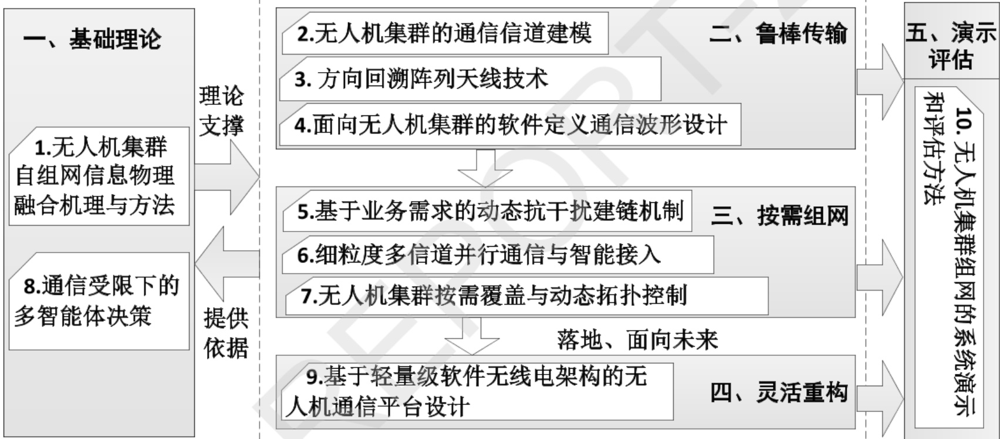
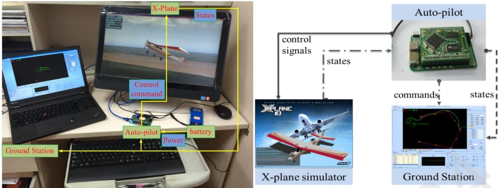
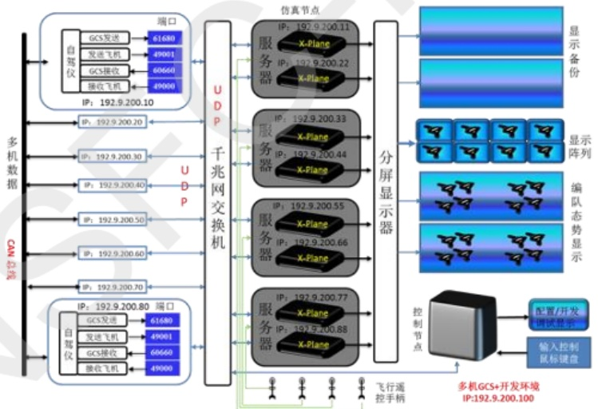
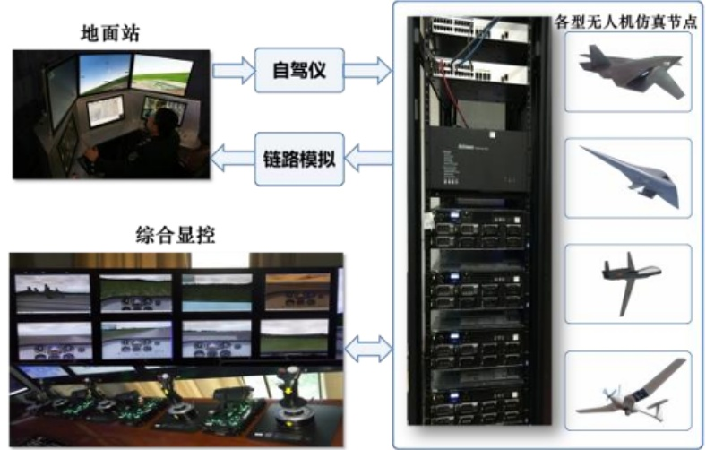
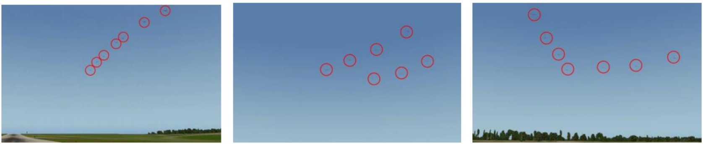
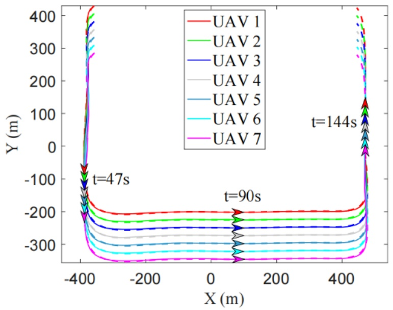
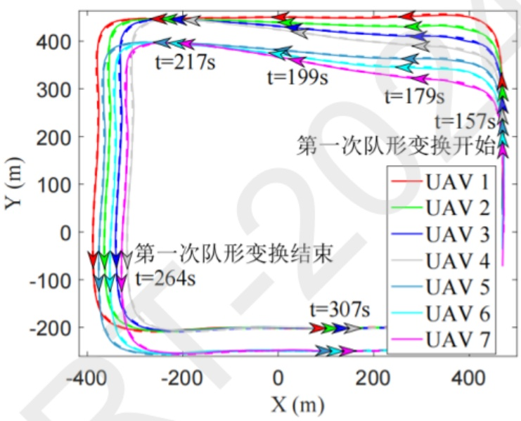
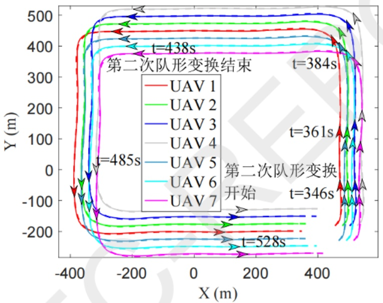
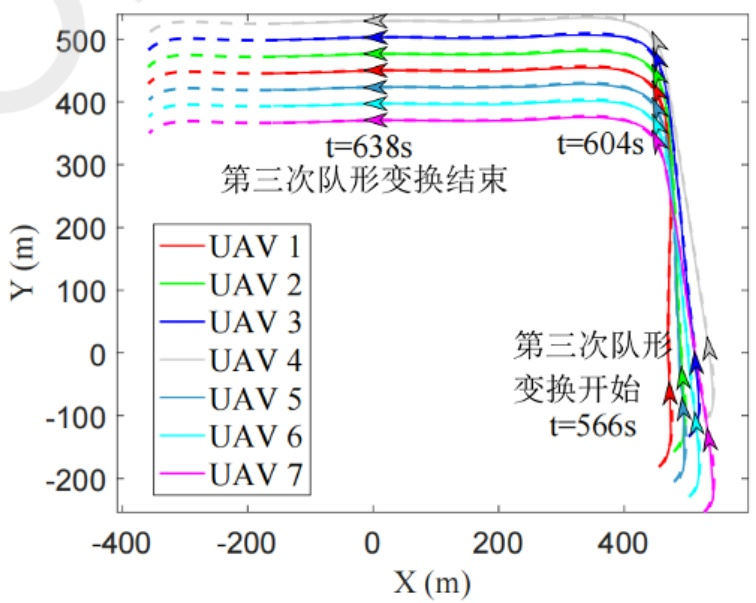
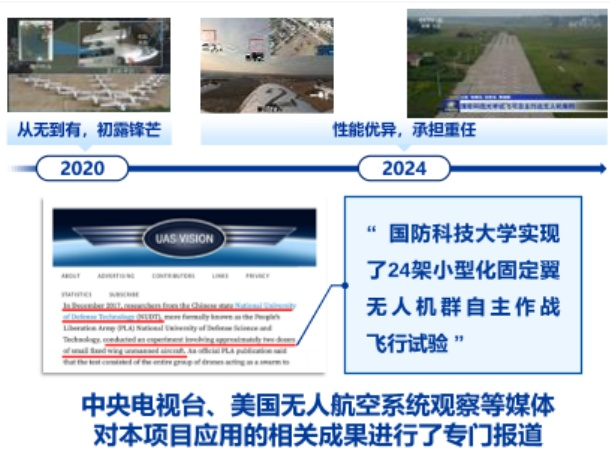

项目批准号 61931020申请代码 F0104归口管理部门收件日期


20240261931020

# 国家自然科学基金

# 资助项目结题/成果报告

资助类别:重点项目

亚类说明:

附注说明:

项目名称:大规模无人机集群智能组网理论与技术

负责人:赵海涛 BRID: 09766.00.82320

电子邮件: haitaozhao@nudt.edu.cn 电话: 0731-87003204

依托单位: 中国人民解放军国防科技大学

联系人: 张维琦

电话: 0731-87000323

直接费用:305.0000（万元）

执行年限: 2020.01-2024.12

填表日期:2024年12月03日

国家自然科学基金委员会制（2023年）

## 项目摘要

## 中文摘要:

以支撑大规模无人机集群智能组网为目标，从通信、计算和控制相互融合的角度解决当前其所面临的连接性差、计算共融性差和任务适应性差的瓶颈问题，研究基于信息物理融合的无人机自组基础理论，突破鲁棒传输、按需组网、灵活重构等核心技术，研制无人机通信平台和集群组网评估环境。主要包括:首先，建立无人机集群信息物理融合模型，为提升无人机网络效能提供理论基础；其次，研究无线频谱大带宽感知、细粒度使用与定向发送、全向接收的一体化设计，以有限的通信资源支持大规模无人机鲁棒传输；然后，突破多维抗干扰智能接入核心技术，以有限的功率和计算资源实现无人机并行接入和按需组网；同时，结合多智能体决策和协同控制来提升通信组网的智能化程度，支撑其对环境和任务的适应性；最后，研制适用于无人机的小型化可重构通信载荷，并进一步搭建半实物仿真、评估和演示环境。本项目的研究成果将为大规模无人机集群走向实用提供理论和技术支撑。

## Abstract:

This proposal is to study the basic theories and key technologies towards intelligent and cooperative networks of large-scale UAV swarms. And the main objective is to provide solutions to the core problems encountered in large-scale unmanned system networking, which includes fierce competition on network resources, dynamic topology, flexible network scale, and tight coupling effects among cyber-physical aspects. First, we will study the theories and models of unmanned system networks from the cyber-physical perspective (including computation, communication and motion control), so as to provide theoretical support for enhancing the network effective capacity via the coupling of cyber-physical domain abilities. Second, we will integrally design wide-band detection and fine-grained utilization of spectrum, so as to support the ubiquitous communication with limited spectrum in unmanned system networks. Third, we study the intelligent anti-jamming access schemes from multi-dimensional perspective, so as to realize reliable high-capacity communicating and seamless-access networking with limited power and computing resources. Fourth, we will study the intelligent network techniques based on collective motion control and swarm intelligence, so as to support the network on its adaptability to application and flexibility to network scale. In the end, based on system on chip (SoC) and software-defined radio (SDR) techniques, we wil1 integrate the researched techniques to a small, open and modular communication platform for unmanned systems, which is evolvable to achieve further integration of communication, networking, reconnaissance and navigation in one platform. The outcomes of this research project will provide theoretical and technical supports for the large-scale UAV swarm to become practical.

关键词（用分号分开）:自组网络；无人机网络；信息物理系统；

Keywords (separated by;): Self-organized Networks; UAV networks; Cyber-physical system;

## 结题摘要

## 中文摘要（对项目的背景、主要研究内容、重要结果、关键数据及其科学意义等做简单概述）:

在大国博弈和高技术条件下的冲突与战争中，无人机群正成为“改变游戏规则”的新质力量，是世界各国高度重视的优先发展领域。通信组网技术是支撑无人机群协同任务的基石，也是当前制约无人机群走向实用的瓶颈问题。

本项目针对无人机群可靠通信组网需求，从信息物理融合的思路来研究其智能自组网中的基础性理论和技术问题，解决当前存在的连接性差、计算共融性差和任务自主性差的问题，响应国家和国防建设在该方面的迫切需求。（1）在理论层面，构建了无人机群信息物理融合组网的理论框架，建立了信息域和物理域一体化融合模型，突破了传统组网通信仅局限于信息域资源的理论瓶颈，实现了毫秒级的融合重构，组网效能平均提高30%以上；（2）在抗干扰可靠通信方法，研究了无线频谱大带宽感知、细粒度使用与定向发送、全向接收的一体化设计，以有限的通信资源支持大规模无人机鲁棒传输；（3）在无人机群灵活组网方面，针对无人机群需随任务推进而动态组网的难题，提出了按需覆盖的自组织建网方法，突破多维抗干扰智能接入核心技术，能结合无人机具有的信息域资源和所处的物理环境达到按需组网；（4）在多智能体协同方面，结合多智能体决策和协同控制来提升通信组网的智能化程度，支撑其对环境和任务的适应性；（5）在平台研制、仿真系统搭建和外场验证方面，研制了适用于无人机的小型化可重构通信载荷，搭建了半实物仿真和评估环境，基于固定翼和旋翼无人机群进行了一系列的外场实验，验证了项目的研究成果。

项目紧贴国家重大战略需求，产出一些列高水平论文，在《通信学报》等组织无人机组网的专刊，部分成果支撑获得2024年通信学会技术发明一等奖、2023年自动化学会自然科学一等奖、2023年中国专利奖银奖、2021年度中国人工智能学会优秀科技成果奖等6项科技奖励，培养了国家博新计划、军队青托、吴文俊人工智能科学技术优秀青年和学会人才等10余人次，相关成果已在国家重大工程、多项重大任务和一系列新型装备研发中得到广泛应用，可用于复杂电磁环境下的无人机群通信组网、有/无人协同通信组网等，应用前景广阔。

## Abstract (Brief description of research background, main methods, contributions, and research data):

This project studied the basic theories and key technologies towards intelligent and cooperative networks of large-scale UAV swarms. And the main objective is to provide solutions to the core problems encountered in large-scale unmanned system networking which includes fierce competition on network resources, dynamic topology, flexible network scale, and tight coupling effects among cyber-physical aspects. First, we studied the theories and models of unmanned system networks from the cyber-physical perspective (including computation, communication and motion control), so as to provide theoretical support for enhancing the network effective capacity via the coupling of cyber-physical domain abilities. Second, we integrally designed wide-band detection and fine-grained utilization of spectrum, so as to support the ubiquitous communication with limited spectrum in unmanned system networks. Third, we studied the intelligent anti-jamming access schemes from multi-dimensional perspective, so as to realize reliable high-capacity communicating and seamless-access networking with limited power and computing resources. Fourth, we 1 studied the intelligent network techniques based on collective motion control and swarm intelligence, so as to support the network on its adaptability to application and flexibility to network scale. Fifth, based on system on chip (SoC) and software-defined radio (SDR) techniques, we designed and implemented novel communication platforms for unmanned systems, which is evolvable to achieve further integration of communication, networking, reconnaissance and navigation in one platform. In the end, we designed a hardware-in-the-loop simulation and evaluation system for large-scale UAV networking. And we also conducted a series of field experiments based on fixed wing and rotary wing unmanned aerial vehicle groups to verify the research results of the project. The outcomes of this research project will

```
provide theoretical and technical supports for the large-scale UAV swarm to become
practical.
关键词（用分号分开）：无人机通信；无人机群组网；信息物理融合组网；
抗干扰通信；
Keywords (separated by;): UAV communication; UAV networking;
Cyber-physical fusion networking; Anti-interference communication;
```

## 正文

《结题/成果报告》正文分为两个部分:结题部分和成果部分。请按照《结题/成果报告》填报说明及撰写要求填写。

## (一）结题部分

## 1. 研究计划执行情况概述

（1）按计划执行情况。

项目按照既定计划，圆满满完成研究内容。具体按计划执行情况如下:

第一年度，主要开展了信息物理融合理论研究，从效能函数入手建立信息物理融合模型，并进一步提出高效利用网络资源的机理和方法。本年度项目组10余人次参加智能通信方面的国内外重要学术会议，包括全国通信理论与技术学术会议、第273期双清论坛等；邀请了3名本领域院士专家来校访问。

第二年度，突破了动态大带宽范围的无线频谱感知和细粒度多信道并行通信技术，实现以子载波为粒度的信道带宽自适应；同步开展了方向回溯阵列天线技术研究，初步验证该阵列天线的性能；将这两方面结合，形成了可灵活配置的时、频、空网络资源。10余人次参加无线通信和网络方面的国内重要学术会议，包括中国物联网大会和全国通信理论与技术学术会议等。1项成果获得中国人工智能学会2021年度优秀科技成果奖。

第三年度，重点进行了智能接入和组网方面的研究，与此同时进行群体编队拓扑控制与移动部署两方面的研究；同步开展了多智能体通信决策方面的研究。负责人受邀到北京邮电大学、南京邮电大学等国内高校作了2次无人机群组网研究进展方面的学术报告；项目负责人获评国防科技卓越青年、湖南省杰青，1名骨干获评军队青年科技英才。支撑立项了国防科技创新特区重点项目1项。

第四年度，研究了基于SoC的宽频段软件无线电通信体系架构，与通信和组网协议的优化迭代进行。项目负责人当选《系统工程与电子技术》编委，团队3名青年骨干晋升副教授职称，1人获得国防科大优秀博士论文。1项成果获得自动化学会自然科学一等奖，1项核心专利获得2023年中国专利银奖。团队1名骨干获得2023年度吴文俊人工智能科学技术优秀青年奖。

第五年度，搭建了可重构的半实物仿真验证平台，对项目的关键技术进行了验证和演示，并进行了一系列外场机群实飞实验，项目成果支撑了多个重大任务。项目负责人当选《国防科技大学学报》编委，并在《通信学报》和《Digital Communications and Networks》组织两期智能化无人机通信网络方面专刊，受邀参加了双清论坛、卓青论坛等，团队2名青年骨干分别获得博新计划、军队青托支持。1项成果获得通信学会技术发明一等奖。

（2）研究目标完成情况。

项目完成了既定研究目标，具体达成了以下个方面的目标。①在规律揭示方面，首先，完成了无人机群体计算、通信和移动控制之间的相互影响和紧密耦合效应的定量表示；其次，完成分析网络结构与拓扑、可用信道数、信道带宽、计算能力、协作程度、控制误差等关键要素对无人机网络整体效能的影响。②在模型与理论方面，建立无人机集群的典型信道模型和大规模无人机网络的效能分析模型；在大规模无人机机群网络的背景下，完善信息物理融合的网络资源优化分配理论和多智能体通信决策理论。③在方法与策略方面，提出适用于无人机高效传输的方向回溯阵列天线设计；提出宽频段的频谱认知和细粒度的带宽自适应整体设计方法；设计基于信息物理融合的自主认知通信、自组网编队拓扑控制和移动部署策略。④在平台方面，研发基于SoC的宽频段软件无线电无人机通信模块，构建无人机组网的半实物验证平台，具有可扩展性和可移植性，将通信和组网协议的研究成果在该平台上进行了实现和迭代优化，并在外场固定翼侦查无人机上的进行了试用。

项目研究成果在IEEETWC、TCOM、TCCN和《通信学报》等国内外一流期刊与会议上发表学术论文74篇，申请/授权专利48项。项目组在《通信学报》和《Digital Communications and Networks》等组织了无人机组网的专刊，部分成果支撑获得2020年电子学会技术发明二等奖、2021年中国人工智能学会优秀科技成果奖、2023年中国专利奖银奖、2023年中国自动化学会自然科学一等奖，2023年度“吴文俊人工智能科学技术奖”、2024年通信学会技术发明一等奖等6项科技奖励。培养了国家博新计划、军队青托、吴文俊人工智能科学技术优秀青年和学会人才等10余人次，支撑立项了面向有人/无人集群协同通信的某重点项目1项，相关成果已在国家重大工程、多项重大任务和一系列新型装备研发中得到广泛应用，可用于复杂电磁环境下的无人机群通信组网、有/无人协同通信组网等，应用前景广阔。

表1 项目按计划执行和目标完成情况

```
 年度   计划研究内容与目标            完成情况
                  完成。
     ①开展信息物理融合理论  ①从效能函数入手建立信息物理融合模型，并进
                                       一
     研究；②同步开展无人机群 步提出高效利用网络资源的机理和方法，提出网络
     通信信道的建模工作。   资源高效利用方法。②开展了无人机群通信信道建
2020 至少6人次参加国内外重要 模工作，赴云南边境进行了实际空地信道测量。
     学术会议；邀请认知自组网 10 余人次参加智能通信方面的国内外重要学术会
     领域著名专家来校访问。在 议，包括全国通信理论与技术学术会议、第273期
     国际期刊或会议上发表10 双清论坛等；邀请3名本领域院士专家来校访问。
     篇左右高水平论文。    在国际期刊或会议上发表论文13 篇，申请专利3
                  项。
     ①突破动态大带宽范围的
 2021 无线频谱感知和细粒度多 完成。
```

```
     信道并行通信技术；②同步 ①突破动态大带宽范围的无线频谱感知和细粒度
     开展方向回溯阵列天线技  多信道并行通信技术，提出了细粒度多信道接入架
     术研究，初步验证该阵列天 构，通信频段覆盖100M-6GHz，可实现以子载波为
     线的性能；③将这两方面结 粒度的信道带宽自适应；②研究了回溯阵列天线技
     合，形成可灵活配置的时频 术，设计方向回溯天线样品；③结合时频域的细粒
     空网络资源。       度多信道构建和空域回溯通信技术，形成了空、时、
     在国际期刊或会议上发表  频可灵活重构的通信资源。
     高水平学术论文10篇左右， 在《中国科学：信息科学》、IEEE TWC等期刊和会
     申请专利5项。      议发表论文14篇，申请专利5项。10余人次参加
                  无线通信和网络方面的国内重要学术会议，包括中
                  国物联网大会和全国通信理论与技术学术会议等。
                  1 项成果获得中国人工智能学会 2021 年度优秀科
                  技成果奖。
                  完成。
                  ①研究了具备认知抗干扰能力的智能接入和组网
     ①重点进行智能接入和组  技术；②提出分布式实现的集群编队拓扑控制与移
     网方面的研究；②与此同时 动部署算法，可实现按需覆盖。③研究了多智能体
     进行群体编队拓扑控制与  通信决策技术，带宽受限时，在基本不影响编队性
     移动部署方面研究；③同步 能的前提下，通信量可降低30%
2022 开展多智能体通信决策方  在IEEE TWC和《通信学报》等国内外期刊与会议
     面的研究。        上发表学术论文21篇，新申请专利10项；负责人
     在国际期刊或会议上发表  受邀到南京邮电大学等国内高校作了2次无人机
     高水平学术论文10篇左右， 群组网研究进展方面的学术报告；项目团队1人获
     申请专利5项。      评国防科技卓越青年、湖南省杰青，1人获评军队
                  青年科技英才。支撑立项了国防科技创新特区重点
                  项目1项。
                  完成。
                  ①研究了基于 SoC 的宽频段软件无线电通信体系
                  架构，优化通信体制和组网协议；②设计并实现适
     研究基于 SoC的宽频段软件 用于无人机的三型小型化通信平台，并开展试用。
     无线电通信体系架构，与通 在IEEE TVT、《中国科学：信息科学》（英文版）、
     信和组网协议的优化迭代  《通信学报》等国内外期刊与会议上发表学术论文
2023 进行。          13篇，申请专利8项，一项核心专利获得2023年
     在国际期刊或会议上发表  中国专利银奖；项目负责人当选《系统工程与电子
     高水平学术论文10篇左右， 技术》编委，团队3名青年骨干晋升副教授职称。
     申请专利5项。      1人获得国防科大优秀博士论文。1项成果获得自
                  动化学会自然科学一等奖，1项核心专利获得2023
                  年中国专利银奖。团队1名骨干获得2023年度吴
                  文俊人工智能科学技术优秀青年奖。
                  完成。
                  ①搭建完成半实物仿真验证系统，对项目成果和关
     搭建可重构的半实物仿真  键技术进行验证；②开展了一系列外场实验，支撑
     验证平台，对项目的关键技 无人机群形成了实际能力。
2024 术进行验证和演示。    在IEEE TWC、《通信学报》等国内外期刊与会议上
     在国际期刊或会议上发表  发表学术论文13篇，申请专利22项；项目负责人
     高水平学术论文5篇左右， 当选《国防科技大学学报》编委，并在《通信学报》
     申请专利5项。      和《Digital Communications and Networks》组
                  织两期无人机通信网络方面专刊，团队2名青年骨
                  干分别获得博新计划、军队青托支持。1项成果获
```

```
得通信学会技术发明一等奖。
```

## 2. 研究工作主要进展、结果和影响

## (1) 主要研究内容

本项目基于当前制约无人集群走向实战所面临的瓶颈问题和无人机集群自组网的发展趋势，以支撑大规模无人机集群的智能自组网为总目标，重点研究信息物理融合机理与方法，突破鲁棒传输、按需组网、灵活重构等基础理论和关键技术问题，最后基于软件定义体系架构实现灵活可重构的通信平台，并搭建无人机集群的系统演示和评估环境。因此，相应的研究内容主要包括基础理论、鲁棒传输、按需组网、灵活重构和演示评估五个方面，具体包括十项研究内容，其逻辑关系如图所示。



图1 项目主要研究内容与逻辑关系

## ①无人机集群自组网信息物理融合机理与方法

无人机集群通信与传统地面通信装备有显著的不同。从应用场景来看，地面通信装备可分型号系列来适应不同的典型场景，而无人机需要深入前线/无人区，要适应尽量未知和动态的通信环境；从操作模式来看，地面设备主要由人来使用、操作和调整参数，而无人机通信装备要根据环境变化自主完成波形的选择和调整，即其必须包含自主优化和决策过程；从平台能力来看，无人机往往配备多种传感器，具有很强的传感能力，对外界信息的获取要远超传统通信系统；从移动灵活性来看，无机不受地面地形的影响，具有灵活的三维移动控制能力，这对网络的拓扑控制和通信决策都带来了很大的灵活性。因此，一方面从信息物理融合的思路来考虑无人机组网，会为大规模无人机网络的部署带来巨大性能增益；而另一方面，无人机也具备信息物理融合的基础。

信息域主要包括通信和组网中的各个要素。多个无人机间的信息交互和组网可简称为“通信”，而无人机的优化、决策等过程本质上是其“计算”过程。物理域包含无人机所处的地理环境和系统本身的状态，其主要靠无人机的传感器获得，并可通过无人机的控制和操作来改变。信息域的计算与通信依托于物理世界的信息会得到更优的结果。它们间的耦合作用包括以下两个方面:信息域通过无人机获取的多域外界信息来认知自己的处境、与伙伴间的信道模型等，并以此为基础进行优化决策；优化决策的输出来指导无人机进行合适的移动（以使其移动到可操作的最合适地理位置上）或内部状态调整。

本部分研究针对大规模无人机机群组网的特点，跳出传统通信决策维度单一的固化思维，挖掘信息域和物理域紧密耦合对通信组网的性能提升及其对无人机通信组网技术研发的指导作用，从而扩展通信决策维度，提升通信组网性能，增强节点智能化水平。具体的研究内容包括:①从系统整体效能出发，建立统一的无人机自组网信息物理融合模型来量化和评估三者间的互相转化关系以及对系统整体效能的贡献。首先，对无人机自组网的控制、通信和计算过程进行建模，并分析互相之间的作用和析取机理；接着，建立通用的系统效能函数，一方面量化三者对整体系统效能的贡献，另一方面从理论上指导多维异构且受限的信息物理资源间的协调和转化从而达到优化整体效能的目的。该通用模型中给出了参数接口，可用来适配不同的任务场景。②从通信效能出发，以OODA环为基础构建一种全新的信息物理融合框架。该框架将通信决策扩展到计算和控制维度，从而精准地定位网络环境的变化并有针对性地进行通信决策。接着，以阴影衰落下的两无人机数据传输为例，从理论上建立了能量优化模型，为实际系统中的无人机通信协议和算法设计提供指导。最后，从系统实现的角度讨论如何将所提信息物理融合框架部署到实际的无人机自组网场景中。③以无人机自组网的几种典型应用场景为例，分别对所提的面向系统效能和通信效能的信息物理融合模型进行仿真分析，验证模型的有效性并评估其在实际系统中的性能。

## ②无人机群网络中的信道建模

（无人机群组网过程中包括无人机之间（空空）、无人机与地面人员间（空地）的通信。对于无人机空空信道目前尚且缺乏深入的理解，已有的针对空空无人机信道的研究多是关于衰落幅度的研究:将信道响应建模为一个莱斯过程，通过拟合的方法得出飞行高度或链路距离与路径损耗的关系，再估计出方差等基本统计量。一方面，这些研究测量数据的获取场景单一，并没有针对多种环境进行广泛实地测量，因而拟合出来的数据普遍不适用于新的环境，得出的参数也不适用于通用的通信系统设计。其次，简单地将信道响应建模为莱斯过程已经不能满足大规模无人机群通信系统设计的要求了。例如角度信息、相关特性、多径特性等对于无人机集群通信系统以及智能天线设计具有重要的指导作用，而这些都没有包含在目前的无人机空空信道研究中。针对空地通信信道的研究主要分为两类，一部分是理论建模研究，即通过数学建模来描述信道，进而推导出信道参数。这些研究基于一定的假设，往往能够得出简洁的具有物理意义的表达式。另一部分是基于实测，即从实测数据中估计出所需参数，对于特定的场景能够达到比理论模型更加准确的刻画。测量本身需要更多的时间和经济成本，而无人机广阔的活动范围对信道测量工作提出了巨大的挑战。我们既需要一个全面系统的理论模型来分析在各种环境中无人机通信的信道特性，又需要一种同时具备灵活性与准确性的测量方案以验证和修正所提出的信道模型。 2

因此，本部分对无人机信道建模的研究将针对空空信道和空地信道两类模型，采用实测与理论相结合的方法归纳出其信道特性:一是通过在大规模无人机群试飞实验中测量获取实际的信道数据，进而分析获取无人机信道的统计特性。二是经过理论分析对信道进行建模，反过来再通过实测数据进行指导修正。特别是项目组在疫情允许的情况下，与中国电科22所开展合作，于8月中旬，赴云南边境实地测量了这一区域的空地信道。为了保障测量工作顺利进行，南部战区某旅还出动运输直升机12架次，配合测量团队针对空地信道重要超短波、微波等军事通信频段进行了充分测量。该项信道测量任务，摸清了该地区电磁传播环境的特性，为无人机通信波形的设计和在该区域的应用部署提供了第一手精确支撑材料。

## ③方向回溯阵列天线理论和技术

在大规模无人机集群上实现高度定向性的窄天线波束，对提高通信链路增益，提高通信的安全性和抗干扰能力至关重要。面向这一需求，我们研究了一种低成本、紧凑型、具备智能波束跟踪能力的天线:方向回溯阵列天线（Retro-directive Antenna，RDA)。方向回溯阵列天线是基于相位共轭技术而提出的一种新型波束自适应天线技术，根据天线所接收到的入射波相位信息，通过相位共轭电路，自动将阵列天线波束指向调整至来波方向，从而实现通信链路的自动跟踪，可实现低能耗快速波束调整、定向发送、全向接收。将方向回溯阵列天线应用于大规模无人机集群中，将具有多方面的优势:首先，方向回溯阵列天线不需要来波方向的先验知识，有效节约了系统资源。将方向回溯阵列天线作为发射天线时，发射波束的定向跟踪潜在地提高了无人机之间的通信链路增益。方向回溯阵列天线作为接收天线时，可实现全向接收，相当于一个高增益全向接收天线阵。其次，与自适应天线技术和相控阵天线技术相比，方向回溯阵列天线不需要采用移相器控制阵元的馈电信息，使得系统结构简单，成本低廉，具备更高的性价比。此外，方向回溯阵列天线不需要复杂的数字信号处理，提升了通信系统的响应速度与快速跟踪能力。

本项目研究了一种全向波束和定向自跟踪波束双模式的无线自组网天线阵列，应用于无人机的自组网通信系统中。它的基本思路是:当无线自组网的节点处于接收状态时，天线阵列工作于全向波束模式，当无线自组网的节点处于发射状态时，天线阵列工作于定向波束自跟踪模式。为了实现上述目的，我们发明了一种全向波束和定向自跟踪波束双模式的无线自组网天线阵列。本项发明已经申请并获授权了国家发明专利。

## ④大带宽细粒度软件定义通信波形设计

针对无人机集群通信组网和人机协同面临的环境特点和传输需求，需要设计合适的通信波形体制。无人机群的工作环境复杂变化，而且在很多情况下是未知的。针对不同的环境和信道特点，其传输要求也是不同的，这就要求通信波形必须具有灵活适变的能力。而且，从网络业务层面来讲，不同的业务（比如感知信息、态势图像、实时视频、控制指令等）对通信的指标各有不同，也需要有不同的波形体制支持。因此，整体而言，没有任何一种固定的通信波形可以适应所有不同的要求。

本项目基于NC-OFDM（Non-ContinuousOFDM）技术框架进行了带宽自适应机制的设计，既可利用其本身的技术优势实现细粒度的带宽自适应，又契合网络中存在非连续可用频谱资源的客观事实，并且这样做的另一个好处是可以利用目前的商用现货加速其实用化进程。为了更好的实现波形的实时重构，我们还提出一种基于组件化设计的软件可定义无线宽带网络波形实现框架。将波形组件定义为数据流图中的原子化实体，波形组件的设计不仅需要在抽象功能上保持独立，同时在底层实现中也要具有一定的独立性，设计单个组件时不需要知道其它组件的设计细节，也不需要知道上层认知处理决策。一个原子化的组件实体包含了输入输出数据接口、配置接口、内存和内部处理引擎。波形组件的输入输出数据接口设计需要满足组件功能的独立性和组件之间运行时序约束，满足流水线的工作模式。

（进一步，针对无人机网络可能工作于存在对抗的未知通信环境，我们提出了一种能进行智能适变的通信节点体系架构。该架构包括通信环境理解、通信波形适配和智能节点学习进化三个核心功能，以及支持这些功能的通信计算融合硬件平台。所提出的智能适变架构支持通信环境知识库、通信波形库，以及波形与环境适配知识图谱的不断累积和进化，通过波形在线重构，通信节点既能匹配典型通信场景，又能快速适应未知环境，因而支持无人机智能通信的可持续发展。

## ⑤基于业务需求的动态抗干扰建链机制

通过前面的细粒度频谱使用机制，无人机可获得多个信道可以使用。由于干扰和资源竞争的情况不同，不同无人机的可选信道集也很有可能是不同的。此时无人机间要进行通信，首先就是要快速地建立链路。在目前的绝大部分方案中，建链过程要么依靠事先约定、要么依靠一条公共控制信道进行协商。前者过程固定，在未知动态环境中灵活性差，并且易被攻击。而后者虽然可以根据通信环境的变化动态地进行协商，但仍存在三个主要问题:1）在实际场景中，频谱环境往往是变化的，很难存在一条固定不变的公共控制信道；2）即使存在控制信道，其固定带宽也会成为整个网络控制信道的吞吐量瓶颈；3）固定的控制信道很容易遭受干扰或攻击。

为此，我们研究了适用于大规模无人机集群中不依赖于任何公共控制信道、不依赖全局信息的分布式抗干扰建链机制。这种机制只依靠每个无人机本身的可用信道等信息，而建立链路前无法获得其他无人机的相关信息，因此我们称其为“盲汇聚”建链技术。在认知无线网络中也有类似的盲汇聚算法吸引了学者的研究，但目前大部分的盲汇聚算法主要围绕通信双方（即两个节点）如何快速建立通信链路，即降低汇聚时间，来展开分析。但是当干扰范围内的两对传输节点对汇聚到相同的链路上进行传输，碰撞即会产生，这在大规模无人机群组网中是无法避免的。因此，若能将信道分配的优势（冲突避免、资源优化、公平性等）和盲汇聚的优势（动态建立链路）相结合，那么通信范围内的任意一对节点能够汇聚到一条合适的(而不是任意的)可用信道上，并且互不干扰地占用不同的信道。因此，在本部分我们要研究和解决的问题为:针对无人机集群内频谱资源争用和互相干扰以及频谱环境的动态变化，研究适用于高密度、高动态的无人机集群内高效可靠的建链方法，并且保证于扰范围内的节点对能够互不干扰地并行传输。建链机制将包括无人机收发节点间的快速建链和一个无人机簇内控制信道的快速建立，这两种机制都满足如下要求:

建链过程中，要针对无人机集群内复杂多样的业务特点，使得各无人机收发节点间不仅仅是建立链路，而是建立最合适的链路（既能以最高性价比满足传输要求，又不与干扰范围内的无人机通信产生干扰)；

建链双方完全不用知道对方的可用信道信息、不需要时间上的同步、不需要公共的控制信道或者专用控制时隙，完全符合实际的应用场景；

建链机制能实现全信道分集，即在所有合适的可用信道上能等概率的建立链路，从而提高其鲁棒性。

## ⑥细粒度多信道并行通信与智能接入技术

多信道并行通信是指地理位置临近的无线电设备可以使用互不干扰的多个信道并行进行通信，该技术既可减少密集用户间的干扰，也可提高网络接入的灵活性和资源利用效率，在提升用户吞吐量、提高频谱资源利用效率和抗于扰组网等方面具有重要意义。多信道并行通信面临两个本质性的问题:一是如何构建互不干扰的多信道？无人机组网过程中要综合利用频域的无线频带、时域的时隙和空域的波束方向、相邻节点关系等多维资源完成多信道的构建。二是如何使用多信道，即如何将多信道分配给无人机进行无干扰的并发通信？具体而言，可以调整的主要参数包括工作频带、功率、时域退避机制和接入的下一跳节点等，这些参数既会影响无人机间的信息交互和抗干扰能力，也会影响整个网络负载的均衡性、公平性和网络的可扩展性。

首先，针对大规模无人机集群网络中于扰和竞争严重、信道容量有限、安全及私密性能差等问题，提出利用回溯天线将空分与多信道频分结合，有效缓解资源竞争和提高网络抗干扰性能。并设计了基于回溯天线的多信道定向MAC协议(FA-MMAC)，对无人机集群网络中空间和频域资源进行联合分配和竞争接入。FA-MMAC协议充分利用了回溯天线能量集中、传输范围远、功耗低等优势，提高了频率资源的重用性和网络的传输性能，降低了网络中的干扰。同时，我们结合定向传输的特点设计了相应的多信道结构、波束-信道预留表、控制帧轮询机制，解决了定向通信中的干扰、隐藏终端、耳聋等问题。针对FA-MMAC协议分析了二维Markov链模型，对其饱和吞吐量的理论计算进行了推导，并结合仿真验证了模型的正确性以及FA-MMAC协议在提高无人机网络的数据吞吐量和传输性能等方面的优势。在回溯天线定向传输的基础上，集合时域、频域、空域总和了大规模无人机网络中的三维网络资源。研究了图着色问题的基本理论和在无线网络中的应用，并以此为基础设计了相应的三维网络资源联合分配方法。该方法可在保证无冲突的前提下，为通信节点求得最大化网络资源复用的分配方案，减少不必要的频率、时隙等资源的浪费，从而大幅度提高大规模无人机集群网络资源的利用率，并给予更多无人机节点接入网络资源进行传输的机会。我们利用仿真验证了模型中着色方法的正确性以及资源分配方法在资源利用率、网络传输性能等方面的优势。

## ⑦无人机集群按需覆盖与动态拓扑控制

无人机集群能同时遂行多种任务的特点要求无人机集群内无人机功能和种类的多样性组合，使得大规模无人机集群的网络拓扑管理也成为至关重要的问题:一方面要适应业务的需求，另一方面要考虑无人机通信和组网的能力。相较于地面的通信装备或固定节点，无人机可以更灵活地调整自己的位置，从而完成对给定区域更好的覆盖，同时它们往往工作于高度机动的网络场景，当完成某一项任务时需要群体移动部署到另一区域以完成新的任务或行动。除此之外，由于任务的需要或者大规模无人机集中组网造成无法忍受的激烈资源竞争等问题，还会要求无人机集群具有动态分簇的能力。由此产生了异于地面认知自组网的三个核心问题:1）如何使无人机通过自主决策，更合理地覆盖某一区域？2）一定数目的无人机如何能分布式的沿着给定路线从某一区域群体性移动到另一区域？3）如何根据任务需求分布式自组织地构建恰当的网络拓扑或者是分簇架构？这三个问题在应急通信、信息侦察、搜救活动、安保防护等应用场景中都亟待解决，而其解决需要通信网络与分布式控制的紧密协同。

本部分研究重点是解决在没有中心控制节点的情况下以群体组网的按需覆盖、拓扑控制与移动部署为前提实现分布式的通信协议和控制方法。按需覆盖要确保无人机间既能保持双向连接性，同时也能根据业务需要疏密恰当地覆盖给定区域；在无人机群体移动部署中要求具备下列特性:1）网络保持连通性，网络节点间维持理想的距离；2）网络能群体性地躲避障碍物；3）在移动部署过程中无人机的平均移动时间和移动距离最小，以节省能量。而在拓扑控制研究中一方面要实现一个网络（或者一个簇）中线型、圆型、方格型和蜂窝型的分布式拓扑控制和适时切换方法，另一方面要研究无人机集群为了满足任务需求和抗干扰要求的动态分簇组网方案。

面向强干扰环境下，无人机网络中节点难以感知全网拓扑、其他节点的可用频谱以及无法获得同步信息的实际场景，提出了一种基于邻域信息的多信道自主建网和接入算法。该算法以建立分簇结构的网络为目标，其建网策略指导节点以自身信息为基础，充分利用可用信道情况、邻居簇首情况等有限的邻域信息进行自主决策。仿真结果表明，所提自主建网算法能够使节点在通信受限的条件下以较小的通信开销完成建网，建立的网络在公共信道数量和簇规模方面也取得了较好的均衡。进一步，针对分布式网络拓扑优化困难问题，以无人机集群所形成飞行自组网为典型应用场景，提出了一种基于自适应蜂鸟算法的拓扑优化方法。该方法首先基于前面所提出的自主建网算法，形成一个以最小化簇数量、负载偏差和簇移动性为目标的拓扑优化问题。然后，通过调节人工蜂鸟的觅食动作、加入扰动变异的方式对经典人工蜂鸟算法进行改进，从而提出了寻优能力更强的自适应蜂鸟算法。最后，通过设计合理的蜂鸟个体编码方式，使自适应蜂鸟算法能够求解拓扑优化问题。仿真结果表明，所提方法得到的拓扑优化策略不仅能够有效减少网络拓扑的簇数量，而且能够得到负载均衡、结构稳定的簇群。

## ⑧通信受限情况下的多智能体决策

多智能体技术是计算机科学中人工智能的一个重要分支，主要研究由多个可执行网络计算的智能体组成的系统。多智能体系统在大规模无人机网络中有许多优点可供借鉴，例如:节点可以进行网络计算，这有望减少传递的冗余信息，达到“只传输必须要传递的信息”这一目标，提高通信效率；网络自治性强，可以在没有人为控制的情况下自行组织，提高自组织网络的抗毁性；能够彼此协同完成目标，甚至自行学习进化，涌现出更高级的智能，从而提高自组网的智能化程度。目前，针对多智能体的研究，例如，群体控制，群体决策与规划等，大多假设智能体间存在完美可靠的通信技术和手段。然而在现实中，由于复杂的频谱环境、有限的频谱资源以及动态变化的任务，使得组网通信往往难以获得可靠的性能，即组网通信成为多智能体系统研究中的瓶颈。因此，为了从实际上应用多智能体研究成果，解决这一瓶颈问题显得尤为重要。大规模无人机集群作为多智能体系统的一种，其组网通信的可靠性也面临这一挑战。因此，在大规模无人机集群场景下，解决通信受限条件下的分布式协同决策是亟需解决的关键问题之一。

首先，针对多无人机基站联合路径设计问题，研究了基于图神经网络的智能体局部异构观测处理技术与多智能体通信协同决策技术。将地面用户与无人机智能体之间的相互关系表征为图，而后通过图卷积的方式实现智能体间的信息交互与协同，依赖多智能体强化学习技术训练最终得到分布式协同轨迹优化策略。显著提升了局部观测条件下多无人机基站对未知区域用户的联合搜索效率与网络覆盖性能。

然后，针对多无人机的移动-通信联合优化问题，对基于多智能体深度强化学习的分布式决策方法进行了研究。以多无人机基站上行链路通信中无人机轨迹、用户连接与功率控制联合优化问题为例，将无人机与用户当作两种异构智能体，构建了局部可观马尔科夫博弈过程。为了求解各个智能体的策略，提出异构值函数分解算法，该算法通过集中式训练的方式得到了各个智能体的局部Q价值函数。基于训练好的局部Q价值函数，单个智能体能够独立地依据自身观测进行分布式实时决策。大量仿真实验表明，该算法的性能优于MADDPG、IDQN等对比算法。

另外，因为语义通信可以达到用更低的通信量实现更高效信息交互的目标，特别适合资源受限情况下的无人机网络中的通信。我们提出一种面向智能体的语义通信架构的基础上（成果发表于《中国科学:信息科学》)，并进一步提出了一种基于共享基础知识，通信双方利用上下文信息进行高效语义通信的机制，通过仿真和实际无线系统验证了其有效性。根据此方面的研究工作，我们进一步进行了语义通信系统的性能度量指标分析，因为语义通信与传统通信有显著区别也难以用传统的误比特率等性能指标进行评价了。这方面的工作成果发表于今年的

本方面研究成果发表于 2022 年 IEEE Transactions on Wireless Communications、IEEE Trans. On Cognitive Communications and Networking 等期刊上。

## ⑨基于轻量级软件无线电架构的无人机通信平台设计

目前的无人机通信平台主要以硬件为主设计开发，功能单一，不同的无人机通信平台工作频率、调制解调及通信组网协议等方法各不相同，系统间互不兼容且无法有效进行互操作和信息共享。基于软件无线电（SDR）架构的通信平台可以很好的解决上述问题。进一步，考虑到无人机一般尺寸受限，对重量和功耗都有严格要求，必须进行低功耗设计，因此基于片上系统（SoC）的轻量级SDR通信设备是实现无人机集群智能化通信和组网的必然选择。它为计算和通信的耦合提供了绝佳平台，也将扩大无人机的应用场景。片上系统与传统软件无线电硬件平台有显著不同。传统软件无线电硬件平台通常由独立的可编程元器件及射频器件通过互联总线搭建而成，而片上系统则在同一芯片上集成多个可编程元器件甚至射频器件，具有更高的集成度，在面积、功耗、成本方面均有更大优势。由于片上系统大多采用已有IP核来搭建，系统设计、升级、维护均较为简单，因此在业界有着广泛应用。此外，片上系统通常采用片上总线作为处理器间互联架构，提供了更高的通信带宽，为宽频无线电应用的实现提供了更好的支撑。

面向轻量化软件定义无人系统通信平台的设计与实现，我们针对基于片上系统的宽频段软件无线电系统设计软件无线电体系架构，以支撑在该类硬件平台上部署、管理宽频段软件无线电波形应用，提升波形可移植性及系统的互联互通能力。首先，研究了面向片上总线的硬件抽象层技术，重点包括硬件抽象层接口的标准化、高效的传输机制设计，以及高实时性传输机制设计。然后，研究了片上系统资源分配技术，重点是针对在片上系统中部署实时软件无线电应用的需求，提出资源分配算法，对应用在平台中的性能进行量化评估，为应用的部署提供支撑。第三，基于上述研究，研制了3款轻量化无人机通信样机平台。将通信和组网协议的研究成果在该平台上进行了实现和迭代优化。

研制的样机已经进行了拉距通信和组网测试，并且在外场固定翼侦查无人机上的进行了使用，支撑了重大任务，取得理想效果。

## ①无人机集群组网的系统演示和评估方法

为验证设计各种控制方法的性能，项目开发了一套高性能高保真度的多机协同半实物仿真环境以典型作战想定为牵引，构建基于 X-Plane和 ROS的高保真半实物仿真验证系统，对相关核心关键技术进行可行性验证。集成了基于ARM+GPU构架的机载规划决策器和基于双核ARM的网络化无人机自驾仪，支持无人机的机载任务重规划。其中，机载规划决策器包含192个CUDA加速单元，采用嵌入式Linux操作系统，具备局部态势信息的获取、意外事件智能识别、协同决策与实时任务规划等功能。机载自驾仪安装嵌入式uCOS操作系统，具备固定翼无人机姿态稳定、样条曲线跟踪和自动航迹规划等能力。在此基础上，基于X-Plane高保真度飞行模拟软件、机载任务重规划原理样机和便携式多屏地面控制站构件了机载任务重规划半实物仿真环境。



（a）单机半实物仿真系统（b）单机半实物仿真结构图

图2 单机半实物仿真环境

在半实物仿真环境中，由X-plane飞行模拟器、自主研发的飞控系统和地面站系统组成。X-Plane是一款功能全面、强大的模拟飞行软件，可以真实地模拟晴天、大雨、阵风和暴雪等天气，可以模拟风力、风速和风向，甚至温度的突变；能够提供高度精确的飞机模型和飞行环境，具有与被模拟的无人机相同的气动特性；同时可以和外界实时数据交互。飞控系统通过 UDP (User Datagram Protocol)通信协议和X-plane进行数据交互，它根据当前的飞机状态和期望指令，计算得到具体的控制舵量返回到X-plane。地面站主要负责控制指令的发出以及无人机状态的显示。它监测飞机的飞行状态和实时数据采集，同时负责一些高级指令(比如任务切换，起飞降落等）的发送。在单机半实物仿真环境的基础上，进一步构建了基于 X-plane的 20-50架规模的无人机协同控制半实物仿真环境，包括10台服务器、2台千兆网交换机、机架式显示器、网络化无人机自驾仪、地面站服务器等硬件。



（a）多机协同体系结构图



（b）多机协同实物图

图3多机协同控制半实物仿真环境

## （2）取得的主要研究进展、重要结果、关键数据等及其科学意义或应用前景

项目在完成研究内容的过程中，在信息物理融合理论、通信技术、组网技术和智能化协同方法，以及仿真评估、平台研制和外场实验等方面都取得了重要进展，如下表所示。

表2取得的主要进展条目

```
    内容                主要进展条目
 信息物理融合组网 ①移动智能体信息物理融合架构及作用模型
 理论方面     ②支撑信息物理融合的多域资源调度机制
 无人机可靠通信方 ③无人机群空地信道数据采集与建模
面         ④方向回溯阵列天线设计
          ⑤多信道细粒度适变技术
 无人机群灵活组网 ⑥基于无人机时序任务的通信建模和组网规划方法
方面        ⑦信息新鲜度驱动的多域资源调度方法
 机群智能化协同  ⑧面向机群智能组网的群体不变多智能体强化学习方法
 仿真、平台研制方 ⑨设计实现了基于X-Plane的无人机集群协同半实物仿真验证系统
 面与外场实验方面 ⑩设计实现了三款原理样机，开展了外场实验
```

## ①移动智能体信息物理融合架构及作用模型

提出了从信息物理域融合角度进行移动智能体通信网络设计的新视角，深入理解和分析信息物理融合效应和机理，建立了通信、计算、移动控制三者之间的融合作用模型；然后，定义和推导出具有普适意义的网络效能函数，以此为基础构建了无人系统信息物理融合网络的能力评估体系；最终，建立了无人系统计算、通信和移动控制能力的深度融合和从对网络效能贡献的角度进行定量转换的方法。上述工作可指导我们利用两个域资源达到最恰当的网络性能，为后续研究提供理论支撑。

移动智能体包含大量异构子模型，涉及通信、计算和控制等多个学科。一方面，相比于控制和计算，通信更易成为瓶颈问题，基于信息物理融合的理论可将富余的计算和控制能力转化为通信性能。然而，移动控制一般是连续的、有时序性的，而通信和计算过程是基于“0/1”比特离散化、可并发的，因此如何采用统一的理论框架来对它们进行综合表征是一项基础性工作。另一方面，移动智能体以任务为牵引，其通信、计算和控制能力的增强都能提升系统效能。然而，不同的任务场景下，移动智能体所追求的性能指标并不相同，并且对通信、控制和计算各方面能力的要求也各有侧重。因此，如何量化各项能力对整体系统效能的贡献进而指导资源协调配置是另一项基础性工作。目前还未建立起适合于移动智能体的信息物理融合模型来支撑资源的优化配置，其基础理论、数学表征模型、网络效能增益析取等问题都亟待解决。为解决上述问题，本项目从信息物理融合的角度深入剖析移动智能体，揭示了通信、计算和控制之间的联合规划需求和增益转化机理，建立了信息物理融合模型。结果表明，基于所提模型的通信、移动控制和计算联合优化方法能够显著降低移动智能体通信的能耗和延迟，相比传统局限于信息域的模型平均可降低30%。

在此方面研究过程中，我们总结和梳理了信息物理融合方面现有研究工作，提出了以全新的信息物理融合视角来研究无人机组网技术，发表IEEE Communications Surveys &Tutorials期刊。进而提出了“一种面向无人机智能通信的信息物理融合框架”，发表在《中国科学:信息科学》。

## ②支撑信息物理融合的多域资源调度机制

针对信息域资源可瞬间变化，而物理域环境变化相对缓慢的矛盾问题，建立了移动智能体集群内信息域和物理域联动的动力学模型，揭示了两个域“资源流”流转过程和时间尺度变化规律，从移动智能体通信抗干扰建链、计算卸载、通信计算控制融合三个层面，为多域资源联合调度提供了完整的方案，解决了以前仅在信息域无法解决的任务适配难题。其中抗干扰建链速度达到理论最优。

当移动智能体完成按需网络覆盖后，联合利用信息物理域资源提升用户服务质量就成为了待解决的关键问题。然而，由于信息域资源瞬间变化，而物理域环境相对变化缓慢，两个域的资源调度难以在相同的时间尺度上完成匹配，造成动态环境下移动智能体间通信链路的建立和维持困难。除此之外，移动智能体的任务数据往往需要进行连续采样和高速率计算处理，属于计算密集型应用，而智能体本身又具有受限的计算、存储和能量等资源，计算密集型应用与资源受限型设备之间的矛盾也是信息物理融合网络亟待解决的科学问题。为解决上述问题，本项目建立了信息域和物理域“资源流”流转的动力学模型，进而针对移动智能体通信频率可以瞬间跳变而移动速度相对缓慢的现象，提出了“盲交汇”建链机制，解决了移动智能体节点在无事先规划、存在干扰条件下的分布式建链问题，其交汇速度可以达到理论最优。进一步，利用延时分布的均匀性，给出了不同信道模型下节点交汇时隙数的数学表达式，为信息域和物理域“资源对齐”奠定了基础。

在此方面研究中，项目提出了“一种面向复杂场景的无线通信节点智能适变架构”发表在《中国科学:信息科学》，进一步又设计了时间、频率、功率、算力、移动轨迹等信息物理域资源的一体化调度框架，设计了能最大化系统计算能效的多域资源调度方案。代表性成果在 IEEE Trans. on Wireless Communications期刊发表2篇论文。

## ③无人机群空地信道数据采集与建模

项目组从2020年开始测量、积累无人机空-地、空-空、空-海方面的同学信道数据，并进行了信道建模。2020年，与中国电科22所合作，先后多次赴云南边境实地测量了这一区域的空地信道。为了保障测量工作顺利进行，南部战区某旅还出动运输直升机12架次，配合测量团队针对空地信道重要超短波、微波等军事通信频段进行了充分测量。2021至2022年，多次在长沙、青岛等城区进行

了城市环境下的空-地信道测量和建模，最近两年，又赴大连开展海上的空-海，地-海无线信道测量与建模。这些信道测量工作，摸清了不同地区电磁传播环境的特性，为无人机通信波形的设计和在相应区域的应用部署提供了第一手精确支撑材料。

## ④方向回溯阵列天线设计

本项目研究了一种全向波束和定向自跟踪波束双模式的无线自组网天线阵列，应用于无人机的自组网通信系统中。它的基本思路是:当无线自组网的节点处于接收状态时，天线阵列工作于全向波束模式，当无线自组网的节点处于发射状态时，天线阵列工作于定向波束自跟踪模式。为了实现上述目的，我们发明了一种全向波束和定向自跟踪波束双模式的无线自组网天线阵列，其特征在于，天线阵列为圆柱共形天线阵列，天线单元采用双极化天线单元，每个天线单元包含水平极化端口和垂直极化端口。天线阵列结构包括低噪声放大器、单刀双掷开关、接收通道及发射通道。接收通道包括固定相位移相器、功分器、接收机模块，发射通道包括混频器、功分器、频率源、带通滤波器、功率放大器。当单刀双掷开关切换至接收通道时，天线阵列工作于全向波束模式，当单刀双掷开关切换至发射通道时，天线阵列工作于定向自跟踪波束模式。

本项发明2023年1月已经获得国家发明专利授权“全向波束和定向自跟踪波束双模式的无线自组网天线阵列”。

## ⑤多信道细粒度适变技术

本项目基于非连续OFDM（Non-Continuous OFDM）技术框架进行了带宽自适应机制的设计，既可利用其本身的技术优势实现细粒度的带宽自适应，又契合网络中存在非连续可用频谱资源的客观事实，并且这样做的另一个好处是可以利用目前的商用现货加速其实用化进程。为了更好的实现波形的实时重构，我们还提出一种基于组件化设计的软件可定义无线宽带网络波形实现框架。将波形组件定义为数据流图中的原子化实体，波形组件的设计不仅需要在抽象功能上保持独立，同时在底层实现中也要具有一定的独立性，设计单个组件时不需要知道其它组件的设计细节，也不需要知道上层认知处理决策。一个原子化的组件实体包含了输入输出数据接口、配置接口、内存和内部处理引擎。波形组件的输入输出数据接口设计需要满足组件功能的独立性和组件之间运行时序约束，满足流水线的工作模式。进一步，针对无人机网络可能工作于存在对抗的未知通信环境，我们提出了一种能进行智能适变的通信节点体系架构。该架构包括通信环境理解、通信波形适配和智能节点学习进化三个核心功能，以及支持这些功能的通信计算融合硬件平台。所提出的智能适变架构支持通信环境知识库、通信波形库，以及波形与环境适配知识图谱的不断累积和进化，通过波形在线重构，通信节点既能匹配典型通信场景，又能快速适应未知环境，因而支持无人机智能通信的可持续发展。

相关的一系列成果发表在 IEEE Trans on Wireless Communications、IEEE Trans On Cognitive Communications and Networking、IEEE Trans on Communications 和《中国科学:信息科学》等期刊。

## ⑥基于无人机时序任务的通信建模和组网规划方法

对固定无人机集群通信网络规划和飞行中通信保障等问题展开深入研究，针对集群空地通信问题，根据无线信道的基本模型，考虑无人机飞行环境、天线增益、多径效应等，建立符合无人机特性的信道模型。根据任务点时序性，即任务点的任务时间不同，需与地面控制站的通信时间不同，将该空地通信中继问题进行解耦，最终设计了一种面向无人机集群时序任务的空地通信中继规划方法。在此基础上，针对集群中任务无人机机间通信质量保持问题，提出机间无人机中继规划方法。采用卡尔曼滤波法对任务无人机的运动状态进行最优估计。考虑三类通信链路性能指标，全局消息连接性、最坏链路连接性以及β-弱链路连接性。基于最小生成树，生成机间最优的通信拓扑。将机间规划算法分为中继初始部署点优化以及基于分布式模型预测控制的中继路径在线调整算法。由此形成了面向无人机间空地、空中机间通信的组网规划和中继无人机控制方法，较完整的解决了大规模集群式无人机应用的通信保障难题。

该研究成果已发表在 IEEE Trans on Intelligent Vehicles（2023年发表，单篇已被引用 31 次）和 IEEE Trans on Vehicular Technology 等期刊。

## ⑦信息新鲜度驱动的多域资源调度方法

本项目针对无人机辅助移动边缘计算网络的信息新鲜度，建立了一种多流串联队列模型，并基于排队论推导出了信息年龄的闭式表达式，来描述网络的信息新鲜度。该模型通过零等待策略消除了任务生成和本地计算的延时。此外，我们还模拟了一个多流串联排队系统，实验结果和理论推导结果吻合，这验证了理论推导的正确性。最后，我们还分析了生成速率、边缘计算速率和部分卸载比例等系统参数对信息年龄的影响。进一步，为了实现异构智能体在信息新鲜度约束下的联合优化，提出了一种异构的演员-评论家框架，实现了智能体间的紧密协同和多域资源的联合优化。首先，每类智能体都配备了专属的神经网络，不同类型的智能体可以利用不同的观测信息，实现不同的决策，来联合优化相同的目标。其次，我们采用了卷积神经网络来提取高维观测信息中的特征。再次，基于所提出的框架，还设计了一种联邦多智能体强化学习算法，通过在同类型的智能体间共享网络参数，缓解环境的非平稳性，促进智能体的紧密协同。最后，我们将所提出的算法和当前最先进的算法在同一场景下进行对比，仿真实验结果表明，我们的算法和基线算法相比有44%的性能提升。

相关成果已经在 2023 年 IEEE Transactions on Wireless Communications、IEEE Trans on Intelligent Vehicles 期刊发表。

## ⑧面向机群智能组网的群体不变多智能体强化学习方法

突破了群体不变多智能体强化学习关键技术，实现了多无人机辅助通信场景下对于动态数目无人机的控制:该项目提出了一种高效的群体不变多智能体强化学习方法。为了处理动态维度的输入和输出，我们首先基于超网络设计了“超置换不变模块”和“超置换等变模块”。在这些模块中，输入元素分别使用由共享的超网络生成的嵌入权重进行处理。超置换不变模块聚合嵌入结果生成输出，以适应动态输入维度的变化。而超置换等变模块将嵌入结果一对一映射到输出元素，以确保适应输入和输出维度的变化。我们随后将这些模块融入了QMIX算法的本地Q网络和混合网络中。本地Q网络利用超置换不变模块和超置换等变模块构建观测和动作空间的联系，使得智能体策略能够适应动态维度的输入与输出。混合网络则利用这些模块来处理动态维度的状态。通过引入超置换不变模块和超置换等变模块，本地Q网络与混合网络都具备了群体不变特性，有助于智能体策略在不同群体规模的任务之间进行知识迁移。将所提方法引入QMIX，在4架无人机64个终端的场景下，将样本效率提升了100倍以上，收敛后性能提升了4倍以上。

研究成果发表于 IEEE Internet of Things Journal, SCIENCE CHINA Information Sciences（《中国科学:信息科学》英文版）和《通信学报》等期刊。

## ⑨设计实现了基于X-Plane的无人机集群协同半实物仿真验证系统

为验证相关算法的有效性，在项目实施的研究过程中，项目组构建了一套集群半实物仿真系统。其中单架仿真无人机主要由X-Plane飞行模拟器、自驾仪以及上位机三部分组成。X-Plane飞行模拟器是一套功能全面、性能强大的专业飞行模拟软件，提供了多款无人机的高精度动力学模型和逼真的三维仿真场景。其仿真环境可以高保真地模拟各类天气，支持用户设置风速、风向等。因其高逼真度的仿真效果，X-Plane得到了美国联邦航空管理局的认证。在半实物仿真中，X-Plane主要用于无人机动力学以及飞行环境的模拟。半实物仿真系统支持包括商用Pixhawk以及课题组自行研制的网络化自驾仪等多款自驾仪设备。自驾仪接收X-Plane中仿真飞机的状态数据，并将其转发给上位机程序。上位机程序基于机器人操作系统（Robot Operating System,ROS）环境开发，并实现论文设计的编队控制算法。上位机程序生成欧拉角和油门指令，并以20Hz的频率与自驾仪通信；自驾仪根据欧拉角和油门指令，再计算生成电机和舵机指令，直接控制仿真飞机。



(a)“一”字队形(b)“二”字队形(c)“V”字队形

图4 在X一PLANE环境中展示的无人机蜂群编队飞行仿真场景



（a）初始时形成“二”字形



（b）从“一”字形到“二”字形



（c）从“二”字形到“V”字形



(d）从“V”字形到“一”字形

图5 半实物仿真中的队形变换过程

## ⑩设计实现了三款原理样机，开展了外场实验

基于项目研究成果，我们研制了三款无人机通信样机，它们基于同样的软件定义的软硬件架构，只是为了适应不同的无人机平台和通信需求，在功率和样机封装上有差别。自研装备综合利用信息物理资源，获得显著性能增益。三方测试表明:相较于行业内领先的同类产品美国Silvus增强版电台和加拿大P900电台，性能有明显增益。自研装备参加了某重大演习任务，强有力地支持了海陆移动平台之间的可靠通联。某部通信科长现场感慨:“电台性能很好，解决了部队大问题！”该成果作为该集团军“十大重难点攻关”成果之一，向全军推广应用。2022年在空军组织的第二届无人争锋比赛中，支撑参赛团队获得“无人集群目标搜索跟踪”科目亚军。2023年研究成果还应用于训管部西部高端XX演练。2024年支撑了在兵器集团实验基地进行的外场集成能力验证实飞演练。


（a）研制的三款无人机通信平台



（b）支撑无人机群新质力量


（c）应用于国家“行云工程”

图6项目研制的样机与支撑新质力量、重大任务情况

## 3. 研究人员的合作与分工

本项目依托单位为国防科技大学，参与本项目的包括电子科学学院认知通信系、电子科学学院电子科学系、智能科学学院无人系统研究所。电子科学学院认知通信系研究团队为本项目的主要负责团队，主要研究无人机集群自组网信息物理融合机理与方法、无人机集群网络中的信道建模、大带宽细粒度软件定义通信波形设计、基于业务需求的动态抗干扰建链机制、细粒度多信道并行通信与智能接入技术、无人机集群按需覆盖与动态拓扑控制，以及基于轻量级软件无线电架构的无人机通信平台设计等研究工作。电子科学学院电子科学系研究团队主要负责研究主要负责方向回溯阵列天线理论和技术方面的研究任务，并参加无人机集群网络中的信道建模方面的研究。智能科学学院无人系统研究所研究团队主要负责无人机集群组网的系统演示和评估方法方面的研究任务，并参加无人机集群按需覆盖与动态拓扑控制方面的研究。

本项目的合作研究单位为南京云智控产业技术研究院有限公司主要负责通信受限情况下的多智能体决策和多智能体协同控制方面的研究，并参与无人机集群自组网信息物理融合机理与方法方面的研究工作。

主要研究人员的合作分工如下表所示:

表3项目主要参与者合作分工情况

```
序号  姓名   职称/学位   单位       项目分工
1  赵海涛   教授/博士 国防科技大学电子科 项目负责人，多信道
                  学学院       组网
```

```
 2  付云起   教授/博士  国防科技大学电子科  方向回溯天线技术
                    学学院
 3  熊俊   副研究员/博士 国防科技大学电子科  无人机信道建模
                    学学院
 4  余瑶   副教授/博士  南京云智控产业技术  多智能体协同控制
                  研究院有限公司
 5  尹栋   副教授/博士   国防科技大学   无人机集群网络半实
                              物仿真
 6  黄圣春   讲师/博士  国防科技大学电子科 大规模网络智能接入
                    学学院
 7  辜方林   讲师/博士  国防科技大学电子科   软件定义波形
                    学学院
 8  李杰    讲师/博士  国防科技大学智能科 无人机机群网络半实
                    学学院      物仿真平台
 9  刘燚    讲师/博士  国防科技大学电子科   回溯阵列天线
                    学学院
10  董璐   工程师/博士  南京云智控产业技术   多智能体控制
                  研究院有限公司
```

## 4. 国内外学术合作交流等情况

## （1）国内学术合作交流

项目组多次组织参研人员参加国内学术会议，主要大型会议包括:2020年11月的第5届无人飞行器自主控制前沿论坛、2021年5月在南昌市召开的第36届中国自动化学会青年学术年会、2021年10月份在无锡召开的中国物联网大会和全国通信理论与技术学术会议、2022年IEEE VTC-Fal北京分会、2022年11月在北京召开的第37届中国自动化学会青年学术年会、2023年无人系统高峰论坛、2024年通信前沿理论与应用技术学术论坛等重要国内外会议。

项目负责人受邀在2023年无人系统高峰论坛、2024年通信前沿理论与应用技术学术论坛、指控学会-全国虚实融合交互大会、第二届网信体系大会等针对项目研究成果进行了大会报告。

项目研究过程中，加强与军地高校进行合作交流，先后赴北京大学、北京邮电大学、电子科技大学、南京邮电大学、陆军工程大学等国内高校作了无人集群组网研究进展方面的学术报告。

针对无人机群通信和组网方面的研究，项目组还先后邀请了军事科学院、东南大学、北京理工大学、西安电子科技大学、重庆邮电大学、空军工程大学、中电第10所、20所、22所和54所等相关高校和科研院所的专30余名本领域院士和专家学者来校进行了专题交流讨论。

项目负责人和团队骨干担任中国电子学会通信分会委员、中国通信学会青年委员会委员、中国指控学会电磁频谱安全与控制专委会副主任委员，以及《通信学报》、《系统工程与电子技术》、《国防科技大学学报》、《陆军工程大学学报》等的编委，积极参加了学会和学报组织的学术活动和学术交流

## （2）国际学术合作交流

项目负责人2020.10-2021.01年赴爱尔兰都柏林大学进行为期3个月的访学，开展合作研究，共同开展了无人机多智能体通信决策方面的论文，合作成果发表于IEEE TCCN 期刊。

项目负责人2023年5月赴新加坡国立大学、南洋理工大学和香港理工大学、城市大学等进行了学术访问交流，作了学术报告。

项目组还派两名博士生梅锴和刘军分别赴芬兰奥卢大学、英国利兹大学进行一年的联合培养，联合培养期间都以本项目为第一标注发表了高水平期刊论文，发表在 IEEE TWC和 TCOM等期刊。

项目组作为军方代表参与了ITU-R SG3标准化工作组的工作，担任IEEE 1900.1标准工作组的顾问，参与国际标准制定，提升了国际话语权。

项目负责人和团队骨干多人此担任 2020 年-2024 年的 IEEE ICC、Globecom、WCNC等通信领域旗舰会议的技术委员成员。

## 5. 存在的问题、建议及其他需要说明的情况

## （二）成果部分

## 1. 项目取得成果的总体情况。

完成1部专著和4部教材出版:与科学出版社签订《无人机群自组网理论与技术》专著出版协议，2024年10月已经完成全部专著书稿，并提交给出版社，预计2025年6月份出版；2024年新编著《通信原理》和《通信网络基础》2部本科生教材入选了“新一代信息技术（新一代通信技术）”战略新兴领域“十四五”高等教育系列教材；2022年出版2部研究生教材《通信网络理论与应用》和《数字通信工程》入选科学出版社十四五规划教材。

发表74篇学术论文、授权48项专利:通过子课题研究，项目组培养了博士生 15 人、硕士生 27人，在 IEEE Communications Surveys and Tutorials、TWC、TCOM、TCCN、TVT和《中国科学:信息科学》、《通信学报》等国内外期刊与IEEE G1obecom、WCNC等国际会议发表了学术论文74篇，授权专利48项。研究成果多次应用在项目团队无人机蜂群飞行试验以及参与军方演习演训任务中。

获得6项科技奖励:项目研究边研、边用、边改进，支撑获得2020年电子学会技术发明二等奖、2021年中国人工智能学会优秀科技成果奖、2023年中国专利奖银奖、2023年中国自动化学会自然科学一等奖，2023年度“吴文俊人工智能科学技术奖”、2024年通信学会技术发明一等奖。

支撑双一流学科与国家级平台建设:在第五轮学科评估中，项目负责人作为“通信与信息处理”学科方向的4名代表性教师之一，本项目团队有3篇论文入选了整个学科的代表性论文，支撑信息与通信工程获得A+。另外，在学校组织下，团队参与2022年的某军事科研重点实验室申报，项目负责人作为“导通融合方向”的负责人支撑申报，目前该重点实验室已获批进行建设。

表4 项目成果总体情况

```
 内容     预期指标        完成情况        完成度
 获奖   /       6                超额完成
 论文   45      74               超额完成
                    7
 专著   /       1                超额完成
 专利   20      44               超额完成
人才培养  博士生5人、硕士 博士生15人、 硕士生27人  超额完成
      生10人
      通信频段覆盖   已设计完成的通信平台可覆盖100M-
      100M-6GHz，可实 6GHz频段，支持以子载波为粒度的信
技术指标  现以子载波为粒 道带宽的自适应；          完成
      度的信道带宽自  设计了灵活重构的分层分簇组网协议，
      适应      支持 256 架规模的无人机群组网仿真
              和验证
```

注:完成度分为“超额完成”“完成”“基本完成”和“未完成”

## 2. 项目成果转化及应用情况。

（1）聚焦无人机群前沿领域，创新“边研-边试-边用”应用推广模式，形成落地成果。

2021年7-8月，自研通信装备参加了某集团军的重大演习任务，基于其具备信息物理多域感知和自适应组网的特性，强有力地支持了海陆移动平台之间的可靠通联。某部通信科长现场感慨:“电台性能很好，解决了部队大问题！”该成果作为该集团军“十大重难点攻关”成果之一，向全军推广应用。研究成果还应用于项目组参与的2021年“中俄联合军演”等多次军事演练演训活动中，对无人机蜂群飞行提供了通信保障。2022年在空军组织的第二届无人争锋比赛中，在通信组网方面支撑参赛团队获得“无人集群目标搜索跟踪”科目亚军。2023年研究成果还应用于训管部西部某高端演练。

(2)紧盯国家重大需求，为国家重大项目和重点型号任务提供了关键支撑。

## 3. 人才培养情况

## （1）锻造了富有战斗力的青年科研团队

在项目的深入研究过程中，项目团队得到锻炼和成长，项目负责人入选了国家“万人计划”青年拔尖人才、湖南省杰青、国防卓青和军队学科拔尖人才计划；项目团队的骨干2人享受获评享受军队优秀科技人才一类岗位津贴，熊俊、辜方林、周力3人先后入选军队科技英才；青年才俊王海军入选教育部博新计划，刘潇然入选军队青年托举人才，张姣获得国防科大青创奖一等奖，3人也因此获得晋升副高的绿色通道。

## （2）培养了本方向的优秀研究生

项目组在项目执行期间共培养了博士研究生10名、硕士研究生15名，指导了本科毕业设计24名。其中1名博士生（刘剑）获得北京市优秀毕业生称号、中国自动化学会优秀博士学位论文奖、吴文俊人工智能优秀博士学位论文奖，1名博士生（王海军）论文获得国防科大优秀博士论文，1名硕士生（郭登科）毕业论文获评军队优秀硕士论文，1名博士生（梅锴）在校期间被学校评为“备战打仗先进个人”，1名博士生（王海军）连续两年被评为“四有革命军人”。

## 4. 其他需要说明的成果

## 5. 项目成果科普性介绍或展示网站

暂无

## 研究成果目录

项目负责人通过系统，从文献库中检索研究成果或者按要求格式自行填入。请按照期刊论文、会议论文、学术专著、专利、会议报告、标准、软件著作权、科研奖励、人才培养、成果转化的顺序列出，其它重要研究成果如标本库、科研仪器设备、共享数据库、获得领导人批示的重要报告或建议等，应重点说明研究成果的主要内容、学术贡献及应用前景等。

项目负责人不得将非本人或非参与者所取得的研究成果、与受资助项目无关的研究成果、未标注国家自然科学基金资助和项目批准号的论文以及取得时间早于项目资助期开始时间的研究成果列入报告中。发表的研究成果（包括专利），项目负责人和参与者均应如实注明得到国家自然科学基金项目资助和项目批准号，科学基金作为主要资助渠道或者发挥主要资助作用的，应当将自然科学基金作为第一顺序进行标注。

## 期刊论文

学报，2023，45(10):3685-3693. 第一标注

(2) Haozhe Li; Jiao Zhang; Haitao Zhao; Yiyang Ni; Jun Xiong; Jibo Wei; Joint Optimization on Trajectory, Computation and Communication resources in Information Freshness Sensitive MEC System, IEEE Transactions on Vehicular Technology, 2023, 1(1): 1-16. SCIE. 第一标注

(3) Xuanhan Zhou; Jun Xiong; Haitao Zhao; Xiaoran Liu; Baoquan Ren; Xiaochen Zhang; Jibo Wei; Hao Yin; Joint UAV Trajectory and Communication Design with Heterogeneous Multi-Agent Reinforcement Learning, SCIENCE CHINA Information Sciences, 2023, 1(1): 1-16. SCIE. 第二标注

(4) 罗鹏；刘月玲；张聿远；曹阔；赵海涛；魏急波；高效融合全局和局部上下文特征的语义通信系统，通信学报，2023，44(7):14-25. 第二标注

(5)陈海涛；龚广伟；张姣；赵海涛；熊俊；魏急波；詹德川；基于NS3-gym框架的智能干扰规避系统设计与实现，计算机工程与应用，2023，59(4):252-260. 第一标注