项目批准号 U2013208申请代码 F0309归口管理部门收件日期

202409U2013208

# 国家自然科学基金

# 资助项目结题/成果报告

资助类别:联合基金项目

亚类说明:重点支持项目

附注说明:NSFC-深圳机器人基础研究中心项目

项目名称:智能微型仿昆虫跃翔机器人关键技术研究

负责人:石青

BRID: 03207.00.12311

电子邮件: shiqing@bit.edu.cn

电话: 010-68917763

依托单位: 北京理工大学

联系人: 刘文清

电话: 010-68913590

直接费用:280.0000（万元）

执行年限: 2021.01-2024.12

填表日期:2025年02月13日

国家自然科学基金委员会制（2023年）

| 项目摘要 中文摘要: 微型仿生机器人灵活、小巧、易于隐蔽，在国家公共安全、国防方面应用前景广阔。但是，现有 |
| --- |
| 下瞬态视觉稳像与高动态成像，设计微型刚毛触觉传感器，实现视、触、光多元感知；然后，构建弱 感知多构型仿生集群网络，实现多个微型机器人交互与集群智能；最终，研制样机，验证机器人性能 202 及多机器人集群交互。本项目的研究成果将为智能微型仿昆虫机器人的发展提供理论和技术支撑，在 搜救、虫害、侦察等方面发挥重要作用。 Abstract: Flexible, small and easy to conceal, the micro biomimetic robot promises wide applications in environmental monitoring and military reconnaissance. However, it still |
| remains a challenge to achieve a real application due to the problems of single motion mode, limited environmental perception and low intelligence capability in the existing micro biomimetic robot. To solve these problems, this research took the insects as bio-inspired objects, analyzed leaping-flying process in line with the motion rules, and studied the key scientific issues such as multi-modal motion, dynamic multi-perception, and cluster intelligent interaction of the micro robot. First, we built a parametric coupling model of leaping-flying motion based on the analysis of bionic mechanism of insects, and we proposed a leaping-flying integrated actuation configuration and optimization approach, realized energy storage for micro-actuation large deformation of leaping mechanism, and wing-leg coordinative coupling control. Furthermore, we studied transient visual stabilization and high dynamic imaging under leaping-flying motion, designed micro bristle tactile sensor to realize multiple perceptions of vision, tactus, and light; constructed a weak-perception multi-configuration bionic cluster network to achieve interaction and swarm intelligence between multiple micro robots; Finally, we carried out field tests and verifications by means of development of prototypes. Results of this research will provide theoretical and technical support for the development of intelligent micro insect inspired robot, and will play a significant role in search and rescue, pest and reconnaissance. |
| 关键词（用分号分开）:微型机器人；仿生机器人；仿昆虫机器人； 仿生扑翼机器人；智能交互 Keywords (separated by;): Micro robot; Biomimetic robot; Insect-like |

## 结题摘要

中文摘要（对项目的背景、主要研究内容、重要结果、关键数据及其科学意义等做简单概述）:

本项目围绕昆虫跃翔运动仿生机理、多模态运动快速切换控制、仿昆虫集群智能决策等科学问题，从局部特性和整体功能上深入模仿蝗虫等直翅目昆虫，研究了昆虫复合运动特征及多模态耦合特性，提出了一种仿生构型映射与模态切换控制方法，构建了弱感知集群分层决策控制框架，实现了单体微型机器人的复杂环境适应和多构型集群系统的智能高效协作，为智能微小型仿生机器人的发展提供了重要支撑。首先，分析了蝗虫多模态复合运动特性，揭示了蝗虫跳跃-滑翔运动的最优展翅规律，阐明了多模态运动转换机制；设计了高爆发线驱跳跃足结构与高负载比主-副-尾翼滑翔构型，实现了单一电机驱动下的翼-腿协同运动；其次，通过串联爬行、跳跃、滑翔模态过渡时的位置与姿态数据，创新地提出了基于强化学习的爬-跃-翔一体化控制方法，优化设计了满足最高升阻比的机器人最优运动策略，提高了机器人的模态切换速度与稳定性；提出了一种绝缘体上硅工艺的刻蚀及多重应力集中区域构建方法，研制了高精度微型刚毛触觉传感器，实现了非结构环境下障碍物轮廓快速检测；利用去模糊网络及地图融合理论，提出了一种微小型仿昆虫机器人导航与定位方法，设计了微小型仿昆虫集群机器人的环境弱感知系统，利用智能集群协作与避障策略，实现了复杂地形中的自主部署、交叉穿越、地图绘制等任务。研制出厘米尺度下首个具备爬行、跳跃、滑翔三种运动模态且能量利用效率高的微小型仿蝗虫机器人，已应用于中国人民解放军某部队，提高了隐蔽性、安全性。同时，本项目所提出的仿生构型映射及自适应姿态转换方法分别应用到月表探测机器人和边境某特种巡检机器人，对提高我国边防保障能力具有重要意义。

研究成果在顶级期刊IEEE Transactions on Robotics、Mechanism and Machine Theory等发表论文34篇，申请国家及国际发明专利20项，授权7项。研究成果获2024年度中国自动化学会技术发明二等奖，获IEEE R0BI0 2023等国际会议优秀论文奖3项，项目负责人获2022年度熊有伦智湖优秀青年学者奖。

# Abstract (Brief description of research background, main methods, contributions, and research data):

This research focuses on scientific issues such as the bionic mechanism of insect jump-gliding locomotion, quick transitional control of multi-modal locomotion, and swarm intelligence decision-making in insect-inspired robots. It deeply imitates the local characteristics and overall functions of orthopteran insects like locusts, studying their composite motion characteristics and multi-modal coupling mechanism. The research proposes a bionic configuration mapping and a transitional control method. A hierarchical decision-making control framework for weak-perception swarms is developed. It achieves the complex environmental adaptation of individual miniature robots and the intelligent, efficient collaboration of multi-configuration swarm systems, providing crucial support for the development of intelligent miniature biomimetic robots. First, the multi-modal composite motion characteristics of locusts are analyzed, revealing the optimal timing of wing deployment for their jump-gliding locomotion and clarifying the mechanism for multi-modal motion transitions. A high-energy cable-driven jumping leg and a high-load gliding configuration consisting of a pair of main wings, forewings and a tail are designed. The wing-leg coordinated motion under the actuation of a single motor is successfully realized. Then, by cascading the position and orientation during the transition between crawling, jumping, and gliding modes, an innovative integrated crawling-jumping-gliding multimodal locomotion control method based on reinforcement-learning is proposed. The optimal action strategy of the robot, meeting the highest lift-to-drag ratio, is optimized, improving the robot's switching speed and stability during the transition. A method for etching silicon processes on insulators and constructing multiple stress concentration areas is proposed. A high-precision miniature micro bristle tactile sensor is developed, achieving rapid detection of obstacle contours in unstructured environments. Based on the deblurring networks and map fusion theory, a navigation and localization method for miniature insect-inspired robots is proposed. A weak-perception system for miniature insect-inspired swarm robots is designed. By utilizing intelligent swarm collaboration and obstacle avoidance strategies, the system achieves autonomous deployment, cross-traversal, and map mapping tasks in complex terrains. The first miniature locust-inspired robot at the centimeter scale, capable of crawling, jumping, and gliding with high energy efficiency, has been developed. It has been deployed in a special department for special tasks, enhancing the concealment and safety. The bionic configuration mapping and adaptive modal transition methods proposed in this project have been applied to lunar surface exploration robots and a specialized border patrol inspection robot. These advancements are of significant importance in enhancing security. The research has resulted in the publication of 34 papers in top journals such as IEEE Transactions on Robotics and Mechanism and Machine Theory, and the filing of 20 national and international invention patents, with 7 granted. The research result wins the second prize for technological invention at the 2024 China Association for Automation Awards. It also receives three Best Paper Awards at international conferences such as IEEE ROBI0 2023. The project leader is awarded the 2022 Xiong Youlun Zhihu Outstanding Young Scholar Award.

关键词（用分号分开）:仿生机器人；微小型机器人； 仿蝗虫机器人；仿生扑翼机器人；多机器人系统

Keywords (separated by;): Biologically inspired robots; Small-scale robots; Locust-inspired robots; Bionic flapping wing robots; Multi-robot systems

## 正文

《结题/成果报告》正文分为两个部分:结题部分和成果部分。请按照《结题/成果报告》填报说明及撰写要求填写。

## （一）结题部分

## 1. 研究计划执行情况概述。

## （1）按计划执行情况。

本项目按照课题计划执行，按时完成各年年度计划，圆满完成研究任务。分年度计划执行情况如表1所示。

表1年度计划执行情况

| 年度 | 计划 | 完成情况 |
| --- | --- | --- |
| 2021年度 | 搭建昆虫跃翔运动多维运动捕捉系统，分析跃翔运动中的运动机理与动力学模型；研制仿生微驱动与微结构，开展性能测试评估；在机器人领域发表高水平论文，申请国家发明专利，参加国际学术会议，组织学术研讨会。 | 完成 |
| 2022年度 | 研制微型仿生传感系统，对传感元件进行独立测试与感知算法研究；试制微型仿昆虫跃翔机器人，并对机器人的驱动单元、运动结构与感知系统进行优化与改进；在机器人领域发表高水平论文，申请国家发明专利，参加国际学术会议，组织学术研讨会。 | 完成 |
| 2023年度 | 研究微型仿昆虫机器人多模态运动控制算法；结合机器人多模态运动，改进仿生传感系统的感知算法；在机器人领域发表高水平论文，申请国家发明专利，参加国际学术会议，组织学术研讨会。 | 完成 |
| 2024年度 | 结合仿生感知系统，研究仿生机器人角色架构与局部感知与控制算法；基于微型仿昆虫机器人及其感知系统，研究其集群交互方法与智能决策算法；在机器人领域发表高水平论文，申请国家发明专利，参加国际学术会议。 | 完成 |

## （2)研究目标完成情况。

本项目围绕昆虫跃翔运动仿生机理、多模态运动快速切换控制、仿昆虫集群智能决策等关键科学问题，从局部特性和整体功能深入模仿蝗虫等直翅目昆虫，分析了蝗虫的跳跃-滑翔复合运动规律及其关键结构的功能机理与力学特性，设计了与蝗虫腿足骨骼-肌肉模型及整体气动布局高度相似的机器人多模态运动构型；提出了翼-腿协同驱动、多模态融合与一体化控制方法，研制了厘米尺度下首个具备爬行、跳跃、滑翔三种运动模态及其快速稳定切换的微小型仿蝗虫机器人；设计并搭载了微刚毛触须传感器与微型视觉传感器，在此基础上构建集群机器人环境弱感知系统，提出了基于强化学习的智能集群协作与避障策略，提升了复杂地形的环境适应能力，完成了自主部署、交叉穿越、地图绘制等任务，为智能微型仿生机器人的发展提供重要支撑。

发表论著:学术论文34篇，其中期刊论文20篇。

申请/授权发明专利:共申请国际及国家发明专利20项，授权7项。

获奖:2024年度中国自动化学会技术发明二等奖；国际会议IEEEROBIO 2023、IEEE RACR 2023、IEEE ICUS 2023 优秀论文奖 3 项及 IEEE ROBIO 2024优秀论文奖提名1项；项目负责人获2022年度熊有伦智湖优秀青年学者奖。

研究生培养:共培养研究生19名，其中博士研究生8名，硕士研究生11名，已毕业12名。 \_

综上，本项目已圆满完成计划书拟定的研究任务。

## 2. 研究工作主要进展、结果和影响。

## (1) 主要研究内容。

1）研究了蝗虫等直翅目昆虫的跃翔复合运动机理，结合后胸足结构与表皮力学性能、翅翼表面微结构与微变形，建立了昆虫的跃翔动力学模型。通过多维高速运动捕捉系统，记录了多种昆虫的跃翔行为、关节-翅翼关节-翅翼运动时序等数据，利用数据降维、主成分分析等归纳出昆虫共有的跃翔特点和机理，结合研究对象的后足转节、腿节、胫节解剖结构与翅翼表面褶皱和翘曲等微观特征，分析了昆虫在跳跃及飞翔前后的受力情况、质心分布、比功率等参数的变化规律，揭示昆虫跃翔复合运动内在机制，建立了昆虫的跃翔动力学模型，为仿昆虫机器人的驱动机理、结构映射和优化提供支撑。

2）通过分析昆虫的跳跃与飞翔运动，总结典型的跃翔仿生运动规律，揭示了跳跃及飞翔阶段的多自由度机构构型原理。通过研究机器人的跳跃-飞翔复合驱动构型，建立了生物跃翔和机器人机构构型之间的映射关系，引入智能材料完成高驱动比的仿生腿结构，实现了跳跃阶段的弹跳与恢复；分析了生物能量存储、快速释放与恢复过程，设计出可协调跳跃机构与飞行柔性翼的耦合机构，以符合生物运动规律，减少起飞与软着陆能量消耗。受能量密度的约束，研究了机器人整体的驱动与储能机构质量分布，实现了微型机器人机构的最优质量配比，达到机器人能够长时间滞空的目标。

3）通过分析昆虫的视觉及触须信息处理机制，研究了跃翔运动下的视觉感知，设计出微型刚毛触觉传感器，研究了触觉、光强、温湿度多元感知与目标识别。分析了跃翔式仿昆虫机器人频繁跳跃、滑翔的运动情况下对视觉采集图像的影响，研究了跃翔运动下瞬态电子稳像与高动态成像；根据昆虫触觉感知机制，基于绝缘体上硅工艺与刻蚀多重应力集中区域构建方法，研究了高精度微型刚毛触觉传感器，结合仿生机理研究设计触觉感知识别算法；融合视觉、光强和触觉等感知信息，提出了昆虫局部导航算法，利用稳像后高动态图像，结合统计学原理，研究了非结构环境下的快速目标识别算法，为智能集群研究提供支撑。

4）提出了仿昆虫角色基元架构，优化信息共享机制，构建了基于仿生集群网络的弱感知多构型群系统，搭建二维和三维仿真训练平台。提出了人工势场方法与深度强化学习相结合的多机器人决策控制算法，通过动态构建虚拟势场，引入权重动态调整机制，实现了多跳跃机器人的自适应编队跟踪；优化基于多智能体近端策略优化的深度强化学习算法，通过集中训练和分布式执行的框架，提高了多机器人在多区域部署任务中的适应性，实现了多机器人系统的自主任务分配与多模态智能决策。同时引入课程强化学习，分阶段训练大规模机器人系统，通过注意力机制将群体特征映射到高维空间，提高了算法的可扩展性和稳定性。

5）将构建仿昆虫跃翔机器人的集成验证平台，在仿昆虫多模态运动、瞬态多元感知与目标识别、较大规模仿昆虫集群等进行了演示验证。搭建了用于演示验证的模拟非结构化环境、视觉系统及运算系统；针对仿昆虫机器人的跳跃运动、滑翔运动以及跃翔运动模态自由切换进行验证；结合多元感知系统，验证了仿昆虫机器人的越/避障性能以及对预定目标物的检测效果；采用多个仿昆虫机器人进行协作，完成预定任务并寻找预定最优点，验证了较大规模下的集成控制和群体智能决策效果。

（2）取得的主要研究进展、重要结果、关键数据等及其科学意义或应用前景。

## 1）蝗虫跳跃-飞翔复合运动建模

蝗虫跳跃主要依靠后胸足进行，其中后胸足由基节、转节、股节、胫节、跗节组成，而股节、胫节是在跳跃中起主要作用的两个重要结构，胫节和股节长度相同，外骨骼相比股节薄，为刚性管状结构。在股节中，存在一个香蕉形、高度硬化、增厚的角质层SLP，由于其具有较高的弹性模量，可以被视作“弹簧”用于蓄能。在跳跃前，SLP被位于股节中的胫骨伸肌牵拉产生弹性形变，实现能量的储存，并且SLP的弯曲程度越大，胫骨的伸展速度越快，因此蝗虫可以通过控制SLP的弯曲程度来控制能量储存的多少进而控制跳跃的高度。此外，股节中还有外骨骼内陷形成的海特勒肿块，其与屈肌腱鞘突构成锁定机构，能够确保跳跃储存的能量不会被提前释放。特别地，不同龄期、独居或群居的蝗虫SLP的刚度会发生改变，这影响了SLP储存的能量，进一步影响了跳跃的表现。屈肌主要是用于拮抗伸肌产生的力保持锁定和触发跳跃。

蝗虫的跳跃分为三个步骤:（i）锁定:胫骨屈肌被激活，当胫骨完全弯曲后被海特勒肿块和屈肌腱鞘突构成的锁定机构锁定（为蓄力做准备）； （ii）共收缩:胫骨伸肌和胫骨屈肌同时收缩，伸肌收缩以牵引SLP拉伸到最大位置储存能量，屈肌收缩以保持锁定，此时胫节和股节之间不发生相对移动；（iii）跳跃:胫骨屈肌及其运动神经元受到抑制，不再产生拮抗力，锁定被解除，胫骨会迅速伸展以产生跳跃。

通过kinovea软件对视频分析得到了蝗虫跳跃时身体与水平夹角的角度、角速度和角加速度。利用角加速度计算得到动量矩与冲量矩，得到的冲量矩小于$5 \times 10^{-3} \mathrm{~g} \mathrm{~mm}^2 / \mathrm{ms}$ ，与自身尺寸相比足够小，不足易引发跳跃失稳，如图1所示，因此可以证明蝗虫在跳跃时不仅在运动学上而且在动力学上有良好的稳定性。

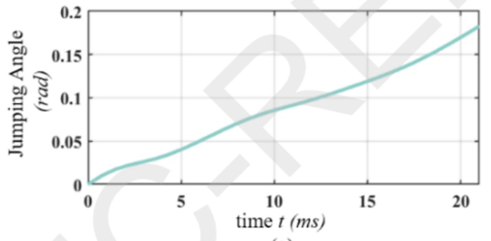

(a)

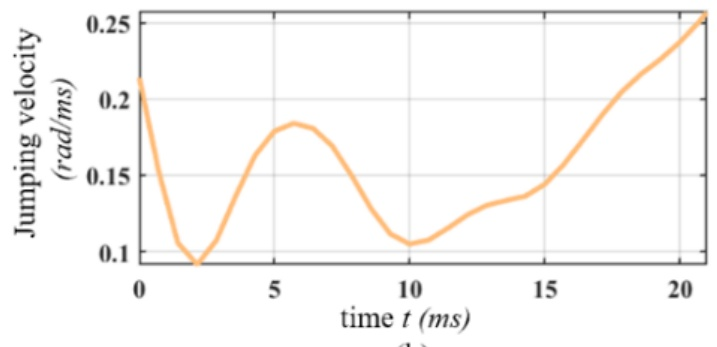

(b)

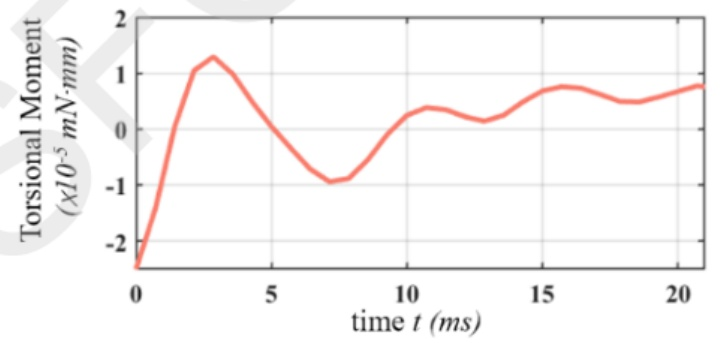

(c)

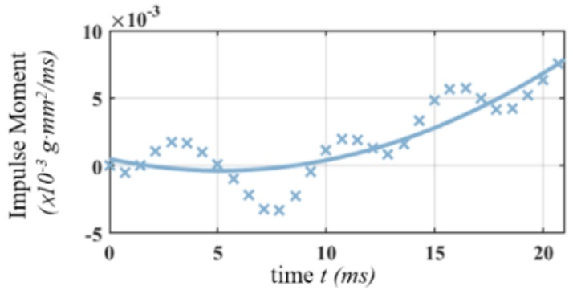

(d)

图1 蝗虫跳跃数据分析

基于上述对蝗虫跳跃运动的分析，为了提高微小型跳跃机器人的跳跃性能与仿生程度，应满足如下特性:（i）与蝗虫的锁定机制类似，有一套受控锁定与释放机构，能够让机器人进行较长时间蓄力并在短时间内将能量释放；（ii）与蝗虫SLP的控制机制类似，提高弹簧的行程的上限足够大，能在保持机器人尺寸小型化的要求下储存足够的能量；（iii）与蝗虫跳跃时的动力学类似，跳跃时惯性矩足够小，以实现稳定的跳跃姿态。

进一步，蝗虫跳跃的目的是积累足够的速度为后续滑翔提供升力。在起飞阶段，身体角度可以被视为攻角，它影响空气动力学中的升力。空速和攻角都会影响升力，因此分析这两个参数的变化很重要。为了进一步了解空速与攻角之间的关系，我们建立了一个仿真模型，该模型描述了跳跃机器人起飞后的运动特性，并通过给定的初始状态分析了机器人在平面内的轨迹。该模型将蝗虫的运动分为跳跃、过渡和滑行三个主要阶段:（i）跳跃阶段被定义为蝗虫从静止开始到离开地面这一过程，跳跃时翅膀保持收缩状态，因而表现出较差的气动性能。该阶段蝗虫通过与地面相互作用进行加速，并在阶段结束时以初始速度 $v _ { 0 }$ 和初始角速度$\omega _ { 0 }$ 离开地面；（ii）过渡阶段被定义为蝗虫离开地面至翅膀张开前这一过程，该阶段翅膀仍保持收缩状态，蝗虫只受重力作用，做抛物运动；（iii）滑翔阶段被定义为翅膀张开至蝗虫落地这一过程，该阶段蝗虫在重力、气动力、气动力矩的共同作用下进行滑翔。

通过仿真验证了蝗虫的跳跃-滑翔运动有效提升了横向运动范围，如图2所示。给定初始速度 $v _ { 0 } = 3 . 2 \: m / s$ ，初始角速度 $\omega_{0}=0\ rad/s$ ，初始位置 ${ \vec { r } } =$ $[ 0 \; 0 \; 0 . 0 3 ] ^ { T } \: m$ 。显然，蝗虫的跃翔运动扩大了横向移动范围，比起单纯的跳跃运动具备更强的移动能力。

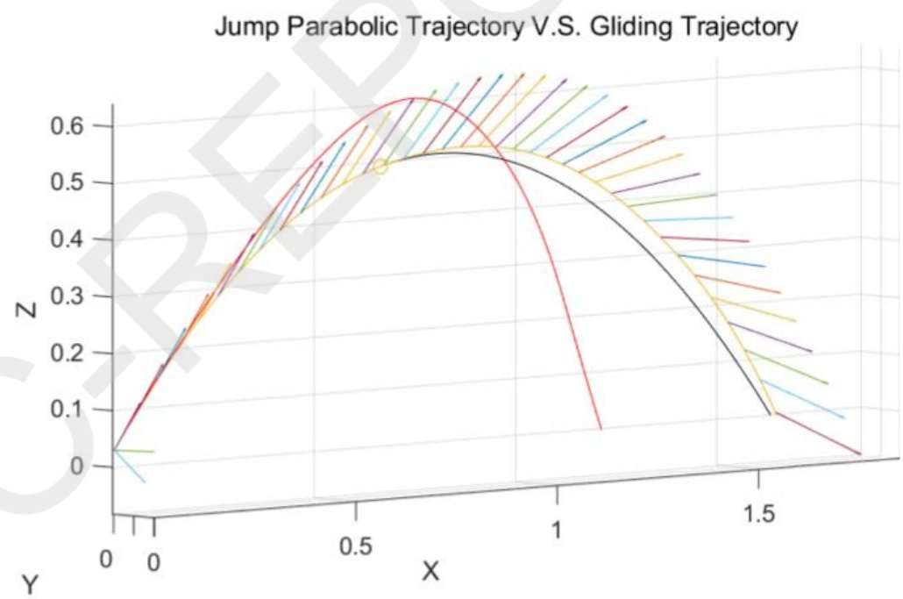

图2跃翔运动与纯跳跃的对比结果

## 2）跃翔一体驱动机理、构型映射与优化

前足和中足是蝗虫爬行运动的关键结构，蝗虫可通过前中足节律的摆动实现前进、后退以及转向等运动；跳跃时通过前中足的支撑调整起跳角；着陆时通过前中足的弯曲缓解地面冲击力。从蝗虫的爬行运动中获取灵感，机器人的爬行模块应具备支撑、前进、转向和减震等功能。其中支撑作用为机器人提供了特定的起跳姿态角度，极大程度上决定了机器人的跳跃轨迹，而为了让机器人具备应对不同环境的可调节的跳跃运动，爬行模块应具备起跳姿态角度调整能力；前进和转向是爬行模块赋予机器人的爬行运动能力，为了应对非结构化的复杂环境，其爬行应具备一定的越障能力。减震功能主要应对着陆时的大冲击情况，机器人需要具备柔性自适应结构吸收冲击能量，以保护整体结构不被破坏。

机器人的爬行模块三维模型如图3所示，包含了轮足结构和减震系统。其中轮足结构由凸轮轮足、一级减速齿轮组、直流电机组成，减震系统由翻转底板和皮筋共同组成。轮足以凸轮作为主要外轮廓，通过直流减速电机驱动，当两个电机同向转动时可实现前进、后退运动，同时具备俯仰角度调整能力；电机反向转动时可以实现机器人转向运动，提供横向姿态调整能力。本研究采用一个可翻转的底板和皮筋组合实现爬行模块的减震设计，将爬行模块的底板一端通过回转副与机体前端相连，在另一端利用皮筋作为弹性元件与机架进行柔性连接。可以看出，当机器人着陆时，爬行模块的轮子将受到来自前下侧的冲击，该地面冲击力将对底板产生绕回转副的一个逆时针旋转的力矩，使底板绕回转副产生逆时针旋转，同时该运动将拉伸皮筋，将大部分冲击能量存储至皮筋中，从而降低着陆冲击力而实现减震。

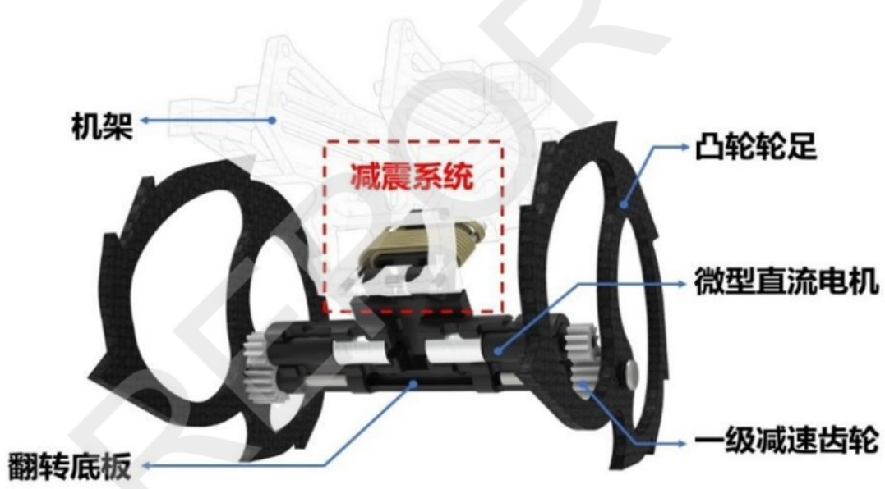

图3 爬行模块

蝗虫跳跃运动主要依靠一对强壮的后足完成。研究发现，蝗虫在跳跃过程中其质心运动呈现线性轨迹，这增强了其跳跃的稳定性。跳跃时，蝗虫通过屈肌将后腿收缩折叠，并通过海特勒肿块实现锁定，通过伸肌不断收缩积蓄能量，最后屈肌舒张释放后足完成高爆发跳跃。凭借“蓄力-锁定-释放”机制，蝗虫能获得远高于肌肉最大负载的作用力，从而能瞬间运动远超自身体长的运动距离。为此，本研究借鉴蝗虫后胸足的骨骼肌肉模型及其工作原理，构建了如图4所示的跳跃模块。该模块由丝杠电机、滑块、挂钩、跳跃连杆、拉簧、跗节等组成。丝杠电机连接线绳1与滑块，当其正向旋转时线绳1会被缠绕到丝杠上，滑块会向前平移；当其反向旋转时线绳1将被释放，滑块向后移动并牵引线绳2驱动挂钩打开。具体工作流程如下:

（i）蓄力:电机正向旋转n圈，长度为l=n×d的线绳缠绕在丝杠上，并带动腿部收缩；（ii）锁定:当等于腿部伸展的行程L时，腿部完全收拢并挂在钩子上，实现能量的锁定；（iii）松线:电机反向旋转来松动缠绕的线绳，而腿部此时仍被挂钩锁住，保持收拢状态；（iv）发射:电机继续反向旋转，滑块移动 $\Delta \mathbf { s }$ 的距离，并通过一根绷紧的线绳触发钩子，腿部瞬间蹬展，完成跳跃。

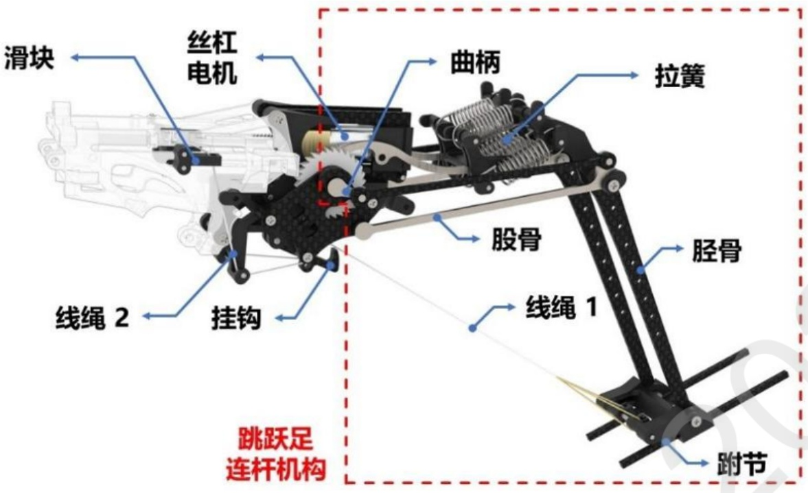

图4 跳跃模块

为同时保证机器人的跳跃能量与运动稳定性，本研究采用多目标粒子群优化算法对跳跃足结构进行了优化。首先建立了如图5所示的动力学模型；然后基于运动学关系寻找身体质心 $. C o M _ { 5 }$ 的最优位置，使其在起跳过程中的运动轨迹近似线性，并优化弹簧安装点位，使其储存更多能量；最后基于动力学解算结果，采用牛顿-欧拉方法计算机器人的惯性力和惯性力矩，以机器人的受力最稳定为目标，寻找最优的连杆长度。

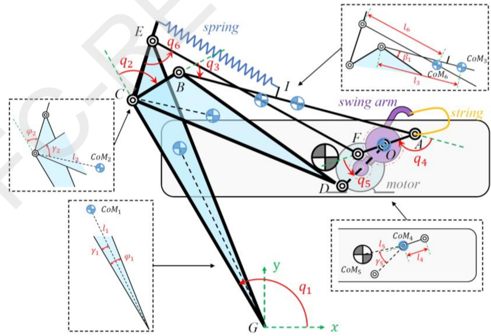

图 5 跳跃动力学模型

为优化跳跃机构的能量存储，我们将主动变量 $\dot { \boldsymbol { q } } _ { 5 }$ 离散化，基于运动学结算结果获得了足端轨迹的一系列离散点，设定了 $\gamma _ { 5 }$ 和 $l _ { 5 }$ 这两个优化变量来寻找身体质$心 CoM_{5}$ 的最优位置，应满足下式:

$$
\min \sum_{s t e p=2}^{n-1} \left| \frac{y_{C o M_{5}}^{s t e p+1}-y_{C o M_{5}}^{s t e p}}{x_{C o M_{5}}^{s t e p+1}-x_{C o M_{5}}^{s t e p}}-\frac{y_{C o M_{5}}^{s t e p}-y_{C o M_{5}}^{s t e p-1}}{x_{C o M_{5}}^{s t e p}-x_{C o M_{5}}^{s t e p-1}} \right|
$$

此外，我们还通过变量λ对弹簧的安装位置进行了优化。根据运动学模型解算结果，三角桁架CEG相对于连杆AB的运动最为明显，因此将弹簧两端点分别固定于这两根连杆上时，会出现最大的行程:

$$
\max[(x_{E}-x_{I})^{2}+(y_{E}-y_{I})^{2}]_{step=n}
$$

为优化跳跃机构的稳定性，考虑到机器人的绝代部分质量集中于身体质心，因此有牛顿第二定律可知，身体质心上的惯性力和惯性力矩可近似替代外力。因此，我们采用牛顿-欧拉法递推机器人各部分的惯性力及惯性力矩，希望机器人身体部分受到的惯性力方向尽可能一致，受到的惯性力矩在起跳阶段的积累尽可能小，如下:

$$
\begin{aligned}\min f_{1} = \sum_{step = 2}^{n} |f_{0}(step)| = \sum_{step = 2}^{n} \left| arctan \frac{\frac{0F_{I_{5y}}^{step}}{0F_{I_{5x}}^{step}} - arctan \frac{0F_{I_{5y}}^{step-1}}{0F_{I_{5x}}^{step-1}}}{\frac{1}{0F_{I_{5x}}^{step-1}}} \right| \\\min f_{2} = H = \int_{0}^{t} & \frac{0}{t} \underline{M}_{I_{5}} \cdot dt\end{aligned}
$$

通过设定种群个数为5、迭代次数10，我们得到连杆参数的全局最优解，如表2所示。迭代过程如图6所示，可以看到随着优化的进行，种群中最优的粒子得分随迭代次数程下降趋势。此外，图6分别展示了第一轮和最后一轮迭代过程中一个粒子代表的受力情况，其中优化全流程中最劣粒子代表的机构，其惯性力的方向波动角度差为0.7011rad，冲量矩为0.0078kgm2/s。而最优粒子代表的机构，其惯性力的方向波动角度差仅为0.2274 rad，冲量矩为0.0035 kgm2/s。可以看到惯性力的方向变化降低了67.6%，冲量矩下降了55.1%，这意味着跳跃稳定性在提高，因此优化是有效的。

表2 连杆参数的全局最优解

| 连杆 | 优化结果 | 连杆 | 优化结果 | 连杆 | 优化结果 |
| --- | --- | --- | --- | --- | --- |
| $l _ { B A }$ | 58.14 mm | $l _ { C D }$ | 66.80 mm | $l _ { C E }$ | 68.01 mm |
| $l _ { A O }$ | 5.32 mm | $l _ { A F }$ | 10.86 mm | $l _ { D H }$ | 2.78 mm |
| $l _ { O D }$ | 13.72 mm | $l _ { C E }$ | 14.64 mm | $l _ { 5 }$ | 10 mm |
| $l _ { B D }$ | 61.12 mm | $l _ { E F }$ | 60.61 mm | $\gamma _ { 5 }$ | 1.57 rad |
| $l _ { C B }$ | 7.65 mm | $l _ { G C }$ | 59.10 mm | λ | 0.2 |

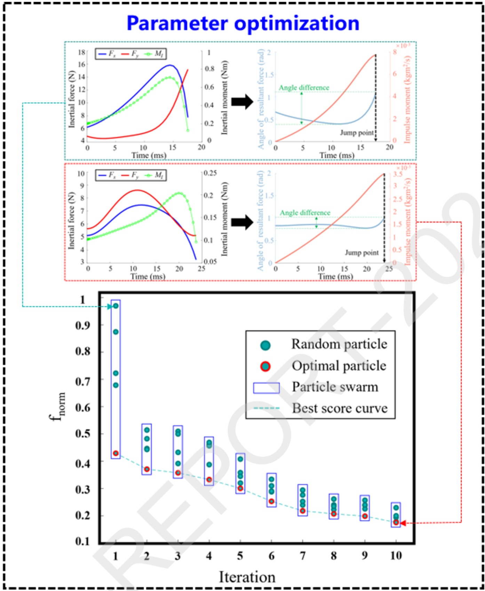

图6 多目标优化结果

为了仿生自然界中昆虫的生物力学适应性，我们改进了昆虫的碰撞恢复机制并模仿昆虫前缘的刚度异性分布原理，提出了一种被动柔性的折叠翼，我们研究了自适应折叠变形的前缘对扑翼式微型飞行器的影响，在刚性翅膀和自适应变形翅膀的飞行测试中量化了升力产生、以及越障能力的变化，同时校核了翅膀的刚度，防止其受损。对拟议的扑翼机构型来说，在飞行过程中仍然可以在扑翼过程中产生前缘涡旋并在扑翼运动结束时脱落并重新生成，以提供足够的升力。我们在双层扑翼飞行机器人上的翅膀实现了这一机制，从而可以在碰撞后能够安全的飞行。

昆虫的翅膀在飞行过程中遇到障碍物时翅膀会短暂的自适应的变形，同时在一定程度上保持飞行能力。从昆虫对大自然的适应能力汲取灵感，我们发现这些折纸般的折叠在飞行中的翅膀碰撞中产生了至关重要的减振作用，当机翼与物体碰撞后，它会沿着翅膀轴向弯曲，并在一个冲程内弹回原位，帮助迅速恢复飞行。

为了系统而精确地量化鲁棒碰撞恢复机制的性能表现，我们聚焦于通过对比传统结构与被动折展结构在机翼前缘碰撞恢复能力上的差异，制备了两组机翼模型。如图7所示，第一组为基准对照组，采用了标准的、未经特殊设计的普通机翼前缘，这些前缘在遭遇外部冲击时，其恢复能力主要依赖于材料本身的固有属性及结构设计；第二组则为实验组，其显著特征在于引入了先进的自适应变形机制，该机制使用镍钛记忆合金作为前缘构造材料。利用其超弹性能力，在受到外力作用后发生形变，并在去除外力或施加特定条件时自动恢复至原始形态，这一特性为提升机翼在碰撞事件中的快速恢复与稳定性提供了解决方案。

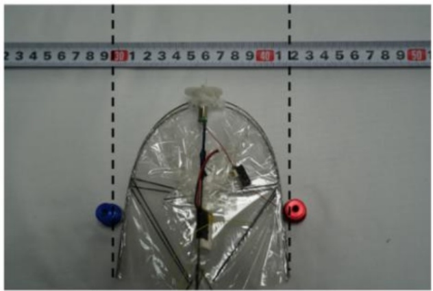

(a) 被动变形机翼的

静态弯曲状态

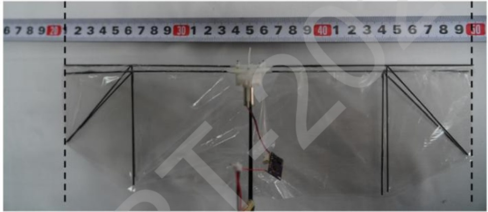

(b)被动折叠机翼的静态展开状态

图7 被动变形机翼静态折叠状态

在详尽的碰撞实验分析框架内，我们观测到了一种显著现象:机翼在遭遇障碍物后的精确0.1秒内即触发弹出机制，此现象无论发生于上冲程或下冲程的任一阶段，均展现出高度的动态响应性。值得注意的是，自适应前缘设计在此情境中发挥了关键作用，它有效地吸收了障碍物对后翼产生的反作用力，从而在不中断或扰乱原有拍打运动模式的前提下，实现了对外部冲击的缓冲与适应。为了进一步阐明这一机制的具体效应，我们深入剖析了一次具有代表性的碰撞实验案例。在此次实验中，碰撞事件直接导致了被碰撞机翼的偏差角度发生显著变化，进而引发冲程幅度的缩减与振动频率的降低。通过精确的数据测量与理论分析，我们明确地指出，这一系列变化对升力产生了不利影响，具体表现为飞行高度的即时损失。然而，除直接受碰撞影响的机翼部分外，其余飞行组件并未遭受到显著负面影响，保持了较高的结构完整性与功能稳定性，验证了系统设计的冗余度与鲁棒性。图8直观地展示了这一飞行过程中的关键阶段以及对比实验。

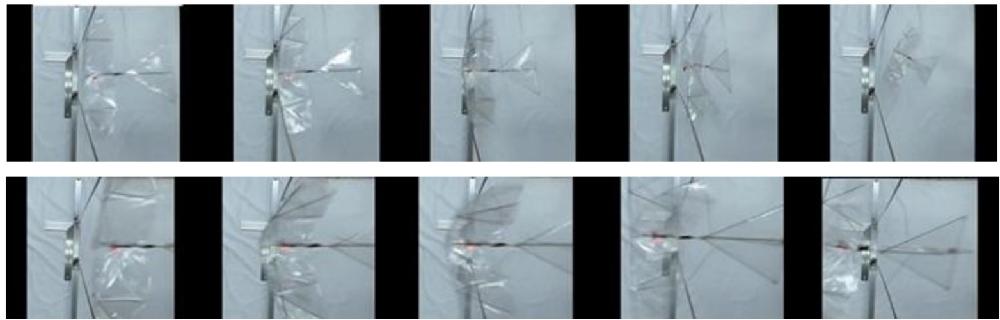

图8飞行过程中的关键阶段以及对比实验

通过深入且系统地探究了机翼的被动折展机制，通过精心设计的双侧机翼碰撞实验，全面评估了采用被动折展技术的机翼在遭遇障碍物时的动态响应与恢复能力。当此类机翼的前缘遭遇障碍物时，其内置的镍钛合金能够即时触发自适应折叠机制，有效吸收并储存碰撞过程中产生的弹性势能。随后，在机翼顺利穿越障碍物或缝隙后，储存的弹性势能得以迅速释放，驱动前缘恢复至初始形态，从而确保机翼能够无缝衔接至正常的飞行状态，这一过程显著增强了机翼的碰撞耐受性与恢复效率。 2

相较于已有的依赖铰链机制实现碰撞恢复的机翼设计，所提出的仿生被动柔性折展前缘技术展现出了显著的优势。具体而言，该技术能够根据障碍物或缝隙的具体形态与尺寸，自适应地调整弯折点与形变路径，这一特性有效分散了碰撞应力，避免了应力在固定铰链点上的过度集中，从而延长了机翼结构的整体寿命。此外，由于被动折展机翼在结构上更为紧凑且灵活，其转动惯量相对较小，这意味着在相同的动力条件下，该类型机翼能够实现更高的扑动频率，不仅提升了飞行效率，还增强了机动性与响应速度。

蝗虫的飞行结构主要为前-后翅和腹部，后翅宽大提供主要的升力，前翅细长辅助飞行，腹部摆动可以调整飞行姿态。蝗虫的翼翅具备折展功能，能在飞行时展开以获得大的飞行升力，而在跳跃等运动时折叠以减小运动阻力，从而很好地解决了多模态运动之间的运动矛盾。长距离飞行时，蝗虫可以借助低空气流滑翔，从而凭借较低的能耗实现远距离运动。

本研究借鉴蝗虫的气动布局设计了如图9所示的滑翔模块，主要由螺旋桨动力系统、折叠双翼和尾翼组成。螺旋桨动力系统为机器人滑翔提供主动动力，可提升机器人空中运动距离；折叠翼的设计极大缓解了滑翔大升力需求与跳跃小阻力需求的矛盾；机器人配置的气动尾翼通过较大的尾翼面积与气流作用形成翻转力矩，进而控制机器人的俯仰姿态。

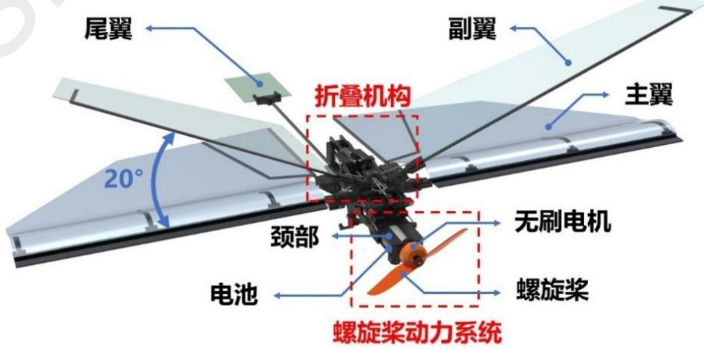

图9滑翔模块组成

在折叠翼的设计中，翼翅折叠率是关键的指标，其表示为翼翅完全展开与折叠时翼翅有效投影面积比值。本研究采用动滑轮-曲柄滑块复合机构实现翼翅折叠，如图10所示。该机构在滑块上安置了一个滑轮组成动滑轮结构，翼翅牵引线一端固连在机架前端，另一端绕过滑轮与翼翅前缘相连，其中牵引线充当了连杆的作用。当滑块向后移动时，动滑轮-曲柄滑块复合机构的连杆会逐渐变短，使曲柄和连杆快速到达共线状态而扩大了曲柄的转动角度，即提高了翼翅折叠率。

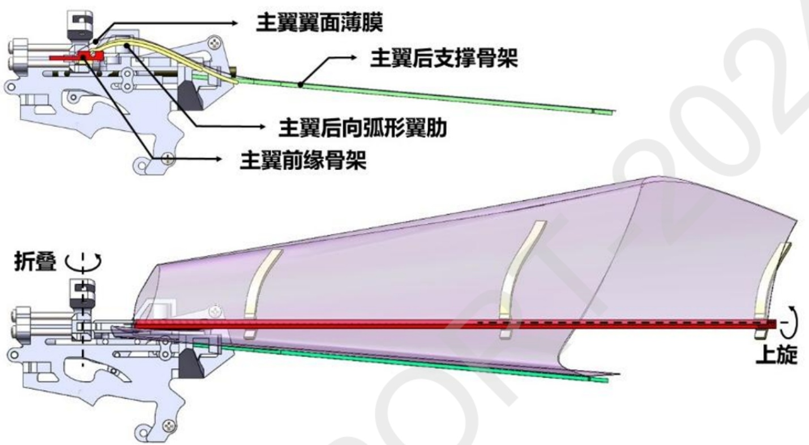

图10 主翼柔性翼翅设计

折叠翼的工作流程如图11所示，具体如下:（i）滑块A与丝杠电机通过螺纹配合，随着丝杠电机正向旋转前向运动可以通过其上可活动的锁钩与滑块B耦合；（ii）当滑块A在丝杠电机驱动下向后移动时，由于锁钩的耦合作用，滑块B也跟随滑块A同步后向移动，同时滑块B牵动连接在翼翅前缘的线绳，拉动翼翅绕翼翅转动关节旋转实现折叠；（iii）当滑块A向后移动到一定位置时，锁钩会受到机体轨道约束向下翻转接触锁钩与滑块B的连接，实现两个滑块的解耦，滑块B在失去滑块A约束后会在翼翅根部皮筋作用下复位，即完成展翅。

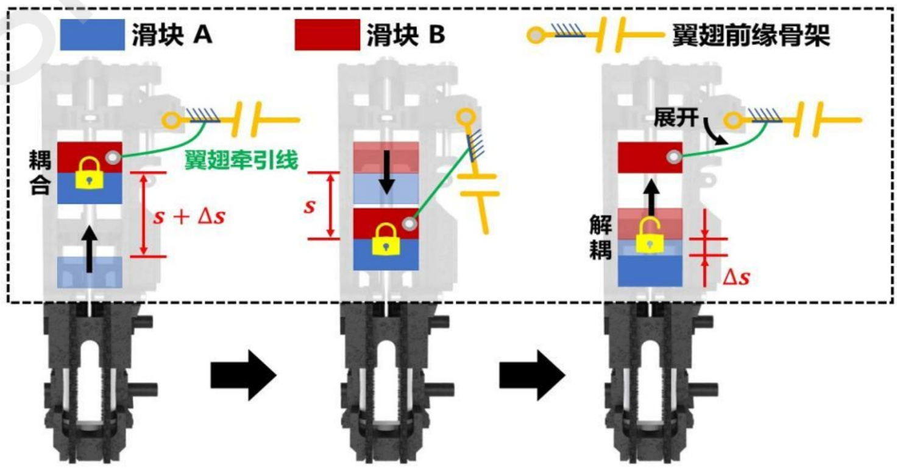

图11 折叠翼工作流程

生物蝗虫能够轻松完成跳跃与飞行的切换，而由于感知能力与控制能力的有限，机器人难以实现顺滑可靠的跃翔运动。因此，本研究提出一种基于单电机驱动的翼-腿协同驱动技术，通过一个丝杠电机连接起跳跃模块与滑翔模块的运动，极大程度上提高了跳跃与滑翔运动转化顺滑性;在跳跃足与机体之间设置被动弹性关节，抑制跳跃运动的翻转效应，提高跳跃-滑翔切换的稳定性。

跳跃足与折叠翼在机器人模态切换过程中存在着运动的耦合关系，跳跃足收缩和翼翅折叠出现在空中模态转向陆地模态的过程中，蹬地和展翅运动出现在陆地模态向空中模态转换的过程中，因此跳跃足和折叠翼的运动可以共用驱动元件来完成，本研究通过匹配跳跃足结构的“收缩-伸展”行程与折叠翼的“折叠-舒张”行程，从而实现跃翔运动的协调配合。通过中心丝杠电机同时驱动跳跃模块与滑翔模块，实现了跳跃足与折叠翼的共收缩-舒张，图12展示了翼-腿协同驱动的原理与流程。

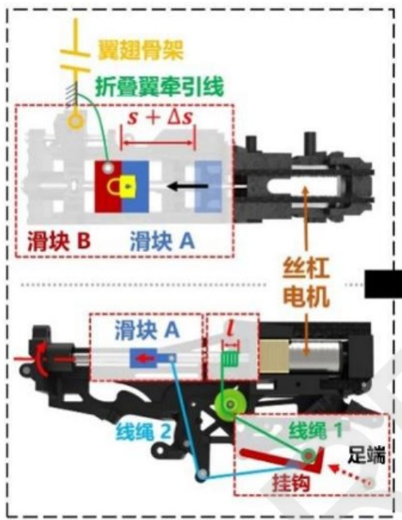

(1)跳跃足收缩

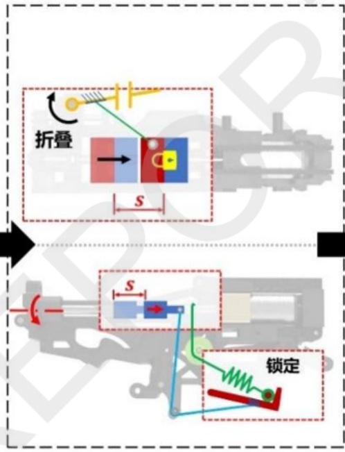

(2) 翼翅折叠

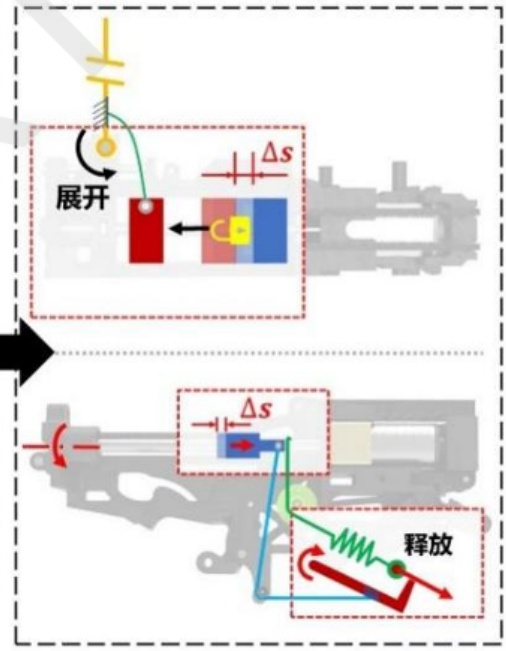

(3) 翼-腿共触发

图12 翼-腿协同驱动原理与流程

最终，机器人的整体三维建模与实物样机如图13所示，由爬行模块、跳跃模块和滑翔模块组成，实现了三种运动模态机构的耦合设计。机器人滑翔状态下翼展为50cm，在折叠状态下机器人尺寸为 $25 \times 8 \times 12   cm$

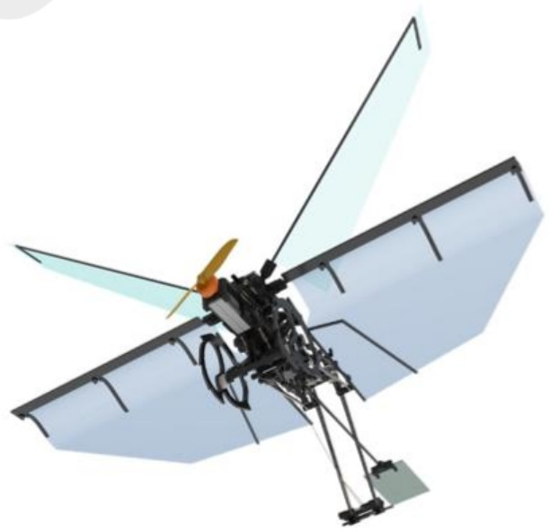

(a) 三维建模

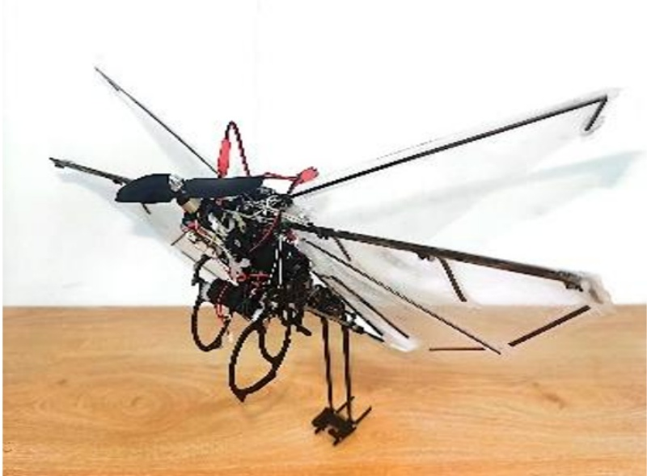

(b) 样机

图13 爬-跃-翔机器人三维建模与样机

## 3）爬行-跳跃-滑翔多模态融合与快速切换控制

本研究借鉴蝗虫的跨域运动方式，提出仿蝗虫机器人灵活爬行、长距离跳跃与稳定滑翔的耦合运动控制策略，如下所示:

（i）爬行运动控制:机器人爬行过程，通过控制轮足电机的旋转，实现机器人在世界坐标系位置的改变。操作者向机器人发送目标位置信息，机器人通过解算器以及轮腿模型进行逆运动学求解。接下来，地面模式选择器生成机器人直行或转向的信号。最后，通过PD运动控制器实现轮足电机的位置控制。

（ii）跳跃运动控制:在爬行运动控制的基础上，机器人跳跃阶段通过控制跳跃足的电机进行蓄力与释放。首先，机器人在轮足可调节的5个离散角度中选择最佳角度，作为机器人起跳角度。接下来，通过控制丝杆电机的正转实现跳跃足结构的蓄力。最后，通过电机反转到指定位置完成跳跃的触发，实现能量的瞬间释放。

（iii）飞行与滑翔控制:利用跳跃阶段的动力学模型可得到跳跃阶段末期的机器人位姿，滑翔运动过程首先通过轨迹规划器获得起跳角度下的最优跃翔轨迹，并将其作为控制器的前馈。接下来，利用强化学习控制器通过控制展翅时机、前置螺旋桨油门开度以及尾翼的偏置，调整机器人空中姿态，生成跳跃-滑翔模态的动作序列，以此实现机器人的位姿调整。最后通过IMU实时监测机器人的姿态，并将其作为控制器的反馈，以此提高控制精度。

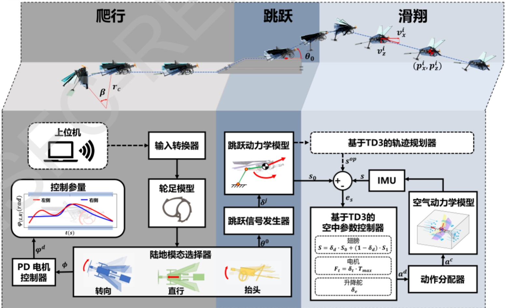

图14 多模态耦合的运动控制框图

飞行控制方面，本研究提了出一种有尾双层扑翼飞行机器人近悬停点的控制方法。为了提高有尾扑翼飞行机器人的稳定性，对其扰动进行姿态镇定，选择以尾翼的水平偏角作为控制变量设计状态反馈控制器。该反馈控制器不仅能较快地对悬停状态受到的扰动进行抑制，而且响应过程振荡较少，系统的平稳性较好。

在纵向姿态稳定的基础上，可通过单控制信号实现对双层扑翼飞行机器人在悬停点附近的飞行控制。

有尾双层扑翼飞行机器人如图15所示。机器人由上下两对翅膀组成，呈X型布局，由一个电机带动两套曲柄摇杆机构产生扑动，机身后部具有一个水平尾翼，在电磁舵的控制下可以产生水平偏转角度。我们分别在建立如下的惯性坐标系 $X _ { \mathsf { e } } Y _ { \mathsf { e } } Z _ { \mathsf { e } }$ 和机体坐标系 $X _ { b } Y _ { b } Z _ { b }$ ，坐标系原点位于飞行器重心处。在机器人不产生横侧向运动的条件下，飞行器只产生沿着 $\mathsf { X _ { b } }$ 的切向力 $\mathsf { T } \mathsf { b }$ 和沿着 $\mathrm { Z b }$ 的法向力$N b$

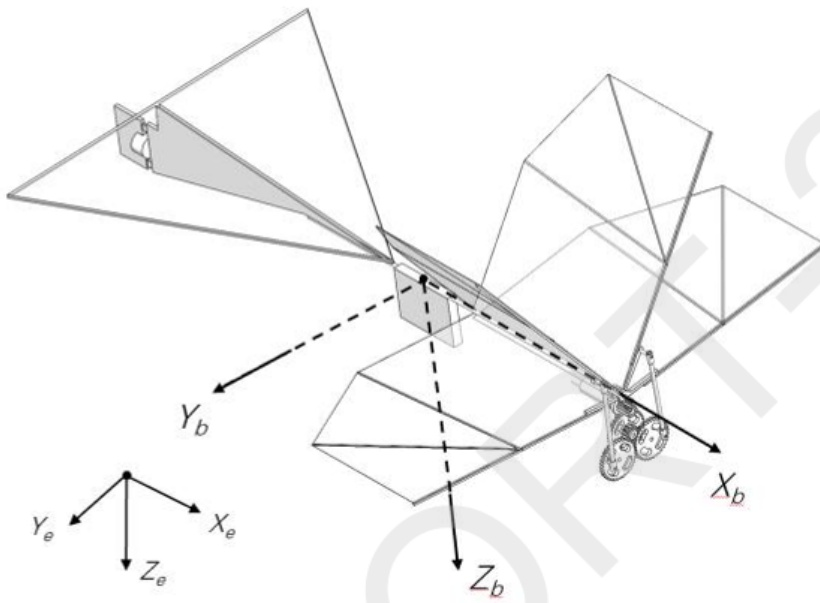

图15 有尾双层扑翼飞行机器人机构示意图

利用牛顿欧拉运动方程，在机体坐标系 $X _ { b } Y _ { b } Z _ { b }$ 中建立飞行动力学方程。针对双层扑翼微型机器人尾翼气动力模型进行线性化展开，并转化为状态空间形式:

$$
\begin{array} { r } { \left[ \begin{matrix} { \delta \dot { u } } \\ { \delta \dot { w } } \\ { \delta \dot { q } } \\ { \delta \dot { \theta } } \end{matrix} \right] = A \left[ \begin{matrix} { \delta u } \\ { \delta w } \\ { \delta q } \\ { \delta \theta } \end{matrix} \right] + B \cdot \beta , } \end{array}
$$

其中， $\mathsf { A }$ 是系统矩阵，B是控制矩阵。具体表达式如下方所示:

$$
A = \left[ \begin{matrix} { \frac { C _ { T u } } { m ^ { + } } } & { \frac { C _ { T w } } { m ^ { + } } } & { \frac { C _ { T q } } { m ^ { + } } } & { - \quad g ^ { + } } \\ { \frac { C _ { N u } } { m ^ { + } } } & { \frac { C _ { N w } } { m ^ { + } } } & { \frac { C _ { N q } } { m ^ { + } } } & { 0 } \\ { \frac { C _ { M u } } { I _ { y } ^ { + } } } & { \frac { C _ { M w } } { I _ { y } ^ { + } } } & { \frac { C _ { M q } } { I _ { y } ^ { + } } } & { 0 } \\ { 0 } & { 0 } & { 1 } & { 0 } \\ \end{matrix} \right] , \quad B = \left[ \begin{matrix} { \frac { C _ { T \beta } } { m ^ { + } } } \\ { \frac { C _ { N \beta } } { m ^ { + } } } \\ { \frac { C _ { M \beta } } { I _ { y } ^ { + } } } \\ { 0 } \\ \end{matrix} \right]
$$

至此，得到了有尾双层扑翼飞行机器人纵向运动方程在平衡点附近的的小扰动线性化方程。

由于扑翼飞行器在纵向不稳定，悬停时受到扰动很快就进入振荡发散状态，因此需要实时反馈控制以实现对扰动的镇定。在昆虫的纵向运动研究中，有一种典型的控制思路，将昆虫的纵向运动当作多输入多输出系统进行处理，这种控制方法需要较多的控制自由度，而其复杂的运动机构却也限制了扑翼飞行机器人的进一步微型化。因此，本文提出只利用尾翼水平偏转角对纵向状态扰动进行镇定，这是典型的单输入系统的状态反馈控制问题。首先进行系统的可控性分析。系统可控性矩阵为:

$$
\mathbf { \mathit { S } } = \left[ \begin{matrix} { \mathbf { \mathit { B } } } & { \mathbf { \mathit { A B } } } & { \mathbf { \mathit { A } } ^ { 2 } \mathbf { \mathit { B } } } & { \mathbf { \mathit { A } } ^ { 3 } \mathbf { \mathit { B } } } \\ \end{matrix} \right]
$$

该矩阵阶数为4，为满足系统可控性条件，对该扑翼飞行机器人进行状态反馈，控制系统示意图如下方所示。设状态反馈增益矩阵为: 2

$$
K = ( k _ { u } , k _ { w } , k _ { q } , k _ { \theta } )
$$

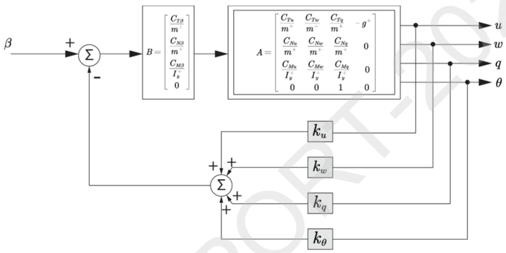

图16 状态反馈控制系统示意图

需要指出的是，当前的线性化纵向运动模型及姿态镇定控制器均基于小扰动假设，因此不适用于阵风等大扰动环境。

然后本研究采用 Twin Delayed Deep Deterministic policy gradient (TD3)强化学习算法构建了仿蝗虫机器人轨迹规划的强化学习网络，如图17所示。基于TD3算法的轨迹规划器用于规划在不同发射角度下最优跳跃-滑翔运动轨迹。轨迹规划器由一个主网络和一个目标网络两部分组成，两者的结构相同，均包含了一个Actor 网络和两个 Critic 网络。

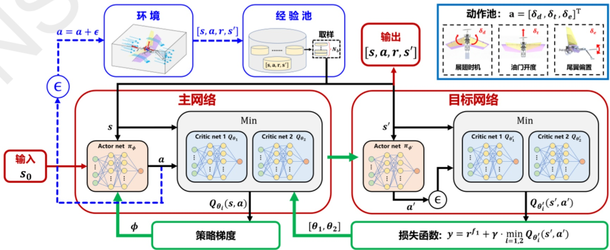

图 17 基于 TD3 的轨迹规划器