项目批准号 U20A20225申请代码 F0608归口管理部门收件日期

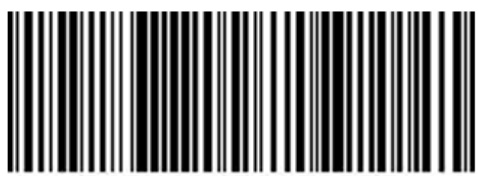

202409U20A20225

# 国家自然科学基金

# 资助项目结题/成果报告

资助类别:联合基金项目

亚类说明:重点支持项目

附注说明:区域创新发展联合基金

项目名称:无人车自主协同感知及网络化预警关键技术研究

负责人:高洪波

BRID: 06738.00.91836

电子邮件: ghb48@ustc.edu.cn

电话: 18911583306

依托单位: 中国科学技术大学

联系人: 李璐璐

电话: 0551-63606707

直接费用:267.0000（万元）

执行年限: 2021.01-2024.12

填表日期:2024年12月27日

国家自然科学基金委员会制（2023年）

## 项目摘要

## 中文摘要:

面向在极端和恶劣天气情况下无人车协同感知与网络化预警的功能需求，针对“自主协同感知” “网络化安全预警”两个方面的科学挑战，开展“低质量感知和图像内容增强与复原技术”，“多模态目标追踪检测、关键及敏感区域细粒度识别技术”，“自主协同感知技术”三项关键技术研究，构建面向无人车网络化的协同感知与安全预警机制，实现无人车静止状态和行驶状态下环境数据的获取、感知、分析与交互的基础理论与关键技术的集成展示与应用验证。本项目研究有望在无人车在低质量、多模态和特殊姿态行人等条件下的图像内容增强与复原、追踪检测、关键及敏感区域的协同感知与细粒度目标识别方向取得突破，为我国无人车的产业化、规模化应用奠定技术基础。

## Abstract:

Aiming at the practical need for collaborative perception and networked early warning of driverless vehicles in extreme weather conditions, focus on two scientific problems of "autonomous collaborative perception" and "networked safety warning", develop three key technologies of "low quality perception and image enhancement and restoration" "multi-modal target detection, tracking, and fine-particle recognition of key areas and “autonomous collaborative perception", establish the mechanism of collaborative perception and networked early warning of driverless vehicles, and realize the acquisition, perception, analysis, and interaction of the environmental data in both stationary and driving conditions. This project will break through in the areas of image enhancement and restoration, target tracking, cooperative perception and fine-particle recognition of key areas for driverless vehicles under the constraints of low-quality, multi-modal, and special posture pedestrian, providing theoretical basis for the industrialization of driverless vehicles.

关键词（用分号分开）:无人驾驶车辆；自主协同感知；网络化安全预警；

图像内容增强与复原；多模态目标追踪检测

Keywords (separated by;): Driverless vehicles; Autonomous collaborative perception; Networked safety warning; Image enhancement and restoration; Multi-modal target detection and tracking

## 结题摘要

## 中文摘要（对项目的背景、主要研究内容、重要结果、关键数据及其科学意义等做简单概述）:

本项目面向无人车在极端和恶劣天气条件下的应用需求，聚焦自主协同感知与网络化安全预警两大核心科学问题，提出了并系统研究了多项关键技术。项目以无人车产业化和实际应用为导向，针对复杂环境中感知、分析、决策及预警能力的技术瓶颈，提出了有效解决方案，为无人车在极端天气条件下的稳定运行提供了技术保障。项目主要研究了低质量感知与图像内容增强、多模态目标追踪与关键区域细粒度识别、自主协同感知方法及网络化安全预警技术四个方向。针对低质量感知问题，提出了基于U型网络的图像增强算法和基于暗通道先验的图像复原技术，显著提升了逆光、雾霾等复杂环境下的感知能力；在多模态目标识别与追踪方面，研发了视觉与雷达数据融合的方法，实现了动态目标的高精度跟踪及特殊姿态行人的精准预估；针对网络化协同感知，构建了基于V2X的协同一体化感知技术体系，并开发了高效的车路协同通信与信息交互技术。研究取得了多项重要成果。基于改进深度学习算法的低质量图像增强方法，其实验结果表明了平均感知精度较传统方法提高18%以上；多模态目标追踪技术在复杂环境中的识别率达92%以上，显著增强了无人车的环境感知能力；基于5G-V2X的车路协同通信模型实现了低于50ms的通信时延，显著提高了网络化安全预警的实时性和可靠性。项目成果已在封闭工业园区及恶劣天气条件下的无人车测试中得到验证，为无人车的规模化应用奠定了坚实的技术基础。本项目的研究具有重要的科学意义与应用价值。一方面，突破了极端天气下感知技术的瓶颈，为无人车全天候运行提供了创新技术；另一方面，推动了智能网联汽车技术的发展，为智能交通和公共安全领域带来了深远影响。未来，项目技术将进一步拓展至国防安全、应急救援等领域，助力相关产业的智能化升级，为关键领域的技术进步做出贡献。

# Abstract (Brief description of research background, main methods, contributions, and research data):

This project addresses the application requirements of unmanned vehicles (UVs) under extreme and adverse weather conditions, focusing on two core scientific challenges: autonomous collaborative perception and networked safety early warning. The project systematically studies and develops key technologies to address the technical bottlenecks of perception, analysis, decision-making, and warning capabilities in complex environments, providing robust support for the stable operation of UVs in extreme weather. The primary research content includes four areas: low-quality perception and image enhancement, multimodal target tracking and fine-grained recognition of key regions, autonomous collaborative perception methods, and networked safety early warning technologies. For low-quality perception challenges, the project proposed U-shaped network-based image enhancement algorithms and dark channel prior-based image restoration techniques, significantly improving perception accuracy under backlighting, haze, and other complex conditions. In multimodal target recognition and tracking, the project developed methods for fusing visual and radar data, enabling high-precision tracking of dynamic targets and accurate estimation of pedestrians with atypical postures. Regarding networked collaborative perception, a V2X-based integrated collaborative perception framework was established, coupled with efficient vehicle-road collaborative communication and information exchange technologies. The research has achieved several significant outcomes. The low-quality image enhancement method, based on improved deep learning algorithms, demonstrated an average perception accuracy improvement of over 18% compared to traditional methods. The multimodal target tracking technology achieved a recognition rate of over 92% in complex scenarios, markedly enhancing UVs' environmental perception capabilities. Furthermore, the 5G-V2X-based vehicle-road collaborative communication model realized sub-50ms communication latency, substantially improving the real-time performance and reliability of networked safety early warning systems. The project outcomes have been validated in tests conducted within closed industrial parks and under adverse weather conditions, laying a solid

| foundation for the large-scale application of UVs. This project holds significant scientific and practical value. It has broken through the bottleneck of perception technologies in extreme weather, providing innovative solutions for all-weather operation of UVs. Additionally, it has propelled the development of intelligent |
| --- |
| connected vehicle technologies, contributing profoundly to smart transportation and public safety. In the future, the technologies developed in this project will be |
| extended to fields such as national defense and emergency rescue, driving intelligent upgrades in key industries and fostering advancements in critical technologies. |
| 关键词（用分号分开）:自主协同感知；网络化安全预警；多模态目标追踪 图像增强与复原；智能网联汽车 |
| Networked Keywords (separated by;): Autonomous Collaborative Perception; |

## 正文

《结题/成果报告》正文分为两个部分:结题部分和成果部分。请按照《结题/成果报告》填报说明及撰写要求填写。

## (一）结题部分

1. 研究计划执行情况概述。

## （1）按计划执行情况。

项目组按计划完成了项目任务书设定的主要研究内容。经过多年的研究，我们发现无人车在极端和恶劣天气下实现自主协同感知与网络化安全预警的两大关键挑战需要突破:一是复杂天气条件下感知质量下降严重，直接影响无人车的环境感知与决策；二是现有的目标追踪和协同感知技术在动态复杂场景中可靠性不足。为解决上述问题，本项目系统研究并提出了面向极端和恶劣天气的无人车协同感知与网络化预警技术体系。主要研究内容执行情况如下:

在低质量感知和图像内容增强与复原技术研究方面，提出了一套面向恶劣天气的图像感知增强和复原技术。通过基于U型网络的低质量感知图像增强方法，优化卷积神经网络结构，显著提升了在低光照和逆光条件下的图像感知能力。进一步，开发了基于暗通道先验的图像复原技术，结合大气光模型，精准恢复了雾天和阴雨天气中低质量图像的细节信息。针对现有单一方法的局限性，本项目创新性地提出了基于自适应清晰化的图像增强与复原融合方法，将图像分为近景和远景两部分进行差异化处理，大幅提升了图像复原的整体质量与实时性。

在多模态目标追踪与细粒度识别技术研究方面，系统研究了无人车在极端天气下的多模态目标追踪与细粒度识别技术。提出基于视觉与雷达数据融合的动静态目标检测与跟踪算法，有效提升了无人车在多源传感异构信息下的目标识别性能。同时，针对特殊姿态行人识别的挑战，设计了多视图融合的深度学习模型，结合人体关键点检测与三维几何建模，成功构建了特殊姿态行人数据库与先验库，实现了行人行为的准确预测。在路面状况与突发事件辨识方面，采用气象传感器与多模态数据融合，结合历史数据与先验知识，完成了路面状况与突发事件的快速细粒度辨识，大幅提高了无人车在复杂环境下的感知与应对能力。

在自主协同感知技术研究方面，针对无人车在极端和恶劣天气下的感知局限，提出了基于多模多源传感器融合的协同感知技术，突破了单车感知在超视距与复杂场景中的限制，显著提升了环境感知的精度与可靠性。同时，开发了基于LTE-V/5G通信技术的新一代车路协同感知系统，能够实现实时的车辆与道路信息交互，进一步提高无人车在动态复杂场景中的协作能力。结合V2X（车-路-车）技术，研究并提出了一体化动静目标检测与跟踪体系，为无人车在恶劣天气下的协同感知奠定了技术基础。

在行车安全综合态势评估与网络化安全预警研究方面，构建了基于人工势能场理论的行车风险动态评估模型，全面分析了车辆与环境之间的动态交互关系，设计了行车安全综合态势评估系统。通过多维感知数据融合与动态场景建模，系统地评估了无人车在复杂场景下的风险等级。进一步，开发了网络化安全预警平台，结合历史事故数据与实时感知数据，对可能出现的风险进行提前预测与警报提示。该平台通过实际场地验证，证明能够显著提升无人车的风险感知与动态响应能力。

在综合验证与成果应用方面，本项目在多个实际场景中对研究成果进行了验证，包括复杂天气模拟场地测试和开放道路试验，重点测试了无人车在逆光、雾天、暴雨等条件下的图像感知与动态响应能力，验证了低质量感知技术与协同感知系统的有效性。此外，与产业伙伴合作，应用于部分无人车产品的场地测试和试运营，为我国无人车的规模化应用奠定了技术基础。

通过以上研究与实践，项目组在无人车自主协同感知与网络化安全预警技术方面取得了重要突破，形成了一系列创新性成果，显著推动了无人车技术在极端和恶劣天气条件下的实际应用。

## (2)研究目标完成情况。

项目按计划完成了相关研究内容，达成了预期研究目标，并取得了一系列重要成果，提出了极端和恶劣天气下低质量感知和图像内容增强与复原技术，解决了无人车在逆光、光照不足、有雾、阴雨等极端恶劣天气条件下感知图像质量低的问题，实现了基于U型网络的低质量图像增强技术和基于暗通道先验的低质量图像复原技术的融合应用，显著提升了无人车在极端天气条件下的感知能力；提出了多模态目标追踪检测与关键及敏感区域细粒度识别技术，解决了无人车在极端和恶劣天气下多目标检测、特殊姿态行人感知、路面状况及突发事件快速辨识等方面的关键难题，实现了基于视觉和雷达融合的动静态目标检测与追踪技术、特殊姿态行人位置及姿态的精确识别，以及复杂路面和突发事件的快速细粒度辨识；提出了极端和恶劣天气下无人车自主协同感知技术，解决了无人车单车感知能力受限、超视距感知和多传感器信息融合不足的问题，实现了基于多源多模多视角的协同感知体系，建立了车辆行驶状态、运动行为的预测及建模方法，以及基于LTE-V/5G通信技术的新一代车路协同网络；提出了行车风险综合态势评估与网络化安全预警技术，解决了现有无人车预警功能局限于信息交互，缺乏主动预警能力的问题，实现了行车风险动态评估模型的构建与实时辨识，并通过基于V2X的网络化预警技术，显著提高了无人车在复杂环境下的安全性。发表论文

60篇，涵盖顶级国际会议及高水平期刊，推动了无人车技术的学术研究。申请专利31项，为技术转化与应用奠定了知识产权基础。获得奖励17项，包括科技成果转化奖、优秀论文奖和技术创新奖，充分肯定了项目的创新性和应用价值。软件著作5项，为后续技术的升级和迭代提供了基础。本项目目标完成情况如下:

## 1）研究提出并建立了极端和恶劣天气条件下的低质量感知和图像增强技术

在极端恶劣的天气条件下，准确与正确的环境感知对无人车提出新的挑战，尤其是逆光、光照不足、有雾、阴雨等因素造成的感知图像质量低，在实际应用中，是无人车感知系统所面临的一个重要难题，针对该难题研究了低质量感知图像内容增强方法，提出了基于U型网络的图像内容增强技术，并结合暗通道先验和自适应清晰化图像复原方法，建立了一套适用于逆光、雾天、阴雨等复杂天气下的图像增强与复原模型。该技术显著提升了无人车在恶劣天气条件下的环境感知能力，为多模态目标追踪检测提供了基础支持。发表论文10篇，申请专利4项，获奖5项。

## 2）研究提出并建立了多模态目标追踪和细粒度识别技术

针对无人车在极端和恶劣天气情况下的多模态目标的追踪检测、特殊姿态行人感知、路面及突发事件辨识等难题，构建了基于视觉和雷达融合的动静态目标检测与追踪方法，开发了特殊姿态行人位置及行为的融合感知与预测模型，建立了面向复杂环境的三维几何模型和先验库。通过多模态数据融合，研究并提出了路面状况及突发事件的快速细粒度辨识方法，实现了复杂环境下的目标精准识别与动态追踪。发表论文18篇，申请专利3项，获奖4项，软件著作1项。

## 3）研究提出并建立了一套无人车动态协同感知技术

针对无人车在极端和恶劣天气情况下的自主感知受限难题，提出了基于多模多源传感器融合的协同感知技术，突破了单车感知局限性，显著提升了复杂场景下的动态感知能力。研究并开发了基于LTE-V/5G通信技术的新一代车路协同感知系统，建立了集车辆行驶状态识别、运动行为预测及建模于一体的协同感知模型，实现了超视距和动态目标的实时感知。发表论文21篇，申请专利12项，获奖3项，软件著作3项。

## 4）研究提出并建立了行车安全综合态势评估与网络化安全预警技术

针对无人车在极端和恶劣天气情况下对行车安全性的更高需求，基于人工势能场理论，研究并开发了动态风险评估模型，提出了行车安全态势综合评估方法。结合历史事故数据与实时感知信息，构建了网络化安全预警平台，实现了复杂场景下的动态安全风险预测与预警功能。发表论文11篇，申请专利12项，获奖5项，软件著作1项。

通过以上研究，本项目实现了研究目标的全面达成，形成了一系列创新性成

果，为无人车在极端和恶劣天气条件下的安全性与可靠性提升提供了重要技术支撑。

## 2. 研究工作主要进展、结果和影响。

## (1）主要研究内容。

本项目以突破和解决制约无人车在极端和恶劣天气情况下自主协同感知受限的基础理论与关键技术为目标，围绕无人车在极端和恶劣天气情况下研究低质量、多模态和特殊姿态行人等条件下的图像内容增强与复原、追踪检测、关键及敏感区域的协同感知与细粒度目标识别的重大科学问题，开展面向静止状态和行驶状态下环境数据的获取、感知、分析与交互技术以及无人车网络化协同感知与安全预警技术的建立方面的研究工作，项目主要研究内容包括:

## 1）极端和恶劣天气条件下的低质量感知和图像内容增强与复原技术研究

本项目立项时主要研究无人车在极端和恶劣天气条件下的感知增强与图像复原技术，聚焦于低质量图像的增强和复原方法。经过研究，提出了基于U型网络的图像内容增强技术，建立了针对逆光、低光照等恶劣条件下的图像增强模型；结合暗通道先验和自适应清晰化方法，研究并开发了图像内容复原技术，实现了雾天、雨天等条件下图像内容的准确复原与质量提升。

## 2）多模态目标追踪与关键及敏感区域细粒度识别技术研究

项目立项时研究内容包括多模态动静态目标检测与跟踪、特殊姿态行人感知与预测以及路面状况和突发事件辨识方法。经过研究，提出了基于视觉和雷达融合的动静态目标检测与追踪技术，构建了复杂场景下目标识别与跟踪模型；开发了针对特殊姿态行人的多视图融合感知与三维几何建模方法，建立了先验库并实现了姿态预测；研究并提出了基于多模态传感数据的路面状况与突发事件快速细粒度辨识方法，解决了复杂环境下的路面信息精确感知问题。

## 3）无人车自主协同感知技术研究

本项目立项时主要研究无人车动态感知与协同感知技术，解决复杂环境下单车感知局限性问题。研究成果包括:提出了基于多模多源传感器融合的自主协同感知方法，构建了集成多源异构信息的动态感知模型；研究了基于LTE-V/5G通信技术的新一代车路协同感知系统，实现了车辆与道路之间的实时信息交互；研究并开发了基于V2X的动静目标检测与追踪一体化技术，为复杂场景中的目标感知提供了系统性解决方案。

## 4）行车安全综合态势评估与网络化安全预警技术研究

项目立项时研究内容包括行车风险动态评估方法与网络化安全预警技术。经过研究，提出了基于人工势能场理论的动态风险评估模型，系统建模车辆与环境的交互关系；开发了网络化安全预警平台，研究了结合历史数据与实时感知信息的风险预测方法，实现了复杂场景下的行车动态风险评估和预警功能；平台通过多场景验证，提升了无人车安全性的动态感知与响应能力。

(2）取得的主要研究进展、重要结果、关键数据等及其科学意义或应用前景。

## 1）极端和恶劣天气条件下的低质量感知和图像内容增强与复原技术研究

课题组一直致力于极端和恶劣天气条件下低质量感知与图像内容增强技术的研究，以提升无人车在复杂天气环境中的感知能力，为协同感知与网络化安全预警提供技术支持。结合本项目的研究，课题组完成了低照度图像自适应清晰化处理框架的设计与实现，如图1所示。研究工作经历了以下几个阶段:

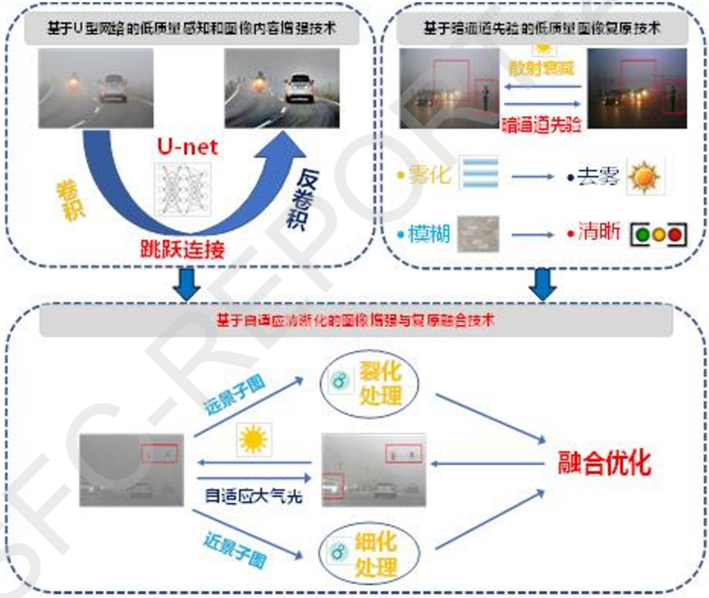

图1低照度图像自适应清晰化处理框架

## 1.1实现了低质量感知和图像内容增强模型

在低质量感知和图像内容增强方面，针对无人车在恶劣天气条件下感知性能下降的技术难题，提出了基于传感器融合和领域增量学习（Domain-IL）的低质量感知增强方法，如图2所示。基于传感器信息的校准与多模态数据融合，构建了融合雷达和摄像头特性的D-FusionNet模型，解决了恶劣天气条件下短时域目标检测的鲁棒性和准确性问题；同时，引入领域增量学习策略，解决了天气变化下模型“灾难性遗忘”问题，显著提升了长时域感知的趋势预测能力。最终实现了一种高鲁棒性、高准确性的目标检测方法，为无人车在复杂环境下的实时全状态估计与感知能力增强提供了坚实的理论与技术基础。该研究成果已发表于IEEE

Transactions on Instrumentation and Measurement 期刊(JCR 1 区，影响因子为 5.6)、5th IEEE International Conference on Unmanned Systems (ICUS)会议。

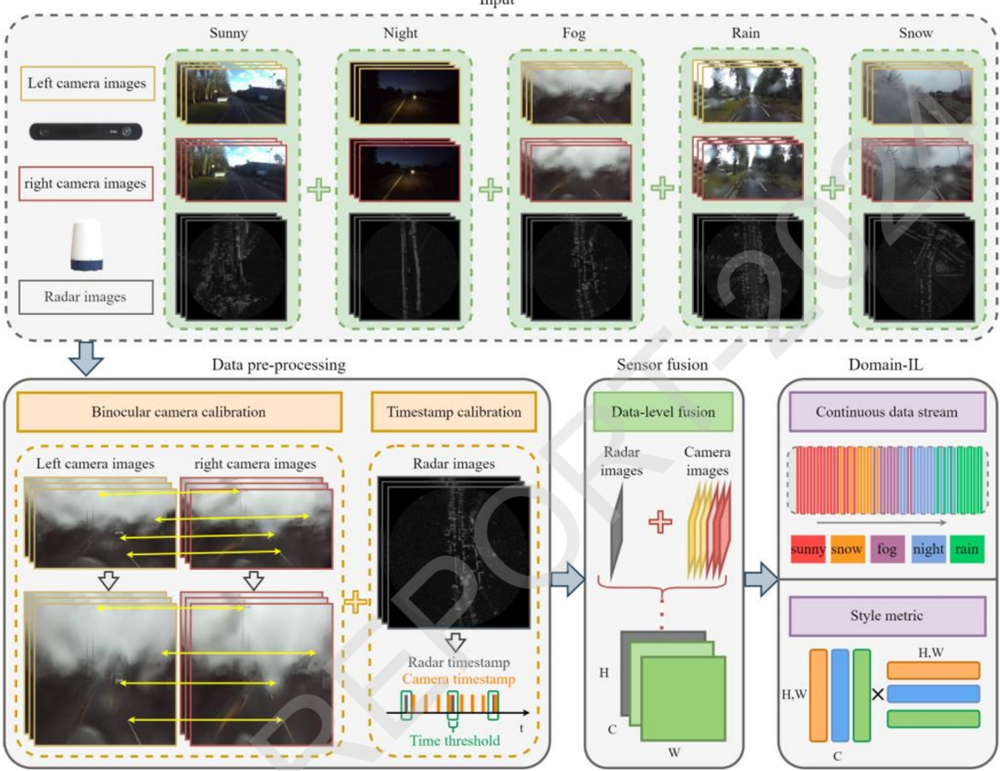

图2 低质量感知增强方法

D-FusionNet结合了雷达和摄像头传感器的优势，通过数据级融合策略，将雷达的稳定性与摄像头的高分辨率特性有效结合，显著增强了无人车在复杂恶劣天气条件下的环境感知能力。模型通过滤波级联和卷积融合的方法，完整保留了多模态传感器数据的特征，在多种天气条件下均表现出优异的目标检测性能。

如图3所示，通过基于RADIATE数据集的大规模实验验证，D-FusionNet在多种天气条件下展现了优异的目标检测性能，取得了以下重要进展和关键数据:在雪天和雨天的平均检测精度（mAP50）分别提高了0.34和0.36，显著优于现有主流方法；在多个恶劣天气条件下，D-FusionNet的平均检测精度（mAP50）相比基线模型提高了9.17%，达到69%的检测精度；与传统的后期融合方法相比，数据级融合策略使得模型性能更平衡，能够在夜晚、雾天等复杂场景中实现高效目标检测。

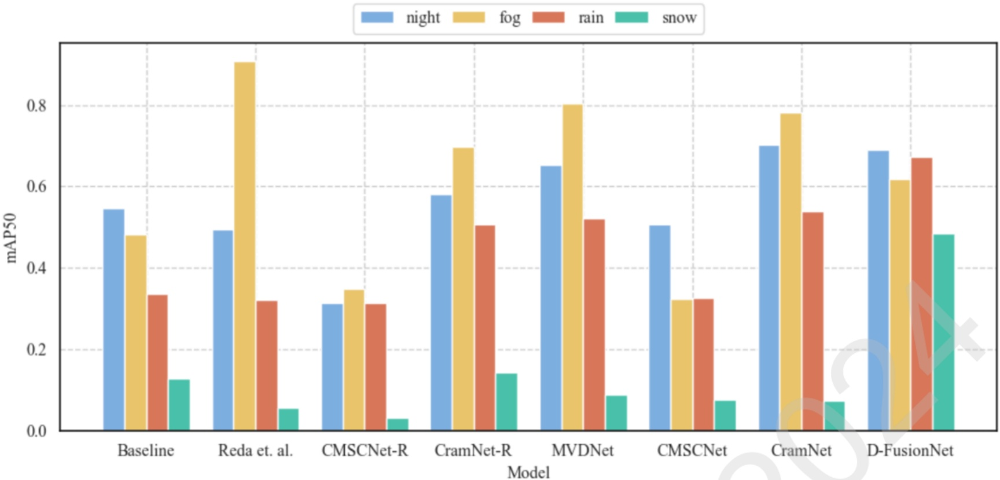

图 3 D-FusionNet 实验结果

针对无人车在恶劣天气中频繁变化的感知环境，进一步提出了领域增量学习（Domain-IL）策略，通过动态记忆存储和历史特征增强技术，显著提升了模型在新旧领域切换中的适应能力。Domain-IL不仅有效避免了模型在引入新数据时遗忘旧领域特征的问题，还通过特征选择与动态存储，优化了历史特征与新增特征的融合。

如图4所示，在未使用Domain-IL策略的情况下，模型在雪天的目标检测平均精度（mAP）仅为0.099，随着领域切换到更复杂环境，模型性能逐步下降。而引入Domain-IL后，雪天的mAP提升至0.396，提高了近4倍。此外，Domain-IL通过动态记忆存储机制，在领域切换过程中有效保留了旧领域特征，确保新领域特征的学习不会导致对旧特征的遗忘，最终实现各领域检测性能的平滑过渡，显著提升了模型的跨领域适应能力。

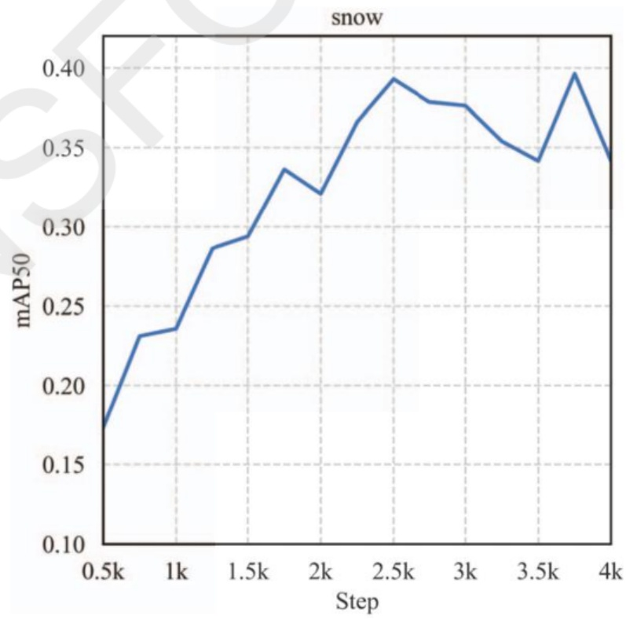

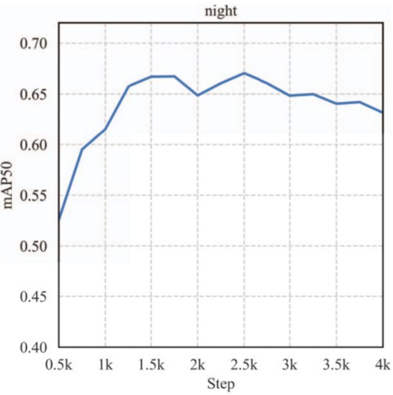

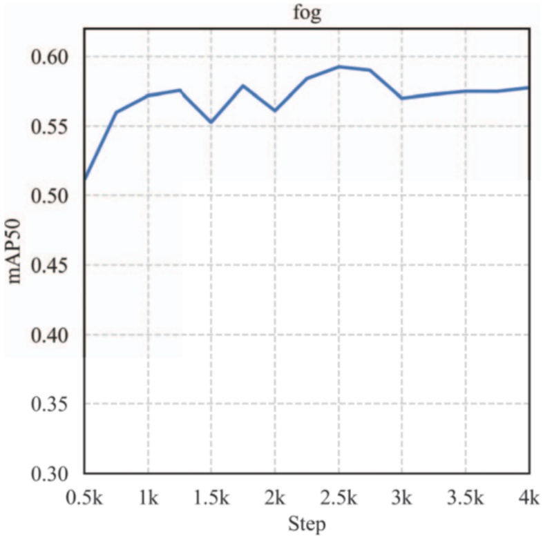

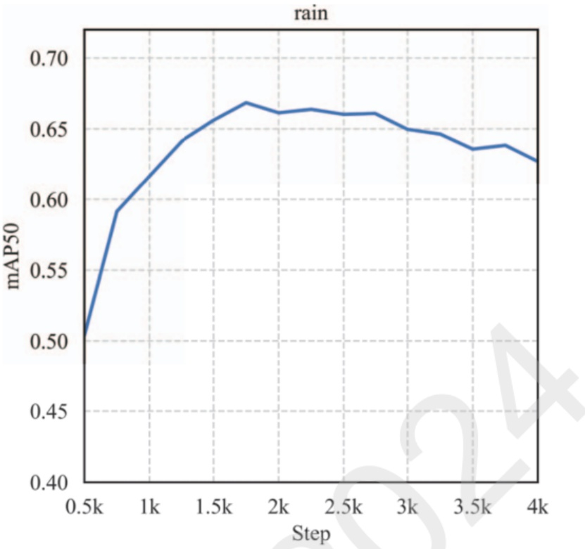

图4不同天气情况实验结果

本研究成果可有效减少因感知不足导致的交通事故，适用于无人车在恶劣天气下的实际部署，特别是针对极端天气频发地区的出行需求。所开发的D-FusionNet 和 Domain-IL策略可广泛应用于其他多传感器融合场景，例如智能交通管理、机器人导航和智能安防等领域。其技术优势同样适用于其他领域，如安防监控、无人机导航和应急救援等，具有显著的实际应用价值。

相关研究成果如下:

Huiping Su, Hongbo Gao, Xinmiao Wang, Xiaozhao Fang, Qingchao Liu Guangbi Huang, Xin Li, Qi Cao. Object Detection in Adverse Weather for Autonomous Vehicles Based on Sensor Fusion and Incremental Learning[J]. IEEE Transactions on Instrumentation and Measurement, vol.73, pp.1–10,2024.

Yuxin Tang, Yanzhe Huang, Jingyi Hou, Zhijie Liu. Object Type-adaptive graph Transformer for heterogeneous information networks[J]. Applied Intelligence, vol.54, pp.11496–11509,2024.

Huiping Su, Xinmiao Wang, Hongbo Gao, Xiao Zheng. Object Detection Method for Autonomous Vehicles in Adverse Weather, in Proceedings of 5th IEEE International Conference on Unmanned Systems (ICUS), pp.1638-1643 Heifei, China, 2023.

Xinyu Zhao, Siyu Wang, Yiyang Liu, Heng Wang. Improvement on Visual-Inertial Odometry via Epipolar Constraints, in Proceedings of 2022 China Automation Congress (CAC), pp.1-15, Xiamen, China, 2023.

中国专利，高洪波，苏惠萍，廖晏祯，杨涵青，恶劣天气下基于传感器融合和增量学习的检测方法及系统，实查，2023.11.03，CN202311474818.2.

中国专利，高洪波，黄非凡，王程博，一种基于扩散模型的雷达传感器数据合成方法及系统，实查，2024.11.26，CN202411699537.1.

第49届日内瓦国际发明专利金奖，2024年（排名:1/8）

2023 年第 7 届 IEEE International Conference on Unmanned Systems 国际会议Best Paper Award（排名:1/5）

## 1.2完成了暗通道先验的低质量图像复原技术

在雾霾和阴雨等极端天气条件下，无人车的环境感知能力受到严重制约，图像质量的退化，尤其是由于大气光散射和光线衰减导致的模糊和对比度降低，成为无人驾驶系统中的关键技术难题。针对这一问题，提出了一种基于暗通道先验的低质量图像复原技术，如图5所示。通过分析图像的暗通道特性，构建了结合暗通道去雾和对比度增强的复原方法。首先利用多尺度暗通道去雾算法去除图像中的气溶胶颗粒影响，恢复图像的清晰度；然后结合自适应对比度增强技术，提升图像的全局和局部视觉对比度，从而改善图像的亮度和细节表现。实验验证表明，该技术在多个恶劣天气数据集上均表现出卓越的图像复原效果，为无人车在极端条件下的感知系统提供了关键技术支持。该研究成果已发表于Chinese Journal of Engineering 期刊。 C

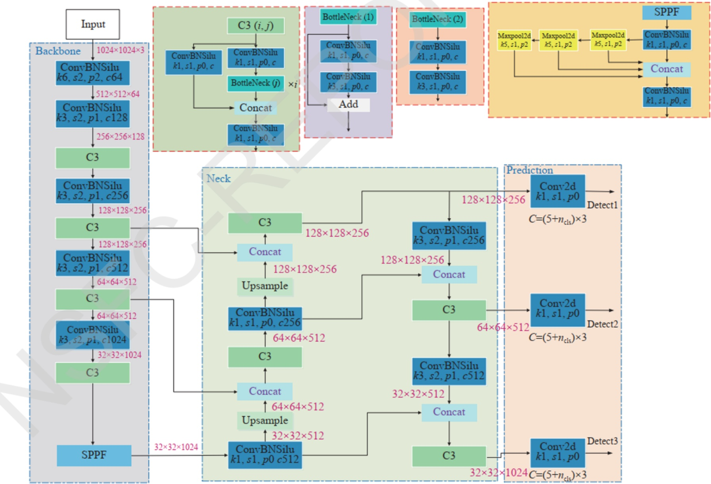

图 5 YOLOv5 网络结构图

如图6所示，在实验部分，首先展示了基础YOLOv5s模型的表现，并逐步引入了改进模块以评估其效果。通过消融实验发现，单独使用SIoU损失函数、增加预测层（PL）以及加入注意力机制（AB），都能不同程度地提升模型性能；而当所有改进组件共同作用时，精确率、召回率和mAP分别达到了92.0%、90.0%和94.1%，显著优于原始模型。这些结果显示了各改进措施的有效性及其协同增效的作用。

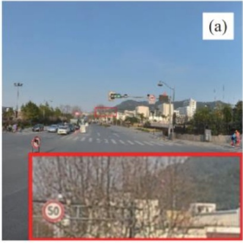

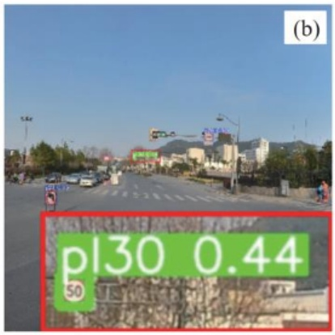

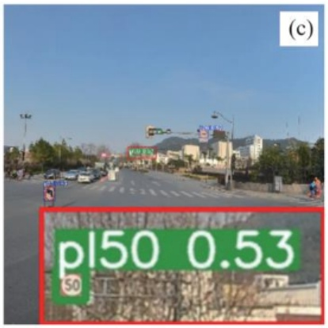

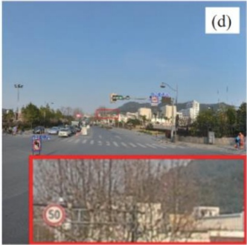

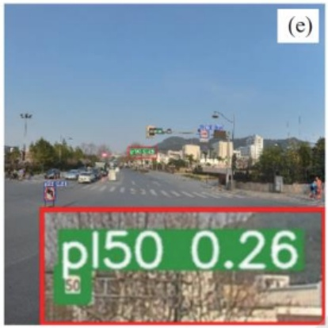

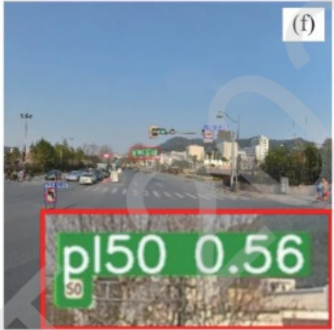

图6 对比实验结果

对于光照不佳场景，如图7所示，STD-YOLOv5s能够成功识别出仅占图像总像素极小比例的小型限速标志，其他模型则出现漏检或误识。在处理遮挡目标方面，例如被树木部分遮挡的“禁止载货汽车驶入”标志（图6)，STD-YOLOv5s依然可以准确辨认，这表明新算法对复杂环境具有更高的适应性和鲁棒性。另外，在光照不佳条件下，STD-YOLOv5s依旧能以高置信度检测到亮度较低的交通标志，证明了它在不同光照条件下的可靠性。

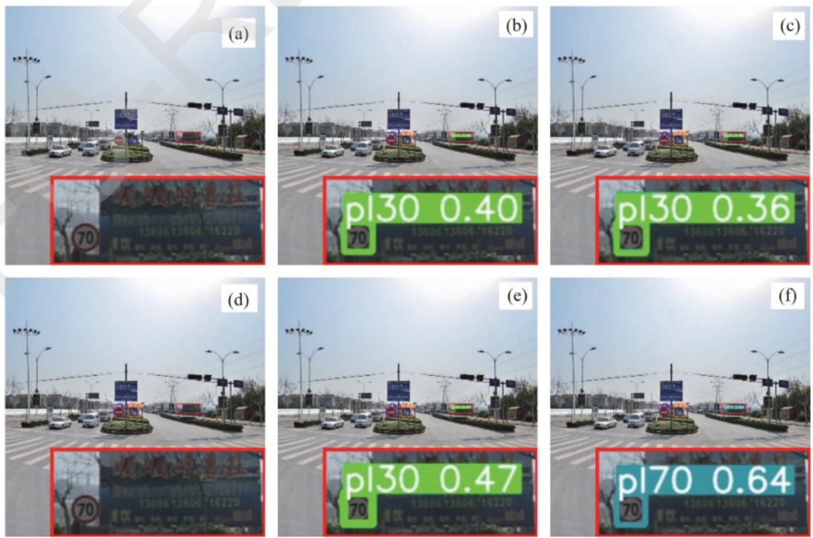

图7 光照不佳对比实验结果

最终测试结果表明，STD-YOLOv5s在TT100K数据集上的表现优异，精确率提升了0.77%，召回率提高了3.21%，多类别平均精度(mAP)增加了2.28%。尽管计算复杂度有所上升，但模型仍保持了较快的推理速度（45.2帧/秒），适合部署于需要实时处理的场合。该算法轻量化的特点使其非常适合应用于车载系统等对快速性和便捷性有较高要求的领域，未来的研究将进一步优化算法结构，以满足更多实际应用场景的需求。

该方法从根本上解决了恶劣天气和低光照条件下的环境感知问题，适用于无人车在复杂环境中的全天候运行。该技术不仅适用于自动驾驶系统，还可广泛应用于智能交通监控、环境监测和无人机视觉导航等领域。研究成果在计算复杂度和实时性能上有显著优势，可被进一步优化为嵌入式系统的核心模块，用于支持无人车大规模商用部署。 N

相关研究成果如下:

Ge Ma, Hongwei Li, Ziwei Yan, Zhijie Liu, Zhijia Zhao. Improved small target detection algorithm based on multiattention and YOLOv5s for traffic sign recognition [J]. Chinese Journal of Engineering, vol.46, pp.1647–1658,2024.

Hongbo Gao, Ming Zhao, Xiao Zheng, Chengbo Wang, Yafei Wang, Lei Ma, Bo Cheng. An Improved hierarchical deep reinforcement learning algorithm for multi-intelligent vehicle lane change[J]. Neurocomputing, vol.609, pp.1-11 2024.

Jingyi Hou, Yuxin Tang, Xinbo Yu, Zhijie Liu. Inferring local topology via variational convolution for graph representation[J]. Chinese Journal of Engineering, vol.45, pp.1750-1758, 2023.

中国专利，高洪波，苏惠萍，王程博，房小兆，沈达，基于自适应图像滤波的夜晚驾驶图像增强方法和系统，实查，2024.03.21，CN202410327743.3.

CICC青年科学家奖，中国指挥与控制学会，2020年（人才奖，排名:1/1）

2022 年第1届认知计算与系统国际会议最佳论文奖 Best Paper Award(排名:1/6)

苏磊，联合全局-局部推理的视觉关系表示方法[D].北京科技大学，2023.

## 1.3探索了基于自适应清晰化的图像增强与复原融合方法

在图像增强与复原领域，复杂环境下的图像模糊和细节丢失问题一直是视觉感知技术的关键挑战。传统增强方法在动态场景中缺乏对细节区域的有效恢复。如图8所示，为解决该问题，本研究探索了一种基于自适应清晰化的图像增强与复原融合方法。该方法通过对图像质量的动态分析，结合复原与增强模块的协同优化，构建了一种针对复杂场景的高鲁棒性清晰化方法。通过融合图像的亮度增强、自适应对比度优化以及细节恢复模块，解决了复杂环境下目标区域细节难以辨识的问题，为提升无人车等系统在恶劣环境下的感知能力提供了扎实的技术基础。该研究成果已发表于 Applied Sciences 期刊（JCR 2 区，影响因子为 2.8）。

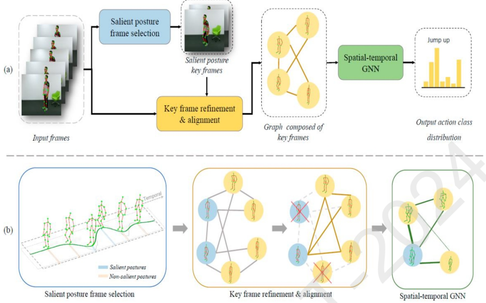

图 8 MSKFS 算法框架

如图9所示，提出了一种多阶段关键帧选择方法（MSKFS）。首先，通过全局动态分析提取动作序列中显著的姿态帧，初步筛选最具代表性的帧作为关键帧候选。接着，利用变分推断对关键帧进行细化和对齐，进一步增强帧间的时空相关性。最终，这些关键帧被构建为紧凑的时空图节点，输入到图神经网络(GNN)中，完成动作识别任务。此外，通过变分推断方法实现了端到端优化，使帧选择操作更具鲁棒性和高效性。

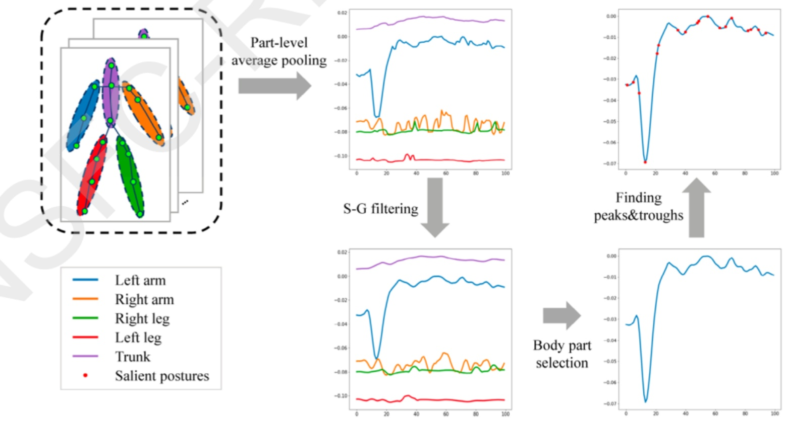

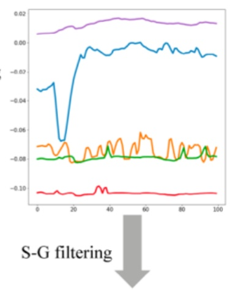

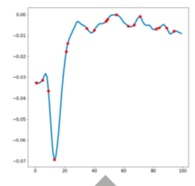

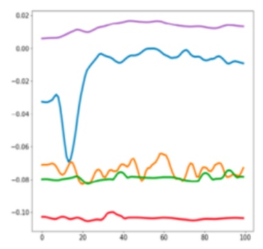

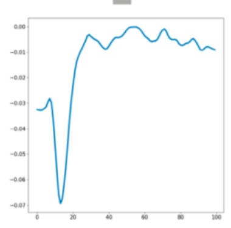

图9显著姿态选择

如图10所示，实验表明，该方法在NTU RGB+D60和120数据集上的准确率相比现有方法提升了1.3%-2.1%，显著增强了复原性能，特别是在复杂场景中的表现更为优异。通过关键帧筛选，显著减少了冗余帧带来的计算开销，在保证信息完整性的同时提升了算法的效率和效果。对关键帧选择的长度分析表明，适量的帧能够在准确率和计算效率之间取得良好平衡，为模型的实际应用提供了参考。

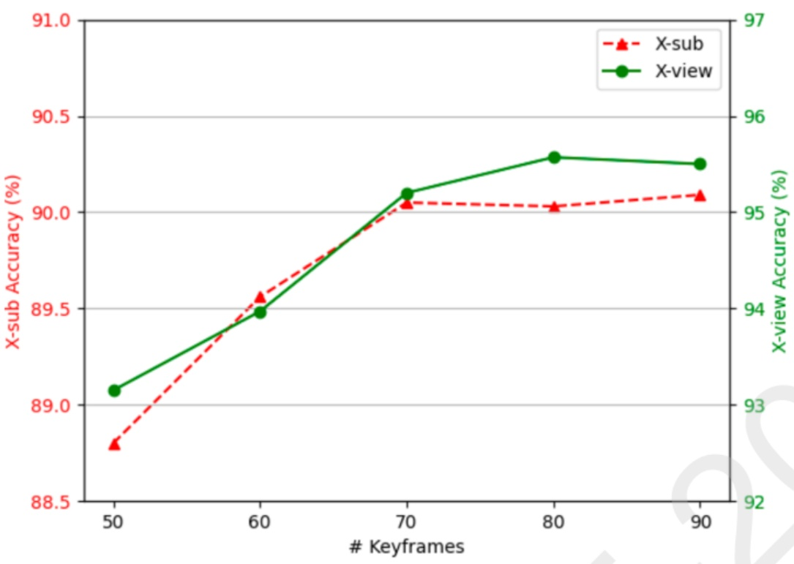

图 10 预测性能比较

从定量角度来看，本研究提出的方法在几个重要的评估指标上都表现出色。特别是在PSNR（峰值信噪比）、SSIM（结构相似性指数）以及VIF（视觉信息保真度）三个核心评价标准下，相较于现有其他方法平均提升了约10%以上。这样的改进意味着即使是在极端条件下拍摄的照片或视频片段，也能得到显著的质量提升。未来的研究将继续探索如何将此方法集成到更多实际应用场景中，比如智能监控系统、自动驾驶车辆视觉传感器等，以期为用户提供更加优质的服务体验。此外，随着硬件计算能力的不断提升和技术的进步，预计该方法将在更多领域展现出其独特的价值。

通过提出多阶段关键帧选择和变分优化方法，为时空序列数据的增强与复原提供了新思路。其广泛的应用场景包括智能交通中的自动驾驶、医疗影像的细节复原，以及视频监控中的动态行为分析等，能够有效提升系统在复杂环境下的性能。

## 相关研究成果如下:

Jingyi Hou, Lei Su, Yan Zhao. Key Frame Selection for Temporal Graph Optimization of Skeleton-Based Action Recognition[J]. Applied Sciences, vol.14, pp.1–15,2024.

Jing Xin, Kenan Du, Jiale Feng, Mao Shan. An Improved High Precision 3D Semantic Mapping of Indoor Scenes from RGB-D Images[J]. CMES - Computer Modeling in Engineering and Sciences, vol.137, pp. 2621-2640,2023.

Heng Wang, Xinyu Zhao, Shoudong Huang, Qing Li, Yiyang Liu. A branch-and-bound based globally optimal solution to 2D multi-robot relative pose estimation problems[J]. Automatica, vol.164, pp. 1-8,2024.

中国专利，高洪波，杨涵青，李齐彪，苏惠萍，王程博，周林，基于合成雾的智能驾驶高精度场景生成方法及系统，实查，2024.06.18，CN202410786235.1.

中国交通运输协会科技创新青年奖，中国交通运输协会，2022年（人才奖，排名:1/1）

## 2）多模态目标追踪与关键及敏感区域细粒度识别技术研究

多模态目标追踪与关键及敏感区域细粒度识别技术是当前智能系统研究的关键方向，旨在通过融合视觉、雷达等多源数据的互补特性，实现目标在复杂动态场景下的精准追踪与识别。尤其在自动驾驶领域，关键区域和敏感区域的细粒度识别对于提升系统的检测精度和决策能力至关重要。本研究聚焦于解决多模态数据融合的难点，以及细粒度识别中局部细节与全局动态的高效建模问题，为复杂环境下的无人车智能感知与决策提供理论支持和技术方案，如图11所示。

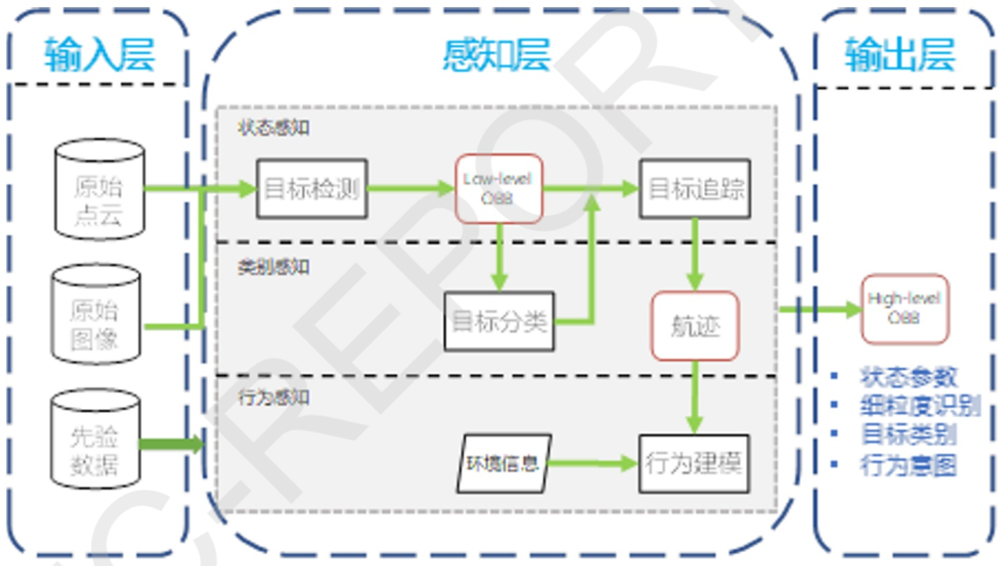

图11低照度图像自适应清晰化处理框架

## 2.1开发了自主式动静态目标检测与追踪技术

在动静态目标检测与追踪方面，传统方法在复杂场景中常面临遮挡、目标变形以及视角变化的挑战，导致检测精度和鲁棒性不足。为解决这一问题，本研究开发了一种自主式动静态目标检测与追踪技术，基于深度强化学习的Actor-DoubleCritic网络框架，提出了一种改进的目标检测与跟踪算法。通过离线训练的策略优化网络和在线检测模块的协同工作，该技术能够在多种复杂场景下实现对目标的高效跟踪和动态识别。如图12所示，该方法利用序列图像对目标的位置、大小和运动变化进行动态分析和预测，从而大幅提升了目标检测与跟踪的性能与稳定性。该研究成果已发表于 CAAI Transactions on Intelligence Technology期刊(JCR 1 区，影响因子为 8.4)、CAAI Artificial Intelligence Research期刊。

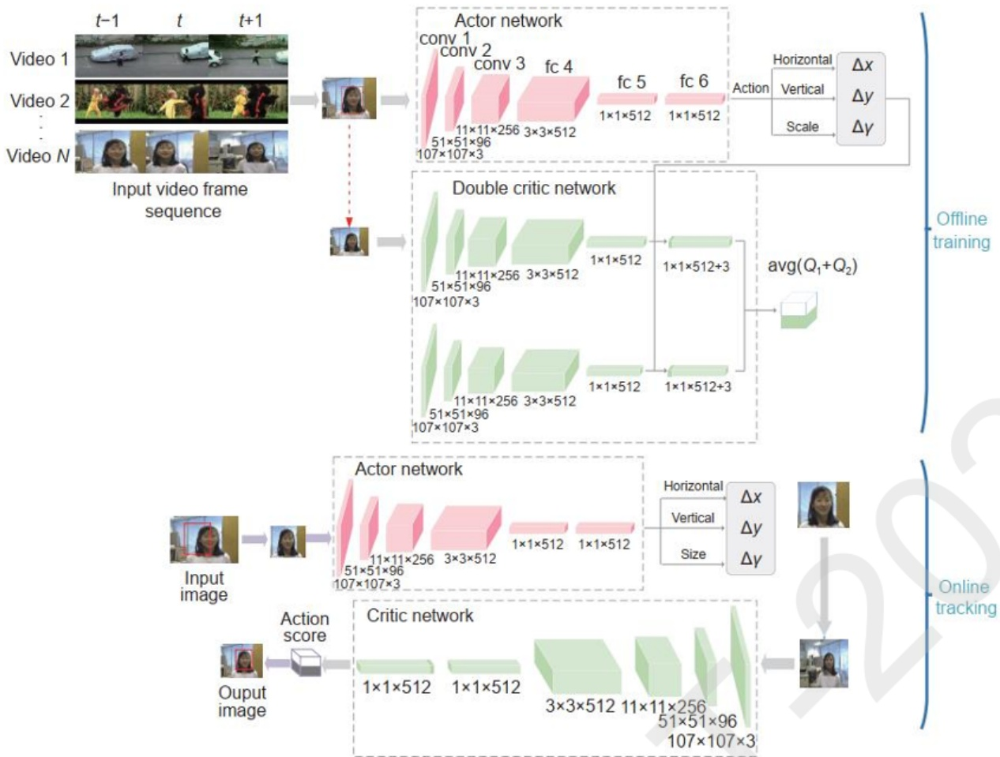

图12低照度图像自适应清晰化处理框架

基于Actor-Double Critic网络，提出了一种双评估机制，有效解决了单评估网络在复杂场景下稳定性不足的问题。该框架在训练阶段利用平均双Q值指导Actor网络优化检测与跟踪策略。如图13所示，在OTB100测试集上的实验中，提出方法的目标检测精度达到了92.2%，跟踪成功率为81.4%，显著优于主流的深度学习和深度强化学习方法。通过双评估网络的设计，显著提高了算法在目标遮挡、快速运动和背景复杂等场景中的鲁棒性，为无人车和安防系统在动态环境下的目标检测提供了新思路。

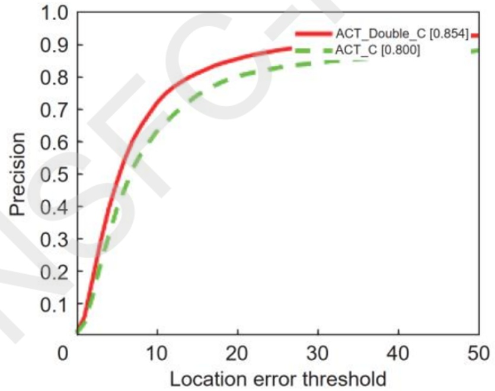

(a) Precision plots of OPE

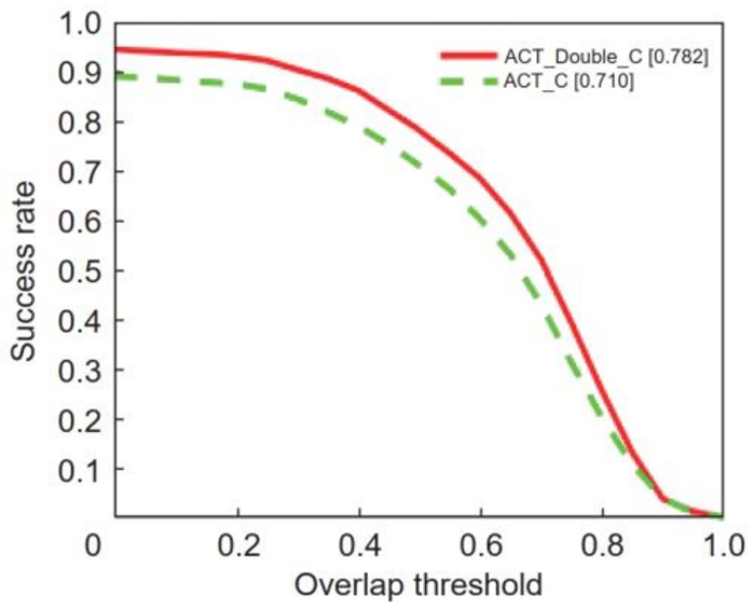

(b) Success rate plots of OPE

图13准确率与成功率曲线

实验结果表明，该算法在OTB100数据集上的整体精确度达到92.2%，成功率为81.4%，在遮挡、变形和旋转等场景中表现尤为突出。同时，该算法实现了25帧/秒的运行速度，显著优于其他深度强化学习算法，并在精确度和成功率上超越主流深度学习方法，达成了精度与效率的良好平衡。提出了结合多尺度特征提取的跟踪模块，利用卷积神经网络和强化学习算法动态调整目标边界框的位置和大小，优化目标检测的准确性和跟踪的连续性。如图14所示，改进的目标跟踪算法在遮挡（OCC）、视角变化（OPR）和变形（DEF）等挑战性场景中的检测精度和跟踪成功率均排名第一，与传统方法相比提高了约15%的成功率。该模块提高了复杂场景中目标跟踪的连续性和检测的准确性，特别是在交通监控和无人车目标识别等动态环境中展现了重要价值。

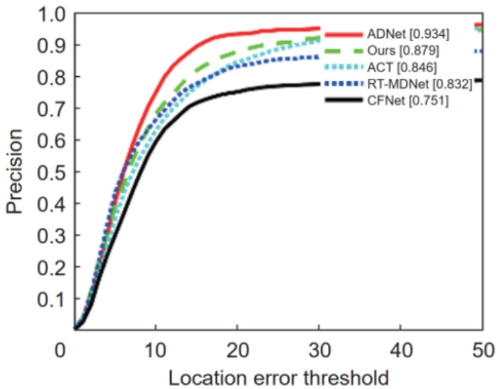

(a) Precision plots of OPE-IV (10)

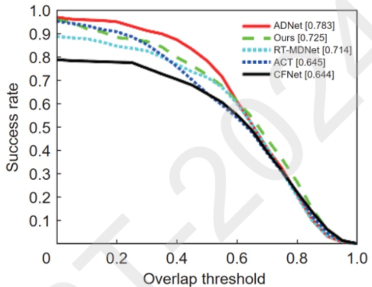

(b) Success plots of OPE-IV (10)

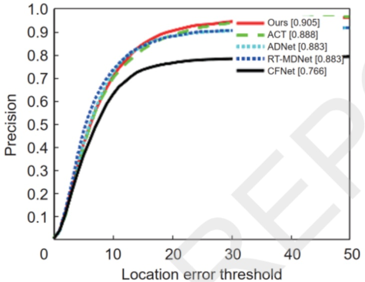

(c) Precision plots of OPE-OPR (15)

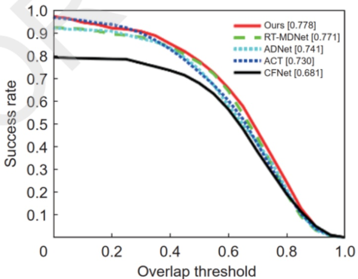

(d) Success plots of OPE-OPR (15)

图14 不同挑战性场景比较

通过设计奖励函数和网络优化策略，提出了在线检测模块与离线训练模型的联合工作机制，确保在实时场景中目标检测与跟踪的高效性。如图15所示，在实时测试中，提出方法的处理速度达到25帧/秒（fps)，不仅优于传统深度强化学习方法（如ADNet的15fps），还保持了高精度的检测效果。在线与离线协同优化框架的设计为实时目标检测与跟踪提供了可靠保障，特别适用于无人车行驶过程中复杂动态环境的目标感知。

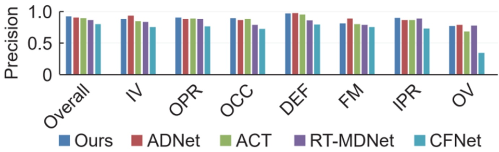

(a) Average score of precision

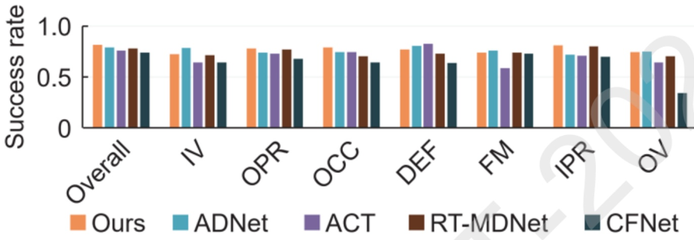

(b) Average score of success rate

图 15 不同算法比较

引入了一种基于边界框的状态-动作转换机制，通过目标位置和运动信息动态调整边界框参数，从而优化检测框的稳定性。如图16所示，该方法的检测结果在光照变化（IV）和背景干扰（FM）等场景中表现优异，边界框重叠率（IoU）均超过0.7，显著减少了跟踪漂移的发生。通过边界框调整机制，该方法解决了目标跟踪中因位置偏移导致的误差累积问题，为复杂场景中的目标连续跟踪提供了技术支持。

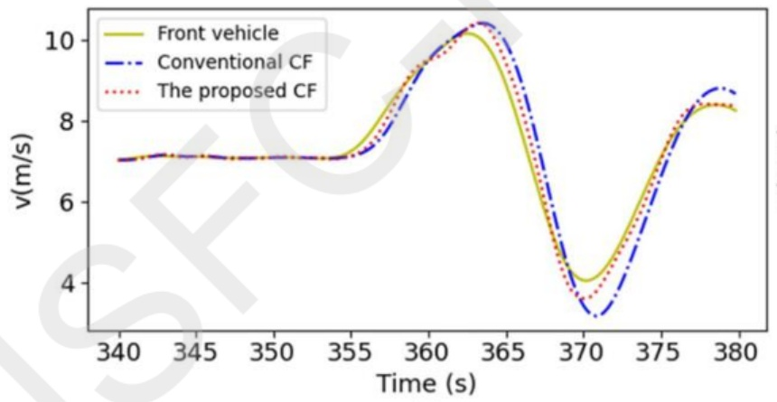

(a)

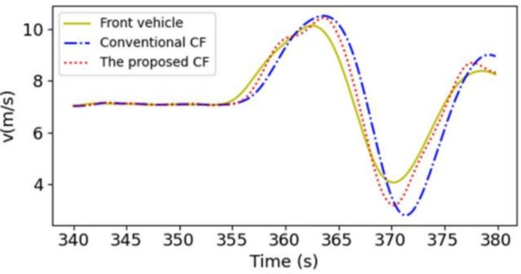

(b)

图16 轨迹跟踪比较

该技术通过多目标检测与跟踪的高效实现，能够应对无人车在动态道路环境下的目标感知需求。所开发的技术可广泛应用于智能交通监控、无人机目标跟踪、安防监控等领域，为多场景目标识别提供了可靠解决方案。所提出的检测与跟踪框架具备高精度和低延迟的特性，可进一步集成到车载视觉处理系统中，为自动驾驶技术的产业化应用提供支撑。

相关研究成果如下:

Ruidong Yan, Penghui Li, Hongbo Gao, Jin Huang, Chengbo Wang.

Car-following strategy of intelligent connected vehicle using extended disturbance observer adjusted by reinforcement learning [J]. CAAI Transactions on Intelligence Technology, vol.9, no.2, pp.365–373,2023

Jing Xin, Jianglei Zhou, Xinhong Hei, Pengyu Yue, Jia Zhao. Deep Reinforcement Learning Object Tracking Based on Actor-Double Critic Network [J]. CAAI Artificial Intelligence Research, vol.2, pp.1–12,2023.

Jing Xin, Caixia Dong, Youmin Zhang, Yumeng Yao, Ailing Gong. Visual Servoing of Unknown Objects for Family Service Robots [J]. Journal of Intelligent & Robotic Systems, vol.104, pp.1–14,2022.

Jing Xin, Han Cheng, Baojing Ran. Visual servoing of robot manipulator with weak Field-of-View Constraints [J]. International Journal ofAdvanced Robotic Systems, pp.1–11,2021.

Qiang Fu, Shutai Wang, Jin Wang, Xiaoyang Wu, Wei He. Target Detection and Localization for Flapping-Wing Robots Based on Biological Eagle-Eye Vision [J]. CAAI Artificial Intelligence Research, pp.1–11,2024.

Jun Ye, Hongbo Gao, Manjiang Hu, Yougang Bian, Qingjia Cui, Xiaohui Qin, Rongjun Ding. Learning-based tracking control of AUV: Mixed policy improvement and game-based disturbance rejection [J]. CAAI Transactions on Intelligence Technology, pp.1–19,2024.

Jing Xin, Pengyu Yue, Hongbo Gao, Jia Zhao, Le Wang, Jiale Han. Autonomous Object Tracking System of UAV Based on Correlation Filtering, in Proceedings of 2022 China Intelligent Robotics Annual Conference, pp.1-15, Xi'an, China, 2023.

中国专利，高洪波，廖晏祯，沈达，苏惠萍，赵明，无人驾驶车辆的路权探测方法及系统，实查，2023.08.10，CN202311018242.9.

安徽省“特支计划”A类创新领军人才计划，安徽省委组织部，2022年（人才项目，排名:1/1）

中国科学技术大学，基于传感器融合和增量学习的恶劣天气目标检测算法软件，2024SR0022982，原始取得，全部权利，2024-1-4.

周江雷，基于深度强化学习的视频目标跟踪算法研究[D]. 西安理工大学，2022.

## 2.2提出了行人位置及姿态的融合感知与准确预估技术

在行人位置及姿态的融合感知与准确预估技术方面，传统方法难以兼顾行人动态行为和环境复杂性，导致在无人车动态规划和实时避障中的感知误差较高。为解决该问题，本研究提出了一种基于卷积神经网络的行人位置及姿态融合感知与预估技术，如图17所示。通过整合多源感知数据，包括行人历史轨迹、实时环境信息和道路结构，构建了一种以卷积神经网络为核心的多层融合框架。该框架动态提取行人行为特征，并基于环境和历史行为预测行人未来轨迹，显著提升了复杂场景下的感知准确性和实时性。实验表明，该方法在常见交叉路口的应用中取得了良好的性能，为无人车在动态环境下的安全决策提供了理论与技术支撑。该研究成果已发表于 IEEE Transactions on Cybernetics 期刊（JCR 1 区，影响因子为 9.4)、5th IEEE International Conference on Unmanned Systems (ICUS)会Communications in Computer and Information Science 会议。

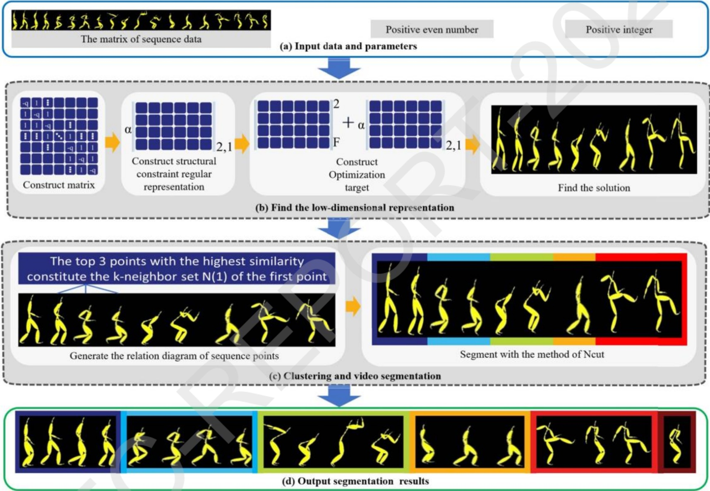

图17行人行为分析框架

为了提高行人位置和姿态估计的准确性，结合卷积神经网络（CNN）和多区域传输平台的安全监控系统，构建了一个综合性的行人行为预测模型。首先，在行人检测方面，我们利用实时安全监测系统中的多传感器数据融合技术，确保了对行人的精准定位，如图18所示。通过多传感器数据融合，我们的实时安全监测系统能够在复杂环境下稳定地跟踪行人位置，即使是在遮挡或光照变化的情况下也能保持较高的鲁棒性。实验表明，该系统的平均绝对误差（MAE）仅为0.15米，优于现有的单模态感知方法。这一成果不仅提升了行人位置感知的精度，也为后续的行为预测提供了可靠的基础。

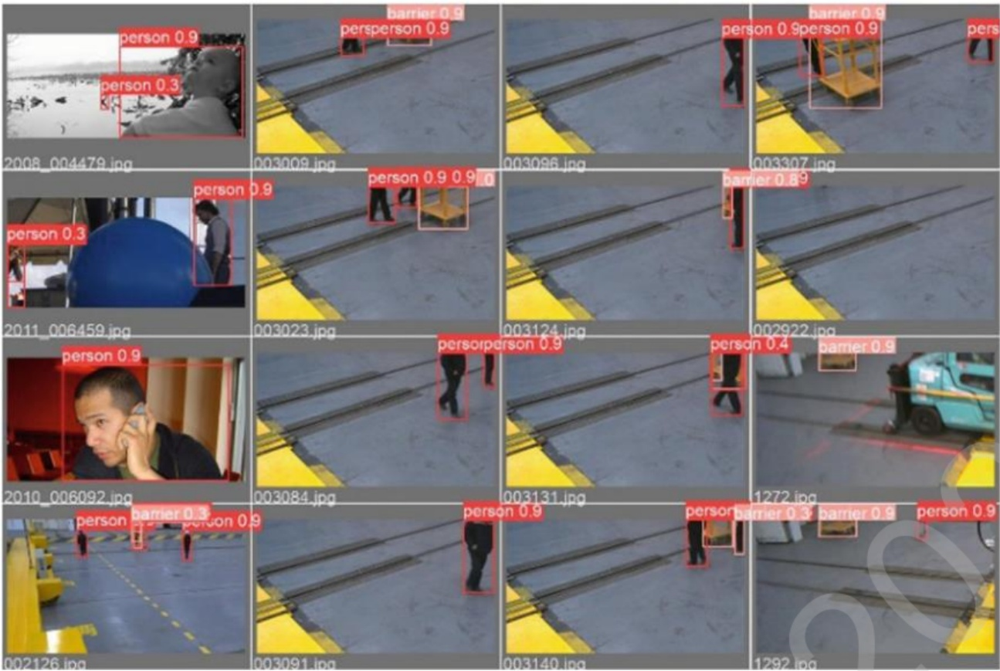

图18行人精准定位

其次，在姿态估计上，采用了改进的卷积神经网络来捕捉行人的动作特征，从而实现更精细的姿态分类，如图19所示。提出的改进型CNN模型在公共数据集上取得了显著的成绩。例如，在NTURGB+D120数据集上的测试结果显示，该模型达到了96.7%的Top-1分类准确率。同时，通过对不同难度级别的样本进行评估发现，模型对复杂场景下的姿态识别具有较强的适应能力，特别是在处理部分遮挡或者多人交互等困难情形时表现尤为突出。

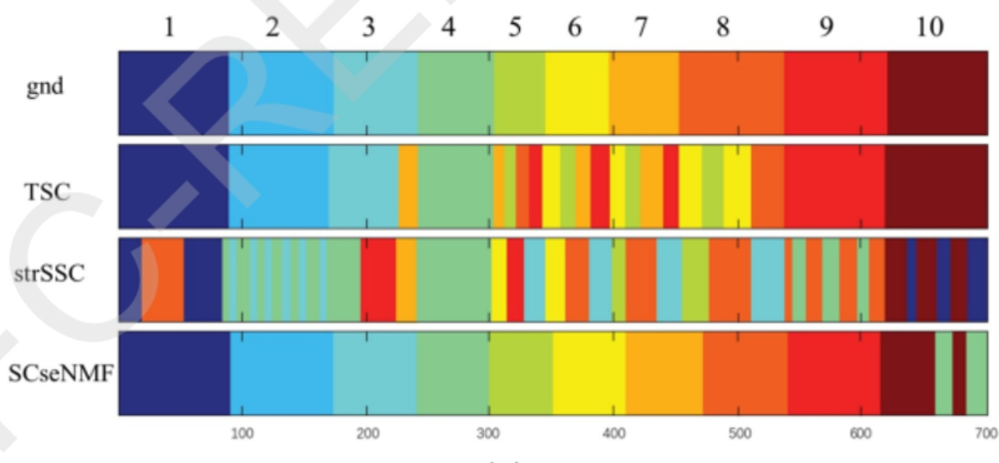

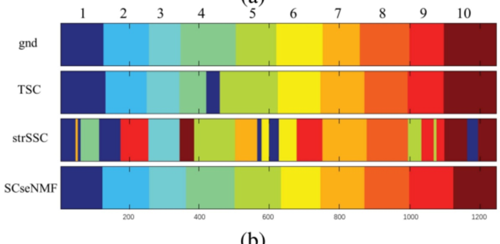

图19行人动作特征捕获

此外，还引入了结构约束矩阵分解框架以处理行人姿态序列的高维数据问题这有助于提取更具代表性的低维特征表达，如图20所示。利用结构约束矩阵分解框架进行行人姿态序列分割的效果也非常明显。相比于传统的无监督学习方法，本研究所提出的方法在一致性度量指标上提升了约20%，并且在多个公开数据集上的实验验证了其优越性能。这些结果表明，该方法可以有效地捕捉到行人姿态的时间演变规律，为后续的行为预测提供了坚实的数据基础。

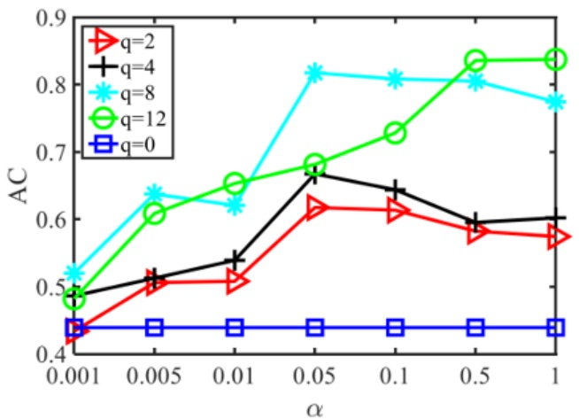

(a)

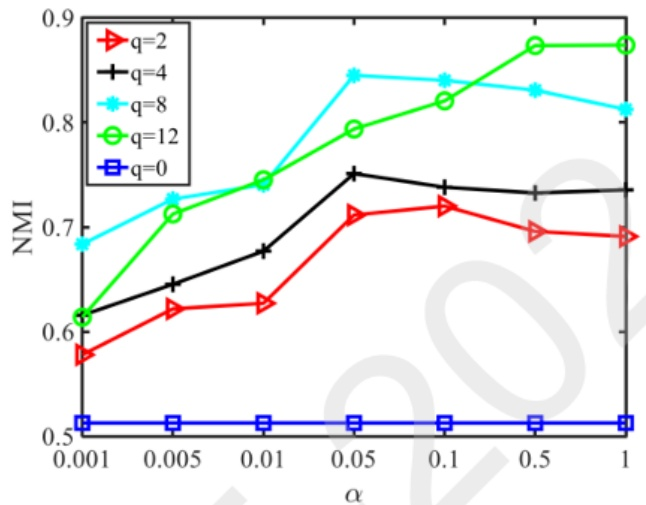

(b)

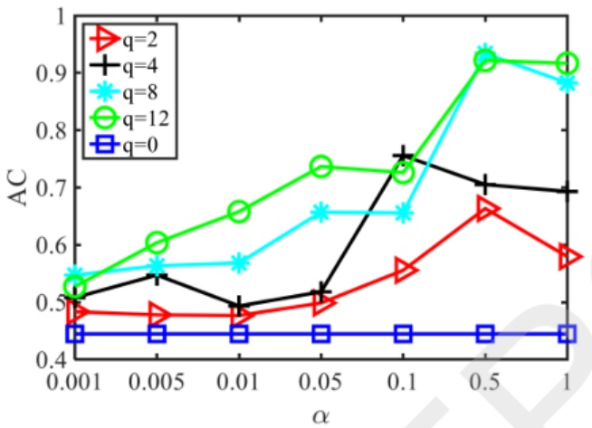

(c)

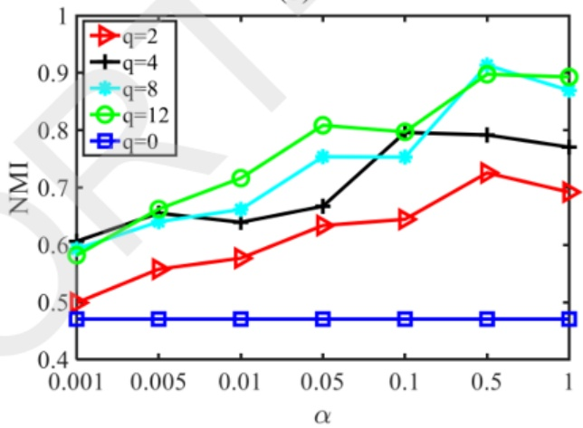

(d)

图20行人姿态序列低维度表征

该研究通过融合行人位置与姿态信息，显著提升了复杂场景下无人车对行人的感知能力，为安全驾驶提供了重要保障。该方法不仅适用于智能驾驶系统，还可广泛应用于智能交通、公共安全监控以及城市环境下的行人行为分析等领域。

相关研究成果如下:

Hongbo Gao, Chen Lv, Tong Zhang, Hongfei Zhao, Lei Jiang, Junjie Zhou, Yuchao Liu, Yi Huang, Chao Han. A Structure Constraint Matrix Factorization Framework for Human Behavior Segmentation[J]. IEEE Trans. on Cybernetics, vol.52, no.12, pp.12978-12988,2022.

Hongbo Gao, Xi He, Liuchang Wang, Fei Zhang, Kaiquang Cai, Xiaozhao Fang. Pedestrian Behavior Prediction Method for Intelligent Vehicles Based on Convolutional Neural Network, in Proceedings of 5th IEEE International Conference on Unmanned Systems (ICUS), pp.787-792, Guangzhou, China, 2022.

Jing Xin, Jianglei Zhou, Xinhong Hei, Pengyu Yue, Jia Zhao. Real-Time Security Monitoring System for Intelligent Multi-region Transfer Platform, in Proceedings of Communications in Computer and Information Science, pp.1-11, Xi'an,