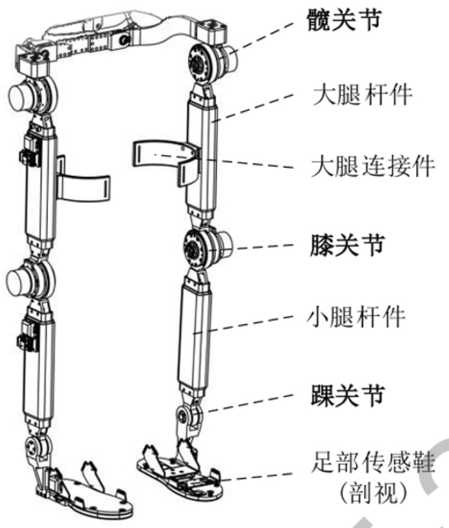
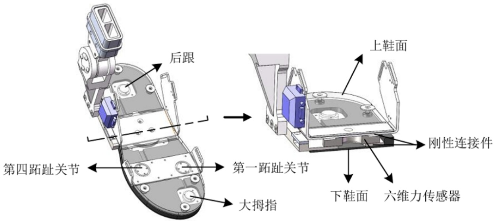
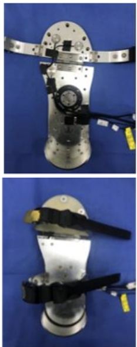
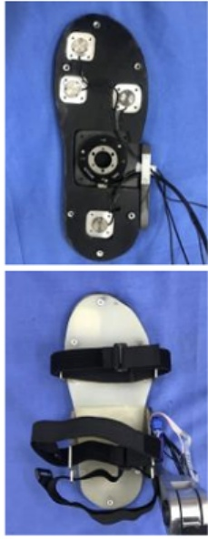
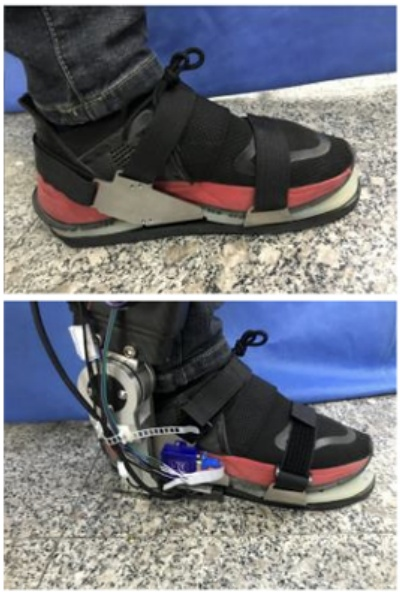
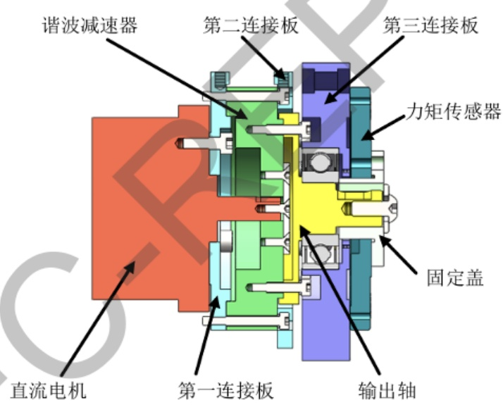
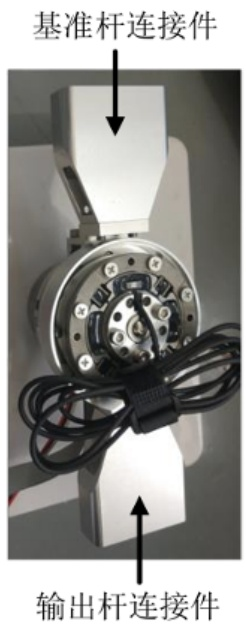

项目批准号 U21A20120申请代码 E0501归口管理部门收件日期


202509U21A20120

# 国家自然科学基金

# 资助项目结题/成果报告

资助类别:联合基金项目

亚类说明:重点支持项目

附注说明:区域创新发展联合基金

项目名称:基于轻量化驱动的外骨骼机器人设计与控制方法研究

负责人:董为

BRID: 08362.00.66916

电子邮件:dongwei@hit.edu.cn

电话: 0451-86418441-18

依托单位: 哈尔滨工业大学

联系人: 王雪

电话: 0451-86414151

直接费用:260.0000（万元）

执行年限: 2022.01-2025.12

填表日期:2026年01月26日

国家自然科学基金委员会制（2025年）

## 项目摘要

## 中文摘要:

肢体运动失能已经成为严重制约国民健康水平提高的重要因素之一。采用外骨骼机器人提高肢体运动功能障碍人群的运动能力，成为机器人技术发展的重要领域。但是，外骨骼机器人系统普遍存在着系统建模不准确、信息感知不完备、协同运动控制不平顺、驱动单元不轻巧等问题，严重影响了此类系统在助老助残产业的应用。项目将面向外骨骼系统下肢助行的具体应用，开展系统建模、驱动设计、意图感知、柔顺控制和系统评估几个方面研究。重点突破基于人-机-环境的共融动力学建模与系统相容性设计；面向外骨骼系统的轻量化驱动单元设计与优化；基于多模信息反馈的运动意图理解与解码机制；人在环内的外骨骼系统人-机耦合协同柔顺控制；面向助老助残应用的外骨骼助力系统评估与验证等关键技术。本项目的开展旨在解决面向下肢助行的外骨骼机器人系统若干基础理论瓶颈问题，对外骨骼系统“驱-控-测-评”一体化体系关键技术及装备发展提供详实的科学依据和技术基础

## Abstract:

Limb disability has become one of the main factors that limit the overall health promotion of the nation. The use of exoskeleton robots to improve the motion ability of the people with limb disability, is becoming a significant research field in robotics research. However, the issues such as inaccuracy system modeling, incomplete information sensing, uncompliant cooperation control, and swollen actuation design, seriously restrict the robotic applications for old people and disable person. The research will focus on system modeling, actuation design, intention sensing, compliant control and system evaluation, aiming at the practical application of lower limb exoskeleton robots. Several key research issues will be broken through in this research, i.e., cooperative dynamic modeling based on human-machine-environment and compatibility design, weight-light actuation unit design and optimization of exoskeleton systems, motion intention understanding and decoding based on multi-mode information, human-machine cooperative compliant control based on human in loop, evaluation and validation of lower limb exoskeleton systems. This research proposal is attempting to solve several critical scientific issues and technique bottlenecks aiming at lower limb exoskeleton robots, which will provide detailed references and solid fundamentals to the core technology and equipment development for exoskeleton systems“actuation-control-sensing" integrated framework.

关键词（用分号分开）:下肢康复机器人；外骨骼机器人；多模态感知；

协同柔顺控制；轻量化驱动

Keywords (separated by;): Lower limb rehabiliation robots; Exoskeleton robots; Multi-mode sensing; Cooperative compliance control; Light-weight actuation

## 结题摘要

中文摘要（对项目的背景、主要研究内容、重要结果、关键数据及其科学意义等做简单概述）:

随着人口老龄化加剧以及康复助行需求的不断增长，穿戴式外骨骼在助老助残和下肢康复领域具有重要应用前景，但仍面临系统笨重、人机相容性不足、运动意图感知不准确以及助力效果评价体系不完善等关键问题。本项目面向康复助行应用需求，围绕外骨骼系统“驱一控一测一评”一体化关键科学问题，系统开展了理论研究、关键技术攻关与系统验证工作。

项目首先从人一机一环境协同运动机理出发，构建了共融动力学模型，并通过仿真分析与参数优化开展外骨骼系统相容性设计，为提升人机适配性提供了理论基础。在此基础上，面向外骨骼应用需求，研究并优化了轻量化双向驱动单元设计方案，实现了驱动、传感与执行的一体化集成。针对传统驱动方式在重量与输出能力之间难以兼顾的问题，项目提出了创新型轻量化驱动方案， 在显著降低系统重量的同时保持了有效助力能力。

在感知与认知层面，项目构建了基于多模态信息反馈的运动意图理解与解码机制，通过融合肢体运动、人机交互力及生理参数等信息，实现了对人体运动状态的识别、预测与安全预警。在控制层面，针对人在环内的人机耦合特性，研究了外骨骼协同柔顺控制方法，通过实时状态监测与控制参数自适应调节，提高了系统的稳定性、柔顺性与步态适应能力。

为验证系统的实际应用效果，项目建立了面向助老助残应用的外骨骼助力系统评估与验证体系，从人机工效、助力效果及康复训练成效等方面对系统性能进行了综合评价。研究结果表明，所提出的方法能够有效提升外骨骼系统的人机适配性与应用可靠性。

综上所述，本项目全面完成了既定研究目标，在外骨骼动力学建模、轻量化驱动、运动意图解码、人机协同控制及系统评估等方面取得了系统性进展，为新一代康复助行外骨骼系统的研发与应用奠定了坚实的科学基础。

## Abstract (Brief description of research background, main methods, contributions, and research data):

With the rapid growth of the aging population and increasing demand for rehabilitation and mobility assistance, wearable lower-limb exoskeletons have attracted extensive attention for assistive walking and rehabilitation applications. However, their practical use is still limited by several key challenges, including excessive system weight, insufficient human -machine compatibility, inaccurate motion intention recognition, and the lack of systematic evaluation methods. To address these issues, this project conducted systematic research on the integrated framework of “actuation-control-sensing - evaluation" for wearable exoskeleton systems. First, based on the cooperative motion mechanisms among the human, the exoskeleton, and the environment, a coupled dynamics model was established to support compatibility-oriented system design. Numerical simulation and parameter optimization were employed to improve overall human-machine adaptability. On this basis, lightweight bidirectional actuation solutions for exoskeleton applications were investigated, enabling integrated design of actuation, sensing, and execution while maintaining effective assistive performance under reduced system weight. In terms of perception and cognition, a motion intention understanding and decoding framework based on multimodal information feedback was developed by integrating kinematic, interaction-force, and physiological signals. This framework enables reliable recognition, prediction, and safety monitoring of human motion states. For human-in-the-loop operation, a cooperative and compliant control strategy was further studied, incorporating real-time state monitoring and adaptive parameter adjustment to enhance system stability, compliance, and gait adaptability across different users and walking conditions. To validate practical performance, an evaluation and verification framework for assistive exoskeleton systems was established, focusing on human -machine ergonomics,

```txt
assistive effectiveness, and rehabilitation outcomes in application-oriented scenarios.
Experimental results demonstrate that the proposed methods effectively improve
human-machine compatibility and application reliability.
In summary, the project has successfully achieved its research objectives and made
systematic progress in coupled dynamics modeling, lightweight actuation, motion
intention decoding, cooperative human -machine control, and system evaluation, providing
a solid scientific and technical foundation for the development of next-generation
assistive and rehabilitation exoskeletons.
```

```txt
关键词（用分号分开）：下肢康复机器人；外骨骼机器人；多模态感知；
协同柔顺控制；轻量化驱动
```

Keywords (separated by;): Lower limb rehabiliation robots; Exoskeleton robots; Multi-mode sensing; Cooperative compliance control; Light-weight actuation

## 正文

## (一）结题部分

1. 研究计划执行情况概述。

（1）按计划执行情况。

本项目自启动以来，项目组严格按照任务书要求，围绕研究目标开展了系统性的科研工作。在执行过程中，项目组采取了“理论研究先行、关键技术攻关、系统集成验证”的并行推进策略，有效加快了研究进度。尽管部分研究内容的完成时间节点与原计划存在交叉和前置现象，但所有预期的研究内容均已全面完成，部分指标提前实现了突破。具体执行情况如下:

①总体方案设计与基础理论研究（2022年1月-2022年12月）

预期计划:各合作单位进行项目调研、文献分析等工作，召开项目启动会确定总体研究方案。开展基于人-机-环境的共融动力学建模的基础理论研究，利用仿真计算和数值模拟等技术手段进行模型验证，通过多要素迭代分析完成系统的相容性设计，获取最优系统构建方案。

执行情况:项目组按期完成了项目调研、文献分析及项目启动会，确立了总体研究方案。在此基础上，不仅完成了人-机-环境共融动力学建模的基础理论研究和仿真验证，还提前启动了后续环节的相关实验。在生理信息采集与评估方面，于2022年至2023年期间完成了相关数据模型的构建；在人机耦合协同柔顺控制方法及人体运动意图理解与解码方面，2022年已开展了早期的基础实验与模式识别工作（涵盖多传感器及12种模式识别)，为后续的系统集成奠定了坚实的理论与数据基础。 1

②轻量化驱动单元设计与优化（2023年1月-2023年12月）

预期计划:进行轻量化驱动单元的设计与优化，从新型结构创成、新材料和新工艺等方面，实现永磁伺服电机轻量化设计，采用速度、位置双闭环的控制策略， 实现本体、制动、减速、传感、驱动一体化设计；完成电机的单元调试及迭代优化设计。

D执行情况:项目组完成了基于传统电机的轻量化驱动单元基础研究，并在此基础上完成了关节模组的集成设计。然而，在随后的单元调试与迭代优化中，我们发现传统方案在实现极致轻量化的同时，难以兼顾足够的输出扭矩与穿戴舒适性。针对这一核心痛点，项目组及时调整技术路线，确立了向创新型驱动方式转型的研发策略，并重点推进了两项关键技术的研究。一是创新线驱动装置。该装置通过特殊结构设计，突破性地实现了“一驱两动”，即仅用一个电机即可同时控制两条鲍登线以完成关节的屈曲与伸展，从源头上减少了电机数量和系统重量，



图 1 整机机械结构示意图

在机械腿杆件方面，采用了异构设计策略，即大腿杆件和小腿杆件分别采用不同的结构形式，以提高结构的灵活性和适应性。两者均选用轻量化、高强度的碳纤维材料制作，有效减轻了系统自重。为了适应不同体型穿戴者的需求，大腿杆件和小腿杆件的长度均设计为可调节形式，覆盖165cm至185cm的身高范围。大腿杆件与髋关节的连接处采用可调节设计，并集成了谐波减速器，以确保驱动的平滑性与稳定性。小腿杆件与膝关节、踝关节的连接处设计为旋转关节，并与足部传感装置相连，从而精准模拟人体踝关节的运动规律。

针对足部感知与末端执行，设计了双层结构的足部传感鞋，如图2所示。上层鞋面采用硅胶与金属鞋带连接件，保证穿戴的舒适性与连接的可靠性；下层鞋底由耐磨橡胶制成。传感鞋内部集成了六维力传感器与单维力敏传感器，六维力传感器位于鞋底中部，用于测量足底压力和关节力矩，四个单维力敏传感器则分别布置于大拇指、第一跖趾关节、第四跖趾关节和足后跟等关键发力点。这种设计不仅能在脚部落地时获取地反作用力信息，还能在摆动阶段通过六维力传感器实时监测人机交互力，从而提供更完整、连续的步态状态感知。



(a) 三维模型图及其剖面图





(b) 实物图



图 2 足部传感鞋示意图

为提高外骨骼在复杂路面条件下的适应性与安全性，研制了新型柔性关节驱动模组，如图3所示。该模组以“电机-减速器”一体化动力单元为基础，结合配备双平行弹簧的串联弹性体，构建了包含电机、减速器、弹性体和负载的动力学模型。通过一系列关节轨迹跟踪实验验证了该驱动模组的性能，结果表明，该设计方案在显著减小体积和重量的同时，利用弹性体的变形有效吸收冲击，强化了传动的柔顺性与抗冲击能力，使外骨骼在应对地面起伏等不确定因素时表现出更优的稳定性。



(a) 三维建模



(b) 实物图

图 3 外骨骼关节驱动模块

传感系统是外骨骼整体控制策略的基础，是实现人机认知交互的核心。本研究为了获得更多的数据和信息，提高外骨骼的适用性，以及通过分析数据可以进一步优化外骨骼设备和算法的性能，设立丰富的多传感器系统。传感器全部采用物理性人机交互技术，一共包含两个方面，第一是人机设备当前的姿态和运动信息，以支持外骨骼的稳定性、控制和运动辅助；另一方面为人机交互信息，以进一步提升控制效果。传感器整体分布如图4所示。