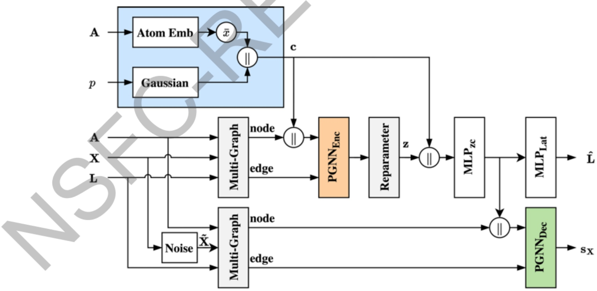
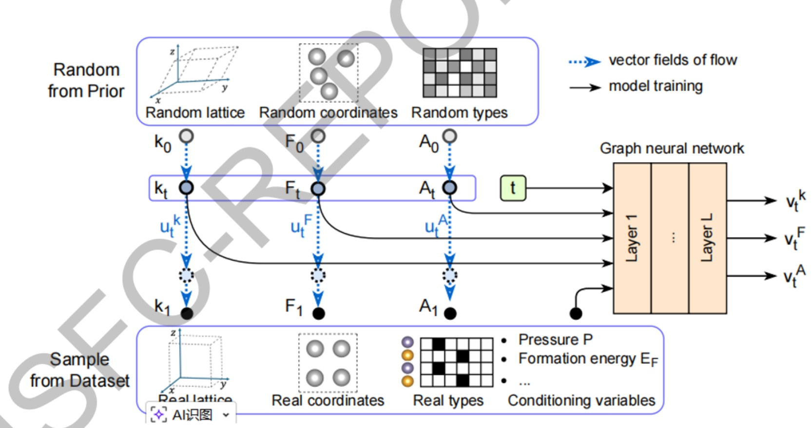
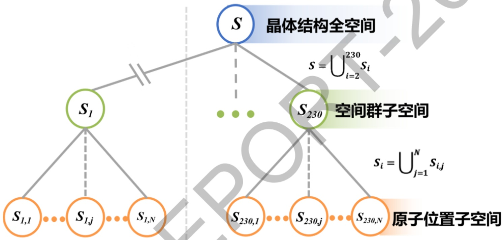
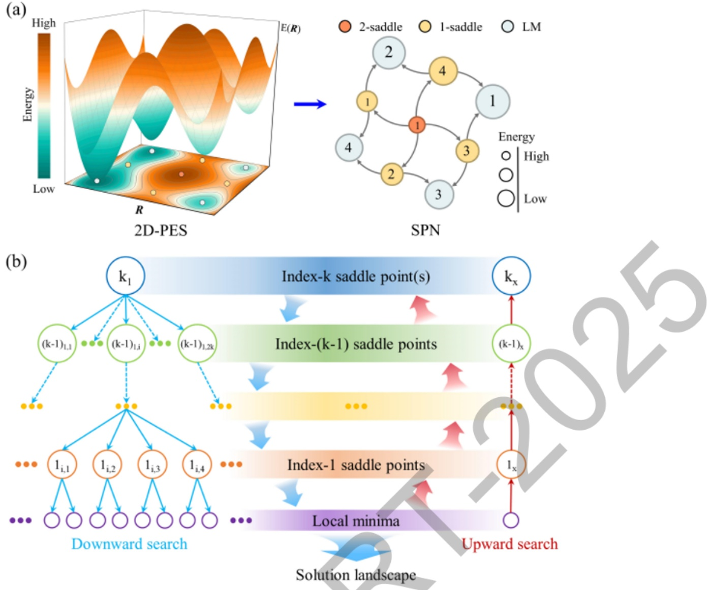

项目批准号 12034009申请代码 A20归口管理部门收件日期


20250212034009

# 国家自然科学基金

# 资助项目结题/成果报告

资助类别:重点项目

亚类说明:

附注说明:计算凝聚态物理及方法

项目名称:基于机器学习的晶体结构预测方法与软件

负责人:马琰铭

BRID: 09191.00.31608

电子邮件: mym@jlu.edu.cn

电话: 0431-85167879

依托单位:吉林大学

联系人:朱明

电话: 0431-85167419

直接费用:310.0000（万元）

执行年限: 2021.01-2025.12

填表日期:2026年01月26日

国家自然科学基金委员会制（2025年）

## 项目摘要

## 中文摘要:

晶体结构是凝聚态物质科学的研究基础。理论上准确预测晶体结构是学界的长期期盼，需要解决晶体玻恩-奥本海默势能面最低能态这一科学难题。历经多年的发展，晶体结构预测方法取得了可喜的进展，所采用的动力学模拟或启发式演化势能面数值求解方案取得了很大的成功。然而，由于势能面的具体形式未知，特别是由于势能面求解的NP-hard（非确定性多项式）难题的数学属性，晶体结构预测的理论难题并没有得到彻底解决。新兴的机器学习方法在挖掘大数据的内在规律上展现了广阔的前景，有望为晶体结构预测研究带来新的突破。本项目拟采用机器学习方法挖掘晶体结构数据库中“元素-组分-结构”的关联关系，生成先验引导的晶体结构，实现势能面低能区域的高效采样；采用可逆神经网络将势能面转化为简单分布的隐变量空间，实现基于群体智能算法的势能面高效探索。据此发展出一套基于机器学习的晶体结构预测新方法和计算软件，推动晶体结构预测领域的进一步发展

## Abstract:

Crystal structures are fundamental basis for the research field of condensed matters. Predicting crystal structure from theory is a long-held dream in academia, where the key is to determine the lowest-energy state of the Born-Oppenheimer potential energy surface (PES). Over the past decades, encouraging progress has been made in the field of crystal structure prediction through the development of numerical methods based on dynamical simulation or heuristic global optimization. However, due to the unknown form of the PES and the non-deterministic polynomial-time hard nature for solving the lowest-energy state, the problem of crystal structure prediction is not yet completely solved.The emerging machine learnning method opens up broad prospects in exploring rules from big data, which may bring breakthourghs for crystal structure prediction. In this project, we try to uncover the “element-composition-structure" relation lie in the crystal structure database using machine learning, which will be utilized for crystal structure generation to achieve an efficient sampling of the PES in low-lying regions. Then, we try to transform the PES to a latent space with simple distribution and to explore the latent space through swarm-intelligence algorithm to achieve an efficient searching of the PES. Based on the above techniques, we plan to develop a new machine-learning based crystal strueture prediction method and software, aiming to promote further development of crystal structure prediction.

关键词（用分号分开）:晶体结构；结构预测；机器学习；第一性原理计算；

Keywords (separated by;): Crystal structure; Structure prediction; Machine learning; First-principles calculation;

## 结题摘要

中文摘要（对项目的背景、主要研究内容、重要结果、关键数据及其科学意义等做简单概述）:

晶体结构是凝聚态物质科学的研究基础。理论上准确预测晶体结构是学界的长期期盼，需要解决晶体玻恩-奥本海默势能面最低能态求解的科学难题。近年来，机器学习逐渐深入到物理、化学和材料等科学领域的各个分支，成为挖掘材料内在关系和加速传统计算的全新途径，有望为晶体结构预测研究带来新的突破。

本项目发展了基于深度学习生成模型的结构产生方法，基于人工蜂群的复杂结构演化方法和基于机器学习势的高效晶体能量计算方法；将上述方法相结合，发展了基于机器学习的晶体结构预测新方法，开发了相应的结构预测软件，集成于CALYPSO软件包，为同行开展复杂体系结构预测研究提供了有力的工具。项目组进一步利用自主发展的方法和软件，解决了若干高压相结构难题，提出了单质锂在熔化曲线极小值区域的晶体结构，设计了S304、GaN5和GaN10等高压相晶体结构，部分计算结果得到实验证实。

本项目资助博士后6人，培养硕士、博士研究生20人，累计发表了SCI学术论文46篇，包括Phys.

Rev. Lett. 9篇, Proc. Natl. Acad. Sci. USA 2 篇， J. Am. Chem. Soc. 2 篇，

Nat. Commun. 4篇。项目负责人马琰铭教授应邀在美国材料学会春季会议（MRS Spring Meeti ng）等国际重要学术会议做大会或邀请报告15次，2017-2025年连续九年入选科睿唯安全球“高被引科学家”

contributions, and research data):

Crystal structures serve as the fundamental basis for research in condensed matter physics and materials science. Accurately predicting crystal structures from theory has long been a pursuit of the scientific community, which requires solving the scientific challenge of determining the global minimum on the Born-Oppenheimer potential energy surface. In recent years, machine learning has increasingly permeated various branches of physics, chemistry, and materials science. It has emerged as a novel approach to uncovering intrinsic material relationships and accelerating traditional calculations, offering promising new breakthroughs in crystal structure prediction.

In this project, we developed a structure generation method based on deep learning generative models, a complex structure evolution algorithm based on the Artificial Bee Colony (ABC) algorithm, and an efficient crystal energy calculation method utilizing machine learning potentials. By integrating these techniques, we established a novel machine learning-based method for crystal structure prediction and developed corresponding software. This software has been integrated into the CALYPSO package, providing a powerful tool for the scientific community to conduct structure prediction studies on complex systems. Furthermore, utilizing these self-developed methods and software, the project team resolved several long-standing challenges regarding high-pressure phase structures. We proposed the crystal structure of elemental lithium in the vicinity of the melting curve minimum and designed high-pressure structures for compounds such as S304, GaN5, and GaN10. Notably, some of these theoretical predictions have already been confirmed by experimental results.

This project supported 6 postdoctoral fellows and trained 20 master's and doctoral students. A total of 46 SCI academic papers were published, including 9 in Phys. Rev. Lett., 2 in Proc. Natl. Acad. Sci. USA, 2 in J. Am. Chem. Soc., and 4 in Nat. Commun.. The principal investigator, Professor Ma Yanming, delivered 15 plenary or invited talks

```txt
at prestigious international conferences, such as the MRS Spring Meeting. Additionally,
he has been recognized as a Clarivate "Highly Cited Researcher" for nine consecutive
years from 2017 to 2025.
关键词（用分号分开）：晶体结构预测；人工智能；高压相；第一性原理计算；
晶体结构数据库
Keywords (separated by;): Crystal structure prediction; Artificial
intelligence; High-pressure phase; First-principles calculation; Crystal
structure database
```

## 正文

## (一)结题部分

## 1. 研究计划执行情况概述。

（1）按计划执行情况。

项目在执行过程中，基金委管理人员和吉林大学都给予了充分的支持，资金及时到位，项目负责人和参与者积极主动、踏实肯干，保证了本项目按计划有序的运行。项目立项研究内容主要集中在发展基于机器学习的晶体结构预测方法和软件。项目组完成了预期的工作计划，在基于深度学习生成模型的结构产生方法、基于人工蜂群的复杂结构演化方法和基于机器学习势的晶体能量计算方法三个方面都取得了重要进展。本项目资助博士后 ，培养硕士、博士研究生20人，累计发表了 SCI 学术论文 46 篇，包括 Phys. Rev. Lett.9 篇，Proc. Natl. Acad. Sci. USA 2 篇，J. Am. Chem. Soc.2 篇，Nat. Commun. 4 篇。项目负责人马琰铭教授应邀在美国材料学会春季会议（MRS SpringMeeting）等国际重要学术会议做大会或邀请报告15次，2017-2025年连续九年入选科睿唯安全球“高被引科学家”，2023年当选中国科学院院士

## （2）研究目标完成情况。

本项目既定研究目标顺利完成。项目组发展了基于深度学习生成模型的结构产生方法，通过学习局域稳定晶体结构大数据，实现了低维流形上的晶体结构采样 排除高能量区域，提高了势能面结构采样的质量；发展了基于人工蜂群的复杂结构演化方法，通过“分治策略”，引入人工蜂群算法，实现了保持对称性的结构演化；发展了基于机器学习势的高效晶体能量计算方法，基于同步学习策略，将势能面探索与机器学习势构建相结合，把结构预测中晶体能量计算复杂度由立方量级降低为近线性；将上述方法相结合，发展了基于机器学习的晶体结构预测新方法，开发了相应的结构预测软件，集成于项目组前期发展CALYPSO软件包；项目组进一步利用自主发展的方法和软件，解决了若干高压相结构难题，提出了单质锂在熔化曲线极小值区域的晶体结构，设计了S₃O4、GaN₅和 GaN10等高压相晶体结构，部分计算结果得到实验证实。在完成既定目标的基础上，项目组还对CALYPSO的功能进行了拓展，发展了解景观势能面构建、分子晶体和非晶结构预测新方法。

## 2. 研究工作主要进展、结果和影响。

（1）主要研究内容。

本项目拟基于机器学习方法，挖掘晶体结构数据库中蕴含的“元素-组分-结构”的关联关系，并基于挖掘的元素配位和成键规律产生晶体结构，实现势能面低能区域的高效采样；将势能面转化到具有简单分布的隐变量空间，采用群体智能算法在隐变量空间实现高效的势能面探索；利用机器学习势加速势能面能量计算；将以上方法结合，发展出一套基于机器学习方法的晶体结构预测新方法，研制自主知识产权的计算软件，为国内外同行开展结构预测研究提供有效工具，推动晶体结构预测领域的进一步发展。

（2）取得的主要研究进展、重要结果、 关键数据等及其科学意义或应用前景。

## 1）基于深度学习生成模型的结构产生方法

收集、整合了前期晶体结构数据库和 CALYPSO 产生的理论结构，建立了一个超过350万条记录、涵盖89种元素、72万个化学配比信息的晶体结构数据库，为发展晶体结构生成模型提供了数据支撑；发展了基于图表示、等变消息传递网络和流模型技术的晶体结构生成模型，模型可直接生成近局域稳定晶体结构，生成晶体结构的平均能量较前期模型降低 84%，可以为晶体结构预测提供高质量的初始结构。

1.1）构建了CALYPSO晶体结构数据库，发展了Cond-CDVAE 以化学配比和压强为条件的晶体结构生成模型

项目组建立了数据上传网站（http://upload.calypso.cn/），整合并收集了CALYPSO软件在过去十余年计算得到的不同压强条件下的晶体结构数据，并将其与Material Project 数据库中的数据进行了整合；采用 MongoDB非关系型数据库架构建立了一个超过350万条记录、涵盖89种元素、72万个化学配比信息的晶体结构数据库。这一数据库的建立，为接下来开发基于化学组分和压强条件的晶体结构生成模型提供了坚实的数据基础。

项目组基于前人开发的CDVAE晶体结构生成模型，引入条件式变分自编码器框架，以化学组分和外界压强作为控制条件，通过等间距高斯基组将压强标准化并扩展为连续表示，通过嵌入层编码离散元素类别并按原子数加权平均生成化学组分编码，共同作为模型输入向量，从而构建了Cond-CDVAE模型（模型架构如图1所示）。测试表明，Cond-CDVAE模型生成结构在局域优化过程中显著减少了所消耗的优化步数，优化前后，结构均方根位移误差低于1Å。在 3,547个模型未见的常压实验结构测试集中，模型于800次采样下的预测成功率为59.3 %，其中晶胞内原子数小于 20 的结构预测成功率达 83.2 %。我们进一步采用 Li、B 和 SiO₂等具有复杂高压相的体系对模型进行测试，结果表明，Cond-CDVAE模型在搜索效率和预测精度方面显著优于传统随机或启发式搜索方法，在B28、SiO₂的 coesite相等结构中以更少采样次数即可寻找到基态。该研究验证了生成模型在高压晶体结构设计与理论预测中的应用潜力，为利用生成模型高效探索复杂势能面并预测高压晶体结构提供了可行路径。相关研究成果发表在 npj Comput. Mater. 10, 254 (2024)。



图 1 Cond-CDVAE 模型架构图

## 1.2）发展了CrystalFlow晶体结构生成模型

流模型作为近年来人工智能领域的先进生成技术，因其在图像等领域较扩散模型展现出更高的推理效率和更灵活的先验分布选择，受到广泛关注。项目组基于连续归一化流（continuous normalizing flows）与条件流匹配（conditional flow matching）技术，发展了高效且灵活的CrystalFlow晶体结构生成模型（模型架构如图2所示），在结构生成性能方面较前期方法取得了显著提升。为满足晶体结构内禀的周期E(3)对称性，模型采用晶体图表示结合等变消息传递网络，并针对晶格参数、元素种类及分数坐标分别设计概率变换路径，实现晶体结构各组成部分的联合生成。进一步，通过引入无分类器引导（classifier-free guidance）技术，CrystalFlow模型可以依据给定的外界压强、形成能等条件来生成晶体结构。系统测试表明，CrystalFlow模型在晶体结构预测的准确率上较前期方法提升约20%，生成速度提升逾一倍，在高压结构生成任务中，结构晶格应力误差降低了71%。此外，在新材料设计任务中，模型生成的稳定且不重复新结构比例达到当前最优算法水平。该研究工作进一步推动了晶体结构生成模型的发展，为复杂材。相关研究成果发表在Nat. Commun. 16, 9267 (2025)。



图 2 CrystalFlow 模型架构示意图

## 2）基于人工蜂群的复杂结构演化方法

前期基于群体演化的结构预测方法面临结构对称性快速降低的问题，项目组提出了根据晶体空间群对称性将势能面划分为230个子空间（如图3所示），并在各子空间中分别求解全局能量最小值点的“分而治之”策略，并将该策略与对称性人工蜂群算法（SABC）相结合，发展了可保持结构对称性的结构演化方法。

项目组分别采用MgAl₂O₄和 Mg24A116Si24O96体系对新方法的可靠性和效率进行了测试，并与前期CALYPSO中的局域粒子群优化方法（LPSO）进行了比较。对于MgAl₂O₄体系，SABC方法与LPSO方法均以100%的成功率找到了基态结构，但 SABC方法效率有显著提升；对于更加复杂的 Mg24A116Si24O96体系，SABC方法较LPSO方法在效率和成功率上均有大幅提升。项目还采用SABC方法系统搜索了BLJ60、BLJ80和 BLJ256体系的基态结构，并与前期的极小值跳跃方法和盆地跳跃方法进行了比较，SABC方法均成功找到了能量更低的晶体结构，有力的证明了方法的有效性。相关研究成果发表在J. Chem. Phys.156,014105(2022)。



图3根据对称性划分的晶体结构树形图

## 3）基于解景观的晶体势能面构建方法

项目组基于解景观（Solutionlandscape）方法，设计了一套具有旋转不变性义坐标，实现了对晶体结构的编码；基于该编码，通过向上、向下搜索算法结合具有平移不变性的高阶鞍点动力学，在晶体结构势能面上搜索任意阶驻点及其拓扑连接关系，实现了晶体结构势能面关键信息的简化；通过将搜索得到的驻点及其连接关系分别映射为驻点网络图（Stationary-point network,SPN）中的节点和边，实现了晶体结构势能面可视化，进而提出了一种有效表示复杂晶体结构势能面的新方法（如图4所示）。利用该方法，成功构建了硅和氮化镓晶体结构势能面的驻点网络图，据此发现了具有较低能垒的相变新路径。该研究为解决晶体结构势能面的构建和可视化提供了全新视角，也为理解材料的稳定性和可合成性以及相变行为开辟了新途径。研究成果发表在 Acta Mater. 281, 120403 (2024)。



图4(a)势能面（PES）和驻点网络图（SPN）示意图；（b)晶体解景观示意图

## 4）基于机器学习势的晶体能量计算方法

基于同步学习策略，将势能面探索与机器学习势构建相结合，发展了高效的晶体能量计算方法，将结构预测中晶体能量计算复杂度由立方量级降低为近线性。采用该方法，对Li-La-H体系开展了大尺寸（150原子）结构预测模拟，发现了 Li2La2H23， 更新了该体系的高压相图，计算效率较第一性原理结构预测提高两个数量级。

项目组结合CALYPSO结构预测方法与深度势能（Deep Potential, DP），构一种基于同步学习思想的数据集生成与结构预测加速方案（如图5所示）。在该方案中，CALYPSO结构预测中的能量计算由高效的DP势模型完成，并在结构预测迭代过程中持续收集外推构型，对这些构型进行第一性原理能量计算，从而动态扩展数据集的覆盖范围。最终生成的DP势函数模型能够在晶体结构预测过程中高效评估势能面能量，显著降低了计算成本，同时保持了结果的准确性与可靠性。

以Li-La-H三元富氢化合物超导体系为研究对象，开展了大规模的结构预测研究。基于同步学习方案，从2036个初始构型出发，探索了6,813,576个晶体结

Radiat. Extremes 10, 033801 (2025)。

5）利用自主发展的CALYPSO方法和软件，解决了若干高压相结构难题提出了单质锂在熔化曲线极小值区域的晶体结构，设计了S3O₄、GaN₅和GaN10等高压相晶体结构，部分计算结果得到实验证实。

5.1）实验发现锂在高压下发生复杂的相变，但结构长期难以确定。项目组利用发展的方法，提出了晶胞原子数达百原子量级的高压相晶体结构，为破解单质锂的结构难题提供了理论支持。

锂是自然界中最轻的金属。它在常温常压下具有体心立方结构和近自由电子行为，通常被看成是简单金属。然而，这种“简单”金属在高压下并不简单。它会随着外界压强的增加发生一系列复杂的结构相变，并伴随有超导温度升高、反Wilson转变和熔点显著降低等现象，一直是高压研究的模型体系。前期研究发现单质锂的熔点随压强的增加而显著降低，导致在40-60GPa压强区间出现了熔化曲线极小值。然而，人们对其最低熔化温度 (\~190-300K）一直存在争议。2019年，高压X射线衍射实验在锂的熔化极小值附近观测到了新的衍射峰，并据此推测极有可能存在新的高压相。澄清熔化极小值附近是否存在高压新相及其晶体结构对确定其最低熔化温度和理解核量子效应对相图的影响至关重要。

项目组采用发展的机器学习势加速的结构预测框架，基于CALYPSO和Deep Potential势函数，系统探索了锂在熔化极小值附近的势能面，发现了Pearson符号为aP160、oP192、oP48和tI20的四个复杂的高压相晶体结构，晶胞内最大原子数高达192（如图6所示）。系统的自由能计算表明，单质锂在熔化极小值附近的能量面极其复杂，呈现出多谷而平坦的特征，所预测高压相的热力学稳定性介于实验cI16和oC88相之间，有望在实验上通过调控温度-压力路径来获得。该研究工作不仅给出了锂在熔化极小值附近未知高压相的有力候选，同时证明机器学习加速的结构预测技术可以显著提高人们对晶体势能面的探索能力和效率，是复杂体系晶体结构研究的有力工具。相关研究成果发表在Nat. Commun. 14，2924 (2023)。