项目批准号 22172026申请代码 B0201归口管理部门收件日期


20250122172026

# 国家自然科学基金

# 资助项目结题/成果报告

资助类别:面上项目

亚类说明:

附注说明:

项目名称:基于机器学习的高熵合金电化学水气变换阳极材料设计

负责人:苏海燕

BRID: 09861.00.26026

电子邮件: suhy@dgut.edu.cn

电话: 0769-22861621

依托单位: 东莞理工学院

联系人: 曾瑾子

电话: 0769-22861296

直接费用:60.0000（万元）

执行年限: 2022.01-2025.12

填表日期:2025年12月19日

国家自然科学基金委员会制（2025年）

## 项目摘要

## 中文摘要:

水气变换反应是工业上大规模制氢的主要方法之一。然而，该工艺通常在高温高压下进行，产生的H2需要经过分离提纯才能进一步应用。近期，申请人与合作者首次提出电化学水气变换概念，实现了常温常压下直接制取高纯H2，为低能耗生产高纯H2提供了新的思路。目前，该过程存在的主要问题是阳极过电势仍然较高，解决这一问题的关键是基于中间体吸附能的催化新材料开发。高熵合金材料由于多种元素无序排布，能提供大量不同环境的吸附位点，因此有望实现对中间体吸附能的近似连续调控，从而识别具有最佳吸附能和阳极反应活性的材料。本项目将利用机器学习和密度泛函理论计算等方法，建立高熵合金表面CO、COOH等中间体的吸附能模型，解析这些吸附物种与表面的作用机制及其调控规律，以期实现阳极材料的快速、高通量筛选，并通过实验验证理论预测的可靠性。本项目拟建立一个机器学习指导的电化学水气变换阳极材料研发的新范式，加速功能导向的材料设计与调控。

## Abstract:

The water-gas shift reaction provides one primary route for large-scale hydrogen production in industry. However, the process often operates at high temperatures and pressures, and the H2 generated needs to be separated and purified for further application. Recently, the applicant and collaborator proposed the concept of electrochemical water-gas shift for the first time, producing high purity H2 directly at room temperature and atmospheric pressure, which provides a new avenue for the production of high purity H2 with low energy consumption. At present, the main problem of this process is that the overpotential at the anode is still high. The key to solve this problem is the development of new catalytic materials based on the adsorption energies of intermediates. Due to the disordered arrangement of various elements, high-entropy alloy materials can provide a very large number of adsorption sites in distinct environments. Therefore, it is expected to tune the adsorption energies of intermediates near continuously and identify the materials with optimal adsorption energies and reaction activities at the anode. In this project, the machine learning method and density functional theory calculations are used to establish the adsorption energy model of CO and CO0H and other intermediates on the surfaces of high-entropy alloys and analyze the interaction mechanism between the adsorption species and the surfaces and their regulation rules. The objective is the rapid and high-throughput screening of anode materials, and the reliability of theoretical prediction will be verified by experiments. This project aims to establish a new paradigm for the research and development of electrochemical water-gas shift anode materials guided by machine learning, and accelerate the function guided material design and regulation.

关键词（用分号分开）:密度泛函理论计算；多相催化；水煤气变换；机器学习；高熵合金

Keywords (separated by;): Density functional theory calculations; Heterogeneous catalysis; Water-gas shift; Machine learning; High-entropy alloys

## 结题摘要

中文摘要（对项目的背景、主要研究内容、重要结果、关键数据及其科学意义等做简单概述）:

电化学水气变换（EWGS）反应能够在常温常压下直接制取高纯氢，为低能耗生产高纯氢提供了新的思路。然而，该过程存在的主要问题是阳极过电势较高，解决这一问题的关键是高效催化材料的开发。高熵合金材料由于多种元素无序排布，能提供大量不同环境的吸附位点，因此有望实现对中间体吸附能的近似连续调控，从而识别具有最佳吸附能和阳极反应活性的材料。本项目选取PdIrPtCuAu和NiIrPtCuAg两类高熵合金材料，通过结合DFT计算、机器学习及微观动力学模拟，建立了从体相稳定性到表面EWGS阳极反应活性的系统性研究方法，为多元复杂催化剂体系的理论研究提供了完整范式。项目筛选出的高活性位点包括Ir参与的“双顶位”构型（如PtIr、IrIr等），及以Pt、Cu、Pd为主的“顶桥位”构型为实验合成提供了明确指导，发现的元素协同效应为高性能催化剂设计开辟了新思路。研究过程中形成的数据集、计算方法和理论认识，为后续多元合金催化材料研究奠定了坚实基础，具有重要的科学价值与应用前景。项目资助期间，共计发表SCI论文22篇，包括项目主要成员以（共同）第一作者或通讯作者在ACS Catal.(2)， J. Mater. Chem. A, Today Sustain.和J.Catal.等期刊发表论文16篇。培养硕士研究生5名。

# Abstract (Brief description of research background, main methods, contributions, and research data):

The electrochemical water-gas shift (EWGS) reaction enables direct production of high-purity hydrogen under ambient conditions, offering a novel pathway for low-energy hydrogen generation. However, a key challenge lies in the high anodic overpotential, which necessitates the development of efficient catalytic materials. High-entropy alloys (HEAs), due to their disordered multi-element structures, provide abundant adsorption sites with diverse local environments, enabling near-continuous tuning of intermediate adsorption energies. This facilitates the identification of materials with optimal adsorption energies and enhanced anodic reaction activity. This project selects two HEA systems—PdIrPtCuAu and NiIrPtCuAg—and integrates density functional theory (DFT) calculations, machine learning, and microkinetic modeling to establish a systematic methodology for studying catalysts, from bulk stability to surface EWGS anodic activity. This approach provides a comprehensive framework for theoretical research on complex multi-element catalyst systems. The study identifies high-activity sites, including Ir-involved "double-top" configurations (e.g., PtIr, IrIr) and "top-bridge configurations dominated by Pt, Cu, and Pd, offering clear guidance for experimental synthesis. The discovered element synergistic effects open new avenues for designing high-performance catalysts. The data sets, computational methods, and theoretical insights generated during the project lay a solid foundation for future research on multi-element alloy catalysts, holding significant scientific and practical value. During the funding period, 22 SCI papers have been published, including 16 papers by the principal investigators as (co-)first or corresponding authors in journals such as ACS Catal. (2), J. Mater. Chem. A, Mater. Today Sustain., and J. Catal. Additionally, 5 master's students have been trained.

关键词（用分号分开）:密度泛函理论计算；多相催化；水煤气变换；机器学习；高熵合金

Keywords (separated by;): Density functional theory calculations; Heterogeneous catalysis; Water-gas shift; Machine learning; High-entropy alloys

## (一)结题部分

## 1. 研究计划执行情况概述。

（1）按计划执行情况。

在基金项目的支持下，围绕原计划的核心科学内容，顺利完成了主要研究计划。研究通过密度泛函理论（DFT）计算与机器学习方法SISSO等，深入探究了电化学水气变换（EWGS）过程中相关的催化基础科学问题，包括高熵合金的组成、结构与稳定性之间的构效关系，CO和H₂O等分子在高熵合金表面的高效活化机制，以及SISSO方法预测的精度及其物理解释等。

研究选取 PdIrPtCuAu 和 NiIrPtCuAg 两类高熵合金作为研究对象，通过开展大规模 DFT 计算（涵盖超过 30000 个结构），系统评估了其体相热力学稳定性(混合焓ΔHmix、原子半径差因子δ和混合吉布斯自由能的贡献比例Ω)，揭示了元素组成与形成能之间的定量关系，并对比分析了这两类合金的稳定性差异。基于此，发展了一种高效评估高熵合金/中熵合金体相稳定性的方法。除了体相性质，我们深入分析了合金表面能及元素偏析趋势，并揭示了EWGS反应的关键中间体CO和OH在两类高熵合金表面吸附能的分布规律、位点偏好以及元素特异性贡献。此外，在研究O-H键活化过程中，我们意外发现了新的现象，并据此加强了相关研究，成功识别了控制这类化学键活化的关键因素。

## （2）研究目标完成情况。

在基金项目的支持下，很好地实现了研究目标，即通过结合机器学习方法与DFT 计算，系统考察了 PdIrPtCuAu等高熵合金的元素组成比例、空间排布及局域结构对 EWGS 反应中关键中间体 CO 和 OH 吸附行为的影响。建立了吸附能随材料组成与结构连续变化的能量分布模型，明确了吸附能的统计分布特征及位点占有率规律，并基于此实现了对高效EWGS阳极材料的快速、高通量筛选。

通过机器学习势（MLP）与DFT计算的对比验证，确认了MLP在高效筛选催化剂方面的可靠性。研究发现，PtIr、IrIr、PtPtCu等多类构型表现出高催化活性，揭示了Ir元素在降低反应过电位、Pt-Cu协同效应在提升反应速率中的关键作用。这些成果为常温常压下实现EWGS大规模制取高纯氢提供了重要的理论支撑。此外，本项目还构建了以机器学习和大数据分析为核心的数据驱动材料研发新范式，为催化材料的设计与优化开辟了新路径。

## 2. 研究工作主要进展、结果和影响。

## （1）主要研究内容。

①无序高熵合金材料的体相稳定性评估。基于DFT计算与机器学习方法SISSO，发展高熵合金体相内聚能估算方法，并扩展到三-八元中熵、高熵合金体系，验证该方法的普适性。针对PdIrPtCuAu和NiIrPtCuAg高熵合金，利用大规模DFT计算（分别构建2000个随机结构），系统分析其混合焓（ΔHmix）、Ω及δ参数的分布规律，并对比两类合金的稳定性差异。基于线性回归分析，建立元素组成与∆Hmix、δ参数之间的定量关系模型。基于此，开发高熵合金ΔHmix估算模型，并利用该模型对大量合金结构快速筛选，为高效评估高熵合金的体相稳定性奠定理论基础。

②高熵合金表面结构的稳定性和中间体的吸附能。对PdIrPtCuAu和NiIrPtCuAg体系各12000个（111）表面进行了系统计算。通过分析表面能最低的结构特点，揭示影响表面稳定性的关键元素效应。在此基础上，系统研究两类高熵合金表面（各1080个吸附结构）上OH和CO吸附行为。获得了吸附能的统计分布特征，并明确了吸附位点的元素偏好与几何偏好，从原子尺度揭示了中间体吸附对局部元素组成与配位环境的依赖关系。

③基于机器学习方法筛选与预测EWGS阳极材料。采用机器学习势（MLP)高精度模拟与 DFT 验证相结合，开展高熵合金表面EWGS 反应的活性评估与机制研究。通过对比MLP与DFT在纯金属表面关键反应步骤(CO+OH→COOH)中的能量变化与过渡态特征，验证了MLP在预测反应路径及动力学参数方面的可靠性，为高通量筛选提供了高效且准确的计算方法。在此基础上，针对PdIrPtCuAu体系，随机选取300个表面结构，系统计算其在不同电极电位下的EWGS反应活性。通过归纳高活性结构的特征规律，筛选出具有潜在应用价值的高活性表面位点。从原子尺度揭示高熵合金中多元素协同调控反应路径与动力学的内在机制，为理性设计高效EWGS阳极材料提供理论依据。

④其他催化剂上CO氧化和水气变换反应。采用DFT计算和包含侧向相互作用的微观动力学模拟，研究单原子掺杂的TiO2(110)和MoS₂等材料表面上CO氧化及水气变换反应机理和活性位，揭示控制反应活性和选择性的关键因素。

⑤甲酸分解和CO₂电化学还原反应（CO₂ER）。以CO吸附能作为甲酸分解活性的描述符，利用DFT计算和机器学习方法SISSO，建立高熵合金上CO吸附能模型，筛选高效的高熵合金材料，并通过DFT计算和微观动力学模拟验证筛选的可靠性；利用恒电位第一性原理计算与微观动力学模拟，研究 Sn(200)表面上CO₂ER制甲酸的反应机理，模拟CO₂ER/析氢反应极化曲线及法拉第效率并与实验对比，解析影响反应活性和选择性的主要因素。

（2）取得的主要研究进展、重要结果、关键数据等及其科学意义或应用前景。

## ①无序高熵合金材料的体相稳定性评估

高熵合金在很多催化反应中已表现出优异的性能，其稳定性对催化应用至关重要。本项目采用特殊的准无序超胞法(Special Quasi-random Structure, SQS)，随机产生了160种面心立方晶相高熵合金PdIrPtCuAu（4×4×3）的体相结构。通过密度泛函理论（DFT）计算研究了各种结构的平均内聚能，公式如下:

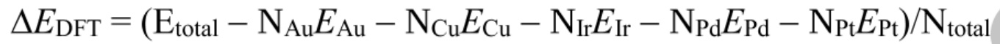

其中 Etotal, NM, Em 和 Ntotal 分别代表 DFT 计算的高熵合金体相总能，M（M=Au, Cu,Ir,Pd或Pt）原子的数目和能量以及合金中原子总数。平均内聚能越负，说明材料的体相稳定性越强。

利用这些高熵合金的平均内聚能作为训练集，我们通过机器学习方法SISSO训练高熵合金平均内聚能的估算模型:

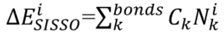

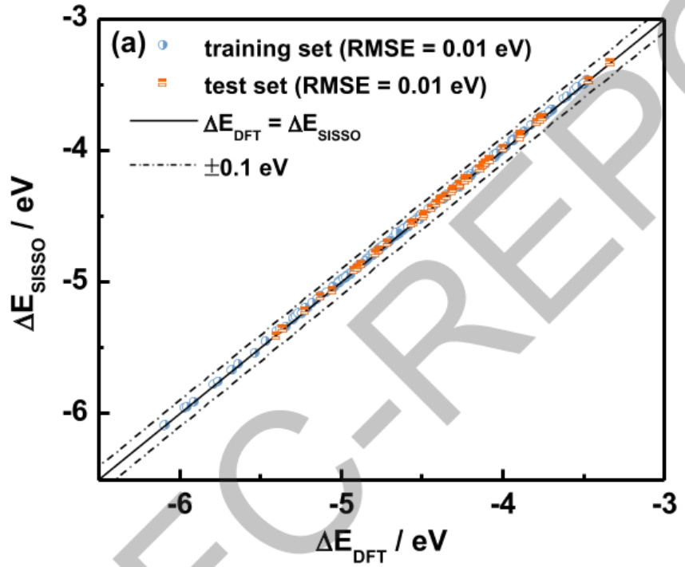

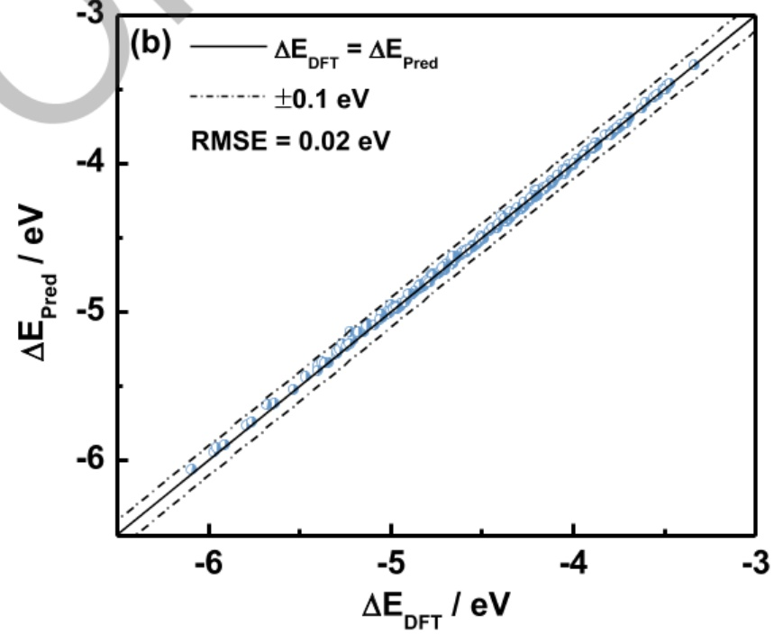

冬 计算的 PdIrPtCuAu 体相平均内聚能与(a) SISSO 预测和(b)二元合金键能预测的平均内聚能对比

其中，Ck是模型参数，Ni是高熵合金中每种金属键，k，的数目。如图1a所示，通过 SISSO方法预测的平均内聚能的均方根误差为0.01 eV。在此基础上，随机产生40个PdIrPtCuAu高熵合金的体相结构，以DFT计算的平均内聚能作为验证集，该模型估算的均方根误差也是0.01eV。这些结果说明，该模型可以准确预测PdIrPtCuAu高熵合金的平均内聚能，大幅降低DFT计算的成本。而且，该公式具有明确的物理意义，各项系数Ck即为高熵合金中各个金属键的键能/Ntotal。

基于上述理解，我们尝试通过二元合金体相中金属键的键能估算其在高熵合金中的键能，即公式2 中的各系数Ck×Ntotal。该结果与 SISSO拟合结果吻合较好。如图1b所示，采用该方法估算的 200种 PdIrPtCuAu高熵合金平均内聚能∆EPred的均方根误差为 0.02 eV，与SISSO训练的模型精度相当。因此，不需要大量的DFT计算数据，仅通过计算二元合金体相中金属键的键能即可获得高熵合金的内聚能公式，大幅降低了计算量。将该方法扩展到其他三-八元中熵、高熵合金体系，包括CrCoNi、FeCoNiMn、CoMoNiFeCu、PtFeCoNiCuAg、PtPdCoNiFeCuAuSn。结果发现，该方法可准确预测这些体系的体相平均内聚能，均方根误差均小于 0.10 eV。

此外，我们通过大规模 DFT 计算，系统研究了PdIrPtCuAu和 NiIrPtCuAg高熵合金的混合焓（各2000个随机结构)。结果发现，PdIrPtCuAu的混合焓分布范围为-0.03 至 0.18 eV/atom，其中包括约 1.3%的负混合焓结构，表明该体系具有形成稳定合金的潜力。而NiIrPtCuAg体系的混合焓全部为正值（0.03-0.25 eV/atom)，热力学稳定性相对较差。通过线性回归，建立了两个体系中元素成分与混合焓、δ参数之间的定量构效关系模型（R²>0.86)，明确了Pd、Pt、Cu等元素对稳定性的积极贡献以及Ir、Au/Ag的抑制作用。这一工作为理解合金稳定性提供了理论依据，指明了在高熵合金中如何通过元素选择与配比优化来提升材料稳定性。基于上述研究，通过二元合金体相中金属键的键能估算高熵合金的混合焓。以 PdIrPtCuAu为例，该方法估算的 200种结构的混合焓的均方根误差小于0.05 eV。因此可以作为一种普适的方法，广泛应用于不同元素种类的中熵、高熵合金体相稳定性的快速评估，为后续表面研究奠定了稳定的体相结构基础。相关结果正在撰写成论文

## ②高熵合金表面结构的稳定性和中间体的吸附能

对 PdIrPtCuAu和 NiIrPtCuAg 高熵合金体系各12000个体相衍生（111）表面进行了系统计算。结果表明，两个体系存在显著的元素偏析效应。在PdIrPtCuAu体系中，Au元素倾向在表面富集；而在 NiIrPtCuAg体系中，Ag元素呈现类似趋势。I元素在两个体系中均倾向于进入体相。这种偏析行为与各元素的表面能密切相关，其中Ir的高表面能（0.1870 eV/Ų）驱动其向体相迁移，而Au（0.0498 eV/Ų）和Ag（0.0450 eV/Ų）的低表面能促使其在表面富集。该发现揭示了影响高熵合金表面稳定性的关键元素效应，对于理解其表面结构的形成机制具有重要意义，也为表面工程调控提供了理论依据。

对两类高熵合金（111）表面上（各1080个结构）OH和CO的吸附行为进行了系统研究，获得了吸附能的统计分布特征。研究发现，OH在PdIrPtCuAu表面吸附呈双峰分布(0.3/0.8 eV)，主要由Ir顶位和Cu三重位贡献；而在NiIrPtCuAg表面则呈正态分布（均值0.2eV），以Ni三重位为主。CO吸附在两体系均呈正态分布，平均吸附能分别为-2.2eV和-2.4eV，均以三重位为主，Ir贡献最大。Ir倾向顶位吸附，Cu/Ni倾向三重位吸附，Au/Ag吸附最弱。这些结果从原子尺度揭示了中间体吸附对局部元素组成与配位环境的依赖关系。

## ③基于机器学习方法筛选与预测EWGS阳极材料

利用机器学习势（MLP）高精度模拟和DFT验证相结合，系统开展了高熵合金表面 EWGS 反应的活性评估与机制研究。通过对比 MLP 与 DFT 在纯金属表面（Au、Cu、Ir、Pd、Pt等）上关键反应步骤（CO + OH→ COOH）的能量与过渡态结果，验证了MLP在预测反应路径与动力学参数方面的可靠性，为高通量筛选提供了高效可靠的计算方法。

在此基础上，针对 PdIrPtCuAu体系，随机选取300个表面结构，系统计算了其在不同电位下的EWGS反应活性。研究发现，高活性构型主要分为两类:一是以Ir参与的“双顶位”构型（如PtIr、IrIr等），具有较低的过电位（0.2–0.4 V)与高反应速率（>6000 s-¹ site-1）；二是以 Pt、Cu、Pd 为主的“顶桥位”构型（如PtPtCu、PtCuCu等)，在适中过电位下仍表现出优异的反应活性。这一结果表明，Ir的引入可显著降低反应过电位，而Pt-Cu协同作用则有利于提升反应速率，与文献中Pt-Cu合金体系的高活性实验现象一致。本研究不仅筛选出多个具有潜在应用价值的高活性表面位点，还从原子尺度揭示了高熵合金中多元素协同调控反应路径与动力性的机制，为理性设计高效EWGS 阳极材料提供了重要的理论依据。相关结果正在撰写成论文。

## ④其他催化剂上CO氧化和水气变换反应

为了与高熵合金上EWGS 阳极CO氧化反应活性进行对比，我们也通过DFT计算和包含侧向相互作用的微观动力学模拟，研究了3d-5d单金属原子（M）掺杂的TiO2(110)（M/TiO₂）上CO氧化反应。我们识别了M位点上氧原子的吸附能作为M/TiO₂催化剂上CO氧化反应活性的单一描述符，这与负载型金属催化剂上采用的O和 CO吸附能两个描述符明显不同。在400 K，单 Pt和 Rh原子掺杂的 TiO2(110)显示了最高的活性（图2a)，CO₂形成速率比 TiO2(110)高7-8个数量级。Pt/TiO₂和 Rh/TiO₂催化剂优异的活性主要由于它们适中的O吸附能。Pt/TiO2(110)表面上 CO氧化主要遵循解离机理(Route II，图 2b)，而 Rh/TiO2(110)表面上优先通过联合机理（Route VII，图2c）进行。非贵金属Ta/TiO₂和 Mn/TiO₂也表现出显著的活性。该工作强调了CO氧化中常被忽视但起核心作用的吸附质侧向相互作用（J.Catal.2025,450,116308)。

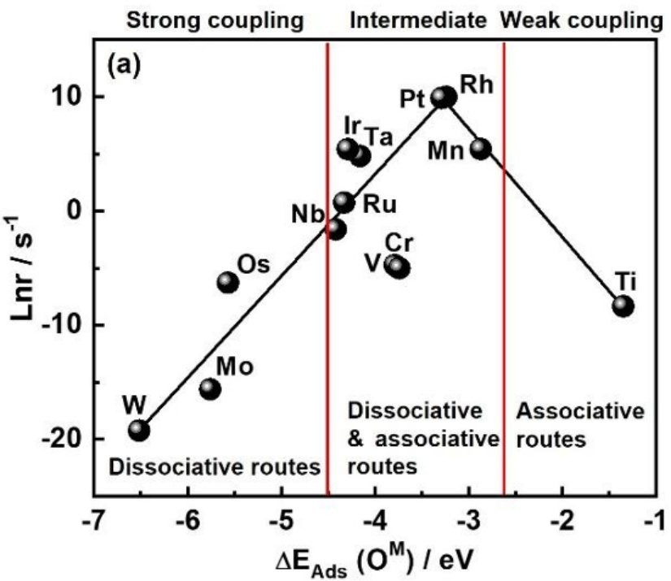

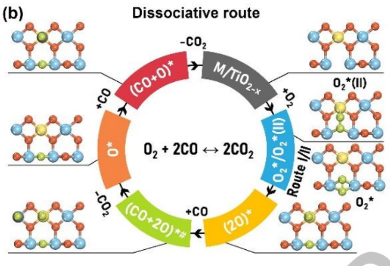

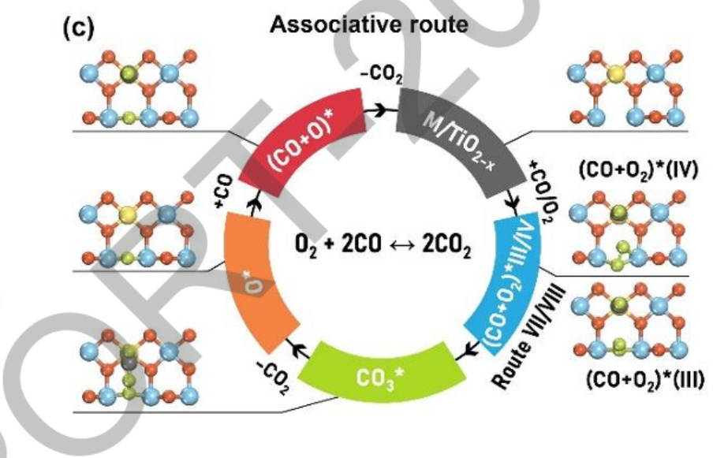

图 2. (a) 400 K 下 CO 氧化速率随着 M/TiO₂(110)表面 M 位点上 O 吸附能 (∆EAds(OM))的变化 (b) 解离机理（c) 联合机理

二硫化钼（MoS2）是一种潜在的耐硫水气变换（WGS）催化剂，其边缘位点通常被认为是很多催化反应的活性位，而具有最大位点密度的（001）基面总是惰性的。为了利用其位点丰度，许多研究通过产生S空位（Sv）或掺杂3d过渡金属M来修饰MoS₂基面。区分各种边缘位点以及 Sv和M修饰的基面内位点的本征反应性对于识别 WGS 的活性位和优化 MoS₂催化剂至关重要。我们利用DFT计算和微观动力学模拟，研究了MoS₂催化剂的各种结构基元上的 WGS反应机制，并识别活性位。结果表明，在450-630K、1bar和H₂O/CO=1时，CO转化率顺序为:S 边 > Mo 边 > Cu/MoS2（001）> MoS2（001），说明 S 边可能是WGS反应的活性位。Mo边和 Cu/MoS₂（001）上只生成CO₂，而在S边上也生成少量CH4。在Cu/MoS₂（001）上，WGS主要通过氧化还原机制进行，CO氧化为速控步。然而，在MoS₂边缘上，WGS通过联合和氧化还原两种机制进行，并且随着温度的升高，速控步从COOH形成或分解转变为CO氧化。该工作为优化水气变换催化剂的设计提供了理论见解（Catal.Sci.Technol.2024,14,2608)。

已有研究表明，水的解离是水气变换反应的关键步骤，甚至是速控步。但催化剂的异质性很大，H₂O解离的最佳活性位点至今还不明确，文献的结论也常互相矛盾。从计算角度看，目前也缺乏系统总结能有效解离H₂O的催化剂特征的研究，因为计算反应能垒非常耗时，而且Brønsted-Evans-Polanyi关系误差较大，或在不同催化剂上不适用。为了解决这个问题，我们结合过渡态搜索和Bader电荷分析，研究了金属（Cu、Co、Pt）、氧化物（如TiO₂）、MXenes以及金属/氧化物界面（如Cu/ZnO、Pt/FeO1-x）上O-H键的解离。结果发现，O-H键活化存在两个动力学有利的特征:一是解离过程中H的电荷保持稳定，二是O-H键容易旋转，这时能垒较低（图3）。更有趣的是，这两个因素在所有分析的材料中能量成正比，这为催化剂的高通量设计提供了理论依据。最后，我们发现精心匹配的金属/氧化物界面能有效促进 H₂O的解离（ACS Catal.2022,12,1237）。

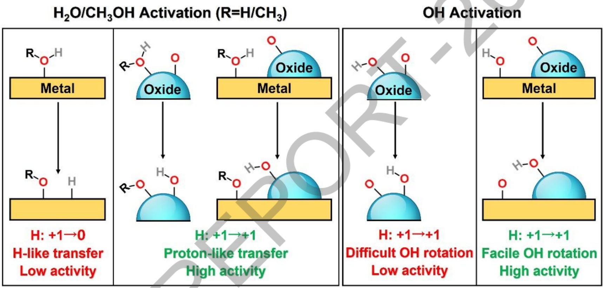

图3. 金属、氧化物和金属/氧化物界面上影响O-H键活化的两个关键因素

⑤甲酸分解和CO₂电化学还原反应（CO₂ER）

由于EWGS阳极CO氧化反应与甲酸分解、CO₂电化学还原制甲酸反应涉及相同的中间体，我们也研究了这两个反应的机理，确定了反应活性的描述符，以期筛选高效的高熵合金材料。

我们首先采用DFT计算和考虑侧向相互作用的微观动力学模拟，研究了传统的Pd催化剂上甲酸分解反应的动力学，得到的表观活化能、转换频率、H₂选择性和反应级数与实验研究符合较好，验证了理论研究的可靠性。在此基础上，我们确定了最优反应路径和速率控制度，识别了CO的吸附能作为甲酸分解反应活性的描述符。我们进而利用DFT计算和机器学习方法SISSO，预测了全范围内无序高熵合金 PdIrPtCuAu(111)表面上 CO的吸附能（图 4a和 4b)，筛选出Au8Cu5IrPd21Pt13、Pd2Au2和 Pd2Au/Pd 作为甲酸分解候选材料，再通过 DFT计算和微观动力学模拟验证。结果发现，在400K，这些体系的活性比传统Pd(111)表面高三个数量级，同时保持较高的 H2选择性（图4c)。在 Au8Cu5IrPd21Pt13(111)表面上，甲酸分解通过HCOO\*物种进行（图4d），决速步为HCOO\*脱氢（图4e)；而在 Pd2Au2(111)和 Pd2Au/Pd(111)表面上，甲酸分解通过 COOH\*物种进行（图4d)，决速步为COOH\*脱氢（图4e)。此外，我们还发现具有不同Pd/Au比的多种PdAu表面合金也表现出优异的活性（图4c)，这与实验中广泛观察到的PdAu催化剂的优异性能相符。该工作利用机器学习方法、DFT计算和微动力学模拟相结合，为催化剂设计提供了新的思路（J. Mater. Chem.A 2025, 13,33692)。

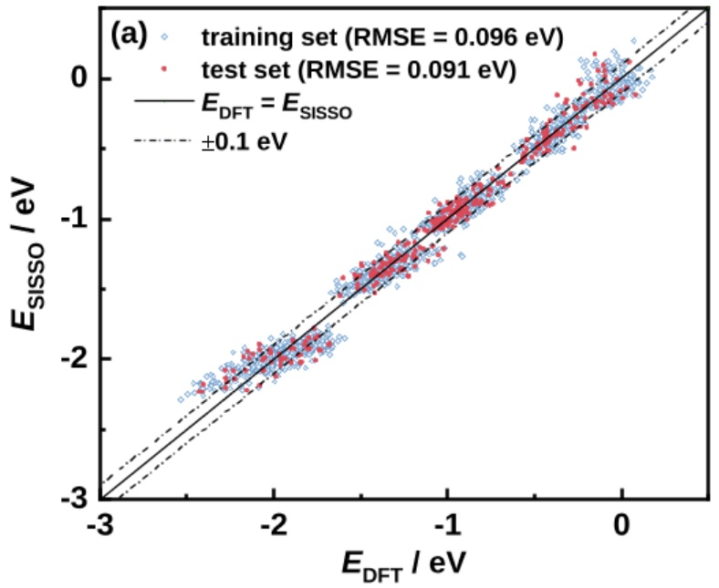

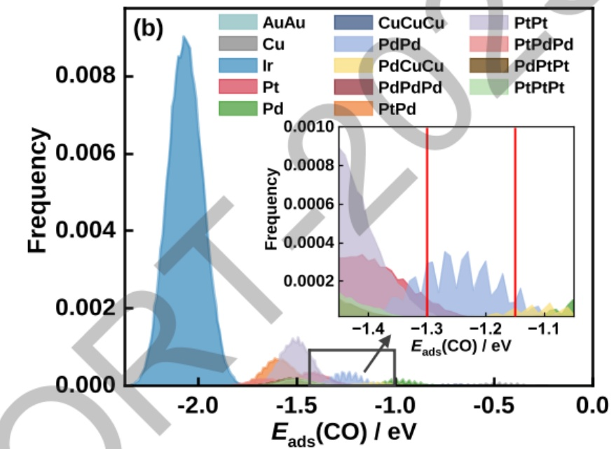

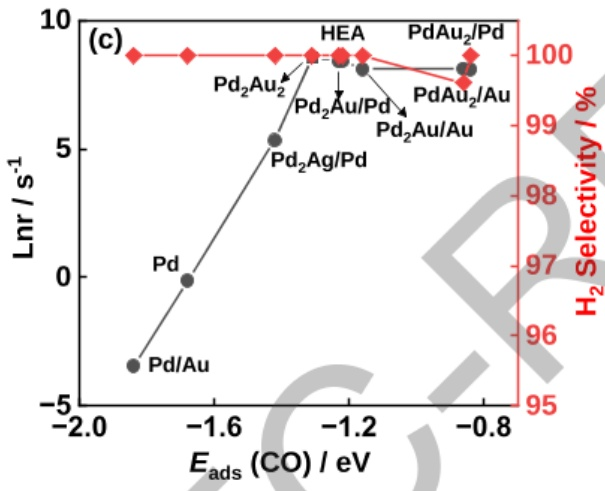

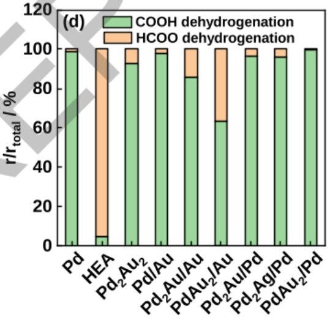

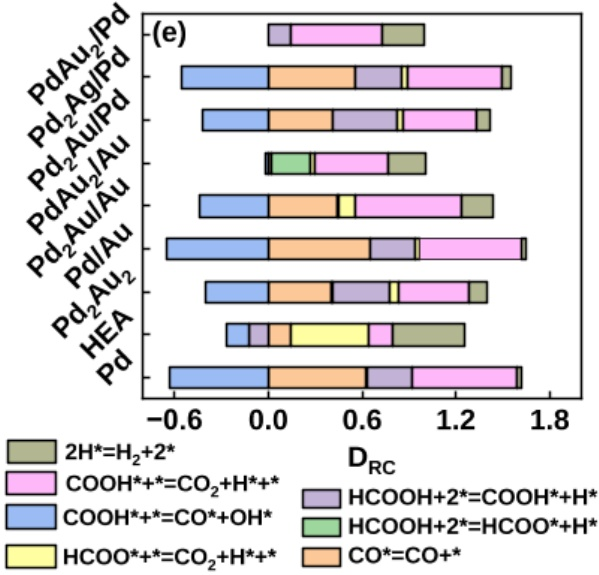

图 4. (a) DFT 计算与 SISSO 预测的 PdIrPtCuAu(111)表面上 CO 的顶位吸附能；(b)SISSO预测的所有 PdIrPtCuAu(111)表面全部位点上 CO的吸附能；400 K和 1 bar 下(c)甲酸分解速率(左)和H₂选择性(右)随CO吸附能的变化；(d)各甲酸分解路径速率与总速率之比(e)基元反应速率控制度

我们也利用恒电位第一性原理计算与微观动力学模拟，研究了传统的Sn基催化剂上CO₂电化学还原（CO₂ER）制甲酸的反应机理。结果表明，Sn(200)表面上CO₂ER通过弯曲的CO₂ v中间体进行，这与恒电荷方法的研究结果明显不同。基于该路径，模拟的CO₂ER/析氢反应极化曲线及法拉第效率均与实验结果高度吻合（图5）。研究发现，电位依赖的HCOOH/HCOO-向H₂的选择性转变源于 CO₂ v的稳定性随电位的变化，过稳定或过不稳定的 CO₂ v均会抑制甲酸生成。此外，增强HCOO吸附可显著提升Sn(200)表面甲酸的电流密度与选择性。

该工作强调了恒电位方法在精确描述电化学界面以阐明CO₂ER机制中的重要性(ACS Catal.2025,15, 8663)。后续我们将基于这些理解，识别控制反应活性的描述符，并通过机器学习方法筛选更优的高熵合金材料。

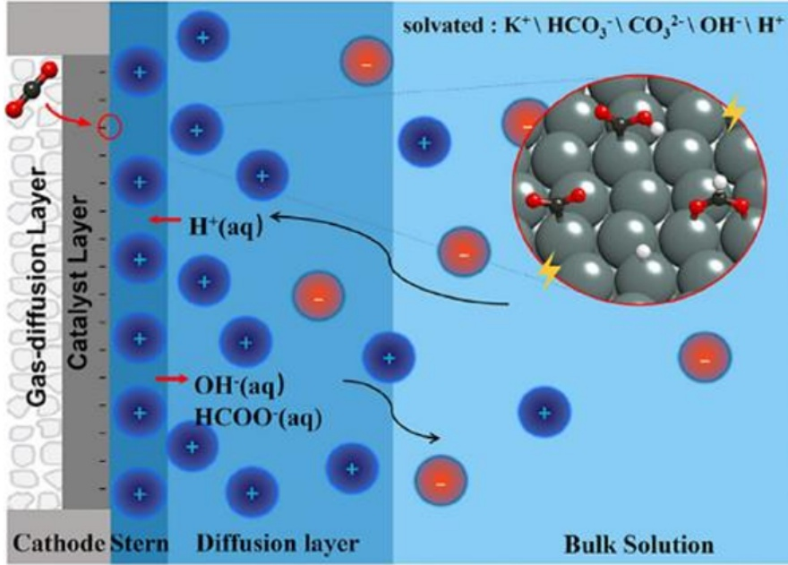

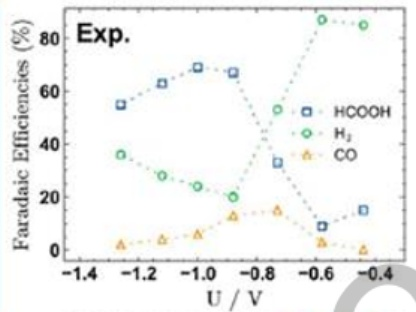

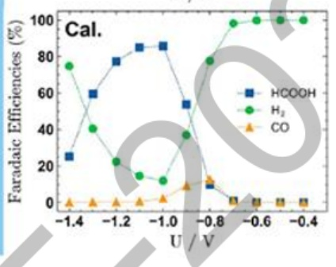

图5.左图:CO₂ER机理示意图；右图:实验观测（Exp.）与理论模拟（Cal.）的CO₂ER产物法拉第效率

## 3. 研究人员的合作与分工。

主要研究人员除了申请人之 还有孙科举教授、李超博士及五名硕士研究生，即孙晓兵、邹西啸、庞文玉 刘欣和陈烨康，负责相关的理论计算和分析。

申请人负责项目的总体运行，包括高熵合金材料体相及表面的DFT计算、材料稳定性和催化活性描述符确定及机器学习、高熵合金体相稳定性评估方法的发展等；孙科举负责力反转过渡态搜索方法和 YSU MKM 微观动力学模拟等程序的测试、优化、高熵合金材料体相及表面的DFT计算、机器学习势的调试等；李超、刘欣和陈烨康负责利用DFT计算和机器学习等方法研究各种高熵合金材料的稳定性和 CO电化学氧化等反应机理；孙晓兵、庞文玉负责利用 DFT 计算和恒电势方法研究 CO 电化学氧化等反应机理；邹西啸负责利用 YSU\_MKM程序研究反应的微观动力学。李微雪教授对本项目的顺利开展给出了很多有益的指导意见。

## 4. 国内外学术合作交流等情况。

## 4.1 国内外学术合作情况:

在项目执行期间，项目主要成员与中国科学技术大学李微雪教授、巴斯克大学Federico Calle-Vallejo研究员、中国科学院大连化学物理研究所邓德会研究员等在H₂O活化、CO氧化以及材料表面催化活性描述符研究等方面展开了积极合作。

## 4.2参加国内外学术会议情况:

(1) 第十届亚太催化大会，口头报告，A robust descriptor for CO oxidation on single metal cation-decorated TiO₂ catalysts, 2025. 8. 4-7，新加坡

(2) 第三届国际能源化学会议，邀请报告，Descriptor for CO oxidation on single-atom decorated TiO₂ catalysts, 2025. 6. 26-29， 深圳

(3) 第十二届全国催化剂制备科学与技术研讨会，口头报告，Sn 电极上CO₂ER选择性的微观动力学模拟，2024.10.11-14，杭州

(4) 中国化学会第 34 届学术年会，口头报告，A single descriptor for single metal cation decorated rutile TiO2 catalyst for CO oxidation, 2024.6. 15-18, 广州

(5) 中国化学会第二届全国二氧化碳资源化利用学术会议，邀请报告，Theoretical study of active site for reverse water gas shift on MoS2 catalyst, 2023.8.14-17，兰州

(6)中国化学会第 33 届学术年会，口头报告，Theoretical study of mechanism and active site for CO2 hydrogenation on MoS2 catalyst, 2023. 6. 17-20, 青岛

(7) 绿色化工前沿学术研讨会，大会报告，Theoretical studies in heterogeneous catalysis, 2023. 11.24-26，茂名

5. 存在的问题、建议及其他需要说明的情况。无

## （二）成果部分

## 1. 项目取得成果的总体情况。

本项目围绕电化学水气变换阳极高熵合金材料设计与机制解析展开研究，基本实现了预期目标，并在关键科学问题上取得突破性进展。通过结合DFT计算、机器学习及微观动力学模拟，建立了从体相稳定性到表面催化活性的系统性研究方法，为多元复杂催化剂体系的理论研究提供了完整范式。理论筛选出的高活性位点构型为实验合成提供了明确指导，发现的元素协同效应为高性能催化剂设计开辟了新思路。研究过程中形成的数据集、计算方法和理论认识，为后续多元合金催化材料研究奠定了坚实基础。这些成果已形成研究团队内部的知识体系，部分关键发现正在整理成学术论文，相关数据和方法也为后续研究提供了重要支撑，具有重要的科学价值与应用前景。

项目执行期间，共发表SCI论文22篇，包括项目主要成员苏海燕、孙科举和李超以（共同）第一作者或通讯在 ACS Catal.(2), J. Mater. Chem. A, Mater. Today Sustain.和J. Catal.等期刊发表论文16篇，详细内容如下表所示:

```
期刊                   影响因子        年份      论文总数       (共同）一作/通讯论文数
ACS Catal.            13.100   2022,2025    2               2
J. Mater. Chem. A      9.500     2025       1               1
J. Catal.              6.500     2025       1               1
Mater. Today Sustain.  7.900     2023       1               1
Appl. Surf. Sci.       6.900   2022-2026    7               7
ACS Appl. Energy Mater. 5.600    2025       1               1
Catal. Sci. Technol.   4.200   2023,2024    2
Langmuir               3.900     2024       1
Phys. Chem. Chem. Phys. 5.300  2024,2025    2
Nanoscale              5.100     2023       1
Inorg. Chem.           4.800   2022,2025    2
J. Phys-Condens. Mat.  2.300     2024
```

另外，还有3篇论文在审稿和准备中，详情如下:

1) Switch in formic acid decomposition pathways on Pd and PdAu catalysts from temperature-programmed surface reaction simulation, Y. Chen, K. J. Sun\*, X. Liu, K. Zheng, Z. Li, J. Li, H. Y. Su\*, ACS Catal. under review.

2) A simple and efficient approach for assessing bulk stability in medium- and high-entropy alloys, Y. Chen+, K. J. Sun+, X. Liu, Z. Wang, Y. Zhou, X. Li, M. Chen, Y. Wang, F. Calle-Vallejo\*, H. Y. Su\*, in preparation.

3) Machine learning potential-assisted design of high-entropy alloys for electrochemical water-gas shift reaction, X. Sun, W. Pang, H. Y. Su\*, X. Zou, X. Hao, Y. Xu, K. J. Sun\*, in preparation.


## 2. 项目成果转化及应用情况。

项目研究产生的基础理论与方法成果，主要面向学术界开放共享，部分成果已开始在相关研究领域产生积极影响，为后续应用转化奠定了坚实基础。在学术交流与知识传播方面，项目建立的高熵合金稳定性评估方法、表面偏析分析模型以及机器学习势加速反应筛选的工作流程，已通过课题组内部研讨、学术会议交流等形式，与国内外同行进行了初步分享。相关方法学思路受到同领域研究者的关注，为复杂催化体系的理论研究提供了可借鉴的技术路径。

在科研合作与平台建设方面，项目开发的高通量计算框架与数据集，已为本课题组后续相关研究项目提供了直接支持。研究中验证的机器学习势方法，正被应用于其他合金体系的催化反应模拟中，显示出良好的通用性与可靠性。这些方法工具的积累，有效提升了团队在计算催化领域的研究效率与创新能力。

## 3. 人才培养情况。

项目支持期间，培养五名硕士研究生，分别为:刘欣、陈烨康、孙晓兵、邹西啸和庞文玉。其中，孙晓兵、邹西啸和庞文玉已硕士毕业。具体的论文题目、导师姓名、答辩时间如下:

## （1）硕士研究生:孙晓兵

导师:孙科举

论文题目:Pt基催化剂催化水煤气变换反应机理的理论研究

答辩时间:2024年

## （2） 硕士研究生:邹西啸

导师:孙科举

论文题目:钌基催化剂上氨分解反应机理的理论研究

答辩时间:2024年

(3） 硕士研究生:庞文玉

导师:孙科举

论文题目:锡基催化剂电催化还原二氧化碳制甲酸的理论研究

答辩时间:2025年

另外，刘欣获得广东省硕士研究生学业奖学金一等奖和二等奖、校级“优秀学生骨干”和“优秀研究生干部”称号；陈烨康获得广东省硕士研究生学业奖学金二等奖。两名同学均获得2024广东省研究生学术论坛优秀会议墙报和优秀会议论文。

4. 其他需要说明的成果。

无

## 5. 项目成果科普性介绍或展示网站。

相关成果展示在网站 https://hxyny.dgut.edu.cn/info/1350/16333.htm。