项目批准号 U2141245申请代码 A0812归口管理部门收件日期


202509U2141245

# 国家自然科学基金

# 资助项目结题/成果报告

资助类别:联合基金项目

亚类说明:重点支持项目

附注说明:“叶企孙”科学基金

基于机器学习的碳纤维树脂基复合材料分层损伤定量化监测理论与方项目名称:法

负责人: 卿新林

BRID: 09911.00.06050

电子邮件: xinlinqing@xmu.edu.cn

电话: 18759287299

依托单位:厦门大学

联系人:肖泓芮

电话: 0592-2181680

直接费用:260.0000（万元）

执行年限: 2022.01-2025.12

填表日期:2025年12月12日

国家自然科学基金委员会制（2025年）

## 项目摘要

## 中文摘要:

针对现有复合材料结构损伤监测技术存在监测数据不够完备、传感机理不够清楚、诊断算法不够智能、难以提供鲁棒性好的定量化损伤监测结果等局限性，本项目以碳纤维树脂基复合材料分层损伤监测为研究对象，创建现代机器学习与先进多功能传感网络有机结合的复合材料分层损伤定量化监测理论与方法。研究内容包括:1）基于多功能传感网络的复合材料结构状态监测数据完备获取，2）多场耦合传感信号特征值与复合材料结构状态关联性深度解析，3）基于多源异构数据深度融合的复合材料分层损伤定量化智能识别，4）复合材料分层损伤监测理论与方法实验验证。重点解决三个关键科学问题:多场耦合传感信号与复合材料结构损伤演化过程的映射关系、多源异构监测大数据损伤信息的智能解析与表征原理、复合材料损伤模式深度识别与分层损伤定量化评估机制。本项目的研究成果对实现复合材料结构功能一体化、充分利用复合材料的优越性能具有重要的理论意义与应用价值。

## Abstract:

In view of the limitations of the existing composite structure damage monitoring technology, such as insufficient complete monitoring data, clear sensing mechanism, and intelligent diagnosis algorithm, and difficulty to provide robustness quantitative damage monitoring results, this project takes the delamination damage monitoring of carbon fiber reinforced resin matrix composites as the research object, and creates the theory and method of delamination damage quantitative monitoring for composite materials based on the combination of modern machine learning and advanced multifunctional sensor network. The main research contents include: 1) complete acquisition of composite structure condition monitoring data based on multifunctional sensor network, 2) deep analysis of the correlation between multi-field coupling sensor signal eigenvalues and composite structure state, 3) quantitative intelligent identification of composite delamination damage based on deep fusion of multi-source heterogeneous data, 4) verification of the theory and method of composite delamination damage monitoring developed. Three key scientific problems are solved: mapping relationship between multi-field coupled sensing signals and damage evolution process of composite structure, intelligent analysis and characterization principle of damage information of multi-source heterogeneous monitoring big data, composite damage pattern depth recognition and delamination damage quantitative evaluation mechanism. The research results of this project have important theoretical significance and application value for realizing the integration of composite structure and function, and making full use of the superior properties of composite materials.

关键词（用分号分开）:多场耦合测量；结构健康监测；复合材料；机器学习；分层损伤

Keywords (separated by;): Multi-field coupling measurement; Structural health monitoring; Composite; Machine learning; Delamination damage

and generative adversarial networks, enabling effective expansion of structural state data under multiple working conditions and damage modes; 2) systematic research on intelligent interpretation and extraction of damage features from ultrasonic guided wave signals, revealing the influence mechanism of variable temperature environments on guided wave features and proposing corresponding temperature compensation methods; 3) establishment of a damage probability model and diagnostic mechanism based on multi-path feature fusion, enhancing the robustness of damage identification; 4) development of a machine learning-driven diagnostic and quantitative assessment model for complex structural damage, achieving optimization and cross-structure, cross-condition reusability of the diagnostic model; and 5) construction of a high-fidelity digital model and proposal of a digital twin-driven theory and method for composite damage detection, providing a new technical pathway for damage detection and quantitative assessment of complex structures. The research outcomes of this project hold significant theoretical and practical value for realizing the integration of structure and function in composite materials and fully utilizing their superior performance.

关键词（用分号分开）:多场耦合测量；结构健康监测； 复合材料；机器学习；分层损伤

Keywords (separated by;): Multi-field coupling measurement; Structural health monitoring; Composite structure; Machine learning; Delamination damage

## 正文

## （一）结题部分

## 1. 研究计划执行情况概述

## 1.1 按计划执行情况

本项目围绕主题“基于机器学习的碳纤维树脂基复合材料分层损伤定量化监测理论与方法”开展研究，依据申请书及计划书所制定的研究计划正常执行，完成全部研究内容。具体执行情况如表1所示。

表1 项目研究内容执行情况

```
       研究内容       2021 2022 2023 2024 2025
  基于机器学习的复合材料损伤定
1  量化监测方法现状调研并提出
       解决方案
2  基于压电传感网络的结构状态
      监测数据获取
3 基于实验-仿真-生成对抗网络的
  结构状态监测数据完备获取方法
4 超声导波信号损伤特征值的智能
       解析与提取
  变温度环境对传感信号特征值的
5  影响机制及传感信号温度补偿
        方法
6 基于多路径损伤特征融合的损伤
    概率建模及损伤诊断机制
7 基于梯度特征挖掘和支持向量机
   的多层复杂结构损伤诊断方法
8 基于神经网络的复杂结构损伤诊
   断建模及损伤定量化评估机制
  基于神经网络的复杂结构损伤诊
  断建模及损伤定量化评估机制
       优化研究
  基于迁移学习的结构健康监测诊
10 断知识迁移复用及损伤定量化
       评估机制
11 基于Abaqus和实测导波数据联合
   优化的高保真数字模型构建
12 数字孪生驱动的复合材料损伤诊
    断理论与损伤诊断机制
13  项目中期总结及结题总结
```

## 1.2 按计划执行情况

项目研究达到预期研究目标，在项目执行期内，未对原研究目标、研究内容

进行调整。项目取得的主要研究成果如下:

## （1）在基础理论研究方面:

系统调研了机器学习在结构健康监测领域的研究现状，针对监测数据不完备、环境适应性不足及损伤定量表征能力有限等瓶颈，提出了融合结构健康监测领域知识与机器学习的总体解决思路；构建了基于压电传感器网络的结构状态监测数据获取方法，提出了实验-有限元仿真-生成对抗网络相结合的数据完备获取方法，实现了多工况、多损伤模式结构状态数据的有效扩充；系统开展了超声导波信号损伤特征的智能解析与提取研究，揭示了变温度环境对导波特征值的影响机理，并提出了相应的温度补偿方法；基于多路径特征融合建立了损伤概率模型与诊断机制，提升了损伤识别的鲁棒性；构建了机器学习驱动的复杂结构损伤诊断与定量化评估模型，结合支持向量机、神经网络及迁移学习方法，实现了诊断模型的优化与跨结构、跨工况复用；融合有限元仿真与实测导波数据，建立了高保真数字模型，提出了数字孪生驱动的复合材料损伤诊断理论与方法，为复杂结构损伤的诊断与定量评估提供了新的技术路径

相关研究共发表 SCI/EI/核心期刊收录论文 56 篇，其中本领域顶级期刊MSSP、IJMS、SHM、CST等 SCI论文50篇、国内核心期刊论文6篇。

## (2) 在技术发展及应用方面

本项目属于应用基础研究，除上述理论成果外，项目发展了基于智能层的混杂多功能传感网络及其与复合材料结构的集成技术、复合材料结构高保真超声导波模拟技术、基于光纤传感与超声导波混杂传感的服役环境（温度与载荷）补偿技术、以及多功能传感网络与多种机器学习方法融合的复合材料结构损伤定量化评估技术等。申请专利20项，其中已授权9项，实质审查11项。部分成果已经用于航空航天装备复合材料结构损伤监测、风力发电机组复合材料叶片损伤监测等工程。

## （3）在团队建设及人才培养方面

本项目培养博士生10人、硕士生15人，培养青年科技骨干4人。

## （4）在国际合作交流方面

开展了与美国斯坦福大学、西班牙马德里理工大学、国立釜山大学、香港理工大学等国际高水平航空结构健康监测研究机构的合作，项目执行期间共邀请上述机构的十余位著名专家来访交流；主办三次国际国内重要会议，包括:2022年

11月在厦门主办的第三届飞行器健康管理技术国际研讨会，2023年10月在厦门主办的重大装备结构健康监测中的实验力学方法研讨会，以及2025年11月在厦门举办的第四届飞行器健康管理技术国际高端论坛暨青年科学家论坛。此外，项目负责人在2025年9月的斯坦福大学结构健康监测国际研讨会（IWSHM）上组织 了 Machine Learning and Artificial Intelligence Enabled Structural Health Monitoring for Composite Structures 专场学术会议。作为大会联合主席/ 术委员会成员等参与组织大型国际学术会议十余次，作大会报告/特邀报告等显著提高了我国在无损检测和健康监测领域内的国际影响力。

## 2. 研究工作主要进展、结果和影响

## 2.1 主要研究内容

## 2.1.1 基于结构健康监测领域知识的结构状态监测数据完备获取

结构健康监测系统的有效性依赖于大规模、高质量监测数据的支持，然而在实际工程中，完整获取覆盖各类损伤模式、环境条件和载荷工况的实测数据往往成本高昂且周期漫长。为此，本项目将分别从实验、仿真和生成对抗等方面开展结构状态数据的获取，在此基础上深入研究基于结构健康监测领域知识驱动的结构状态监测数据完备获取方法。具体研究内容包括:（1）基于压电传感网络的结构状态监测数据获取； （2）基于实验-仿真-生成对抗网络的结构状态监测数据完备获取方法。

## 2.1.2 超声导波信号损伤特征值的智能解析与损伤诊断机制

针对复杂复合材料结构健康监测中，超声导波损伤特征值的有效提取与损伤的可靠诊断受制于结构几何复杂性和服役环境变化影响的核心难题，以复合材料结构分层损伤为典型研究对象，研究复杂结构形式对超声导波信号损伤特征值的影响机制，在此基础上进一步系统探索损伤特征值的智能解析方法与损伤诊断机制，具体研究内容包括:（1）超声导波信号损伤特征值的智能解析与提取；（2）变温度环境对传感信号特征值的影响机制及传感信号温度补偿方法；（3）基于多路径损伤特征融合的损伤概率建模及损伤诊断机制。

## 2.1.3 机器学习驱动的复杂结构损伤诊断模型构建及损伤定量化评估机制

尽管基于概率建模的方法在复合材料的损伤诊断中已展现出良好的性能，但由于复合材料的固有特性和复杂性(如材料各向异性、变厚度结构、加强筋结构等)，导波在这些结构中的传播非常复杂。由于精准的传感器布设难以保证，鲁棒的损伤指数难以提取，精确的波速难以获得，再加上环境噪声的干扰，大多数方法应用于实际复合材料结构中时，在有效性和准确性等方面均具有较大的挑战。因此，有必要发展对物理知识依赖较低、适应性更强的智能诊断方法。因此，本项目结合结构健康监测领域知识和机器学习方法建立复杂结构的损伤诊断模型，推动损伤诊断由依赖物理建模向数据智能驱动转型。具体研究内容包括 基于梯度特征挖掘和支持向量机的多层复杂结构损伤诊断方法；（2）基于神经网络的复杂结构损伤诊断建模及损伤定量化评估机制；（3）基于神经网络的复杂结构损伤诊断建模及损伤定量化评估机制优化研究；（4）基于迁移学习的结构健康监测诊断知识迁移复用及损伤定量化评估机制。

## 2.1.4 基于有限元仿真-机器学习融合的复合材料损伤诊断数字孪生理论与方法

前述基于机器学习的复杂结构损伤诊断模型可以有效实现损伤的智能识别，而面对复合材料结构健康监测中损伤机理复杂、数据有限和模型不完备等挑战，需要进一步发展更完备的监测与预测体系。为此，通过融合仿真数据与实验数据，构建具备物理一致性和数据适应性的结构孪生镜像，不仅能实时映射结构状态，还可推演损伤演化趋势，从而实现从“状态监测”向“未来预测”的跨越，为复合材料结构的智能诊断与预测性维护提供系统性支撑。为此，本项目基于有限元仿真和机器学习方法还研究了复合材料损伤诊断数字孪生理论与方法。具体研究内容包括:（1）面向数字孪生的复合材料导波数字模型构建方法；（2）数字孪生驱动的复合材料损伤诊断机理与方法。

## 2.2 取得的主要研究进展、重要结果、关键数据等及其科学意义或应用前景

## 2.2.1 基于机器学习的复合材料损伤定量化监测方法现状调研并提出解决方案

先进复合材料由于比强度和刚度高、机械性能可设计、易于整体成型等优点，在减轻结构重量、提高效率、降低运行成本等方面得到了广泛应用。然而，由于复合材料结构自身的特点以及载荷和使用环境的复杂性，对其完整性和耐久性评估非常困难。本项目首先系统的调研了常用的复合材料结构损伤监测技术，详细的总结了基于机器学习的复合材料结构损伤监测技术的研究进展及应用，图1给出了基于机器学习的复合材料损伤诊断方法的具体实施范式。针对机器学习在结构健康监测应用中面临的监测数据不足、传感机制不完善、诊断算法不够智能等量、完备性与一致性。为系统性地获取全面、高质量的原始监测数据，基于压申传感网络的数据采集方法构成了整个诊断体系的物理基础与数据源头。

项目基于申请人与美国斯坦福大学Fu-Kuo Chang 教授合作前期发展的智能层技术（SMARTLayer）理念（如图2所示），设计并发展了一种以柔性载体薄膜为基础的多模式感知层。该感知层不仅作为压电传感器（PZT）网络的物理搭载平台，更通过微型化、阵列化与集成化设计，实现了传感器与结构间的精准定位与稳定耦合，形成了具备多模态感知能力的嵌入式网络。其核心优势在于能够与复合材料结构实现“零干涉”集成—即在不显著改变原有结构力学性能与几何形态的前提下，将传感功能无缝融入被监测结构中。类似于SMARTLayer，该多模式感知层具备高度灵活的布设方式:既可以贴附于复合材料结构表面，也可在制造过程中直接嵌入结构内部，形成一体化的内置传感网络。基于该网络，系统既可完成主动监测中的超声导波信号采集，也能实现被动监测中的应力波信号捕获，从而支持结构状态的感知与诊断。

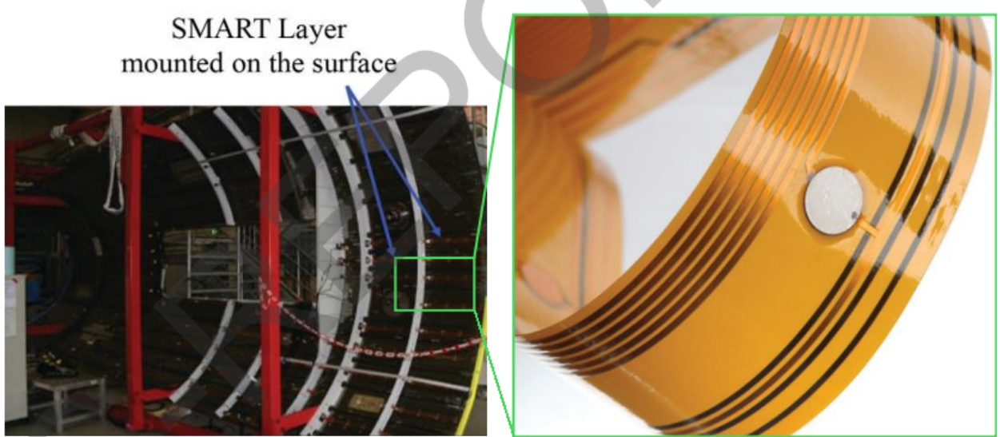

图2 提出的以柔性载体薄膜为基底的多模式感知层

## (2）基于实验-仿真-生成对抗网络的结构状态监测数据完备获取方法

由于复合材料结构服役环境复杂、损伤模式多样，结构健康监测技术难以获得完备的实测损伤传感数据，复合材料损伤样本的不完备会严重制约深度诊断模型的泛化学习能力，影响损伤检测的准确率。本项目提出了一种基于实验-仿真-生成对抗网络的复合材料损伤状态参数完备获取方法，如图3所示。具体而言，项目利用压电传感网络和有限元仿真技术分别获取被监测结构的导波数据，考虑到基于超声导波获取的复合材料状态参数样本信号包含较多冗余的信息，且直接生成超声导波信号的运算量较大，因此首先对超声导波进行特征提取，综合多路径多损伤因子，构建复合材料状态参数初始数据集并用于生成对抗网络训练。利用深度卷积生成对抗网络（DCGAN）以及Wasserstein生成对抗网络（WGAN）

(a) Measured samples (incomplete)

等改进的生成对抗网络算法实现了复合材料状态参数特征数据的生成，并采用FID、MMD等生成对抗网络评估指标对构建的生成对抗网络进行模型评估，同时通过主成分分析和t-SNE等特征降维方法对生成数据进行降维，直观了解生成数据的分布情况。相比于初始数据集，生成数据集表现更加稠密，初步证实了生成数据的可靠性。图4展示了在不完备数据集和完备数据集下，采用随机森林算法实现复合材料结构损伤定位的结果。结果表明在引入生成对抗网络生成数据之后的机器学习方法对复合材料损伤的定位以及定量正确率有着明显的提升，进步证实了所提方法的有效性和准确性。证明生成对抗网络方法可以实现对复合材料结构状态参数的完备获取，能够生成可靠的复合材料状态参数特征数据，并有助于实现复合材料结构的损伤定位及定量。

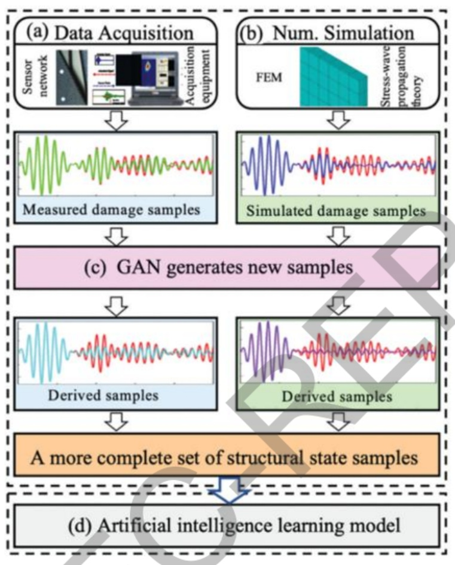

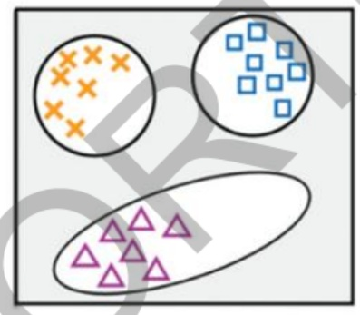

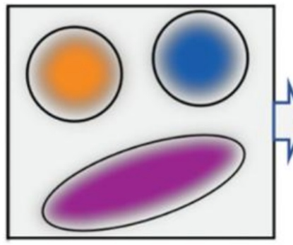

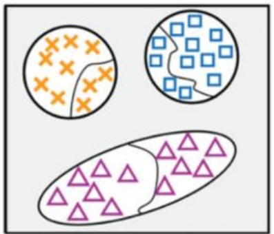

(c) Sample distribution after GAN

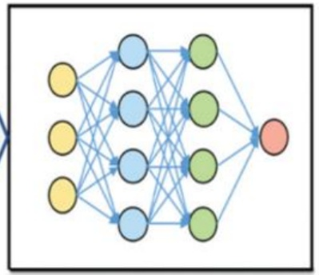

(d) Artificial intelligence learning model

图3提出的基于实验-仿真-生成对抗网络的结构状态监测数据完备获取方法

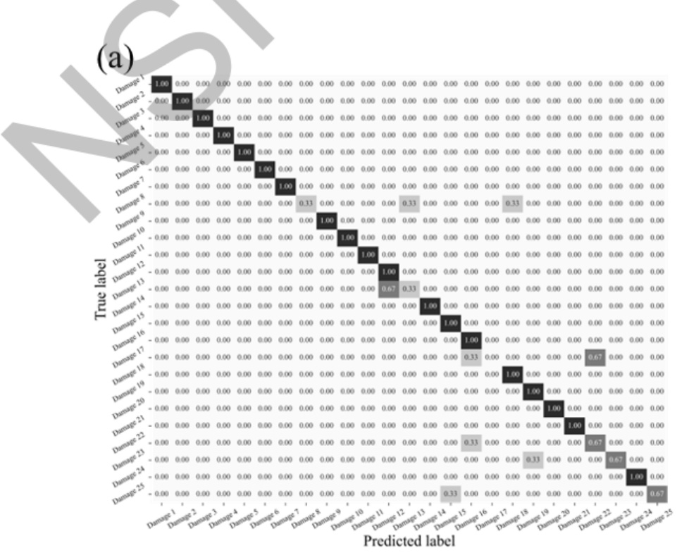

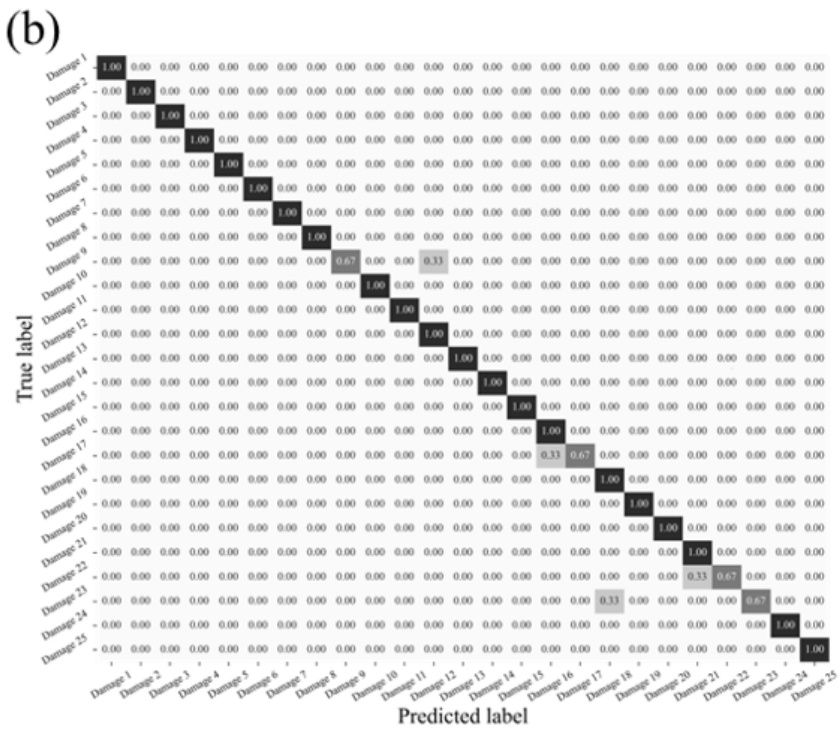

图4不完备数据和完备数据下模型的损伤诊断结果:（a）完备数据；（b）不完备数据

## 2.2.3 超声导波信号损伤特征值的智能解析与损伤诊断机制

在超声导波损伤监测中，特征值是从导波信号中提取的、能够表征结构状态的关键信息。不同特征值对损伤的敏感性与响应机理各不相同，例如能量衰减对微裂纹更为敏感，而波速变化更能反映材料整体性能退化。深刻解析这些特征值的物理意义及其与损伤的关联规律，是发展精准、可靠损伤诊断方法的前提。为此，本项目对超声导波信号的损伤特征值进行智能解析与提取，并探究变温度环境对传感信号特征值的影响机理，进而建立有效的温度补偿方法。在此基础上通过融合多路径的损伤特征，构建损伤概率模型，实现损伤的准确诊断。

## （1）超声导波信号损伤特征值的智能解析与提取

项目首先对国内外超声导波信号损伤特征值的解析与提取方法进行了全面、系统的梳理与归纳。目前，主流的特征提取技术主要围绕导波信号的时域、频域和时频域三个方面展开，旨在从复杂的导波响应中挖掘出与结构损伤高度相关的损伤指标。在时域分析中，最直接的特征包括信号幅值的变化、能量的衰减以及信号飞行时间（TOF）的偏移，这些变化直接反映了波在传播过程中因遇到缺陷而发生的反射、散射和模态转换。进 步地，可以计算信号衰减系数，量化能量随传播距离的损失率，对腐蚀等分布式损伤尤为敏感。频域分析则通过傅里叶变换将信号转换到频率域，重点考察主频幅值的降低和主频频率的漂移。损伤往往会导致信号在特定频带上的能量重新分布，从而引起频谱特性的改变。然而，傅里叶变换无法保留时间信息，难以处理非平稳信号。为此，时频域分析方法应运而生，成为处理导波信号的核心手段。连续小波变换（CWT）能提供信号在时间和频率上的联合分布信息，从中提取的时频能量分布图、小波系数幅值、瞬时频率等参数， 能够精确定位损伤引起的微弱瞬态特征。希尔伯特变换则常用于提取信号的包络和瞬时相位，有助于更精确地识别信号到达时间。经验模态分解（EMD）等自适应信号分解方法，可将复杂信号分解为一系列本征模态函数(IMF)，进而从特定IMF中提取与损伤相关的特征分量。此外，时间反演技术利用波动方程的时间反演不变性，通过数值或物理方法实现信号的重聚焦，能够显著增强损伤散射信号，其聚焦质量（如聚焦峰幅值、宽度）本身即可作为有效的损伤特征。而相关矩等统计矩方法则从信号的概率分布角度，提取高阶统计特征。综上所述，损伤特征值的提取是一个多维度、多方法融合的过程。从基础的时频参数到高级的统计与反演特征，这些方法共同构成了一个丰富的特征库，为后续基于机器学习的损伤识别与定量评估提供了坚实的数据基础。

部分典型的损伤指数如表2所示，表中A1和A2分别表示时域基线信号和损伤信号的幅值，fi(t)和f2(t)分别为时域基线信号和损伤信号，V(t)为时间反转后的信号。通过理论分析和实验，研究了10余种导波信号特征损伤特征值的提取方法，在考察了这些方法对结构损伤的表征性能基础上，择优选定了部分损伤特征实现损伤的诊断。

表2 典型的损伤指数

```
                    损伤指数                       损伤指数描述
 DI = (A - A2)                                峰-峰幅值
 DI =(A-A2)×(TF1-TF₂)                         结合TOF的幅值
 DIRMs = √(1/ T)∫[ f (t)]2dt                  均方根
DIRMSD =√∫[ f2(t)- f1(t)t [ f1(t)tt           均方根偏差
 DI =100×(A2-A)/A2                            幅值衰减
 DI=(∫|f1(t)|2dt)/(∫|f2(t)|2dt)               信号能量
 D1 =(∫|f1(t)-f2(t)|2dt)/(∫|f{2(t)|2dt)       信号能量
DI=(∫|f1(t)|2dt-∫l|f2(t)|2dt)/1(∫|f2(t) dt    信号能量
                      √∫(f1(t)- f1)2dt∫(f2(t)- F2})2dt| 皮尔逊相关系数
D1 =1-√∫(f1(t)- f1)(f2(t)- f2)dt/
DI =1-√(∫1(t). ()dt) (∫(t)2dt)(∫√ (t)²2dt)    结合时间反转
 DI = In A / A{2                              信号衰减
 DI =√∑((t)- f (t)2/∑(ft())²                  时间反转
 DI = √(∑ t1tf2)) min (√∑f,√∑f2)              同时考虑波形形
       f       (√∑ f,√Σf2)                    状及幅值变换
             max
     ∑(C2(k)-c1(k))2 /∑(c1(k))2               时频域特征
       0()d-()(c)d
DI=                                           n阶相关矩
           τⁿdτ∫
              ∫r=0 |rt(t)t(t)()|dτ
```

## （2）变温度环境对传感信号特征值的影响机制及传感信号温度补偿方法

超声导波对温度变化极为敏感，温度变化会引发导波信号相位偏移和振幅变化，进而导致损伤定位与量化误差，甚至造成结构损伤的误检。因此，深入研究温度对超声导波的影响机制，开发有效的温度补偿方法，实现高精度信号温度补偿，对于提升结构损伤检测的准确性至关重要。

项目针对导波信号幅值和相位的温度依赖性展开系统研究，通过多温度场景

## （3）基于多路径损伤特征融合的损伤概率建模及损伤诊断机制

在结构健康监测中，单一传感路径或单一损伤特征往往难以在复杂环境与噪声干扰下实现可靠诊断。为提升监测系统的稳健性与准确性，基于多路径损伤特征融合的损伤概率建模及损伤诊断机制应运而生。该方法通过系统融合不同传感路径中提取的多种损伤敏感特征，构建基于概率统计的损伤评估模型，将多源信息转化为统一的损伤存在概率分布图，从而显著提升损伤识别与定位的精度与可靠性。

项目在基于压电传感网络中应用最广泛的椭圆概率损伤成像方法和延迟叠加成像方法的基础上，结合先进的信号处理方法和数据融合方法，发展了多种改进的椭圆概率成像方法和改进的延迟叠加成像方法，提出了基于优化损伤指数、正交匹配追踪的椭圆概率损伤成像方法和基于正交匹配追踪、连续隐马尔可夫、资源约束、改进Hausdorff和自编码器的延时叠加成像方法。此外，还提出一种基于损伤散射波差且完全不依赖损伤概率成像和延迟叠加成像的损伤诊断方法。

## A. 基于优化损伤指数、正交匹配追踪的椭圆概率损伤成像方法

椭圆概率成像的基本原理是利用超声导波在结构中传播的特性进行损伤定位。其核心思想是:对于任意一个激励-传感器对，信号发生异常所暗示的损伤点，必然位于以该两点为焦点的椭圆轨迹上（因为波的传播时间恒定）。通过综合所有传感器对的监测数据，将每条椭圆轨迹进行概率叠加，最终在结构平面上形成一幅损伤概率分布图。图中亮度越高的区域，表示被多条椭圆轨迹共同穿过的概率越大，即损伤最可能存在的区域。

对风力发电机叶片在复杂工况下多损伤同步识别与精确定位困难的问题，项目提出 一种基于正交匹配追踪和改进概率损伤成像（OMP-PDI）算法的损伤监测与定位方法，该方法通过融合多特征健康指标与优化损伤成像机制，显著提升了传统概率成像方法对叶片典型损伤的识别精度与定位能力。图8展示了基于正交匹配追踪和改进概率损伤成像算法（OMP-PDI）的损伤监测与定位方法流程图。首先为全面表征叶片结构健康状态，综合了三种典型特征:基于散射信号的散射信号指标（SST），反映信号幅值变化；基于信号能量差异的信号差异指标（SDT），表征能量衰减；以及基于排列熵（PE）的信号复杂度指标，用于捕捉非线性与非平稳信号中的损伤特征。基于对上述特征值的理解，提出了一种基于超声导波的融合健康指标（UBI)。该指标通过对三者进行加权融合，构建UBI指

标，可表示为:


式中，∂sST、∂sDT和∂pe分别为权重系数，可根据实际信号特性进行动态调整，从而在不同损伤模式下均能保持较高的敏感性与鲁棒性。考虑到传统PDI算法在损伤定位中易受噪声于扰与波包重叠的影响，从而导致成像模糊与定位偏差的问题。项目引入正交匹配追踪（OMP）方法对超声导波信号进行稀疏重构，通过构建与激励信号特性匹配的汉宁窗原子字典，迭代提取直达波成分并准确获取波达时间（ToF）。在此基础上，提出路径自适应的椭圆加权分布函数， 可表示为:

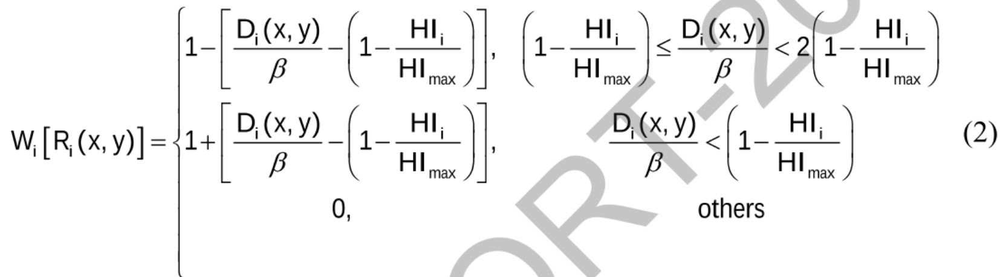

通过 OMP 重构优化 ToF 计算，并结合 UBI 指标动态调整各路径的权重分布，显著提升了成像算法对多损伤数量、位置与尺寸特征的识别能力与空间分辨率。为了验证基于超声导波和多指标融合成像的风力发电机叶片损伤监测与定位方法的准确性，项目在风力发电机叶片中对方法进行了验证，详细实验设置如图9所示。传统概率成像模型和提出的基于正交匹配追踪和改进概率损伤成像方法的损伤成像对比结果如图10所示，可以看到提出的 MPD-PDI 算法提供了更清晰的图像，显著减少了伪影，从而显著提高了损伤定位的质量，证明了所提方法的准确性和有效性。

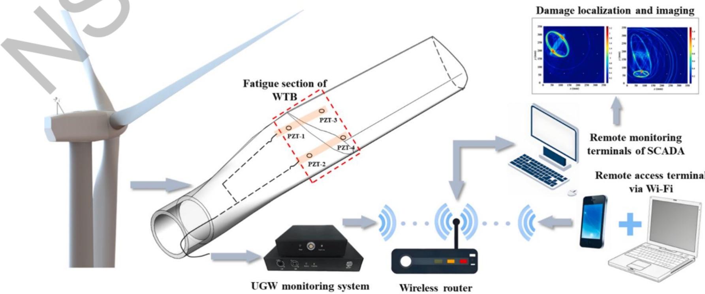

图8 基于超声导波的风力发电机叶片损伤诊断总体流程

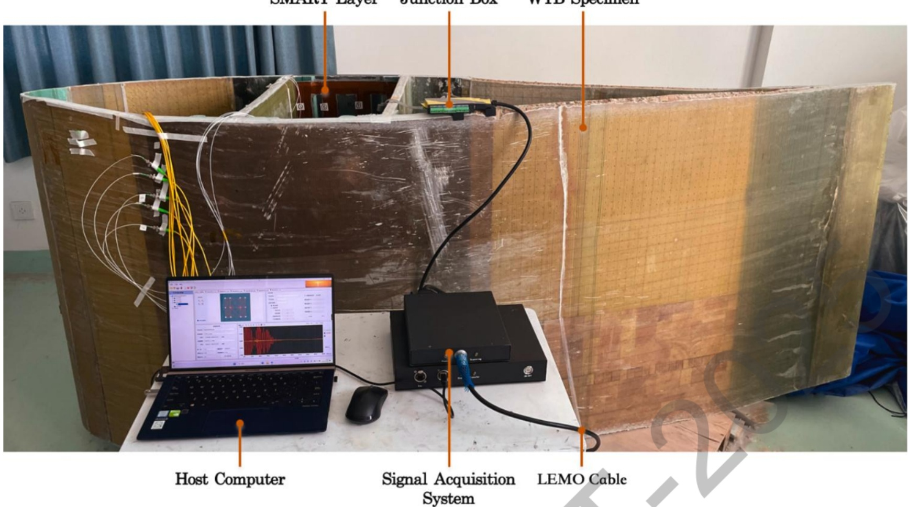

图9基于超声导波技术的风力发电机叶片结构健康监测系统实验装置

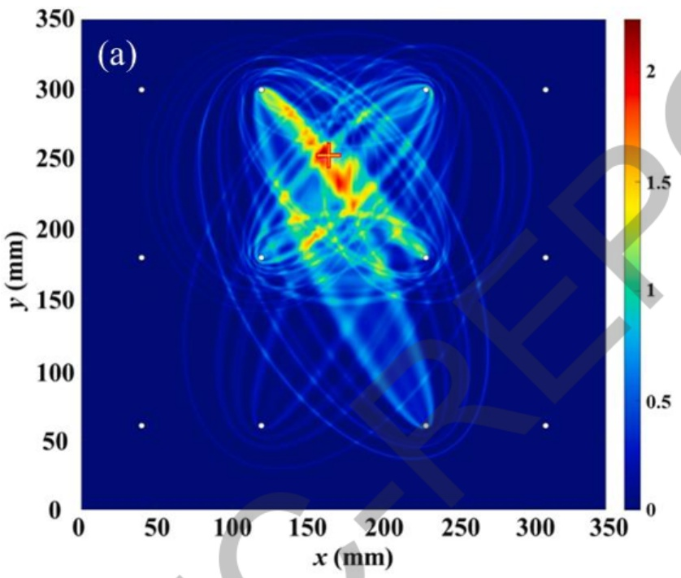

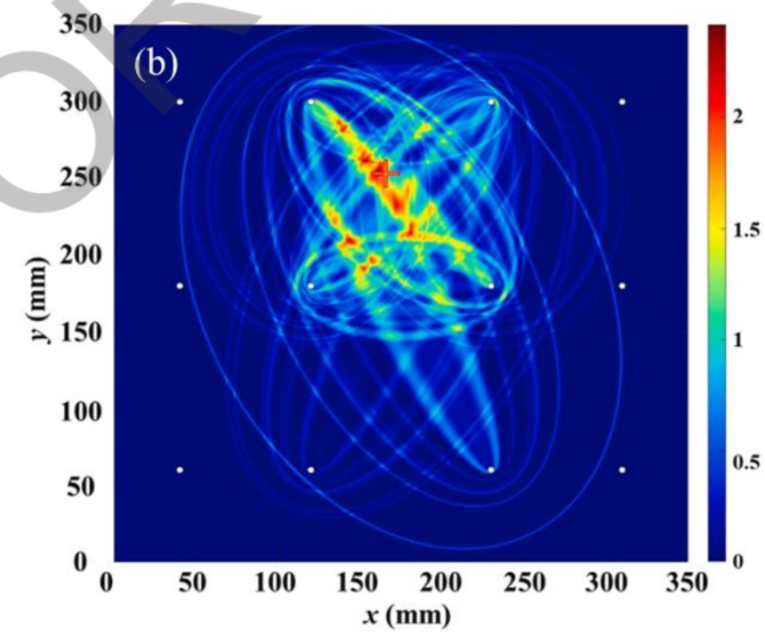

图10脱粘损伤成像与定位结果:（a）提出的MPD-PDI算法；（b）传统PDI算法

上述研究的基础上，针对复合材料结构健康监测中多损伤特征难以精确识别与成像、概率损伤成像算法分辨率不足等问题，进一步提出一种基于改进损伤形状因子与频域信号差异系数融合的修正概率损伤成像方法（MPDI)，其整体技术流程如图11所示。首先，为有效表征复杂损伤状态并提升特征稳定性，选用从频域提取的信号差异系数作为核心损伤指数。针对传统概率损伤成像算法中形状因子经验取值导致损伤区域估计不准的问题，提出一种自适应损伤形状因子优化方法。通过分析损伤对超声导波传播路径的实际影响范围，计算各损伤影响路径对应的形状因子β，替代原算法中全局固定的经验值。结合上述的改进，建立了一种修正概率损伤成像模型。该模型以频域融合SDC损伤指数为输入，结合修正的损伤形状因子β，重构出损伤在监测区域内的概率分布图像。图像中概率峰值对应损伤中心位置，概率分布形态反映损伤的尺寸与影响范围，从而实现对多损伤数量、位置与尺寸信息的同步可视化识别。为验证所提方法的有效性，项目基于碳纤维/环氧树脂复合材料曲面试件开展了系统的实验验证，图12展示了详细的实验设置，图13展示了传统概率损伤成像方法和改进的概率损伤成像方法在多损伤下的成像结果，可以看到改进的概率损伤成像方法可以准确的定位多损伤的位置，证明了该方法在复合材料结构多损伤识别中的有效性与工程适用性

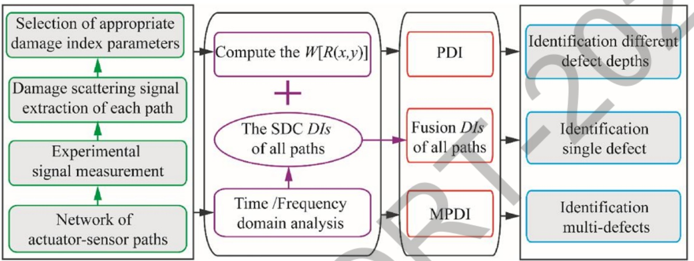

图11 基于改进损伤形状因子与频域信号差异系数融合的修正概率损伤成像方法流程

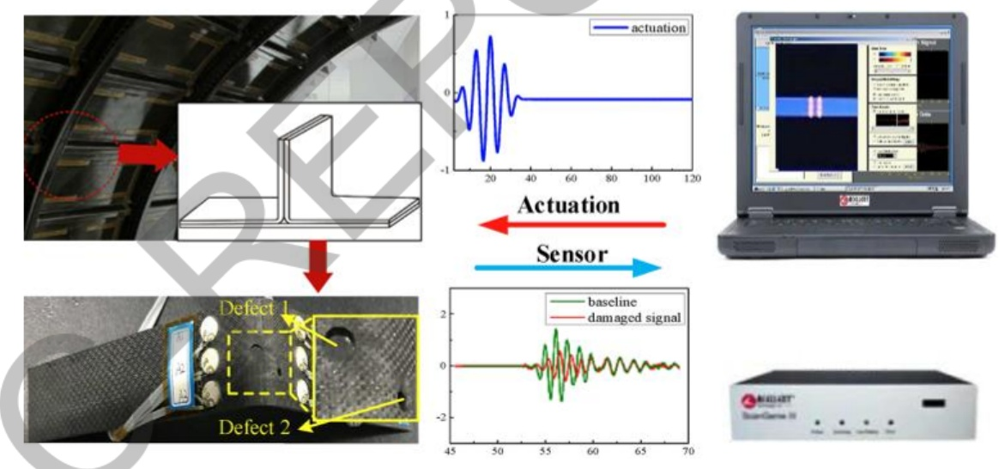

图12 弯曲复合材料结构的实验设置

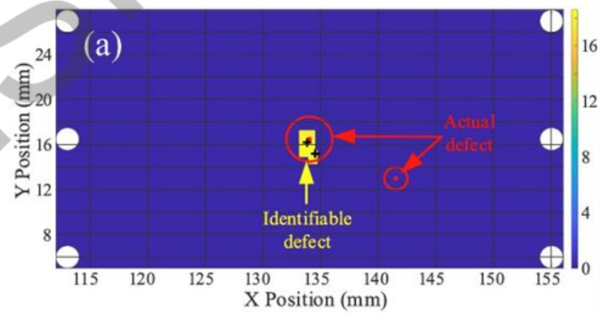

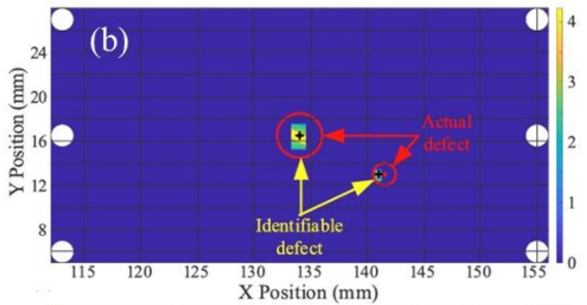

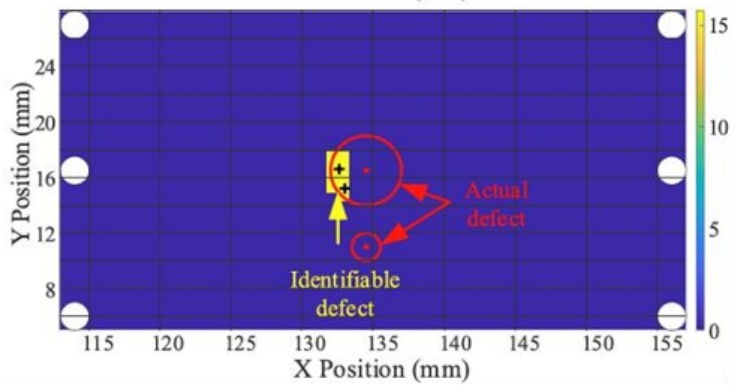

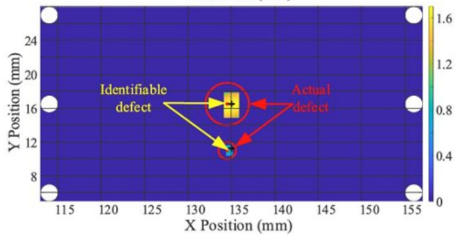

图13不同场景的多损伤诊断结果:（a）传统概率损伤成像方法；（b）提出的MPDI方法

上述方法除了可以有效监测结构服役过程中产生的损伤外，还适用于复合材料真空辅助树脂灌注成型过程中形成的损伤。针对复合材料真空辅助树脂灌注成型过程中产生的干斑缺陷难以实时、精确定位的问题，项目提出了一种基于非侵入式与侵入式压电传感器网络的干斑损伤监测方法，如图14所示。首先，采用斯坦福大学和厦门大学提出的 SMART Layer分别构建非侵入式与嵌入式压电传感器网络采集导波信号。在此基础上，通过分析Ao模式与 So模式对干斑的敏感特性，提出了一种融合信号能量变化与相关系数的融合损伤指数，并结合改进的概率诊断成像算法，构建干斑定位的概率分布图像，实现干斑位置的精确识别。为进一步提升定位精度与可靠性，创新性地引入嵌入式传感器网络与非侵入式网络协同监测机制，通过双网络数据的融合有效抑制单一监测方式的局限性，增强对隐蔽性干斑的检测能力。此外，提出一种通过切割引流槽改变树脂流动路径的自然形成干斑方法，真实模拟实际工艺中干斑缺陷的产生过程，提高实验验证的可靠性。

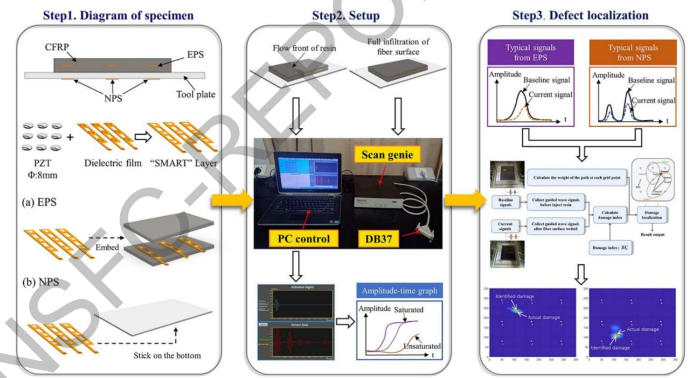

图14 基于非侵入式与嵌入式压电传感器网络的干斑损伤监测流程

项目通过多组不同位置干斑的定位实验验证了所提方法的有效性，图15展示了实验设置与传感器布置情况，图16为不同位置干斑的成像定位结果与实际干斑位置的对比情况。结果表明，该方法无需复杂传感器制备过程，不涉及绝缘问题，即可实现对树脂流动前沿和干斑缺陷位置进行有效监测，定位相对距离误差小于5%，验证了方法在复合材料制造质量监控中的实用性与经济性。