项目批准号 22209042申请代码 B0908归口管理部门收件日期


20251122209042

# 国家自然科学基金

# 资助项目结题/成果报告

资助类别:青年科学基金项目（C类）[原青年科学基金项目]

亚类说明:

附注说明:

项目名称:机器学习与高通量筛选辅助的潜在高性能有机太阳能电池材料设计

负责人:赵智雯

BRID: 08805.00.28950

电子邮件:zhaozw@hbuas.edu.cn

电话: 15807279726

依托单位: 湖北文理学院

联系人:杨香玲

电话: 0710-3590964

资助经费:30.0000（万元）

执行年限: 2023.01-2025.12

填表日期:2026年01月27日

国家自然科学基金委员会制（2025年）

## 项目摘要

## 中文摘要:

构建新型绿色低碳能源体系是实现碳中和的重要方法，但仅靠实验研究需要耗费大量的人力物力资源，这使得新能源体系研究进展缓慢。而机器学习（ML）可以高效辅助新型高性能材料的开发与应用。本项目根据申请者长期在有机太阳能电池（OSC）领域的研究基础，以全小分子基OSC为例，在获得可靠的数据库基础上综合运用量子化学计算、ML以及高通量筛选等技术构建定量的结构-性质关系模型；对比研究描述符种类、数据集划分方法、交叉验证方法以及ML算法在性能预测方面的表现；评估ML方法预测全新分子的能力，结果将展示ML方法如何在预测未知材料时提高准确性，这可拓展到其他材料科学领域；筛选潜在的优异给体/非富勒烯受体对，并优化其实验参数，为实验工作进一步提高OSC性能提供基础数据；从而对有机光电功能材料的分子设计和实验优化提供理论指导

## Abstract:

Constructing green and low-carbon energy systems is crucial to achieve carbon neutrality. However, the traditional experimental process requires a lot of resources, which makes the research progress of new energy materials systems slow. Machine learning (ML) can effectively assist the discovery and application of new high-performance materials. This project considers all-small-molecule-based organic solar cells (OSCs) as a case study. On the basis of reliable data sets, various theoretical methods, such as quantum chemistry, ML, and high-throughput screening, are used to construct quantitative structure-property relationship models. Different types of descriptors, dataset partitioning methods, ML algorithms and cross-validation methods are considered in the performance prediction. Moreover, the discussions about whether ML methods have the power to predict completely new classes of compounds (extrapolating) will show how ML approach increases the accuracy when predicting unknown materials, which can be used across materials science. Also, screening donor/NFA pairs candidates and optimizing their experimental conditions will provide guidelines for further experimental work to facilitate the development of OSCs. These works will guide novel molecule screening and experimental optimization in materials science, especially for organic optoelectronic materials.

关键词（用分号分开）:能源材料数据与设计；有机太阳能电池；构效关系；

高通量筛选；机器学习

Keywords (separated by;): Energy materials data and design; organic solar cell; quantitative structure-property relationship; high-throughput screening; machine learning

## 结题摘要

中文摘要（对项目的背景、主要研究内容、重要结果、关键数据及其科学意义等做简单概述）:

传统有机太阳能电池（OSC）材料的研发依赖于实验“试错”，其面临着成本高、周期长的挑战。本项目结合量子化学、机器学习与高通量筛选方法，系统开展了“结构-性能”关系解析与材料设计框架构建研究。围绕全小分子OSC体系，建立了覆盖近十年文献的专用数据库。同时，通过量子化学计算，深入揭示了二元与三元体系中分子结构、堆积模式、界面电子过程与器件性能之间的内在关联，提出了多项结构调控准则。针对全小分子OSC数据特点，发展了协同D/A对指纹嵌入表示方法，并融合图神经网络、语义表征与电子描述符，构建了高精度PCE预测模型（r>0.90）。进一步集成上述模型与高通量虚拟筛选流程，实现了对潜在高性能D/A对的快速初筛，正在寻求实验验证。此外，将建立的研究范式拓展至异核双原子催化剂光催化CO₂还原体系，初步构建了相关材料数据库与描述符体系。本项目形成了一套“计算模拟-数据库-描述符提取-性能预测-实验反馈”的闭环研发方法，为有机光电材料的智能化设计与性能优化提供了系统解决方案，具有重要的科学意义与潜在应用价值。

# Abstract (Brief description of research background, main methods,

contributions, and research data):

The development of traditional organic solar cell (OSC) materials relies on experimental trial-and-error, which faces challenges of high cost and long cycles. This project integrates quantum chemistry, machine learning, and high-throughput screening to systematically investigate structure-performance relationships and construct a material design framework. Focusing on all-small-molecule OSC systems, a specialized database covering nearly a decade of literature was established. Quantum chemical calculations were employed to reveal the intrinsic connections between molecular structure, stacking patterns, interfacial electronic processes, and device performance in both binary and ternary systems, leading to the finding of multiple structural regulation guidelines. To address the characteristics of small-molecule OSC data, a synergic donor/acceptor pair fingerprint embedding method was developed, and a high-precision PCE prediction model (r>0.90) was constructed by integrating graph neural networks, semantic representations, and electronic descriptors. By integrating this model with a high-throughput virtual screening workflow, rapid preliminary screening of potentially high-performance D/A combinations was achieved, and experimental validation is being pursued. Furthermore, the established research paradigm was extended to heteronuclear dual-atom catalysts for photocatalytic CO₂ reduction, where a preliminary material database and descriptor system were constructed. This project establishes a closed-loop methodology of "computational simulation-database-descriptor extraction-performance prediction-experimental feedback", providing a systematic computational solution for the intelligent design and optimization of organic optoelectronic materials, with significant scientific implications and potential application value.

关键词（用分号分开）:有机太阳能电池；机器学习；构效关系；高通量筛选；理性设计

Keywords (separated by;): Organic solar cell; Machine learning; quantitative structure-property relationship; High-throughput virtual screening;Rational design

## 正文

《结题/成果报告》正文分为两个部分:结题部分和成果部分。请按照《结题/成果报告》填报说明及撰写要求填写。

## (一）结题部分

1. 研究计划执行情况概述。

（1）按计划执行情况。

本项目总体执行情况良好，根据研究进程中的新认知和新机遇，对部分技术路径与研究重心进行了科学、动态的优化与深化，使研究成果更具创新性和应用潜力。具体执行情况如下:

在数据库建立方面，我们系统性地收集、清洗并标准化了全小分子有机太阳能电池（OSC）领域已报道的给体（Donor,D） 、受体（Acceptor,A）材料的化学结构、关键量子化学计算性质以及对应的器件性能数据。通过系统的统计分析与可视化，建立了动态更新的专用数据库，揭示了材料结构-性能之间的潜在关联。

在模型构建方面，基于数据库，构建了预测器件性能（能量转换效率，PCE）的定量构效关系（QSPR）模型。重点优化了分子表征方法:将原计划的“自编码分子指纹库”升级为“协同D/A对指纹嵌入生成方法”，显著提升了模型对界面协同效应的捕捉能力与预测鲁棒性。

在材料的设计与筛选方面，采用图神经网络等先进算法持续优化模型，并通过高通量虚拟筛选获得多组高潜力D/A分子对。为加速成果转化，将原计划中“建立在线预测平台”调整为“直接推进实验合作与验证”，目前相关器件的制备与测试已启动。

## （2）研究目标完成情况。

我们按原定计划开展了研究，基本完成了预期的研究目标。我们构建并持续维护了一个经过严格校验、涵盖多维度的近十年全小分子OSC专用数据库。该数据库规模从初版的 566个D/A对扩展至936个D/A 对，涉及 832个给体分子和77个受体分子，数据质量与规模均达到预期目标。针对小样本OSC数据特点，成功开发了高效、高精度的PCE预测机器学习模型。不仅实现了从D/A对SMILES到PCE的端到端预测，更创新性地开发了直接从D/A对指纹中自动提取协同特征的工具。通过特征重要性分析和SHAP等可解释性人工智能方法，清晰揭示了影响器件性能的关键分子描述符和优势结构片段，增强了模型的物理可解释性。通过系统的量子化学计算与分子模拟，深入探讨了D/A分子结构、堆积模式、界面电子过程与宏观器件性能之间的构效关系，不断深化对OSC微观物理机制的理解。基于此，结合所构建的高精度预测模型与高通量筛选框架，已成功筛选出具体的高潜力D/A分子对，并启动了实验合成与验证。在深耕OSC材料的基础上，我们将所发展的“计算模拟-数据库构建-描述符提取-性能预测”研究范式拓展至异核双原子催化剂（DACs）用于光催化CO₂还原这一前沿领域展现了本研究方法论的普适性。

在研究内容方面，原计划采用的“自定义LOGO交叉验证”方法，在实际验证中发现其对评估模型在全新结构上的外推能力存在局限 (Digital Discovery, 2022,1,266-276）。因此，及时调整研究方向，转向开发更为先进的“协同D/A对指纹嵌入生成方法”，以提升模型的预测鲁棒性。为加速理论到实验的转化进程，将原计划中“建立在线预测网站”和“逆向优化实验参数范围”的内容，调整为直接开展实验合作与验证。

截至目前，已在SCI期刊发表学术论文11篇，另有2篇待投稿；参加国内国际学术会议3次；协助联合培养光电材料理论计算领域硕士研究生7名，其中2名已继续攻读博士学位。

## 2. 研究工作主要进展、结果和影响。

## （1）主要研究内容。

本项目紧密围绕“理解构效关系-建立预测模型-指导材料设计”的核心主线，开展了系统且深入的研究，主要包括两大相辅相成的方面:

1）通过系统的密度泛函理论（DFT）、含时密度泛函理论（TD-DFT）及分子动力学（MD）模拟，深入探究了二元及三元OSC体系中给体/受体分子结构、界面堆积模式、电子能级、激发态性质与宏观器件性能之间的内在联系。重点解析了光生电荷等关键微观物理过程，旨在从机理出发，揭示性能优化的关键结构因素与界面调控规律，为机器学习模型筛选和构建具有明确物理化学意义的特征描述符提供坚实的理论依据。

2）针对OSC材料数据相对稀缺且D/A协同效应复杂的挑战，重点开发了适用于小样本学习的先进机器学习模型与表征方法。研究内容包括协同D/A对指纹嵌入表示学习、图神经网络与多源描述符融合的模型构建、模型性能的系统评估与可解释性分析。最终，整合机理研究揭示的描述符与数据驱动的智能算法，构建了一个集数据库、预测模型、虚拟筛选于一体的框架，实现了从分子结构到性能预测的高通量、理性化材料筛选。

（2）取得的主要研究进展、重要结果、关键数据等及其科学意义或应用前景。

1）系统的量子化学计算与分子模拟探讨结构-性质-性能之间的构效关系

针对二元 OSC 体系:

i）统计分析不同给受体堆积模式对OSC性能的影响

a） 为明晰OSC材料中给受体堆积模式对电荷产生机制的影响，基于分子动力学模拟和量子化学方法计算了M-Phs/BTP-eC9体系中178个给受体的电子结构和界面性质，以揭示给受体堆积模式与电荷转移（CT）机制间的关系。结果发现不同的CT机制与受体不同单元接近给体骨架引起的堆积模式变化有关，且最低CT态的能量与受体端基和给体π桥之间的质心距有较强的相关性，这为通过精确调控分子堆积以优化CT效率提供了直接的结构参数指标。（ACS Sustainable Chem. Eng., 2023, 11 (24), 9172-9182)

ii）理论分析受体的结构改变对OSC性能的影响

a） 详细讨论了A-D-A型非富勒烯受体中心环不同的融合模式与熔融环数量对OSC性能的影响。结果发现角融合模式将有效减小低频范围的电子振动耦合，促进界面多种电荷转移机制的形成。而减少熔融环数量结合线性融合模式可有效抑制激子衰变和电荷重组，促进界面多通道电荷转移，显著增大电荷分离速率 （kcs） 这为设计高性能受体提供了清晰的核心骨架设计准则。（ACS Appl. Mater. Interfaces, 2025, 17, 2522-2532)

b）通过与稠合受体IDT-IC和 Y6 比较，揭示了全稠环受体F13 结构的内在作用及对OSC性能的影响。结果发现F13增加的共轭程度使吸收峰变宽且红移，提高了短路电流密度（Jsc）。由于受体F13的多种跃迁方式而产生较高激发能的 Frenkel激子（FE）态使得 C1-CN:F13体系存在多种 CT机制。IDT-IC和F13的线性稠合模式会促使CT₁态中贡献电子和空穴的原子向中心核扩展，增加了贡献原子的数量，易于形成CT和FE/CT态并提高电荷分离速率。这些发现有助于加深对稠环结构受体性质的理解，并促进设计新型全稠环受体。（ACS Appl. Mater. Interfaces, 2024, 16, 35390–35399)

(c)讨论了ITIC的四种衍生物的异构、氟化和π-共轭等结构因素对 OSC性能的影响。结果发现外部氧原子取代和端基氟化会增大NFAs分子的正静电势，有利于给体-受体界面的电荷分离。此外，外部氧原子取代、端基氟化以及π-共轭给体单元的缩短等结构设计可以降低激子扩散（EET）、激子解离（ED）和电子转移（ET）过程中的电子振动耦合，这些可抑制NFAs中的激子衰变和电荷重组的有益结构设计策略，可为进一步设计高效NFAs材料提供帮助。(Spectrochim. Acta A, 2025, 325, 125043)

## iii）理论分析给体的结构改变对OSC性能的影响

a） 为探究OSC器件中聚合物给体极小的结构差异显著影响了器件性能的原因，使用DFT结合MD模拟计算了六种聚合物给体相应的电子结构和界面性质。结果表明，高性能聚合物给体具有理想的驱动力、较小的激子结合能和显著的电子-空穴离域，同时，高性能体系常具有多种电荷转移机制和更大的kcs，从而有效提高了电荷分离效率，这为开发新型高性能聚合物给体提供了理论支撑。(Org. Electron., 2024, 124, 106963)

b） 为探究给体分子不对称性对OSC性质的影响，使用DFT方法与分子动力学模拟分析了 SMD-CA-Reh、SMD-CA-ID 和 SMD-ID 等分子的电子跃迁重组能、界面电荷转移机制等。结果发现其重组能都相对较小，利于降低激子解离过程中的电压损失。SMD-CA-Reh:N3 体系具有更多的 CT态和 FE/CT 态且较低的CT态能量和较高振子强度的FE/CT态也使得热激子、直接激发和内建电场机制的存在，利于进一步的电荷分离。这揭示了非对称给体结构在OSCs中的内在作用机制，并有望指导设计新一代非对称给体。（Comput. Theor. Chem., 2025, 1248, 115214）

c）为考察小分子给体中氟化作用对其光物理性质的影响，选取对称的二氟苯基分子 C-F 和 C-2F 以及受体 N3 进行系统研究，结果发现，分子 C-F 和 C-2F骨架平面性好，有利于电荷转移。氟化作用可以提高HOMO能级，提高开路电压（Voc）。另外，氟取代对HOMO贡献较大，对LUMO贡献较小。氟取代使分子在可见光区有强且宽的光吸收，使得分子C-F、C-2F与N3构建的器件有较好的Jsc。由此可得，引入氟取代共轭侧链是一种有利的方法，通过提高Vo和Jsc，从而提升 PCE。(Comput. Theor. Chem., 2024, 1237, 114658)

针对三元 OSC 体系:

i）基于B1:Y7:BO-4C1三元体系，分析Y7含量对PCE的影响。结合分子动力学对 B1:Y7(10wt%):BO-4C1 与 B1:Y7(50wt%):BO-4Cl 的分子结构进行预测，并按堆积模式分类，计算了界面电荷转移性质，并分析其性能与堆积模式的关系。结果显示，在10wt%的 Y7的二元复合物中IC-T堆积形式更多，且IC-T性能更优，如kcs最大、Eint最小，CT机制丰富，同时该体系更多的CT态和CT路径，均有助于提升该体系的PCE，这说明了堆积模式对OSCs转换效率的影响，加强了对 Y系列受体分子结构设计的理论指导。（Phys. Chem. Chem. Phys., 2025,27, 1949–1959)

ii）比较了二元 C1-CN:Y6 和三元 C1-CN:Y6:DBTBT-IC 体系的性质，以探索第三组分（DBTBT-IC）的作用。在具有高PCE二元C1-CN:Y6体系的基础上，第三组分的加入主要优化三元 OSCs中主体的堆积模式，提升CT特性，增强光吸收，产生更多的CT路径，并在电荷分离速率相同的情况下显著降低电荷重组。并且由C1-CN:DBTBT-IC 组成的客体体系还能使三元体系具有更稳定的堆积模式和更低的激子结合能，阐明了其优异性能的原因以及第三组分在调节分子堆积模式中的作用，为选择和设计合适的OSC材料提供了理论指导。（Spectrochim. Acta A, 2025, 329, 125624)

## 2) 机器学习辅助的高性能预测模型与高通量筛选框架

## i）用于增强OSC机器学习的协同给体/受体对指纹嵌入生成方法

本研究围绕“全小分子OSC性能预测”这一核心目标，开展了一系列基于机器学习方法的模型构建与特征表示研究，开发了一个针对小规模OSC分子数据的高效PCE预测ML模型，研究流程如图1所示，这种成对分子嵌入生成程序也可以应用于类似的有机分子数据库或其他目标模型。针对传统分子描述符在表征D/A协同效应方面的不足，借鉴自然语言处理中的词嵌入思想，开发了一种能够联合编码给体与受体分子结构信息的成对指纹嵌入生成方法(如图2)。基于生成的成对嵌入特征，采用适用于序列数据处理的TextCNN架构，构建了从分子结构到PCE的端到端回归预测模型，并通过超参数调优提升模型性能。为增强模型的可信度与指导性，开展了t-SNE特征可视化（如图3），结果发现成对嵌入在降维后的空间中呈现出与PCE值明确的相关性，且聚类效果优于单分子嵌入，说明嵌入特征有效编码了性能相关结构信息。接着进行SHAP识别关键子结构（如图4），通过对高PCE分子（如BTEC-2F）进行归因分析，识别出贡献最大的前5个指纹子结构，多为共轭体系片段，与实验认知高度一致。另外，进行嵌入相似性与化学一致性验证，以分子C46H₃9N₃OS为例，计算其关键亚结构在嵌入空间中的相似度，发现其与化学结构相似性顺序完全吻合，证实嵌入表示具有良好的化学可解释性。

将词嵌入与卷积神经网络结合，用于D/A对的协同特征提取与性能预测，为小样本、高维稀疏的分子对数据建模提供了新范式。提出的成对指纹嵌入方法能够自动提取D/A协同结构信息，克服了传统描述符依赖人工设计与信息丢失的局限。通过可视化与归因分析，初步建立了嵌入特征与化学结构、器件性能之间的关联，增强了机器学习模型在化学领域的可信度与实用性。本模型与工具可实现对海量D/A组合的快速初筛，大幅提升新材料发现效率，为构建更大规模、更高精度的OSC性能预测数据库与智能化设计平台奠定了方法学基础，加速OSC材料研发。该成对嵌入生成方法可扩展至其他涉及分子间相互作用的体系，如OLED材料、催化剂设计、药物联用筛选等，具有广泛的交叉学科应用价值。(Chem. Eng. Sci., 2025, 305, 121128)

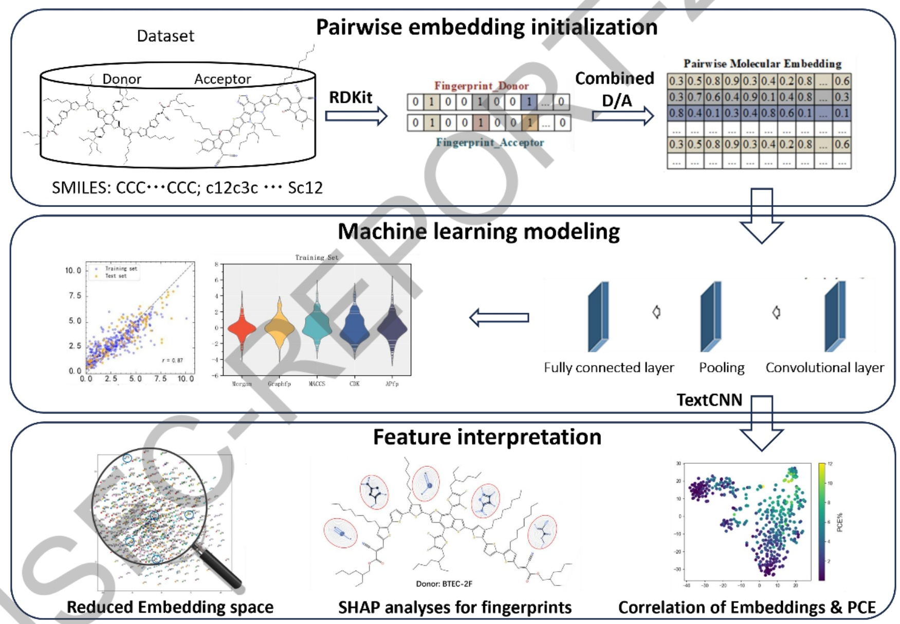

图1. 本工作的框架图

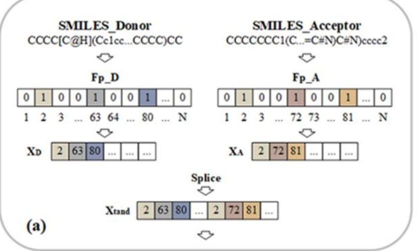

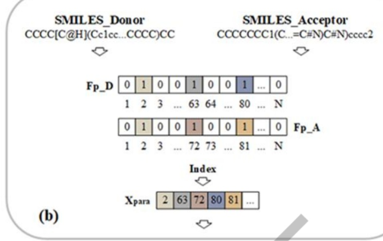

(c)

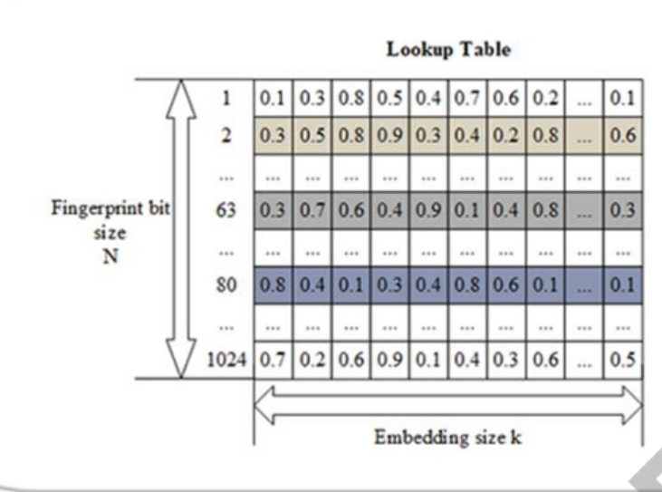

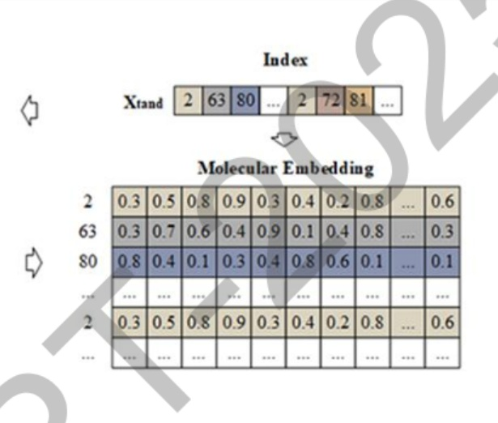

图2. 指纹嵌入处理过程（以半径为2的1024位摩根指纹为例）（a）串联模式生成Xtand的过程；（b）并联模式生成 Xpara的过程；（c）使用Xtand生成嵌入的过程

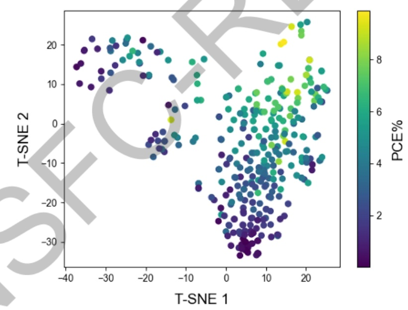

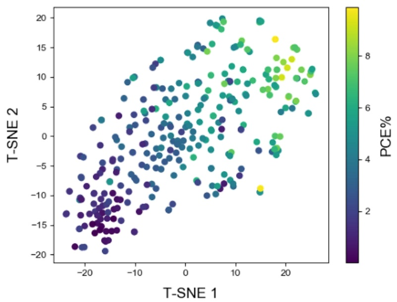

图 3. 通过 t-SNE 降维的与 PCE 值相关的二维可视化 (a) 成对分子嵌入特征；(b)仅给体嵌入特征

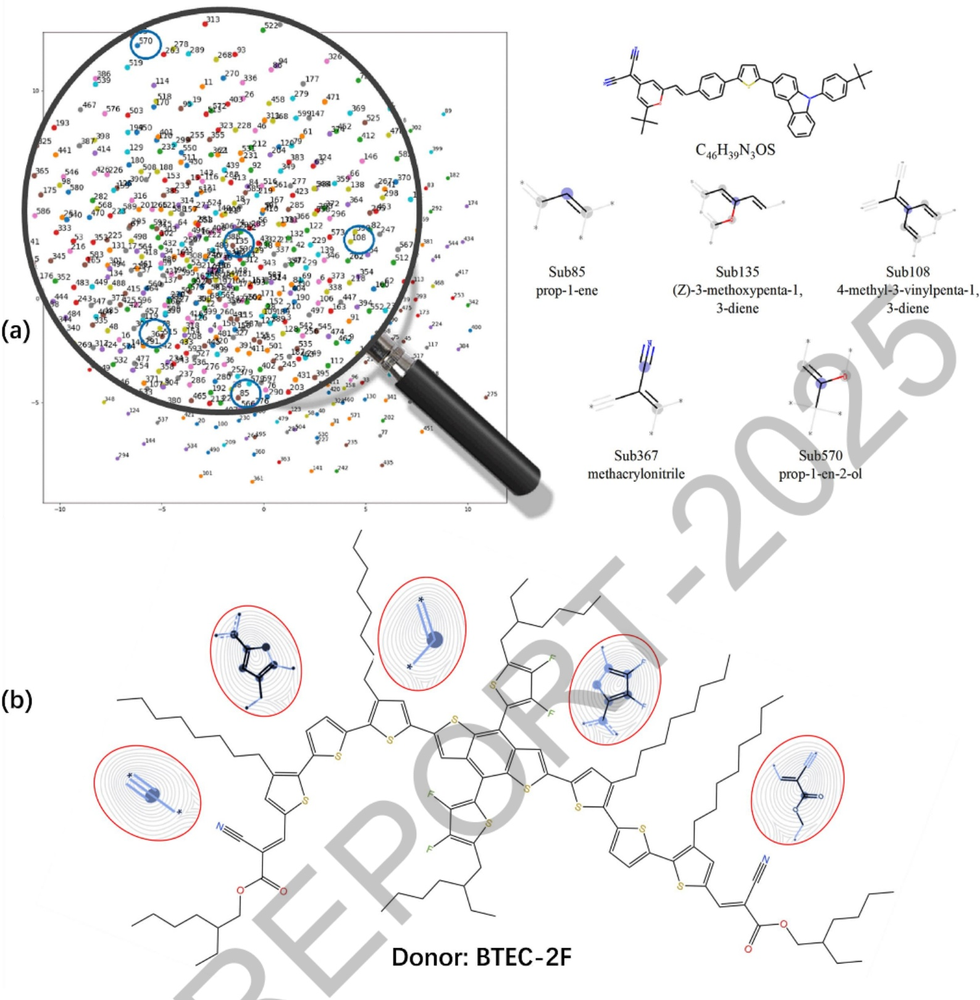

图 4. (a) 分子嵌入的 t-SNE 可视化（以半径为 2的 1024 位 Morgan 指纹为例，仅显示600个亚结构），以及分子C46H39N3OS及其五个亚结构。(b)对给体分子 BTEC-2F 的 PCE 预测贡献最大的前 5 个指纹

## ii）基于图神经网络与电子描述符融合的OSC性能预测研究

基于项目负责人已有工作（Chem.Mater.,2020,32,7777-7787），该研究的数据库规模与质量同步提升，在原有2015-2019年报道的566个D/A对数据基础上，新增370个高质量数据点，构建了包含936个D/A对、涉及832个给体分子和77个受体分子的综合数据库（如图5），大幅提升了数据规模和多样性。基于扩展后的数据库，实现了从分子结构输入（SMILES）到性能预测的全流程自动化，包括分子指纹生成、协同嵌入表示、特征学习与模型预测等关键模块，构建了一个系统的全小分子OSC性能预测与高通量筛选框架（如图6）。

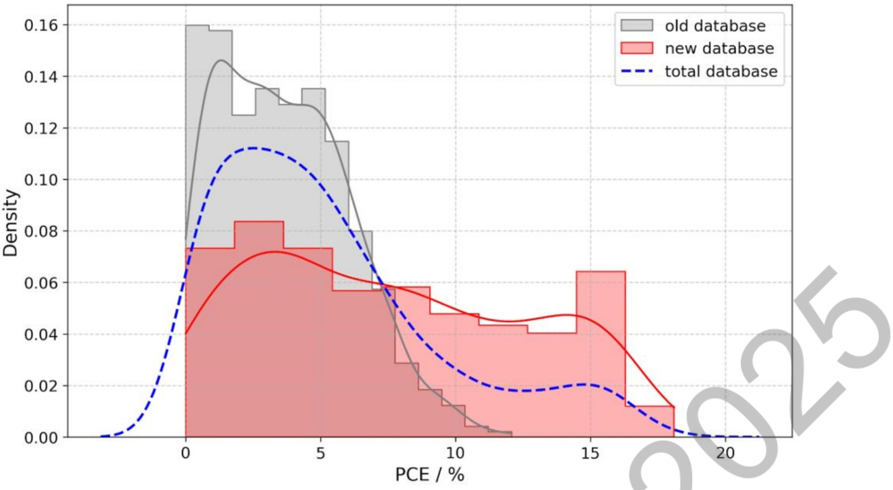

图 5. PCE 分布对 比图 (old vs new vs total)

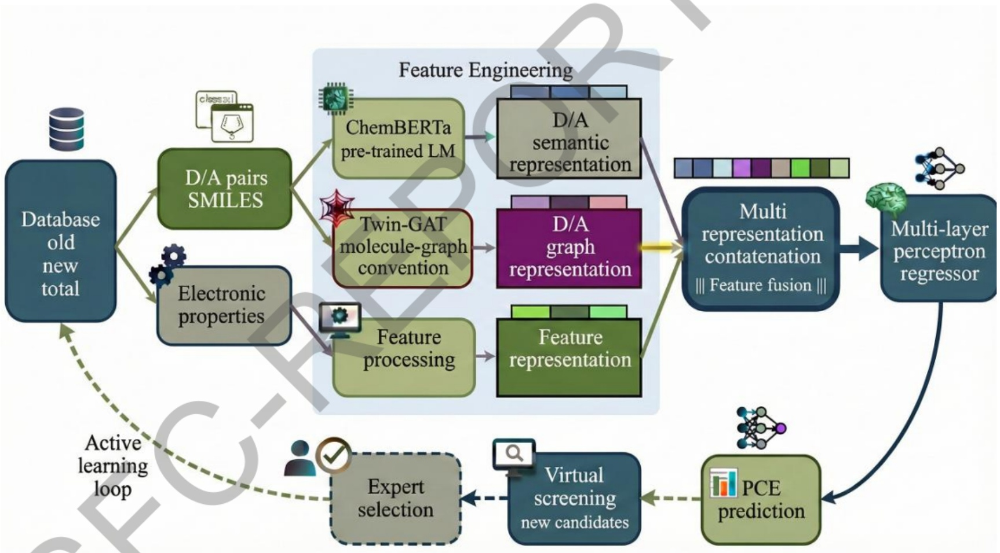

图 6. 本研究框架图

在特征处理阶段，本研究采用多表征拼接（Multi-representation Concatenation）策略（如图7所示），系统整合了三个来源的特征，生成统一的D/A对协同表示向量。首先，基于ChemBERTa预训练语言模型，分别对D与A的 SMILES字符串进行编码，得到D与A的语义表示向量。该模型通过在大规模化学语料上预训练，能够理解SMILES序列中的功能团、子结构等语义信息，为分子提供深层次的文本化表征。然后，通过双塔式图注意力网络（Twin-GAT）进行分子图结构建模。该模块将D与A的 SMILES分别转换为分子图，通过独立的图注意力通道（D通道与A通道）提取各自的图结构表示，从而捕捉分子的拓扑连接、原子类型及键合关系等结构特征。接着，将经过两阶段筛选获得的6个关键电子描述符进行标准化处理，形成电子属性特征向量。这些特征从物理化学层面直接反映了D/A对的能级、极性、稳定性等关键性质。将上述三类特征（语义表征向量、图结构表示向量和电子属性特征向量）在特征维度上进行拼接，形成高维融合特征，为后续回归预测提供了全面且互补的信息输入。

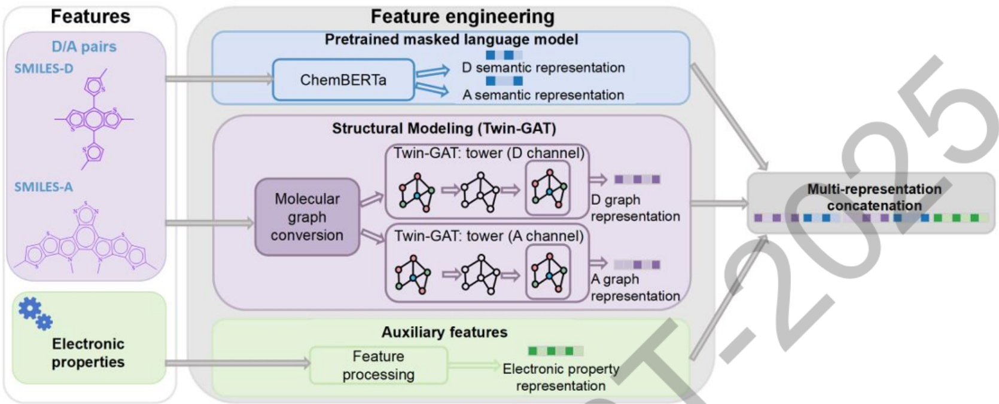

图7. 多表征特征融合流程示意图

融合后的特征向量作为输入，送入多层感知机（MLP）回归器进行PCE预测。在模型预测模块基础上，构建了虚拟筛选-专家验证工作流:通过训练好的模型预测大规模候选D/A对的PCE，依据预测值进行性能排序，筛选出高PCE候选材料；结合领域专家知识，从结构新颖性、合成可行性、稳定性等多维度对候选材料进行人工评估与筛选；将专家确认的高潜力材料通过实验验证后，补充至数据库，实现数据迭代扩充与模型持续优化。该流程有效结合了计算预测的高通量优势和专家判断的可靠性，形成了“预测-专家筛选-实验验证-数据更新”的协同工作模式。所构建框架在综合数据库上表现出优异性能，其中Electronic\_S2G模型(融合电子描述符与图特征的模型)在新数据集上实现 r=0.95的精度，在总数据集中仍保持高精度（r=0.93）。在虚拟筛选中，已成功预测出多个潜在高性能D/A组合，正在寻求实验验证。

本框架将电子描述符、分子图与语义特征系统整合，充分挖掘分子信息，实现了高通量预测，在多个数据集上验证了模型的准确性与鲁棒性，通过专家验证-实验反馈持续扩充数据库，支撑模型进化。该框架为OSC材料的高效发现与性能优化提供了系统化的计算解决方案，并可为其他有机光电材料体系的性能预测与虚拟筛选提供方法学借鉴。

## 4）研究范式的成功拓展:光电催化材料设计

本研究以计算模拟与理论预测为主线，致力于开发面向光电功能材料的理性设计框架。在原OSC材料性能研究的基础上，将研究视角拓展至异核双原子催化剂（DACs）的设计，聚焦于g-C3N₄基非贵金属复合材料用于光催化CO₂还原制CH₄的性能研究。采用密度泛函理论（DFT）与线性响应含时密度泛函微扰理论（LR-TDDFPT），系统研究了十种异核双金属（Fe、Co、Ni、Cu、Mo组合）掺杂的TM₁TM₂@g-C3N₄体系的结构稳定性、电子性质、CO₂吸附能力、反应路径及光学响应，初步构建了面向该类材料的结构-性能数据库。从计算结果中提取了结合能、吸附能、能带结构、电荷转移长度等关键物理化学描述符，建立了针对催化活性与选择性的定性-半定量评价标准，并用于指导催化剂筛选。通过反应自由能计算与电子结构分析，深入探讨了异核双原子与g-C3N4基底的协同作用机制，特别是其在打破传统吸附标度关系、优化中间体吸附行为方面的作用，为后续机器学习与高通量筛选奠定基础。本阶段工作为后续引入机器学习模型和高通量筛选方法提供了结构化数据基础与描述符体系，明确了特征工程与模型训练的方向，具备向其他光/电催化材料体系推广的潜力。（J. Phys.Chem.C 2025，129,18051-18063)

## 3. 研究人员的合作与分工。

课题负责人赵智雯全面负责项目的总体规划、技术路线设计、核心理论模型的构建与把关，以及论文修改工作，并统筹协调项目内外的合作交流。

其他核心成员分工如下:

潘清清:主要负责OSC材料的理论设计与量子化学/分子动力学模拟工作，深入探究材料结构与性能的构效关系，以及论文修改工作。

高婷、胡丽红:负责机器学习模型的算法优化、评估与可解释性分析，为高性能预测模型的构建提供关键指导，以及论文修改工作。

韩金洪、王立黎、孙莹、李有良、周鹏、陈志学、翟雪:作为主要研究骨干，承担了大量的计算、数据收集、模型初步构建、结果分析与论文初稿撰写等工作。


## 4. 国内外学术合作交流等情况。

项目负责人参加第五届电子结构理论方法青年学者研讨会（2024年4月，青岛）；第11届国际理论化学物理大会（2024年10月，青岛）；中国化学会第十五届全国理论与计算化学会议（2024年8月，长春）。

此外，项目负责人于项目执行期间赴山东大学进行了为期一年的学术访问，并与长春理工大学、东北师范大学、吉林大学的多位学者建立了稳定的合作关系。

## 5. 存在的问题、建议及其他需要说明的情况。

本项目的执行使我们对OSC材料的光生电荷机制有了更为清晰的认识，对借助机器学习和高通量筛选辅助OSC材料设计有了更前沿的思路。尽管本项目构建了领域内相对全面的小分子OSC数据库，但总体数据量仍属“小样本”，这在一定程度上限制了更复杂模型（如某些基于大语言模型的材料预测工具）的充分应用。AIfor Science领域发展迅猛，未来如何有效利用预训练大模型与领域小数据结合，实现更高精度和更强泛化能力的预测，是值得深入探索的方向。另外，器件优化需要一定周期，导致预测成果的最终实验验证非常缓慢，我们将在后续工作中持续跟进。还有主要论文还未发表，我们会在以后继续深入分析，同时，也期待基金委能继续支持我们在该交叉方向上的探索。

## （二）成果部分

## 1. 项目取得成果的总体情况。

本项目属于基础研究，旨在通过量子化学计算化学结合机器学习，揭示OSC材料性能的微观决定因素并建立理性设计框架。研究成果对突破OSC器件研发的“试错”瓶颈、形成材料研发新范式具有重要支撑意义。项目成果以论文、人才培养及构建专项数据库/预测框架等形式体现。具体发表论文清单如下:

(1) Li-Li Wang; Hai-Ping Zhou; Zhi-Wen Zhao\*; Qing-Qing Pan\*; Jin-Hong Han; Si-Qi Bao; Zhong-Min Su\*; Insights into the Charge-Transfer Mechanism and Stacking Structures in a Large Sample of Donor/Acceptor Models of a Non-Fullerene Organic Solar Cell, ACS Sustainable Chemistry & Engineering, 2023, 11, 9127-9182.第一标注

) Jin-Hong Han; Li-Li Wang; Hai-Ping Zhou; Zhi-Wen Zhao\*; Xing-Man Liu; Qing-Qing Pan\*; Zhong-Min Su\*; Theoretical study of the effect of D-A type polymer donors on the performance of Y6-based organic solar cells, Organic Electronics, 2024, 124, 106963. 第一标注

(3) Li-Li Wang; Jin-Hong Han; Hai-Ping Zhou; Qing-Qing Pan\*; Zhi-Wen Zhao\*; Zhongmin Su\*; Superior End-Group Stacking Promotes Simultaneous Multiple Charge-Transfer Mechanisms in Organic Solar Cells with an All-Fused-Ring Nonfullerene Acceptor, ACS Applied Materials & Interfaces, 2024, 16, 35390–35399.第一标注

(4) Zhi-Xue Chen; Si-Qi Huang; Li-Li Wang; Zhi-Wen Zhao\*; Wen-Wen Guo; Chuan-Yin Liu; Yan-Ling Wang; Qing-Qing Pan\*; Zhong-Min Su; Elucidating fluorination effect on benzodithiophene-based donor material in organic solar cells, Computational and Theoretical Chemistry, 2024, 1237, 114658. 第一标注

(5) Jin-Hong Han; Hai-Ping Zhou; Li-Li Wang; Zhi-Wen Zhao\*; Xing-Man Liu; Qing-Qing Pan\*; Zhong-Min Su\*; The superiority of isomeric, fluorination and curtailed π-conjunction on A-D-A type acceptors for organic photovoltaics, Spectrochimica Acta Part A: Molecular and Biomolecular Spectroscopy, 2025, 325, 125043. 第一标注

(6) Jin-Hong Han; Zhi-Wen Zhao\*; Qing-Qing Pan\*; Li-Li Wang; Hai-Ping Zhou; Zhong-Min Su\*; Fusion Modes and Number of Fused Rings: Their Impact on Acceptor-Donor-Acceptor Nonfullerene Acceptors in Organic Solar Cells, ACS Applied Materials & Interfaces, 2025, 17, 2522-2532. 第一标注

(7) Li-Li Wang; Hai-Ping Zhou; Zhi-Wen Zhao\*; Qing-Qing Pan\*; Xing-Man Liu; Jin-Hong Han; Zhong-Min Su\*; The role of third component in coumarin-based all-small-molecule ternary organic solar cells with non-fullerene acceptor based on molecular stacking, Spectrochimica Acta Part : Molecular and Biomolecular Spectroscopy, 2025, 329, 125624. 第一标注

(8) Ting Gao; Xue-You Zhang; Xu Dong; Yu-Shan Qiu; Yong-Qi Liu; Zhi-Wen Zhao\*; Yun Geng; Zhong-Min Su; Li-Hong Hu\*; Synergic donor/acceptor pair fingerprint-embedding generation for machine learning enhancement in organic solar cells, Chemical Engineering Science, 2025, 305, 121128. 第二标注

(9) Peng Zhou; Zhi-Wen Zhao\*; Yu-Li Lei; Hai-Bo Ma\*; Rational Design of Heteronuclear Dual-Atom Catalysts for the Selective Photocatalytic CO₂ Reduction to CH4: A First-Principles Study, The Journal of Physical Chemistry C, 2025, 129, 18051-18063.第二标注

You-Liang Li; Jin-Hong Han; Ying Sun; Zhi-Wen Zhao\*; Qing-Qing Pan\*; Xing-Man Liu; Zhong-Min Su\*; Theoretically probing the asymmetric effect of donor for all-small-molecule organic solar cells, Computational and Theoretical Chemistry, 2025, 1248, 115214. 第三标注

(11) Ying Sun; Li-Li Wang; Jin-Hong Han; Hai-Ping Zhou; Qing-Qing Pan\*; Zhi-Wen Zhao\*; Xing-Man Liu; Zhong-Min Su\*; A theoretical comparison of different third component content in ternary organic solar cells, Physical Chemistry Chemical Physics, 2025, 27, 1949-1959. 第三标注

2. 项目成果转化及应用情况。

由于本项目研究属于基础理论研究，因此成果主要是发表论文。目前没有项目成果转化及应用。

## 3. 人才培养情况。

项目协助联合培养光电材料的理论计算领域硕士7名，其中2名硕士研究生毕业后继续攻读博士学位，目前博士在读，2名硕士研究获得硕士学位，3名硕士研究生在读。

1）韩金洪，硕士研究生毕业，论文题目为“非富勒烯有机太阳能电池给受体材料结构与光电性质关系的理论研究”，目前博士研究生在读。

2）王立黎，硕士研究生毕业，论文题目为“全小分子有机太阳能电池中界面电荷转移的理论研究”，目前博士研究生在读。其硕士毕业论文《全小分子有机太阳能电池中界面电荷转移的理论研究》获得2025年吉林省优秀硕士论文。

3）孙莹，硕士研究生毕业，论文题目为“基于Y系列材料的三元有机太阳能电池光电转换过程的理论研究”。

4）李有良，硕士研究生毕业，论文题目为“全小分子有机太阳能电池中不对称型光伏材料的理论研究”

5）周鹏、陈志学、翟雪:硕士研究生在读。

## 4. 其他需要说明的成果。

## 5. 项目成果科普性介绍或展示网站。

本项目成果属于前沿基础科学研究，其核心价值在于提供了一种“从分子结构出发，通过计算机模拟和人工智能快速预测太阳能电池性能，从而指导实验合成”的研发模式。这一模式若广泛应用，有望显著加速新型、高效、低成本有机光伏材料的发现进程，为开发我国自主知识产权的绿色能源技术提供思路。目前研究成果主要通过学术期刊和交流进行传播，暂未建立独立的科普网站。

## 研究成果目录

项目负责人通过系统，从文献库中检索研究成果或者按要求格式自行填入。请按照期刊论文、会议论文、学术专著、专利、会议报告、标准、软件著作权、科研奖励、人才培养、成果转化的顺序列出，其它重要研究成果如标本库、科研仪器设备、共享数据库、获得领导人批示的重要报告或建议等，应重点说明研究成果的主要内容、学术贡献及应用前景等

项目负责人不得将非本人或非参与者所取得的研究成果、与受资助项目无关的研究成果、未标注国家自然科学基金资助和项目批准号的论文以及取得时间早于项目资助期开始时间的研究成果列入报告中。发表的研究成果（包括专利），项目负责人和参与者均应如实注明得到国家自然科学基金项目资助和项目批准号，科学基金作为主要资助渠道或者发挥主要资助作用的，应当将自然科学基金作为第一顺序进行标注。

## 期刊论文

(1) Wang, Li-Li; Zhou, Hai-Ping; Zhao, Zhi-Wen; Pan, Qing-Qing; Han, Jin-Hong; Bao, Si-Qi; Su, Zhongmin; Insights into the Charge-Transfer Mechanism and Stacking Structures in a Large Sample of Donor/Acceptor Models of a Non-Fullerene Organic Solar Cel1, ACS Sustainable Chemistry & Engineering, 2023, 11(24):9172-9182. 第一标注

(2) Han• Jin-Hong; Wang• Li-Li; Zhou· Hai-Ping; Zhao• Zhi-Wen; Liu• Xing-Man; Pan• Qing-Qing; Su• Zhong-Min; Theoretical study of the effect of D-A type polymer donors on the performance of Y6-based organic solar cells, Organic Electronics, 2024, 124(无):106963. 第一标注

(3) Wang, Li-Li; Han, Jin-Hong; Zhou, Hai-Ping; Pan, Qing-Qing; Zhao, Zhi-Wen; Su, Zhongmin; Superior End-Group Stacking Promotes Simultaneous Multiple Charge-Transfer Mechanisms in Organic Solar Cells with an Al1-Fused-Ring Nonfullerene Acceptor, ACS Applied Materials & Interfaces, 2024, 16(27): 35390-35399. 第一标注

(4) Chen• Zhi-Xue; Huang• Si-Qi; Wang• Li-Li; Zhao· Zhi-Wen; Guo• Wen-Wen; Liu• Chuan-Yin; Wang• Yan-Ling; Pan• Qing-Qing; Su• Zhong-Min; Elucidating fluorination effect on benzodithiophene-based donor material in organic solar cells, Computational and Theoretical Chemistry, 2024, 1237: 114658. 第一标注

(5) Han• Jin-Hong; Zhou• Hai-Ping; Wang•Li-Li; Zhao• Zhi-Wen; Liu• Xing-Man; Pan• Qing-Qing; Su· Zhong-Min; The superiority of isomeric, fluorination and curtailed π-conjunction on A-D-A type acceptors for organic photovoltaics, Spectrochimica Acta Part A: Molecular and Biomolecular Spectroscopy, 2025, 325(无):125043. 第一标注

(6) Han, Jin-Hong; Zhao, Zhi-Wen; Pan, Qing-Qing; Wang, Li-Li; Zhou, Hai-Ping; Su, Zhong-Min; Fusion Modes and Number of Fused Rings: Their Impact on Acceptor-Donor-Acceptor Nonfullerene Acceptors in Organic Solar Cells, ACS Applied Materials & Interfaces, 2024, 17(1): 2522-2532. 第一标注

(7) Wang•Li-Li; Zhou· Hai-Ping; Zhao• Zhi-Wen; Pan•Qing-Qing; Liu• Xing-Man; Han• Jin-Hong; Su· Zhongmin; The role of third component in coumarin-based all-small-molecule ternary organic solar cells with non-fullerene acceptor based on molecular stacking, Spectrochimica Acta Part A: Molecular and Biomolecular Spectroscopy, 2025, 329:125624.第一标注

(8) Gao, Ting; Zhang, Xueyou; Dong, Xu; Qiu, Yushan; Liu, Yongqi; Zhao, Zhi-Wen; Geng, Yun; Su, Zhong-Min; Hu, Lihong; Synergic donor/acceptor pair fingerprint-embedding generation for machine learning enhancement in organic solar cells, Chemical Engineering Science, 2025, 305(无): 121128. 第二标注

(9) Peng Zhou; Zhiwen Zhao; Yuli Lei; Haibo Ma; Rational Design of Heteronuclear Dual-Atom Catalysts for the Selective Photocatalytic C02 Reduction to CH4: A First-Principles Study, The Journal of Physical Chemistry C，2025，129(40):18051-18063. 第二标注

(10) Li• You-Liang; Han· Jin-Hong; Sun• Ying; Zhao· Zhi-Wen; Pan• Qing-Qing; Liu• Xing-Man; Su• Zhong-Min; Theoretically probing the asymmetric effect of donor for all-small-molecule organic solar cells, Computational and Theoretical Chemistry, 2025, 1248: 115214. 第三标注

(11) Ying Sun; Li-Li Wang; Jin-Hong Han; Hai-Ping Zhou; Qing-Qing Pan; Zhi-Wen Zhao; Xing-Man Liu; Zhong-Min Su; A theoretical comparison of different third component content in ternary organic solar cells, Phys ical Chemistry Chemical Physics, 2024, 27(4): 1949-1959. 第三标注

## 项目成果应用前景

本项目成果拟应用领域:1、太阳能电池

预计在10年以上推广使用

附表:研究成果统计数据表（本表针对各种类型资助项目收集数据以便进行整体资助效果分析使用，并非要求每类项目都具有以下各类成果。

```
                   国家级                      1 部级
        自然科学奖     科技进步奖      发明奖     自然科学奖     科技进步奖    其他
获奖（项）  一等   二等   一等   二等   一等  二等    等    等    一等  二等
       0    0    0    0    0    0    0    0    0    0    0
      特邀学术报告           学术论文           学术专著         其他
学术报告/论 国际学术 国内学术 发表论文数   论文检索收录情况
                     SCIE/  北大中文                    科研仪器
文/专著/其 会议 会议
              期论义
                  会议
 他（篇）                 SSCI EI 核心期刊 CSSCI 中文 外文 标本库 数据库 设备 重要报告
       0   0  11  0   0   0   0   0   0   0   0  0   0   0
           专利（项）             标准                   成果转化
专利/标准/  国内      国外             国内       软件著作
软著/成果转                国际                  权             经济效益
  化   申请  授权  申请  授权     国家  行业  地方  企业     技术转让技术许可作价投资 (万元)
       0   0   0  0    C  0   0   0   0   0   0   0  0   0
                 人才培养（人）                    举办和参加学术会议
人才培养及     中青年学术带头人   出站博士后 毕业博士 毕业硕士 举办国际学术会议 举办国内学术会议 参加国际学术会议
 学术交流 优青  杰青 创新群体 其他                 次数  人数  次数  人数  次数  人数
       0   0   0   0   0    0    0   0   0   0   0   0   0
```

## 国家自然科学基金包干制项目决算表

```
    项目批准号：22209042                     项目负责人：赵智雯                             金额单位：万元
行次                    科目名称                                        金额
 (1)  一、项目总经费                                                                      30.0000
 (2) 二、累计支出数                                                                       21.8037
 (3)  （一）项目直接费用                                                                    21.8037
                                                              025
 (4)  1、设备费                                                                        11.5050
 (5)   其中：设备购置费                                                                    11.5050
 (6)  2、业务费                                                                        4.7787
 (7)  3、劳务费                                                                        5.5200
 (8)  （二）项目间接费用                                                                    0.0000
 (9)   其中：绩效支出                                                                     0.0000
 (10) 三、项目结余数                                                                      8.1963
 (11) 四、结余资金比例                                                                     27.32%
```

注:1.本表中（1）、（2）、（3）、（10）、（11）行为系统自动生成，无需填写。

2.第（2）行=第（3）+（8）行；

第（3）行=第（4）+（6）+（7）行；

第（10）行=第（1）-（2）行；

第（11）行=第（10）行/第（1）行\*100%。

## 决算说明书

（请按照《国家自然科学基金包于制项目决算表编制说明》等的有关要求，说明各科目的资金支出情况、结余情况、单价≥50万元的设备情况、资金使用和管理过程中遇到的问题及建议，以及其他需要说明的事项等。)

本项目承担单位共计收到国家自然科学基金委员会拨付的中央财政资金30万元。各科目支出情况如下:

（1）设备费支出11.5050万元，其中:设备购置费支出11.5050万元。

（2）业务费支出4.7787万元，其中:技术服务费支出4.10万元，材料费支出0.075万元，差旅费支出0.6037万元。

（3）劳务费支出5.5200万元，用于参与本项目的本硕博人员的劳务费以及专家咨询费。

（4）间接费用支出0.00万元。

项目支出合计21.8037万元，经费结余8.1963万元，结余占比27.32%。

结余资金情况说明

注:结余资金比例超过30%的项目该部分必填。

```
项目负责人承诺：
  我所承担的项目（编号：22209042 名称：机器学习与高通量筛选辅助的潜在高性能
有机太阳能电池材料设计）结题报告内容真实，数据准确，未出现《国家科学技术保密规
定》中列举的属于国家科学技术秘密范围的内容，不涉及敏感科技信息。在今后的研究工
作中，如有与本项目相关的成果，将如实注明得到国家自然科学基金项目资助和项目批准
号，并报送国家自然科学基金委员会。
                          项目负责人（签 章
                          日期：
 依托单位科研管理部门：  依托单位财务管理部门：   依托单位审查意见：
负责人（签章）：      负责人（签章）：       依托单位公章：
              EPO
日期：           日期：
科学处审核意见：
 完成情况  优   良   中   差  负责人（签章）：
 综合评分                 日期：
 (划√)
科学部核准意见  对重点项目等）：
NSF
                           负责人（签章）：
                          日期：
 分管委领导意见（对重大项目等）：
                          委领导（签章）：
                          日期：
```

## 电子附件目录

```
序号    附件类型       附件名称            备注
 1 论著        代表性论文1
 2 论著        代表性论文2
 3 论著        代表性论文3
                           2025
 4 论著        代表性论文4
 5 论著        代表性论文5
 6 论著        其他论文1
 7 论著        其他论文2
 8 论著        其他论文3
 9 论著        其他论文4
 10 论著       其他论文5
 11 论著       其他论文6
```