项目批准号 62205338申请代码 F0509归口管理部门收件日期


20251162205338

# 国家自然科学基金

# 资助项目结题/成果报告

资助类别:青年科学基金项目（C类）[原青年科学基金项目]

亚类说明:

附注说明:

项目名称:基于机器学习势的新型杂化钙钛矿性能预测与验证

负责人:伍力源

BRID: 07803.00.58023

电子邮件:wuly@ihep.ac.cn

电话: 15010302785

依托单位: 中国科学院高能物理研究所

联系人: 鄢芬

电话: 88235843

资助经费:30.0000（万元）

执行年限: 2023.01-2025.12

填表日期:2026年01月22日

国家自然科学基金委员会制（2025年）

## 项目摘要

## 中文摘要:

有机无机杂化钙钛矿作为一种具有优异光电性质的新型光电材料，可广泛应用于太阳能电池、光电探测器、场效应晶体管和激光器等光电器件，但离实际应用还面临着稳定性和大面积生长两个关键问题。本项目拟采用理论计算预测和实验验证融合的材料研究新模式，开展从多组分机器学习势构建，到混合钙钛矿大规模分子动力学模拟，到钙钛矿结构设计、性能预测及实验验证的系统基础研究。首先，基于深度势能和神经网络算法，将只能用于某一类特定组分特定条件的钙钛矿传统力场，扩展到杂化钙钛矿，生成精准普适机器学习势，通过杂化钙钛矿分子动力学计算，模拟实验条件下不同纳米尺寸的混合钙钛矿构型，找到影响钙钛矿稳定性和大面积生长的关键因素；进一步，通过基于机器学习方法的材料设计和性质预测，设计筛选出高稳定性和合适带隙的杂化混合钙钛矿；最后进行基于同步辐射的结构及性质相关验证，为杂化钙钛矿大面积生长及走向应用提供理论和实验支撑。

## Abstract:

As a novel optoelectronic material with excellent optoelectronic properties, organic-inorganic hybrid perovskite can be widely used in optoelectronic devices, such as solar cells, photodetectors, field-effect transistors, and lasers. However, the stability and large-area preparation remain to be overcome for the practical application. This project adopts a new material research model integrating theoretical calculation, theoretical prediction and experimental verification, and it conducts the systematic fundament research from the construction of multi-component machine learning potential, to large-scale molecular dynamics simulation of mixed perovskite, to perovskite structure design, performance prediction and experimental verification. Firstly, based on the DeepMD and neural network method, extend the traditional force field of perovskite that can only be used for a certain type of specific components and specific conditions to mixed cation/anion perovskite force field, and generate an accurate and universal machine learning potential, which used for the simulation of mixed perovskite with different nano sizes under experimental conditions, and find the key factors affecting the stability and large-area growth of perovskite. Furthermore, through the material design and property prediction based on machine learning method, design and select the organic-inorganic hybrid perovskite with high stability and appropriate band gap. Finally, verify the structure and properties by the synchrotron radiation experiment, and provide theoretical and experimental support for the large-scale growth and application of hybrid perovskite.

关键词（用分号分开）:杂化材料；有机无机杂化钙钛矿；机器学习势；

分子动力学；同步辐射实验

Keywords (separated by;): hybrid materials; organic-inorganic hybrid perovskite; machine learning potential; molecule dynamic; synchrotron radiation

## 结题摘要

## 中文摘要（对项目的背景、主要研究内容、重要结果、关键数据及其科学意义等做简单概述）:

有机无机杂化钙钛矿作为一种具有优异光电性质的新型光电材料，可广泛应用于太阳能电池、光电探测器、场效应晶体管和激光器等光电器件，但离实际应用还面临着稳定性和大面积生长两个关键问题。本项目围绕有机无机杂化钙钛矿FA₁-xMAxPb(I1-yBry)₃的高稳定性与大面积应用目标，开展从多组分机器学习势构建，到混合钙钛矿大规模分子动力学模拟，到钙钛矿结构设计、性能预测及实验验证的系统基础研究，已顺利完成全部研究内容。在理论层面，突破了传统力场局限，构建了适用于多组分钙钛矿的普适机器学习势函数，实现了对全组分空间热力学稳定性与相分离倾向的高效预测；通过分子动力学模拟与界面工程研究，揭示了界面相互作用与结晶动力学是影响材料稳定性和大面积成膜的关键因素。在方法学上，发展了机器学习驱动的同步辐射数据解析技术，实现了对广角X射线衍射等海量数据的快速自动分析。在实验验证方面，通过同步辐射原位表征技术，证实了界面修饰与结晶调控可有效诱导钙钛矿形成有序取向、减少缺陷，显著提升了器件性能与环境稳定性。这些成果不仅深化了对钙钛矿材料构效关系的科学认知，为理性设计高性能材料提供了新范式， 更为大面积、高效率钙钛矿光伏器件的产业化制备提供了关键的理论依据与技术支撑，具有重要的科学意义和广阔的应用前景。

## Abstract (Brief description of research background, main methods, contributions, and research data):

Organic-inorganic hybrid perovskites, as a novel class of optoelectronic materials with excellent photoelectric properties, hold broad application potential in solar cells, photodetectors, field-effect transistors, lasers, and other optoelectronic devices. However, their practical application faces two critical challenges: stability and large-area growth. This project has addressed the goals of enhancing the stability and enabling large-area application of organic-inorganic hybrid perovskites, specifically FA₁-xMAxPb(I1-yBry)₃. A systematic and fundamental research framework was implemented, encompassing the construction of multi-component machine learning potentials, large-scale molecular dynamics simulations of hybrid perovskites, perovskite structure design, performance prediction, and experimental validation. All planned research tasks have been successfully completed. On the theoretical front, the project broke through the limitations of traditional force fields by developing a universal machine learning potential function applicable to multi-component perovskites. This enables efficient prediction of thermodynamic stability and phase-separation tendencies across the entire compositional space. Through molecular dynamics simulations and interface engineering studies, key factors influencing material stability and large-area film formation (such as interfacial interactions and crystallization kinetics) were revealed. Methodologically, machine learning-driven techniques for synchrotron radiation data analysis were advanced, enabling rapid and automated processing of vast datasets, such as those from wide-angle X-ray diffraction. For experimental validation, in-situ synchrotron radiation characterization confirmed that interface modification and crystallization control can effectively induce ordered orientation and reduce defects in perovskites, significantly improving device performance and environmental stability. These achievements not only deepen the scientific understanding of the structure-property relationship in perovskite materials and provide a new paradigm for the rational design of high-performance materials, but also offer critical theoretical foundations and technical support for the industrial fabrication of large-area, high-efficiency perovskite photovoltaic devices. The work holds significant scientific implications and broad application prospects.

```
关键词（用分号分开）：hybrid materials；organic-inorganic hybrid
perovskite; machine learning potential; molecule dynamic; synchrotron
radiation
Keywords(separated by;)：杂化材料；有机无机杂化钙钛矿；机器学习;
分子动力学；同步辐射实验
```

## 正文

《结题/成果报告》正文分为两个部分:结题部分和成果部分。请按照《结题成果报告》填报说明及撰写要求填写。

## （一）结题部分

## 1. 研究计划执行情况概述。

（1）按计划执行情况。

本项目的具体研究计划是:围绕有机无机杂化钙钛矿，以设计高稳定性高性能钙钛矿材料为导向，开展从多组分机器学习势构建，到混合钙钛矿大规模分子动力学模拟，到钙钛矿结构设计、性能预测及实验验证的系统研究。针对钙钛矿应用面临的稳定性和大面积生长问题，采用机器学习势函数训练，将只能用于某一类特定的钙钛矿组分的传统力场，扩展到混合阳离子/阴离子钙钛矿，生成普适势函数，通过对有机无机杂化混合钙钛矿进行分子动力学计算，模拟实验条件下不同纳米尺寸的多晶混合钙钛矿构型，找到影响钙钛矿稳定性和大面积生长的关键因素，进一步通过基于机器学习方法的材料设计和性质预测，设计筛选出高稳定性、确定组分比例的有机无机杂化混合钙钛矿，最后进行基于同步辐射的结构及性质相关验证，为钙钛矿大面积生长及走向应用提供理论和实验支撑。

项目已按计划完成所有研究工作，实现了既定的研究目标，主要研究内容包括:有机无机杂化钙钛矿机器学习势构建及其多组分热力学稳定性全局预测，钙钛矿稳定性和大面积生长关键因素识别（界面调控及空穴传输层添加剂），基于机器学习方法的材料设计、性质预测及同步辐射数据解析（普适机器学习势函数训练、同步辐射WAXD/ARPES解析、同步辐射数据驱动 AI赋能钙钛矿等新型材料发现)，有机无机杂化钙钛矿界面优化与同步辐射结构-性能表征验证。

## （2）研究目标完成情况。

依照本项目任务书，已完成既定研究目标，发表论文7篇。主要完成目标如下:

A.普适机器学习势函数构建:成功将传统单一组分力场扩展至混合阳离子/阴离子钙钛矿体系，实现了对多组分钙钛矿结构的精准、高效模拟，满足大规模分子动力学计算需求。

B.稳定性与大面积生长关键因素识别:通过界面工程理论研究、及结晶调控实验，明确了界面相互作用、晶体取向、添加剂调控等是影响钙钛矿稳定性和大面积生长的核心因素。

C. 基于机器学习方法的材料设计及性质预测:发展机器学习方法对纳米材料结构进行理性设计，机器学习助力同步辐射数据解析（包括WAXD、ARPES）以及同步辐射数据驱动AI赋能钙钛矿等新型材料发现。

D. 高稳定性组分设计与实验验证体系建立:结合机器学习预测与第一性原理验证，设计出具有最优组分比例的有机无机杂化混合钙钛矿；基于同步辐射GIWAXS、XRD等技术，建立了钙钛矿结构与性能的构效关系，明确了减少混合钙钛矿薄膜制备中的缺陷的产生的机制，提升薄膜均匀性与 件 一致性，为大面积生长的质量管控提供了技术支撑。

## 2. 研究工作主要进展、结果和影响。

## （1）主要研究内容。

有机无机杂化钙钛矿机器学习势构建及其多组分热力学稳定性全局预测；钙钛矿稳定性和大面积生长关键因素识别（界面调控及空穴传输层添加剂）；基于机器学习方法的材料设计、性质预测及同步辐射数据解析（普适机器学习势函数训练、同步辐射WAXD/ARPES解析、同步辐射数据驱动 AI赋能钙钛矿等新型材料发现)；有机无机杂化钙钛矿界面优化与同步辐射结构-性能表征验证。

取得的主要研究进展、重要结果、关键数据等及其科学意义或应用前景。

本项目严格按照研究计划，系统推进从多组分机器学习势构建，到混合钙钛规模分子动力学模拟、结构设计与性能预测、同步辐射实验验证四大核心环节。通过融合第一性原理计算、机器学习、分子动力学模拟及同步辐射表征技术，完成了从传统力场扩展到混合阳离子/阴离子钙钛矿普适势函数的构建，实现多晶混合钙钛矿构型的动态模拟，明确影响稳定性和大面积生长的关键因素，并通过实验验证了高稳定性组分的性能优势。取得的主要研究进展如下:

## A. 完成铅基卤化物钙钛矿机器学习势构建及其多组分热力学稳定性全局预测

通过预训练大原子模型（LAMs）开发机器学习势（MLP）是一种高效策略。大多数传统MLP均从零开始训练，依赖大量经耗时密度泛函理论（DFT）计算标注的数据集。然而，由于势能面（PES）上DFT标注数据的固有稀疏性，仅基于此类数据训练的MLP往往难以在训练集之外做出准确预测。为应对这一挑战，近期研究提出一种前景良好的迁移学习范式:先在海量DFT数据上预训练通用LAM，再利用规模较小但针对性强的下游数据集对模型进行微调。该方法不仅拓展了与目标应用相关的PES覆盖范围，还显著增强了MLP在未见构型上的外推能力。 Lr

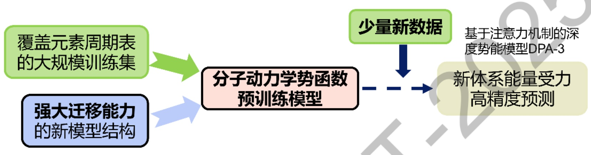

图1基于预训练分子动力学势函数的迁移学习框架

## A.1 多元卤化物钙钛矿结构数据集构建与LAM模型微调

本研究聚焦于有机-无机杂化钙钛矿材料体系，以立方相 MAPbI₃单体结构为起点，构建了包含 8 个化学式单元的 2×2×2 超胞，并以此为基础系统扩展至多种化学组分，涵盖MAPbI3、FAPbI3、混合阳离子钙钛矿（FA1-MAxPbI₃和FA1-xMAxPbBr3）、混合阴离子钙钛矿（FAPb(I1-yBry)3和 MAPb(I1-yBry)3)，以及混合阳离子-阴离子钙钛矿（FA1-xMAxPb(I1-yBry)₃)。针对每种组分，以相应的平衡晶格结构为基础，通过分子取向旋转、晶格参数缩放及局部原子位置微扰等策略生成多样化的原子构型，并采用 DFT计算其单点能量，构建初始的结构-能量数据集。

该数据集包含1825 个高质量 DFT 计算样本，覆盖 A 位(MA+/FA+)与 X 位Br-）不同掺杂比例下的结构多样性，为MLP的开发提供了可靠基础。鉴于从头训练的MLP在有限标注数据下泛化能力受限，本研究采用上述迁移学习策略:以在大规模 DFT数据上预训练的 LAM—DPA-3.1-3M 作为初始化模型，并特别选取其专为铅基杂化钙钛矿设计的 Hybrid Perovskite 分支进行微调。

该分支已在 MAPbI₃和 FAPbI₃体系上完成多任务预训练，涵盖 50-800 K温度范围与低于1 GPa 的压力条件，采用 PBE-D3(BJ)/PAW方法（截断能 500 eV)，对原子间相互作用具有良好的物理一致性。基于此分支微调，不仅继承了其在典型钙钛矿结构中的高精度预测能力，还显著降低了训练难度与计算成本。

下游微调所用的DFT单点能数据均采用与预训练一致的PBE-PAW泛函，并在更高截断能（550 eV）下进行计算；所有计算采用 Gamma-centered 7×7×7k点网格，电子自洽收敛阈值设为 1×10-⁶ eV，采用 Gaussian 展宽（ISMEAR = 0, SIGMA= 0.05 eV）处理半导体体系，并关闭离子弛豫（IBRION= -1,NSW= 0）与空间对称性（ISYM=0），确保每个构型的能量与原子力严格对应其原始非对称原子坐标，从而为机器学习势提供高保真、无偏倚的监督信号。微调过程中输入配置针对当前体系的化学复杂性进行了优化，包括描述符设置 损失函数权重及学习率调度，确保MLP在小规模但结构丰富的数据集上高效收敛。A.2 多组分钙钛矿机器学习势的跨体系泛化性能与误差分析

基于上述高质量 DFT数据集，我们对微调后模型在广泛化学空间中的预测能力进行了系统评估。数据集按9:1 划分为训练集与验证集，模型经10⁵步迭代训练后达到稳定收敛(如图2所示)，验证集上能量均方根误差(RMSE)为 2.21 meV/atom，原子力RMSE为 26.2 meV/Å，展现出优异的预测精度与外推能力。该MLP不仅在训练构型上表现稳定，且在未见局部畸变结构中仍保持高保真度，为后续大尺度分子动力学模拟和材料性能预测提供了可靠的理论工具。

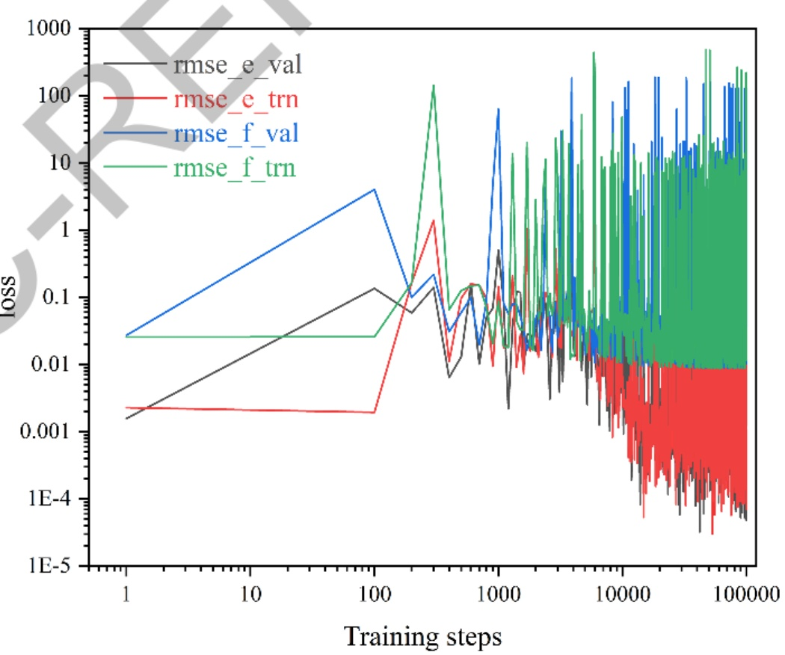

图2 基于预训练模型的迁移微调中能量与力损失的收敛特性

进一步对33个不同掺杂比例的钙钛矿体系（涵盖纯相、混合阳离子、混合阴离子及双混合体系）进行独立验证，结果显示模型在绝大多数体系中表现出高度一致的预测性能（如图 3(a)、(b)所示）。DP预测的能量与 DFT结果呈强线性相关（R²>0.999)，原子力预测也分布在对角线及附近，表明模型具备出色的跨组分泛化能力。然而，对于部分含高溴掺杂或富FA组分的体系（如 FAPbBr3、(FAo.15MAo.85)PbI₃)，模型出现轻微偏离（见补充图)，提示这些体系可能存在局部电子结构变化或晶格畸变效应未被充分捕捉。尽管如此，整体误差仍控制在合理范围内，说明迁移学习框架有效提升了模型在未知化学环境下的鲁棒性。

(a)

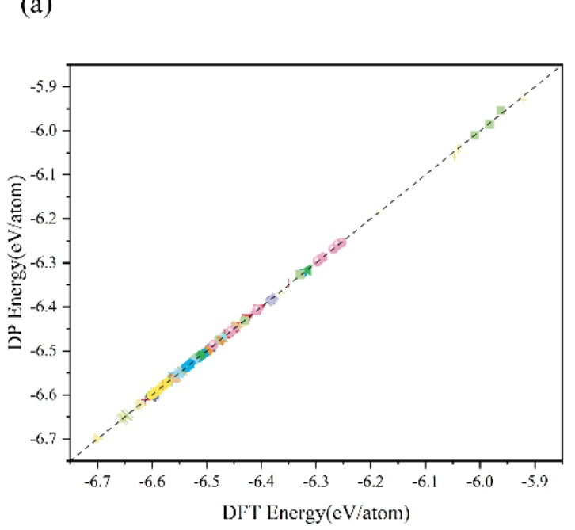

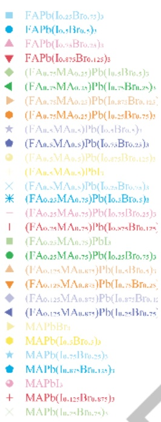

(b)

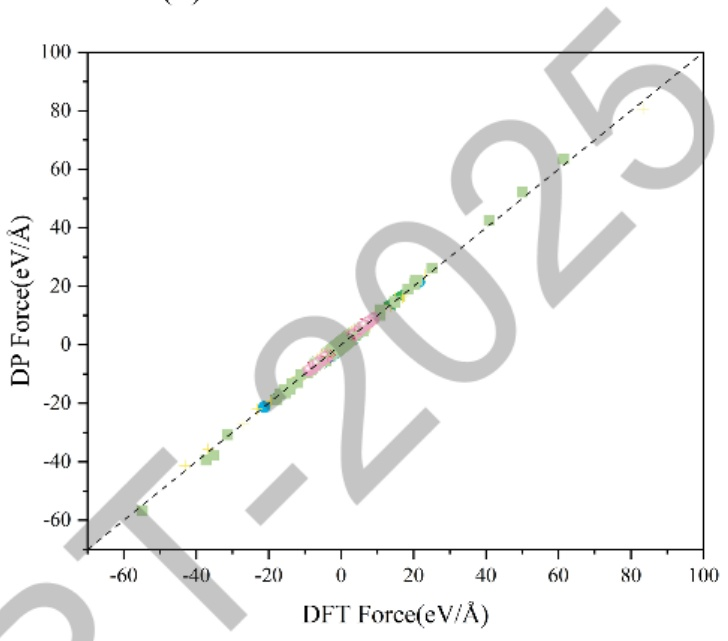

图3DP与DFT在29个钙钛矿体系验证集上的(a)能量与(b)原子力对比。左侧为每原子能量（eV/atom)，右侧为原子力（eV/Å），虚线为理想一致性线。多数体系的数据点紧密分布在对角线附近，显示模型具有卓越的跨组分预测能力。

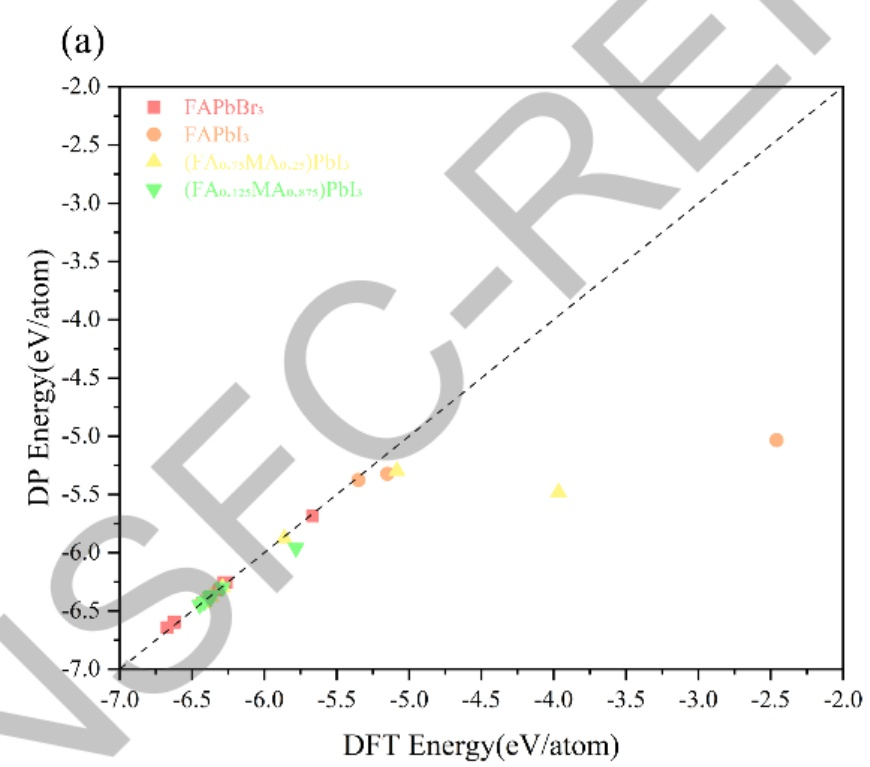

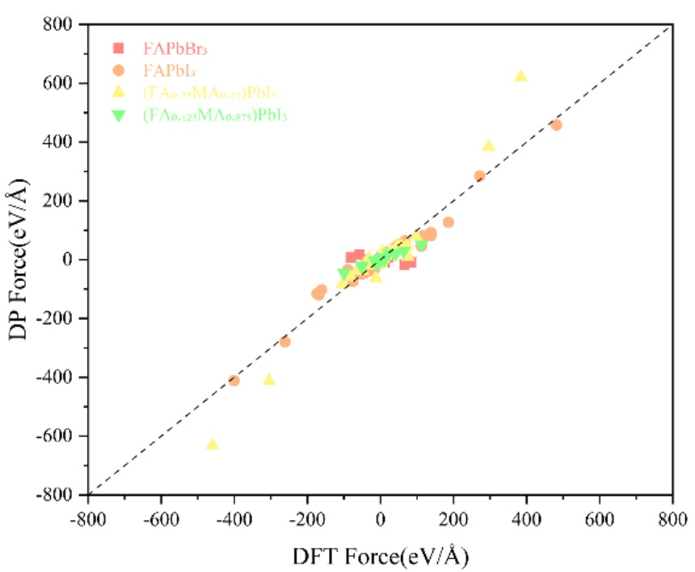

图 4 表现偏差较大体系（FAPbBr3、FAPbI₃及 FAxMA1-xPbI₃）的 DP 与 DFT (a)能量与(b)原子力对比

本研究成功构建了一个面向多组分有机-无机杂化铅卤钙钛矿体系的高精度机器学习势（MLP），通过迁移学习策略显著克服了小样本数据下的泛化瓶颈。以在大规模DFT数据上预训练的大原子模型 DPA-3.1-3M 为基础，针对其专为钙钛矿设计的 Hybrid Perovskite 分支进行微调，仅利用 1825个高质量单点计算样本（涵盖 33种 A/X位掺杂组合），即实现了能量 RMSE低至 2.21 meV/atom、力RMSE为26.2 meV/Å的预测精度。模型在绝大多数体系中展现出优异的跨组分外推能力，验证集预测与DFT结果高度一致；对少数偏差较大体系（如FAPbBr3、富FA混合相）的误差分析进一步揭示了局域结构复杂性对势函数建模的挑战。该MLP不仅继承了预训练模型的物理一致性，还大幅降低了训练成本，为后续开展大尺度、长时间分子动力学模拟、相变机制探索及材料稳定性预测提供了高效可靠的原子级模拟工具，也为少样本条件下复杂有机无机杂化材料的势函数开发提供了有力工具。

## A.3 基于机器学习势的多组分钙钛矿热力学稳定性相图预测

最终构建的MLP具备优异的外推性能，能够准确预测不同掺杂比例、局域畸变及非平衡构型下的能量与原子力，为后续大尺度分子动力学模拟和材料性能预测提供了可靠的理论工具。在此基础上，我们利用该势函数对覆盖全组分空间(0 ≤ x ≤ 1, 0 ≤ y ≤ 1) 的数千个 FAxMA1-xPb(I1-yBrγ)3 构型进行高通量能量评估，并基于标准热力学定义计算其混合焓 ∆Hmix

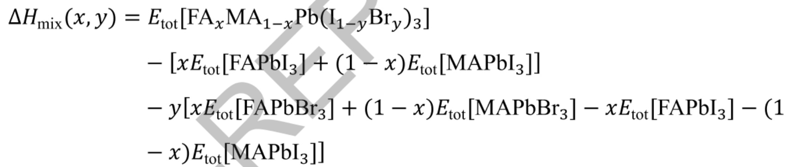

通过该流程，我们构建了连续、高分辨率的∆Hmix相图，清晰揭示了不同组分区域的热力学稳定性趋势:负混合焓区域预示固溶体稳定，而正混合焓则暗示相分离倾向。这一结果不仅验证了MLP在跨化学空间中的物理一致性，也为理性设计高稳定性、抗相分离的混合卤化物钙钛矿光伏材料提供了定量热力学依据。

## B. 完成钙钛矿稳定性和大面积生长关键因素识别

有机无机杂化钙钛矿太阳能电池发展迅速，铅基钙钛矿光电转换效率(PCE)已达25.5%，但铅的毒性和稳定性不足限制了产业化。锗基无铅钙钛矿因低毒性、强共价键等优势成为替代方向，然而Ge²+易氧化为Ge4+，最高PCE仅7.11%，远低于铅基体系。界面工程是优化器件性能的关键，MXene作为新型二维材料，表面官能团可灵活调控，在铅基钙钛矿中已展现性能提升潜力，但在锗基钙钛矿中的界面作用机制尚未明确，亟需通过理论计算揭示调控规律。

本研究通过第一性原理电子结构计算，系统探究无铅锗碘钙钛矿(MAGeI₃)与二维碳化钪MXene（Sc₂C）的界面特性，旨在通过界面工程提升锗基钙钛矿光电性能，研究先分析了MAGeI₃的 GeI₂终端和MAI终端两种表面模型的稳定性，明确MAI终端表面能（0.005-0.014J/m²）远低于GeI₂终端表面（0.092-0.102 J/m²)，是能量上更优的结构；同时研究了 Sc₂C在 F、O、OH 三种官能团修饰下的稳定构型与电子结构，发现 Sc₂CF₂形成能最低（-12.05 eV）、 稳定性最优。基于晶格失配 < 5%、界面结合强度、能带排列三大核心指标，构建 MAGeI₃/Sc₂C异质结模型后，进一步分析得出 MAI/F界面呈现 Ⅱ型能带排列，可高效促进光生电子-空穴分离，而MAI/O界面为Ⅰ型能带排列，不利 载流子分离；通过调控 MXene 表面官能团，异质结功函数可在 2.60-4.45 eV 范围内精准调控，且 Sc₂C MXene 的引入显著提升异质结在可见光区域的光吸收系数，界面相互作用以弱范德华力为主，MAI终端的异质结界面结合更强（结合能0.22-0.28 eV)。

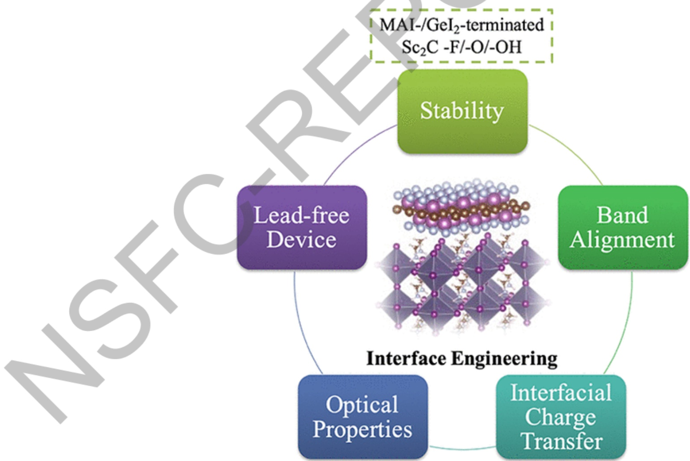

图5 界面工程提升钙钛矿稳定性及光电性能

该研究为混合钙钛矿(FA1-xMAxPb (I1-yBry)₃)的界面改性提供直接理论参考，可通过引入MXene构建防护层抑制氧化降解，支撑项目稳定性提升目标；MXene增强光吸收的策略为混合钙钛矿光电性能优化提供新思路；界面能级匹配和结合强度的调控规律，可减少大面积制备中因界面不匹配导致的缺陷，提升器件一致性；其建立的表面终端-官能团修饰-异质结性能理论分析框架，可直接迁移至混合钙钛矿的界面设计与性能预测，加速高稳定性组分筛选效率。

## C.完成基于机器学习方法的材料设计、性质预测及同步辐射数据解析

## C.1. 完成机器学习势方法扩展，实现全局神经势函数构建矿机器学习势构建

纳米酶因高稳定性、高催化活性和明确活性中心，成为天然酶的理想替代方向，在生物医学、化工等领域具有广阔应用前景，但高效纳米酶的合理设计仍面临催化机制不明确的挑战。二维二硫化钼（MoS₂）凭借低成本、高稳定性和优异电子性能，常被用作纳米酶载体，但其基面催化惰性且活性位点集中在边缘或缺陷处，限制了催化效率的提升。单原子催化剂能最大化原子利用率、调控电子结构，为解决MoS₂基面惰性问题提供了有效途径，其中廉价易得的非贵金属Cu负载的MoS₂催化剂已在多领域展现潜力，但在酶样催化领域的作用机制尚未明确，亟需通过理论与实验结合揭示其调控规律

本研究通过构建全局神经网络（G-NN）势函数，结合随机表面行走（SSW）方法和密度泛函理论（DFT）， 系统探究了MoS2、Cu@MoS₂及硫空位修饰的Cu@MoS₂-Vs在不同酸碱环境下催化H₂O₂分解的过氧化物酶样活性，同时通过动力学实验验证了理论结果，如图6所示。研究发现，Cu单原子负载能通过形成 Cu-S 共价键稳定吸附于MoS₂表面，使 H₂O₂分解的能垒从纯 MoS₂的 1.81 eV 降至 0.41 eV；硫空位工程进一步提升了 Cu 原子的吸附稳定性（吸附能达4.96 eV 并优化了电子转移效率；酸性环境下的 Cu@MoS₂-Vs 表现出最高催化活性，H₂O₂分解的速率决定步能垒仅0.24 eV，且 Michaelis 常数 Km=2.05 mmol/L、最大反应速率 Vmax=1.09×10-7mmol/(L·s)，显著优于纯 MoS₂（Km=4.94 mmol/L，Vmax=0.54×10-7mmol/(L·s))。电子结构分析表明，Cu单原子负载、硫空位引入与酸性环境调控的协同作用，能加速Cu与H₂O₂间的电子转移，提升催化剂导电性，从而强化催化性能。我们的研究结果为设计和开发用于重要生物医学应用的 MoS2 单原子载体提供合理的策略。

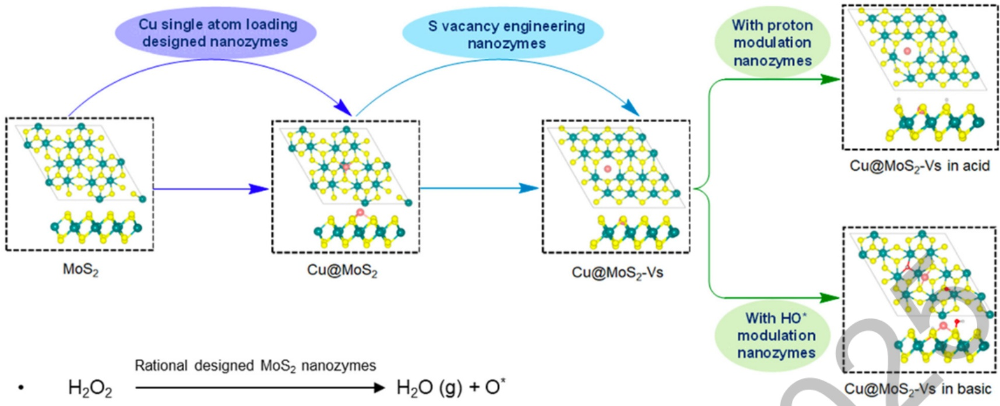

图 6 通过铜表面修饰调节过氧化物酶活性的 MoS2纳米酶合理设计示意图

该研究MoS₂的表面修饰（单原子负载、缺陷工程）与微环境调控策略，也为混合钙钛矿的界面改性与稳定性提升提供新思路，助力解决钙钛矿氧化降解问题；构建的 G-NN势函数及“机器学习 + DFT +实验验证”的研究框架，为混合钙钛矿普适势函数的开发提供了直接技术参考。

## C.2. 完成机器学习辅助同步辐射 WAXD 快速解析纳米结构

同步辐射微聚焦 X射线衍射（SAXS/WAXD）是表征生物材料等体系中纳米纤维3D取向分布的核心技术，但其传统分析方法依赖迭代参数拟合，存在耗时久、依赖专业知识、结果易受初始参数影响等缺陷。随着同步辐射技术发展，SAXS/WAXD与断层扫描结合产生的4D/5D海量数据，对实时、高通量分析提出了迫切需求，而现有方法难以满足这一挑战。尽管机器学习已在Ⅹ射线相关光谱分析中展现潜力，但针对纳米纤维衍射数据的多目标回归分析尚未有报道，亟需开发专属的快速自动分析方案。

本研究提出一种基于机器学习的3D纳米纤维取向提取方法，假设X射线照射区域由两组纳米纤维主导，通过对模拟数据进行噪声添加、块掩蔽等数据损坏处理，结合角度标签转换解决预测中的跳跃不连续性问题，训练了包括全连接神经网络（FCNN）在内的六种机器学习算法。结果表明，FCNN模型表现最优能精准学习衍射数据与纤维取向参数的非线性关系，对模拟数据和螳螂虾甲壳的实验WAXD数据均展现出高预测精度，重构曲线与原始曲线匹配度高，且分析速度较传统方法大幅提升，无需人工干预即可实现批量数据处理，还可扩展至多组纤维取向分析场景。该成果可直接应用于纳米材料的多尺度衍射断层扫描数据自动化分析，为同步辐射光束线搭建在线数据处理pipeline提供技术支撑，实现实验过程的实时调整与快速反馈，助力高性能材料的结构设计与性能优化。

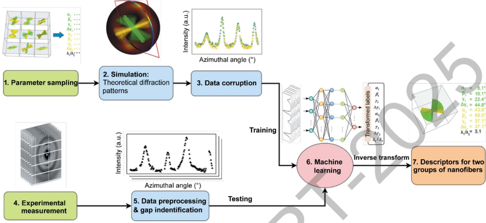

图 7 机器学习辅助同步辐射 WAXD 快速解析纳米结构框架

该工作建立的机器学习解析框架，可通过同步辐射 WAXD数据快速提取钙钛矿薄膜的晶体取向、晶粒排列等关键参数，为大面积生长中薄膜均匀性与缺陷控制提供实时数据支撑；此外，该方法的高通量分析能力，可加速混合钙钛矿不同组分、不同生长条件下的结构 性能关系研究，助力高稳定性组分的快速筛选。

## C.3. 完成机器学习赋能同步辐射角分辨光电子能谱分析

电子能谱(尤其是角分辨光电子能谱ARPES)是材料科学中核心表征技术，直接获取电子能量-动量色散关系、费米面结构等关键信息，是研究量子材料体相互作用的利器。随着时间分辨ARPES、Nano-ARPES等先进技术的发展及同步辐射装置的升级换代，实验数据正朝着高通量、高维度方向爆发式增长，但传统数据处理依赖人工迭代拟合，存在耗时久、依赖专业知识、易受主观因素影响等缺陷，难以满足深层物理信息挖掘与实时分析的需求。而机器学习具备自动化处理复杂高维数据的天然优势，为解决光电子能谱数据处理的效率与精度瓶颈提供了关键途径。

本研究系统总结了机器学习在光电子能谱领域的核心应用与进展:在数据降噪方面，提出两种无需手动标注的高效思路，通过模拟实验噪声生成数据对或直接分离光谱与噪声，有效提升低信噪比数据质量；在电子结构与化学成分分析方面，借助聚类、卷积神经网络等算法，实现能带结构重建、自能提取、元素组成快速识别等，大幅降低人工于预与工作量；在光谱预测方面，结合第一性原理计算的电子结构信息，通过机器学习建立映射关系，可快速预测材料的光电子能谱，为材料设计提供指导。同时，研究展望了机器学习在光电子能谱领域的未来方向，包括构建自动化数据采集与分析系统、设计机器学习和第一性原理完整工作流、融合图神经网络、迁移学习等更多先进算法，以提升模型的可解释性 鲁棒性该成果可广泛应用于量子材料（超导体、拓扑材料等）的电子结构研究 同步辐射线站的高通量实验数据处理、新型功能材料的设计与表征，尤其适用于需要快速解析复杂能谱数据的前沿科研场景，为同步辐射技术的智能化发展提供了重要支撑。

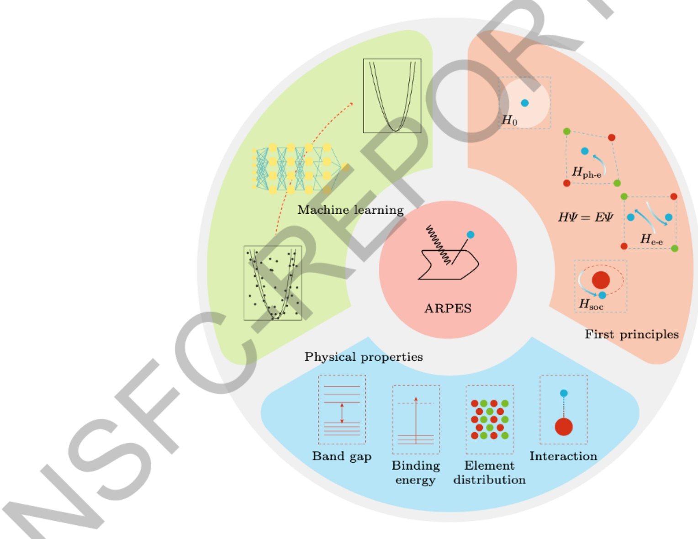

图8机器学习在光电子能谱中的应用

该工作涉及机器学习在光电子能谱中的数据降噪、电子结构提取方法，可直接迁移至混合钙钛矿的同步辐射表征数据处理，助力快速解析钙钛矿的能带结构、缺陷态等关键信息；文中提出的自动化数据采集与分析框架，可为钙钛矿大面积生长中的实时监测提供技术参考，通过同步辐射光电子能谱数据的实时分析，快速反馈薄膜生长过程中的成分与结构均匀性，优化制备工艺。

## C.4. 同步辐射数据驱动 AI 赋能钙钛矿等新型材料发现

同步辐射技术凭借高分辨率、高灵敏度的优势，为材料科学、生命科学等领域提供了原子、电子尺度的结构与动态信息，尤其第四代同步辐射光源(如HEPS)能产生海量高维数据，推动材料研究向深水区发展。但同步辐射数据存在量大、复杂、维度高的特点，传统分析方法依赖人工、效率低下，且实验机时宝贵、AI模型缺乏可解释性，严重制约了数据价值的挖掘。而人工智能具备高效处理复杂高维数据、自动化分析、挖掘隐藏关联的能力，恰好契合同步辐射数据的分析需求，二者融合成为解决材料研究瓶颈的关键途径。

本工作系统总结了同步辐射数据（X射线成像、X射线吸收光谱XAS、X射线衍射/小角散射 XRD/SAXS）与人工智能结合在材料发现中的应用成果:在数据处理方面，通过卷积神经网络（CNN）、主成分分析（PCA）等算法实现数据降噪、降维与快速解析；在材料性能预测与结构分析方面，借助随机森林、人工神经网络（ANN）等模型，从光谱、衍射数据中提取结构描述符，建立结构-性能关联；在新材料发现方面，通过晶体图卷积神经网络（CGCNN）、贝叶斯优化等实现高通量筛选与实验指导。针对当前面临的数据复杂、实验成本高、模型不可解释等挑战，研究提出构建同步辐射AI数据库、标准化实验记录系统、可解释AI预测模型三大解决方案，为二者深度融合扫清障碍。其中，同步辐射AI Data Bank具体构建方案，支撑同步辐射结构化谱学大模型预训练的数据库供给，在传统数据库和 AI 数据库的基础上，设计完成同步辐射 AI 数据银行 SR Data Bank 的组成架构 (如图9所示)，可广泛应用钙钛矿等新型电池材料、催化材料、量子材料等领域的结构表征、性能预测与新材料开发，尤其适用于同步辐射光束线的高通量实验数据处理、在线分析与实验方案智能优化，为材料科学研究提供高效、自动化的技术工具。

## Synchrotron Radiation Big Data

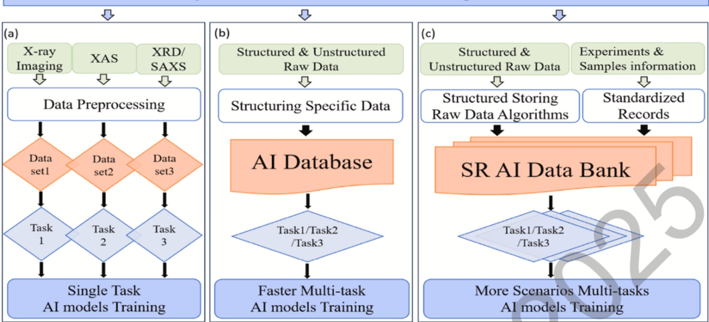

图 9 基于(a)传统数据库、(b)AI 数据库的(c)同步辐射 AI 数据银行架构

本工作提出的同步辐射AI数据库构建思路，可为搭建混合钙钛矿多组分数据资源库提供参考，整合不同组分、生长条件下的同步辐射数据与性能数据，加速高稳定性组分的筛选；此外，标准化实验记录系统与可解释AI模型，提升项目实验的可重复性与结果可信度，帮助明确混合钙钛矿稳定性与大面积生长的关键影响因素。

## D. 完成有机无机杂化钙钛矿界面优化与同步辐射结构-性能表征验证

准2D钙钛矿因具备优异的稳定性在光伏领域极具应用潜力，但有机配体的绝缘特性和量子阱结构会阻碍载流子传输，导致短路电流密度（Jsc）偏低，PCE难以突破，成为其产业化的关键瓶颈。聚（3,4 - 乙烯二氧噻吩）:聚苯乙烯磺酸盐 （PEDOT:PSS）作为常用空穴传输层（HTL），虽具备高透光性、良好柔韧性等优势，但酸性本质会破坏钙钛矿层，且其核壳结构会限制电荷传输效率，而目前对准2D钙钛矿器件的优化多集中于钙钛矿层本身，对空穴传输层（HTL）的改性及HTL对钙钛矿生长的调控研究相对匮乏，亟需开发兼顾 HTL性能提升与钙钛矿结晶优化的策略。

本研究通过将吡啶基分子（吡啶、2 -戊基吡啶等）引入PEDOT:PSS，同步优化HTL性能与钙钛矿层结晶行为，实验与密度泛函理论计算表明，吡啶基分子与PEDOT或PSS之间的电子转移及PEDOT与PSS的解离，提升了HTL的导电性和能级匹配度，为电荷提取与传输提供了高效通道；同时，借助同步辐射技术开展的原位掠入射广角X射线散射（GIWAXS）研究揭示，吡啶基分子通过形成Pb-N配位键构建化学桥，增强了钙钛矿中间相的稳定性，减缓结晶速率，促使（PEAo.8BAo.2）2MA₃Pb₄I1₃钙钛矿薄膜形成面外择优取向和有序的相分布—退火过程中，原位GIWAXS实时追踪到中间相信号的演化，发现吡啶修饰组的中间相信号更丰富且消失更缓慢，证实其对结晶过程的调控作用；此外，GIWAXS表征还显示，改性后的钙钛矿薄膜（111）晶面衍射峰更尖锐、强度更高，无杂散散射信号，表明晶体有序度显著提升。同步辐射 射线吸收精细结构（XAFS）分析进一步验证了界面相互作用，Pb L₃-edgeX 谱图及傅里叶变换结果显示，吡啶修饰的 PEDOT:PSS/PbI₂体系中 Pb—N 配位键，与标准样品 PbPc的特征一致，证实了吡啶氮与 Pb²+的强相互作用。最终，经吡啶基分子改性的准 2D钙钛矿太阳能电池器件性能显著提升，Jsc 大幅增加，PCE 突破17%，且湿度稳定性和热稳定性得到明显改善。该成果可直接应用于高性能准 2D 钙钛矿太阳能电池的制备，为 HTL 改性与钙钛矿结晶调控提供了高效策略，尤其适用于对稳定性和载流子传输效率有高要求的光伏器件开发。

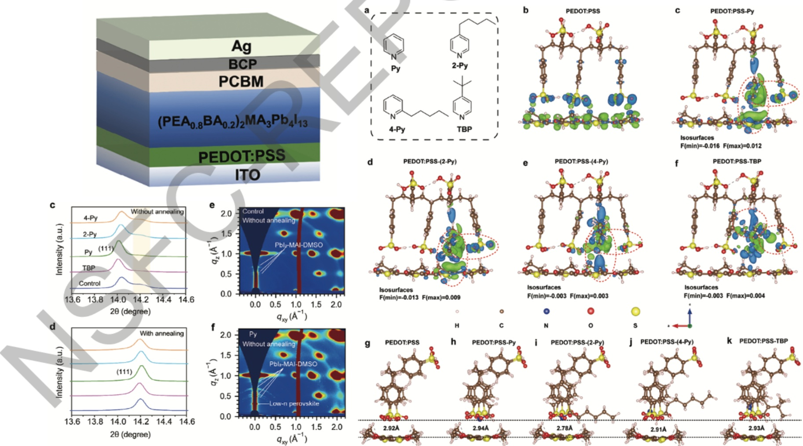

图7同步辐射表征实验（GIWAXS/XRD）和密度泛函理论计算，发现高效电荷传输及光电性能增强的机制

该研究研究聚焦的HTL改性及钙钛矿结晶调控策略，直接支撑了有机无机杂化钙钛矿大面积生长的核心目标，其中化学桥的形成与界面调控机制，可减少混合钙钛矿薄膜制备中的缺陷的产生，提升薄膜均匀性与器件一致性；其优化

HTL与钙钛矿界面兼容性的思路，为解决混合钙钛矿的稳定性问题提供了新方向；同时，研究中建立的“DFT计算+原位同步辐射表征”的分析框架，可用于混合钙钛矿的组分优化与结晶机制研究，加速高稳定性、高性能混合钙钛矿材料的开发进程。

## 3. 研究人员的合作与分工。

伍力源:项目负责人，负责项目的整体执行、研究方向把控与资源协调，同时负责有机无机杂化钙钛矿机器学习势构建、分子动力学模拟研究、结合密度泛函理论分析钙钛矿界面相互作用、稳定性机制。组织研究结果的总结 文章写作发表，培养研究生。

徐德庭、孙明辉:负责基于机器学习方法的材料设计、性质预测及同步辐射数据解析，包括普适机器学习势函数训练、同步辐射WAXD/ARPES解析、同步辐射数据驱动AI赋能钙钛矿等新型材料发现。 数据整理，文章写作。

邓祥文、柴雨茹:负责钙钛矿薄膜的原位 GIWAXS、XAFS、WAXD等同步辐射数据采集与解析，验证理论模拟预测结果。数据整理，文章写作。

## 4. 国内外学术合作交流等情况。

伍力源:2025年7月，BSRF第二十九届用户学术年会暨HEPS用户研讨会，“基于 DFT+机器学习的智能化 ARPES数据解析”，口头报告

伍力源:2025年10月，中国地质大学《案例实务选讲》系列报告，报告“AI赋能同步辐射:构建智能解析新范式与驱动材料创新”，口头报告

伍力源:2024年10月，第一届硬X射线光电子能谱(HAXPES)论坛，上海光源，参加会议

伍力源:2025年10月，AI+大科学装置应用端战略研讨会，高能同步辐射光源，参加会议

伍力源:2023年10月，先进光源实验控制与数据采集科学软件研讨，英国金刚石光源，参加会议

5. 存在的问题、建议及其他需要说明的情况。无

## （二）成果部分

## 1. 项目取得成果的总体情况。

本项目围绕有机无机杂化钙钛矿高稳定性与高性能设计核心目标，系统完成机器学习势构建、模拟预测、结构设计、实验验证的相关研究，已发表学术论文7篇，构建了理论与实验深度融合的核心成果体系，达成既定研究目标，为钙钛矿大面积生长及产业化应用提供了一定的理论支撑。

在理论建模与模拟体系方面:成功构建适用于混合阳离子/阴离子钙钛矿（FA1-xMAxPb（I₁-yBry)₃）的普适机器学习势函数，采用迁移学习策略，基于预训练大原子模型微调，仅通过 1825 个高质量 DFT 样本实现高精度预测，覆盖33 种不同掺杂比例体系，具备优异跨组分泛化能力。基于该势函数完成全组分空间热力学稳定性相图预测，明确混合焓分布与相分离倾向，为高稳定性组分设计提供定量热力学依据。

在稳定性关键影响因素识方面:通过界面工程理论研究与实验调控，明确影响钙钛矿稳定性和大面积生长的核心机制:界面层面，揭示MXene材料表面官能团与钙钛矿表面终端的相互作用规律，特定界面组合可高效促进载流子分离并提升光吸收效率；制备层面，发现吡啶基分子添加剂可通过配位键调控钙钛矿结晶过程，诱导面外择优取向，同时优化空穴传输层导电性与能级匹配度。

在AI赋能材料设计与数据解析方面:建立多维度机器学习辅助研究体系:开发同步辐射WAXD数据快速解析方法，实现纳米结构参数自动化提取，大幅提升分析效率； 提出同步辐射 ARPES 数据 AI 降噪、能带重建方案，降低人工依赖；提出构建同步辐射AI数据银行架构，为钙钛矿高通量数据存储与多任务模型训练提供解决方案。

在实验验证与性能提升方面:基于同步辐射GIWAXS、XRD等技术，建立钙钛矿结构与性能的构效关系，实验验证了高稳定性组分的优异性能:经吡啶基分子改性的准2D钙钛矿太阳能电池功率转换效率（PCE）突破17%，湿度稳定性与热稳定性显著改善；通过界面调控与结晶优化，有效减少薄膜缺陷，提升薄膜均匀性与器件一致性，为大面积生长质量管控提供标准化实验方法。

综上，项目既在理论方法上实现传统力场拓展与AI技术创新应用，又在实验层面验证了高稳定性、高性能钙钛矿材料的设计方案，为该类材料走向实际应用提供了一定的理论依据、技术方法与实验支撑。

## 2. 项目成果转化及应用情况。

本项目已完成构建适用于混合阳离子/阴离子钙钛矿（FA1-xMAxPb(l1-yBry)₃）的普适机器学习势函数，能够快速预测全组分空间的热力学稳定性与相分离倾向，将大幅减少传统“试错式”实验的时间与成本。通过界面工程理论研究与实验调控，明确影响钙钛矿稳定性和大面积生长的核心机制，有望支撑钙钛矿大面积产业化生产；建立的多维度机器学习辅助研究体系，为钙钛矿高通量数据存储与多任务模型训练提供解决方案，可进一步开发为商业化数据平台， 整合钙钛矿及其他功能材料的同步辐射成像、光谱、衍射数据，提供数据存储、检索、建模分析服务，支撑高校、科研院所及企业的高通量材料研发，加速新型钙钛矿衍生物、杂化材料的发现进程。基于同步辐射GIWAXS、XRD等技术，建立钙钛矿结构与性能的构效关系，实验验证了高稳定性体系的优异性能。此外，项目成果的技术原理具备跨领域迁移潜力，可拓展至更多功能材料领域，为其他功能材料的研发提供可复用的技术范式，具备显著的产业化价值与广阔的应用前景。

## 3. 人才培养情况。

## 伍力源晋升副研究员。

协助培养了两名博士生孙明辉、徐德庭，已顺利通过毕业答辩并取得博士学位。培养一名硕士生邓祥文，目前已转为博士，本人任博士副导师。

## 4. 其他需要说明的成果。


## 5. 项目成果科普性介绍或展示网站。

钙钛矿材料在光伏等领域潜力巨大，但稳定性不足、难以大面积制备的问题制约其应用。本项目针对这一核心痛点，通过机器学习构建多组分钙钛矿普适模拟工具，识别界面调控、结晶优化等关键影响因素，结合AI辅助同步辐射数据解析，实现高稳定性钙钛矿的精准设计与实验验证。该成果为钙钛矿材料的高效研发与产业化落地提供了可行的技术路径，助力低成本高性能光伏器件的推广应用。

## 研究成果目录

项目负责人通过系统，从文献库中检索研究成果或者按要求格式自行填入。请按照期刊论文、会议论文、学术专著、专利、会议报告、标准、软件著作权、科研奖励、人才培养、成果转化的顺序列出，其它重要研究成果如标本库、科研仪器设备、共享数据库、获得领导人批示的重要报告或建议等，应重点说明研究成果的主要内容、学术贡献及应用前景等。

项目负责人不得将非本人或非参与者所取得的研究成果、与受资助项目无关的研究成果、未标注国家自然科学基金资助和项目批准号的论文以及取得时间早于项目资助期开始时间的研究成果列入报告中。发表的研究成果（包括专利），项目负责人和参与者均应如实注明得到国家自然科学基金项目资助和项目批准号，科学基金作为主要资助渠道或者发挥主要资助作用的，应当将自然科学基金作为第一顺序进行标注。

## 期刊论文

(1) Wu, Liyuan; Dong, Chao; Chen, Changcheng; Zhao, Lina; Lu, Pengfei; Yang, Kesong; Interface Engineering at Sc2C MXene and Germanium Iodine Perovskite Interface: First-Principles Insights, Journal of Physical Chemistry Letters, 2022, 13(50). SCIE. 第二标注

(2) Yuru Chai; Liyuan Wu; Yu Chen; Guikai Zhang; Xihong Guo; Dan Wang; Jinquan Dong; Huan Huang; Lina Zhao; Baoyun Sun; Tuning Hole Transport Properties and Perovskite Crystallization via Pyridine-Based Molecules for Quasi-2D Perovskite Solar Cel1s, Smal1, 2024, 20. SCIE. 第三标注

(3) Xiangwen Deng; Liyuan Wu; Rui Zhao; Jiaou Wang; Lina Zhao; Application and prospect of machine learning in photoelectron spectroscopy, Acta Phys. Sin., 2024, 73(21). SCIE. 第三标注

(4) Deting Xu; Wenyan Yin; Jie Zhou; Liyuan Wu; Haodong Yao; Minghui Sun; Ping Chen; Xiangwen Deng; Lina Zhao; Rational design of MoS2-supported Cu single-atom catalysts by machine learning potential for enhanced peroxidase-like activity, Nanoscale, 2023, 15(14). SCIE. 第三标注

(5) Qingmeng Li; Rongchang Xing; Linshan Li; Haodong Yao; Liyuan Wu; Lina Zhao; Synchrotron radiation data-driven artificial intelligence approaches in materials discovery, Artificial Intelligence Chemistry, 2024, 2(1). 第三标注

(6) Minghui Sun; Zheng Dong; Liyuan Wu; Haodong Yao; Wenchao Niu; Deting Xu; Ping Chen; Himadri S. Gupta; Yi Zhang; Yuhui Dong; Chunying Chen; Lina Zhao; Fast extraction of three-dimensional nanofiber orientation from WAXD patterns using machine learning, IUCrJ, 2023, 10(3). SCIE. 第四标注

(7) Ping Chen; Liyuan Wu; Bo Qin; Haodong Yao; Deting Xu; Sheng Cui; Lina Zhao; Computational Insights into Acrylamide Fragment Inhibition of SARS-CoV-2 Main Protease, Current Issues in Molecular Biology, 2024, 46(11). SCIE. 第五标注

## 会议报告

(1）伍力源；AI赋能同步辐射:构建智能解析新范式与驱动材料创新，中国地质大学《案例实务选讲》系列报告，北京，2025-10-16至2025-10-16.

(2) 伍力源；基于DFT+机器学习的智能化ARPES数据解析，BSRF第二十九届用户学术年会暨HEPS用户研讨会，北京怀柔，2025-07-16至2025-07-18.

## 学术交流

(1) 2023-10-22至2023-10-27，参加举办或参加学术会议/参加国际学术会议/先进光源实验控制与数据采集科学软件，英国牛津郡，伍力源.

(2) 2024-10-11至2024-10-13，参加举办或参加学术会议/参加国际学术会议/第一届硬X射线光电子能谱(HAXPES)论坛，上海光源，伍力源.

(3) 2025-10-28至2025-10-30，参加举办或参加学术会议/参加国际学术会议/AI+大科学装置应用端战略研讨会，北京怀柔，伍力源.

## 项目成果应用前景

本项目成果拟应用领域:1、钙钛矿设计与研发2、钙钛矿产业化

预计在5-10年推广使用

附表:研究成果统计数据表（本表针对各种类型资助项目收集数据以便进行整体资助效果分析使用，并非要求每类项目都具有以下各类成果。

```
                   国家级                      1 部级
        自然科学奖     科技进步奖      发明奖     自然科学奖     科技进步奖    其他
获奖（项）  一等   二等   一等   二等   一等  二等    等    等    一等  二等
       0    0    0    0    0    0    0    0    0    0    0
      特邀学术报告           学术论文           学术专著         其他
学术报告/论 国际学术 国内学术 发表论文数   论文检索收录情况
                     SCIE/  北大中文                    科研仪器
文/专著/其 会议 会议
              期论义
                  会议
 他（篇）                 SSCI EI 核心期刊 CSSCI 中文 外文 标本库 数据库 设备 重要报告
       0   0   7  0   6   0   0   0   0   0   0  0   0   0
           专利（项）             标准                   成果转化
专利/标准/  国内      国外             国内       软件著作
软著/成果转                国际                  权             经济效益
  化   申请  授权  申请  授权     国家  行业  地方  企业     技术转让技术许可作价投资 (万元)
       0   0   0  0    C  0   0   0   0   0   0   0  0   0
                 人才培养（人）                    举办和参加学术会议
人才培养及     中青年学术带头人   出站博士后 毕业博士 毕业硕士 举办国际学术会议 举办国内学术会议 参加国际学术会议
 学术交流 优青  杰青 创新群体 其他                 次数  人数  次数  人数  次数  人数
       0   0   0   0   0    0    0   0   0   0   0   3   310
```

## 国家自然科学基金包干制项目决算表

```
    项目批准号：62205338                     项目负责人：伍力源                             金额单位：万元
行次                    科目名称                                        金额
 (1) 一、项目总经费                                                                       30.0000
 (2) 二、累计支出数                                                                       27.0753
 (3)  （一）项目直接费用                                                                    22.4155
                                                              025
 (4)  1、设备费                                                                        0.0000
 (5)   其中：设备购置费                                                                    0.0000
 (6)  2、业务费                                                                        13.4155
 (7)  3、劳务费                                                                        9.0000
 (8)  （二）项目间接费用                                                                     4.6598
 (9)    其中：绩效支出                                                                    0.6600
 (10) 三、项目结余数                                                                      2.9247
 (11) 四、结余资金比例                                                                      9.75%
```

注:1.本表中（1）、（2）、（3）、（10）、（11）行为系统自动生成，无需填写。

2.第（2）行=第（3）+（8）行；

第（3）行=第（4）+（6）+（7）行；

第（10）行=第（1）-（2）行；

第（11）行=第（10）行/第（1）行\*100%。

# 决算说明书（包干制）

（请按照《国家自然科学基金包于制项目决算表编制说明》等的有关要求，说明项目资金支出情况、资金结余情况、单价50万元(含)以上的设备情况、资金管理和使用过程中的问题建议，以及其他需要说明的事项。

## 1. 预算支出情况:

本项目总经费共30万元，截至2025年12月31日累计支出金额为27.0753万元，执行率为90.25%。其中，直接经费支出22.4155万元，间接经费支出4.6598万元。项目严格按照国家自然科学基金资助项目资金管理办法执行。

## 详细预算执行情况如下:

1）设备费实际支出0万元。

2）业务费实际支出13.4155万元，其中差旅/会议/国际合作与交流费12.3651万元，主要用于举办首届AI+大科学装置应用端战略会、以及出访英国钻石光源；出版/文献/信息传播/知识产权事务费1.0504万元。

3）劳务费实际支出9万元，主要用于支付举办战略研讨会专家劳务费。

4）间接经费实际支出4.6598万元，其中，绩效支出0.66万元，为据实际科研需要和我单位薪酬标准发放的，用于激励科研人员的绩效支出。

## 2. 资金结余情况:

项目结余经费2.9247万元，结余经费占总经费的比例为9.75%。结题后将根据项目的后续推进情况与实际需求，继续对剩余经费进行合理列支

3. 单价50万元（含）以上的设备情况:无。

4. 资金管理和使用过程中的问题建议:无。

5. 其他需要说明的事项:无。

结余资金情况说明

注:结余资金比例超过30%的项目该部分必填。

```
项目负责人承诺：
  我所承担的项目（编号：62205338 名称：基于机器学习势的新型杂化钙钛矿性能预
测与验证）结题报告内容真实，数据准确，未出现《国家科学技术保密规定》中列举的属
于国家科学技术秘密范围的内容，不涉及敏感科技信息。在今后的研究工作中，如有与本
项目相关的成果，将如实注明得到国家自然科学基金项目资助和项目批准号，并报送国家
自然科学基金委员会。
                          项目负责人（签
                           日期：
 依托单位科研管理部门：  依托单位财务管理部门：   依托单位审查意见：
负责人（签章）：      负责人（签章）：       依托单位公章：
日期：           日期：
科学处审核意见：
               EP
 完成情况  优   良   中   差   负责人（签章）：
 综合评分                  日期：
 (划√)
科学部核准意见
NSF
         对重点项目等）：
                           负责人（签章）：
                          日期：
 分管委领导意见（对重大项目等）：
                           委领导（签章）：
                          日期：
```

## 电子附件目录

```
序号   附件类型      附件名称          备注
 1 论著      代表作1
 2 论著      代表作2
 3 论著      代表作3
                            25
  论著
 4         代表作4
 5 论著      代表作5
 6 论著      非代表作
 7 其他      会议邀请函
```