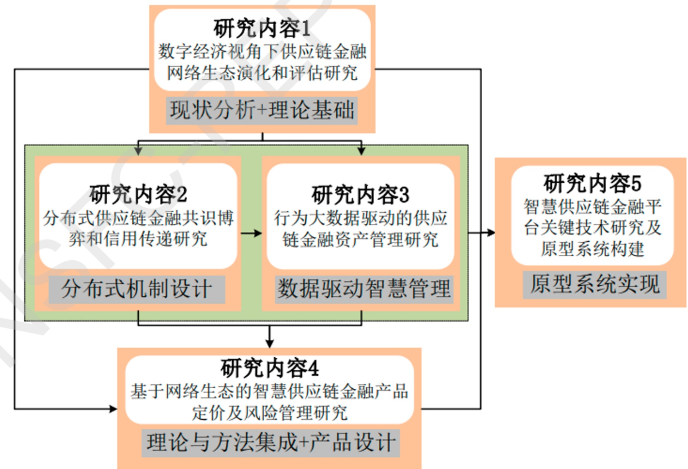
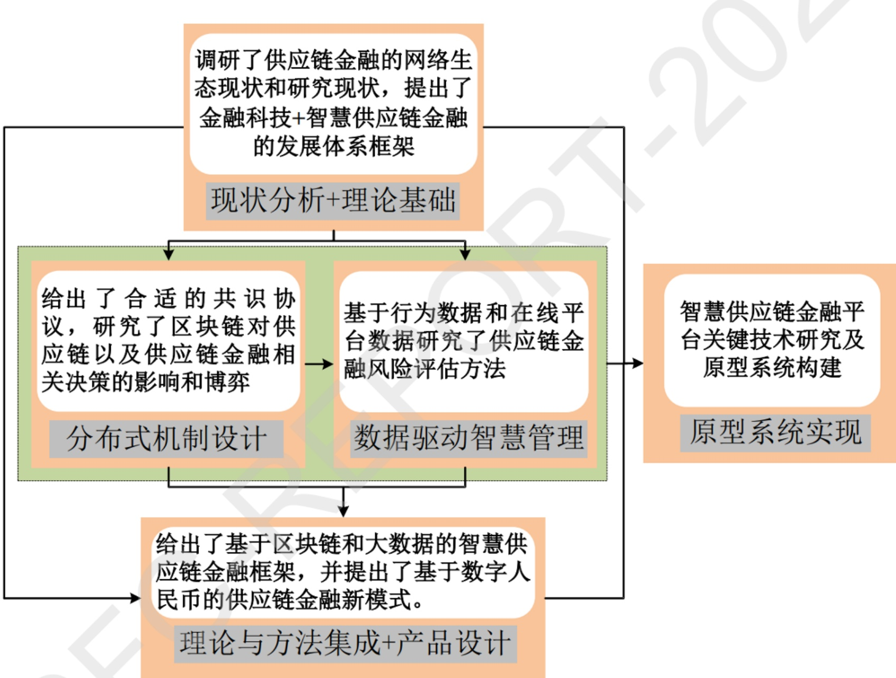

项目批准号 71932002申请代码 G0211归口管理部门收件日期

20240271932002

# 国家自然科学基金

# 资助项目结题/成果报告

资助类别:重点项目

亚类说明:

附注说明:基于网络生态的智慧供应链金融模式研究

项目名称:基于网络生态的智慧供应链金融模式研究

负责人:李健 BRID: 09618.00.21823

电子邮件:lijiansem@bjut.edu.cn

电话: 18514023940

依托单位: 北京工业大学

联系人:马琳

电话: 010-67391476

直接费用:240.0000（万元）

执行年限: 2020.01-2024.12

填表日期:2025年01月25日

国家自然科学基金委员会制（2023年）

## 项目摘要

## 中文摘要:

制造业的中小企业是实体经济重要组成部分，融资难融资贵是制约其发展的多年顽疾。供应链金融是解决其融资难融资贵的重要渠道，但存在信用传递难、非标资产定价难和风险控制难等痛点，导致普惠性与低风险难以兼得。数字经济下，供应链金融呈线上化和生态化发展趋势，基于网络生态发展智慧供应链金融模式，利用新一代信息技术优势，有望解决这一两难问题。本项目面向制造业供应链金融，通过发展和融合大数据和区块链等技术，采用金融衍生品定价、风险管理、博弈论等理论与方法，研究供应链金融中的网络生态全息画像与演化、分布式共识博弈、信用传递、非标资产定价及风险管理等核心问题，同时通过参与企业进行实证研究，发展智慧供应链金融模式，并构建智慧供应链金融原型系统。项目特色在于通过对供应链金融各主体进行全息画像和信用交叉验证，并对风险进行事前控制和动态监管，设计出普惠性高且违约率低的供应链金融产品，有助于推动金融更好地服务实体经济。

## Abstract:

Small and medium-sized manufacturing enterprises are an important part of the real economy. Difficult financing and expensive financing are the persistent problems that restrict their development for many years. Supply chain finance is an important solution to solve its financing difficulties and high cost. However, there are some painful points, such as credit transmission difficulties, non-standard asset pricing difficulties and risk control difficulties, which lead to the difficulty to achieve both inclusiveness and low risk. Under the digital economy, supply chain finance is developing on-line and ecologically. Based on the network ecological, it is hopeful to solve this dilemma via the smart supply chain financial model by utilizing the advantages of new generation information technology. This project is oriented to supply chain finance in manufacturing industry. By developing and integrating information technologies such as big data and block chains, using theories and methods of financial derivatives pricing, risk management and game theory, this project studies the core issues in supply chain finance such as network ecological holographic portrait and evolution, distributed consensus game, credit transmission, non-standard asset pricing and risk management. Empirical research is carried out in the enterprises that participates this project at the same time. Finally, this project will develop the financial model of smart supply chain and build the financial prototype system of smart supply chain. The characteristics of the project lie in the design of supply chain financial products with high inclusiveness and low default rate through the holographic portrait and cross-validation of credit of each main body of supply chain finance, as well as the pre-control and dynamic supervision of risks, which will help to promote finance to serve the real economy better.

关键词（用分号分开）:供应链金融；智慧金融；网络生态；非标资产定价；风险管理

Keywords (separated by;): Supply Chain Finance; Smart Finance; Network Ecology; Non-standard Asset Pricing; Risk Management

## 结题摘要

## 中文摘要（对项目的背景、主要研究内容、重要结果、关键数据及其科学意义等做简单概述）:

自项目获批以来，外部环境有三个重要发展变化:受新冠疫情影响，中小企业融资难融资贵更加突出，对供应链金融需求更加强烈；全球的贸易保护趋势不断增强，对供应链网络生态带来很大冲击；数字经济上升为国家战略，国家鼓励用区块链等新技术规范供应链金融。基于以上发展变化，项目研究内容包括:数字经济视角下供应链金融网络生态演化和评估；基于区块链的供应链金融共识博弈和信用传递；行为大数据驱动的供应链金融；基于金融科技的智慧供应链金融模式及风险管理；智慧供应链金融平台关键技术及原型系统构建。取得了如下结果:（1）调研了供应链金融的生态现状和研究现状，提出了金融科技+供应链金融的发展体系框架。（2）给出了分布式金融适合的共识协议，以及区块链在供应链中的信息发布、信用传递方面的影响和博弈均衡。（3）基于行为数据提出了企业信用评估方法以及顾客评级方法，研究了对供应链运营及供应链金融的影响。（4）给出了基于区块链和大数据技术的智慧供应链的平台框架，提出了基于数字人民币的供应链金融新模式，刻画并分析了大型设备行业以及建筑业供应链金融中的决策和风险管理问题。（5）对区块链技术进行了改进。建成了基于区块链技术的供应链金融原型系统，并设计仿真实验对系统有效性进行验证。截止目前，发表期刊论文106+1篇，其中FMS英文A类期刊9篇，FMS英文B类期刊19篇，FMS中文T1类期刊16篇。完成实地调研24次，案例研究3篇，参与完成标准2项，提出11项政策建议报告；完成供应链金融系统原型1个，举办或协办国际会议6次，国内会议1次。获省部级奖励6项。项目构建的基于区块链、大数据和数字人民币的智慧供应链模式，为该领域的研究提供了新的方向，丰富和发展了基于行为数据的企业信用评价的理论与方法，推动了区块链、数字人民币等金融科技在供应链金融中的应用。部分研究成果已在多个行业得到长期良好应用，产生了显著经济效益。

## Abstract (Brief description of research background, main methods, contributions, and research data):

Since the approval of this project, three significant external developments have shaped the research landscape. First, the COVID-19 pandemic has exacerbated the financing difficulties and high costs faced by small and medium-sized enterprises (SMEs), leading to a stronger demand for supply chain finance. Second, the increasing trend of global trade protectionism has posed substantial challenges to the supply chain network ecosystem. Third, the digital economy has been elevated to a national strategic priority, with the government actively promoting the adoption of blockchain and other emerging technologies to regulate and enhance supply chain finance. In response to these developments, this project has focused on several key research areas, including the evolution and evaluation of the supply chain finance network ecosystem from the perspective of the digital economy, consensus game theory and credit transmission in blockchain-based supply chain finance, behavioral big data-driven supply chain finance, smart supply chain finance models and risk management based on financial technology, as well as key technologies and prototype system development for smart supply chain finance platforms. This project has yielded several important research outcomes. (1)It has conducted a systematic investigation into the current state of the supply chain finance ecosystem and research landscape, proposing a development framework that integrates financial technology (FinTech) with supply chain finance. (2)It has developed consensus protocols suitable for distributed finance and analyzed the role of blockchain in information disclosure, credit transmission, and equilibrium in game-theoretic models. (3)Additionally, it has proposed enterprise credit evaluation and customer rating methodologies based on behavioral data and examined their impact on supply chain operations and supply chain finance. (4)The project has also developed a smart supply chain finance platform framework based on blockchain and big data technologies, proposed a new supply chain finance model based on the Digital Renminbi (e-CNY), and conducted

modeling and analysis of decision-making and risk management in supply chain finance for the large-scale equipment and construction industries. (5)Furthermore, it has enhanced blockchain technology for supply chain finance applications. A prototype system for supply chain finance based on blockchain technology has been built, and simulation experiments have been designed to validate its effectiveness. As of now, this project has produced significant academic contributions and practical impact. A total of 106 journal papers have been published, including 9 in FMS English A-tier journals, 19 in FMS English B-tier journals, and 16 in FMS Chinese T1-tier journals. It has conducted 24 field investigations, completed 3 case studies, participated in the development of 2 industry standard, and submitted 11 policy recommendation reports. Moreover, the project has developed one supply chain finance prototype system and has organized or co-organized 6 international and 1 domestic academic conference. It has also received 6 provincial and ministerial-level awards This project has developed an intelligent supply chain finance model integrating blockchain, big data, and the Digital Renminbi, providing a new research direction in the field. It has enriched and advanced the theories and methodologies of enterprise credit evaluation based on behavioral data while promoting the application of blockchain, the Digital Renminbi, and other FinTech innovations in supply chain finance. Some of the research findings have already been successfully applied across multiple industries, generating substantial economic benefits and long-term practical value.

关键词（用分号分开）:智慧供应链金融；区块链；大数据；网络生态；风险管理Keywords (separated by;): smart supply chain finance; block chain; big data; network ecology; risk management

## 正文

《结题/成果报告》正文分为两个部分:结题部分和成果部分。请按照《结题/成果报告》填报说明及撰写要求填写。

## （一）结题部分

## 1. 研究计划执行情况概述

## （1）按计划执行情况

项目计划研究内容主要分为五个子课题，具体包括:数字经济视角下供应链金融网络生态演化和评估；分布式供应链金融共识博弈和信用传递；行为大数据驱动的供应链金融；基于网络生态的智慧供应链金融产品定价及风险管理；智慧供应链金融平台关键技术及原型系统构建。自2020年1月启动以来，项目组围绕五个子课题（五个子课题的框架见图1）开展研究。各个子课题每周开展深入讨论，每个季度召开课题组整体成员的学术交流会，每半年左右组织顾问专家、政府与企业的专题研讨。

图1 项目研究框架

项目组根据研究内容制定了详细的研究计划，分年度实施，并根据研究主题的发展情况进行动态调整。总体而言，课题组在研究进度和成果发表各方面都按照申请书和计划书有序顺利地开展，按照计划完成了研究内容。

## （2）研究目标完成情况

本项目总体目标:基于供应链金融网络生态系统相关各方的协同，利用区块链、大数据等新一代信息技术进行数据等资源的共享，在扩大供应链金融服务受众面的同时，降低金融风险，促使多方共赢。本项目在理论层面和应用方面达到以下具体目标。理论目标:（1）建立基于区块链和大数据的供应链金融信用传递及资产管理的模型与方法，为智慧供应链金融模式创新提供理论支撑。（2）构建基于产业和金融结合的智慧供应链金融风险管理体系，以期降低智慧供应链金融风险。应用目标:开发、设计智慧供应链金融融资产品和服务，构建数字经济环境下可信智慧供应链金融原型系统。

## 项目预期成果及完成情况总结如表2。

表1 项目预期成果及完成情况

|  | 预期成果 | 完成情况 |
| --- | --- | --- |
| 1 | 发表学术论文45-50篇。其中，在 SCI/SSCI发表论文 20篇左右（含 UTD24 及 FT50 顶级论文3-5篇），在国家自然科学基金委员会指定的管理领域重要期刊上发表论文20篇-左右，在国际重要会议上发表论文10篇以上。 | 发表期刊论文106+1（管理科学学报接受）篇，其中 UTD24 论文 5 篇(MISQuarterly、Management Science、Production and Operations Management各1 篇，Information Systems Research 发表 2篇)，FMS 英文 A 类期刊论文 9篇（包含上述UTD 5篇）、B 类19篇，FMS 中文 T1 期刊 16+1 篇，FMS 中文T2期刊9篇，会议论文9篇。 |
|  | 调查研究、产品设计及平台应用报告4-5份。 | 完成实地调研24次，建议报告11研究3篇，参与完成标准2项；完成供应链金融系统原型1个。 |
| 3 | 申请专利或软著3-5个。 | 申请专利3项； |
| 4 | 培养青年教师5-8名，博士6-9名，硕士15-20名。 | 培养青年教师7名，博士毕业6位，硕士毕业22位； |
| 5 | 参加国际学术会议 10人次以上，举行相关国际学术会议或研讨会4-5 次。 | 在IJPE、JMSE、JSSI等组织期刊专刊3次；参加会议并做大会报告或者小组报告40次，举办或者协办国际会议6次，举办或协办国内会议1次。 |
| 6 | 申报省部级奖励1-2项。 | 获科研奖励20项，其中省部级奖励6项。 |

整体而言，项目组在理论研究、应用研究以及产出成果方面的进展，整体上达到了预期目标，部分内容超出了预期目标。

## 2. 研究工作主要进展、结果和影响

## (1) 主要研究内容

本项目原定研究内容涉及到区块链、大数据、数字经济等。，项目启动以来，项目组围绕总体目标，积极开展研究，各个子课题的研究进展和主要贡献总结见图2。

图2各个子课题的研究进展和主要贡献

## (2）取得的主要研究进展、重要结果、关键数据等及其科学意义或应用前景

自2019年9月项目获批以来，研究领域外部环境有三个重要发展变化:

①2020年起，受新冠疫情影响，中小企业融资难融资贵的困境更加突出，对供应链金融的需求更加强烈。例如2020年3月，银保监会出台《关于加强产业链协同复工复产金融服务的通知》，2020年9月，央行等8单位发布226号文《稳步推进供应链金融规范发展和创新》，凸显监管持续重视供应链金融，从原则理念走向落地实施。

②近年来全球贸易保护主义趋势显著增强，不仅引发了全球范围内的贸易摩擦，还导致全球供应链网络生态遭受严重冲击，供应链金融也受到深远影响。企业面临更高的贸易壁垒和不确定性，被迫重新评估和调整其全球供应链布局，增加了运营成本和风险。在此背景下，供应链金融也受到深远影响，金融机构需要重新评估供应链各环节的信用风险，融资成本上升，资金流动性受到挑战。全球供应链的碎片化和区域化趋势进一步加剧，供应链金融的复杂性显著增加。

③2019年7月底，银保监会向各大商业银行、保险公司下发《中国银保监会办公厅关于推动供应链金融服务实体经济的指导意见》，在国家层面鼓励用区块链等新技术规范供应链金融，明确了区块链在供应链金融的重要作用。2021年10月18日，中共中央政治局就推动我国数字经济健康发展进行第三十四次集体学习时，习近平总书记强调，要把握数字经济发展趋势和规律，推动我国数字经济健康发展。2021年12月12日国务院制定发布了《“十四五”数字经济发展规划》，强调推动产业互联网融通应用，培育供应链金融、服务型制造等融通发展模式，以数字技术促进产业融合发展。数字经济上升为国家战略，新冠疫情在一定程度上对数字经济发展起到了推动作用。

针对以上变化，项目组适时调整研究重点，特别加强了在数字经济加速发展和受疫情影响中小企业对供应链金融需求更加强烈的情景下的深入研究，着重在新的情景下区块链、大数据等在供应链金融中的应用，创新智慧供应链金融模式，给出新形势下的政策建议，减少疫情对中小企业融资的影响。

在理论研究方面，取得成果简介如下。

在数字经济背景下，从中国供应链金融以及金融科技发展存在问题出发，调研了供应链金融的网络生态现状和研究现状，提出了金融科技+智慧供应链金融的发展体系框架。

② 给出了分布式金融适合的共识协议，研究了区块链在供应链和供应链金融中的相关决策和博弈。

③ 基于行为数据提出了企业信用评估方法以及顾客评级及行为预测方法，基于在线平台数据研究了建筑供应链金融的风险评估方法，刻画并分析了大型设备行业的决策和风险管理建议，并对橙分期案例进行分析。

④给出了基于区块链和大数据技术的智慧供应链的平台框架，提出了基于数字人民币的供应链金融新模式并与其他模式进行了比较分析，并基于实际数据验证了其对供应链金融的影响。

⑤在采用区块链技术加强规范供应链金融的背景下，对区块链技术进行了改进，并设计了原型系统。

## 在应用研究方面，取得成果简介如下。

项目组积极开展调研，项目组田歆教授带领团队成员先后对悦达保理公司、湖南芙蓉兴盛、四川泉源堂、宝供物流集团、福建见福便利店、河北曹妃甸港、上海文景信息、武商集团、江西乐豆家便利店、联华物流、湖南东门大药房、贵州初好、贵州凯辉、竹子卖车、快手集团、成都商贸城、湖南绿叶集团、芙蓉兴盛、上海海鼎科技、山东振华集团、京东集团、中科微智、无锡苏南食材、北京链平方科技有限公司等24家单位进行实地调研，进行深入合作，取得如下成果。

①建成了基于区块链技术的供应链金融原型，并设计仿真实验对系统有效性进行验证。

②基于区块链、云计算、大数据等新兴技术，合作开发了适用于远洋港、内河港、陆港、铁路、公路等全过程的平台信息系统。并在该物流网络上加载支持大宗商品贸易，引入多家银行开展供应链金融业务。

③合作开发了零售行业的供应链金融服务平台，连接大型零售商和多家银行，为零售企业的供应商以应收账款提供供应链金融服务。

④ 合作支持了悦达保理公司在汽车、通讯等行业开展供应链金融与商业保理服务。

⑤提出的基于区块链的供应链金融模式和企业信用评估方法，应用到北京链平方科技有限公司的供应链金融项目，取得显著效益。

在疫情影响的背景下，完成多个关于中小企业纾困的调研建议报告，1篇被全国工商联采纳，1篇发表在凤凰财经网，1篇发表在中国能源网，1篇发表在新华网。

⑦依托中关村上市公司协会揭榜挂帅项目，完成《加强数字经济建设更好赋能实体经济》，2023年10月31日在人民政协报发表。

⑧ 2021年12月，及时响应国务院常务会议有关清理拖欠中小企业账款的精神，调研并完成《清理拖欠中小企业账款和保障农民工工资及时足额支付的建议》，2021年被全国工商联采纳并发表在人民政协网。

基于以上研究成果，截止目前发表期刊论文106+1(管理科学学报接受)篇，会议论文 9篇。发表期刊包括 FMS 英文 A 类期刊:Management Science、MIS Quarterly、 Information Systems Research、 Production and Operations Management、

Journal of Management Information Systems 、 Journal of the Association for Information Systems，以及 FMS 英文 B 类期刊:International Journal ofProduction Economics 、Frontiers of Engineering Management、Transportation Research Part E: Logistics and Transportation Review、 Annals of Operations Research、Computers & Operations Research、Internet Research、Information Sciences、Computers in Human Behavior 、Decision Support Systems 、 Operations Research Letters 、 Financial Innovation、International Journal of Electronic Commerce、Production Planning & Control、Journal of Business Research，以及 FMS 中文 T1 期刊，如管理科学学报（该文章2024年5月接受，预计2025年5月见刊）、管理评论、系统工程理论与实践、中国管理科学、系统工程学报、管理工程学报等。发表论文统计如下表。

表2 论文统计:按期刊类别

<table><tr><td>分类</td><td colspan="2">期刊 篇数</td></tr><tr><td>英文 FMS A</td><td>Management Science MIS Quarterly Information Systems Research Production and Operations Management Journal of Management Information Systems Journal of the Association for Information Systems</td><td>9</td></tr><tr><td>英文 FMS B</td><td colspan="2">International Journal of Production Economics Frontiers of Engineering Management D Transportation Research Part E Annals of Operations Research Computers &amp; Operations Research Internet Research Information Sciences Computers in Human Behavior Decision Support Systems Operations Research Letters Financial Innovation Production Planning &amp; Control Journal of Business Research</td></tr><tr><td>英文 FMS C</td><td>International Transactions in Operational Research Flexible Services and Manufacturing Journal Journal of Systems Science and Complexity North American Actuarial Journal Journal of Systems Science and Systems Engineering Electronic Commerce Research Journal of Retailing and Consumer Services</td><td>14</td></tr><tr><td>英文其 他</td><td>International Journal of Retail &amp; Distribution Management IEEE Transactions on Systems, Man, and Cybernetics: Systems IEEE Transactions on Services Computing</td><td>31</td></tr><tr><td></td><td>英文发表合计</td><td>73</td></tr><tr><td>中文FMST1</td><td>管理科学学报管理评论系统工程理论与实践中国管理科学系统工程学报管理工程学报</td><td>16+1</td></tr><tr><td>中文FMST2</td><td>系统管理学报系统科学与数学运筹与管理计量经济学报</td><td>9</td></tr><tr><td>中文其他</td><td>中国流通经济、学术前沿、经济与管理评论、运筹学学报、科技促进发展、运筹学学报、清华管理评论</td><td>8</td></tr><tr><td colspan="2">中文发表合计</td><td>33+1</td></tr></table>

表3论文统计:按研究领域

| 研究领域 | 英文发表 | 中文发表 | 合计 |
| --- | --- | --- | --- |
| 供应链金融网络生态演化和评估 | 8 | 7 | 15 |
| 分布式供应链金融共识博弈和信用传递 | 13 | 6+1 | 19+1 |
| 行为大数据驱动的供应链金融 | 29 | 9 | 38 |
| 智慧供应链金融产品定价及风险管理 | 12 | 10 | 22 |
| 智慧供应链金融平台关键技术 | 11 | 1 | 12 |
|  | 73 | 33+1 | 106+1 |

另外有学术专著共2本。

(1) 禹海波；李彤彤；李健；云制造环境下制造业服务资源管理决策研究，科学出版社，2022.

(2)田歆；连杰；陈维龙；陶继顺；社区团购中国零售的模式创新和商业实践，科学出版社，2024.

著作章节共1篇。

(1)李健，王亚静，宋昱光，冯耕中，等.我国供应链金融的实践发展及风险管理建议[R].2020社会管理重点问题研究报告.科学出版社.2021，82-94.

另外，项目组完成实地调研24次，案例研究3篇，参与完成标准2项，提出11政策建议报告；完成供应链金融系统原型1个，举办或协办国际会议6次，国内会议1次。获省部级奖励6项。项目构建的基于区块链、大数据和数字人民币的智慧供应链模式，为该领域的研究提供了新的方向，丰富和发展了基于行为数据的企业信用评价的理论与方法，推动了区块链、数字人民币等金融科技在供应链金融中的应用。部分研究成果已在多个行业得到长期良好应用，产生了显著经济效益。

## 3. 研究人员的合作与分工

课题分为5个专题，分别由专题负责人组织开展研究，每个专题都由2-3位老师和若干博士后、博士生与硕士生参加。与此同时，各个专题之间紧密合作，一个月至少一次的集中交流。主要人员的合作与分工见表3。

表4 课题组主要人员的合作与分工

|  | 姓名 | 职称 | 单位 | 工作内容 | 时间(月) |
| --- | --- | --- | --- | --- | --- |
| 1 | 李健 | 教授 | 北京工业大学 | 项目负责人，专题4负责人，总体规划、组织与实施 | 50 |
| 2 | 李泉林 | 教授 | 北京工业大学 | 专题1负责人，参与专题5的研究 | 24 |
| 3 | 魏先华 | 教授 | 中国科学院大学 | 专题2负责人，组织该专题实施，参与专题5研究 | 40 |
| 4 | 张文 | 教授 | 北京工业大学 | 专题3负责人，组织该专题的实施，参与专题4研究 | 40 |
| 5 | 赵建良 | 教授 | 香港中文大学(深圳) | 专题5负责人，组织该专题的实施 | 40 |
| 6 | 禹海波 | 教授 | 北京工业大学 | 参与专题1研究 | 35 |
| 7 | 贺舟 | 副教授 | 中国科学院大学 | 参与专题2研究 | 35 |
| 8 | 田歆 | 教授 | 中国科学院大学 | 参与专题3与4研究 | 35 |
| 9 | 李永武 | 副教授 | 北京工业大学 | 参与专题4研究，后面接替 | 40 |

<table><tr><td></td><td></td><td></td><td></td><td>李泉林教授负责的研究工作</td><td></td><td rowspan="31"></td></tr><tr><td>10</td><td>马静宇</td><td>副教授</td><td>徐州工程学院</td><td>参与专题1与专题5研究</td><td>30</td></tr><tr><td>11</td><td>杨飞飞</td><td>讲师</td><td>北京工业大学</td><td>参与专题1与专题5研究</td><td>30</td></tr><tr><td>12</td><td>夏兵</td><td>讲师</td><td>北京工业大学</td><td>參与专题1与4研究</td><td>30</td></tr><tr><td>13</td><td>董雪璠</td><td>讲师</td><td>北京工业大学</td><td>参与专题3研究</td><td>30</td></tr><tr><td>14</td><td>刘晓君</td><td>讲师</td><td>北京工业大学</td><td>参与专题4研究</td><td>30</td></tr><tr><td>15</td><td>冷杰武</td><td>副教授</td><td>广东工业大学</td><td>参与专题5研究</td><td>30</td></tr><tr><td>16</td><td>卞一洋</td><td>副教授</td><td>南京大学</td><td>参与专题 5 研究</td><td>30</td></tr><tr><td>17</td><td>樊瑞娜</td><td>博士后</td><td>复旦大学</td><td>參与专题1与5研究</td><td>30</td></tr><tr><td>18</td><td>常艳霞</td><td>博士生</td><td>北京工业大学</td><td>参与专题1与5研究</td><td>30</td></tr><tr><td>19</td><td>李爱娅</td><td>博士生</td><td>中国科学院大学</td><td>参与专题2研究</td><td>30</td></tr><tr><td>20</td><td>闫绍山</td><td>博士生</td><td>北京工业大学</td><td>参与专题3研究</td><td>30</td></tr><tr><td>21</td><td>王亚静</td><td>博士生</td><td>北京工业大学</td><td>参与专题4研究</td><td>30</td></tr><tr><td>22</td><td>朱士超</td><td>博士生</td><td>北京工业大学</td><td>参与专题4研究</td><td>30</td></tr><tr><td>23</td><td>王欢</td><td>博士生</td><td>北京工业大学</td><td>参与专题4研究</td><td>30</td></tr><tr><td>24</td><td>闫鑫</td><td>博士生</td><td>北京工业大学</td><td>参与专题4研究</td><td>30</td></tr><tr><td>25</td><td>薄俊鹏</td><td>博士生</td><td>北京工业大学</td><td>参与专题4研究</td><td>30</td></tr><tr><td>26</td><td>徐睿沄</td><td>博士生</td><td>香港城市大学</td><td>参与专题5研究</td><td>30</td></tr><tr><td>27</td><td>马亚倩</td><td>博士生</td><td>北京工业大学</td><td>参与专题1与4研究</td><td>30</td></tr><tr><td>28</td><td>孙雅南</td><td>博士生</td><td>北京工业大学</td><td>参与专题4研究</td><td>30</td></tr><tr><td>29</td><td>马腾键</td><td>博士生</td><td>北京工业大学</td><td>参与专题4研究</td><td>30</td></tr><tr><td>30</td><td>谢锐</td><td>博士生</td><td>北京工业大学</td><td>参与专题3研究</td><td>30</td></tr><tr><td>31</td><td>赵江鹏</td><td>博士生</td><td>北京工业大学</td><td>参与专题3研究</td><td>30</td></tr><tr><td>32</td><td>李瑞</td><td>博士生</td><td>北京工业大学</td><td>参与专题3研究</td><td>30</td></tr><tr><td>33</td><td>刘恒丽</td><td>博士生</td><td>燕山大学</td><td>参与专题1与5研究</td><td>30</td></tr><tr><td>34</td><td>马凡淇</td><td>博士生</td><td>燕山大学</td><td>参与专题1与5研究</td><td>30</td></tr><tr><td>35</td><td>王强</td><td>博士生</td><td>北京工业大学</td><td>参与专题3研究</td><td>30</td></tr><tr><td>36</td><td>宋昱光</td><td>硕士生</td><td>北京工业大学</td><td>参与专题4研究</td><td>20</td></tr><tr><td>37</td><td>渠珂</td><td>硕士生</td><td>北京工业大学</td><td>参与专题4研究</td><td>20</td></tr><tr><td>38</td><td>李雨亭</td><td>硕士生</td><td>北京工业大学</td><td>参与专题4研究</td><td>20</td></tr><tr><td>39</td><td>黄菲菲</td><td>硕士生</td><td>北京工业大学</td><td>参与专题4研究</td><td>6</td></tr><tr><td>40</td><td>李悦</td><td>硕士生</td><td>北京工业大学</td><td>参与专题4研究</td><td>6</td><td>」</td></tr><tr><td>41</td><td>黄婧雯</td><td>硕士生</td><td>北京工业大学</td><td>参与专题4研究</td><td>30</td><td>」</td></tr><tr><td>42</td><td>王立静</td><td>硕士生</td><td>北京工业大学</td><td>参与专题4研究</td><td>30</td><td>」</td></tr><tr><td>43</td><td>谢朝辉</td><td>硕士生</td><td>北京工业大学</td><td>参与专题3研究</td><td>18</td><td rowspan="4"></td></tr><tr><td>44</td><td>杨荣耀</td><td>硕士生</td><td>北京工业大学</td><td>参与专题3研究</td><td>6</td></tr><tr><td>45</td><td>单丹阳</td><td>硕士生</td><td>北京工业大学</td><td>参与专题1研究</td><td>20</td></tr><tr><td>46</td><td>黄伟桐</td><td>硕士生</td><td>北京工业大学</td><td>参与专题4研究</td><td>18</td></tr><tr><td>47</td><td>郭怿静</td><td>硕士生</td><td>中国科学院大学</td><td>参与专题2与5研究</td><td>20</td><td>」</td></tr><tr><td>48</td><td>李云放</td><td>硕士生</td><td>中国科学院大学</td><td>参与专题2与5研究</td><td>20</td><td>」</td></tr><tr><td>49</td><td>赵艳飞</td><td>硕士生</td><td>北京工业大学</td><td>参与专题3研究</td><td>20</td><td rowspan="3"></td></tr><tr><td>50</td><td>赵欣欣</td><td>硕士生</td><td>中国科学院大学</td><td>参与专题2与5研究</td><td>20</td></tr><tr><td>51</td><td>于海庆</td><td>硕士生</td><td>中国科学院大学</td><td>参与专题2与5研究</td><td>20</td></tr><tr><td>52</td><td>石浩</td><td>硕士生</td><td>北京工业大学</td><td>参与专题4研究</td><td>20</td></tr><tr><td>53</td><td>王雨婷</td><td>硕士生</td><td>北京工业大学</td><td>参与专题1研究</td><td>20</td></tr><tr><td>54</td><td>王宝玲</td><td>硕士生</td><td>北京工业大学</td><td>参与专题1研究</td><td>20</td></tr><tr><td>55</td><td>夏日</td><td>硕士生</td><td>北京工业大学</td><td>参与专题1研究</td><td>20</td></tr><tr><td>56</td><td>李彤彤</td><td>硕士生</td><td>北京工业大学</td><td>参与专题1与5研究</td><td>20</td></tr><tr><td>57</td><td>黄博闻</td><td>硕士生</td><td>中国科学院大学</td><td>参与专题2与5研究</td><td>20</td></tr><tr><td>58</td><td>张明薇</td><td>硕士生</td><td>北京工业大学</td><td>参与专题3研究</td><td>20</td></tr><tr><td>59</td><td>周秦</td><td>硕士生</td><td>北京工业大学</td><td>参与专题3研究</td><td>20</td></tr><tr><td>60</td><td>徐振杰</td><td>硕士生</td><td>北京工业大学</td><td>参与专题4研究</td><td>20</td></tr></table>

## 4. 国内外学术合作交流等情况

## （1）项目组成员与国际同行合作研究发表论文24篇

合作的部分国际同行包括:美国佛罗里达州立大学NoyanIlk教授、Guangzhi Shang 教授；美国俄勒冈州立大学商学院 Shaokun Fan 教授；美国史蒂文斯理工学院 Ye Yang 教授；美国纽约州立大学奥尔巴尼分校 Chun-Yu Ho 教授；美国德雷塞尔大学雷博商学院 Benjamin Lev 教授；美国理海大学 Yuliang Oliver Yao 教授；美国佐治亚州立大学罗宾逊商学院YusenXia教授；加拿大劳埃尔大学赵萱教授；加拿大西华盛顿大学 Zhe George Zhang 教授；加拿大温莎大学 Zhenzhong Ma教授；加拿大约克大学SongWang教授；英国牛津大学王婷艳博士；日本科学技术高级研究院 Taketoshi Yoshida 研究员；丹麦哥本哈根商学院 Qiqi Jiang 教授；香港理工大学郑大昭教授等。

详见附件。

## （2）担任国际期刊客座主编或领域主编，组织供应链金融相关专辑3次

项目组主持人李健、项目组成员贺舟与项目顾问专家汪寿阳研究员共同担任国际期刊 International Journal of Production Economics 的客座主编，主题为 Operations and Finance Interface in Supply Chains in the Era of Financial Technology;

②项目组成员赵建良教授、主持人李健与国际同行美国 Sang-PilHan教授担任期刊 Journal of Management Science and Engineering 特刊客座主编，主题:Frontiers of FinTech and Value Networks;

③ 项目组主持人李健、成员李永武与国际同行加拿大Donglei Du教授担任期刊 Journal of Systems Science and Information 特刊客座主编，主题:Blockchain Technology: Theory and Applications;

④项目组成员田歆教授担任国际期刊 Annals of Data Science的 Section Associate Editor。

（3）项目组成员担任国际会议主席或者程序委员会主席，主办获承办国际会议6次

① 项目组成员赵建良教授担任International Conference of Smart Finance的大会主席，在2020、2021、2022、2023、2024连续举办5届，项目组成员李健、李泉林等也担任会议的程序委员会委员进行协办。

② 项目主持人李健团队承办了 The 12th International Conference on Business Intelligence and Financial Engineering & The 3rd International Conference on Financial Technology (BIFE 2023 & ICFT 2023)，并担任程序委员会主席。

③项目组成员田歆教授担任 The 8th International Conference on Information Technology and Quantitative Management (ITQM 2020&2021)、The 9th International Conference on Information Technology and Quantitative Management (ITQM 2022)的程序委员会委员。

(4）项目组成员在国际国内学术会议作报告40次，其中大会邀请主旨报告报告6次。详见成果部分。

（5）项目组成员赴海外做访问学者或者进行联合培养

① 项目组成员李永武副教授目赴新加坡南洋理工做访问学者。

博士生闫鑫赴新加坡国立大学进行联合培养，访问 Robert De Souza教授。

③ 博士生朱士超赴美国佐治亚州立大学进行联合培养，访问 Yusen Xia教授。

## 5. 存在的问题、建议及其他需要说明的情况

项目开展五年来，项目组切实遵循项目申请书的计划和国家自然科学基金委专家的指导意见开展工作，但是在执行过程中遇到一些问题。这些问题主要来自于外部环境的变化以及新技术的快速发展。

自2019年9月项目获批以来，研究领域外部环境有三个重要发展变化:（1）2020年起，受新冠疫情影响，中小企业融资难融资贵的困境更加突出，对供应链金融的需求更加强烈。同时对于项目的实地调研和线下交流带来很大障碍。(2)全球的贸易保护及逆全球化的趋势不断增强，供应链韧性与安全越来越受到各国重视。对于供应链网络生态带来很大冲击。（3）数字经济上升为国家战略，区块链、元宇宙等新技术不断涌现，对供应链金融的发展带来显著影响。

上述外部环境和技术的发展变化，既有积极的影响，也有消极的影响。本项目原定研究内容涉及到区块链、大数据、数字经济等。项目组在数字经济加速发展和考虑逆全球化的影响的情景下，面向中小企业对供应链金融需求更加强烈的需求，进一步深入研究，创新智慧供应链金融模式，同时着重考虑如何通过智慧供应链金融模式的创新，增强供应链资金流的韧性与安全，给出新的形势下的政策建议，减少逆全球化与疫情对中小企业融资的影响。

其他需要说明情况:专题1负责人李泉林教授于2023年8月不幸离世，由李永武副研究员接替其研究工作。项目启动之日起，因疫情导致差旅活动减少，差旅费支出受限，剩余经费较多。

## （二）成果部分

## 1. 项目取得成果的总体情况

自项目获批以来，外部环境有三个重要发展变化:受新冠疫情影响，中小企业融资难融资贵更加突出，对供应金融需求更加强烈；全球的贸易保护趋势不断增强，对供应链网络生态带来很大冲击；数字经济上升为国家战略，国家鼓励用区块链等新技术规范供应链金融。基于以上发展变化，项目研究内容包括:数字经济视角下供应链金融网络生态演化和评估；基于区块链的供应链金融共识博弈和信用传递；行为大数据驱动的供应链金融；基于金融科技的智慧供应链金融模式及风险管理；智慧供应链金融平台关键技术及原型系统构建。取得了如下结果:在数字经济背景下，从中国供应链金融以及金融科技发展存在问题出发，调研了供应链金融的网络生态现状和研究现状，提出了金融科技+智慧供应链金融的发展体系框架。给出了分布式金融适合的共识协议，研究了区块链在供应链和供应链金融中的相关决策和博弈。基于行为数据提出了企业信用评估方法以及顾客评级及行为预测方法，基于在线平台数据研究了建筑供应链金融的风险评估方法，刻画并分析了大型设备行业的决策和风险管理建议，并对橙分期案例进行分析。给出了基于区块链和大数据技术的智慧供应链的平台框架，提出了基于数字人民币的供应链金融新模式并与其他模式进行了比较分析，并基于实际数据验证了其对供应链金融的影响。在采用区块链技术加强规范供应链金融的背景下，对区块链技术进行了改进，并设计了原型系统。截止目前，发表期刊论文106+1篇，其中 FMS 英文 A 类期刊 9 篇，FMS 英文 B 类期刊 19 篇，FMS 中文 T1 类期刊16+1篇。完成实地调研24次，案例研究3篇，参与完成标准2项，提出11项政策建议报告；完成供应链金融系统原型1个，举办或协办国际/国内会议6/1次。获省部级奖励6项。项目构建的基于区块链、大数据和数字人民币的智慧供应链模式，为该领域的研究提供了新的方向，丰富和发展了基于行为数据的企业信用评价的理论与方法，推动了区块链、数字人民币等金融科技在供应链金融中的应用。部分研究成果已在多个行业得到长期良好应用，产生了显著经济效益。

## 2. 项目取得的代表性成果

（1）在数字经济背景下，从中国供应链金融以及金融科技发展存在问题出发，调研了供应链金融的网络生态现状和研究现状，提出了金融科技+智慧供应链金融的发展体系框架

金融科技发展背景下供应链金融的生态和研究现状研究。基于当前金融科技（Fintech）在供应链运营和金融领域的迅猛发展，以及企业在全球供应链管理中面临的资金流动性挑战和运营效率问题，面对传统供应链金融模式的局限性，金融科技的应用，如区块链、大数据、人工智能和智能合约等，为供应链运营和融资提供了新的解决方案。采用系统性的文献综述方法，结合最新的研究成果，对供应链运营与金融科技的交叉领域进行了全面分析。构建了供应链运营与金融科技的整合框架，探讨了金融科技在供应链融资、风险管理、支付结算等方面的作用，并分析了其对供应链效率和企业绩效的影响。同时，总结了当前金融科技在供应链管理中的主要应用模式，并对其未来发展趋势进行了展望。研究结果表明，金融科技能够有效改善供应链融资环境，提高资金流转效率，增强供应链韧性，并降低交易成本。此外，论文还提出了一些关键的管理启示，为企业和政策制定者在供应链金融管理和数字化转型方面提供了参考建议。相关成果发表在International Journal of Production Economics, 2022。

公共卫生背景下供应链金融的生态和研究现状研究。供应链金融发展目前面临一个重要关口:新型肺炎疫情对全球经济影响广泛，既催生了对供应链金融的强烈需求，也带来了新的不确定性。从实践发展和理论研究两个方面，对供应链金融的现状进行梳理，在此基础上分析其未来发展趋势。首先对供应链金融的实践发展进行梳理，将其分为四个发展阶段进行分析。其次，借助文献计量工具对英文和中文文献进行了分析和比较，并从理论基础、优化决策以及风险管理三个方面对理论研究现状进行了总结。最后，提出了供应链金融的三个发展趋势，即形成健康网络生态系统是供应链金融发展的重要基础，采用现代金融科技赋能是供应链金融发展的有力工具，承担可持续发展的社会责任是供应链金融发展的长远目标:同时给出了值得关注的五个研究问题。1.数字经济下的供应链金融网络生态的有关研究；2.供应链金融多主体的机制研究；3.基于金融科技的智慧供应链金融模式创新和产品设计及定价研究；4.新环境和新技术下的供应链金融风险管理；5.可持续供应链金融的社会责任问题。成果发表在《系统工程理论与实践》，2020。

我国近年来供应链金融的风险事件分析。立足于产业供应链场景，总结了我国供应链金融的发展历程并分析了未来发展趋势，梳理了2010年到2020年供应链金融行业发生的风险事件，通过对其中涉及的风险进行分析，发现目前供应链金融主要面对来自微观运营的风险，包含信用风险、合规风险和操作风险等，在此基础上总结了风险事件爆发的规律。进一步从微观（信用风险、操作风险和信息技术风险)和宏观(虚增金融杠杆比率、引发金融市场过度波动、监管风险)两方面具体分析了金融科技的快速发展给供应链金融服务带来的潜在风险和监管挑战。最后结合我国供应链金融未来发展趋势以及发展过程中出现的问题，提出了五个方面的建议，分别是:政府部门发挥主导作用，大力支持发展供应链金融；运用大数据、区块链等金融科技手段，加强供应链金融服务平台建设；创新供应链金融服务模式，推进数字化供应链金融发展；鼓励金融机构及各大资本参与，拓宽资金来源；搭建监管科技平台，不断完善现有金融监管体系。该成果收录于2020社会管理重点问题研究报告，科学出版社，2021。

## （2）给出了分布式金融适合的共识协议，研究了区块链在供应链和供应链金融中的相关决策和博弈

提出了一种新的稳健权益证明（RPoS）共识协议。数字经济时代，发展分布式稳健经济体系变得越来越重要。区块链技术可以用来构建这样的系统，但目前的主流共识协议容易受到攻击，使得区块链系统难以为继。本研究提出了一种新的稳健权益证明（RPoS）共识协议，该协议使用币种数量来选择矿工，并限制币龄的最大值，以有效避免币龄积累攻击和无利害关系（N@S）攻击。在比较框架下，我们表明RPoS在能耗，鲁棒性和交易处理速度三个维度上等于或优于工作量证明（PoW）协议和权益证明（PoS）协议。为了比较三种共识协议在交易效率方面的表现，我们建立了一个基于代理的模型，发现RPoS协议的交易请求满足率高于PoW和 PoS，因此，我们认为 RPoS非常适合构建数字经济分布式系统。本研究对区块链系统和代币经济的设计者、实践者和研究者提供了一定的技术价值。成果发表在 The Journal of Artificial Societies and Social Simulation，2020。

区块链技术在品牌所有者主导的双渠道供应链信用传递中的作用。本研究探讨了区块链技术在品牌所有者主导的双渠道供应链中信用传递的作用，重点关注其对市场份额和渠道冲突的影响。研究发现，区块链技术通过信用传递使得存在市场总潜力提升（TMPI）效应和市场份额调整（MSA）效应，能够增强产品可追溯性并扩大市场需求。分析表明，区块链技术对零售商始终有利，但品牌所有者是否采纳区块链技术取决于MSA效应和零售商市场份额的阈值条件:当MSA效应较小且零售商在区块链技术情景下的市场份额超过一定阈值时，品牌所有者应采纳区块链技术；否则，仅在TMPI效应足够大时采纳区块链技术才是明智之举。此外，MSA效应在缓解渠道冲突和部分协调供应链方面发挥了积极作用。研究为品牌所有者是否采纳区块链技术提供了管理启示，特别是在提升产品可追溯性和优化市场份额分配方面，同时为供应链管理和防伪策略提供了理论支持和实践指导。成果发表在International Journal of Production Economics, 2023。

基于综合集成方法论的区块链驱动下供应链金融决策研究。目前针对供应链金融和区块链两者融合的定性研究较多，但定量研究非常少。本研究以中小企业仓单质押业务为研究对象,基于从定性到定量分析的综合集成方法论,将区块链在供应链金融中的影响由目前文献中的定性分析提升为定量分析。一方面研究了生产企业在使用区块链技术前后的贷款和生产决策；另一方面通过 VaR 风险计量方法对比分析了使用区块链技术前后银行的质押率决策,并进行算例分析。研究表明,相对于其他企业,初始库存量高、利润率高的企业可以更大程度地受益于区块链技术。此外,在同样的风险容忍水平下，使用区块链技术后银行的质押率上限提高,意味着区块链的使用可以帮助生产企业获得更高的贷款。研究结论对于企业和银行使用区块链技术的决策有一定的借鉴意义。成果发表在《管理评论》,2020,32(07):302-314.被引109次，中国知网高被引论文。

区块链技术对资金约束双渠道供应链的影响研究。本研究构建了一个由制造商、零售商和银行组成的资金约束双渠道供应链博弈模型，探讨了区块链技术在缓解银企间信息不对称和提升产品可追溯性方面的作用。研究通过对比不采用区块链技术（情形N）和采用区块链技术（情形T）两种情景下的均衡决策和利润，分析了区块链技术对零售商融资环境及供应链各方的影响。研究发现，区块链技术能够显著减小融资缺口并降低融资成本，从而改善零售商的融资环境；其市场潜力激励效应对制造商、零售商和银行均产生积极影响，而信息不对称缓解效应的影响则因参与者类型而异:对高质量零售商和银行始终有利，对低质量零售商始终不利，而对制造商仅在零售商资金约束不严重时有利。此外，智能合约的应用能够帮助银行避免道德风险，进一步增强区块链技术对高质量零售商和银行的积极作用。研究结果为区块链技术在赋能普惠金融和提升供应链可追溯性方面的实践提供了理论支持和管理启示，对供应链各方在采纳区块链技术时的决策具有重要参考价值。成果被《管理科学学报》录用。

需求波动视角下区块链技术在资金约束供应链中的价值研究。本研究从需求波动的角度探讨了区块链技术在供应链金融中的实施效果，重点关注区块链技术对均衡决策的影响以及零售商的采纳动机。通过对比分析采纳与未采纳区块链技术情景下的三方Stackelberg博弈，研究发现，当需求波动降低系数足够大时，区块链技术能够在维持相同服务水平的同时减少订购量，从而避免库存过剩并降低相关的破产风险，进而促使银行下调利率。此外，当区块链技术的采纳成本足够低时，采纳区块链技术能够提高零售商的利润。研究结果表明，区块链技术不仅能够缓解需求波动对供应链金融的不利影响，还能优化供应链各方的决策互动。本文为中小企业何时应采纳区块链技术以及采纳后供应链金融业务中各方的决策提供了重要的管理启示，为区块链技术在供应链金融中的实际应用奠定了理论基础，并具有显著的实践指导意义。成果发表在International Transactions in Operational Research, 2024。

（3）基于行为数据提出了企业信用评估方法以及顾客评级及行为预测方法，基于在线平台数据研究了建筑供应链金融的风险评估方法，刻画并分析了大型设备行业的决策和风险管理建议，并对橙分期案例进行分析

基于多模态学习的供应链金融中小企业信用风险预测研究。针对现有信用风险预测模型主要依赖静态企业数据（如财务报表、企业人口统计数据），而忽略了反映企业动态融资行为的行为数据的不足，本研究提出了DeepRisk方法。该方法通过融合企业人口统计数据与融资行为数据，以提升供应链金融中SMEs信用风险预测的准确性。具体来说，DeepRisk方法首先采用多模态学习策略，将静态企业人口统计数据（如企业注册信息、财务状况）与动态融资行为数据（如融资金额、还款周期、利率等）进行融合，以充分利用多源异构数据的信息。其次，

为设计有效的数据融合与特征提取机制，DeepRisk方法分别对静态与动态数据进行特征学习，并在数据融合阶段采用特征拼接策略，生成用于信用风险预测的输入向量。最后，DeepRisk方法利用前馈神经网络(FNN)对信用风险进行预测，并采用合成少数类过采样技术（SMOTE）来解决数据类别不平衡问题。基于真实供应链金融平台数据（包含企业融资行为数据和企业人口统计数据），本研究将所提出的DeepRisk方法与多种基线模型（包括决策树、随机森林、支持向量机、朴素贝叶斯、逻辑回归）进行对比实验。实验结果验证了该方法的优越性，并为未来信用风险管理提供了新思路，特别是在如何利用多源异构数据提升信用风险评估方面具有重要实践价值。成果发表在 Transportation Research Part E: Logistics and Transportation Review, 2022。

基于深度强化学习的供应链金融中小企业信用风险预测研究。针对中小企业（SMEs）信用风险预测中数据不平衡的问题，即违约中小企业的比例远小于非违约中小企业的比例，本研究提出了一种新的深度强化学习（DRL）方法DRL risk。该方法将信用风险预测中误分类造成的实际损失纳入到决策过程，在提升中小企业非均衡信用风险预测（ICRP）准确性的同时，有效地减少金融机构的实际损失。具体来说，本研究首先将中小企业的ICRP问题表述为一个马尔可夫决策过程，该过程将SMEs的信用评估描述为一个顺序决策问题。然后，引入了一个基于实例的奖励函数，将经济损失纳入到决策过程，以区分不同信用风险预测中误分类所造成的实际损失。最后，采用深度对抗神经网络（Deep DuelingNeural Network）优化决策过程，提高信用风险预测的稳定性和准确性。该网络由两个分支组成，一部分用于估计整体环境价值，另一部分用于计算不同决策的优势，从而更有效地区分违约企业和非违约企业。此外，在训练过程中引入ε-贪心策略（ε-GreedyStrategy），平衡模型的探索与利用能力，确保充分学习违约企业特征。为了验证方法的有效性，本研究基于真实供应链金融平台数据进行实验，并与多种基线模型（决策树、随机森林、支持向量机、深度神经网络、DeepRisk）进行对比分析。实验结果验证了该方法的优越性，并为未来的信用风险管理提供了新思路。成果发表在 Annals of Operations Research，2024。

基于混合模型链的建筑行业在线供应链金融信用风险评估。在新冠肺炎疫情的影响下，建筑产业链上游的中小企业面临着高昂的运营成本和紧张的现金流问题，融资需求更加强烈。作为一种基于平台的综合服务，在线供应链金融可以缓解建筑行业中小企业的融资问题。然而，有效评估在线供应链融资过程中的信用风险已成为金融机构面临的重要问题。提出了一种基于混合模型链的在线供应链风险评估方法，针对建筑业供应链中融资企业的特点，包括融资企业的地位、核心企业的地位，供应链的运营状况和融资资产的状况，建立了金融信用风险评估体系。基于该系统，分别通过XGBoost算法和 SMOTENC算法获得评估系统的最佳指标数和少数样本。基于RF的分类方法被应用于判断建筑行业供应链中融资企业的信用风险。提出的信用风险评估方法比学术界常用的方法具有更好的性能，评估准确率平均提高了6.39%，曲线下面积平均增加了6.95%。我们的研究为融资服务平台的资金监控系统提供了有意义的探索，以提高融资效率和风险管理水平。该部分成果发表在 International Journal of Intelligent Systems，2022.

考虑消费者资金限制的大型设备行业制造商的渠道选择。构建了一个包含垄断制造商和两类消费者（有资金约束和无资金约束）的市场模型，分析了制造商在销售、租赁以及混合策略（即同时销售和租赁）三种模式下的盈利能力，考虑了消费者的资本约束和耐用品的使用寿命。本研究的分析结果为大型建筑机械制造商的市场运作提供了新的视角。随着市场需求结构的变化和资本约束消费者比例的增加，制造商需重新评估其渠道选择，以实现利润最大化。成果发表在数学》，2022。

供应链金融商业模式、场景创新与风险规避—基于“橙分期”的案例研究。供应链金融商业模式通过场景创新实现价值创造。在供应链金融中，商业模式创新的关键是解决好信用传递和风险问题。研究旨在探索供应链金融模式创新的动因、路径、作用机理以及风险规避措施。首先，商业模式创新的核心是由场景创新驱动的商业运作模式创新；同时，场景创新过程中可能引发信用传递风险。研究借助“橙分期”的案例分析，提出供应链金融场景创新型商业模式，探讨这种供应链金融模式的作用机理及信用传递机制创新机理与风险规避手段。力图给供应链金融行业以更多“场景创新”理念上的启示，从而更好地推进供应链实体经济与供应链金融健康发展。成果发表在《管理评论》，2022。

（4）给出了基于区块链和大数据技术的智慧供应链的平台框架，提出了基于数字人民币的供应链金融新模式并与其他模式进行了比较分析，并基于实际数据验证了其对供应链金融的影响

区块链驱动的中小企业供应链金融解决方案:近年来，随着加密货币和数字资产的发展，区块链技术引起了广泛关注。作为加密货币的底层技术，区块链具有诸多优势，例如去中心化、集体维护、防篡改、可追溯性和匿名性。区块链技术在金融领域的潜力得到了广泛认可。尽管已有学者提出将区块链与供应链金融相结合，但关于二者结合的具体细节却鲜有提及。本研究首先分析了供应链金融与区块链技术之间的耦合关系；其次，提出了区块链驱动的供应链金融平台（BcSCFP）的概念框架；再次，设计了基于BcSCFP的三种供应链金融模型的运作流程；最后，结合实际事件进行了案例分析。成果发表在Frontiers of Engineering Management， 2020. 获得中国工程院院刊 Frontiers of Engineering Management 2014-2023年最有影响力论文奖（仅 25篇）。

基于与传统银行融资模式的比较，对DC/EP平台下中小企业融资模式的分析:基于中国中小企业融资难和融资成本高的现状，研究了数字人民币(DC/EP)在中小企业融资中的应用，并与传统银行融资模式进行了对比分析。研究成果为政府和金融机构提供了政策建议，包括推动DC/EP在企业融资中的普及，创新基于DC/EP的供应链金融产品，以及提供政策扶持以降低银行建立DC/EP贷款平台的成本，进而优化中小企业的融资环境。为基于DC/EP解决中小企业融资难问题提供了理论支持。成果发表在 Journal of Systems Science and Information, 2023。

基于数字化交易平台X的供应链金融产品模式研究。本研究以数字化交易平台X为研究对象，探讨了如何通过数字化技术优化供应链金融模式，解决中小微企业融资难题。研究内容聚焦于传统供应链金融模式（如应收账款池融资、动产质押融资）的局限性，提出数字化转型路径，结合平台X的案例，构建了涵盖智能风控、技术中台和开放生态的数字化供应链金融产品架构。研究方法上，采用文献资料法梳理供应链金融理论与技术应用，运用案例分析法深入解析平台X的业务流程、用户增长及风险管控效果，并借助数据分析验证模式的有效性。创新性地将数字化技术（如区块链、AI）与供应链金融结合，提出动态信用评估与智能风控方案，为金融机构和科技公司提供了实践参考；同时揭示了信息共享信任、账户建设及监管等现存问题，并提出提升技术能力、完善开放生态等建议，具有理论深化与实践指导双重价值。成果形成硕士论文，于海庆:毕业硕士，基于数字化交易平台X的供应链金融融资产品模式研究，2019-9至2021-6。

区块链技术在供应链金融中的应用研究:基于当前供应链金融业务的发展现状，研究了我国传统供应链金融的发展阶段及业务模式，分析传统供应链金融模式制约其发展的原因，并引入区块链技术来解决存在信息不对称等问题，并研究总结区块链技术应用到供应链金融业务的应收账款融资、预付账款融资、存货融资模式，比较与传统供应链金融模式的差异，提出区块链技术应用到供应链金融领域可以解决信息不对称、债权分割流转，贷后风险管控等问题，提高了供应链金融业务效率，具有较大的应用优势和应用价值。通过对两个聚焦于提供区块链供应链解决方案的案例企业进行深入剖析，研究出两个案例企业的共性特征，来凸现该领域已经相对成熟，同时利用两个平台赋能的某核心企业的前后建设效果对比来凸现区块链技术赋能供应链融资具有较大的应用价值。通过对两个聚焦区块链技术赋能供应链金融的企业进行深入的剖析，来证明区块链在供应链金融的应用优势和应用价值。成果形成硕士论文，赵欣欣:毕业硕士，区块链技术在供应链金融中的应用研究，2019-9至2021-6。

区块链技术在跨国B2B电商和供应链金融平台的创新应用和影响研究。在大宗商品供应链特别是大宗商品跨国贸易中，由于资金流、物流、信息流在跨国流动中需要多次核对和处理，效率较低而且成本高昂。项目团队参与了云南省一个跨国贸易平台的信息化项目建设，利用平台切换前后的业务数据集，证明了区块链技术可以有效降低跨国贸易和供应链金融的成本并提升运营效率。由于区块链的不可篡改性和可追溯性，基于区块链技术的平台实施有效解决了云南省与东南亚国家跨境贸易的几个现有问题。研究结果表明，运营成本、代理成本和时间成本在使用区块链技术后显著降低。区块链技术为交易双方减少了跨境贸易和结算支付的中介机构，提高了业务处理的及时性和跨部门业务协作的效率。本研究还为区块链技术及其在供应链和运营管理的应用提供了新的理论洞察和管理启示。这项研究源于2021-2022年合作的文景公司为云南省政府研发部署跨国贸易平台的项目实践，最终平台项目实施有效解决了云南省与东南亚国家跨境贸易的几个现有难题，成果同样正在新疆、黑龙江和广西等省份多个边境陆海港口得到推广应用。成果发表在 Production Planning & Control，2024。

## (5）在采用区块链技术加强规范供应链金融的背景下，对区块链技术进行了改进，并设计了原型系统

对区块链技术进行了改进，设计基于区块链技术的供应链金融原型。讨论了区块链系统如何克服潜在的网络安全障碍，设计了在制造系统中实施区块链应用程序的十个指标；完善了ManuChainⅡ平台。系统的实现主要分为三个层面:系统最前端通过可视化界面、应用程序编程接口等方式触及用户，提供最直接和融资业务相关的流程功能，包括“融资渠道群维护”、“合约全生命周期数据管理”、“基于规则的欺诈风险识别”等功能。这一层面有丰富的拓展性和兼容性，为企业提供既能满足当前使用、又充分预留未来发展空间的联盟链数据接入方案。中间层为工作流集成层。这一层面系统主要实现商业逻辑中的协同工作，可以有效连接多个企业间的数据，达成有效共享，使信息价值最大化；或实现企业内部多部门间的工作流传递，通过工作流上执行者责任的划定和流程的可追溯，有效降低内部沟通成本。中间层提供了定制化的数据流模式，针对不同行业、企业的特性，可开发专门模型，提升管理效率。最底层为数据持久化层。数据价值的保护离不开数据的持久储存，这一层面依据企业间的商业共识和数据管理要求，系统将数据严格依照共识和要求储存在敏感性不同的数据库中。以珠宝行业多级供应商之间为例:商业机密仅储存在供应商自有的计算节点中，而其余上下游企业仅可以通过哈希秘文等方式，在通过允许的情况下确认数据存在，而无法获得明文数据；而一些公开数据或依合规披露的数据，则由多方共同冗余保存，保证数据的真实不可篡改，同时降低合规运营的成本。

在此基础上开发了一个珠宝供应链融资管理平台，并设计仿真实验对系统有效性进行验证.基于Hyperledger Fabric联盟链实现了数据在珠宝生产商，品牌方，销售门店，金融机构（如银行），和第三方服务机构（如珠宝鉴定商，库存管理方等）之间的安全流通与共享；将Airflow工作流管理技术整合到区块链平台中，实现了工作流的实时监测与管理；设计了基于规则的供应链金融欺诈检测算法，实现了区块链平台中多方数据的实时审核，通过仿真实验验证了平台的有效性。

## 2. 项目成果转化及应用情况

## (1)合作设计和开发多套信息系统平台，已在多个行业得到长期良好应用

项目组成员田歆教授担任多家供应链服务机构的顾问专家，例如担任中国服务贸易协会商业保理专业委员会悦达保理研究院专家，文景数字供应链研究院副院长等，进行了大量落地实践工作。例如基于信息技术和数据技术，合作研发的虚拟商务平台系统，已经成功应用于上千家大中型商业集团，联合打造的零售和电商物流技术与解决方案处于国内领先水平，依托高效物流体系加载实体零售、电子商务和移动商务等各种虚实商业模式，实现了针对快消品、日用品等的零售模式升级和渠道融合创新，包括实现了对零售行业的供应链金融服务。具体如下。

联合开发了云上多联智慧供应链综合服务平台。该平台基于湖北武汉、宜昌等港口现状和未来业务发展对信息化系统建设的需求，以湖北港口现有设施为基础，整合公、铁、水、海等运输资源，联通智慧供应链上下游（例如:货代、车队、仓储、运输等），全面提升港口综合物流服务，并通过搭建港口物流辅助服务，打通港口“最后一公里”，打造武汉长江中游物流枢纽中心。同时，基于“云上多联平台”实现湖北港口集团多式联运一单制服务，通过一次受理、一个合同、一次结算的一站式一单制功能，形成物流、信息流、单证流、商流和资金流五流合一模式；一方面，该平台依托于5G、物联网、区块链、人工智能等技术，实现对在途货物的统一管理和控制，构建“物信合一”的物权数字信用，通过对时间、空间、制度、流程的科学把控，解决在途、在库科技控货难题，提供港口供应链基础服务。另一方面，基于平台沉淀数据，结合外部第三方数据(如:企查查等)，应用大数据分析技术，实现企业信评风控模型的搭建，完成对交易双方的全面画像，提供便捷的供应链金融服务。通过该平台发展港区智慧运营，延伸港区产业链条，实现了财务、征信、银行、物流及贸易企业等之间信息互联互通。目前，该平台已经推广应用到河北港口集团、新疆霍尔果斯国际陆港等多个港口运营。

合作开发了适用于远洋港、内河港、陆港、铁路、公路等全过程的平台信息系统。基于区块链、云计算、大数据、物联网、5G、人工智能等新兴技术，合作开发了适用于远洋港、内河港、陆港、铁路、公路等全过程的平台信息系统，目前已经成功用于包含全球三大货运港（宁波舟山港、唐山港、上海港）及中国前八个世界级港口在内70%的大中型海河陆港，通过多式联运打通区域通道，通过通道连接已经成功构建了全国物流网络、并连接部分国际海运、中欧班列线路建成了中美、中欧、中非、中澳、中国-东盟、中国-南亚、中国-中东等主干线路的国际物流网络，已经成功在该物流网络上加载支持大宗商品贸易，并引入多家银行合作开展供应链金融业务，为这些大宗商品提供供应链金融和数据服务。截止

2023年1月，平台服务的大宗商品订单超过1000单、货物运输量超过600万吨。

面向实体零售商品流通业务的数字化技术及应用:通过整合大数据、物联网和人工智能技术，构建了覆盖供应链全流程的智慧化平台。其核心成果包括:1.数据驱动的全链路追踪:基于“一物一码”实现商品生产、流通、销售全流程数字化监控，通过大数据分析优化库存周转（降至20天以内），降低果蔬损耗率至3%以下；2. 智能决策与协同平台:开发智能补货算法、零供协同系统，实现需求预测精准度提升与供应链动态平衡，缺货率从7%降至2%；3.应急履约网络重构:依托智能分销技术快速调整物流部署，疫情期间4小时打通雷神山物资供应链，支撑多地抗疫保供。该研究提出了大数据驱动的智慧供应链管理框架，验证了数据技术对供应链效率与风险管控核心价值。荣获北京市科技进步奖二等奖。

另外还合作开发了零售行业的供应链金融服务平台，连接大型零售商和多家银行，为零售企业的供应商以应收账款提供供应链金融服务。合作支持了悦达保理公司在汽车、通讯等行业开展供应链金融与商业保理平台服务。

该部分成果获得省部级奖励6项。

## (2) 在疫情影响的背景下，完成多个关于中小企业纾困的调研建议报告

2022年调研归纳了当前北京市中小微企业普遍面临的资金周转难、市场需求弱、经营成本高等困难，梳理了疫情暴发以来，北京市纾困惠企政策落实情况，并在借鉴海淀、朝阳区经验的基础上，围绕进一步细化落实解难纾困政策，助推经济复苏提出了对策建议。该建议发表在北京市政府内部刊物《北京调研》。另外，项目成员魏先华教授带领团队进行调研，向义乌市政府提交了如下建议报告:新型冠状病毒感染肺炎疫情对义乌市中小企业贸易融资的影响分析与基于区块链技术对策建议，中国科学院大学经济与管理学院、中国科学院大学一带一路学院、中国科学院大学数字经济与区块链研究中心，2020年4月

2021年12月1日，国务院召开常务会议，部署清理拖欠中小企业账款和保障农民工工资及时足额支付的措施。对此，项目组成员李健、夏兵、闫鑫、张文等在顾问专家汪寿阳教授指导下，就此话题做了深度调研，并提出了分析和建议。经过调研发现，关于“中小企业账款及农民工工资拖欠”屡禁不止，较难推进主要集中在四个方面:一是清欠政策支持体系有待完善。二是清欠工作未充分覆盖大型企业。三是临近年关和疫情等多重风险叠加加剧了拖欠局面。四是农民工缺少合同保护等特点导致欠薪痼疾难医。并给出了五大举措破顽疾。一是巩固长效机制，加大清欠专项行动力度。二是借助反垄断法，加强大企业拖欠治理力度。三是多措并举，助力中小企业度过寒冬。四是科技赋能，优化农民工工资代发服务。五是有备无患，日常管理与应急处理相结合。该建议报告被被全国工商联采纳，于2021年12月23日发表在人民政协网，产生了广泛积极影响。

## (3) 提出的智慧供应链金融模式和企业信用评估方法、应用到北京链平方科技有限公司的供应链金融项目，取得显著效益

2020年10月北京链平方科技有限公司与北京工业大学区块链研究中心签订了战略合作协议。2020年10月至2024年12月期间，北京工业大学区块链研究中心主任李健带领团队与北京链平方科技有限公司开展合作，主要进行了如下工作:（1）北工大李健、李永武与链平方周淼、李明等联合提出了基于区块链的供应链金融模式；（2）北工大张文、闫绍山、李健提出了基于静态和动态融合数据的中小企业信用风险预测方法。

上述模式和方法应用到链平方为华润集团开发的基于区块链技术的供应链金融平台，提供下游经销商融资服务和金融运营服务。目前，该平台已服务经销商3500余家（占比11.7%），已约放款30亿元。该模式与方法为公司带来700余万元的经济效益，得到公司领导的高度认可。

## (4) 受邀参加一些标准制定及前沿报告的撰写

编制完成工信部工业互联网产业联盟《数智化供应链参考架构》标准（AI 026-2022，第一起草人）

编制完成四川省地方标准《四川省区块链技术应用标准规范》（DB51/T3189-2024，主要起草人）。

受邀参加中国工程院全球工程前沿2020报告撰写，负责主题:基于区块链技术的供应链管理系统与方法。

## 3. 人才培养情况

项目负责人李健获得省部级人才称号:青年北京学者。

项目组成员贺舟获得省部级人才称号:中国科学院青年创新促进会会员。

项目组成员张文获得省部级人才称号:北京市青年拔尖人才。

项目组成员赵建良教授当选为教育部长江学者。

田歆晋升为教授，李永武晋升为副研究员。

后期有青年教师冷杰武、卞一洋、杨飞飞、董雪璠、夏兵、刘晓君、权沛加入研究团队，董雪璠和杨飞飞晋升为副研究员。

培养博士毕业6位，硕士毕业22位，目前在读研究生10余人。

## 4. 其他需要说明的成果

（1）区块链对资金约束双渠道供应链的影响研究（李健，朱士超，王亚静，汪寿阳），该文章2024年5月10日被《管理科学学报》接受，预计2025年5月见刊，目前没有统计到成果之中。

（2）项目组编著了两本教材，其中《区块链金融》时国内第一本系统介绍区块链在金融领域（包含供应链金融）应用的教材。两本教材收录了当时的供应链金融的最新案例，没有列到结题成果。

① 冯耕中；李健；供应链金融，中国人民大学出版社，2023。

②魏先华；张峰；李健；戴锋；张鑫；区块链金融，高等教育出版社，2021。

## 5. 项目成果科普性介绍或展示网站

2024年1月，项目主持人李健在数字经济30人论坛暨2024高校数字经济专业建设人才培养研讨会上，代表华算人工智能研究院专家智库委员会、高校数字经济专委会发布了“数字经济2024十大宣言”，为形成良好的数字经济产业生态提供了有效参考。

为中国农业银行北京分行、甘肃省电力投资集团、山西省继续教育协会等进行金融科技及区块链培训。

项目主持人在2018年6月发起成立了北京工业大学区块链研究中心，并担任首届中心主任，运营着“数字经济与管理”的微信公众号，本公众号致力于打造“数字经济、金融科技和智慧管理”等领域的兼具学术与科普双重特征的社交媒体沟通传播平台。

## 研究成果目录

项目负责人通过系统，从文献库中检索研究成果或者按要求格式自行填入。请按照期刊论文、会议论文、学术专著、专利、会议报告、标准、软件著作权、科研奖励、人才培养、成果转化的顺序列出，其它重要研究成果如标本库、科研仪器设备、共享数据库、获得领导人批示的重要报告或建议等，应重点说明研究成果的主要内容、学术贡献及应用前景等。

项目负责人不得将非本人或非参与者所取得的研究成果、与受资助项目无关的研究成果、未标注国家自然科学基金资助和项目批准号的论文以及取得时间早于项目资助期开始时间的研究成果列入报告中。发表的研究成果（包括专利），项目负责人和参与者均应如实注明得到国家自然科学基金项目资助和项目批准号，科学基金作为主要资助渠道或者发挥主要资助作用的，应当将自然科学基金作为第一顺序进行标注。

## 期刊论文

(1) Wen Zhang; Shaoshan Yan; Jian Li; Xin Tian; Taketoshi Yoshida; Credit risk prediction of SMEs in supply chain finance by fusing demographic and behavioral data, Transportation Research Part E: Logistics and Transportation Review, 2022， 158: 102611. SCIE.第一标注

(2) Jian Li; Shichao Zhu; Wen Zhang; Lean Yu; Blockchain-driven supply chain finance solution for small and medium enterprises, Frontiers of Engineering Management, 2020, 7(4): 500-511. 其他. 第一标注

(3) Shichao Zhu; Jian Li; Shouyang Wang; Yusen Xia; Yajing Wang; The role of blockchain technology in the dual-channel supply chain dominated by a brand owner, International Journal of Production Economics, 2023, 258:108791. SCIE，SSCI. 第一标注

(4) Jian Li; Zhou He; Shouyang Wang; A survey of supply chain operation and finance with Fintech: Research framework and managerial insights, International Journal of Production Economics, 2022, 247:108431. SCIE.第一标注

(5) Wen Zhang; Shaoshan Yan; Jian Li; Rui Peng; Xin Tian; Deep reinforcement learning imbalanced credit risk of SMEs in supply chain finance, Annals of Operations Research, 2024. SCIE. 第一标注

(6) Shichao Zhu; Jian Li; Yajing Wang; Yongwu Li; Xuefan Dong; The value of blockchain technology in supply chains with capital constraints: from the perspective of demand volatility, International Transactions in Operational Research, 2024, 31(6): 3933-3954. SCIE, SSCI. 第一标注

(7) Noyan Ilk; Guangzhi Shang; Shaokun Fan; J. Leon Zhao; Stability of transaction fees in bitcoin: a supply and demand perspective, Mis Quarterly, 2021, 45(2): 563-592. SCIE, SSCI. 第一标注

(8) Xin Yan; Jian Li; Yanan Sun; Robert De Souza; Supply chain resilience enhancement strategies in the context of supply disruptions, demand surges, and time sensitivity, Fundamental Research, 2023. 其他. 第一标注

(9) Jian Li; Huan Wang; Zhiwen Deng; Wen Zhang; Guoqing Zhang; Leasing or selling? The channel choice of durable goods manufacturer considering consumers' capital constraint, Flexible Services and Manufacturing Journa1，2022，34:317-350. SCIE. 第一标注

(10) Yuguang Song; Jia Liu; Wen Zhang; Jian Li; Blockchain's role in e-commerce sellers' decision-making on information disclosure under competition, Annals of Operations Research, 2023, 329(1):1009-1048. SCIE. 第一标注

(11) Jia Liu; Simin Liu; Jian Li; Jianzhao Li; Financial credit risk assessment of online supply chain in construction industry with a hybrid model chain, International Journal of Intelligent Systems, 2022, 37(11):8790-8813. SCIE，SSCI. 第一标注

(12) Fan Shaokun; Ilk Noyan; Kumar Akhil; Xu Ruiyun; J. Leon Zhao; Blockchain as a trust machine: From disillusionment to enlightenment in the era of generative AI, DECISION SUPPORT SYSTEMS, 2024, 182: 114251. SSCI. 第二标注

(13) Chun-Yu Ho; Nayoung Kim; Ying Rong; Xin Tian; Promoting mobile payment with price incentives, Manageme nt Science, 2022, 68(10): 7614-7630. SCIE, SSCI. 第四标注

(14) Jing-Yu Ma; Quan-Lin Li; Optimal dynamic mining policy of blockchain selfish mining through sensitivity-based optimization, Journal of Combinatorial Optimization, 2022, 44(5): 3663-3700. SCIE. 第一标注(15) Quan-Lin Li; Yan-Xia Chang; Qing Wang; Performance evaluation, optimization and dynamic decision in blockchain systems: a recent overview, Blockchain, 2023. 其他. 第一标注

(16) Xianhua Wei; Aiya Li; Zhou He; Impacts of consensus protocols and trade network topologies on blockchain system performance, Jasss-The Journal of Artificial Societies and Social Simulation, 2020, 23(3):2. SSCI. 第一标注

(17) Qiang Wang; Wen Zhang; Jian Li; Zhenzhong Ma; Jindong Chen; Benefits or harms? The effect of online review manipulation on sales, Electronic Commerce Research and Applications, 2023, 57: 101224. SSCI. 第一标注

(18) Wen Zhang; Rui Xie; Qiang Wang; Ye Yang; Jian Li; A novel approach for fraudulent reviewer detection based on weighted topic modelling and nearest neighbors with asymmetric Kullback-Leibler divergence, Decision Support Systems, 2022, 157: 113765. SCIE. 第一标注

(19) Wen Zhang; Qiang Wang; Taketoshi Yoshida; Jian Li; RP-LGMC: Rating prediction based on local and global information with matrix clustering, Computers & Operations Reseach, 2021, 129(6):105228. SCIE. 第一标注

(20) Bochao Yan; Hailiang Jiang; Junfeng Wu; Xin Tian; Impact of the china railway express on employment structure - evidence from urban economic data, Procedia Computer Science, 2024, 242(1): 749-757. EI. 第一标注

(21) Xin Tian; Yan Song; Chunlin Luo; Xiaoyang Zhou; Benjamin Lev; Herding behavior in supplier innovation crowdfunding: Evidence from Kickstarter, International Journal of Production Economics, 2021, 239:108184. SCIE，SSCI. 第一标注

(22) Xin Tian; Jiayi Zhu; Xuan Zhao; Junfeng Wu; Improving operational efficiency through blockchain: evidence from a field experiment in cross-border trade, Production Planning & Control, 2024, 35(9):1009-1024. SCIE. 第一标注

(23) Yongwu Li; Wenchang Huang; Jian Li; Haixiang Yao; Equilibrium investment strategy with learning about equity return, Journal of Systems Science and Complexity, 2024. SCIE. 第一标注

(24) Yongwu Li; Pengyu Wei; Robust risk control with reinsurance and cat bonds, North American Actuarial Journa1，2024，(0):1-26. 其他. 第一标注

(25) Wen Zhang; Xiang Li; Jian Li; Ye Yang; Taketoshi Yoshida; A two stage rating prediction approach based on matrix clustering on implicit information, IEEE Transactions on Computational Social Systems, 2020, 7(2):517-535. SCIE. 第一标注

(26) Wen Zhang; Qiang Wang; Xiangjun Li; Taketoshi Yoshida; Jian Li; DCWord: a Novel deep learning approach to deceptive review identification by word vectors, Journal of Systems Science and Systems Engineering, 2020, 28:731-746. SCIE. 第一标注

(27) Yiyang Bian; Lele Kang; J. Leon Zhao; Dual decision-making with discontinuance and acceptance of information technology: the case of cloud computing, Internet Research, 2020, 30(5): 1521-1546. SCIE, SSCI. 第一标注

(28) Jiewu Leng; Shide Ye; Man Zhou; J. Leon Zhao; Qiang Liu; Wei Guo; Wei Cao; Leijie Fu; Blockchain-secur ed smart manufacturing in industry 4.0: a survey, IEEE Transactions on Systems Man Cybernetics-Systems, 2021, 51(1):237-252. SCIE，SSCI. 第四标注

(29) Wenping Zhang; Chih-Ping Wei; Qiqi Jiang; Chih-Hung Peng; J. Leon Zhao; Beyond the block: a novel blockchain-based technical model for long-term care insurance, Journal of Management Information Systems, 2021, 38(2):374-400. SCIE， SSCI. 第五标注

(30) Xiaojing Feng; Ying Rong; Xin Tian; Mengmeng Wang; Yuliang Yao; When persuasion is too persuasive: an empirical analysis of product returns in livestream e-commerce, Production and Operations Management, 2024, 1-19. SCIE. 第六标注

(31) Yan Song; Xin Tian; Managerial responses and customer engagement in crowdfunding, Sustainability, 2020, 12(8):3389. SSCI. 第一标注 IX

(32) Aiya Li; Xianhua Wei; Zhou He; Robust proof of stake: a new consensus protocol for sustainable blockchain systems, Sustainability, 2020, 12(7): 2824. SSCI. 第一标注

(33) Tu Yuting; Wang Huan; Yan Xin; Li Yongwu; Analysis of the financing mode of small and medium-sized enterprises under the dc/ep platform based on a comparison with the traditional bank financing mode, Journal of Systems Science and Information, 2023, 11(1): 94-108. 其他. 第一标注

(34) Zijun Zhong; Mingyang Yuan; Zhou He; Data-driven algorithms for two-location inventory systems, System s, 2024， 12(5):153. SSCI. 第一标注

(35) Quan-Lin Li; Yi-Meng Li; Jing-Yu Ma; Heng-Li Liu; A complete algebraic solution to the optimal dynamic rationing policy in the stock-rationing queue with two demand classes, Journal of Combinatorial Optimization, 2023， 45(3). SSCI. 第一标注

(36) Quan-Lin Li; Yan-Xia Chang; Chi Zhang; Tree representation, growth rate of blockchain and reward allocation in ethereum with multiple mining pools, IEEE Transactions on Network and Service Management, 2023, 20(1): 182-200. SCIE. 第二标注

(37) Xin Tian; Jiayu Tang; Yun Zhou; Impact of promotion design on retail operating performance: evidence from chinese chain retailers, Electronic Commerce Research, 2024. SSCI. 第二标注

(38) Xin Tian; Jiayi Zhu; Xuan Zhao; Xiaoyang Zhou; Unveiling insights from online shopping carnivals: A pre-vs-post analysis, Journal of Retailing and Consumer Services, 2024, 78(1): 1-23. SSCI. 第二标注

(39) Qiang Wang; Wen Zhang; Jian Li; Feng Mai; Zhenzhon; Effect of online review sentiment on product sales: The moderating role of review credibility perception, Computers in Human Behavior, 2022, 133. SSCI, EI. 第二标注

(40) Quan-Lin Li; Yan-Xia Chang; Xiaole Wu; Guoqing Zhang; A new theoretical framework of pyramid markov processes for blockchain selfish mining, Journal Of Systems Science and Systems Engineering, 2021, 30(6):667-711. SCIE. 第二标注

(41) Fan-Qi Ma; Quan-Lin Li; Yi-Han Liu; Yan-Xia Chang; Stochastic performance modeling for practical byzantine fault tolerance consensus in the blockchain, Peer-To-Peer Networking and Applications, 2022, 15(6):2516-2528. SCIE. 第二标注

(42) Qiang Wang; Wen Zhang; Jian Li; Feng Mai; Zhenzhong Ma; The devil is in the details! effect of differentiated platform governance on online review manipulation, Humanities & Social Sciences Communications, 2024， 11(1). SSCI. 第三标注

(43) Jiewu Leng; Man Zhou; J. Leon Zhao; Yongfeng Huang; Yiyang Bian; Blockchain security: a survey of techniques and research directions, IEEE Transactions on Services Computing, 2022, 15(4):2490-2510. SCIE. 第三标注

(44) Yongwu Li; Zhongfei Li; Shouyang Wang; Zuo Quan Xu; Dividend optimization for jump-diffusion model with solvency constraints, Operations Research Letters, 2020, 48(2): 170-175. SCIE. 第二标注

(45) Jian Li; Xin Yan; Yongwu Li; Xuefan Dong; Optimizing the agricultural supply chain through e-commerce: A case study of Tudouec in Inner Mongolia, China, International Journal of Environmental Research and Public Health， 2023，20(5):3775. 其他. 第一标注

(46) Yanzhao Li; Ju-E Guo; Shaolong Sun; Yongwu Li; How time-inconsistent preferences influence venture capital exit decisions? A new perspective for grandstanding, Financial Innovation, 2022, 8(1). SSCI. 第二标注

(47) Hassna, Ghazwan; Burtch, Gordon; J. Leon Zhao; Understanding the role of lead organizational donor types in civic crowdfunding, JOURNAL OF THE ASSOCIATION FOR INFORMATION SYSTEMS, 2024, 25(4): 990-1036. SCIE, SSCI. 第二标注

(48) Wen Zhang; Xuan Zhang; Jindong Chen; Jian Li; Zhenzhong Ma; Stacking GA2M for inherently interpretable fraudulent reviewer identification by fusing target and non-target features, International Journal of General Systems, 2024， 1-36. SCIE. 第二标注

(49) Wen Zhang; Qiang Wang; Jian Li; Zhenzhong Ma; Gokul Bhandari; Rui Peng; What makes deceptive online reviews? A linguistic analysis perspective, Humanities and Social Sciences Communications, 2023, 10(1):1-14. SSCI. 第二标注

(50) Qiang Wang; Wen Zhang; Jian Li; Zhenzhong Ma; Complements or confounders? A study of effects of target and non-target features on online fraudulent reviewer detection, Journal of Business Research, 2023, 167:114200. SSCI. 第二标注

(51) Heng-Li Liu; Quan-Lin Li; Matched queues with flexible and impatient customers, Methodology and Computing in Applied Probability, 2023, 25(1): 4. SCIE. 第二标注

(52) Ruiyun Xu; Hailiang Chen; J. Leon Zhao; SocioLink: leveraging relational information in knowledge graphs for startup recommendations, Journal of Management Information Systems, 2023, 40(2): 655-682. SCIE, SSCI. 第三标注

(53) Kun Chen; Xin Li; Peng Luo; J. Leon Zhao; News-induced dynamic networks for market signaling: understanding the impact of news on firm equity value, Information Systems Research, 2021, 32(2):356-377. SSCI. 第二标注

(54) Jia Gao; Ying Rong; Xin Tian; Yuliang Yao; Improving convenience or saving face? an empirical analysis of the use of facial recognition payment technology in retail, Information Systems Research, 2024, 35(1):16-27. SSCI. 第四标注

(55) Xin Tian; Hailiang Jiang; Xuan Zhao; Product assortment and online sales in community group-buying channel: Evidence from a convenience store chain, Journal of Retailing and Consumer Services, 2024, 79(1): 1-15. SSCI. 第二标注

(56) Le Liu; Yinyun Yan; Xin Tian; Zuoliang Jiang; Impact of text and image information on community group buying performance: empirical evidence from convenience chain stores, Sustainability, 2024, 16(11):1-14. SSCI. 第二标注

(57) Hailiang Jiang; Xin Tian; Ye Tao; Lulu Wang; Impact of consumer perceived characteristics on fruit sales: evidence from community group-buying, Procedia Computer Science, 2024, 242(1): 662-668. EI. 第二标注

(58) Yongsheng Zhou; Li Han; Xin Tian; Yingjun Wang; Impact of certification information on consumer behaviour in hybrid retail platforms: empirical evidence from JD.com, International Journal of Retail & Distribution Management, 2024, 52(5): 596-611. SSCI. 第二标注

(59) Jiayi Zhu; Xin Tian; Value of high-quality distribution in front warehouse mode retailing, Procedia Computer Science, 2022， 199: 110-117. EI. 第二标注

(60) Xiaohui Zhou; Xin Tian; Impact of live streamer characteristics and customer response on live-streaming performance: empirical evidence from e-commerce platform, Procedia Computer Science, 2022, 214:1277-1284. EI. 第二标注

(61) E Erjiang; Ming Yu; Xin Tian; Ye Tao; Dynamic model selection based on demand pattern classification in retail sales forecasting, Mathematics, 2022, 10(17): 1-16. SCIE. 第二标注

(62) Xin Tian; Haoqing Wang; Impact of IT capability on inventory management: an empirical study, Procedia Computer Science, 2022， 199:142-148. EI. 第二标注

(63) Xin Tian; Haoqing Wang; E Erjiang; Forecasting intermittent demand for inventory management by retailers: A new approach, Journal of Retailing and Consumer Services, 2021, 62: 102662. SSCI. 第二标注

(64) Xin Tian; Shasha Cao; Yan Song; The impact of weather on consumer behavior and retail performance: Evidence from a convenience store chain in China, Journal of Retailing and Consumer Services, 2021, 62. SSCI. 第二标注

(65) Xiaoyang Zhou; Linzi Li; Haoyu Wen; Xin Tian; Shouyang Wang; Benjamin Lev; Supplier's goal setting considering sustainability: An uncertain dynamic Data Envelopment Analysis based benchmarking model, Information Sciences， 2021，545:44-64. SCIE，SSCI. 第三标注

(66) Peng Luo; Eric W. T Ngai; Xin Tian; Exploring the dynamic influence of visit behavior on online store sales performance: an empirical investigation, Journal of the Association for Information Systems, 2020, 21(3):607-636. SCIE，SSCI. 第三标注

(67) Jiayu Tang; Tingyan Wang; Xin Tian; Qiang Cai; Impact of consumer characteristics on ip product purchase: empirical evidence from a chinese chain retailer, Procedia Computer Science, 2023, 221(1):933-940. EI. 第二标注

(68) Jianting Xia; Haohua Li; Zhou He; The effect of blockchain technology on supply chain collaboration: a case study of 1enovo, Systems, 2023, 11(6): 299. SSCI. 第二标注

(69) Qi Lu; Wei Du; Shaochen Yang; Wei Xu; J. Leon Zhao; Can earnings conference calls tell more lies? A contrastive multimodal dialogue network for advanced financial statement fraud detection, Decision Support Systems, 2025，189:114381. SSCI. 第四标注

(70) Qiang Zhang; Ji Wu; J. Leon Zhao; Liang Liang; The antecedents and consequences of social interactions in firm-sponsored community: a social network perspective, Electronic Commerce Research, 2024, 24(3):1967-1995. SSCI. 第二标注

(71) Jiaguo Liu; Huida Zhao; Jian Li; Xiaohang Yue; Operational strategy of customized bus considering customers' variety seeking behavior and service level, International Journal of Production Economics, 2021, 231:107856. SCIE，SSCI. 第二标注

(72) Jun Wu; Yuanyuan Li; Li Shi; Liping Yang; Xiaxia Niu; Wen Zhang; ReRec: A divide-and-conquer approach to recommendation based on repeat purchase behaviors of users in community e-commerce, Mathematics, 2022, 10(2):208. SCIE. 第二标注

(73) Yuting Tu; Xin Yan; Huan Wang; Game theory analysis of chinese dc/ep loan and internet loan models in the context of regulatory goals, Sustainability, 2023, 15(9): 7025. SCIE, SSCI. 第一标注

(74)李健；王亚静；冯耕中；汪寿阳；宋昱光；供应链金融述评:现状与未来，系统工程理论与实践，2020，40(08):1977-1995. CSSCI，北大中文核心期刊. 第一标注

(75)李健；渠珂；田歆；高莹；蔡宝祥；供应链金融商业模式、场景创新与风险规避一 基于“橙分期”的案例研究，管理评论，2022，34(02):326-335. CSSCI，北大中文核心期刊. 第一标注

(76) 金香淑；袁文燕；吴军；李健；王亚静；基于收益共享-双向期权契约的供应链金融风险控制研究，中国管理科学，2020，28(01):68-78. CSSCI，北大中文核心期刊. 第一标注

(77) 李健；朱士超；李永武；基于综合集成方法论的区块链驱动下供应链金融决策研究，管理评论，2020，32(07):302-314. CSSCI，北大中文核心期刊. 第一标注

(78)张文；谢锐；余乐安；李健；比特币交易网络结构演化特征与比特币价格波动的非对称联动研究，管理评论，2024，36(08):39-51. CSSCI，北大中文核心期刊. 第一标注

(79) 邓智文；李健；王欢；吴军；考虑消费者预算约束的耐用品企业租售策略研究，系统科学与数学，2022，42(05):1178-1189. 北大中文核心期刊. 第一标注

(80)李健；王立静；权沛；区块链技术对具有CSR投入的再制造供应链的影响，中国流通经济，2024，38(02):34-45. CSSCI，北大中文核心期刊. 第一标注

(81） 李健；朱士超；张文；区块链研究热点及知识结构的文献计量分析，科技促进发展，2021，17(04):611-620. 其他. 第一标注

(82) 李健；李梦春；董雪璠；基于双向期权契约的应急物资采购储备模型，系统管理学报，2022，32(03):463-475. CSSCI，北大中文核心期刊. 第一标注

(83）李健；宋昱光；张文；冯晓东；余乐安；能力差异下建筑供应链企业应用BIM的博弈均衡研究，系统科学与数学，2021，41(05):1276-1290. 北大中文核心期刊. 第一标注

(84)庄尔覃；常远；郑宁宁；冯天驰；魏先华；区块链技术对传统保险的影响研究——基于风险分摊博弈模型，科技促进发展，2024，20(02):128-136. 其他. 第一标注

(85) 李健；区块链在公共事业领域的应用与发展，人民论坛·学术前沿，2020， (05): 57-65. CSSCI,北大中文核心期刊. 第一标注

(86) 李健；宋昱光；张文；区块链在突发事件应急管理中的应用研究，经济与管理评论，2020，36(04):5-16. CSSCI. 第一标注

(87)郑宁宁；魏先华；庄尔覃；冯天驰；常远；段辉；基于文献计量的非同质化通证(NFT)研究进展，科技促进发展，2024，20(01):60-69. 其他. 第一标注 C

(88)姜祎盼；张文；李健；陈进东；基于异构网络元路径的App推荐算法，管理评论，2020，32(04):160-170.CSSCI，北大中文核心期刊. 第一标注

(89)张文；王强；步超骐；李健；张思光；基于Co-training协同训练的在线虚假评论识别研究，系统工程理论与实践，2020，40(10):2669-2683. CSSCI，北大中文核心期刊. 第一标注

(90)李永武；杨家敏；李健；汪寿阳；投资专有技术冲击对股票横截面收益的时变影响分析-基于机器学习下基本面量化投资视角，系统科学与数学，2024，44(07):1902-1930. 北大中文核心期刊.第一标注

(91）李永武；秦怡雯；李健；王雅实；基于数据分解集成和高频数据建模的汇率波动率预测，运筹与管理，2023 32(05):168-174. CSSCI，北大中文核心期刊. 第一标注

(92)张文；崔杨波；李健；陈进东；基于聚类矩阵近似的协同过滤推荐研究，运筹与管理，2020，29(04):171-178. CSSCI，北大中文核心期刊. 第一标注

(93) 李泉林；李超然；马静宇；超图结构下的在线社交网络中隐性影响力评估，系统工程学报，2020，35(01):130-144. 北大中文核心期刊. 第一标注

(94)陈维国；李湛；尧艳珍；李永武；基于TVP-VAR模型的中美资本市场风险溢出效应研究，运筹与管理，2024，33(07):193-199. CSSCI，北大中文核心期刊. 第一标注

(95) 刘家国；张鑫；李健；需求不确定环境下零售商公平偏好机制与行为策略研究，系统工程理论与实践，2021，41(07):1794-1805.CSSCI，北大中文核心期刊.第二标注

(96) 赵慧达；刘家国；王军进；李健；考虑区块链技术投资的港航供应链决策研究，管理工程学报，2022，36(06):117-128. CSSCI，北大中文核心期刊. 第二标注

(97) 夏兵；马琪；李健；利润目标 vs.生存目标:资金限制下新创企业产品绿色投资策略及激励政策，系统管理学报，2024，33(06):1412-1422. CSSCI，北大中文核心期刊. 第三标注

(98）郭丽彬；郭响甜；李健；考虑风险规避和质量不信任的共享平台区块链技术引入时机，中国管理科学，2024，32(12):215-224. CSSCI，北大中文核心期刊. 第二标注

(99)王强；张文；李健；马振中；在线商品评论感知真实性对产品销量的影响研究，计量经济学报，2023，3(02):513-530. 其他. 第二标注

(100)禹海波；李欣；李健；李泉林；唐中君；基于信息收集的降低需求可变性两级供应链博弈研究，管理工程学报，2021，35(03):229-240. CSSCI，北大中文核心期刊.第二标注

(101）禹海波；那娜；唐中君；均值-CVaR零售商的供应链服务决策及协调契约，运筹学学报，2020，24(03):87-100. 北大中文核心期刊. 第二标注

(102)禹海波；付建；李健；李泉林；唐中君；需求可变性和风险偏好对需求依赖促销努力供应链的影响，管理工程学报，2021，35(04):202-215. CSSCI，北大中文核心期刊. 第二标注

(103）田歆；王皓晴；汪寿阳；宋岩；陈庆洪；田剑；智能化对零售物流的影响:基于联华华商的实证研究，管理评论，2023，35(12):272-281. CSSCI，北大中文核心期刊. 第二标注

(104)田歆；任家宁；陈庆洪；零售物流管理创新:理论与实践的共舞，清华管理评论，2024，(Z2):15-21. 其他. 第二标注

(105)田歆；许少迪；鄂尔江；吴昭松；叶国富；基于WSR方法论的中国零售企业国际化影响因素研究一—名创优品案例，管理评论，2021，33(12):339-352.CSSCI，北大中文核心期刊.第三标注

(106) 田歆；王皓晴；朱佳仪；鄂尔江；TEI@I预测的有效性——来自持续五年公开预报珠三角港口运输需求项目的证据管理评论，2020，32(07):76-88. CSSCI，北大中文核心期刊. 第二标注

## 会议论文

(1) Mengchun Li; Jian Li; Yongwu Li; Xuefan Dong; Option Reserve Model of Emergency Materials for Government and Enterprises Under Rotation Based on Numerical Calculation, the 2022 3rd International Conference on Management Science and Engineering Management,中国青岛，2022-6-17至2022-6-19. 第一标注

(2) Jing-Yu Ma; Quan-lin Li; Sensitivity-based optimization for blockchain selfish mining, International Conference on Algorithmic Applications in Management, Dallas, Texas, USA, 2021-12-20至2021-12-22. 第一标注

(3) Quan-Lin Li; Yaqian Ma; Jing-Yu Ma; Yan-Xia Chang; Information theory of blockchain systems, Conferenc e on Combinatorial Optimization and Applications, Hawai, HI， USA, 2023-12-15至2023-12-17. 第一标注

(4) Manli Wu; J. Leon Zhao; A blockchain-based Triangulation Model for Containing Financial Information Frauds, 2023 SIGBIT Workshop on Web3 Technologies and Ecosystems, India, 2023-12-9至2023-12-9. 第二标注

(5) Litao Li; Ruiyun Xu; J. Leon Zhao; Metaverse Knowledge Graph Construction: An Unsupervised Relation Extraction Approach based on Semantic Mining, Americas Conference on Information Systems (AMCIS), Panama, 2023-8-9至2023-8-13. 第一标注

(6)闫博超；田歆；吴俊峰；中欧班列对城市就业结构的影响研究 来自城市经济数据的实证证据，十七届（2022）中国管理学年会，中国江苏省南京市，2022-8-19至2022-8-21.第二标注

(7)乔蒙；田歆；宋杰；购物中心区位特征对店铺租金的影响研究——来自购物中心运营数据的实证证据，第十七届（20 22）中国管理学年会，中国江苏省南京市，2022-8-19至2022-8-21.第二标注

(8) 周晓慧；汤佳钰；田歆；B2C电商平台中消费者行为对销售绩效的影响研究——来自电子商务企业的实证证据，第十六届（2021）中国管理学年会，中国深圳（线上线下相结合方式)，2021-11-6至2021-11-8.第二标注

(9) 汤佳钰；田歆；宋杰；李卫华；基于心理账户效应的优惠券门槛金额对商家经营绩效影响研究，第十八届（2023）中国管理学年会暨“一带一路”十周年研讨会，新疆乌鲁木齐-新疆大学经济与管理学院，2023-7-28至2023-7-30.第二标注

## 学术专著

(1) 禹海波；李彤彤；李健；云制造环境下制造业服务资源管理决策研究，科学出版社，2022.

(2) 田歆；连杰；陈维龙；陶继顺；社区团购——中国零售的模式创新和商业实践，科学出版社，2024.

(3) 李健；王亚静；宋昱光；冯耕中；我国供应链金融的实践发展及风险管理建议[R]. 2020社会管理重点问题研究报告，科学出版社，2021.

## 专利

(1) 吴俊峰；焦亚敏；田歆；应用于公铁水联运平台的数据处理方法及系统，2022-11-15，中国，202211427160.5.

(2) 潘威；王忆新；田歆；王元盛；蒋作梁；汪路路；张雁波；

种用于门店经营的多数据源结构差异处理方法及系统，2021-6-29，中国，CN202110377966.7.

(3) 王付帅；王元盛；田歆；吴昭松；王新；彭肖溶；蒋作梁；

门店商品智能调拨方法、系统、设备和计算机可读存储介质，2022-9-23，中国，CN202210677364.8.

## 会议报告

(1) 李健；基于网络生态的供应链金融模式研究，中国计算机应用大会智慧金融分论坛，江苏扬中，2021-10-15至2021-10-18.

(2) 李健; When Does Advance Selling Benefit the Manufacturer and Retailer in a Supply Chain with Capital Constraints, 2023 International Workshop on Financial Innovation: Financial Innovation in the Wake of OpenAI and ChatGPT，四川成都+线上，2023-6-1至2023-6-1.

(3) 李健; 闫鑫； Blockchain-driven Credit Risk Management Strategy for Supply Chain Finance,第三届量化金融与风险管理论坛，宁夏银川，2024-8-9至2024-8-11.

(4) 赵建良; How Blockchain Enables Business Privacy and Trust in Long Term Care Insurance,全球人工智能技术大会--数字转型与可持续发展专题论坛，中国杭州，2023-6-9至2023-6-11.

(5) 赵建良; How Virtual Finance and DAOs Might Boost the Real Economy in the Web3.0 Era, 2023 Accounting and Business Analytics Conference,澳门， 2023-12-6至2023-12-6.

(6) 赵建良；区块链在应急管理中的应用初探，第12届应急管理科学家论坛，中国江门，2023-12-16至2023-12-17.

(7)李健；区块链驱动下供应链金融决策研究，2021中国工业与应用数学学会区块链技术与应用高峰论坛，江苏苏州，2021-7-21至2021-7-23.

(8) 李健;朱士超；张文; 余乐安； Blockchain-driven supply chain finance solution for small and medium enterprises，区块链技术应用学术研讨会，线上会议，2020-12-6至2020-12-6.

(9) 张文; 闫绍山;李健; 田歆; Credit risk prediction of SMEs in supply chain finance by fusing demographic and behaviora1 data，2022年金融创新国际研讨会（线上），线上，2022-6-1至2022-6-2.

(10) 李健; 朱士超; Deceptive Disclosure of Quality Information in Presence of Blockchain Technology, 2023 CSIAM 区块链技术与应用论坛，中国海南，2023-5-19至2023-5-21

(11) 李健；夏兵；董雪璠；基于信息技术和智能制造的供应链韧性提升，第 306 期双清论坛，北京，2022-4-27至2022-4-29.

(12) 李健; 朱士超; Anti-Counterfeiting and High-Quality Perception: Drivers of Brand Owner's Blockchain Adoption, 2022 POMS International Conference in China, 陕西西安， 2022-6-24至2022-6-27.

(13) 李健; 朱士超; The Role of Blockchain Technology in Dual-Channel Supply Chain Dominated by a Brand 0wner，中国工业与应用数学学会年会区块链理论技术及应用挑战主题研讨会，线上会议，2022-11-19至2022-11-20.

(14) 李健; 闫鑫; The Impact of Blockchain on repayment willingness for Purchase order Financing, International Academic Conference on Digital Innovation and Enterprise Financing, 山东济南, 2022-5-28至2022-5-29.

(15) 李健; 王亚静; When Does Advance Selling Benefit the Manufacturer and Retailer in a Supply Chain with Capital Constraints, The 16th International Conference on Operations and Supply Chain Management, 线上会议, 2022-8-17至2022-8-18

(16) 李健; 王欢; Technology and Production Decisions for Remanufactured Products : The Impact of Government Subsidy and Carbon Trading Policies，第十五届决策科学年会，中国深圳，2023-4-14至2023-4-16.

(17) 李健; 王欢; Technology and Production Decisions for Remanufactured Products : The Impact of Government Subsidy and Carbon Trading Policies，第十二届商务智能与金融工程国际会议暨第三届金融科技国际会议，中国北京，2023-6-9至2023-6-11.

(18) 张文; Deep reinforcement learning the imbalanced credit risk of SMEs in supply chain finance, 2022年生产与运营管理国际会议（中国）（2022 POMS International Conference in China），陕西西安，2022-6-24至2022-6-27.

(19) 李健; 朱士超; Using Blockchain Technology to Tackle Deceptive Disclosure of Product Quality,第一届Web3.0信息与运营管理学术会议，中国西安，2023-9-9至2023-9-10.

(20)宋琪; 贺舟; Pricing Strategies Between Co-opetitive Capacity-sharing Manufacturers Under Different Decision-making Sequences，第十九届中国管理学年会，苏州西交利物浦大学，2024-10-25至2024-10-27.

(21) 刘津浩;张文; Research on Deceptive Review Detection based on Deep Learning, The 12th International Conference on Business Intelligence and Financial Engineering,中国北京， 2023-6-11至2023-6-13.

(22) 张文；解莹晖；孙悦萌；郭铭宇；吕婧祺；孙祥云；Online Fraudulent ReviewerDetection based on Multimodal Fusion, The 12th International Conference on Business Intelligence and Financial Engineering,中国北京，2023-6-11至2023-6-13.

(23) Shasha Cao; Pei-Yu Chen; T.S. Raghu; Xin Tian; The Impact of Nighttime Unmanned System Adoption on Store Performance: Evidence from a Field Experiment, 2024 Conference on Information Systems and Technology (CIST 2024), Seatt1e, 2024-10-19至2024-10-20.

(24) 张文；网络视角下用户行为对比特币价格波动影响研究，中国系统工程学会数据科学与知识系统工程专业委员会第一届学术年会（DSKSE2022），大连，2022-7-30至2022-8-1.

(25)张文；在线商品评论真实性感知对消费者决策影响研究，中国系统工程学会信息系统工程专业委员会第十届全国大会暨2022学术年会（CNAIS2022），线上会议，2022-12-2至2022-12-4.

(26) Jichang Dong; Yihan Jing; Zhou He; Coordination of insured satellite launch supply chain: government subsidy or blockchain adoption, International Conference on Smart Finance, 线上会议, 2022-5-1至2022-5-1.

(27) Jiayi Zhu; Xin Tian; Value of High-Quality Distribution in Front Warehouse Mode Retailing, The 8th International Conference on Information Technology and Quantitative Management(ITQM2020&2021), 四川成都, 2021-7-9至2021-7-11.

(28) Xin Tian; Haoqing Wang; Impact of IT Capability on Inventory Management: An Empirical Study, The 8th International Conference on Information Technology and Quantitative Management(ITQM2020&2021), 四川成都, 2021-7-9至2021-7-11.

(29) Xiaohui Zhou; Xin Tian; Impact of Live Streamer Characteristics and Customer Response on Live-streaming Performance: Empirical Evidence from e-Commerce Platform, The 9th International Conference on Information Technology and Quantitative Management (ITQM 2022)，线上会议，2022-12-9至2022-12-10.

(30) Bochao Yan; Xin Tian; Impact of China Railway Express on Urban Exports: Evidence from Prefectural-Level City Economic Data, The 9th International Conference on Information Technology and Quantitative Management (ITQM 2022)，线上会议，2022-12-9至2022-12-10.

(31) Yaling Gong; Xin Tian; Zuoliang Jiang; Yamin Jiao; Penetration Effect of Informatization on Technological Progress in Logistics Industry: Empirical Evidence from Inter-provincial Panel Data in China, The 9th International Conference on Information Technology and Quantitative Management (ITQM 2022), 线上会议, 2022-12-9至2022-12-10.

(32)周晓慧；汤佳钰；田歆；B2C电商平台中消费者行为对销售绩效的影响研究——来自电子商务企业的实证证据，2021年中国管理学年会，线上会议，2021-11-7至2021-11-8.

(33)马婧萍；曹沙沙；姜凯馨；吴俊峰；沈敏；田歆；基于HP-EMD-BP-ARIMA的港口集装箱吞吐量预测方法，2021年中国管理学年会，线上会议，2021-11-7至2021-11-8.

(34)曹沙沙；朱宇辰；孟凡力；吴俊峰；沈敏；田歆；港口地理区位对城市经济发展影响的实证研究，第二届港航经济系统工程国际年会，浙江宁波，2021-10-15至2021-10-17.

(35) Jia Gao; Ying Rong; Xin Tian; Yuliang Yao; Save Time or Save Face? The Social Presence Effect and Herding Effect in the Use of Facial Recognition Payment Technology in Retail,第二届全国供应链与运营管理学术年会，线上会议，2021-11-27至2021-11-28.

(36) Jia Gao; Ying Rong; Xin Tian; Yuliang Yao; Save Time or Save Face? The Social Presence Effect and Herding Effect in the Use of Facial Recognition Payment Technology in Retail, 2022 POMs International Conference in China，陕西西安，2022-6-24至2022-6-27.

(37) Erjiang E; Xin Tian; Ye Tao; Huiqiang Sun; An ES-based Model with Contemporaneous and Temporal Aggregation for Forecasting Intermittent and Lumpy Retail Demand，第11届国际信息技术和量化管理会议(ITQM 2024），罗马尼亚布加勒斯特，2024-8-23至2024-8-25.

(38) Bochao Yan; Hailiang Jiang; Junfeng Wu; Xin Tian; Impact of the China Railway Express on Employment Structure - Evidence from Urban Economic Data，第11届国际信息技术和量化管理会议（ITQM 2024），罗马尼亚布加勒斯特，2024-8-23至2024-8-25.

(39) Jiayu Tang; Tingyan Wang; Xin Tian; Qiang Cai; Impact of Consumer Characteristics on IP Product Purchase: Empirical Evidence from a Chinese Chain Retailer，第10届国际信息技术和量化管理会议(ITQM 2023)，英国剑桥群，2023-8-12至2023-8-14.

(40) 李健; 闫鑫; Analysis of a Rural E-Commerce Platform to Optimize the Agricultural Supply Chain: A Case Study of Tudouec in Inner Mongolia, Rural and Agricultural Development in the Digital Age, 东京, 2022-8-8至2022-8-12.

## 标准

(1）中国标准，贺舟；兰舒琳；王曙明；马潇宇；数智化供应链参考架构标准，AII/026-2022，工业互联网产业联盟，2022-12-7.

(2)中国标准，夏琦；周学立；高建彬；夏虎；祝玲；管庆旭；张军；段占祺；段莹；刘雯；乐益矣；丁云波；曾子敬；戴子玟；周云宏；王平；温蓓；刘易飞；张心玥；李蒙科；冯暄；赵斌；邓忆德；高会伟；王旭赢；刘莎；盛杰；阳丽文；

科研奖励

(1）云上多联智慧供应链综合服务平台，中国物流与采购联合会，科技进步，省部一等奖，2022（袁斌；包剑奕；吴俊峰；田歆；吕峰；陈喆；何斐；郑璐；汤毅；钱雯锦；张文瑛）.

(2)多式联运创新服务平台，中国物流与采购联合会，科技进步，省部一等奖，2021（吴俊峰；田歆；周烨；沈敏；沈毅；焦亚敏；何斐）.

(3)曹妃甸数字港航平台，中国物流与采购联合会，科技进步，省部一等奖， 2023（李进禄；吴俊峰；田歆；杨勇；李兴华；王娟；王肖文；周烨；何斐；闫博超；汤毅）.

(4)实体零售流通数智化融通创新技术及产业化应用，中国物流与采购联合会，科技进步，省部一等奖，2022（张文中；杨凯；宋华；张峰；沈亮；胡敏；贺长荣；贺舟；许彬；倪艳军；曹圣）

(5)霍尔果斯智慧口岸供应链一体化关键技术研发与集成应用示范，中国物流与采购联合会，科技进步，省部一等奖，2024（孔德成；吴俊峰；田歆；杨勇；邢怡昀；王娟；许德智；王肖文；荣鹰；周烨；何斐）.

(6)面向实体零售商品流通业务的数字化技术及应用，北京市政府，科技进步，省部二等奖，2022（张文中；董纪昌；杨凯；叶齐祥；张峰；贺舟；沈亮；郑晓龙；贺长荣；胡敏）

(7) 李健(1/4); Blockchain-driven supply chain fnance solution for small and medium enterprises获得中国工程院院刊Frontiers of Engineering Management颁发的2014-2023最具影响力论文奖，中国工程院工程管理学部，其他，其他，2024（李健；朱士超；张文；余乐安）.

(8）流通领域冷链物流质量监控平台，2020年度中国物流与采购联合会，科技进步，其他，2020（吴昭松；陈庆洪；田歆；蒋作梁；王新；彭肖溶；田剑）.

(9) 区块链信息共享机制提升供应链金融贷前调查效能研究，中国物流学会，中国物流与采购联合会，中国物流学术年会优秀奖，其他，2023（闫鑫；马腾键）

(10) Impact of Consumer Perceived Characteristics on Fruit Sales: Evidence from Community Group - buying, iTQM International Academy, Best Paper Award, 国际学术奖, 2024 (Hailiang Jiang; Xin Tian; Ye Tao; Lulu Wang).

(11) Save Time or Save Face? The Social Presence Effect and Herding Effect in the Use of Facial Recognition Payment Technology in Retail, 2022 POMS International Conference in China, 其他, 其他, 2022 (Jia Gao; Ying Rong; Xin Tian; Yuliang Oliver Yao)

(12)摸着石头过河:名优创品的开创性零售国际化之路，全国工商管理专业学位研究生教育指导委员会，其他，其他，2022（田歆；许少迪；丁玉章；吴昭松；彭肖溶；叶国富；龚其国；刘池奔；田波锋）

(13) Induced Dynamic Networks for Market Signaling: Understanding the Impact of News on Firm Equity Value，中国信息经济学2021优秀成果，其他，其他，2021（Chen Kun；Li Xin；Luo Peng；Zhao J. Leon）.

(14)考虑授权策略的再制造供应链决策研究，中国物流学会，中国物流与采购联合会，中国物流学术年会优秀奖，其他，2023（王欢）.

(15) 李健(2/5); The role of blockchain technology in the dual-channel supply chain dominateda brand owner,中国物流学会，中国物流与采购联合会，中国物流学术年会三等奖，其他，2023（朱士超；李健；汪寿阳；夏玉森；王亚静）

(16) 电商超长预售下基于区块链的信息披露博弈分析，中国物流学会，中国物流与采购联合会，其他，其他，2022（王亚静；朱士超）

(17) 华为合作创新奖，华为，合作创新奖，其他，2024（贺舟）.

(18) 中国科学院大学小米青年学者奖，小米公益基金会，青年学者，其他，2024（贺舟）.

(19) 第十九届中国管理学年会优秀论文，中国管理现代化研究会，优秀论文，其他，2024（宋琪；贺舟）.

(20)长江学者讲席教授，中华人民共和国教育部，其他，其他，2023（赵建良）.

## 人才培养

1. 出站博士后/毕业博士/毕业硕士/在站博士后/在读博士/在读硕士

(1) 闫鑫；毕业博士，区块链驱动的供应链金融信用风险管理策略研究，李健，2020-9至2024-6.

(2) 王亚静；毕业博士，融资视角下预售策略优化与博弈研究，李健，2020-1至2024-12.

(3) 闫绍山；毕业博士，基于多源与非均衡数据的供应链金融下中小企业信用风险预测研究，张文，2020-9至2024-6.

(4) 刘恒丽；毕业博士，双端匹配排队和共享经济平台匹配系统的性能评估研究，李泉林，2020-6至2023-6.

(5) 马凡淇；毕业博士，典型共识机制下区块链系统的性能模型研究，李泉林，2020-12至2023-12.

(6) 王强；毕业博士，基于前因-后果-干预框架的在线商品评论操纵研究，张文，2020-6至2023-6.

(7) 朱士超；毕业硕士，需求波动视角下区块链技术对供应链金融的影响研究，李健，2020-1至2021-6.

(8) 刘广蓓；毕业硕士，电商平台开展供应链金融的可行性研究—一以苏宁为例，李健，2020-1至2021-6.

(9) 宋昱光；毕业硕士，考虑资金约束下区块链对电商供应链的影响研究，李健，2020-1至2021-6.

(10) 单丹阳；毕业硕士，京东供应链金融的信用风险评估研究，李健，2022-9至2024-6.

(11) 黄伟桐；毕业硕士，银行用户对金融科技服务的采用意愿影响因素研究，李健，2020-1至2021-6.

(12) 郭怿静；毕业硕士，数字人民币在供应链金融方面的产业化应用研究，魏先华，2020-9-1至2022-6-30.

(13) 李云放；毕业硕士，在元宇宙中构建锚定数字人民币的DeFi算法稳定币模型——以Sandbox为例，魏先华，2020-9-1至2022-6-30.

(14) 赵艳飞；毕业硕士，A公司数字政务高级咨询顾问胜任力评价研究，张文，2022-9至2024-6.

(15) 赵欣欣；毕业硕士，区块链技术在供应链金融中的应用研究，魏先华，2020-1-1至2021-6-30.

(16) 于海庆；毕业硕士，基于数字化交易平台X的供应链金融融资产品模式研究，魏先华，2020-1-1至2020-6-30.

(17) 黄婧雯；毕业硕士，智慧监管背景下食品企业信息披露策略及质量决策研究，李健，2020-9至2023-6.

(18) 张茹鑫；毕业硕士，我国商业银行内部金融科技与普惠融资效率的影响研究，李健，2022-9至2024-6.

(19) 王立静；毕业硕士，考虑企业社会责任和区块链的再制造闭环供应链决策研究，李健，2021-9至2024-6.

(20) 石浩；毕业硕士，乡村振兴视角下数字普惠金融助力农民生活富裕研究，李健，2021-9至2023-6.

(21) 王雨婷；毕业硕士，数字鸿沟视角下数字普惠金融对城乡收入的影响分析，李永武，2021-9至2023-6.

(22) 王宝玲；毕业硕士，货币需求、资本流动性的宏观经济效应研究，李永武，2020-9至2023-6.

(23) 夏日；毕业硕士，数字金融对企业创立的影响机制研究，李泉林，2021-9至2023-6.

(24) 李彤彤；毕业硕士，随机需求下绿色生产投资和绿色销售投资决策供应链博弈研究，禹海波，2020-9至2023-6.

(25) 黄博闻；毕业硕士，基于区块链的分布式自治组织的智能公司治理研究——以BitDA0为例，魏先华，2021-9至2023-6.

(26) 张明薇；毕业硕士，重大突发性公共卫生事件对航运业股价的影响，张文，2021-9至2023-6.

(27) 周秦；毕业硕士，A公司数字化项目供应商评价研究，张文，2022-9至2024-6.

(28) 徐振杰；毕业硕士，探究人民币汇率波动对中国股市的影响——以新冠疫情为分界点，李健，2020-9至2022-6.

(29)薄俊鹏，马亚倩，孙雅南，鲁召煦；在读博士.

(30) 李雨亭，黄菲菲，李悦，罗丹丹，江海亮，田智文，任家宁；在读硕士.

## 学术交流

(1) 2023-6-9至2023-6-11, 举办The 12th International Conference on Business Intelligence and Financial Engineering & The 3rd International Conference on Financial Technology (BIFE 2023 & ICFT 2023), 北京,北京工业大学，中国管理现代化研究会，中国优选法统筹法与经济数学研究会，中国系统工程学会，

(2) 2022-5-14至2022-5-15，举办2022中国工业与应用数学学会区块链技术与应用高峰论坛，北京工业大学+线上，中国工业与应用数学学会（CSIAM），邓小铁，李健.

(3) 2023-6-9至2023-6-11,参加The 12th International Conference on Business Intelligence and Financial Engineering & The 3rd International Conference on Financial Technology (BIFE 2023 & ICFT 2023), 北京,王亚静、闫鑫、王欢、朱士超、薄俊鹏、孙雅南、王立静、马腾键、张茹鑫、李雨亭、王强、闫绍山、谢锐、赵江鹏、李瑞、张萱、王成亮、常艳霞、马亚倩、白圣杉、周梦元、冯清静、杨家敏.

(4) 2023-6-9至2023-6-11, 参加The 12th International Conference on Business Intelligence and Financial Engineering & The 3rd International Conference on Financial Technology (BIFE 2023 & ICFT 2023), 北京,李健、张文、李泉林、李永武、权沛.

(5) 2021-7-9至2021-7-11,参加The 8th International Conference on Information Technology and Quantitative Management (ITQM 2020&2021), Chengdu, China, 田歆.

(6) 2022-12-9至2022-12-10, 参加The 9th International Conference on Information Technology and Quantitative Management (ITQM 2022), Beijing, China, 田歆.

(7) 2023-8-12至2023-8-14, 参加The 10th International Conference on Information Technology and Quantitative Management (ITQM 2023), Oxford, United Kingdom, 田歆.

(8) 2024-8-23至2024-8-25, 参加The 11th International Conference on Information Technology and Quantitative Management (ITQM 2024), Bucharest, Romania, 田歆.

(9) 2024-10-19至2024-10-20, 参加2024 Conference on Information Systems and Technology (CIST 2024), Seattle, INFORMS,田歆.

(10) 2023-7-1至2023-7-2，参加2023 POMS International Conference，中国，浙江，杭州，杨飞飞.

(11) 2024-7-1至2024-7-5, 参加Pacific-Asia Conference on Information Systems 2024 (PACIS 2024), Ho Chi Minh City, Vietnam, 赵建良.

(12) 2024-12-15至2024-12-18，参加ICIS 2024， BANGKOK-THAILAND，赵建良.

(13) 2024-7-27至2024-7-28, 举办The 9th International Conference on Smart Finance, ICSF 2024,中国，合肥，中国科学技术大学国际金融研究院， IX

中国科学技术大学管理学院，中国科学技术大学科技商学院，中国科学技术大学国际金融研究院，方钰麟、叶强、赵建良.

(14) 2023-8-4至2023-8-6, 举办The 8th International Conference on Smart Finance, ICSF2023, Faculty of Business，University of Wollongong in Dubai, Dubai, United Arab Emirates, 方钰麟、Payyazhi JAYASHREE、赵建良.

(15) 2022-8-19至2022-8-20, 举办The 7th International Conference on Smart Finance, ICSF2022, 香港， Faculty of Business and Economics， The University of Hong Kong， 方钰麟、林晨、赵建良.

(16) 2021-8-20至2021-8-21, 举办The 6th International Conference on Smart Finance, ICSF2021, 中国，深圳,香港中文大学管理与经济学院，赵建良.

(17) 2020-8-21至2020-8-22， 举办The 5th International Conference on Smart Finance, ICSF2020, 中国，秦皇岛，燕山大学，李春玲、赵建良.

## 其他（标准库、数据库、科研仪器设备、重要报告）

## (1) 关于治理拖欠中小企业账款保障农民工工资的建议，

《关于治理拖欠中小企业账款保障农民工工资的建议》社情民意信息，已经由北京市工商联调研室整理上报，并被全国工商联采用。发表在人民政协网。作者:北京工业大学 李健；夏兵；闫鑫；张文；汪寿阳，北京市工商业联合会

## (2) 基于区块链技术的供应链管理系统与方法，受邀参加中国工程院全球工程前沿

2020报告撰写，负责主题:基于区块链技术的供应链管理系统与方法。《全球工程前沿2020》是中国工程院于2020年12月18日发布的报告。该报告遴选出年度93个工程研究前沿与91个工程开发前沿，并对其中关键的28项工程研究前沿和28项工程开发前沿从国家布局、合作态势以及发展趋势等角度进行详细剖析，中国工程院

## (3) 壹度便利:县域数智化零售助力乡村振兴，

西安交通大学撰写的案例:《壹度便利:县域数智化零售助力乡村振兴》（编号:MKT1245)，作者:周晓阳；柯湾；田歆；陶冶；绳惠展。经专家评审，符合中国管理案例共享中心案例库入库标准，已正式收录至中国管理案例共享中心案例库在全国MBA培养院校中共享，中国管理案例共享中心.

## (4)破解农村疫情防控与复工复产“失衡”难题，

2020年2月29日，题为《农村农业复工复产社会调查报告》的政策咨询建议，由曲阜师范大学管理学院、北京工业大学经济管理学院、东北大学东北与京津冀协同发展研究中心共同完成，并提交山东省新冠肺炎疫情处置工作领导小组、农村农业部等有关方面。（新华网转载）张应语；李健；李国正；张晓飞，经济参考报.

## (5) 疫情下供应链新思考:精益供应链 or 韧性供应链，

本报告从制造业供应链的角度，分析了新冠肺炎疫情对制造业供应链的影响，即需求端急剧变化、供给端资源受限、供给端与需求端的割裂，并对制造业供应链进行评估，得到韧性评估矩阵。在此基础上，从如何应对需求剧增、需求萎缩、原材料短缺、人力资源短缺、物流中断、资金链断裂等六个方面给出了加强制造业供应链韧性的具体建议。（凤凰财经网转载）李健；朱士超；李双杰；赵立祥；李梦春，凤凰财经网.

## (6) 新冠肺炎疫情对我国能源供应链的影响及增强能源供应链韧性的对策建议，

对疫情期间我国能源供应链潜在的短板和不足进行提前布局给出建议。（光明网转载）作者:李健；周文文；宋晓波，中国能源网.

## (7) 细化落实中小微企业解难纾困政策 助推经济复苏的调查与思考，

《细化落实中小微企业解难纾困政策助推经济复苏的调查与思考》在2022年第12期《北京调研》刊发。2022，(12):38-43.作者:禹海波，北京工业大学经济与管理学院。北京市调查研究工作协调联席会议办公室，北京市委研究室

## (8) 疫情下的物流与运输行业:冲击、对策与长远发展，

疫情全面冲击着物流与运输行业，各类物流企业面临着程度不同的经营与发展压力。为物流与运输行业尽快突破困境、平稳渡过难关，促进疫后发展，特别是长期健康发展，提出本建议。作者:田歆；何斐(中国科学院虚拟经济与数据科学研究中心)；汪寿阳(中国科学院预科学研究中心)，经济日报-中国经济网

## (9) 疫情促使企业重新审视和布局:信息化之路，

疫情在改变人们工作方式和生活习惯的同时，推动着众人的自省和社会的反思，危机也促发着新商业机会的出现及管理模式重构，迫使企业在不确定性中重新思索前行的方向和道路。针对企业信息化升级进行了分析。作者:田歆；彭肖溶(中国科学院虚拟经济与数据科学研究中心)；汪寿阳(中国科学院预测科学研究中心)，经济日报-中国经济网.

## (10) 京津冀制造业“三链”融合发展的挑战与对策，京津冀制造业发展报告（2023），

本成果来自于北京现代制造业发展研究基地出版的蓝皮书《京津冀制造业发展报告(2023)》。本书从产业链-产业园区-具体企业的分析路径调研出发构建理论框架模型，对京津冀制造业以及整个区域经济实现结构优化升级，实现由制造业大国向制造业强国转变有重要意义，北京现代制造业发展研究基地

## (11) 数字化赋能:每一天便利店区域龙头的崛起之路，

案例编号:MKT-1126。案例企业:西安每一天便利超市连锁有限公司。案例以“每一天”便利店发展为主线，简要叙述了“每一天”的发展历程，介绍了“每一天”为什么要进行数字化赋能，进一步结合“人货场”理论，具体剖析了“每一天”数字化赋能的具体体现，深入分析“每一天”便利店在新零售模式下做出的应对策略，引导思考“每一天”数字化赋能对行业发展带来的企业，并探讨数字化赋能下零售企业的发展前景。作者:周晓阳；柯湾；田歆；蒋作梁；张培彦，中国管理案例共享中心.

(12) 摸着石头过河:名创优品的开创性零售国际化之路，案例编号:0M-0191。2022年9月获得全国百优管理案例奖。作者:田歆；许少迪；丁玉章；吴昭松；彭肖溶；叶国富；龚其国；刘池奔；田波锋，中国管理案例共享中心.

## (13) 京津冀制造业绿色供应链合作共享模式研究，

《京津冀制造业绿色供应链合作共享模式研究》在2024年第11月由社会科学文献出版社出版的《京津冀制造业发展报告》（京津冀蓝皮书）刊发。2024:268-283.作者:禹海波；张新媛；李健，社会科学文献出版社

## (14) 京津冀制造业“三链”融合发展的挑战与对策，

《京津冀制造业“三链”融合发展的挑战与对策》在2023年第11月由社会科学文献出版社出版的《京津冀制造业发展报告》（京津冀蓝皮书）刊发。2023:56-76. 作者:禹海波；张新媛；陈璇；于洪丽，社会科学文献出版社

(15) 加强数字经济建设更好赋能实体经济，

依托中关村上市公司协会揭榜挂帅项目，完成《加强数字经济建设更好赋能实体经济》，2023年10月31日在人民政协报发表，人民政协报.

(16) 新型冠状病毒感染肺炎疫情对义乌市中小企业贸易融资的影响分析与基于区块链技术对策建议，

新型冠状病毒感染肺炎疫情对义乌市中小企业贸易融资的影响分析与基于区块链技术对策建议，中国科学院大学经济与管理学院、中国科学院大学一带一路学院、中国科学院大学数字经济与区块链研究中心，2020年4月，中国科学院大学经济与管理学院

## 项目成果应用前景

本项目成果拟应用领域:1、供应链金融2、金融科技

预计在5年以内推广使用

附表:研究成果统计数据表（本表针对各种类型资助项目收集数据以便进行整体资助效果分析使用，并非要求每类项目都具有以下各类成果。

<table><tr><td rowspan=4>获奖（项）</td><td colspan=16>国家级</td><td colspan=10>省部级</td><td rowspan=3 colspan=2>其他</td></tr><tr><td colspan=4>自然科学奖</td><td colspan=6>科技进步奖</td><td colspan=6>发明奖</td><td colspan=6>自然科学奖</td><td colspan=4>科技进步奖</td></tr><tr><td colspan=2>一等</td><td colspan=2>二等</td><td colspan=3>一等</td><td colspan=3>二等</td><td colspan=3>一等</td><td colspan=3>二等</td><td colspan=3>一等</td><td colspan=3>二等</td><td colspan=2>一等</td><td colspan=2>二等</td></tr><tr><td colspan=2>0</td><td colspan=2>0</td><td colspan=3>0</td><td colspan=3>0</td><td colspan=3>0</td><td colspan=3>0</td><td colspan=3>0</td><td colspan=3>0</td><td colspan=2>5</td><td colspan=2>1</td><td colspan=2>13</td></tr><tr><td rowspan=4>学术报告/论文/专著/其他（篇）</td><td colspan=3>特邀学术报告</td><td colspan=15>学术论文</td><td rowspan=2 colspan=3>学术专著</td><td rowspan=2 colspan=7>其他</td></tr><tr><td rowspan=2>国际学术会议</td><td rowspan=2 colspan=2>国内学术会议</td><td colspan=5>发表论文数</td><td colspan=10>论文检索收录情况</td></tr><tr><td colspan=2>期论义</td><td colspan=3>会议</td><td colspan=2>SCIE/SSCI</td><td colspan=2>EI</td><td colspan=3>北大中文核心期刊</td><td colspan=3>CSSCI</td><td colspan=2>中文</td><td>外文</td><td colspan=2>标本库</td><td colspan=2>数据库</td><td colspan=2>科研仪器设备</td><td>重要报告</td></tr><tr><td>3</td><td colspan=2>3</td><td colspan=2>106</td><td colspan=3>9</td><td colspan=2>61</td><td colspan=2>6</td><td colspan=3>27</td><td colspan=3>23</td><td colspan=2>3</td><td>0</td><td colspan=2>0</td><td colspan=2>0</td><td colspan=2>0</td><td>16</td></tr><tr><td rowspan=4>专利/标准/软著/成果转化</td><td colspan=8>专利（项）</td><td colspan=12>标准</td><td rowspan=3>软件著作权</td><td rowspan=2 colspan=7>成果转化</td></tr><tr><td colspan=3>国内</td><td colspan=5>国外</td><td rowspan=2 colspan=2>国际</td><td colspan=10>国内</td></tr><tr><td>申请</td><td colspan=2>授权</td><td colspan=2>申请</td><td colspan=3>授权</td><td colspan=2>国家</td><td colspan=3>行业</td><td colspan=3>地方</td><td colspan=2>企业</td><td colspan=2>技术转让技</td><td colspan=2>术许可作</td><td colspan=2>价投资</td><td>经济效益(万元)</td></tr><tr><td>3</td><td colspan=2>0</td><td colspan=2>0</td><td colspan=3>0</td><td colspan=2>0</td><td colspan=2>0</td><td colspan=3>1</td><td colspan=3>1</td><td colspan=2>0</td><td>0</td><td colspan=2>0</td><td colspan=2>0</td><td colspan=2>0</td><td>0</td></tr><tr><td rowspan=4>人才培养及学术交流</td><td colspan=17>人才培养（人）</td><td colspan=11>举办和参加学术会议</td></tr><tr><td colspan=9>中青年学术带头人</td><td rowspan=2 colspan=2>出站博士后</td><td rowspan=2 colspan=3>毕业博士</td><td rowspan=2 colspan=3>毕业硕士</td><td colspan=4>举办国际学术会议</td><td colspan=4>举办国内学术会议</td><td colspan=3>参加国际学术会议</td></tr><tr><td>优青</td><td colspan=2>杰青</td><td colspan=2>创新群体</td><td></td><td colspan=3>其他</td><td colspan=2>次数</td><td colspan=2>人数</td><td colspan=2>次数</td><td colspan=2>人数</td><td colspan=2>次数</td><td>人数</td></tr><tr><td>0</td><td colspan=2>0</td><td colspan=2>0</td><td></td><td colspan=3>0</td><td colspan=2>0</td><td colspan=3>6</td><td colspan=3>22</td><td colspan=2>6</td><td colspan=2>1800</td><td colspan=2>1</td><td colspan=2>300</td><td colspan=2>10</td><td>36</td></tr></table>

## 国家自然科学基金项目资金决算表

项目批准号:71932002

项目负责人:李健

金额单位:万元

<table><tr><td rowspan="3">序号</td><td rowspan="3">科目名称</td><td colspan="3">预算数</td><td rowspan="2">累计支出数</td><td rowspan="2">结余数</td><td rowspan="2">结余占比</td></tr><tr><td>批准预算</td><td>预算调整</td><td>调整后预算</td></tr><tr><td>(1)</td><td>(2)</td><td>(3) =(1) +(2)</td><td>(4)</td><td>(5) =(3)- (4)</td><td>(6)=(5)÷(3)</td></tr><tr><td>1</td><td>项目总经费</td><td>285.0000</td><td>0.0000</td><td>285.0000</td><td></td><td>一</td><td>33.76%</td></tr><tr><td>2</td><td>项目直接费用</td><td>240.0000</td><td>0.0000</td><td>240.0000</td><td>X      143.7812</td><td>96.2188</td><td>一</td></tr><tr><td>3</td><td>1、设备费</td><td>15.0000</td><td>0.0000</td><td>15.0000</td><td>3.1868</td><td>11.8132</td><td></td></tr><tr><td>4</td><td>其中:设备购置费</td><td>15.0000</td><td>0.0000</td><td>15.0000</td><td>3.1868</td><td>11.8132</td><td></td></tr><tr><td>5</td><td>2、业务费</td><td>129.8000</td><td>0.0000</td><td>129.8000</td><td>51.4732</td><td>78.3268</td><td></td></tr><tr><td>6</td><td>3、劳务费</td><td>95.2000</td><td>0.0000</td><td>95.2000</td><td>89.1212</td><td>6.0788</td><td></td></tr><tr><td>7</td><td>项目间接费用</td><td>45.0000</td><td>0.0000</td><td>45.0000</td><td></td><td></td><td></td></tr></table>

注:1.本表仅填列自然科学基金批准资助的项目经费决算情况，其他来源资金的经费决算情况不属于本表填报范围；

2.本表中（1）、（3）、（5）、（6）栏为系统自动生成，不需项目负责人填写；本表中（2）栏填列预算调整数；本表中（4）栏填列项目的实际支出数；3.本表中第7行数值由系统自动生成，不需项目负责人填写:

4.第7行“预算调整”栏请参照《国家自然科学基金预算制项目决算表编制说明》中有关要求填列。

# 决算说明书

（请按照《国家自然科学基金预算制项目决算表编制说明》等的有关要求，说明项目预算支出情况、预算调整情况、资金结余情况、合作研究外拨资金情况、单价50万元（含）以上的设备情况、资金管理和使用过程中的问题建议，以及其他需要说明的事项。)

## 项目预算支出及结余情况

项目总经费为285万元，其中项目直接费用预算为240万元，间接经费支出为45万元， 预算调整为0，支出139.9987万元，结余100.0013万元。结余占比35.09%。具体如下。

1. 设备费预算为10万元，预算调整为0，支出3.1868万元，剩余6.8132万元；

在本项目里，设备费预算是10万元，未进行预算调整，实际支出3.1868万元。这3.1868万元主要用于购置数据处理和采集相关设备。为了处理海量的供应链金融数据，购置了高性能服务器，花费1.9613万元，其强大运算能力为后续数据分析提供了硬件保障。同时，为在供应链金融场景进行实地调研，购置了1.2255万元的移动数据采集设备，方便收集一手数据。剩余的6.8132万元，是因为重新评估后，发现部分设备可通过与校内实验室共享来满足需求，从而节省了开支。

2. 业务费预算为124.8万元，预算调整为0，支出51.4733万元，剩余73.3267万元；

本项目业务费预算124.8万元，未进行预算调整，实际支出51.4733万元。业务费具体支出情况如下:

材料费:支出3万元，用于购买构建智慧供应链金融模型所需的专业分析软件、数据采集工具，以及打印、复印各类研究资料等，为研究提供基础物质支持。

会议/差旅/国际合作与交流费:支出22.5708万元，用于团队老师和同学参加供应链金融相关学术会议50余人次，做会议报告40次，通过这些交流活动，不仅拓宽了研究视野，也提升了项目在行业内的知名度和影响力。

出版/文献/信息传播/知识产权事务费:支出22.9025万元。本项目共计发表107篇学术论文，版面费总计花费14万元，这些论文从不同角度深入剖析了基于网络生态的智慧供应链金融模式，在行业内引起了广泛关注；另外费用用于购买专业数据库访问权限，方便查阅海量供应链金融相关文献资料；购买专业书籍涵盖供应链管理、金融科技、网络生态理论等多领域，帮助研究团队拓宽知识边界，深入挖掘项目核心内容等。

3.劳务费预算为105.2万元，预算调整为0，支出为89.1212万元，剩余16.0788万元。

本项目劳务费预算105.2万元，未进行预算调整，实际支出88.9094万元。这笔费用主要用在人力投入上。课题分为5个专题，分别由专题负责人组织开展研究，每个专题都由2-3位老师和若干博士后、博士生与硕士生参加。其中，包含1名博士后、12名博士生和7名硕士生，他们负责收集海量的供应链金融原始数据，对行业报告、企业运营数据等进行分类整理，协助搭建基础研究框架，形成学术论文成果等，支付的劳务报酬共计42万元。另外，邀请内资深专家进行项目交流与成果分享100余次，这些专家在供应链金融领域的实践和理论研究上成果颇丰，他们参与项目关键节点的研讨会议，从行业实操角度对研究模型、创新金融模式的可行性等给出专业建议，专家的劳务费用总计38.5万元。此外，还有8.6212万元用于临时聘请专业的数据分析师和编程人员，在数据处理和模型算法优化的关键阶段，助力项目攻克技术难题。因为部分研究生提前完成任务，减少了工时，所以有16.0788万元的结余。

## 合作研究外拨资金情况

合作研究外拨按照合作协议执行完毕，具体如下:

拨付给合作单位中国科学院大学77.1860万元，其中直接经费65万元，间接经费12.186万元。

拨付给合作单位香港中文大学（深圳）65.314万元，其中直接经费55万元，间接经费10.314万元。

## 单价50万元（含）以上的设备

无

## 其他需要说明的事项

项目启动之日起，因疫情导致差旅活动减少，差旅费支出受限，剩余经费较多。

<table><tr><td colspan="7">项目负责人承诺:我所承担的项目（编号:71932002 名称:基于网络生态的智慧供应链金融模式研究）结题报告内容真实，数据准确，未出现《国家科学技术保密规定》中列举的属于国家科学技术秘密范围的内容，不涉及敏感科技信息。在今后的研究工作中，如有与本项目相关的成果，将如实注明得到国家自然科学基金项目资助和项目批准号，并报送国家自然科学基金委员会。项目负责人（签章日期:</td></tr><tr><td colspan="4">依托单位科研管理部门:负责人（签章）:日期:</td><td colspan="2">依托单位财务管理部门:负责人（签章）:日期:</td><td>依托单位审查意见:依托单位公章:</td></tr><tr><td colspan="7">科学处审核意见:                                      D二</td></tr><tr><td rowspan="2">完成情况综合评分(划√)</td><td>优</td><td>良</td><td colspan="2">中</td><td>差</td><td rowspan="2">负责人（签章）:日期:</td></tr><tr><td></td><td></td><td colspan="2"></td><td></td></tr><tr><td colspan="7">科学部核准意见（对重点项目等）:S                                                                                          负责人（签章）:日期:</td></tr><tr><td colspan="7">分管委领导意见（对重大项目等）:委领导（签章）:日期:</td></tr></table>

## 电子附件目录

<table><tr><td>序号</td><td>附件类型</td><td>附件名称</td><td>备注</td></tr><tr><td></td><td>论著</td><td>代表作1:Credit riskprediction of SMEs insupply</td><td>Wen Zhang; Shaoshan Yan; Jian Li;Xin Tian; Taketoshi Yoshida;Credit risk prediction of SMEs insupply chain finance by fusingdemographic and behavioral data,Transportation Research Part E:Logistics and TransportationReview, 2022, 158: 102611.</td></tr><tr><td>2</td><td>论著</td><td>代表作2:Blockchain-driven supply chainfinance</td><td>Jian Li; Shichao Zhu; Wen Zhang;Lean Yu; Blockchain-driven supplychain finance solution for smalland medium enterprises, Frontiersof Engineering Management, 2020,7(4): 500-511.&amp;nbsp;</td></tr><tr><td>3</td><td>论著</td><td>代表作3:The role ofblockchain technologyin the</td><td>Shichao Zhu; Jian Li; ShouyangWang; Yusen Xia; Yajing Wang; Therole of blockchain technology inthe dual-channel supply chaindominated by a brand owner,International Journal ofProduction Economics, 2023,258:108791.</td></tr><tr><td>4</td><td>论著</td><td>代表作4: A survey ofsupply chain operationand financ</td><td>Jian Li; Zhou He; Shouyang Wang;A survey of supply chainoperation and finance withFintech: Research framework andmanagerial insights,International Journal ofProduction Economics, 2022,247:108431.</td></tr><tr><td>5</td><td>S论著</td><td>代表作5:Deepreinforcement learningimbalanced credit</td><td>Wen Zhang; Shaoshan Yan; Jian Li;Rui Peng; Xin Tian; Deepreinforcement learning imbalancedcredit risk of SMEs in supplychain finance, Annals ofOperations Research, 2024.</td></tr><tr><td>6</td><td>论著</td><td>论文:The value ofblockchain technologyin</td><td>Shichao Zhu; Jian Li; YajingWang; Yongwu Li; Xuefan Dong; Thevalue of blockchain technology insupply chains with capitalconstraints: from the perspectiveof demand volatility,International Transactions inOperational Research, 2024,31(6):3933-3954.</td></tr><tr><td></td><td></td><td>论文:Stability of</td><td>Noyan Ilk; Guangzhi Shang;Shaokun Fan; J. Leon Zhao;Stability of transaction fees in</td></tr><tr><td>7</td><td>论著</td><td>transaction fees inbitcoin</td><td>bitcoin: a supply and demandperspective, Mis Quarterly, 2021,45(2):563-592</td></tr><tr><td>8</td><td>论著</td><td>论文:Supply chainresilience enhancementstrategies</td><td>Xin Yan; Jian Li; Yanan Sun;Robert De Souza; Supply chainresilience enhancement strategiesin the context of supplydisruptions, demand surges, andtime sensitivity, FundamentalResearch, 2023.&amp;nbsp;</td></tr><tr><td>9</td><td>论著</td><td>论文:Leasing orselling? The channelchoice of</td><td>&amp;nbsp;Jian Li; Huan Wang; ZhiwenDeng; Wen Zhang; Guoqing Zhang;Leasing or selling? The channelchoice of durable goodsmanufacturer consideringconsumers’capital constraint,Flexible Services andManufacturing Journal, 2022,34:317-350.&amp;nbsp;</td></tr><tr><td>10</td><td>论著</td><td>论文:Blockchain’srole in e-commerce</td><td>&amp;nbsp;Yuguang Song; Jia Liu; WenZhang; Jian Li; Blockchain'srole in e-commerce sellers'decision-making on informationdisclosure under competition,Annals of Operations Research,2023, 329(1): 1009-1048.</td></tr><tr><td>11</td><td>论著C</td><td>论文:Financial creditrisk assessment ofonline</td><td>Jia Liu; Simin Liu; Jian Li;Jianzhao Li; Financial creditrisk assessment of online supplychain in construction industrywith a hybrid model chain,International Journal ofIntelligent Systems, 2022,37(11): 8790-8813.</td></tr><tr><td>12</td><td>S论著</td><td>论文:Blockchain as atrust machine</td><td>Fan Shaokun; Ilk Noyan; KumarAkhil; Xu Ruiyun; J. Leon Zhao;Blockchain as a trust machine:From disillusionment toenlightenment in the era ofgenerative AI, DECISION SUPPORTSYSTEMS, 2024</td></tr><tr><td>13</td><td>论著</td><td>论文: Promoting MobileRPayment with PriceIncentives</td><td>Chun-Yu Ho; Nayoung Kim; Yingong; Xin Tian; Promoting MobilePayment with Price Incentives,Manageme nt Science, 2022,68(10):7614-7630.</td></tr><tr><td>14</td><td>论著</td><td>论文:Optimal dynamicmining policy ofblockchain</td><td>Jing-Yu Ma; Quan-Lin Li; Optimaldynamic mining policy ofblockchain selfish mining throughsensitivity-based optimization,Journal of Combinatorial</td></tr><tr><td></td><td></td><td></td><td>Optimization, 2022,44(5):3663-3700</td></tr><tr><td>15</td><td>论著</td><td>论文:PerformanceEvaluation,Optimization and</td><td>Quan-Lin Li; Yan-Xia Chang; QingWang; Performance Evaluation,Optimization and Dynamic Decisionin Blockchain Systems: A RecentOverview, Blockchain, 2023</td></tr><tr><td>16</td><td>论著</td><td>论文:Impacts ofconsensus protocolsland trade</td><td>Xianhua Wei; Aiya Li; Zhou He;Impacts of consensus protocolsland trade network topologies onblockchain system performance,Jasss-The Journal of ArtificialSocieties and Social Simulation,2020, 23(3):2</td></tr><tr><td>17</td><td>论著</td><td>论文:Benefits orharms?</td><td>Qiang Wang; Wen Zhang; Jian Li;Zhenzhong Ma; Jindong Chen;Benefits or harms? The effect ofonline review manipulation onsales, Electronic CommerceResearch and Applications, 2023,57</td></tr><tr><td>18</td><td>论著</td><td>论文:A novelapproachfor fraudulentreviewer</td><td>Wen Zhang; Rui Xie; Qiang Wang;Ye Yang; Jian Li; A novelapproach for fraudulent reviewerdetection based on weighted topicmodelling and nearest neighborswith asymmetric Kullback-Leiblerdivergence, Decision SupportSystems, 2022, 157.</td></tr><tr><td>19</td><td>C论著S</td><td>论文:RP-LGMC:Ratingprediction based onlocal and</td><td>Wen Zhang; Qiang Wang; TaketoshiYoshida; Jian Li; RP-LGMC: Ratingprediction based on local andglobal information with matrixclustering, Computers &amp;Operations Reseach, 2021,129:105228.</td></tr><tr><td>20</td><td>论著</td><td>论文: Impact of theChina Railway Expresson Employme</td><td>Bochao Yan; Hailiang Jiang;Junfeng Wu; Xin Tian; Impact ofthe China Railway Express onEmployment Structure - Evidencefrom Urban Economic Data,Procedia Computer Science, 2024,242(1):749-757.</td></tr><tr><td>21</td><td>论著</td><td>论文:Herding behaviorin supplier</td><td>Xin Tian; Yan Song; Chunlin Luo;Xiaoyang Zhou; Benjamin Lev;Herding behavior in supplierinnovation crowdfunding: Evidencefrom Kickstarter, InternationalJournal of Production Economics,2021,239:108184</td></tr><tr><td></td><td></td><td></td><td>Xin Tian; Jiayi Zhu; Xuan Zhao;</td></tr><tr><td>22</td><td>论著</td><td>论文:Improvingoperational efficiencythrough</td><td>Junfeng Wu; Improving operationalefficiency through blockchain:evidence from a field experimentin cross-border trade, ProductionPlanning &amp; Control, 2024,35(9):1009-1024</td></tr><tr><td>23</td><td>论著</td><td>论文:Equilibriuminvestment strategywith learning</td><td>Yongwu Li; Wenchang Huang; JianLi; Haixiang Yao; Equilibriuminvestment strategy with learningabout equity return, Journal ofSystems Science and Complexity,2024.</td></tr><tr><td>24</td><td>论著</td><td>论文:Robust RiskControl withReinsurance</td><td>Yongwu Li; Pengyu Wei; RobustRisk Control with Reinsurance andCAT Bonds, North AmericanActuarial Journal, 2024,0(0): 1-26.</td></tr><tr><td>25</td><td>论著</td><td>论文:A Two-StageRating PredictionD</td><td>Wen Zhang; Xiang Li; Jian Li; YeYang; Taketoshi Yoshida; A two -stage rating prediction approachbased on matrix clustering onimplicit information, IEEETransactions on ComputationalSocial Systems, 2020,7(2):517-535</td></tr><tr><td>26</td><td>论著—</td><td>论文: DCWord A NovelDeep Learning Approachto</td><td>Wen Zhang; Qiang Wang; XiangjunLi; Taketoshi Yoshida; Jian Li;DCWord: A Novel Deep LearningApproach to Deceptive ReviewIdentification by Word Vectors,Journal of Systems Science andSystems Engineering, 2020,28:731-746</td></tr><tr><td>27</td><td>论著</td><td>论文:Dualdecision-making withdiscontinuance and</td><td>Yiyang Bian; Lele Kang; J. LeonZhao; Dual decision-making withdiscontinuance and acceptance ofinformation technology: the caseof cloud computing, InternetResearch, 2020, 30(5): 1521-1546</td></tr><tr><td>28</td><td>论著</td><td>论文: Blockchain-Secur Bed Smart Manufacturing</td><td>Jiewu Leng; Shide Ye; Man Zhou;J. Leon Zhao; Qiang Liu; Wei Guo;Wei Cao; Leijie Fu;lockchain-Secur ed SmartManufacturing in Industry 4.0: ASurvey, IEEE Transactions onSystems Man Cybernetics-Systems,2021, 51(1): 237-252.</td></tr><tr><td></td><td></td><td>论文: Beyond the Block N</td><td>Wenping Zhang; Chih-Ping Wei;Qiqi Jiang; Chih-Hung Peng; J.Leon Zhao; Beyond the Block: Aovel Blockchain-Based Technical</td></tr><tr><td>29</td><td>论著</td><td>|A NovelBlockchain-Based</td><td>Model for Long-Term CareInsurance, Journal of ManagementInformation Systems, 2021,38(2): 374-400.</td></tr><tr><td>30</td><td>论著</td><td>论文:When PersuasionIs Too Persuasive</td><td>Xiaojing Feng,; Ying Rong; XinTian; Mengmeng Wang; Yuliang Yao;When persuasion is toopersuasive: an empirical analysisof product returns in livestreame-commerce, Production andOperations Management, 2024</td></tr><tr><td>31</td><td>论著</td><td>论文:ManagerialResponses and CustomerEngagement in</td><td>Yan Song; Xin Tian; ManagerialResponses and Customer Engagementin Crowdfunding, Sustainability,2020, 12(8): 3389.</td></tr><tr><td>32</td><td>论著</td><td>论文:Robust Proof ofStake A New ConsensusProtocol</td><td>Aiya Li; Xianhua Wei; Zhou He;Robust Proof of Stake: A NewConsensus Protocol forSustainable Blockchain Systems,Sustainability, 2020, 12(7): 2824</td></tr><tr><td>33</td><td>论著</td><td>论文: Analysis of thenancing mode of</td><td>Tu Yuting; Wang Huan; Yan Xin; LiYongwu; Analysis of the FinancingMode of Small and Medium-SizedEnterprises Under the DC/EPPlatform Based on a Comparisonwith the Traditional BankFinancing Mode, Journal ofSystems Science and Information,2023, 11(1): 94-108.</td></tr><tr><td>34</td><td>论著—</td><td>论文:Data-drivenalgorithms fortwo-location</td><td>Zijun Zhong; Mingyang Yuan; ZhouHe; Data-driven algorithms fortwo-location inventory systems,System s, 2024, 12(5): 153.</td></tr><tr><td>35</td><td>S论著</td><td>论文:A completealgebraic solution tothe</td><td>Quan-Lin Li; Yi-Meng Li; Jing-YuMa; Heng-Li Liu; A completealgebraic solution to the optimaldynamic rationing policy in thestock-rationing queue with twodemand classes, Journal ofCombinatorial Optimization, 2023,45(3).</td></tr><tr><td>36</td><td>论著Rate</td><td>论文:TreeRepresentation, Growthof</td><td>Quan-Lin Li; Yan-Xia Chang; ChiZhang; Tree representation,growth rate of blockchain andreward allocation in ethereumwith multiple mining pools, IEEETransactions on Network andService Management, 2023,20(1): 182-200.</td></tr><tr><td></td><td></td><td></td><td>Xin Tian; Jiayu Tang; Yun Zhou;Impact of promotion design on</td></tr><tr><td>37</td><td>论著</td><td>论文:Impact ofpromotion design onretail operating</td><td>lretail operating performance:Evidence from Chinese Chainretailers, Electronic CommerceResearch, 2024</td></tr><tr><td>38</td><td>论著</td><td>论文:Unveilinginsights from onlineshopping</td><td>Xin Tian; Jiayi Zhu; Xuan Zhao;Xiaoyang Zhou; Unveiling insightsfrom online shopping carnivals: Apre-vs-post analysis, Journal ofRetailing and Consumer Services,2024, 78(1): 1-23.</td></tr><tr><td>39</td><td>论著</td><td>论文: Effect of onlineoreview sentiment onproduct</td><td>Qiang Wang; Wen Zhang; Jian Li;Feng Mai; Zhenzhon; Effect ofnline review sentiment onproduct sales: The moderatingrole of review credibilityperception,Computers in HumanBehavior, 2022, 133</td></tr><tr><td>40</td><td>论著</td><td>论文:A NewTheoretical Frameworkof Pyramid Markov</td><td>Quan-Lin Li; Yan-Xia Chang;Xiaole Wu; Guoqing Zhang; A newtheoretical framework of pyramidmarkov processes for blockchainselfish mining, Journal OfSystems Science and SystemsEngineering, 2021, 30(6): 667-711</td></tr><tr><td>41</td><td>论著</td><td>论文:StochasticPerformance Modelingfor Practical</td><td>Fan-Qi Ma; Quan-Lin Li; Yi-HanLiu; Yan-Xia Chang; Stochasticperformance modeling forpractical byzantine faulttolerance consensus in theblockchain, Peer-To-PeerNetworking and Applications,2022, 15(6):2516-2528</td></tr><tr><td>42</td><td>论著</td><td>论文: The devil is inthe details! Effect of g</td><td>Qiang Wang; Wen Zhang; Jian Li;Feng Mai; Zhenzhong Ma; The devilis in the details! effect ofdifferentiated platformovernance on online reviewmanipulation, Humanities &amp; SocialSciences Communications, 2024,11(1).</td></tr><tr><td>43</td><td>论著</td><td>论文:BlockchainSecurity: A Survey of</td><td>Jiewu Leng; Man Zhou; J. LeonZhao; Yongfeng Huang; YiyangBian; Blockchain Security: ASurvey of Techniques and ResearchDirections, IEEE Transactions onServices Computing, 2022,15(4): 2490-2510.</td></tr><tr><td>44</td><td>论著</td><td>论文:Dividendoptimization for</td><td>Yongwu Li; Zhongfei Li; ShouyangWang; Zuo Quan Xu; Dividendoptimization for jump-diffusionmodel with solvency constraints,</td></tr><tr><td rowspan="2"></td><td rowspan="2"></td><td rowspan="2">jump-diffusion model</td><td></td></tr><tr><td>Operations Research Letters,2020, 48(2): 170-175</td></tr><tr><td>45</td><td>论著</td><td>论文: Optimizing theAgricultural SupplyChain throug</td><td>Jian Li; Xin Yan; Yongwu Li;Xuefan Dong; Optimizing theagricultural supply chain throughe-commerce: A case study ofTudouec in Inner Mongolia, China,International Journal ofEnvironmental Research and PublicHealth, 2023, 20(5): 3775</td></tr><tr><td>46</td><td>论著</td><td>论文:Howtime-inconsistentpreferences influenceven</td><td>Yanzhao Li; Ju-E Guo;ShaolongSun; Yongwu Li; Howtime-inconsistent preferencesinfluence venture capital exitdecisions? A new perspective forgrandstanding, FinancialInnovation, 2022, 8(1)</td></tr><tr><td>47</td><td>论著</td><td>论文:Understandingthe Role of LeadOrganizational D</td><td>Hassna, Ghazwan; Burtch, Gordon;J. Leon Zhao; Understanding therole of lead organizational donortypes in civic crowdfunding,JOURNAL OF THE ASSOCIATION FORINFORMATION SYSTEMS, 2024,25(4):990-1036</td></tr><tr><td>48</td><td>论著C</td><td>C论文: Stacking GA2Mfor inherentlyinterpretable</td><td>Wen Zhang; Xuan Zhang; JindongChen; Jian Li; Zhenzhong Ma;Stacking GA&lt;SUP&gt;2&lt;/SUP&gt;M forinherently interpretablefraudulent revieweridentification by fusing targetland non-target features,International Journal of GeneralSystems, 2024</td></tr><tr><td>49</td><td>S论著</td><td>论文:What makesdeceptive onlinereviews</td><td>Wen Zhang; Qiang Wang; Jian Li;Zhenzhong Ma; Gokul Bhandari; RuiPeng; What makes deceptive onlinereviews? A linguistic analysisperspective, Humanities andSocial Sciences Communications,2023, 10(1): 1-14</td></tr><tr><td>50</td><td>论著</td><td>论文:Complements orconfounders</td><td>Qiang Wang; Wen Zhang; Jian Li;Zhenzhong Ma; Complements orconfounders? A study of effectsof target and non-target featureson online fraudulent reviewerdetection, Journal of BusinessResearch, 2023, 167: 114200</td></tr><tr><td>51</td><td>论著</td><td>论文:Matched Queueswith Flexible and</td><td>Heng-Li Liu; Quan-Lin Li; MatchedQueues with Flexible and</td></tr><tr><td></td><td></td><td>Impatient Cust</td><td>|Impatient Customers, Methodologyand Computing in AppliedProbability, 2023, 25(1): 4.</td></tr><tr><td>52</td><td>论著</td><td>论文:SocioLinkLeveraging RelationalInformation</td><td>Ruiyun Xu; Hailiang Chen; J. LeonZhao; SocioLink: leveragingrelational information inknowledge graphs for startuprecommendations, Journal ofManagement Information Systems,2023, 40(2):655-682</td></tr><tr><td>53</td><td>论著</td><td>论文:News-InducedDynamic Networks forMarket</td><td>Kun Chen; Xin Li; Peng Luo; J.Leon Zhao; News-Induced DynamicNetworks for Market Signaling:Understanding the Impact of Newson Firm Equity Value, InformationSystems Research, 2021,32(2):356-377.</td></tr><tr><td>54</td><td>论著</td><td>论文:ImprovingConvenience or SavingFace0</td><td>Jia Gao; Ying Rong; Xin Tian;Yuliang Yao; Improvingconvenience or saving face? anempirical analysis of the use offacial recognition paymenttechnology in retail, InformationSystems Research, 2024,35(1): 16-27.</td></tr><tr><td>55</td><td>论著</td><td>论文:Productassortment and onlinesales in communit</td><td>Xin Tian; Hailiang Jiang; XuanZhao; Product assortment andonline sales in communitygroup-buying channel: Evidencefrom a convenience store chain,Journal of Retailing and ConsumerServices, 2024, 79(1): 1-15</td></tr><tr><td>56</td><td>V论著</td><td>论文: Impact of Textland Image Informationon</td><td>Le Liu; Yinyun Yan; Xin Tian;Zuoliang Jiang; Impact of Textand Image Information onCommunity Group BuyingPerformance: Empirical Evidencefrom Convenience Chain Stores,Sustainability, 2024,16(11): 1-14</td></tr><tr><td>57</td><td>论著</td><td>论文:Impact ofConsumer PerceivedCharacteristics on</td><td>Hailiang Jiang; Xin Tian; Ye Tao;Lulu Wang; Impact of ConsumerPerceived Characteristics onFruit Sales: Evidence fromCommunity Group-buying, ProcediaComputer Science, 2024,242(1):662-668</td></tr><tr><td></td><td></td><td>论文:Impact of</td><td>Yongsheng Zhou; Li Han; Xin Tian;Yingjun Wang; Impact ofcertification information onconsumer behaviour in hybrid</td></tr><tr><td>58</td><td>论著</td><td>certificationinformation onconsumer</td><td>retail platforms: empiricalevidence from JD.com,International Journal of Retail &amp;Distribution Management, 2024,52(5):596-611</td></tr><tr><td>59</td><td>论著</td><td>论文:Value ofHigh-QualityDistribution in Front</td><td>Jiayi Zhu; Xin Tian; Value ofHigh-Quality Distribution inFront Warehouse Mode Retailing,Procedia Computer Science, 2022,199:110-117</td></tr><tr><td>60</td><td>论著</td><td>论文: Impact of LiveStreamerCharacteristics</td><td>Xiaohui Zhou; Xin Tian; Impact ofLive Streamer Characteristics andCustomer Response onLive-streaming Performance:Empirical Evidence frome-Commerce Platform, ProcediaComputer Science, 2022,214:1277-1284</td></tr><tr><td>61</td><td>论著</td><td>论文:Dynamic ModelSelection Based onDemand Patter</td><td>E Erjiang; Ming Yu; Xin Tian; YeTao; Dynamic Model SelectionBased on Demand PatternClassification in Retail SalesForecasting, Mathematics, 2022,10(17):1-16</td></tr><tr><td>62</td><td>论著</td><td>论文:Impact of ITCapability onInventory Management</td><td>Xin Tian; Haoqing Wang; Impact ofIT Capability on InventoryManagement: An Empirical Study,Procedia Computer Science, 2022,199:142-148</td></tr><tr><td>63</td><td>C论著U</td><td>论文:Forecastingintermittent demandfor inventory</td><td>Xin Tian; Haoqing Wang; EErjiang; Forecasting intermittentdemand for inventory managementby retailers: A new approach,Journal of Retailing and ConsumerServices, 2021, 62: 102662</td></tr><tr><td>64</td><td>论著</td><td>论文: The impact ofweather on consumerbehavior and</td><td>Xin Tian; Shasha Cao; Yan Song;The impact of weather on consumerbehavior and retail performance:Evidence from a convenience storelchain in China, Journal ofRetailing and Consumer Services,2021,62</td></tr><tr><td>65</td><td>论著</td><td>论文:Supplier’s goalsetting consideringsustainabil</td><td>Xiaoyang Zhou; Linzi Li; HaoyuWen; Xin Tian; Shouyang Wang;Benjamin Lev; Supplier's goalsetting consideringsustainability: An uncertaindynamic Data Envelopment Analysisbased benchmarking model,Information Sciences, 2021,545:44-64</td></tr><tr><td>66</td><td>论著</td><td>论文:Exploring thedynamic influence ofvisit behavi</td><td>Peng Luo; Eric W. T Ngai; XinTian; Exploring the DynamicInfluence of Visit Behavior onOnline Store Sales Performance:An Empirical Investigation,Journal of the Association forInformation Systems, 2020,21(3):607-636</td></tr><tr><td>67</td><td>论著</td><td>论文:Impact ofConsumerCharacteristics on IP</td><td>Jiayu Tang; Tingyan Wang; XinTian; Qiang Cai; Impact ofConsumer Characteristics on IPProduct Purchase: EmpiricalEvidence from a Chinese ChainRetailer, Procedia ComputerScience, 2023, 221(1): 933-940</td></tr><tr><td>68</td><td>论著</td><td>论文: The Effect ofBlockchain Technologyon Supply</td><td>Jianting Xia; Haohua Li; Zhou He;The Effect of BlockchainTechnology on Supply ChainCollaboration: A Case Study ofLenovo, Systems, 2023, 11(6): 299</td></tr><tr><td>69</td><td>论著</td><td>论文:Can earningsconference calls tellmore lies</td><td>Qi Lu; Wei Du; Shaochen Yang; WeiXu; J. Leon Zhao; Can earningsconference calls tell more lies?A contrastive multimodal dialoguelnetwork for advanced financialstatement fraud detection,Decision Support Systems, 2025,189:114381</td></tr><tr><td>70</td><td>论著               C</td><td>论文:The antecedentsland consequences of</td><td>Qiang Zhang; Ji Wu; J. Leon Zhao;Liang Liang; The antecedents andconsequences of socialinteractions in firm-sponsoredcommunity: a social networkperspective, Electronic CommerceResearch, 2024, 24(3): 1967-1995.</td></tr><tr><td>71</td><td>论著</td><td>论文:Operationalstrategy of customizedbus consider</td><td>Jiaguo Liu; Huida Zhao; Jian Li;Xiaohang Yue; Operationalstrategy of customized busconsidering customers' varietyseeking behavior and servicelevel, International Journal ofProduction Economics,2021,231:107856</td></tr><tr><td>72</td><td>论著</td><td>论文:ReRec ADivide-and-ConquerApproach to</td><td>Jun Wu; Yuanyuan Li; Li Shi;Liping Yang; Xiaxia Niu; WenZhang; ReRec: Adivide-and-conquer approach torecommendation based on repeatpurchase behaviors of users incommunity e-commerce,Mathematics, 2022, 10(2): 208.</td></tr><tr><td>73</td><td>论著</td><td>论文:Game TheoryAnalysis of ChineseDCEP</td><td>Yuting Tu; Xin Yan; Huan Wang;Game Theory Analysis of ChineseDC/EP Loan and Internet LoanModels in the Context ofRegulatory Goals, Sustainability,2023,2023</td></tr><tr><td>74</td><td>论著</td><td>论文:供应链金融述评现状与未来</td><td>李健；王亚静；冯耕中；汪寿阳；宋昱光；供应链金融述评:现状与未来，系统工程理论与实践，2020,40(08): 1977-1995.</td></tr><tr><td>75</td><td>论著</td><td>论文:供应链金融商业模式、场景创新</td><td>李健；渠珂；田歆；高莹；蔡宝祥；供应链金融商业模式、场景创新与风险规避一基于“橙分期”的案例研究，管理评论，2022，34(02):326-335</td></tr><tr><td>76</td><td>论著</td><td>论文:基于收益共享-双向期权契约的供应链金融</td><td>金香淑；袁文燕；吴军；李健；王亚静；基于收益共享-双向期权契约的供应链金融风险控制研究，中国管理科学，2020, 28(01): 68-78</td></tr><tr><td>77</td><td>论著</td><td>论文:基于综合集成方法论的区块链驱动</td><td>李健；朱士超；李永武；基于综合集成方法论的区块链驱动下供应链金融决策研究，管理评论，2020, 32(07): 302-314.</td></tr><tr><td>78</td><td>论著</td><td>论文:比特币交易网络结构演化特征与比特币价格波动</td><td>张文；谢锐；余乐安；李健；比特币交易网络结构演化特征与比特币价格波动的非对称联动研究，管理评论，2024，36(08):39-51.</td></tr><tr><td>79</td><td>论著</td><td>论文:考虑消费者预算约束的耐用品企业租售策略研究</td><td>邓智文；李健；王欢；吴军；考虑消费者预算约束的耐用品企业租售策略研究，系统科学与数学，2022，42(05):1178-1189.</td></tr><tr><td>80</td><td>论著</td><td>论文:区块链技术对具有CSR投入的再制造供应链的影响</td><td>李健；王立静；权沛；区块链技术对具有CSR投入的再制造供应链的影响，中国流通经济，2024，38(02): 34 45.</td></tr><tr><td>81</td><td>论著</td><td>论文:区块链研究热点及知识结构的文献计量分析</td><td>李健；朱士超；张文；区块链研究热点及知识结构的文献计量分析，科技促进发展，2021，117(04): 611-620.</td></tr><tr><td>82</td><td>论著</td><td>论文:基于双向期权契约基的应急物资采购储备模型</td><td>李健；李梦春；董雪璠；于双向期权契约的应急物资采购储备模型，系统管理学报，2022，32(03): 463-475.</td></tr><tr><td>83</td><td>论著</td><td>论文:能力差异下建筑供应链企业应用BIM的博弈</td><td>李健；宋昱光；张文；冯晓东；余乐安；</td></tr><tr><td></td><td></td><td>均衡研究</td><td>能力差异下建筑供应链企业应用BIM的博弈均衡研究，系统科学与数学，2021, 41(05): 1276-1290.</td></tr><tr><td>84</td><td>论著</td><td>论文:区块链技术对传统保险的影响</td><td>庄尔覃；常远；郑宁宁；冯天驰；魏先华；区块链技术对传统保险的影响研究基于风险分摊博弈模型，科技促进发展，2024，20(02):128-136.</td></tr><tr><td>85</td><td>论著</td><td>论文:区块链在公共事业区领域的应用与发展</td><td>李健；块链在公共事业领域的应用与发展，人民日报·学术前沿，2020，(05): 57-65.</td></tr><tr><td>86</td><td>论著</td><td>论文:区块链在突发事件应急管理中的应用研究</td><td>李健；宋昱光；张文；区块链在突发事件应急管理中的应用研究，经济与管理评论，2020，36(04): 5-16.</td></tr><tr><td>87</td><td>论著</td><td>论文:基于文献计量的非同质化通证(NFT)研究进展</td><td>郑宁宁；魏先华；庄尔覃；冯天驰；常远；段辉；基于文献计量的非同质化通证(NFT)研究进展，科技促进发展，2024,20(01): 60-69.</td></tr><tr><td>88</td><td>论著</td><td>论文:基于异构网络元路径的App推荐算法</td><td>姜祎盼；张文；李健；陈进东；基于异构网络元路径的App推荐算法，管理评论，2020，32(04):160-170</td></tr><tr><td>89</td><td>论著</td><td>论文:基于Co-training训练的在线虚假评论识别研究</td><td>张文；王强；步超骐；李健；张思光；基于Co-training协同训练的在线虚假评论识别研究，系统工程理论与实践，2020, 40(10):2669-2683</td></tr><tr><td>90</td><td>论著</td><td>论文:投资专有技术冲击对股票横截面收益的时变影响分析</td><td>李永武；杨家敏；李健；汪寿阳；投资专有技术冲击对股票横截面收益的时变影响分析-基于机器学习下基本面量化投资视角，系统科学与数学，2024, 44(07): 1902-1930.</td></tr><tr><td>91</td><td>论著</td><td>论文:基于数据分解集成和高频数据建模的汇率波动率预测</td><td>李永武；秦怡雯；李健；王雅实；基于数据分解集成和高频数据建模的汇率波动率预测，运筹与管理，2023，32(05): 168-174.</td></tr><tr><td>92</td><td>论著</td><td>论文:基于聚类矩阵近似的协同过滤推荐研究</td><td>张文:崔杨波:李健；陈进东:基于聚类矩阵近似的协同过滤推荐研究，运筹与管理，2020,29(04): 171-178</td></tr><tr><td>93</td><td>论著</td><td>论文:超图结构下的在线社交网络中隐性影响力评估</td><td>李泉林；李超然；马静宇；超图结构下的在线社交网络中隐性影响力评估，系统工程学报，2020,35(01): 130-144</td></tr><tr><td>94</td><td>论著</td><td>论文:基于TVP-VAR模型的中美资本市场风险溢出效应研究</td><td>陈维国；李湛；尧艳珍；李永武；基于TVP-VAR模型的中美资本市场风险溢出效应研究，运筹与管理，2024，33(07): 193-199.</td></tr><tr><td>95</td><td>论著</td><td>论文:需求不确定环境下零售商公平偏好机制与行为策略研究</td><td>刘家国；张鑫；李健；需求不确定环境下零售商公平偏好机制与行为策略研究，系统工程理论与实践，2021,41(07):1794-1805.</td></tr><tr><td>96</td><td>论著</td><td>论文:考虑区块链技术投资的港航供应链决策研究</td><td>赵慧达；刘家国；王军进；李健；考虑区块链技术投资的港航供应链决策研究，管理工程学报，2022，36(06): 117-128.</td></tr><tr><td>97</td><td>论著</td><td>论文:利润目标vs. 生存目标</td><td>夏兵；马琪；李健；利润目标vs.生存目标:资金限制下新创企业产品绿色投资策略及激励政策，系统管理学报，2024,33(06):1412-1422.</td></tr><tr><td>98</td><td>论著</td><td>论文:考虑风险规避和质量不信任的共享平台区块链技术引入时机</td><td>郭丽彬；郭响甜；李健；考虑风险规避和质量不信任的共享平台区块链技术引入时机，中国管理科学，2024，32(12):215-224.</td></tr><tr><td>99</td><td>论著</td><td>论文:在线商品评论感知真实性对产品销量的影响研究</td><td>王强；张文；李健；马振中；在线商品评论感知真实性对产品销量的影响研究，计量经济学报，2023，3(2):513-530</td></tr><tr><td>100</td><td>论著</td><td>论文:基于信息收集的降低需求可变性两级供应链博弈研究</td><td>禹海波；李欣；李健；李泉林；唐中君；基于信息收集的降低需求可变性两级供应链博弈研究，管理工程学报，2021,35(03):229-240</td></tr><tr><td>101</td><td>论著</td><td>论文:均值-CVaR零售商的供应链服务决策及协调契约</td><td>禹海波；那娜；唐中君；均值-CVaR零售商的供应链服务决策及协调契约运筹学学报，2020，24(03):87-100</td></tr><tr><td>102</td><td>仑著</td><td>论文:需求可变性和风险唐偏好对需求依赖促销努力需供应链的影响</td><td>禹海波；付建；李健；李泉林；中君；求可变性和风险偏好对需求依赖促销努力供应链的影响，管理工程学报，2021, 35(04): 202-215</td></tr><tr><td>103</td><td>论著</td><td>论文:智能化对零售物流的影响:基于联华华商的智实证研究</td><td>田歆；王皓晴；汪寿阳；宋岩；陈庆洪；田剑；能化对零售物流的影响:基于联华华商的实证研究，管理评论，2023,35(12):272-281.</td></tr><tr><td>104</td><td>论著</td><td>论文:零售物流管理创新:理论与实践的共舞</td><td>田歆；任家宁；陈庆洪；零售物流管理创新:理论与实践的共舞，清华管理评论，2024，7(08):15-21</td></tr><tr><td>105</td><td>论著</td><td>论文:基于WSR方法论的中国零售企业国际化影响</td><td>田歆；许少迪；鄂尔江；吴昭松；叶国富；</td></tr><tr><td></td><td></td><td>因素研究</td><td>基于WSR方法论的中国零售企业国际化影响因素研究        名创优品案例，管理评论，2021，33(12):339-352.</td></tr><tr><td>106</td><td>论著</td><td>论文:106TEI@I预测的有效性</td><td>田歆；王皓晴；朱佳仪；鄂尔江；TEI@I预测的有效性——来自持续五年公开预报珠三角港口运输需求项目的证据，管理评论，2020，32(07):76-00.</td></tr><tr><td>107</td><td>论著</td><td>论文:区块链对资金约束双渠道供应链的影响研究</td><td>李健；朱士超；王亚静；汪寿阳；区块链对资金约束双渠道供应链的影响研究，管理科学学报，2024</td></tr><tr><td>108</td><td>论著</td><td>专著:云制造环境下制造业服务资源管理决策研究</td><td>禹海波；李彤彤；李健；云制造环境下制造业服务资源管理决策研究，科学出版社，2022</td></tr><tr><td>109</td><td>论著</td><td>专著:中国零售的模式创新和商业实践</td><td>田歆；连杰；陈维龙；陶继顺；社区团购-—中国零售的模式创新和商业实践，科学出版社，2024</td></tr><tr><td>110</td><td>论著</td><td>专著章节:我国供应链金我融的实践发展及风险管理建议</td><td>李健，王亚静，宋昱光，冯耕中，等国供应链金融的实践发展及风险管理建议[R].2020社会管理重点问题研究报告.科学出版社.2021，82-94.</td></tr><tr><td>111</td><td>奖励</td><td>曹妃甸数字港航平台</td><td>曹妃甸数字港航平台，中国物流与采购联合会，科技进步，省部一等奖，2023（李进禄；吴俊峰；田歆；杨勇；李兴华；王娟；王肖文；周烨；何斐；闫博超；汤毅）.</td></tr><tr><td>112</td><td>奖励</td><td>多式联运创新服务平台</td><td>多式联运创新服务平台，中国物流与采购联合会，科技进步，省部一等奖，2021（吴俊峰；田歆；周烨；沈敏；沈毅；焦亚敏；何斐）.</td></tr><tr><td>113</td><td>奖励</td><td>霍尔果斯智慧口岸供应链一体化关键技术研发与集成应用示范</td><td>霍尔果斯智慧口岸供应链一体化关键技术研发与集成应用示范，中国物流与采购联合会，科技进步，省部一等奖，2024（孔德成；吴俊峰；田歆；杨勇；邢怡昀；王娟；许德智；王肖文；荣鹰；周烨；何斐）.</td></tr><tr><td>114</td><td>奖励</td><td>实体零售流通数智化融通创新技术及产业化应用</td><td>实体零售流通数智化融通创新技术及产业化应用，中国物流与采购联合会，科技进步，省部一等奖，2022（张文中；杨凯；宋华；张峰；沈亮；胡敏；贺长荣；贺舟；许彬；倪艳军；曹圣）.</td></tr><tr><td>115</td><td>奖励</td><td>云上多联智慧供应链综合服务平台</td><td>云上多联智慧供应链综合服务平台，中国物流与采购联合会，科技进步，省部一等奖，2022（袁斌；包剑奕；吴俊峰；田歆；吕峰；陈喆；何斐；郑璐；汤毅；钱雯锦；张文瑛）.</td></tr><tr><td></td><td></td><td></td><td>面向实体零售商品流通业务的数字化</td></tr><tr><td>116</td><td>奖励</td><td>面向实体零售商品流通业务的数字化技术及应用</td><td>技术及应用，北京市政府，科技进步，省部二等奖，2022（张文中；董纪昌；杨凯；叶齐祥；张峰；贺舟；沈亮；郑晓龙；贺长荣；胡敏）</td></tr><tr><td>117</td><td>奖励</td><td>Blockchain-drivensupply chain fnancesolution for</td><td>中国工程院院刊Frontiers ofEngineeringManagement颁发的2014-2023最具影响力论文奖</td></tr><tr><td>118</td><td>其他</td><td>学位论文:区块链驱动的供应链金融信用风险管理策略研究</td><td>闫鑫；毕业博士，区块链驱动的供应链金融信用风险管理策略研究，李健，2020-9至2024-6.</td></tr><tr><td>119</td><td>其他</td><td>学位论文:融资视角下预售策略优化与博弈研究</td><td>王亚静；毕业博士，融资视角下预售策略优化与博弈研究，李健，2020-1至2024-12.</td></tr><tr><td>120</td><td>其他</td><td>学位论文:基于多源与非均衡数据的供应链金融下中小企业信用风险预测研究</td><td>闫绍山；毕业博士，基于多源与非均衡数据的供应链金融下中小企业信用风险预测研究，张文，2020-9至2024-6.</td></tr><tr><td>121</td><td>其他</td><td>学位论文:双端匹配排队和共享经济平台匹配系统的性能评估研究</td><td>刘恒丽；毕业博士，双端匹配排队和共享经济平台匹配系统的性能评估研究，李泉林，2020-6至2023-6.</td></tr><tr><td>122</td><td>其他</td><td>学位论文:典型共识机制下区块链系统的性能模型研究</td><td>马凡淇；毕业博士，典型共识机制下区块链系统的性能模型研究，李泉林，2020-12至2023-12.</td></tr><tr><td>123</td><td>其他</td><td>学位论文:基于前因-后果-干预框架的在线商品评论操纵研究</td><td>王强；毕业博士，基于前因-后果-干预框架的在线商品评论操纵研究，张文，2020-6至2023-6.</td></tr><tr><td>124</td><td>其他</td><td>学位论文:需求波动视角下区块链技术对供应链金融的影响研究</td><td>朱士超；毕业硕士，需求波动视角下区块链技术对供应链金融的影响研究李健，2020-1至2021-6.</td></tr><tr><td>125</td><td>其他</td><td>学位论文:电商平台开展供应链金融的可行性研究以苏宁为例</td><td>刘广蓓；毕业硕士，电商平台开展供应链金融的可行性研究一以苏宁为例李健，2020-1至2021-6.</td></tr><tr><td>126</td><td>其他</td><td>学位论文:考虑资金约束下区块链对电商供应链的影响研究</td><td>宋昱光；毕业硕士，考虑资金约束下区块链对电商供应链的影响研究，李健，2020-1至2021-6.</td></tr><tr><td>127</td><td>其他</td><td>学位论文:京东供应链金融的信用风险评估研究</td><td>单丹阳；毕业硕士，京东供应链金融的信用风险评估研究，李健，2022-9至2024-6.</td></tr><tr><td>128</td><td>其他</td><td>学位论文:银行用户对金融科技服务的采用意愿影响因素研究</td><td>黄伟桐;毕业硕士，银行用户对金融科技服务的采用意愿影响因素研究，李健2020-1至2021-6.</td></tr><tr><td>129</td><td>其他</td><td>学位论文:数字人民币在供应链金融方面的产业化应用研究</td><td>郭怿静:毕业硕士，数字人民币在供应链金融方面的产业化应用研究，2020-9至2022-6</td></tr><tr><td>130</td><td>其他</td><td>学位论文:在元宇宙中构建锚定数字人民币的DeFi算法稳定币模型      -以Sandbox为例</td><td>李云放:毕业硕士在元宇宙中构建锚定数字人民币的DeFi算法稳定币模型一    -以Sandbox为例2020-9至2022-6</td></tr><tr><td>131</td><td>其他</td><td>学位论文:A公司数字政务高级咨询顾问胜任力评价研究</td><td>赵艳飞；毕业硕士，A公司数字政务高级咨询顾问胜任力评价研究，张文，2022-9至2024-6.</td></tr><tr><td>132</td><td>其他</td><td>学位论文:区块链技术在供应链金融中的应用研究</td><td>赵欣欣:毕业硕士区块链技术在供应链金融中的应用研究，2020-1至2021-6</td></tr><tr><td>133</td><td>其他</td><td>学位论文:基于数字化交易平台X的供应链金融融资产品模式研究</td><td>于海庆:毕业硕士基于数字化交易平台X的供应链金融融资产品模式研究，2019-9至2021-6</td></tr><tr><td>134</td><td>其他</td><td>学位论文:智慧监管背景下食品企业信息披露策略及质量决策研究</td><td>黄婧雯；毕业硕士，智慧监管背景下食品企业信息披露策略及质量决策研究，李健，2020-9至2023-6.</td></tr><tr><td>135</td><td>其他</td><td>学位论文:我国商业银行内部金融科技与普惠融资效率的影响研究</td><td>张茹鑫；毕业硕士，我国商业银行内部金融科技与普惠融资效率的影响研究，李健，2022-9至2024-6.</td></tr><tr><td>136</td><td>其他</td><td>学位论文:考虑企业社会责任和区块链的再制造闭环供应链决策研究</td><td>王立静；毕业硕士，考虑企业社会责任和区块链的再制造闭环供应链决策研究，李健，2021-9至2024-6.</td></tr><tr><td>137</td><td>其他</td><td>学位论文:乡村振兴视角下数字普惠金融助力农民生活富裕研究</td><td>石浩；毕业硕士，乡村振兴视角下数字普惠金融助力农民生活富裕研究，李健，2021-9至2023-6.</td></tr><tr><td>138</td><td>其他</td><td>学位论文:数字鸿沟视角下数字普惠金融对城乡收入的影响分析</td><td>王雨婷；毕业硕士，数字鸿沟视角下数字普惠金融对城乡收入的影响分析，李永武，2021-9至2023-6.</td></tr><tr><td>139</td><td>其他</td><td>学位论文:货币需求、资本流动性的宏观经济效应研究</td><td>王宝玲；毕业硕士，货币需求、资本流动性的宏观经济效应研究，李永武，2020-9至2023-6.</td></tr><tr><td>140</td><td>其他</td><td>学位论文:数字金融对企业创立的影响机制研究</td><td>夏日；毕业硕士，数字金融对企业创立的影响机制研究，李泉林，2021-9至2023-6.</td></tr><tr><td>141</td><td>其他</td><td>学位论文:随机需求下绿色生产投资和绿色销售投资决策供应链博弈研究</td><td>李彤彤；毕业硕士，随机需求下绿色生产投资和绿色销售投资决策供应链博弈研究，禹海波，2020-9至2023-6.</td></tr><tr><td>142</td><td>其他</td><td>学位论文:基于区块链的分布式自治组织的智能公司治理研究      -以BitDAO为例</td><td>黄博文；毕业硕士，基于区块链的分布式自治组织的智能公司治理研究       -以BitDA0为例，魏先华，2021-9至2023-6</td></tr><tr><td></td><td></td><td>学位论文:重大突发性公张</td><td>明薇；毕业硕士，</td></tr><tr><td>143</td><td>其他</td><td>共卫生事件对航运业股价的影响</td><td>重大突发性公共卫生事件对航运业股价的影响，张文，2021-9至2023-6.</td></tr><tr><td>144</td><td>其他</td><td>学位论文:A公司数字化项目供应商评价研究</td><td>周秦；毕业硕士，A公司数字化项目供应商评价研究，张文，2022-9至2024-6</td></tr><tr><td>145</td><td>其他</td><td>学位论文:探究人民币汇率波动对中国股市的影响以新冠疫情为分界点</td><td>徐振杰，毕业硕士，探究人民币汇率波动对中国股市的影响以新冠疫情为分界点，李健，2020-9至2022-6</td></tr><tr><td>146</td><td>其他</td><td>大会报告:CCF第36届中国计算机应用大会特邀讲者邀请函</td><td>李健；基于网络生态的供应链金融模式研究，中国计算机应用大会智慧金融分论坛，江苏扬中,2021-10-15至2021-10-18.</td></tr><tr><td>147</td><td>其他</td><td>大会报告:InternationaC1 Workshop onFinancial In</td><td>李健； When Does Advance SellingBenefit the Manufacturer andRetailer in a Supply Chain withapital Constraints，2023International Workshop onFinancial Innovation: FinancialInnovation in the Wake of OpenAIand ChatGPT，四川成都+线上，2023-6-1至2023-6-1.</td></tr><tr><td>148</td><td>其他</td><td>大会报告:Blockchain-dCriven Credit RiskManagement Stra</td><td>李健；闫鑫；Blockchain-drivenredit Risk Management Strategyfor Supply Chain Finance,第三届量化金融与风险管理论坛，宁夏银川，2024-8-9至2024-8-11.</td></tr><tr><td>149</td><td>其他</td><td>大会报告:HowBlockchain EnablesBusiness Privacy and</td><td>赵建良；How Blockchain EnablesBusiness Privacy and Trust inLong Term Care Insurance,全球人工智能技术大会--数字转型与可持续发展专题论坛，中国杭州，2023-6-9至2023-6-11.</td></tr><tr><td>150</td><td>其他</td><td>大会报告:区块链驱动的区供应链金融信用风险管理策略</td><td>块链驱动的供应链金融信用风险管理策略:第三届量化金融与风险管理论坛</td></tr><tr><td>151</td><td>其他</td><td>大会报告:区块链在应急管理中的应用初探</td><td>赵建良；区块链在应急管理中的应用初探，第12届应急管理科学家论坛，中国江门，2023-12-16至2023-12-17.</td></tr><tr><td>152</td><td>其他</td><td>大会报告:How VirtualFinance and DAOs MightBoost the</td><td>赵建良; How Virtual Finance andDAOs Might Boost the Real Economyin the Web3.0 Era, 2023Accounting and Business AnalyticsConference，澳门，2023-12-6至2023-12-6.</td></tr><tr><td>153</td><td>其他</td><td>人民政协网:加强数字经济建设更好赋能实体经济</td><td>加强数字经济建设更好赋能实体经济人民政协网</td></tr><tr><td>154</td><td>其他</td><td>人民政协网:清理拖欠中小企业账款和保障农民工</td><td>清理拖欠中小企业账款和保障农民工</td></tr><tr><td></td><td></td><td>工资及时足额支付的建议工</td><td>资及时足额支付的建议人民政协网</td></tr><tr><td>155</td><td>其他</td><td>企业采纳证明</td><td>提出的基于区块链的供应链金融模式和企业信用评估方法，应用到北京链平方科技有限公司的供应链金融项目取得显著效益。</td></tr></table>