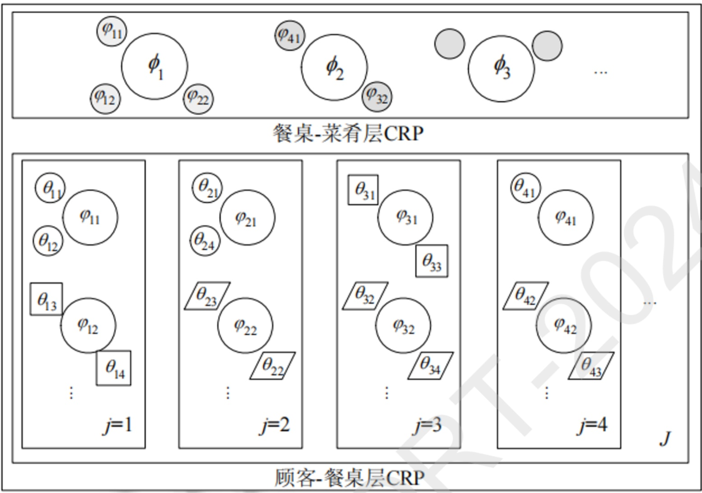
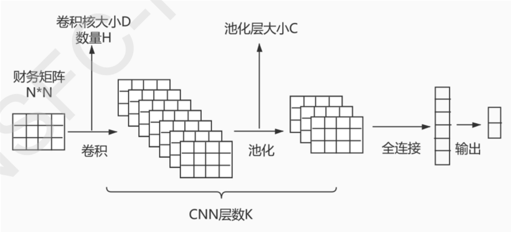

项目批准号 62076112申请代码 F0610归口管理部门收件日期


20240162076112

# 国家自然科学基金

# 资助项目结题/成果报告

资助类别:面上项目

亚类说明:

附注说明:

项目名称:面向金融预测的财务领域结构化数据与文本联合的深度挖掘

负责人:刘喜平

BRID: 08329.00.27969

电子邮件:liuxiping@jxufe.edu.cn

电话: 079183983891

依托单位: 江西财经大学

联系人: 杨晓转

电话: 0791-83816427

直接费用:57.0000（万元）

执行年限: 2021.01-2024.12

填表日期:2024年12月22日

国家自然科学基金委员会制（2023年）

## 项目摘要

## 中文摘要:

财务领域存在大量专业的财务报告，其中信息非常丰富，对于分析公司经营状况、预测公司未来表现具有重要作用。如何充分挖掘和利用财务报告，在研究和实践中都受到了很多关注。本项目关注财务报告的分析和挖掘，利用深度学习和自然语言处理的先进技术，将公司财务报告中的结构化数据和文本结合起来，在深入理解公司财务报告的基础上，充分利用外部的分析评论，利用深度学习的强大特征提取能力从结构化数据和文本中抽取多个方面的重要的、深层次的信息，并建立金融预测框架。本项目将财务报告中的结构化数据和文本结合起来，统一建模和挖掘，这一思路具有新意；项目提出了文本表达特点的视角来提取文本中的深层次信息，这一视角具有新意；项目还根据领域特点提出了新的财务特征选择和抽取方法、文本句子抽取方法。本项目的研究能够更好地发掘和利用财务报告中的信息，也可以促进财务数据挖掘、文本分析、金融预测等领域的研究进展，具有重要的科学意义和应用价值。

## Abstract:

A large number of professional financial reports exist in the financial field, which contain a wealth of information, and play important roles in analyzing companies' operation status and predicting companies' future performance. How to analyze and make full use of financial reports has attracted much attention in the research and practice. In this project, we research into the problem of financial reports mining with the aid of the advanced techniques of deep learning and natural language processing, and by integrating the structured data and text in the financial reports. Based on an in-depth understanding of the financial reports, the project incorporates external comments and leverages the powerful feature extraction capability of deep learning techniques to extract salient and deep information from structured data and texts. Then, a financial prediction framework is built which integrates various features. The research of this project has several novelties. First, the structured data and text in financial reports are combined in reports modeling and mining. Second, it proposes new perspectives such as expression characteristics to extract deep information in the text. Third, novel techniques are proposed for financial features selection and extraction, as well as sentence extraction from text, according to the characteristics of the research contexts and domain. The research can better extract and exploit the information in financial reports, and can also promote the research progress of financial data mining, text analysis, financial prediction, etc. The research results of this project have great scientific significance and application value.

关键词（用分号分开）:财务报告；金融预测；文本分析；特征抽取；深度学习

Keywords (separated by;): Financial report; Financial prediction; Text analysis; Feature extraction; Deep learning

## 结题摘要

## 中文摘要（对项目的背景、主要研究内容、重要结果、关键数据及其科学意义等做简单概述）:

上市公司财务报告是投资者和社会公众了解公司经营状况和投资决策的重要依据。报告中的结构化数据和非结构化文本均蕴含重要信息，但如何高效挖掘这些信息一直是金融领域的关键问题。围绕这一主题，本项目开展了以下方面的研究:

## （1）财务报告建模

项目改进了HDP主题模型的CRF构造过程，结合财经领域背景知识和语义关系，实现非结构化经济指标体系的自动构建和经济要素词的抽取。提出嵌套中国餐馆过程（nCRP'），开发了重新分配的层次化Dirichlet过程（rHDP），用于财经文本的主题建模。

## （2）财务数据特征工程

提出基于CNN深度学习模型的结构化数据特征抽取方法，将结构化财务表格数据转化为文本，利用深度学习和自然语言处理技术抽取关键特征。此外，提出面向结构化财务数据的自然语言查询处理新方法，提升查询效率和准确性。

## （3）财务文本分析

构建目标语义与位置融合的方面意见词抽取模型，识别财务文本中的意见词，提升对财务文本情感的理解。开发增强语义表示的中文金融评价要素抽取模型，辅助企业财务预警模型。提出CFERE中文金融事件关系抽取框架和基于双向事件完全图的文档级事件联合抽取方法，提升文档级事件抽取的准确性和效率。

## （4）基于财务报告的金融预测框架

构建结合财务指标与文本数据的上市公司财务风险预测和欺诈识别模型，利用神经网络提取深层次特征并进行数据融合，提升欺诈识别性能。提出融合股价趋势的金融市场事件预测模型（PriceEve nt），结合上市公司公告提升模型性能。此外，开发基于图结构的股票预测深度学习模型，综合考虑股票相关性和时序数据，提高股票预测准确率。

项目在TOIS、ACL等国际著名期刊和会议上发表了19篇论文，申请或授权了10余项发明专利，这些成果深化了对上市公司财务报告的理解，推动了财务数据挖掘、文本分析和金融预测领域的研究进展。项目的研究有助于提升金融监管、投资分析和金融预测的科学性和准确性，具有重要的应用价值

## Abstract (Brief description of research background, main methods, contributions, and research data):

The financial reports of listed companies serve as crucial references for investors and the general public to understand a company's operating conditions and make investment decisions. Both the structured data and unstructured text in the reports contain vital information. However, how to efficiently mine this information has always been a key issue in the financial field. Focusing on this theme, this project has carried out research in the following aspects:

## (1) Financial report modeling

The project improved the CRF construction process of the HDP topic model. By combining background knowledge and semantic relationships in the financial field, it achieved the automatic construction of an unstructured economic indicator system and the extraction of economic element words. A nested Chinese restaurant process (nCRP') was proposed, and a re - allocated hierarchical Dirichlet process (rHDP) was developed for topic modeling of financial texts.

## (2) Financial data feature engineering

A method for extracting features from structured data based on the CNN deep - learning model was proposed. This method converts structured financial table data into text and uses deep - learning and natural - language processing techniques to extract key features. In addition, a new method for processing natural - language queries for structured financial data was proposed to improve query efficiency and accuracy.

```
 (3) Financial text analysis
 An aspect opinion word extraction model that integrates target semantics and positions
was constructed to identify opinion words in financial texts and enhance the
 understanding of the sentiment in financial texts. A Chinese financial evaluation
 element extraction model with enhanced semantic representation was developed to assist
 the corporate financial early - warning model. A CFERE Chinese financial event
relationship extraction framework and a document - level event joint extraction method
 based on a bidirectional event complete graph were proposed to improve the accuracy and
 efficiency of document - level event extraction.
                                                                             N
 (4) Financial prediction framework based on financial reports
A financial risk prediction and fraud identification model for listed companies that
combines financial indicators and text data was constructed. Neural networks were used
 to extract deep - level features and perform data fusion to improve fraud identification
performance. A financial market event prediction model (PriceEvent) that integrates
 stock price trends was proposed, and the performance of the model was improved by
combining the announcements of listed companies. In addition, a deep - learning model
 for stock prediction based on a graph structure was developed, which comprehensively
considers stock correlations and time - series data to improve the accuracy of stock
prediction.
 The project has published 19 papers in internationally
                                                      renowned journals and conferences
 such as TOIS and ACL, and applied for or obtained more than 10 invention patents. These
achievements have deepened the understanding of the financial reports of listed
companies and promoted research progress in the fields of financial data mining, text
analysis, and financial prediction. The research of this project contributes to
 enhancing the scientific nature and accuracy of financial supervision, investment
 analysis, and financial prediction, and has significant application value.
                                       结构化数据；财务文本；金融预测；深度学习
 关键词（用分号分开）：财务报告；
Keywords (separated by;): Financial report; Structured data; Financial
 text; Financial forecasting; Deep learning
```

## 结题报告正文

## （一）结题部分

## 1. 研究计划执行情况概述

## 1.1 按计划执行情况

本项目将财务领域知识和机器学习手段相结合，在机器学习和文本挖掘的先进技术，特别是深度学习和自然语言理解的最新进展基础之上，提出一系列新的模型、方法和技术，从结构化财务数据和非结构化文本两大类数据中抽取深层次特征，并根据数据的特点建立预测模型框架，从而实现基于财务报告的金融预测。

计划研究内容和实际研究内容的对比如表1所示。

表1 计划执行情况对比

```
序号    计划研究内容           实际研究情况
1  财务报告建模：构建涵盖了 研究了金融文本的主题建模，结合财经领域
   结构化财务数据和非结构化背景知识和词语之间的语义关系，改进 HDP
   文本内容的统一模型， 从而 主题模型的 CRF(Chinese restaurant
   更好地理解财务报告。   franchise)构造过程，实现财经文本中非结构
          D
                化经济指标体系的自动构建和经济要素词的
                自动抽取；提出了一种新的嵌套中国餐馆过
                程（nCRP'），通过引入基于中国餐馆特许经
                营（CRF）的分享机制来提取原始 nCRP 中的
                方面共享模式。然后，通过将从nCRP'中提
                取的分布作为主题层次的先验分布，开发了
                一个层次化主题模型，称为重新分配的层次
                化 Dirichlet 过程（rHDP）。
2  财务数据特征工程：对结构 提出了一种基于CNN深度学习模型的结构
    化财务数据进行特征工程， 化数据特征抽取方法；提出了一种基于财经
    从中筛选出具有代表性的财 领域的文本生成方法和模型，能够将结构化
   务指标，抽取出深层次的财 财务表格中的关键数据表示为文本，从而可
   务数据特征。       以利用深度学习和自然语言处理模型的强大
                能力来自动地抽取关键特征；关注金融领域
```

```
                的基于文本的智能查询技术，提出了面向结
                构化财务数据的自然语言查询处理新方法。
3   财务文本分析：分析公司财 提出了一个目标语义与位置融合的方面意见
    务报告中的文本，从报告文 词抽取模型，旨在针对给定财务文本的特定
    本中抽取重要的句子以及文 方面目标识别意见词，可以更好地理解财务
    本表达方面的特征。   文本及其情感；构建了增强语义表示的中文
                金融评价要素抽取模型，可以从金融评价文
                本中抽取出包含评价要素的评价单元，可用
                 于辅助企业财务预警模型等应用；针对文档
                级事件抽取面临的多事件检测、参数分散以
                及多角色参数识别等挑战，探索更为有效的
                文档级事件抽取方法，以克服现有方法的局
                限性，提升事件抽取的准确性和效率。具体
                来说，提出了一个名为CFERE的中文金融事
                件关系抽取框架，以及基于双向事件完全图
                的文档级事件联合抽取方法及系统。
4   基于财务报告的金融预测框 构建一个财务指标与文本数据相结合的上市
   架：基于上市公司财务报告 公司财务风险预测和财务欺诈识别模型，从
   中的结构化数据特征、文本 公司的九大财务报表中选取指标，从上市公
   特征和外部特征，构建预测 司年度报告选取财务文本，利用强大的神经
   模型。          网络提取出各自更深层次的特征，同时也将
                 不同类型的数据变换到统一的特征空间上，
 SF
                方便进行数据融合，最后使用融合后的特征
                向量进行财务欺诈识别；提出了一种融合股
                价趋势的金融市场事件预测模型
                 (PriceEvent)，将上市公司公告作为外部知识
                加入到模型中，提高模型性能；提出了基于
                图结构的股票预测深度学习模型研究，我们
                通过特征融合模型将股票相关性和股票时序
                数据综合考虑进行股票预测，相比于传统的
                方法提高了股票预测的准确率。
```

从表1可以看出，项目的研究基本上是按照计划执行，部分内容在原计划基础上做了进一步扩展和深入。

## 1.2 研究目标完成情况

预期研究成果与实际研究成果对比如表2所示。因此，项目组已经较好地完成了项目的研究目标。

表2 预期研究成果与实际研究成果对比

```
序号      预期研究成果          实际研究成果
    提出基于外部关注度的财务报告结 提出了基于 CNN 模型和外部信
    构化数据特征选择模型，面向财务 息的结构化数据特征抽取模型，
    数据特征提取的有监督的深度学习 以及面向财经数据的基于CNN
    模型，基于生成器-鉴别器框架和主 和图结构的深度学习模型；
    题指导的财务文本句子抽取模型， 提出了面向财经文本的 HDP主
    基于图卷积网络的细粒度情感分析 题模型和 rHDP层次主题模型；
    模型；基于具体性、信息量和技巧 提出了一种基于财经领域的文
    的财务文本表达特征抽取方法，以 本生成方法和模型；
    及基于财务报告的金融预测模型  提出了面向金融财务领域的结
            D
                    构化数据自然语言查询模型和
         EF
                    FinSQL基于依存关系图注意力
                    网络的 SQL生成方法；
       R
                    提出了面向时间序列的数据到
                    文本生成模型 Repr2Seq;
                    提出了目标语义与位置融合的
                    方面意见词抽取方法和增强语
                    义表示的中文金融评价要素抽
                    取方法；
                    提出了基于 Token-Token 双向事
                    件完全图的联合文档级事件抽
                    取方法，以及基于Token-Event-
                    Role结构的多通道文档级事件
                    抽取；
                    提出了财务数据与财务文本结
                    合的财务危机预警和财务欺诈
                    检测模型；
```

```
                       提出了融合外部知识的金融市
                        场事件预测模型；
                        提出了基于图结构的股票预测
                       深度学习模型。
2     在国内外重要期刊或会议上发表   在国内外重要期刊或会议上发
      16~20篇研究论文，其中在国际著 表 19 篇研究论文，其中在 CCF
      名期刊和会议上发表6~8篇；   A、CCF T1、SCI 1/2 区发表 7
                       篇；
3     申请专利 4~6 项；      申请专利12项，已经授权9项
4     培养博硕士研究生6～8人；    培养博硕士17人，均为项目负
                       责人实际指导学生，其中已毕业
                       14人
5     研究报告             提供结题报告
```

## 2. 研究工作主要进展、结果和影响

## 2.1 主要研究内容

## 2.1.1 财经文本的主题建模

## 1）面向财经文本的HDP主题模型

随着经济活动数据在数量、质量和表现形式上的不断丰富，以及自然语言处理、数据挖掘和机器学习等技术的迅速发展，财经文本在经济研究中的重要性日益凸显。然而，在经济要素词抽取和非结构化经济指标体系构建方面，现有研究主要通过手工或半自动方式实现，存在诸多缺陷。基于主题模型的方法虽有应用，但常用的LDA主题模型依赖主题数目设定，HDP主题模型在经济领域应用时也存在主题领域性不明显、经济要素词抽取不准确等问题。因此，如何从财经文本中有效地挖掘经济要素，构建非结构化经济指标体系，成为实现非结构化数据在经济研究中应用的关键。

## 2）财经多领域文本层次主题模型研究

财经文档包含多个主要领域，每个领域又可细分为多个子域，但现有模型在处理多领域文本时，如基于nCRP的层次主题模型（如 hLDA和nHDP），存在诸多问题。它们在构建主题层次结构时，无法有效识别同一层级主题间的相关性，导致语义相同的子域在主题树中可能被错误定义，限制了对主题层次关系的准确表达。其他相关模型在改进主题共享、结合语义嵌入等方面虽有尝试，但仍未综合解决主题层次结构构建中关联关系表达不全面的问题。如何针对财经多领域文本构建包含主题相关性的层次主题模型是一个主要研究内容。

## 2.1.2 财务结构化数据处理

## 1）结构化财务数据特征工程

数据来源与指标选取:从聚宽数据库获取2005年至今上市公司的财务指标，选取公司年报披露当天数据，涵盖收益资产负债表、利润表等表格的214项指标及36项其他财务指标。经数据清洗，包括指标选择（剔除缺失值达30%以上指标，最终保留146项）、数据补值（依据指标值分布对部分缺失值补值）和数据过滤（删除样例缺失值超 50%的样例，得17107个公司样例），还选取 47 项无缺失值的共有财务指标进行并行实验。

模型构建与特征处理:采用深度学习模型抽取特征，将清洗后的财务指标构建为财务向量并归一化，鉴于数据集类别分布不平衡调整损失函数权重。因CNN模型在某些分类问题效果好且财务指标有比率关系可挖掘新特征，故构造指标矩阵（由两个财务指标相除得到元素)，基于此利用 CNN模型抽取深层次特征。

## 2）基于结构化财务数据的文本生成研究

对于结构化财务数据，另一种处理思路是将其转换为文本，然后利用自然语言处理技术的强大能力抽取深层次特征，这一研究属于基于数据的文本生成（一般称为data-to-text)。Data-to-text是自然语言生成研究的一个重要组成部分，其目的是根据输入的结构化或半结构化数据生成一段流畅、准确的文本段落。已有研究主要关注体育评论、天气预报和名人传记等领域，对于其他领域，如财经领域，则鲜有涉及。针对这一问题，我们研究了基于财经表格数据的文本生成技术。财经领域的文本生成则具有不同的特点。为此，我们构建了一个新的中国上市公司财务数据-评论文本数据集（Chinese Financial Data-Comments dataset，简称 CFDC 数据集）。与传统的基准数据集相比，CFDC数据集具有数值丰富且数值范围大、表格数据和评论文本存在大量推理关系等特点，对目前流行的各种基于端到端框架的 data-to-text 神经网络模型提出了新的挑战。针对财经领域的文本生成的特点，我们研究了基于财经领域的文本生成方法和模型，主要关注如何改善财经领域文本生成的结果，提升模型的准确性。

## 3）面向结构化财务数据的自然语言查询

本研究关注金融领域的基于文本的智能查询技术。金融领域中存在大量的财务数据、股票数据，人们迫切希望能够用自然语言来查询这些数据。与一般的领域相比，金融领域存在以下特点:1)数据以数值型数据为主，2)查询中数值计算非常普遍。根据百度公司的报告[5]，在商业智能报表的查询中，约80%的查询涉及到各种计算。除了常规的求最值、求和、计数、求平均等计算外，金融领域还经常出现这样一类复杂计算，即涉及到2个或者多个元组在同一属性上取值的计算，如“国药一致2019年比2018年营业利润同比增长率是多少？”。在文献中，这类查询称为行计算查询。行计算查询生成 SQL 比较复杂。行计算这类查询给Text-to-SQL任务提出了一定的挑战，现有的模型在处理这类查询时效果较差。针对这一现状，本研究针对金融数据

研究了行计算查询的 Text-to-SQL任务。

## 4）金融时间序列数据的文本生成

随着数据体量和复杂性的增长，时间序列分析在金融等领域的重要性日益凸显，但传统数据分析方法缺乏对数据内容的叙述能力。数据到文本生成任务旨在将结构化数据转化为文本，然而时间序列在这一领域的研究相对较少。因此，如何将时间序列表征技术应用于数据到文本生成任务，构建端到端的时间序列学习模型，以更好地处理时间序列数据并生成准确、连贯的文本描述，成为当前亟待解决的问题。我们提出了一个新的数据到文本生成模型，名为Repr2Seq，用于将时间序列数据转换为描述性的文本。

## 2.1.3 财务文本数据处理

## 1）情感分析

文本情感分析中的方面情感分析可细分为多个子任务，其中面向方面目标的意见词抽取（TOWE）旨在针对给定句子的特定方面目标识别意见词，能细化情感分析粒度，但相关研究成果较少。现有方法如IOG模型虽能编码方面目标信息，但存在对上下文信息利用不充分、忽略局部信息和位置信息等不足。在此背景下，本文旨在解决如何更有效地识别文本中给定方面目标的方面意见词，综合考虑上下文语境、方面目标语义信息及位置信息，并建模候选意见词与方面目标对应关系的问题。

中文金融评价文本对了解金融行情和辅助决策具有重要意义，从其中抽取评价单元是细粒度情感分析的重要任务。然而，现有评价单元抽取工作面临诸多挑战，包括评价对象种类繁多复杂、句法成分复杂灵活、预训练语言模型与语义表达和句法分析存在矛盾、评价单元要素间语义和依存关系未充分利用以及部分评价要素已知的假设限制应用场景等。在此背景下，本文旨在解决如何有效抽取中文金融文本中评价对象、评价词和情感程度三个评价要素，以辅助金融决策的问题。

## 2）文档级别的事件联合抽取模型

在当今信息爆炸的时代，事件抽取作为信息抽取领域的关键环节，对于从海量文本中获取有价值信息具有至关重要的意义。事件抽取旨在精准识别出文本中预定义类型的事件，主要涵盖事件检测和事件参数抽取这两大核心子任务。过往研究多聚焦于句子级事件抽取，虽取得一定成果，但此类方法局限于句子内的事件参数提取，难以有效应对参数跨句分布的情况。随着实际应用需求的发展，文档级事件抽取的重要性日益凸显，它要求从可能包含多个事件的文档中准确识别事件并提取相应参数，然而这一过程面临诸多严峻挑战，如多事件检测、参数分散以及多角色参数识别等。当前，大多数现有方法将文档级事件抽取作为多个独立的学习任务处理，这不仅导致模型复杂度大幅增加，而且在实体抽取环节易产生误差传播问题，严重影响后续任务。此外，现有方法未能充分利用不同事件中实体的相关性，致使事件抽取性能受限，难以满足实际需求。在此背景下，本研究致力于探索一种更为有效的文档级事件抽取方法，以克服现有方法的局限性，提升事件抽取的准确性和效率。

## 2.1.4 基于财务报告的金融预测框架

## 1）基于财务报告和深度学习方法的上市公司财务风险识别研究

如何准确预测财务风险是上市公司和投资者都十分关心的问题，对于保障各方的利益，以及维护金融市场的稳定具有重要意义。对上市公司来说，准确预测财务风险可以避免陷入财务危机，加强市场对公司的信心，促进企业更加高速地发展。对投资者来说，上市公司的财务状况直接关系到投资者的收益，如果能够预测到公司未来的财务风险，就可以避免自身过大的损失，及时止损。

在财务会计领域，在财务风险的预测上已经做了许多工作，通常分析上市公司的三大财务报表中的重要财务指标来反映一个企业是否陷入财务风险，或者使用不同方法对各大财务指标进行处理，例如比率分析法等，用处理之后的财务指标进行预测分析，又或者使用财务指标代入不同领域的方法模型中对财务风险进行预测，例如SVM、决策树等。但是以往的大部分论文工作主要使用公司年度报告中的结构化数据（即财务指标）来构建上市企业财务风险预测模型，我们分析认为仅考虑财务指标数据是不全面的，忽视了财务文本的作用，是不合理的，因为财务文本中蕴含大量未发掘的、对于财务风险预测有价值的信息。本文从投资者的角度研究财务风险预测。我们基于上市公司年报中的信息来预测公司的财务风险。

## 2）结构化数据与非结构化文本相结合的财务欺诈识别

上市公司财务欺诈是指上市公司为了获取切身的利益，在财务报表中做出的虚假记载、误导性陈述以及重大遗漏等行为，损害报表使用者的权益。财务欺诈是一个非常严重的问题，但是财务欺诈的识别非常困难。这是因为上市公司财务欺诈行为不断新颖化、复杂化及隐蔽化。在现实生活中，财务欺诈行为的识别很大程度上依靠监管者的专业分析，需要用到很多专业知识。随着计算机技术的发展，很多研究者试图利用计算机对数据进行分析，从大量数据中识别财务欺诈行为。已有的财务欺诈识别研究虽然取得了较多的成果，但还存在着一些不足，主要有:(1)在财务指标的研究中，可使用的财务欺诈识别模型越来越复杂，但大部分使用的是一维财务指标，没有考虑财务指标的历史数据；(2)在财务文本的研究中，大都是从文本中提取出情感特征再结合机器学习模型来识别欺诈行为；(3)结合财务指标与财务文本进行欺诈识别的研究，都侧重于财务文本信息的挖掘，没有探索更多的数据融合方法。本文一方面从历史财务指标中抽取深层次特征，另一方面用预训练语言模型对财务年报进行文本表征，最后基于两种数据搭建财务指标与财务文本相结合的财务欺诈识别模型。

## 3）融合外部知识的金融市场事件预测

股票市场上会发生大量的事件，而有些事件的发生对股票市场和投资者都会产生重要影响。如果能够预测未来发生的事件，在一定程度上可以降低投资者的投资风险，提高投资收益。

以往的金融领域研究表明，财经新闻、上市公司公告都可以作为外部知识加入到模型中，提高模型性能。本研究采用的金融市场事件数据主要来源于上市公司发布的公告,通过对公告数据进行分析得出，有些公告描述了多个事件，这意味着多个事件可能发生在同一天，引入股价信息在一定程度上能够让事件捕捉到时间信息，因为发生在同一天的事件，它们对应的股价信息是一致的。其次，如“IPO发审委通过”“IPO招股公告”“IPO询价推介起始”“IPO网上路演”等事件都是发生在公司上市前期，都可以将其归为同一时期发生的，这种做法使历史事件包含了相同的股价信息，让模型学习到这些事件处在同一个环境，增强了同一股价状态下事件之间的关系。

本文针对这些问题进行了深入研究，从两个角度进行了研究，具体研究内容如下:①针对未充分挖掘历史事件与候选事件之间复杂的交互关系的问题，构建了一种基于事件链和事件图融合的金融市场事件预测方法。②针对金融市场事件预测模型中缺少外部知识引入的问题，提出了一种基于股价趋势的金融事件预测方法。

## 4）基于图结构的股票预测深度学习模型研究

本文基于复杂网络的理论，以上海交易所的个股作为研究对象，考虑股票之间的关联关系，量化和分析股票之间的相关关联程度，并以此作为构建股票网络模型的依据，建立股票网络来表示股票之间相关关系。再通过深度学习挖掘股票网络中股票的关联特征，与股票自身特征相结合以实现股票的预测。本文提出了基于图结构的股票预测深度学习模型，主要从以下两个方面展开研究。

①传统股票预测大多数利用股票自身历史信息进行股票预测，没有考虑股票市场是一个复杂网络，忽略了股票的相关联的特性。因此本文基于复杂网络理论计算股票之间的互信息量化股票的关联程度，在此基础上构建股票网络来表示股票之间的关联信息。

②在构建的股票网络的基础上，构建多输入的深度学习模型，其中主要输入为股票自身历史信息，辅助输入为蕴含股票关联信息的股票网络，主输入模型部分通过LSTM循环处理股票时序数据，从股票历史行情中提取股票自身历史信息。辅助输入模型部分通过CNN卷积神经网络提取股票关联特征，最后合并输出进行预测，以此来提高股票的预测准确性。

## 2.2取得的主要研究进展、重要结果、关键数据等及其科学意义或应用前景。

## 2.2.1 财经文本的主题建模

## 1）面向财经文本的HDP主题模型

本研究针对HDP 主题模型在财经文本主题分析中存在的问题，结合财经文本领域属性、词语语义和词语在主题中的出现情况对其进行改造。首先，定义文档的领域隶属度，根据已有经济领域分类标准，利用文档与经济领域类别词语集的相似度来明确文档所属经济领域类别；接着，定义词语与主题的语义相关度，通过词向量计算词语间语义相似性，将语义相近的词语分配到相同或相近主题，提高主题区分度；然后，定义词语对主题的贡献度，考虑词语在领域主题中的代表性，提高中低频领域主题专用词语在相应主题中的概率，提升主题辨识度。基于这些概念，通过改进CRF构造过程，提出 PSP\_HDP (combining documents’ domain properties， word semantics and words’ presences in topics with HDP)主题模型，如图 1所示。其中在顾客-餐桌层CRP中根据顾客间对菜肴类别要求的一致程度决定餐桌选择，在餐桌-菜肴层CRP中结合餐厅菜肴风格决定菜肴选择，从而改进经济要素词抽取和经济主题生成。最后，基于改进的CRF分配过程，完善模型参数Gibbs采样过程，通过采样对应的索引变量并重构生成相关参数，实现模型参数推导。

实验结果表明PSP\_HDP主题模型具有显著优越性。在主题模型评价方面，相比 HDP模型，PSP\_HDP模型在主题多样性上，虽因剔除重复词语使 KL距离计算有变化，但 P\_HDP和 PS\_HDP模型在主题生成上更符合领域分类标准，PS\_HDP模型的KL距离分布更均匀明确；在内容困惑度上，PSP\_HDP模型收敛更快且效果更好；在模型复杂度上，PSP\_HDP模型复杂度最低且变化平稳。在抽取经济要素词和构建非结构化经济指标体系效果评价方面，定性上，PSP\_HDP模型生成的经济要素词更具代表性，非结构化经济指标与人工划分更一致且能体现内涵变化；定量上，其提取代表性词语的召回率和抽取经济要素词的准确率均高于HDP模型，在各经济领域的代表性词语召回率表现也更优，还能挖掘与经济相关的确定性和不确定性因素，整体性能明显优于HDP主题模型。



图 1 PSP\_HDP 主题模型

## 2）财经多领域文本层次主题模型rHDP

本研究提出一种名为nCRP+的随机过程，其核心是在主题树中融入层次共享机制，以解决上述问题。具体而言，nCRP+的节点分为两层，第一层表示餐厅风格，第二层表示菜品类别和菜品，通过内外两层 CRF实现主题方面的共享。外部 CRF负责在不同子树间共享菜品类别，内部 CRF 负责在子树内部分配菜品，确保同一菜品类别在不同餐厅风格下可共享，同时子树内菜品具有独特性。基于nCRP+的主题树结构以及 CRF与 HDP的关系，构建 rHDP模型，该模型采用分层狄利克雷过程，通过全局和局部概率测度生成主题层次结构，从而能够捕捉相关子主题间的相关性并定义其差异。在模型参数推导方面，运用分层吉布斯采样方法，通过采样索引变量和来获取分布参数和，进而得到模型参数的后验概率。

实验采用 20NewsGroup数据集和中国财经文档数据集，对数据进行预处理后，详细设置各对比模型（hLDA、nHDP、hARTM、TSNTM、WEDTM和rHDP）的参数开展实验。结果显示，rHDP在困惑度方面表现出较好的预测性能；在分类任务中，于20NewsGroup 数据集的部分类别上精确率、召回率和 F1 值表现出色。在主题内部关系上，rHDP 在父主题与子主题间的语义相关性和子主题多样性方面优于多数对比模型。在主题间关系方面，rHDP能发现更多语义相关性高的相关子主题对，且相关子主题间的KL散度值较大，体现了良好的差异性。通过人工评估主题连贯性，rHDP生成的主题连贯性较好，主题词更具体。综合而言，rHDP在主题相关性和差异性表达上表现优异，生成的主题结构更合理，主题词更具特异性，有效解决了多领域语料库中主题层次结构构建的问题。

相关成果发表于《软件学报》《ACM Transactions on Information Systems》等期刊。

## 2.2.2 财务结构化数据处理

## 1）结构化财务数据特征工程

构建了基于CNN的财务指标特征抽取模型。将获取来的财务指标进行清洗之后，对财务指标进行特征表示转换，每个样例对应的各项财务指标构建为一条财务向量，并将所有样例进行财务指标归一化处理。同时考虑到深度学习模型的强大特征抽取能力，所以选取CNN模型进行特征抽取。但是财务指标单个样例是一维向量，不方便做卷积，考虑到财务领域经常使用一些比率指标，如流动比率=流动资产合计/流动负债合计，资产负债率=负债总额/资产总额等。除了这些指标外，可能还有一些潜在的比率指标对于财务风险分析具有重要作用。另外，不同的比率指标可以进行组合来产生新的特征。为了充分发掘财务指标间的关系，我们构造了一个指标矩阵，该矩阵中的每个指标是由两个财务指标相除得到。在这一指标矩阵的基础上，我们利用CNN模型来抽取深层次特征，模型结构如图2所示。



图 2 基于财务指标矩阵的 CNN 模型

损失函数选择交叉熵损失函数。交叉熵损失计算了两个概率分布之间的距离，当交叉熵值越小说明二者之间越接近。我们在试验中选取了4种不同的优化器:随机梯度下降法（SGD）、标准动量优化算法（Momentum）、RMSProp、Adam。在数据样本相同的情况下试验了4种优化器，结果显示 Adam优化器的性能在财务指标数据集上最优。

## 2）基于结构化财务数据的文本生成研究

针对财经领域的文本生成的特点，我们提出了一种基于财经领域的文本生成方法和模型，能显著改善财经领域文本生成的结果，提升模型的准确性。

该方法的主要步骤包括数据预处理和构建模型进行生成。

## ① 数据预处理

这个阶段提取财经语料库中企业财务表格的数学特征，定义推理范式词条、位置词条、数值统一词条和划分训练集、验证集与测试集。对财经语料库中的财经评论文本进行分词并建立样本词表；

推理范式词条、位置词条、数值统一词条是具有特殊含义的词条，均存储在样本词表和总体词表中；推理范式词条是函数名，定义了将待推理数据映射为新数据的方法；位置词条表示了单元格在表格中的位置；数值统一词条用来表示所有数值；参考文本是一个词序列，由两类词组成，一类是一般词，另一类是推理范式词条，在推理范式支持财经评论时其对应的为推理范式词条，否则是一般词；文本-表格映射向量是一个索引向量，文本-表格映射向量表示参考文本和财务表格之间的对应关系，当参考文本某个位置出现特殊词条时，文本-表格映射向量的对应元素为某财务数据在样本词表中的索引，否则文本-表格映射向量为0；参考文本、文本-表格映射向量长度都与财经评论长度相关。

建立样本词表的步骤包括:定义推理范式词条，用于表示如何根据原始数据产生新数据；定义位置词条，用于表示文本在表格中的单元格位置；定义数值统一词条，用于区分数值与文字文本。总体词表是样本词表的并集，但去除了所有的数值；

## ②模型构建

构建基于深度学习的文本生成模型，包括嵌入模块、编码模块、译码模块、生成模块、推理模块和语义一致性检查模块。

嵌入模块使用预训练的嵌入词表作为初始化参数，首先分别查找财务属性field和财务数据value的嵌入向量，然后使用一个全连接层融合二者的嵌入信息，由于在总体词表没有财务数据(数值)词条，用位置词条和预处理得到的数学波动信息代替。

编码模块是一个双层的结构，在生成文本时首先计算财务属性的注意力分布，再计算这一属性内候选单元格的概率分布。底层编码器是一个Transformer编码器。经过一次底层编码后，每一个编码结果都融合了输入序列中所有嵌入向量的上下文信息。高层编码器的基本机构也是Transformer编码器，首先从底层编码结果取针对同一属性的编码结果并输入全连接层，得到每个属性的初步编码。然后进一步使用一层Transformer编码器对每个属性进行再次编码，得到最终的高层编码。

译码模块是一个双层的LSTM网络，基本译码思路是:根据当前时间步的译码器隐状态和编码层的底层编码、顶层编码，计算出两个不同的注意力分布，再综合二者得到最终的上下文向量。

生成模块是一个简单的全连接层和softmax逻辑回归模型网络层的组合，其原理是，将译码模块的上下文向量升维到某个维度上（这个维度一般是样本词表与总体词表容量之和)，然后对高维向量做softmax处理，得到概率分布。

推理模块根据译码模块的注意力分布对待推理词进行定位，模块根据生成模块的 softmax 结果选取推理范式，并通过推理范式的定义对待推理词进行调整；

语义一致性检查模块是一种使用正则表达式技术实现的后验语义检查模块，该模块建立了一个语法规则，一旦识别到“增长”、“增加”等正向词语后面接了一个负数，就把“增长”换为“减少”，同时去除后继数值的符号，以此保证语法的正确。

## ③实验分析

为评估本文模型的有效性，我们在CFDC数据集上部署了该模型，从BLEU、参数量、词表大小等各方面衡量性能，并与其他模型的输出结果一起打分。

对照实验选择的模型是具有代表性的指针网络模型（pointer-generator）、多层编解码模型、NCP-2019模型和基于模板的模型。指针网络模型是机器翻译、机器问答、data-to-text等任务中的主流模型，在文本生成模型中具有最好的通用性。而多层编译码器模型则更擅长 data-to-text任务，其主要特点是着重考虑数据表格的结构化信息并充分编码，是目前性能最好的模型之一。NCP-2019是一种基于信息抽取的神经网络模型，对内容选择和内容规划进行了显式定义，对内容选择结果进行编解码并生成模型文本。最后，为了进一步说明本文模型创新点，本节还设置了一系列消融实验。

FDTTM 在 BLEU 和 ROUGE-2 两个评价文本生成质量的指标上都有最好的表现，并且还明显减少了模型的参数量和词表长度。除此之外，我们发现在CFDC数据集上，更注重数据表格的结构化信息编码的多层编解码模型性能要比朴素的指针网络模型更好，但仍未达到FDTTM的水平。FDTTM输出了指针网络模型和多层编解码模型没有输出的信息，这是FDTTM与另外两个模型性能差距的主要原因。

此外，FDTTM 中扩展的复制机制在模型输出文本的时候，特殊 token 的概率分布会与复制单元格的概率分布相互纠错，尽管这种纠错的能力还有不足，但相比先前的基准模型仍能显著降低模型信息缺失的错误。并且扩展复制机制进一步地提高了模型的推理能力，使模型能够输出正确数据的正确格式，有较好的性能表现。

我们设置了消融实验用来说明扩展机制和多层编码机制的作用。实验结果表明，提出的复制机制的扩展能够显著压缩词表容量，减少模型参数量，并且使模型具有一定的数值推理能力。而对数据表格进行复杂多层编码的设计能显著地提升模型性能，两种机制的结合使模型性能达到了当前最优。

## 3）面向结构化财务数据的自然语言查询

## （1）面向金融财务领域的结构化数据自然语言查询模型FinSQL

由于现有数据集对金融领域，尤其是行计算的覆盖较少，本研究构造了一个针对金融领域的 Text-to-SQL 数据集 SOFT(SQL Over Financial Text)，该数据集覆盖了金融领域的常见查询类型，包括一定数量的行计算样本。基于这一数据集，针对行计算的特点，提出了一种基于分治的方法，该方法首先将一个行计算查询分解为若干个子查询，分别针对每个子查询生成SQL语句，再将子查询的 SQL语句组合在一起得到原始查询的 SQL语句。 7

本研究提出的模型FinSQL由编码器（Encoder）、解码器（Decoder）和行计算查询处理模块3大模块组成。对于输入的自然语言查询，首先进行问题识别和问题分解，然后将子问题和数据库模式送到编码器和解码器，生成子查询SQL，将子查询进行组合得到完整的 SQL。编码器和解码器借用 RYANSQL模型中的相应模块，这2个模块的构建使得模型可以处理如分组排序查询、连接查询、嵌套查询等大部分查询类型，同时也可以处理行计算查询问题所涉及的子查询问题。

## ① 编码器

编码器的输入包括问题、表名和属性列名和 SQL 位置码（SQL Position Code)，其中 SQL 位置码是由上一级的语句块产生的 而最外层语句块的 SQL 位置码为“none”。

编码器由5层构成，依次为:词嵌入层、词嵌入编码层、问题与属性列的对齐层、表结构编码层和问题与表的对齐层。词嵌入层对于问题、表名和属性列名，分别获取其字符级词向量。每个SQL位置码也产生一个词向量。词嵌入编码层使用卷积神经网络和全连接层产生问题、表名及属性名的编码，在问题和SQL位置向量的基础上产生 SQL位置编码。问题与属性列的对齐层使用注意力机制和 Transformer对编码后的问题和属性列向量处理，目的是为了加强它们之间的对齐。表结构编码层对属于同一表格的属性列编码，使用自注意力机制来融合属性之间的信息。问题与表的对齐层:和问题与属性列的对齐层类似，其目的是加强问题和表之间的对齐。最后编码层输出为:问题编码、各列编码、表编码、SQL位置编码和数据库模式编码。

## ②解码器

将编码层输出的问题编码、数据库模式编码和SQL位置编码连接，使用2个全连接层对11个变量进行预测。这11个变量分别对应SQL语句的各基本结构，包括是否存在GROUPBY、是否存在 ORDERBY、是否存在LIMIT、是否存在WHERE、是否存在HAVING、GROUPBY中的条件数量（≤3）、ORDERBY中的条件数量（≤ 3）、SELECT中的条件数量（≤6）、WHERE中的条件数量（≤4）、HAVING中的条件数量（≤2）、是否存在IUE（INTERSECT，UNION，EXPECT）。由于每个SQL语句都必须有SELECT和FROM，因此无须对它们进行预测。

在完成11个变量的预测后，即可得到一个草图（sketch）。在草图的基础上，对其中的槽位（slot）进行填充。

## ③ 行计算查询处理

为了处理行计算类型的查询，提出基于分治的方法，该方法遵循“问题识别-问题分解-子查询生成-结果组装”的思路。

问题识别:将行计算查询的识别问题视为文本分类任务，即识别一个问题是否为行计算类型的查询。使用BERT预训练模型微调实现。 2

问题分解:对行计算型查询问题进行分解。例如，将问题“平安银行2020年相比于2019年主营业务收入同步增长多少？”分解为2个子问题:

Q1:平安银行2020年主营业务收入是多少？

Q2:平安银行2019年主营业务收入是多少？

在查询分解的时候，首先识别出问题中的成分，然后识别成分类型，即共有成分、独有成分还是操作成分。本研究将成分识别视为实体识别问题。在成分分类时尝试2种分类方法:启发式分类、使用模型进行分类。

子查询组合:在问题分解的基础上，使用训练完成的编码器和解码器模块对子问题处理，生成对应的SQL查询。在产生了各个SQL子查询后，将它们组合起来，得到一个完整的SQL查询。这里须考虑以下问题:计算操作的类型、计算的方向、排序要求（ORDER BY）、返回行数限制（LIMITn）、组合规则。

## ④方法性能

为了与本研究所提模型FinSQL 进行综合性能的比较，选取了2 个主流的 Textto-SQL模型，分别为 SLSQL和 RYANSQL。实验数据集是本研究提出的 Text-to-SQL金融领域数据集SOFT。为了显示模型在不同难度的查询上的生成能力，按照惯例将样本分为4个级别:容易（easy）、中等（medium）、难（hard)、很难（extra hard)。划分的依据是 SQL语句所包含 SQL组件的数量、要查询的列的数量，以及 where中条件的数量。all表示整体准确率，从实验结果可知:本研究提出的FinSQL模型是3个模型中整体准确率最高的，达到 0.781，比 RYANSQL 高出 0.086.特别在后 3 种难度的数据集上，FinSQL相比于RYANSQL在准确率上都有不小提升。

为了进一步了解模型在行计算查询上的表现，专门抽取了SOFT数据集的部分行计算查询构造了一个子集SOFT-rc，分析了这个数据集上的结果。结果表明，行计算查询的总体准确率为0.713，在一般难度级别上的表现令人满意。从3个模型生成的预测结果来看，SLSQL和RYANSQL都只能生成该问题所涉及的一个子查询，无法得出完整的结果，而只有本研究模型FinSOL给出了正确的预测结果。

## （2）基于依存关系图注意力网络的 SQL生成方法

在这一研究基础上，进一步研究了一种基于依存关系图注意力网络的SQL生成方法。本文提出的框架由两个阶段组成:问题-模式对齐预测阶段和SOL生成阶段。在对齐预测阶段，模式链接器识别问题中提及的列、表和值。在第二阶段，将这些对齐信息注入到解析器中，优化生成的SQL结果。

模式链接器:首先对问题和模式串联，经预训练模型混合编码，得到问题和模式的初始表示存树，对依存关系进行合并和传播，模式图则基于模式项之间的从属关系和主外键关系。问题图和模式图经 RGAT 编码，得到问题和模式的表示 L=< YQ, Y, Y >,后计算他们的链接概率。

问题和模式项的联合编码:首先将问题Q和序列化的数据库模式S进行串联，得到输入序列X。对模式S的序列化将其所有表及其所属列进行串联，并通过特殊字符[T]和[C]进行分割。此外，在列名前添加了其所属的表名，在列名后添加了其类型信息（如Text、Number等)，并用特殊字符[#]进行分割。为了明确问题中提及的数据库中的值，我们将问题词与数据库中的值进行模糊匹配，并将匹配到的信息添加到X中，让模型学习解决歧义。

通过以上操作形成的混合序列X作为BERT的输入，得到问题词和数据库中每个模式单词的嵌入表示。由于列名和表名都可能由多个单词组成，需要将再经过一个GRU，得到每个列和表的初始表示。经过以上步骤得到了问题词和模式项的初始表示，通过BERT中的多层注意力机制，已经隐式地捕获了部分模式链接的信息，接下来通过模式的结构以及句子的语法信息，通过图神经网络给与模式链接更明确的监督信号。

依存关系的合并与传播:原始的句法分析产生的依存关系类型多达74种，如果直接使用NLQ的句法树构造图作为模型的输入，会存在许多噪声。因此我们对原始的句法依存树做了一些简化和修改。对于数据库模式识别没有帮助的关系，如root(根节点)、punct(标点)、expl(填补词)、det(限定语)等关系，将它们简化为支配关系，依存弧赋予标签“dependency”，保留了如 nmod(名词修饰)、dobj(直接宾语)等关系标签。

在原始的句法依存树中，由“and”或“or”等连接的单词之间的并列结构，通过依存弧conj(连词)连接。该结构中，第一个词作为整个并列结构的核心词，它不仅支配其余并列词，还连接了与句子中其他词的支配和被支配关系。从语义上，并列词共享与句中其他成分的依存关系，但距离第一个词越远的并列词，其依赖路径越长，依赖关系越难以捕捉。因此，本文添加了并列结构中的从属词与句中其他成分间的依存关系。

问题RGAT模块:除上述修改，还添加了单词与自身的自连接关系，由此将句

子结点构成的图使用RGAT网络计算其表示。

模式RGAT模块:对于数据库模式而言，其表和列作为结点，列表间的从属关系、主外键关系等多种关系作为边，构成了模式关系图，同样可以通过RGAT计算其表示。

模式链接的概率计算:最后，将问题词的表示和模式项的表示进行拼接，经多层感知机和 softmax操作计算其链接概率。

对齐增强解析器:由于T5在Text-to-SQL任务上展现了强大的性能表现，我们通过注入模式链接信息，对 T5进行微调实现第二阶段的 SQL生成任务。T5 采用编码器-解码器(encoder-decoder)结构生成 SQL，双向编码器学习输入x的隐藏状态 h，然后解码器根据 h 生成 SQL。

## 研究方法测试:

基于 Spider数据集，SLSQL构建了模式链接语料库，对 Spider训练集和验证集的每个实例注释了模式链接信息，标注了每个问题单词对应的数据库表、列或值，同时针对模式链接问题提出了一个基于BERT的基线模型。本文使用了 SLSQL提供的标注数据训练模式链接器。

在 Spider验证集上，本文的方法较SLSQL的结果有明显的提升，识别问题中提及的列、表、值的F1 值分别提高了4.2%、2.4%和13.1%。

为了进一步研究模型中各个组件对性能的影响，进行了消融实验。实验结果显示，各模块均对模型性能有一定的贡献。删去依存增强模块后，对列的识别能力有一定的下降，删除问题RGAT后下降得更为明显。句法依存关系有助于模型理解问题的语法结构，对于易混淆的相似列名识别有一定的帮助。

本文的方法与其他模型在 Spider验证集上的 SQL生成结果进行了对比。根据实验结果，本文提出的方法在不同规模的T5模型上展现了较好的性能。在加入第一阶段预测的模式链接结果后，与Shaw等人的结果相比预测结果有了较大提升，T5-Base的 EM值提升了 11.4%，在 T5-Large 上的结果超过了 PICARD 在 T5-Large 上的结果，与 Shaw 等人在 T5-3B 上的结果相当。实验证明使用准确的模式链接信息可以显著提升模型的性能，在使用标注的模式链接结果后，在T5-Large上的结果甚至超过了RASAT在T5-3B上的结果。为了显示模型在不同难度的查询上的生成能力，遵照Spider数据集对样本划分的4个级别:容易（easy)、中等(medium)、难(hard)、很难(extrahard)。由实验结果可见，准确的模式链接可以提升难度较大的 SQL生成问题的结果。由于预测的模式链接结果不够准确，模型尚有较大的提升空间，仍需进一步的研究工作。

## 4）金融时间序列数据的文本生成

研究思路是首先使用时间序列表示学习方法（如TS2Vec）获取时间序列的数据表示，然后将这些表示输入到一个基于神经网络的模型中，生成对应的文本序列。我们还设计了一个序列处理器对输入的时间序列数据进行预处理。文章的主要贡献包括:提出了Repr2Seq模型，该模型能更好地捕捉时间序列数据的结构和核心信息；构建了一个包含股票价格序列和对应评论的数据集，用于评估数据到文本生成任务的性能。提出的Repr2Seq模型由编码器和解码器组成，编码器将时间序列映射为表征向量，解码器将表征向量映射为文本序列。编码器以TS2Vec模型为核心，由序列处理器和 TS2Vec模型构成。序列处理器将原始时间序列转化为距离序列，TS2Vec模型在增强的上下文视图上进行分层对比学习，编码时间序列的分布并捕获上下文表征。解码器由单层GRU网络、一层Dropout层及全连接层构成。解码器将时间序列表征映射到目标文本序列，以自回归方式生成文本。构建股价序列-股评文本数据集，包括上证指数、深证成指、创业板指自2019年1月14日到2022年1月12日的股价序列和对应股评文本。使用BLEU评分评估生成文本的质量，通过修正后的n-gram精度计算BLEU分数。

研究结果:Repr2Seq模型在股价序列-股评文本数据集上与 Seq2Seq和Transformer等模型相比，表现出更好的性能。较 Seq2Seq 模型平均性能提升了3.48%，较 Transformer 模型提升了20.47%。

超参数影响:①输入数据粒度:采样频率过小或过大都会对模型性能产生负面影响，合适的采样频率能为文本生成提供适宜的信息。②表征维度:表征维度过大可能导致过拟合，选择合适的表征维度对获得满意的结果至关重要。③序列处理器有效性:通过消融实验证明，减去首个元素的序列处理器对模型性能最有利，其他序列处理器模式下模型性能没有明显提升。

相关成果发表于《Technical Gazette》《浙江大学学报(工学版)》《Proceedings of 2023 International Joint Conference on Neural Networks (IJCNN 2023)》， 申报 2 项国家发明专利，并获萨师煊优秀学生论文奖。

## 2.1.3 财务文本数据处理

## 1）情感分析

## （1）目标语义与位置融合的方面意见词抽取方法

提出目标语义与位置融合的方面意见词抽取模型 AP - IOG。该模型使用编码器 - 解码器框架，在方面目标融合编码器中包含 3 个 LSTM 模型:向内 Inward -LSTM从句子两端到中间方面目标处运行两个LSTM，将方面目标词融入编码，充分利用方面目标语义信息；向外 Outward-LSTM 以方面目标词为原点向句子两端延伸运行两个LSTM，将方面目标信息传递至上下文，生成方面目标融合的上下文；位置注意力增强的 Global - LSTM 使用 Bi - LSTM 建模整个句子获取全局信息，通过 Self- Attention 机制和位置注意力增强机制，关注句子局部信息及方面目标附近词。将这3个LSTM输出向量拼接，传入解码器进行序列标注，解码器采用贪婪解码对每个位置进行3 类分类。

在电脑和餐厅评论领域4 个数据集上的实验表明，AP -IOG模型性能显著优于其他方法。其 F1 值在 4 个数据集上比基准模型 IOG 分别提升了 2.23%、2.10%、2.75% 以及 3.55%，平均高出 2.9%。与其他模型对比，AP - IOG 能有效处理长距离依赖问题，可解决一个方面目标对应多个方面意见词的情况，且受错误传播影响小。消融实验显示模型各模块改进有效，如增加头尾标识符、改变向量组合方式、加入 Self - Attention 机制和位置注意力增强机制均提升了模型性能。可视化结果也验证了模型能有效提取方面目标对应意见词信息。

## （2）增强语义表示的中文金融评价要素抽取方法

本文提出BBG-BMC模型，采用序列标注思想联合抽取评价要素。在语义表示层（BBG模块），基于BERT字向量，通过BERT以句编码形式对词编码，利用 BiLSTM 将 BERT 字编码转换为包含上下文信息的词编码，基于BERT句子编码思想对词编码，再用GAT 对包含上下文信息的词编码进行句法增强，最后将三种编码拼接输出。在序列标注层（BMC模块），以BBG输出为输入，在 BiLSTM - CRF 基础上增加多头自注意力机制，先通过 BiLSTM 获得词隐层向量，再用多头自注意力机制建模词间相互作用，最后将结果传递给CRF 预测标签得分和转移矩阵，用维比特算法计算最佳标注。评价要素匹配采用朴素匹配法，按最近匹配原则得到评价单元。

在中文金融文本数据集上的实验表明，BBG-BMC模型具有显著优越性。与基准模型 BiLSTM - CRF 相比，F1 值提升了 6.75%。在基于标签粒度的评测中，各模块对模型性能提升有积极作用，如基于BiLSTM 的词向量编码作为 GAT 输入效果最佳，两层GAT语义增强效果较好，多头自注意力机制能提升模型性能等。基于评价要素的评测中，评价词识别效果较好，评价对象识别效果较差，情感程度识别受数据集稀疏影响。基于评价单元的评测中，BBG-BMC模型精确率高，召回率与部分基准模型相近，虽不及SSA方法，但适用场景更广、可移植性更强。案例分析表明，模型在评价要素较短、训练充分时表现较好，反之易出错，为模型改进提供了方向。

## 2）文档级别的事件联合抽取模型

## （1）基于Token-Token双向事件完全图的联合文档级事件抽取方法

本研究为解决文档级事件抽取难题，提出了一种联合抽取方法。首先设计了Token - Token Bidirectional Event Completed Graph(TT - BECG), 以 eType - Role1 - Role2为边类型构建图结构，抛弃伪触发中心策略，关联事件内所有参数形成完成图，使边类型双向化，明确特定事件类型中各token的参数角色，解决多事件及跨句参数问题。接着构建目标 token-token邻接矩阵（TT)，为模型训练提供指导，其元素为关系 eType-Role1-Role2的 Id 标识符，通过特定步骤构建，包括对事件类型参数角色标签拆分组合、为非参数 token分配标签、填充文档中事件记录参数 token对的关系 Id 等。然后基于TT-BECG的邻接矩阵开发边缘增强联合文档级事件抽取模型(EDEE)，该模型包含嵌入层、分类层和 TT解码三个组件。嵌入层使用BERT初始化 token嵌入并结合实体类型向量，经Bi-LSTM 网络捕获顺序信息；分类层采用 softmax函数计算token - token对的关系标签分布，使用加权标准交叉熵损失作为目标函数；TT解码通过分类器得到预测的 token- token邻接矩阵，先进行图结构解码确定事件数量，再进行边类型解码明确参数角色，最终完成事件和事件记录的提取，将文档级事件抽取转化为 token - token邻接矩阵的预测和解码任务，实现联合抽取。

通过在 ChFinAnn 和 DuEE-Fin 两个公共数据集上的实验表明，本方法具有显著优越性。在 ChFinAnn 数据集上，EDEE 模型平均 F1 得分达到 94.1%，在 DuEE - Fin数据集上平均F1 得分达到 84.7%，相比其他基线模型（如 DCFEE、Doc2EDAG、GIT、DE-PPN、SCDEE、PTPCG等）提升幅度为15.3 -38.4 和 26.9 -47.5个百分点。具体表现为:一是解决了实体抽取误差传播问题，基线模型在实体抽取阶段存在较多错误（尤其对金融数据中的实体），影响后续参数角色识别，而EDEE模型避免了此问题；二是减少了实体 - 事件对应错误传播，如 SCDEE和PTPCG在句子社区分配和事件解码阶段存在错误，导致实体-事件对应不准确，EDEE模型则克服了这一局限；三是突破了基线模型中间阶段的限制，基线模型多采用流水线模式，中间阶段相似且受误差传播影响，性能受限，而EDEE模型为联合模型，性能更优；四是在时空效率方面表现良好，模型训练时间仅需49.8小时，GPU 内存消耗11.7G，相比部分基线模型时间成本显著降低，尽管 token -token 双向事件完成图面向文档所有token，但中间阶段少且网络结构简单，时空成本位居前列。综上所述，本方法在事件抽取准确性和效率方面均展现出明显优势。

（2）基于Token - Event - Role 结构的多通道文档级事件抽取

本研究为解决文档级事件抽取中的难题，提出TER-MCEE框架，采用了一系列创新的研究方法。首先构建 token- event -role数据结构，对事件类型中的参数角色进行编号，将文档中的 token 与事件 Id 组合形成 token - event 对，并依据黄金标注构建其与参数角色的匹配关系，以此将文档级事件抽取转化为多分类问题，重点关注 token - event 对的角色标签预测，有效处理多角色参数问题。在TER - MCEE框架中，句法分析阶段运用预训练语言模型BERT对文档进行分词、词性标注和依存句法分析，初始化 token向量；接着依据上述数据结构构建 token - event 对及相应角色标签；然后整合多种特征，包括token位置、词性、依存关系及其父节点信息等，通过查找随机初始化嵌入表生成部分特征向量，并根据不同策略将事件类型特征融入合适位置，获取 token - event 对的初始向量表示；随后利用双向 LSTM学习上下文信息，将正向和反向 LSTM编码结果拼接得到 token- event 对的嵌入表示；最后通过多通道参数角色预测模块，采用两种策略进行参数角色预测，策略1为每个事件类型设置独立通道，分别预测参数角色并计算损失求和，策略2则将多个通道合并为矩阵进行联合预测，两者均使用加权标准交叉熵损失作为目标函数，仅权重计算策略有所不同，以此实现高效的事件抽取任务。

根据实验结果，论文提出的基于 Token - Token 双向事件完成图（TT - BECG）的联合文档级事件抽取方法展现出显著的优越性。在 ChFinAnn和DuEE-Fin 数据集上，该方法的 EDEE模型平均 F1 得分分别达到 94.1%和 84.7%，相比其他基线模型提升幅度明显。这得益于该方法有效解决了实体抽取误差传播问题，避免了实体-事件对应错误传播，克服了传统流水线模式中中间阶段的限制，同时在时空效率方面表现出色。与采用流水线模式的基线模型相比，其训练时间更短、GPU内存消耗更低，中间阶段少且网络结构简单，能更准确地处理文档级事件抽取任务，在多事件及跨句参数抽取方面具有更好的性能表现，为文档级事件抽取提供了一种高效、准确的解决方案。

相关成果发表于《小型微型计算机系统》《ACM Transactions on Information Systems》《Information Sciences》、ACL 2023，并申报 5 项国家发明专利。

## 2.1.4 基于财务报告的金融预测框架

## 1）基于财务报告和深度学习方法的上市公司财务风险识别研究

本文提取上市公司年报中的结构化财务数据（以下简称财务数据）和非结构化财务文本（以下简称财务文本）来进行财务风险预测。具体来说，提出了三种模型，第一种模型使用财务数据分别采用 CNN模型、SVM和 XGBoost进行建模，第二种模型使用财务文本采用LSTM+注意力机制进行建模，第三种模型将财务数据与财务文本结合起来建模。在第三种模型中我们尝试使用了两种网络结构，一种由CNN卷积神经网络和LSTM长短期记忆神经网络组成，另一种由单隐层前馈神经网络和LSTM长短期记忆神经网络的网络结构组成。

实验结果显示，非结构化财务文本中包含了重要信息，但是单独使用财务文本来预测财务风险效果不佳，而在基于财务数据的模型中加入文本能显著提高财务风险预测的准确性。此外，财务文本可以有多种方式与财务数据相结合，不同的结合方法，以及不同的财务数据特征提取方法都会对模型性能产生影响。本文的研究证实了上市公司报告中的文本具有重要的研究价值，对于财务风险预测也提供了新的思路，研究成果对于投资者和企业管理者有重要的参考价值。

## 2）财务指标与文本数据相结合的上市公司财务欺诈识别模型

我们构建一个财务指标与文本数据相结合的上市公司财务欺诈识别模型。首先通过违规处理数据库的信息确定研究样本，然后分别获取样本的财务指标数据和财务文本数据。上市公司的财务欺诈行为，通常是公司对会计账目进行人为的有目的地操作，从而误导使用者并造成经济损失。这种行为主要体现在公司发布的财务报表或报告内容上，因此本研究选取的财务指标来源于公司的九大财务报表，选取的财务文本是上市公司按规定披露的公司年度报告。确定样本和所研究的数据后，分别对两种数据进行预处理。其中，对财务指标进行特征过滤，构建财务指标同比矩阵，该矩阵包含了样本历史财务指标的变动情况；对年报文本进行清洗，并提取“经营情况讨论与分析”这一章节，该章节既总结了公司报告期内的经营情况，又分析了公司未来的发展情况。

针对财务指标数据，搭建了两大类模型:传统的机器学习模型和深度学习模型。本文主要构建了三种传统的机器学习模型，分别是支持向量机、随机森林和XGBoost。实验结果表明，XGBoost的效果是最好的。构建的深度学习模型为带注意力机制的BiLSTM模型，其输入是前面构建的财务指标同比矩阵。针对模型结构和输入数据进行了消融实验，根据实验结果可知，带注意力机制的BiLSTM模型是最优的；在使用全部指标的情况下，样本数据拼接七年历史数据构建的财务指标同比矩阵的效果是最好的。

针对财务文本数据，探讨了其文本表征方法。针对下游任务微调了24种RoBERTa 模型结构，同时也与传统的深度学习网络 TextCNN 和 RNN，以及预训练模型 BERT和XLNet 进行了对比。最后，选取层数为8，隐藏层大小为768的 RoBERTa

结合财务指标与财务文本搭建财务欺诈识别模型。将RoBERTa模型输出的文本表征融合到BiLSTM\_Att模型中，并对两种数据的融合方式进行了探索，设计了五种融合方法。根据实验结果可知，将两种数据表征左右拼接后再做识别任务，特异度和AUC是最高的，意味着对负样本的识别有较高的“召回率”。然后将融合模型的实验结果与未加入文本表征的模型实验结果进行对比，发现加入文本表征后能提高模型对财务欺诈样本的识别能力。最后通过与其他模型结果比较可以发现，本文设计的财务指标与财务文本相结合的财务欺诈识别模型能取得更好的效果。

3）融合外部知识的金融市场事件预测模型

本文以金融市场事件预测为研究对象，具体工作可以概括为以下几点:

(1）提出了一种基于事件链和事件图融合的金融市场事件预测模型（ECEGF）。首先，使用Skip-gram算法来获得历史事件和候选事件的向量表示；其次，考虑到事件链上的时序关系，使用GRU模型来捕捉事件间的时序特征，与此同时，使用门控图神经网络学习图中事件之间的空间特征。为了让模型学习到复杂的关系，将时序特征和空间特征进行拼接；考虑到历史事件链中的事件对于候选事件的贡献度不同，引入注意力机制:再次，计算历史事件与候选事件之间的欧式距离，作为候选事件的得分，选择得分最高的事件作为此模型的预测结果；最后，将模型与PMI、DeepWalk、Word2Vec等基线模型相比，模型取了比较好的效果，通过消融实验也验证了两种关系融合是有效的。

(2）提出了一种基于股价趋势的金融事件预测模型（PriceEvent)。本文细化了股票价格数据，将其分为了8个阶段:未上市期、退市期、异常涨、异常跌、平稳期、正常涨、正常跌和停牌期，根据每个阶段所对应的规则，将股票价格进行投影，引入GRU模型来学习股价变化的时序特征；其次，使用 Skip-gram算法来学习事件表示，将股价趋势表示与历史事件表示进行结合，使得历史事件带有股价信息，采用GRU模型获得带有股价信息的历史事件链的时序关系，使用注意力机制来学习历史事件对候选事件的影响程度；最后，PriceEvent模型在金融市场事件预测事件集上相较于目前为止最好的基线模型都取了较大的提升。

## 4）基于图结构的股票预测深度学习模型研究

为了有效的利用股票之间的相关性的特征，本文首先构建了一种基于残差学习的CNN卷积神经网络来提取股票网络的图结构特征进行股票预测，进而优化得到基于图结构的卷积神经网络（Stock Graph Convolutional Neural Networks)。接着针对股票时序数据构建了 ST-LSTM（Stock time-series LSTM）模型对股票的时序数特征进行提取。最后本文构建了一种特征融合的深度学习模型，该模型综合考虑股票数据的不同形式，从股票网络的图结构数据和股票的时序数据中学习特征来预测股票价格。此模型由两部分构成，其中SG-CNN部分用来提取股票图结构的特征，其目的是从股票图结构中学习到股票相关性的特征作为辅助输入提高预测性能，而ST-LSTM用来提取股票的时序数据的特征作为股票预测的主输入，最后通过特征融合层进行特征融合，使用融合特征进行最后的股票预测。

本文通过特征融合模型将股票相关性和股票时序数据综合考虑进行股票预测，相比于传统的方法提高了股票预测的准确率，为以后的股票预测研究提供了一个新的方向和思路。

相关成果发表于 SCI期刊《Technical Gazette》，并申报 2 项国家发明专利。

## 3. 研究人员的合作与分工

研究人员分工情况如表3所示。

表3 研究人员分工情况

```
编号 姓名  出生年 性别 职称  学位 单位名称   项目分工
       月
1  刘喜平 1981.09 男 教授 博士 江西财经大学 项目负责人
2  江腾蛟 1976.12 女 副教授 博士 厦门国家会计 研究文本的
                     学院     句子抽取和
                            情感分析
3  肖可璨 1985.04 男 讲师 博士 美国纽约州立 研究财务数
                     大学石溪分校 据的特征工
                            程
4  谈锐  1996.05 男 硕士生 学士 江西财经大学 数据采集和
                            语料库构建
5  熊丽媛 1996.07 女 硕士生 学 江西财经大学 数据预处理
                            及代码实现
6  李映睿 1996.01 男 硕士生 学士 江西财经大学 数据标注和
                            代码实现
7  肖庆兰 1997.01 女 硕士生 学士 江西财经大学 数据标注和
                            代码实现
8  何佳壕 1994.09 男 硕士生 学士 江西财经大学 数据标注和
                            代码实现
9  彭紫春 1998.01 女 硕士生 学士 江西财经大学 数据标注和
                            代码实现
10 李泽  1994.01 男 硕士生 学士 江西财经大学 数据采集与
                            数据标注
```

## 4. 国内外学术合作交流等情况

项目组成员积极参与国内外学术交流，具体情况如表4所示。

表4 项目成员参与国内外学术交流情况

```
序号
   项目名称             时间   地点  人员名单 类型
 1 中国数据库学术会议（NDBC 2024） 20240807- 新疆乌鲁木 刘喜平 参会并
                   20240810 齐     做报告
```

```
 2 第十二届全国社会媒体处理大会    20241010- 河南新乡 刘喜平 参会
   (SMP 2024)        20241013
 3 2024年CCF中国数据库战略研讨会 20240524- 广西南宁 刘喜平 参会
   (SiftDB 2024)     20240526
 4 中国大模型大会（CLM2024）  20240618- 北京 刘喜平 参会
                     20240619
 5 大数据智能分析与应用国际研讨会   20240511- 江苏苏州 刘喜平 参会
                     20240513
                     20230917-
 6 第十二届中国智能产业高峰论坛          江西南昌  刘喜平  参会
                     20230918
 7 第四届中国空间数据智能学术会议   20230413- 江西南昌 刘喜平 参会
   (SpatialDI 2023)  20230415
   2023国际产学研用合作会议（江西会
 8 区）-- 新一代人工智能技术研发论 20231105 江西南昌 刘喜平 参会
   坛
 9 2023年亚太信息系统年会     20230710- 江西南昌 刘喜平 参会
                     20230712
 10 ACL-IJCAI-SIGIR 顶级会议论文报告 20230624- 湖南长沙 刘喜平 参会
   会                 20230625
 11 第40届中国数据库学术会议    20231013- 贵州贵阳 刘喜平 参会
    (NDBC2023)       20231015
 12 第三届中国情感计算大会      20230630- 陕西西安 刘喜平 参会
   (CCAC2023)        20230702
 13 中国社会媒体处理大会(SMP2023) 20231125- 安徽合肥 刘喜平 参会
                     20231126
   第十届社会媒体处理大会       20220819-
14                          线上   刘喜平  参会
   (SMP2022)         20230821
 15 2022中国数据库学术会议    20220819- 山东威海 刘喜平 参会
                     20220821
 16 2022 中国计算机大会     20221208- 线上 刘喜平 参会
                     20221210
17 第一届机器学习算法与自然语言处理  20221126- 线上 刘喜平 参会
   大会（MLNLP2022）     20221127
```

```
 18 中国数据库学术会议        20211203- 云南昆明 刘喜平 参会
                     20211205
 19 2021 中国软件教育年会    20210928- 成都 刘喜平 参会
                     20210930
20 2021大数据分析与管理国际学术会议 20210625- 宁波 刘喜平 参会
                     20210627
```

聘请校外专家讲学情况如表5所示。

表5 项目成员参与国内外学术交流情况

```
序号
   校外专家   工作单位 职称/职务  讲座时间     讲学题目
 1  曾一锋  英国诺桑比 教授、博导 20240304 探索未知的未知人工智能研
          亚大学                   究
 2  汤庸   华南师范大 教授、         以学者为中心的学术社交网
                  博导
           学         20240626 络研究与实践
         上海计算机
 3  陈敏刚         研究员   20241111 生成式人工智能的风险与测
         软件技术开
          发中心                   评
 4  聂建云  加拿大蒙特  教授   20231025 利用对话上下文进行对话搜
         利尔大学                   索
 5       武汉科技大 特聘教授、       低秩分解理论及其在信号处
    伍世虔              20230516
           学    楚天学者          理中的应用
 6  车万翔  哈尔滨工业  教授   20221028 自然语言处理的发展趋势
          大学
1
    陈志祥  中山大学   教授   20210727 数智时代的管理科学研究一
                            企业实践和理论研究前沿
    方志军  上海工程技              "需求牵引、突破瓶颈"之
                           66
                教授
 8        术大学        20210521 科学问题探索
 9  张国兴   兰州大学  教授   20210423 政策文本量化视角下的政策
                           变迁，党派分化与地区差异
```

5. 存在的问题、建议及其他需要说明的情况。

## （二）成果部分

## 1. 项目取得成果的总体情况。

## 1）学术论文

[1] Yitao Zhang, Changxuan Wan, Keli Xiao, Qizhi Wan, Dexi Liu, XipingLiu. rHDP: An Aspect Sharing-Enhanced Hierarchical Topic Model for Multi-Domain Corpus. ACM Transactions on Information Systems, 2023, 42(3): 1-

[2] Yun Zhao, Dexi Liu, Changxuan Wan, Xiping Liu, Jian-yun Nie, Jiaming Liu. JMS-QA: A Joint Hierarchical Architecture for Mental Health Question Answering. IEEE/ACM Transactions on Audio, Speech, and Language Processing, 2024, 32: 352-363. 期刊论文

[3] 何佳壕，刘喜平，舒晴，万常选，刘德喜，廖国琼.带复杂计算的金融领域自然语言查询的 SQL 生成. 浙江大学学报(工学版), 2023, 57(2): 1-10. 期刊论文

[4] Qizhi Wan, Changxuan Wan, Keli Xiao, Hui Xiong, Dexi Liu, Xiping Liu, Rong Hu. Token-Event-Role Structure-based Multi-Channel Document-Level Event Extraction. ACM Transactions on Information Systems, 2024. 期刊论文

[5] 李希，刘喜平，李旺才，万常选，刘德喜.对比学习研究综述.小型微型计算机系统,2023,44(4): 787-797. 期刊论文

[6] Yun Zhao, Dexi Liu, Changxuan Wan, Xiping Liu, Xiangqing Qiu, Jianyun Nie. Find Supports for the Post about Mental Issues: More than Semantic Matching. ACM Transactions on Asian and Low-Resource Language Information Processing, 2022, 21(6). 期刊论文

[7] Qizhi Wan, Changxuan Wan, Keli Xiao, Rong Hu, Dexi Liu, Xiping Liu. CFERE: Multi-type Chinese financial event relation extraction. Information Sciences, 2023,630:119-134. 期刊论文

[8] 刘喜平，舒晴，何佳壕，万常选，刘德喜.基于自然语言的数据库查询生成研究综述. 软件学报,202211,33(11):4107-4136. EI. 期刊论文

[9]邱祥庆，刘德喜，万常选，李静，刘喜平，廖国琼.文本情感原因自动提取综述. 计算机研究与发展,2022,59(11): 2467-2496. 期刊论文

[10]廖黾，刘德喜，万常选，刘喜平，廖国琼.目标语义与位置融合的方面意见词抽取. 小型微型计算机系统,20229,43(9): 1908-1917. 期刊论文

[11]陈启，刘德喜，万常选，刘喜平，鲍力平.增强语义表示的中文金融评价要

素抽取. 小型微型计算机系统,2022,43(2): 254-262. 期刊论文

[12]赵芸，刘德喜，万常选，刘喜平，廖国琼.检索式自动问答研究综述.计算机学报,2021,44(6):1214-1232. 期刊论文

[13] Zhengjun Liu, Xiping Liu, Liying Zhou. A Hybrid CNN and LSTM based Model for Financial Crisis Prediction. Technical Gazette, 2024, 31(1): 185-192. SCIE.期刊论文

[14] Qizhi Wan, Changxuan Wan, Keli Xiao, Rong Hu, Dexi Liu, Guoqiong Liao, Xiping Liu, Yuxin Shuai. A Multifocal Graph-based Neural Network Scheme for Topic Event Extraction. ACM Transactions on Information Systems, 2024. 期刊论文

[15]舒晴，刘喜平，谭钊，李希，万常选，刘德喜，廖国琼.一种基于依存关系图注意力网络的 SQL 生成方法. 浙江大学学报 (工学版), 2024,58(5):908-917

[16]李一，高雨璇，蔡建怿，郑国相，石翰林，刘喜平.Repr2Seq: A Data-to-Text Generation Model for Time Series. 2023 International Joint Conference on Neural Networks (IJCNN 2023), Gold Coast, Australia, 2023-6-18 至 2023-6-23. EI.会议论文

[17] Qizhi Wan, Changxuan Wan, Keli Xiao, Dexi Liu, Chenliang Li, Bolong Zheng, Xiping Liu, Rong Hu. Joint Document-Level Event Extraction via Token-Token Bidirectional Event Completed Graph. The 61st Annual Meeting of the Association for Computational Linguistics (ACL'23), Toronto, Canada, 2023-7-9至 2023-7-14. 会议论文

[18] Zhao Tan, Xiping Liu, Qing Shu, Xi Li, Changxuan Wan, Dexi Liu, Qizhi Wan, Guoqiong Liao. Enhancing Text-to-SQL Capabilities of Large Language Models through Tailored Promptings. Proceedings of the 2024 Joint International Conference on Computational Linguistics, Language Resources and Evaluation (LREC-COLING 2024), Torino, Italy, 2024-5-20 至 2024-5-25. 会议论文

[19]舒晴，刘喜平，谭钊，李希，万常选，刘德喜，廖国琼.萨师煊优秀学生论文奖. 第40届CCF中国数据库学术会议组委会，2023. 科研奖励

## 2）发明专利

[1]刘喜平，李旺才，王君，万常选，刘德喜，章若岱.一种股市新闻自动生成方法、系统与存储介质.2023-5-10，中国，CN202211616030.6. 已申请

[2] 刘喜平，谈锐，万常选，刘德喜.一种基于财务数据的分析评论文本生成方法.2021-9-29，中国，CN202111151555.2. 已申请

[3] 刘喜平.一种具有调节功能的用于金融数据管理的数据展示系统.2022-6-17，中国,ZL202110211316.5. 已授权

[4]刘喜平，黄旺旺，谭钊，舒晴，刘德喜，万齐智，万常选.融合图表关键数据的多模态图表到文本生成方法与系统.2024-11-19，中国，202411648793.8.已申请

[5] 刘喜平，章若岱，万常选，万齐智，刘德喜，王君.融合数值和视觉特征的图表描述文本的生成方法与系统.2024-8-6，中国,ZL202410760298.X.已授权

[6]万齐智，胡蓉，万常选，刘喜平，刘德喜.基于逐步集成多层注意力的事件表示学习方法及系统.2023-10-10，中国，ZL202310917751.9.已授权

[7] 万齐智，胡蓉，万常选，刘喜平，刘德喜.基于依存关系结构增强的事件检测方法及系统.2023-10-31，中国,ZL202311012322.3. 已授权

[8]万齐智，万常选，胡蓉，刘德喜，刘喜平.基于双向事件完全图的文档级事件联合抽取方法及系统.2023-10-10，中国，ZL202310337487.1. 已授权

[9] 万齐智，万常选，胡蓉，刘德喜，刘喜平.基于多焦点图神经网络的主题事件抽取方法.2023-8-4，中国，ZL202310597069.6. 已授权

[10]刘德喜，赵芸，万常选，刘喜平，万齐智.面向心理支持的两阶段检索式问答方法与系统.2022-9-23，中国，ZL202210795567.7. 已授权

[11]万齐智，万常选，胡蓉，刘德喜，刘喜平.基于多通道层次图注意力网络的开放事件抽取方法与系统.2022-6-21，中国,ZL202210375116.8. 已授权

[12]刘德喜，徐超，万齐智，刘喜平，陈启，邹志峰，张子靖，付淇.融合先验知识和专家网络的多任务心理健康识别方法与系统.2024-8-13，中国，ZL2024 10766700.5. 已授权

## 3）学位论文

[1]谈锐，基于财经表格数据的文本生成，硕士学位论文，2021年

[2]李映睿，基于图结构的股票预测深度学习模型研究，硕士学位论文，2021年

[3] 肖庆兰，财务指标与文本相结合的上市公司财务欺诈识别，硕士学位论文，2022年

[4]何佳壕，面向金融数据的自然语言查询翻译研究，硕士学位论文，2022年

[5] 彭紫春，基于深度学习的金融市场事件预测，硕士学位论文，2022年

[6] 李旺才，基于金融时序数据的文本生成研究，硕士学位论文，2023年

[7]祝嘉慧，基于机器学习的财务指标粉饰识别研究，硕士学位论文，2023年

## 2. 项目成果转化及应用情况。

项目研究中申报的2项国家发明专利“一种具有调节功能的用于金融数据管理的数据展示系统（ZL202110211316.5)”“基于多通道层次图注意力网络的开放事件抽取方法与系统（ZL202210375116.8)”授权给江西普惠金融科技研究院使用，授权价格为24.8万元。

专利“基于多通道层次图注意力网络的开放事件抽取方法与系统(ZL202210375116.8)”相关技术应用于江西华章汉辰融资担保集团股份有限公司，与该公司联合研发“领域知识驱动的文本智能分析平台”，提供金融文本实体抽取、事件抽取、情感分析、自动摘要、自动问答等文本智能分析与知识服务。“领域知识驱动的文本智能分析平台”的使用不但提高了该公司的风控效率，还降低了该单位的信贷不良率。截止2023年9月，该单位的风险决策流程效率提高了200%，该单位的信贷及投资损失率下降了45%，效果显著，累积效益达2亿元。

## 3. 人才培养情况。

在本项目完成过程中共培养了17名硕士，其中14名已经毕业，如表6所示。

表6 项目成员参与国内外学术交流情况

```
 序号
    姓名     专业       研究工作      就读状态
 1  谈锐  2018 计算机技术 基于财经数据的文本生成研 已于2021
          专业硕士        究       年毕业
        2018 计算机技术 基于图结构的股票预测深度 已于 2021
 2  李映睿   专业硕士     学习模型研究     年毕业
        2018计算机科学            已于2021
3
    曾健章  与技术硕士    虚假商品评论识别研究  年毕业
 4  肖庆兰 2019计算机技术 基于融合模型的上市公司财 已于2022
          专业硕士      务舞弊预测     年毕业
 5  何佳壕 2019计算机技术 面向金融数据的复杂自然语 已于2022
          专业硕士      言查询翻译     年毕业
 6  彭紫春 2019计算机科学 基于多模型融合的金融事件 已于2022
         与技术硕士      预测研究      年毕业
```

```
7  李旺才 2020 计算机技术           已于2023
         专业硕士                年毕业
8  刘雨晨 2020计算机技术            已于2023
         专业硕士                年毕业
9  王祺  2020 计算机技术           已于2023
         专业硕士                年毕业
10 祝嘉慧 2020 计算机技术           已于2023
         专业硕士                年毕业
11 张敏  2021 计算机技术           已于2024
         专业硕士                年毕业
12 王静  2021 计算机技术           已于 2024
         专业硕士                年毕业
13 章若岱                      已于 2024
                 D
       2021 计算机技术
         专业硕士                年毕业
14 梁晴  2021 计算机技术           已于2024
         专业硕士                年毕业
15 舒晴  2020级信息管理             在读
       与信息系统博士
16 李希  2021级信息管理             在读
       与信息系统博士
17 谭钊  2022级信息管理             在读
       与信息系统博士
```

无

4. 其他需要说明的成果。

5. 项目成果科普性介绍或展示网站。无

## 研究成果目录

项目负责人通过系统，从文献库中检索研究成果或者按要求格式自行填入。请按照期刊论文、会议论文、学术专著、专利、会议报告、标准、软件著作权、科研奖励、人才培养、成果转化的顺序列出，其它重要研究成果如标本库、科研仪器设备、共享数据库、获得领导人批示的重要报告或建议等，应重点说明研究成果的主要内容、学术贡献及应用前景等。

项目负责人不得将非本人或非参与者所取得的研究成果、与受资助项目无关的研究成果、未标注国家自然科学基金资助和项目批准号的论文以及取得时间早于项目资助期开始时间的研究成果列入报告中。发表的研究成果（包括专利），项目负责人和参与者均应如实注明得到国家自然科学基金项目资助和项目批准号，科学基金作为主要资助渠道或者发挥主要资助作用的，应当将自然科学基金作为第一顺序进行标注。

## 期刊论文

(1) Qizhi Wan; Changxuan Wan; Keli Xiao; Hui Xiong; Dexi Liu; Xiping Liu; Rong Hu; Token-Event-Role Structure-based Multi-Channel Document-Level Event Extraction, ACM Transactions on Information Systems, 2024. 第三标注

(2) Yitao Zhang; Changxuan Wan; Keli Xiao; Qizhi Wan; Dexi Liu; Xiping Liu; rHDP: An Aspect Sharing-Enhanced Hierarchical Topic Model for Multi-Domain Corpus, ACM Transactions on Information Systems, 2023，42(3):1-31. 第四标注

(3) Qizhi Wan; Changxuan Wan; Keli Xiao; Rong Hu; Dexi Liu; Guoqiong Liao; Xiping Liu; Yuxin Shuai; A Multifocal Graph-based Neural Network Scheme for Topic Event Extraction, ACM Transactions on Information Systems，2024， 43(1). 第二标注

(4) Yun Zhao; Dexi Liu; Changxuan Wan; Xiping Liu; Jian-yun Nie; Jiaming Liu; JMS-QA: A Joint Hierarchical Architecture for Mental Health Question Answering, IEEE/ACM Transactions on Audio, Speech, and Language Processing，2024，32:352-363.第二标注

(5) Zhengjun Liu; Xiping Liu; Liying Zhou; A Hybrid CNN and LSTM based Model for Financial Crisis Prediction, Technical Gazette, 2024, 31(1): 185-192. SCIE. 第一标注

(6) Qizhi Wan; Changxuan Wan; Keli Xiao; Rong Hu; Dexi Liu; Xiping Liu; CFERE: Multi-type Chinese financial event relation extraction, Information Sciences, 2023, 630: 119-134. 第三标注

(7)何佳壕；刘喜平；舒晴；万常选；刘德喜；廖国琼；带复杂计算的金融领域自然语言查询的SQL生成，浙江大学学报（工学版)，2023，57(2):1-10. 第一标注

(8) 李希；刘喜平；李旺才；万常选；刘德喜；对比学习研究综述， 小型微型计算机系统，2023, 44(4):787-797. 第一标注

(9) Yun Zhao; Dexi Liu; Changxuan Wan; Xiping Liu; Xiangqing Qiu; Jianyun Nie; Find Supports for the Post about Mental Issues: More than Semantic Matching, ACM Transactions on Asian and Low-Resource Language Information Processing, 2022, 21(6). 第三标注

(10) 刘喜平；舒晴；何佳壕；万常选；刘德喜；基于自然语言的数据库查询生成研究综述，软件学报，2022，33(11):4107-4136. EI. 第一标注

(11)邱祥庆；刘德喜；万常选；李静；刘喜平；廖国琼；文本情感原因自动提取综述，计算机研究与发展，2022，59(11):2467-2496. 第三标注

(12) 廖黾；刘德喜；万常选；刘喜平；廖国琼；目标语义与位置融合的方面意见词抽取，小型微型计算机系统，2022，43(9):1908-1917. 第三标注

(13)陈启；刘德喜；万常选；刘喜平；鲍力平；增强语义表示的中文金融评价要素抽取，小型微型计算机系统，2022，43(2):254-262. 第三标注

(14) 赵芸；刘德喜；万常选；刘喜平；廖国琼；检索式自动问答研究综述，计算机学报，2021，44(6):1214-1232. 第三标注

## 会议论文

(1) Qizhi Wan; Changxuan Wan; Keli Xiao; Dexi Liu; Chenliang Li; Bolong Zheng; Xiping Liu; Rong Hu; Joint Document-Level Event Extraction via Token-Token Bidirectional Event Completed Graph, The 61st Annual Meeting of the Association for Computational Linguistics (ACL'23), Toronto, Canada, 2023-7-9至2023-7-14. 第四标注

(2) Zhao Tan; Xiping Liu; Qing Shu; Xi Li; Changxuan Wan; Dexi Liu; Qizhi Wan; Guoqiong Liao; Enhancing Text-to-SQL Capabilities of Large Language Models through Tailored Promptings, Proceedings of the 2024 Joint International Conference on Computational Linguistics, Language Resources and Evaluation (LREC-COLING 2024), Torino，Ita1y，2024-5-20至2024-5-25.第一标注

(3)舒晴；刘喜平；谭钊；李希；万常选；刘德喜；廖国琼；一种基于依存关系图注意力网络的SQL生成方法（获萨师煊优秀学生论文奖），第40届CCF中国数据库学术会议(NDBC 2023)，贵州贵阳，2023-10-13至2023-10-15.第一标注

(4) 李一；高雨璇；蔡建怿；郑国相；石翰林；刘喜平；Repr2Seq:A Data-to-Text Generation Model for Time Series, 2023 International Joint Conference on Neural Networks (IJCNN 2023), Gold Coast, Australia, 2023-6-18至2023-6-23. EI. 第一标注

## 专利

(1) 刘喜平；谈锐；万常选；刘德喜； 一种基于财务数据的分析评论文本生成方法，2021-09-29，中国，CN202111151555.2.

(2) 刘喜平；一种具有调节功能的用于金融数据管理的数据展示系统，2022-6-17至，中国，ZL202110211316.5.

(3)刘喜平；李旺才；王君；万常选；刘德喜；章若岱；一种股市新闻自动生成方法、系统与存储介质，2023-05-10，中国，CN202211616030.6.

(4) 刘喜平；章若岱；万常选；万齐智；刘德喜；王君；

融合数值和视觉特征的图表描述文本的生成方法与系统，2024-8-6至2044-8-5，中国，ZL 2024 1 0760298.X.

(5)刘喜平；黄旺旺；谭钊；舒晴；刘德喜；万齐智；万常选；融合图表关键数据的多模态图表到文本生成方法与系统，2024-11-19，中国，202411648793.8.

(6)刘德喜；徐超；万齐智；刘喜平；陈启；邹志峰；张子靖；付淇；融合先验知识和专家网络的多任务心理健康识别方法与系统，2024-8-13至2044-8-12, 中国，ZL 2024 1 0766700.5.

(7)万齐智；胡蓉；万常选；刘喜平；刘德喜；基于逐步集成多层注意力的事件表示学习方法及系统，2023-10-10至，中国，ZL202310917751.9.

(8)万齐智；胡蓉；万常选；刘喜平；刘德喜；基于依存关系结构增强的事件检测方法及系统，2023-10-31至，中国，ZL 202311012322.3.

(9) 万齐智；万常选；胡蓉；刘德喜；刘喜平；基于双向事件完全图的文档级事件联合抽取方法及系统，2023-10-10至，中国，ZL202310337487.1.

(10)万齐智；万常选；胡蓉；刘德喜；刘喜平；基于多焦点图神经网络的主题事件抽取方法，2023-08-04至2043-05-25，中国，ZL202310597069.6.

(11)刘德喜；赵芸；万常选；刘喜平；万齐智；面向心理支持的两阶段检索式问答方法与系统，2022-09-23至2042-07-0 7，中国，ZL202210795567.7.

(12)万齐智；万常选；胡蓉；刘德喜；刘喜平；基于多通道层次图注意力网络的开放事件抽取方法与系统，2022-06-21至2042-04-11，中国，ZL202210375116.8.

## 科研奖励

(1） 刘喜平(2/7)；萨师煊优秀学生论文奖，第40届CCF中国数据库学术会议组委会，其他，其他，2023（舒晴；刘喜平；谭钊；李希；万常选；刘德喜；廖国琼）.

## 人才培养

1. 出站博士后/毕业博士/毕业硕士/在站博士后/在读博士/在读硕士

(1) 谈锐；毕业硕士，基于财经表格数据的文本生成，刘喜平，2021-01-01至2021-06-30.

(2) 何佳壕；毕业硕士，面向金融数据的自然语言查询翻译研究，刘喜平，2021-01-01至2022-05-30.

(3) 祝嘉慧；毕业硕士，基于机器学习的财务指标粉饰识别研究，刘喜平，2021-01-01至2023-05-30.

(4) 彭紫春；毕业硕士，基于深度学习的金融市场事件预测，刘喜平，2021-01-01至2022-05-30.

(5) 李映睿；毕业硕士，基于图结构的股票预测深度学习模型研究，刘喜平，2021-01-01至2021-06-30.

(6) 肖庆兰；毕业硕士，财务指标与文本相结合的上市公司财务欺诈识别，刘喜平，2021-01-01至2022-05-30.

(7) 李旺才；毕业硕士，基于金融时序数据的文本生成研究，刘喜平，2021-01-01至2023-05-30.

## 项目成果应用前景

本项目成果拟应用领域:1、金融风险管理2、财务数据分析3、金融科技

预计在5年以内推广使用

附表:研究成果统计数据表（本表针对各种类型资助项目收集数据以便进行整体资助效果分析使用，并非要求每类项目都具有以下各类成果。

```
                   国家级                     省部级
获奖（项）   自然科学奖     科技进步奖      发明奖      自然科学奖    科技进步奖    其他
       一等   二等   一等  二等    一等  二等    一等  二等   一等   二等
       0    0    0    0    0    0    0    0    0   0     1
      特邀学术报告           学术论文           学术专著         其他
学术报告/论 国际学术 国内学术 发表论文数   论文检索收录情况
文/专著/其 会议 会议
              期论义
                  会议
 他（篇）                SCIE/ EI 北大中文 CSSCI 中文 外文 标本库 数据库 科研仪器 重要报告
                      SSCI   核心期刊                    设备
       0   0  14  4   1   2  0    0   0   0   0  0   0   0
           专利（项）             标准                   成果转化
专利/标准/  国内      国外             国内       软件著作
软著/成果转                国际                  权
  化   申请  授权  申请  授权     国家  行业  地方  企业     技术转让技术许可作价投资 经济效益
                                                        (万元)
       3   9   0  0   0   0   0   0   0   0   0   0  0   0
                 人才培养（人）                    举办和参加学术会议
人才培养及     中青年学术带头人   出站博士后 毕业博士 毕业硕士 举办国际学术会议 举办国内学术会议 参加国际学术会议
 学术交流 优青  杰青 创新群体 其他                 次数  人数  次数  人数  次数  人数
       0   0   0   0   0    0    7   0   0   0   0   0   0
```

## 国家自然科学基金项目资金决算表

项目批准号:62076112

项目负责人:刘喜平

金额单位:万元

```
                                                     预算数                             累计支出数            结余数            结余占比
序号             科目名称                 批准预算             预算调整            调整后预算
                                      (1)              (2)         (3) = (1) +(2)     (4)         (5) =(3)- (4)   (6)=(5)÷(3)
  1   项目总经费                              68.1000           0.0000         68.1000                       一                  42.73%
 2    项目直接费用                             57.0000           0.0000         57.0000         27.9029        29.0971        一
 3     1、设备费                              5.1600           0.0000          5.1600          4.5135         0.6465
  4       其中：设备购置费                        1.5000           0.0000          1.5000          1.2498         0.2502
 5     2、业务费                             30.8000           0.0000         30.8000          9.7194         21.0806
 6     3、劳务费                             21.0400          0.0000          21.0400         13.6700         7.3700
 7    项目间接费用                             11.1000           0.0000         11.1000
```

注:1.本表仅填列自然科学基金批准资助的项目经费决算情况，其他来源资金的经费决算情况不属于本表填报范围；

2.本表中（1）、（3）、（5）、（6）栏为系统自动生成，不需项目负责人填写；本表中（2）栏填列预算调整数；本表中（4）栏填列项目的实际支出数；3. 本表中第7行数值由系统自动生成，不需项目负责人填写:

4.第7行“预算调整”栏请参照《国家自然科学基金预算制项目决算表编制说明》中有关要求填列。

## 决算说明书

（请按照《国家自然科学基金预算制项目决算表编制说明》等的有关要求，说明项目预算支出情况、预算调整情况、资金结余情况、合作研究外拨资金情况、单价50万元（含）以上的设备情况、资金管理和使用过程中的问题建议，以及其他需要说明的事项。)

本项目基本按照预算执行，没有进行预算调整，没有购买单价50万以上设备。

本项目目前结余29.0971万元，结余占比42.73%。结余经费主要出现在业务费中的差旅费，原预算中计划了8.4万元的国际交流费用，由于2021-2023年疫情原因，以及国际交流环境的恶化，这一块的支出未达预期。另外，还有一些票据在陆续报销中。

```
项目负责人承诺：
  我所承担的项目（编号：62076112 名称：面向金融预测的财务领域结构化数据与文
本联合的深度挖掘）结题报告内容真实，数据准确，未出现《国家科学技术保密规定》中
列举的属于国家科学技术秘密范围的内容，不涉及敏感科技信息。在今后的研究工作中，
如有与本项目相关的成果，将如实注明得到国家自然科学基金项目资助和项目批准号，并
报送国家自然科学基金委员会。
                          项目负责人（签章
                          日期：
 依托单位科研管理部门：  依托单位财务管理部门：   依托单位审查意见：
负责人（签章）：      负责人（签章）：      依托单位公章：
日期：           日期：
科学处审核意见：
                 D
 完成情况  优   良   中   差   负责人（签章）：
 综合评分                 日期：
 (划√)
科学部核准意见（对重点项目等）：
   S
                           负责人（签章）：
                          日期：
分管委领导意见（对重大项目等）：
                           委领导（签章）：
                          日期：
```

## 电子附件目录

```
序号       附件类型               附件名称                       备注
                      rHDP: An Aspect     ACM Transactions on Information
  1 论著                Sharing-Enhanced    Systems, 2023, 42(3): 1
                      Hierarchical Topi
                      JMS-QA: A Joint     IEEE/ACM Transactions on Audio,
  2 论著                Hierarchical        Speech, and Language Processing,
                      Architecture for Ment 2024,32:352-363
                                         浙江大学学报(工学版)，
  3 论著                                                       2023,
                      带复杂计算的金融领域自
                      然语言查询的SQL生成         57(2): 1-10
                      Token-Event-Role
    论著                                    ACM Transactions on
 4                    Structure-based                       Information
                      Multi-Channel Doc   Systems, 2024.
  5 论著                对比学习研究综述            小型微型计算机系统，2023，44(4)：
                                          787-797
                      Find Supports for the ACM Transactions on Asian and
  6 论著                Post about Mental   Low-Resource Language Information
                      Issues: Mo          Processing, 2022, 21(6)
                      CFERE: Multi-type
 7  论著                Chinese financial   Information Sciences, 2023, 630:
                      event relation      119-134
  8 论著                基于自然语言的数据库查软件学报，2022 11，33(11)：
                      询生成研究综述             4107-4136
  9 论著                文本情感原因自动提取综计算机研究与发展，2022，59(11)：
                      述                   2467-2496
 10论著                                     小型微型计算机系统，2022 9,
                      目标语义与位置融合的方
                      面意见词抽取              43(9):1908-1917
 11                   增强语义表示的中文金融小型微型计算机系统，2022，43(2):
    论著                评价要素抽取              254-262
    论著                                    计算机学报，2021，44(6)：
 12                   检索式自动问答研究综述         1214-1232
                      A Hybrid CNN and LSTM Technical Gazette, 2024, 31(1):
 13 论著                based Model for     185-192
                      Financial Cr
                      A Multifocal        ACM Transactions on Information
 14
    论著                Graph-based Neural  Systems, 2024
                      Network Scheme for
 15论著                  一种基于依存关系图注意浙江大学学报（工学版)，2024,
                      力网络的SQL生成方法         58(5):908-917
                      Repr2Seq: A         2023 International Joint
 16论著                 Data-to-Text        Conference on Neural Networks
                      Generation Model for (IJCNN 2023), Gold Coast,
                      Time                Australia, 2023-6-18至2023-6-23
                                          The 61st Annual Meeting of the
```

```
17 论著        Joint Document-Level Association for Computational
             Event Extraction via Linguistics (ACL'23), Toronto,
             Token-To     Canada,2023-7-9至2023-7-14
                          Proceedings of the 2024 Joint
             Enhancing Text-to-SQL International Conference on
18 论著        Capabilities of Large Computational Linguistics,
                          Language Resources and Evaluation
             Langua
                          (LREC-COLING 2024), Torino,
                          Italy，2024-5-20至2024-5-25
                          萨师煊优秀学生论文奖.
              一种基于依存关系图注意
19 奖励        力网络的SQL生成方法  第40届CCF中国数据库学术会议组委会
                           2023
20 专利         一种股市新闻自动生成方2023-5-10，中国，
             法、系统与存储介质    CN202211616030.6. 已申请
21 专利        一种基于财务数据的分析2021-9-29，中国，
             评论文本生成方法    CN202111151555.2. 已申请
              一种具有调节功能的用于 2022-6-17，中国，
22 专利        金融数据管理的数据展示  ZL202110211316.5. 已授权
             系统
             融合图表关键数据的多模
23 专利        态图表到文本生成方法与  2024-11-19，中国，202411648793.8.
             系统          已申请
             融合数值和视觉特征的图
24 专利        表描述文本的生成方法与  2024-8-6，中国，ZL202410760298.X.
             系统           已授权
             基于逐步集成多层注意力  2023-10-10，中国，
25 专利        的事件表示学习方法及系  ZL202310917751.9. 已授权
             统
26 专利        基于依存关系结构增强的2023-10-31，中国，
                                   已授权
             事件检测方法及系统    ZL202311012322.3.
             基于双向事件完全图的文
27 专利        档级事件联合抽取方法及  2023-10-10，中国，
             系统           ZL202310337487.1. 已授权
28 专利        基于多焦点图神经网络的2023-8-4，中国，ZL202310597069.6.
             主题事件抽取方法     已授权
29 专利        面向心理支持的两阶段检2022-9-23，中国，
             索式问答方法与系统    ZL202210795567.7. 已授权
             基于多通道层次图注意力
30 专利        网络的开放事件抽取方法  2022-6-21，中国，
             与系统         ZL202210375116.8. 已授权
             融合先验知识和专家网络  2024-8-13， 中国，ZL 2024 1
31 专利        的多任务心理健康识别方
             法与系统         0766700.5. 已授权
32 其他        硕士学位论文封面     基于财经表格数据的文本生成研究，2
                          021年
                          基于图结构的股票预测深度学习模型
```

```
33 其他       硕士学位论文封面   研究，2021年
34其他        硕士学位论文     财务指标与文本相结合的上市公司财
                       务欺诈识别，2022年
 35 其他      硕士学位论文     面向金融数据的自然语言查询翻译研
                       究，2022年
 36 其他      硕士学位论文     基于深度学习的金融市场事件预测，2
                       022年
 37 其他      硕士学位论文     基于金融时序数据的文本生成研究，2
                       023年
 38 其他      硕士学位论文     基于机器学习的财务指标粉饰识别研
                       究，2023年
```