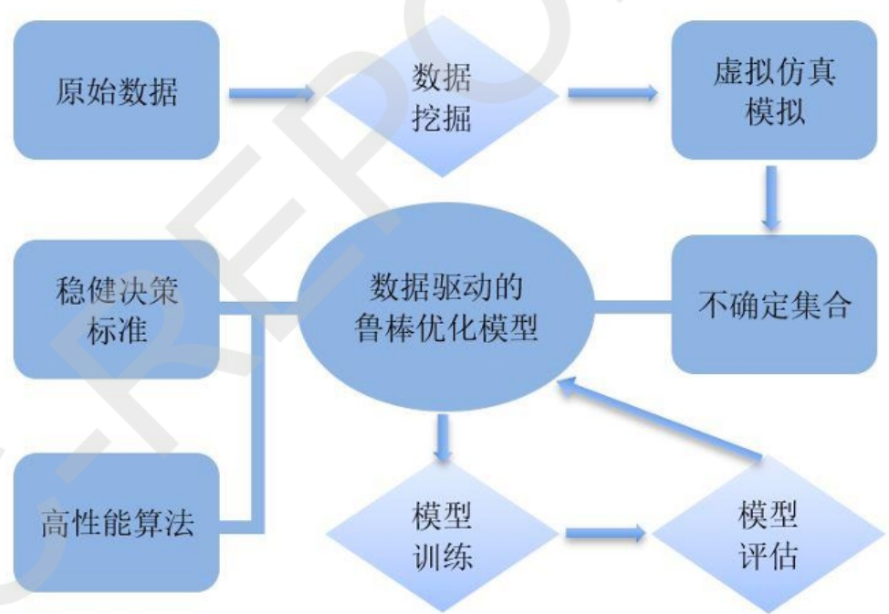

项目批准号 72071211申请代码 G0102归口管理部门收件日期


20240172071211

# 国家自然科学基金

# 资助项目结题/成果报告

资助类别:面上项目

亚类说明:

附注说明:

项目名称:跨媒体环境下数据驱动的鲁棒投资组合优化研究

负责人:吴雷

BRID: 06030.00.10256

电子邮件: wu.lei@zuel.edu.cn

电话: 027-88386791

依托单位: 中南财经政法大学

联系人: 王胜

电话: 027-88386334

直接费用:49.0000（万元）

执行年限: 2021.01-2024.12

填表日期:2025年02月20日

国家自然科学基金委员会制（2023年）

## 项目摘要

## 中文摘要:

本项目主要研究一种基于媒体报道、投资者评论和股票交易信息的数据驱动鲁棒投资组合优化模型，用于对投资组合策略进行风险控制。首先，我们将使用自然语言处理技术对媒体报道和论坛评论进行数据挖掘分析，并利用分析结果提升对股票收益预测的能力，以降低股票收益的不确定性。其次，我们将使用鲁棒优化理论针对股票收益建立不确定性集合，并使用数据驱动优化模型实现对投资组合的优化。在数据驱动优化模型中，我们还将利用市场关注和投资者情绪对股票之间的相关性进行分析，用于提升投资组合策略的稳健性。然后，我们将研发一种基于Benders分解的分支切割算法，并尝试寻找一种用于在计算过程中生成并添加有效切割平面的策略。同时，我们还将使用方案缩减技术用于简化模型，以提升求解最优值的效率。最后，我们还将同时从理论和实际应用的角度建立用于分析投资组合稳健性的方法，并将数据驱动鲁棒投资组合优化模型与其它经典的投资组合优化模型相比较。

## Abstract:

This project is focused on studying a Data-Driven Robust Portfolio Optimization Model (DDRPOM) based on media reports, investor comments and stock trading information, which is used to control the risk of portfolio strategies. First, we will use natural language processing technology to analyze media reports and forum comments, and use the provided results to reduce the uncertainty of stock returns. Second, we will use robust optimization theory to build the uncertainty set used to characterize stock returns, and apply the data-driven optimization model to optimize the portfolio. In the data-driven optimization model, we will also use market attention and investor sentiment to analyze the correlation between stocks in order to improve the robustness of portfolio strategies. In order to efficiently find the optimum solution for the proposed model, we will develop a branch-and-cut algorithm based on Benders decomposition. Furthermore, we will apply the scenario reduction approach to simplify the integer linear model for the DDRPOM. Finally, from both a theoretical and practical perspective, we will try to propose a robustness analysis mechanism to evaluate the DDRPOM and perform a comparative study between the DDRPOM and classic robust optimization models.

关键词（用分号分开）:鲁棒优化；数据驱动；自然语言处理；混合整数规划；投资组合优化

Keywords (separated by;): Robust optimization; Data-driven; Natural language processing; Mixed integer linear programming; Portfolio optimization

## 结题摘要

中文摘要（对项目的背景、主要研究内容、重要结果、关键数据及其科学意义等做简单概述）:

本项目聚焦于数字经济时代下的动态决策与鲁棒优化模型研究，旨在通过先进的人工智能技术提升金融投资组合的优化效率和稳健性。项目背景源于金融市场的日益复杂性和不确定性，传统投资组合优化模型已难以满足现代金融决策的需求。因此，本项目探索了数据驱动鲁棒优化模型在金融领域的应用，以期为投资者提供更精准、更可靠的投资策略。

主要研究内容包括四个方面:一是开发基于数据驱动的鲁棒优化模型框架，利用机器学习算法分析原始数据，构建能够处理信息不确定性的组合优化模型；二是采用copula理论生成表达不确定性的集合，有效捕捉各事件间的相关性，提升模型在复杂不确定性环境下的稳健性；三是分析互联网信息、企业行为对投资组合收益的影响机制，通过整合社交媒体、搜索引擎等多源数据，量化投资者情绪与市场波动之间的关系，开发新的风险量化工具；四是构建投资组合仿真评估模型，结合AI4Finance开源项目优势，提供仿真检验环境，增强模型的可靠性。

项目取得了显著成果。首先，成功开发了基于深度学习的股票价格预测模型，融合社交媒体情感信息，提高了预测的精确度。其次，开发了假新闻检测系统，利用特征驱动学习技术从社交媒体新闻文本中提取关键特征，实现高准确率的假新闻识别。此外，通过模拟实验验证了基于GPU和多AI智能体的强化学习模型在处理市场不确定性方面的有效性，该模型在回报率和风险控制能力上均优于传统方法。

本项目的科学意义在于推动了金融科技领域的理论和方法论发展，特别是在利用现代计算技术和机器学习解决复杂金融问题方面取得了重要进展。应用前景广阔，该研究成果有望广泛应用于金融机构、投资公司和监管部门，帮助投资者在复杂多变的市场环境中做出更精准的投资决策，提高金融市场的整体效率和稳定性。

## Abstract (Brief description of research background, main methods, contributions, and research data):

This project focuses on dynamic decision-making and robust optimization models in the digital economy era, aiming to enhance the efficiency and robustness of financial investment portfolios through advanced artificial intelligence technologies. The project background stems from the increasing complexity and uncertainty of financial markets, where traditional portfolio optimization models are insufficient to meet the needs of modern financial decision-making. Therefore, this project explores the application of data-driven robust optimization models in the finance sector, in order to provide investors with more precise and reliable investment strategies.

The main research contents include four aspects:

1. Developing a data-driven robust optimization model framework, using machine learning algorithms to analyze raw data and construct portfolio optimization models capable of handling information uncertainty.

2. Utilizing copula theory to generate sets representing uncertainty, effectively capturing correlations between events and enhancing the model's robustness in complex uncertain environments.

3. Analyzing the impact mechanisms of internet information and corporate behaviors on portfolio returns, integrating data from social media, search engines, and other sources to quantify the relationship between investor sentiment and market fluctuations, and developing new risk quantification tools.

4. Building a portfolio simulation evaluation model, leveraging the advantages of the AI4Finance open-source project to provide a simulation testing environment, enhancing the model's reliability.

The project has achieved significant results. Firstly, it successfully developed a deep learning-based stock price prediction model, incorporating social media sentiment

information to improve prediction accuracy. Secondly, it developed a fake news detection

```
system, using feature-driven learning techniques to extract key features from social
media news texts, achieving high accuracy in fake news identification. Additionally,
through simulation experiments, the effectiveness of reinforcement learning models based
on GPUs and multiple AI agents in handling market uncertainty was validated, showing
superior performance in terms of returns and risk control compared to traditional
methods.
关键词（用分号分开）：鲁棒优化；数据驱动；自然语言处理；混合整数规划；
 投资组合优化
Keywords (separated by;): Robust optimization; Data-driven; Natural
language processing; Mixed integer linear programming; Portfolio
 Optimization
```


## 正文

《结题/成果报告》正文分为两个部分:结题部分和成果部分。请按照《结题成果报告》填报说明及撰写要求填写。

## (一)结题部分

1. 研究计划执行情况概述。

（1）按计划执行情况。

依据研究计划，本项目主要从以下四个方向进行推进:1）数据驱动鲁棒优化模型设计；2）数据驱动的不确定性集合生成机制；3）互联网信息、企业行为对投资组合收益影响机制分析；4）投资组合仿真评估模型构建。

## 1.1 数据驱动鲁棒优化模型

在本项目中，我们开发了一种基于数据驱动的鲁棒优化模型框架，专门设计来处理信息不确定性环境下的组合优化问题。该模型的核心优势在于其能够在信息不完全的情况下提供可靠的解决方案。具体流程如下:

1) 首先，利用先进的机器学习算法对原始数据进行分析和处理。通过这一步骤，模型能够推导出描述不确定性的概率分布，并据此生成一系列离散的方案集合，这些集合用于模拟不确定信息的可能实现。

2) 其次，基于上述生成的不确定集合，构建一个动态的数据驱动鲁棒优化模型。该模型通过整合不同情景下的数据反馈，能够适应不断变化的环境和数据输入。

3)随后，对模型进行求解处理。在此阶段，我们通过仿真环境对模型的参数设置进行优化，确保模型在多种运行情景下都能表现出良好的鲁棒性和高效性。

4)最后，将训练后的模型解决方案应用于仿真环境，以验证其在实际操作中的稳健性。这一步骤是评估模型整体性能的关键，确保所提解决方案在面对真实世界的不确定性时，依然能保持高效与可靠。

通过这四个步骤，本项目不仅增强了组合优化问题的解决能力，也提高了在复杂、不确定环境中的应对效率，使得模型在实际应用中具有较强的实用性和广泛的适用范围。

## 1.2基于真实数据驱动的不确定性集合生成机制

在本研究的模型构建方面，我们采用了copula理论来发展一种创新的算法，专门用于生成表达不确定性的集合。该算法的研发成果已在近期提交至学术期刊进行评审。此模型的显著优势在于其能够有效捕捉信息不确定环境下各事件间的相关性。具体地:

1) 首先，我们通过copula函数连接多个边际分布，从而构建一个能够全面描述不同事件间相关性的多维概率分布模型。Copula理论的灵活性允许我们精确地模拟和反映各种类型的依赖结构，即使在极端情况下也能保持高度的适应性。

2) 其次，基于copula理论，我们设计了算法来生成反映这些相关性的不确定性集合。此算法不仅能生成用于仿真的数据集，而且能确保这些数据集在统计学意义上的准确性和代表性，这对于模拟现实世界的复杂不确定性至关重要。

3)最后，通过仿真拟合事件间复杂的相关性，我们的模型显著提升了在面对信息不确定环境时的稳健性。这种增强的稳健性使模型在预测和决策过程中更加可靠，尤其是在处理涉及多变量和多风险因素的应用场景时。

整体而言，这种基于copula理论的方法不仅增强了模型的理论基础，也为处理现实世界中的不确定性问题提供了一种更为精确和实用的工具。我们期待该算法能够通过同行评审，并最终对相关领域产生积极影响。

## 1.3 互联网信息、企业行为对投资组合收益影响机制分析

在本项目中，我们对传统的投资组合优化模型进行了重要的扩展和创新。这些传统模型通常侧重于利用数据之间的相关性来设计风险量化工具。然而，鉴于我们的目标是为跨媒体数据建立风险分析工具，我们的研究不仅要分析数据之间的相关性，更需深入探讨不同数据源之间的相互作用机制。具体地，我们关注的是如何将投资者情绪这类定性因素与他们的信息搜索行为以及股市波动之间的联系进行量化。以下是我们改进和优化的关键步骤:

1)首先，我们收集并整合了来自不同媒体的数据，包括社交媒体情绪分析、搜索引擎查询频率、以及传统的股市交易数据。这一步骤确保我们能够从多维度捕捉投资者行为的全貌。

2） 其次，我们通过建立统计和机器学习模型来分析投资者情绪（从社交媒体数据提取）如何通过其信息搜索行为（如搜索引擎搜索指数）影响股市波动。这一过程中，特别注重模型的能力，以揭示这些变量之间非线性和动态的相互作用。

3)基于上述分析，我们开发了一种新的风险量化工具，该工具不仅考虑了传统的市场数据，还融入了跨媒体数据分析的结果。此工具能够更全面地反映市场的潜在风险，尤其是在高波动性时期。

4) 最后，我们通过历史数据进行回测，验证所开发风险量化工具的有效性和准确性。此外，还对模型进行细致的优化，以确保其在不同市场环境下均能提供稳健的风险评估。

总之，通过这种方法，我们不仅增强了传统投资组合优化模型的功能，还为投资者提供了一个更精确的工具，帮助他们在复杂多变的市场环境中做出更为明智的投资决策。

## 1.4 投资组合仿真评估模型构建

在本项目中，我们的团队结合了前沿的研究成果以及AI4Finance开源项目的优势，成功构建了一个专门的项目库。这个库不仅支持生成不确定性集合，还提供了一个仿真检验环境，从而大大提升了数据驱动鲁棒优化模型的可靠性。以下是我们技术细节的完善和优化:

1) 首先，AI4Finance项目提供了丰富的工具和代码库，专为金融数据分析和模型构建设计。我们的项目库直接利用了AI4Finance中的部分开源代码，特别是那些用于数据处理和模型训练的模块。这不仅加速了开发过程，也确保了技术的实用性和效率。

2)其次，为了更好地模拟现实世界的不确定性，我们开发了一套算法，用于从历史数据中提取不确定性集合。这些集合反映了可能影响决策的各种经济和市场因素的变化，为模型提供了实时和动态的输入。

3)最后，我们设计并实现了一个仿真环境，用于测试和验证鲁棒优化模型的效果。该环境能模拟不同市场条件下的经济指标变动，提供一个控制的实验场景来评估模型的表现和稳健性。

通过这些技术细节的完善与优化，我们的项目不仅提高了鲁棒优化模型的可靠性，也增强了模型在实际金融市场应用中的适用性和精确度。

## (2) 研究目标完成情况。

在项目执行期间，我们的科研团队在数字经济领域取得了显著的成果，成功

实现了设定的研究目标。以下是对我们项目研究目标完成情况的详细概述:

1)探索技术进步与市场动态的交互作用:首先，我们深入分析了金融机构的盈利能力与技术进步之间的关系，揭示了数字化工具如何优化金融服务并提升机构效率；其次，我们研究了股票市场的微观动态，特别是在高频交易和算法交易快速发展的背景下，这些技术如何影响市场行为和价格波动；最后，我们评估了假新闻在社交媒体上的传播对证券市场稳定性的影响，分析了市场参与者的反应以及可能的防范策略。 X

2) 科研论文的发表:在项目周期内，我们共发表了7篇科研论文，其中6篇被 SCI 索引，1 篇被 CSSCI索引，这些论文均采用了创新的人工智能驱动优化算法。这些研究成果体现了我们团队在金融市场投资关键问题上的理论与方法论创新，包括风险评估、市场预测、以及投资策略的优化。

3) 推动金融科技应用的实证支持:我们的研究为金融科技应用提供了坚实的实证基础，证明了技术在改进市场分析、增强决策过程、并提升整体市场效率方面的重要性。通过实证研究，我们推动了该领域的科技进步，展示了数据科学和机器学习如何在实际金融环境中发挥作用，尤其是在处理大数据和复杂市场条件下的应用。

4) 跨学科方法的应用有效性:我们的工作证实了跨学科方法在解决当代金融问题中的重要性和有效性。我们结合了经济学、计算机科学和统计学的方法和理论，有效地解决了多个复杂的金融市场问题。

综上所述，通过这些研究，我们不仅实现了项目的研究目标，还在学术和实践领域内推广了人工智能在金融科技中的应用，为未来相关领域的研究和实践奠定了坚实的基础。

2. 研究工作主要进展、结果和影响。

(1) 主要研究内容。

## 一、 社交媒体数据对金融市场的影响机制

在金融服务业中，数字化转型及其对银行发展的影响已成为研究焦点。特别是随着基于互联网技术的金融服务的广泛普及，我们观察到客户行为模式发生了显著变化。以核心银行服务业务为例，用户在社交媒体上的信息搜索行为不仅反映了他们对金融服务的主动性需求，也揭示了数字化如何影响用户的金融决策过程。此外，智能手机银行应用程序的普及则表现出相反的趋势，即客户可能因为应用程序的便利性而减少对传统银行服务的主动寻求。这一现象说明，虽然数字化提供了更多的自助服务选项，但也可能减少用户与银行的直接互动。

进一步的研究还发现，这种影响在不同地区之间存在显著差异。这种差异主要由各地区互联网和移动技术的采用水平决定，突显了技术基础设施和数字资源在推动金融服务变革中的关键角色。地区间技术接入能力的不均等不仅影响了消费者对金融技术的接受度，也影响了金融服务的普及和效率。这些发现为我们提供了深入理解社交媒体行为与金融市场相互作用的理论基础和数据支持。通过这种研究，我们能够更好地评估数字化策略对金融服务行业的具体影响，以及如何在不同地区实施这些策略以适应不同的市场需求。这些见解对于银行和金融机构制定更有效的客户互动和服务策略具有重要价值。

## 二、 建立基于股市交易数据与社交媒体数据的鲁棒投资组合优化模型

在本项目中，我们旨在提高投资组合优化模型的鲁棒性，特别是通过生成可靠的不确定性集合来代理股票价格变化趋势的确定性。我们的核心研究重点是建立一个基于时间序列预测的不确定性集合生成机制，为此我们开发了一个基于深度学习的股票价格预测模型。

1） 模型设计与实现:该模型利用社交媒体上的情感信息来预测股票市场的动态。我们特别关注了深度学习技术的能力，以捕捉数据集之间的复杂非线性关系。这不仅提高了预测的精确度，还增强了模型对市场情绪变化的响应能力。

2）可解释性研究:为了理解社交媒体情绪如何影响股票市场，我们进行了深入的可解释性研究。这一研究帮助我们揭示了情绪变化与市场波动之间的具体动态影响机制。此外，我们也探讨了社交媒体情绪的周期性影响，以识别市场情绪与市场波动之间的潜在关联。

3）假新闻检测系统:考虑到真实与虚假信息对股价的不同影响，我们开发了一个基于特征驱动学习的假新闻检测系统。该系统使用深度学习技术从社交媒体新闻文本中提取关键特征，实现了较高的准确性和泛化能力。为进一步提高识别率，我们还引入了多模态假新闻检测方法，结合文本、图像和音频信息，并采用集成学习方法进行优化。

4） 实验评估与结果:这种多模态假新闻检测方法在多个数据集上进行了实验评估，其结果表明，该方法能有效提高对社交媒体数据影响机制的理解，为股价走势分析提供了强有力的技术支持。

通过以上方法和技术，本项目不仅增强了投资组合模型的鲁棒性，而且提供了对市场情绪和假新闻影响机制的深刻洞察，从而支持投资决策的有效性和精确性。

## 三、 设计用于求解数据驱动的投资组合优化模型算法

在不确定信息环境下，传统优化算法由于其在计算复杂度上的限制，往往难以有效处理大规模数据集。随着近年来高性能计算芯片，尤其是GPU芯片的显著进步，基于GPU的优化模型已逐渐成为研究领域的热点。特别是，在动态策略优化模型的研究中，以强化学习为核心的算法尤受关注，因其能够在连续的决策过程中自我学习和适应。

在投资组合优化的领域，强化学习技术被应用来设计更为稳健的投资策略。我们开发了一种基于多AI智能体的决策策略的强化学习模型，这种模型可以在不断变化的市场环境中动态调整和优化投资组合。基于上述强化学习模型，我们构建了一种新的动态投资组合优化模型。该模型特别考虑到市场的不确定性，通过模拟实验验证了其在实际应用中的有效性。此模型不仅能够处理传统数据，如股票交易数据，还能有效融合来自社交媒体的行为数据，提供更全面的市场分析视角。在技术实现方面，我们利用GPU加速计算，以应对模型在处理大规模、高维度数据时的计算需求。这一点对于实时数据处理和实时决策尤为重要。此外，我们的模型通过连续学习和适应市场变动，展现了优于传统方法的回报率和风险控制能力。综上，该强化学习模型不仅提高了投资组合优化的动态性和适应性，而且通过集成多源数据，增强了决策的信息支持基础，为金融投资领域提供了一种创新的解决方案。这些优势使其在高波动和高不确定性的市场环境中尤为有效，有助于投资者实现更精准的资产配置和风险管理。

（2）取得的主要研究进展、重要结果、关键数据等及其科学意义或应用前景。

在本项目中，我们在动态投资组合优化模型领域取得了显著的研究进展，这些进展不仅展示了强化学习技术的潜力，还提高了处理不确定信息环境下的金融决策的能力。以下是我们研究的主要成果、重要结果、关键数据以及其科学意义和应用前景的总结: 1

## 1) 主要研究进展

基于GPU的优化模型开发:随着高性能计算技术，特别是GPU芯片的发展，我们成功地开发了基于GPU的动态策略优化模型。这种技术的应用大幅提高了处理大规模数据集的能力，特别适用于金融数据的高频更新和计算需求。

多AI智能体的强化学习模型:我们创新地应用了多AI智能体决策策略的强化学习框架来优化投资组合。这种方法利用了AI的自学习能力，可以动态地适应市场的变化，优化投资决策。

## 2) 重要结果与关键数据

模拟实验的成功验证:通过一系列模拟实验，我们证明了该强化学习模型在处理市场不确定性方面的有效性。实验结果显示，该模型在回报率和风险控制能力方面优于传统的投资组合优化方法。

融合社交媒体与股票交易数据:我们的模型成功地融合了来自社交媒体的情感数据和传统的股票交易数据，提供了更全面的市场分析视角。这种数据融合策略增强了模型对市场情绪变化的响应能力，从而提高了投资策略的适应性和预测准确性。

## 3） 科学意义与应用前景

科学意义:本研究推动了金融科技领域的理论和方法论发展，尤其是在利用现代计算技术和机器学习解决复杂金融问题方面。通过将深度学习和多智能体系统应用于金融决策，我们为金融市场的动态性和复杂性提供了新的理解途径。

应用前景:该模型的成功开发预示着人工智能技术在金融投资管理领域的广泛应用潜力。特别是在全球金融市场日益增加的不确定性和复杂性背景下，该技术可帮助金融机构和投资者提高决策的效率和效果，优化资产配置，减少风险，从而在竞争激烈的市场中获得优势。

## 3. 研究人员的合作与分工。

在本项目中，我们的研究团队致力于开展针对动态决策与鲁棒优化模型的求解研究。团队成员来自多个学科背景，确保了研究的全面性和深度。以下是具体的合作与分工情况:

1) 项目负责人吴雷具备决策论、运筹学、计算科学及数学规划等领域的深厚研究基础，项目负责人主要负责项目的整体设计、策略规划及仿真模拟的技术实施，确保研究方向与实际应用的紧密结合。

2) 项目参与人孙宪明和黄伟哥两位研究员在应用经济学、应用数学及数据挖掘领域拥有丰富的研究经验，特别是在风险量化和金融计量学方面。他们的工作主要聚焦于投资组合的稳健性检验，为项目提供必要的理论和技术支持。他们将负责开发和验证项目中的风险管理模型，确保模型在实际金融市场环境中的适用性和准确性。

3) 项目参与人马超的研究专长包括自然语言处理和仿真模拟。他将负责处理项目中的文本信息数据分析，特别是从大规模文本数据中提取与金融市场动态相关的信息。此外，马超还将利用其专长进行项目所需的复杂仿真模拟，为模型验证和策略测试提供技术支持。

4)团队协作:整个研究团队将在项目负责人的指导下紧密合作，定期进行研究讨论和成果分享，确保各个研究环节的有效衔接和资源的最优配置。团队成员的跨学科背景和技能互补，使得项目能够从多角度深入探索和求解动态决策与鲁棒优化模型所带来的挑战。

## 4. 国内外学术合作交流等情况。

1) 项目负责人于2021年被联合国环境规划署(UNEP)聘为官方报告审稿专家，并为题为《The Natural Capital Gap and the SDGs: Costs and Benefits of Meeting the Targets in Twenty Countries》的官方报告出具了审稿意见；

2) 项目负责人于2023年被国家自然科学基金委主办的国际期刊《Fundamental Research》聘为管理科学方向青年编委。

3) 申请人于2024年9月27日，受邀参与国家自然科学基金委员会管理科学前沿论坛暨 Fundamental Research 第二届管理科学编委会第一次会议。

5. 存在的问题、建议及其他需要说明的情况。无。

## （二）成果部分

## 1. 项目取得成果的总体情况。

项目成果包括 7篇科研论文，其中 6篇被 SCI索引，1篇被 CSSCI索引，这些论文均采用了创新的人工智能驱动优化算法。这些研究成果体现了我们团队在



图表1:数据驱动建模与仿真优化的决策理论总体框架

金融市场投资关键问题上的理论与方法论创新，本部分将从数据驱动建模、鲁棒优化、风险控制和机制识别的角度对项目取得成果进行总结:

## 1) 数据驱动建模

在数据驱动建模与仿真优化方面，围绕本项目，近四年来的科研成果主要集中于研究数据驱动决策优化的理论机制，并提出了一种基于数据驱动建模与仿真优化的决策理论框架（如图表1所示）。本项目在该领域开展了一系列探索性工作:a）通过利用数学中的鲁棒优化理论与统计学中的数据驱动技术，并结合管理学中的风险偏好理论，探索了可定量刻画决策风险偏好的数学建模方法；b)

通过利用信息学中的算法优化理论，探索了如何在同时考虑模型可靠性与计算复杂度的情况下求解出最稳健的决策方案；c）通过利用信息学中的数字仿真模拟技术，并结合经济学与管理学理论，建立趋近于现实的仿真环境，用以探索数据驱动优化模型应用于实际的可行性。更加具体的说，数据分析与算法设计的目的都是为了实现决策逻辑的优化。当决策过程中出现大量不确定的信息时，利用统计模型分析数据往往不能达到理想的效果。为了提升决策方案的稳健性，我们应采用逻辑思维层次更复杂的决策模型。但是高维的逻辑层次会大幅度提升求解模型的复杂度。因此，在现实应用中，设计稳健的数据驱动算法既能发挥数据模型的优势，又能利用算法模型有效提升优化方案的应用性。此外，利用新技术，结合经济与管理学相关理论建立接近于现实的虚拟仿真环境，可以为分析经济政策、管理模式在现实场景中的实用性提供更可靠的工具。

针对不确定环境下的复杂组合优化问题，提出可用于模拟决策者偏好的数据驱动鲁棒优化规划模型。在申请人在代表作中针对大规模组合优化问题，利用大数据建立了基于“胜负（Win-Loss，WL）”数据驱动鲁棒标准的数学规划模型。其中，W用于来表示决策者可以达到其希望获得的最好收益的概率，L用于表示决策者面临其绝对不允许承受的最坏损失的概率。WL标准的目标是找到一个最优解，使得该解能够最大化决策方案的获胜概率，同时最小化损失概率。本项目首先从理论上证明了基于WL标准的鲁棒优化模型的计算复杂度为NP-hard。并提出了一种基于机器学习的不确定性集合生成机制。由于采样的数据与实际情况存在误差，因此我们需要借助机器学习模型将采样数据与现实状态进行匹配，从而生成一种趋近现实的仿真环境，并依托该环境生成用于建立数学规划模型的不确定性集合。最后，本项目还提出了一种由真实数据驱动的虚拟仿真实验机制，用以分析决策方案的稳健性。

## 2) 鲁棒优化

在本项目中，我们开发了一种创新的仿真驱动的混合整数线性规划模型，专门用于优化突发风险事件的应对策略。这种多目标优化策略利用鲁棒优化的原理，提高了风险管理过程的实际应用效能。通过集成仿真技术，模型能够在现实世界的复杂条件下进行精确的风险评估和策略规划。

首先，我们采用混合整数线性规划模型来处理问题中的离散和连续决策变量。这种方法允许我们同时考虑多种决策因素，如资金分配、资源配置和紧急响应时间等，每项都具有固定和变动成本。

其次，模型集成了仿真技术，使得在制定策略前可以评估不同决策方案在模拟的风险情境中的表现。通过这种方式，我们能够预测并优化策略对突发事件的响应效果，从而在实际应用中减少风险带来的潜在损失。

最后，在优化过程中，我们考虑了与现实情况紧密相关的核心变量，例如市场动态、供应链中断的可能性及其对业务连续性的影响等。这些变量的准确模拟和分析是确保优化结果可靠性和有效性的关键。我们的优化策略不仅仅关注于最小化风险带来的直接经济损失，还力求在不同的运营目标之间实现平衡，如成本效率、服务水平和快速响应能力。 X

在多轮实验测试中，我们的模型在应对多种设计的风险情景时表现出了优越的性能。实验结果表明，采用我们的多目标优化策略能显著减少由突发风险事件带来的损失，同时在各项关键性能指标上，如成本、时间和资源利用率等方面，均展现出了高效的管理能力。这证明了仿真驱动的混合整数线性规划模型在现代风险管理中的实用价值和应用前景。总体而言，通过这一研究，我们不仅验证了鲁棒优化技术在风险管理中的有效性，也为风险敏感型行业如金融、生产和物流等提供了一个强有力的决策支持工具。

## 3) 风险控制

在项目中，我们采用了先进的逆映射生成对抗网络（InverseMapping Generative Adversarial Networks,IM-GANs）技术来解决数据缺失问题，相比于传统的数据插补技术，此方法展示了更高的可靠性和准确性。此外，我们还运用LASSO（Least Absolute Shrinkage and Selection Operator）基模型来预测比特币的高频回报，通过优化投资策略有效地降低市场波动风险。

首先，我们的方法利用生成对抗网络的强大能力，通过逆映射技术精确地重建缺失的数据点。这种方法不仅可以模拟数据的原有分布，而且能够在缺失数据的场景下重构出与真实数据具有高度相似性的替代数据。射框架允许网络学习到从数据分布到潜在空间的映射关系，这种映射是双向的，提高了插补数据的精度，有效减少了数据缺失对后续量化分析的误差干扰。

其次，利用LASSO模型的稀疏性质，我们能够识别并选择影响比特币高频回报最关键的预测变量，从而提高预测的准确性。这种方法通过惩罚回归系数的绝对值，减少了模型的过拟合风险。通过这种优化投资策略，我们可以更有效地应对市场的高波动性，为投资者提供一种更稳健的风险管理工具。这种策略利用量化模型的输出来动态调整资产配置，以减少潜在的市场下跌风险。

这种结合了先进的数据插补技术和精确的高频交易预测模型的研究方法，为处理大规模金融数据集提供了有效的解决方案，尤其适用于数据完整性不高且市场波动大的金融市场。通过实际应用，我们发现这种组合方法不仅能够提高数据处理的效率和分析的准确性，也显著优化了投资决策过程。总体来说，这些技术的应用不仅增强了数据的可用性和质量，同时也提供了一种更为科学和系统的方法来管理和降低金融投资中的风险。

## 4) 机制识别

在当前全球化的经济环境中，了解不同管理经验与本地文化的融合对企业盈利能力和薪酬公平的影响显得尤为重要。本项目研究深入探讨了国际管理经验与本地文化思想如何共同作用于企业治理，并揭示了这些因素在提升企业绩效中的具体作用机制。

本项目首先通过文献回顾和案例分析，收集关于国际管理经验与本地文化思想的相关数据。接着，我们采用定性分析和定量分析的方法，系统地识别并评估这些因素如何单独及共同影响企业的盈利能力和薪酬公平。特别是，我们分析了管理实践中如领导风格、决策流程和激励机制等元素是如何被本地文化所塑造，以及这种融合如何进一步影响企业的整体绩效。研究发现，国际管理经验和本地文化的有效融合显著提升了企业的盈利能力。例如，当国际管理方法与中国特有的人际关系（关系）文化相结合时，能够在员工激励和团队合作方面取得更好的效果。

本项目还探讨了国际协定如何通过制度框架的改善促进中国的外国直接投资（FDI）。我们利用实证分析方法，如回归分析，来识别和验证国际协定与中国FDI流动之间的因果关系。分析集中于如何通过国际协定改善全球经济互动，特别是在提供投资保护、降低贸易壁垒和增强市场透明度方面。研究证实，国际协定通过提供更为稳定和透明的投资环境，显著促进了外国直接投资的增长。特别是在中国，这些协定有助于建立外国投资者的信心，减少政策不确定性，从而激励更多的外资流入。

通过揭示国际管理经验与本地文化思想的综合影响以及国际协定在全球经济中的角色，本研究不仅为企业提供了如何在全球化背景下优化管理和提升绩效的洞见，还为政策制定者提供了制定和实施国际协定以吸引外国直接投资的实证支持。这些发现预示着，通过策略性地整合国际经验与本地实际情况，以及通过参与和优化国际经济协定，可以有效地推动企业和国家层面的经济发展。

## 2. 项目成果转化及应用情况。

项目的成果转化及应用情况表现在多个层面，具体如下:

1) 企业绩效与公平薪酬:ESG标准与儒家原则的结合能有效提升企业的盈利能力与薪酬公平性，通过改善企业治理结构，这些企业不仅提升了自身的市场竞争力，同时也增强了企业的社会责任感和员工满意度。

2)数字银行服务建设:随着移动银行对传统网银服务的替代效应研究，银行业已开始更加重视移动银行平台的开发与优化，以适应消费者日益增长的移动支付需求，增强用户体验，吸引并保持客户资源

3) 数据插补技术:开发的逆映射生成对抗网络技术可被相关机构采用，用于提高事件序列的准确性和可靠性。

## 3. 人才培养情况。

本项目积极吸纳和引导具有创新潜力的本科生参与科研活动，还大力鼓励他们开展实践性的科学研究。自2021年至2024年，本课题已成功引导多名本科生进行科研工作，其中三位优秀学生已在各自专攻的领域内发表了学术论文。2022年至2023年间，在本项目的资助下，本科生于东立同学发现了我国银行服务业在数字化进程中，手机端服务对网页端服务的替代机制及其边际贡献。这一发现极具价值，最终在申请人的助力下，于东立同学于2023年成功在SSCI期刊《Finance Research Letters》上发表了相关论文，成果显著。同样，在2023年至2024年期间，本科生金紫祺同学在本项目的资助下，基于复杂网络理论构建了国际税收协定网络实证分析模型，深入研究了税收协定及其网络广度对我国对外直接投资的影响。在申请人的精心指导和协助下，金紫祺同学也于2024年在中文CSSCI期刊《税务研究》上发表了论文，取得了令人瞩目的成绩。2021-2024年期间，本科生李一嵘同学在本项目的资助下，协助完成SCI期刊论文一篇，发表于运筹领域权威期刊《Journal of the Operational Research Society》，并基于此成果成功申请到赴世界名校剑桥大学继续深造。此外，在本项目的资助下，2022年，本人指导的学生更是斩获了美国大学生数学建模竞赛特等奖提名（F）的殊荣。

在研究生培养方面，依托本课题资助，本人不仅重视激发学生的主观能动性，更鼓励他们畅所欲言，勇于提出独到见解，对学生在科研道路上的失误与失败持开放包容态度。在指导2023级博士研究生翟震凯时，申请人鼓励其深耕公司治理领域，注重培养逻辑思维与表达能力，告诫其要沉稳扎实、迎难而上。在申请人的悉心指导下，翟震凯同学于 2024 年在 SSCI期刊《Accounting and Finance》

## 5. 项目成果科普性介绍或展示网站。

在当今数字化和全球化迅速发展的背景下，金融市场的复杂性和不确定性日益增加，这对投资决策和风险管理提出了更高的要求。为了应对这些挑战，我们的研究团队开展了一项关于动态决策与鲁棒优化模型的研究，旨在通过先进的数学规划和算法提高投资组合的优化和鲁棒性。 X

## 1） 项目简介

本项目利用整数规划模型和精确算法，结合决策论、运筹学、计算科学等多个学科的理论和方法，研究如何在不确定性信息环境下进行有效的投资决策。我们特别关注金融数据中的不确定性因素，如市场波动、经济指标变化等，以及它们如何影响投资回报。

## 2)核心技术

我们开发的核心技术包括:

-整数规划模型:这种模型能够处理决策变量是整数的复杂问题，特别适用于需要精确解的金融策略和操作。

-自然语言处理:利用自然语言处理技术从社交媒体和新闻文章中提取市场情绪数据，帮助预测股票市场的动态。

-数据驱动优化:结合数据挖掘技术，从大量历史和实时数据中学习和提炼信息，以优化投资策略。

## 3）项目成果

通过这项研究，我们成功开发了一种新的动态投资组合优化模型，该模型能够:动态调整投资策略以适应市场条件的变化、通过优化资源配置，最大化投资回报、有效识别和管理潜在风险，减少经济损失。

## 4） 科学意义与应用前景

这项研究不仅推动了金融科技领域的理论发展，还提供了实用的工具和方法，帮助金融机构和投资者在复杂多变的市场环境中做出更精准和稳健的决策。未来，这些技术和模型有望广泛应用于各种金融服务中，包括资产管理、风险评估和市场分析等。通过本项目的研究成果，我们期望为金融市场的参与者提供强大的支持工具，帮助他们在全球经济快速发展的同时，有效管理风险并把握投资机会。

## 研究成果目录

项目负责人通过系统，从文献库中检索研究成果或者按要求格式自行填入。请按照期刊论文、会议论文、学术专著、专利、会议报告、标准、软件著作权、科研奖励、人才培养、成果转化的顺序列出，其它重要研究成果如标本库、科研仪器设备、共享数据库、获得领导人批示的重要报告或建议等，应重点说明研究成果的主要内容、学术贡献及应用前景等。

项目负责人不得将非本人或非参与者所取得的研究成果、与受资助项目无关的研究成果、未标注国家自然科学基金资助和项目批准号的论文以及取得时间早于项目资助期开始时间的研究成果列入报告中。发表的研究成果（包括专利），项目负责人和参与者均应如实注明得到国家自然科学基金项目资助和项目批准号，科学基金作为主要资助渠道或者发挥主要资助作用的，应当将自然科学基金作为第一顺序进行标注。

## 期刊论文

(1) Wu, Lei; Hifi, Mhand; Data-driven robust optimization for the itinerary planning via large-scale GPS data, Knowledge-Based Systems, 2021, 231: 0-107437. SCIE. 第一标注

(2) 金紫祺；吴雷；税收协定对我国对外直接投资的影响研究——基于复杂网络理论的视角，税务研究，2024，2024(7):105-113. CSSCI. 第一标注

(3) 吴雷; 翟震凯; 吕勇斌; A Cross-Cultural Study of ESG Impact on Corporate Performance and Equity, Account ing and Finance, 2024, 2024(9): 1-18. SSCI. 第一标注

(4) Feng Hui; Mu Renyan; 吴雷; Li Yirong; Balanced scheduling for medical waste treatment in public health emergencies via Simulation-Driven Mixed Integer Linear Programming, Journal of the Operational Research Society, 2024，2024(12):1-17. SSCI. 第一标注

(5) Wu, Zejun; Ma, Chao; Shi, Xiaochuan; Wu, Libing; Dong, Yi; Stojmenovic, Milos; Imputing missing indoor air quality data with inverse mapping generative adversarial network, BUILDING AND ENVIRONMENT, 2022, 215(1). 第三标注

(6) Huang, Weige; Gao, Xiang; LASSO-based high-frequency return predictors for profitable Bitcoin investment, APPLIED ECONOMICS LETTERS, 2022, 29(12): 1079-1083. SSCI. 第一标注

(7) Wu, Lei; Yu, Dongli; Lv, Yongbin; Digital banking and deposit: Substitution effect of mobile applications on web services, FINANCE RESEARCH LETTERS, 2023, 56(1). 第一标注

## 会议报告

(1) 吴雷; Data-Driven Robust Optimization for Portfolio Selection considering Cross-Market Contagion, 2022 POMS International Conference，西安，2022-6-24至2022-6-27.

## 人才培养

1. 出站博士后/毕业博士/毕业硕士/在站博士后/在读博士/在读硕士

(1) 翟震凯；在读博士，2023-9-1至2024-12-31.

(2) 石欣；在读博士，2024-9-1至2024-12-31.

(3) 倪子晴；毕业硕士，信息搜索行为对银行存款的影响研究，吴雷，2021-1-1至2021-6-30.

(4) 尚路欣；毕业硕士，媒体关注对食品上市公司治理的作用分析，吴雷，2021-1-1至2021-6-30.

附表:研究成果统计数据表（本表针对各种类型资助项目收集数据以便进行整体资助效果分析使用，并非要求每类项目都具有以下各类成果。

```
                   国家级                     省部级
获奖（项）   自然科学奖     科技进步奖      发明奖      自然科学奖    科技进步奖    其他
       一等   二等   一等  二等    一等  二等    一等  二等   一等   二等
       0    0    0    0    0    0    0    0    0   0     0
      特邀学术报告           学术论文           学术专著         其他
学术报告/论 国际学术 国内学术 发表论文数   论文检索收录情况
文/专著/其 会议 会议
              期论义
                  会议
 他（篇）                SCIE/ EI 北大中文 CSSCI 中文 外文 标本库 数据库 科研仪器 重要报告
                      SSCI   核心期刊                    设备
       0   0  7   0   4   0  0    1   0   0   0  0   0   0
           专利（项）             标准                   成果转化
专利/标准/  国内      国外             国内       软件著作
软著/成果转                国际                  权
  化   申请  授权  申请  授权     国家  行业  地方  企业     技术转让技术许可作价投资 经济效益
                                                        (万元)
       0   0   0  0   0   0   0   0   0   0   0   0  0   0
                 人才培养（人）                    举办和参加学术会议
人才培养及     中青年学术带头人   出站博士后 毕业博士 毕业硕士 举办国际学术会议 举办国内学术会议 参加国际学术会议
 学术交流 优青  杰青 创新群体 其他                 次数  人数  次数  人数  次数  人数
       0   0   0   0   0    0    2   0   0   0   0   0   0
```