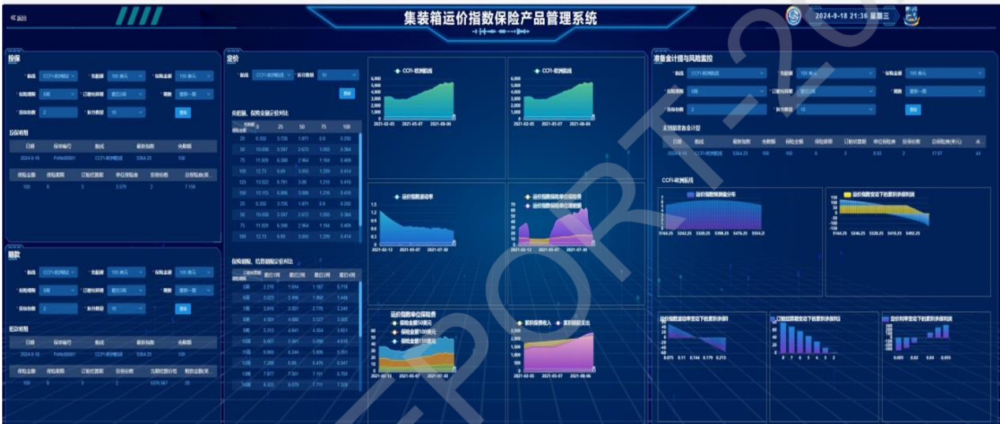

项目批准号 72072018申请代码 G0211归口管理部门收件日期

20240172072018

# 国家自然科学基金

# 资助项目结题/成果报告

资助类别:面上项目

亚类说明:

附注说明:

项目名称:基于成本控制的外贸集装箱运价保险创新研究

负责人:余方平 BRID: 06959.00.21772

电子邮件:yufangping@dlmu.edu.cn

电话: 0411-84728486

依托单位:大连海事大学

联系人:王欣

电话: 0411-84724258

直接费用:49.0000（万元）

执行年限: 2021.01-2024.12

填表日期:2025年01月02日

国家自然科学基金委员会制（2023年）

## 项目摘要

## 中文摘要:

近年来，集装箱运价大幅波动给我国众多中小微进出口企业显著增加了运输成本、侵蚀了原本微薄的利润。本项目积极响应国家“海运强国”战略和降低物流成本、稳外贸等政策要求，研究一套面向中小微进出口企业物流成本控制的外贸集装箱运价保险理论与方法:首先，通过分析集装箱运价关键特征，构建基于随机过程+文本挖掘深度学习技术的集装箱运价预测理论模型，解决现有研究综合考虑运价关键特征和挖掘网络运价信息预测价值不足的问题；其次，通过分析中小微进出口企业碎片化的运价保险基本形态，构建基于期权法+精算法的外贸集装箱运价保险定价理论模型，克服现有亚式运价保险（期权）模型假设简单造成定价偏差的弊端，同时填补非亚式类的运价保险定价模型方法空白；接着，基于FFA、运价和燃料油的期货期权衍生品，创建运价保险风险逆向套期保值优化组合策略，解决风险转嫁难的难题；最后，开展试点，并提出发展外贸集装箱运价保险的政策建议。

## Abstract:

In recent years, the large fluctuation of container freight rate has significantly increased the transportation cost and eroded the meager profit for many medium and small-sized import and export enterprises in China. The project responds positively to the national strategy of "Maritime Powerhouse" and the government's policy requirements such as reducing logistics costs, stabilizes foreign trade, and research a set of theory and method of foreign trade container freight insurance for medium and small-sized import and export enterprises logistics cost control. Firstly, by analyzing the key characteristics of container freight, a stochastic process + text mining deep learning technology foreign container freight forecasting model is set up. It is solve the problem of insufficient key characteristics of container freight and insufficient forecasting value of Internet freight trend judgment information. Secondly, by analyzing the medium and small-sized import and export enterprises' fragmented foreign trade container freight insurance basic form, the foreign trade container freight insurance pricing theory model is constructed based on option + actuary methods. And it is used to overcome the shortcomings of pricing deviation caused by simple assumptions of existing Asian freight insurance (option) models, and to fill in the blank of pricing methods of non-Asian freight insurance model. Then, based on FFA, freight and fuel oil futures and option derivatives, the reverse hedging foreign trade container freight insurance risk optimizing combination strategies is established, which is used to solve briefly the problem of freight insurance risk transfer . Finally, we carry out pilot applications, and put forward policy suggestions on developing foreign trade container freight insurance for serving China' s medium and small -sized import and export enterprises to reduce logistics costs.

关键词（用分号分开）:供应链金融；外贸集装箱运价保险；中小微进出口企业；成本控制；深度学习

Keywords (separated by;): supply chain finance; foreign trade container freight insurance; medium and small-sized import and export enterprises; cost control; deep learning

## 结题摘要

中文摘要（对项目的背景、主要研究内容、重要结果、关键数据及其科学意义等做简单概述）:

本项目将集装箱运价保险创新性地引入中小微进出口企业海运成本控制，建立了集装箱运价波动预测、保险定价及风险转嫁策略的理论框架体系。首先，在集装箱运价特征分析与预测方面，利用多重分形去趋势波动分析法等工具，全面揭示了集装箱运价的多重分形特征，构建了多航线运价组合风险测度及结构突变模型，并深入探讨了集装箱运价溢出效应规律，为风险管理提供了新视角和工具。其次，在保险定价方面，设计了集装箱运价指数小额保险(CFIM)，构建了基于期权法+精算法的外贸集装箱运价保险定价模型，并利用Turnbul1-Wakeman期权、高维Vine Copula等模型提升了定价精准度，为中小微进出口企业提供了有效的成本控制工具。最后，在风险转嫁策略方面，建立了基于Turn bul1-Wakeman期权的集装箱运价对冲组合动态风险敞口测度模型，提出了基于周期+风险偏好的套期保值设计思路，并构建了策略优化模型和算法，实证研究结果显示其效率优于传统方法。本项目积极响应国家相关政策要求，研发外贸集装箱运价保险产品并推动试点，帮助我国中小微进出口企业锁定海运成本，具有理论和实践创新价值。

contributions, and research data):

This project innovatively introduces container freight insurance into maritime cost control for small and medium-sized micro-import and export enterprises, and establishes a theoretical framework system for container freight fluctuation prediction, insurance pricing and risk transfer strategy. Firstly, in terms of container tariff characterisation and prediction, it uses tools such as multi-fractal de-trend volatility analysis to comprehensively reveal the multi-fractal characteristics of container tariffs, constructs a risk measurement and structural mutation model of multi-route tariff combinations, and explores the law of the container tariff spillover effect in depth, which provides new perspectives and tools for risk management. Secondly, in terms of insurance pricing, we designed the Container Freight Index Microinsurance (CFIM) constructed a foreign trade container freight insurance pricing model based on the option method+refinement algorithm, and improved the pricing accuracy by using Turnbull-Wakeman option, high-dimensional Vine Copula and other models, which provides an effective cost control tool for the small and medium-sized micro-import and export enterprises. Finally, in terms of risk transfer strategy, a dynamic risk exposure measurement model for container freight hedging portfolio based on Turnbull-Wakeman options is established, a hedge design idea based on cycle + risk preference is proposed, and strategy optimisation models and algorithms are constructed, and empirical research results show that its efficiency is better than the traditional methods. This project positively responds to the requirements of relevant national policies, develops foreign trade container freight insurance products and promotes pilot projects to help China's small and medium-sized micro-import and export enterprises to lock the cost of shipping, which has theoretical and practical innovation value.

关键词（用分号分开）:集装箱运价保险；保险定价；海运成本控制；

运价风险对冲；Turnbul1-Wakeman期权

Keywords (separated by;): container freight insurance; insurance pricing; maritime cost control; freight risk hedging; Turnbull-Wakeman options

## 正文

《结题/成果报告》正文分为两个部分:结题部分和成果部分。请按照《结题/成果报告》填报说明及撰写要求填写。

## (一）结题部分

## 1. 研究计划执行情况概述。

（1）按计划执行情况。

## (一)项目总体完成情况

研究工作均按基金预定计划执行，按照基金申报书四个主要内容有序展开，在外贸集装箱运价预测研究、外贸集装箱运价保险定价研究、外贸集装箱运价保险风险转嫁策略研究以及试点及对策研究（服务实践）均有论文、专著等学术成果，以及产品落地转化。同时，围绕该基金内容，课题组做了大量扩展性研究，获得了多个国家级、省部级课题，具体如下:

第一，我们致力于理论开拓。我们搭建了集装箱运价成本波动的保险化理论框架，挖掘了集装箱运价形成机制和特征，设计了面向中小微出口企业的集装箱运价指数定制化保险，构建了保险风险再保转嫁策略。形成了一个闭环的理论体系，相关成果发表在《Transportation Research Part E: Logistics and Transportation Review》、《管理科学学报》、《中国管理科学》等期刊上，合著出版《航运交易所建设研究》。2023年，申请人获批国家重点研发计划子课题“大宗商品价格风险智能化监测关键技术验证及应用示范（2023YFC3305105）”。

第二，我们致力于服务实践。近四年来，我们联合中国人民财产保险股份有限公司上海航运保险中心、中国人寿财产保险股份有限公司上海航运保险中心，开发了外贸集装箱综合保障计划方案，2024年两家公司总部已通过内部审核流程，目前正在向监管申请产品报备。一旦审批通过，就可以落地。撰写《加快推动“三个中心”融合发展，进一步提升城市功能》、《关于推动大连自贸片区金融开放创新的对策建议》获得省部级领导批示，为地方发展建言献策。

第三，我们致力于扩展研究。我们推动集装箱运价保险理论成果的向其他海运、公路等领域的复制推广。一方面，向我国降低物流成本领域的复制推广，2021年申报获批中国博士后科学基金会站中项目“货运车成品油价格小额保险创新研究（2021T140081）”，并研发了大货车柴油价格指数保险产品。另一方面，应对欧盟碳税对中资方便旗船舶成本管控，我们联合东海航运保险股份有限公司开发了船舶碳减排设备故障责任保险，保险产品已在上海航运保险协会注册，并在2025年1月7日率先在全国签出第一张保险单。

## (二)项目内容具体执行情况

## ①外贸集装箱运价预测研究的执行情况

围绕根据项目研究计划，在研究开始的第一年，结合中国知网、万方以及Web of Science等文献库，对集装箱运价形成机制以及特征等内涵和外延进行了全面梳理。同时，收集中国集装箱运价指数(CCFI)中欧、中美等主要的集装箱班轮航线运价历史数据和集装箱报告、统计年鉴等资料，梳理总结集装箱运价相关研究结论与成果，分析、清洗和存储相关集装箱运价数据。在此基础上，开展了外贸集装箱运价特征和预测研究工作。在运价特征分析方面，采用多重分形去趋势波动分析法(MFDFA)对全球集装箱海运市场的运价波动特征进行深入研究，借助高维Vine Copula解析了集装箱运价指数相依结构。在运价预测方面，采用了自回归移动平均模型ARIMA拟合集装箱运价，得到置信水平为α预测值。综合概率分布拟合非参数模型、ARMA-EGARCH拟合的参数模型和基于CAViaR的半参数模型，结合隐含CVaR非线性相关系数获得运价组合CVaR尾部“平均”风险非线性关系。该部分形成了《匹配波动特征的班轮航线运价组合风险测度》（《中国管理科学》期刊第二轮外审中）等学术成果，形成了《基于MFDFA的海运运价指数多重分形特征研究》等硕士生毕业论文以及航运交易所专著《我国国际航运交易所建设路径研究》。

## ②外贸集装箱运价保险定价研究的执行情况

在外贸集装箱运价预测研究成果基础上，围绕外贸集装箱运价保险定价这一核心工作展开深入研究。首先，开展了详细的调研工作。2022年年初，联合东海航运保险股份有限公司大连分公司、中国人民财产保险股份有限公司大连市分公司就外贸集装箱运价保险产品创新设计了详细调研方案，并选取代表性的第三方海运物流撮合平台、跨境电商、集装箱运输公司、货代以及管理部门、航运保险协会等（具体典型包括:锦程物流网（国内排名前列）、运去哪、中远集装箱、国家金融监管总局大连、上海、宁波等监管局、上海航运保险协会、中国橡胶工业协会等）进行近40余次走访座谈、专家咨询和调查，梳理中小微进出口企业外贸集装箱运价波动成本控制的问题、要素和诉求，界定了运价保险产品形态和关键参数，提出了产品设计的四条基本原则，进行外贸集装箱运价保险产品创新设计，形成外贸集装箱运价不同形态的保险产品集。其次，深入研究了集装箱运价保险定价理论和模型。基于期权法和精算法，对设计的集装箱运价保险定价，综合对比基于(期权法+精算法)定价结果和差异，改进集装箱运价保险定价理论方法。该部分研究成果被提炼相关学术论文和保险产品，发表了《An innovative tool for cost control under fragmented scenarios: The container freight index microinsurance》《面向中小微出口企业成本控制的集装箱运价指数保险研究》等学术成果，并形成了集装箱运价指数保险产品相关可行性报告、保险条款和保险费率表。

## ③外贸集装箱运价保险风险转嫁策略研究的执行情况

课题组重点研究保险公司承揽碎片化集装箱运价保险风险集合，用运价衍生品转嫁的策略。依据集装箱运价保险风险中性原则，借鉴“保险+期货”模式的风险转嫁思路，基于Turnbul1-Wakeman 期权，建立 Delta 区间对冲策略下集装箱运价对冲组合的动态风险敞口测度模型。一是推导了考虑标的资产价格、波动率及时间因素下Turnbul1-Wakeman 期权（看涨和看跌）的Delta、Gamma、Vega、Theta、Vanna和Vomma6个敏感性参数解析解。二是提出二阶混合近似法构建对冲组合风险敞口测度模型。通过加入二阶混合敏感性参数改进现有的期权组合Delta-gamma近似法，研究了如何构建更加精确的对冲组合风险测度模型。三是搭建区间对冲策略下的对冲组合风险敞口动态测度模型。选取Delta 固定区间和 Whalley一Wilmott 区间对冲策略，设计两种 Delta区间对冲策略的风险敞口测度模型，进一步增强集装箱运价风险敞口测度模型的适用性。该部分研究成果形成了硕士毕业论文《Delta区间对冲策略下“保险+期货”模式组合动态风险敞口测度》、《基于VMD-FCM-MEG的集装箱运价指数期货套期保值策略研究》等，并整理成相关学术论文，正处于期刊外审中。

## ④试点及对策研究（服务实践）的执行情况

基于上述理论成果，课题组于2022年开始，重点推动成果转化为实践创新工作。结合我国降低物流成本政策，先后联合东海航运保险股份有限公司大连分公司、中国人民财产保险股份有限公司大连市分公司和上海航运保险中心、中国人寿财产保险股份有限公司上海航运保险中心推动集装箱运价指数保险产品研发。2023年8月，借助上海期货交易所旗下的能源交易中心上市中欧航线集装箱运价期货契机，进一步将其改造成“保险+期货”模式的产品。目前，该产品通过了中国人寿财产保险股份有限公司总部内部审核流程，已获得监管部门的大力支持。同时，课题组还开发了配套的集装箱运价指数保险产品管理系统。截止到2024年底，全国性产品注册的流程仅剩下最后一步，即向保险公司总部的监管部门申请注册。同时，课题组围绕理论成果的落地转化，还撰写了两份咨政建议，将集装箱运价指数保险服务降低海运物流成本，纳入到大连东北亚国际航运中心建设发展建议之中。

## （2）研究目标完成情况。

研究目标、研究内容没有进行重大的调整和变动。研究工作均按照原计划执行，所有目标均达成，部分目标已经超额完成。

## (一)成果目标完成情况

学术论著方面:课题组共发表论文9篇，出版专著1部。其中，在国际交通领域权威期刊《Transportation Research Part E: Logistics and Transportation Review》、《Maritime Policy&Management》以及《管理科学学报》、《中国管理科学》等

FMS管理科学高质量T1级中文期刊上发表论文9篇，其中:SSCI检索论文2篇，CSSCI检索论文3篇，SCIE检索论文2篇。与匡海波等作者合著《我国国际航运交易所建设路径研究》，由2022年科学出版社出版。

成果应用方面:课题组与保险公司协同推动集装箱运价指数保险产品的研发与转化落地，预计2025年落地试点。创新设计并落地船舶碳减排设备故障责任保险，得到我国航运业关注。

知识产权方面:依托课题研究，课题组获批软件著作权1项（集装箱运价小额保险管理系统（V1.0.0），登记号:2021SR2007810），为项目成果落地提供保障（在线网址:http://fintech.dasc.org.cn/#/login），如下所示。

人才培养方面:截止2024年底，围绕课题研究方向，项目负责人作为第一导师培养1 名博士生和 12名硕士研究生，协助培养2 名博士生和3 名硕士生（第二导师）。其中，1名博士生毕业和12名硕士研究生毕业（作为第一导师硕士生数量为10名），超额完成了项目预期人才培养目标。

社会服务方面:围绕课题既定研究方向，课题组以服务绿色智能港航和海运供应链安全为导向，不断挖掘探索新的科学问题，先后申报获批科技部国家重点研究计划子课题1项（大宗商品价格风险智能化监测关键技术验证及应用示范（2023YFC3305105）。科技部国家重点研发计划课题，2023.11-2026.10，主持（在研）），博士后站中项目1项（货运车成品油价格小额保险创新研究（2021T140081），中国博士后科学基金第14批特别资助(站中)项目，2021.06-2024.12，主持（结项））。

## (二)研究内容目标完成情况

## ①外贸集装箱运价预测研究的完成情况

研究目标均已完成。不仅利用多重分形去趋势波动分析法(MFDFA)、高维VineCopula、时变溢出指数模型等分析了集装箱运价特征的作用和演变机理，揭示了对运价预测的关键特征的规律；还基于现有研究基础上，运用整合运价特征的客观性的ARIMA等方法，并结合主观性的预测技术，实现较精确地集装箱运价预测模型构建，达到好地预测外贸集装箱运价趋势，为外贸集装箱运价保险定价打好了坚实的理论支撑。

## ②外贸集装箱运价保险定价研究的执行情况

研究目标均已完成。首先，借助调研和统计手段，确定中小微进出口企业碎片化运价波动成本转化成运价保险的产品形态及其最小份额、保障责任等关键要素。其次，利用传统定价和衍生品定价相结合方式，建构期权定价法和经典燃烧精算定价法的集装箱运价保险定价理论模型，解析不同产品类型运价保险定价公式和算法程序，搭建外贸集装箱运价保险产品组合集。

## ③外贸集装箱运价保险风险转嫁策略研究的执行情况

研究目标已完成。采用风险中性原则，构建基于获得外贸集装箱运价风险转嫁 Delta、Gamma 和 Vega等组合策略，实现外贸集装箱运价保险风险有效转嫁至运价衍生品市场，为外贸集装箱运价保险风险转嫁策略提供理论指导。

## ④试点及对策研究（服务实践）的完成情况

研究目标已接近完成。集装箱运价保险产品合同条款、费率等已完成研制，联合保险公司进行最后一步的监管汇报沟通和备案。预计2025年落地试点。

2. 研究工作主要进展、结果和影响。

（1）主要研究内容。

## ①外贸集装箱运价预测研究

● 采用多重分形去趋势波动分析法(MFDFA)对全球干散货及其子市场、油轮及其子市场和集装箱海运三大市场的运价波动特征进行深入研究。首先，选取干散货市场运价指数:BDI、BPI、BCI、BSI、BHSI，油轮运价指数:BDTI、BCTI，集装箱运价指数CCFI共8个典型运价指数，通过运用多重分形方法三大标度参数，分别计算以上8个海运运价指数的广义Hurst指数、质量指数、多重分形谱参数及绘制多重分形谱图，来捕捉全球干散货及其子市场、油轮及其子市场和集装箱海运三大市场的多重分形特征。主要结论有:一是通过观察广义Hurst指数大小、质量指数的特征以及多重分形谱的宽度、极大值和曲线的不对称程度，证实了干散货和油轮市场具有更复杂的多重分形结构，并首次发现集装箱运价市场也具有多重分形特征。二是通过横向对比分析，发现三大海运市场的多重分形特征强弱顺序为:油轮运价指数大于干散货运价指数大于集装箱运价指数。

●考虑到航运市场波动聚集性、厚尾性、周期性等多种特征，综合了当前三种经典的概率分布拟合非参数模型、ARMA-EGARCH拟合的参数模型和基于CAViaR 的半参数模型，得到三种模型下的组合CVaR结果，并结合隐含CVaR非线性相关系数获得运价组合CVaR尾部“平均”风险非线性关系，通过最小方差法测度三种模型组合CVaR的权重，构建了集装箱多航线运价组合风险测度模型。以 Xeneta 平台发布的XSI(Xeneta Shipping Index,Xeneta，航运指数)多条航线为研究对象，对集装箱班轮企业的运价组合风险进行测度。结果表明，构建的模型在刻画运价组合风险的准确度和稳定性方面，较传统方法更具优势，无论是面对航运市场正常波动区间还是剧烈波动区间时均可对其进行有效的风险管理，准确率可达90%以上，相较于单一风险测度方法其更具全面性和系统性。

在构建加征关税的我国进口大豆主要航线运价传导机制的基础上，选取测度指标并借助 SVECM构建了我国进口大豆主要航线运价结构突变测度模型，利用2015-2020年6月期间数据进行了实证分析。结果显示:加征关税改变了美国大豆进口量与美国和巴西航线运价的长期负向均衡关系，尽管美国航线运价负向关系得以维持，但是与巴西航线运价的关系已变成正向均衡关系。加征关税在短期内对两条航线运价冲击效应由负向变成了正向。加征关税对美国和巴西两条航线的运价波动贡献了15%-20%的效应。

## ②外贸集装箱运价保险定价研究

通过设计一种集装箱运价指数小额保险革新工具，实现对集装箱运价上涨引致额外增加的海运成本有效控制。首先，考虑到管理成本、保险的受众、中小进出口企业订舱实务，兼顾保险人和中小进出口企业利益，提出集装箱运价指数小额保险设计的四条原则，即指数可靠、结构恰当、普惠保险、风险可控。其次，结合实际订舱活动特点，考虑到订舱时间的分段性、订舱人对运价的预估值、拼箱与整箱的运输方式，分析了集装箱运价指数小额保险的期限结构、产品结构和份额结构。然后，根据保险产品结构的特征，借鉴延期式算术平均亚氏期权方法，构建了无赔付上限和有赔付上限的两种集装箱运价指数小额保险基本份额动态定价模型。接着，依据普惠保险和风险可控两个原则，构建了关键的行动策略，借助平均单位纯保费费率和承保利润率两个筛选指标，比较和选取优化产品方案。最后，案例分析了2003.3.14-2021.8.13的CCFI(欧洲航线)数据，设计和筛选出表现良好的产品方案集合，验证了这些产品方案在跨越2021.1.1-2021.8.13的极端运价情景后，仍然具有良好的鲁棒性。通过与经典燃烧分析法进行对比，集装箱运价指数小额保险更加灵敏，模型定价具有稳健性和风险动态调整性，有助于缓解中小微进出口企业应对集装箱运价上涨引致的额外成本增加困局。

● 结合当前中小微出口企业集装箱订舱实务，设计了集装箱运价指数保险的基本形态及其期限结构、赔付结构和份额结构，用保险大数法则将众多中小微出口企业碎片化的集装箱运价成本控制需求跨期、跨主体分摊。其次，采用传统经典的ARIMA计量模型拟合集装箱运价指数时间序列并得到区间预测，构建了基于ARIMA的算术平均延期式集装箱运价指数定价模型，借助区间预测+分位数分档方法对集装箱运价指数保险保费进行厘定，并且将整箱的集装箱运价指数保险单位保费划分成基本份额保费，设计的保险产品能够突出中小微企业的特定适用性，满足实践中大量中小微出口企业的个性化、碎片化海运成本风险管理需求，丰富了现有运价衍生品定价方法谱系。然后，对全球标杆集装箱运价指数一一中国出口集装箱运价指数(CCFI)欧洲航线运价指数保险进行了定价实验，模拟整个定价过程，对未来运价进行预测，并与延期平均价格亚式看涨期权定价模型和保险业常用的燃烧精算模型的效果进行对比，验证本项目设计的集装箱运价指数保险的合理性。最后进行了案例分析，基于实际的案例对其保险成本控制进行分析，计算了对应的基本份额保费并抉择出了较优的保险方案。

在供应链韧性视阈下，对有效控制海运物流成本的集装箱运价指数保险的费率厘定机制进行深入研究，创新保险工具转嫁运价上涨风险。首先，从全球集装箱供应链韧性角度，选取了全球集装箱有效运力、燃料油价格、BDI指数、国际贸易额以及集装箱二手船价格指数等指标，构建了集装箱运价指数影响指标体系，克服了现有研究从运价指数捕捉自身波动特征、蕴含信息量不足的弊端。其次，构建了基于高维 Vine Copula 的集装箱运价指数相依结构解析模型。借助ARMA-GARCH-P类分布模型拟合集装箱运价指数影响指标的边缘分布，并利用C、D和 RVine结构刻画出集装箱运价指数与其影响指标之间的相依结构，解决了集装箱运价指数波动画像不清晰的突出问题。第三，设计了集装箱运价指数保险定价模型和算法。在集装箱运价指数保险结构基础上，基于集装箱运价指数及其影响指标的 Vine Copula 相依结构，运用 Monte Carlo 模拟法实现对集装箱运价指数保险纯费率厘定，解决了现有传统指数保险定价方法契合不够的突出难题。最后，以中国出口集装箱运价指数美西航线（CCFIW/C）为标的的集装箱运价指数保险进行案例分析。结果表明:一是集装箱运价指数与其他影响指标间的联系最为紧密，处于相依结构中的核心位置。二是在指标组合相依结构的刻画方面，R-Vine Copula 模型的拟合效果总体上要优于 C-Vine Copula 和 D-Vine Copula模型。三是本定价模型其结果精度优于经典燃烧精算、Turnbull-Wakeman期权等方法。

## ③外贸集装箱运价保险风险转嫁策略研究

基于Turnbull-Wakeman期权，建立了Delta 区间对冲策略下集装箱运价对冲组合的动态风险敞口测度模型。一是推导了考虑标的资产价格、波动率及时间因素下Turnbull-Wakeman期权（看涨和看跌）的Delta、Gamma、Vega、Theta、Vanna 和 Vomma6个敏感性参数解析解。二是提出 $\mathrm { F _ { t ^ { - } } } \; \mathrm { \sigma _ { \mathrm { ~ A - t ~ } } }$ 二阶混合近似法构建对冲组合风险敞口测度模型。通过加入二阶混合敏感性参数改进现有的期权组合Delta-gamma近似法，构建了更加精确的对冲组合风险测度模型，解决了如何提升非线性组合风险测度精确度的问题。三是构建了区间对冲策略下的对冲组合风险敞口动态测度模型。选取 Delta 固定区间和 Whalley一Wilmott 区间对冲策略，设计了两种Delta区间对冲策略的风险敞口测度模型，进一步增强了风险敞口测度模型的适用性。案例结果显示:构建的模型较传统的Delta-gamma近似法更精确，能够更好地测度不同价格场景下的对冲组合风险敞口动态变化情况。

● 提出了基于周期+风险偏好的集装箱运价指数期货套期保值设计思路。综合考虑集装箱运价的周期特征和集装箱供应链相关方的风险偏好态度，设计了低、中、高三个频项的集装箱运价指数期货套期保值策略，吸收了现有期货套期保值策略优势，丰富了集装箱运价波动风险套期保值策略理论谱系。构建了基于VMD-FCM-MEG的策略优化模型和算法。按照分解一重构的思路，借助VMD、FCM，构造低、中、高三个频项的期现货收益率子序列，并借助扩展MEG函数，构建期货套期保值模型，采用秩估计累积概率分布拟合集装箱运价指数现货、期货收益率，设计MEG套期保值优化比率求解算法，有效解决了集装箱运价指数期货套期保值策略优化的问题。采集上海航运交易所和Xenate公司中美航线集装箱运价指数期货和现货数据进行了实证研究，结果显示:集成MEG套期保值比率随着风险偏好态度增加呈现出先增后减的趋势。二是集成 MEG套期保值策略的效率整体优于传统 OLS、VAR 和 Sharpe 等静态套期保值效率。

## ④试点及对策研究（服务实践）

课题组自2022年起，结合我国降低物流成本的政策导向，与多家保险公司及航运保险中心合作，致力于集装箱运价指数保险产品的研发。经过努力，该保险产品已通过了中国人寿财产保险股份有限公司等内部审核流程。目前，该产品正处于与监管沟通和全国性产品注册的最后阶段。课题组还开发了对应的集装箱运价保险管理系统软件。此外，课题组还撰写了咨政建议，将该保险产品服务降低海运物流成本纳入到大连东北亚国际航运中心的建设发展建议中。

（2）取得的主要研究进展、重要结果、关键数据等及其科学意义或应用前景。

本项目将集装箱运价保险引入到企业物流成本控制理论中，研究一套面向中小微进出口企业成本控制的集装箱运价保险理论:建构集装箱运价波动预测机制、集装箱运价保险定价模型，求解集装箱运价保险风险转嫁优化组合策略。这套理论方法不仅有效改进了中小微进出口企业的物流成本控制理论，而且有效丰富了航运保险理论，具有理论创新和实践价值。主要研究进展及重要成果如下:

第一，本项目在外贸集装箱运价特征和预测领域实现了多维度、深层次分析。首先，采用多重分形去趋势波动分析法(MFDFA)首次全面揭示了于散货、油轮及集装箱海运三大市场的多重分形特征，为运价波动特性的深入理解提供了新视角。构建了集装箱多航线运价组合风险测度模型，结合多种概率分布拟合模型，显著提高了运价组合风险测度的准确度和稳定性，为航运企业的风险管理提供了有力工具。再者，建立了主要航线运价结构突变测度模型，揭示了加征关税对航线运价均衡关系的影响。这一系列创新成果丰富了外贸集装箱运价预测研究的理论体系。

第二，通过分析中小微进出口企业碎片化的运价保险基本形态，构建基于期权法+精算法的外贸集装箱运价保险定价理论模型。首先，结合中小微企业的实际需求，提出了碎片化场景下指数微保险的设计原则，并在综合分析期限、补偿和份额结构的基础上设计了集装箱运价指数小额保险(CFIM)，其次，基于Turnbull-Wakeman期权和ARIMA计量模型拟合集装箱运价指数时间序列，构建了基于算术平均延期式的保险定价模型。此外，从供应链韧性角度出发，构建了集装箱运价指数影响指标体系，并借助高维 Vine Copula模型解析了运价指数与其影响指标之间的相依结构，进一步提升了保险定价的精准度。以中国集装箱运价指数欧洲服务的数据为例说明了该框架，证明了所设计的产品在极端市场条件下也具有良好的性能，新设计的CFIM以及定价和优化流程为从业者提供了有效的成本控制工具，丰富了外贸集装箱运价保险定价的理论体系。

第三，构建外贸集装箱运价保险风险转嫁策略。首先，基于Turnbull-Wakeman期权，建立了Delta区间对冲策略下的集装箱运价对冲组合动态风险敞口测度模型。该模型通过推导期权的多个敏感性参数解析解，并引入二阶混合近似法，构建了更加精确的风险测度模型，有效提升了非线性组合风险测度的精确度。同时，设计了两种Delta区间对冲策略的风险敞口测度模型，增强了模型的适用性。其次，提出了基于周期+风险偏好的集装箱运价指数期货套期保值设计思路，并构建了基于VMD-FCM-MEG的策略优化模型和算法。该设计思路综合考虑了集装箱运价的周期特征和供应链相关方的风险偏好态度，设计了低、中、高三个频项的套期保值策略。通过VMD和 FCM 方法构造期现货收益率子序列，并借助扩展MEG函数构建套期保值模型，有效解决了策略优化问题。实证研究结果显示，集装箱运价保险风险转嫁策略的效率整体优于传统方法。

最后，针对近年来集装箱运价大幅波动，给我国众多中小微进出口企业显著增加运输成本、侵蚀原本微薄的利润突出问题，本项目积极响应习近平总书记关于“海运强国”战略加快落实、二十大三中全会“提高航运保险承保能力和全球服务水平”以及国家“推进物流降本增效”、“稳外贸”、“金融供给侧结构性改革”等政策要求，在全球海运供应链韧性遭受重大挑战背景下，加快研发外贸集装箱运价保险产品并开展试点，切实为广大中小微进出口企业锁定物流成本、保“价”护航，具有较显著的实践创新价值。

## 3. 研究人员的合作与分工。

课题组成员主要由大连海事大学航运经济与管理学院和综合交通运输协同创新中心的教师和博士研究生组成，课题组成员共计25人，其中，教授2人、副教授4人、会计师1名、博士研究生3人、硕士研究生15名。项目执行期间，项目主要研究人员余方平副教授、陈梅教授、王选鹤副教授、郭红月副教授、贝泓涵副教授等将大部分精力投入本项目的研究中，平均每人年均投入该项目的研究时间为4-6个月，项目负责人投入该项目的年均时间为8个月。

## (1)项目执行期间主要研究人员及分工情况

项目执行期间主要研究人员名单及分工如表1如示:

表1 主要研究人员

<table><tr><td>序号</td><td>姓名</td><td>职称</td><td>项目分工</td></tr><tr><td>1</td><td>余方平</td><td>副教授</td><td>整个课题的组织、协调工作，以及各关键问题的研究工作</td></tr><tr><td>2</td><td>陈梅</td><td>教授</td><td rowspan=2>外贸集装箱运价保险形态调研和定价研究</td></tr><tr><td>3</td><td>刘延青</td><td>硕士研究生</td></tr><tr><td>4</td><td>王选鹤</td><td>副教授</td><td rowspan=2>外贸集装箱运价保险定价研究</td></tr><tr><td>5</td><td>向致远</td><td>硕士研究生</td></tr><tr><td>6</td><td>郭红月</td><td>副教授</td><td rowspan=2>外贸集装箱运价特征分析和预测研究</td></tr><tr><td>7</td><td>薛凯利</td><td>博士研究生</td></tr><tr><td>8</td><td>贝泓涵</td><td>副教授</td><td rowspan=2>外贸集装箱运价风险转嫁策略研究</td></tr><tr><td>9</td><td>张鹏飞</td><td>博士研究生</td></tr><tr><td>10</td><td>王骏</td><td>会计师</td><td>外贸集装箱运价保险试点指导与协调</td></tr></table>

此外，项目执行期间，课题组不断加入新入职教师与新入学研究生，项目负责人余方平副教授依据项目的研究目标与任务，对课题组成员进行合理分工，成员间团结协作、攻克难关，研究生在研究过程中迅速得到训练，毕业论文选题大部分与本课题研究相关，人才培养效果显著。同时，本课题积极开展国内外学术交流与合作，及时发表最新研究成果，扩大学术影响力。

## (2)项目执行期间新增研究人员及加入原因

项目执行期间有14名新增研究人员(1名博士生和13名硕士生)加入研究。项目执行期间的新增研究人员及新增原因如表2所示:

表2新增研究人员名单

| 序号 | 姓名 | 职称 | 加入原因 | 序号姓 | 名 | 职称 | 加入原因 |
| --- | --- | --- | --- | --- | --- | --- | --- |
| 1 | 张凯利 | 硕士研究生 | 2019年9月入学 | 8 | 汤婷婷 | 硕士研究生 | 2021年9月入学 |
| 2 | 陈杭 | 硕士研究生 | 2019年9月入学 | 9 | 邓园 | 硕士研究生 | 2021年9月入学 |
| 3 | 刘施汝 | 硕士研究生 | 2020年9月入学 | 10 | 温培科 | 硕士研究生 | 2021年9月入学 |
| 4 | 陶坤 | 硕士研究生 | 2020年9月入学 | 11 | 张蒙丹 | 硕士研究生 | 2022年9月入学 |
| 5 | 张蕾 | 硕士研究生 | 2020年9月入学 | 12 | 亓思涵 | 硕士研究生 | 2022年9月入学 |
| 6 | 刘逸潇 | 硕士研究生 | 2020年9月入学 | 13 | 王旭 | 硕士研究生 | 2022年9月入学 |
| 7 | 张仁福 | 硕士研究生 | 2022年9月入学 | 14 | 马润轩 | 博士研究生 | 2024年9月入学 |

## 4. 国内外学术合作交流等情况。

## 4.1 国内外参加的主要会议

2024年9月27-29日，项目负责人带领硕士研究生亓思涵参加了南京市东南大学举办的 The 6th International Symposium on Multimodal Transportation (ISMT 2024)会议，在“Session 16:Maritime Transportation 分会场上，负责人与硕士研究生亓思涵共同做了“Spatiotemporal evolution of global shipping finance dominance: Competition among 18 major countries from 2008 to 2022”为主题的学术汇报。

2023年7月19-21日，项目负责人参加了大连市大连海事大学举办的The5th International Symposium on Multimodal Transportation (ISMT 2023)会议，在“Smart Cities,Transportation Planning and Autonomous Driving”分会场上，负责人做了“Multi-level facility location embedded with virtual facilities theory —Experience of rapid handling of minor traffic accidents on urban roads in China’为主题的学术汇报。

● 2023年11月17-19日，项目负责人带领硕士研究生张蒙丹参加了在深圳市举办的第三届港航经济系统工程年会暨中国国际航运中心研究机构联盟成立大会。会上，负责人与硕士研究生张蒙丹共同做了题目为“Intelligent pricing of ship insurancebased on RFR”学术汇报，该会议论文被评选为第三届港航经济系统工程年会高质量论文。

2021年12月11-12 日，项目负责人带领硕士研究生陶坤和张仁福参加了在线举办的第十二届中国风险管理与精算论坛（The 12th China Forum for Risk Management and Actuarial Science）。在平行论坛2“高维风险管理”中，负责人指导硕士研究生陶坤做了题目为“基于Vine-Copula 的集装箱运价指数保险定价研究”，在平行论坛8“财产险研究”中，负责人指导硕士研究生张仁福做了题目为“一种容量受限的分层p-中值车险快速理赔中心选址优化模型”。

● 2024年12月14-15日，项目负责人参加了在南京市东南大学举办的第二届数字化多式联运理论与实践创新研讨会暨第三届中国“双法”研究会多式联运分会学术年会。会上，认真聆听与学习相关专家学者集装箱海铁联运相关研究成果，并围绕集装箱海铁联运一单制等保险进行了深入交流和探讨。

● 2023年9月2日-3日，项目负责人带领课题组成员参加了在大连市大连海事大学举办的第二十届金融系统工程与风险管理年会。会上，项目负责人带领课题组成员围绕价格类风险管理、价格期货期权定价等进行了深入学习和交流。

● 2021年7月23日，项目负责人和项目组成员王选鹤副教授参加了北京市中国人民大学召开的中国现场统计研究会风险管理与精算分会成立大会暨学术研讨会。会上，项目负责人被选为理事，同时围绕集装箱运价保险定价、风险对冲等精算理论与模型，与与会专家进行了深入交流。

## 4.2 学术交流情况

课题组总共进行了6次学术交流，主要如下:

2024年12月13日，东北财经大学金融学院副教授杨默在大连海事大学远望楼进行学术报告“Measuring financial systemic risk with a new time-varying frequencyconnectedness”，课题组与杨默副教授深入探讨了通过时变频率连接性衡量金融系统性风险，本次交流对于深入理解金融系统性风险与全球班轮市场联动性有着重大意义。

2023年11月14日，课题组在大连海事大学远望楼课题组与西北农林科技大学经济管理学院石宝峰教授深入探讨了基于大数据的指数保险定价策略，本次交流对于深入理解保险定价优化与风险评估有着重大意义。

## 5. 存在的问题、建议及其他需要说明的情况。

## （二）成果部分

1. 项目取得成果的总体情况。

## (1)发表论文9篇，还有多篇相关论文正在外审之中

基金申请书任务计划“在国内外重要期刊上发表论文6-10篇，其中:在国际交通和金融领域三区及以上的期刊和国内国家自科基金委认定A类的期刊上发表论文3-5篇”，目前已超额完成申请书规划的任务。另外，还有多篇相关论文正在外审之中。

截至2024年12月31日，课题组共发表论文9篇，其中，在国际交通领域权威期刊《Transportation Research Part E: Logistics and Transportation Review》等，以及《管理科学学报》、《中国管理科学》、《管理评论》等FMS管理科学高质量T1级中文期刊上发表论文7篇，SSCI检索论文2篇，SCIE检索论文2篇，CSSCI检索论文3篇。

## (2) 出版专著 1 部

基金申请书任务计划“出版服务中小微进出口企业成本控制的外贸集装箱运价保险理论和实践相关的学术专著1部”。依托本项目，与匡海波等作者合著《我国国际航运交易所建设路径研究》，2022年由科学出版社出版。

## (3) 研究生论文 10 篇

截止2024年底，依托本基金项目独立培养9名硕士研究生，协助培养1名硕士生毕业，形成研究生学位论文10篇。 7

## 2. 项目成果转化及应用情况。

本课题组的部分研究成果已在东海航运保险股份有限公司、中国人民财产保险股份有限公司、中国人寿财产保险股份有限公司3家公司转化应用 已提交航运保险产品成功注册，获批软件著作权1项。

## (1)成果应用 2 项，其中1 项正在向监管报备，1 项已注册落地

●2020.01-2024.12期间，自本项目立项之初，课题组与中国人民财产保险股份有限公司、中国人寿财产保险股份有限公司联合研发了集装箱运价指数保险产品（包括产品可行性报告、保险合同条款和费率表），并开发了产品运营管理系统。截止到2024年底，国寿财险通过了总部内部审核批准流程。同时，两家公司也获得了国家金融监管总局上海监管局的认可。目前，正在向总部监管辖区的国家金融监管总局北京局申请全国性产品备案。

●2024.05-2024.12期间，依托本项目，课题组与东海航运保险股份有限公司联合研发了船舶碳减排设备故障责任保险，在获得上海航运保险协会注册的基础上，2025年1月上旬落地第一笔保险单，贯彻落实了二十大三中全会精神“提高航运保险承保能力和全球服务水平”。

## (2)软件著作权 1 项

隋聪；余方平；耿新鹏；孟斌；马天一；王文洋.集装箱运价小额保险管理系统（V1.0.0），登记号:2021SR2007810.2021年09月26日.

## (3) 咨政建议 2 项

基金申请书任务计划“总结试点经验，向交通运输部、银保监会、商务部等相关部门提交政策建议1-2份，力争获得领导批示”，目前已完成任务。

●加快推动“三个中心”融合发展，进一步提升城市功能，获大连市人民政府市长陈绍旺批示，2024.01.

● 关于推动大连自贸片区金融开放创新的对策建议，获大连市人民政府市长陈绍旺批示，2023.05.

## (4) 报纸发表理论文章 2 篇

余方平，等.提高航运保险承保能力和全球服务水平.中国银行保险报，7版，2024.10.10.

匡海波，余方平，贾鹏.关于推动大连自贸片区金融开放创新的对策建议。大连日报，理论●对策，7版，2023.10.30.

## 3. 人才培养情况。

基金申请书任务计划“以本项目为依托，培养研究生4-6名”，目前已超额完成申请书规划的任务。截止2024年底，依托本项目作为第一导师培养9名硕士研究生毕业，作为第二导师协助培养1名硕士生毕业。具体如下表:

| 序号 | 姓名 | 硕士毕业论文名称 | 毕业时间 |
| --- | --- | --- | --- |
| 1 | 温培科 | 海运大宗商品期现正向套利指数——以跨大西洋LNG为例 | 2024 |
| 2 | 邓园 | 基于多元局部线性核回归的二手船舶价格评估 | 2024 |
| 3 | 汤婷婷 | 基于随机森林的二手油轮船舶价格预测研究 | 2024 |
| 4 | 刘施汝 | Delta区间对冲策略下“保险+期货”模式组合动态风险敞口测度 | 2023 |
| 5 | 刘逸潇 | 货车NDRC柴油价格保险定价与对冲策略研究 基于原油期货组合复制的视角 | 2023 |
| 6 | 陶坤 | 基于供应链韧性的集装箱运价指数保险费率厘定研究 | 2023 |
| 7 | 张蕾 | 集装箱班轮企业航线运价组合风险测度研究 | 2023 |
| 8 | 张仁福 | 车险快速理赔中心选址优化研究 以大连市为例 | 2023 |
| 9 | 向致远 | 面向中小微外贸企业的集装箱运价指数保险产品设计:以CCFIES 为例 | 2022 |
| 10 | 陈杭* | 基于 VMD-FCM-MEG 的集装箱运价指数期货套期保值策略研究 | 2022 |

注:\*为作为第二导师培养的硕士研究生。

## 4. 其他需要说明的成果。

以本项目为依托，对研究生进行创新创业训练和研究指导，以期为学术业培养优秀后备力量，为我国航运保险领域培育优秀人才。具体清单如下:

2024年（第十届）全国大学生统计建模大赛，2024年8月21-23日，西安，基于机器学习方法的航运保险定价逻辑研究，余方平、张蒙丹、张蕊、曹赫婷，荣获国家二等奖。

2024年度“甬保杯”大学生保险论文大赛，2024年12月9日，宁波，中资方便旗船舶欧线碳税综合成本保障计划研究，余方平、张蕊、曹赫婷、亓思涵、王旭，荣获大赛二等奖。

2023年度“甬保杯”大学生保险论文大赛，2023年11月8-9日，宁波，基于自主分析学习智能技术的航运保险智慧定价逻辑研究，余方平、张蒙丹、张蕊、曹赫婷、曾扬，荣获大赛二等奖。

5. 项目成果科普性介绍或展示网站。无。

## 研究成果目录

项目负责人通过系统，从文献库中检索研究成果或者按要求格式自行填入。请按照期刊论文、会议论文、学术专著、专利、会议报告、标准、软件著作权、科研奖励、人才培养、成果转化的顺序列出，其它重要研究成果如标本库、科研仪器设备、共享数据库、获得领导人批示的重要报告或建议等，应重点说明研究成果的主要内容、学术贡献及应用前景等。

项目负责人不得将非本人或非参与者所取得的研究成果、与受资助项目无关的研究成果、未标注国家自然科学基金资助和项目批准号的论文以及取得时间早于项目资助期开始时间的研究成果列入报告中。发表的研究成果（包括专利），项目负责人和参与者均应如实注明得到国家自然科学基金项目资助和项目批准号，科学基金作为主要资助渠道或者发挥主要资助作用的，应当将自然科学基金作为第一顺序进行标注。

## 期刊论文

(1) Fangping Yu; Zhiyuan Xiang; Xuanhe Wang; Mo Yang; Haibo Kuang; An innovative tool for cost control under fragmented scenarios: The container freight index microinsurance, Transportation Research Part E: Logistics and Transportation Review, 2023, 169. SSCI. 第一标注

(2) 余方平；张凯利；匡海波；刘宇；面向中小微出口企业成本控制的集装箱运价指数保险研究，中国管理科学，2023，31(6):131-141. 第二标注

(3) 余方平；王选鹤；刘宇；"保险+期货"模式能实施大规模财政补贴吗?，管理科学学报，2024，27(10):144-158. CSSCI. 第一标注

(4) Fangping Yu; Bin Meng; Jie Guo; Lidong Fan; Wenming Shi; Investment decision analysis of shipping desulfurization project based on a fuzzy real option approach, Maritime Policy Management, 2025, 52(1):78-105. SSCI. 第一标注

(5) Fangping Yu; Hang Chen; Jiaqi Luo; Haibo Kuang; Measuring Total Factor Productivity of China Provincial Non-Life Insurance Market: A DEA-Malmquist Index Method, Scientific Programming, 2021, 2021:1-10. SSCI. 第一标注

(6) 余方平；陶坤；匡海波；供应链韧性视域下集装箱运价指数保险费率厘定，上海海事大学学报，2024，45(1):46-54. 第一标注 IX

(7) 余方平；骆嘉琪；曹笑菡；加征关税下的我国大豆进口航线运价结构突变特征测度模型，数学的实践与认识，2022，52(11):33-45. 第一标注

(8) Hongyue Guo; Yuan Xi; Fangping Yu; Cong Sui; Time - frequency domain based optimization of hedging strategy: Evidence from CSI 500 spot and futures, Expert Systems with Applications, 2024, 238(Part C):1-12. SCIE. 第二标注

(9) 骆嘉琪；杨鑫焱；余方平；匡海波；基于碳清缴超额保险的企业碳交付风险管理，管理评论，2021，33(6):29-40. CSSCI. 第二标注

## 学术专著

(1) 匡海波；余方平；马怡济；我国国际航运交易所建设路径研究，科学出版社，2022.

## 会议报告

(1) Fangping Yu; Multi-level facility location embedded with virtual facilities theory——Experience of rapid handling of minor traffic accidents on urban roads in China, The 5th International Symposium on Multimodal Transportation (ISMT 2023), Dalian Maritime University, 2023-7-19至2023-7-21.

(2) Fangping Yu; Sihan Qi; Spatiotemporal evolution of global shipping finance dominance: Competition among 18 major countries from 2008 to 2022, The 6th International Symposium on Multimodal Transportation (ISMT 2024), Southeast University, 2024-9-27至2024-9-29.

(3) Fangping Yu; Mengdan Zhang; Intelligent pricing of ship insurance based on RFR,第三届港航经济系统工程年会暨中国国际航运中心研究机构联盟成立大会，深圳，2023-11-17至2023-11-19.

(4) 余方平；陶坤；基于Vine-Copula 的集装箱运价指数保险定价研究，第十二届中国风险管理与精算论坛（The 12th China Forum for Risk Management and Actuarial Science), 线上, 2021-11-11至2021-11-12.

(5) 余方平；张仁福；一种容量受限的分层 p-中值车险快速理赔中心选址优化模型第十二届中国风险管理与精算论坛（The 12th China Forum for Risk Management and Actuarial Science)，线上，2021-11-11至2021-11-12.

## 软件著作权

(1） 隋聪；余方平；孟斌；马天一；王文洋；集装箱运价小额保险管理系统V1.0.0，2021SR2007810，原始取得，全部权利，2021-9-26.

## 人才培养

1. 出站博士后/毕业博士/毕业硕士/在站博士后/在读博士/在读硕士

(1） 向致远；毕业硕士，面向中小微外贸企业的集装箱运价指数保险产品设计:以CCFIES 为例，余方平，2021-1-1至2022-6-7.

(2) 陈杭；毕业硕士，基于VMD-FCM-MEG的集装箱运价指数期货套期保值策略研究，匡海波，余方平，2021-1-1至2022-6-7.

(3) 刘施汝；毕业硕士，Delta区间对冲策略下“保险+期货”模式组合动态风险敞口测度，余方平，2021-1-1至2023-6-7.

(4) 陶坤；毕业硕士，基于供应链韧性的集装箱运价指数保险费率厘定研究，余方平，2021-1-1至2023-6-7.

(5) 张蕾；毕业硕士，集装箱班轮企业航线运价组合风险测度研究，余方平，2021-1-1至2023-6-7.

(6) 刘逸潇；毕业硕士，货车NDRC柴油价格保险定价与对冲策略研究——基于原油期货组合复制的视角，余方平2021-1-1至2023-6-7.

(7) 张仁福；毕业硕士，车险快速理赔中心选址优化研究—— 以大连市为例，余方平，2021-1-1至2023-6-7.

(8) 温培科；毕业硕士，海运大宗商品期现正向套利指数——以跨大西洋LNG为例，余方平，2022-1-1至2024-6-7.

(9) 邓园；毕业硕士，基于多元局部线性核回归的二手船舶价格评估，余方平，2022-1-1至2024-6-7.

(10) 汤婷婷；毕业硕士，基于随机森林的二手油轮船舶价格预测研究，余方平，2022-1-1至2024-6-7.

## 项目成果应用前景

本项目成果拟应用领域:1、集装箱运价保险2、航运保险3、港航碳保险

预计在5年以内推广使用

附表:研究成果统计数据表（本表针对各种类型资助项目收集数据以便进行整体资助效果分析使用，并非要求每类项目都具有以下各类成果。

<table><tr><td rowspan=4>获奖（项）</td><td colspan=16>国家级</td><td colspan=10>省部级</td><td rowspan=3 colspan=2>其他</td></tr><tr><td colspan=4>自然科学奖</td><td colspan=6>科技进步奖</td><td colspan=6>发明奖</td><td colspan=6>自然科学奖</td><td colspan=4>科技进步奖</td></tr><tr><td colspan=2>一等</td><td colspan=2>二等</td><td colspan=3>一等</td><td colspan=3>二等</td><td colspan=3>一等</td><td colspan=3>二等</td><td colspan=3>一等</td><td colspan=3>二等</td><td colspan=2>一等</td><td colspan=2>二等</td></tr><tr><td colspan=2>0</td><td colspan=2>0</td><td colspan=3>0</td><td colspan=3>0</td><td colspan=3>0</td><td colspan=3>0</td><td colspan=3>0</td><td colspan=3>0</td><td colspan=2>0</td><td colspan=2>0</td><td colspan=2>0</td></tr><tr><td rowspan=4>学术报告/论文/专著/其他（篇）</td><td colspan=3>特邀学术报告</td><td colspan=15>学术论文</td><td rowspan=2 colspan=3>学术专著</td><td rowspan=2 colspan=7>其他</td></tr><tr><td rowspan=2>国际学术会议</td><td rowspan=2 colspan=2>国内学术会议</td><td colspan=5>发表论文数</td><td colspan=10>论文检索收录情况</td></tr><tr><td colspan=2>期论义</td><td colspan=3>会议</td><td colspan=2>SCIE/SSCI</td><td colspan=2>EI</td><td colspan=3>北大中文核心期刊</td><td colspan=3>CSSCI</td><td colspan=2>中文</td><td>外文</td><td colspan=2>标本库</td><td colspan=2>数据库</td><td colspan=2>科研仪器设备</td><td>重要报告</td></tr><tr><td>0</td><td colspan=2>0</td><td colspan=2>9</td><td colspan=3>0</td><td colspan=2>4</td><td colspan=2>0</td><td colspan=3>0</td><td colspan=3>2</td><td colspan=2>1</td><td>0</td><td colspan=2>0</td><td colspan=2>0</td><td colspan=2>0</td><td>0</td></tr><tr><td rowspan=4>专利/标准/软著/成果转化</td><td colspan=8>专利（项）</td><td colspan=12>标准</td><td rowspan=3>软件著作权</td><td rowspan=2 colspan=7>成果转化</td></tr><tr><td colspan=3>国内</td><td colspan=5>国外</td><td rowspan=2 colspan=2>国际</td><td colspan=10>国内</td></tr><tr><td>申请</td><td colspan=2>授权</td><td colspan=2>申请</td><td colspan=3>授权</td><td colspan=2>国家</td><td colspan=3>行业</td><td colspan=3>地方</td><td colspan=2>企业</td><td colspan=2>技术转让技</td><td colspan=2>术许可作</td><td colspan=2>价投资</td><td>经济效益(万元)</td></tr><tr><td>0</td><td colspan=2>0</td><td colspan=2>0</td><td colspan=3>0</td><td colspan=2>0</td><td colspan=2>0</td><td colspan=3>0</td><td colspan=3>0</td><td colspan=2>0</td><td>1</td><td colspan=2>0</td><td colspan=2>0</td><td colspan=2>0</td><td>0</td></tr><tr><td rowspan=4>人才培养及学术交流</td><td colspan=17>人才培养（人）</td><td colspan=11>举办和参加学术会议</td></tr><tr><td colspan=9>中青年学术带头人</td><td rowspan=2 colspan=2>出站博士后</td><td rowspan=2 colspan=3>毕业博士</td><td rowspan=2 colspan=3>毕业硕士</td><td colspan=4>举办国际学术会议</td><td colspan=4>举办国内学术会议</td><td colspan=3>参加国际学术会议</td></tr><tr><td>优青</td><td colspan=2>杰青</td><td colspan=2>创新群体</td><td></td><td colspan=3>其他</td><td colspan=2>次数</td><td colspan=2>人数</td><td colspan=2>次数</td><td colspan=2>人数</td><td colspan=2>次数</td><td>人数</td></tr><tr><td>0</td><td colspan=2>0</td><td colspan=2>0</td><td></td><td colspan=3>0</td><td colspan=2>0</td><td colspan=3>0</td><td colspan=3>10</td><td colspan=2>0</td><td colspan=2>0</td><td colspan=2>0</td><td colspan=2>0</td><td colspan=2>0</td><td>0</td></tr></table>

## 国家自然科学基金项目资金决算表

项目批准号:72072018

项目负责人:余方平

金额单位:万元

<table><tr><td rowspan="3">序号</td><td rowspan="3">科目名称</td><td colspan="3">预算数</td><td rowspan="2">累计支出数</td><td rowspan="2">结余数</td><td rowspan="2">结余占比</td></tr><tr><td>批准预算</td><td>预算调整</td><td>调整后预算</td></tr><tr><td>(1)</td><td>(2)</td><td>(3)=(1)+(2)</td><td>(4)</td><td>(5) =(3)− (4)</td><td>(6)=(5)÷(3)</td></tr><tr><td>1</td><td>项目总经费</td><td>58.8000</td><td>0.0000</td><td>58.8000</td><td></td><td>一</td><td>52.07%</td></tr><tr><td>2</td><td>项目直接费用</td><td>49.0000</td><td>0.0000</td><td>49.0000</td><td>18.3855</td><td>30.6145</td><td>一</td></tr><tr><td>3</td><td>1、设备费</td><td>1.0000</td><td>0.0000</td><td>1.0000</td><td>0.0000</td><td>1.0000</td><td></td></tr><tr><td>4</td><td>其中:设备购置费</td><td>0.0000</td><td>0.0000</td><td>0.0000</td><td>0.0000</td><td>0.0000</td><td></td></tr><tr><td>5</td><td>2、业务费</td><td>31.6000</td><td>0.0000</td><td>31.6000</td><td>6.7755</td><td>24.8245</td><td></td></tr><tr><td>6</td><td>3、劳务费</td><td>16.4000</td><td>0.0000</td><td>16.4000</td><td>11.6100</td><td>4.7900</td><td></td></tr><tr><td>7</td><td>项目间接费用</td><td>9.8000</td><td>0.0000</td><td>9.8000</td><td></td><td></td><td></td></tr></table>

注:1.本表仅填列自然科学基金批准资助的项目经费决算情况，其他来源资金的经费决算情况不属于本表填报范围；

2.本表中（1）、（3）、（5）、（6）栏为系统自动生成，不需项目负责人填写；本表中（2）栏填列预算调整数；本表中（4）栏填列项目的实际支出数；3. 本表中第7行数值由系统自动生成，不需项目负责人填写:

4.第7行“预算调整”栏请参照《国家自然科学基金预算制项目决算表编制说明》中有关要求填列。

# 决算说明书

（请按照《国家自然科学基金预算制项目决算表编制说明》等的有关要求，说明项目预算支出情况、预算调整情况、资金结余情况、合作研究外拨资金情况、单价50万元（含）以上的设备情况、资金管理和使用过程中的问题建议，以及其他需要说明的事项。）

## 一、项目预算支出情况

（一）设备费:预算1.0000万元，剩余1.0000万元。该预算旨在覆盖设备升级改造及租赁所产生的相关费用。然而，在实际执行过程中，由于其他课题经费的垫付，本项目在设备费用方面并未产生实际支出。原预算用于设备升级改造与租赁费，被其他课题经费垫付，导致本项目无支出。

## （二）业务费:预算31.6000万元，受3年疫情影响，已支出共计6.7755万元，剩余24.8245万元。

项目研究差旅/会议/国际合作与交流费严格遵循国家有关差旅费、会议等标准，主要包含调研差旅、学术会议差旅、会议费等，已支出共计1.3836万元。项目执行期内发表论文的论文版面费、相关图书资料费、印刷费等，出版/文献/信息传播/知识产权事务费已支出共计5.2949万元。材料费支出0.0970万元。测试化验加工费、燃料动力费等无支出。剩余资金将继续用于项目的成果应用级管理技术推广和学术会议等的差旅费、会议费和国际合作交流、以及在投论文和著作出版，并于项目结题后两年使用完毕。

（三）劳务费:预算16.4000万元，已支出共计11.6100万元，剩余4.7900万元。

学生劳务费方面，项目执行期内在读研究生的劳务费、项目临时聘用人员的劳务费等，已支出共计10.4800万元。专家咨询费方面，项目执行期间邀请行业专家开展学术讨论会等，已支出共计1.1300万元。剩余资金将继续用于项目结题的学生劳务和专家咨询，并于项目结题后两年使用完毕。

## 二、预算调整情况

预算严格按照计划书执行，无调整。

## 三、合作研究外拨资金情况

四、单笔总额10万元（含）以上的设备情况

## 五、资金管理和使用过程中的问题建议

六、其他需要说明的事项无

<table><tr><td colspan="7">项目负责人承诺:我所承担的项目（编号:72072018 名称:基于成本控制的外贸集装箱运价保险创新研究）结题报告内容真实，数据准确，未出现《国家科学技术保密规定》中列举的属于国家科学技术秘密范围的内容，不涉及敏感科技信息。在今后的研究工作中，如有与本项目相关的成果，将如实注明得到国家自然科学基金项目资助和项目批准号，并报送国家自然科学基金委员会。项目负责人（签章日期:</td></tr><tr><td colspan="4">依托单位科研管理部门:负责人（签章）:日期:</td><td colspan="2">依托单位财务管理部门:负责人（签章）:日期:</td><td>依托单位审查意见:依托单位公章:</td></tr><tr><td colspan="7">科学处审核意见:                           EP</td></tr><tr><td rowspan="2">完成情况综合评分(划√)</td><td>优</td><td>良</td><td colspan="2">中</td><td>差</td><td rowspan="2">负责人（签章）:日期:</td></tr><tr><td></td><td></td><td colspan="2"></td><td></td></tr><tr><td colspan="7">科学部核准意见（对重点项目等）:S                                                                                            负责人（签章）:日期:</td></tr><tr><td colspan="7">分管委领导意见（对重大项目等）:委领导（签章）:日期:</td></tr></table>

## 电子附件目录

| 序号 | 附件类型 | 附件名称 | 备注 |
| --- | --- | --- | --- |
| 1 | 其他 | 2023IMST | 会议报告证明 |
| 2 | 其他 | 2024IMST | 会议报告证明 |
| 3 | 其他 | 第三届港航经济系统工程年会暨中国国际航运中心研究机构联盟成立大会 | 会议报告证明 |
| 4 | 其他 | 第十二届中国风险管理与精算论坛会议 | 会议报告证明 |
| 5 | 其他 | 博士后站中项目立项 | 货运车成品油价格小额保险创新研究(2021T140081) |
| 6 | 其他 | 国家重点研发计划项目课题立项 | 大宗商品价格风险智能化监测关键技术验证及应用示范（2023YFC3305105 |
| 7 | 其他 | 咨政建议批示证明1 | 关于推动大连自贸片区金融开放创新的对策建议 |
| 8 | 其他 | 咨政建议批示证明2 | 加快推动“三个中心”融合发展，进步提升城市功能 |
| 9 | 其他 | 报纸发表理论文章 | 余方平，等.提高航运保险承保能力和全球服务水平.中国银行保险报，7版，2024.10.10 |
| 10 | 其他 | 报纸发表理论文章 | 匡海波，余方平，贾鹏.关于推动大连自贸片区金融开放创新的对策建议。大连日报，理论●对策，7版，2023.10.30 |
| 11 | 其他 | 船舶碳减排设备故障责任保险第一张保单 | 船舶碳减排设备故障责任保险第一张保单 |
| 12 | 奖励 | 2024年（第十届）全国大学生统计建模大赛 | 二等奖 |
| 13 | 奖励 | 2024年宁波甬保杯 | 二等奖 |
| 14 | 奖励 | 2023年宁波甬保杯 | 二等奖 |