## 项目摘要

## 中文摘要:

资产配置机器学习方法是当今世界各发达国家争抢科技高点的一个新兴领域。它的重要技术特征是根据各种投资逻辑与目标，研发并直接采用相应的机器学习方法来做投资决策。它在对外汇的投资、对外国企业或项目的投资、应对货币战、掌握风险的量化与控制方法、建立完备的国家金融安全体系等方面有着重要意义。本项目重点实施以下五项重要工作:设计基于指数增长率模型的近期回溯后悔量，研究基于算子及算子空间的金融参数估计方法，研究基于凯利准则的生存概率模型，修正有缺陷的机器学习算法，提出一些适合高频交易及大规模运算的机器学习方法。此外，它重点解决以下至少五个关键问题:设计基于指数增长率模型的近期回溯后悔量，建立适合高频交易场景的金融参数估计法，建立基于凯利准则的生存概率模型，解决现有Weiszfeld算法的奇异性问题，建立具有稀疏结构的参数时变向量自回归模型。

## Abstract:

Machine learning approach for portfolio selection is a new research area that has been intensively investigated by many developed countries all over the world. Its main technical characteristic is to establish effective machine learning methods to make investment decisions according to different kinds of financial logic and objectives. It is of great importance in investments in foreign currencies, enterprises and projects, coping with monetary wars, mastering risk quantization and control methods, and establishing a comprehensive financial security system for the nation.The proposed project mainly implements the following five important plans: 1. Establish a recently-recalled regret based on the exponential increasing factor model. 2. Investigate financial parameter estimators based on operators and operator spaces. 3. Establish the survival probability model based on the Kelly criterion. 4. Correct or refine some machine learning methods that has flaws or incomplete steps. 5. Propose some machine learning methods that are suitable for high-frequency trading and large-scale computation.Besides, the proposed project intends to solve at least the following five critical problems: 1. Establish a recently-recalled regret based on the exponential increasing factor model. 2. Develop financial parameter estimators that are suitable for high-frequeney trading. 3. Establish the survival probability model based on the Kelly criterion. 4. Establish a de-singularity algorithm to compute the multivariate q-th power median. 5. Establish a sparse-structured time-varying parameter vector autoregression.

关键词（用分号分开）:凯利准则；指数增长率；资产配置；

Keywords (separated by;): Kelly criterion; exponential increasing rate; portfolio selection;

9. A Survey on the Similarities and Differences Between the Mean-Variance Model and the Exponential Growth Rate Model.

## 结题摘要

中文摘要（对项目的背景、主要研究内容、重要结果、关键数据及其科学意义等做简单概述）:

资产配置机器学习方法是当今世界各发达国家争抢科技高点的一个新兴领域。它在对外汇的投资、对外国企业或项目的投资、应对货币战、掌握风险的量化与控制方法、建立完备的国家金融安全体系等方面有着重要意义。本项目取得的主要科研成果有:

1.一种带稀疏谱的线性交易头寸（IJCAI2025）。

2.一种基于全变差-L1模型的新的不变风险最小化框架（ICML2024）。

3.一种用于扩展的韦伯区位问题的去奇异性次梯度方法（IJCAI2024）。

4.一种用于带q次方Lp范数的韦伯区位问题的去奇异性次梯度方法（AAAI2025）

5.一种m-稀疏的夏普比率最大化的全局最优资产组合（NeurIPS2024）。

6.一种基于全变差不变风险最小化的分布外泛化方法（ICLR2025）。

7.一种自主稀疏的均值-条件在险价值模型（ICML2024）。

8.一种多趋势条件在险价值模型（TNNLS2024）。

9.一篇关于“均值——方差”模型和指数增长率模型之间异同的综述（CSUR2023）。

10.一种带稀疏结构的参数时变向量自回归模型（ESWA2024）。

11.一种用于资产组合优化的对数——指数效用函数（ESWA2025）。

12.一种两阶段加速的自主稀疏Markowitz资产组合优化模型（ESWA2025）。

以上方法在多种投资指标及风险指标上以及若干标准测试数据集上均优于当前本领域最先进的一批机器学习系统，推动了该领域的研究发展。其中项目负责人于2024至2025年间在人工智能与机器学习领域的国际顶级会议ICML、NeurIPS、ICLR、IJCAI、AAAI上发表论文7篇，这说明本项目的研究工作获得国际优秀同行的认可。

## Abstract (Brief description of research background, main methods, contributions, and research data):

Machine learning methods in asset allocation is an emerging field that developed nations worldwide are actively competing to gain a technological edge in. It holds significant importance in several areas, including: investment in foreign exchange (forex), investment in foreign companies or projects, dealing with currency wars, mastering the methods for quantifying and controlling risk, and establishing a complete national financial security system. Main research achievements of this project include:

1. A Linear Trading Position with Sparse Spectrum.

2. A New Invariant Risk Minimization Framework Based on Total Variation-L1 Model.

3. A De-singularity Subgradient Method for the Extended Weber Location Problem

4. A De-singularity Subgradient Method for the q-th-Powered L\_p-Norm Weber Location Problem.

5. A Globally Optimal Portfolio for m-Sparse Sharpe Ratio Maximization.

7. An Autonomous Sparse Mean-Conditional Value-at-Risk Model.

8. A Multi-Trend Conditional Value-at-Risk Model.

10. A Time-varying Parameter Vector Autoregressive Model with Sparse Structure.

11. A Log-Exponential Utility Function for Portfolio Optimization.

12. A Two-Stage Accelerated Autonomous Sparse Markowitz Portfolio Optimization Model.

learning systems in this field across various investment and risk metrics, as well as on several standard benchmark datasets, thus promoting the research and development of this domain. Notably, the Principal Investigator published seven papers between 2024 and 2025

## 正文

《结题/成果报告》正文分为两个部分:结题部分和成果部分。请按照《结题/成果报告》填报说明及撰写要求填写。

## (一）结题部分

1. 研究计划执行情况概述。

（1）按计划执行情况。

本项目已经按计划高标准完成，执行过程顺利，已研发出多项相关的资产配置机器学习算法。

（2）研究目标完成情况。

项目负责人以唯一第一或唯一通讯作者身份在CCF A国际顶级会议ICML、NeurIPS、IJCAI、AAAI 发表论文6篇， 在中国人工智能学会A类推荐国际顶级会议ICLR 发表论文 1 篇，在中科院一区 TOP 期刊 CSUR、TNNLS、ESWA、PR 发表论文6篇；总共13篇顶级论文，超额高质量完成项目目标。

## 2. 研究工作主要进展、结果和影响。

（1）主要研究内容。

本项目主要研究基于凯利准则及指数增长率的资产配置机器学习方法，具体细节请参看下文。

（2）取得的主要研究进展、重要结果、关键数据等及其科学意义或应用前景。

## 代表成果一:深度学习框架研发与深度学习机制创新

深度学习框架是通用人工智能系统的核心躯干，承担着驱动整个系统运作的基础性功能，直接影响系统完成各项任务的性能与效果。现行的主要深度学习框架有 GPT（OpenAI 公司），Llama（Meta 公司），Claude（Anthropic 公司），

Gemini（Google公司）等。这些框架的快速发展主要得益于规模定律（Scaling Law)，即随着参数规模的增大，框架的性能也能以同等的速度获得提升。这导致了各大科技公司争相扩大芯片、算力与电力的采购规模，以抢占更大参数规模的竞争优势。然而最近规模定律已逐渐到达极限，单纯靠增大参数规模已很难获得性能的显著提升，大模型的发展步履逐渐放缓。在这种形势下，如何研发新的深度学习框架，发掘新的深度学习机制，把模型参数的粗放型扩充方式变革为集约型组织方式，就成了亟待突破的关键科学问题。

事实上，除了上述几个主流深度学习框架，本领域还有一些其他重要框架，同时也揭示了不同方面的深度学习机制。具体来说，不变风险最小化准则（Invariant Risk Minimization，简称IRM）是通用机器学习领域中的一种重要的分布外泛化手段，其同位概念如Transformer（转换器）。尽管关于该准则的很多不同设定以及不同应用场景被提出来，它的数学本质依然缺乏合理的解释。负责人证明了在较为温和的条件下，该准则本质上是一个全变差-L2模型。在此基础上，负责人提出一种基于全变差-L1模型的新的不变风险最小化框架。它不仅扩大了可被用作学习风险的函数类， 还可利用余面积公式来保持不变特征，从而提高学习器对干扰特征的稳健性。 负责人还给出并证明了使得该框架实现分布外泛化的必要条件。在几种基准机器学习场景中的实验结果表明该框架取得了有竞争力的表现。该项研究（代表性论文2）发表在CCFA机器学习国际顶级会议 International Conference on Machine Learning 2024（主会议）上，负责人为唯一一作。

负责人进一步把该全变差不变风险最小化准则扩展为一个主一—对偶优化模型，其中能自主调节的正则化参数恰为拉格朗日乘子。主问题的优化能降低整体不变风险，以学习到更多的不变特征；而对偶问题的优化能加强全变差正则化项，以提供更具对抗性的干扰特征。负责人建立了一种能收敛的主——对偶求解算法，通过对抗学习的方式来寻找模型的半纳什均衡点，以达到降低训练损失和提升分布外泛化性能之间的一种平衡。该工作不仅拓展了前序工作的理论基础，还提供了一种能提升机器学习方法应对未知环境的分布外泛化性能的具体实施策略。该项研究（代表性论文6）发表在中国人工智能学会A类推荐的深度学习国际顶级会议 International Conference on Learning Representations 2025（主会议）上，负责人为唯一通讯作兼二作。

## 该代表成果的关键创新点在于:

1.证明原始的不变风险最小化准则是如下全变差-L2模型（以缺失环境划分的情形为例):

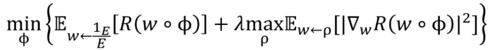

其中φ为特征提取器，w为分类器，ρ为环境推断器，R为风险（损失）函数，Ew←c表示在w经由ρ诱导的测度上求数学期望。上式包含两个主要项:第一项是经验风险，第二项是用于正则化的全变差-L2项。整个优化目标采用极小化极大准则，并使用对抗学习的方式进行训练。本创新点揭示了不变风险最小化准则本质上是通过约束风险函数关于不同环境（携带在分类器上）的变差来提升分布外泛化能力的。上式中的各项组件如φ，w，ρ，R等均可采用各种函数或深度神经网络，因此兼容大多数基于深度学习的现实使用场景。

2.提出一种新的全变差-L1模型:

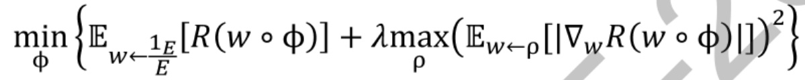

由于概率测度是有限测度，故全变差-L1函数类比全变差-L2函数类多，从而扩大了φ，w，ρ，R等函数或学习器的可选范围 更重要的是全变差-L1模型有如下余面积公式（Coarea Formula）

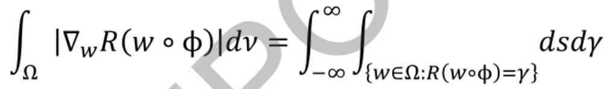

其中s表示(d-1)维 Hausdorff 测度。此公式使得学习风险关于环境变化不敏感，揭示了不变特征学习的数学本质。

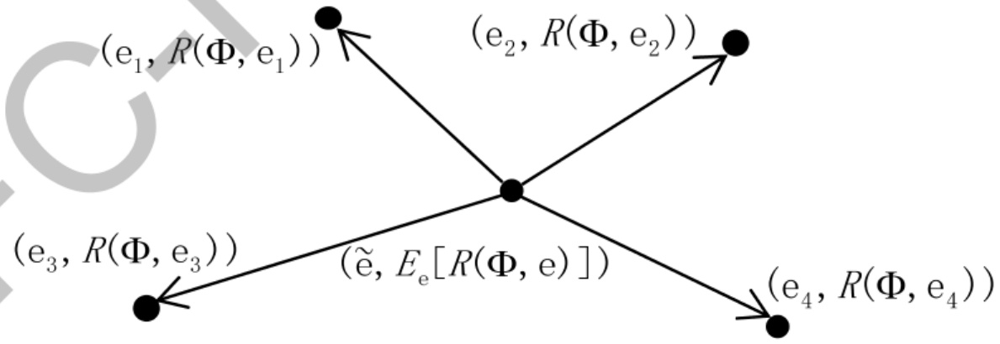

图1:风险外插法首先找到训练集中各个环境点的“平均位置”，然后从平均位置出发构造引向各个环境点的向量，再外插到这些向量所张成的线性空间上，从而达到扩充训练集环境的目的。

3.探究了使得全变差-L1模型实现分布外泛化所需的必要条件和充分条件。具体来说，要允许正则化参数关于特征提取器变化λ，而这样的λ可以被证明是存在的。在满足这些条件的情况下，以下全变差-L1模型

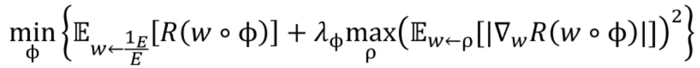

的解是以下分布外泛化模型的解

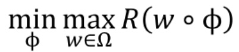

通过这种方式，全变差-L1模型在理论上可以达到比较理想的分布外泛化效果。

4.探究了从训练集环境泛化到一般环境的一些可行策略。首先，训练集中所包含的环境应尽可能丰富和多样化。其次，采用各种方式扩展训练集，例如线性空间扩张法、风险外插法（图1）等方案。再次，用于计算风险损失的测度应尽量精细，至少要覆盖训练集环境能达到的精细度。目前主流计算技术能实现的最精细测度为勒贝格测度。但一般环境可能包含如 Vitali集等不可测集这样将难以避免失真。

5.把全变差不变风险最小化准则扩展为如下主一—对偶优化模型

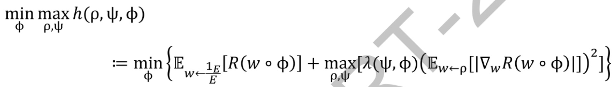

其中，h(ρ,ψ,φ)恰好为一个拉格朗日函数，λ(ψ,φ)恰好为拉格朗日乘子。利用函数或人工神经网络等方式来构造自主正则化参数λ(ψ,φ)，它以不变特征学习器的参数φ为输入，并自带用于学习表征的另一组参数ψ。

6.证明在较为一般的条件下，上述模型的解为半纳什均衡点:对所有(ρ,ψ)有h(ρ\*, ψ\*, φ\*) ≥ h(ρ, ψ, φ\*)，且对所有φ有h(ρ\*, ψ\*, φ\*) ≤ h((ρ, ψ)max(Φ), φ)。其中(ρ,ψ)max(φ)表示φ给定后的内部最大化点(ρ,ψ)。该半纳什均衡点的意义在于:作为主变量的φ必须应对最极端的干扰特征，但(ρ,ψ)只需要提供给定φ后的分布外泛化即可，因此称为半纳什均衡点。

7.建立一个本质为主——对偶算法的对抗学习方法:

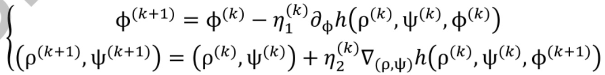

通过这种方式，主变量φ(k)以及对偶变量(ρ(k),ψ(k))通过对抗训练的方式进行动态调整，以取得训练风险最小化以及分布外泛化性能最大化之间的一种平衡。此外，提供了一种适当设置学习步长η()和η)的方法，可使得训练算法收敛，并获得合理的收敛阶。此创新点扩展了关键创新点3的理论工作，并提供了一种具体可行的、适应对抗干扰环境的动态实现方案。

## 代表成果二:深度学习的基础模块开发

如果把深度学习框架比作一个庞大机器人的躯于，那么基础模块就相当于组成机器人各个部分的基本零件。正如一个机器人可能会多次复用同一种螺丝钉，当今主流大模型往往也会多次复用同一种基础模块。因此，即使基础模块性能只提升了一点，整个大模型的性能也有可能得到相当可观的提升。反之，如果基础模块失效或出错，那么整个大模型甚至有可能瘫痪。

例如，求中位数是一种非常基础的数学运算，几乎每种大模型都会多次重复使用。在高维情形下求中位数的问题称为韦伯区位问题。它是一个经典的运筹优化问题，首先由著名数学家皮耶·德·费马提出，后被著名经济学家阿尔弗雷德·韦伯扩展，在机器学习、人工智能、金融科技及计算机视觉等众多领域均有广泛应用。在一般定义下，该问题的目标为在d维实空间中找到一个“中心点”x，使得这个中心点到m个给定数据点{xi}1的加权距离之和最小:

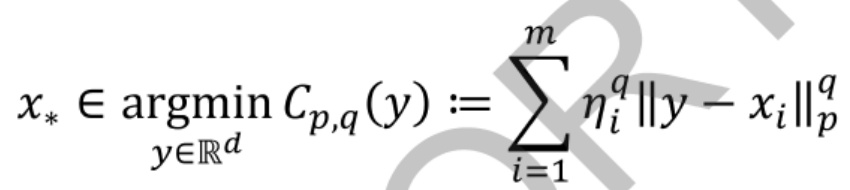

欧氏距离；p=1表示曼哈顿距离，代表一种重要的非欧几何。允许p,q这两个变化参数有助于增强韦伯区位问题的表达力和对更广泛任务的适应性。

由于此问题并无显式解，故一般运用梯度法来求解。计算损失函数的梯度如下:

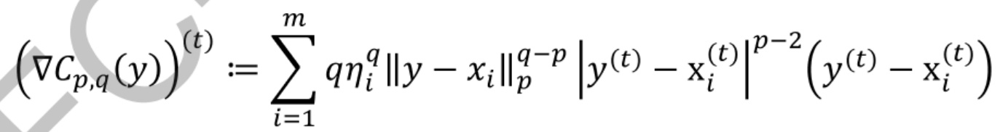

其中上标(t)表示向量的第(t)维。容易看出，当q < p或p < 2时，若y刚好击中如下奇异集，则梯度不存在:

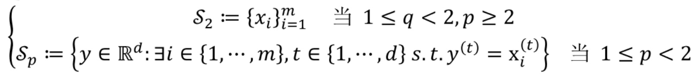

这两种情况分别对应下图的左、右两个子图。其中1 ≤ q < 2,p ≥2的情形相对比较简单，每个数据点即为奇异点（如下图左红点所示），所以总共只有有限个奇异点。只要成功设计出一个能保持损失函数下降性质的算法，则可以保证最多只经过每个奇异点一次并脱离奇异集。而1 ≤ q ≤ p， 1 ≤ p < 2的情形要复杂很多。奇异集是一个包含无限个点的连续点集合（如下图右的红色虚线及红点

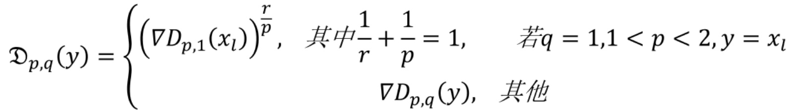

3.建立一种基于 q 次方 p 范数的去奇异性 Weiszfeld 算法(qPpNWAWS)，它在非奇异性情形下使用常规Weiszfeld更新迭代，在奇异性情形下使用沿下降方向-Dp,q(y)线性搜索法。

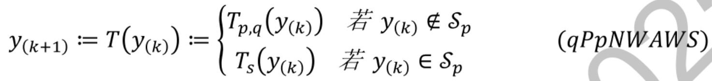

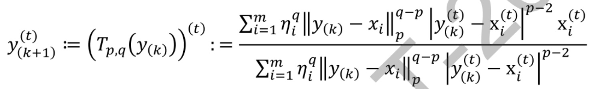

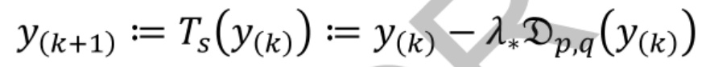

通过这种方式，该算法可自由来回多次（甚至包括无限次）游走于非奇异集与奇异集之间或之内，同时保证损失函数随迭代下降，并最终收敛。

4.给出完整的关于收敛性等一系列算法性质的证明，并修复之前相关证明中不完善的地方。具体来说，算法能保证在所有情形下都能识别出奇异点和最小值点，且有迭代函数值序列的收敛。若1 <ρ <2且迭代点序列拥有一个非奇异的聚点，则迭代点序列自身也收敛。当p= 2时，修复了Harold W. Kuhn（即KKT条件的建立者之一Kuhn）证明中不完善的地方:踢出定理中的踢出次数缺乏一致上界，且只证明了迭代点序列的一个子序列收敛，漏了迭代点序列本身的收敛。当p=2且其中一个奇异点恰为最小值点（无需预判）时，算法能获得超线性收敛，这是该类算法的一个新的理论结果。该项研究（代表性论文3、4）分别发表在 CCF A人工智能国际顶级会议IJCAI和 AAAI 上，负责人为唯一作

## 代表成果三:通用逼近理论与稀疏学习

通用人工智能的实现离不开一种核心理论体系的支撑一一通用逼近理论。不失一般性，可把通用人工智能体看作一个函数f，其对于任意输入x（如任务指令、样本、数据等)，均能输出相当于甚至超越人类智能的答案f(x)。那么通用机器学习的任务是设计一个带有参数0的深度学习框架g，使其以任意误差

ε > 0逼近f:

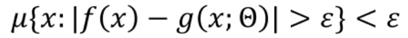

其中μ为计算逼近误差的一种测度。一般来说，g所使用的函数种类越多，参数0规模越大，则逼近误差ε可以越小。规模定律（ScalingLaw）正是指某些深度学习框架g当参数0扩大一定比例时，相应的误差ε能以同等比例下降:例如参数维度变为原来的2倍时，误差能下降至ε/2。然而，最近规模定律已逐渐到达极限，单纯靠增大参数规模已很难获得性能的显著提升，大模型的发展步履逐渐放缓。这既因为大模型使用函数种类不够多，又因为相应的逼近理论已到达极限，急需新的理论创新。

例如，大量机器学习任务都涉及到NP难问题，如旅行商问题、图着色问题、顶点覆盖问题等。由于直接解决该问题的算法复杂度非常高（例如穷举法、某些组合优化算法等)，往往需要把原问题转化为一个较易求解的近似问题，并尽量以较低运算量来获得较高精度。其中一种重要技术路线是稀疏学习，其目标为在规约参数维度的同时提升参数对任务数据关键特征的表现力。最精确的维度规约方法为l0约束:Θ|lo≤m（又称为基数约束，m稀疏约束)，其目标在于直接限制非零参数的数量为不超过m。在一般情形下，求解带e0约束的问题是典型的NP难问题，主流求解方法为组合优化方法，例如混合整数规划、分支定界法和割片面法等。实际上，这些方法的理论算法复杂度与穷举法相等，只是在实际运行上节省了一些运算量，但也依然非常高，并且核心部分往往还需要商业优化器（如Gurobi)，计算成本依然非常高昂。因此，建立新的逼近理论和稀疏学习方法论显得非常迫切。

为了解决这一难题，负责人提出了两种创新的逼近模型。第一种模型的核心在于将l稀疏约束转化为指示函数（Indicator Function），并借助精心设计的尾部逼近函数（Tailed Approximation Function）来逼近这一指示函数。这一转变的巧妙之处在于，它将原本难以处理的单变量三项非凸优化模型转化为了更易于处理的双变量三项优化模型。通过这种方式，该模型能够以任意所需的精度逼近原始的l约束模型。第二种模型巧妙地将一种带lc约束的分式优化问题转化为一种等价的带l约束二次规划问题。通过巧妙建立的一种近端梯度算法来求解该二次规划问题，可保证获得原分式优化问题的局部最优解；在较为宽松的条件下，甚至能直接获得原分式优化问题的全局最优解。该项代表成果形成了两篇论文代表作 5和7，分别发表在 CCF A机器学习两大国际顶级会议Neural Information Processing Systems 2024（主会议）和 International Conference on MachineLearning2024（主会议）上，负责人均为唯一通讯作。