项目批准号 62172329申请代码 F0206归口管理部门收件日期


20250162172329

# 国家自然科学基金

# 资助项目结题/成果报告

资助类别:面上项目

亚类说明:

附注说明:

项目名称:面向海量敏感与非贯通数据分析的隐私保护联邦学习研究

负责人:任雪斌 BRID: 06511.00.70368

电子邮件: xuebinren@mail.xjtu.ed 电话: 15619238090 u.cn

依托单位: 西安交通大学

联系人:何会

电话: 029-82665700

直接费用:59.0000（万元）

执行年限: 2022.01-2025.12

填表日期:2026年01月04日

国家自然科学基金委员会制（2025年）

## 项目摘要

## 中文摘要:

日益突出的数据隐私与非贯通问题，使得基于大规模数据训练的机器学习和数据分析面临严重的性能瓶颈和应用阻碍。本项目旨在根据海量敏感与非贯通数据分析场景中所面临的隐私威胁，研究不同隐私约束下具有高模型效用性的隐私保护机器学习和联邦学习算法。首先，针对敏感数据分析的机器学习，拟分析机器学习训练过程中内在的随机特性和收敛性，以实现间接隐私约束下模型效用的优化；其次，针对非贯通数据分析的联邦学习，拟分析非贯通数据驻留设备的资源和数据分布特性，以实现直接隐私约束下模型效用的优化；然后，针对敏感且非贯通数据分析的隐私保护联邦学习，拟分析多样分布式网络所产生的隐私需求特性，以实现双重隐私约束下的模型效用优化；最后，构建基于容器技术与开源联邦学习框架的仿真实验平台，对所设计算法的隐私性和效用性进行分析与评价。本项目研究有助于增强大数据分析技术的隐私安全弹性，同时促进大数据时代全面、安全、准确的数据分析与利用。

## Abstract:

Due to the increasingly prominent data privacy and data isolation issues, large-scale machine learning and data analytics have been facing a serious performance bottleneck, which also hinders the application deployment. By summarizing different privacy threats in massive sensitive and siloed data analytics, this research project aims to study and propose different privacy-preserving machine learning (PPML) and federated learning (FL) algorithms that can achieve various privacy protection and high model utility. Firstly, regarding machine learning over sensitive data, this research plans to optimize the PPML model utility under the indirect privacy protection via analyzing the inherent randomness and convergence in model training. Secondly, regarding FL over data silos, this research plans to optimize the FL model utility under the direct privacy protection, via analyzing the resource constraints and data distribution of FL clients. Thirdly, regarding privacy-preserving FL over sensitive and siloed datasets, this research plans to design several different privacy-preserving FL algorithms, via analyzing the indirect privacy leakage in different FL variants. Finally, this research will validate and analyze the performance of the proposed algorithms by building simulation platforms based on Docker containers and Tensorflow Federated. This research will help to enhance the privacy and security resilience of big data analysis technologies, thus ultimately promoting the utilization of big data.

关键词（用分号分开）:大数据隐私保护；联邦学习；数据分析；敏感数据；数据孤岛

Keywords (separated by;): Big data privacy; Federated learning; Data analytics; Sensitive data; Data silos

## 结题摘要

## 中文摘要（对项目的背景、主要研究内容、重要结果、关键数据及其科学意义等做简单概述）:

本项目面向敏感、非贯通及敏感且非贯通三类数据分析中的隐私保护机器学习与隐私保护联邦学习开展理论建模、算法设计与平台验证等研究工作。针对敏感数据分析，提出结合内在隐私与外部噪声的差分隐私训练框架，刻画概率图模型及梯度下降法在模型训练中的隐私损失，实现隐私保护下分析效用的提升；结合预训练模型与视觉提示技术，构建样本高效的差分隐私深度学习框架，并探索基于量子不经意传输的深度学习安全推理方法。针对非贯通数据分析，针对资源约束、统计异质和客户端动态参与等特征，设计了资源高效、K异步、小样本联邦学习及基于Shapley值的贡献评估方法，揭示了资源消耗、数据异质性、多目标偏好与联邦学习模型效用之间的权衡，并在边云协同平台上完成原型验证。针对敏感非贯通数据分析，综合考虑中心可信与本地差分隐私等范式，构建异步、纵向及无中心联邦架构下的隐私保护模型与算法族，提出多阶段自适应差分隐私异步联邦学习 差分隐私纵向数据合成与联邦迁移故障诊断方法，实现了双重隐私约束下的联合分析。

依托上述研究，项目搭建了基于Docker容器的联邦学习实验平台，在多种真实与合成数据集上，从预测精度、收敛速度、通信与计算开销及隐私损失等维度评估所提方法，验证理论分析与算法设计的有效性和可实施性。项目期间共发表论文24篇，成果发表于CACM、IEEETPAMI、ACMSIGMOD等重要期刊和会议，并申请国家发明专利4项，其中已授权3项，在差分隐私与联邦学习交叉方向形成具有一定国际影响力的系列成果。同时，项目培养博士生3名、硕士生8名。总体来看，项目按计划完成申请书提出的研究目标，在隐私计量理论、联邦学习算法体系与工程验证平台方面取得多项具有推广价值的成果，为构建面向海量敏感与非贯通数据的安全可信智能分析框架奠定了重要基础。

## Abstract (Brief description of research background, main methods, contributions, and research data):

This project investigates privacy-preserving machine learning and privacy-preserving federated learning for three types of data analysis scenarios: sensitive data, siloed (non-interoperable) data, and sensitiye siloed data, covering theoretical modeling, algorithm design and platform validation. For sensitive data analysis, we propose a differential privacy (DP) training framework that combines intrinsic privacy with external noise injection, and quantitatively characterize privacy loss for probabilistic graphical models and gradient descent - based training, thereby improving analytical utility under a given privacy budget. We further integrate pre-trained models with visual prompting to construct a sample-efficient DP deep learning framework, and explore a quantum-assisted secure inference method for deep neural networks based on quantum oblivious transfer. For siloed data analysis, we address resource constraints, statistical heterogeneity and dynamic client participation by designing resource-efficient federated learning algorithms, K-asynchronous federated learning, federated few-shot learning across small data silos, and a Shapley value- based contribution evaluation scheme. These methods reveal the trade-offs among resource consumption, data heterogeneity, multi-objective preferences and federated model utility, and are validated via prototypes on an edge -cloud collaborative platform. For sensitive siloed data analysis, we jointly consider centralized and local DP paradigms and build families of privacy-preserving models and algorithms under asynchronous, vertical and decentralized federated architectures. We propose a multi-stage adaptive DP asynchronous federated learning framework, differentially private vertical data synthesis methods and federated transfer-based fault diagnosis approaches, enabling joint analysis under dual privacy constraints. Building on these results, we develop a Docker-based federated learning experimental platform and evaluate the proposed methods on multiple real-world and synthetic datasets in terms of prediction accuracy, convergence speed, communication and computation overhead, and privacy loss, thereby confirming the soundness of the theoretical analysis and the practical feasibility of the algorithms. During the project period, 24 peer-reviewed papers were published in leading journals and conferences such as CACM, IEEE TPAMI and ACM SIGMOD, and four national invention patents were filed, three of which have been granted, forming a series of results with notable international impact at the intersection of differential privacy and federated learning. The project also supported the training of three PhD students and eight Master' s students. Overall, it has achieved the research objectives set out in the original proposal and produced results with clear potential for broader application in privacy accounting theory, federated learning algorithm design and engineering verification platforms, laying an important foundation for building secure and trustworthy intelligent analytics frameworks for massive sensitive and siloed data.

关键词（用分号分开）:非贯通数据；联邦学习；敏感数据；隐私保护机器学习；差分隐私

Keywords (separated by;): Siloed Data; Federated Learning; Sensitive Data; Privacy Preserving Machine Learning; Differential Privacy

## 正文

《结题/成果报告》正文分为两个部分:结题部分和成果部分。请按照《结题/成果报告》填报说明及撰写要求填写。

## (一）结题部分

## 1. 研究计划执行情况概述。

（1）按计划执行情况。

本项目工作总体按计划执行，无重大调整。项目以在保护敏感数据与孤岛数据隐私的同时提升数据分析效用为核心目标，围绕“面向敏感数据分析的隐私保护机器学习”“面向非贯通数据分析的分布式联邦学习”“面向敏感非贯通数据分析的隐私保护联邦学习”三条主线开展系统研究。首先，在面向敏感数据分析的机器学习方向，重点分析机器学习训练过程中内在的随机特性和收敛性，旨在间接隐私约束下实现模型效用的优化；其次，在面向非贯通数据分析的联邦学习方向，重点分析非贯通数据驻留设备的资源条件与数据分布特性，以在直接隐私约束下兼顾模型效用与系统约束；再次，在面向敏感且非贯通数据分析的隐私保护联邦学习方向，重点分析多样分布式网络环境中产生的不同隐私需求特性，探索在双重隐私约束下的模型效用优化机制；最后，构建基于容器技术与开源联邦学习框架的仿真实验平台，对所设计算法的隐私性与效用性开展系统分析与评价。本项目研究有助于增强大数据分析技术的隐私安全弹性，促进数据的全面、安全、准确利用。

项目严格按照申请书中提出的四个阶段实施推进:

1）理论研究阶段:聚焦隐私威胁建模、隐私约束下的效用优化模型以及相关关键科学问题，完成了间接隐私、直接隐私和双重隐私场景下的统一理论框架梳理与形式化描述。

2）算法设计阶段:面向敏感数据、非贯通数据以及敏感非贯通数据，分别设计并分析了一系列隐私保护机器学习算法、高效联邦学习算法以及双重隐私约束联邦学习算法，形成相对完整的算法体系。

3）验证与评估阶段:基于Python数值仿真平台以及Docker、TensorFlow Federated等开源框架搭建仿真实验环境，在多类典型数据集和应用场景下，对所提算法从准确率、收敛性、通信与计算开销及隐私损失等维度进行了系统评估。

4）集成与总结阶段:在前期理论与算法研究基础上，对各类算法进行对比归纳，梳理不同隐私范式与联邦学习场景下效用优化的共性规律，形成项目研究工作的系统总结与阶段性集成。

（2）研究目标完成情况。

本项目组总体按计划完成了项目申请书中提出的研究任务，并在此基础上对部分内容进行了适度交叉与拓展，进一步加强了对非独立同分布（Non-IID）数据场景、系统资源异构场景以及纵向联邦学习场景的研究。

1）在面向敏感数据分析的隐私保护机器学习方面，本项目系统分析了典型机器学习训练过程中的内在随机性与梯度收敛特性，构建了面向概率图模型和梯度下降类算法的内在隐私计量方法，提出基于“内在隐私+外部噪声”的差分隐私训练框架，并给出了相应的隐私-效用理论界。相关结果表明，在同等隐私预算下，该框架可在保证隐私约束的前提下有效压缩噪声强度、提升模型效用。

2）在面向非贯通数据分析的分布式联邦学习研究方面，本项目针对设备资源受限、通信成本较高以及数据统计分布差异显著等特性，设计了基于在线学习的资源自适应联邦学习算法，以及基于历史梯度聚类和自适应学习率调整的Non-IID联邦学习算法，系统刻画了资源消耗、数据差异与模型效用之间的定量关系。相关算法在多种典型场景下的实验结果表明，在满足计算与通信约束的前提下，可以显著提升模型精度与收敛速度。

3）在面向敏感且非贯通数据分析的隐私保护联邦学习研究方面，本项目针对异步联邦、纵向联邦以及无中心联邦等多样化场景，在中心可信、部分可信和完全不可信等不同假设下，构建了中心化差分隐私、分布式（本地）差分隐私以及无中心联邦下的多范式隐私模型，设计了具有直接隐私与间接隐私双重约束的联邦学习算法族，并在典型异步与纵向联邦场景上完成了系统仿真与理论分析，为多场景敏感非贯通数据的隐私保护学习提供了方法体系。

此外，项目组还围绕移动感知系统中的感知大数据分析开展了相关扩展研究，探索了面向移动感知数据分析的隐私保护机器学习算法、边云协同联邦学习算法以及工业与电力场景感知大数据分析平台等，为项目后续在更复杂应用环境中的推广奠定了基础。


## 2. 研究工作主要进展、结果和影响。

## （1）主要研究内容。

1）项目组围绕机器学习训练过程中的内在随机性与模型收敛特性，构建了敏感统计量解耦与内在隐私度量框架，提出一类结合内在隐私与外部噪声的差分隐私机器学习算法，并探索基于收敛性的自适应噪声裁剪与噪声形态优化机制。

2）项目组针对联邦学习中设备资源异构、通信受限和数据非独立同分布等特性，系统分析了系统资源与模型效用收益之间的相互关系，设计了基于在线学习的高效联邦学习算法，以及基于历史梯度聚类和自适应学习率调整的泛化联邦学习算法。

3）项目组面向不同隐私保护范式与系统场景，研究了异步联邦学习中的中心化差分隐私算法、纵向联邦与高维结构学习场景中的本地差分隐私算法，以及无中心联邦场景下结合在线学习的差分隐私算法，形成了一套覆盖多种数据划分方式与系统架构的隐私保护联邦学习方法族。

4）项目组依托前期在边缘智能与隐私保护领域的工程积累，搭建了基于Python 的数值仿真平台和基于 Docker + TensorFlow Federated 的原型系统，在工业互联网、电力物联网和移动感知等典型场景下，对所提算法从准确率、收敛速度、通信与计算开销以及隐私损失等多个维度开展了系统性评估，验证了方法的有效性与可推广性。

(2）取得的主要研究进展、重要结果、关键数据等及其科学意义或应用前景。

1）面向海量敏感数据分析的隐私保护机器学习算法研究

针对海量敏感数据（如医疗图像、个人隐私数据）在集中式分析中面临的隐私泄露风险与模型效用平衡难题，本项目聚焦于“内在隐私+外部噪声”的差分隐私训练框架与后量子时代的安全推理机制，旨在保证严格隐私约束的前提下最大化数据分析效用。

面向海量敏感图像数据分析的视觉提示差分隐私学习方法研究

项目组针对面向海量敏感数据分析的隐私保护机器学习中，DP-SGD虽然应用广泛但存在梯度裁剪带来信息损失、隐私损失计量保守、在强隐私预算下模型精度明显下降等问题，而基于多教师模型投票聚合的 PATE虽然避免了梯度裁剪但对训练数据规模要求较高、样本效率较低的难题，提出了结合预训练模型与视觉提示技术的差分隐私学习框架 Prompt-PATE，实现了样本高效的 PATE式差分隐私模型训练。具体而言，我们将大规模公共数据集上训练好的视觉模型作为“源模型”整体冻结，在敏感数据上仅训练视觉提示和标签映射网络，将每个源模型重编程为一组 re-teacher；随后对公共无标注数据执行 PATE 式私有聚合，当样本输入所有 re-teacher 时，由其投票并加入高斯噪声后取 top-1 结果作为差分隐私标签，继而利用带预训练分类器的半监督学习训练学生模型，从而自然继承PATE的差分隐私保证。为缓解教师数据被划分后的小样本过拟合问题，我们进一步在训练阶段引入SAM优化器，增强模型对参数扰动的鲁棒性。整体“视觉提示重编程教师—DP噪声投票聚合—半监督学生训练”的结构流程在框架图1 中进行了系统展示。大量图像分类实验结果表明，在 CIFAR-10等基准数据集上，在隐私预算ε≈1.02时Prompt-PATE的分类精度可达到约97.07%，显著优于经典PATE与 DP-SGD等现有差分隐私分类器；如图2所示，在ImageNet 扩展到 Blood-MNIST等跨域场景下，Prompt-PATE同样展现出明显的精度优势和更好的域迁移能力。该工作充分释放了预训练大模型与视觉提示的潜力，在保持严格差分隐私约束的前提下显著改善了隐私效用折中，为本项目后续面向联邦场景的视觉差分隐私学习算法设计提供了重要理论与方法基础。相关研究成果已发表于国际顶级计算机视觉会议 IEEE/CVF International Conference on Computer Vision(ICCV 2023)。

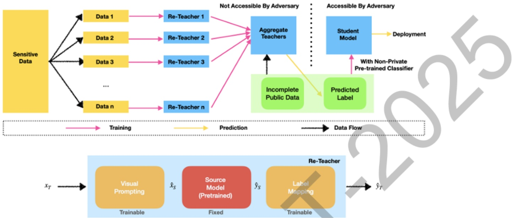

图 1 Prompt-PATE 差分隐私视觉分类整体框架图

```
  Blood-MNIST     Prom-PATE   Transfer-PATE Arif et al. [2]
       €             1.973       1.983        1.971
    sanitized €      2.521       2.508        1.971
     Queries         1000        1000
 Answered Queries    455          408
Answer Accuracy(%)   79.3         76.7
   Threshold T       480          490
       σ1            150          150           -
       σ2            20           20            =
   Accuracy(%)      69.93        61.33        63.45
```

图2差分隐私分类方法分类准确率的对比

## 面向海量敏感数据分析的量子辅助安全深度神经网络推理方法研究

项目组针对深度模型推理阶段在后量子时代依赖传统密码假设难以实现无条件安全的问题，引入量子密码学思想，提出了一种基于量子不经意传输（QuantumOblivious Transfer,QOT）的量子辅助安全深度神经网络推理方法，实现了在真实商用量子设备上的无条件安全DNN推理。我们首先设计了适用于现实量子信道的噪声型QOT协议，由不可信第三方分发纠缠量子态，数据持有方与模型提供方通过对量子态测量并交换部分测量信息，完成带噪但安全的OT过程，从而构造出安全向量内积与向量加法等基本算子，并进一步组合为仿射变换操作。随后，我们将深度神经网络表示为由仿射变换和非线性激活组成的模块串联结构，将其中直接接触敏感数据或模型参数的层替换为量子辅助安全算子，形成“经典层+量子层”的混合网络架构，整体系统结构如图3所示。考虑到当前实用量子设备量子容量有限且门错误率较高，我们在DNN训练阶段显式注入受控噪声，利用深度网络对噪声的固有容忍性，提升模型对量子计算误差的鲁棒性，从而在较低保真度量子设备上仍能保持推理精度。实验方面，我们在

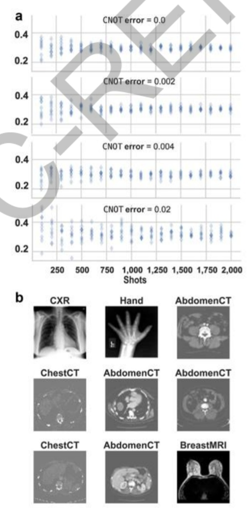

IBMQ五比特真实量子计算机和含噪量子模拟器上，分别对二分类MNIST、CIFAR-10一般图像分类和MedNIST医学影像分类任务进行了系统验证:如图4 结果表明，量子辅助DNN在三类任务上的精度分别为 99.68%、52.62%和99.51%，与对应经典 DNN的 99.85%、54.20%和 99.17%相比精度损失均不超过1.58%，验证了在现实量子误差条件下本方法对主流DNN模型进行安全推理的可行性。该工作在现有量子基础设施上实现了面向DNN推理的无条件安全，为本项目在更强攻击者模型下开展敏感数据安全推理以及未来将量子安全协议与联邦学习框架结合提供了重要理论支撑和技术储备。相关研究成果已发表于国际期刊 Scientific Reports。

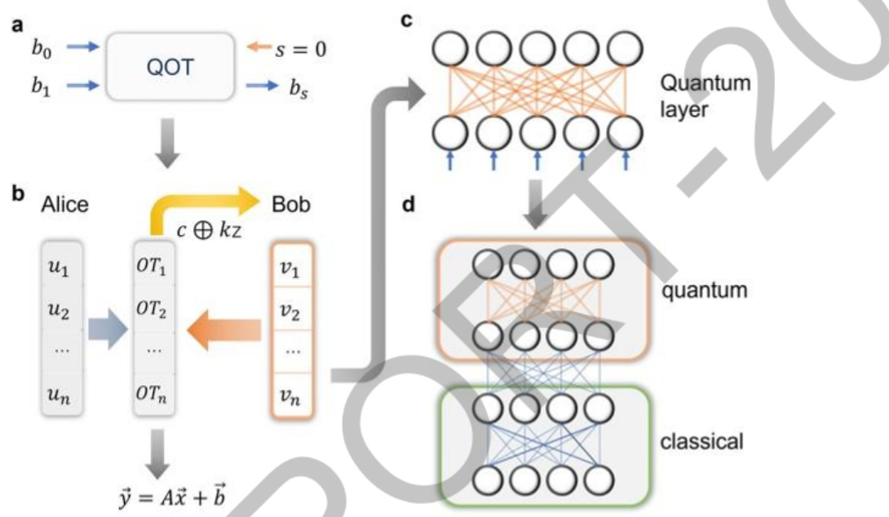

图3 混合网络系统架构图

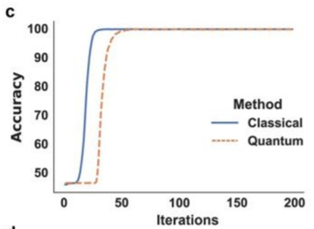

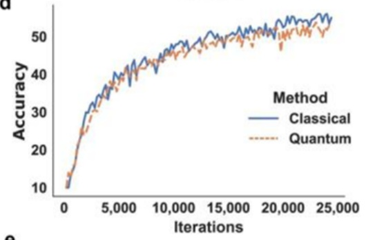

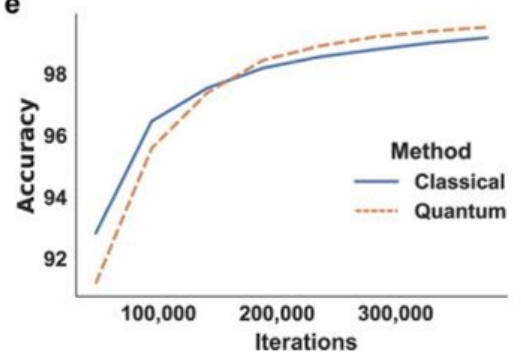

图4 量子辅助DNN分类任务精度对比

## 2）面向非贯通数据分析的分布式联邦学习算法研究

针对现实场景中数据分散在不同机构(数据孤岛)、非独立同分布(Non-IID)

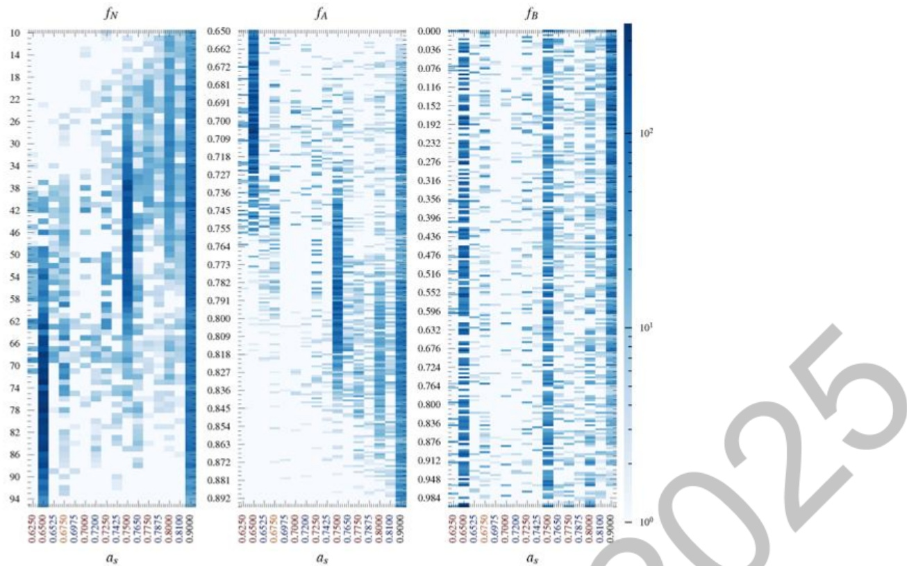

图6 不同优化算法性能对比图

面向动态参与非贯通数据联邦学习的 Shapley值贡献评估方法研究

项目组针对真实联邦学习系统中客户端动态参与、数据非贯通且质量差异显著的场景，重点研究了联邦协同建模过程中的公平贡献评估问题，提出了基于Shapley值的动态参与联邦学习贡献估计框架FedDSV。项目组首先分析了客户端本地数据量、数据分布、参与轮次以及上传模型更新对全局模型性能的边际贡献关系，将动态参与联邦过程建模为一类时序合作博弈，并在此基础上扩展了适用于长周期联邦训练的 Shapley 值定义。为克服标准 Shapley值计算复杂度指数级爆炸的难题，项目组设计了结合时序采样和结构剪枝的近似算法，通过在关键训练轮次和代表性客户端子集上进行采样估值，在保证估计结果与精确Shapley值高度相关的前提下显著降低了计算成本。如图7所示，FedDSV在服务器侧引入独立的贡献评估模块，实时接收各轮上传的模型参数和元数据，对正在参与及历史参与的客户端贡献进行更新，从而支持联邦激励和惩罚策略的在线决策。在实验验证方面，项目组在多种典型联邦数据集和动态参与模式下，将FedDSV与多种启发式积分指标进行系统对比，如图8所示，FedDSV不仅在数值上更接近精确 Shapley值，而且能够更好地区分高价值客户端、搭便车客户端及潜在恶意客户端，为非贯通数据联邦学习场景下构建公平激励机制和贡献定价体系提供了可靠的理论工具和工程方法。相关研究成果已发表于国际期刊IEEE Transactions on Mobile Computing

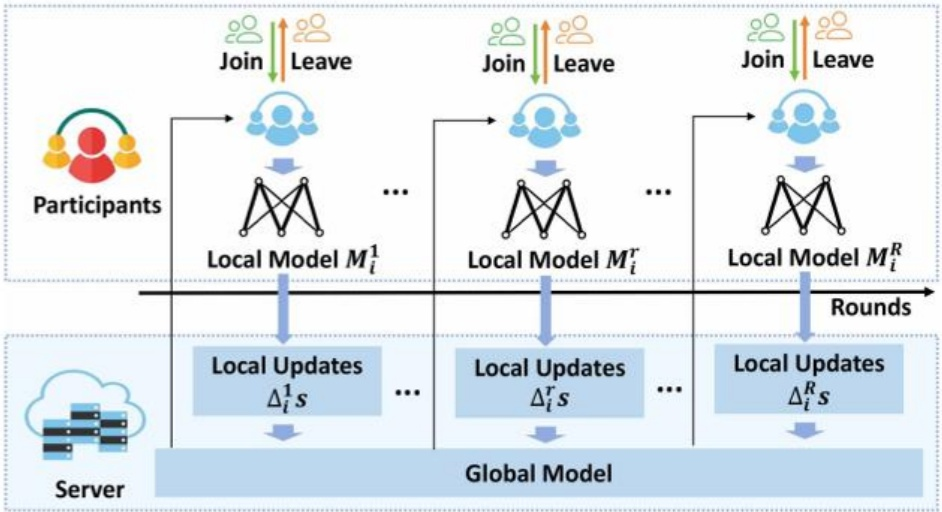

图7FedDSV联邦学习贡献评估整体框架

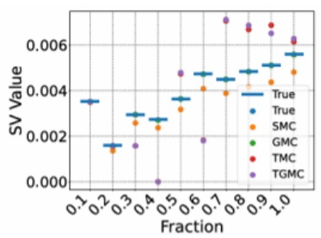

(a) MNIST iid

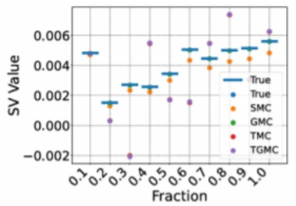

(b) MNIST noniid

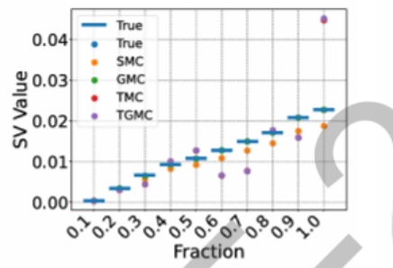

(c) CIFAR-10 iid

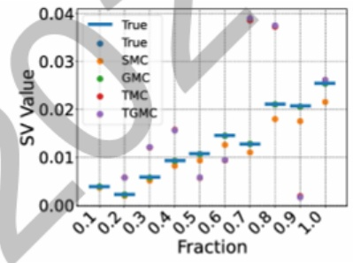

(d) CIFAR-10 noniid

图 8 不同贡献评估方法对 Shapley 值的拟合效果及对高低贡献客户端区分能力对比

## 面向小样本非贯通数据孤岛的边缘联邦小样本学习方法研究

项目组针对网络边缘中多方小样本非贯通数据孤岛难以单独完成有效建模的挑战，提出了跨小孤岛的联邦小样本学习方法，用于在样本极少、类别分布高度不平衡且各方数据互不共享的条件下实现统一的建模能力和个性化适配。项目组将每个边缘参与方上的少量本地任务视作元学习框架中的一个任务，将元学习与联邦优化结合，通过在服务器聚合元梯度的方式学习对多种任务均具有良好适应性的初始化模型参数，使得新接入的边缘孤岛在仅有极少样本时也能快速完成模型微调。如图9所示，基于该方法的边缘联邦学习体系结构中，云侧维护元模型参数，各个小样本孤岛仅上传梯度或模型增量，不暴露本地原始数据。在实验部分，项目组在多种真实边缘应用场景下构造了跨孤岛任务集，对比了传统FedAvg、集中式 MAML 以及多种少样本学习基线，如图10所示，联邦小样本学习方法在多个任务上均取得更高的精度和更快的收敛速度，尤其在新孤岛接入和任务分布变化时依然保持良好的适应性。这一研究为在弱监督、样本稀缺且数据强非贯通环境下开展联邦智能服务提供了可行思路，有助于提升边缘设备智能服务的可用性与扩展性。相关研究成果已发表于国际期刊IEEENetwork。

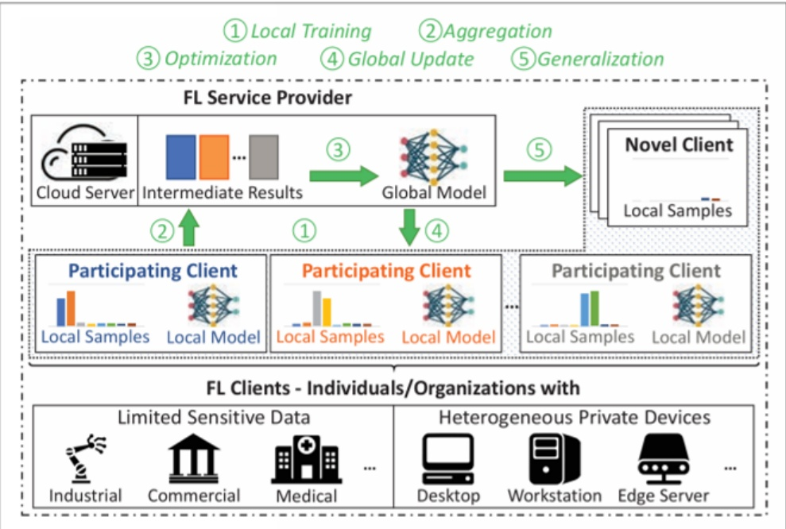

图9跨数据孤岛的少样本边缘联邦学习系统结构图

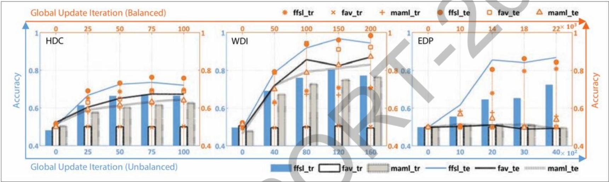

图10不同方法在多种小样本联邦任务上的分类精度和收敛速度对比

## 面向非独立同分布非贯通数据的高效稳定K异步联邦学习算法研究

围绕研究内容二，项目组针对非贯通数据联邦学习中同步训练易受“拖延者”影响、异步训练又易因延时梯度与数据异质性共同作用导致模型发散的问题，提出了高效稳定的K异步联邦学习算法WKAFL。该算法在服务器侧引入了历史梯度累积、角相似度筛选和自适应学习率调整等机制，旨在充分利用已有梯度信息的同时控制延时带来的收敛风险。项目组首先利用合理窗口内的历史梯度来构造全局无偏梯度估计，缓解由非独立同分布数据引起的梯度偏置；然后在每轮聚合中仅选择延时程度不超过阈值的K个梯度参与更新，并根据梯度间的夹角相似度筛选方向一致的更新，从而抑制严重滞后梯度和“离群”梯度对全局模型的破坏，如图11所示；最后在更新阶段对延时梯度进行裁剪，并根据延时程度自适应调整学习率，提高训练过程的稳定性和鲁棒性。理论分析表明，WKAFL在非凸目标和非独立同分布条件下仍可获得有界的收敛误差。实验部分中，项目组在合成联邦数据以及分布式医疗影像等真实非贯通场景上进行了大量对比实验，如图12所示，WKAFL在相同通信轮次下显著提高了预测精度，并在训练曲线平滑度和收敛速度方面优于多种先进异步联邦学习基线，验证了该方法在克服延时和异质性矛盾上的有效性。相关研究成果已发表于国际期刊 IEEE Transactions on面向个性化非贯通数据建模与类别不平衡的生成增强联邦学习方法

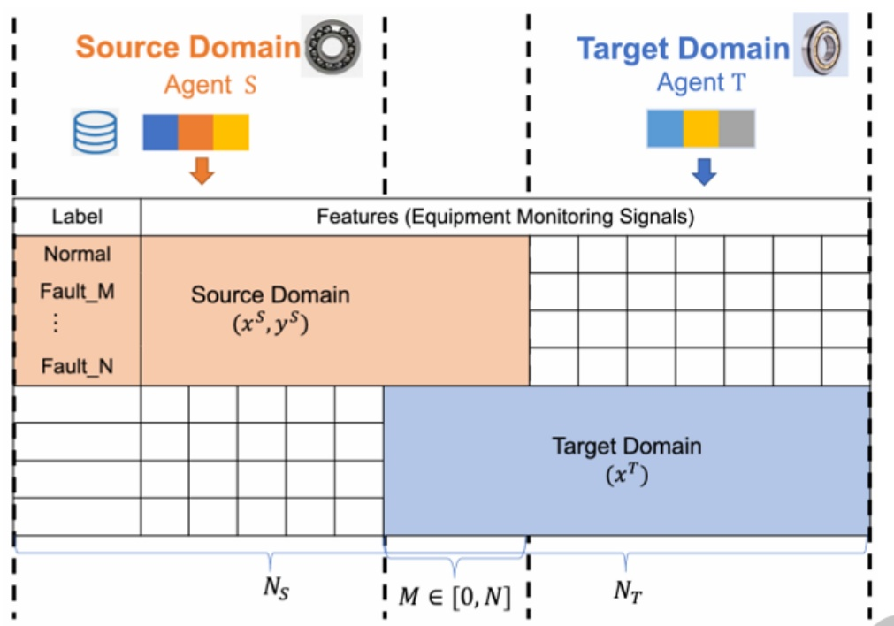

图13FedLED 纵向联邦迁移诊断框架图

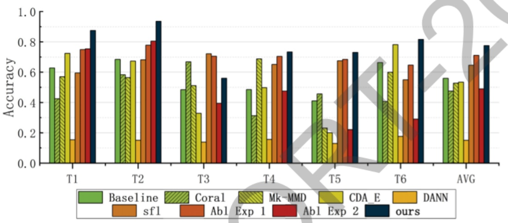

图 14 故障诊断准确率对比

项目组针对非贯通联邦学习场景下各客户端数据分布和任务需求差异巨大、统一全局模型在本地泛化欠佳以及类别不平衡严重影响模型可用性的问题，提出了基于数据生成的个性化联邦学习框架FedGen。该框架允许不同客户端采用异构模型结构，通过在本地训练生成对抗网络并在服务器侧聚合生成器参数，使各客户端在不共享模型参数和原始数据的前提下借助生成样本实现知识共享与数据增强。如图15所示，FedGen引入公共桥和个性桥两类通道，公共桥负责在服务器与各客户端之间同步全局生成器等通用信息，促使客户端生成兼具多方统计特征的合成样本，从而缓解类别不平衡；个性桥则允许各客户端在本地利用生成样本和真实数据独立训练个性化模型，保留任务和结构上的差异性。项目组在多个真实联邦数据集上开展了广泛实验，将FedGen与多种传统联邦学习方法以及SMOTE、ADASYN、TableGAN、CTGAN等典型生成和过采样方法进行了对比，如图16所示，FedGen在F1分数和MCC 分数上均取得显著优势，最高提升接近一个数量级，同时在客户端数量增加和采样率变化时表现出较强的鲁棒性。消融实验进一步验证了生成器聚合、公共桥和个性桥等模块对个性化性能提升和类别不平衡缓解的重要作用。该研究为多源异构非贯通数据环境下实现高可用性、强定制化的联邦学习提供了一种通用且易扩展的技术路线。相关研究成果已发表

## 面向敏感非贯通数据分析的联邦多目标强化学习隐私保护方法研究

项目组针对多目标强化学习在大规模分布式场景下样本效率低、数据敏感且非贯通难以集中建模的问题，提出了基于概率图建模的多目标强化学习算法PMORL及其联邦扩展Fed-PMORL，实现了在保证隐私前提下的高效多目标策略学习。我们首先提出PMORL，将多目标强化学习中的状态、动作与偏好变量统一表示为一个概率图结构，将用户对不同目标的偏好刻画为图中的因子，基于该概率图写出交互数据的联合分布和似然函数，并利用变分推理与EM算法高效求解，从而在较少交互次数下学习近似Pareto最优策略。如图19所示，概率图结构与PMORL训练流程直观展示了从数据采集、概率建模到策略更新的完整路径。在此基础上，项目组将PMORL扩展到联邦学习场景，提出Fed-PMORL，将全局优化问题拆分为多个本地子问题，各客户端本地并行训练 actor网络和critic网络，仅将 critic参数上传服务器进行聚合，既降低了通信开销，又保留了本地策略的个性化；同时在聚合过程中引入差分隐私扰动以保护本地交互轨迹不被反推。实验方面，我们在多个典型多目标强化学习环境上构建了非贯通数据划分与多用户协同训练场景，对比现有多目标强化学习与联邦强化学习算法，如图20所示，PMORL与Fed-PMORL在保持相当策略质量的前提下实现了最高可达约两倍的样本效率提升，并在不同偏好配置和非独立同分布划分下表现出更稳定的收敛特性，为敏感非贯通数据场景下的联邦智能决策提供了新思路。相关研究成果已发表于国际期刊 Information Sciences。

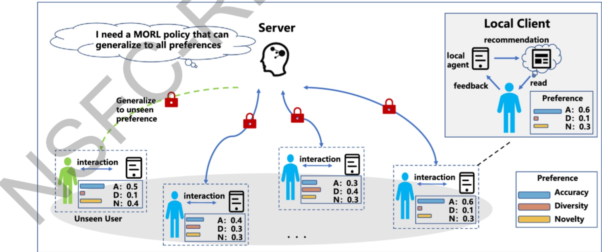

图19联邦多目标强化学习模型框架