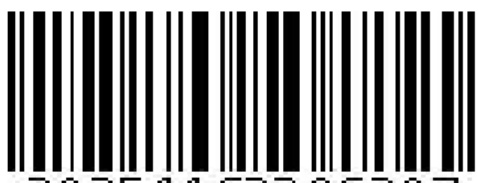

项目批准号 62206207申请代码 F0608归口管理部门收件日期



20251162206207

# 国家自然科学基金

# 资助项目结题/成果报告

资助类别:青年科学基金项目（C类）[原青年科学基金项目]

亚类说明:

附注说明:

项目名称:面向机器学习推理服务的模型遗忘隐私保护研究

负责人:娄坚

BRID: 08198.00.66966

电子邮件:louj5@mail.sysu.edu.cn

电话: 13136164289

依托单位:中山大学

联系人: 冯春华

电话: 020-84115962

资助经费:30.0000（万元）

执行年限: 2023.01-2025.12

填表日期:2026年01月16日

国家自然科学基金委员会制（2025年）

## 项目摘要

## 中文摘要:

近年来，模型遗忘顺应国内外隐私保护法规对数据删除权的明确规定成为机器学习隐私保护领域一个崭新且迫切的前沿研究热点。然而，当前模型遗忘的研究局限于遗忘机制设计及其效率提升，缺乏着眼于机器学习推理服务全流程的全局性研究，导致模型遗忘难以融入推理环境。本项目着眼于面向机器学习推理服务的模型遗忘的全流程研究，揭露现有局限性研究视角带来的调度优化性问题、普适性问题和安全性认识近乎空白的问题。为达到模型遗忘执行前的调度优化性高、执行中的机制普适性强、执行后的安全性认识更深入的全流程目标，主要研究包括:1）基于强化学习的遗忘请求与推理请求协同调度方法；2）基于全Hessian曲率矩阵的新型复杂模型遗忘方法；3）构建针对遗忘更新后模型的新型安全攻击方法，以揭示遗忘请求与遗忘机制存在安全威胁的新现象。本项目预期成果是在机器学习推理服务的模型遗忘全流程研究上取得突破性的进展，推动模型遗忘从理论走向应用落地

## Abstract:

In recent years, machine unlearning has become a new and pressing research area under the urgent demand of obeying the Right to be Forgotten enforced by the world-wide data privacy law and regulations. However, existing studies merely focus on the machine unlearning mechanism design and its efficiency improvement, leaving it completely unstudied from the perspective of the overall machine learning inference service pipeline, which severely limits machine learning inference service in ensuring the Right to be Forgotten. This project aims to study the machine learning inference service-oriented machine unlearning. We first identify three key problems associated with current research, including the suboptimality of the scheduling policy, restricted applicability, and limited understanding of the security threats. Therefore, in order to address these key problems, we study 1) Proposing the joint scheduling method that takes the two types of requests into consideration simultaneously; 2) Proposing the total Hessian curvature matrix-based machine unlearning mechanism for the more complex bilevel optimization-based machine learning models; 3) Proposing a new security attack tailored for unlearning updated models, which reveals the potential security vulnerability introduced by unlearning. The expected result is to make breakthrough in machine learning inference service-oriented machine unlearning from the overall pipeline perspective, which will greatly advance the deployment of machine unlearning in the mainstream machine learning inference services.

关键词（用分号分开）:智能系统安全；模型遗忘；机器学习隐私保护；机器学习推理服务；

Keywords (separated by;): Artificial Intelligence Security; Machine Unlearning; Privacy-Preserving Machine Learning; Machine Learning Inference Service;

## 结题摘要

## 中文摘要（对项目的背景、主要研究内容、重要结果、关键数据及其科学意义等做简单概述）:

本项目围绕面向机器学习推理服务的模型遗忘隐私保护，深入系统地研究了多方面安全与隐私攻防理论与技术，具体包括:一是面向模型遗忘全流程合规核验，提出高效可验证的遗忘机制与服务侧遗忘一致性保障方法，引入水印化验证实现遗忘前后行为可区分的核验与审计，并将水印能力延伸至提示词、偏好对齐数据与检索增强生成系统知识资产的版权追踪与溯源；二是基于差分隐私的模型隐私度量与可证明保障，开展个性化差分隐私联邦学习、差分隐私数据合成与查询分析，以及预训练大语言模型的差分隐私联邦零阶微调等研究；三是面向模型安全与对抗攻防，针对推理服务引入新安全风险，开展后门与对抗等安全攻防，形成提示词后门及防御、鲁棒增强与知识投毒风险刻画等成果，进一步提升推理服务安全性。本项目完善了面向机器学习推理服务的数据隐私保护与模型安全防御的基础理论，为安全、可信、可控的机器学习推理服务发展具有重要作用，将有力推动可信机器学习的安全合规应用。

项目组认真组织实施申报书的既定研究内容与技术路线，研究任务具体，研究目标清晰，实施过程分工合理、进度良好，在执行期间发表学术论文21篇，其中CCF-A类论文16篇，并荣获CCF-A类会议ACM CCS的杰出论文奖、CCF-C类会议澳洲密码年会的最佳论文奖；申请国家发明专利6项；协助指导博士2名，协助指导硕士6名，整体上顺利完成了项目的既定研究任务。

## Abstract (Brief description of research background, main methods, contributions, and research data):

This project focuses on privacy protection through model unlearning for machine learning inference services, and conducts a comprehensive and systematic investigation of security and privacy attack- defense theories and techniques across multiple dimensions. Specifically, the project first addresses end-to-end compliance verification for model unlearning by proposing efficient and verifiable unlearning mechanisms and service-side consistency assurance methods. It introduces watermark-based verification to enable distinguishable auditing and validation of model behavior before and after unlearning, and further extends watermarking capabilities to prompts, preference alignment data, and knowledge assets in retrieval-augmented generation systems for copyright tracking and provenance. Second, the project studies privacy metrics and provable guarantees based on differential privacy, including personalized differentially private federated learning, differentially private data synthesis and query analysis, and differentially private federated zeroth-order fine-tuning of pre-trained large language models. Third, with respect to model security and adversarial attack -defense, the project investigates newly introduced attack surfaces in inference services, carrying out research on backdoor and adversarial attacks and defenses. Representative outcomes include prompt-based backdoors and corresponding defenses, robustness enhancement, and risk characterization of knowledge poisoning, thereby further improving the security and availability of inference services. Overall, this project advances the foundational theory of data privacy protection and model security defense for machine learning inference services, plays an important role in enabling secure, trustworthy, and controllable inference services, and strongly promotes the secure and compliant application of trustworthy machine learning.

The project team carefully organized and implemented the research tasks and technical roadmap specified in the original proposal. The research tasks were concrete, the objectives were clearly defined, and the implementation featured a reasonable division of labor and steady progress. During the project period, the team published 21 papers, including 16 CCF-A papers, and received the Distinguished Paper Award at the CCF-A

```
 conference ACM CCS 2024 as well as the Best Paper Award at the CCF-C conference ACISP
 2025. In addition, we applied for 6 national invention patents, co-supervised two Ph.D.
 students and six master's students. overall, we successfully completed the planned
research objectives of the project.
 关键词（用分号分开）：数据遗忘；差分隐私；水印；联邦学习；后门攻击
Keywords (separated by;): Machine Unlearning; Differential Privacy;
 Watermarking;Federated Learning;Backdoor Attack
```

## 正文

《结题/成果报告》正文分为两个部分:结题部分和成果部分。请按照《结题成果报告》填报说明及撰写要求填写。

## （一）结题部分

## 1. 研究计划执行情况概述。

（1）按计划执行情况。

项目组以面向机器学习推理服务的模型遗忘隐私保护为主线，围绕申报书既定研究内容与技术路线组织实施，研究任务具体，研究目标清晰，实施过程分工合理、进度良好，已产出多项具有代表性的理论方法与技术成果，顺利完成了本项目的预期任务。项目组深入系统地研究了面向机器学习推理服务的模型遗忘隐私保护中多方面安全与隐私攻防理论与技术，具体包括:一是面向模型遗忘全流程合规核验，提出高效可验证的遗忘机制与服务侧遗忘一致性保障方法，引入水印化验证实现遗忘前后行为可区分的核验与审计，并将水印能力延伸至提示词、偏好对齐数据与检索增强生成系统知识资产的版权追踪与溯源；二是基于差分隐私的模型隐私度量与可证明保障，开展个性化差分隐私联邦学习、差分隐私数据合成与查询分析，以及预训练大语言模型的差分隐私联邦零阶微调等研究；三是面向模型安全与对抗攻防，针对推理服务引入的新增攻击面，开展后门与对抗等安全攻防，形成提示词后门及防御、鲁棒增强与知识投毒风险刻画等成果，进一步提升推理服务的安全可用性。本项目完善了面向机器学习推理服务的数据隐私保护与模型安全防御的基础理论，为安全、可信、可控的机器学习推理服务发展具有重要作用，将有力推动可信机器学习的安全合规应用。

## （2）研究目标完成情况。

本项目在执行期间发表学术论文21篇，其中CCFA类论文16篇，并荣获CCF-A 类会议 ACM CCS 的杰出论文奖、CCF-C 类会议澳洲密码年会的最佳论文奖；申请国家发明专利6项；协助指导博士2名，协助指导硕士6名。整体上，项目组已顺利完成了项目的既定研究任务，并超额完成本项目的部分预设目标。具体完成情况如下表所示:

```
          具体指标       预期数量 完成数量  完成度
          论文 (篇)      8-10 21   超额完成
预期        CC- A类会议/期刊论文 6  16   超额完成
目标  研究成果  申报专利 (项)    2-3   6   超额完成
          协助指导博士(人)    0    2   超额完成
          协助指导硕士(人)   4-5   6   超额完成
```

## 2. 研究工作主要进展、结果和影响。

## （1）主要研究内容。

本项目面向机器学习推理服务中的模型遗忘隐私保护核心问题，围绕遗忘请求与推理请求协同处理、新型复杂机器学习模型遗忘方法、以及遗忘更新后模型的安全威胁刻画与防护三条主线展开研究。针对推理服务中数据难以彻底删除、遗忘过程可用性受损、遗忘更新引入新攻击面等关键挑战，项目在机器学习推理服务及模型部分新型应用范式下，系统研究隐私度量与可证明保障、后门/对抗攻防与水印溯源等关键技术，形成面向机器学习推理服务的模型遗忘全流程一体化方法体系。具体来说，本项目的主要研究内容如下:

研究机器推理服务场景下遗忘请求与推理请求的协同调度机制。针对传统遗忘方法与在线推理割裂导致的服务陈旧化、隐私暴露与可用性下降问题，构建推理服务感知的遗忘框架，从系统层面设计遗忘执行时机与资源分配策略，并提出服务侧的一致性保障与验证机制，避免遗忘延迟产生不必要的数据隐私暴露风险。

研究面向复杂训练范式的高效与可认证机器遗忘算法。针对对抗训练、极大极小优化以及矩阵分解等典型复杂训练结构下遗忘难度大、开销高、且缺乏严格理论保证的问题，提出适配复杂训练范式的高效遗忘机制与可认证遗忘方法，通过敏感性分析与随机化扰动建立可证明的遗忘隐私保障，并从可解释视角刻画遗忘效果、稳定性与可控边界，为推理服务场景下的删除权实现提供算法基础与理论支撑。

研究数据删除权合规核验与水印化审计机制，并拓展至数据资产版权保护。

面向遗忘是否真实发生、是否停止使用的合规核验需求，研究遗忘前后行为可区分的水印化验证与交互式审计流程，提升核验鲁棒性与抗规避能力；进一步将水印能力拓展至提示词、偏好对齐数据与外部知识库等数据资产形态，实现低查询成本的可检测版权追踪与溯源，支撑大模型安全对齐数据资产的权益保护。

研究基于差分隐私的数据隐私保护方法。以差分隐私作为统一的形式化隐私约束框架，并面向跨方协作与异质隐私需求开展个性化差分隐私联邦学习研究；同时覆盖差分隐私数据合成与查询分析等数据发布形态，兼顾隐私强度与可用性；此外面向预训练大语言模型联邦微调的高开销与高维噪声问题，研究差分隐私约束下的零阶优化效率与隐私协同方案

研究遗忘更新带来的新增攻击面及其后门、对抗攻防与鲁棒增强机制。针对推理服务与遗忘更新引入的新增攻击面，研究投毒、后门、对抗样本等安全风险的建模与攻防策略。一方面刻画提示词中的后门注入与触发规律并探索相应防护；另一方面研究鲁棒增强与对抗训练改进机制，并提出面向部署侧、低数据依赖的即插即用防御策略，提升推理服务安全可用性。

(2）取得的主要研究进展、重要结果、关键数据等及其科学意义或应用前景。

本项目面向机器学习推理服务中的模型遗忘隐私保护关键问题，沿既定技术路线开展系统研究，提出了一系列兼顾可用性、可验证性与可信的隐私保护与安全对抗方法框架。本节重点介绍以下代表性工作。

1 推理服务场景的遗忘请求协同调度与一致性保障方案:机器学习即服务（MLaaS）为各类应用领域提供基于机器学习的服务，并获得了广泛的应用。尽 管现有的数据遗忘方法取得了良好的效率，但几乎所有方法都将遗忘请求与推理请求独立处理，可能导致新的数据安全与隐私问题，即推理服务陈旧化以及遗忘过程中的隐私暴露风险。为此，提出了一种面向推理服务感知的机器遗忘框架ERASER实现 MLaaS 中的数据遗忘。ERASER通过策略性地选择合适的数据遗忘执行时机，解决推理服务陈旧化问题。提出了一种新的推理一致性认证机制，以防止因遗忘执行延迟而违反删除权规定，从而缓解不必要的数据隐私暴露风险。ERASER提供了三组设计选项，允许根据不同MLaaS系统的特定环境和偏好适配对应的设计设计选项组合。大量实验验证了所提出方法ERASER在多种设置下均表现出色。该成果发表在信息安全领域国际顶级会议ACMCCS2024上(CCF-A)。

② 新型复杂机器学习模型遗忘方法:1）在对抗训练场景中，模型训练包含外层最小化目标与内层生成对抗扰动的最大化目标，双层结构显著加剧被删除数据影响的度量难度，使遗忘较标准单层训练更具挑战。为此，提出面向对抗训练模型的数据遗忘方法MUter，推导具有解析形式的遗忘更新步，并结合近似与变换降低计算代价，避免显式计算海森矩阵求逆的高昂开销。基于四个数据集、线性模型与神经网络模型的大量实验验证了其有效性与效率。该成果发表在计算机视觉领域国际顶级会议IEEEICCV2023上（CCF-A）。2）大部分现有的数据遗忘工作都集中在从具有单一变量的标准统计学习模型上，它们的遗忘步依赖于基于直接Hessian的传统牛顿更新。我们针对极大极小值模型，提出一种新的可认证机器遗忘算法，提出了一个包含基于总Hessian的全牛顿更新，并引入差分隐私的高斯机制。为了获得数据遗忘的可认证理论保障，通过仔细分析该遗忘方法的“敏感性”（即通过该更新步获得的模型与完全重训练的模型之间的接近程度)，注入校准的高斯噪声。我们推导了三种不同损失函数情况下的泛化率并提供了删除容量界，以保证只要删除的样本数量不超过导出的数量，就可以保持所需的总体风险。对于训练样本n和模型维度d，我们得到了阶为O(n/d1/4)的结果，这显示出与基于差分隐私极大极小学习的基线方法（其阶为O(n/d1/2)）相比存在严格的优势。此外，我们的泛化率和删除容量与先前为标准统计学习模型推导的已知最优界相匹配。该成果发表在机器学习领域国际顶级会议NeurIPS2023上（CCF-A）。3）矩阵分解作为数据挖掘与机器学习中的基础模型，在推荐等多领域广泛应用，但在接收行/列数据所有者删除请求时，如何从分解因子中高效消除相应影响构成新的遗忘任务。为此，我们提出具备解析解的数据遗忘方法，通过刻画因子间的隐含依赖关系，构造基于全海森信息的牛顿型更新作为解析遗忘步。五个真实数据集与一个合成数据集、三个应用场景的实验表明该方法在有效性、效率与可用性方面表现良好。该成果发表在国际会议CIKM2023上

(CCF-B)。

③ 遗忘更新引入新隐私安全问题:1）为验证数据遗忘的合规性，我们提出了基于双重水印的验证方案DuplexGuard，通过在数据集中嵌入两组互补的水印集合来监控数据的使用状态。当训练数据同时包含这两组水印时，模型不会显现任何水印效果；但当其中一组水印被移除后，另一组水印的效果就会显现。因此，当用户提供数据时，两组水印会被同时嵌入训练集；而在数据遗忘请求中，只需移除其中一组水印，用户就可以利用水印显现作为数据已被删除的验证依据。实验表明，我们的方案具有良好的可验证性和无害性，且支持同时验证多个用户的数据删除请求，有效地解决了传统水印保护方案鲁棒性差的问题，为数据遗忘场景下所有权保护提供了新的研究思路和发展方向。该成果发表在信息安全领域国际顶级期刊IEEETDSC（CCF-A）。之后，我们进一步将水印拓展至数据资产版权保护。2）大模型提示词对引导大模型输出高质量内容发挥了重要的作用。然而，随着提示词在各个场景中的广泛应用，如何保护其版权成为一个亟待解决的问题。为此，提出了首个基于双层优化的水印注入与验证方法PromptCARE，通过提示词训练任务与水印注入任务的耦合训练，在确保准确率的同时，完成有效水印注入；提出基于假设检验的水印验证机制，利用大模型在有无水印情况下自然语言输出的分布差异，完成有效水印验证。大量实验验证了所提出方法PromptCARE的有效性、安全性、鲁棒性和隐蔽性。该成果发表在信息安全领域国际顶级会议IEEE SP2024上（CCF-A）。3）检索增强生成（RAG）系统通过引入外部知识库来增强大语言模型的生成能力，但其依赖的外部数据接口也带来了潜在的安全风险。在视觉-语言检索增强生成系统中，攻击者可能通过污染知识库的方式，诱导系统生成攻击者指定的恶意内容。我们提出了首个针对视觉语言RAG系统的知识投毒攻击方案PoisonedEye。该方法的核心思想在于精心构造具有双重特性的投毒样本:既能被检索模块高效检索，又能引导生成模型输出攻击者预设的恶意结果，从而达到即时高效的投毒效应。此外，我们还提出了类查询目标投毒策略，将攻击范围从单一查询扩展至整个语义类别，显著提升了投毒攻击的覆盖面和实用性。实验结果表明，攻击者仅需在知识库中植入单个投毒样本，即可在目标查询时成功操控系统输出。且该方案在多种查询数据集、检索模型和大型视觉-语言模型上均展现出了较好的投毒效果。该成果发表在人工智能领域国际顶级会议 ICML2025上（CCF-A）。4）针对偏好数据集的版权保护，我们通过水印注入与验证机制实现对数据资产的有效版权追踪，提出了

PreferCare。在水印注入阶段，PreferCare结合风格迁移技术与双层优化策略，将隐蔽且稳定的水印信号嵌入偏好数据；在水印验证阶段，则基于统计检验从目标模型的输出中有效检测水印存在性。大量实验表明，PreferCare在保持模型正常推理性能的同时，具备良好的有效性、无害性与抗干扰鲁棒性，仅需约20次查询即可可靠识别数据集是否被非法使用，为LLM安全对齐中的数据版权保护提供了实用的解决方案。该成果发表在信息安全领域国际顶级会议ACMCCS2025上（CCF-A）。5）为进一步拓展对遗忘更新引入新攻击面的理解与应对，我们围绕对抗样本开展了基础性理论研究。现有主流对抗训练方法多以输出层为主要攻击与防护对象，因而对中间层对抗攻击的防御能力有限。针对这一不足，我们从前向传播过程出发，系统分析神经网络对训练数据分布在各中间层表征空间的映射规律，发现同标签样本的中间层特征会呈现明显的聚集现象，且该聚集程度随网络深度逐层增强，并将其定义为“聚类效应”。进一步地，从理论上证明该效应源于神经网络训练过程可被视作信息瓶颈原理某一目标函数的下界优化结果。在此基础上，提出对中间层对抗样本进行充分采样的对抗训练方法SAT，使模型能够显式学习抵御中间层扰动。实验结果表明，相比现有SOTA对抗训练策略，SAT在防御中间层对抗攻击方面更为有效，并给出了可证明的对抗鲁棒性下界。该成果发表在计算机视觉领域国际顶级会议IEEEICCV2023上（CCF-A）。

④数据隐私保护:差分隐私是当前主流的可证明隐私保护范式。1）现有方法通常假设所有数据共享相同的隐私预算，无法满足各个数据不同的个性化隐私需求。为此，提出了个性化差分隐私保护的跨机构联邦学习，设计了一个名为rPDP-FL的新方法，采用两阶段混合采样方案，以适应不同的隐私需求。提出了一种名为Simulation-CurveFitting的机制以实现根据个性化隐私预算确定对应的数据级采样概率。大量实验验证了所提出方法对比不考虑个性化隐私保护的基线方法可以显著提升性能。该成果发表在信息安全领域国际顶级会议ACM CCS 2024上（CCF-A），并获得该会议的杰出论文奖。2）提出FedDPZO，首次实现了预训练大语言模型联邦微调任务中对效率与隐私的统一建模与协同优化。FedDPZO在本地通过双点函数值估计构造伪梯度，并采用方向-幅度解耦机制，仅对与数据相关的幅度项进行裁剪与噪声注入，从而降低噪声维度，在保障隐私的同时显著降低计算与通信开销。并且，FedDPZO提供了隐私保护与收敛性分析理论证明和经验验证，表明方案仅依赖于梯度的有效秩，与模型参数维度几乎无关，缓解了预训练大语言模型联邦微调的训练开销过高问题以及隐私泄露风险。该成果发表在信息安全领域国际会议IEEEACISP2025上（CCF-C），并获得该会议的杰出论文奖。3）研究差分隐私保护的电子健康记录数据合成技术。深度学习方法生成合成电子健康记录（EHR）数据的方法受到了广泛关注，能够为下游应用提供EHR数据资源的同时，规避了使用真实患者数据所面临的数据安全与隐私风险。尽管此前的研究已经聚焦于EHR数据合成，但在生成合成EHR数据方面仍然面临诸多挑战，包括:平衡真实EHR的异质性、处理缺失值和不规则测量，以及确保用于模型训练的真实数据的隐私性。为此，提出了新的差分隐私保护的EHR数据合成方法IGAMT，不仅能保持异质特征、缺失值和不规则测量的高质量，还能在隐私与实用性之间实现平衡。大量实验验证了所提出方法IGAMT在视觉相似性和下游应用的性能方面显著优于现有基线方法。该成果发表在人工智能领域国际顶级会议AAAI2024上（CCF-A）。4）研究差分隐私保护的星型连接查询技术。星型连接查询（Star-join query）是数据仓库中的一类重要任务，在联机分析处理场景中具有广泛的应用。为此，提出了针对星型连接查询的新差分隐私保护方法DP-starJ。设计了一系列专门针对星型连接特性设计的策略，首先揭示了事实表和维度表对邻近数据库实例的不同影响，并据此重新定义了适用于星型连接不同情况的机制。提出了一种谓词机制，通过对谓词进行扰动，在连接过程中注入噪声，而非直接对查询结果进行加噪处理。进一步基于谓词机制设计了一种差分隐私保护的星型连接算法以进一步提升鲁棒性能，并适用于各类星型连接任务。通过理论分析和大量实验验证了所提出方法DP-starJ在准确性、效率和可扩展性方面优于现有基线方法。该成果发表在数据库领域国际会议 ACM SIGMOD 2024 上（CCF-A）。

## 3. 研究人员的合作与分工。

具体分工和实际贡献:项目负责人娄坚负责负责全面规划研究的整体研究方向与策略，主要负责并指导方案设计、实验设计、论文写作与修改等。主要参与者包括姚宏伟和刘佳琪博士生，主要负责方案设计、实验设计、论文写作与修改等；硕士生薛明胜、张水晶、金育霖、童昊宇、林咏、张晨阳负责算法仿真、实验数据搜集与分析等。

4. 国内外学术合作交流等情况。

（1）2023.10.02-06，本人参加ICCV2023，作墙报展示。

（2）2023.10.21-25，硕士生张水晶参加CIKM2023，作大会分组报告。

（3）2023.11.26-30，博士生贺弋琳参加CCS 2023，作大会分组报告。

（4）2023.12.12-14，博士生刘佳琪参加 NeurIPS 2023，作墙报展示。

（5）2024.04.14-19，博士生姚宏伟参加ICASSP2024，作墙报展示。

（6）2024.06.09-14，博士生付聪聪参加 SIGMOD2024，作大会分组报告。

（7）2024.10.14-18，博士后刘俊旭参加CCS 2024，作大会分组报告。

（8）2024.10.14-18，博士生胡宇珂参加CCS2024，作大会分组报告。

（9）2025.07.13-19，硕士生张晨阳参加ICML 2025，作墙报展示。

（10）2025.10.13-17，硕士生张晨阳参加CCS 2025，作大会分组报告。

5. 存在的问题、建议及其他需要说明的情况。

## （二）成果部分

## 1. 项目取得成果的总体情况。

项目总体成果良好，已发表高水平学术论文21 篇，其中 CCF A 类论文16并荣获CCF-A 类会议 ACM CCS 的杰出论文奖、CCF-C 类会议澳洲密码年会的最佳论文奖；申请国家发明专利6项（1授权）；协助培养博士2名、硕士6名。

## 项目成果列表

[1] Jian Lou, Chenyang Zhang, Xiaoyu Zhang, Kai Wu, PreferCare: Preference Dataset Copyright Protection in LLM Alignment by Watermark Injection and Verification, ACM Conference on Computer and Communications Security (CCS), 2025. (CCF-A 类)

[2] Chenyang Zhang, Xiaoyu Zhang, Jian Lou, Kai Wu, Zilong Wang, Xiaofeng Chen, PoisonedEye: Knowledge Poisoning Attack on Retrieval-Augmented Generation based Large Vision-Language Models, International Conference on Machine Learning (ICML), 2025.

(CCF-A 类)

[3] Wenjie Wang, Pengfei Tang, Jian Lou, Yuanming Shao, Lance Waller, Yi-an Ko, Li Xiong. IGAMT: Privacy Preserved Electronic Health Record Synthetic Approach with Heterogeneity and Irregularity, AAAI Conference on Artificial Intelligence (AAAI), 2024. (CCF-A 类)

[4] Xiaoyu Zhang, Yong Lin, Meixia Miao, Jian Lou, Jin Li, Xiaofeng Chen, Zeroth-Order Federated Private Tuning for Pretrained Large Language Models, Australasian Conference on Information Security and Privacy (ACISP), 2025. （最佳论文奖)

[5] Yiling He, Jian Lou, Zhan Qin, Kui Ren. FINER: Enhancing State-of-the-art Classifiers with Feature Attribution to Facilitate Risk Analysis, ACM Conference on Computer and Communications Security (CCS), 2023. (CCF-A 类)

[6] Junxu Liu, Jian Lou, Li Xiong, Jinfei Liu, Xiaofeng Meng. Cross-silo Federated Learning with Record-level Personalized Differential Privacy, ACM Conference on Computer and Communications Security (CCS), 2024. （杰出论文奖、CCF-A类)

[7] Yuke Hu, Jian Lou, Jiaqi Liu, Wangze Ni, Feng Lin, Zhan Qin, Kui Ren. ERASER: Machine Unlearning in MLaaS via an Inference Serving-Aware Approach, ACM Conference on Computer and Communications Security (CCS), 2024. (CCF-A 类)

[8] Junxu Liu, Jian Lou, Li Xiong, Xiaofeng Meng. Personalized Differentially Private Federated Learning without Exposing Privacy Budgets, ACM International Conference on Information and Knowledge Management (CIKM), 2023.

[9] Shuijing Zhang, Jian Lou, Li Xiong, Xiaoyu Zhang, and Jing Liu. Closed-form Machine Unlearning for Matrix Factorization, ACM International Conference on Information and Knowledge Management (CIKM), 2023.

[10] Yulin Jin, Xiaoyu Zhang, Jian Lou, Xu Ma, Zilong Wang, Xiaofeng Chen. Explaining Adyersarial Robustness of Neural Networks from Clustering Effect Perspective, International Conference on Computer Vision (CVPR), 2023. (CCF-A 类)

[11] Fereshteh Razmi, Jian Lou, Yuan Hong, and Li Xiong. Interpretation Attacks and Defenses on Predictive Models using Electronic Health Records, Joint European Conference on Machine Learning and Knowledge Discovery in Databases (ECML), 2023.

[12] Hongwei Yao, Jian Lou, Zhan Qin. POISONPROMPT: Backdoor Attack On Prompt-based Large Language Models, IEEE International Conference on Acoustics, Speech and Signal Processing (ICASSP) , 2024.

[13] Junxu Liu, Mingsheng Xue, Jian Lou, Xiaoyu Zhang, Li Xiong, Zhan Qin. MUter: Machine Unlearning on Adversarial Training Models, International Conference on Computer Vision (ICCV), 2023. (CCF-A 类)

[14] Yulin Jin, Xiaoyu Zhang, Jian Lou, Xiaofeng Chen. ACQ: Few-shot Backdoor Defense via Activation Clipping and Quantizing, ACM International Conference on Multimedia (ACM MM), 2023. (CCF-A 类)

[15] Haoyu Tong, Xiaoyu Zhang, Jin Yulin, Jian Lou, Kai Wu, Xiaofeng Chen. Balancing generalization and robustness in adversarial training via steering through clean and adversarial gradient directions, ACM International Conference on Multimedia (ACM MM), 2024. (CCF-A 类)

[16] Jiaqi Liu, Jian Lou, Zhan Qin, Kui Ren. Certified Minimax Unlearning with Generalization Rates and Deletion Capacity, Annual Conference on Neural Information Processing Systems (NeurIPS), 2023. (CCF-A 类)

[17] Pengyun Zhu, Long Wen, Jinfei Liu, Feng Xue, Jian Lou, Zhibo Wang, KuiRen. CAPP-130: A Corpus of Chinese Application Privacy Policy Summarization and Interpretation, Annual Conference on Neural Information Processing Systems (NeurIPS), 2023. (CCF-A 类)

[18] Congcong Fu, Hui Li, Jian Lou, Huizhen Li, Jiangtao Cui. DP-starJ: A Differentially Private Scheme towards Analytical Star-Join Queries, ACM SIGMOD/PODS International Conference on Management of Data (SIGMOD), 2024. (CCF-A 类)

[19] Hongwei Yao, Jian Lou, Zhan Qin, Kui Ren. PromptCARE: Prompt Copyright Protection by Watermark Injection and Verification, IEEE Symposium on Security and Privacy (S&P/Oakland), 2024. (CCF-A类)

[20] Xiaoyu Zhang, Chenyang Zhang, Jian Lou, Kai Wu, Zilong Wang, Xiaofeng Chen. DuplexGuard: Safeguarding Deletion Right in Machine Unlearning via Duplex Watermarking, IEEE Transactions on Dependable and Secure Computing (TDSC), 2024. (CCF-A 类)

[21] Yuke Hu, Yang Wang, Jian Lou, Wei Liang, Ruofan Wu, Weiqiang Wang, Xiaochen Li, Jinfei Liu, and Zhan Qin. Privacy Risks of Federated Knowledge Graph Embedding: New Membership Inference Attacks and Personalized Differential Privacy Defense, IEEE Transactions on Dependable and Secure Computing (TDSC), 2024. (CCF-A 类)

## 发明专利:

山 李丹，娄坚，叶浩政，刘伟豪，胡日查，郑子彬，一种敏感信息保护方法、装置、电子设备及存储介质，授权专利号:ZL202510010203.7，授权日期:2025-12-19

[2]娄坚，姚宏伟，秦湛，任奎，提示词的确定方法、装置、计算机设备以及存储介质，专利申请号:202311814970.0，申请日期:2023-12-27

[3]贺弋玲，娄坚，秦湛，任奎，一种基于无监督学习的概念漂移缓解方法及装置，专利申请号:202311825338.6，申请日期:2023-12-27

[4]姚宏伟，娄坚，秦湛，任奎，一种大模型提示词版权验证方法及装置，专利申请号:202311744252.0，申请日期:2023-12-18

[5]贺弋玲，秦湛，任奎，娄坚，一种基于特征归因的软件安全模型解释方法，专利申请号:202311860164.7，申请日期:2023-12-29

[6]李佳辉，单键锋，娄坚，李丹，刘媚婷，吴舜宇，基于稳定性的测试时强化学习增强的数学问答大模型系统，专利申请号:202511921864.1，申请日期:2025-12-18

2. 项目成果转化及应用情况。

无

3. 人才培养情况。

（1）姚宏伟，毕业博士，2020-09-01 至2024-06-30. （协助指导）

（2）薛明胜，毕业硕士，2021-09-01至2024-06-30.（协助指导）

（3）张水晶，毕业硕士，2021-09-01至2024-06-30. （协助指导）

（4）金育霖，毕业硕士，2021-09-01至2024-06-30. （协助指导）

（5）童昊宇，毕业硕士，2022-09-01至2025-06-30. （协助指导）

（6） 刘佳琪，在读博士，2022-09-01 至2027-06-30. （协助指导）

（7）林咏，在读硕士，2023-09-01 至2026-06-30. （协助指导）

(8）张晨阳， 在读硕士，2023-09-01至2026-06-30. （协助指导）

4. 其他需要说明的成果。

5. 项目成果科普性介绍或展示网站。

项目组围绕面向机器学习推理服务的模型遗忘全流程展开研究，标志性成果包括机器推理服务场景下遗忘请求与推理请求的协同调度机制、面向复杂训练范式的高效与可认证机器遗忘算法、数据删除权合规核验与水印化审计机制、基于差分隐私的数据隐私保护方法、遗忘更新带来的新增攻击面及其后门/对抗与鲁棒增强机制。项目执行期间，共发表学术论文21篇，其中CCF-A类论文16篇；申请/授权国家发明6项（1授权），协助指导博士2名，硕士6名。在学术会议上作会议报告10次。

本项目完善了围绕面向机器学习推理服务的模型遗忘全流程的基础理论，对于促进模型遗忘融入推理环境的发展具有十分重要的意义，将有力地推动力推动模型遗忘在机器学习推理服务中的部署落地。本项目的研究成果在复杂机器学习模型应用、提高数据流动、维护数据隐私与模型安全、释放数据要素价值提供等数字经济发展关键领域具有广阔应用前景。

## 研究成果目录

项目负责人通过系统，从文献库中检索研究成果或者按要求格式自行填入。请按照期刊论文、会议论文、学术专著、专利、会议报告、标准、软件著作权、科研奖励、人才培养、成果转化的顺序列出，其它重要研究成果如标本库、科研仪器设备、共享数据库、获得领导人批示的重要报告或建议等，应重点说明研究成果的主要内容、学术贡献及应用前景等。

项目负责人不得将非本人或非参与者所取得的研究成果、与受资助项目无关的研究成果、未标注国家自然科学基金资助和项目批准号的论文以及取得时间早于项目资助期开始时间的研究成果列入报告中。发表的研究成果（包括专利），项目负责人和参与者均应如实注明得到国家自然科学基金项目资助和项目批准号，科学基金作为主要资助渠道或者发挥主要资助作用的，应当将自然科学基金作为第一顺序进行标注。

## 期刊论文

(1) Xiaoyu Zhang; Chenyang Zhang; Jian Lou; Kai Wu; Zilong Wang; Xiaofeng Chen; DuplexGuard: Safeguarding Deletion Right in Machine Unlearning via Duplex Watermarking, IEEE Transactions on Dependable and Secure Computing (TDSC) (CCF-A类)， 2024. SCIE. 第三标注

(2) Yuke Hu; Yang Wang; Jian Lou; Wei Liang; Ruofan Wu; Weiqiang Wang; Xiaochen Li; Jinfei Liu; Zhan Qin; Privacy Risks of Federated Knowledge Graph Embedding: New Membership Inference Attacks and Personalized Differential Privacy Defense, IEEE Transactions on Dependable and Secure Computing, 2025, 22(1941-0018):2788-2805. SCIE. 第四标注

## 会议论文

(1) Yuke Hu; Jian Lou; Jiaqi Liu; Wangze Ni; Feng Lin; Zhan Qin; Kui Ren; ERASER: Machine Unlearning in MLaaS via an Inference Serving-Aware Approach, ACM SIGSAC Conference on Computer and Communications Security (CCS) (CCF-A类)，美国盐湖城，2024-10-14至. 第二标注

(2) Junxu Liu; MingSheng Xue; Jian Lou; Xiaoyu Zhang; Li Xiong; Zhan Qin; MUter: Machine Unlearning on Adversarially Trained Models, IEEE/CVF International Conference on Computer Vision (ICCV) 法国巴黎，2023-10-02至. 第一标注

(3) Jiaqi Liu; Jian Lou; Zhan Qin; Kui Ren; Certified Minimax Unlearning with Generalization Rates and Deletion Capacity，Neural Information Processing Systems，美国新奥尔良，2023-12-11至. 第二标注

(4) Jian Lou; Chenyang Zhang; Xiaoyu Zhang; Kai Wu; PreferCare: Preference Dataset Copyright Protection in LLM Alignment by Watermark Injection and Verification, ACM SIGSAC Conference on Computer and Communications Security (CCS)，中国台北，2025-10-13至2025-10-17. 第一标注

(5) Hongwei Yao; Jian Lou; Zhan Qin; Kui Ren; PromptCARE: Prompt Copyright Protection by Watermark Injection and Verification, IEEE Symposium on Security and Privacy (Samp;P) (CCF-A类), 美国旧金山, 2024-05-20至.第四标注

(6) Congcong Fu; Hui Li; Jian Lou; Huizhen Li; Jiangtao Cui; DP-starJ: A Differentially Private Scheme towards Analytical Star-Join Queries, ACM International Conference on Management of Data Management,智利圣地亚哥，2024-06-09至.第三标注

(7) Pengyun Zhu; Long Wen; Jinfei Liu; Feng Xue; Jian Lou; Zhibo Wang; Kui Ren; CAPP-130: a corpus of chinese application privacy policy summarization and interpretation, Proceedings of the 37th International Conference on Neural Information Processing Systems, Red Hook, NY, USA, 2023-12-10至2023-12-16. 第三标注

(8) Haoyu Tong; Xiaoyu Zhang; Yulin Jin; Jian Lou; Kai Wu; Xiaofeng Chen; Balancing Generalization and Robustness in Adversarial Training via Steering through Clean and Adversarial Gradient Directions, ACM International Conference on Multimedia,澳大利亚墨尔本，2024-10-28至. 第二标注

(9) Yulin Jin; Xiaoyu Zhang; Jian Lou; Xiaofeng Chen; ACQ: Few-shot Backdoor Defense via Activation Clipping and Quantizing，ACM International Conference on Multimedia， 加拿大渥太华，2023-10-29至. 第二标注(10) Chenyang Zhang; Xiaoyu Zhang; Jian Lou; Kai Wu; Zilong Wang; Xiaofeng Chen; PoisonedEye: Knowledge Poisoning Attack on Retrieval-Augmented Generation based Large Vision-Language Models, International Conference on Machine Learning，加拿大温哥华，2025-07-13至2025-07-19. 其他. 第二标注 C

(11) Hongwei Yao; Jian Lou; Zhan Qin; PoisonPrompt: Backdoor Attack on Prompt-based Large Language Models, IEEE International Conference on Acoustics, Speech and Signal Processing, 韩国首尔， 2024-04-14至. 第四标注

(12) Fereshteh Razmi; Jian Lou; Hong Yuan; Li Xiong; Interpretation Attacks and Defenses on Predictive Models Using Electronic Health Records, Joint European Conference on Machine Learning and Knowledge Discovery in Databases，意大利都灵，2023-09-18至.第七标注

(13) Yulin Jin; Xiaoyu Zhang; Jian Lou; Xu Ma; Zilong Wang; Xiaofeng Chen; Explaining Adversarial Robustness of Neural Networks from Clustering Effect Perspect ive, IEEE/CVF International Conference on Computer Vision (ICCV)，法国巴黎，2023-10-02至. 第二标注

(14) Shuijing Zhang; Jian Lou; Li Xiong; Xiaoyu Zhang; Jing Liu; Closed-form Machine Unlearning for Matrix Factorization, ACM International Conference on Information and Knowledge Management, 英国伯明翰, 2023-10-21至. 第六标注

(15) Junxu Liu; Jian Lou; Li Xiong; Xiaofeng Meng; Personalized Differentially Private Federated Learning without Exposing Privacy Budgets, ACM International Conference on Information and Knowledge Management,英国伯明翰，2023-10-21至.第二标注

(16) Junxu Liu; Jian Lou; Li Xiong; Jinfei Liu; Xiaofeng Meng; Cross-silo Federated Learning with Record-level Personalized Differential Privacy, ACM SIGSAC Conference on Computer and Communications Security (CCS)，美国盐湖城，2024-10-14至. 第二标注

(17) Yiling He; Jian Lou; Zhan Qin; Kui Ren; FINER: Enhancing State-of-the-art Classifiers with Feature Attribution to Facilitate Risk Analysis, ACM SIGSAC Conference on Computer and Communications Security,丹麦哥本哈根，2023-11-26至.第三标注

(18) Xiaoyu Zhang; Yong Lin; Meixia Miao; Jian Lou; Jin Li; Xiaofeng Chen; Zeroth-Order Federated Private Tuning for Pretrained Large Language Models, Australasian Conference on Information Security and Privacy,澳大利亚伍伦贡，2025-07-14至2025-07-16.第三标注

(19) Wenjie Wang; Pengfei Tang; Jian Lou; Yuanming Shao; Lance Waller; Yi-an Ko; Li Xiong; IGAMT: Privacy Preserved Electronic Health Record Synthetic Approach with Heterogeneity and Irregularity, AAAI Conference on Artificial Intelligence，加拿大温哥华，2024-02-20至. 第一标注▲

## 专利

## (1) 李丹；娄坚；叶浩政；刘伟豪；胡日查；郑子彬；

一种敏感信息保护方法、装置、电子设备及存储介质，2025-12-19至2045-12-19，中国，ZL 2025 1 0010203.7.

(2) 装置、计算机设备以及存储介质，2023-12-26，中国，2023118149 700.

(3) 贺弋玲；娄坚；秦湛；任奎；一种基于无监督学习的概念漂移缓解方法及装置，2023-12-27，中国，□2023118253386 □.

(4) 姚宏伟；娄坚；秦湛；任奎；一种大模型提示词版权验证方法及装置，2023-12-18，中国，2023117442520.

(5) 贺弋玲；秦湛；任奎；娄坚；一种基于特征归因的软件安全模型解释方法，2023-12-29，中国，2023118601647.

(6) 李佳辉；单键锋；娄坚；李丹；刘媚婷；吴舜宇；

基于稳定性的测试时强化学习增强的数学问答大模型系统，2025-12-18，中国，2025119218641.

## 科研奖励

(1) Jian Lou(2/5); Cross-silo Federated Learning with Record-level Personalized Differential Privacy, The ACM Conference on Computer and Communications Security (ACM CCS 2024), 其他， 国际学术奖， 2024 (Junxu Liu; Jian Lou; Li Xiong; Jinfei Liu; Xiaofeng Meng)

(2) Jian Lou(4/6); Zeroth-Order Federated Private Tuning for Pretrained Large Language Models, Australasian Conference on Information Security and Privacy, 其他， 国际学术奖， 2025 (Xiaoyu Zhang; Yong Lin; Meixia Miao; Jian Lou; Jin Li; Xiaofeng Chen).

## 人才培养

1. 出站博士后/毕业博士/毕业硕士/在站博士后/在读博士/在读硕士

(1) 姚宏伟；毕业博士，面向多场景的深度学习版权保护研究，秦湛，2023-09-01至2024-11-01.

(2) 薛明胜；毕业硕士，基于对抗样本的机器学习多重扰动攻击 与全 黑塞矩阵防御方法，刘静，2023-09-01至2024-06-30.

(3) 张水晶；毕业硕士，面向医学表型提取的机器学习隐私保护技术研究，刘静，2023-09-01至2024-06-30.

(4) 金育霖；毕业硕士，抗恶意扰动的神经网络防御方案研究，陈晓峰，2023-09-01至2024-06-30.

(5) 童昊宇；毕业硕士，恶意环境下的神经网络模型防御技术研究，陈晓峰，2023-09-01至2025-06-30.

(6) 刘佳琪；在读博士，人才培养/学生培养/在读博士/刘佳琪，2023-01-01至2024-12-31.

(7) 林咏；在读硕士，人才培养/学生培养/在读硕士/林咏，2023-09-01至2025-12-31.

(8) 张晨阳；在读硕士，人才培养/学生培养/在读硕士/张晨阳，2023-09-01至2025-12-31.

## 学术交流

(1) 2023-10-02至2023-10-06，参加举办或参加学术会议/参加国际学术会议/International Conference on Computer Vision (ICCV)，法国巴黎，娄坚.

(2) 2023-10-21至2023-10-25，参加举办或参加学术会议/参加国际学术会议/The Conference on Information and Knowledge Management (CIKM)，英国伯明翰，张水晶.

(3) 2023-12-12至2023-12-14，参加举办或参加学术会议/参加国际学术会议/Annual Conference on Neural Information Processing Systems，美国新奥尔良，刘佳琪.

(4) 2024-10-14至2024-10-18，参加举办或参加学术会议/参加国际学术会议/The ACM Conference on Computer and Communications Security (CCS)，美国盐湖城，刘俊旭.

(5) 2024-04-14至2024-04-19，参加举办或参加学术会议/参加国际学术会议/IEEE International Conference on Acoustics,Speech and Signal Processing，韩国首尔，姚宏伟. 1 1

(6) 2024-06-09至2024-06-14，参加举办或参加学术会议/参加国际学术会议/ACM SIGMOD/PODS Conference,智利圣地亚哥，付聪聪.

(7) 2024-10-14至2024-10-18，参加举办或参加学术会议/参加国际学术会议/The ACM Conference on Computer and Communications Security (CCS)，美国盐湖城，胡宇珂.

(8) 2025-10-13至2025-10-17，参加举办或参加学术会议/参加国际学术会议/The ACM Conference on Computer and Communications Security (CCS)，中国台北，张晨阳.

(9) 2025-07-13至2025-07-19，参加举办或参加学术会议/参加国际学术会议/International Conference on Machine Learning，加拿大温哥华，张晨阳.

(10) 2023-11-26至2023-11-30，参加举办或参加学术会议/参加国际学术会议/The ACM Conference on Computer and Communications Security (CCS)，丹麦哥本哈根，贺弋琳.

附表:研究成果统计数据表（本表针对各种类型资助项目收集数据以便进行整体资助效果分析使用，并非要求每类项目都具有以下各类成果。

```
                   国家级                      1 部级
        自然科学奖     科技进步奖      发明奖     自然科学奖     科技进步奖    其他
获奖（项）  一等   二等   一等   二等   一等  二等    等    等    一等  二等
       0    0    0    0    0    0    0    0    0    0    0
      特邀学术报告           学术论文           学术专著         其他
学术报告/论 国际学术 国内学术 发表论文数   论文检索收录情况
                     SCIE/  北大中文                    科研仪器
文/专著/其 会议 会议
              期论义
                  会议
 他（篇）                 SSCI EI 核心期刊 CSSCI 中文 外文 标本库 数据库 设备 重要报告
       0   0   2  19  2   0   0   0   0   0   0  0   0   0
           专利（项）             标准                   成果转化
专利/标准/  国内      国外             国内       软件著作
软著/成果转                国际                  权             经济效益
  化   申请  授权  申请  授权     国家  行业  地方  企业     技术转让技术许可作价投资 (万元)
       5   1   0  0    C  0   0   0   0   0   0   0  0   0
                 人才培养（人）                    举办和参加学术会议
人才培养及     中青年学术带头人   出站博士后 毕业博士 毕业硕士 举办国际学术会议 举办国内学术会议 参加国际学术会议
 学术交流 优青  杰青 创新群体 其他                 次数  人数  次数  人数  次数  人数
       0   0   0   0   0    1    4   0   0   0   0   10  10
```