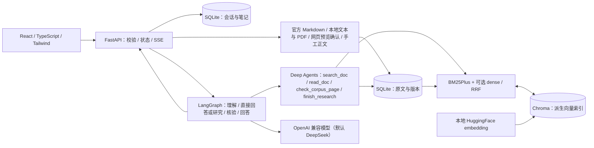
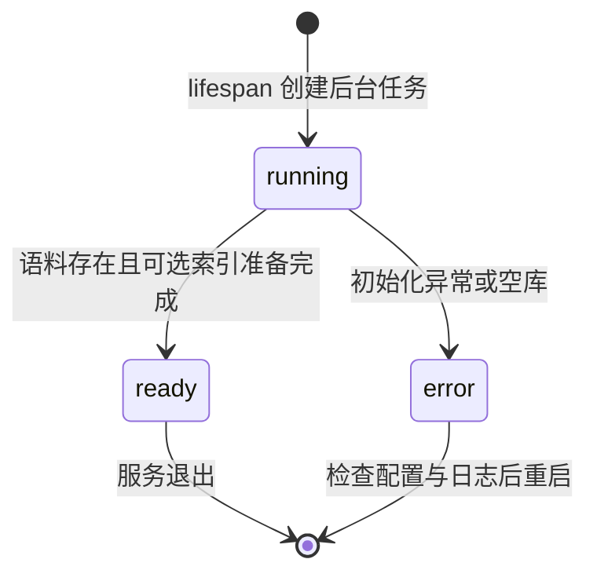
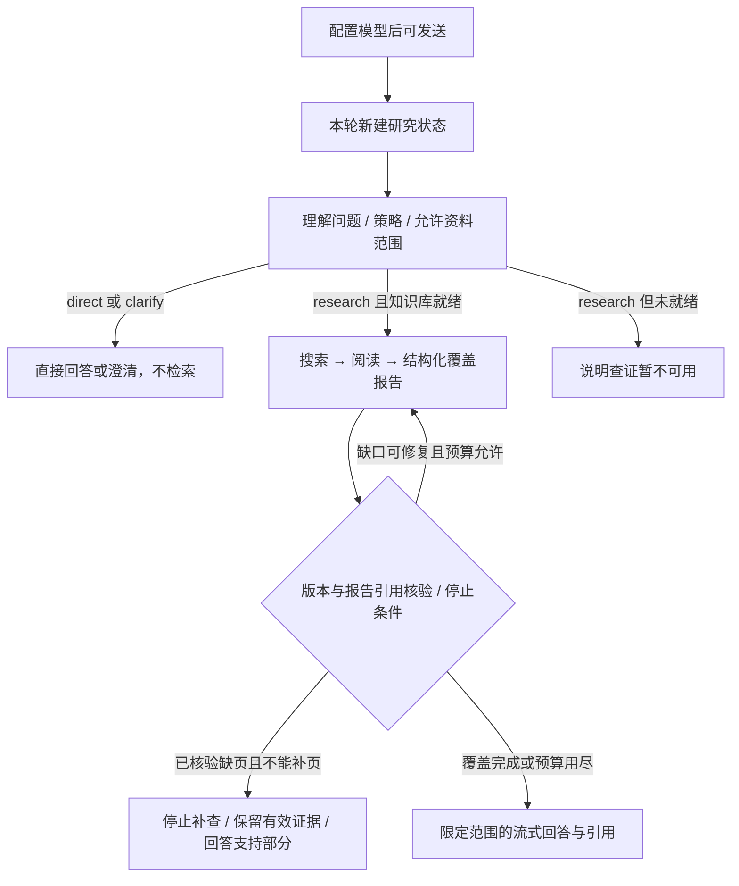

# dox_agent 总体设计（HLD）

- 更新日期：2026-09-21
- 依据：`src/main.py`、`src/agent/*.py`、`src/knowledge.py`、`src/dense.py`、`src/parsers.py`、`src/official_docs.py`、`src/workspace.py`、`launch.sh`、`frontend/src/*`。
- 范围：描述**当前已实现**的系统边界与工作流程。目标需求见 [`../demand.md`](../demand.md)。

## 1. 目标与非目标

目标：用户打开浏览器即可导入本地文档、提问、核对出处，并在需要时看到真实执行阶段；单用户、本地服务。

非目标（当前实现）：登录与账号、云端托管线程、多进程任务协调、多租户权限。启动默认只监听 `127.0.0.1`。

## 2. 系统边界

- SQLite 是可引用原文的事实来源；向量索引可重建，不能代替读取正文。
- 未配置 `EMBEDDING_PATH` 时只用 BM25，不加载 embedding。
- 语料来源包括公开官方 Markdown、本地 txt/md/PDF、网页快照与手工正文；**不含**科学基金历史报告（待需求实现）。

## 3. 模块职责

| 模块 | 输入 → 输出 | 职责边界 |
|---|---|---|
| `launch.sh` / `src/launcher.py` | 环境、端口、依赖签名 → 运行进程或明确退出 | uv 环境复用/创建；端口占用时提示而非杀进程；依赖签名来自 `pyproject.toml` |
| `src/main.py` | HTTP 请求 → JSON / SSE | 生命周期、输入校验、后台准备、导入锁、静态资源托管 |
| `src/parsers.py` | 文件 / URL → `Document` | UTF-8、LiteParse（PDF）、Crawl4AI / Firecrawl 网页；不含问答 |
| `src/official_docs.py` | 官方分区目录 → 逐页 Markdown 入库 | 限定 `docs.langchain.com` 与分区路径；四路并发；失败页保留旧数据 |
| `src/prepare_docs.py` | 启动前预下载官方文档 → 报告 | 复用已存在版本，跳过重复下载 |
| `src/knowledge.py` | `Document` / 查询 → 版本快照 / 检索定位 / 阅读证据 | SQLite 持久化、BM25Plus、行窗口、版本校验 |
| `src/dense.py` | 本地模型 + 片段 → 向量候选 | 模型懒加载、按文件签名隔离 collection、增量同步、RRF 融合 |
| `src/reading.py` | 正文 + 起始行 → 章节/代码块窗口 | 保留旧 300 字符逻辑行坐标；不拆分代码块；超预算明确省略 |
| `src/workspace.py` | 会话 / 笔记记录 → 持久化 | 独立 SQLite、revision 冲突 409、单记录 4MB、笔记来源版本校验 |
| `src/agent/config.py` | 环境变量 → `Settings` | 统一配置入口，`DOX_AGENT_ROOT` 定位仓库根 |
| `src/agent/models.py` | `Settings` → 模型 / tracing | OpenAI 兼容模型与可选 LangSmith，唯一替换点 |
| `src/agent/routing.py` | 选项、文档目录、知识库状态 → 生效策略 | 固定专业问答；资料范围解析与回答证据约束（不做自动分类） |
| `src/agent/graph.py` | 历史消息 → 策略、步骤、证据、答案 | `understand → direct / research → validate → answer → finish`；不负责 HTTP |
| `src/agent/evidence.py` | 研究报告 → 校验/合并/路由决策 | 交接契约；确定性核验，非语义裁判 |
| `src/agent/quick.py` | 单轮短问题 → 一次有界查证 | 覆盖不足时升级为完整研究，复用已有预算 |
| `src/agent/usage.py` | 模型回调 → 本轮用量账本 | 按 run 去重、缺失原因记录、为最终回答预留预算 |
| `frontend/src/*` | 健康 JSON / SSE → 页面状态 | 会话、流协议、设置、资料范围、导入、展示 |

## 4. 运行时状态

### 4.1 准备状态 `preparation`

- 启动发现已有 official 文档时复用，不自动全量更新；没有时尝试导入三个官方分区。
- 部分抓取失败但已有可用文档仍可 `ready`；空库不能 `ready`。
- 测试注入 `Knowledge` 时跳过启动准备（`preparation` 直接为 `ready`）。

### 4.2 官方更新任务 `official_job.status`

`idle → running → done | partial | error`。单进程内存任务，重启不续跑；运行中再次启动返回 409。

### 4.3 向量索引子状态 `index_progress`

`waiting → loading_model → indexing → ready`，附 `completed` / `total`。未配置 embedding 时为 `null`。

## 5. 工作流程

## 6. 稳定性边界

- HTTP 可用、检索就绪、模型可用是三个独立条件；健康接口不主动调用模型，密钥存在不等于密钥有效。
- 端口预检查不是端口预留，竞争仍可能由 Uvicorn 报错；端口被外部程序占用时本应用无法提供自己的错误页。
- 任务状态在内存，正文与向量在磁盘；仅支持一个写入进程，取消异步等待不能强制中断线程内的模型/embedding 计算。
- 更新失败保留旧正文；版本核验只证明证据快照一致，不证明答案语义正确。
- 本地 embedding 与索引均需实测，不以假模型单元测试替代。

## 7. 维护规则

系统边界或部署方式变化先改本文件；接口改 `API.md`；数据与状态改 `LLD.md`；每次开发后更新 [`../status.md`](../status.md) 与 [`../plan/plan.md`](../plan/plan.md)。不要把规划写成已实现。
